# Supplementary Materials for

# Methane emissions decreased in fossil fuel exploitation and sustainably increased in microbial source sectors during 1990–2020

Chandra, Naveen et al.

\*Corresponding author. Email: naveennegi@jamstec.go.jp; prabir@jamstec.go.jp

# This PDF file includes:

Supplementary Text Tables S1 to S2 Figs. S1 to S20

# Supplementary Notes

# 1. Corrections in the EDGAR’s ONG emissions over Prudhoe Bay for 1970-2010

The EDGARv6 inventory indicates that there was a consistent hotspot with exceptionally high emissions of $\mathrm { C H } _ { 4 }$ $( { \sim } 4 \mathrm { T g } )$ from 1970 to 2010 (Fig. S2a). However, this hotspot disappeared suddenly after 2010 (Fig. S2b). It is likely that these observations were artifacts, as the Barrow site, which is closer to the hotspot, did not show such a signal. When we used this emission data in the model, the simulations produced significant peaks and noise in $\mathrm { C H } _ { 4 }$ molar fraction from 1972 to 2010 at the Barrow site (Fig. S3). This suggests that artifacts may be in the emission hotspots over the Prudhoe Bay region. Therefore, we corrected the hotspot emissions for 1970-2010 by replacing the emissions over the Prudhoe Bay region with 2011 values. Additionally, we scaled the updated global total to the original value to maintain the same magnitude. These corrections significantly improved the simulations at the Barrow site, as shown in Fig. S3. It is worth noting that the $4 \mathrm { T g }$ difference in the NH total in the latitudinal gradient plot is not visible in Fig. S2b, due to the scaling of the corrected emission data to the original value.

# Supplementary Tables

Table S1: Sources and sinks of $\mathrm { C H } _ { 4 }$ for 1970-2020, and associated isotopic ratios and kinetic isotope effects (KIE) as used for the simulations of atmospheric $\delta ^ { 1 3 } \mathrm { C - C H } _ { 4 }$ , and $\delta \mathrm { D - C H } _ { 4 }$ in the base scenario $\mathrm { ( E _ { 0 } ) }$ . For the baseline simulations, we used the global mean source signatures. The KIEs values for the respective sink processes are given at temperature $\mathrm { T } { = } 2 9 6 \mathrm { K }$ . Temperature dependencies of the KIEs are accounted for in the model simulations. The mean global total and $\pm 1 \sigma$ standard deviations are given for 1985-2020 for the baseline simulations. The numbers in blue color inside the bracket for fugitive fossil fuel sectors are the most likely emissions constrain by isotope simulations in this study.

<table><tr><td colspan="1" rowspan="1">Source</td><td colspan="1" rowspan="1">Subcategory</td><td colspan="1" rowspan="1">Data source</td><td colspan="1" rowspan="1">Global total(TgCH4 yr1)(1985-2020)(most likely)</td><td colspan="1" rowspan="1">813C-CH4(%0)</td><td colspan="1" rowspan="1">SD-CH4(%0)</td><td colspan="1" rowspan="1">Time/Spatialresolution</td></tr><tr><td colspan="1" rowspan="3">FossilFuel (FF)</td><td colspan="1" rowspan="1">Coal</td><td colspan="1" rowspan="2">EDGARv6;revised*</td><td colspan="1" rowspan="1">30±6(27±3)</td><td colspan="1" rowspan="1">-351.2</td><td colspan="1" rowspan="1">-2323</td><td colspan="1" rowspan="1">Monthly, IAV /0.1x0.1°</td></tr><tr><td colspan="1" rowspan="1">Oil and gas(ONG)</td><td colspan="1" rowspan="1">70±11(80±6)</td><td colspan="1" rowspan="1">-44.02.3</td><td colspan="1" rowspan="1">-1943</td><td colspan="1" rowspan="1">-194°</td></tr><tr><td colspan="1" rowspan="1">Geological</td><td colspan="1" rowspan="1">Etiope eta1.4</td><td colspan="1" rowspan="1">37.9(19)</td><td colspan="1" rowspan="1">-49.44</td><td colspan="1" rowspan="1">-2002</td><td colspan="1" rowspan="1"> Annual,Cyclostationary/1x1°</td></tr><tr><td colspan="1" rowspan="1">Biomassandbiofuelburning(BB)</td><td colspan="1" rowspan="1">Biomassburning</td><td colspan="1" rowspan="1">GFEDv4.0+AWB +GISS +RCO</td><td colspan="1" rowspan="1">34±4</td><td colspan="1" rowspan="1">-26.23</td><td colspan="1" rowspan="1">-2113</td><td colspan="1" rowspan="1">Monthly,IAV/1x1°</td></tr><tr><td colspan="1" rowspan="4">Microbial</td><td colspan="1" rowspan="1">Wetlands</td><td colspan="1" rowspan="1">VISIT</td><td colspan="1" rowspan="1">162±6</td><td colspan="1" rowspan="1">-61.35</td><td colspan="1" rowspan="1">-3223</td><td colspan="1" rowspan="1">Monthly, IAV /0.5°x0.5°</td></tr><tr><td colspan="1" rowspan="1">Rice</td><td colspan="1" rowspan="1"></td><td colspan="1" rowspan="1">34±3</td><td colspan="1" rowspan="1">-62.23</td><td colspan="1" rowspan="1">-3233</td><td colspan="1" rowspan="1">-323℃</td></tr><tr><td colspan="1" rowspan="1">ENF &amp;MNM</td><td colspan="1" rowspan="2">EDGARv6</td><td colspan="1" rowspan="1">109±8</td><td colspan="1" rowspan="1">-65.43</td><td colspan="1" rowspan="1">-3163</td><td colspan="1" rowspan="1">Monthly, IAV /0.1x0.1°</td></tr><tr><td colspan="1" rowspan="1">Waste dump&amp; Landfills</td><td colspan="1" rowspan="1">66±9</td><td colspan="1" rowspan="1">-55.01</td><td colspan="1" rowspan="1">-2983</td><td colspan="1" rowspan="1">-298</td></tr><tr><td colspan="1" rowspan="1"></td><td colspan="1" rowspan="1">Termites</td><td colspan="1" rowspan="1">GCP,2020</td><td colspan="1" rowspan="1">17</td><td colspan="1" rowspan="1">-63.43</td><td colspan="1" rowspan="1">-3433</td><td colspan="1" rowspan="1">Annual,Cyclostationary/1x1°</td></tr><tr><td colspan="1" rowspan="1">Ocean</td><td colspan="1" rowspan="1"></td><td colspan="1" rowspan="1">Weber etal.9</td><td colspan="1" rowspan="1">14</td><td colspan="1" rowspan="1">-591</td><td colspan="1" rowspan="1">-220²</td><td colspan="1" rowspan="1">Monthly,Cyclostationary</td></tr><tr><td colspan="7" rowspan="1">Loss fields and their Kinetic Isotope Effects (KIE) used in forward simulations of atmospheric13C-CH4 (KIEC)and D-CH4 (KIED). The control 13C-CH4 simulations (shown in Fig.2) are basedon the average KIEC value for OH (KIECoH : (1.00546+ 1.00397)/2 = 1.00465) from two different studies67 (same as done in Fujita et al.8). Individual KIEs are further used for sensitivity analysis(Fig. 4).</td></tr><tr><td colspan="2" rowspan="1">Reactions</td><td colspan="2" rowspan="1">Data source</td><td colspan="1" rowspan="1">KIEC</td><td colspan="1" rowspan="1">KIED</td><td colspan="1" rowspan="1">Time resolutions</td></tr><tr><td colspan="2" rowspan="1">CH4 + OH</td><td colspan="2" rowspan="1">Spivakovsky et al.9; Patra et al.10,</td><td colspan="1" rowspan="1">1.00465</td><td colspan="1" rowspan="1">1.286 11</td><td colspan="1" rowspan="1">Monthly,Cyclostationary</td></tr><tr><td colspan="2" rowspan="1">CH4 + Cl</td><td colspan="2" rowspan="1">Takigawa et al.12</td><td colspan="1" rowspan="1">1.06613</td><td colspan="1" rowspan="1">1.52013</td><td colspan="1" rowspan="1">Monthly,Cyclostationary</td></tr><tr><td colspan="2" rowspan="1">CH4 + O (1D)</td><td colspan="2" rowspan="1">Takigawa et al. 12</td><td colspan="1" rowspan="1">1.0137</td><td colspan="1" rowspan="1">1.067</td><td colspan="1" rowspan="1">Monthly,Cyclostationart</td></tr><tr><td colspan="2" rowspan="1">Soil Oxidation</td><td colspan="2" rowspan="1">VISIT 14</td><td colspan="1" rowspan="1">1.020115</td><td colspan="1" rowspan="1">1.08315</td><td colspan="1" rowspan="1">Monthly</td></tr></table>

$\ast _ { \mathrm { W e } }$ revised a hotspot emission from Prudhoe Bay (Fig. S2), Alaska, for the period 1971-2010 based on the model-observation comparison (Fig. S3, details in Supplementary text).

Table S2. Sensitivity scenarios (shown in Fig. S14, S15), in addition to scenarios discussed in main Table 1. We have shown only those sectors, which are mainly changed for different scenarios. The source signatures are in per mil $( \text{‰}$   

<table><tr><td rowspan=1 colspan=1></td><td rowspan=1 colspan=1>Coal</td><td rowspan=1 colspan=1>ONG</td><td rowspan=1 colspan=1>Geological</td><td rowspan=1 colspan=1>Wetland</td><td rowspan=1 colspan=1>ENF&amp;MNM</td><td rowspan=1 colspan=1>BiomassBurning</td></tr><tr><td rowspan=1 colspan=1>E3_const</td><td rowspan=1 colspan=1>-35</td><td rowspan=1 colspan=1>-44</td><td rowspan=1 colspan=1>-49.4</td><td rowspan=1 colspan=1>-61.3</td><td rowspan=1 colspan=1>-65.4</td><td rowspan=1 colspan=1>-26.2</td></tr><tr><td rowspan=1 colspan=1>Scoal</td><td rowspan=1 colspan=1>-44.6</td><td rowspan=1 colspan=1></td><td rowspan=1 colspan=1></td><td rowspan=1 colspan=1></td><td rowspan=1 colspan=1></td><td rowspan=1 colspan=1></td></tr><tr><td rowspan=1 colspan=1>Mcoal</td><td rowspan=1 colspan=1>Map</td><td rowspan=1 colspan=1></td><td rowspan=1 colspan=1></td><td rowspan=1 colspan=1></td><td rowspan=1 colspan=1></td><td rowspan=1 colspan=1></td></tr><tr><td rowspan=1 colspan=1>Mong</td><td rowspan=1 colspan=1></td><td rowspan=1 colspan=1>Map</td><td rowspan=1 colspan=1></td><td rowspan=1 colspan=1></td><td rowspan=1 colspan=1></td><td rowspan=1 colspan=1></td></tr><tr><td rowspan=1 colspan=1>Mwetl</td><td rowspan=1 colspan=1></td><td rowspan=1 colspan=1></td><td rowspan=1 colspan=1></td><td rowspan=1 colspan=1>Map</td><td rowspan=1 colspan=1></td><td rowspan=1 colspan=1></td></tr><tr><td rowspan=1 colspan=1>Menf</td><td rowspan=1 colspan=1></td><td rowspan=1 colspan=1></td><td rowspan=1 colspan=1></td><td rowspan=1 colspan=1></td><td rowspan=1 colspan=1>Map</td><td rowspan=1 colspan=1></td></tr><tr><td rowspan=1 colspan=1>Mbb</td><td rowspan=1 colspan=1></td><td rowspan=1 colspan=1></td><td rowspan=1 colspan=1></td><td rowspan=1 colspan=1></td><td rowspan=1 colspan=1></td><td rowspan=1 colspan=1>Map</td></tr><tr><td rowspan=1 colspan=1>M</td><td rowspan=1 colspan=1>Map</td><td rowspan=1 colspan=1></td><td rowspan=1 colspan=1></td><td rowspan=1 colspan=1>Map</td><td rowspan=1 colspan=1></td><td rowspan=1 colspan=1>Map</td></tr><tr><td rowspan=1 colspan=1>M5_Hgeol</td><td rowspan=1 colspan=1>Map</td><td rowspan=1 colspan=1>Map</td><td rowspan=1 colspan=1>-40</td><td rowspan=1 colspan=1>Map</td><td rowspan=1 colspan=1>Map</td><td rowspan=1 colspan=1>Map</td></tr><tr><td rowspan=1 colspan=1>M4_Hgeol-og</td><td rowspan=1 colspan=1>Map</td><td rowspan=1 colspan=1>-40</td><td rowspan=1 colspan=1>-40</td><td rowspan=1 colspan=1>Map</td><td rowspan=1 colspan=1>Map</td><td rowspan=1 colspan=1>Map</td></tr><tr><td rowspan=1 colspan=1>M3s_Hgeol-og_Scoal</td><td rowspan=1 colspan=1>-44.6</td><td rowspan=1 colspan=1>-40</td><td rowspan=1 colspan=1>-40</td><td rowspan=1 colspan=1>Map</td><td rowspan=1 colspan=1>Map</td><td rowspan=1 colspan=1>Map</td></tr><tr><td rowspan=1 colspan=1>M3_Hgeol</td><td rowspan=1 colspan=1>Coal</td><td rowspan=1 colspan=1></td><td rowspan=1 colspan=1>-40</td><td rowspan=1 colspan=1>Coal</td><td rowspan=1 colspan=1></td><td rowspan=1 colspan=1>Coal</td></tr></table>

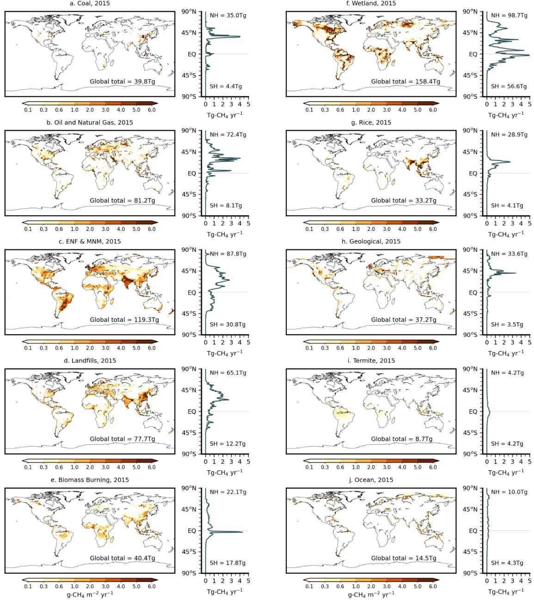  
Fig. S1. The global and latitudinal distribution of annual $\mathrm { C H } _ { 4 }$ emissions from 10 sectors are shown for 2015.

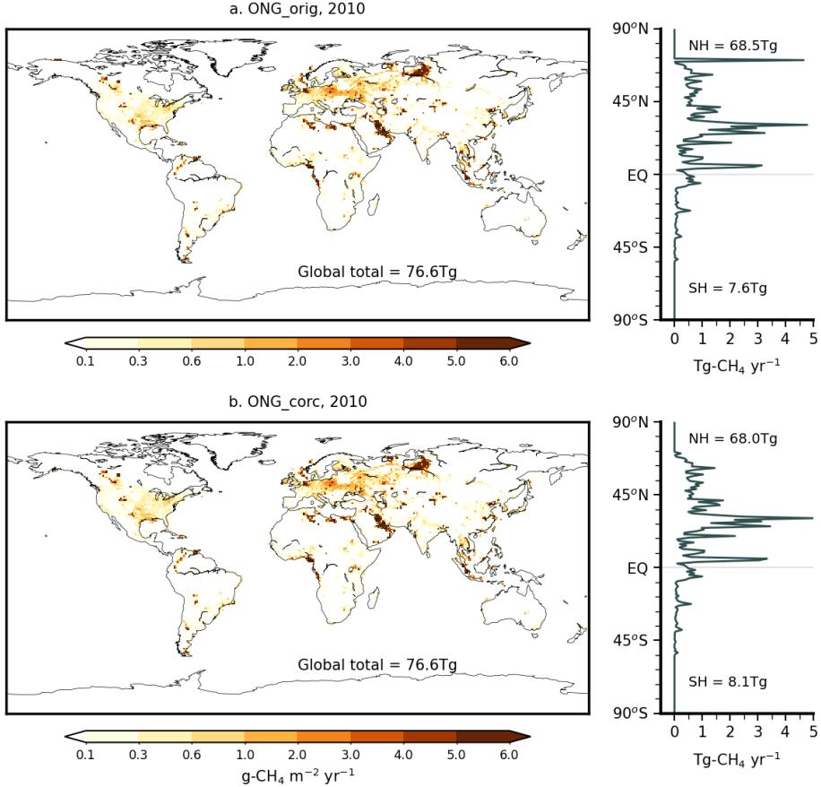  
Fig. S2. The spatial and latitudinal distribution of $\mathrm { C H } _ { 4 }$ emissions from original (a) and corrected (b) ONG source for Prudhoe Bay for 2010. To keep the same global total, the magnitude of corrected ONG emission is scaled to the original one. This is an example; similar features consistently appear from 1970 to 2009.

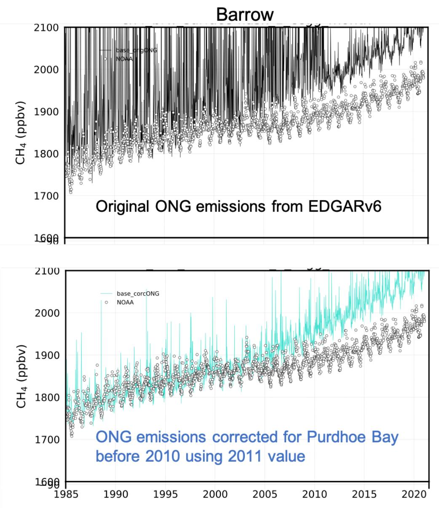  
Fig. S3. Validating the correction in ONG emission peaks over Prudhoe Bay before 2011 using measurements over a nearer site, Barrow. The upper panel displays simulations over Barrow, with the peak (shown in Fig. S2a), while the lower panel shows simulations after the correction (shown in Fig. S2b). The high peaks in the upper panel simulations disappeared after the correction in the lower panel, suggesting that they were artifacts.

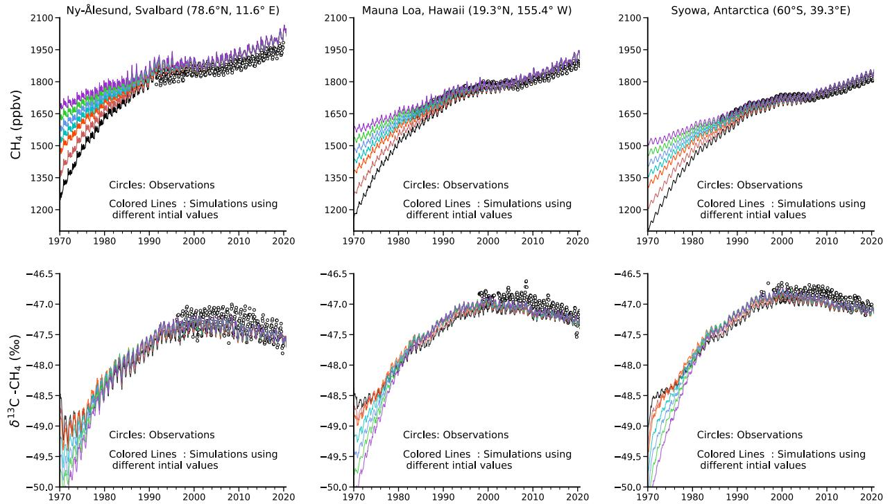

Fig. S4. Sensitivity test for different initial values used for model simulations. Solid lines correspond to simulations using different initial values for $\mathrm { C H } _ { 4 }$ (range $\sim 1 3 5 0 \pm 1 5 0 \mathrm { p p t }$ at Syowa station) and $\delta ^ { 1 3 } \mathrm { C - C H } _ { 4 }$ (range $- 4 9 . 5 \pm 0 . 7 \mathrm { \ \% } 0$ at Syowa station). The $\mathrm { C H } _ { 4 }$ simulations converged to less than a $5 \%$ difference from its initial values, while $\delta ^ { 1 3 } \mathrm { C - C H } _ { 4 }$ simulations converged at ${ \sim } 0 . 0 2 \text{‰}$ difference, which are small enough to have negligible impact on their long-term trend analysis. These sensitivity tests illustrate that the restart values have negligible influence on our analysis results.

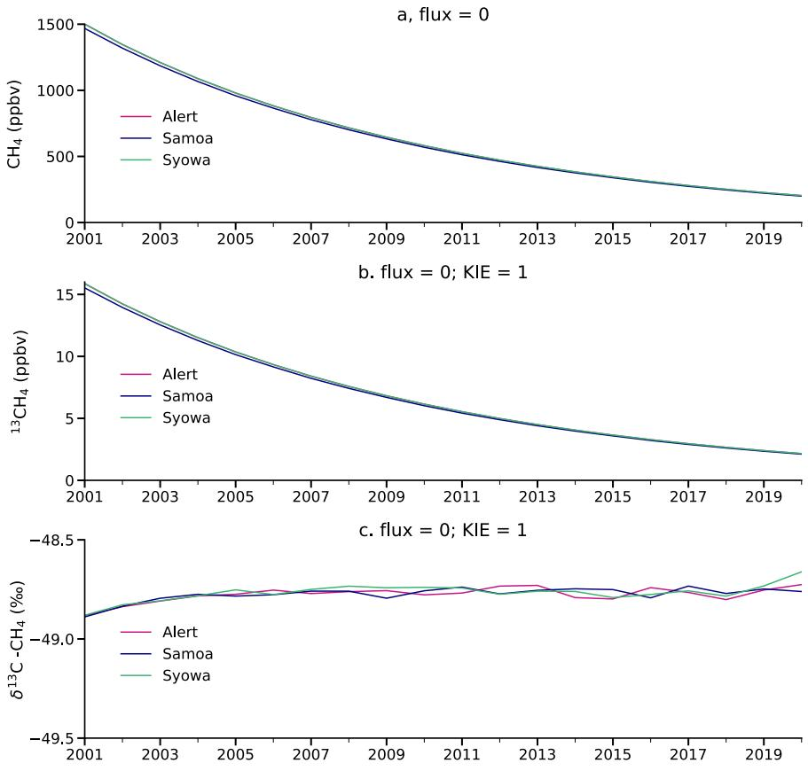

Fig. S5. Checking the tracer mass conservation capability of MIROC4-ACTM in simulating $\delta ^ { 1 3 } \mathrm { C } \mathrm { . }$ $\mathbf { C H _ { 4 } }$ . To assess the tracer mass conservation capability of MIROC4-ACTM in simulating $\delta ^ { 1 3 } \mathrm { C - C H } _ { 4 }$ , we conducted a test by disabling fractionation $\mathrm { K I E } { = } 1$ ) and emissions $\mathrm { f l u x } = 0$ ) starting from January 1, 2000. The simulations were run for 21 years (2000-2020). Notably, consistent $\delta ^ { 1 3 } \mathrm { C - C H } _ { 4 }$ values across different sites (shown in panel $" \mathrm { c } "$ ) after disabling sink fractionation and emissions indicate that the drift in tracer mass is negligible when simulating $\delta ^ { 1 3 } \mathrm { C - C H } _ { 4 }$ in MIROC4-ACTM for trend analysis purposes.

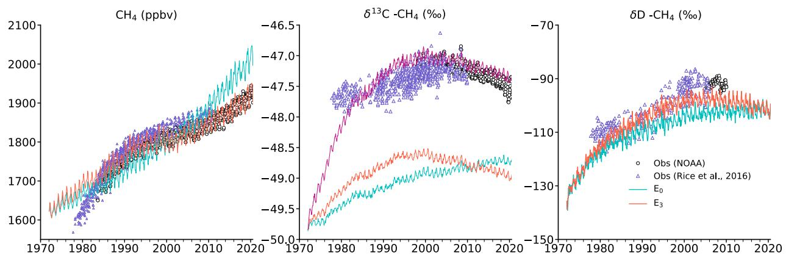  
Fig. S6. Modelled $\mathrm { C H } _ { 4 }$ , $\delta ^ { 1 3 } \mathrm { C - C H } _ { 4 }$ , and $\delta \mathrm { D - C H } _ { 4 }$ over Niwot Ridge, Colorado from different emissions scenarios. The data from Rice et al.16 (triangles) are also shown to check the evolution of long-term simulations.

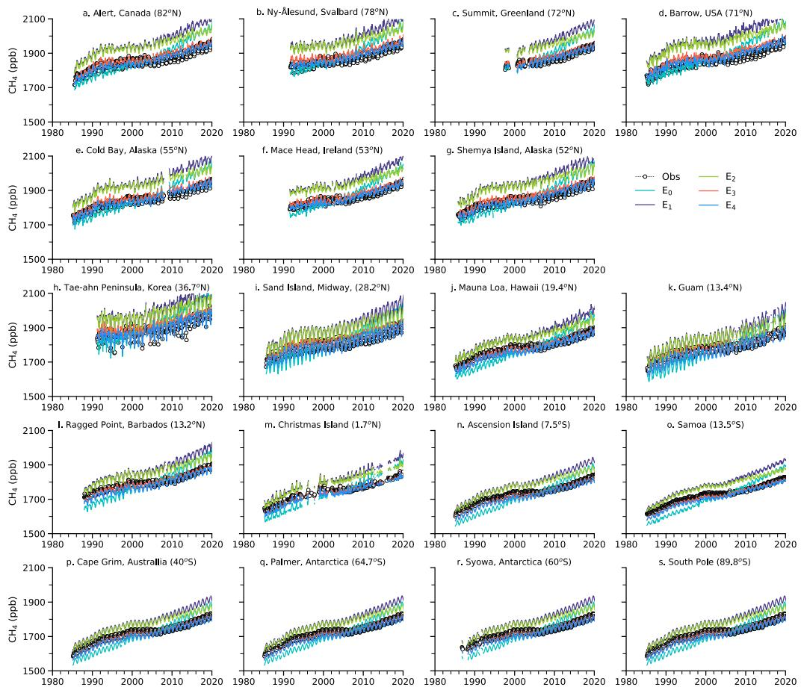  
Fig. S7. Comparison of observed and simulated $\mathrm { C H } _ { 4 }$ , based on different scenarios as discussed in Table. 1, over different sites used for calculating sub-hemispheric mean over northern high latitudes (a-g), tropics (h-o), and southern high latitudes (p-s) as shown in Fig. 2.

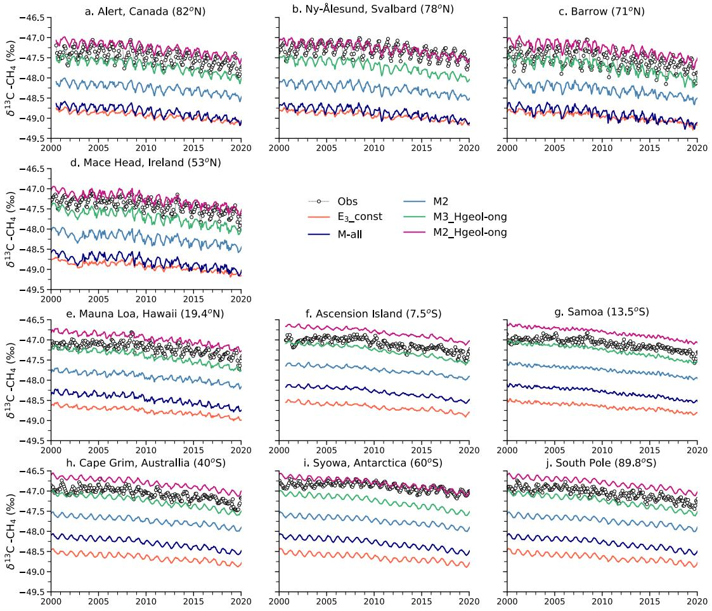  
Fig. S8. Modelled (based on HKIEOH) and observed $\delta ^ { 1 3 } \mathrm { C - C H } _ { 4 }$ over different sites used for calculating mean over northern high latitudes (a-d), tropics (e-g), and southern high latitudes (h-j).

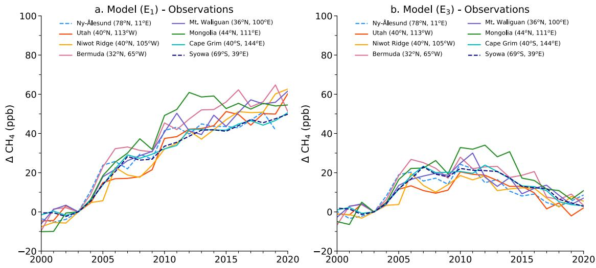  
Fig. S9. Difference between observations and simulations based on base (a. E1 ) and $\mathrm { E } _ { 3 }$ (panel “b”) emission scenarios over different sites. The differences are adjusted at zero for the value of 2003 to clearly visualize the trend. Removing the unconventional gas emission over the USA and scaling coal emissions over China in a sensitivity $\mathrm { E } _ { 3 }$ emission scenario help to reduce the model and observations mismatch. The background stations are shown by the dashed lines.

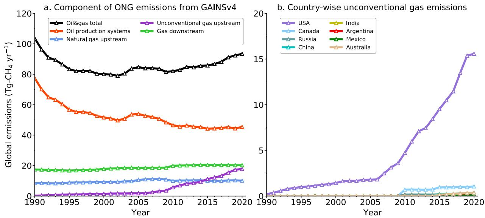  
Fig S10. (a). The temporal variability in different sectors contributing to total ONG emissions based on GAINSv4 estimate. (b) Changes of unconventional gas emissions over dominating countries. The mainland USA shares about $90 \%$ of total unconventional gas production emissions in the World. There are some also in Canada and China, but otherwise minimal amounts in the rest of the World.

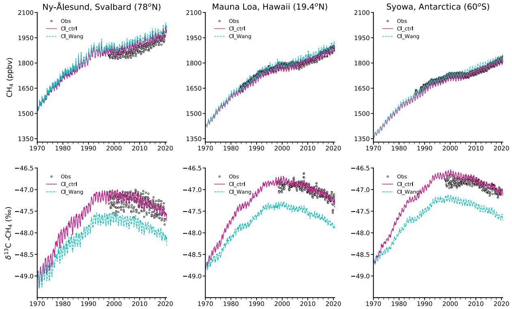  
Fig. S11. Comparison between observations and simulations based on control chlorine field (Cl_ctrl; Takigawa et al.12) and Wang et al.17 (Cl_wang) Cl field. Both simulations use the $\mathrm { E } _ { 3 }$ emission field (Fig. 3 and Table 1) and M2_Hgeol-ong source signature (Fig. 4 and Table 1). The H-KIEOH value (1.0054) is used for $\delta ^ { 1 3 } \mathrm { C - C H } _ { 4 }$ simulations (detail in Fig. 4). Both Cl files show the offset of $\sim 0 . 6 \text{‰}$ in $\delta ^ { 1 3 } \mathrm { C - C H } _ { 4 }$ simulations, but the trends remained unchanged. These sensitivity tests had a relatively low impact on $\mathrm { C H } _ { 4 }$ simulations.

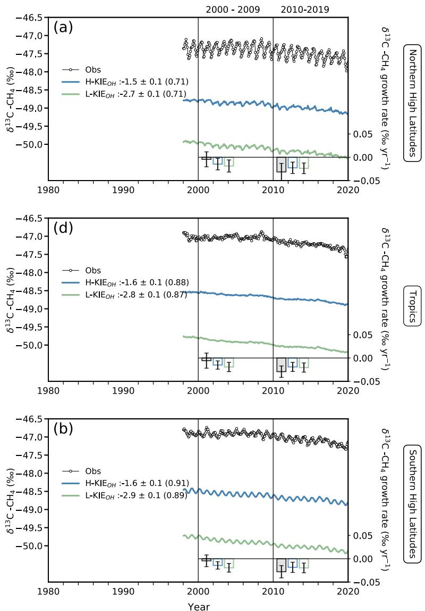

Fig S12. Role of $\bf { K I E _ { O H } }$ (for OH) in simulating the atmospheric $\delta ^ { 1 3 } \mathrm { C - C H } _ { 4 }$ . Both simulations uses the most plausible emission scenario $\mathrm { E } _ { 3 }$ , the global invariant signature of $\delta ^ { 1 3 } \mathrm { C }$ (same as in Fig.2 of main text), but different KIEOH values based on Cantrell et al.6 (1.0054: HKIEOH) and Saueressig et al.7 (1.0039: $\mathrm { L K I E _ { O H _ { \ell } } }$ . The average bias $( \pm 1 \sigma )$ and correlation coefficients (obs vs model) for different simulation cases are shown in the legends. The mean and $\pm 1 \sigma$ (standard deviations) growth rates (bars) for 2000-2009 and 2010 – 2019 are shown as a bar in each panel. The time series are based on an average of atmospheric $\delta ^ { 1 3 } \mathrm { C } .$ - $\mathrm { C H } _ { 4 }$ measurements and corresponding simulations from multiple stations in the marine boundary layer of three respective latitude bands shown in main Fig. 1. The simulations based on both KIEOH show a difference of $1 . 2 \text{‰}$ , however, no large difference is observed in the growth rate.

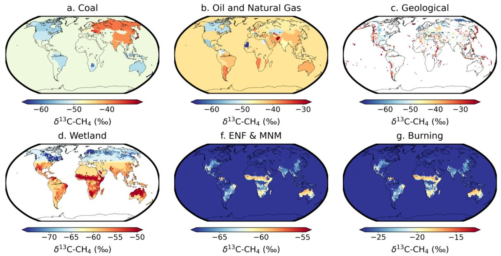  
Fig. S13. Source signature maps for six different sectors are used for simulations of $\delta ^ { 1 3 } \mathrm { C - C H } _ { 4 }$ . The $\delta ^ { 1 3 } \mathrm { C }$ source signatures maps based on the Global $\delta ^ { 1 3 } \mathrm { C }$ Source Signature Inventory 2020 for coal, oil and gas (ONG), biomass and biofuel burning, ruminant and wild animal sources18, spatial maps for wetland sources19, and geological seeps 4 .

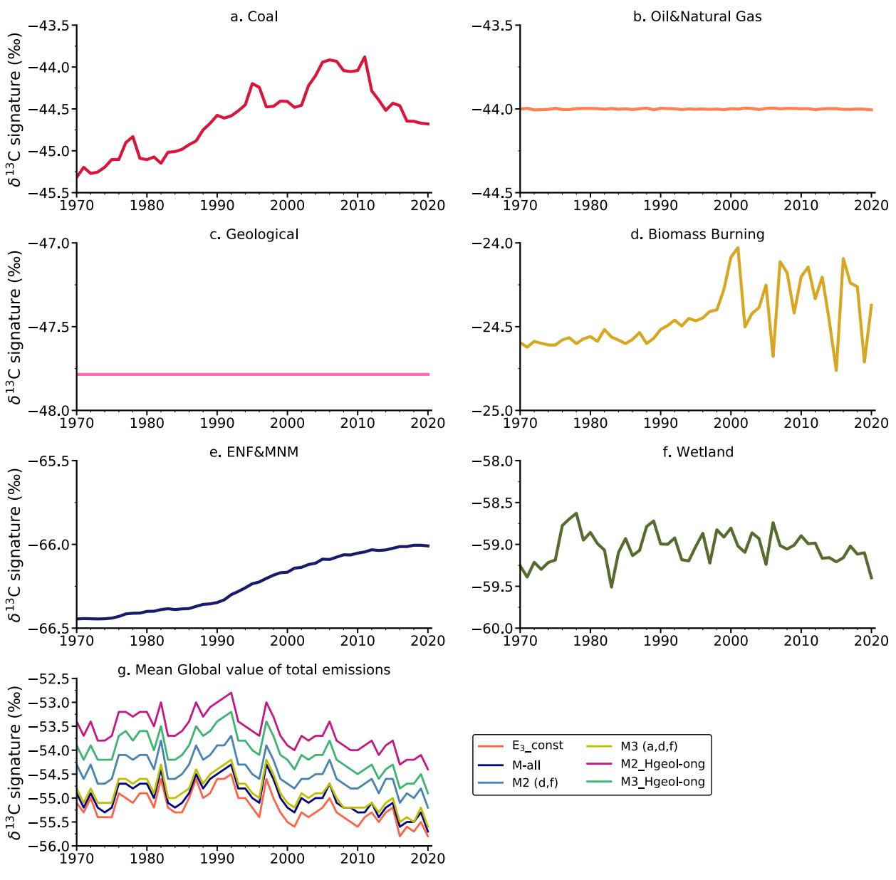

Fig. S14. Emission-weighted global mean source signatures. Trend in global mean source signatures, using geographical isotopic variations (indicated by “Map” in Table 1) weighted by gridded emissions from $\mathrm { E } _ { 3 }$ scenario, throughout the simulation period. Please note that the global mean signatures using geographical source signatures are different from the global invariant source signature (“E3_const”), used in Fig.2. Time series of the isotopic signature of total $\mathrm { C H } _ { 4 }$ emissions using different combinations of source signature, as discussed in main Fig. 4, under common emissions $\mathrm { E } _ { 3 }$ , is shown in "g" (Refer to Table 1 for more details).

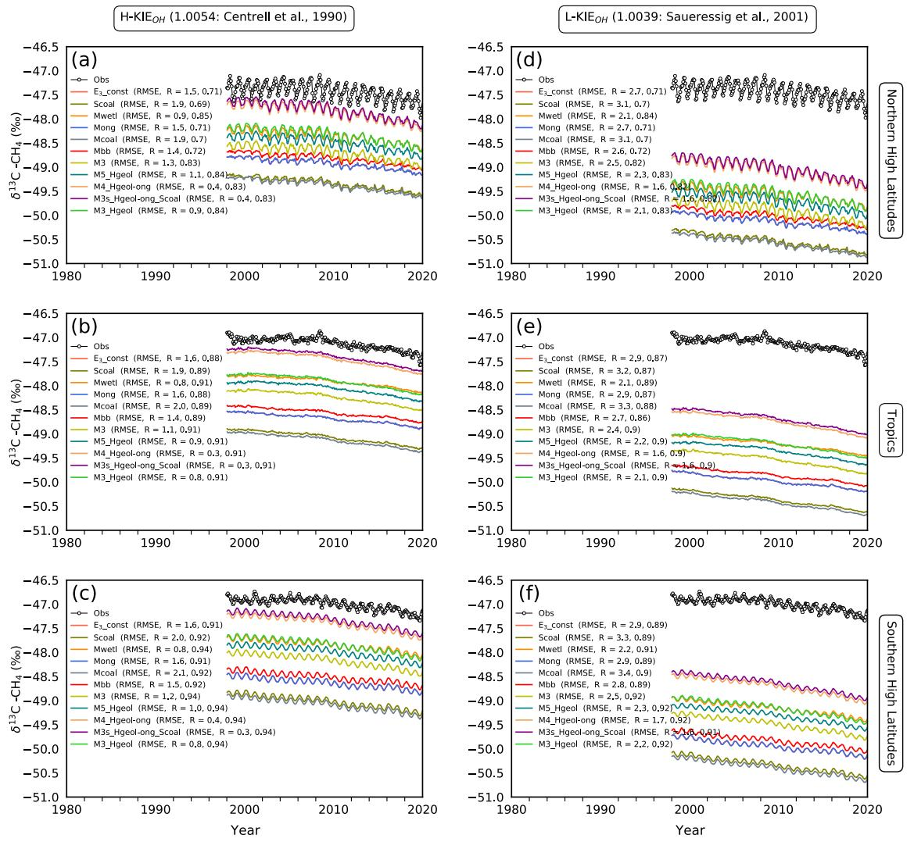  
Fig. S15. Same as Fig.4 in the main text, but for remaining sensitivity simulation cases.

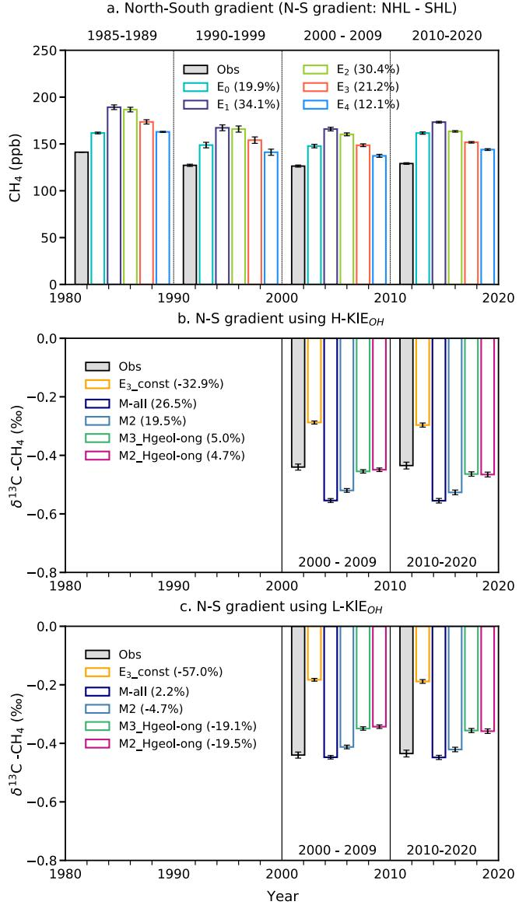  
Fig. S16. North-South (N-S) gradient for $\mathrm { C H } _ { 4 }$ and using different scenarios (Details in Table. 1). The numbers shown in the legends are the percentage differences from the observations. Positive values represent the overestimation, while negative represent the underestimation. The simulations in the “b” and “c” columns are based on $\mathrm { E } _ { 3 }$ emissions and source signatures, but different KIEOH values.

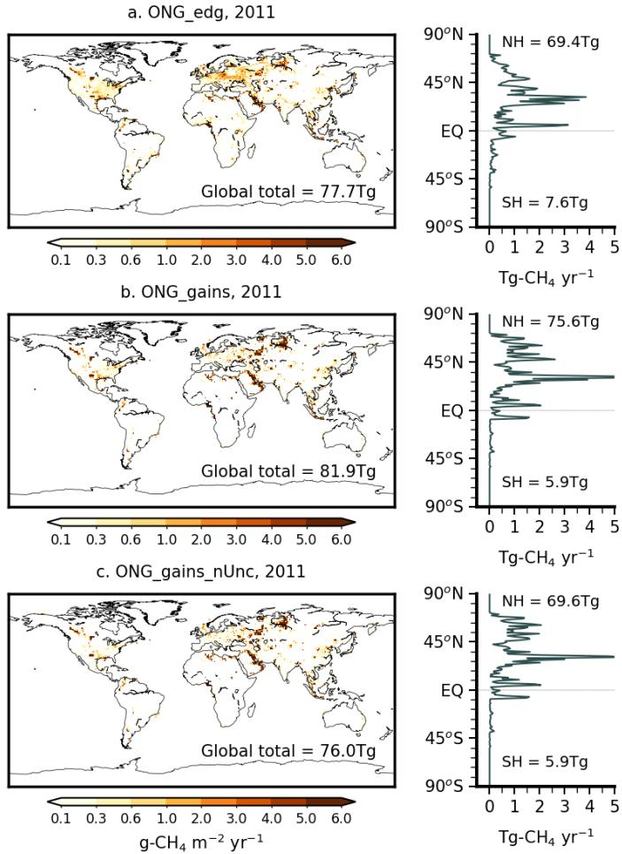  
Fig. S17. Spatial and latitudinal distribution of ONG emissions using (a) EDGARv6, (b) GAINSv4, (c) and GAINSv4 without unconventional emissions. The GAINS emissions are high in the northern High latitudes.

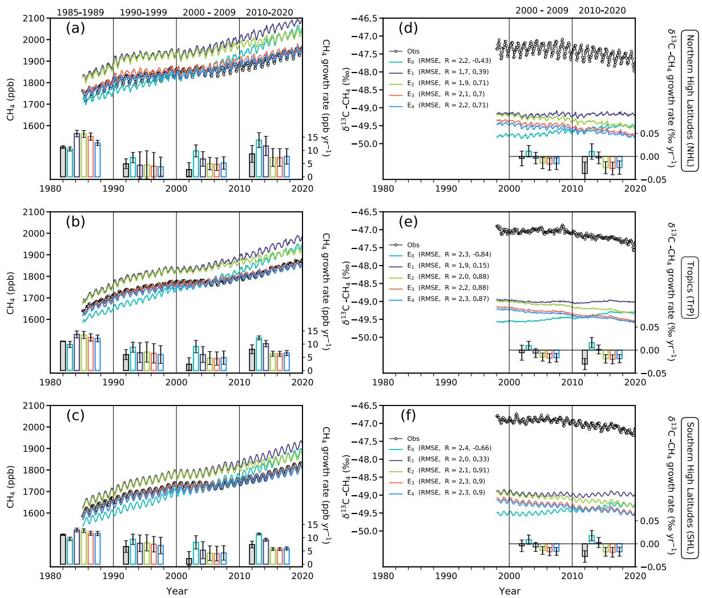  
Fig. S18. Same as Fig.2 in the main text, but including all the emission sensitivity simulations.

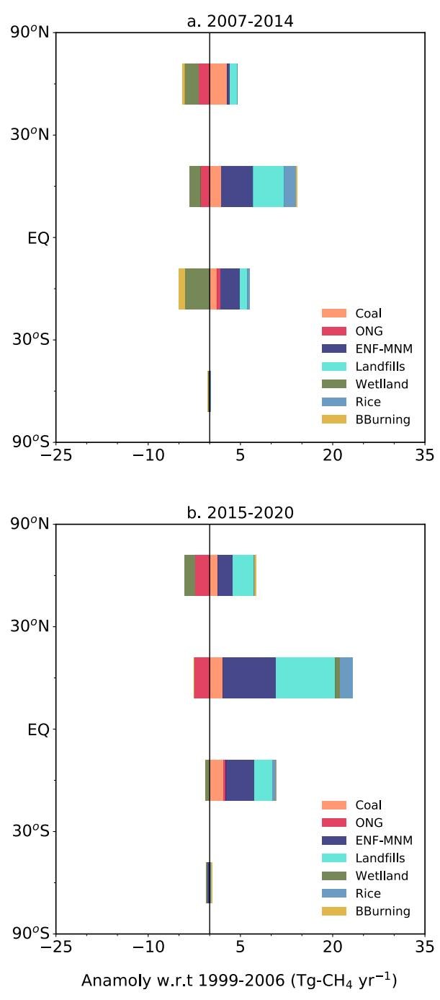  
Fig. S19. Change in $\mathrm { C H } _ { 4 }$ emissions (based on the most plausible $\mathrm { E } _ { 3 }$ scenario) from individual sectors with respect to 1999-2006 for two different periods at distinct latitude bands.

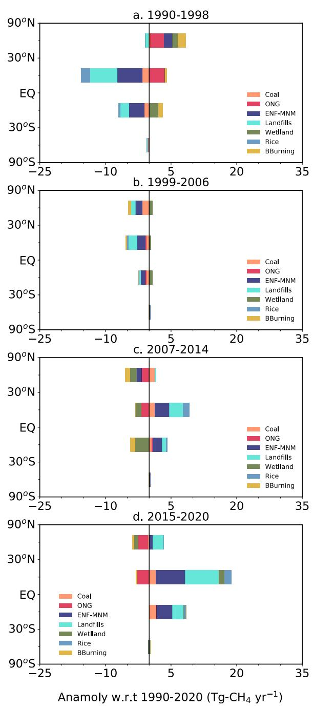  
Fig. S20. Change in $\mathrm { C H } _ { 4 }$ emissions (based on the most plausible $\mathrm { E } _ { 3 }$ scenario) from individual sectors with respect to 1990-2020 at distinct latitude bands.

# Supplementary References

1. Monteil, G. et al. Interpreting methane variations in the past two decades using measurements of $\mathrm { C H } _ { 4 }$ mixing ratio and isotopic composition. Atmospheric Chemistry and Physics 11, 9141–9153 (2011).

2. Whiticar, M. & Schaefer, H. Constraining past global tropospheric methane budgets with carbon and hydrogen isotope ratios in ice. Philosophical Transactions of the Royal Society A: Mathematical, Physical and Engineering Sciences 365, 1793–1828 (2007).   
3. Sherwood, O. A., Schwietzke, S., Arling, V. A. & Etiope, G. Global Inventory of Gas Geochemistry Data from Fossil Fuel, Microbial and Burning Sources, version 2017. Earth System Science Data 9,   
639–656 (2017).   
4. Etiope, G., Ciotoli, G., Schwietzke, S. & Schoell, M. Gridded maps of geological methane emissions and their isotopic signature. Earth System Science Data 11, 1–22 (2019).   
5. Oh, Y. et al. Improved global wetland carbon isotopic signatures support post-2006 microbial methane emission increase. Commun Earth Environ 3, 1–12 (2022).   
6. Cantrell, C. A. et al. Carbon kinetic isotope effect in the oxidation of methane by the hydroxyl radical. Journal of Geophysical Research: Atmospheres 95, 22455–22462 (1990).   
7. Saueressig, G. et al. Carbon 13 and D kinetic isotope effects in the reactions of CH4 with O(1 D) and OH: New laboratory measurements and their implications for the isotopic composition of stratospheric methane. Journal of Geophysical Research: Atmospheres 106, 23127–23138 (2001).   
8. Fujita, R. et al. Global and Regional CH4 Emissions for 1995–2013 Derived From Atmospheric CH4, δ13C-CH4, and δD-CH4 Observations and a Chemical Transport Model. Journal of Geophysical Research: Atmospheres 125, e2020JD032903 (2020).   
9. Spivakovsky, C. M. et al. Three-dimensional climatological distribution of tropospheric OH: Update and evaluation. Journal of Geophysical Research: Atmospheres 105, 8931–8980 (2000).   
10. Patra, P. K. et al. Observational evidence for interhemispheric hydroxyl-radical parity. Nature 513,   
219–223 (2014).   
11. Gierczak, T., Talukdar, R. K., Herndon, S. C., Vaghjiani, G. L. & Ravishankara, A. R. Rate Coefficients for the Reactions of Hydroxyl Radicals with Methane and Deuterated Methanes. J. Phys. Chem. A 101, 3125–3134 (1997).

12. Takigawa, M., Takahashi, M. & Akiyoshi, H. Simulation of ozone and other chemical species using a Center for Climate System Research/National Institute for Environmental Studies atmospheric GCM with coupled stratospheric chemistry. Journal of Geophysical Research: Atmospheres 104, 14003– 14018 (1999).

13. Saueressig, G., Bergamaschi, P., Crowley, J. N., Fischer, H. & Harris, G. W. Carbon kinetic isotope effect in the reaction of CH4 with Cl atoms. Geophysical Research Letters 22, 1225–1228 (1995).

14. Ito, A., Patra, P. K. & Umezawa, T. Bottom-Up Evaluation of the Methane Budget in Asia and Its Subregions. Global Biogeochemical Cycles 37, e2023GB007723 (2023).

15. Snover, A. K. & Quay, P. D. Hydrogen and carbon kinetic isotope effects during soil uptake of atmospheric methane. Global Biogeochemical Cycles 14, 25–39 (2000).

16. Rice, A. L. et al. Atmospheric methane isotopic record favors fossil sources flat in 1980s and 1990s with recent increase. Proceedings of the National Academy of Sciences 113, 10791–10796 (2016).

17. Wang, X. et al. The role of chlorine in global tropospheric chemistry. Atmospheric Chemistry and Physics 19, 3981–4003 (2019).

18. Lan, X. et al. Improved constraints on global methane emissions and sinks using δ13C-CH4. Global Biogeochemical Cycles 35, e2021GB007000 (2021).

19. Ganesan, A. L. et al. Spatially Resolved Isotopic Source Signatures of Wetland Methane Emissions. Geophysical Research Letters 45, 3737–3745 (2018).