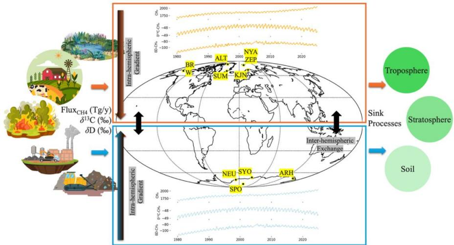
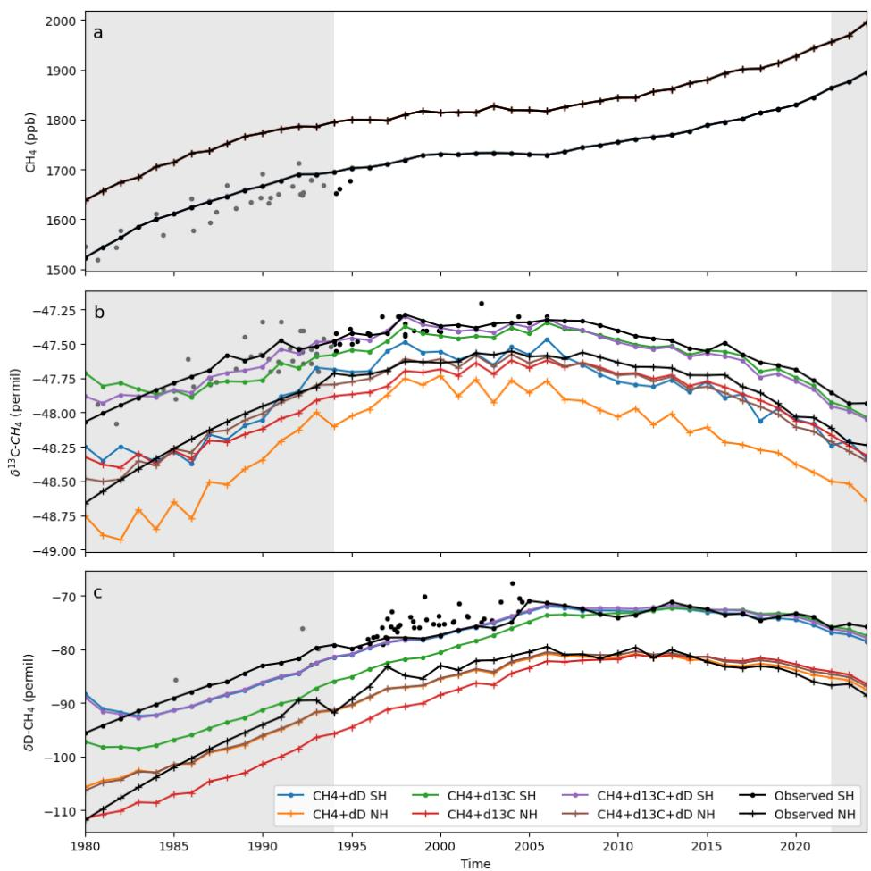
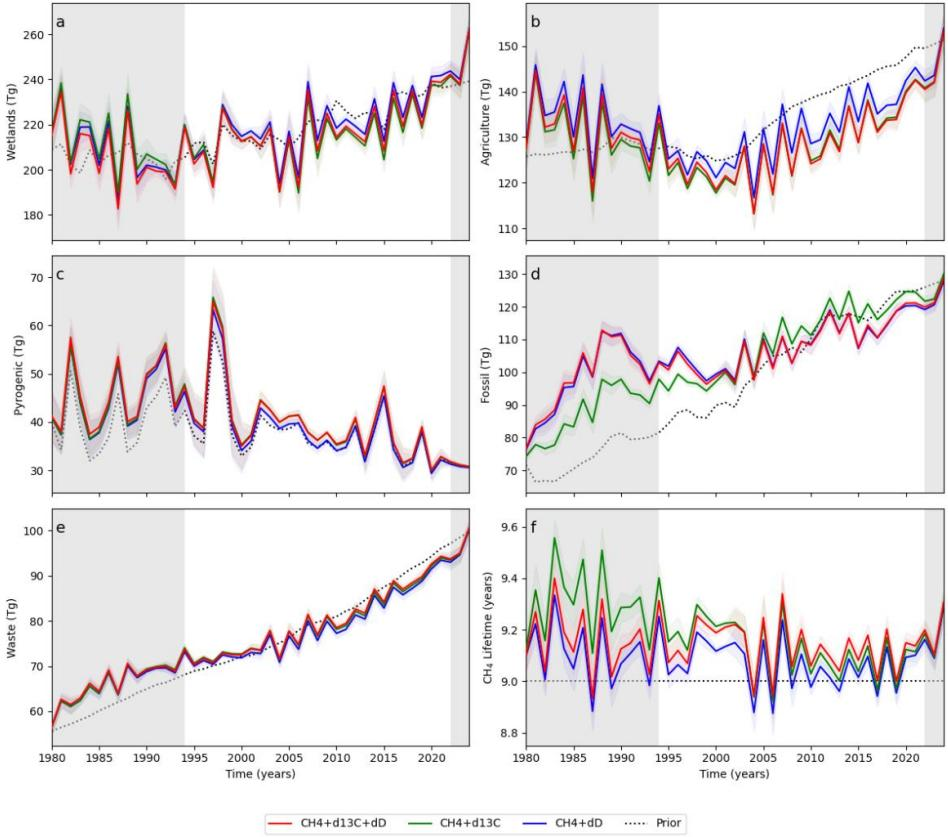
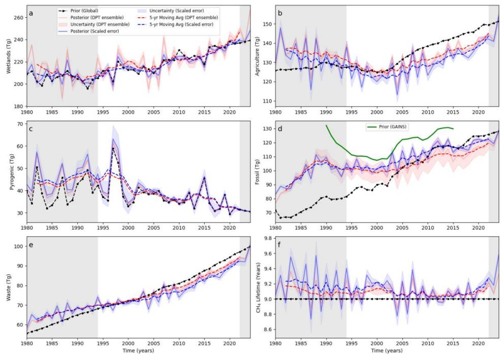
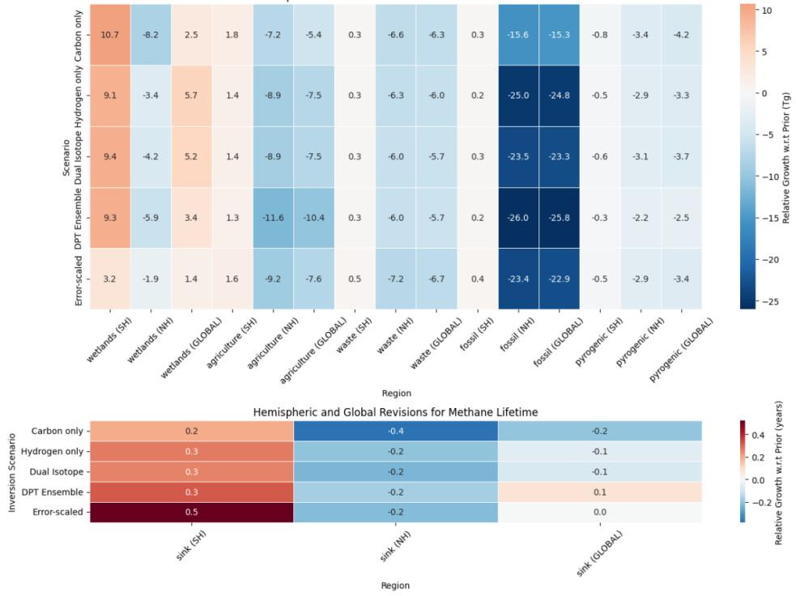

# Global Methane Emission Estimates from a Dual-Isotope Inversion: New Constraints from δD-CH₄

Bibhasvata Dasgupta1, Sudhanshu Pandey2, Sander Houweling3, Malika Menoud1, Carina van der Veen1, John Miller4, Ben Riddell-Young4,5, Sylvia Englund Michel6, Peter Sperlich7, Shinji Morimoto8, 5 Ryo Fujita6,7, Stephen Platt9, Christine Groot Zwaaftink9, Ingeborg Levin10,†, Cordelia Veidt10 , Cathrine Lund Myhre11, Ceres Woolley Maisch1,12, Rebecca Fisher12, Euan G. Nisbet12, James France12, Rowena Moss7, Nicola Warwick13, Thomas Röckmann1

1Institute for Marine and Atmospheric research Utrecht (IMAU), Utrecht University, The Netherlands

2 0 Jet Propulsion Laboratory, California Institute of Technology, Pasadena, CA, USA

3Department of Earth Sciences, Vrije Universiteit Amsterdam, Amsterdam, the Netherlands

4 Global Monitoring Laboratory, National Oceanic and Atmospheric Administration, Boulder, CO, 80205, USA

5 Cooperative Institute for Research in Environmental Sciences, University of Colorado Boulder, CO, 80309, USA

6Institute of Arctic and Alpine Research (INSTAAR), University of Colorado, Boulder, USA

7New Zealand Institute for Earth Science, (formerly NIWA), Wellington, New Zealand

8Center for Atmospheric and Oceanic Studies, Graduate School of Science, Tohoku University, Sendai, Japan

15 9Meteorological Research Institute, Japan Meteorological Agency, Tsukuba, Japan

10Institut für Umweltphysik, Heidelberg University, INF 229, 69120 Heidelberg, Germany

11NILU, P.O. Box 100, 2027 Kjeller, Norway

12Centre of Climate, Ocean and Atmosphere, Department of Earth Sciences, Royal Holloway, University of London, Egham, UK

20 13Department of Chemistry, University of Cambridge, Cambridge, CB2 1EW, UK †deceased

Correspondence to: Bibhasvata Dasgupta (bdasgupta03@gmail.com; bdasgupta@uu.nl)

Abstract. Methane (CH₄) is a potent greenhouse gas; however, the causes of its growth since 2006 are a subject of debate. While measurements of CH₄ mole fraction and carbon isotopic composition ( $\delta ^ { 1 3 } \mathrm { C - C H } 4$ ) have been extensively used to 25 investigate the global CH₄ budget, the hydrogen isotopic composition (δD-CH₄) remains underutilised despite its unique sensitivity to source types and oxidation processes. Here, we assimilate a newly harmonised 35-year dataset of dual isotope measurements from high-latitude monitoring stations in both hemispheres within a two-box Bayesian inversion to quantify global CH₄ sources and sinks. The model integrates prior emissions from five source categories based on global bottom-up inventories. Methane removal processes are represented by sink-specific kinetic isotope effects as tropospheric and 30 stratospheric loss, and soil uptake.

We find that the inclusion of δD-CH₄ improves the model's ability to constrain emission apportionment between biogenic and thermogenic sources, particularly for fossil fuel emissions during the late 1990s and early 2000s, which affects $\mathrm { C H } _ { 4 }$ lifetime estimate. CH₄ increase post-2006 is driven mainly by rising wetland emissions, while fossil-fuel growth is modest, biomass burning declines, and agriculture and waste make smaller, regionalised contributions. The optimised inversion results 35 favour a strong $^ { 1 3 } \mathrm { C }$ kinetic isotope effect in the total $\mathrm { C H } _ { 4 }$ removal in the troposphere and a net shortening of NH lifetime of $\mathrm { C H } _ { 4 }$ by 0.2 years. This study demonstrates the added value of incorporating δD-CH₄ into inverse modelling frameworks and underscores the importance of long-term δD-CH₄ measurements for advancing our understanding of $\mathrm { C H } _ { 4 }$ biogeochemistry and its role in the global carbon cycle.

Methane (CH₄) is a potent greenhouse gas; however, the causes of its growth since 2006 are a subject of debate. While   
40 measurements of $\mathbf { { C H _ { 4 } } }$ mole fraction and carbon isotopic composition $( \delta ^ { 1 3 } \mathrm { C - C H } 4 )$ ) have been used to investigate the global CH₄ budget, the hydrogen isotopic composition (δD-CH₄) remains underutilised despite its unique sensitivity to source types and oxidation processes. We assimilate a newly-harmonised 35-year dataset of dual-isotope measurements from high-latitude monitoring stations in both hemispheres within a two-box Bayesian inversion to quantify global CH₄ sources and sinks. The model integrates prior emissions from five source categories, and removal processes represented   
45 by sink-specific kinetic isotope effects in atmosphere and soil. We find that the inclusion of δD improves the model's ability to constrain emission apportionment between biogenic and thermogenic sources, particularly for fossil fuel emissions during the late 1990s and early 2000s, which affects CH₄ lifetime estimate. CH₄ increase post-2006 is driven mainly by rising wetland emissions, while fossil-fuel growth is modest, biomass burning declines, and agriculture and waste make smaller, regionalised contributions. The optimised inversion results favour a strong 13C kinetic isotope   
50 effect in the total CH4 removal in the troposphere and a net shortening of NH lifetime of $\mathbf { { C H _ { 4 } } }$ by 0.2 years. This study demonstrates the added value of incorporating δD into inverse modelling frameworks and underscores the importance of long-term δD measurements for advancing our understanding of CH₄ biogeochemistry and the global carbon cycle.

# 1. Introduction

Quantification of methane (CH₄) emissions from various source categories is critical for understanding the drivers of   
55 the ongoing climate change and identifying opportunities for mitigation. Two complementary approaches are commonly employed: bottom-up emission inventories, which aggregate source-specific activity data and emission factors, and top-down inverse modelling, which infers emissions from atmospheric mole fraction and increasingly includes isotopic measurements. Over the past decade, concerted efforts to reconcile these methods have considerably reduced overall uncertainty in the CH₄ budget (Kirschke et al., 2013; Saunois et al., 2016, 2020, 2025). Nevertheless, the drivers of the observed variations in   
60 atmospheric $\mathrm { C H } _ { 4 }$ remain a topic of scientific debate. Global atmospheric CH₄ mole fractions stabilised during 2000–2006, a period attributed to a balance between emissions and atmospheric removal processes (Bousquet et al., 2011; Basu et al., 2022). However, since 2007, atmospheric CH₄ concentrations have risen markedly, with multiple hypotheses proposed to explain this

renewed growth. These include increased biogenic emissions from wetlands and agriculture, enhanced fossil fuel extraction and usage, and changes in atmospheric removal processes—most notably variations in the abundance of tropospheric hydroxyl radicals (OH) (Schwietzke et al., 2016; Worden et al., 2017; Houweling et al., 2017; Turner et al., 2017; Nisbet et al., 2019; Lan et al., 2021; Michel et al., 2024). However, the relative contributions of these factors and their change with time remain poorly constrained.

Measurements of the carbon isotopic composition of methane, $\delta ^ { 1 3 } \mathrm { C - C H } { 4 }$ , have long been incorporated into top-down models to distinguish between biogenic and thermogenic sources (Mikaloff-Fletcher 2004; Bousquet et al., 2006; 2011;   
70 Monteil et al., 2011; Rigby et al., 2012; Schaefer et al., 2016; Nisbet et al., 2016). $\delta ^ { 1 3 } \mathrm { C }$ -CH₄ is sensitive to variations in organic substrate type (e.g., C₃ vs. C₄ vegetation) and formation pathways (e.g., biogenic vs. thermogenic vs. pyrogenic), providing distinct isotopic signatures for different source categories (Bellisario et al., 1999; Hornibrook & Bowes, 2007; Hornibrook, 2009). More recently, hydrogen isotopes (δD-CH₄) have shown promise as an additional constraint due to their sensitivity to both source water isotopic composition and kinetic isotope effects (KIEs) during oxidation (Tyler et al., 2007; Warwick et al.,   
75 2016; Douglas et al., 2021; Riddell-Young et al., PNAS, 2025). Studies incorporating δD-CH₄ reveal that carbon and hydrogen isotope tracers can yield divergent source apportionments, underscoring the need for a dual-isotope approach. This finding is based on source characterisation studies that produce isotopic signatures (Fujita et al., 2020, 2025) and attribution studies that use dual-isotope constraints to partition emissions (Riddell-Young et al., PNAS, 2025).

We employ a two-box Bayesian inversion model (Fig. 1) coupled with a discrete parameter tuning (DPT) strategy to 80 a 35-year-long global CH₄ isotope dataset that was recently synthesised from measurements at high northern and southern latitude stations (Dasgupta et al., 2025a), to evaluate the added value of $\delta \mathrm { D - C H } _ { 4 }$ in constraining the global CH₄ budget. Specifically, we investigate whether using both $\delta ^ { 1 3 } \mathrm { C - C H } { 4 }$ and $\delta \mathrm { D }$ -CH₄ improves the separation of fossil versus biogenic CH₄ sources than using either single-isotope or CH₄ mole-fraction-only inversions. In addition, we explore how uncertainties in source isotopic signatures, sink lifetimes, and KIEs influence inversion outcomes. Lastly, we evaluate the additional constraints 85 that δD-CH₄ provides on temporal variations in the global CH₄ sink.

# 2. Method

# 2.1 Two-box model setup

The mole fraction and isotopic composition of CH₄ is modelled using a two-box model with the boxes representing the Northern Hemisphere (NH) and Southern Hemisphere (SH) (Fig. 1). Hemisphere-specific source fluxes are compiled from 90 six bottom-up inventories and aggregated into five source categories: agriculture, wetlands, pyrogenic, fossil fuels, and waste (Table S1; Fig. S1). $\mathrm { C H } _ { 4 }$ sinks are parameterized by sink-specific lifetimes for removal by troposphere, stratosphere, and deposition to soils, respectively. We set the inter-hemispheric exchange time to $\tau = 0 . 7 5$ yr obtained from SF₆ inversion and τ sensitivity tests (see Fig. S5). The intra-hemispheric latitudinal gradients in CH₄, $\delta ^ { 1 3 } \mathrm { C }$ -CH₄, and δD-CH₄ are corrected for using measurement stations at different latitudes provided by the NOAA network (Fig. S4). This correction accounts for the spatial variability within each hemisphere that cannot be explicitly resolved in the two-box framework, ensuring that model outputs are comparable to observations from individual atmospheric stations.

# 2.2 Harmonised long-term atmospheric timeseries

Our atmospheric dataset comprises time series data for 6 CH₄ tracers: mole fraction (χ(CH₄); NH and SH: 1983– 2024), carbon isotopic composition ( $\delta ^ { 1 3 } \mathrm { C }$ ‐CH₄; NH: 1994-2024; SH: 1988–2024), and hydrogen isotopic composition (δD‐ 100 CH₄; NH: 1992-2024; SH: 1988–2024) of CH₄, each of them being a merged dataset from stations at high northern and southern latitudes (Dasgupta et al., 2025b). We extrapolate the time series back to 1980 and forward to 2025 (Fig. S2). A 13-year spinup is applied to ensure that inversion results are independent of initial conditions, and a 3-year spin-down allows smooth convergence back to priors (Fig. S3). Therefore, the effective ‘analysis period’ ranges from 1994 to 2022.

# 2.3 Source and Sink Isotopic Signatures

105 Source isotopic signatures for the 5 categories are averages from the global isotope database (Sherwood et al., 2017; Menoud et al., 2022) and weighted by emission rates (Table S2). CH₄ sinks include tropospheric $\mathrm { O H / C l }$ , a combined stratospheric sink including $\mathrm { { O H } } / \mathrm { { O } } ( ^ { I } D ) / \mathrm { { C l } }$ , and soil uptake. Each sink is assigned a kinetic isotope effect (KIE) based on Cantrell et al. (1990), Saueressig et al. (1995, 1996, 2001), Röckmann et al. (2011), and Fujita et al. (2020). We use their reported fractionation factors to set effective KIEs for the model’s three sink categories: tropospheric (KIE $^ { 1 3 } \mathrm { C } { \approx } 1 . 0 0 6 6$ ;   
110 ${ \mathrm { D } } { \approx } 1 . 3 1 7$ ), stratospheric (KIE $^ { 1 3 } \mathrm { C } { \approx } 1 . 0 1 4 4$ ; ${ \mathrm { D } } { \approx } 1 . 1 3 3$ ), and soil (KIE $^ { 1 3 } \mathrm { C } { \approx } 1 . 0 2 0 1$ ; ${ \mathrm { D } } { \approx } 1 . 0 8 2 5$ ) sinks.

Sensitivity tests were performed where prior flux uncertainties $( \pm 1 0 - 5 0 \% )$ and observational error bounds $\mathrm { ( \chi ( C H _ { 4 } ) }$ : 1 ppb $^ { 1 3 } \mathrm { C H } _ { 4 }$ : 0.1–0.01 ppb; $\mathrm { C H } _ { 3 } \mathrm { D }$ : 0.005–0.001 ppb) were systematically varied. Reducing the prior error below $30 \%$ increased interannual variability in posterior fluxes but degraded isotopic fits, as the inversion over‐relied on the priors (Lan et al., 2021). Lowering $^ { 1 3 } \mathrm { C H } _ { 4 }$ observational error to $0 . 0 0 1 \mathrm { p p b }$ produced near‐perfect $\delta ^ { 1 3 } \mathrm { C - C H } { 4 }$ fits but worsened $\delta \mathrm { D - C H } _ { 4 }$ 115 agreement, whereas balancing errors at 1 ppb, 0.01 ppb, and 0.001 ppb yielded improved simultaneous fits. These findings highlight the trade‐off between prior confidence and observational weighing in multivariate inversions and are further explored in ‘error-scaled’ inversion scenarios (section 3.3).

# 2.4 Bayesian Inversion System

The prior hemisphere-specific emissions for the years 1980–2025 (section 2.3) are optimised in a Bayesian inversion 120 system as described in SI section 7. The inversion algorithm modifies monthly source fluxes and sink losses so that 6 modelled tracers evolve toward the observations while still remaining constrained by priors. For all results presented in Sections 3.2- 3.3, we use a fixed prior lifetime (Prather et al., 2012; Myhre et al., 2014), but we also test time-varying CH₄ lifetime scenarios derived from CAMS TM5 inversions (Fig. S6). The inversion is performed in two sequential steps. First, we perform a $\mathrm { C H } _ { 4 }$ - only inversion to estimate the emissions and the aggregate sink that match the observed hemispheric $\mathrm { C H } _ { 4 }$ mole fraction, providing a consistent starting state for the isotopologue ratio calculations. Second, we run an iterative Gauss–Newton inversion jointly constrained by $\mathrm { C H } _ { 4 }$ , $\delta ^ { 1 3 } \mathrm { C - C H } { 4 }$ and $\delta \mathrm { D - C H } _ { 4 }$ to refine the total budget and its allocation across source categories (see SI section 7). The two-box model is adjusted to run with different combinations of the three tracers by selecting which isotopologues to include in the second inversion step and their associated observational uncertainties (Fig. 2,3).

# 2.5 Discrete Parameter Tuning (DPT)

130 To optimise model inputs, including source isotopic signatures, sink KIEs, lifetimes, and observational‐error estimates, we perform over 13 million individual inversions with perturbed prior parameter values (Table S3). Each run generates posterior source fluxes for which the 6 modelled tracers, i.e. $\chi ( \mathrm { C H } _ { 4 } ) _ { \mathrm { ( N H , S H ) } }$ , $\delta ^ { 1 3 } \mathrm { C - C H } _ { 4 } \exp \mathrm { G } , \mathrm { S H } ) ,$ and $\delta \mathrm { D - C H _ { 4 } } _ { \mathrm { ( N H , S H ) } }$ are then compared to the observations via a tracer-weighted RMSE (see SI section 8). We only retain scenarios where the mean normalised RMSE between modelled and observed tracers is less than 0.1 (Fig. S7) and identify the most frequently occurring   
135 prior values among these “successful” runs (Fig. S8, S9). These modal values constitute our DPT-optimised parameter set, and the aggregated posterior results represent the DPT ensemble run (Fig. 4).

# 3. Results

# 3.1 Optimised Source Signatures and Sink Fractionations

By selecting the parameter combinations that minimise the mean normalised RMSE for all six tracers, we obtained 140 robust, data‐driven refinements to the input parameters. As shown in Table 1 and Figure S8, most source signatures remained close to their priors. For $\delta ^ { 1 3 } \mathrm { C - C H } { 4 }$ , DPT-optimisation resulted in minor revisions to the wetland and agricultural source signatures in both hemispheres. A relatively larger adjustment was made to agricultural emission $\delta ^ { 1 3 } \mathrm { C - C H } { 4 }$ in SH and to a lesser extent to agricultural and wetlands δD-CH₄. Both biogenic source signatures shifted to the heavier end of the DPT-tested range, indicating that the δD-CH₄ data can be better matched with more enriched source signatures.

<table><tr><td rowspan=1 colspan=5>Table 1: Assgned δ3C-CH4 and δD-CH4 values (%o) for each source category in the two-box model;Optimised values (%o) from DPT-ensemble.</td></tr><tr><td rowspan=1 colspan=1>Emission category</td><td rowspan=1 colspan=1>813C-CH4 (SH)</td><td rowspan=1 colspan=1>S13C-CH4 (NH)</td><td rowspan=1 colspan=1>SD-CH4 (SH)</td><td rowspan=1 colspan=1>δD-CH4 (NH)</td></tr><tr><td rowspan=1 colspan=1>Wetlands</td><td rowspan=1 colspan=1>-58.3; -58.2</td><td rowspan=1 colspan=1>-64.9; -64.8</td><td rowspan=1 colspan=1>-302; -299</td><td rowspan=1 colspan=1>-339; -336</td></tr><tr><td rowspan=1 colspan=1>Agriculture</td><td rowspan=1 colspan=1>-64.4; -63.4</td><td rowspan=1 colspan=1>-63.4; -63.3</td><td rowspan=1 colspan=1>-311; -312</td><td rowspan=1 colspan=1>-314; -314</td></tr><tr><td rowspan=1 colspan=1>Pyrogenic</td><td rowspan=1 colspan=1>-22.3; -22.3</td><td rowspan=1 colspan=1>-22.4; -22.4</td><td rowspan=1 colspan=1>-213; -213</td><td rowspan=1 colspan=1>-183; -183</td></tr><tr><td rowspan=1 colspan=1>Fossil fuels</td><td rowspan=1 colspan=1>-44.0; -44.0</td><td rowspan=1 colspan=1>-44.0; -44.0</td><td rowspan=1 colspan=1>-192; -192</td><td rowspan=1 colspan=1>-191; -191</td></tr><tr><td rowspan=1 colspan=1>Waste</td><td rowspan=1 colspan=1>-54.5; -54.5</td><td rowspan=1 colspan=1>-54.5; -54.5</td><td rowspan=1 colspan=1>-292; -292</td><td rowspan=1 colspan=1>-292; -292</td></tr></table>

The same DPT framework was applied to optimise the tropospheric KIEs (Table 2; Figure S9). Tropospheric KIEs for $\mathrm { O H + C l }$ oxidation were slightly revised from literature values ( $^ { 1 3 } \mathrm { C } ~ 1 . 0 0 6 6$ and D 1.317; Saunois et al., 2020) to 1.0068 ${ } ^ { 1 3 } \mathrm { C } )$ and 1.313 (D). These optimised KIEs yield the best simultaneous fit to the trends in χ(CH₄) (NH, SH), $\delta ^ { 1 3 } \mathrm { C }$ ‐CH₄ (NH, SH) and δD‐CH₄ (NH, SH).

<table><tr><td rowspan=1 colspan=6>Table 2:Fractionation factors used fordiferent sink processes,based onprevious literature,andusing an average global temperature of 3.973 ± 0.122C. Optimised values from DPT-ensemble.</td></tr><tr><td rowspan=1 colspan=2>CH4 sink process</td><td rowspan=1 colspan=1>13C</td><td rowspan=1 colspan=1>Reference</td><td rowspan=1 colspan=1>D</td><td rowspan=1 colspan=1>Reference</td></tr><tr><td rowspan=3 colspan=1>Trrdsodore</td><td rowspan=1 colspan=1>OH</td><td rowspan=1 colspan=1>1.0054</td><td rowspan=1 colspan=1>Cantrell et al. (1990)</td><td rowspan=1 colspan=1>1.313</td><td rowspan=1 colspan=1>Saueressig et al. (2001a)</td></tr><tr><td rowspan=1 colspan=1>Cl</td><td rowspan=1 colspan=1>1.0676</td><td rowspan=1 colspan=1>Saueressig et al. (1995)</td><td rowspan=1 colspan=1>1.538</td><td rowspan=1 colspan=1>Saueressig et al. (1996)</td></tr><tr><td rowspan=1 colspan=1>Total(OH: C1= 98:2)</td><td rowspan=1 colspan=1>1.00661.0068</td><td rowspan=1 colspan=1>Saunois et al. (2020)</td><td rowspan=1 colspan=1>1.3171.313</td><td rowspan=1 colspan=1>Saunois et al. (2020)</td></tr><tr><td rowspan=1 colspan=2>Stratosphere</td><td rowspan=1 colspan=1>1.01436</td><td rowspan=1 colspan=1>Rockmann et al. (2011)1</td><td rowspan=1 colspan=1>1.133</td><td rowspan=1 colspan=1>Rockmann et al. (2011)1</td></tr><tr><td rowspan=1 colspan=2>Soil</td><td rowspan=1 colspan=1>1.0201</td><td rowspan=1 colspan=1>Fujita et al. (2020)2</td><td rowspan=1 colspan=1>1.0825</td><td rowspan=1 colspan=1>Fujita et al. (2020)²</td></tr><tr><td rowspan=1 colspan=6>1Pseudo-KIE that account for the fractionation in the stratospheric sinks on atmospheric CH4 in the box model. See SISection 9 for detailed calculations.</td></tr><tr><td rowspan=1 colspan=6>2Based on Snover and Quay, (2000), Tyler et al. (1994), and Reeburgh et al. (1997).</td></tr></table>

These fine‐tuned (within physically realistic bounds) source fingerprints and sink kinetics improve the model’s 150 ability to reproduce observed isotopic trajectories.

# 3.2 Isotopic Constraints on the Inversion

Figures 2 and 3 compare the modelled and observed isotopic time series, along with their corresponding emission scenarios, highlighting the performance of the three inversion setups: dual-isotope $\mathrm { ( C H _ { 4 } + \delta ^ { 1 3 } C - C H _ { 4 } + \delta D ) }$ ), carbon-only (CH₄ $+ \delta ^ { 1 3 } \mathrm { C } )$ , and hydrogen-only $\mathrm { ( C H _ { 4 } + \delta D ) }$ .

155 Figure 3 reveals marked differences in sectoral emission trajectories across the three isotopic inversion setups over the analysis period. Wetlands (Fig. 3a) exhibit relatively stable emissions from 1994 to 2007 across all three inversions, followed by a sustained increase through 2022. Mean emissions are $2 1 7 . 8 \pm 1 3 . 9 \mathrm { T g } \mathrm { C H } { } _ { 4 }$ (dual-isotope), $2 1 6 . 8 \pm 1 3 . 3 \mathrm { T g } \mathrm { C H } _ { 4 }$ (carbon-only), and $2 2 0 . 7 { \pm } 1 3 . 7 \mathrm { T g } \mathrm { C H } _ { 4 }$ (hydrogen-only), with a total growth of $+ 3 5 . 3 , + 3 2 . 6$ , and $+ 3 5 . 8$ Tg across the analysis period, respectively (Table S4). Agricultural emissions (Fig. 3b) exhibit gradual increases throughout the analysis period, with   
160 mean values of $1 2 8 . 1 \pm 7 . 5 \mathrm { T g } \mathrm { C H } _ { 4 }$ (dual-isotope), $1 2 8 . 0 \pm 7 . 8 \mathrm { T g } \mathrm { C H } _ { 4 }$ (carbon-only), and $1 3 1 . 5 \pm 7 . 6 \mathrm { T g } \mathrm { C H } { } _ { 4 }$ (hydrogenonly), corresponding to growth of $+ 1 4 . 8$ , $+ 1 6 . 9$ , and $+ 1 4 . 8$ Tg. Pyrogenic emissions (Fig. 3c) display high interannual variability but a general declining trend, decreasing from ${ \sim } 4 5 \ \mathrm { T g } \ \mathrm { C H } _ { 4 }$ in the early 1990s to ${ \sim } 3 2 ~ \mathrm { T g } ~ \mathrm { C H } _ { 4 }$ by 2022. Mean emissions are $3 9 . 7 \pm 7 . 6 \mathrm { T g } \mathrm { C H } _ { 4 }$ (dual-isotope), $3 9 . 7 \pm 7 . 9 \mathrm { T g } \mathrm { C H } _ { 4 }$ (carbon-only), and $3 8 . 4 \pm 7 . 4 \mathrm { T g } \mathrm { C H } _ { 4 }$ (hydrogen-only), with reductions of –11.6, –12.1, and $- 1 1 . 3 \mathrm { T g }$ . Fossil fuel emissions (Fig. 3d) show the most pronounced divergence between   
165 inversion scenarios with and without $\delta ^ { 1 3 } \mathrm { C - C H } { 4 }$ . The carbon-only inversion $\mathrm { ( 1 1 0 . 1 \pm 1 0 . 7 ~ T g ~ C H _ { 4 } }$ , $+ 2 8 . 7 \mathrm { T g }$ growth) displays

steady increases throughout the period. The dual-isotope $( 1 0 8 . 4 \pm 7 . 9 \mathrm { T g } \mathrm { C H } _ { 4 }$ , $+ 2 0 . 7 \mathrm { T g }$ and hydrogen-only $( 1 0 8 . 6 \pm 7 . 4 \mathrm { T g }$ CH₄, $+ 1 9 . 2 \mathrm { T g }$ ) inversions show elevated emissions in the early 1990s, a decrease through the late 1990s, and renewed growth from 2000 onward. Waste emissions (Fig. 3e) increase steadily with excellent agreement in temporal variation across all inversions: $8 0 . 1 \pm 7 . 5 \mathrm { T g } \mathrm { C H } _ { 4 }$ (dual-isotope, $+ 2 3 . 4 \mathrm { T g }$ ), $7 9 . 9 \pm 7 . 3 \mathrm { T g } \mathrm { C H } _ { 4 }$ (carbon-only, $+ 2 2 . 8 \mathrm { T g }$ ), and $7 9 . 1 \pm 7 . 3 \mathrm { T g } \mathrm { C H } _ { 4 }$ 70 (hydrogen-only, $+ 2 3 . 1 \ \mathrm { T g }$ ). Atmospheric lifetime (Fig. 3f) remains consistent at $9 . 1 \pm 0 . 1$ years across all inversions, with higher temporal variations at the hemispheric scale than at the global scale.

The dual‐isotope inversion achieves the best overall fit for both $\delta ^ { 1 3 } \mathrm { C - C H } { 4 }$ and δD-CH₄ (Fig. S10). For $\delta ^ { 1 3 } \mathrm { C }$ , it shows a mean residual of $- 0 . 0 5 \text{‰}$ and a median of $- 0 . 0 6 \text{‰}$ , slightly better than the carbon‐only run (mean $- 0 . 0 7 \text{‰}$ , median – $0 . 0 6 \text{‰}$ . By contrast, the hydrogen‐only inversion has larger residuals (mean $- 0 . 2 9 \text{‰}$ , median $- 0 . 3 0 \text{‰}$ ), indicating a poorer   
175 fit. For $\delta \mathrm { D - C H } _ { 4 }$ , the dual‐isotope inversion again performs best (mean $- 0 . 1 8 \text{‰}$ , median $- 0 . 0 9 \text{‰}$ ), followed by the hydrogen‐ only setup (mean $- 0 . 5 5 \text{‰}$ , median $- 0 . 4 7 \text{‰}$ ). The carbon‐only inversion, lacking $\delta \mathrm { D }$ -CH₄ data, has the largest residuals (mean $- 1 . 7 4 \text{‰}$ , median $- 1 . 1 8 \mathrm { ‰ }$ ), confirming that $\delta ^ { 1 3 } \mathrm { C - C H } { 4 }$ alone cannot capture deuterium dynamics. These results demonstrate that the dual-isotope approach is the only setup capable of accurately matching both isotopic records, whereas the singleisotope inversions necessarily compromise the fit for the unconstrained tracer. Following this, we run 2 additional scenarios   
180 with both isotopes, i.e. DPT ensemble and error-scaled inversions, to fully gauge the implications of a dual isotopic constraint on the model.

# 3.3 Revised estimates of emissions and lifetime

We compare prior estimates with five inversion scenarios over 1994–2022 to assess how isotopic constraints reestimate the methane budget (Table S4, Figs. 3–4).

85 • Prior: Bottom-up inventories with fixed 9-year lifetimes (Fig. 3; black). • Carbon-only: $\mathrm { C H } _ { 4 } + \delta ^ { 1 3 } \mathrm { C }$ -CH₄ inversion using DPT-optimised parameters but omitting δD-CH₄ (Fig. 3; green). • Hydrogen-only: $\mathrm { C H } _ { 4 } + \delta \mathrm { D } { \cdot } \mathrm { C H } _ { 4 }$ inversion using DPT-optimised parameters but omitting $\delta ^ { 1 3 } \mathrm { C }$ -CH₄ (Fig. 3; blue). Dual-isotope $\mathrm { C H } _ { 4 } + \delta ^ { 1 3 } \mathrm { C } \mathrm { - } \mathrm { C H } _ { 4 } + \delta \mathrm { I }$ D-CH₄ inversion, using a fixed set of source signatures, sink KIEs, lifetimes, and observational-error estimates optimised a priori by our DPT framework. In other words, it is a single inversion run   
90 that employs the best-guess parameter values from discrete parameter tuning (Fig. 3; red). DPT ensemble represents the mean of all inversion runs (over 13 million) whose posterior results achieve a mean normalised RMSE $< 0 . 1$ against the six observed tracers. Rather than using only the modal parameter set, this scenario aggregates across the distribution of “successful” runs, thereby capturing the uncertainty and variability inherent in the parameter tuning process (Fig. 4; red).   
95 • Error-scaled: Dual-isotope inversion using DPT-optimised parameters with emission uncertainties weighted by each

source’s contribution and tropospheric lifetime error tightened from $10 \%$ to $9 \%$ following sensitivity tests (Fig. 4; blue). Specifically, each source's prior uncertainty is scaled by $( 1 - f _ { i } )$ , where $f _ { i }$ is that source's fractional contribution to total global emissions. This prevents large sources (e.g., wetlands contributing ${ \sim } 4 0 \%$ of total) from dominating the inversion solution space while allowing smaller sources (e.g., pyrogenic $\sim 7 \%$ ) proportionally more flexibility.

200 Figure 4 compares prior emissions with two refined dual-isotope inversions: the DPT-ensemble and error-scaled scenarios. Wetlands (Fig. 4a) show temporal patterns similar to Figure 3, with relatively stable emissions until ${ \sim } 2 0 0 7$ , followed by sustained increases. The DPT-ensemble estimates mean emissions of $2 2 2 . 6 \pm 1 3 . 8 \mathrm { T g } \mathrm { C H } _ { 4 }$ with growth of $+ 3 3 . 5 \mathrm { T g }$ , while the error-scaled inversion yields $2 2 0 . 4 \pm 1 0 . 3 \mathrm { T g } \mathrm { C H } _ { 4 }$ with growth of $+ 3 1 . 5 \mathrm { T g }$ , both lower than the prior growth $\left( + 3 0 . 1 \mathrm { T g } \right)$ . Agricultural emissions (Fig. 4b) increase in both inversions. The DPT-ensemble $1 3 2 . 0 \pm 7 . 2 \mathrm { T g } \mathrm { C H }$ ₄, $+ 1 2 . 0$ Tg growth) and   
205 error-scaled $\mathrm { 1 2 9 . 3 \pm 7 . 8 \mathrm { T g } C H _ { 4 } , + 1 4 . 7 \mathrm { T g } }$ growth) scenarios both estimate lower growth than the prior $( + 2 2 . 3 \mathrm { T g } )$ ). Pyrogenic emissions (Fig. 4c) decline from ${ \sim } 4 3 \mathrm { T g C H } { } _ { 4 }$ in 1994 to ${ \sim } 3 1 \mathrm { T g C H } { _ { 4 } }$ by 2022, with high interannual variability. Mean emissions are $3 8 . 2 \pm 7 . 0 \mathrm { T g } \mathrm { C H } _ { 4 }$ (DPT-ensemble, $- 1 0 . 5 \ \mathrm { T g }$ ) and $3 8 . 9 \pm 7 . 5 \mathrm { T g } \mathrm { C H } _ { 4 }$ (error-scaled, $- 1 1 . 4 \mathrm { T g }$ ), both showing stronger reductions than the prior $( - 8 . 0 \ \mathrm { T g } )$ . Fossil fuel emissions (Fig. 4d) display temporal patterns distinct from the prior, with elevated early-period emissions, a decrease through the late 1990s, and renewed growth from 2000 onward. The DPT-ensemble   
210 $( 1 0 6 . 5 \pm 7 . 2 \mathrm { T g } \mathrm { C H } _ { 4 }$ , $+ 1 8 . 2 \mathrm { T g }$ ) and error-scaled $1 1 0 . 9 \pm 8 . 4 \mathrm { T g } \mathrm { C F }$ ₄, $+ 2 1 . 1$ Tg) inversions both estimate lower growth in fossil fuel emissions than the prior $\left( + 4 4 . 0 \mathrm { T g } \right)$ . Figure 4d also includes GAINS inventory estimates (green line) for comparison. The GAINS model estimates emissions bottom-up, i.e., quantifications of human activities contributing to emissions are multiplied by an emission factor representing the average emissions per unit of activity (Höglund-Isaksson et al., 2020). Waste emissions (Fig. 4e) increase steadily: $7 9 . 1 \pm 7 . 6 \mathrm { T g } \mathrm { C H } _ { 4 }$ (DPT-ensemble, $+ 2 3 . 5 \mathrm { T g }$ ) and $7 7 . 7 { \pm } 7 . 3 \mathrm { T g } \mathrm { C H } _ { 4 }$ (error-scaled, $+ 2 2 . 4$   
215 Tg), both lower than prior growth $( + 2 9 . 1 \mathrm { T g } )$ ). Atmospheric lifetime (Fig. 4f) exhibits minimal variation, with higher temporal variations at the hemispheric scale compared to the global scale. Figure 5 summarises the revisions to emission growth (top panel) and lifetime (bottom panel) across all inversion scenarios relative to the prior. The single-isotope inversions (carbon-only and hydrogen-only) show moderate adjustments across most sectors. In contrast, the dual-isotope, DPT-ensemble, and error-scaled inversions—all of which assimilate both   
220 $\delta ^ { 1 3 } \mathrm { C - C H } { 4 }$ and $\delta \mathrm { D - C H } _ { 4 }$ —consistently re-estimate wetland growth toward the SH (red shading indicates prior underestimation, with revisions of $+ 8$ to $+ 1 0 \ \mathrm { T g }$ ) while reducing NH fossil fuel growth (blue shading indicates prior overestimation, with revisions of $- 1 5$ to $- 2 6 \mathrm { T g }$ ). Agricultural and waste revisions are more modest across all scenarios $( \pm 5 \mathrm { T g } )$ ), while pyrogenic reductions are consistent ( $- 3$ to $- 4 \mathrm { ~ T g }$ additional decline beyond prior). The lifetime heatmap (bottom panel) reveals hemispheric divergence: SH lifetime increases by $+ 0 . 3$ years across all isotope-constrained inversions, while NH lifetime   
225 decreases by $- 0 . 2$ to $- 0 . 5$ years depending on the scenario. Global mean lifetime remains nearly constant at 9.1 years, with deviations of $\pm 0 . 1$ years or less.

# 4. Discussion

# 4.1. Temporal changes of thermogenic and pyrogenic emissions

Prior inventories suggest steady fossil-fuel growth of $+ 4 4 . 0$ Tg between 1994 and 2022. However, isotope-230 constrained inversions reveal that most fossil fuel growth occurred between 2000 and 2012, with minimal additional increases thereafter. The carbon-only inversion estimates net thermogenic $^ +$ pyrogenic growth at $+ 1 6 . 6 \ \mathrm { T g }$ , while hydrogen-only inversions yield $+ 7 . 9 \mathrm { T g }$ , and the dual-isotope solution at $+ 9 . 1$ Tg. Runs that include δD-CH₄ (hydrogen-only, dual-isotope, DPT-ensemble) consistently yield smaller thermogenic and pyrogenic growth, with the DPT-ensemble producing only $+ 7 . 7$ Tg of net thermogenic $^ +$ pyrogenic growth, compared to the prior estimate of $+ 3 6 . 0 \mathrm { T g }$ (which includes the $- 8 . 0 \mathrm { T g }$ pyrogenic 235 reduction).

The inferred total isotopic enrichment associated with methane removal is substantially larger for deuterium (313 $\text{‰}$ ) than for carbon $( 6 . 8 \text{‰}$ ). In the case of $^ { 1 3 } \mathrm { C }$ , the sink fractionation is much smaller than the differences of isotopic source signatures between the different source categories, which span $40 \text{‰}$ , whereas the $^ 2 \mathrm { H }$ sink fractionation is twice as wide as the range between the average source signatures of different categories of about $1 5 0 \text{‰}$ (Table 1). Thus, δD-CH₄ provides strong   
240 sensitivity to oxidation kinetics. Among the source categories, $\delta \mathrm { D }$ is particularly sensitive to fossil CH₄ emissions, which are the only source with $\delta \mathrm { D } > - 2 0 0 ~ \%$ . This sensitivity is particularly evident in the timing of the posterior emissions with and without $\delta \mathrm { D }$ . $\delta \mathrm { D }$ -constrained inversions assign roughly $5 { \mathrm { - } } 1 0 \mathrm { T g } \mathrm { y r } ^ { - 1 }$ more fossil emissions to the early 1990s and about $5 \mathrm { - } 8 \mathrm { T g }$ $\mathrm { y r } ^ { - 1 }$ less to the 2010s than the carbon-only inversion, i.e. a higher early baseline and reduced recent growth. We note that the δD-inclusive inversions require higher fossil emissions, even more pronounced in the late 1980s–early 1990s, but this overlaps   
245 with the model spin-up period (pre-1994), thus should be treated cautiously. Still, the consistent post-1994 behaviour across hydrogen-only, dual-isotope and DPT runs supports the robustness of the reduced fossil-growth result. The downward revision of the fossil increase suggests an underestimation of fossil-fuel emissions in the used inventory in the 1990s and early 2000s, followed by a modest overestimation in the late 2010s (Fig. 4). Although fossil-fuel production continued to rise over this period (IEA, 2023), our posterior emissions stayed comparatively flat. This may result   
250 from several non-exclusive and overlapping factors — including declining emission intensity per unit production, the adoption of mitigation measures, changes in extraction and fuel-mix practices, or errors and biases in bottom-up reporting — rather than any single cause. This interpretation is supported by independent inventory estimates from the GIANS model, which also reports lower emission intensities in recent decades (Höglund-Isaksson et al., 2020) and by inversion studies that do not find large fossil-driven growth and in some cases point to increased biogenic contributions (Thompson et al., 2018; Schaefer et al.,   
255 2016). Taken together, these lines of evidence support our conclusion that the fossil-fuel growth is likely overestimated in the used bottom-up inventory.

Traditional inversion setups that fix thermogenic isotopic signatures may underestimate regional shifts toward lower-emission production systems, such as modern shale-gas operations in the USA (Uveges et al., 2025). Our DPT framework, which explores a range of source isotopic values, captures a modest fossil increase that may indeed signal growing

260 shale-gas emissions, particularly between 2000 and 2012. It is also worth noting that if countries overreport fossil-fuel emissions in their national inventories, which serve as the foundation for bottom-up estimates, the resulting prior estimates will overestimate these emissions relative to atmospheric inversion results. Recent evaluation of China's carbon emissions, for example, found that coal-related $\mathrm { C O } _ { 2 }$ output was overestimated due to incorrect assumptions about fuel quality, leading to a downward correction of ${ \sim } 1 4 \%$ for 2013 emissions and a cumulative reduction of $\mathord { \sim } 1 0 . 6$ Gt $\mathrm { C O } _ { 2 }$ over 2000–2013 (Liu et al.,   
265 2015; Hu et al., 2025). Similar reporting uncertainties may affect CH₄ inventories.

The decline in pyrogenic emissions $- 8 . 0 \mathrm { T g }$ in priors) aligns well with satellite observations of shrinking burn areas and improved fire management (van der Werf et al., 2017), and inversions consistently confirm this downward trajectory. These results imply that fossil fuels have played a steady but secondary role in post-2006 CH₄ growth, while biomass burning has declined more consistently than bottom-up inventories suggested. The reduction in net thermogenic growth from $+ 3 6 . 0 \mathrm { T g }$ 70 to $+ 7 . 7 \ \mathrm { T g }$ may indicate that certain emission drivers are potentially more influential in recent atmospheric trends than previously thought.

# 4.2. Temporal changes of biogenic emissions

Bottom-up priors suggest that wetlands, agriculture, and waste collectively contributed approximately $+ 8 1 . 5 \mathrm { T g }$ to global biogenic CH₄ growth from 1994 to 2022. However, all five inversion setups revise this estimate downward to between $+ 6 8 . 6$ and $+ 7 3 . 7 \mathrm { T g } .$ , with the DPT-ensemble yielding $+ 6 9 . 0 \mathrm { T g }$ (Table S4). This represents a ${ \sim } 1 5 \%$ reduction in biogenic growth compared to prior estimates, while still making it the primary driver of post-2006 CH₄ growth.

Wetlands: The inversion retains wetlands as a major source but substantially attributes that growth toward the SH, oversetting the NH contribution by two-thirds (Fig. 5). This hemispheric distribution coincides with more negative atmospheric $\delta ^ { 1 3 } \mathrm { C } \mathrm { - } \mathrm { C } \mathrm { H } _ { 4 }$ and $\delta \mathrm { D - C H } _ { 4 }$ values, characteristic of biogenic $\mathrm { C H } _ { 4 }$ (Michel et al., 2024; $\mathrm { Y u }$ et al., submitted, 2025). Field studies link this to 80 ENSO variability, where La Niña events expand tropical inundation and boost CH₄ release (Qu et al., 2024; Lin et al., 2024), aligning with the isotopic and atmospheric evidence.

Agriculture: Prior estimate attributes $+ 2 2 . 3 \mathrm { T g }$ of $\mathrm { C H } _ { 4 }$ growth to agriculture globally, dominated by $+ 1 4 . 7 \mathrm { T g }$ from the NH, while all five inversion setups revise this downward, particularly in the NH (Fig. 5). The DPT-ensemble inversion estimates global agricultural growth at $+ 1 2 . 0 \mathrm { T g }$ , with the NH contributing only $+ 3 . 0 \mathrm { T g }$ and the $\mathrm { S H } + 8 . 9 \mathrm { T g }$ . Similarly, the error-scaled   
285 inversion yields $+ 1 4 . 7 \mathrm { T g }$ globally, with $+ 5 . 4 \mathrm { T g }$ from the NH and $+ 9 . 3 \mathrm { T g }$ from the SH. The shift aligns with documented adoption of CH₄ mitigation practices in rice paddies and livestock systems, such as alternate wetting and drying (AWD) in rice fields and improved manure management (Shyamsundar et al., 2019; CIMMYT.org). These findings suggest that while agriculture remains a significant source of $\mathrm { C H } _ { 4 }$ , its contribution to recent growth, especially in the NH, may be overstated in inventories. Also worth noting here is that the DPT optimised $\delta ^ { 1 3 } \mathrm { C } \mathrm { - } \mathrm { C } \mathrm { H } _ { 4 }$ source signature is increased by $1 \text{‰}$ relative to priors,   
290 suggesting a higher abundance of $\mathrm { C } _ { 4 }$ crops, but such interpretations are inconclusive, particularly because source signatures and atmospheric observations in SH are fewer.

Waste: Waste-related CH₄ emissions, originating from landfills, wastewater, and organic waste decomposition, occupy an intermediate isotopic space between biogenic and thermogenic sources. Prior inventories estimated global waste emissions growth at $+ 2 9 . 1$ Tg since 1994, concentrated in the $\mathrm { N H } ( + 2 2 . 7 \mathrm { T g } \mathrm { N H } \mathrm { v s . } + 6 . 4 \mathrm { T g } \mathrm { S H } )$ . All inversion setups revise this estimate slightly downward, particularly in the NH. The DPT-ensemble and dual-isotope inversions both estimate global waste growth at approximately $+ 2 3 . 5 \mathrm { T g }$ and $+ 2 3 . 4 \mathrm { T g }$ , respectively, with the error-scaled inversion yielding $+ 2 2 . 4 \mathrm { T g }$ . Across all scenarios, NH waste growth is consistently reduced to between $+ 1 5 . 5$ and $+ 1 6 . 8 \mathrm { T g }$ , which is well below the prior estimate of $+ 2 2 . 7 \mathrm { T g } .$ , while SH growth remains relatively stable at $+ 6 . 7 { - } 6 . 9 \mathrm { T g }$ .

# 4.3 Revised methane lifetime

Across our inversion suite, the posterior global mean lifetime is $9 . 1 \pm 0 . 1$ years, i.e., $+ 0 . 1$ year relative to the fixed prior (9.0 years). Examining the trend over the analysis period, the inverted lifetime reveals a slight net shortening of ${ \sim } 0 . 1$ years. Hemispherically, the two-box posteriors consistently indicate an NH shortening of ${ \sim } 0 . 2 \pm 0 . 1$ yr and an SH lengthening of $\sim + 0 . 3 \pm 0 . 1$ yr.

We note that in an inversion system, such modest adjustments could reflect true changes in sink strength, but they   
305 may also compensate for source re-estimations. Therefore, we compare the results to independent evidence on OH changes: Studies suggest that the overall OH loss rate is generally “well buffered”. The assigned uncertainty was approximately 10–15 $\%$ uncertainty during the 2000s (Saunois et al., 2020; Nisbet et al., 2019), which means that a $9 \%$ increase in tropical OH (Anderson et al., 2021; Stavert et al., 2021; Stevenson et al., 2020) is near the detection limit of global-scale budget estimates, similar to our findings. If OH (and/or Cl) have indeed increased modestly, a small but real shortening of lifetime would be   
310 expected. Our inversion's global lifetime change $( \pm 0 . 1 \ \mathrm { y r } )$ ) aligns well between these perspectives: large enough to reflect plausible sink variability, yet small enough to be consistent with a largely stable OH background.

The hemispheric divergence, with NH lifetime declining $( - 0 . 2 \pm 0 . 1$ years) and SH lifetime increasing $( + 0 . 3 \pm 0 . 1 $ years), qualitatively aligns with independent evidence of stronger oxidant increases in the NH (Anderson et al., 2021) and the southward re-estimation of wetland emissions. Starting from our two-box model structure, the SH box exhibits a baseline 315 longer lifetime ${ \sim } 9 . 3$ years vs. 9.0 years NH) even in the prior, reflecting fundamental differences in oxidant regimes between hemispheres. We acknowledge that 3-D models are better suited for spatial attribution; our two-box framework limits robust hemispheric conclusions. We therefore focus on the more reliable global estimate: a slight lifetime decrease of ${ \sim } 0 . 1$ years. While modest, this adjustment improves the match to observed $\delta ^ { 1 3 } \mathrm { C - C H } { 4 }$ and $\delta \mathrm { D }$ -CH₄ trends, particularly by preventing overcorrection of isotopic signals when rebalancing source contributions.

# 320 4.4 Hemispheric Output and Error Scaling

Our sensitivity experiments reveal that varying prior emission uncertainties from $30 \%$ amplifies interannual (yearto-year) variability in posterior emissions. When prior uncertainties tighten below $30 \%$ , absolute uncertainties scale with source size (e.g., wetlands: ${ \sim } 7 5 {  } 5 0$ Tg; pyrogenic: ${ \sim } 1 2 {  } 8 \mathrm { T g }$ ). To balance isotopic ratios annually, larger sources compensate with unrealistic oscillatory behaviour that degrades isotopic fits. Similarly, relative observational error weighting between the 3 tracers critically influences inversion behaviour. Optimal performance occurs when relative uncertainties match isotopologue abundance ratios (1 ppb CH₄, 0.01 ppb $^ { 1 3 } \mathrm { C H } _ { 4 }$ , 0.001 ppb CH₃D).

All inversions presented thus far have used fixed uncertainties across sources: $30 \%$ for all emission categories and $10 \%$ for the tropospheric lifetime. To test whether the results are sensitive to this choice, we implemented an error-scaled inversion that adjusts prior uncertainty weights based on the relative flux magnitude of each source. Specifically, larger sources   
330 are assigned proportionally smaller absolute uncertainties, while the tropospheric lifetime uncertainty is tightened from $10 \%$ to $9 \%$ based on a sensitivity analysis that shows this configuration optimally balances source and sink adjustments. This errorscaled configuration yields more moderate hemispheric re-estimation than the unweighted dual-isotope inversion while maintaining improved fits to isotopic observations. For example, SH wetland growth is $+ 1 9 . 1 \ \mathrm { T g }$ (DPT) versus $+ 1 3 . 1 \ \mathrm { T g }$ (error-scaled), while NH wetland growth is $+ 1 4 . 4 \ \mathrm { T g }$ (DPT) versus $+ 1 8 . 5 \ \mathrm { T g }$ (error-scaled). This demonstrates that   
335 hemispheric attributions are sensitive to prior weighting, although the global totals remain robust $( + 6 9 . 0 \mathrm { T g }$ vs. $+ 6 8 . 6$ Tg biogenic growth).

# 4.5 New inferences from incorporating δD-CH4 into the two-box model

Runs that include δD-CH₄ (hydrogen-only, dual-isotope, DPT-ensemble) consistently yield smaller thermogenic and pyrogenic growth than the carbon-only inversion (+7.9–9.1 Tg vs. $+ 1 6 . 6 \mathrm { T g }$ ). δD‑CH₄ is particularly responsive to the enriched   
340 deuterium signature of fossil CH₄ (also pyrogenic), and how fast that CH₄ is oxidised by OH (Stell et al., 2021). The physical basis for this distinction lies in the magnitude of KIEs and the ranges of source signatures. The tropospheric KIE for deuterium (1.313) produces a fractionation of $3 1 . 3 \%$ per reaction, while the KIE for carbon (1.0068) produces only $0 . 6 8 \%$ . When expressed as deviations from unity, the deuterium KIE is approximately 170 times larger than the carbon KIE (0.313 vs. 0.0068). This amplification is further enhanced by the large separation between biogenic and thermogenic source signatures   
345 in $\delta \mathrm { D }$ space (Table 1): biogenic sources range from $^ { - 2 9 9 }$ to $- 3 3 9 \text{‰}$ , while fossil fuels cluster near $- 1 9 1$ to $- 1 9 2 \text{‰}$ , a separation of ${ \sim } 1 1 0 { \mathrm { - } } 1 5 0 \ \%$ . For comparison, the $\delta ^ { 1 3 } \mathrm { C }$ separation is only ${ \sim } 2 0 \mathrm { ‰ }$ (biogenic: $- 5 8$ to $64 \text{‰}$ ; fossil: $44 \text{‰}$ ). This results in higher fossil emissions at the beginning of our analysis period, and thus a smaller growth over the following decades, compared to the prior emissions.

The emission trends derived from our δD–CH₄–constrained inversions closely align with those of other recent 350 isotope studies, which collectively suggest that the post- $2 0 0 6 \mathrm { C H } _ { 4 }$ growth is primarily microbial in origin, rather than fossil. Riddell-Young et al. (PNAS, 2025) found that both $\delta ^ { 1 3 } \mathrm { C } \mathrm { - }$ and $\delta \mathrm { D }$ -based mass balances attribute over $7 0 \mathrm { T g } \mathrm { y r } ^ { - 1 }$ of the $2 0 0 6 -$ $2 0 2 3 \mathrm { C H } _ { 4 }$ increase to microbial sources, with little to no fossil trends after 2013. Our $\delta \mathrm { D }$ -inclusive inversions similarly produce only a very small net thermogenic and pyrogenic growth $( - 8 \mathrm { - } 1 0 \mathrm { T g } )$ ) and significantly larger biogenic growth $( \sim 7 0 \mathrm { T g } )$ . In our 2-box modelling setup, this is associated with a redistribution of emissions toward SH wetlands, reinforcing the notion that

355 microbial sources dominate recent CH₄ increases. Fujita et al. (2025) likewise obtained a near-flat fossil emission trajectory after the early 2000s, closely matching the magnitude and trend of our posterior fossil emissions (Fig. 4d). Moreover, their inferred increase in OH (Fig. 6g) is consistent with the slight CH₄ lifetime decrease NH in our inversions (Table S4), indicating that modest sink strengthening, rather than rising fossil emissions, helps reconcile the post-2006 CH₄ growth. Chandra et al. (2024) highlighted major inventory biases in GAINS and EDGAR fossil sectors; our $\delta \mathrm { D }$ inversions support this interpretation   
360 but indicate that correcting early-period fossil baselines, rather than invoking strong post-2000 growth, better reconciles observed isotope trends. Together, these comparisons confirm that $\delta \mathrm { D - C H } _ { 4 }$ constraints yield smaller trends in fossil contributions than earlier inventories or single-isotope studies, providing independent support for a microbial-dominated CH₄ rise and underscoring the value of δD-CH₄ for refining emission histories.

# 4.6 Limitations of the two-box approach

365 Our two-box framework offers a conceptual and computationally efficient method for combining CH₄, $\delta ^ { 1 3 } \mathrm { C }$ , and $\delta \mathrm { D }$ observations, including the option to perform the DTP experiments with millions of individual inversion runs. On the other hand, the two-box model approach has obvious limitations that impact spatial attribution and limit the attribution of the inferred emission adjustments. The approach, by design, collapses latitudinal structure into two hemispheric reservoirs, which removes regional signals, does not resolve mid-latitude or tropical gradients, and importantly, does not include intrahemispheric   
370 transport. One question is then how the hemispheric averages are constructed. In our work, we used high-latitude station records because they provide reliable and consistent temporal trends, including robust inter-laboratory offset estimation (Dasgupta et al., 2025a). This requires corrections for the latitudinal gradient to infer hemispheric averages, an approach that carries error when gradients change over time. Alternatively, the inter-laboratory offsets could also be applied to lower-latitude time series, where direct inter-station comparisons are more problematic because of stronger regional influences from nearby   
375 sources. However, if regional variability is included anyway, using explicit 3D models that incorporate spatial variability and atmospheric transport is likely the more insightful approach. Spatially resolved inversions may then provide more detailed insight into the origin of the derived emission adjustments compared to the prior. Based on our results, including $\delta \mathrm { D }$ , it can indeed provide additional constraints compared to $\delta ^ { 1 3 } \mathrm { C }$ alone. Thus, it is also important to expand $\delta \mathrm { D }$ observations, which are still limited compared to $\delta ^ { 1 3 } \mathrm { C }$ .

# 380 5. Conclusion

This study demonstrates that incorporating both carbon $\partial ^ { 1 3 } \mathrm { C - C H } _ { 4 } $ ) and hydrogen (δD-CH₄) isotopes into a two-box inversion framework enhances our understanding of the strength and temporal evolution of global CH₄ sources and sinks. All five inversion setups estimate that after 2007, wetland emissions must increase to reconcile the trend in atmospheric $\mathrm { C H } _ { 4 }$ isotopologues. Hemispheric CH₄ lifetimes diverge, while globally, a small decrease in lifetime is observed.

Our results confirm that biogenic CH₄ sources are the main driver of the post-2006 CH₄ growth, although their increase and sectoral re-estimation have been revised from prior inventories. Second, thermogenic and pyrogenic growth are far smaller than previously thought, due to lower fossil fuel growth and stronger declines in pyrogenic emissions. Third, wetland emissions have shifted southward, with the SH now contributing nearly as much, or more, to global wetland growth as the NH, reflecting stronger tropical wetland responses to climate change. Fourth, agricultural emissions are revised downward, especially in the NH, where growth drops from $+ 1 4 . 7$ Tg to just $+ 3 . 0 { - } 5 . 4 \mathrm { T g }$ , while SH contributions remain stable. Fifth, the dual-isotope inverted lifetime of $\mathrm { C H } _ { 4 }$ shortens between 1994 and 2022 (–0.1 years), with hemispheric adjustments diverging (NH: –0.2 years; SH: $+ 0 . 3$ years).

While the two-box model provides robust global insights, it lacks spatial resolution. Error-scaled inversions confirm that hemispheric re-estimations are affected by prior uncertainty, but regional source–sink interplay remains unresolved. Future 5 work should expand $\delta \mathrm { D - C H } _ { 4 }$ observations, especially in tropical and mid-latitude regions, and adopt 3-D or 4-D inversion frameworks to improve spatial attribution and reduce residual uncertainties.

# Code/Data Availability

The harmonised dataset used in the inversion model is available on the ICOS data portal (Dasgupta et al., 2025b). The relevant 400 Python scripts for the inversion model are available from the author upon request.

# Author Contribution

BD and TR conceptualised the manuscript. BD carried out the analysis, investigation, methodology and visualisation. SP, MM, and SH contributed to inversion modelling, analysis, and visualisation. BRY, RF, SEM and PS helped with analysis and investigation. All authors contributed to the review and editing.

# 405 Competing Interest

The authors declare no competing interests.

# Acknowledgements

The project has received funding from the European Partnership on Metrology, co-financed from the European Union's 410 Horizon Europe Research and Innovation Programme and by the Participating States. Part of this work was carried out at the Jet Propulsion Laboratory, California Institute of Technology, under a contract with the National Aeronautics and Space Administration (80NM0018D0004). This study was supported in part by NOAA cooperative agreement NA22OAR4320151 and was also partially supported by NOAA Climate Program Office AC4 program award NA23OAR4310283.

Anderson, D. C., Duncan, B. N., Fiore, A. M., Baublitz, C. B., Follette-Cook, M. B., Nicely, J. M., and Wolfe, G. M.: Spatial and temporal variability in the hydroxyl (OH) radical: understanding the role of large-scale climate features and their influence on OH through its dynamical and photochemical drivers, Atmos. Chem. Phys., 21, 6481–6508, https://doi.org/10.5194/acp-21-6481-2021, 2021.

420 Basu, S., Lan, X., Dlugokencky, E., Michel, S., Schwietzke, S., Vaughn, B. H., White, J. W. C., Biswas, M. S., Baier, B., Crotwell, M., Thoning, K., Novelli, P., Wolter, S., Moglia, E., Higgs, J., Crotwell, A., Mund, J., Bruhwiler, L., Colm Sweeney, and Miller, J. B.: Estimating emissions of methane consistent with atmospheric measurements of methane and δ13C of methane, Atmos. Chem. Phys., 22, 15351–15377, https://doi.org/10.5194/acp-22-15351-2022, 2022.

Bellisario, L. M., Bubier, J. L., Moore, T. R., and Chanton, J. P.: Controls on CH4 emissions from a northern peatland, 425 Global Biogeochem. Cy., 13, 81–91, https://doi.org/10.1029/1998GB900021, 1999.

Bousquet, P., Ciais, P., Miller, J. B., Dlugokencky, E. J., Hauglustaine, D. A., Prigent, C., Van der Werf, G. R., Peylin, P., Brunke, E. G., Carouge, C., and Langenfelds, R. L.: Contribution of anthropogenic and natural sources to atmospheric methane variability, Nature, 443, 439–443, https://doi.org/10.1038/nature05132, 2006.

Bousquet, P., Ringeval, B., Pison, I., Dlugokencky, E. J., Brunke, E. G., Carouge, C., Chevallier, F., Fortems-Cheiney, A., 430 Frankenberg, C., Hauglustaine, D. A., Krummel, P. B., Langenfelds, R. L., Ramonet, M., Schmidt, M., Steele, L. P., Szopa, S., Yver, C., Viovy, N., and Ciais, P.: Source attribution of the changes in atmospheric methane for 2006–2008, Atmos. Chem. Phys., 11, 3689–3700, https://doi.org/10.5194/acp-11-3689-2011, 2011.

Cantrell, C. A., Shetter, R. E., McDaniel, A. H., Calvert, J. G., Davidson, J. A., Lowe, D. C., Tyler, S. C., Cicerone, R. J., and Greenberg, J. P.: Carbon kinetic isotope effect in the oxidation of methane by the hydroxyl radical, J. Geophys. Res., 95, 435 22455–22462, https://doi.org/10.1029/JD095iD13p22455, 1990.

Chandra, N., Patra, P. K., Fujita, R., Höglund-Isaksson, L., Umezawa, T., Goto, D., Morimoto, S., Vaughn, B. H., and Röckmann, T.: Methane emissions decreased in fossil fuel exploitation and sustainably increased in microbial source sectors during 1990–2020, Commun. Earth Environ., 5, 147, https://doi.org/10.1038/s43247-024-01311-3, 2024.

aDasgupta, B., Menoud, M., van der Veen, C., Levin, I., Veidt, C., Moossen, H., Englund Michel, S., Sperlich, P., Morimoto, 440 S., Fujita, R., Umezawa, T., Platt, S. M., Groot Zwaaftink, C., Lund Myhre, C., Fisher, R., Lowry, D., Nisbet, E., France, J., Woolley Maisch, C., Brailsford, G., Moss, R., Goto, D., Pandey, S., Houweling, S., Warwick, N., and Röckmann, T.: Harmonisation of methane isotope ratio measurements from different laboratories using atmospheric samples, EGUsphere, 2025, 1–21, https://doi.org/10.5194/egusphere-2024-3803, 2025.

bDasgupta, B., Menoud, M., van der Veen, C., Levin, I., Moossen, H., Englund Michel, S., Sperlich, P., Morimoto, S., Fujita, 445 R., Umezawa, T., Platt, S. M., Groot Zwaaftink, C., Lund Myhre, C., Fisher, R., Lowry, D., Nisbet, E., France, J., Woolley Maisch, C., Brailsford, G., Moss, R., Goto, D., Pandey, S., Houweling, S., Warwick, N., and Röckmann, T.: Harmonised and offset corrected methane isotopic composition (ch4, 13ch4, d2h_ch4) from high northern and southern latitudes, ICOS Data Portal, https://doi.org/10.18160/V1Y4-NTK0, 2025.

Douglas, P. M. J., Stratigopoulos, E., Park, S., and Phan, D.: Geographic variability in freshwater methane hydrogen isotope 450 ratios and its implications for global isotopic source signatures, Biogeosciences, 18, 3505–3527, https://doi.org/10.5194/bg-18-3505-2021, 2021.

Fujita, R., Graven, H., Zazzeri, G., Hmiel, B., Petrenko, V. V., Smith, A. M., Michel, S. E., and Morimoto, S.: Global fossil methane emissions constrained by multi-isotopic atmospheric methane histories, J. Geophys. Res.-Atmos., 130, e2024JD041266, https://doi.org/10.1029/2024JD041266, 2025.

455 Fujita, R., Morimoto, S., Maksyutov, S., Kim, H.-S., Arshinov, M., Brailsford, G., Aoki, S., and Nakazawa, T.: Global and Regional CH4 Emissions for 1995–2013 Derived From Atmospheric CH4, δ13C-CH4, and δD-CH4 Observations and a Chemical Transport Model, J. Geophys. Res.-Atmos., 125, e2020JD032903, https://doi.org/10.1029/2020JD032903, 2020.

Höglund-Isaksson, L., Gómez-Sanabria, A., Klimont, Z., Rafaj, P., and Schöpp, W.: Technical potentials and costs for reducing global anthropogenic methane emissions in the 2050 timeframe–results from the GAINS model, Environ. Res. 0 Commun., 2, 025004, https://doi.org/10.1088/2515-7620/ab7457, 2020.

Hornibrook, E. R. and Bowes, H. L.: Trophic status impacts both the magnitude and stable carbon isotope composition of methane flux from peatlands, Geophys. Res. Lett., 34, L21401, https://doi.org/10.1029/2007GL031231, 2007.

Hornibrook, E. R.: The stable carbon isotope composition of methane produced and emitted from northern peatlands, in: Carbon cycling in northern peatlands, Geophys. Monogr. Ser., 184, 187–203, https://doi.org/10.1029/2008GM000828, 2009.

465 Houweling, S., Bergamaschi, P., Chevallier, F., Heimann, M., Kaminski, T., Krol, M., Michalak, A. M., and Patra, P.: Global inverse modeling of CH4 sources and sinks: An overview of methods, Atmos. Chem. Phys., 17, 235–256, https://doi.org/10.5194/acp-17-235-2017, 2017.

Hu, H., Geng, G., Xu, R., Liu, Y., Shi, Q., Xiao, Q., Liu, X., Zheng, B., Zhang, Q., and He, K.: Notable uncertainties in near real-time CO2 emission estimates in China, npj Clim. Atmos. Sci., 8, 108, https://doi.org/10.1038/s41612-025-01051-7, 2025.

IEA: Fossil fuel supply, IEA, Paris, https://www.iea.org/reports/fossil-fuel-supply, 2023.

Kirschke, S., Bousquet, P., Ciais, P., Saunois, M., Canadell, J. G., Dlugokencky, E. J., Bergamaschi, P., Bergmann, D., Blake, D. R., Bruhwiler, L., Cameron-Smith, P., Castaldi, S., Chevallier, F., Feng, L., Fraser, A., Heimann, M., Hodson, E. L., Houweling, S., Josse, B., Fraser, P. J., Krummel, P. B., Lamarque, J.-F., Langenfelds, R. L., Le Quéré, C., Naik, V., 475 O'Doherty, S., Palmer, P. I., Pison, I., Plummer, D., Poulter, B., Prinn, R. G., Rigby, M., Ringeval, B., Santini, M., Schmidt, M., Shindell, D. T., Simpson, I. J., Spahni, R., Steele, L. P., Strode, S. A., Sudo, K., Szopa, S., van der Werf, G. R., Voulgarakis, A., van Weele, M., Weiss, R. F., Williams, J. E., and Zeng, G.: Three decades of global methane sources and sinks, Nat. Geosci., 6, 813–823, https://doi.org/10.1038/ngeo1955, 2013.

Lan, X., Basu, S., Schwietzke, S., Bruhwiler, L. M. P., Dlugokencky, E. J., Michel, S. E., Sherwood, O. A., Tans, P. P., 480 Thoning, K., Etiope, G., Zhuang, Q., Liu, L., Oh, Y., Miller, J. B., Pétron, G., Vaughn, B. H., and Crippa, M.: Improved Constraints on Global Methane Emissions and Sinks Using δ13C-CH4, Global Biogeochem. Cy., 35, e2021GB007000, https://doi.org/10.1029/2021GB007000, 2021.

Lin, X., Peng, S., Ciais, P., Hauglustaine, D., Lan, X., Liu, G., Ramonet, M., Xi, Y., Yin, Y., Zhang, Z., Bösch, H., Bousquet, P., Saunois, M., and Li, Z.: Recent methane surges reveal heightened emissions from tropical inundated areas, 485 Nat. Commun., 15, 10894, https://doi.org/10.1038/s41467-024-55296-5, 2024.

Liu, Z., Guan, D., Wei, W., Davis, S. J., Ciais, P., Bai, J., Peng, S., Zhang, Q., Hubacek, K., Marland, G., Andres, R. J., Crawford-Brown, D., Lin, J., Zhao, H., Hong, C., Boden, T. A., Feng, K., Peters, G. P., Xi, F., Liu, J., Li, Y., Zhao, Y., Zeng, N., and He, K.: Reduced carbon emission estimates from fossil fuel combustion and cement production in China, Nature, 524, 335–338, https://doi.org/10.1038/nature14677, 2015.

490 Menoud, M., Van Der Veen, C., Lowry, D., Fernandez, J. M., Bakkaloglu, S., France, J. L., Fisher, R. E., Maazallahi, H., Stanisavljević, M., Nęcki, J., Vinkovic, K., Łakomiec, P., Rinne, J., Korbeń, P., Schmidt, M., Defratyka, S., Yver-Kwok, C., Andersen, T., Chen, H., and Röckmann, T.: Global inventory of the stable isotopic composition of methane surface emissions, augmented by new measurements in Europe, Earth Syst. Sci. Data Discuss., 2022, 1–31, https://doi.org/10.5194/essd-2022-174, 2022.

495 Michel, S. E., Lan, X., Miller, J., Tans, P., Clark, J. R., Schaefer, H., Sperlich, P., Brailsford, G., Morimoto, S., Moossen, H., Li, J., Englund Michel, S., Umezawa, T., and Röckmann, T.: Rapid shift in methane carbon isotopes suggests microbial emissions drove record high atmospheric methane growth in 2020–2022, P. Natl. Acad. Sci. USA, 121, e2411212121, https://doi.org/10.1073/pnas.2411212121, 2024.

Mikaloff Fletcher, S. E., Tans, P. P., Bruhwiler, L. M., Miller, J. B., and Heimann, M.: CH4 sources estimated from 500 atmospheric observations of CH4 and its 13C/12C isotopic ratios: 1. Inverse modeling of source processes, Global Biogeochem. Cy., 18, GB4004, https://doi.org/10.1029/2004GB002223, 2004.

Monteil, G., Houweling, S., Dlugockenky, E. J., Maenhout, G., Vaughn, B. H., White, J. W. C., and Röckmann, T.: Interpreting methane variations in the past two decades using measurements of CH4 mixing ratio and isotopic composition, Atmos. Chem. Phys., 11, 9141–9153, https://doi.org/10.5194/acp-11-9141-2011, 2011.

505 Myhre, G., Shindell, D., Bréon, F. M., Collins, W., Fuglestvedt, J., Huang, J., Koch, D., Lamarque, J. F., Lee, D., Mendoza, B., Nakajima, T., Robock, A., Stephens, G., Takemura, T., and Zhang, H.: Anthropogenic and natural radiative forcing, in: Climate Change 2013: The Physical Science Basis. Contribution of Working Group I to the Fifth Assessment Report of the Intergovernmental Panel on Climate Change, edited by: Stocker, T. F., Qin, D., Plattner, G.-K., Tignor, M., Allen, S. K., Boschung, J., Nauels, A., Xia, Y., Bex, V., and Midgley, P. M., Cambridge University Press, Cambridge, United Kingdom   
510 and New York, NY, USA, 659–740, 2014.

Nisbet, E. G., Dlugokencky, E. J., Manning, M. R., Lowry, D., Fisher, R. E., France, J. L., Michel, S. E., Miller, J. B., White, J. W. C., Vaughn, B., Bousquet, P., Pyle, J. A., Warwick, N. J., Cain, M., Brownlow, R., Zazzeri, G., Lanoisellé, M., Manning, A. C., Gloor, E., Worthy, D. E. J., Brunke, E.-G., Labuschagne, C., Wolff, E. W., and Ganesan, A. L.: Rising atmospheric methane: 2007–2014 growth and isotopic shift, Global Biogeochem. Cy., 30, 1356–1370, https://doi.org/10.1002/2016GB005406, 2016.

Nisbet, E. G., Manning, M. R., Dlugokencky, E. J., Fisher, R. E., Lowry, D., Michel, S. E., Lund Myhre, C., Platt, S. M., Allen, G., Bousquet, P., Brownlow, R., Cain, M., France, J. L., Hermansen, O., Hossaini, R., Jones, A. E., Levin, I., Manning, A. C., Myhre, G., Pyle, J. A., Vaughn, B. H., Warwick, N. J., and White, J. W. C.: Very Strong Atmospheric Methane Growth in the 4 Years 2014–2017: Implications for the Paris Agreement, Global Biogeochem. Cy., 33, 318–342, https://doi.org/10.1029/2018GB006009, 2019.

Prather, M. J., Holmes, C. D., and Hsu, J.: Reactive greenhouse gas scenarios: Systematic exploration of uncertainties and the role of atmospheric chemistry, Geophys. Res. Lett., 39, L09803, https://doi.org/10.1029/2012GL051440, 2012.

Qu, Z., Jacob, D. J., Bloom, A. A., Worden, J. R., Parker, R. J., and Boesch, H.: Inverse modeling of 2010–2022 satellite observations shows that inundation of the wet tropics drove the 2020–2022 methane surge, P. Natl. Acad. Sci. USA, 121, 5 e2402730121, https://doi.org/10.1073/pnas.2402730121, 2024.

Reeburgh, W. S., Hirsch, A. I., Sansone, F. J., Popp, B. N., and Rust, T. M.: Carbon kinetic isotope effect accompanying microbial oxidation of methane in boreal forest soils, Geochim. Cosmochim. Ac., 61, 4761–4767, https://doi.org/10.1016/S0016-7037(97)00277-9, 1997.

Riddell-Young, B., Michel, S. E., Lan, X., Tans, P., Röckmann, T., Dasgupta, B., Oh, Y., Bruhwiler, L. M. P., Fujita, R., 530 Umezawa, T., Morimoto, S., and Miller, J. B.: Microbial driver of 2006–2023 CH₄ growth indicated by trends in atmospheric δD-CH₄ and $\delta ^ { 1 3 } \mathrm { C }$ -CH₄, P. Natl. Acad. Sci. USA, in press, 2025.

Rigby, M., Manning, A. J., and Prinn, R. G.: The value of high-frequency high-precision methane isotopologue measurements for source and sink estimation, J. Geophys. Res.-Atmos., 117, D12312, https://doi.org/10.1029/2011JD017384, 2012.

535 Röckmann, T., Brass, M., Borchers, R., and Engel, A.: The isotopic composition of methane in the stratosphere: Highaltitude balloon sample measurements, Atmos. Chem. Phys., 11, 13287–13304, https://doi.org/10.5194/acp-11-13287-2011, 2011.

Saueressig, G., Bergamaschi, P., Crowley, J. N., Fischer, H., and Harris, G. W.: Carbon kinetic isotope effect in the reaction of CH4 with Cl atoms, Geophys. Res. Lett., 22, 1225–1228, https://doi.org/10.1029/95GL00881, 1995.

540 Saueressig, G., Bergamaschi, P., Crowley, J. N., Fischer, H., and Harris, G. W.: D/H kinetic isotope effect in the reaction $\mathrm { C H } 4 + \mathrm { C l }$ , Geophys. Res. Lett., 23, 3619–3622, https://doi.org/10.1029/96GL03292, 1996.

Saueressig, G., Crowley, J. N., Bergamaschi, P., Brühl, C., Brenninkmeijer, C. A. M., and Fischer, H.: Carbon 13 and D kinetic isotope effects in the reactions of CH4 with O(1D) and OH: New laboratory measurements and their implications for the isotopic composition of stratospheric methane, J. Geophys. Res.-Atmos., 106, 23127–23138, 45 https://doi.org/10.1029/2000JD000120, 2001.

Saunois, M., Bousquet, P., Poulter, B., Peregon, A., Ciais, P., Canadell, J. G., Dlugokencky, E. J., Etiope, G., Bastviken, D., Houweling, S., Janssens-Maenhout, G., Tubiello, F. N., Castaldi, S., Jackson, R. B., Alexe, M., Arora, V. K., Beerling, D. J., Bergamaschi, P., Blake, D. R., Brailsford, G., Brovkin, V., Bruhwiler, L., Crevoisier, C., Crill, P., Covey, K., Curry, C., Frankenberg, C., Gedney, N., Höglund-Isaksson, L., Ishizawa, M., Ito, A., Joos, F., Kim, H.-S., Kleinen, T., Krummel, P.,   
550 Lamarque, J.-F., Langenfelds, R., Locatelli, R., Machida, T., Maksyutov, S., McDonald, K. C., Marshall, J., Melton, J. R., Morino, I., Naik, V., O'Doherty, S., Parmentier, F.-J. W., Patra, P. K., Peng, C., Peng, S., Peters, G. P., Pison, I., Prigent, C., Prinn, R., Ramonet, M., Riley, W. J., Saito, M., Santini, M., Schroeder, R., Simpson, I. J., Spahni, R., Steele, P., Takizawa, A., Thornton, B. F., Tian, H., Tohjima, Y., Viovy, N., Voulgarakis, A., van Weele, M., van der Werf, G. R., Weiss, R., Wiedinmyer, C., Wilton, D. J., Wiltshire, A., Worthy, D., Wunch, D., Xu, X., Yoshida, Y., Zhang, B., Zhang, Z., and Zhu,   
555 Q.: The global methane budget 2000–2012, Earth Syst. Sci. Data, 8, 697–751, https://doi.org/10.5194/essd-8-697-2016, 2016. Saunois, M., Stavert, A. R., Poulter, B., Bousquet, P., Canadell, J. G., Jackson, R. B., Raymond, P. A., Dlugokencky, E. J., Houweling, S., Patra, P. K., Ciais, P., Arora, V. K., Bastviken, D., Bergamaschi, P., Blake, D. R., Brailsford, G., Bruhwiler, L., Carlson, K. M., Carrol, M., Castaldi, S., Chandra, N., Crevoisier, C., Crill, P. M., Covey, K., Curry, C. L., Etiope, G.,   
560 Frankenberg, C., Gedney, N., Hegglin, M. I., Höglund-Isaksson, L., Hugelius, G., Ishizawa, M., Ito, A., Janssens-Maenhout, G., Jensen, K. M., Joos, F., Kleinen, T., Krummel, P. B., Langenfelds, R. L., Laruelle, G. G., Liu, L., Machida, T., Maksyutov, S., McDonald, K. C., McNorton, J., Miller, P. A., Melton, J. R., Morino, I., Müller, J., Murguia-Flores, F., Naik, V., Niwa, Y., Noce, S., O'Doherty, S., Parker, R. J., Peng, C., Peng, S., Peters, G. P., Prigent, C., Prinn, R., Ramonet, M., Regnier, P., Riley, W. J., Rosentreter, J. A., Segers, A., Simpson, I. J., Shi, H., Smith, S. J., Steele, L. P., Thornton, B. F.,   
565 Tian, H., Tohjima, Y., Tubiello, F. N., Tsuruta, A., Viovy, N., Voulgarakis, A., Weber, T. S., van Weele, M., van der Werf, G. R., Weiss, R. F., Worthy, D., Wunch, D., Yin, Y., Yoshida, Y., Zhang, W., Zhang, Z., Zhao, Y., Zheng, B., Zhu, Q., Zhu, Q., and Zhuang, Q.: The Global Methane Budget 2000–2017, Earth Syst. Sci. Data, 12, 1561–1623, https://doi.org/10.5194/essd-12-1561-2020, 2020.

Saunois, M., Martinez, A., Poulter, B., Zhang, Z., Raymond, P. A., Regnier, P., Canadell, J. G., Jackson, R. B., Patra, P. K., 570 Bousquet, P., Ciais, P., Dlugokencky, E. J., Lan, X., Allen, G. H., Bastviken, D., Beerling, D. J., Belikov, D. A., Blake, D.

R., Castaldi, S., Crippa, M., Deemer, B. R., Dennison, F., Etiope, G., Gedney, N., Höglund-Isaksson, L., Holgerson, M. A., Hopcroft, P. O., Hugelius, G., Ito, A., Jain, A. K., Janardanan, R., Johnson, M. S., Kleinen, T., Krummel, P. B., Lauerwald, R., Li, T., Liu, X., McDonald, K. C., Melton, J. R., Mühle, J., Müller, J., Murguia-Flores, F., Niwa, Y., Noce, S., Pan, S., Parker, R. J., Peng, C., Ramonet, M., Riley, W. J., Rocher-Ros, G., Rosentreter, J. A., Sasakawa, M., Segers, A., Smith, S. J.,   
575 Stanley, E. H., Thanwerdas, J., Tian, H., Tsuruta, A., Tubiello, F. N., Weber, T. S., van der Werf, G. R., Worthy, D. E. J., Xi, Y., Yoshida, Y., Zhang, W., Zheng, B., Zhu, Q., Zhu, Q., and Zhuang, Q.: Global Methane Budget 2000–2020, Earth Syst. Sci. Data, 17, 1873–1958, https://doi.org/10.5194/essd-17-1873-2025, 2025. Schaefer, H., Fletcher, S. E. M., Veidt, C., Lassey, K. R., Brailsford, G. W., Bromley, T. M., Dlugokencky, E. J., Michel, S. E., Miller, J. B., Levin, I., Lowe, D. C., Martin, R. J., Vaughn, B. H., and White, J. W. C.: A 21st-century shift from fossil-  
580 fuel to biogenic methane emissions indicated by 13CH4, Science, 352, 80–84, https://doi.org/10.1126/science.aad2705, 2016. Schwietzke, S., Sherwood, O. A., Bruhwiler, L. M. P., Miller, J. B., Etiope, G., Dlugokencky, E. J., Michel, S. E., Arling, V. A., Vaughn, B. H., White, J. W. C., and Tans, P. P.: Upward revision of global fossil fuel methane emissions based on isotope database, Nature, 538, 88–91, https://doi.org/10.1038/nature19797, 2016.   
585 Sherwood, O. A., Schwietzke, S., Arling, V. A., and Etiope, G.: Global Inventory of Gas Geochemistry Data from Fossil Fuel, Microbial and Burning Sources, version 2017, Earth Syst. Sci. Data, 9, 639–656, https://doi.org/10.5194/essd-9-639- 2017, 2017. Shyamsundar, P., Springer, N. P., Tallis, H., Polasky, S., Jat, M. L., Sidhu, H. S., Krishnapriya, P. P., Skiba, N., Ginn, W., Ahuja, V., Cummins, J., Datta, I., Dholakia, H. H., Dixon, J., Farrell, P., Gonzalez-Abraham, C., Tittonell, P., Leisher, C.,   
590 Mandle, L., Mulligan, M., Naeem, S., Ricketts, T. H., Wunder, S., and Zhang, W.: Fields on fire: Alternatives to crop residue burning in India, Science, 365, 536–538, https://doi.org/10.1126/science.aaw4085, 2019. Snover, A. K. and Quay, P. D.: Hydrogen and carbon kinetic isotope effects during soil uptake of atmospheric methane, Global Biogeochem. Cy., 14, 25–39, https://doi.org/10.1029/1999GB900089, 2000. Stavert, A. R., Saunois, M., Canadell, J. G., Poulter, B., Jackson, R. B., Regnier, P., Lauerwald, R., Raymond, P. A., Allen,   
595 G. H., Patra, P. K., Bergamaschi, P., Bousquet, P., Chandra, N., Ciais, P., Currell, M., Dlugokencky, E. J., Fiore, A., Höglund-Isaksson, L., Niwa, Y., Patra, P. K., Prather, M., Poulter, B., Saunois, M., Segers, A., Simpson, I. J., Stavert, A. R., Tsuruta, A., White, J. W. C., and Zhuang, Q.: Regional trends and drivers of the global methane budget, Global Change Biol., 28, 182–200, https://doi.org/10.1111/gcb.15901, 2022. Stell, A. C., Douglas, P. M. J., Rigby, M., and Ganesan, A. L.: The impact of spatially varying wetland source signatures on   
600 the atmospheric variability of δD-CH4, Philos. T. R. Soc. A, 379, 20200442, https://doi.org/10.1098/rsta.2020.0442, 2021. Stevenson, D. S., Zhao, A., Naik, V., O'Connor, F. M., Tilmes, S., Zeng, G., Murray, L. T., Collins, W. J., Griffiths, P. T., Shim, S., Horowitz, L. W., Sentman, L. T., and Emmons, L.: Trends in global tropospheric hydroxyl radical and methane lifetime since 1850 from AerChemMIP, Atmos. Chem. Phys., 20, 12905–12920, https://doi.org/10.5194/acp-20-12905-2020, 2020.   
605 Thompson, R. L., Nisbet, E. G., Pisso, I., Stohl, A., Blake, D., Dlugokencky, E. J., Helmig, D., and White, J. W. C.: Variability in Atmospheric Methane From Fossil Fuel and Microbial Sources Over the Last Three Decades, Geophys. Res. Lett., 45, 11499–11508, https://doi.org/10.1029/2018GL078127, 2018. Turner, A. J., Frankenberg, C., Wennberg, P. O., and Jacob, D. J.: Ambiguity in the causes for decadal trends in atmospheric methane and hydroxyl, P. Natl. Acad. Sci. USA, 114, 5367–5372, https://doi.org/10.1073/pnas.1616020114, 2017.   
610 Tyler, S. C., Brailsford, G. W., Yagi, K., Minami, K., and Cicerone, R. J.: Seasonal variations in methane flux and δ13CH4 values for rice paddies in Japan and their implications, Global Biogeochem. Cy., 8, 1–12, https://doi.org/10.1029/93GB03123, 1994. Tyler, S. C., Rice, A. L., and Ajie, H. O.: Stable isotope ratios in atmospheric CH4: Implications for seasonal sources and sinks, J. Geophys. Res., 112, D03303, https://doi.org/10.1029/2006JD007231, 2007.   
615 Uveges, B. T., Howarth, R. W., and Sparks, J. P.: Fossil fuel methane emissions likely underestimated in a model based on atmospheric delta(13)C trends, P. Natl. Acad. Sci. USA, 122, e2507837122, https://doi.org/10.1073/pnas.2507837122, 2025. van Der Werf, G. R., Randerson, J. T., Giglio, L., Van Leeuwen, T. T., Chen, Y., Rogers, B. M., Mu, M., Van Marle, M. J., Morton, D. C., Collatz, G. J., Yokelson, R. J., and Kasibhatla, P. S.: Global fire emissions estimates during 1997–2016, Earth Syst. Sci. Data, 9, 697–720, https://doi.org/10.5194/essd-9-697-2017, 2017.   
620 Warwick, N. J., Cain, M. L., Fisher, R., France, J. L., Lowry, D., Michel, S. E., Nisbet, E. G., Vaughn, B. H., White, J. W., and Pyle, J. A.: Using δ13C-CH4 and δD-CH4 to constrain Arctic methane emissions, Atmos. Chem. Phys., 16, 14891– 14908, https://doi.org/10.5194/acp-16-14891-2016, 2016. Yu, X., Dasgupta, B., Michel, S. E., Miller, J. B., Lan, X., Basu, S., Morimoto, S., Fujita, R., Goto, D., and Röckmann, T.: Isotope evidence for changing methane sources at high northern latitudes, P. Natl. Acad. Sci. USA, submitted, 2025. Figure 1: Schematic of the two-box inversion framework used to simulate and optimise atmospheric methane $\mathrm { ( \chi ( C H _ { 4 } ) }$ ), $\delta ^ { 1 3 } \mathrm { C } \cdot$ - CH₄, and δD-CH₄. Methane is emitted as three isotopologues $^ { 1 2 } \mathrm { C H } _ { 4 }$ , $^ { 1 3 } \mathrm { C H } _ { 4 }$ , $^ { 1 2 } \mathrm { C H } _ { 3 } \mathrm { D }$ ) from five source categories (wetlands,   
agriculture, biomass burning, fossil fuels, and waste), each with characteristic emission rates615 $( \mathrm { T g } \mathrm { y r } ^ { - 1 } )$ and isotopic signatures $( \delta ^ { 1 3 } \mathrm { C }$ , δD). These emissions are partitioned between the northern and southern hemispheres and corrected for intrahemispheric gradient and interhemispheric exchange. Methane is removed by three sink processes (tropospheric OH, stratospheric loss, and soil uptake), each parameterised by isotopologue- and process-specific lifetimes. The resulting atmospheric tracer fields are compared against measurements from ten high-latitude monitoring stations (yellow labels),   
620 spanning both hemispheres, following the network described by Dasgupta et al. (2025a). The model is inverted to optimise source strengths and hemisphere-specific sink lifetimes weighted with prior uncertainties, yielding posterior emissions and lifetime estimates that best reproduce observed mole fractions and isotopic trends.

  
625 Figure 2: Observed (black) and posterior (coloured) time series of $\mathrm { C H } _ { 4 }$ mole fraction (a), $\delta ^ { 1 3 } \mathrm { C - C H } _ { 4 }$ (b) and $\delta \mathrm { D - C H } _ { 4 }$ (c) in NH (circle) and SH (cross) for 3 inversion scenarios: (i) Dual Isotope, (ii) Carbon only, and (iii) Hydrogen only. Black circles represent the observed tracer values measured at SH firn air (Sapart et al., 2013). Grey shading indicates spin-up (1980-1993) and spin-down (2023-2024) periods; the unshaded region (1994-2022) is the analysis period.

630

  
Figure 3: Prior (black, dotted) and posterior (coloured) total global emissions $\mathrm { ( T g ) }$ for five emission categories (a-e) and total sink lifetime (f) values simulated by the two-box inversion for 3 inversion scenarios: (i) Dual Isotope, (ii) Carbon only, and (iii) Hydrogen only. Coloured bands corresponding to each inversion represent the 1σ error calculated from a 6-month moving window. Grey shading indicates spin-up (1980-1993) and spin-down (2023-2024) periods; the unshaded region (1994-2022) is the analysis period. The hemisphere-specific version of Figure 3 is available in Section 12 of the SI.

  
Figure 4: Prior (black, dotted) and posterior (coloured; raw, 5-year moving average and uncertainty) emission rates for 5

source categories (a-e) and lifetime (f) computed from (i) ensemble mean of the DPT optimised runs filtered from sensitivity tests $< 0 . 1$ RMSE) and (ii) error-scaled inversion for source and lifetime. Posterior fossil emissions are also compared with 640 GAINS (green) emissions alongside the priors (EDGAR). Grey shading indicates spin-up (1980-1993) and spin-down (2023- 2024) periods; the unshaded region (1994-2022) is the analysis period. The hemisphere-specific version of Figure 4 is available in Section 12 of the SI.

  
Hemispheric and Global Revisions for Methane Sources

645 Fig. 5: Top panel: Hemispheric and global revisions w.r.t the priors (Growthposterior – Growthprior) of the growth in emissions by sector (wetlands, agriculture, waste, fossil, pyrogenic) in teragrams $\mathrm { ( T g ) }$ per year. Growth is defined as the difference between the 1993-95 and 2021-23 averages. Bottom panel: hemispheric and global revisions for CH₄ lifetime (in years). The $\chi ( \mathrm { C H } _ { 4 } )$ -only inversion (using mole fraction data without isotopic constraints) is shown in SI section 12. This inversion yields unrealistic source partitioning due to a lack of isotopic information to distinguish between biogenic and thermogenic sources, underscoring the need for isotopic constraints to achieve robust source attribution.