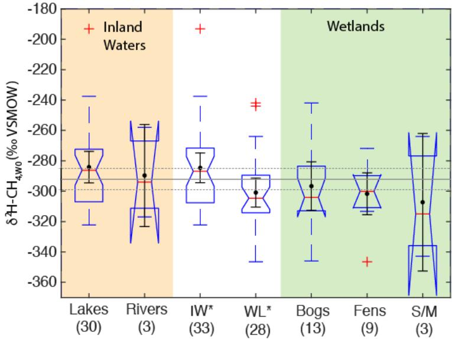
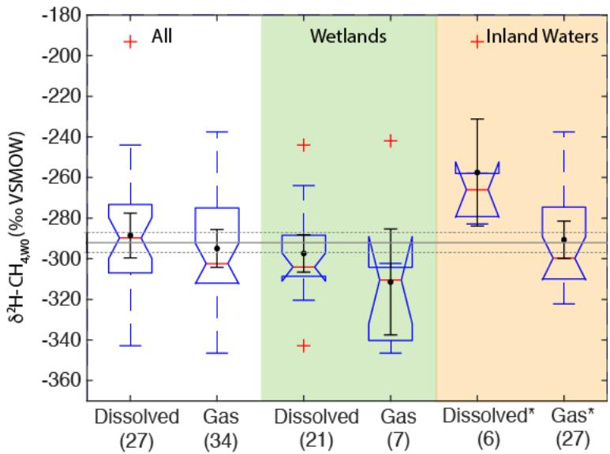

Supplement of

# Geographic variability in freshwater methane hydrogen isotope ratios and its implications for global isotopic source signatures

Peter M. J. Douglas et al.

Correspondence to: Peter M. J. Douglas (peter.douglas@mcgill.ca)

The copyright of individual parts of the supplement might differ from the article licence.

Supplemental Text:

## Details on isotopic vectors for biogeochemical variables:

Methanogenesis pathway: To characterize the $\delta ^ { 1 3 } \mathrm { C - C H } _ { 4 } , \ \delta ^ { 1 3 } \mathrm { C - C O } _ { 2 }$ , and $\mathbf { \alpha } _ { \mathrm { { { d } \alpha } } }$ values of acetoclastic and hydrogenotrophic methanogenesis we used the center points of the fields for these two pathways in Figure 8 of Whiticar (1999). Specifically, for acetoclastic methanogenesis we used the following values: $\delta ^ { 1 3 } \mathrm { C - C H } _ { 4 }$ $\mathbf { \delta } = - 6 0 \% \mathbf { \delta } 0 \mathbf { \delta } \mathrm { ; ~ } \delta ^ { 1 3 } \mathbf { C } \mathbf { - } \mathbf { C O } _ { 2 } = - 1 8 \% \mathbf { \delta } 0 \mathbf { \delta } \mathrm { ; ~ }$ and $\mathbf { \vec { a } } _ { \mathrm { C } } = 1 . 0 4 4$ . For hydrogenotrophic methanogenesis we used the following values: $\delta ^ { 1 3 } \mathrm { C - C H } _ { 4 } = - 7 5 \% \mathrm { o } ; \delta ^ { 1 3 } \mathrm { C - C O } _ { 2 } = 0 \% \mathrm { o } ;$ and $\mathbf { \alpha } _ { \mathbf { C } } = 1 . 0 8 1$ . These values are approximate, as discussed in the text in section 3.4, but are frequently applied as end-member values for acetoclastic and hydrogenotrophic methanogenesis in environmental studies.

To characterize the $\delta ^ { 2 } \mathrm { H - C H } _ { 4 , \mathrm { W 0 } }$ value for acetoclastic and hydrogenotrophic methanogenesis we used the intercept of the freshwater $\mathrm { C H } _ { 4 }$ and marine $\mathrm { C H } _ { 4 }$ fields of Figure 10 of Whiticar (1999) with a $\delta ^ { 2 } \mathrm { H } \cdot$ $_ \mathrm { H _ { 2 } O }$ value of $0 \text{‰}$ Specifically, for acetoclastic methanogenesis we used a value of -330‰, and for hydrogenotrophic methanogenesis we used a value of $- 2 3 0 \text{‰}$ . These values are approximate, and as discussed in section 3.4 the role of methanogenesis pathway in controlling $\delta ^ { 2 } \mathrm { H - C H } _ { 4 }$ has been questioned (Waldron et al., 1998;Waldron et al., 1999). However, these values represent the expected values under the paradigm that methanogenesis pathway does in fact control $\delta ^ { 2 } \mathrm { H - C H } _ { 4 }$ . As discussed in Sections 3.3 and 3.4, in reality differences in $\delta ^ { 2 } \mathrm { H - C H } _ { 4 , \mathrm { W 0 } }$ between pathways likely vary as a function of the $\ S ^ { 2 } \mathrm { H }$ of acetate, as well as differences in the kinetic isotope effect and enzymatic reversibility associated with these pathways.

$C H _ { 4 }$ Oxidation: To characterize the $\delta ^ { 1 3 } \mathrm { C - C H } _ { 4 } , \delta ^ { 1 3 } \mathrm { C - C O } _ { 2 } .$ and $\mathbf { \alpha } _  \mathrm { { { d } \mathrm { { c } \} } } }$ values of oxidized $\mathrm { C H } _ { 4 }$ we used the center points of the field for methane oxidation in Figure 8 of Whiticar (1999). Specifically, we used the following values: $\delta ^ { 1 3 } \mathrm { C - C H } _ { 4 } = - 4 0 \% ; \delta ^ { 1 3 } \mathrm { C - C O } _ { 2 } = - 2 5 \% \mathrm { o } ;$ and $\mathbf { a } _ { \mathrm { C } } = 1 . 0 1 6$ These values are approximate, as discussed in the text in section 3.4, but are frequently applied as end-member values for oxidized $\mathrm { C H } _ { 4 }$ in environmental studies. To characterize the $\delta ^ { 2 } \mathrm { H - C H } _ { 4 , \mathrm { W 0 } }$ value for oxidized methane we used the prediction shown in Figure 5 of Whiticar (1999), specifically using a value of -150‰. This value, and the $\bar { 8 } ^ { 1 3 } \mathrm { C }$ value above, is consistent with model predictions of nearly complete, closed-system aerobic methane oxidation from Wang et al. (2016). The vectors shown in Figure 6 do not extend to this fully oxidized methane value in order to fit within the figure axes. Anaerobic $\mathrm { C H } _ { 4 }$ oxidation may have a different isotopic vector, but we did not consider this since aerobic CH4 oxidation is typically considered to be more prevalent in freshwater environments.

Gas-phase diffusion: We estimated the effects of gas phase diffusion using the equations presented by Chanton (2005). We specifically calculated diffusive fractionation for $\mathrm { C H } _ { 4 }$ and $\mathrm { C O } _ { 2 }$ in air. Gas-liquid diffusion isotopic fractionation is predicted to be much smaller by (Chanton, 2005), and we did not specifically calculate this. Diffusive fractionation for $\mathrm { C H } _ { 4 }$ and $\mathrm { C O } _ { 2 }$ in air is most likely to be important for environments with plant-mediated gas transport. We calculated the isotopic composition of residual gas left following diffusive gas loss, and we did not calculate the effects of progressive Rayleigh fractionation. The vector for diffused gas would extend in the opposite direction. Specific values for residual gas affected by diffusive gas, starting with the values for acetoclastic methanogenesis reported above, transport are as follows: $\delta ^ { 1 3 } \mathrm { C } \mathrm { - } \mathrm { C H } _ { 4 } = - 4 1 . 7 \% \mathrm { o } \mathrm { o } ; \delta ^ { 2 } \mathrm { H } \mathrm { - } \mathrm { C H } _ { 4 , \mathrm { W } 0 } = - 3 1 7 \% \mathrm { o } ; \delta ^ { 1 3 } \mathrm { C } \mathrm { - } \mathrm { C O } _ { 2 } = - 1 3 . 7 \% \mathrm { o } ;$ and $\mathbf { a } _ { \mathrm { C } } { = } 1 . 0 3 2$

Enzymatic reversibility: The effect of enzymatic reversibility or thermodynamic favorability on $\mathrm { C H } _ { 4 }$ isotopic fractionation is an intriguing idea that is not yet well constrained. These hypothesized effects are based on experiments wherein $\bar { \delta } ^ { 1 3 } \mathrm { C - } \mathrm { \bar { C } H } _ { 4 } , \delta ^ { 1 3 } \mathrm { C - } \mathrm { C O } _ { 2 } .$ , and $\mathbf { \alpha } _ { \mathrm { { { d } \alpha } } }$ values co-varied with estimates of Gibbs free energy (ΔG) (Valentine et al., 2004;Penning et al., 2005) or wherein $\delta ^ { 2 } \mathrm { H - C H } _ { 4 }$ co-varied with methane production rate (Valentine et al., 2004). These effects, at least for $\delta ^ { 2 } \mathrm { H - C H } _ { 4 } ,$ are also supported by isotopic modeling (Stolper et al., 2015), and co-variation of $\mathbf { \alpha } _ { \mathrm { Q H } }$ with clumped isotope measurements of $\mathrm { C H _ { 4 } }$ (Stolper et al., 2015; Douglas et al., 2017). Defining isotopic vectors for this variable is challenging because it has not been studied experimentally in terms of $\delta ^ { 1 3 } \mathrm { C - C H } _ { 4 }$ and $\ S ^ { 2 } \mathrm { H - C H _ { 4 } }$ simultaneously. We use the experimental results of (Penning et al., 2005), specifically focusing on an experiment with a cellulose substrate, to define the changes in $\ S ^ { 1 3 } \mathrm { C - C H _ { 4 } }$ (decrease of 27‰), $\ S ^ { 1 3 } \mathrm { C - C O } _ { 2 }$ (increase of 8‰), and $\mathbf { \alpha } _ { \mathrm { { { d } \mathrm { { C } } } } }$ (increase of 0.04) values as the methanogenesis reaction ΔG shifts from being more favorable (-80 kJ/mol)

to less favourable (-20 kJ/mol). These results are similar to changes in $\mathbf { \alpha } _ { \mathrm { { { d } \mathrm { { C } } } } }$ as a function of $\mathrm { H } _ { 2 }$ partial pressure, and therefore ΔG, observed by (Valentine et al., 2004), although in that study differences in $\delta ^ { 1 3 } \mathrm { C } .$ $\mathrm { C O } _ { 2 }$ were minimal. We define changes in $\ S ^ { 2 } \mathrm { H - C H _ { 4 } }$ based on observed changes as a function of $\mathrm { C H } _ { 4 }$ production rate by (Valentine et al., 2004), specifically an increase of approximately 94‰ at low production rates (\~250 µmol/hour) relative to high production rates (\~700 µmol/hour). Since the carbon and hydrogen isotope effects were not observed in the same experiment, their correspondence is speculative, and requires further validation. We include this effect in Figure $^ { 6 , }$ despite its uncertainty, for the sake of discussing a comprehensive set of possible variables influencing $\delta ^ { 2 } \mathrm { H - C H _ { 4 } }$ .

It is important to note that the enzymatic reversibility effect has only been studied in terms of hydrogenotrophic methanogenesis, both experimentally (Valentine et al., 2004;Penning et al., 2005) and in models (Stolper et al., 2015). It is unclear whether it also applies, and whether it would have the same magnitude, in acetoclastic methanogenesis, $_ { \mathrm { o r } }$ in environmental systems with multiple pathways of methanogenesis. As shown in Figure $^ { 6 , }$ the direction and magnitude of the proposed isotopic vectors for the enzymatic reversibility effect is similar to that inferred for changes in the pathway of methanogenesis, and given the uncertainty described above, at present these two variables cannot be differentiated on the basis of isotopic measurements in environmental systems.

  
Supplemental Figure S1: Boxplot of $\ S ^ { 2 } \mathbf { H } \mathbf { \mathrm { - C H } } _ { 4 , \mathbf { W 0 } }$ for sites differentiated by ecosystem type for sites with measured ${ \mathfrak { s } } ^ { 2 } \mathbf { H } \mathbf { - } \mathbf { H } _ { 2 } \mathbf { O } .$ . Numbers in parentheses indicate the number of sites for each category. There are no rice paddy sites in the dataset with measured ${ \delta } ^ { 2 } \mathbf { H } \mathbf { - } \mathbf { H } _ { 2 } \mathbf { O } .$ . Boxplot parameters are as in Fig. 7. Black points and error bars indicate the category mean and 95% confidence interval of the mean. Gray lines indicate the mean values across all categories and the dashed lines indicate the 95% confidence interval of this value. IW- Inland Waters; WL- Wetlands; S/M- Swamps and marshes. Asterisks indicate that inland waters and wetlands have significantly different distributions.

  
Supplemental Figure S2: Boxplot of $\ S ^ { 2 } \mathbf { H } \mathbf { \mathrm { - C H } } _ { 4 , \mathbf { W 0 } }$ for sites differentiated by sample type for sites with measured $\delta ^ { 2 } \mathbf { H } \mathbf { - } \mathbf { H } _ { 2 } \mathbf { O } .$ . Numbers in parentheses indicate the number of sites for each category. Boxplot parameters are as in Fig. 7. Black points and error bars indicate the category mean and 95% confidence interval of the mean. Gray lines indicate the mean values across all categories and the dashed lines indicate the 95% confidence interval of this value. Asterisks indicate that dissolved and gas-phase $\mathbf { C H _ { 4 } }$ samples from inland water sites have significantly different distributions.

## References

Chanton, J. P.: The effect of gas transport on the isotope signature of methane in wetlands, Org Geochem, 36, 753-768, 2005.

Douglas, P. M., Stolper, D. A., Eiler, J. M., Sessions, A. L., Lawson, M., Shuai, Y., Bishop, A., Podlaha, O.

G., Ferreira, A. A., and Neto, E. V. S.: Methane clumped isotopes: progress and potential for a new isotopic tracer, Org Geochem, 113, 262-282, 2017.

Penning, H., Plugge, C. M., Galand, P. E., and Conrad, R.: Variation of carbon isotope fractionation in

hydrogenotrophic methanogenic microbial cultures and environmental samples at different energy status, Global Change Biol, 11, 2103-2113, 2005.

Stolper, D., Martini, A., Clog, M., Douglas, P., Shusta, S., Valentine, D., Sessions, A., and Eiler, J.:

Distinguishing and understanding thermogenic and biogenic sources of methane using multiply substituted isotopologues, Geochim Cosmochim Ac, 161, 219-247, 2015.

Valentine, D. L., Chidthaisong, A., Rice, A., Reeburgh, W. S., and Tyler, S. C.: Carbon and hydrogen isotope fractionation by moderately thermophilic methanogens, Geochim Cosmochim Ac, 68, 1571-1590, 2004.

Waldron, S., Watson‐Craik, I. A., Hall, A. J., and Fallick, A. E.: The carbon and hydrogen stable isotope composition of bacteriogenic methane: a laboratory study using a landfill inoculum, Geomicrobiology Journal, 15, 157-169, 1998.

Waldron, S., Lansdown, J., Scott, E., Fallick, A., and Hall, A.: The global influence of the hydrogen iostope composition of water on that of bacteriogenic methane from shallow freshwater environments, Geochim Cosmochim Ac, 63, 2237-2245, 1999.

Wang, D. T., Welander, P. V., and Ono, S.: Fractionation of the methane isotopologues $^ { 1 3 } \mathrm { C H } _ { 4 } , \ ^ { 1 2 } \mathrm { C H } _ { 3 } \mathrm { D } ,$ , and

13 CH3D during aerobic oxidation of methane by Methylococcus capsulatus (Bath), Geochim Cosmochim Ac, 192, 186-202, 2016.

Whiticar, M. J.: Carbon and hydrogen isotope systematics of bacterial formation and oxidation of methane, Chem Geol, 161, 291-314, 1999.