# JGR Atmospheres

# RESEARCHARTICLE

10.1029/2024JD041266

# Key Points:

·Bottom-up estimates of natural $\mathrm { C H } _ { 4 }$ emissions are too high,while bottomup estimates of anthropogenic $\mathrm { C H } _ { 4 }$ emissions are not too low Our global total emissions from the fossil fuel industry are $3 0 \%$ lower than previous isotope-based studies Atmospheric $\Delta { } ^ { 1 4 } \mathrm { C }$ data constrain lower anthropogenic fossil sources, consistent with a data-based estimate for nuclear $^ { 1 4 } \mathrm { C H } _ { 4 }$ emissions

# Supporting Information:

Supporting Information may be found in the online version of this article.

# Correspondence to:

R. Fujita, ryo.fujita@ mri-jma.go.jp

# Citation:

Fujita,R.,Graven,H.,Zazzeri,G.,Hmiel, B.,Petrenko,V.V., Smith,A.M., et al. (2025).Global fossil methane emissions constrained by multi-isotopic atmospheric methane histories.Journal of Geophysical Research:Atmospheres,130, e2024JD041266.https://doi.org/10.1029/ 2024JD041266

Received2 APR2024   
Accepted 31 OCT 2024

# Global Fossil Methane Emissions Constrained by Multi-Isotopic Atmospheric Methane Histories

Ryo Fujita1,2 , Heather Graven1 $\textcircled{1}$ , Giulia Zazzeri1,3, Benjamin Hmiel45, Vasilii V. Petrenko4 ①, Andrew M. Smith6 $\textcircled{1}$ , Sylvia E. Michel7,and Shinji Morimoto8 $\textcircled{1}$

1DepartmentofPhysics,ImperialCollgeLondon,London,UK,²MeteorologicalResearchInstitute,Japan Meteorological Agency,Tsukuba,Japan,RicercasulstemaEnergetico(RSE),Milan,Italy,4DepartmentofEarthandEnvirontal Sciences,Universityfochester,Rochester,NY,UA,EnvironmentalDefenseFund,NewYork,NY,UA,Ctrefor Accelerator Science,Australian Nuclear Science andTechnologyOrganisation (ANSTO),Lucas Heights,NSW,Australia, Institute of ArcticandAlpine Research,Universityof Colorado,Bouder, CO,USA,Center forAtmospheric and Oceanic Studies,Graduate School of Science,Tohoku University,Sendai, Japan

Abstract The global $\mathrm { C H } _ { 4 }$ budget of sources and sinks is highly uncertain, particularly the emissions from specific sources such as fossil fuels (FF)or agriculture.Here,we estimate plausible global $\mathrm { C H } _ { 4 }$ source and sink scenarios using historical observations and simulations of atmospheric $\mathrm { C H } _ { 4 }$ mole fraction and its stable isotopic $( \delta ^ { 1 3 } \mathrm { C - C H _ { 4 } }$ ， $\delta \mathrm { D - C H } _ { 4 } ,$ and radiocarbon $\mathrm { ( } \Delta ^ { 1 4 } \mathrm { C - C H _ { 4 } ) }$ composition,combining constraints from allthese tracers for the first time. We employ aone-box model along with a Monte Carlo particle filter technique,explicitly exploring the impact of each isotopic constraints and uncertainties in prior $\mathrm { C H } _ { 4 }$ source and sink parameters on posterior sectorial source fractions.We find our posterior anthropogenic FF emissions at the global scale are $3 0 \%$ lower than previous isotope-based studies. Our analysis suggests previous $\delta ^ { 1 3 } \mathrm { C - C H } _ { 4 }$ -based studies are potentially biased because the current database-derived estimate of the global mean biogenic $\delta ^ { 1 3 } \mathrm { C - C H } _ { 4 }$ source signature is too low and/or current sink-weighted total carbon kinetic isotope effect is underestimated.We find modern atmospheric $\Delta ^ { 1 4 } \mathrm { C - C H _ { 4 } }$ data constrains lower global FF emissons after 198Os,which is contrary to the most recent finding that utilized atmospheric $\Delta ^ { 1 4 } \mathrm { C - C H _ { 4 } }$ data, but supported by an independent estimate of global nuclear $^ { 1 4 } \mathrm { C H } _ { 4 }$ emissions. Our multi-isotopic constraints align with $\mathrm { C H } _ { 4 }$ -only inversion results, while reducing their uncertainties with greater robustness against different prior emission scenarios. We find strong constraints not only onFF emissions but also other key sources and sinks,showing that long-term multi-isotopic observations are critical for refining the global $\mathrm { C H } _ { 4 }$ budget and developing effective $\mathrm { C H } _ { 4 }$ emission mitigation strategies.

Plain Language Summary Reduction of methane $\mathrm { ( C H _ { 4 } ) }$ emissions is a key element of climate change mitigation. However,studies using different techniques to quantify emissions from specific sources (e.g.,fossil fuel (FF) or agriculture) are in conflict.Isotopic tracers are useful because different $\mathrm { C H } _ { 4 }$ sources have dierent isotopic signatures, especially radiocarbon for distinguishing between fossil and biogenic sources,but most studies have not used all data available or accounted for all relevant uncertainties in parameters related to the isotopic methane budget. Here,we synthesize al available constraints from atmospheric $\mathrm { C H } _ { 4 }$ concentration and its major isotopologues ( $\cdot ^ { 1 3 } \mathrm { C H } _ { 4 }$ ， $\mathrm { C H } _ { 3 } \mathrm { D }$ ,and $^ { 1 4 } \mathrm { C H } _ { 4 } \mathrm { . }$ )for 1750-2015, considering the relevant uncertainties,to estimate global $\mathrm { C H } _ { 4 }$ emissions and sinks.We find our global total emissions from the FF industry are lower than other previous isotope-based studies. Our study provides critical constraints on the global $\mathrm { C H } _ { 4 }$ emissions,which can support climate mitigation efforts,including the Global Methane Pledge.

# 1. Introduction

Atmospheric $\mathrm { C H } _ { 4 }$ concentration has more than doubled over the industrial era,with anthropogenic $\mathrm { C H } _ { 4 }$ emissions contributing ${ \sim } 3 0 \%$ to anthropogenic greenhouse gas effective radiative forcing over 1750-2019 (IPCC, 2021), while the $\mathrm { C H } _ { 4 }$ growth rate has varied substantially in recent years with record high growth in 2O2O and 2021 (Dlugokencky et al.,2021). The partitioning of $\mathrm { C H } _ { 4 }$ sources and their contributions to $\mathrm { C H } _ { 4 }$ growth rate variations is an area of controversy and uncertainty,primarily because there is a wide range of poorly quantified anthropogenic sources (e.g.,，agriculture,landfils,fossil fuels (FFs))， natural sources (e.g.，wetlands,freshwater, geological processes),and sinks (mainly chemical reactions with OH)(Saunois et al.,202O).The uncertainties in the $\mathrm { C H } _ { 4 }$ budget limit the creation of effective mitigation policies and the prediction of future $\mathrm { C H } _ { 4 }$ radiative forcing.

A key question is the atribution of total fossil sources (i.e.,FF industries plus natural geologic seepage) versus biogenic sources to the global $\mathrm { C H } _ { 4 }$ budget. Several recent studies have indicated that $\mathrm { C H } _ { 4 }$ emissions from the FF industry could be underestimated by botom-up inventory estimates (e.g.,Hmiel et al.，202O；Schwietzke et al.,2O16).Further,atmospheric measurements have detected underestimated fugitive $\mathrm { C H } _ { 4 }$ emissions from FF productionregions (Alvarez et al.,2018),flaring sites (Plant et al.,2O22),and some urban regions (Sargent et al., 2021),as well as unexpected $\mathrm { C H } _ { 4 }$ “superemitters”(Lauvaux et al.,2O22).However, the global significance of underestimated fugitive emissions is not yet clear.

Atmospheric isotopic analyses,which exploit differing isotopic source signatures in stable isotopes ( $^ { 1 3 } \mathrm { C H } _ { 4 }$ and $\mathrm { C H } _ { 3 } \mathrm { D } )$ and radiocarbon $\mathrm { ( ^ { 1 4 } C H _ { 4 } ) }$ , indicate the total fossl sources comprise $2 8 \% - 3 3 \%$ of global emissions (Fujita et al.,2020;Lan et al.,2021; Lassey,Lowe et al.,2007; Schwietzke et al.,2016),whereas the Global Carbon Project (GCP） suggest only $2 1 \% - 2 4 \%$ (Saunois et al.,202O).Radiocarbon is an excellent fossil $\mathrm { C H } _ { 4 }$ tracer because radioactive decay over millions of years removed $^ { 1 4 } \mathrm { C H } _ { 4 }$ in fossil $\mathrm { C H } _ { 4 }$ (Lassey,Lowe et al., 2007). Ice core and firn air atmospheric $\Delta ^ { 1 4 } \mathrm { C - C H _ { 4 } }$ data show that natural geological emissions are small (Hmiel et al.,202O),suggesting that the vast majorityofthese extra fosil emissions are fromthe FF industry,whereas bottom-up estimates of natural geological emissions indicate they could comprise up to ${ \sim } 4 0 \%$ of total fossil emissions (Etiope & Schwietzke,2019). Challenges with applying $\Delta ^ { 1 4 } \mathrm { C - C H _ { 4 } }$ data are that data are sparse and recent atmospheric $\Delta ^ { 1 4 } \mathrm { C - C H _ { 4 } }$ is also influenced by uncertain nuclear power plant (NPP) emissions (Lassey, Etheridge,etal.,20o7; Lassey,Lowe et al.,2Oo7).Stable isotopic approachesalso exploit differences insotopic signatures of diffrent sources,but suffer from significant uncertainty of the major isotopic source signatures as well as OH variability and its kinetic isotope effect (KIE),leading to ambiguous source attributions (Lan et al.,2021; Rigby et al.,2017; Turner et al.,2017). Two recent $\delta ^ { 1 3 } \mathrm { C - C H } _ { 4 }$ inversion studies agree that uncertainties limit the application of $\delta ^ { 1 3 } \mathrm { C - C H } _ { 4 }$ measurements in $\mathrm { C H } _ { 4 }$ source attribution, but come to different conclusions: Thanwerdas et al. (2O22) highlight the impact of uncertainties in $\delta ^ { 1 3 } \mathrm { C - C H } _ { 4 }$ source signatures on sectorial source atributions, whereas Basu et al. (2O22)suggest the uncertainties in KIEs are more important than the $\delta ^ { 1 3 } \mathrm { C - C H } _ { 4 }$ source signatures.

Here,we synthesize all available constraints from atmospheric $\mathrm { C H } _ { 4 }$ ， $\delta ^ { 1 3 } \mathrm { C - C H } _ { 4 }$ ， $\delta \mathrm { D - C H _ { 4 } }$ ,and $\Delta ^ { 1 4 } \mathrm { C - C H _ { 4 } }$ observations for the first time to estimate plausible global $\mathrm { C H } _ { 4 }$ source and sink scenarios over 1750-2015.We utilize aone-box atmospheric model and a particlefilter(PF)(or sequential Monte Carlo filter) approach (Doucet et al.,2001; Kitagawa,1996) to optimize global $\mathrm { C H } _ { 4 }$ source and sink parameters.We derive posterior distributions of the $\mathrm { C H } _ { 4 }$ source strengths as well as their isotope source signatures, total $\mathrm { C H } _ { 4 }$ loss rate,KIEs,biospheric turnover time,and average NPP $^ { 1 4 } \mathrm { C H } _ { 4 }$ emissions factor by evaluating the simulations against historical global observational target ranges.In this study,we chose a one-box model over a 3D transport model, prioritizing simplicity,computational cost,and transparency for the scope of this study. Our simple box model approach enables us to utilize not only $\delta ^ { 1 3 } \mathrm { C - C H } _ { 4 }$ ,which is relatively well sampled globally,but also $\delta \mathrm { D - C H _ { 4 } }$ and $\Delta { } ^ { 1 4 } \mathrm { C } .$ $\mathrm { C H } _ { 4 }$ ,whose spatiotemporal data coverage is still sparse and thus have not been incorporated into 3D model inversions so far.By leveraging the cheap calculation cost,we perform large ensemble simulations (100.000 realizations per each prior emission scenario)as well as many sensitivity tests to explore the impact of individual data constraints and individual uncertainties in $\mathrm { C H } _ { 4 }$ source and sink parameters when deriving sectorial $\mathrm { C H } _ { 4 }$ source emissions.

# 2.Methods

# 2.1. Model Description

We conduct numerous forward simulations of $\mathrm { C H } _ { 4 }$ ， $^ { 1 3 } \mathrm { C H } _ { 4 }$ , $\mathrm { C H } _ { 3 } \mathrm { D }$ ,and $^ { 1 4 } \mathrm { C H } _ { 4 }$ using aone-box model with varying parameters. Follwing Lassey,Etheridge,et al. (2OO7), simple global mass balance equations for total $\mathrm { C H } _ { 4 }$ $^ { 1 3 } \mathrm { C H } _ { 4 }$ ， $\mathrm { C H } _ { 3 } \mathrm { D }$ and $^ { 1 4 } \mathrm { C H } _ { 4 }$ were prepared as follows:

$$
\frac { d C _ { \mathrm { A T M } } } { d t } = \sum _ { i = 1 } ^ { N } E _ { \mathrm { s r c } ( i ) } - \frac { C _ { \mathrm { A T M } } } { \lambda _ { \mathrm { t o t } } }
$$

$$
\frac { d ( C _ { \mathrm { A T M } } R _ { 1 3 C _ { \mathrm { - } } \mathrm { A T M } } ) } { d t } = \sum _ { i = 1 } ^ { N } E _ { \mathrm { s r c } ( i ) } R _ { 1 3 C _ { \mathrm { - } } \mathrm { s r c } ( i ) } - \frac { 1 } { \mathrm { K I E } ^ { C } \lambda _ { \mathrm { t o t } } } C _ { \mathrm { A T M } } R _ { 1 3 C _ { \mathrm { - } } \mathrm { A T M } }
$$

$$
\frac { d ( C _ { \mathrm { A T M } } R _ { D _ { - } \mathrm { A T M } } ) } { d t } = \sum _ { i = 1 } ^ { N } E _ { \mathrm { s r c } ( i ) } R _ { D _ { - } \mathrm { s r c } ( i ) } - \frac { 1 } { \mathrm { K I E } ^ { D } \lambda _ { \mathrm { t o t } } } C _ { \mathrm { A T M } } R _ { D _ { - } \mathrm { A T M } }
$$

$$
\frac { d ( C _ { \mathrm { A T M } } R _ { 1 4 C _ { \mathrm { - } } \mathrm { A T M } } ) } { d t } = \sum _ { i = 1 } ^ { N } E _ { \mathrm { s r c } ( i ) } R _ { 1 4 C _ { \mathrm { - } } \mathrm { s r c } ( i ) } + \phi W _ { \mathrm { P W R } } - \left( \left( \frac { 1 } { \mathrm { K I E } ^ { C } } \right) ^ { 2 } \frac { 1 } { \lambda _ { \mathrm { t o t } } } + \frac { 1 } { \lambda _ { \mathrm { r } } } \right) C _ { \mathrm { A T M } } R _ { 1 4 C _ { \mathrm { - } } \mathrm { A T M } }
$$

where $C _ { \mathrm { A T M } }$ is the atmospheric burden of total $\mathrm { C H } _ { 4 }$ ； $R _ { 1 3 C } , R _ { D } ,$ and $R _ { 1 4 C }$ denote the absolute stable carbon, hydrogen，and radiocarbon isotope ratios (i.e., $^ { 1 3 } \mathrm { C H } _ { 4 } .$ /total $\mathrm { C H } _ { 4 }$ $\mathrm { C H } _ { 3 } \mathrm { D } /$ total $\mathrm { C H } _ { 4 }$ and $^ { 1 4 } \mathrm { C H } _ { 4 ^ { \prime } }$ /total $\mathrm { C H } _ { 4 } )$ respectively, of atmosphere (ATM) and respective source categories (src); $E$ indicates the global $\mathrm { C H } _ { 4 }$ emissions of respective source categories; $N$ is the number of source categories, equal to five,consisting of anthropogenic biogenic (BIO), natural BIO,anthropogenic FF, geologic (GEO),and biomass burning (BB) sources; λ denotes the atmospheric lifetime for total $\mathrm { C H } _ { 4 }$ sink processes (tot) and radioactive decay (r); ${ \mathrm { K I E } } ^ { \mathrm { C } }$ and $\mathrm { K I E } ^ { \mathrm { D } }$ are the sinkweighted total KIEs for stable carbon and hydrogen isotopes, respectively; and $\phi W _ { \mathrm { P W R } }$ represents the direct NPP $^ { 1 4 } \mathrm { C H } _ { 4 }$ emissions where $W _ { \mathrm { P W R } }$ is the annual electrical power production by pressurized water reactors (PWR and $\phi$ is the $^ { 1 4 } \mathrm { C H } _ { 4 }$ emissions per annual electrical power production (i.e., NPP $^ { 1 4 } \mathrm { C H } _ { 4 }$ emission factor) $\left( \mathrm { G B q / G W a } \right)$ The atmospheric $^ { 1 3 } \mathrm { C H } _ { 4 }$ ， $\mathrm { C H } _ { 3 } \mathrm { D }$ and $^ { 1 4 } \mathrm { C H } _ { 4 }$ are convertible to $\delta ^ { 1 3 } \mathrm { C - C H } _ { 4 }$ $\delta \mathrm { D - C H _ { 4 } }$ ,and $\Delta ^ { 1 4 } \mathrm { C - C H _ { 4 } }$ ,respectively (Text S1 in Supporting Information S1).

We prepared three alternative a priori global $\mathrm { C H } _ { 4 }$ emission scenarios for 175O-2O15 using three different anthropogenic emission inventories: Community Emissions Data System (CEDS) (Hoesly et al.,2018; prepared for Coupled Model Intercomparison Project Phase 6(CMIP6),v2017-05-18)and Emissons Database for Global Atmospheric Research version 5.0 and 6.0 (EDGARv5 and EDGARv6)(Crippa et al.,2020,2021). We used the same a priori estimates of BB,natural BIO,and GEO $\mathrm { C H } _ { 4 }$ sources in all scenarios (Table S2 in Supporting Information S1).For the CEDS scenario, we adopted the global sectorial anthropogenic $\mathrm { C H } _ { 4 }$ emissions for CEDS for 1850-2014 (decadal until 1970 and yearlyafterward).For the EDGAR scenarios, we reconstructed the historical emissions using EDGAR-HYDE v1.4 for 1890-1960 (decadal) (Olivier & Berdowski,2001;van Aardenne et al.,2001),and combined it with EDGARv5.0or EDGARv6.0 for 1970-2015 (yearly). The a priori anthropogenic $\mathrm { C H } _ { 4 }$ emissions in 1750 were specified fromLassey,Etheridge,et al. (2O07) for each source category,the $\mathrm { C H } _ { 4 }$ emissions for EDGAR in 185O were specified by CEDS,and the $\mathrm { C H } _ { 4 }$ emissions for CEDS in 2015 were specified by Gidden et al. (2Ol9).To keep the data consistency where annual data were unavailable,each source emission was linearly interpolated using the adjacent available data.For BB $\mathrm { C H } _ { 4 }$ emissions,the annual mean historical global emission data set for CMIP6 (BB4CMIP)(van Marle et al.,2017)over 1750-2015 was used for all three scenarios.We includedresidential,commercial,and othersectors (called“RCO"in CEDSor“1.a.dOthersectors” in EDGAR) into anthropogenic FF emissions,assuming this combustion was from FFs.A sensitivity test was performed to investigate the impact of this choice (RCOem; Table S3 in Supporting Information S1).Timeinvariant a priori natural $\mathrm { C H } _ { 4 }$ emissions (e.g.,wetland,freshwater,and GEO) were taken from bottom-up averages for 2000-2009 (Saunois et al.,2020)(Table S2 in Supporting Information S1).Sensitivity tests were also performed for different a priori interannually varying natural wetland emission scenarios (IAWetBIOem; Table S3 in Supporting Information S1).Emissions from freshwater systems vary widely between bottom-up and top-down estimates ( $\mathrm { ( 1 3 4 - 2 8 4 ~ T g ~ C H _ { 4 } ~ y r ^ { - 1 } }$ vs. less than $3 0 \mathrm { T g } \mathrm { C H } _ { 4 } \mathrm { y r } ^ { - 1 }$ ; Saunois et al., 2O2O); thus,a scenario excluding freshwater emissons were also examined in a sensitivity test (NoFRESHem; Table S3 in Supporting Information S1).

Our a priori atmospheric total $\mathrm { C H } _ { 4 }$ lifetime is based on Prather et al. (2012) $9 . 1 \pm 0 . 9$ years),which is constrained by atmospheric methyl chloroform (MCF)for tropospheric OHand literature-based estimates for the other sinks (i.e.,soil oxidations,stratospheric losses,and tropospheric Cl).To consider the potential time evolutions of atmospheric OH into Prather et al.,2012's scenario,we applied an ensemble mean anomaly (relative to the 1998- 2007 mean)of global OH computed by Earth System Models (ESMs) that participated in the CMIP6 (Stevenson et al.,2020) to the loss rate of tropospheric $\mathrm { C H } _ { 4 }$ OHreactions in Prather et al.(2012).The prior OH anomaly from Stevenson et al. (2020) used in our base simulation shows little changes from 1850 to 1980,followed by strong increases by $9 \%$ through 2014.In contrast,recent MCF-based OH shows downward trends by about $8 \%$ since

2005 (Rigby et al.,2017; Turner et al.,2017） or rather stable trends since 2000 (Naus et al.,2021; Patra et al.,2021),the latter being consistent with the empirical reconstruction estimate(Nicely et al.,2018).We therefore tested the sensitivityof diffrent prior OH scenarios for the recent decades as time-invariant or from recent MCF-based estimates (OHtrend; Table S3 in Supporting Information S1). Note that because we did not explicitly simulate diferent loss processes in the model(see Equations 1-4),such time variations of tropospheric OH need to be interpreted as those of total loss rates after the sink fractions in Prather et al.(2O12) is applied.

The $W _ { \mathrm { P W R } }$ were taken fromLassey,Etheridge,etal. (2007) for 1960-1971 and assumed to be zero before 1960.For 1972-2015,the database of annual energy output for PWRs from International Atomic Energy Agency's Power Reactor Information System (IAEA PRIS,2O17) was used.The absolute radiocarbon isotope ratio of biospheric (i.e., BIO and BB) sources, $R _ { 1 4 C \_ { \mathrm { b i o s } } }$ ,was calculated following Lassey, Etheridge, et al. (2007) as follows:

$$
R _ { 1 4 C _ { - } \mathrm { b i o s } } ( t ) = \int _ { 0 } ^ { \infty } \left( 1 + \Delta ^ { 1 4 } \mathrm { C O } _ { 2 } ( t - t ^ { \prime } ) / 1 0 0 0 \right) F ( t ^ { \prime } ) \exp \left( - \lambda _ { \mathrm { r } } t ^ { \prime } \right) d t ^ { \prime }
$$

$$
F ( t ^ { \prime } ) = \frac { \exp { ( - t ^ { \prime } / \tau _ { \mathrm { b i o s } } ) } } { \tau _ { \mathrm { b i o s } } }
$$

where $\Delta ^ { 1 4 } \mathrm { C O } _ { 2 }$ is the time series of atmospheric $\Delta ^ { 1 4 } \mathrm { C - C O } _ { 2 } , F ( t ^ { \prime } )$ is an exponential distribution oflag times (i.e, the residence time of the biospheric carbon before it is released as $\mathrm { C H } _ { 4 }$ ,and $\tau _ { \mathrm { b i o s } }$ is the mean biospheric turnover time. Historical global atmospheric $\Delta { ^ { 1 4 } \mathrm { C } } { \mathrm { - C O } } _ { 2 }$ observations were taken from Graven et al. (2017) over 1850-2015 (yearly)and Reimer et al. (2013) before 1850. $\lambda _ { \mathrm { r } }$ is set to be 8,267 years. $R _ { 1 4 C \_ \mathrm { b i o s } }$ was simulated for $\tau _ { \mathrm { b i o s } }$ of $1 -$ 12 years with1-year increments over 1750-2015,andthen interpolated forfractional yearvalues of $\tau _ { \mathrm { b i o s } }$

# 2.2. Particle Filter Approach

We used the particle filter (PF) approach based on a Monte Carlo (MC) method for non-Gaussan nonlinear filtering and smoothing (Doucet et al.,2001; Kitagawa,1996) to estimate the posterior distributions of 20 parameters in $\mathrm { C H } _ { 4 }$ sources and sinks—the scaling factors,which adjust the prior $\mathrm { C H } _ { 4 }$ emissions and loss rates $( f )$ ， $\delta ^ { 1 3 } C$ and $\delta D$ source signatures, ${ \mathrm { K I E } } ^ { \mathrm { C } }$ ， $\mathrm { K I E } ^ { \mathrm { D } }$ ， $\tau _ { \mathrm { b i o s } }$ and $\phi$ (Table 1 and Equations 1-6)—over 1750-2015.In the PF,conditional probability density functions are approximated by successive prediction and filtering of many realizations of the state variables (hereafter called “ensembles"). Each ensemble is propagated in time according to the model equations (Equations 1-4) with the 20 parameters (i.e.,prediction).The ensemble is compared to observations and either accepted or rejected using the likelihood function of the observations (i.e.,filtering).The predictionand filtering stage is repeated until the final observation target year,2O15,and finallyatime seres of posterior parameter distributions that match allthe observation targets from 1750 to 2015 is extracted (i.e., smoothing).For the base simulation,we adopted 10o,0oO realizations for each emission scenario,which were separated into 5O sets of 2,Ooo ensembles to utilize a parallel computational technique.

The details of the PF procedure are described as folows.First,initial ensembles of the 2O parameters were randomly generated from their full initial ranges using Latin hypercube sampling.The first target year,1750, was then compared to a 50-year spin-up simulation where allparameters were prescribed to be constant at the initial values (see Text S1 in Supporting Information S1 for more details).From 1750,each ensemble of the 20 parameters, $\pmb \theta$ ,is assumed to follow a random walk model $\pmb { \theta } _ { \mathbf { t } } = \pmb { \theta } _ { \mathbf { t - 1 } } + \pmb { u } _ { \mathbf { t } } ,$ where t represents a time step consisting of 51 target years over 1750-2015 (Table S1 in Supporting Information S1),and $\pmb { u } _ { \mathbf { t } }$ is assumed to follow Gaussian distributions.Potential time variation in parameters after 175O is thus included by resampling the accepted parameters with adding Gaussian noise $u _ { \mathrm { t } }$ whose standard deviation is $\alpha \%$ of the initial parameter ranges, where $\alpha$ is also estimated by the PF for each parameter of each target year. The prior distribution of $\alpha$ is assumed to be uniform whose upper and lower bounds are set tobe [O,10],except time-invariant parameters (geological source parameters, $E _ { \mathrm { g e o } } , \delta ^ { 1 3 } C _ { \mathrm { g e o } } ,$ and $\delta D _ { \mathrm { g e o } } )$ whose $\alpha$ i impact of setting all isotopic parameters to be time-invariant (IsoParaFixT; Table S3 in Supporting Information S1).The parameter values for the period between the adjacent target years are linearly interpolated. When the predicted $\theta _ { t }$ exceeds the upper or the lower bound of the initial prior parameter ranges (Table 1), the $\theta _ { t }$ is replaced by $\theta _ { t - 1 }$ to avoid divergence from prior knowledge.

Table 1 Summary of 20 Parameters and Their Ranges Used in Our Base Simulation   

<table><tr><td>Parameter</td><td>Mean [min., max.]</td><td>Definition</td></tr><tr><td>fanth_bio</td><td>1.0 [0.5, 1.5]a b, c</td><td>Scaling factor that adjusts the prior anthropogenic BIO CH4 emission</td></tr><tr><td>fnatr_bio</td><td>1.0 [0.5, 1.5]a b, c</td><td>Scaling factor that adjusts the prior natural BIO CH4 emission</td></tr><tr><td>fanth_ff</td><td>1.0 [0.5, 1.5]a b, c</td><td>Scaling factor that adjusts the prior anthropogenic FF CH4 emission</td></tr><tr><td>fbb</td><td>2.0 [0.5, 3.5]a, b, c</td><td>Scaling factor that adjusts the prior BB CH4 emission</td></tr><tr><td>Egeo</td><td> 40 [0, 80]d, e</td><td>GEO CH4 emission (Tg CH4 yr-1)</td></tr><tr><td>tbios</td><td>6.5 [1, 12]f</td><td>Biospheric turnover time (year)</td></tr><tr><td>+</td><td>230 [80,380]g</td><td>NPP 14CH4 emission factor (GBq/GWa)</td></tr><tr><td>fioss</td><td>1.0 [0.9, 1.1]h</td><td>Scaling factor that adjusts the prior total CH4 loss rate</td></tr><tr><td>KIEC</td><td>1.0065 [1.005, 1.008]a,b</td><td>Sink-weighted total KIEC</td></tr><tr><td>KIED</td><td>1.275 [1.25, 1.30]a, b</td><td>Sink-weighted total KIED</td></tr><tr><td> s13Canth_bio</td><td>-62.2 [-65.4, -59.0]a</td><td>813C-CH4 for anthropogenic BIO source (%o)</td></tr><tr><td> s13Cnatr_bio</td><td>-62.2[-65.4, -59.0]a</td><td>s1³C-CH4 for natural BIO source (%o)</td></tr><tr><td> s13Canth_ff</td><td>-44.0 [-46.8, -41.2]a</td><td> 813C-CH4 for anthropogenic FF source (%o)</td></tr><tr><td> 813Cbb</td><td>-22.2 [-29.8, -14.6]a</td><td>δl³C-CH4 for BB source (%)</td></tr><tr><td>s13Cgeo</td><td>-49.0 [-52.0, -46.0]i</td><td>δ1³C-CH4 for GEO source (%o)</td></tr><tr><td> δDanth_bio</td><td>-317 [-332, -302]j</td><td>δD-CH4 for anthropogenic BIO source (%o)</td></tr><tr><td> 8Dnatr_bio</td><td>-317 [-332, -302]j</td><td>δD-CH4 for natural BIO source (%o)</td></tr><tr><td> δDanth_ff</td><td>-197[-212, -182]j</td><td>δD-CH4 for anthropogenic FF source (%o)</td></tr><tr><td>8Dbb</td><td>-211[-226, -196]j</td><td>δD-CH4 for BB source (%)</td></tr><tr><td> δD geo</td><td>-197 [-212, -182]]</td><td>δD-CH4 for GEO source (%o)</td></tr></table>

aSchwietzke etal. (2016).Fujita et al.(2020).Saunois et al. (2020).Etiope and Schwietzke (2019).Hmiel etal.(2020). fLasey,Etheridge,etal. (2007). Gravenand Gruber (20). Pratheretal. (2012).Etiopeetal. (2019). iSherwod et al. (2017).

For each prediction stage,the number of ensembles was amplified by 10; that is, $2 , 0 0 0 \times 1 0$ ensembles were generated at each target year for each 50 parallel computation.This is effective to avoid “particle degeneracy"- when only a small number of ensembles has a nonzero importance weight through the filtering and thus the PF approach fails to accurately reproduce the posterior distributions of interest (Doucet et al.2OOl).The log likelihood of each of the 20,oo ensembles in each paralel computation was calculated,and 2,0oo new ensembles were created based on the likelihood and sequential importance sampling with replacement (Doucet et al.,2001; Kitagawa,1996).The likelihood of each ensemble was computed based on the prescribed observation targets (Table S1in Supporting Information S1).After the filtering stage in2015,the filtered ensembles at each time step were sequentially resampled from the stored likelihood to obtain the conditional joint distribution for alltime steps.Thus,a time series of posterior parameter distributions that matchallthe observation targets for 1750-2015 were extracted (see Kitagawa,1996; Doucet et al., 2001 for more details).

# 2.3. Parameters in $\mathbf { C H _ { 4 } }$ Sources and Sinks

Table 1 shows a summary of the 2O parameters in $\mathrm { C H } _ { 4 }$ sources and sinks. Because our prior knowledge on source and sink parameters is uncertain, we specified allparameter ranges to be quite wide in recognition of their uncertainties and realistic boundaries.We assumed that applying a subjective prior mean and standard deviation in prior Gaussian distributions extrapolated from currnt limited observational evidence (e.g., prior isotopic source signatures during a historical period) could introduce biases in their posterior estimates.As a compromise, we applied an initialuniform distribution with wide upper and lower bounds ofeach parameter, which were estimated from the literature (Table 1),and then utilized our atmospheric observational target to progressively optimize the parameters (see Section 3.1).

The scaling factors,which adjust the prior anthropogenic BIO, natural BIO,and anthropogenic FF $\mathrm { C H } _ { 4 }$ emissions $( f _ { \mathrm { a n t h \_ b i o } } , f _ { \mathrm { n a t r \_ b i o } }$ and $f _ { \mathrm { a n t h \_ f f } } ,$ respectively)，were set to be 1.0 [0.5,1.5] (mean and minimummaximum range),and that for BB $\mathrm { C H } _ { 4 }$ emissions $( f _ { \mathrm { b b } } )$ to be 2.0 [0.5,3.5]. They were approximately lower and upper bounds of previous estimates of top-down and bottom-up $\mathrm { C H } _ { 4 }$ emissions when these scaling factors were applied to our prior emissons (Fujita et al.,202O; Saunois etal.,2020; Schwietzke et al.,2016).For geologic $\mathrm { C H } _ { 4 }$ emissions $( E _ { \mathrm { g e o } } )$ ,the range was set to be 40 [0, 80] Tg $\mathrm { C H } _ { 4 } \ \mathrm { y r } ^ { - 1 }$ . The lower bound was taken from the atmospheric $\Delta { } ^ { 1 4 } \mathrm { C } \mathrm { - C H } _ { 4 }$ -based estimate (Hmiel et al.,2O2O), whereas the mean and upper bound was taken from the current bottom-up estimate (Etiope & Schwietzke, 2019). The range in mean biospheric turnover time $( \tau _ { \mathrm { { b i o s } } } )$ was setto be 6.5[1,12], which was taken from the best estimate of Lassey,Etheridge,et al.(2OO7)but with larger uncertainty. The range of NPP $^ { 1 4 } \mathrm { C H } _ { 4 }$ emission factor $( \phi )$ ,230 [80,380], was adopted from a $7 0 \%$ confidence interval (CI) of the total PWR $^ { 1 4 } \mathrm { C }$ emissions from Graven and Gruber (2011) after multiplying it by $7 2 \%$ to extract $^ { 1 4 } \mathrm { C H } _ { 4 }$ emissions only (Zazzeri et al.,2018). The range of $\phi$ covers the previous observation-based estimates in Kunz (1985) and Eisma et al. (1995).

The scaling factor for the total $\mathrm { C H } _ { 4 }$ loss rate $( f _ { \mathrm { l o s s } } )$ was set to be 1.0 [0.9,1.1], following $\pm \nobreakspace 1 \nobreakspace$ SD of Prather et al. (2012). The prior mean of total ${ \mathrm { K I E } } ^ { \mathrm { C } }$ and $\mathrm { K I E } ^ { \mathrm { D } }$ were set to be the same as Fujita et al. (2020)(1.0065 and 1.275)and similar to Schwietzke et al. (2016) for $\mathrm { K I E } ^ { \mathrm { C } }$ (1.0063), so as to directly compare our results with the two isotopic modeling studies. The prior sink-weighted total $\mathrm { K I E } ^ { \mathrm { C } }$ and $\mathrm { K I E } ^ { \mathrm { D } }$ ranges were set to be [1.005,1.008] and [1.25,1.30],respectively,based onaverage sink fractions in Saunois etal.(2O2O) with tropospheric Cl sink of $^ { 3 - }$ 11 Tg/yr and their experimental KIEs from the literature (Table S4 in Supporting Information S1).The mean $\delta ^ { 1 3 } \mathrm { C } .$ $\mathrm { C H } _ { 4 }$ and $\delta \mathrm { D - C H _ { 4 } }$ isotopic signatures for each source were taken from database-derived estimates in Schwietzke et al. (2016) and Sherwood et al. (2017), respectively, except $\delta ^ { 1 3 } C _ { \mathrm { g e o } }$ taken from Etiope et al. (2019). Despite characterizing global mean source signatures by Schwietzke et al.(2016)and Sherwood et al. (2O17),it is known thattheirdatabase tends tobe spatiallybiased—alarge partofthedata set was sampledinNorth Americaandonlya few data were available in the tropics,especially for nonfossil sources (see Figure 2of Sherwood et al.,2017). Because this spatial bias has not changed dramaticalyin their updated database (Sherwoodetal.,2O21), in which they did notreport global mean signatures,here,we refer to Schwietzke et al. (2Ol6)and Sherwood et al. (2017)as current database-driven global mean signatures. We thus set the uncertainty ranges of isotopic source signatures quite wide, $\pm 4$ SD of Schwietzke et al. (2016) for $\delta ^ { 1 3 } \mathrm { C - C H } _ { 4 }$ and $\pm 1 5$ permil for $\delta \mathrm { D - C H _ { 4 } }$ . Mean values of each parameter range (Table 1) were used when performing prior atmospheric simulations,as presented in Figure 1.

Sensitivity tests were performed to investigate the impact of these parameter choices (ParaRange; Table S3 in Supporting Information S1). A wider prior ${ \mathrm { K I E } } ^ { \mathrm { C } }$ range [1.0o5,1.010] was applied to consider potential maximum tropospheric Cl contributions (Table S4 in Supporting Information S1; with tropospheric Cl sink of $3 5 \ \mathrm { T g / y r } )$ (ParaRange #5). Many sensitivity tests were also performed by applying diferent ranges of specific isotopic parameters or by fixing the parameters as perfectly known parameters (ParaRange #1-4, #6-13).The impact of prior ranges of source scaling factors was also examined (ParaRange $\# 1 4$ and $\# 1 5$ ).

# 2.4. Observation Targets

We set atmospheric $\mathrm { C H } _ { 4 }$ ， $\delta ^ { 1 3 } \mathrm { C - C H } _ { 4 }$ ， $\delta \mathrm { D - C H _ { 4 } }$ and $\Delta ^ { 1 4 } \mathrm { C - C H _ { 4 } }$ observational target ranges for 51 target years: 1750,1850,1900,1950,1960,and every year for 1970-2015 (Figure 1,Figure S1 and Table S1 in Supporting Information S1).The target years were chosen to cover the general features of global means and trends over 1750- 2015 with a discrete time space. Similar to parameter ranges,allobservational ranges were specified to be quite wide inrecognition of the uncertainty in the observations,especiallyduring the early historical period,considering their global representativeness. Due to the limited spatiotemporal coverage of atmospheric observations, especially for $\delta \mathrm { D - C H _ { 4 } }$ and $\Delta ^ { 1 4 } \mathrm { C - C H _ { 4 } }$ ,we adopted multidecadal blocks of all observational targets before 1970.

The $\mathrm { C H } _ { 4 }$ observation targets were taken from Meinshausen et al.(2O17),ahistorical global $\mathrm { C H } _ { 4 }$ data set combining Law Dome and NEEM Greenland ice core data for 1750-1983,and from NOAA Global Monitoring Laboratory (NOAA/GML) $\mathrm { C H } _ { 4 }$ data for 1984-2015 (Dlugokencky et al.,2021).The observational targets for 1750-2015 were specified as Gaussian distributions with means and 1 SD uncertainties. Uncertainties of $2 0 { \mathrm { p p b } }$ for 1750-1950,of 10 ppb for1960-1984,andof5ppbafter1984 were prescribed,considering theuncertainties ofage ofairin ice core data before 1984,in sample measurements,and in reconstruction of global annual means.

Because there is no representative historical global mean data set for $\delta ^ { 1 3 } \mathrm { C - C H } _ { 4 }$ before 1984,and $\delta \mathrm { D - C H _ { 4 } }$ and $\Delta ^ { 1 4 } \mathrm { C - C H _ { 4 } }$ over 1750-2015，we reconstructed these using available data sets (Ferreti et al.，2005； Fujita et al.,2020; Hmiel etal.,2020; Lassey,Etheridge,etal.,2007; Micheletal.,2021; Mischler et al.,2009;Rice et al.,2016; Schaefer et al.,2016; White et al.,2016) (seeFigure S1 and Text S1 in Supporting Information S1).

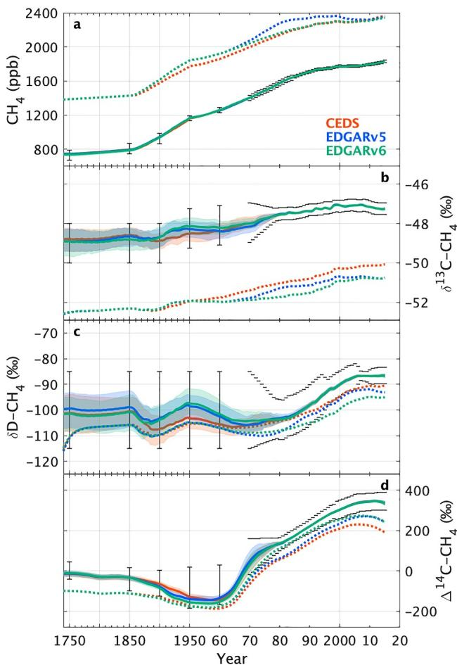  
Figure 1.Simulated atmospheric $\mathrm { C H } _ { 4 }$ and isotopic histories compared to observation-based target ranges.Time series of simulated atmospheric $\mathrm { C H } _ { 4 }$ (a), $\delta ^ { 1 3 } \mathrm { C - C H } _ { 4 }$ (b), $\delta \mathrm { D - C H } _ { 4 }$ (c),and $\Delta ^ { 1 4 } \mathrm { C - C H _ { 4 } }$ (d) are presented in CEDS (red),EDGARv5 (blue),and EDGARv6 (green) prior and posterior scenarios over 175O-2O15.Posterior mean values are shown in solid lines, and colored bands mark the $6 8 \%$ CI (given by 16th and 84th percentiles), which are available in Dataset S1.Dotted lines show prior mean values. Black bars show prescribed global observational target ranges (cap only after 1970). Observations and target ranges are also shown in Figure Sl and Table S1in Supporting Information S1.Note the time axis before 1950 is rescaled.

Only upper and lower bounds of their global means were prescribed as observation targets until 1978 for $\delta ^ { 1 3 } \mathrm { C - C H } _ { 4 }$ and $\delta \mathrm { D - C H _ { 4 } }$ and until 1979 for $\Delta ^ { 1 4 } \mathrm { C - C H _ { 4 } }$ using available ice/core firn data (Ferretti et al., 2O05； Hmiel et al.,202O; Lassey, Etheridge, et al., 2007; Mischler et al.,2009). This was due to the limited number of data, as well as limited time and space representativeness of these observations over the period (Text S1 in Supporting Information S1).After the 197Os,the global means and 1 SD uncertainties of $\delta ^ { 1 3 } \mathrm { C - C H } _ { 4 }$ $\delta \mathrm { D - C H _ { 4 } }$ ，and $\Delta ^ { 1 4 } \mathrm { C - C H _ { 4 } }$ were specified.For 1978-1983,the northern composite $\delta ^ { 1 3 } \mathrm { C - C H } _ { 4 }$ data set in Rice et al. (2O16) was utilized to reconstruct annual global averages. Subsequently，annual mean globally averaged $\delta ^ { 1 3 } \mathrm { C - C H } _ { 4 }$ for 1984-2013 combining the Institute of Arctic and Alpine Research (INSTAAR)/NOAA for 1999-2013 (Michel et al.,2021) and the National Institute of Water and Atmospheric Research (NIWA) for 1984-1998 (Schaefer et al.,2016),compiled in Schwietzke et al.(2016),were used.The uncertainties of the global $\delta ^ { 1 3 } \mathrm { C - C H } _ { 4 }$ averages were prescribed to be $0 . 1 \text{‰}$ since 1984,as used in Schwietzke et al.(2016).For $\delta \mathrm { D - C H _ { 4 } }$ ，the northern composite $\delta \mathrm { D - C H _ { 4 } }$ data set in Rice et al.(2016) was also utilized to reconstruct global averages for 1978-20o5,followed by global averages estimated based on global air sampling networks (Fujita et al.,2O2O; Rice et al., 2016; White et al., 2016).For $\Delta ^ { 1 4 } \mathrm { C - C H _ { 4 } }$ ,the annual mean global averages were constructed using the ice/core firn data set for $\Delta ^ { 1 4 } \mathrm { C - C H _ { 4 } }$ (Hmiel et al.,202O). The mean and uncertainties of global $\delta \mathrm { D - C H _ { 4 } }$ and $\Delta ^ { 1 4 } \mathrm { C - C H _ { 4 } }$ averages were estimated based on MC simulations (see Text S1 in Supporting Information S1 for more details). The mean and uncertainty of targets,for which the values were not prescribed,were linearly interpolated using the adjacent data.

We assumed the atmospheric burden is directly proportional to the global mean surface mole fractions at $2 . 7 5 \mathrm { { T g } C H _ { 4 } \ p p b ^ { - 1 } }$ (Prather et al.,2012).This includes the ratio of the integrated burden of the observed vertical profile of $\mathrm { C H } _ { 4 }$ mole fractions (i.e.,surface to stratosphere) relative to that if it were uniformly mixed throughout the atmosphere,the value being O.973 (Prather et al.,2012). Here,we also applied the same conversions for $^ { 1 3 } \mathrm { C H } _ { 4 }$ ， $\mathrm { C H } _ { 3 } \mathrm { D }$ ， and $^ { 1 4 } \mathrm { C H } _ { 4 }$ ,as done in previous box model studies (e.g.,Lassey,Etheridge, et al., 2007; Schwietzke et al., 2016),although stratospheric ${ \delta } ^ { 1 3 } \mathrm { C } \mathrm { - } \mathrm { C H } _ { 4 }$ ,δD-$\mathrm { C H } _ { 4 }$ and $\Delta ^ { 1 4 } \mathrm { C - C H _ { 4 } }$ differs from the surface values. However, because the amount of $\mathrm { C H } _ { 4 }$ in the stratosphere is much lower than in the troposphere, we confirmed the impact of these differences are within the limits of the uncertainties we consider and therefore do not affect our conclusion (Text S1 in Supporting Information S1).

Sensitivity tests were performed to investigate the impact of each atmospheric isotopic observational constraint by applying diferent combinations of observational constraints (Obs; Table S3 in Supporting Information S1). The impact of potential interlaboratory differences of isotopic measurements was also examined (ObsIsoILD; Table S3 in Supporting Information S1).

While the use of the one-box model removes information contained in spatial gradients,we chose to follow this approach based on the sparse data coverage and the computational eficiency of the one-box model for exploring many parameter uncertainties and sensitivity tests.The limitations of our one-box model approach are discussed further in Section 4.3.

# 2.5. Observational Estimates of Global Nuclear Power Plant $^ { 1 4 } \mathrm { C H } _ { 4 }$ Emission Factor

Based on the European RAdioactive Discharges Database (RADD,2017) of $^ { 1 4 } \mathrm { C }$ emissions and the IAEA PRIS database of nuclear power generation (IAEA PRIS,2017),Zazzeri et al. (2O18) calculated global $^ { 1 4 } \mathrm { C H } _ { 4 }$ emissions from PWRs for the period of 1972-2016 by applying the observed lognormal emission factor distributions for

PWRs in $6 0 0 \mathrm { M C }$ simulations to global power generation data.In this study, we updated their results by applying several changes: (a)The data from France,reported in RADD(2O17),were excluded from the analysis due to their constant emission factors,suggesting that these values may not have been derived from empirical measurements. (b)Separate observation-based lognormal distributions were used for the Soviet-design VVER reactors (Zazzeri et al.,2018) ( $- 0 . 9 0$ and 0.29 for the log of the mean and standard deviation,respectively,in $\mathrm { T B q / G W a ) }$ and for all other PWR reactors $( - 1 . 6 5$ and 0.93). (c) A fraction of $^ { 1 4 } \mathrm { C }$ released as non- $\mathbf { \cdot C O } _ { 2 }$ from the PWRs was estimated based on the measurements of total $^ { 1 4 } \mathrm { C }$ and $^ { 1 4 } \mathrm { C O } _ { 2 }$ emissions from each 20 reactors reported in RADD averaged for 1995-2015 (mean: $7 5 \%$ , min: $4 4 \%$ , and max: $9 5 \%$ ), not fixed at $7 2 \%$ as in Zazzeri et al. (2018). (d) The organic fraction of $^ { 1 4 } \mathrm { C }$ released as non- $\mathrm { C O } _ { 2 }$ from PWRs that is $^ { 1 4 } \mathrm { C H } _ { 4 }$ was assumed to be a uniform distribution ranging $6 8 \% - 7 7 \%$ ,based on earlier measurements of organic $^ { 1 4 } \mathrm { C }$ species in PWRs (Kunz,1985), not $1 0 0 \%$ as in Zazzeri et al. (2018).(e)The total MC simulation number was setto be 10000, not 600 in Zazzeri et al.(2018).We thus conducted new MC simulations including these changes and estimated the $^ { 1 4 } \mathrm { C H } _ { 4 }$ NPP emission factors $( \phi )$ and their $9 5 \%$ CI (given by $2 . 5 { \mathrm { t h } }$ and 97.5th percentiles).

# 3. Results

# 3.1. Global $\mathbf { C H _ { 4 } }$ Emissions, Sinks, and Parameters

Figure 1 shows simulated atmospheric $\mathrm { C H } _ { 4 }$ ， $\delta ^ { 1 3 } \mathrm { C - C H } _ { 4 }$ ， $\delta \mathrm { D - C H _ { 4 } }$ and $\Delta ^ { 1 4 } \mathrm { C - C H _ { 4 } }$ under our base simulation, compared to the observation-based target ranges.The posterior parameter ensembles reproduce observed atmospheric histories well, whereas the prior mean scenarios do not match observations.The prior scenarios differ by using CEDS,EDGARv5.0,or EDGARv6.0 for anthropogenic emissions but otherwise share the same emissions,sink,and parameters.In the prior scenarios,there are large overestimations of $\mathrm { C H } _ { 4 }$ and underestimations of $\delta ^ { 1 3 } \mathrm { C - C H } _ { 4 }$ ,whereas the observed trends of $\delta \mathrm { D - C H _ { 4 } }$ and $\Delta ^ { 1 4 } \mathrm { C - C H _ { 4 } }$ are generally captured but with slight underestimations,particularly in $\Delta ^ { 1 4 } \mathrm { C - C H _ { 4 } }$ .These discrepancies are resolved with plausible combinations of optimized parameters that reproduce all the atmospheric $\mathrm { C H } _ { 4 }$ tracers simultaneously in the posterior ensembles (Figure 1).

The time series of the posterior 20 parameter ensembles in CEDS,EDGARv5,and EDGARv6 scenarios are shown in Figure 2.Histograms of these parameters averaged for the period 2O03-2012 are shown in Figure 3.As described in Section 2.3,the prior initial distributions of all these parameters (corresponding to the vertical axis range in Figure 2 and gray lines in Figure 3) were specified to be quite wide. Despite the weak prior constraints, the posterior distributons of $\cdot f _ { \mathrm { { b b } } } , f _ { \mathrm { { a n t h \_ b i o } } } , f _ { \mathrm { { n a t r \_ b i o } } } , f _ { \mathrm { { a n t h \_ f f } } } , E _ { \mathrm { { g e o } } } , \phi , \tau _ { \mathrm { { b i o s } } } , f _ { \mathrm { { l o s s } } } , \mathrm { { K I E } ^ { C } , \mathrm { { K I E } ^ { D } } }$ $\delta ^ { 1 3 } C _ { \mathrm { a n t h \_ b i o } }$ ， $\delta ^ { 1 3 } C _ { \mathrm { n a t r \_ b i o } }$ and $\delta ^ { 1 3 } C _ { \mathrm { a n t h \_ f f } }$ are narrowed down from theprior whereas $\delta ^ { 1 3 } C _ { \mathrm { g e o } } , \delta ^ { 1 3 } C _ { b b } , \delta D _ { \mathrm { a n t h \_ b i o } } , \delta D _ { \mathrm { n a t r \_ b i o } } \delta D _ { \mathrm { a n t h \_ f f } } , \delta D _ { \mathrm { g e o } }$ and $\delta D _ { b b }$ are not changed so much (Figure 3), indicating the different importance of each parameter for reproducing atmospheric observations under our model settings. $f _ { \mathrm { a n t h \_ b i o } }$ and $f _ { \mathrm { a n t h \_ f f } }$ are independently optimized against three prior anthropogenic emission scenarios (Figures 2b and 2d),such that the scaling factors do not correspond to the same emissions totals,whereas the other parameters are optimized from the same priors for all scenarios.

Much lower $f _ { \mathrm { n a t r \_ b i o } }$ and $E _ { \mathrm { g e o } }$ than their prior means are consistent across the scenarios (Figures 2c and 2e). The posterior $f _ { \mathrm { b b } }$ shows that posterior BB emissions up to 3 times larger than in the prior(van Marle et al.,2O17) until 1980 and 2 times larger in the 2OoOs, which is also consistent across the three scenarios (Figure 2a).The posterior $f _ { \mathrm { l o s s } }$ shows a slight upward shift from the prior mean until the late 198Os,followed bya gradual decrease until 2015 (Figure 2h), which slightly weakens the prior increasing OH trend since 1980 (see Section 2.1).For isotopic parameters, posterior BIO $\delta ^ { 1 3 } \mathrm { C - C H } _ { 4 }$ source signatures $( \delta ^ { 1 3 } C _ { \mathrm { a n t h \_ b i o } }$ and $\delta ^ { 1 3 } C _ { \mathrm { n a t r \_ b i o } } )$ and $\mathrm { K I E } ^ { \mathrm { C } }$ are higher than their prior means (Figures 2i-2l and 3i-3l). Slightly higher $\delta ^ { 1 3 } C _ { \mathrm { a n t h \_ f f } }$ and $\mathrm { K I E } ^ { \mathrm { D } }$ and lower $\tau _ { \mathrm { b i o s } }$ from their prior means are also obtained (Figures 2g-2j, $2 \mathrm { m }$ ,and $3 \mathrm { g } _ { - 3 } \mathrm { j }$ and $3 \mathrm { m }$ ). The posterior mean $\phi$ is consistent with its prior mean,but with significantly narrowed distributions after late 1980 (Figures 2f and 3f).

To show how the posterior distributions change over time as atmospheric constraints filter the ensembles,the histograms of the 2O parameters for the EDGARv6 scenario in the filtering stage of selected target years are shown in Figure4 (for 1750-1960)andFigure5 (for 1970-2010).Already in1750, $E _ { \mathrm { g e o } } , f _ { \mathrm { n a t r \_ b i o } } , f _ { \mathrm { b b } } , f _ { \mathrm { l o s s } }$ $\delta ^ { 1 3 } C _ { \mathrm { n a t r \_ b i o } }$ ${ \mathrm { K I E } } ^ { \mathrm { C } }$ and $\mathrm { K I E } ^ { \mathrm { D } }$ are optimized from the prior setting based on theatmospheric target in 1750 (Figures 4a-4c 4e, 4h-4j,and 4l). After 1 $9 0 0 , f _ { \mathrm { a n t h \_ b i o } } , f _ { \mathrm { a n t h \_ f f } } ,$ and $\delta ^ { 1 3 } C _ { \mathrm { a n t h \_ b i o } }$ are optimized as anthropogenic emissions become larger (Figures 4b-4d and 4k). $\tau _ { \mathrm { b i o s } }$ is optimized after 1960 when biospheric $^ { 1 4 } \mathrm { C H } _ { 4 }$ emissions increase rapidly after nuclear bomb testing(Graven et al.,2O17) (Figure $^ { 4 \mathrm { g } } ,$ .The NPP emission factor, $\phi$ ,is optimized after the late 1980s when NPP $^ { 1 4 } \mathrm { C H } _ { 4 }$ emissions rise due to the installtion and increased power production of NPPs (Zazzeri et al.,2018)(Figure 5f). The $^ { 1 4 } \mathrm { C H } _ { 4 }$ emissions from BIO sources after the 1950s and thenfrom NPPsafterthe198Osare reflectedin theobservedatmospherictrends in $\Delta ^ { 1 4 } \mathrm { C - C H _ { 4 } }$ (Figure 1d) (Lassey, Etheridge,et al.,2OO7).These results show that several parameters are sensitive to the specific observations in different periods,and that not all2O parameters are simultaneously optimized in each target period (i.e, not all parameters are necessarily correlated).

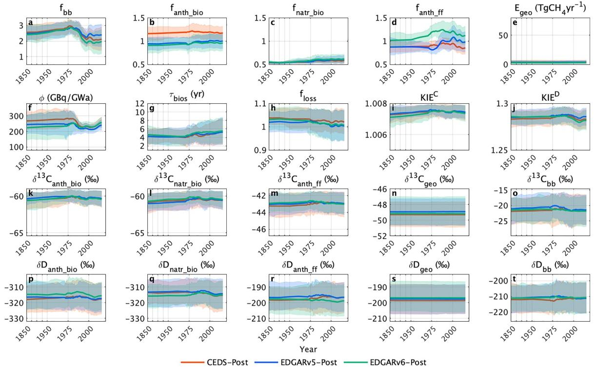  
Figuree Posterior mean values are shown in solid lines,and colored bands mark the $6 8 \%$ CI. Each vertical axis range represents the initial prior range of that parameter.

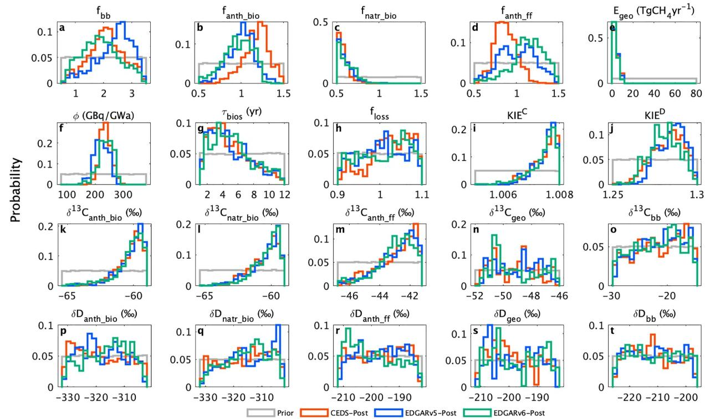  
FigureH the base simulation.Also shown are their initial uniform prior distributions (gray).

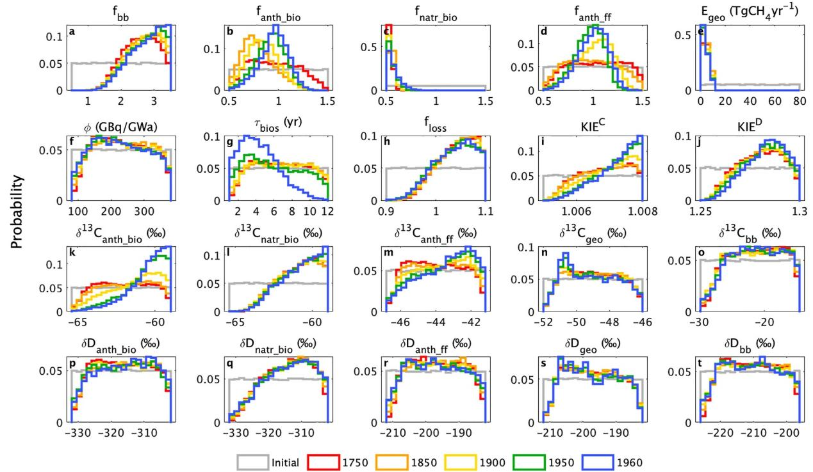  
Figur4 l960.Here,results of only the EDGARv6 scenario are presented. See Figure 5 for subsequent target years.

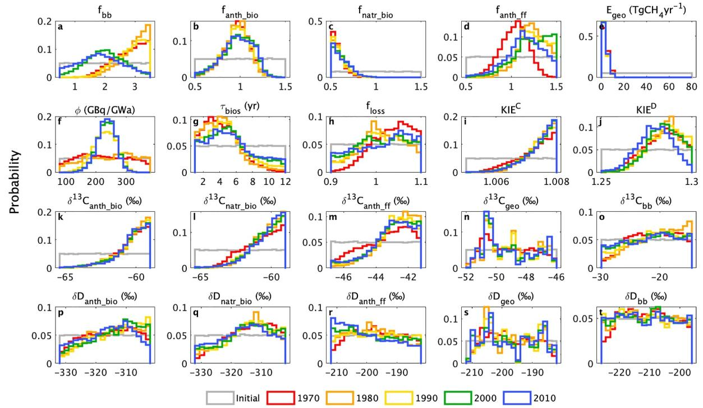  
Figure 5.Same as Figure 4,but for selected target years of 1970,1980,1990,2000,and 2010.

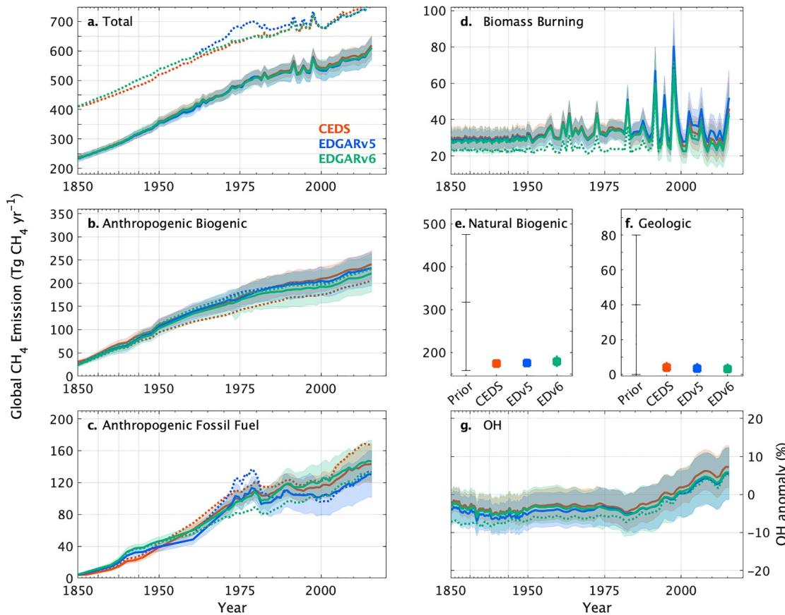  
Figure 6.Prior and posterior $\mathrm { C H } _ { 4 }$ emissions and sinks by sectors for 1850-2O15.Time series of global total (a), anthropogenic biogenic (b),anthropogenic fossil fuel (c),and biomass burning $\mathrm { C H } _ { 4 }$ emissions (d),and tropospheric OH anomaly (g) as well as averaged natural biogenic (e) and geologic (f) $\mathrm { C H } _ { 4 }$ emissions.The OH anomaly is derived from the product of our prior OH anomaly taken from Stevenson et al.(2O2O)(doted line in Figure 6g)and our posterior $f _ { \mathrm { l o s s } }$ .Color andline styles inpanels (a-dand g)are sameasFigure1.Markers and errorbars in panels (e,f)represent meanvalues and $6 8 \%$ CI, but for the mean valuesand fullrange in prior.Details of prior emissionsand parameter settingare presented in Table S2 in Supporting Information S1 and Table 1,respectively.

Figure 6 shows the time series of the posterior global $\mathrm { C H } _ { 4 }$ emissions and sinks in units of $\mathrm { T g } \mathrm { C H } _ { 4 } \mathrm { y r } ^ { - 1 }$ ，which allows an easier comparison between the different scenarios and evaluation in the context of the global $\mathrm { C H } _ { 4 }$ budget.Posterior anthropogenic FF emissions are not significantly higher than the prior emissions from the bottom-up inventories, except for EDGARv6 in the 197Os (Figure 6c).The posteriorFF emissions from the three scenarios are consistent with each other and significantly lower than the prior emissions in EDGARv5 in the 1970s and CEDS after 2002 (Figure 6c).The rapid growth in the 197Os in EDGARv5,driven by the Middle East and Africa (i.e.,oil producing countries),appears to be revised downward too strongly in the newer version EDGARv6,while the growth after 2O02 in CEDS driven by China (mainly coal) seems to be overestimated.Much lower posterior natural BIO and GEO emissions than bottom-up priors (Etiope & Schwietzke,2O19; Saunois et al.,2020)(Figures 6e and 6f) account for the overestimation in total $\mathrm { C H } _ { 4 }$ emissions (Figure 6a) and simulated atmospheric $\mathrm { C H } _ { 4 }$ (Figure la) in prior scenarios.Although our isotope-based approach cannot in principle differentiate anthropogenic from natural BIO sources and their trends over the industrial period,the overall overestimation of BIO sources cannot be atributed to anthropogenic BIO because it was present already in 1750, when anthropogenic BIO sources were small Because GEO and BB $\mathrm { C H } _ { 4 }$ emissions are relatively small, there is no other way to match atmospheric $\mathrm { C H } _ { 4 }$ concentrations in 1750.The posterior OH anomaly,derived from the product of our posterior $f _ { \mathrm { l o s s } }$ (Figure 2h） and prior OH anomaly taken from multimodel ESMs (Stevenson et al.,2020),shows a slightly weaker but increasing trend following the prior over 1980-2015 (Figure 6g).

Table 2 Summary of Averaged Posterior Global $C H _ { 4 }$ Budget From Our Base Simulations and Previous Top-Down Estimates   

<table><tr><td></td><td colspan="2"> This studya</td><td colspan="2"> Saunois et al. (2020) b</td><td>Schwietzke et al. (2016)</td><td>Fujita et al. (2020)</td><td>Lassey, Lowe, and Smith (2007)</td><td>Hmiel et al. (2020)e</td></tr><tr><td>Period</td><td>1986-2000</td><td>2003-2012</td><td>2008-2017</td><td>2008-2017</td><td>2003-2013</td><td>2003-2012</td><td>1986-2000</td><td>2003-2013</td></tr><tr><td>Atmospheric constraints</td><td>CH4, 813C, δD, △14C</td><td></td><td>CH4 (Top- down)</td><td>None (bottom-up)</td><td>CH4, δ13C</td><td>CH4， 813C, δD</td><td>CH4, Δ14C</td><td>CH4, δ13C, △14C</td></tr><tr><td>Total emissions (Tg CH4 yr-1)</td><td>536 [506,564] 568 [532, 601]</td><td></td><td>576 ± 15</td><td>737 ± 98</td><td>593</td><td>558</td><td>560 ± 40</td><td>二</td></tr><tr><td>Total Biogenic emissions (Tg CH4 yr-1)</td><td></td><td>384 [360,409] 406 [379,433]</td><td>427 ± 21</td><td>531 ± 44</td><td>355 ± 27</td><td>346</td><td>1</td><td>-</td></tr><tr><td>Biomass burning Emissions (Tg CH4 yr-1)</td><td>37 [28, 45]</td><td> 31 [21, 41]</td><td>30±5</td><td>30±5</td><td>43 ± 9</td><td>50</td><td>二</td><td>1</td></tr><tr><td>Anthropogenic fossil emissions (Tg CH4 yr-1)</td><td>112 [93, 130]</td><td>128 [103,152]</td><td>111 ± 17</td><td>128 ± 14</td><td>145 ± 23</td><td>162</td><td>168 ± 16</td><td>177 ± 37</td></tr><tr><td>Geologic emissions (Tg CH4 yr-1)</td><td>3.4 [1.0, 6.7]</td><td></td><td>8±3</td><td>45 ± 14</td><td>51 ± 20</td><td></td><td></td><td>1.6 [0, 5.4]</td></tr><tr><td>Total fossil fraction (%)</td><td>21 [18, 25]</td><td>23 [19, 27]</td><td>21±3</td><td>24 ±4</td><td>33±5</td><td>29</td><td>30 ± 2</td><td>1</td></tr></table>

Note. Here CEDS, EDGARv5,and EDGARv6 scenario results are averaged. Uncertainties are reported as $6 8 \%$ CI (this study) or 1 SD, (previous studies), except for geologic emissions in Hmiel et al. (2020) reported as $9 5 \%$ CI."Geologic emissions are presented for the average of 1850-2015 since they are assumed to be tie-iarntos categories in Table 3 of Saunois et al. (202O). The“other natural sources” $( 3 7 \mathrm { T g } \mathrm { C H } _ { 4 } \mathrm { y r } ^ { - 1 } )$ of top-down estimates, presented inSaunois etal. (2O2O),is assigned to geologic emissions by $8 \mathrm { T g } \mathrm { C H } _ { 4 } \mathrm { y r } ^ { - 1 }$ (i.e., geological, permafrost soil,and hydrates)and natural biogenic emissins by $2 9 \mathrm { T g } \mathrm { C H } _ { 4 } \mathrm { y r } ^ { - 1 }$ (i.e., freshwater, wild animals, termites,and biogenic ocean) based on the proportion of botom-up estimates for the same period.Only preindustrial $\Delta ^ { 1 4 } \mathrm { C - C H _ { 4 } }$ and modern $\delta ^ { 1 3 } \mathrm { C - C H } _ { 4 }$ data are used.

Because the posterior results among CEDS,EDGARv5,and EDGARv6 scenarios are consistent, hereafter, we refer to the average of the three scenarios as our posterior global $\mathrm { C H } _ { 4 }$ budget.

We calculate decadal averages of each scenario for 2003-2012 and 1986-2000,and compare our results with recent GCP estimates (Saunois et al.,202O)and isotopic studies (Fujita et al.，202O; Hmiel et al.,2020; Schwietzke et al.,2016),as well as the most recent $\Delta ^ { 1 4 } \mathrm { C - C H _ { 4 } }$ study estimating global FF emissions from their $\Delta ^ { 1 4 } \mathrm { C - C H _ { 4 } }$ data (Lassey,Lowe et al., 2007) (Table 2). Our global total $\mathrm { C H } _ { 4 }$ emissions $( { \sim } 5 6 8 \ \mathrm { T g } \ \mathrm { C H } _ { 4 } \ \mathrm { y r } ^ { - 1 } )$ are similar to the top-down GCP estimates,as expected because our total $\mathrm { C H } _ { 4 }$ lifetime ( $\mathord { \left. \sim \right.} 9 $ years),based on Prather et al. (2012),also resembles that in the GCP estimates.The BIO and BB emissons are also similar between ours and top-down GCP estimates，which are larger and smaler than those in stable isotope estimates, respectively.

To compare our results for anthropogenic FF emissions to previous studies,Figure 7 shows our average posterior anthropogenic FF emissons,together with previous bottom-up and top-down estimates. Our posterior anthropogenic FF emissions for 2003-2012 (128 [103,152] $\Gamma \mathbf { g } \ \mathrm { C H } _ { 4 } \ \mathrm { y r } ^ { - 1 }$ ; mean and $6 8 \%$ CI, given by 16th and 84th percentiles)are lower than previous isotopic-based estimates and are not consistent with their negative or zero FF trends after 2007 (Fujita etal.,2020; Hmieletal.,2020; Schwietzke et al.,2016).Between 2000-2006 and 2007- 2013,our posterior estimates indicate an increase in anthropogenic FF emissions (14.2 [6.3,22.3] $\mathrm { T g } \mathrm { C H } _ { 4 } \mathrm { y r } ^ { - 1 } ,$ ）， an increase in total BIO emissions (16.1 [8.1,24.1] $\mathrm { T g } \mathrm { C H } _ { 4 } \mathrm { y r } ^ { - 1 } )$ ,a slight decrease of BB emissions $( - 5 . 0 [ - 8 . 4$ ， $- 1 . 5 ] \mathrm { T g } \mathrm { C H } _ { 4 } \mathrm { y r } ^ { - 1 } )$ ,and a slight increase of the total $\mathrm { C H } _ { 4 }$ loss rate ( $1 . 5 [ 0 . 3 , 2 . 7 ] \%$ ).However, the interpretation of recent $\mathrm { C H } _ { 4 }$ growth is complicated by poorly constrained global OH trends (see Section 3.3). A newer version of CEDS,prepared for CMIP7 experiments (O'Rourke et al.,2021),shows that the FF emission increase after 2002 was revised downward compared to the previous CEDS emissions, while the FF emissions in 197Os were strongly increased，which is similar to EDGARv5 but inconsistent with our results.The UNFCCC inventory for anthropogenic FF emissions,compiled as the Global Fuel Emissions Inventory version 2(GFEIv2; Scarpelli et al.,2022),is much lower than the other estimates.

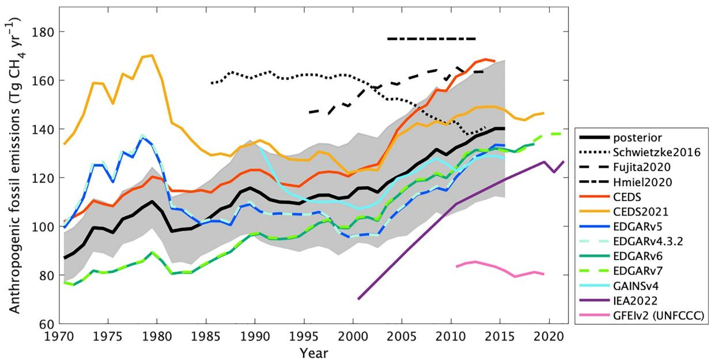  
Figure 7. Time series of global anthropogenic fossil $\mathrm { C H } _ { 4 }$ emissions from 1970.Our posterior mean and $6 8 \%$ CI,derived from averages of CEDS,EDGARv5,and E ocate etal.(2020)(dash line),andHmieletal.(2O20)(chainline).Othercolored lines show diferentanthropogenic fossil $\mathrm { C H } _ { 4 }$ emission inventories: CEDS version 2017-05- 18(ed) CEDSvesioe)c etal,) (GE2)（l tfres et al.(2016).bTaken from totalFFemissions inFigure $9 \mathrm { a }$ ofFujitaetal. (202O) because no geologic sources are used in their prior emission. Taken from period averages for 2003-20l2 in Hmiel etal. (2020)—total fossil emissions derived from modern atmospheric $\delta ^ { 1 3 } \mathrm { C - C H } _ { 4 }$ data in Schaefer et al.(2Ol6)minus geologic emissions derived from Hmieletal.(2020)'s preindustrial atmospheric $\Delta ^ { 1 4 } \mathrm { C - C H _ { 4 } }$ data.dTaken fromFigure 6bof Hoglund-Isaksson etal.(2020).Only available in 2000,2005,2010,2015, and2019-02ssofroeescdfakeblfapel)ndguofl).

# 3.2. Correlations in Global $\mathrm { { C H } _ { 4 } }$ Budget

Next,we explore the correlations between our posterior source emissions and parameters.Because we also optimize the total $\mathrm { C H } _ { 4 }$ loss rate,which is strongly correlated with posterior emission strength (Figure S2 in Supporting Information S1), we present correlations with source fractions—the proportion of global total $\mathrm { C H } _ { 4 }$ emissions as specific source $\mathrm { C H } _ { 4 }$ emissions (Figure 8). Here, global total BIO (anthropogenic plus natural BIO), global total FF source (anthropogenic FF plus GEO),and BB source fractions,averaged over 2O03-2012,are presented. Similarly, wecalculate total BIOandFF isotopic source signatures $( \delta ^ { 1 3 } C _ { \mathrm { b i o } } , \delta ^ { 1 3 } C _ { \mathrm { f f } } , \delta D _ { \mathrm { b i o } }$ and $\delta D _ { \mathrm { f f } } )$ by emission-weighted means derived from natural and anthropogenic sources.

A high correlation $| \mathbf { R } | \geq 0 . 5$ )is observed between all source fractions and $\phi$ (Figures 8ab, 8ac,and 8ad), and between total BIO fraction and $\delta ^ { 1 3 } C _ { \mathrm { b i o } }$ and $\mathrm { K I E } ^ { \mathrm { D } }$ (Figures 8d and 8y), indicating the importance of these parameters for estimating global sectorial source fractions under our model settings. Skewed distributions are observed in posterior ${ \mathrm { K I E } } ^ { \mathrm { C } }$ around the upper bound of our prior range, which could affect the correlation between sectorial source fractions.To extract the primary correlations in the global $\mathrm { C H } _ { 4 }$ budget shown in Figure 8,we focus on the relationships between BIO and FF fractions with $\delta ^ { 1 3 } C _ { \mathrm { b i o } }$ and $\phi$ in Figure 9 and compare our results with those in previous studies.

For global totalFF source fractions versus global total BIO source fractions averaged over 2O03-2012(Figure 9a), a strong negative correlation $R = - 0 . 9 0 )$ is found,as expected because these are the two major source fractions $( > 9 0 \% )$ . Deviation from a straight line arises from differences in the BB fraction.Although our all posterior ensembles cover all estimates in previous studies presented here,we findour posterior meanFFfraction,23.1[19.0, 26.8] $\%$ (mean and $6 8 \%$ CI),is generally lower than those in stable isotope-based studies $( 2 8 \% - 3 3 \% )$ (Basu et al.,2022; Fujita et al.,2020; Lan et al.,2021; Schwietzke et al.,2016; Thanwerdas et al.,2022)and more consistent with GCP estimates based on inversions with $\mathrm { C H } _ { 4 }$ mole fraction only (Saunois et al.,2020)(Figures 9a and Table 2).

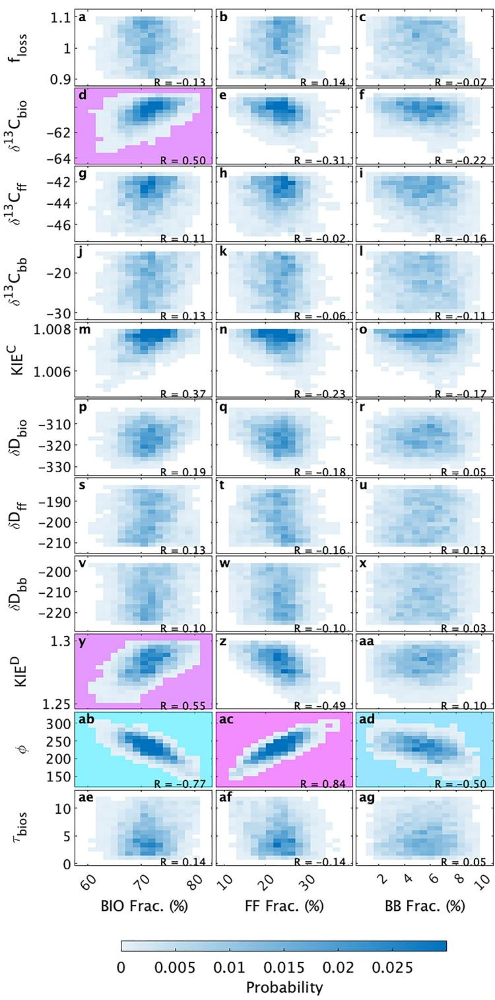  
Figure8.Two-dimensional histograms ofourall posteriorresults inour base simulation(blue shades)for global total biogenic (BIO)fraction (eftcolumn),global total fosil fuel (FF)fraction (middlecolumn),and global biomassburning (BB) fraction (right column) of emissions versus scaling factors of the total loss rate $( f _ { \mathrm { l o s s } } )$ and all isotopic parameters (see Table 1) averaged over 2003-2012. Strong positive correlations $\left( \mathbb { R } \geq 0 . 5 \right)$ are highlighted in pink and strong negative correlations $( \mathrm { R } \leq - 0 . 5 )$ in blue.Two-dimensional histograms for other combinations of emissons and parameters are presented in Figures S2-S4 in Supporting Information S1.

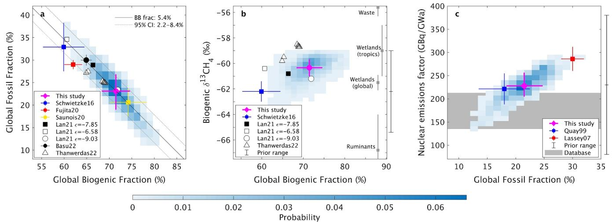  
Figure 9.Two-dimensional histograms of all posterior results (blue shades) and overall average and $6 8 \%$ CI (pink) for global fossil source fraction versus global biogenic source fraction averaged over 2003-2012(a),biogenic $\delta ^ { 1 3 } \mathrm { C - C H } _ { 4 }$ source signature versus global biogenic source fraction averaged over 2Oo3-2012 (b),and global NPP $^ { 1 4 } \mathrm { C H } _ { 4 }$ emissions factor $( \phi )$ versusglobalfilsoucefracaveagdor98c).Blacklisi)sotheeatioipuderosteoss burning fractions (posterior mean and $9 5 \%$ CI).Black bars outside therightaxis inbandcshowourfullpriorparameterranges.Priormean andfullrangesofour global biogenicfractionandglobalfosilfractiosare7.3591.6] $\%$ and $2 3 . 6 \ : [ 6 . 8 - 5 1 . 2 ] \%$ ,respectively (notshown).Graybarsinbshow $\delta ^ { 1 3 } \mathrm { C - C H } _ { 4 }$ signatures $( \pm 1 \thinspace \mathrm { S D } )$ fro Taerdasee et al. (2022) for 1999-2016,and Thanwerdas et al.(2022) for 2014-2015,respectively. $\varepsilon$ in (a)and (b) represents the fractionation factor,which equals to (l/ $\mathrm { K I E } ^ { \mathrm { C } } - 1 ) \times 1 , 0 0 0 ( \%$ .Gray shades in c represents our updated data-based estimates of global NPP emission factor for 1986-2000( $9 5 \%$ CI) (see Section 2.5).

Global total BIO source fraction averaged for 2O03-2012 is strongly correlated with global total BIO $\delta ^ { 1 3 } \mathrm { C - C H } _ { 4 }$ source signature (Figure 9b,same as Figure 8d). Higher BIO $\delta ^ { 1 3 } \mathrm { C - C H } _ { 4 }$ source signatures correlate with higher global total BIO fractions to balance the atmospheric $^ { 1 3 } \mathrm { C H } _ { 4 }$ budget,resulting in lower global total FF fraction than in the recent isotope-based estimates (Figure 9b and Table 2).We find our optimized total BIO $\delta ^ { 1 3 } \mathrm { C - C H } _ { 4 }$ source signature, $- 6 0 . 2 \ [ - 6 1 . 0 , - 5 9 . 7 ] \ \% o .$ ,isabout $2 \text{‰}$ higher than those in the database-derived estimates in Schwietzke et al. (2O16) (Figure 9b). Their database estimate of mean BIO $\delta ^ { 1 3 } \mathrm { C - C H } _ { 4 }$ source signature could potentially be biased,because of limited data availability in the tropics where BIO isotopic signatures are higher than those in the extratropics,and because of uncertainty in the proportions of latitudinal BIO emission strength (Schwietzke et al., 2016; Sherwood et al., 2017). Recent studies of $\delta ^ { 1 3 } \mathrm { C - C H } _ { 4 }$ data have also used heavier total BIO $\delta ^ { 1 3 } \mathrm { C - C H } _ { 4 }$ signatures and found higher BIO fractions than Schwietzke et al. (2O16) (Basu et al.,2022; Lan et al.,2021;Thanwerdas etal.,2022).Theiceof $\mathrm { K I E } ^ { \mathrm { C } }$ also nfluences the relationship between BIO $\delta ^ { 1 3 } \mathrm { C - C H } _ { 4 }$ and total BIO source fraction,where higher $\mathrm { K I E } ^ { \mathrm { C } }$ is correlated with higher total BIO source fraction in the results of Lan et al. (2021) (Figure 9b). We also found a positive correlation between total BIO source fraction and ${ \mathrm { K I E } } ^ { \mathrm { C } }$ (Figure $8 \mathrm { m }$ ),although the strength of the correlation was not as high as for BIO $\delta ^ { 1 3 } \mathrm { C - C H } _ { 4 }$ . Similar to our posterior ensemble results, Thanwerdas et al. (2O22)also present clear negative correlations between BIO $\delta ^ { 1 3 } \mathrm { C - C H } _ { 4 }$ source signature and BIO source fraction in their sensitivity test results on the assimilation setup of $\delta ^ { 1 3 } \mathrm { C - C H } _ { 4 }$ source signatures (Figure 9b).

There is a clear positive correlation between the total FF source fraction and the global NPP $^ { 1 4 } \mathrm { C H } _ { 4 }$ emissions factor $\phi$ due to their opposite effects on atmospheric $\Delta ^ { 1 4 } \mathrm { C - C H _ { 4 } }$ (Figure ${ 9 \mathrm { c } }$ ,same as Figure 8ac but for $1 9 8 6 -$ 2000).Our estimated FF fraction (21.5 [18.3, $2 4 . 7 ] \%$ ）and $\phi$ (230 [205,256] GBq/Gwa) are both lower than Lassey,Lowe et al., 2007 $3 0 \pm 2 . 3 \%$ and $2 8 6 \pm 2 6 \mathrm { G B q / G W a }$ ，mean $\pm \nobreakspace 1 \nobreakspace$ SD),but consistent with an earlier estimate (Quay et al., 1999). Despite large variability in $\phi$ observed at individual reactors,our updated observation-based estimate (Section 2.5) suggests the plausible range of the global mean $\phi$ is only $1 3 5 { - } 2 1 3 \mathrm { G B q } /$ GWa $( 9 5 \%$ CI) for 1986-2000.This observation-based estimate is independent from but supports our lower posterior FF fraction (Figure ${ 9 \mathrm { c } }$ ).

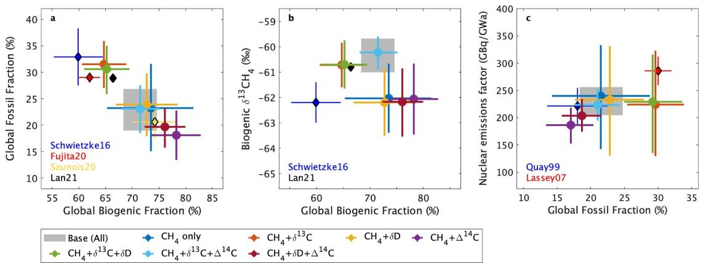  
Figure 10. Same as Figure 9,but for overall average and $6 8 \%$ CI in the base simulation represented by gray shades (originally pink in Figure 9),and those in the sensitivitytests thataplieddiferentcombinationsofobservationalconstraintstothesmulation(oloredcircles itherrorbars, $6 8 \%$ CI).Other observational or parameter setings were kept the same as the base simulation.Resultsof selected previous studies (coloreddiamonds,meanand $1 \ S \mathrm { D }$ )are also ploted,same as in Figure 9. The result “Lan21"(black diamonds) is taken from their default result under $\varepsilon = - 7 . 8 5 \% o$ (the same as black squares in Figures 9a and 9b).Note that clear correlations are only seen among the scenarios in Figure 1Ob or Figure 1Oc when atmospheric $\delta ^ { 1 3 } \mathrm { C - C H } _ { 4 }$ or $\Delta ^ { 1 4 } \mathrm { C - C H _ { 4 } }$ are used as observational constraints,respectively (i.e., In other cases, posterior mean biogenic $\delta ^ { 1 3 } \mathrm { C - C H } _ { 4 }$ signatures or NPP emisson factors remain almost the same as their prior distributions).

# 3.3. Sensitivity Tests

To investigate the impact of diffrent prior model setings on the estimated global source fractions,we performed multiple sensitivity tests under (a) different observational isotope constraints (Obs; e.g., $\mathrm { C H } _ { 4 }$ only, $\mathrm { C H } _ { 4 } { + } \delta ^ { 1 3 } \mathrm { C }$ ， etc.）and (b) different prior ranges of selected parameters (ParaRange; i.e. changing the freedom of the parameters)(see Table S3 in Supporting Information S1).These tests are useful not onlyto investigate the impactof diferent model settings to our base simulation results but also to directly compare our results with previous studies by running our model with similar settings to theirs.

Figure 1O shows the correlation plots in the $\mathrm { C H } _ { 4 }$ budget among the tests,which is the same as Figure 9 but for overall average and $6 8 \%$ CI in each simulation under different observational isotopic constraints (also see Table 3 forthe summary of these tests).The time series of posterior sectorial source fractions and simulated atmospheric isotopic histories under the different isotopic constraints are presented in Figures S5 and S6 in Supporting Information S1, respectively.

Comparing with $\mathrm { C H } _ { 4 }$ -only inversion results,where the FF fraction for 2003-2012 is 23.2 [15.1,31.6] $\%$ (Figure 10, blue circles), incorporating $\delta ^ { 1 3 } \mathrm { C - C H } _ { 4 }$ constraints yields higher FF fractions (31.5 [27.0,35.9] $\%$ ,red circles). This $\mathrm { ^ { * } C H _ { 4 } } { + } \delta ^ { 1 3 } \mathrm { C } ^ { , , }$ case is consistent with Schwietzke et al. (2016), where higher FF fractions than $\mathrm { { } ^ { * } C H _ { 4 } }$ only”inversion are obtained under additional $\delta ^ { 1 3 } \mathrm { C - C H } _ { 4 }$ constraints. This confirms that our model setup and approach does result in higher FF fractions when only $\delta ^ { 1 3 } \mathrm { C - C H } _ { 4 }$ constraints are applied, which is similar to previous $\delta ^ { 1 3 } \mathrm { C - C H } _ { 4 }$ based estimates (e.g., Basu et al., 2022; Lan et al., 2021; Schwietzke et al., 2016).

For a case with $\mathrm { ^ { * } C H _ { 4 } } { + } \Delta ^ { 1 4 } \mathrm { C ^ { , * } }$ ,lower FF fractions (18.1[13.5,22.7] $\%$ ,purple circles)are found,in comparison to the ‘ $\mathrm { { ^ c H _ { 4 } } }$ -only”case.This result is contrary to Lassey,Etheridge,et al. (2OO7),where higher FF fractions of $3 0 \pm 2 \%$ were derived from $\Delta ^ { 1 4 } \mathrm { C - C H _ { 4 } }$ data for 1986-2000 (Figure 10c and Table 2). The difference appears to arisefrom the methods used byLassey,Etheridge, et al. (2OO7), who applied aregression approach rather thanan explicit model. This is discussed further in Section 4.

Table 3 SummarofOsteoltlFilelcsrdftestsede   

<table><tr><td></td><td>Prior</td><td>CH4 only</td><td>CH4+δ13C</td><td>CH4+δD</td><td>CH4+△14C</td><td> Base (all)</td></tr><tr><td>Fossil fraction (%)</td><td>23.6 [17.2, 30.1]</td><td>23.2 [15.1, 31.6]</td><td>31.5 [27.0, 35.9]</td><td>23.9 [17.9, 29.8]</td><td>18.1 [13.5, 22.7]</td><td>23.1 [19.0, 26.8]</td></tr><tr><td>Error reduction ratio</td><td>1</td><td>-28%</td><td>31%</td><td>8%</td><td>29%</td><td>40%</td></tr></table>

Note. Uncertainties are reported as $6 8 \%$ CI. The error reduction ratio is defined as $- ( \sigma ^ { \mathrm { p o s } } - \sigma ^ { \mathrm { p r i } } ) / \sigma ^ { \mathrm { p r i } } \times 1 0 0 \%$ where $\sigma ^ { \mathrm { { p o s } } }$ and $\sigma ^ { \mathrm { { p r i } } }$ are posterior and prior uncertainties respectivelyassblft

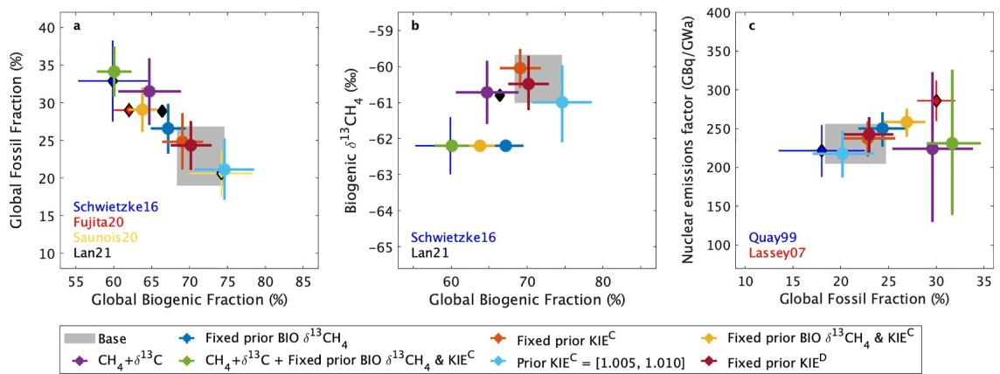  
Figure11.Same as Figure 1,butforsensitivitytests thataplieddifferent prior meanbiogenic $\delta ^ { 1 3 } \mathrm { C - C H } _ { 4 }$ source signatures, ${ \mathrm { K I E } } ^ { \mathrm { c } }$ ,and $\mathrm { K I E } ^ { \mathrm { D } }$ $\cdot \mathrm { ^ { \circ } C H _ { 4 } } { + \delta } ^ { 1 3 } \mathrm { C } ^ { \mathrm { , , } }$ is the same as in Figure 10.

The mean FF fraction with the inclusion of $\delta \mathrm { D - C H _ { 4 } }$ (23.9 [17.9, 29.8] $\%$ ,yellow circles)is barely changed from the ${ } ^ { 6 6 } \mathrm { C H } _ { 4 }$ -only”case,although the uncertainty is reduced. Such limited contributions of $\delta \mathrm { D - C H _ { 4 } }$ to the mean sectorial fraction atribution is also seen in Fujita et al.(2O2O),who utilized both $\delta ^ { 1 3 } \mathrm { C - C H } _ { 4 }$ and $\delta \mathrm { D - C H _ { 4 } }$ data and found sectorial source fractions similar to Schwietzke et al.(2Ol6)(Figure 1Oa and Table 2).The potential explanation of weak constraints by $\delta \mathrm { D - C H _ { 4 } }$ is addressed in Section 4.

With allisotopic constraints,our base simulation eventually yields asimilar posterior meanFF fractionto the prior estimate and $\mathrm { \tilde { C } H _ { 4 } }$ -only"results,but the uncertainty range is significantly reduced by $4 0 \%$ and $5 3 \%$ relative to their estimates,respectively,as $2 3 . 1 \left[ 1 9 . 0 , 2 6 . 8 \right] \%$ (Figure 1O,gray shades)(also see Table 3).It should be noted that the similarity between our posterior FF fraction under allisotopic constraints and those in top-down $\mathrm { C H } _ { 4 }$ inversions (e.g.,aunois etal.,2O2O)is notan accidentofour model setup,butrather the result ofsimultaneous constraints by atmospheric $\delta ^ { 1 3 } \mathrm { C - C H } _ { 4 }$ and $\Delta ^ { 1 4 } \mathrm { C - C H _ { 4 } }$ (Figure $1 0 \ { ^ { \circ } \mathrm { C H } } _ { 4 } + \delta ^ { 1 3 } \mathrm { C } + \Delta ^ { 1 4 } \mathrm { C } ^ { , }$ ,light blue). Note that the uncertainty range in our $\mathrm { C H } _ { 4 }$ -only results is larger by $2 8 \%$ than that in the prior estimate due to the inconsistent posterior solutions among the CEDS,EDGARv5,and v6 scenarios (Figure S7 in Supporting Information S1).

Figure 11 shows the sensitivity test results that applied different prior settings of BIO $\delta ^ { 1 3 } \mathrm { C - C H } _ { 4 }$ source signatures, $\mathrm { K I E } ^ { \mathrm { C } }$ and $\mathrm { K I E } ^ { \mathrm { D } }$ (ParaRange #1-6; Table S3 in Supporting Information S1).Fixing the prior BIO $\delta ^ { 1 3 } \mathrm { C - C H } _ { 4 }$ source signature as its prior mean $( - 6 2 . 2 \text{‰}$ yields higher FF fractions (26.6 [23.2,29.8]) (Figure 11, blue circle),as does fixing ${ \mathrm { K I E } } ^ { \mathrm { C } }$ at its prior mean (1.0065) (24.8 [21.1,28.6],red circle). Further increases in FF fraction are obtained when both parameters are fixed (29.1 [26.1,32.0], yellow circle)and even more under $\mathrm { ^ { * } C H _ { 4 } } { + } \delta ^ { 1 3 } \mathrm { C } ^ { , , }$ (34.1[30.8,37.5], green circle),resembling the model setings and results in Schwietzke etal. (2016).Expanding the prior ${ \mathrm { K I E } } ^ { \mathrm { C } }$ range to [1.0o5,1.010],considering potential maximum tropospheric Cl contributions (Table S4 in Supporting Information S1),yields lower FF fractions,21.1[17.1,25.2] (light blue circle),though within the uncertainty of those from our base result. The posterior mean $\mathrm { K I E } ^ { \mathrm { C } }$ obtained from this test (1.0091 [1.0084, 1.0097]) surpasses our posterior base result (1.0O75 [1.0070,1.0078), indicating the upper limit we used on ${ \mathrm { K I E } } ^ { \mathrm { C } }$ constrained the posterior result.Fixing the prior mean $\mathrm { K I E } ^ { \mathrm { D } }$ (1.275) does not lead to a significant change in the posterior mean in FF fraction but reduces the uncertainty from the base result (brown circle).

Figure 12 shows the results that applied different prior $\phi$ settings (ParaRange #8-13; or Table S3 in Supporting Information S1). We find our posterior results,both in base simulation or $\mathrm { ^ { * } C H _ { 4 } } \mathrm { + } \Delta ^ { 1 4 } \mathrm { C ^ { \mathrm { * } } }$ , do not change even when our prior $\phi$ is replaced by Lassey et al.'s mean estimate (286 [136, 436] GBq/GWa; the min.-max. range is the same as our base setting)or even replaced by much wider prior range (300 [0,6O0] GBq/GWa)(Figure 12,blue, red,and green circles). This indicates our posterior $\phi$ is well constrained by atmospheric $\Delta ^ { 1 4 } \mathrm { C - C H _ { 4 } }$ data. When the prior $\phi$ is fixed at $2 8 6 \mathrm { G B q / G W a }$ ,however,higher mean FF fractions $( \sim 2 7 \% )$ are obtained for 1986-2000 as seen in Lassey,Lowe, et al. (20O7),both in base simulation or $\mathrm { ^ { * } C H _ { 4 } } \mathrm { + } \Delta ^ { 1 4 } \mathrm { C ^ { , * } }$ (yellow and light blue circles). We also find the sensitivity is not significant when fixing the prior mean $\tau _ { \mathrm { b i o s } }$ (brown circle).

The sensitivityof the prior BB emissions are also investigated by allocating “RCO"emissions (Section 2.1) from prior FF to prior BB emissions, in addition to the BB4CMIP (RCOem; Table S3 in Supporting Information S1), showing slight lower posterior FF fractions,21.0 [16.7,25.2] $\%$ (and higher BB fractions),though within the uncertaintyofour base result (Figure S8 in Supporting Information S1).Inthis regard,our sensitivity test undera narrower prior $f _ { \mathrm { b b } }$ range ([0.5,1.5]) (ParaRange #14; Table S3 in Supporting Information S1) shows slightly higher FF fractions of 25.3 [22.3,28.4] $\%$ for 2003-2Ol2 than our base simulation to compensate the posterior lower BB fractions,despite also within the uncertainty of our base result (Figure S8 in Supporting Information S1). Applying the default $f _ { \mathrm { b b } }$ range ([0.5,3.5]) to other source scaling factors, $f _ { \mathrm { a n t h \_ b i o } } , f _ { \mathrm { n a t r \_ b i o } } ,$ and $f _ { \mathrm { a n t h \_ f f } }$ (ParaRange #15),also does not change the mean posterior results (Figure S8 in Supporting Information S1).

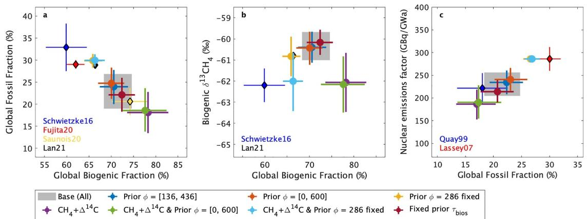  
Figure2.Same as Figure 10,butforsensitivitytests that applieddiferentpriorNPPemissionfctors $( \phi )$ and biospheric turnovertime $( \tau _ { \mathrm { { b i o s } } } )$ $\mathrm { ^ { * } C H _ { 4 } } { + } \Delta ^ { 1 4 } \mathrm { C ^ { , * } }$ is the same as in Figure 10.

To investigate the impact of different prior OHand wetland emisson trends,four alternative prior OH scenarios and thre alternative prior wetland scenarios are considered (OHtrend and IAWetBIOem; Table S3 in Supporting Information S1).The results indicate different OHand wetland trend scenarios do not change the mean FF fractions for 2O03-2012 (Figure S9 in Supporting Information S1),but the different OH trends change the attribution of the cause of the recent $\mathrm { C H } _ { 4 }$ trend (Figure S1O in Supporting Information S1) and different wetland emission trends change the attribution of anthropogenic and natural BIO emissions (Text S1 in Supporting Information S1).Excluding prior freshwater emissions (NoFRESHem; Table S3 in Supporting Information S1)also does not change the mean FF fractions under all isotopic constraints ("Base"） and $\mathrm { ^ { * } C H _ { 4 } } { + } \Delta ^ { 1 4 } \mathrm { C ^ { , * } }$ case, but significantly changes the posterior results without constraints of $\Delta ^ { 1 4 } \mathrm { C - C H _ { 4 } }$ (e.g., $\mathrm { { } ^ { \cdot } C H _ { 4 } }$ only"; see Text S1,Figure S11,and Table S5 in Supporting Information S1), highlighting the merit of multi-isotopic constraints including $\Delta ^ { 1 4 } \mathrm { C - C H _ { 4 } }$ to robustly estimate the global $\mathrm { C H } _ { 4 }$ budget.

Applying upper bounds of potential $\Delta ^ { 1 4 } \mathrm { C - C H _ { 4 } }$ ， $\delta ^ { 1 3 } \mathrm { C - C H } _ { 4 }$ and $\delta \mathrm { D - C H _ { 4 } }$ interlaboratory differences (ObsIsoILD; Table S3 in Supporting Information S1)does not significantly change mean FF fractions,although the impact of $\delta \mathrm { D - C H _ { 4 } }$ interlaboratory differences could be the most influential (Figure S12 and Text S1 in Supporting Information S1).More careful consideration is also required if assimilating historical raw $\delta ^ { 1 3 } \mathrm { C - C H } _ { 4 }$ and $\delta \mathrm { D - C H _ { 4 } }$ data directly,whose uncertainty of interlaboratory diferences is more significant than those in modern air samples (Umezawa et al., 2018).

# 4. Discussion

Several previous studies have utilized atmospheric $\delta ^ { 1 3 } \mathrm { C - C H } _ { 4 }$ as constraints for source partitioning (Basu et al.,2022; Hein etal.,1997; Lan et al.,2021; Schaefer et al.，2016; Schwietzke etal.,2016; Thanwerdas et al., 2O22),and a few studies have further used $\delta \mathrm { D - C H _ { 4 } }$ (Fujita et al., 2020; Rice et al.,2016) or $\Delta ^ { 1 4 } \mathrm { C - C H _ { 4 } }$ (Hmiel et al.,202O; Lassey,Etheridge,et al.,2007; Quay etal.,1999),but no study synthesizedallthese constraints.This study is the first to utilize modern $\Delta ^ { 1 4 } \mathrm { C - C H _ { 4 } }$ data with available $\delta ^ { 1 3 } \mathrm { C - C H } _ { 4 }$ and $\delta \mathrm { D - C H _ { 4 } }$ data sets to estimate the global $\mathrm { C H } _ { 4 }$ budget and isotopic source signatures, KIEs, $\tau _ { \mathrm { b i o s } }$ and $\phi$ over the industrial period.

Our posterior global $\mathrm { C H } _ { 4 }$ budget is fairly consistent with atmospheric $\mathrm { C H } _ { 4 }$ -only top-down estimates from the GCP (Saunois et al., 2O2O),but not with recent stable isotope-based estimates (Basu et al.,2022; Fujita et al.,2020; Lan et al., 2021; Schwietzke et al.,2016) (Figure $9 \mathrm { a }$ and Table 2).In this study,we optimized $\delta ^ { 1 3 } \mathrm { C - C H } _ { 4 }$ and $\delta \mathrm { D - C H _ { 4 } }$ source signatures through our PF approach, considering plausible wide uncertainties of $\delta ^ { 1 3 } \mathrm { C - C H } _ { 4 }$ and $\delta \mathrm { D - C H _ { 4 } }$ source signatures from the database (Schwietzke et al.,2016; Sherwood et al., 2017) (Table 1).We found that our optimized total mean BIO $\delta ^ { 1 3 } \mathrm { C - C H } _ { 4 }$ source signature $( - 6 0 . 2 [ - 6 1 . 0 , - 5 9 . 7 ] \% o )$ is about $2 \text{‰}$ heavier than those in the prior database-driven estimate (Schwietzke et al.,2O16), whereas our total mean FF $\delta ^ { 1 3 } \mathrm { C - C H } _ { 4 }$ source signature $( - 4 3 . 1 \ [ - 4 4 . 3 , - 4 1 . 9 ] \ \% o )$ is not significantly changed from the database estimate. Recent findings show much larger tropical wetland emissons from African and Amazonian regions (France et al., 2022; Pandey et al.,2021; Shaw et al., 2022) than previous estimates,whose $\delta ^ { 1 3 } \mathrm { C - C H } _ { 4 }$ source signatures are heavier than at higher latitudes, $- 6 0$ to $- 5 5 \mathrm { ~ ‰ ~ }$ (e.g., MOYA/ZWAMPS Team et al., 2022). Heavier tropical ruminant $\delta ^ { 1 3 } \mathrm { C - C H } _ { 4 }$ source signatures ( $- 6 0$ to $- 5 0 \text{‰}$ ）have also recently been reported (Lu et al.,2021; MOYA/ZWAMPS Team et al.,2022). In this regard,Lan et al.,2021 presented heavier BIO $\delta ^ { 1 3 } \mathrm { C } .$ $\mathrm { C H } _ { 4 }$ signatures than Schwietzke et al. (2016),utilizing the wetland $\delta ^ { 1 3 } \mathrm { C - C H } _ { 4 }$ signature map from Ganesan et al. (2018), which considers spatial $\delta ^ { 1 3 } \mathrm { C - C H } _ { 4 }$ differences. To validate such modeled isotopic signatures maps and the heavier global average BIO $\delta ^ { 1 3 } \mathrm { C - C H } _ { 4 }$ signatures, more direct observations are required especially in the tropics.

Sink fractions approximately derived from our posterior total $\mathrm { K I E } ^ { \mathrm { C } }$ and $\mathrm { K I E } ^ { \mathrm { D } }$ are generally consistent with multiple-process model estimates (Saunois et al.，202O),indicating a tropospheric Cl contribution of ${ \sim } 3 \%$ ${ \mathrm { \sim } } 1 8 \mathrm { T g / y }$ r under the total loss of 556 Tg/yr for 2003-2012)(Text S1in Supporting Information S1). Our findings suggest the minimum tropospheric Cl scenario $( \sim 1 \ \mathrm { T g / y r } )$ suggested by Gromov et al. (2018) is unlikely. Actually, when using a wider prior $\mathrm { K I E } ^ { \mathrm { C } }$ range [1.005,1.010] (ParaRange #5), we obtained even higher posterior total ${ \mathrm { K I E } } ^ { \mathrm { C } }$ (1.0091 [1.0084,1.0097] vs.1.0075 [1.0070,1.0078]) and $\mathrm { K I E } ^ { \mathrm { D } }$ (1.287 [1.279,1.295] vs.1.283 [1.274,1.292]).While this suggests even higher tropospheric Clcontribution (van Herpen et al.,2O23),the total $\mathrm { K I E } ^ { \mathrm { C } }$ also aligns with a scenario presented in Lan et al. (2021) $\prime { \varepsilon } = - 9 . 0 3 \% o$ ,open circles in Figures 9a and 9b), where the Cl contribution is $1 3 \ \mathrm { T g / y r }$ and the ${ \mathrm { K I E } } ^ { \mathrm { C } }$ of OH $( \mathrm { K I E } _ { \mathrm { ~ O H } } ^ { \mathrm { C } } )$ is higher,004(Catreleta990). Overall,tp-down approaches can be affected by errors in ${ \mathrm { K I E } } ^ { \mathrm { C } }$ and $\delta ^ { 1 3 } \mathrm { C - C H } _ { 4 }$ ,so improved constraints on ${ \mathrm { K I E } } ^ { \mathrm { C } }$ as well as $\delta ^ { 1 3 } \mathrm { C - C H } _ { 4 }$ signatures would help to constrain the $\mathrm { C H } _ { 4 }$ budget. Recent studies disagree over whether current uncertainties in $\mathrm { K I E } ^ { \mathrm { C } }$ or $\delta ^ { 1 3 } \mathrm { C - C H } _ { 4 }$ signatures are more important (Basu et al.， 2O22； Thanwerdas et al.,2022). While our study is limited to aone-box model with global mean values, we believe that the large range of values we were able to consider may give a more comprehensive picture of the effect of these uncertainties than 3D model studies that are limited to asmallnumber of sensitivity tests (see Text S1in Supporting Information S1 for more details).

Our posterior FF fraction and $\phi$ ,averaged for $1 9 8 6 \mathrm { - } 2 0 0 0 ( 2 1 . 5 [ 1 8 . 3 , 2 4 . 7 ] \%$ and 230 [205,256] GBq/GWa),are lower than those in Lassey,Lowe,et al. (2007) ( $3 0 \pm 2 . 3 \%$ and $2 8 6 \pm 2 6 \mathrm { G B q / G W a ) }$ ,despite our observational target encompassing their $\Delta ^ { 1 4 } \mathrm { C - C H _ { 4 } }$ data (Figure S1 in Supporting Information S1). To check consistency with Lassey,Lowe,et al. (2OO7)'s method("LO7 method"), which used a linear regresson approach to solve the mass balance equations of atmospheric $\Delta ^ { 1 4 } \mathrm { C - C H _ { 4 } }$ and simultaneously derive total FF fraction and $\phi$ ，we applied the L07 method to our $\Delta ^ { 1 4 } \mathrm { C - C H _ { 4 } }$ data set over every possible 10-year or 15-year window over 1970-2008,assuming that our posterior FF fraction and $\phi$ were the only unknowns.We found the FF fractions estimated by the L07 method vary strongly depending on the analysis period, $1 5 . 5 \% - 3 4 . 2 \%$ for FF fraction and 159-301 GBq/GWa for $\phi$ (Figure S13 in Supporting Information S1).Such large variations in FF fraction are not realistic and not consistent with our independent observation-based estimate of $\phi$ ,implying that (a) there are numerous combi-nations of FF fraction and $\phi$ that align with atmospheric $\Delta ^ { 1 4 } \mathrm { C - C H _ { 4 } }$ and (b)Lassey,Lowe, et al.,2007's estimate is not necessarily the optimal one but quite sensitive to the selected data period. Our posterior ensembles encompass Lassey,Lowe,et al.,2OO7's estimate,but the cumulative probability is less than $1 \%$ (see Figure 9c). Earlier $\Delta { } ^ { 1 4 } \mathrm { C } \cdot$ $\mathrm { C H } _ { 4 }$ studies (Manning et al.,1990; Quay etal.,1999; Wahlen et al.,1989), based on abasic box model analysis, estimated lower FF fractions of $1 6 \% - 2 4 \%$ (Figure $\mathfrak { s c }$ ),which are consistent with our results.Our lower FF fractions are also supported by our updated independent estimate from observed $^ { 1 4 } \mathrm { C H } _ { 4 }$ emissions (Figure 9c). Further validation of NPP $^ { 1 4 } \mathrm { C H } _ { 4 }$ emissions would enable for more robust FF emission estimates, particularly if utilizing a 3D model that requires spatiotemporally accurate prior emission data for each reactor.

Our posterior GEO emissions average $3 . 4 \mathrm { T g } \mathrm { C H } _ { 4 } \mathrm { y r } ^ { - 1 }$ , and are less than 8.8 Tg $\mathrm { C H } _ { 4 } \ \mathrm { y r } ^ { - 1 }$ (97.5th percentile), which are much smaller than botom-up estimates (Etiope & Schwietzke,2019; Saunois et al.,2020; Schwietzke et al.,2016),butquite consistent with Hmiel etal.(2O20).This is not surprising because we use the same ice core $\Delta ^ { 1 4 } \mathrm { C - C H _ { 4 } }$ data with Hmiel et al.(2O2O) for the preindustrial era (but with a wider target range; see Table S1 in Supporting Information S1).In contrast,our modern posterior FF emissions are smaller than in Hmiel et al. (2020), who used $\delta ^ { 1 3 } \mathrm { C - C H } _ { 4 }$ observations for 1988-2013 in Schaefer et al. (2016), not their own $\Delta ^ { 1 4 } \mathrm { C - C H _ { 4 } }$ data. Whereas Hmiel et al.(202O) reallocated $\mathrm { C H } _ { 4 }$ emissions from GEO to anthropogenic FF sources to close the budget,our analysis reallocates $\mathrm { C H } _ { 4 }$ emissions from GEO to total BIO sources (Figure $9 \mathrm { a }$ and Table 2). Importantly,our posterior emision scenario matches atmospheric $\delta ^ { 1 3 } \mathrm { C - C H } _ { 4 }$ and $\delta \mathrm { D - C H _ { 4 } }$ histories, suggesting that maller GEO and anthropogenic FF emisions are consistent with allisotopic data.In this regard,anthropogenic FF emission estimates of ${ \sim } 1 3 0 \mathrm { T g / y r }$ reported by Lan et al. (2021) and Basu et al. (2022),consistent to ours,are strongly based on the prescribed GEO emissions of ${ \sim } 3 7 \mathrm { T g / y r }$ ,taken from Etiope et al. (2019). Thus, their anthropogenic FF emissions must increase to $1 5 0 { - } 1 7 0 \ \mathrm { T g / y r }$ ,if GEO emissions are reduced.

Our finding that average anthropogenic FF emissions for 2003-2012 are similar to botom-up estimates may appear to conflict with recent studies showing underestimated fugitive $\mathrm { C H } _ { 4 }$ emissions from oil and gas production regions (Alvarez etal.,2018),flaring sites (Plant etal.,2022),some urban regions (Sargentetal.,2O21),and some unexpected $\mathrm { C H } _ { 4 }$ “superemitters”(Lauvaux et al., 2O22).To reconcile these findings,it could be that underestimated fugitive emissions are not globally significant (given our uncertainty of $2 4 \mathrm { T g } \mathrm { C H } _ { 4 } \mathrm { y r } ^ { - 1 }$ ,defined as the diference between the 84th percentile and mean),as suggested by arecent high-resolution inversion study(Shen et al.,2023),or that some otherFF sources are overestimated in bottom-up inventories.Several atmospheric $\mathrm { C H } _ { 4 }$ inverse modeling studies (Saunois et al.,2O2O) have suggested that coal $\mathrm { C H } _ { 4 }$ emissions in China are overestimated in EDGARv4.2 and even in EDGARv4.3.2 despite the revision of coal emission factors (Maasakkers et al.,2019). Note that the fugitive $\mathrm { C H } _ { 4 }$ emission estimates in CEDS are based on EDGARv4.2 (Hoesly et al.,2018),that EDGARv5.0 is based on EDGARv4.3.2(Crippa et al.,2020)(also see Figure 7),and that coal $\mathrm { C H } _ { 4 }$ emisions in China in EDGARv6 are even higher than those in EDGARv5.0,so the findings apply to our three prior emissions (Text S1 in Supporting Information S1).Such overestimation of coal emissions in China (or other biases） may therefore compensate underestimation of other FF sources.

We find higher BB fractions are required to increase both atmospheric $\delta ^ { 1 3 } \mathrm { C - C H } _ { 4 }$ and $\Delta ^ { 1 4 } \mathrm { C - C H _ { 4 } }$ levels (Figures S5 and S6 in Supporting Information S1),similar to Hein etal. (1997), who used the FFemisson estimates based on $\Delta ^ { 1 4 } \mathrm { C - C H _ { 4 } }$ (Manning et al.,1990; Wahlen et al.,1989) and then optimized other sources based on atmospheric $\delta ^ { 1 3 } \mathrm { C - C H } _ { 4 }$ . Our posteriorBB emissions during 1750-1850 are 28 [22,34] Tg/yr,which are 2.5[1.9,3.0]times as high as the BB4CMIP product used as our prior(van Marle et al., 2O17).This suggests potential underestimation in BB4CMIP, where small fires (e.g.,residential heating) may not have been detected wellby satellites. Since van Marle et al.,2O17 reported their products include agricultural waste burning, we did not include the BB emissions of CEDS and EDGAR scenarios in the prior, but we instead used a wider prior $f _ { \mathrm { b b } }$ range in the base simulation to encompass the potential upper bounds of BB emissions reported in top-down estimates.More robust estimates of prior BB emissions would enable beter constraints on BB emissions and the global $\mathrm { C H } _ { 4 }$ and isotopic $\mathrm { C H } _ { 4 }$ budgets.

We expected that assimilating $\mathrm { 8 D - C H _ { 4 } }$ data can strongly constrain the atmospheric sink due to larger $\mathrm { K I E } ^ { \mathrm { D } }$ than $\mathrm { K I E } ^ { \mathrm { C } }$ . However,oursensitivitytests showedthat whether or not $\mathrm { 8 D - C H _ { 4 } }$ data were included,tepsterior $f _ { \mathrm { l o s s } }$ was not changed significantly.This is likely because (a) our prior base scenario with the tropospheric OH anomaly derived from ESMs (Stevenson et al.,2O2O) has already reproduced the values and trends in our atmospheric $\mathrm { 8 D - C H _ { 4 } }$ target over 1750-2O15 (Figure lc) and (b) our prior ranges of respective $\mathrm { 8 D - C H _ { 4 } }$ source signatures $( \pm 1 5 \text{‰}$ and $\mathrm { K I E } ^ { \mathrm { D } }$ (1.25-1.30) were widely specified so that there are many combinations of parameters that can adjust the slight mismatch between observed and simulated atmospheric $\mathrm { 8 D - C H _ { 4 } }$ It is noted that our prior time-invariant OH scenario (OHtrend #1)did not well reproduce the rapidly increasing atmospheric SD-$\mathrm { C H } _ { 4 }$ trend after 1980, potentially supporting the increasing OH scenario for the period.To further constrain the atmospheric sink using atmospheric SD $\mathrm { . C H _ { 4 } }$ data, it is important to more robustly estimate prior $\mathrm { 8 D - C H _ { 4 } }$ source signatures and $\mathrm { K I E } ^ { \mathrm { D } }$ ，as well as to strengthen the observational constraint with more observations with interlaboratory differences reduced.

Our posterior FF emissions remain an upward trend after 2O02, which contradicts major stable isotope-based findings that suggest stable FF emissions and a significant rise in BIO emissions to explain atmospheric $\mathrm { C H } _ { 4 }$ growth and ${ \delta } ^ { 1 3 } \mathrm { C } \mathrm { - } \mathrm { C H } _ { 4 }$ decline after 2007 (Figures 1 and 7) (Basu et al.,2022; Fujita et al.,202O; Lan et al.,2021; Schwietzke et al.,2016). In contrast, Worden et al. (2017) suggested from their $\delta ^ { 1 3 } \mathrm { C - C H } _ { 4 }$ box model analysis and satelite-based CO measurements that a decrease of BB emissions can reconcile simultaneous increase of FF and BIO emisson after 2O07,similar to our posterior results. Our sensitivity tests on different prior OHtrends do not change the mean source fractions for 2OO3-2O12 (Figure S9 in Supporting Information S1),but do change the attribution of the cause of recent $\mathrm { C H } _ { 4 }$ trend (Figure S10 in Supporting Information S1). It is noted, however, because our model setups do not explicitly separate the different sink fractionations among tropospheric OHand other sinks (e.g.,soil oxidations,stratospheric destructions),the decreasing OH scenarios here just need to be viewed as decreases of the total $\mathrm { C H } _ { 4 }$ loss rate. Thus,our sensitivity test results under decreasing OH scenarios did not reproduce the result presented in Lan et al.(2O21),where different $\mathrm { C H } _ { 4 }$ loss processes are explicitly considered on their ${ \delta } ^ { 1 3 } \mathrm { C } \mathrm { - } \mathrm { C H } _ { 4 }$ modeling.Different prior time-variable BIO ${ \delta } ^ { 1 3 } \mathrm { C } \mathrm { - } \mathrm { C H } _ { 4 }$ signatures and ${ \mathrm { K I E } } ^ { \mathrm { C } }$ scenarios,as reported recently (e.g., Chang etal.,2O19; van Herpen et al.,2023),could also impact the posterior trends.Further studies are needed to stimate robust prior trends in OH,isotopic source signatures,and KIEs,as well as to explicitly separate the OH and other sink fractionations in the optimization framework.

We think our simple one-box model approach using a PF has advantages compared to previous isotopic inversion studies by the (a) use of more isotopic tracers ( ${ \delta \mathrm { D - C H _ { 4 } } }$ and $\Delta ^ { 1 4 } \mathrm { C - C H } _ { 4 } )$ ,(b) use of not only modern but also ice core and firn isotopic data,and(c) more comprehensive considerationof uncertainties in isotopic parameters (i.e., source signatures, KIEs, $\phi$ ，and $\tau _ { \mathrm { b i o s } } )$ ,and (d) comprehensive sensitivity tests for each observational isotopic constraints and prior settings.This approach allowed us to optimize 2O parameters with large ensembles of simulations and to perform many sensitivity tests. However,we acknowledge there are limitations related to our simplized box model approach.

First,our one-box model cannotconsider the spatial information on atmospheric tracers,prior sources and sinks, andatmospheric transport. Itis well known there exists an interhemispheric difference and vertical gradient (e.g., troposphere to stratosphere) in atmospheric $\mathrm { C H } _ { 4 }$ and isotopes because of the heterogeneous $\mathrm { C H } _ { 4 }$ source and sink distributions and atmospheric transport. The neglect of such information can weaken actual observational con-straints and limit our analysis and discussion (Naus et al.,2O19).In this regard,our purpose of this study is to derive decadal-scale global mean $\mathrm { C H } _ { 4 }$ budget by synthesizing all available isotopic data since the preindustrial era, particularly using recently published ice core and firn $\Delta ^ { 1 4 } \mathrm { C - C H _ { 4 } }$ data from 1755 to 2013 (Hmiel et al.,2020), whose spatiotemporal density is very sparse.For a3D model,assimilating the multiple tracers for mutidecadal time scale is stillchallenging due to the computation cost,complexityof model setup,and potential overfitting to limited data.We thus judged a simple global one-box model is the most reasonable and practical tool for the purpose of this study.Another challenge of our box model approach is estimating the global mean and uncertainty of isotopic observations under such sparse data coverage.In this study, we often utilized the Arctic and Antarctic data as the boundary values of the global mean, which could have overestimated the uncertainty.More atmospheric isotopic data, especially $\Delta ^ { 1 4 } \mathrm { C - C H _ { 4 } }$ ，will contribute to characterizing global means more robustly and refine the constraints provided.

Second,our posterior results stillhave large uncertainties on the estimated emisson strengthsand source and sink parameters,especially in their trends.This is primarily due to the high degree of freedom in our box model analysis and conservative choices for parameter ranges and observational target ranges (e.g. weak constraints on $f _ { \mathrm { l o s s } }$ by atmospheric $\delta \mathrm { D - C H _ { 4 } }$ ，potentially due to the high degree of freedom in $\delta \mathrm { D - C H _ { 4 } }$ source signatures and ${ \mathrm { K I E } } ^ { \mathrm { D } }$ ). Nonetheless, our historical atmospheric targets (even with decadal time-window)succeeded in narowing down the initial parameter ranges before 197o,particularly for natural sources (i.e., $E _ { \mathrm { g e o } } , f _ { \mathrm { n a t r \_ b i o } }$ ，and their isotopic source signatures), as well as after 1970 for decadal mean global $\mathrm { C H } _ { 4 }$ budgets.

Finally,we acknowledge that multi-isotopic inversions using 3D transport models are promising when the isotopic data are globally available. In this regard, $\delta ^ { 1 3 } \mathrm { C - C H } _ { 4 }$ inverse modeling is recently being attempted (Basu et al.,2022; Thanwerdas et al.,2O22), where uncertainty in tropospheric Cl contributions and ${ \mathrm { K I E } } ^ { \mathrm { C } }$ of OH, as well as BIO $\delta ^ { 1 3 } \mathrm { C - C H } _ { 4 }$ source signatures are important. Itistill challenging to perform $\delta \mathrm { D - C H _ { 4 } }$ inverse modeling due to spatially sparse atmospheric data and large uncertainties in $\delta \mathrm { D - C H _ { 4 } }$ source signatures and $\mathrm { K I E } ^ { \mathrm { D } }$ , but further detailed analysis of spatiotemporal variability in atmospheric $\delta \mathrm { D - C H _ { 4 } }$ , in addition to $\delta ^ { 1 3 } \mathrm { C - C H } _ { 4 }$ , could provide an important constraint on $\mathrm { C H } _ { 4 }$ sources and sinks (e.g., Warwick et al., 2O16). Additional observational constraints of $\mathrm { C H } _ { 3 } \mathrm { C C l } _ { 3 }$ or other OH tracers (e.g., Rigby et al.,2O17) would also be promising to constrain OH strengths and trends,although this also requires additional tracer parameters to be implemented and potentially optimized.For $\Delta ^ { 1 4 } \mathrm { C - C H _ { 4 } }$ , new development of $\mathrm { C H } _ { 4 }$ sampling techniques has the potential to increase the number of $\Delta ^ { 1 4 } \mathrm { C - C H _ { 4 } }$ data (Zazzeri et al.,2O21,2023).Baselineclean dataurban polluted data,and downwind data from PWR nuclear facilities are all valuable to better constrain $\mathrm { C H } _ { 4 }$ sources and NPP emissions.

# 5. Conclusions

This study is the first to resolve the global $\mathrm { C H } _ { 4 }$ budget that is consistent with long-term atmospheric $\mathrm { C H } _ { 4 }$ ， $\delta ^ { 1 3 } \mathrm { C } .$ $\mathrm { C H } _ { 4 }$ ， $\delta \mathrm { D - C H _ { 4 } }$ ,and $\Delta ^ { 1 4 } \mathrm { C - C H _ { 4 } }$ data for 1750-2015.Our posterior anthropogenic FF $\mathrm { C H } _ { 4 }$ emissions are about $1 3 0 \mathrm { T g } \mathrm { C H } _ { 4 } \mathrm { y r } ^ { - 1 }$ for 2003-2O12, which is higher than those reported by national governments to the UNFCCC but supports recent GCP estimates (Saunois etal., 2O2O). Critically,our multi-isotopic analysis does not support recent claims of underestimated global anthropogenic FF $\mathrm { C H } _ { 4 }$ emissions,which rely on limited isotopic data (Hmiel et al.,2020; Schwietzke et al.,2016). We find modern atmospheric $\Delta ^ { 1 4 } \mathrm { C - C H _ { 4 } }$ data rather constrain lower global FF source fractions, which is contrary to previous finding by Lasey,Etheridge et al. 2OO7,and Lassey, Lowe et al.,2OO7,but supported by an independent estimate of global nuclear $^ { 1 4 } \mathrm { C H } _ { 4 }$ emissions.We show that multi-isotopic observational constraints can reduce the uncertainty of the global $\mathrm { C H } _ { 4 }$ budget,which is essential for effective $\mathrm { C H } _ { 4 }$ emission mitigation under the Global Methane Pledge.

# Data Availability Statement

The observational target data of atmospheric $\mathrm { C H } _ { 4 }$ ${ \delta } ^ { 1 3 } \mathrm { C } \mathrm { - } \mathrm { C H } _ { 4 }$ ， $\mathrm { 8 D - C H _ { 4 } }$ and $\Delta ^ { 1 4 } \mathrm { C - C H _ { 4 } }$ (available in Table S1 in Supporting Information S1) are constructed from the original data in these studies (Dlugokencky et al.,2021; Ferretti etal.,2005;Fujita etal.,202O;Hmiel etal.,2020; Lassey,Etheridge,etal.,2007; Mischler etal.,2009; Meinshausen et al.,2017; Michel etal.,2021; Rice etal.,2016; Schaefer et al.,2016; Schwietzke etal.,2016; White et al.,2O16).The modeldata that support the major findings of this study are available from Dataset Sl and Dataset S2.The model code for the atmospheric box model with particle filter coded in MATLAB isavailable at https:/github.com/ryo-fujita/BoxCH4model2024，or at the permanent Zenodo version here: doi: 10.5281/ zenodo.14614127.

# Acknowledgments

We sincerely thank E.Dlugokencky at NOAA/GML for the atmospheric $\mathrm { C H } _ { 4 }$ data; A.Rice at Portland State University; B.H.Vaughn at INSTAAR;T.Umezawa at Tohoku University (now at National Institute for Environmental Studies); J. Mischler at Pennsylvania State University (now at Goshen College) for the atmospheric $\delta ^ { 1 3 } \mathrm { C - C H } _ { 4 }$ and $\delta \mathrm { D - C H _ { 4 } }$ data; and H. Schaefer, K.Lassey,and G. Brailsford at NIWA for the atmospheric $\delta ^ { 1 3 } \mathrm { C - C H } _ { 4 }$ and $\Delta ^ { 1 4 } \mathrm { C - C H _ { 4 } }$ data. We also thank Dr. Sourish Basu and two anonymous reviewers for their helpful comments and suggestions.We are grateful to X.Lan at NOAA/GML, S. Schwietzke at Environmental Defense Fund,and K.Kawamura at National Institute of Polar Research for constructive comments on the initial manuscript. European Research Council (ERC) under the European Union's Horizon 2020 research and innovation program(Grant agreement 679103).Ministry of Education, Culture,Sports, Science and Technology (MEXT), Japan, through the JSPSKAKENHI(21K17883 and 24K00702) and through Arctic Challenge for Sustainability II (ArCS II) Project (JPMXD1420318865).

# References

Alvarez,R.Aa-rDyrt.a)ete the U.S.oil and gas supplychain. Science,361(6398),186-188. https://doi.org/10.1126/science.ar7204   
Basu,S.,Lae) atmosphericmeasuremetsofethaeadCfethae.AtmospricChemistrydysics,23),35-37.tps://. 5194/acp-22-15351-2022   
Catrell,C.Aet oxidationof methanebythehydroxylradical.JournalofGeophysicalResearch,95(D13),22455-22462.htts:/doiorg/10.1029/ JD095iD13p22455   
Chang,J.giss,gal)sief ruminants and their $8 ^ { 1 3 } \mathrm { C } _ { \mathrm { C H } 4 }$ source signature.NatureCommunications,0(1),-14.htps:/org/10038/s4146-19-163   
Crippa,M.,Guizzardi,D.,Banja,M.,Solazzo,E.,Muntean,M.,Schaaf,E.,et al.(2022). $C O _ { 2 }$ emissions of all world countries,2022Report.EUR 31182 EN,Publications Office of the European Union,Luxembourg.   
Crippa,.d,eaaEllee Joint Research Centre (JRC). htp://data.europa.eu/89h/97a67d67-c62e-4826-b873-9d972c4f670b   
Crppa,M.d,e)gsro database forglobalatmosphericresearch.EarthSystemSienceData,7(1),21.htps:/dorg/10038/s41597-02-0462-2   
DlugokenckyEoel,.,,oell.J)osidrolectsfro carboncycleoopativeoblarmplgtwork,98-vrsio:-0Dataset].htps:/og/108/c66   
Doucet,A.,Freitas,N.,& Gordon,N.(2oo1).Sequential Monte Carlo methods in practice.Springer.   
Eisma,R.,Vermeule,A.T.,&VaDrBorg,K.(1995).14CH4EiosfromuclearowerplantsinNorthwesteEuropedorbon 37(2),475-483. https://doi.0rg/10.1017/s0033822200030952   
Etiope,G,Cotole,,.9)dfolialasic System Science Data,1l(1),1-22. htps://doi.org/10.5194/essd-11-1-2019   
Etiope,G.,&we.l9)obaloltesioateftdoatEmtef theAnthropocene,7(47). https://doi.org/10.1525/journal.elementa.383   
Fereti,,U budget over the past 2000 years.Science,309(5741),1714-1717. htps://doi.org/10.1126/science.1115193   
France,J.Lt.deaLoeg Bolivianseasalsoedinftlfes(o),)ps:// 2206345119   
Fujita,R.,Morimoto,S.,Maksyutov,S.,Kim,H.S.,Arshinov,M.,Brailsford,G.etal.(O2).Globalandregional $\mathrm { C H } _ { 4 }$ emissions for 1995-2013 derived from atmospheric $\mathrm { C H } _ { 4 }$ ， ${ \delta } ^ { 1 3 } \mathrm { C } \mathrm { - } \mathrm { C H } _ { 4 }$ ，and $\mathrm { 8 D - C H _ { 4 } }$ observations and a chemical transport model.Journal of Geophysical Research: Atmospheres,125(14). https://doi.org/10.1029/2020JD032903   
Ganesan,A.L.ao wetland methaneemissions.Geophysical Research Letters,45(8),3737-3745.htps:/doi.org/10.1002/2018gl077536   
Giden,.JeleEo economicscenariosforuseinCMIP6:Adatasetofharmonizedemisions trajectoriesthroughthendofthecenturyGeoscientifi Model Development,12(4),1443-1475. https://doi.org/10.5194/gmd-12-1443-2019   
Graven,H.,loC.Edge.,r,Keelig.Fvinea().iledodfarbotoi mospheric $\mathrm { C O } _ { 2 }$ for historicalsimulationsin CMIP6.Geosientific Model Development,10(12),4405-4417.htps:/doorg/10.5194/gmd-10- 4405-2017   
Graven,H.,& Gruber,N. (2O11).Continental-scale enrichment of atmospheric $^ { 1 4 } \mathrm { C O } _ { 2 }$ from the nuclear power industry: Potential impact on the estimation of fossil fuel-derived ${ } ^ { 1 4 } \mathrm { C O } _ { 2 }$ .Atmospheric Chemistry and Physics,1l(23),12339-12349.https://doi.org/10.5194/acp-11-12339- 2011   
GromovS.keCAkel.).ldlefosicoious Atmospheric Chemistry and Physics,18(13),9831-9843. https:/doi.org/10.5194/acp-18-9831-2018   
Hein,R.Cut,.99).veeodelgoachtesiateeoalosiceeobl Biogeochemical Cycles,1(1),43-76. https://oi.org/10.1029/96gb03043   
Hmiel,B.,Petrenko,V.V.,Dyonisius,M.N.,Buizert,C.mith,A.M.,Place,P.F.etal.(2O2O).Preindustrial $^ { 1 4 } \mathrm { C H } _ { 4 }$ indicates greater anthropogenic fossil $\mathrm { C H } _ { 4 }$ emissions. Nature,578(7795),409-412. htps://doi.0rg/10.1038/s41586-020-1991-8   
Hoesly,R..o-oa)sal emissionsofreactivegasesandaerosols fromtheCommunitymisionsData Sstem(CEDS).GeosientficModelDevelopment(1), 369-408. https://doi.org/10.5194/gmd-11-369-2018   
Hglnd-Isa,btjcaldsfob anthropogenicthanemissons inthe50timefrmesultsfromtheGSodel.EnvironmentalResearchommunicatios,(2), 025004. https://doi.org/10.1088/2515-7620/ab7457   
IAEA PRIS.(017).Countrystatisics:Thedatabaseofanalenegyoutput forpressurizedwaterreactorsfrominternatioalatomiceergy Agency's power reactor information system. Retrieved from htps://www.iaea.org/pris/(dateofacces:30/10/2017)   
IEA.(2022).oletckr2.IRtredfrp:/aoers/olackse4.   
IPCC.(021)saelds.)aee:eess ofworkinggroupItothesixthAsessmentreportoftheintergovermentalpnelolimatechnge asson-DelmoteV.CambridgeUniversity Press.2391.   
Jansens-Meotipadtean,afEtee,l.)obat majorgreenouegasesiofhedErSseceat,(3),5902.htps://.e-1-9 2019   
Kitagawa,G.996).onteCarlfidooerforo-GusiaolaratespaceodelsJoualofComputatiol&Grapical Statistics,5(1),1-25. https:/doi.org/10.1080/10618600.1996.10474692   
KunzC.(9)tcl):/ 00002   
La,X.seeuegocyE.JchelE)osrlob emissions and sinks using ${ \delta } ^ { 1 3 } \mathrm { C } \mathrm { - } \mathrm { C H } _ { 4 }$ Global Biogeochemical Cycles,35(6).htps://doi.org/10.1029/2021gb007000   
LsseyK.dg What dothecarbonsotopes tellus?AtmosphericChemistryndPhysics,7(8),119-39.htps:/dorg/10.94/acp--19-200   
Lassey,K.R..Citheocigofoethedefoilfractioofaou. Atmospheric Chemistry and Physics,7(8),2141-2149. htps://doi.org/10.5194/acp-7-2141-2007   
Lauvaux,T.,so emitters.Science,375(6580),557-561. htps://doi.org/10.1126/science.abj4351   
LuXHar seamgasfeldcralctsalosd,)/ doi.org/10.5194/acp-21-10527-2021   
Maasakkers,Jclb emissiontredsndoetratosdtrdseedfoesofGsatellteatafAmosc and Physics,19(11),7859-7881. https://doi.org/10.5194/acp-19-7859-2019   
Manning,M.R.Lwe,D.C.,Melus,W.HSarks,R.J,Wallce,G.Breikmeijer,C.A..,&McGil,R.C.(99).euseof radiocarbonmeasurementsiatmosphricsdies.Radiocarbon,(1),7-8.htps://oiorg/10.07/s03389941   
Meishuse,elece). forclimate modeling(C).GeoscientificdelDevelopment,0(5),5-116.htps:/rg/10.194/gmd-100017   
Michel,S.E.Vugn.Has,P.ingK,an,X.().mosric4atafrotestefrcdpine Research(INSTAAR)atthe UniversityofColorado.BoulderincoperationwithNOAAGlobal MonitoringLaboratory.tps:/doorg/10. 15138/79jq-qc24   
Mischler,J methane over the last 1000 years.Global Biogeochemical Cycles,23(4). htps://oi.org/10.1029/2009gb003460   
Naus,S.tadeysugocyrol)srssrosicte OH.Atmospheric Chemistry and Physics,19(1),407-424. https://doi.org/10.5194/acp-19-407-2019   
Naus,S.,ta,.atra.,rol.C.().resalodelersiofthofosah mosphericoxidativecapacity.AtmosphericChemistryndPhysics21(6),4809-4824.htps://oiorg/10.94/acp-21-409-021   
Nicely,JLi) asaresultofegalaesflscos)s/ 1029/2018JD028388   
MOYA/ZWbE.EeJe)a fromtropicalficluedetlas:dtosolrsacietematl and engineering sciences,380(2215),20210112. https://doi.org/10.1098/rsta.2021.0112   
Olivier,J.G.Jobsiddoiis system (pp.33-78).A.A.Balkema Publishers/Swets and Zeitlinger Publishers.   
ORourke,PRit,S.J,,nHcDuieE.Ep,().Ceaseata( 2021_04_21)[Dataset]. https:/doi.org/10.5281/zenodo.4741285   
Pandey.eoio)seli emission controls of South Sudan's wetlands.Biogeosciences,18(2),557-572.https://doi.org/10.5194/g-18-557-2021   
Patra,P.K.,rol,.riG,igaaue,Ja.,a).etloofooiues hydroxvl(Oabilitoeualfolac:toes6(4).p://d large quantities of methane.Science,377(6614),1566-1571. htps://doi.org/10.1126/science.abq0385   
Prather,M.JsC,&su)actiegeseseios:ticexploatiofertaitisdlef mospheric chemistry. Geophysical Research Letters,39(9).https://doi.org/10.1029/2012gl051440   
Quay,P.tutay,o)csiob Biogeochemical Cycles,13(2),445-461. htps://doi.0org/10.1029/1998gb900006   
RADD.(017).TeEuropeancommisionadioactivediscarges databaseDataset].htp://uroa.eu/rad/uclideDischargeOvervew.dox pageID $\Vdash $ NuclideDischargeOverview   
Reier,P.J,dEJcey()adb Curves 0-50,000 Years Cal BP.Radiocarbon,55(4),1869-1887. https:/doi.0rg/10.2458/azu_js_rc.55.16947   
Rice,A.LtoC.i,.)oeo fosilsoucesfati8sdsietcserocedingsfetiolcdefiees(ol)). https://doi.org/10.1073/pnas.1522923113   
RigbyM.ta,.GiteJ.gDrty,el.eoiatic growth.Proceedingsof theNational AcademyofSciences (Vol.114(21),5373-537).ttps:/doiorg/10.1073/pnas.1616426114   
SargentM.grinKy,JbE.uta,L)jibaura unaccountedfoivensroeengofthetioalAcadefeces(ol4).ps:/o1pas84   
Suois,.dee System Science Data,12(3),1561-1623.https://doi.org/10.5194/essd-12-1561-2020   
Scarpeli,bosa,Qulp,.l)UaedGbuelExpaive methaneemsiofroheoilsdoactosuatiesisofosceteeiAmospricstr and Physics,22(5),3235-3249. htps://doi.org/10.5194/acp-22-3235-2022   
Schaefer,H.,loe.VetCyKd.o).uri fuel to biogenic methane emissions indicated by $^ { 1 3 } \mathrm { C H } _ { 4 }$ Science,352(6281),80-84. htps://doi.org/10.1126/science.aad2705   
Schwietze,dogy.Ub methane emissions based on isotope database.Nature,538(7623),88-91.htps://oi.org/10.1038/nature19797   
Saw,J wetlands in Zambia. Global Biogeochemical Cycles,36(6).htps:/doi.org/10.1029/2021gb007261   
Sen,Lo exploitationiggtisiosfteliisNtuemms),94s:///46 023-40671-6   
Sherood,O.ego.).olesttrooilel burning sources,version 2017.Earth System ScienceData,9(2),639-656. https://doi.org/10.5194/essd-9-639-2017   
Sherwood,O.A.,Schwietzke,S.,& Lan,X.(2021).Global ${ 8 ^ { 1 3 } } \mathrm { C } \mathrm { - } \mathrm { C } \mathrm { H } _ { 4 }$ source signature inventory 2020.   
Stevenson,D.a.kVOooFsgtal.)edsglobarospicroical methan lifetiesnce85fromAerCh.AmoshericChmstrydsics,0(21)290-29htps://10.94c-12905-2020   
Thanwerdas,Jsc,g,.el,et)Voaeodel community inversion frameworkv1.1toassimilate $\ S ^ { 1 3 } \mathrm { C } ( \mathrm { C H } _ { 4 } )$ and $\mathrm { C H } _ { 4 }$ :Acasestudy with modelLMDz-SACS.Geoscientific Model Development,15(12),4831-4851. https://doi.org/10.5194/gmd-15-4831-2022   
Turner,A.J.kebg,Ceb,O,acobDO).guteusefoadatresiospric hydroxyl.ProceedingsoftheNationalAcademyofSciences (Vol.114(21),5367-372).htps:/doorg/10.73/pnas.660014   
Umezawa,T.rekeerC..erVenCer.Caa)ebator $8 ^ { 1 3 } \mathrm { C }$ and &D measurements of atmospheric $\mathrm { C H } _ { 4 }$ for combined use of data sets from different laboratories.Atmospheric Measurement Techniques, 1(2),1207-1231. https://doi.org/10.5194/amt-11-1207-2018   
van Aardenne,J.A.,Dentener,F.J.,Olivier,J.G.J.,Goldewijk,C.G.M.K.,&Lelieveld,J.(2001).A $1 ^ { \circ } \times 1 ^ { \circ }$ resolution data set of historical anthropogenictracegasmsiosfortheperiod19-1990GlobalBiogeohemcalCycles,5(4),0998.htps://oor029/ 2000gb001265   
vanHerpe,io.b,Jes).caalceto mineralust-seasprayerosolsovertheNorthtlantic.roceedingsoftheNationalAcdemyofSiences(Vol.2031)394). https://doi.org/10.1073/pnas.2303974120   
vanMrleoJ()tlobs CMIP6(BB4CMbasedonmergingsateliteobservatios withproxiesandfiremodels(75-20l).GeoscientificModelDeveloent, 10(9),3329-3357.https://doi.org/10.5194/gmd-10-3329-2017   
Wahlen,.ayk,n,Jgel)boeodo The contribution from fosil carbon. Science,245(4915),286-290. https://doi.org/10.1126/science.245.4915.286   
Warwick,N.J.,Cain,M.L.,Fisher,R.,France,J.L.,Lowry,D.,Michel,S.E.,et al.(2016).Using ${ \delta } ^ { 1 3 } \mathrm { C } \mathrm { - } \mathrm { C H } _ { 4 }$ and $\mathrm { 8 D - C H _ { 4 } }$ to constrain Arctic methane emissons.AtmosphericChemistryand Physics,16(23),14891-14908.htps://doirg/10.5194/acp-16-14891-2016   
White,J.W.CVagh,B.H,chel,.E.(6).Univsifolorado,stutefcticdeeseach(A),abe isotopiccompositioofospriceae(D/)froeOAbocleoeatiebalirplingetwork0, version:2016-04-25 [Dataset].ftp://aftp.cmdl.noaa.gov/data/trace_gases/ch4h2/flask/   
Worden,Jo,.dyd()ucs conflictingtofogeturem):/ 02246-0   
Zazeri,GGHubEl.)b and CO2 emissons inLondo.GeopyscalResearchLeters,50(15),e023GL103834.ttps://oorg/10.1029/2023GL103834   
Zazeri,G.,Xu,X&aven,H.(1).Efcetplingofmosericetanefordocarboaalysisdantifiatiooffosil methane. Environmental Science & Technology,55(13),8535-8541. htps://doi.org/10.1021/acs.est.0c03300   
Zazeri,G,Yoas,.,,.).obliolssfocaboroeaoptf97. Radiocarbon,60(4),1067-1081. https://doi.org/10.1017/rdc.2018.42

# References From the Supporting Information

Allan,W.,trus,HoweDC..aerbotopectsusdytoiceiniouarlobl modelresultsomparedwithSouthernHmspheremeasurements.JouralofGeohysicalResearch2(D4).tps:/doog/10029/ 2006jd007369   
Beck,J.,Bc,tter,hrH.)polaboddgosratso methane budget. Biogeosciences,15(23),7155-7175.https://oi.org/10.5194/bg-15-7155-2018   
Cao,.oK.9)obfa based model.Journal of Geophysical Research,101(D9),14399-14414.htps://doi.org/10.1029/96jd00219   
Craig,H.(195)oopicaddsfrrboyedectosfsperometricalsofbidGc et Cosmochimica Acta,12(1),133-149. https://doi.0rg/10.1016/0016-7037(57)90024-8   
DeMore,W.B.(1993).Rate constant ratio for the reactions of OH with $\mathrm { C H } _ { 3 } \mathrm { D }$ and $\mathrm { C H } _ { 4 }$ Journal of Physical Chemistry,97(33),8564-8566. https://doi.0rg/10.1021/j100135a006   
Gierczak,T.lukdar.do,.CVanGL,visra,.7)ateointsforeeactiofo radicalswithetadduteatedeaseulfcalCemsty)4ps:/o9   
Hagemann,R,Nief,G,&othE.(97O).bsoluteisotopicalefordeuterumanalysisofaturalwatersbsoluteD/HatiofoOW. Tellus,22(6),712-715. https://doi.org/10.1111/j.2153-3490.1970.tb00540.x   
Ito,A.(202).Outputdataof greouseasbudgetadcarboncyclesiulatedbyteVestrlosymmodel.v 1. https://doi.org/10.17595/20210521.001   
Joelsson,L.Ei,e $^ { 1 2 } \mathrm { C H } _ { 3 } \mathrm { D } + \mathrm { O H }$ and $^ { 1 3 } \mathrm { C H } _ { 3 } \mathrm { D } + \mathrm { O H }$ from 278 to 313 K. Atmospheric Chemistry and Physics,16(7),4439-4449. htps://oi.org/10.5194/acp-16- 4439-2016   
Nakazawa,T.,Ishizawa,M.,Higuchi,K.A.Z.,& Trivett,N.B.A.(1997).Two curve fiting methods applied to $\mathrm { C O } _ { 2 }$ flask data.Environmetrics, 8(3),197-218. https://doi.org/10.1002/(sici)1099-095x(199705)8:3<197::Aid-env248>3.0.Co;2-c   
Paudel,Roald,,.,g,L,yWJ).riohgildete pre-industrialtosesig.-.Evrometaleacheers(3),4ps:///7/ 034020   
Poulter,B.els(o methanegrowthratedynamics.EnvironmentalResearch Leters,2(9),094013.https://oi.org/10.1088/1748-9326/aa8391   
Reeburgh,W.hep,st9boag of methane inoealfrestsoils.GochmcaetCosmchmcActa,6(2),47tps://10/9   
Rice,A.L.,yler.CcCarty.Ci,K.,tasE.)rbddroensotoicooitosfrac methane:1.HigrecisiobseatiofroeER-aftJoualfoileserch8(D).ps: 2002jd003042   
Rockman,T.rass,cs,EgelA.).otopicpoiofeeieratospre:Hgaltie sample measurements.AtmosphericChemistryandPhysics,(24),3287-13304.htts:/doorg/10.5194/acp-11-3287-011   
Sapart,C.,tEell)b methanebereosrucedfroultiiefeasuremetsmospricemstrydyis34)99.hps:/ 5194/acp-13-6993-2013   
Saueresig,Gergamachi,,owleyJ.Fsche,H,Haris,G.W.(995).Carboineticsotopeefectinhectif $\mathrm { C H } _ { 4 }$ with Cl atoms.Geophysical Research Letters,22(10),1225-1228. https://doi.org/10.1029/95GL00881   
Saueresig,G,Bergamaschi,P.roweyJN.scher,H,&Harrs,G.W.(996).D/Hineticisotopeefctinectio $\mathrm { C H _ { 4 } + C l }$ Geophysical Research Letters,23(24),3619-3622. htps://doi.org/10.1029/96g103292   
Sauesig,Gowey.erlCeeeC.,rH).Crbd effects in the reactions of $\mathrm { C H } _ { 4 }$ with $\mathrm { O } ( ^ { 1 } \mathrm { D } )$ and OH: New laboratory measurements and their implications for the isotopic composition of stratosphericmethane.JournalofGeophysical Research,06(D19),23127-23138.htps://doirg/10.1029/20jd000120   
Schmit,etCrt)efoo methaneusingosectrrose doi.org/10.5194/amt-6-1425-2013   
Snover,A.K.,&Quay,P.D.(20o).Hydrogenandcarbonkineticisotopeeffectsduringsoiluptakeofatmosphericmethane.Global Biogeochemical Cycles,14(1),25-39.https://doi.org/10.1029/1999gb900089   
Stuiver,M. (1980).Wokshopon14Cdatareporting.Rdocarbon,22(3),964966.https:/oorg/10.017/s03382010389   
Swart,N.ColeJ.nVVarecJ.a().CdEaroe (CanESM5.0.3).Geoscientific Model Development,12(11),4823-4873.htps:/doi.org/10.5194/gmd-12-4823-2019   
Tyler,S.C,.,c $\mathrm { C H } _ { 4 }$ with Cl: Implications for atmospheric $\mathrm { C H } _ { 4 }$ Geophysical Research Letters,27(12),1715-1718. https://doi.org/10.1029/1999gl011168   
Tyler,S.C.Cril,&ralrd,G.(99).actiotiofearioidaoimpatefrestlic Cosmochimica Acta,58(6),1625-1633. https://doi.0rg/10.1016/0016-7037(94)90564-9   
Walter,B.Podelra tofivewetladisiiityoelpaeersdte.Gbalgcalycle43)4ps:// 1999gb001204   
Waug,Dlssel)/ 2000rg000101