# RESEARCHARTICLE

10.1029/2025AV001822

Peer Review The peer review history for this article is available as a PDF in the Supporting Information.

# Key Points:

·Post-20o6 renewed methane growth could be explained by the emission increases from energy and agriculture sectors Higher tropical agricultural and waste emissions with lower biomass burning emissions contribute to the post-2006 shift of $8 ^ { 1 3 } \mathrm { C H } _ { 4 }$ Hydroxyl radical trend plays a critical role in driving the post-20o6 shift of $8 ^ { 1 3 } \mathrm { C H } _ { 4 }$ and methane evolution

# Supporting Information:

Supporting Information may be found in the online version of this article.

# Correspondence to:

J. He, jian.he @ noaa.gov

# Citation:

He,J.,Naik,V.,&Horowitz,L.W.(2026). Interpreting changes in global methane budget in a chemistry-climate model constrained with methane and isotopic observations.AGU Advances,7, e2025AV001822. https://doi.org/10.1029/ 2025AV001822

Received2MAY2025   
Accepted 28 OCT 2025

# Author Contributions:

Conceptualization: Jian He,   
Vaishali Naik   
Data curation: Jian He   
Formal analysis: Jian He   
Investigation: Jian He   
Methodology:Jian He   
Software: Jian He   
Supervision:Vaishali Naik,Larry   
W. Horowitz   
Validation: Jian He   
Visualization: Jian He   
Writing-original draft: Jian He   
Writing-review& editing:   
VaishaliNaik,LarryW.Horowitz $\circledcirc$ 2026. The Author(s).   
This is an open access article under the terms of the Creative Commons   
Attribution License, which permits use, distribution and reproduction in any medium, provided the original work is properly cited.

# Interpreting Changes in Global Methane Budget in a Chemistry-Climate Model Constrained With Methane and Isotopic Observations

Jian $\mathbf { H e } ^ { 1 , 2 } \oplus$ ,Vaishali Naik ,and Larry W. Horowitz³ ①

Cooperative Institute forResearch inEnvironmental Sciences,Universityof Colorado,Boulder,CO,USA,NOAA Chemical Sciencesaboratory,Boulder,CO,USA,NOAAGeophysicalFuidDyamicsLaboratory,Princeton,J,UA

Abstract The continuous increase in atmospheric methane $\mathrm { C H } _ { 4 } )$ concentrations over the past few decades has become a major concern due to its strong role as a greenhouse gas contributing to climate change. In this work,we investigate the changes in the global methane budget using a global chemistry-climate model constrained with methane and its isotopic observations.We apply spatiall-resolved isotopic signatures to better constrain the methane sources and include methane-hydroxyl radical (OH) feedback to bettr represent methane sinks and lifetime in the model. While anthropogenic activities are found to be mainly responsible for the methane increase since the 198Os,the increasing OH trend simulated by the model plays a critical role in the global methane evolution.We find the observed post-2Oo6 shift of ${ \delta } ^ { 1 3 } \mathrm { C H } _ { 4 }$ can be explained by increases in $^ { 1 3 } \mathrm { C } \cdot$ depleted agricultural and waste emissions in the tropics,coupled with decreasing $^ { 1 3 } \mathrm { C }$ enriched biomass burning emissions and an increasing OH trend. We also find post-20o6 emission increases in energy and agriculture sectors are large enough to offset the increasing sinks (due to increasing OH),and therefore are shown to contribute to the post-2Oo6 renewed methane growth.With $\mathrm { C H } _ { 4 }$ -OH feedback included in the model, the results show an increasing sensitivity to emission increases on methane concentrations and lifetime. Our study underscores the importance of OHin the global methane evolution.Neglecting changes in OHcould potentially lead to misinterpreting emision changes with respect to the long-term observations of methane and ${ \ S } ^ { 1 3 } \mathrm { C H } _ { 4 }$

Plain Language Summary The rapid increase in atmospheric methane concentrations in the past several decades have drawn worldwide attention as methane is a strong greenhouse gas that contributes to changing climate as well as a precursor to tropospheric ozone,an air pollutant. In this work, we use a threedimensional computer model to comprehensively represent global atmospheric chemistry and use observations of methane and its stable carbon isotopes to reconstruct atmospheric methane in the model to investigate the changes in the methane emissons and methane losses.We find the increases in the methane emissions from human activities are the major contributors to the methane increase since the 198Os.The model shows an increasing trend in hydroxyl radical levels,the primary sink for methane and its isotopes,since the 1980s, suggesting methane could be removed from the atmosphere more quickly.Renewed growth in methane after 2006 can be explained by the emission increases from fossil fuel extraction,and agricultural practice.Lastly, more and continued observations are required to beter understand the changes in the methane emissons and sinks.

# 1. Introduction

Methane $\mathrm { ( C H _ { 4 } ) }$ is a powerful greenhouse gas with a global warming potential nearly 8O times higher than carbon dioxide over a 20-year period (Forster et al.,2O21). Since the preindustrial era,atmospheric methane concentrations have increased dramaticaly,primarilydue toanthropogenic activities,suchas agriculture practice,fossil fuel extraction,and waste management (Dlugokencky et al.,2O11). Meanwhile, methane is removed from the atmosphere mainly through the oxidation of the hydroxyl radical (OH),which accounts for more than $9 0 \%$ of total methane sinks in addition to the smaller sinks from other chemical losses and soil uptake (Saunois et al.,2020, 2025). Given methane's relatively shorter atmospheric lifetime compared to other greenhouse gases,reducing it can rapidly decrease global radiative forcing (UNEP,2O22).Therefore,understanding methane sources and sinks is critical for addressing our changing climate.

Observations of atmospheric methane concentrations,such as surface monitoring data, aircraft measurements. and satelite retrievals have been widely used to quantify the spatial and temporal distribution of methane emissions (He et al.,2020; Jacob etal.,2022; Shen etal.,2023; Yu et al.,2021).Methane isotopiccomposition (e.g., $^ { 1 3 } \mathrm { C H } _ { 4 , } \rangle$ provides an additional constraint on specific sources due to their relatively distinct isotopic ratios (e.g., $8 ^ { 1 3 } \mathrm { C H } _ { 4 } )$ , which depends on the different formation processes before methane is released to the atmosphere (Whiticar,1999). This alows for understanding the complex interplay of natural and anthropogenic processes contributing to global methane levels.There are three major types of methane sources (Saunois et al.,2020): (a) biogenic sources,where methane is produced through microbial activities (methanogenesis),such as wetlands, rice cultivation,landfills,enteric fermentation in ruminants,show typically a lighter carbon isotopic signature ${ } ^ { 1 3 } \mathrm { C } .$ depleted) with ${ \delta } ^ { 1 3 } \mathrm { C H } _ { 4 }$ mostly in the range of $- 7 0 \text{‰}$ to $- 5 0 \text{‰}$ (Chang et al.,2019; Sherwood et al.,2017; Whiticar & Schaefer,2OO7); (b) thermogenic sources, where methane is generated from the thermal decomposition of organic matter, primarily in fosil fuel extraction, show a heavier isotopic signature with ${ \ S } ^ { 1 3 } \mathrm { C H } _ { 4 }$ mostly in the range of $^ { - 3 7 }$ to $- 4 5 \mathrm { ‰ }$ (Sherwood et al., 2017; Whiticar & Schaefer, 2007); (c) pyrogenic sources, where methane is emitted from biomass burning,show a much heavier isotopic signature ( $^ { 1 3 } \mathrm { C }$ -enriched) with ${ \delta } ^ { 1 3 } \mathrm { C H } _ { 4 }$ mostly in the range of $^ { - 1 7 }$ to $- 2 6 \text{‰}$ (Dlugokencky et al., 2011).

The observed renewed methane growth since 2007 (Lan et al., 2O24) and the simultaneous shift of ${ \delta } ^ { 1 3 } \mathrm { C H } _ { 4 }$ (Michel et al.,2023) toward more negative values (more $^ { 1 3 } \mathrm { C }$ -depleted) indicate that increases in biogenic sources are the dominant drivers for the methane increase since 2007relative to the stable period from 1999 to 2006.For example,Schaefer et al. (2O16)atributed the post-2O06 methane increase to agricultural sources based on a box model reconstruction of $\mathrm { C H } _ { 4 }$ and ${ \delta } ^ { 1 3 } \mathrm { C H } _ { 4 }$ time series.Similarly, with new estimates of C3-C4 diet composition of domestic ruminants and the evolution of ${ \delta } ^ { 1 3 } \mathrm { C H } _ { 4 }$ of enteric emissions, Chang et al. (2019) showed a significant contribution of enteric emission increase to the total methane emission increase between 2O08 and 2012,which partly explained the observed decrease in ${ \delta } ^ { 1 3 } \mathrm { C H } _ { 4 }$ .With improved wetland isotopic composition, Oh et al. (2022) suggested the methane increase since 2O07 is due to the increasing microbial emissons,more likely from wetlands. On the other hand,constrained by the isotopic observations post-2Oo6,Worden etal. (2O17)founda shiftof global methane source increase from biogenic to fossil fuel emissions post-2Oo6 due to the influence ofdeclining $^ { 1 3 } \mathrm { C }$ enriched biomass burning emissions in the $\mathrm { C H } _ { 4 }$ isotope budget, while Nisbet et al. (2016)suggestd that biogenic methane sources and not fossil fuel emissions are the dominant driver of methane increase post-2006. Interestingly,Chandra et al.(2024)showed total fossil fuel emissons remain stable from 20o0 to 2020,but the emissions from agriculture,landfills,as well as coal mining contributed to the post-2O06 methane increase. Meanwhile, Skeie et al. (2O23) suggested that increasing OH radicals due to anthropogenic impacts may have contributed to the ${ \ S } ^ { 1 3 } \mathrm { C H } _ { 4 }$ shift after 2007.

A major limitationof isotopic analysis is the lack of sufficient long-term observations to robustlyrepresent temporal and spatialvariability for budget constraints (Lan,Nisbet,et al.,2O21).Sherwood etal. (2O17) highlighted the overlap in the isotopic source signatures by compiling data from previous studies.For example, many studies use a global mean isotopic value (typically between $- 3 7 \text{‰}$ and $- 4 4 \text{‰}$ for fossil fuel sources (Schaefer et al.,2016; Schwietzke et al.,2O16). However, numerous measurements indicate that the ${ \delta } ^ { 1 3 } \mathrm { C H } _ { 4 }$ of fossil fuel can be lower than $- 6 0 \text{‰}$ ,especially for oils or gases of biogenic origin (Lu et al.,2O21; Menoud et al., 2022). Using a single global mean isotopic value to constrain the global methane budget (Ghosh et al.,2O15; Schaefer et al.,2016)may lead touncertainties when interpreting results.Therefore,itis important toconsider the spatial variability of methane isotopic source signatures.

Here,we explore the contributions of methane sources and sinks to its observed trends and variability during 1980-2017 in a global chemistry-climate model constrained by observations.This work expands our previous work (He et al. (2020), referred to as $\mathrm { H e } 2 0 2 0$ hereafter) by leveraging the methane isotopic observations in additionto the methane concentration observations to constrain methane emissions. Unlike many previous studies that either prescribe methane sinks or OH levels, we explicitly simulate sinks of methane and its carbon isotope tracer $\mathrm { ( ^ { 1 3 } C H _ { 4 } ) }$ in the model to better represent their atmospheric lifetime. Total methane emissions are optimized in the model to capture the observed methane trends.We then optimize methane emissions from specific source sectors to force the model to capture the observed ${ \delta } ^ { 1 3 } \mathrm { C H } _ { 4 }$ trends. We conduct several sensitivity simulations to understand the uncertainties in the emission estimates associated with the energy sector,isotopic fractionation,as well as meteorology,and explore possible drivers for methane growth in the past decades.Finally, the $\mathrm { C H } _ { 4 }$ -OH feedback is discussed to understand methane concentration responses to the emission changes.

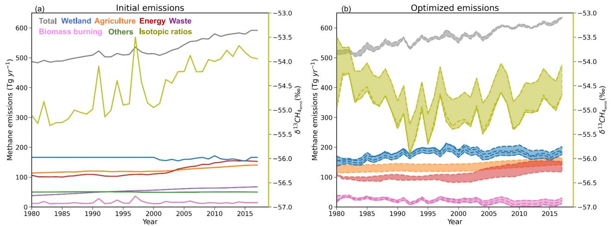  
Figrei the left $Y$ axis and time series of emission-weighted global mean $\bar { 8 } ^ { 1 3 } \mathrm { C H } _ { 4 }$ (olive) on the right $Y$ axis; (b) same as (a) except time series of optimized global methane i g ipid (summarized in Table 1)and the shaded areas represent the upper and lower estimates from allexperiments.

# 2.Materials and Methods

# 2.1.Model Description

We use the global chemistry-climate model developed bythe Geophysical Fluid Dynamics Laboratory(GFDL)of the National Oceanic and Atmospheric Administration (NOAA), GFDL-AM4.1 (Horowitz et al., 2020), to understand changes in the global methane sources and sinks.A detailed description of the physics and dynamics in AM4.1 is provided by Dunne et al. (2O2O) and Horowitz et al. (2020).

We follow the modeling approach in He2O20. We include a representation of $\mathrm { C H } _ { 4 }$ and $^ { 1 3 } \mathrm { C H } _ { 4 }$ cycles in the model to fully characterize the drivers of methane trends and variability.Specifically,we drive the model with methane emissions from various anthropogenic and natural sources as described by $_ \mathrm { H e 2 0 2 0 }$ and also shown in Table S1 in Supporting Information S1. These emissions are compiled from various inventories,including anthropogenic methane sources fromthe Community Emissions Data System (CEDS) version 18 May 2017 (Hoesly et al.,2018) for1980-2O14 anda middle-of-the-road scenarioof Shared Socioeconomic Pathways targeting aforcing level of $4 . 5 \mathrm { ~ W ~ m ~ } ^ { - 2 }$ (SSP2-4.5） for 2015-2017 (Gidden et al., 2019), biomass burning (BMB） emissions from the BB4CMIP database (van Marle etal.,2017) for 1980-2014 and the SSP2-4.5 for 2015-2017, wetland (WET) emissions from the WetCHARTs version 1.0 inventory (Bloom et al., 2017),ocean (OCN) emissons from Brasseur et al. (1998)with near-shore methane fluxes from Lambert and Schmidt (1993),termites (TMl) from Fung et al. (1991),and mud volcanoes (VOL) from Etiope and Milkov (2004) and Patra et al. (2011).The time series of the global total emissions and emissions from major sectors over 1980-2017 are shown in Figure la. Anthropogenic and biomass burning emissions of other short-lived species are also from the CEDS and BB4CMIP databases and the SSP2-4.5 scenario.Natural emissons of other short-lived species are as described by Naik et al. (2O13). Biogenic emissions are calculated interactively following Guenther et al. (2006)as described by Horowitz et al. (2O2O).The emissions for $^ { 1 3 } \mathrm { C H } _ { 4 }$ are described in Section 2.2.

The $\mathrm { C H } _ { 4 }$ and $^ { 1 3 } \mathrm { C H } _ { 4 }$ sinks included in AM4.1 are mainly through the oxidation by OH,atomic chlorine (Cl),and excited-state atomic oxygen $( \mathrm { O } ( ^ { 1 } \mathrm { D } ) )$ . Dry deposition of methane is also included in the model to mimic methane loss by soil uptake.Detailed kinetic isotopic fractionations of $^ { 1 3 } \mathrm { C H } _ { 4 }$ are listed in Table S2 in Supporting Information S1.

Similar to $\mathrm { H e } 2 0 2 0$ ,we include 12 additional methane tracers tagged by source sector to attribute methane from agriculture(CH4AGR)，energy(CH4ENE)， industry (CH4IND)， transportation(CH4TRA)，residents (CH4RCO), waste (CH4WST), shipping (CH4SHP),biomass burning (CH4BMB),ocean (CH4OCN), wetland (CH4WET),termites (CH4TMI),and mud volcanoes (CH4VOL). The associated source-tagged $^ { 1 3 } \mathrm { C H } _ { 4 }$ and full $^ { 1 3 } \mathrm { C H } _ { 4 }$ tracers are also included.The tracers are emited from the above listed sources,and undergo the same chemical pathways,transport,and dry deposition as the full $\mathrm { C H } _ { 4 }$ or $^ { 1 3 } \mathrm { C H } _ { 4 }$ tracer. For analysis,we combine CH4IND,CH4TRA，CH4RCO,CH4SHP,and CH4OCN,CH4TMI, and CH4VOL as other tracers (i.e., CH4OTH). The same approach is applied to $^ { 1 3 } \mathrm { C H } _ { 4 }$ tracers.

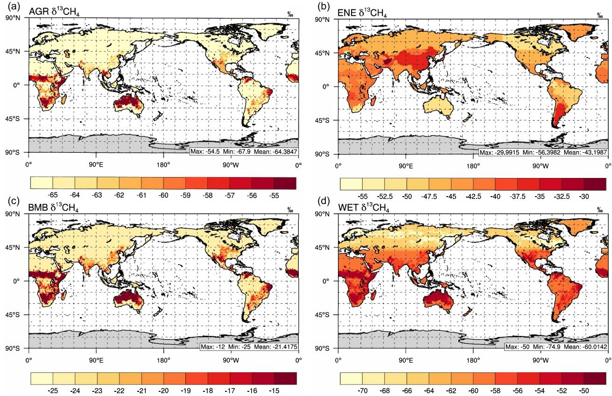  
Fige sourcesigauebo aveagf wetlands are directly from Ganesan et al.(2018).

After a 5O-year spin-up run following the approach in $\mathrm { H e } 2 0 2 0$ ,several sets of simulations are conducted for 1980-2017 to quantify the methane budget and investigate the impacts of changes in methane sources and sinks onatmospheric methane abundance (see Section 2.4).All model simulations are forced with prescribed interannually-varying sea surface temperatures and sea ice with the horizontal winds nudged to the National Centers for Environmental Prediction (NCEP) reanalysis (Kalnay et al.,1996)as described in $\mathrm { H e } 2 0 2 0$

# 2.2. Spatially Resolved Isotopic Signatures for Individual Methane Sources

Instead of using a single global mean isotopic ratio for each source sector, here we compile spatiall resolved ${ \ S } ^ { 1 3 } \mathrm { C H } _ { 4 }$ for major sectors as shown in Figure 2. For the agriculture (AGR) sector, we start from rice cultivation and ruminant subsectors.Each subsector is associated with a specific global mean isotopic ratio.Specifically,for the rice subsector, we apply country-specific isotopic ratios based on Sherwood et al. (2O17)and assume $- 6 3 \text{‰}$ for the rest of the world based on Whiticar and Schaefer (2OO7).For the ruminant subsector,considering the different C-3 and C-4 vegetation types, we apply a global mean of $- 5 4 . 5 \text{‰}$ for C-4 vegetation-fed livestock and $- 6 7 . 9 \text{‰}$ for C-3 vegetation-fed livestock based on Sherwood et al. (2O17) along with the C-4 fraction from Still et al. (2009)to get spatially resolved isotopic signatures.We then get grid-cellmean isotopic ratios for the AGR sector by weighted-averaging of country-based emissions from the rice and ruminant subsectors from the CEDS emission inventory.Similarly,forthe energy (ENE) sector, we start from coal and oil and gas subsectors.We apply country-specific isotopic ratios based on Sherwood et al. (2O17) for coal and oil and gas subsectors separately,and apply $- 4 1 . 2 \% o$ for coal subsector and $- 4 4 . 6 \text{‰}$ for oil and gas subsector based on weighted mean of Sherwood et al. (2O17)for the restof the world, where data is not available in Sherwood et al.(2O17) for these two subsectors. Then we obtain grid-cell mean isotopic ratios for the ENE sector by weighted-averaging of country-based emissions from coal and oil and gas subsectors from the CEDS emisson inventory.For the WET sector, we directly use the spatially resolved ${ \ S } ^ { 1 3 } \mathrm { C H } _ { 4 }$ from Ganesan et al. (2018). Strode et al. (2020) compared the simulations using a global mean source signature for WET and using Ganesan et al. (2O18),and found using spatially varying source signature from Ganesan et al.(2O18) can improve the interhemispheric gradient of ${ \delta } ^ { 1 3 } \mathrm { C H } _ { 4 }$ .However, uncertainties may still exist in Ganesan et al. (2018).For example, Oh et al. (2022) developed a new map for spatially varying wetland ${ \ S } ^ { 1 3 } \mathrm { C H } _ { 4 }$ ，which seems to agree bettr with a few boreal and tropical sites than Ganesan et al. (2O18). We acknowledge the uncertainties of wetland ${ \ S } ^ { 1 3 } \mathrm { C H } _ { 4 }$ in Ganesan et al. (2018),and need more observations to fully understand the spatial distributions of wetland ${ \ S } ^ { 1 3 } \mathrm { C H } _ { 4 }$ .For the BMB sector, we apply a global mean of $- 1 2 \text{‰}$ for C-4 vegetation and $- 2 5 \text{‰}$ for C-3 vegetation based on Lassey et al. (2007) along with the C-4 fraction from Stillet al. (2O09)to get spatially resolved isotopic signatures.For all other sectors,each sector is associated with a specific global mean isotopic ratio.Then we update country-specific isotopic ratios based on Sherwood et al.(2O17） for each sector with available observations and use global mean ratios for regions where there are no observations.Detailed global mean ratios we used in this work are summarized in Table S2 in Supporting Information S1.The time series of isotopic ratios of initial emissons are shown in Figure la.

# 2.3. Leveraging Observations to Optimize Methane Emissions

We use measurements of $\mathrm { C H } _ { 4 }$ and ${ \ S } ^ { 1 3 } \mathrm { C H } _ { 4 }$ from a globally distributed network of air sampling sites maintained by the NOAA Global Monitoring Laboratory(GML)(Lan et al.,2024; Michel etal.,2023) for optimizing methane emissions.We follow the same approach for emission optimization described in Ghosh et al. (2O15)and He2020. Specifically, we calculate the global and zonal averages of methane concentrations based on spatial and temporal smoothing of $\mathrm { C H } _ { 4 }$ measurements from multiple surface marine boundary layer (MBL) sites as in $_ \mathrm { H e 2 0 2 0 }$ The estimates of optimized emissions are based on comparison of simulated surface methane with NOAA GML MBL observations and simulated methane isotopic signatures with global mean estimates from Schaefer et al.(2016) for 1980-2014,assuming the same trend of ${ \ S } ^ { 1 3 } \mathrm { C H } _ { 4 }$ for 2015-2017 based on NOAA GML observations (Lan et al.，2O25). The observationsused for emission optimization are shown in Table S3 in Supporting Information S1.

In $_ \mathrm { H e 2 0 2 0 }$ ,a simple mass balance approach is applied to optimize global total methane emissions with calculated emission increment $\Delta E$ for each year.We do not optimize emissions for each grid cell as those in an inverse modeling system. Instead, we uniformly scale emissons for specific sectors (as described below) globally for each year by the ratio ofthe optimized emission total $( E _ { \mathrm { o p t } } = E _ { \mathrm { i n i t } } + \Delta E )$ to the initial emissions $( E _ { \mathrm { i n i t } } )$ In $\mathrm { H e } 2 0 2 0$ several sensitivity simulations are conducted to investigate the source contributions through distributing $\Delta E$ into either anthropogenic sectors or the wetland sector based on the sectoral source fraction in the initial inventories.In this work, we apply an additional constraint from observed ${ \delta } ^ { 1 3 } \mathrm { C H } _ { 4 }$ to partition $\Delta E$ into individual source sectors through $^ { 1 3 } \mathrm { C H } _ { 4 }$ emission optimization. A similar mass balance approach can also be applied to $^ { 1 3 } \mathrm { C H } _ { 4 }$ tracer as it is explicitly simulated in the model.Based on the definition of isotopic ratios,

$$
\delta ^ { 1 3 } \mathrm { C } = \left( \frac { \frac { 1 3 } { 1 2 } \mathrm { C } } { R _ { \mathrm { s t d } } } - 1 \right) \times 1 , 0 0 0
$$

where $R _ { \mathrm { s t d } } = 0 . 0 1 1 2 3 7 2$ from the Peedee belemnite (PDB) isotopic standard(Craig,1957).We choose this standard value to be consistent with the isotopic source signatures used in Table S2 in Supporting Information S1. $^ { 1 2 } \mathrm { C }$ and $^ { 1 3 } \mathrm { C }$ are concentrations of $^ { 1 2 } \mathrm { C H } _ { 4 }$ and $^ { 1 3 } \mathrm { C H } _ { 4 }$ . We rewrite the and can get the dierence in $^ { 1 3 } \mathrm { C H } _ { 4 } \left( \Delta ^ { 1 3 } \mathrm { C } \right)$ between simulated concentrations and observed concentrations as:

$$
\Delta ^ { 1 3 } \mathbf { C } = \left( \frac { \delta ^ { 1 3 } \mathbf { C } _ { \mathrm { s i m } } - \delta ^ { 1 3 } \mathbf { C } _ { \mathrm { o b s } } } { 1 , 0 0 0 } \right) \times R _ { \mathrm { s t d } } \times 1 2 \mathbf { C } _ { \mathrm { s i m } }
$$

where $^ { 1 2 } \mathrm { C } _ { \mathrm { s i m } }$ is simulated global mean $\mathrm { C H } _ { 4 }$ concentration, which should match the observed global means after the optimization.Based on the mass balance:

$$
\frac { d ^ { t } B } { d t } = { } ^ { t } E - { } ^ { t } L
$$

we can rewrite the Equation 3 as:

$$
\Delta ^ { t } E = H \times \frac { d \big ( \Delta ^ { t } C \big ) } { d t } + S \times \Delta ^ { t } C
$$

$$
{ } ^ { t } E _ { \mathrm { o p t } } = { } ^ { t } E _ { \mathrm { i n i t } } + \Delta { } ^ { t } E
$$

where $t$ could be either 12 or 13,representing either $^ { 1 2 } \mathrm { C H } _ { 4 }$ or $^ { 1 3 } \mathrm { C H } _ { 4 }$ tracer. $_ \mathrm { H }$ is burden (B)-to-concentration (C) conversion factor and S is loss $( L )$ factor,and both could be derived from the model simulations.Based on the relationship of $^ { 1 3 } \mathrm { C H } _ { 4 }$ and $^ { 1 2 } \mathrm { C H } _ { 4 }$ , we can also get burden and loss of $^ { 1 3 } \mathrm { C H } _ { 4 }$ as:

$$
{ } ^ { 1 3 } B = R _ { \mathrm { s i m } } \times { } ^ { 1 2 } B
$$

$$
^ { 1 3 } L = \sum _ { i } ^ { n } { } ^ { 1 2 } L _ { i } \times \alpha _ { i } \times R _ { \mathrm { s i m } }
$$

where Rsim = $\begin{array} { r } { R _ { \mathrm { s i m } } = \frac { \mathrm { ^ { 1 3 } C _ { \mathrm { s i m } } } } { \mathrm { ^ { 1 2 } C _ { \mathrm { s i m } } } } } \end{array}$ $^ { 1 2 } L _ { i }$ artheetesuetcs $\mathrm { O } ( ^ { 1 } \mathrm { D } )$ , Cl, nd soil uptake, $\begin{array} { r } { \alpha _ { i } = \frac { ^ { 1 3 } k _ { i } } { ^ { 1 2 } k _ { i } } } \end{array}$ are the isotopic fractionation factors for different loss processes, $k$ is the rate coefficient of chemical reactions or deposition velocity,and $i$ represents each loss pathway.

For an optimizedcase, wecacalculate $8 ^ { 1 3 } \mathrm { C _ { E o p t } }$

$$
\delta ^ { 1 3 } \mathbf { C } _ { E \mathrm { o p t } } = \left( \frac { ^ { 1 3 } E _ { \mathrm { o p t } } } { \frac { 1 2 } { R _ { \mathrm { o p t } } } } - 1 \right) \times 1 , 0 0 0 \%
$$

Meanwhile, $8 ^ { 1 3 } \mathrm { C _ { E o p t } }$ could be calculated as the emision-weighted averages of individual source signatures:

$$
\delta ^ { 1 3 } \mathrm { C } _ { E \mathrm { o p t } } = \frac { \sum _ { i = 1 } ^ { n } \delta ^ { 1 3 } \mathrm { C } _ { E _ { i } } { } ^ { 1 2 } E _ { i } } { \sum _ { i = 1 } ^ { n } { } ^ { 1 2 } E _ { i } }
$$

where $\sum _ { i = 1 } ^ { n } { } ^ { 1 2 } E _ { i } = { } ^ { 1 2 } E _ { \mathrm { o p t } }$ and $i$ representsteialoueodeet $^ { 1 3 } B _ { \mathrm { o p t } }$ and $^ { 1 3 } L _ { \mathrm { o p t } }$ by replacing $R _ { \mathrm { s i m } }$ with $R _ { \mathrm { o b s } }$ $^ { 1 2 } B$ with $^ { 1 2 } B _ { \mathrm { o p t } } ,$ and $^ { 1 2 } L$ with $^ { 1 2 } L _ { \mathrm { o p t } }$ and get $^ { 1 2 } E _ { \mathrm { o p t } }$ and $^ { 1 3 } E _ { \mathrm { o p t } }$ based on Equations 4-7.

We need to iterate the model to get the best match of observed $\mathrm { C H } _ { 4 }$ and $^ { 1 3 } \mathrm { C H } _ { 4 }$ .Some of the previous studies suggest biogenic sources are the dominant drivers for the post-2006 methane increase (Oh et al.,2O22; Schaefer et al.,2016).In this work, we distribute $\Delta E$ into agriculture, wetland,and biomass burning emissions,considering more depleted source signatures in the agriculture sector and wetland,and the large interannual variability of wetland and biomass burning emissions. Specifically,an additional amount of $2 5 \mathrm { T g \ y r ^ { - 1 } }$ is added to the initial CEDS AGR emissions for each year to bring it closer to AGR emissions in EDGARv5.0 (Monforti-Ferrario et al.,2O19）and to match the observed isotopic ratios.Then we distribute the remaining $\Delta E$ into wetland emissions $( \Delta E _ { \mathrm { w e t } } )$ and biomass burning emissions ( $\Delta E _ { \mathrm { b m b } } )$ constrained by the observed isotopic ratios.For the optimized emissions,we kep the interannual variability of the initial emissions unchanged for allthe sectors except for wetland and biomass burning emissions.

Table 1 Model Simulations Conducted in This Work   

<table><tr><td>Experiments</td><td>Description</td></tr><tr><td>EXP0_NCEP</td><td>Drive the model with NCEP reanalysis using compiled initial emisson inventories for 1980- 2017</td></tr><tr><td>EXPO_MERRA2</td><td>Drive the model with MERRA2 reanalysis using compiled initial emission inventories for 1980-2017</td></tr><tr><td>EXP1</td><td>Drive the model with NCEP reanalysis; optimize methane emissions for AGR,WET,and BMB sectors for 1980-2017 with compiled initial emission inventories for other sectors</td></tr><tr><td>EXP2</td><td>Same as EXP1, but replace the ENE sector in the CEDS with that from EDGAR v5.0; optimize methane emissions for AGR,WET,and BMB sectors for 1980-2017</td></tr><tr><td>EXP3</td><td>Same as EXP1, but with higher fractionation for 13CH4 + OH; optimize methane emissions for AGR, WET and BMB sectors for 1980-2017</td></tr><tr><td>EXP4</td><td>Same as EXP1,but drive the model with MERRA2 reanalysis; optimize methane emissions for AGR,WET,and BMB sectors for1980-2017</td></tr></table>

# 2.4. Model Simulations With Sensitivity to Different Factors

We conduct severalsets of model simulations for 1980-2017,as listed in Table 1,to quantify the methane budget and the contributions of sources and sinks to the methane trend.The model simulation using the initial methane emissions inventories (EXPO_NCEP) described in Section 2.1 is found to largely underestimate the methane concentrations as shown in He2O20.Here,we perform several optimization simulations that explore the sensitivity of methane changes to uncertainties in methane emissions, kinetic fractionation of $^ { 1 3 } \mathrm { C H } _ { 4 } + \mathrm { O H }$ ,as well as meteorological inputs that would affect OH levels,the dominant sink for methane.

Based on the initial results from EXPo_NCEP,we optimize agriculture,wetland,and biomassburning emissions as discussed in Section 2.3, with EXP1 showing the optimized case driven by the NCEP reanalysis.Since we do not optimize emissions regionally,this emission optimization largely relies on the spatial information from the initial emission inventories,which are also asociated with spatial and temporal uncertainty. Considering the potential contributions from fosil fuel activities to the methane increase as discussed in previous studies (He et al.,202O; Worden et al.,2O17), we perform an additional simulation with energy sector from EDGAR $\mathrm { { v } 5 . 0 }$ (EXP2）to compare with that from CEDS,as the EDGAR ENE tends to be lower than CEDS by about $2 5 \pm 1 2 \mathrm { T g } \mathrm { y r } ^ { - 1 }$ (lower bound of ENE in Figure 1b).In addition,the uncertainty in the kinetic isotopic fractionation of $^ { 1 3 } \mathrm { C H } _ { 4 } + \mathrm { O H }$ is also nvestigated in this work. We find a lower kinetic fractionation would require negative BMB emissons in order to match the observed isotopic ratios.So we end up testing medium (EXP1) and higher (EXP3) kinetic fractionation of $^ { 1 3 } \mathrm { C H } _ { 4 } + \mathrm { O H }$ as shown in Table S2 in Supporting Information S1. Since $\mathrm { C H _ { 4 } + O H }$ is the major methane loss pathway,and the choice of meteorological fields affects OH as shown by He et al.(2021),we perform additional simulations with different meteorological inputs from the Modern-Era Retrospective analysis for Research and Applications，Version 2 (MERRA-2)(Gelaro et al.，2017)，with EXPO_MERRA2 and EXP4 driven by the initial emission inventories and optimized emissions,respectively.

# 3. Results and Discussions

# 3.1.Model Evaluation With Optimized Methane Emissions

Model simulations with optimized emissons show a clear latitudinal gradient of surface methane and ${ \delta } ^ { 1 3 } \mathrm { C H } _ { 4 }$ ， with higher methane concentrations and more negative ${ \ S } ^ { 1 3 } \mathrm { C H } _ { 4 }$ in the Northern Hemisphere than the Southern Hemisphere (Figure 3).There are no significant diferences in the distributions and variations of methane and ${ \delta } ^ { 1 3 } \mathrm { C H } _ { 4 }$ among EXP1, EXP3,and EXP4, as the anthropogenic emissions are identical across these simulations. Due to different ENE emissions used in EXP1(CEDS) and EXP2 (EDGAR),the major differences occur in middle-high Northern latitudes. Compared to EXP2,EXP1 shows overall bettr performance in capturing methane trends and variabilities as well as ${ \delta } ^ { 1 3 } \mathrm { C H } _ { 4 }$ at regional scales,such as over BRW,MLG,and other sites in the Northern Hemisphere (Figure S1 in Supporting Information S1). In adition,all experiments cancapture the growth rates over MLO, CGO,and SPO sites (Figure S1 in Supporting Information S1).

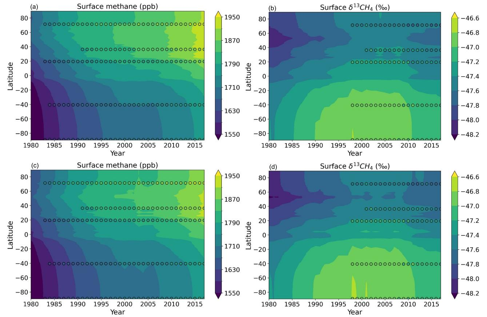  
Figure 3.Time series oflatitudinal distributionof surface annual methane (leftcolumn,panels (a)&(c))and $\ S ^ { 1 3 } \mathrm { C H } _ { 4 }$ (right column,panels (b)&(d))from EXP1(upper rowandEXPotbe and ${ \delta } ^ { 1 3 } \mathrm { C H } _ { 4 }$ over five different sites.From North to South: Barrow, USA (BRW, $7 1 . 3 \mathrm { ^ \circ N }$ $1 5 6 . 6 ^ { \circ } \mathrm { W }$ ); Mountain Waliguan, China (MLG, $3 6 . 3 \mathrm { ^ \circ N }$ $1 0 0 . 9 ^ { \circ } \mathrm { E }$ ); Mauna Loa, USA (MLO, $1 9 . 5 \mathrm { ^ \circ N }$ ， $1 5 5 . 6 ^ { \circ } \mathrm { W }$ ); Cape Grim,Australia (CGO, $4 0 . 7 ^ { \circ } \mathrm { S }$ ， $1 4 4 . 7 ^ { \circ } \mathrm { E }$ ; South Pole,USA(SPO, $9 0 . 0 ^ { \circ } \mathrm { S }$ $2 4 . 8 ^ { \circ } \mathrm { W }$ .

We also aggregate the MBL sites into different latitude bands for evaluation (Figure 4).The observed surface methane concentrations are higher and ${ \delta } ^ { 1 3 } \mathrm { C H } _ { 4 }$ is more negative in the Northern Hemisphere than the Southern Hemisphere. Such latitudinal features are well captured by the model with optimized emissons (Figure 4),despite the global-scale emission optimization. Surface methane concentrations are reasonably well estimated across different latitude bands,although the model exhibits a high bias $( < 2 0 \mathrm { p p b } )$ over tropics,and the low bias (about 22 ppb)over high latitudes( $5 3 . 1 { - } 9 0 ^ { \circ } \mathrm { N }$ and $5 3 . 1 \mathrm { - } 9 0 ^ { \circ } \mathrm { S }$ ).In addition,the methane trends are well captured by the model,with the correlation coefficient $( R ^ { 2 } ) > 0 . 9$ across different latitude bands.Meanwhile,the model is also able to capture the global trend of ${ \delta } ^ { 1 3 } \mathrm { C H } _ { 4 }$ since 1998, with mean bias $= - 0 . 0 7$ and $R ^ { 2 } > 0 . 9 2$ (Figure 4a). The model can reproduce observed magnitudes and trends of ${ \delta } ^ { 1 3 } \mathrm { C H } _ { 4 }$ generally well in the tropics and Southern Hemisphere,but shows larger low bias in the temperate Northern Hemisphere and poor temporal correlation over the northern high latitudes.However,the bias has been reduced and the correlation has improved since 2010.This is likely due to much fewer observational sites for ${ \ S } ^ { 1 3 } \mathrm { C H } _ { 4 }$ in the early 2OoOs,which may not fully represent the temperate and polar Northern Hemisphere conditions,where there are more complex emission sources than those in the Southern Hemisphere.

Since selected MBL observations represent the background conditions, there are not many discrepancies among four different experiments across different latitude bands.However,EXP2 shows higher model bias than other experiments especially over the polar and temperate Northern Hemisphere (Figures 4c and 4e).The differences between CEDS ENE and EDGAR ENE are partly driven by diferent estimates ofcoal mining over China (Hoesly et al.,2018; Hoglund-Isakssonetal.,202O; Oreggioni etal.,2021; Saunois etal.,2025; Solazzoetal.,201).For example,WLG is aremote site located in western China, where the methane concentrations have shown to be affected by the long-range transport from source regions (Liu et al.,2O21). The comparisons of methane concentrations and ${ \delta } ^ { 1 3 } \mathrm { C H } _ { 4 }$ at WLG (Figure S1 in Supporting Information S1） suggest overall better emission estimates and source contributions in EXP1(CEDS) than EXP2 (EDGAR). Satelite evaluation of column-averaged $\mathrm { C H } _ { 4 }$ concentrations over East Asia (Figure S2 in Supporting Information S1) further confirms beter ENE estimates from EXP1 (CEDS) than EXP2 (EDGAR) in the Northern Hemisphere.

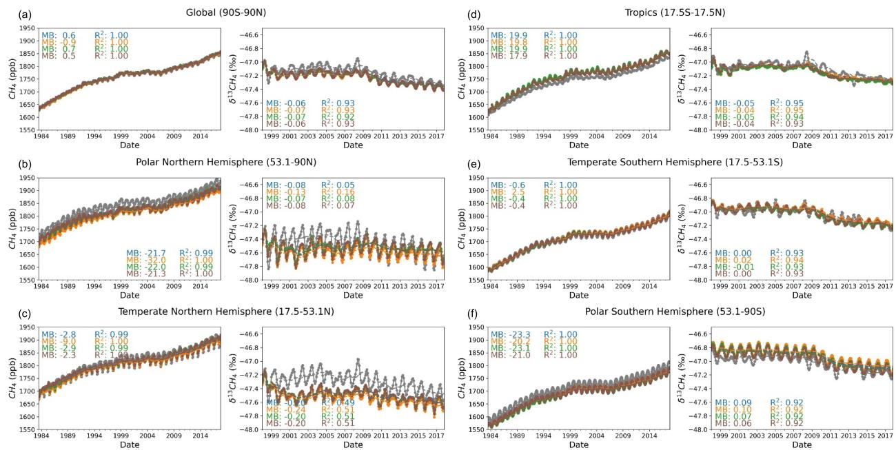  
Figure 4.Latitudinal comparisons of methane concentrations and atmospheric ${ \delta } ^ { 1 3 } \mathrm { C H } _ { 4 }$ from National Oceanic and Atmospheric Administration Global Monitoring Laboratoret on the left and atmospheric $\ S ^ { 1 3 } \mathrm { C H } _ { 4 }$ evaluationontheright,with circles representing monthly mean withineach latitudeband.Mean biasandsquareofcorrelation coefficient $( R ^ { 2 } )$ are shown for each model evaluation in corresponding colors. We processthe global mean and latitudinal mean $\ S ^ { 1 3 } \mathrm { C H } _ { 4 }$ following the same approach for global mean $\mathrm { C H } _ { 4 }$ concentrations as done in $\mathrm { H e } 2 0 2 0$ based on the measurements done by the Institute of Arctic and Alpine Research (INSTAAR)(Micheletal.,2023), to allow for fair comparisons between observations and model simulations.

# 3.2. Optimized Global Methane Budget

We focus on the optimized global methane budget during four time periods (i.e.,1980-1989,1990-1998,1999- 2006,and 2O07-2017) to be consistent with the changes in the methane growth in the past decades.As shown in Figure 5a and Table 2，the optimization results in the multi-year mean total methane emissions of $5 2 1 \pm 1 4 \mathrm { T g } \mathrm { y r } ^ { - 1 }$ during 1980-1989, $5 5 5 \pm 1 5 \mathrm { T g } \mathrm { y r } ^ { - 1 }$ during 1990-1998, $5 6 8 \pm 1 3 \mathrm { T g } \mathrm { y r } ^ { - 1 }$ during 1999-2006, and $6 0 7 \pm 1 1 \mathrm { T g } \mathrm { y r } ^ { - 1 }$ during 2007-2017, with associated multi-year mean methane sinks of $4 8 6 \pm 1 9 \mathrm { T g } \mathrm { y r } ^ { - 1 }$ ， $5 3 6 \pm 1 2 \mathrm { T g } \mathrm { y r } ^ { - 1 }$ , $5 6 6 \pm 8 \mathrm { T g } \mathrm { y r } ^ { - 1 }$ , and $\mathsf { 5 8 9 } \pm 8 \mathrm { T g } \mathrm { y r } ^ { - 1 }$ ,respectively.Those estimates are within the ranges of estimates inthe previous studies using either top-downor bottom-upapproaches (Saunois et al.,2O20,2025).The optimized global methane budget does not vary acrossimulations EXP1-3(Table 1)as they are allconstrained by the same meteorology and methane observations.Forced by different meteorology from MERRA2,the global methane emissions and sinks are slightly higher in EXP4 by $7 { - } 1 5 ~ \mathrm { T g ~ y r } ^ { - 1 }$ during different growth periods (Table 2)than EXP1-3,which is mainly dueto higher OH levels in the MERRA2-driven simulations than in the NCEP-driven simulations. $_ \mathrm { H e 2 0 2 0 }$ using the GFDL-AM4.1 model suggested a $1 \%$ change in OH could lead to about $4 ~ \mathrm { T g ~ y r } ^ { - 1 }$ change in the optimized methane emissions. The responses of OH levels to the different meteorological inputs have been discussed in our previous work of He et al. (2O21). In summary,there is a significant increase in the multi-year mean methane emissons from 1980 to 1989 to 1990-1998 (by $3 0 \mathrm { T g } \mathrm { y r } ^ { - 1 } ,$ ）， followed by a smaller increase in 1999-2006 (by $1 3 \ \mathrm { T g \ y r ^ { - 1 } } .$ ）and rebounded emissions in 2007-2017 (by $4 0 \mathrm { T g \ y r ^ { - 1 } }$ in EXP1-3 or by $3 4 ~ \mathrm { T g ~ y r } ^ { - 1 }$ in EXP4).

All experiments show similar changes in the global multi-year mean source ${ \delta } ^ { 1 3 } \mathrm { C H } _ { 4 }$ and sink fractionation in the past decades as shown in Table 2. Specifically, there is a $0 . 6 \text{‰}$ decrease in global multi-year mean source ${ \delta } ^ { 1 3 } \mathrm { C H } _ { 4 }$ from the 1980s to the 1990s,followed by minor changes from the 1990s to 1999-2006 $( < 0 . 1 \text{‰}$ and an increase of $0 . 2 \mathrm { - } 0 . 3 \% o$ from 1999 to 2006 to 2007-2017. Similarly,there is a $0 . 2 \text{‰}$ decrease in global multi-year mean sink fractionation from the 198Os to the 199Os,followed by an increase of $0 . 1 \text{‰}$ from the 1990s to 1999-2006 and an increase of $0 . 1 \mathrm { ~ ‰ ~ }$ from 1999 to 2006 to 2007-2017.With higher isotopic fractionation for $^ { 1 3 } \mathrm { C H } _ { 4 } – \mathrm { O H }$ sink in EXP3 than EXP1-2, there is about $0 . 6 \mathrm { ~ ‰ ~ }$ difference in the global multi-year mean source ${ \delta } ^ { 1 3 } \mathrm { C H } _ { 4 }$ and sinkweighted fractionation. On the other hand,different meteorology (EXP1 vs.EXP4） shows minor impacts $( < 0 . 1 \mathrm { ~ ‰ ~ }$ on both optimized source signatures and sink-weighted fractionations.

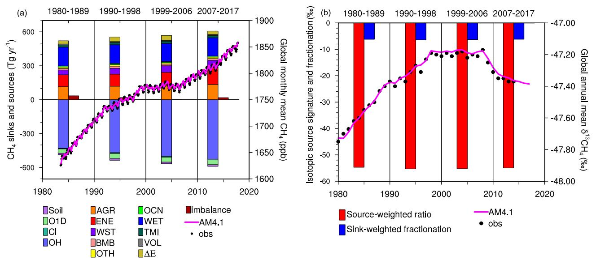  
Figure5lobeet(doctofo eptsteio observed global monthly mean $\mathrm { C H } _ { 4 }$ withthesolidmagentalinerepresenting simulatedvalues,whichare showontherightYaxis;(b)Eachbarrepresents themultiyeareaofoueodctoae)eoefceprl ${ \delta } ^ { 1 3 } \mathrm { C H } _ { 4 }$ fromSchaeferet al. (2O16),with thesolid magentalinerepresenting simulated values,whichareshownontherightYaxis.

Both methane sources and sinks increased from 1999 to 2006 to 2007-2017.The estimated methane emission increase is higher than that by Basu et al. (2O22) using an inversion modeling framework with both methane and ${ \ S } ^ { 1 3 } \mathrm { C H } _ { 4 }$ constraints, where methane loss rates in the stratosphere are prescribed and tropospheric losses due to Cl and OHare simulated based on prescribed Cland OH levels.In our model, we explicitly simulate methane losses due to OH, Cl, and $\mathrm { O } ( ^ { 1 } \mathrm { D } )$ throughout the atmosphere. Such differences lead to different estimates in methane sinks and therefore different optimized methane emissions. Our larger emission increase is required to offset the higher methane sinks due to the increasing OHlevels simulated by our model (He et al.,2020,2021) in order to match the observations.Due to the increasing trend in methane and OH levels,post-2Oo6 methane sinks have increased by $2 3 \mathrm { T g } \mathrm { y r } ^ { - 1 }$ in EXP1-3 and $1 9 \mathrm { T g } \mathrm { y r } ^ { - 1 }$ in EXP4,compared with 1999-2006 (Table 2).As shown in Table 2,the optimization suggests an increase of about $0 . 2 4 - 0 . 2 9 \mathrm { \ ‰ }$ in the global multi-year mean source ${ \delta } ^ { 1 3 } \mathrm { C H } _ { 4 }$ from 1999 to 2006 to 2007-2017.The post-2006 shift of the global multi-year mean source ${ \delta } ^ { 1 3 } \mathrm { C H } _ { 4 }$ is larger than thatin Schaefer etal.(2O16),however,inanopposite directionas that inother works (Chandraet al.224; Ghosh et al.,2015; Thanwerdas etal.,2O24).This is likelydue in partto the differentrepresentations of methane sinks (e.g., OH trend) and isotopic fractionations between this work and their studies.We calculate the sink-weighted average fractionation factor,which shifts from $- 6 . 3 2 \pm 0 . 0 5 \% o$ in 1999-2006 to $- 6 . 2 0 \pm 0 . 0 2 \%$ in 2007-2017 in EXP1(Table 2).The calculated sink fractionation factor is more comparable to the mean value in Schwietzke et al.(2O16) but much larger than the default value of $- 7 . 8 5 \mathrm { ~ ‰ ~ }$ in Lan,Basu, et al. (2021). In a higher OH sink fractionation case (EXP3),the sink-weighted average fractionation factor shifts from $- 5 . 7 0 \pm 0 . 0 5 \% o$ in 1999- 2006 to $- 5 . 5 7 \pm 0 . 0 2 \% o$ in 2007-2O17.This factor is closer to the 90th percentile of the range in Schwietzke et al. (2016).The different OH sink fractionations (median sink vs. high sink) could lead to $0 . 6 2 \text{‰}$ difference in the total sink fractionation factor.To account for such a difference,we need to reduce the wetland emissions in EXP1 by about $1 0 \mathrm { T g } \mathrm { y r } ^ { - 1 }$ and transfer this amount to biomass burning emissions in EXP3 in order to match the observations (Figure S3 in Supporting Information S1).

Table 2 Optimized Global Methane Budget,Source-Weighted Signatures,and Sink-Weighted Fractionation (Multi-Year Global Mean ± Standard Deviation)   

<table><tr><td colspan="2"></td><td colspan="6">Sources (Tg yr-1)</td></tr><tr><td>Period</td><td>Runs</td><td>Total</td><td></td><td>AGR + WST</td><td>ENE</td><td>WET</td><td>BMB</td></tr><tr><td>1980-1989</td><td>EXP1</td><td></td><td>521 ± 14</td><td>184 ± 5</td><td>104 ± 3</td><td>158 ± 9</td><td>25 ± 5</td></tr><tr><td></td><td>EXP2</td><td></td><td></td><td></td><td>92 ± 7</td><td>166 ± 10</td><td>29 ± 5</td></tr><tr><td></td><td>EXP3</td><td></td><td></td><td></td><td>104 ± 3</td><td>149 ± 9</td><td>34 ± 4</td></tr><tr><td></td><td>EXP4</td><td></td><td>536 ± 15</td><td></td><td></td><td>170 ± 9</td><td>27 ± 5</td></tr><tr><td>1990-1998</td><td>EXP1</td><td></td><td>555 ± 15</td><td>197 ± 2</td><td>106 ± 3</td><td>184 ± 9</td><td>17 ±6</td></tr><tr><td></td><td>EXP2</td><td></td><td></td><td></td><td>90 ± 2</td><td>193 ± 10</td><td>25 ± 7</td></tr><tr><td></td><td>EXP3</td><td></td><td></td><td></td><td>106 ± 3</td><td>175 ± 9</td><td>25 ± 7</td></tr><tr><td></td><td>EXP4</td><td></td><td>566 ± 16</td><td></td><td></td><td>193 ± 11</td><td>19 ± 7</td></tr><tr><td>1999-2006</td><td>EXP1</td><td></td><td>568 ± 13</td><td>206± 5</td><td>120 ± 10</td><td>180 ± 10</td><td>12 ± 5</td></tr><tr><td></td><td>EXP2</td><td></td><td></td><td></td><td>88 ±6</td><td>197 ± 9</td><td>27 ±4</td></tr><tr><td></td><td>EXP3</td><td></td><td></td><td></td><td>120 ± 10</td><td>171 ± 10</td><td>21± 5</td></tr><tr><td></td><td>EXP4</td><td></td><td>580 ± 11</td><td></td><td></td><td>190 ± 10</td><td>15 ± 5</td></tr><tr><td>2007-2017</td><td>EXP1</td><td></td><td>607 ± 11</td><td>225 ± 6</td><td>150 ± 6</td><td>177 ± 7</td><td>5±5</td></tr><tr><td></td><td>EXP2</td><td></td><td></td><td></td><td>111 ± 8</td><td>196 ± 8</td><td>25 ± 5</td></tr><tr><td></td><td>EXP3</td><td></td><td></td><td></td><td>150 ± 6</td><td>168 ± 7</td><td>15 ±6</td></tr><tr><td></td><td>EXP4</td><td></td><td>614 ± 11</td><td></td><td></td><td>183 ± 7</td><td>5±6</td></tr><tr><td></td><td></td><td colspan="2"> Sinks (Tg yr-1)</td><td colspan="2"></td><td colspan="2"></td></tr><tr><td>Period</td><td>Runs</td><td>Total</td><td>OH</td><td>Source-weighted signature (%o)</td><td></td><td>Sink-weighted fractionation (%o)</td><td></td></tr><tr><td>1980-1989</td><td>EXP1</td><td>486 ± 19</td><td>430 ± 14</td><td colspan="2">-54.72 ± 0.27</td><td colspan="2">-6.21 ± 0.09</td></tr><tr><td></td><td>EXP2</td><td></td><td></td><td colspan="2"></td><td colspan="2"></td></tr><tr><td></td><td>EXP3</td><td></td><td></td><td colspan="2">-54.05 ± 0.31</td><td colspan="2">-5.59 ± 0.09</td></tr><tr><td></td><td>EXP4</td><td>500 ± 20</td><td>443 ± 15</td><td colspan="2">-54.69 ± 0.28</td><td colspan="2">-6.16 ± 0.08</td></tr><tr><td>1990-1998</td><td>EXP1</td><td>536 ± 12</td><td>468 ± 12</td><td colspan="2">-55.32 ± 0.37</td><td colspan="2">-6.43 ± 0.02</td></tr><tr><td></td><td>EXP2</td><td></td><td></td><td colspan="2"></td><td colspan="2"></td></tr><tr><td></td><td>EXP3</td><td></td><td></td><td colspan="2">-54.73 ± 0.36</td><td colspan="2">-5.81 ± 0.02</td></tr><tr><td>1999-2006</td><td>EXP4</td><td>548 ± 13</td><td>480 ± 13</td><td colspan="2">-55.28 ± 0.39</td><td colspan="2">-6.37 ± 0.02</td></tr><tr><td></td><td>EXP1</td><td>566 ± 8</td><td>501 ± 9</td><td colspan="2">-55.25 ± 0.20</td><td colspan="2">-6.32 ± 0.05</td></tr><tr><td></td><td>EXP2</td><td></td><td></td><td colspan="2"></td><td colspan="2"></td></tr><tr><td></td><td>EXP3</td><td></td><td></td><td colspan="2">-54.64 ± 0.20</td><td colspan="2">-5.70 ± 0.05</td></tr><tr><td>2007-2017</td><td>EXP4</td><td>577 ± 6</td><td>512 ± 7</td><td colspan="2">-55.19 ± 0.20</td><td colspan="2">-6.27 ± 0.04</td></tr><tr><td></td><td>EXP1</td><td>589 ±8</td><td>526±8</td><td colspan="2">-54.96 ± 0.24</td><td colspan="2">-6.20 ± 0.02</td></tr><tr><td></td><td>EXP2</td><td></td><td></td><td colspan="2"></td><td colspan="2"></td></tr><tr><td></td><td>EXP3</td><td></td><td></td><td colspan="2">-54.37 ± 0.24</td><td colspan="2">-5.57 ± 0.02</td></tr><tr><td></td><td>EXP4</td><td>596 ± 8</td><td>533 ± 7</td><td colspan="2">-54.95 ± 0.24</td><td colspan="2">-6.17 ± 0.02</td></tr></table>

# 3.3.Possible Drivers for the Post-2oo6 Methane Growth

Although both methane sources and sinks are higher during 2007-2017 than 1999-2006,the increase in the total methane sources dominates over the methane sinks,leading to a net increase in the atmospheric methane abundances,driving the post-20o6 methane growth.Figure 6 shows the changes of methane emissions and source ${ \ S } ^ { 1 3 } \mathrm { C H } _ { 4 }$ from 1999 to 2006 to 2007-2017 across different latitude bands.Emissions from AGR and waste tracer (WST)in 2O07-2017are generally higherover mostof the regions except high northern latitudes.These emission differences are directly based on the CEDS inventory.Both CEDS (EXP1)and EDGAR v5.0(EXP2) experiments show increases in fossil fuel emissions across different latitude bands except for a small decrease in the high northern latitudes in EDGAR v5.0.Also, the increases in fossil fuel emissions are overallower in EDGAR $\mathrm { { v } 5 . 0 }$ than in CEDS.The optimized wetland emissons decrease in the tropics and the Northern Hemisphere,with smaler increases in the Southern Hemisphere middle latitudes,while the optimized biomass burning emissions decrease across allthe latitude bands.As a result,there are minor decreases in global wetland emissions $( < 3 \mathrm { T g } \mathrm { y r } ^ { - 1 }$ in EXP1-3 and $7 \mathrm { T g } \mathrm { y r } ^ { - 1 }$ in EXP4,or by ${ < } 4 \%$ ),but moderate-to-large decreases in biomass burning emissions ( $^ { - 2 }$ to $- 8 ~ \mathrm { T g ~ y r } ^ { - 1 }$ or by $8 \% - 5 7 \%$ ）from 1999 to 2006 to 2007-2017.While Saunois et al. (2025) showed small increases in wetland emissions from 20o0 to 2009 to 2010-2019 ( ${ < } 7 \mathrm { T g / y r }$ or within $5 \%$ ), thewide spread of bottom-up emission estimates are observed due to different model parameterizations.For example,the very smalldecreases in wetland emissons estimated in this work are consistent with an independent bottom-up estimate by McNicol et al. (2023),which suggested a $3 \mathrm { T g } / \mathrm { y r }$ decrease fr0m 2001 to 2006 to 2007-2017.A small decline in wetland emissions after 2010 is also consistent with another botom-up estimate by Xiao et al. (2024). Lower wetland and biomass burning emissions post-2006 than those in 1999-2O06 are consistent with findings in previous studies (Thanwerdas etal.,2O24; Worden etal.,2017),but inconsistent with some studies that suggested higher wetland emissions (Chandra et al.,2O24),possiblydue in part to the diferent model representations of the processes that affect the methane cycle.The increases in emissions from agriculture, waste management, and fossil fuels after 2O06 are generally consistent with those in previous studies (Jackson etal.,2O2O; Thanwerdas et al., 2024).

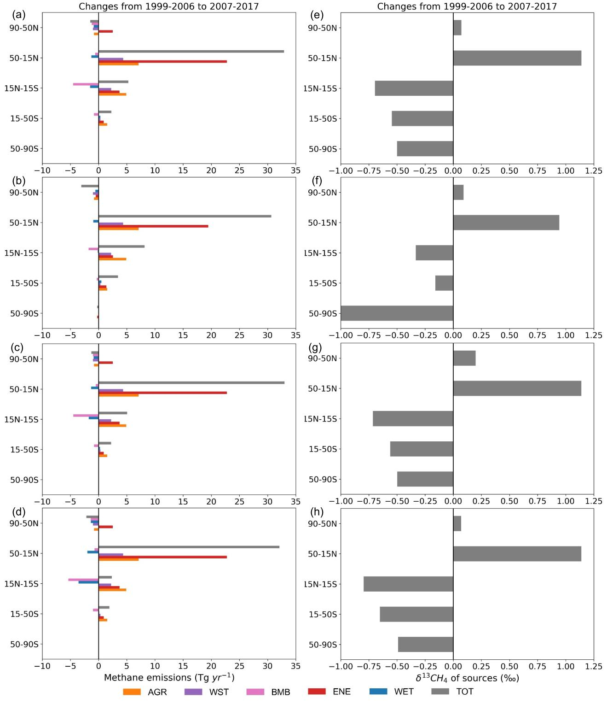  
Figure 6. Changes of methane emissions (left column,a-d) and source ${ 8 ^ { 1 3 } } \mathrm { C H _ { 4 } }$ (right column,e-h) from 1999-2006 to 2007-2017 across different latitude bands from fourexperietE orange)aste emissions and source ${ \delta } ^ { 1 3 } \mathrm { C H } _ { 4 }$

All experiments show an overall decrease in the source ${ \delta } ^ { 1 3 } \mathrm { C H } _ { 4 }$ (more negative) over the tropics and the Southern Hemisphere,with an overallicrease (less negative)over middle and high latitudes of the Northern Hemisphere (right column in Figure 6). The decreases of source ${ \ S } ^ { 1 3 } \mathrm { C H } _ { 4 }$ over the tropics and the Southern Hemisphere are driven by the decreases in the $^ { 1 3 } \mathrm { C } .$ enriched BMB emissions and increases in the $^ { 1 3 } \mathrm { C } .$ depleted AGR and WST emissions. The increases of source ${ \delta } ^ { 1 3 } \mathrm { C H } _ { 4 }$ over middle and high latitudes of the Northern Hemisphere are driven by the increases in the ENE emissions, which also drive the increases in global mean source ${ \delta } ^ { 1 3 } \mathrm { C H } _ { 4 }$ . However, as the global mean atmospheric ${ \ S } ^ { 1 3 } \mathrm { C H } _ { 4 }$ shifts toward more negative values,considering much larger emission changes and relatively higher OHlevels over the tropics than over Southern Hemisphere middle and high latitudes (Figure S4 in Supporting Information S1),the post-2006 shift of atmospheric ${ \delta } ^ { 1 3 } \mathrm { C H } _ { 4 }$ is more likely due to the increases in the tropical $^ { 1 3 } \mathrm { C }$ -depleted AGR and WST emissions with decreases in the $^ { 1 3 } \mathrm { C }$ -enriched BMB emissions.Sensitivity simulations with different sink fractionations and diferent meteorology show a similar shift of the latitudinal mean source ${ \delta } ^ { 1 3 } \mathrm { C H } _ { 4 }$ .However,with different ENE emissions in EXP1 and EXP2,much largerimpacts occur over tropics and the Southern Hemisphere,which are assciated with diferent changes in the WET,BMB,and ENE emissions.

Changes in the methane sinks and the isotopic fractionation due to OH trend may also contribute to the ${ \delta } ^ { 1 3 } \mathrm { C H } _ { 4 }$ shift after 2OO6, particularly because there is a net change in the global mean atmospheric ${ \delta } ^ { 1 3 } \mathrm { C H } _ { 4 }$ that shifts toward more negative values ${ } ^ { 1 3 } \mathrm { C } .$ depleted) with the global mean source ${ \delta } ^ { 1 3 } \mathrm { C H } _ { 4 }$ shifting in an opposite direction. This finding is partly consistent with that from Skeie et al. (2O23) indicating that decrease in ${ \delta } ^ { 1 3 } \mathrm { C H } _ { 4 }$ between 2008 and 2O14 can be explained by increases in OH levels.However,this is inconsistent with previous studies based on prescribed methane sinks or OH levels (Basu et al.,2022; Chandra et al.,2024).As OH is explicitly simulated in our model,changes in the methane concentrations willfeed back on the OH levels,which further affect methane sinks,isotopic fractionation, and therefore methane lifetime.We discuss this in the following Section (3.4).

To further understand the changes in the rate of atmospheric methane increase, we follow the same approach used by $\mathrm { H e } 2 0 2 0$ to calculate the linear trend of each source-tagged tracers over the background sites used in calculating background methane concentrations by NOAA GML (Figure 7).As shown in Figure 7,allexperiments show the global total tracer trend during 2O07-2O17 is dominated by the fossil fuel tracer CH4ENE,followed by the biogenic tracers CH4AGR and CH4WST.All the trends are calculated based on the global averages in the MBL. We also calculate the trends across different latitudes (Figure S5 in Supporting Information S1), which do not show much difference in the observed methane trends considering the well-mixed background conditions. Compared to 1999-2006,the increasing trends of CH4AGR and CH4ENE are significantly higher in 2007-2017, which are associated with higher AGR and ENE emissions.Another widely used methane fosil fuel emissions estimated from the Greenhouse Gas and Air Pollution Interactions and Synergies (GAINS)are generally within the range of EDGAR and CEDS estimates and show smaller post-2O06 increase than EDGAR and CEDS (Hoglund-Isaksson et al., 2020). $_ \mathrm { H e 2 0 2 0 }$ showed a $3 \mathrm { \ p p b \ y r ^ { - 1 } }$ increase of post-2006 CH4ENE even with ENE emissions kept constant after 2Oo6.Therefore,if GAINS ENE emissons were used,there would be an increase of post-2006 CH4ENE larger than $3 \mathrm { \ p p b \ y r ^ { - 1 } }$ but smaller than $7 \mathrm { p p b } \ \mathrm { y r } ^ { - 1 }$ as estimated from CEDS in this work. Meanwhile, there is a larger decreasing trend of CH4WET in EXP1,3,and 4,despite minor decreases in WET emissions.This is mainly due to higher OHlevels in 2O07-2017 that further decrease CH4WETconcentrations.

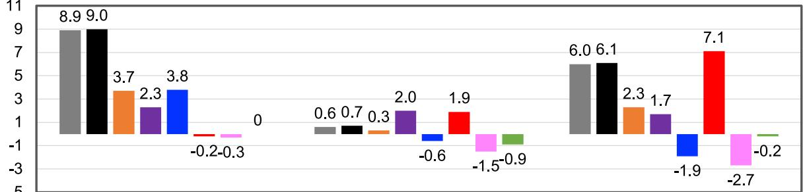  
EXP1: Sector optimization baseline: linear trend (ppb yr1)

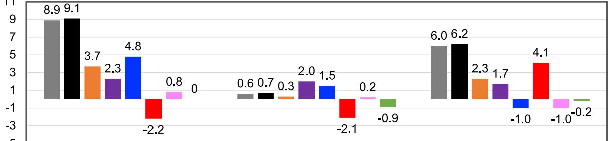  
EXP2: Sector optimization based on EDGAR ENE: linear trend (ppb yr1)

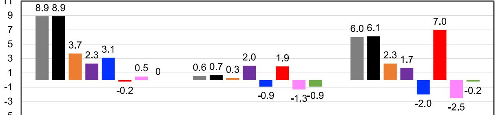  
EXP3: Sector optimization based on higher isotopic fractionation: linear trend (ppb yr1)

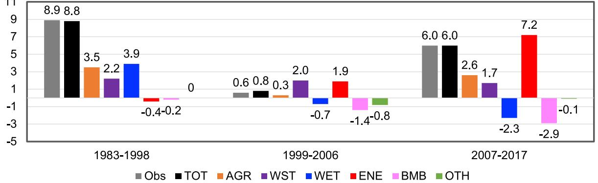  
EXP4: Sector optimization based on MERRA2 meteorology: linear trend (ppb yr1)   
Figur7i dblac tracer,wetland tracer,energy tracer, biomass burning tracer,and tracer from other sources.

More interestingly,there is a change from an increasing trend of CH4WET in1999-2O06 to a decreasing trend of CH4WET in 2007-2017 in EXP2, while there is only about $1 \mathrm { T g } \mathrm { y r } ^ { - 1 }$ difference in WET emissions between the two periods,further demonstrating the critical role of OHin affecting methane trends.Our earlier work (He2020) found hat for wetland emissions to be the dominant driver of methane growth,there would need to be a significant and sustained increase in the post-2Oo6 wetland emissions,alongside with concurrent decreases n the anthropogenic emissions,which is a les likely scenario.The uncertainties in the spatial distributions of wetland ${ \ S } ^ { 1 3 } \mathrm { C H } _ { 4 }$ will not afect the overall conclusion of this work but may impact the regional changes in the ${ \delta } ^ { 1 3 } \mathrm { C H } _ { 4 }$

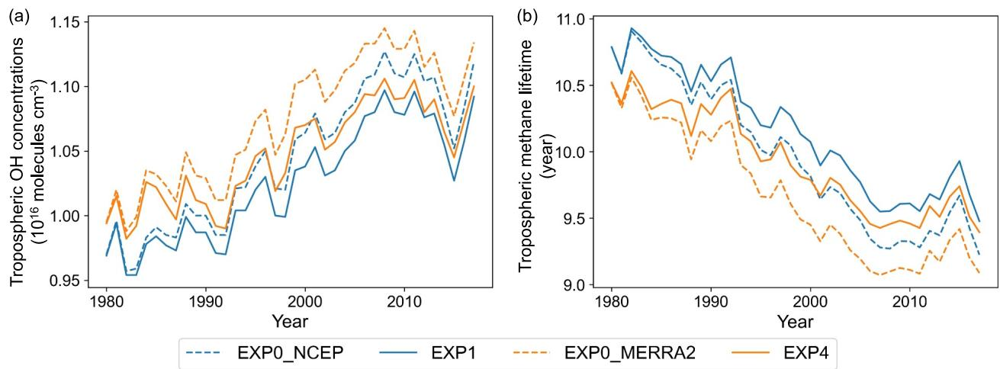  
Figurees (EXP)d lines represent results from MERRA2-driven simulations.

Similarly,higher OH levels and lower BMB emissions lead to a larger decreasing trend of CH4BMB in 2007- 2017.Despite WST emissions being higher in 2007-2017,the trend of CH4WST is slightly smaller than that in 1999-2006,resulting from higher sinks of CH4WST(due to higher OH levels). There is also a smaller decreasing trend of CH4OTHin 2007-2017,mainly due to higher emissions from other anthropogenic sources,however,not large enough tooffsetthe higher sinks.Insummary,the emision increase has tobe large enough to offset the sink increase(due to the OH increase simulatedby the model) to lead to a positive (increasing)tracer trend.As aresult, the increasing trends of CH4AGR and CH4ENE drive the post-2O06 growth of total methane (CH4TOT).

# 3.4. $\mathrm { { C H } _ { 4 } }$ OH Feedback and Tropospheric Lifetime

Increasing methane emissions and therefore concentrations would leadto decreases in OHlevels (Figure 8a).There isa $1 . 9 \%$ decrease in the tropospheric OH levels in the simulations driven by the optimized emissions (EXP1) versus initial emissions using NCEP meteorology (EXPO_NCEP) and a $2 . 5 \%$ decrease in the tropospheric OH levels using MERRA2 meteorology (EXP4 vs.EXP0_MERRA2).There is a noticeable fedback on OH levels with higher methane emissions.Lower OH levels tend to increase tropospheric methane lifetime as shown in Figure 8b.Compared to the simulations with initial emissions,simulations with optimized emissions increased methane lifetime by 0.2 years forced with NCEP meteorology and by 0.3 years forced with MERRA2 meteorology.

There is an overall decreasing trend in methane lifetime since 198O until it becomes relatively stable during 2006- 2011. All the experiments show a lower lifetime in 2007-2017 $9 . 5 0 \pm 0 . 1 9$ yr) than 1999-2006 $( 9 . 7 4 \pm 0 . 2 3 \mathrm { y r }$ ） The changes in the tropospheric methane lifetime are partly driven by the OH trend (Figure 7a).The model simulated OH concentrations and trends in this work are comparable with the previous studies using other chemical transport models (Zhao et al.,2O19).Previous studies also found the model simulated OH trend to be driven by the emisson ratios of nitrogen oxides and carbon monoxide in the chemical transport models (Dalsoren et al.,2016; Skeieet al.,2023).Therefore,it is important to beter constrain the emission trends to reduce the uncertainty in the simulated OH trend.

We then calculate the methane feedback factor folowing Holmes (2018),which gives a 1980-1989 average of $1 . 2 8 8 \pm 0 . 0 2 8$ ,1990-1998 average of $1 . 3 5 9 \pm 0 . 0 0 6$ ,1999-2006 average of $1 . 3 8 3 \pm 0 . 0 0 5$ and 2007-2017 average of $1 . 4 0 4 \pm 0 . 0 0 2$ across different experiments.These values are comparable to the present-day values calculated in the previous studies (Heimann etal.,2020; Holmes,2018).Holmes (2018)suggested the feedback factor increased as afunctionof methane burden from preindustrial times andreachedaplateauunderthe present-dayconditions.In this work, we stillsee acontinuous but smallincrease in the fedback factor since the 198Os.Higher feedback factor suggests that emission perturbations on atmospheric methane concentrations would persistlonger.In other words, there is an increasing sensitivity from an emission increase on methane concentrations and lifetime.This is particularly important when assessing the responses of methane concentrations to the emission changes.

# 4. Conclusions

This work was initiated at Princeton University,supported by the Carbon Mitigation Initiative at Princeton University (Grant O2085(7)).Partof the research was done at the University of Colorado Boulder,supported by the NOAA Cooperative Agreement (NA22OAR4320151),for the Cooperative Institute for Earth System Research and Data Science (CIESRDS).We thank the GFDL model development team for developing the ESM4.1/AM4.1.We thank NOAA GML for providing the surface methane observations.We thank the Institute of Arctic and Alpine Research (INSTAAR)at the University of Colorado for the methane isotopic measurements. We also thank Xin Lan from NOAA GML and Cooperative Institute for Research in Environmental Sciences at University of ColoradoBoulderandSylviaEnglund Michel fromINSTAAR at Universityof Colorado Boulder for insightful discussion.We also thank the two anonymous reviewers for their comments and feedback.The statements,findings, conclusions,and recommendations are those of the author(s)and do not necessarily reflect the views of NOAA or the U.S.Department of Commerce.

# Acknowledgments

In this work,we constrain a global chemistry-climate model with methane and isotopic observations to under-stand changes in the global methane budget. We apply spatially-resolved isotopic signatures instead of a single global mean value to beter constrain the methane sources.Unlike many other studies that rely on prescribed methane sinks or climatological OHconcentrations,our model includes comprehensive atmospheric chemistry to interactively simulate OH concentrations and trends,as well as the $\mathrm { C H } _ { 4 }$ -OH feedback.Several model simulations have been performed to attribute the source contribution to the methane increase over the past several decades. While anthropogenic activities are found to be mainly responsible for the methane increase since the 1980s,the increasing OH trend simulated by the model plays a critical role in the global methane evolution.

We find the increases in tropical $^ { 1 3 } \mathrm { C } .$ -depleted agricultural and waste emissions and decreases in $^ { 1 3 } \mathrm { C } .$ -enriched biomass burning emissions,along with increasing OH,contribute to the post-2006 observed shift of atmospheric ${ \delta } ^ { 1 3 } \mathrm { C H } _ { 4 }$ toward more negative values. Due to the increasing OH trend simulated by our model, the increase in methane emissions from a specific source sector does not always lead to increasing concentrations of the corresponding source-tagged methane tracer.As a result,the post-2O06 methane growth is more likely to be driven by increasing agriculture and fossil fuel emissions,which are large enough to ofset the increasing sinks. Our study highlights the critical role of OHand methane sinks when interpreting the recent changes in methane growth. Neglecting changes in OH could posibly lead to misinterpreting emission changes with respect to the long-term observations of background methane and ${ \ S } ^ { 1 3 } \mathrm { C H } _ { 4 }$ (Rigby et al.,2017). In addition, our study reveals the importance of the $\mathrm { C H } _ { 4 }$ OH feedback, which must be considered when assessing responses of methane concentrations to the emission changes.

Sensitivity simulations using different ENE emissions (CEDS vs.EDGAR),different isotopic fractionations,and diferent meteorology do not change the overall conclusion,but can lead to $9 { - } 1 3 ~ \mathrm { T g ~ y r } ^ { - 1 }$ differences in the optimized WET emissions and $2 { \mathrm { - } } 1 2 \mathrm { T g } \mathrm { y r } ^ { - 1 }$ differences in the optimized BMB emissions.However,the different estimates in WET and BMB emissions resulting from different isotopic fractionations and meteorology do not have significant impacts on the post-2Oo6 shift of regional source ${ \ S } ^ { 1 3 } \mathrm { C H } _ { 4 }$ ,while noticeable impacts from different ENE emisions are shown across different latitude bands.We acknowledge the uncertainties in the spatial distributions of methane emissions.We optimize global emission totals instead of grid-level emissions as is commonly done in an inverse modeling system, which may affect the estimates of emission changes regionaly. There is posible uncertainty in the individual isotopic source signatures used in this work in terms of spatial and temporal variability, which can impact regional ${ \ S } ^ { 1 3 } \mathrm { C H } _ { 4 }$ (Feinberg et al., 2018). Model uncertainties along with emission inputs could also lead to uncertainties in the simulated OHlevels.Werely heavily on the observations of methane and its isotopic composition to constrain and validate the model,and interpret the results.Therefore, continued observations of methane concentrations and isotopic signatures are necessary to improve our understanding of the changes in the global methane budget.

# Conflict of Interest

The authors declare no conflicts of interest relevant to this study.

# Data AvailabilityStatement

NOAA GML $\mathrm { C H } _ { 4 }$ and ${ \delta } ^ { 1 3 } \mathrm { C H } _ { 4 }$ observations can be downloaded at htps:/gml.noaa.gov/aftp/data/trace_gases/ ch4/flask/ and https:/gml.noaa.gov/aftp/data/trace_gases/ch4c13/flask/.

Model data can be accessed through Zenodo at https://doi.org/10.5281/zenodo.17487837.

# References

Basu,S.,Lae) atmospheric measurements of methane and ${ \boldsymbol { 8 } } ^ { 1 3 } { \mathrm { C } }$ of methane.Atmospheric Chemistry and Physics,22(23),15351-15377.htps://doi.org/10.   
5194/acp-22-15351-2022 Bloom,A.A.owaK.e,.hderde,Je).obaeladmethe uncertaintydataetformospricmicaltrasportodels(Wesion).eocientificodelevelopment),4   
2156.htps://doi.org/10.5194/gmd-10-2141-2017 Brasseur,G.P.,Huglusaine,D.,Walters.achP.J,ulerJFranierC,&ie,X.X.(998).OZA,globalcal transportmodelfozendelatedemicaltracersodeldscriptionJoualofeopsicalesech3D),629. https://doi.org/10.1029/98jd02397   
Chandra,N.uadUot)heseeel exploitationdstablycedobcesrictiErvot) doi.org/10.1038/s43247-024-01286-x   
Chang,JF.sl) ruminantsandtheir83CCH4 sourcesignature.NatureCommunications,10(1),3420.ttps:/doorg/10.1038/s41467-019-11066-3   
Craig,H.195)ocdsfbesfspeorissboc et Cosmochimica Acta,12(1-2),133-149. https:/doi.org/10.1016/0016-7037(57)90024-8   
Dalsoren,S.,eCL,e,,ele.,oe.,an,Ia()opea last 40 years.Atmospheric Chemistry and Physics,16(5),3099-3126. https://doi.org/10.5194/acp-16-3099-2016   
Dlugokenckysbt.)oboedtdg A(369),2058-2072. https://doi.org/10.1098/rsta.2010.0341   
Dunne,J.P.,oiLof.JedJt()rde ESM4.1):Overallcoupledmodeldescriptionndsimulationcharacteristics.JouralofdvancesinModelingEarth System(11), e2019MS002015. https://oi.org/10.1029/2019MS002015   
Etiope,G.,&Milkov,A.V.(O).Anewstimateofglobalethanfluxfromonshoreandshalowsubmariemudvolcanoestothea sphere.Environmental Geology,46(8),997-1002. htps://doi.org/10.1007/s00254-004-1085-1   
Feinberg,A.ulo,teeAhiee.ete).otocoueituresactfgiale $8 ^ { 1 3 } \mathrm { C H } _ { 4 }$ trendand spatial distribution.AtmosphericEnvironment,174,99-11.htps:/doorg/10.016/j.atmosenv.207.1.037   
Forster,P)tdt climatesensitiityVo-Delote,Parani.Coos,C.en,ergeretal.(Eds.)Caehge physicalscieneBsis.ContrbutioofwokiggoupItotesixesentreptoftintergovemetalPnelonmategp 923-1054). Cambridge University Press. htps://doi.org/10.1017/9781009157896.009   
Fung,IJo,Je,eo cycle.Journal of Geophysical Research,96(D7),13033-13065.https://doi.org/10.1029/91jd01247   
Ganesan,ALe.agoce wetland methane emissions.Geophysical ResearchLetters,45(8),3737-3745.htps:/doi.org/10.1002/2018gl077536   
Gelaro,Rcartaoda)eal applications,version2 (MERRA-2).Journal ofClimate,30(14),5419-5454.htps://oi.org/10.1175/Jcli-D-16-0758.1   
Ghosh,A.PatraaKUdg)Vud 1910-2010.Atmospheric Chemistryand Physics,15(5),2595-2612. https:/doi.org/10.5194/acp-15-2595-2015   
Giden,.Jje)bsd economicscenariosforuseinCMP6:Adatasetofharmonzedemissons trajectoriesthroughthendofthecenturyGeoscientfiModel Development,12(4),1443-1475. https://doi.0rg/10.5194/gmd-12-1443-2019   
Guenther,A.lC)o MEGAN(Modelofmisssofsesdrosolsfroature).AmspricCestrydcs,6()1-320.tps:/. 5194/acp-6-3181-2006   
He,J,aikV,roitz,L.).Hdroydical(sposetetegicalfogdplatireaget Geophysical Research Letters,48(16),e2021GL094140. https://doi.org/10.1029/2021GL094140   
He,JNaikoiLgoecygK.)eiifeolaebger8i GFDL-AM4.1.Atmospheric Chemistry and Physics,20(2),805-827. htps://doi.org/10.5194/acp-20-805-2020   
Heiman,,scb.le,Js model:Fedbacksdatespose.Joualofdcsindelingrthstes(),19.hps:// 2019MS002019   
Hoesly.toutG)l emssionsofreactiveaseseroslsfroteCmuityisiostaSstem(CED).Geosientfdeleveopment,(),6 408. https://doi.org/10.5194/gmd-11-369-2018   
Hoglund-saks,Leabrataj,,p()cicaletialsdostsforcilobl anthropogenicmethaneemissions inthe2050timeframe-resultsfromtheGANS model.Environmental Research Communications,2, 025004. https://oi.0rg/10.1088/2515-7620/ab7457   
Holmes,C.D.(18).etaefbackoosphriceistry:ethodsodelsdhasm.JualfdancsdeliErt Systems,10(4),1087-1099. htps://doi.0rg/10.1002/2017ms001196   
Horowitz,L.Wik,VlotoP.ueJ.,oJ.a(eGgloblmosperichee modelAM4.1:Model descriptionandsimulationcharacteristics.JournalofAdvancesinModelingEarth Systems，12(10), e2019MS002032. https://doi.org/10.1029/2019MS002032   
Jacso,se ariseequallyroalfosiuecvoalehsps:/8 ab9ed2   
Jacob,D.J.hoafg globalscaledottscesuigstelitebeatiosfmoshaAmosicemstydysis46 9646. htps://doi.0rg/10.5194/acp-22-9617-2022   
KalnayE the American Meteorological Socety,77(3),437-471. hps://doi.org/10.1175/1520-047(199607<0437:TNYRP>2..O;   
Lambert,G&dt.99).eatioofteaicfeaUcertaititetio.emospe,), 579-589. https://oi.0rg/10.1016/0045-6535(93)90443-9   
Lan,X.Bsueloy.chlE)oolo emissions and sinks using ${ \delta } ^ { 1 3 } \mathrm { C } \mathrm { - } \mathrm { C H } _ { 4 } .$ Global Biogeochemical Cycles,35(6),e2021GB007000.https://doi.org/10.1029/2021GB007000   
Lan,X.nJoe.K.,gaEoch,).dryilco fromtheNOAAGMLcarboncylecoperativeglobalairsampingnetwork,983-223version:024-07-30.htps://oior/0.15138/ VNCZ-M766   
Lan,X.NisbetEGgeckyE,chel..)atoeoboutelobledgufrood ofatmosphericC4seatiosndteyfrardosopicalansactiosfteolSociety:thematical,cal&En gineering Sciences,379(2210),20200440. htps://doi.org/10.1098/rsta.2020.0440 Monitoring LaDoratory measurements, version ∠U&)-Uz. nttps://aol.org/iU.IDl38/P8XG-AAIU   
Lassey,K.hgee.Cit,.F.).eutoho WhatdothecarbonisotopestellusAtmospericChemistryndPhysic,7(8),119-139.htps:/og/1.94/acp--19-20   
Liu,S.ang,SuguZ)segacteoic Plateau:Recodsfro99t19atteuntWliguastatioAtmospricCemistrydPysics,21),93413.hps:/o/. 5194/acp-21-393-2021   
LuX.Y. seamgasfeltaltssicd) doi.org/10.5194/acp-21-10527-2021   
McNicol,Gedg,.gll.)Ualigdeer FLUXNET-C4edvaraeeork (UpC4v.0):odeleveloent,etorkesentnddgetomprsoAGUdc， 4(5), e2023AV000956.https://doi.org/10.1029/2023AV000956   
Menod,M.Ven,aenelzeberenl).soiciae fromilndsetractiitsinaElmteneoftopee,(.hps:/o 00092   
Michel,.E.kgotelo)boc methane(3C)froheAGrbcleoperativglobaairpgeork,99-sio-1. 10.15138/9p89-1x02   
Moforti-Feo,dtea,a,ull,E.)eoe http://data.europa.eu/89h/488dc3de-f072-4810-ab83-47185158ce2a   
Naik,V.HoioJ.,)cts inshort-lvedltantissomospricmposidatefcngualfolamospr4) 8086-8110. https://oi.org/10.1002/jgrd.50608   
Nisbet,E.Ggy..eJo growth and isotopic shift. Global Biogeochemical Cycles,30(9),1356-1370.htps:/doi.org/10.1002/2016gb005406   
Oh,Y.Zelpe)ddbo 2006microbalaesieas.CmtsEront)9ps://8/5   
Oreggioni,G.oF,ahd).ead economicandtechological tansitions,regulatoryframeworksndtrendsonglobalgrenousegasemissionsfromEDGARv.5..Global Environmental Change,70,102350. https://doi.org/10.1016/j.gloenvcha.2021.102350   
Patra,P.K.,uelgo,seteloDe)odeulatidee species:Linkingtransport,surfacefluxandchemicallosswith CH4variabilityinthetroposphreandlowerstratospere.Atmosperic Chemistry and Physics,1l(24),12813-12837. https://doi.org/10.5194/acp-11-12813-2011   
Rigby,M.oa..GiteJ.Drty.,leotic growth.ProcedofteioaAcdeofeceofUniatesofmica1)ps:/. 1616426114   
Saunois,M.,rle,gdPgetl.)oblthedget Science Data,17(5),1873-1958.https://doi.org/10.5194/essd-17-1873-2025   
Sunois,.atdelcoobedge System Science Data,12(3),1561-1623.https:/doi.org/10.5194/essd-12-1561-2020   
Schaefer,.r.tCd).u biogenic methane emissions indicated by13CH4.Science,352(6281),80-84.htps://oi.org/10.1126/science.aad2705   
Schwietzedy)Udio fuel methane emissions basedon isotope database.Nature,538(7623),88-91.htps://oi.org/10.1038/nature19797   
Shen,LJcbl exploitationigsiososfteliiostueommcatos)4ps:/ 023-40671-6   
Sherood,O.e,g,Vo.).olestytarooilel burning sources,version 2017.Earth System Science Data,9(2),639-656.https://doi.org/10.5194/essd-9-639-2017   
Skeie,R.B.,Hodebrog,O.,&Myhre,G.(23).Trendsinatmosphericmethaneconcentrationssice9Oweredrivenandmodifiedby anthropogenicemissions.Communications Earth &Environment,4(1),317.https://oi.org/10.038/s43247-023-00969-1   
Solazzo,E.,dto,t.)Uie GlobalAmospericesearch(G)siovetoryofgreouseasestmosperichemistryndsics,),68. https://doi.0rg/10.5194/acp-21-5655-2021   
StillCJ,G,) Datasets. htps://doi.0rg/10.3334/ORNLDAAC/932   
Strode,S.A.,g.el.roiviotc methantothsibleageoftropsprico.Amosricmstds,4)48419.tps:/o.4a 20-8405-2020   
ThanwerdasJs,ouset.)esgtifdetheoosi resolution3-tialeoelgdoticotsmosicstds44) 10.5194/acp-24-2129-2024   
UnitedNatiosEnvirontProgae/ClatedCleaniroali.22).lobalmetaneassessent:bslieeportRetrd from https://www.unep.org/resources/report/global-methane-assessment-2030-baseline-report   
vanMarleoiLe)trlobs CMIP6(BB4CM)basedonmergingsatellteobservationswith proxiesndfire models (750-05).GeoscentfcModel Developent, 10(9),3329-3357. https://doi.org/10.5194/gmd-10-3329-2017   
Whiticar,M.,&haefer,H.(O).Costraiingpastobaltropospericethaebdgetsithbodhdrognisotopeatiosice. Philosopclll)ps 1098/rsta.2007.2048   
Whiticar,.J.9)rboddogesotoesematiofctealtiodidatiofa.mlog) 291-314. https://doi.org/10.1016/S0009-2541(99)00092-3   
Worden,J.Rlo,.deya,dnHketa()ecedssbgmssie conflictingtatofoaeurema)p:/ 02246-0   
Xiao,H.SongC,uX,ag,iaXanW()obleadmethesiote dynamics and controls.Earth's Future,12(9),e2024EF004794. htps://doi.org/10.1029/2024EF004794   
Yu,X.Y.leoa wetlandsandvstocrUpprdestmethemisssAtmoshricCmstrydyis-97ps://.194 acp-21-951-2021   
Zhao,Y.H,s,tnle()eeso) distributiosdhpactomosricetaeertermospricmstrndic()7. https://doi.0rg/10.5194/acp-19-13701-2019

# References From the Supporting Information

Yoshida,Y.ucorila)rtfeer SWIRXCO2andXCH4andteiralidatiousingCCONdata.AtmosphericMeasurementTechques,6,53-1547.htps:/og10. 5194/amt-6-1533-2013   
Zazeri,G,eJLsee,dC,be.) isotopicanalysis intheLondonregion.Scientific Reports,7(1),4854.htps://oi.org/10.1038/s41598-017-04802-6   
Towsend-d aBotom-upivetoryofethanemissiosintheaettaledaulicfracturingRegionEnvironmentalScience&Tecoog49(3), 8175-8182.https://doi.org/10.1021/acs.est.5b00057   
Houweling,S.led).aiofdsroseilut natural wetlands.JournalofGeophysical Research,105(D13),17243-17255.htps:/doiorg/10.1029/200jd900193   
Etiope,G.olouo inEurope.JouralofVolcanologndGeothermalResearch,65(1-2),76-86.hps:/oiorg/10016/jjvolgeores.200.04.014   
Saueresig,GyeslCeC,H).b effects in the reactions of $\mathrm { C H } _ { 4 }$ with $\mathrm { O } ( ^ { 1 } \mathrm { D } )$ and OH: New laboratory measurements and their implications for the isotopic composition of stratospheric methane.JouralofGeophysicalResearch,06(D19),23127-23138.htps:do.org/10.1029/200jd000120   
Snover,A.K.,&Quay,P.D.(20o).Hydrogenandcarbonkineticisotopeeffectsduringsoiluptakeofatmosphericmethane.Global Biogeochemical Cycles,14(1),25-39.https://doi.org/10.1029/1999gb900089   
Meinshuse,elEsceoe forclimatemodeling(C6).GeosientificdelDevelopment,0(5),5-16.htps:/org/10.94/gmd-1-1   
He,J.,Naik,V.,&Horowitz,L.(25).ModeldatafromHeetalDataset.Zenodo.hps:/oirg/.28/zenodo.7487837