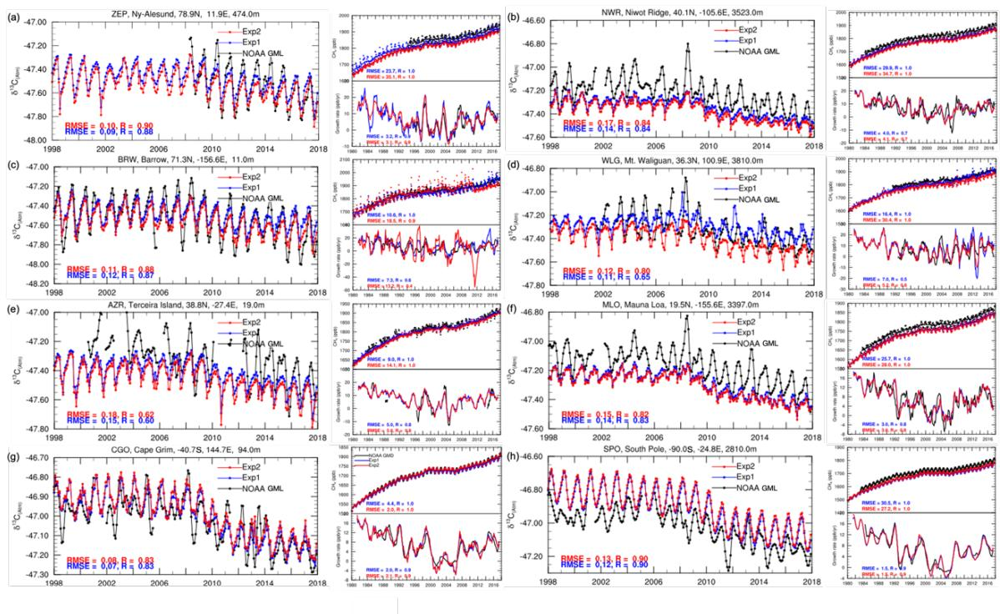
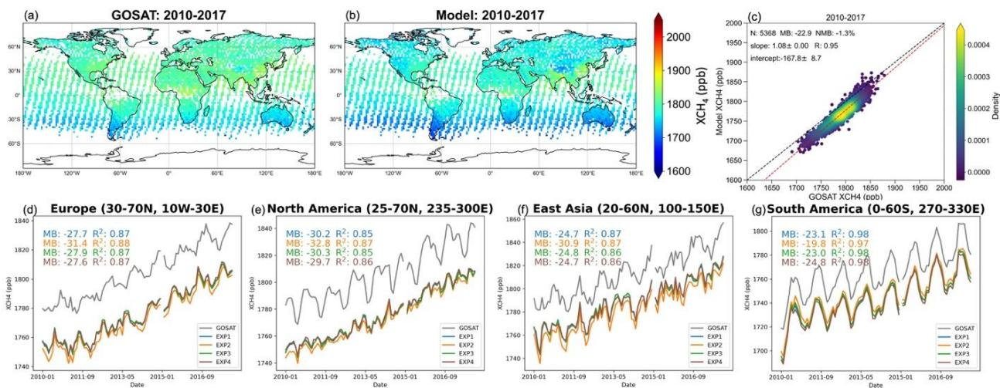
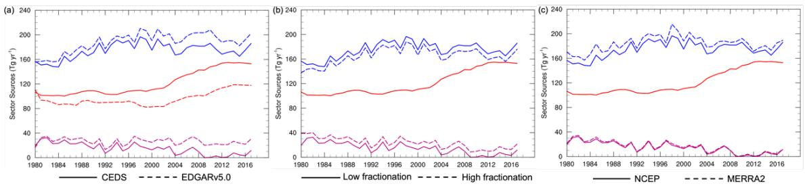
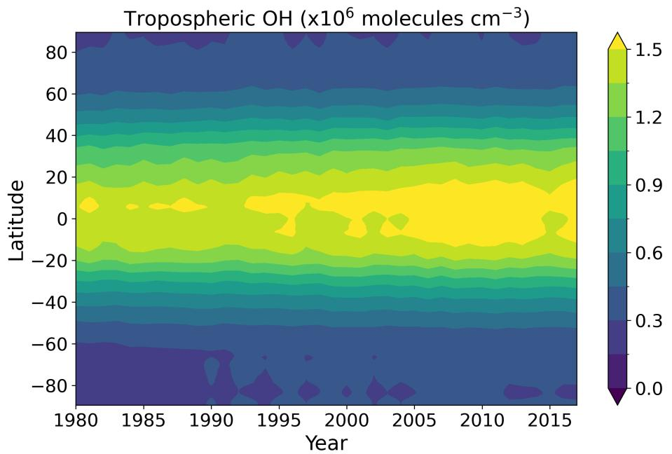
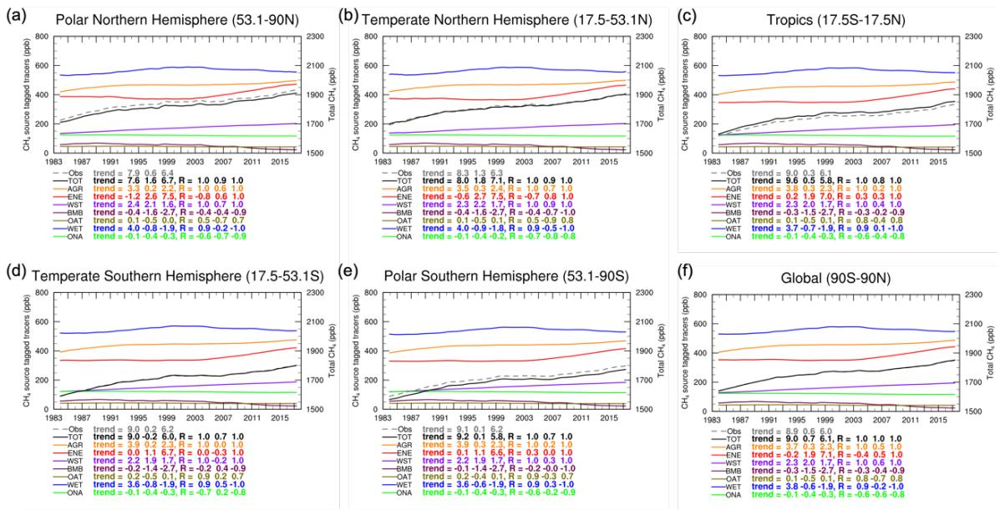

AGU Advances

Supporting Information for

# Interpreting changes in global methane budget in a chemistry-climate model constrained with methane and isotopic observations

Jian He1,2, Vaishali Naik3 , Larry W. Horowitz3

1 Cooperative Institute for Research in Environmental Sciences, University of Colorado, Boulder, CO, USA.

2 NOAA Chemical Sciences Laboratory, Boulder, CO, USA.

3 NOAA Geophysical Fluid Dynamics Laboratory, Princeton, NJ, USA.

Corresponding author: Jian He (jian.he@colorado.edu)

# Contents of this file

Text S1 to S3   
Figures S1 to S5   
Tables S1 to S3

# Introduction

The Supporting Information includes detailed model evaluations with surface and satellite observations, additional discussions on emission sensitivity, as well as additional information on model inputs.

# Text S1. Model evaluations with surface observations

We use measurements of $\mathrm { C H } _ { 4 }$ and $\delta ^ { 1 3 } \mathrm { C H } _ { 4 }$ from a globally distributed network of air sampling sites maintained by Global Monitoring Laboratory (GML) (Lan et al., 2024; Michel et al., 2023) of the National Oceanic and Atmospheric Administration (NOAA) to evaluate model performance. Our model with optimized methane emissions is able to capture the global trend of methane (Lan et al., 2025) and $\bar { \delta } ^ { 1 3 } \mathrm { C H } _ { 4 }$ (Michel et al., 2023). Despite optimizing emissions uniformly at a global scale instead of regionally as described in the main text, our model is still able to capture the latitudinal distributions of methane. Figure S1 shows the comparison of simulated surface $\mathrm { C H } _ { 4 }$ concentrations and $\delta ^ { 1 3 } \mathrm { C H } _ { 4 }$ with NOAA GML surface observations over multiple sites. Since the observations represent well-mixed background conditions, there is no significant difference among different experiments at a global scale (Figure 4 in main text). However, there are noticeable differences between EXP1 and EXP2 over different latitude bands (Figures 3&4 in main text). Here we only show the evaluation of EXP1 and EXP2 in Figure S1 over several NOAA GML sites.

Both EXP1 and EXP2 generally capture the monthly variabilities of methane concentrations across different sites, with correlation coefficient (R) close to 1. Also, the model is able to reproduce methane growth rates, with $\mathrm { R } > 0 . 5$ over most of the sites. With different source contributions, there are overall better estimates of $\delta ^ { 1 3 } \mathrm { C H } _ { 4 }$ , especially at the Mt. Waliguan site (WLG), China, where EXP1 shows much better monthly variation. Despite this being a remote site, previous studies have shown methane concentrations can be affected by the long-range transport from source regions (Liu et al., 2021). The higher fossil fuel emissions over China in EXP1 (blue line) would lead to less negative total $\ S ^ { 1 3 } \mathrm { C H } _ { 4 }$ (also closer to the observed $\delta ^ { 1 3 } \mathrm { C H } _ { 4 } \cdot$ ) than that from EXP2 (red line) at a regional (country-wide) scale. In summary, EXP1 generally shows better model performance than EXP2.

# Text S2. Model evaluations with satellite observations

We also compare the model simulated column average concentration of $\mathrm { C H } _ { 4 } \left( \mathrm { X C H } _ { 4 } \right)$ with the retrieved $\mathrm { X C H } _ { 4 }$ from the Greenhouse gases Observing SATellite (GOSAT) (Yoshida et al., 2013). We sample the model profiles at specific locations with applying averaging kernels to get model simulated $\mathrm { X C H } _ { 4 }$ . Due to the limited computing resources, we have model output on a monthly basis. Therefore, we extract the monthly mean model profiles at specific locations scanned by the GOSAT. This would lead to uncertainty when comparing the magnitudes of $\mathrm { X C H } _ { 4 }$ , but still provide some information on model performance of spatially distributed $\mathrm { X C H } _ { 4 }$ .

Figure S2 shows the spatial and temporal comparison of simulated and observed $\mathrm { X C H } _ { 4 }$ . Despite the different source contributions, the simulated $\mathrm { X C H } _ { 4 }$ are pretty comparable across all the experiments at both global and regional scales. In general, there is a consistent low bias (about $2 3 \mathrm { p p b }$ ) across all the four experiments, which is due in part to the different sampling frequency of simulated methane profiles. However, there is a pretty good spatial correlation between model estimates and satellite observations (with $\mathrm { R } > 0 . 9 $ ). In addition, all experiments show good temporal correlation (monthly variability) with $\mathrm { R } ^ { 2 } > 0 . 9$ . Similarly, EXP2 shows a larger model bias over the Northern Hemisphere continents, especially over East Asia (Figure S2f) than EXP1, suggesting better ENE estimates from CEDS than EDGAR (particularly over China).

The evaluation suggests the reasonable spatial and temporal representations of methane emissions. Despite the differences in the sectoral sources among four experiments, there is not much difference in the simulated methane concentrations from four experiments.

# Text S3. Emission sensitivity to different factors

There are four experiments conducted in the model to explore the sensitivity of emissions to different inputs and isotopic fractionations. As shown in Figure S3, The difference in the fossil fuel emissions (energy sector, ENE) between CEDS (Hoesly et al., 2018) (EXP1) and EDGARv5.0 (Monforti-Ferrario et al., 2019) (EXP2) leads to the different optimized wetland (WET) and biomass burning (BMB) emissions. Since ENE emissions are lower in EDGAR than CEDS (by about $2 5 { \pm } 1 2 \mathrm { T g \ y r ^ { - 1 } }$ ), we need to have higher total of WET and BMB to make sure the total methane emissions are same between EXP1 and EXP2, which are optimized (constrained) by the observed methane concentrations. Further constrained by the observed atmospheric $\delta ^ { \bar { 1 } 3 } \mathrm { C H } _ { 4 }$ , WET emissions are about $1 3 { \pm } 6 \mathrm { T g \ y r ^ { - 1 } }$ higher and BMB emissions are about $1 2 { \pm } 7 \mathrm { T g \ y r ^ { - 1 } }$ higher in EXP2. If we simply increase isotopic fractionation (EXP3) without changing the emission totals, we need to reduce WET emissions in EXP1 by about $9 { \pm } 2 \ \mathrm { T g \ y r ^ { - 1 } }$ and put this amount to BMB emissions to force the model capture the observed atmospheric $\delta ^ { 1 3 } \mathrm { C H } _ { 4 }$ trend. We also tested the model forced by MERRA2 meteorology (EXP4). Compared to the estimates forced by NCEP meteorology (EXP1), the total methane emissions have to be higher by $1 1 { \pm } 4 \mathrm { T g }$ $\mathrm { y r } ^ { - 1 }$ , with $9 { \pm } 2 \ \mathrm { T g \ y r ^ { - 1 } }$ higher in WET emissions and $2 { \pm } 1 \ \mathrm { T g \ y r ^ { - 1 } }$ higher in BMB emissions, constrained by the $\mathrm { C H } _ { 4 }$ and $\ S ^ { 1 3 } \mathrm { C H } _ { 4 }$ observations.

As global total methane emissions have increased since 2006, the contribution of AGR &WST to the total methane emissions do not change much from 1999-2006 to 2007-2017 (about $3 6 \% )$ , while the contribution of ENE to the total methane emissions increases from $2 1 . 1 \%$ in 1999-2006 to $2 4 . 6 \%$ in 2007-2017 following CEDS ENE emissions (EXP1) and from $1 5 . 5 \%$ to $1 8 . 3 \%$ following EDGAR $\mathrm { v } 5 . 0$ ENE emissions (EXP2). The overall decrease in the global total wetland emissions are minor $( < 4 \% )$ , however, with higher total emissions during 2007-2017, the contributions from wetlands tend to decrease. With a moderate decrease in biomass burning emissions during 2007-2017, there is also a decrease in its contribution to total methane emissions.

The optimized total methane emissions are sensitive to the simulated hydroxyl radical (OH), which has been discussed in our previous studies (He et al., 2020; He et al., 2021). The optimized emissions for specific sectors are also sensitive to the initial emission inventory and isotopic fractionation. In this work, we assume the emission trends of other sources sectors (e.g., agriculture & waste) are reasonably represented in the CEDS inventory. We test the different trends for ENE, which leads to about $\bar { 1 2 } { - } 1 3 \ \mathrm { T g } \ \mathrm { y r } ^ { - 1 }$ difference in WET and BMB emissions. It is also possible, with different trends and magnitudes of the agricultural (AGR) emissions, there would also be noticeable differences in WET and BMB emissions. In this work, we add 25 Tg yr-1 emissions to CEDS AGR emissions each year (keep AGR emission trend unchanged) to bring it closer to that in EDGAR v5.0. The reason we add this amount is to make sure when we perturb other factors, we can still have reasonable estimates in WET and BMB emissions (at least positive emissions).

In theory, there are many ways to perturb different source sectors while forcing the model to reproduce the observed trends of $\mathrm { C H } _ { 4 }$ and $\ S ^ { 1 3 } \mathrm { C H } _ { 4 }$ , which would lead to different solutions. The purpose of testing different fossil fuel emissions from two inventories is to investigate the fossil fuel contribution to the methane growth, rather than demonstrate which inventory is better. Also, we optimize WET and BMB sectors due to their large interannual variability and uncertainty in the emission estimates. Nevertheless, based on all the sensitivity simulations, compared to the relatively stable methane of 1999-2006, the post-2006 renewed methane increase is more likely due to the emission increase from ENE and AGR sectors that are large enough to offset the increases in sinks.

  
Figure S1. Time series of simulated monthly mean $\mathrm { C H } _ { 4 }$ and $\ S ^ { 1 3 } \mathrm { C H } _ { 4 }$ (blue lines for EXP1 and red lines for EXP2) and observations from selected NOAA GML sites (black lines). Each panel (a-h) includes three figures, with the left column for monthly $\delta ^ { 1 3 } \mathrm { C H } _ { 4 }$ (site information is shown above the figure) and right column for monthly methane concentrations (top) and methane growth rate (bottom).

  
Figure S2. Comparison of simulated column averaged methane concentrations $\mathrm { ( X C H _ { 4 } ) }$ with GOSAT observations. Spatial distributions of 2010-2017 multi-year mean $\mathrm { X C H } _ { 4 }$ from GOSAT and EXP1 are shown panel (a) & (b). Statistics for spatial comparisons are calculated for EXP1 (c). Statistics for temporal correlations for four experiments for different regions are shown in panel d- $\mathbf { g }$ (EXP1 in blue, EXP2 in orange, EXP3 in green, and EXP4 in brown).

  
Figure S3. Emission sensitivities to different initial emissions (a), OH fractionations (b), and meteorological inputs (c). Blue lines represent wetland emissions, red lines represent fossil fuel emissions, and purple lines represent biomass burning emissions. Solid and dashed lines represent emissions under different experiment scenarios.

  
Figure S4. Time series of latitudinal distribution of annual mean air-mass weighted tropospheric OH concentrations.

  
Figure S5. Linear trend of source tagged tracers (described in main text) across different latitude bands. The calculated trend and correlation with the observed trend are listed below the figure. Gary dashed lines represent observed trend calculated from GML MBL sites and solid lines represent trend calculated from each source tagged tracers.

Table S1. Methane Emission Inventories.   

<table><tr><td>Source Category</td><td>Database</td><td>Temporal Variability</td><td>References</td></tr><tr><td>Anthropogenic*</td><td>CEDS v2017-05-18 SSP2-4.5</td><td>1980-2014 monthly 2015-2017 monthly</td><td>Hoesly et al. (2018) Gidden et al. (2018)</td></tr><tr><td>Biomass Burning</td><td>BB4MIP SSP2-4.5</td><td>1980-2014 monthly 2015-2017 monthly</td><td>van Marle et al. (2017) Gidden et al. (2018)</td></tr><tr><td>Wetlands</td><td>WetChart v1.0</td><td>2001-2015 monthly Climatological monthly mean for rest of years</td><td>Bloom et al. (2017)</td></tr><tr><td>Ocean</td><td>MOZART</td><td>Climatological monthly mean</td><td>Brasseur et al. (1998)</td></tr><tr><td>Near-shore</td><td>TransCom- CH4</td><td>Climatological annual mean</td><td>Lambert and Schmidt (1993), Patra et al. (2011)</td></tr><tr><td>Termites</td><td>NASA-GISS</td><td>Climatological annual mean</td><td>Fung et al. (1991)</td></tr><tr><td>Mud volcanoes</td><td>TransCom- CH4</td><td>Climatological annual mean</td><td>Etiope and Milkov (2004), Patra et al. (2011)</td></tr></table>

\*Anthropogenic sectors: Agriculture, Energy, Industry, Transport, Residents, Shipping, and Waste

Table S2. Global mean isotopic ratios used to generate spatially resolved isotopic ratios and kinetic isotope effects   

<table><tr><td rowspan=1 colspan=1>Sources</td><td rowspan=1 colspan=1>813CH4 (%o)</td></tr><tr><td rowspan=1 colspan=1>AGR (agriculture)</td><td rowspan=1 colspan=1>Rice: -631,2Ruminants: -67.9 (C-3)&#x27; and -54.5 (C-4)1</td></tr><tr><td rowspan=1 colspan=1>ENE (energy)</td><td rowspan=1 colspan=1>Coal: -41.21Oil &amp; gas: -44.61</td></tr><tr><td rowspan=1 colspan=1>IND (industry)</td><td rowspan=1 colspan=1>-353</td></tr><tr><td rowspan=1 colspan=1>TRA (road-transportation)</td><td rowspan=1 colspan=1>-26</td></tr><tr><td rowspan=1 colspan=1>RCO (residential, commercial,and other)</td><td rowspan=1 colspan=1>-353</td></tr><tr><td rowspan=1 colspan=1>WST (waste)</td><td rowspan=1 colspan=1>-552</td></tr><tr><td rowspan=1 colspan=1>SHP (international shipping)</td><td rowspan=1 colspan=1>-404</td></tr><tr><td rowspan=1 colspan=1>BMB (biomass burning)</td><td rowspan=1 colspan=1>C-3: -25 and C-4: -125</td></tr><tr><td rowspan=1 colspan=1>OCN (ocean)</td><td rowspan=1 colspan=1>-582</td></tr><tr><td rowspan=1 colspan=1>WET (wetland)</td><td rowspan=1 colspan=1>Spatially-resolved6</td></tr><tr><td rowspan=1 colspan=1>TMI (termite)</td><td rowspan=1 colspan=1>-577</td></tr><tr><td rowspan=1 colspan=1>VOL (mud volcano)</td><td rowspan=1 colspan=1>-42.58</td></tr><tr><td rowspan=1 colspan=1>Sinks</td><td rowspan=1 colspan=1>α13C (kinetic 13C/12C)</td></tr><tr><td rowspan=1 colspan=1>OH</td><td rowspan=1 colspan=1>0.9954 (1.0/1.00465) (For EXP1-2, &amp; 4)0.9961 (1.0/1.0039) (For EXP3)</td></tr><tr><td rowspan=1 colspan=1>01D</td><td rowspan=1 colspan=1>0.9872 (1.0/1.013)9</td></tr><tr><td rowspan=1 colspan=1>Cl</td><td rowspan=1 colspan=1>0.9381 (1.0/1.066)9</td></tr><tr><td rowspan=1 colspan=1>Soil (dry deposition)</td><td rowspan=1 colspan=1>0.9823 (1.0/1.018)0</td></tr></table>

1 Sherwood et al. (2017) 2 Whiticar and Schaefer (2007) 3 Averaged values based on Zazzeri et al. (2017) and Townsend-Small et al. (2015) 4 Assumed based on the global mean isotopic ratios of fossil fuel 5 Lassey et al. (2007) 6 Ganesan et al. (2018) 7 Houweling et al. (2000) 8 Etiope et al. (2007) 9 Saueressig et al. (2001) 10Snover and Quay (2000)

Table S3. Global annual mean observations for $\mathrm { C H } _ { 4 }$ and $\delta ^ { 1 3 } \mathrm { C H } _ { 4 }$   

<table><tr><td colspan="1" rowspan="1">Year</td><td colspan="1" rowspan="1">CH4 (ppb)1</td><td colspan="1" rowspan="1">813CH4 (%0)²</td></tr><tr><td colspan="1" rowspan="1">1980</td><td colspan="1" rowspan="1">1585</td><td colspan="1" rowspan="1">-47.75</td></tr><tr><td colspan="1" rowspan="1">1981</td><td colspan="1" rowspan="1">1603</td><td colspan="1" rowspan="1">-47.70</td></tr><tr><td colspan="1" rowspan="1">1982</td><td colspan="1" rowspan="1">1619</td><td colspan="1" rowspan="1">-47.67</td></tr><tr><td colspan="1" rowspan="1">1983</td><td colspan="1" rowspan="1">1636</td><td colspan="1" rowspan="1">-47.62</td></tr><tr><td colspan="1" rowspan="1">1984</td><td colspan="1" rowspan="1">1645</td><td colspan="1" rowspan="1">-47.60</td></tr><tr><td colspan="1" rowspan="1">1985</td><td colspan="1" rowspan="1">1658</td><td colspan="1" rowspan="1">-47.55</td></tr><tr><td colspan="1" rowspan="1">1986</td><td colspan="1" rowspan="1">1671</td><td colspan="1" rowspan="1">-47.52</td></tr><tr><td colspan="1" rowspan="1">1987</td><td colspan="1" rowspan="1">1683</td><td colspan="1" rowspan="1">-47.50</td></tr><tr><td colspan="1" rowspan="1">1988</td><td colspan="1" rowspan="1">1693</td><td colspan="1" rowspan="1">-47.43</td></tr><tr><td colspan="1" rowspan="1">1989</td><td colspan="1" rowspan="1">1704</td><td colspan="1" rowspan="1">-47.40</td></tr><tr><td colspan="1" rowspan="1">1990</td><td colspan="1" rowspan="1">1715</td><td colspan="1" rowspan="1">-47.37</td></tr><tr><td colspan="1" rowspan="1">1991</td><td colspan="1" rowspan="1">1725</td><td colspan="1" rowspan="1">-47.40</td></tr><tr><td colspan="1" rowspan="1">1992</td><td colspan="1" rowspan="1">1735</td><td colspan="1" rowspan="1">-47.35</td></tr><tr><td colspan="1" rowspan="1">1993</td><td colspan="1" rowspan="1">1737</td><td colspan="1" rowspan="1">-47.37</td></tr><tr><td colspan="1" rowspan="1">1994</td><td colspan="1" rowspan="1">1742</td><td colspan="1" rowspan="1">-47.31</td></tr><tr><td colspan="1" rowspan="1">1995</td><td colspan="1" rowspan="1">1748</td><td colspan="1" rowspan="1">-47.27</td></tr><tr><td colspan="1" rowspan="1">1996</td><td colspan="1" rowspan="1">1751</td><td colspan="1" rowspan="1">-47.31</td></tr><tr><td colspan="1" rowspan="1">1997</td><td colspan="1" rowspan="1">1754</td><td colspan="1" rowspan="1">-47.23</td></tr><tr><td colspan="1" rowspan="1">1998</td><td colspan="1" rowspan="1">1765</td><td colspan="1" rowspan="1">-47.19</td></tr><tr><td colspan="1" rowspan="1">1999</td><td colspan="1" rowspan="1">1772</td><td colspan="1" rowspan="1">-47.20</td></tr><tr><td colspan="1" rowspan="1">2000</td><td colspan="1" rowspan="1">1773</td><td colspan="1" rowspan="1">-47.21</td></tr><tr><td colspan="1" rowspan="1">2001</td><td colspan="1" rowspan="1">1771</td><td colspan="1" rowspan="1">-47.19</td></tr><tr><td colspan="1" rowspan="1">2002</td><td colspan="1" rowspan="1">1773</td><td colspan="1" rowspan="1">-47.21</td></tr><tr><td colspan="1" rowspan="1">2003</td><td colspan="1" rowspan="1">1777</td><td colspan="1" rowspan="1">-47.19</td></tr><tr><td colspan="1" rowspan="1">2004</td><td colspan="1" rowspan="1">1777</td><td colspan="1" rowspan="1">-47.18</td></tr><tr><td colspan="1" rowspan="1">2005</td><td colspan="1" rowspan="1">1774</td><td colspan="1" rowspan="1">-47.22</td></tr><tr><td colspan="1" rowspan="1">2006</td><td colspan="1" rowspan="1">1774</td><td colspan="1" rowspan="1">-47.20</td></tr><tr><td colspan="1" rowspan="1">2007</td><td colspan="1" rowspan="1">1781</td><td colspan="1" rowspan="1">-47.21</td></tr><tr><td colspan="1" rowspan="1">2008</td><td colspan="1" rowspan="1">1787</td><td colspan="1" rowspan="1">-47.17</td></tr><tr><td colspan="1" rowspan="1">2009</td><td colspan="1" rowspan="1">1793</td><td colspan="1" rowspan="1">-47.25</td></tr><tr><td colspan="1" rowspan="1">2010</td><td colspan="1" rowspan="1">1798</td><td colspan="1" rowspan="1">-47.31</td></tr><tr><td colspan="1" rowspan="1">2011</td><td colspan="1" rowspan="1">1803</td><td colspan="1" rowspan="1">-47.35</td></tr><tr><td colspan="1" rowspan="1">2012</td><td colspan="1" rowspan="1">1808</td><td colspan="1" rowspan="1">-47.35</td></tr><tr><td colspan="1" rowspan="1">2013</td><td colspan="1" rowspan="1">1813</td><td colspan="1" rowspan="1">-47.37</td></tr><tr><td colspan="1" rowspan="1">2014</td><td colspan="1" rowspan="1">1823</td><td colspan="1" rowspan="1">-47.37</td></tr><tr><td colspan="1" rowspan="1">2015</td><td colspan="1" rowspan="1">1834</td><td colspan="1" rowspan="1">-47.40</td></tr><tr><td colspan="1" rowspan="1">2016</td><td colspan="1" rowspan="1">1843</td><td colspan="1" rowspan="1">-47.40</td></tr><tr><td colspan="1" rowspan="1">2017</td><td colspan="1" rowspan="1">1850</td><td colspan="1" rowspan="1">-47.40</td></tr></table>

1 Values for 1980-1982 are based on the specified concentrations in support of climate modeling by Meinshausen et al. (2017) and values for 1983-2017 are based on NOAA GML surface observations (Lan et al., 2024). Numbers are rounded to the nearest integer.

2 Values for 1980-2014 are from Schaefer et al. (2016) and values for 2015-2017 are scaled based on 2014 value, following the same trend of 2015-2017 calculated based on the measurements from the Institute of Arctic and Alpine Research (INSTAAR) (Michel et al., 2023). Numbers are rounded to the two digits. The uncertainties in the 2015-2017 values will not affect the overall results in this work.

# References:

Yoshida, Y., Kikuchi, N., Morino, I., Uchino, O., Oshchepkov, S., Bril, A., et al. (2013). Improvement of the retrieval algorithm for GOSAT SWIR XCO2 and XCH4 and their validation using TCCON data, Atmos. Meas. Tech., 6, 1533–1547. doi:10.5194/amt-6-1533-2013   
Schaefer, H., Fletcher, S. E. M., Veidt, C., Lassey, K. R., Brailsford, G. W., Bromley, T. M., et al. (2016). A 21st-century shift from fossil-fuel to biogenic methane emissions indicated by $^ { 1 3 } \mathrm { C H } _ { 4 }$ . Science, 352(6281), 80-84. doi:10.1126/science.aad2705   
He, J., Naik, V., Horowitz, L. W., Dlugokencky, E., & Thoning, K. (2020). Investigation of the global methane budget over 1980-2017 using GFDL-AM4.1. Atmospheric Chemistry and Physics, 20(2), 805-827. doi:10.5194/acp-20-805-2020   
He, J., Naik, V., & Horowitz, L. W. (2021). Hydroxyl Radical (OH) Response to Meteorological Forcing and Implication for the Methane Budget. Geophysical Research Letters, 48(16). doi:10.1029/2021GL094140   
Hoesly, R. M., Smith, S. J., Feng, L. Y., Klimont, Z., Janssens-Maenhout, G., Pitkanen, T., et al. (2018). Historical (1750-2014) anthropogenic emissions of reactive gases and aerosols from the Community Emissions Data System (CEDS). Geoscientific Model Development, 11(1), 369-408. doi:10.5194/gmd-11-369-2018   
Monforti-Ferrario, F., Crippa, M., Guizzardi, D., Muntean, M., Schaaf, E., Lo Vullo, E., et al. (2019). EDGAR v5.0 Greenhouse Gas Emissions. doi:http://data.europa.eu/89h/488dc3de-f072-4810- ab83-47185158ce2a   
Gidden, M. J., Riahi, K., Smith, S. J., Fujimori, S., Luderer, G., Kriegler, E., et al. (2019). Global emissions pathways under different socioeconomic scenarios for use in CMIP6: a dataset of harmonized emissions trajectories through the end of the century. Geoscientific Model Development, 12(4), 1443-1475. doi:10.5194/gmd-12-1443-2019   
van Marle, M. J. E., Kloster, S., Magi, B. I., Marlon, J. R., Daniau, A. L., Field, R. D., et al. (2017). Historic global biomass burning emissions for CMIP6 (BB4CMIP) based on merging satellite observations with proxies and fire models (1750-2015). Geoscientific Model Development, 10(9), 3329-3357. doi:10.5194/gmd-10-3329-2017   
Bloom, A. A., Bowman, K. W., Lee, M., Turner, A. J., Schroeder, R., Worden, J. R., et al. (2017). A global wetland methane emissions and uncertainty dataset for atmospheric chemical transport models (WetCHARTs version 1.0). Geoscientific Model Development, 10(6), 2141-2156. doi:10.5194/gmd-10-2141-2017   
Brasseur, G. P., Hauglustaine, D. A., Walters, S., Rasch, P. J., Muller, J. F., Granier, C., & Tie, X. X. (1998). MOZART, a global chemical transport model for ozone and related chemical tracers 1. Model description. Journal of Geophysical Research-Atmospheres, 103(D21), 28265-28289. doi:10.1029/98jd02397   
Lambert, G., & Schmidt, S. (1993). Reevaluation of the Oceanic Flux of Methane - Uncertainties and Long-Term Variations. Chemosphere, 26(1-4), 579-589. doi:10.1016/0045-6535(93)90443-9   
Fung, I., John, J., Lerner, J., Matthews, E., Prather, M., Steele, L. P., & Fraser, P. J. (1991). 3-Dimensional Model Synthesis of the Global Methane Cycle. Journal of Geophysical Research-Atmospheres, 96(D7), 13033-13065. doi:10.1029/91jd01247   
Etiope, G., & Milkov, A. V. (2004). A new estimate of global methane flux from onshore and shallow submarine mud volcanoes to the atmosphere. Environmental Geology, 46(8), 997-1002. doi:10.1007/s00254-004-1085-1   
Patra, P. K., Houweling, S., Krol, M., Bousquet, P., Belikov, D., Bergmann, D., et al. (2011). TransCom model simulations of CH4 and related species: linking transport, surface flux and chemical loss with CH4 variability in the troposphere and lower stratosphere. Atmospheric Chemistry and Physics, 11(24), 12813-12837. doi:10.5194/acp-11-12813-2011   
Sherwood, O. A., Schwietzke, S., Arling, V. A., & Etiope, G. (2017). Global Inventory of Gas Geochemistry Data from Fossil Fuel, Microbial and Burning Sources, version 2017. Earth System Science Data, 9(2), 639-656. doi:10.5194/essd-9-639-2017   
Whiticar, M., & Schaefer, H. (2007). Constraining past global tropospheric methane budgets with carbon and hydrogen isotope ratios in ice. Philosophical Transactions of the Royal Society a-Mathematical Physical and Engineering Sciences, 365(1856), 1793-1828. doi:10.1098/rsta.2007.2048   
Zazzeri, G., Lowry, D., Fisher, R. E., France, J. L., Lanoisellé, M., Grimmond, C. S. B., & Nisbet, E. G. (2017). Evaluating methane inventories by isotopic analysis in the London region. Scientific Reports, 7. doi:10.1038/s41598-017-04802-6   
Townsend-Small, A., Marrero, J. E., Lyon, D. R., Simpson, I. J., Meinardi, S., & Blake, D. R. (2015). Integrating Source Apportionment Tracers into a Bottom-up Inventory of Methane Emissions in the Barnett Shale Hydraulic Fracturing Region. Environmental Science & Technology, 49(13), 8175-8182. doi:10.1021/acs.est.5b00057   
Lassey, K. R., Etheridge, D. M., Lowe, D. C., Smith, A. M., & Ferretti, D. F. (2007). Centennial evolution of the atmospheric methane budget: what do the carbon isotopes tell us? Atmospheric Chemistry and Physics, 7(8), 2119-2139. doi:10.5194/acp-7-2119-2007   
Ganesan, A. L., Stell, A. C., Gedney, N., Comyn-Platt, E., Hayman, G., Rigby, M., et al. (2018). Spatially Resolved Isotopic Source Signatures of Wetland Methane Emissions. Geophysical Research Letters, 45(8), 3737-3745. doi:10.1002/2018gl077536   
Houweling, S., Dentener, F., & Lelieveld, J. (2000). Simulation of preindustrial atmospheric methane to constrain the global source strength of natural wetlands. Journal of Geophysical Research-Atmospheres, 105(D13), 17243-17255. doi:10.1029/2000jd900193   
Etiope, G., Fridriksson, T., Italiano, F., Winwarter, W., & Theloke, J. (2007). Natural emissions of methane from geothermal and volcanic sources in Europe. Journal of Volcanology and Geothermal Research, 165(1-2), 76-86. doi:10.1016/j.jvolgeores.2007.04.014   
Saueressig, G., Crowley, J. N., Bergamaschi, P., Brühl, C., Brenninkmeijer, C. A. M., & Fischer, H. (2001). Carbon 13 and D kinetic isotope effects in the reactions of $\mathrm { C H } _ { 4 }$ with $\mathrm { O } ( ^ { 1 } \mathrm { D } )$ and OH: New laboratory measurements and their implications for the isotopic composition of stratospheric methane. Journal of Geophysical Research-Atmospheres, 106(D19), 23127-23138. doi:10.1029/2000jd000120   
Snover, A. K., & Quay, P. D. (2000). Hydrogen and carbon kinetic isotope effects during soil uptake of atmospheric methane. Global Biogeochemical Cycles, 14(1), 25-39. doi:10.1029/1999gb900089   
Meinshausen, M., Vogel, E., Nauels, A., Lorbacher, K., Meinshausen, N., Etheridge, D. M., et al. (2017). Historical greenhouse gas concentrations for climate modelling (CMIP6). Geoscientific Model Development, 10(5), 2057-2116. doi:10.5194/gmd-10-2057-2017   
Lan, X., Thoning, K. W., & Dlugokencky, E. J. (2025). Trends in globally-averaged CH4, ${ \bf N } _ { 2 } { \bf O }$ , and SF6 determined from NOAA Global Monitoring Laboratory measurements, Version 2025-02. https://doi.org/10.15138/P8XG-AA10   
Lan, X., Mund, J. W., Crotwell, A. M., Thoning, K. W., Moglia, E., Madronich, M., et al. (2024). Atmospheric Methane Dry Air Mole Fractions from the NOAA GML Carbon Cycle Cooperative Global Air Sampling Network, 1983-2023, Version: 2024-07-30. https://doi.org/10.15138/VNCZ-M766   
Michel, S. E., Clark, J. R., Vaughn, B. H., Crotwell, M., Madronich, M., Moglia, E., et al. (2023). Stable Isotopic Composition of Atmospheric Methane ${ } ^ { ( ^ { 1 3 } C ) }$ from the NOAA GML Carbon Cycle Cooperative Global Air Sampling Network, 1998-2022 Version: 2023-09-21. https://doi.org/10.15138/9p89-1x02   
Liu, S., Fang, S., Liu, P., Liang, M., Guo, M., and Feng, Z. (2021). Measurement report: Changing characteristics of atmospheric CH4 in the Tibetan Plateau: records from 1994 to 2019 at the Mount Waliguan station. Atmos. Chem. Phys., 21, 393–413. https://doi.org/10.5194/acp-21-393- 2021