# Global natural wetland methane emissions (2000-2025)

Mengze Li¹,², Robert B. Jackson²˒³, Marielle Saunois⁴, Philippe Ciais⁴, Ben Poulter⁵, Josep G. Canadell⁶, Prabir K. Patra⁷˒⁸, Hanqin Tian⁹˒¹⁰, Zhen Zhang¹¹, Etienne Fluet-Chouinard¹², Zutao Ouyang¹³, Ting 5 Zhang¹, David J. Beerling¹⁴, Dmitry A. Belikov¹⁵, Philippe Bousquet⁴, Danilo Custodio⁴, Naveen Chandra⁷, Xinyu Dou², Nicola Gedney¹⁶, Peter O. Hopcroft¹⁷, Alison M. Hoyt², Kazuhito Ichii¹⁵˒¹⁸, Akihito Ito¹⁹, Atul K. Jain²⁰, Katherine Jensen²¹, Fortunat Joos²², Thomas Kleinen²³, Masayuki Kondo⁸˒²⁴, Fa Li², Tingting Li²⁵, Xiangyu Liu²⁶, Shamil Maksyutov²⁷, Avni Malhotra²⁸, Adrien Martinez⁴, Kyle McDonald²¹, Joe R. Melton²⁹, Paul Miller³⁰, Jurek Müller²², Yosuke Niwa²⁷˒³¹, Shufen Pan⁹, Shushi Peng³², Changhui Peng³³˒³⁴, Zhangcai Qin³⁵, Peter Raymond³⁶, William Riley³⁷, Arjo Segers³⁸, Rona L. Thompson¹⁶,Aki Tsuruta³⁹, Xi Yi⁴, Kunxiaojia Yuan⁴⁰, Wenxin Zhang³⁰, Bo Zheng⁴¹˒⁴², Qing Zhu³⁷, Qiuan Zhu⁴³, Qianlai Zhuang²⁶

1 Department of Geography, National University of Singapore, Singapore. 15 2 Stanford Doerr School of Sustainability, Department of Earth System Science, Stanford, CA, USA. 3 Department of Earth System Science, Woods Institute for the Environment, and Precourt Institute for Energy, Stanford University, Stanford, CA, USA. 4 Laboratoire des Sciences du Climat et de l'Environnement (LSCE), CEA, CNRS, UVSQ, Université Paris Saclay, Gif-sur-Yvette, France. 20 5 Spark Climate Solutions, San Francisco, CA, USA. 6 Global Carbon Project, CSIRO Environment, ACT 2601, Australia. 7 Research Institute for Global Change, JAMSTEC, 3173-25 Showa-machi, Kanazawa, Yokohama, 236-0001, Japan. 8 Seto Inland Sea Carbon Neutral Research Center (S-CNC), Hiroshima University, Higashi-Hiroshima, Hiroshima 739- 8529, Japan. 25 9 Center for Earth System Science and Global Sustainability, Schiller Institute for Integrated Science and Society, Boston College, Chestnut Hill, MA, USA. 10 Department of Earth and Environmental Sciences, Boston College, Chestnut Hill, USA. 11 State Key Laboratory of Tibetan Plateau Earth System, Environment and Resources, and Institute of Tibetan Plateau Research, Chinese Academy of Sciences, Beijing, China. 30 12 Earth System Science Division, Pacific Northwest National Laboratory, Richland, WA, USA. 13 College of Forestry, Wildlife and Environment, Auburn University, Auburn, AL, USA. 14 School of Biosciences, University of Sheffield, U.K. 15 Center for Environmental Remote Sensing, Chiba University, Chiba, Japan. 16 MetOffice Hadley Centre, Joint Centre for Hydrometeorological Research, Wallingford, U.K. 35 17 School of Geography, Earth & Environmental Sciences, University of Birmingham, U.K. 18 Graduate School of Science and Engineering, Chiba University, 1-33, Yayoi-cho, Inage-ku, Japan. 19 Graduate School of Agricultural and Life Sciences, The University of Tokyo, Tokyo, Japan. 20 Department of Climate, Meteorology, and Atmospheric Sciences, University of Illinois at Urbana-Champaign, Urbana, IL, USA. 40 21 Department of Earth and Atmospheric Sciences, City University of New York, New York, NY, USA. 22 Climate and Environmental Physics, Physics Institute and Oeschger Centre for Climate Change Research, University of Bern, Bern, Switzerland. 23 Max Planck Institute for Meteorology, Hamburg, Germany. 24 The IDEC Institute - Center for Peaceful and Sustainable Futures (CEPEAS), Network for Education and Research on 45 Peace and Sustainability (NERPS), Graduate School of Humanities and Social Sciences International Economic

Development Program (IEDP), Graduate School of Innovation and Practice for Smart Society (SmaSo), Hiroshima University, Higashi-Hiroshima, Hiroshima 739-8529, Japan.

25 Key Laboratory of Atmospheric Environment and Extreme Meteorology, Institute of Atmospheric Physics, Chinese Academy of Sciences, Beijing, China.

26 Department of Earth, Atmospheric, and Planetary Sciences, Department of Agronomy, Purdue University, West Lafayette, IN, USA.

27 Center for Global Environmental Research, National Institute for Environmental Studies, Tsukuba, Ibaraki, Japan.

28 Biological Sciences Division, Pacific Northwest National Laboratory, Richland, WA, USA.

29 Climate Research Division, Environment and Climate Change Canada, Victoria, BC, Canada.

30 Department of Physical Geography and Ecosystem Science, Lund University, Sölvegatan 12, 223 62, Lund, Sweden.

31 Meteorological Research Institute (MRI), Nagamine 1-1, Tsukuba, Ibaraki 305-0052, Japan.

32 Sino-French Institute for Earth System Science, College of Urban and Environmental Sciences, Peking University, Beijing 100871, China

33 Department of Biology Sciences, University of Quebec at Montreal, C.P. 8888, Succ. Centre-Ville, Montreal, QC H3C 3P8, Canada.

34 College of Geographic Science, Hunan Normal University, Changsha 410081, China.

35 School of Atmospheric Sciences, Sun Yat-sen University, and Southern Marine Science and Engineering Guangdong Laboratory (Zhuhai), Zhuhai 519000, China.

36 School of the Environment, Yale University, New Haven, CT, USA.

37 Climate and Ecosystem Sciences Division, Lawrence Berkeley National Laboratory, Berkeley, CA, USA.

38 TNO, Department of Climate Air & Sustainability, P.O. Box 80015, NL-3508-TA, Utrecht, the Netherlands.

39 Finnish Meteorological Institute, P.O. Box 503, 00101, Helsinki, Finland.

40 Department of Earth and Atmospheric Sciences, University of Houston, Houston, TX, USA.

41 Institute of Environment and Ecology, Tsinghua Shenzhen International Graduate School, Tsinghua University, Shenzhen 518055, China.

42 State Environmental Protection Key Laboratory of Sources and Control of Air Pollution Complex, Beijing 100084, China. 43 College of Hydrology and Water Resources, Hohai University, Nanjing 210098, China.

Correspondence to: Mengze Li (mengze@nus.edu.sg)

Abstract. Wetlands are the largest natural source of atmospheric methane (CH4), yet comprehensive global budgets are typically delayed by several years, preventing a timely understanding of CH4 sources, sinks, and their trends. To reduce this delay, we present a model emulator-driven framework and accompanying workflow that enable timely, continuous emission updates and applying the framework to a global dataset of natural vegetated wetland $\mathrm { C H } _ { 4 }$ emissions to extend the most recent Global Methane Budget (GMB; Saunois et al., 2025) record through 2025 at monthly $1 ^ { \circ } \mathbf { x } 1 ^ { \circ }$ resolution. We developed a machine-learning emulator to reconstruct spatially explicit monthly emission fields (global $\mathrm { R ^ { 2 } } = 0 . 6 5 \pm 0 . 0 0 3 ( \mathrm { m e a n } \pm 9 5 \% \mathrm { C I }$ , hereafter) and $\mathrm { R M S E { = } } 5 . 4 \dot { 9 } \pm \dot { 0 } . 1 2 \times 1 0 ^ { - 3 } \mathrm { { T } }$ g CH4/year in test data which is \~30% of the total data). The emulator is trained on 35 GMB model estimates (22 process-based model estimates and 13 atmospheric inversion estimates) paired with 10 ensemble realizations of 11 gridded climate predictor variables from atmospheric reanalyses. While the global mean predicted wetland CH4 emissions for 2021-2025 $( 1 5 7 . 8 3 \pm 2 . 3 8$ Tg CH4/year) are only marginally higher (\~0.05 Tg CH4/year) than the 2000-2020 baseline, this stability masks a significant hemispheric redistribution of emissions. We detect a surge in Northern Hemisphere emissions in 2021-2025, with mid- and highlatitudes increasing by $0 . 7 6 \pm 0 . 0 7$ (z-score: 2.21) and $0 . 3 5 \pm 0 . 0 3$ Tg/year (z-score:1.01), respectively, while the tropics and Southern Hemisphere extratropics show offsetting negative trends $( - 0 . 9 5 \pm 0 . 1 9$ and $- 0 . 1 1 \pm 0 . 0 2$ Tg/year with z-scores of -2.81 and -0.34, respectively). The predicted emissions capture the low emissions in 2023 in South America linked to El Niño-related drought, as reported by recent studies (Ciais et al., 2026; Quinn et al., 2025). Post-2020 growth rates of emission anomalies are a magnitude higher than that in 2000-2025, suggesting an intensification of emission variability. Furthermore, we identify a distinct seasonal amplification of global emission growth peaking in late boreal summer. This new dataset and operational framework bridge the gap between latest updated budgets and low-latency monitoring, providing a scalable capacity to frequently update global emission estimates and critical early warnings of regional wetland feedback loops. The data are publicly available at https://doi.org/10.5281/zenodo.18870108 (Li et al., 2026).

## 1 Introduction

Wetlands are the largest natural source of methane (CH4), a potent greenhouse gas. They account for 25-30% of global CH4 emissions and strongly influence the global carbon cycle (Jackson et al., 2024; Peng et al., 2022; Saunois et al., 2025; Zhang et al., 2023). Quantifying how wetland $\mathrm { C H } _ { 4 }$ emissions respond to climate variability is essential for interpreting interannual variability in the global CH4 budget and for understanding recent atmospheric CH4 changes (Ciais et al., 2026; Gedney et al., 2019a; Parker et al., 2018; Stavert et al., 2022). Community efforts such as the Global Methane Budget (GMB) synthesize process-based “bottom-up” (BU) models and atmospheric “top-down” (TD) inversions to estimate all CH4 emission sources and sinks (Saunois et al., 2020, 2025). However, the significant effort required to assemble these products into a trustworthy ensemble typically leads to lags of multiple years. For instance, the most recent GMB published in 2025 (Saunois et al., 2025) covers the period 2000- 2020. Although low-latency estimates exist for some individual models (Quinn et al., 2025), accelerating the assembly of a trustworthy multi-model synthesis would better support timely emission monitoring and evidence-based assessment of mitigation progress.

Wetland CH4 emissions are governed by coupled biogeochemical and hydrometeorological controls that regulate CH4 production and oxidation in the sediment and water column and transport to the atmosphere. Temperature exerts a strong influence on microbial methanogenesis and ecosystem respiration (Bansal et al., 2023; Li et al., 2025; Yvon-Durocher et al., 2014), while soil state can modulate growing-season length and cold-season dynamics (Hyvärinen et al., 2025; Zona et al., 2016). Hydrology, often summarized by water table depth, soil moisture and inundation, controls oxygen availability and redox conditions, thereby influencing wetland production and oxidation (Cui et al., 2024; He et al., 2025; Knox et al., 2021). Precipitation and surface energy fluxes jointly constrain water balance through inputs and evapotranspiration (Aalto et al., 2025; Helbig et al., 2020; Tyystjärvi et al., 2024), while radiation and vegetation state provide proxies for substrate supply and plant-mediated

transport pathways that connect below-ground CH4 production to the atmosphere (Helfter et al., 2022;   
McNicol et al., 2023).

Currently, global wetland CH4 emissions are primarily estimated using two modeling approaches: bottom-up (BU) models and top-down (TD) models. Process-based BU models explicitly simulate the complex biogeochemical mechanisms driven by environmental conditions (Zhang et al., 2025). TD atmospheric inversions estimate surface fluxes by optimising prior emission inventories to match observed atmospheric CH4 concentrations (Patra et al., 2018). Recent studies have increasingly turned to data-driven machine-learning models. For instance, (McNicol et al., 2023) upscaled eddy covariance CH4 fluxes globally using random forest algorithms, while (Bernard et al., 2025) introduced a satellite observation-based model to simulate temporal emission variability. These machine-learning approaches offer distinct advantages, including rapid operational speeds and lower computational costs. However, they are constrained by the sparsity of training data.

Building on these well-established controls and the advancements in data-driven modeling, we provide a low-latency continuation of the GMB gridded wetland CH4 emissions by extending monthly emissions from 2000-2020 through 2025 at 1°x1° resolution. This approach is supported by the fact that many key climate, hydrometeorological and vegetation drivers are routinely updated as global gridded datasets, enabling a practical emulator-based pathway for timely wetland CH4 emission estimates. In this study, wetlands are defined following the GMB natural wetland category, excluding lakes, rivers, reservoirs, coastal waters and managed sources (Saunois et al., 2025). We emulate each BU and TD ensemble member from GMB using machine-learning models trained on the 2000-2020 GMB wetland emission fields and climate predictor variables (e.g., soil temperature and precipitation) from ERA5 reanalysis to yield spatially explicit monthly emissions for 2000-2025 with uncertainty derived from both GMB ensemble spread (35 runs) and ERA5 monthly reanalysis (10 ensemble members). Using the resulting 2000-2025 wetland CH4 emission data, we then quantify recent emission changes in 2021- 2025 relative to 2000-2020, characterize interannual variability in annual regional and latitudinal emission time series, and diagnose long-term growth rates and their seasonality.

This proposed framework and dataset provide a highly responsive and scalable tool for contemporaneous, spatially explicit wetland CH4 emission estimates. It provides support for earlywarning diagnostics, attribution of recent atmospheric CH4 anomalies, and provision of timely priors for atmospheric inversions.

## 2 Methods

## 2.1 Input datasets

## 2.1.1 Wetland CH4 flux data

We used wetland monthly net CH4 flux estimates from the most recent Global Methane Budget (GMB) synthesis for 2000-2020, including both process-based models (“bottom-up”, BU) and atmospheric inversions (“top-down”, TD) (Saunois et al., 2025; Zhang et al., 2025). Detailed descriptions of each model and inversion framework are provided in the cited GMB publications; here we summarize the key elements relevant to this study.

The BU wetland biogeochemical models (22 estimates, Table S1) included in the analysis are from 11 models: CLASSIC (Arora et al., 2018; Melton and Arora, 2016), ELM-ECA (Riley et al., 2011), ISAM (Shu et al., 2020; Xu et al., 2021), JSBACH (Kleinen et al., 2020, 2021, 2023), JULES (Gedney et al., 2019b), LPJ-MPI (Kleinen et al., 2012), LPJ-WSL (Zhang et al., 2016), LPX-Bern (Spahni et al., 2011; Stocker et al., 2014), ORCHIDEE (Ringeval et al., 2011), SDGVM (Beerling and Woodward, 2001; Hopcroft et al., 2011, 2020), and VISIT (Ito and Inatomi, 2012). Each model was run under two global climate forcings (CRU and GSWP3-W5E5). All BU simulations are prognostic, i.e. each model computes wetland extent internally rather than relying on a shared wetland extent dataset. Differences in simulated wetland extent therefore contribute to inter-model spread in CH4 emissions and may explain a substantial fraction of discrepancies across regions.

TD inversion products (13 estimates, Table S2) were constrained by surface or satellite observations over the 2000-2020 period and they are from seven systems: CarbonTracker Europe-CH4 (Tsuruta et al., 2017), LMDz-CIF (Thanwerdas et al., 2022), LMDz-PYVAR (Zheng et al., 2018a, b, 2019), MIROC4- ACTM (Chandra et al., 2021; Patra et al., 2018), NISMON-CH4 (Niwa et al., 2022, 2025), and NIES-TM-FLEXPART (NFVAR) (Maksyutov et al., 2021; Wang et al., 2019). Each inversion system was driven by two anthropogenic emission inventories (two separate estimates): EDGAR v6 (Crippa et al., 2021) and GAINS (Höglund-Isaksson et al., 2020), except NIES-TM-FLEXPART (GOSAT) which was run only under EDGAR v6. Wetland priors were prescribed as dynamic emissions from the ensemble mean of 11 wetland models used in the previous GMB estimates (Saunois et al., 2020). We used posterior flux estimates throughout this study.

All BU and TD outputs provide monthly wetland CH4 flux as emission per grid cell area, typically at 1°x1° resolution in the regridded GMB output products. Coarser products (CLASSIC models at 1.85° and JSBACH models at 2.8°) were remapped to a 1°x1° grid for spatial consistency across datasets. In total, we included 22 BU estimates and 13 TD estimates (35 estimates overall). Tables S1 and S2 summarize the BU and TD estimates.

## 2.1.2 Predictor variables from ERA5 reanalysis

We assembled 10 ensemble members of global ERA5 monthly averaged data at $0 . 5 ^ { \circ } \mathrm { ~ x ~ } 0 . 5 ^ { \circ }$ spatial resolution (Hersbach et al., 2023) for 11 climate predictor variables: t2m (near-surface air temperature), tp (total precipitation), ssrd (downward shortwave radiation at surface), slhf (surface latent heat flux), sshf (surface sensible heat flux), swvl1 (volumetric soil water in layers 1, 0-7 cm below surface), swvl2 (volumetric soil water in layers 2, 7-28 cm below surface), stl1 (soil temperature in layer 1, 0-7 cm below surface), stl2 (soil temperature in layer 2, 7-28 cm below surface), lai\_hv (high-vegetation leaf area index), and lai\_lv (low-vegetation leaf area index. LAI from ERA5 is prescribed in the ECMWF land-surface model as a seasonally varying, monthly climatology derived from satellite LAI (Roberts et al., 2018). We chose ERA5 data in part because it is operationally updated regularly, which enables continuous extension of predictor fields and low-latency updating of emission reconstructions as new months become available. ERA5 data has also undergone extensive evaluation and is widely used due to its high spatiotemporal consistency and generally strong performance (Hersbach et al., 2020), but notably regional biases remain, for example, a weaker performance in parts of Asia/Africa for hydrology (Gebrechorkos et al., 2024) and temperature in the Arctic (Tian et al., 2024). The 10 ensemble members correspond to the ERA5 Ensemble of Data Assimilations, which provides multiple physically consistent realizations of the reanalysis by perturbing the data assimilation system to sample uncertainty in atmospheric and land-surface states. The ensemble spread can be interpreted as an indicator of reanalysis uncertainty.

The 11 variables included in this analysis represent first-order climatic and biophysical controls on wetland CH4 production, oxidation, and transport and their relevance to wetland CH4 emissions is well established in the literature (Knox et al., 2021; Li et al., 2024, 2025; McNicol et al., 2023; Pu et al., 2024; Toet et al., 2011; Yuan et al., 2022, 2024; Zhang et al., 2025). To represent the ecosystem memory effect in response to environmental conditions (Chen et al., 2025), we also included 1-month and 2-month lagged versions of each variable. The data are regridded using bilinear interpolation to $1 ^ { \circ } \mathbf { x } 1 ^ { \circ }$ resolution to match the wetland CH4 flux data from the regridded GMB models for further machine-learning modeling.

We recognize that many of these variables are multicollinear, an issue that XGBoost is considered robust against. Nevertheless, we minimized overfitting by constraining model complexity (feature screening, regularized trees with subsampling), using a held‑out validation window with early stopping to select the optimal number of boosting iterations, and evaluating performance on temporally separated test periods (2000-2002, 2018-2020) not seen during training (see section 2.2.2 Model Architecture). In addition, using the 10 ERA5 ensemble members allows us to propagate reanalysis uncertainty in the predictor fields through the reconstruction.

## 2.2 XGBoost model

## 2.2.1 Data assembly and filtering

For each of 350 model-ensemble pairs (35 GMB model estimates x 10 ERA5 ensemble members), we constructed gridded monthly time series pairing GMB data with a set of 35 predictor variables: 11 contemporaneous ERA5 variables, 22 lagged variables (1- and 2-month lags for each of the 11 ERA5 variables), and two seasonal encoding terms:

mo\_sin=sin(2π mo/12), mo\_cos=cos(2π mo/12)

Where:

(Eq.1)

mo=month of year (1-12, 1=January and 12=December);

π=the constant pi;

mo\_sin and mo\_cos are the sine/cosine transforms of mo and represent seasonality.

We optimised our analyses to reduce noise and computational burden by retaining only grid cells with substantial wetland emissions, defined as those maintaining a mean flux of 1×10-15 kg CH4/m2/s or greater across all GMB model estimates over 2000-2020 (30,000 times lower than the global mean).

## 2.2.2 Model architecture

To systematically reconstruct wetland CH4 fluxes, we developed an machine-learning pipeline, training independent Extreme Gradient Boosting (XGBoost) models for each grid cell and model-ensemble pair. XGBoost has been applied as a surrogate model for ensemble estimates of GMB BU models with high performance (Zhu et al., 2024). The overall modeling workflow consisted of four stages: (1) data splitting, (2) feature screening, (3) hyperparameter running, and (4) final model fitting and prediction. Each stage is introduced as follows.

Each model-ensemble pair dataset was temporally split into a training set and two testing sets to assess reconstruction capability across different climatic periods at monthly scale. The training data cover January 2003 to December 2017. The testing data cover two periods: January 2000-December 2002 and January 2018-December 2020. This splitting strategy is to test the model's ability to capture long-term climate variabilities in early/late periods and reduce overfitting. We implemented an early stopping mechanism using a hold-out validation approach. The last 24 months of the training period were reserved as a validation set (January 2016-December 2017).

Prior to XGBoost training, we applied Boruta feature screening (Kursa and Rudnicki, 2010) on the training subset to reduce the effective dimensionality of the predictor set and mitigate overfitting risk arising from the relatively large number of candidate predictors. Boruta augments the predictor matrix with ‘shadow’ features formed by randomly permuting each predictor across samples, thereby preserving each predictor’s marginal distribution while separating its association with CH4 flux. A random forest regressor is fit to the combined real/shadow feature set and feature importances are

compared. Predictor variables were retained if their random forest importance exceeded the maximum shadow-feature importance in more than 20% of 10 iterations (Boruta-style screening), while seasonal terms were always retained. The resulting per-grid cell feature subset was then used for both XGBoost fitting and subsequent reconstructions, ensuring that training and prediction used an identical, cellspecific predictor variable set.

After the feature screening, we performed a grid search over six hyperparameter configurations (learning rate, maximum tree depth, minimum child weight, subsampling ratio, column subsampling per tree, and L2 regularization) (Table S3). For each configuration, training stopped if the validation Root Mean Squared Error (RMSE) did not improve for 50 consecutive boosting rounds. Once the optimal hyperparameter set was identified for a grid cell, the model was refitted on the full training data using the optimal number of boosting iterations selected during early stopping.

Once the optimal hyperparameter combination was identified for a specific grid cell, the model was refitted on the training data using the optimal number of boosting iterations determined during the search. The saved booster was then applied to predict wetland CH4 flux 2000-2025 (including 2021- 2025, which extends beyond the most recent GMB estimates period). All the predicted wetland fluxes (unit of kg CH4/m2/s) were converted to emissions (Tg CH4/month) by multiplying the fluxes by gridcell area (m2) and total number of seconds (s) in each month.

To summarize the mitigation measures for potential overfitting: we (i) use a strict temporal split with training (2003-2017), validation (last 24 months of training) for early stopping, and two disjoint withheld test windows (2000-2002 and 2018-2020), and (ii) constrain model complexity via regularization and subsampling.

## 2.2.3 Model evaluation

Model performance was evaluated for each grid cell per model-ensemble pair by computing the $\mathtt { R } ^ { 2 }$ and RMSE values on the withheld test periods. The mean $\mathrm { R } ^ { 2 }$ and RMSE of pairs per grid cell are applied to evaluate model performance at the grid cell level (Figure 1). To assess the model reconstruction skills for grid cells with different emission magnitudes, we grouped grid cells into (1) emission percentile bins based on their total wetland CH4 emissions during 2000-2020 from GMB estimates, (2) 18 geographical regions, and (3) five latitude bands. We then compared the mean $\mathtt { R } ^ { 2 }$ and RMSE values of each emission bin (0-10% denotes the highest emitting grid cells) and 18 geographical regions (Figure S1, S2).

Monthly mean $\mathtt { R } ^ { 2 }$ and RMSE at five latitude bands over test periods are presented to study the temporal variation of model performance (Figure S3, S4). Detrended monthly global emissions from GMB and predictions were compared to assess the model performance in capturing interannual variability (Figure S5). We generated out-of-sample wetland CH4 emission predictions (CH4\_pred) for the test periods to compare with the emissions from GMB models (CH4\_GMB) (Figure 2). This ensured that the model predicted CH4\_pred based on the trained model without having seen the CH4\_GMB in the test data.

## 2.3 Emission trend analyses

We quantified spatial patterns, regional aggregates and temporal emission trends in reconstructed wetland CH4 emissions for 2000-2025, and compared with corresponding GMB estimates over 2000- 2020. We performed analyses for 18 geographic regions defined in Saunois et al., 2025 and for five latitude bands. The 18 regions are USA, Canada, Central America, Northern South America, Brazil, Southwest South America, Europe, Northern Africa, Equatorial Africa, Southern Africa, Russia, Central Asia, Middle East, China, Korea-Japan, South Asia, Southeast Asia, and Australasia. Five latitudinal regions are the global, Northern Hemisphere (NH) high latitudes $( 6 0 ^ { \circ } \mathrm { N } { - } 9 0 ^ { \circ } \mathrm { N } )$ , NH mid-latitudes (30°N-60°N), tropics (30°N-30°S), and Southern Hemisphere (SH) extratropics (30°S-90°S).

We analyzed recent emission changes by comparing 2021-2025 against 2000-2020 baseline at both grid-cell and regional scales (Figures 3, 4). For Figure 3, gridded monthly emissions were aggregated to per-grid mean emissions for each period (2021-2025 and 2000-2020). Emissions presented in Figure 4 were summed across grid cells within each region. We examined interannual variability and long-term annual emission changes by aggregating monthly emissions to annual totals for both the latitude bands and 18 geographic regions (Figures 5, S3, S5). Ordinary least squares regression was applied to monthly emissions over 2000-2025 to estimate emission trends (Figure 6).

## 3 Results and Discussion

## 3.1 Model performance evaluation

Across the two test windows (2000-2002 and 2018-2020), the XGBoost model reproduces monthly wetland CH4 emissions with high skill. Globally, the coefficient of determination $\mathtt { R } ^ { 2 }$ is $0 . 6 5 \pm 0 . 0 0 3$ (mean ± 95% CI, hereafter; Figure 1a), indicating strong predictability from predictor variables. (mean± 95% CI, hereafter; Figure la), indicating strong predictability from predictor variables.

However, the model performance varies geographically. Mean $\mathtt { R } ^ { 2 }$ is higher in the Southern Hemisphere (SH) than in the Northern Hemisphere (NH) $( 0 . 7 7 \pm 0 . 0 0 6$ vs $0 . 6 2 \pm 0 . 0 0 4 )$ , and higher in the tropics than in the extratropics $( 0 . 7 8 \pm 0 . { \overset { \textstyle - } { 0 } } 0 4$ and $0 . 5 8 \pm 0 . 0 0 4$ , respectively). Mean $\mathtt { R } ^ { 2 }$ is higher in regions with higher wetland CH4 emissions (“top emitting regions”) (Figure S1a). Global RMSE over test periods is $5 . 4 9 \pm 0 . 1 2 \times 1 0 ^ { - 3 }$ Tg CH4/year (Figure 1b). RMSE for the tropics is about twice of the RMSE for the extratropics $( 9 . 3 7 \pm 0 . 2 7 \times 1 0 ^ { - 3 }$ and $3 . 3 5 \pm 0 . 0 8 \times 1 0 ^ { - 3 }$ Tg CH4/year, respectively). Top emitting regions exhibit higher RMSE, $\mathrm { e . g . }$ , RMSE doubled for top 10% emitting regions compared with top 10-20% emitting regions (Figure S1b). At geographical scale, mean $\mathtt { R } ^ { 2 }$ is highest in Southeast Asia and Korea-Japan (>0.8), and lowest in Russia and Canada (\~0.5) (Figure S2a). Mean RMSE is highest in America (Northern South America and Central America), and lowest in the Middle East and Central Asia. Temporal variation of model performance reveals the lowest $\mathtt { R } ^ { 2 }$ in Jan/Feb in NH high latitudes (Figure S3), and the highest RMSE in July-Sep in the tropics (Figure S4). We further evaluate how these spatial and temporal differences in model skill influence long-term variability in annual emissions in Section 3.3.

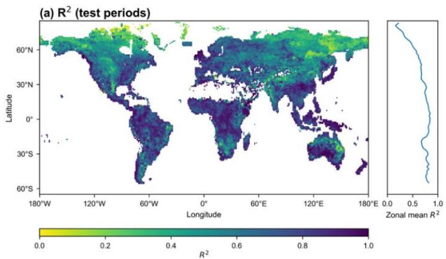

(b)RMsE (test periods)  
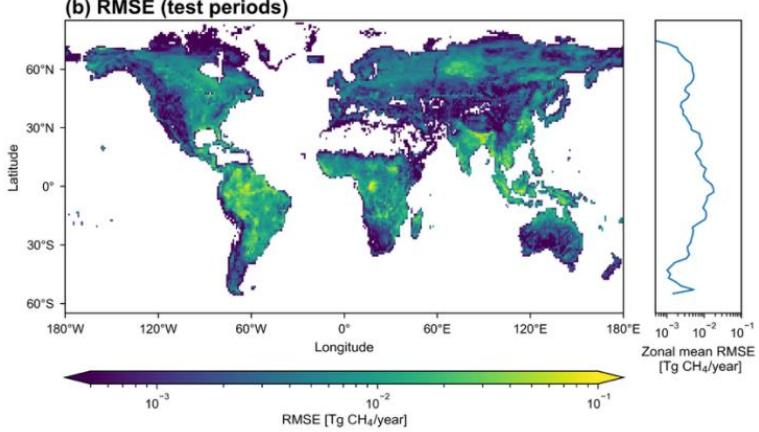  
Figure 1. Predictive skill of the XGBoost wetland CH4 model $( \mathbb { R } ^ { 2 }$ and RMSE for test periods). Insets indicate the zonal mean $\mathtt { R } ^ { 2 }$ and RMSE in $2 ^ { \circ }$ latitude bands.

To examine predictive uncertainty, we compare wetland CH4 emissions from the GMB models (CH4\_GMB; Figure 2a) with XGBoost predictions (CH4\_pred; Figure 2b) over the two test periods. Globally, CH4\_pred reproduces both the magnitude and spatial pattern of $\mathrm { C H } _ { 4 }$ \_GMB, including the major hotspots concentrated in the tropics, such as Amazon Basin (central-western Amazon floodplains, Pantanal and Llanos de Moxos), Congo Basin (Cuvette Centrale and the Sudd of South Sudan), and Southeast Asia (Sumatra, Borneo, Peninsular Malaysia, and New Guinea), with additional hotspots in the northern high latitudes, such as West Siberian Plain and Hudson/James Bay Lowlands.

The differences in emissions (Figure 2c) and the corresponding percent emission differences (Figure 2d) between CH4\_GMB and CH4\_pred highlight spatial biases. The global mean predicted wetland CH4 emission is 2.27 Tg/year lower than the global mean of CH4\_GMB during test periods (Figure 2c), corresponding to a 1.41% underestimation. Underestimation is strongest over high-emission systems, such as the central-western Amazon, Southeast Asia, Congo Basin and West Siberian Plain (Figure 2c), where absolute emission differences are negative, but percent differences are smaller because the

denominator $\mathrm { ( C H _ { 4 } \_ G M B ) }$ is large. For example, in Southeast Asia, the mean bias is -0.44 Tg/year, yet the relative bias is only -1.74% given a high regional mean emission $\mathrm { ( C H _ { \_ } G M B }$ of 25.23 Tg/year). Monthly anomalies in global emissions reveal small disagreements between the predictions and GMB estimates (\~±4 Tg CH4/year) (Figure S5). Largest discrepancies occur in July/August 2020 (underestimation of 15 Tg CH4/year).

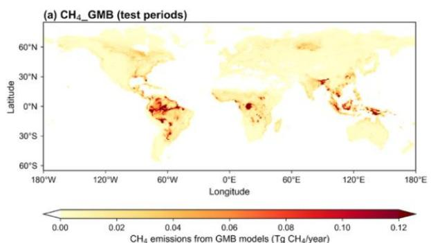

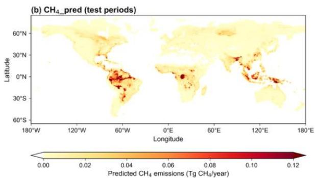

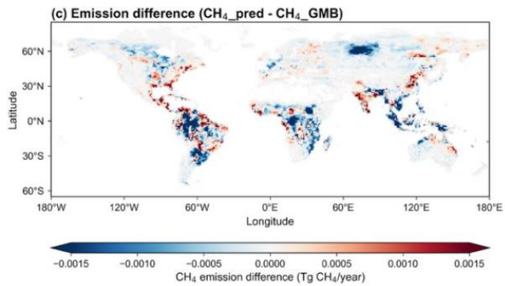

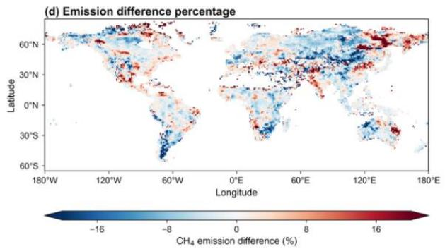  
Figure 2. Wetland CH4 emissions (per $1 ^ { \circ } \mathbf { x } 1 ^ { \circ }$ grid cell) from GMB models and XGBoost predictions for two test periods combined. (a) Mean CH4\_GMB (GMB emissions) over all test months. (b) Mean CH4\_pred (XGBoost prediction) over all test months. (c) Differences in mean CH4\_GMB and mean $\mathrm { C H } _ { 4 }$ \_pred. (d) Percent emission difference between mean $\mathrm { C H } _ { 4 }$ \_GMB and mean CH4\_pred. Reds in (c) and (d) indicate higher emissions in $\mathrm { C H } _ { 4 }$ \_pred, blues lower emissions.

## 3.2 Emission trends and predicted anomalies in recent years (2021-2025)

Figure 3 shows spatial maps of global predicted mean wetland CH4 emissions for 2021-2025 (Figure 3a) and for 2000-2020 (Figure 3b). The 2021-2025 mean emission is $1 5 7 . 8 3 \pm 2 . 3 8$ Tg/year (z-score: 3.72), representing a weak increase of 0.05 Tg/year relative to the 2000-2020 mean. However, changes are more pronounced across latitudes. NH mid- and high-latitude wetland emissions increase during 2021-2025 by $0 . 7 6 \pm 0 . 0 7$ (from $2 9 . 9 2 \pm 1 . 1 1 ( 2 0 0 0 { - 2 0 2 0 } )$ to $3 0 . 6 8 \pm 1 . 1 5$ (2021-2025)) (z-score:2.21) and $0 . 3 5 \pm 0 . 0 3$ (from $1 1 . 0 4 \pm 0 . 6 8$ to $1 1 . 3 9 \pm 0 . 7 0 )$ Tg/year (z-score:1.01), respectively, compared with

2000-2020 emissions. These changes correspond to \~2.5% and \~0.8% increase. The continued growth in these regions in 2021-2025 (relative to 2000-2020, this study), together with increases reported for 2010-2018 relative to 1981-1989 (Feron et al., 2024), suggests an increasing role of boreal and temperate wetlands in recent decades of global warming. In contrast, emissions decrease in the tropics and SH extratropics during 2021-2025. The tropics exhibit a $0 . 9 5 \pm 0 . 1 9$ Tg/year emission decrease (zscore:-2.81), from $1 1 3 . 8 9 \pm 2 . 4 6$ (2000-2020) to $1 1 2 . 9 4 \pm 2 . 4 9$ Tg/year (2021-2025), while SH extratropics emissions decline by 3.5% $( - 0 . 1 1 \pm 0 . 0 2 $ Tg/year, z-score:-0.34)) from $3 . 0 6 \pm 0 . 1 2$ (2000- 2020) to $2 . 9 6 \pm 0 . 1 2$ Tg/year (2021-2025).

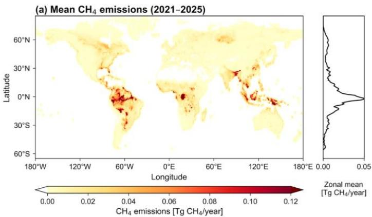

(b)Emissiondifference (2021-2025minus 2000-2020)  
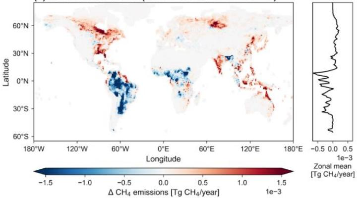  
Figure 3. (a) Mean predicted wetland CH4 emissions for 2021-2025. (b) Difference between mean emissions in 2021-2025 and 2000-2020. Reds indicate higher emissions in 2021-2025, blues lower. Insets indicate the zonal mean in $2 ^ { \circ }$ latitude bands.

We further assess regional wetland CH4 emissions for 2021-2025 from XGBoost predictions (PRED 21- 25, dark blue bars in Figure 4) across 18 regions, and compared them with (i) CH4 emissions for 2000- 2020 from GMB models (GMB 00-20, light green bars) and (ii) XGBoost model predictions for 2000- 2020 (PRED 00-20, dark green bars). Four regions show no significant change (labelled “n.s.” above

PRED 21-25) when comparing 2021-2025 with 2000-2020 using XGBoost predictions. Among the 14 regions with significant changes, nine regions show increases and five show decreases (Northern South America, Brazil, Southwest South America, Northern Africa, and Equatorial Africa). Notably, all regions with decreases are located in South America and Africa. The largest emission changes (2021- 2025 relative to 2000-2020) occur in Brazil $( - 0 . 5 9 \pm 0 . 0 9 \mathrm { T g / y e a r } )$ , Canada $( + 0 . 4 6 \pm 0 . 0 5 \mathrm { T g / y e a r } )$ Southwest South America $( - 0 . 4 3 \pm 0 . 0 7 \mathrm { T g / y e a r } )$ , Russia $( + 0 . 3 1 \pm 0 . 0 3 \mathrm { T g / y e a r } )$ , Southeast Asia (+0.22 $\pm 0 . 0 3 \mathrm { T g / y e a r ) }$ and Equatorial Africa $( - 0 . 2 1 \pm 0 . 0 4 \mathrm { T g / y e a r } )$ . The pronounced decline over Brazil possibly reflects the exceptional drought conditions in the Amazon basin during 2022-2024, including record-low river levels and anomalously warm, dry conditions (Espinoza et al., 2024). Such hydroclimatic drying reduces floodplain inundation and lowers water tables, which suppresses anaerobic conditions and thereby limits wetland methane production and emissions (Cui et al., 2024).

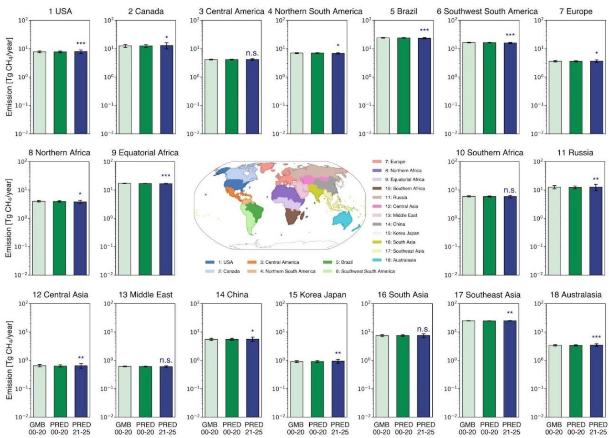  
Figure 4. Regional wetland CH4 emissions for 2000-2020 and 2021-2025 across 18 regions. Bars show regional mean emissions: GMB 00-20 (GMB estimates, 2000-2020; light green), PRED 00-20 (XGBoost predictions, 2000-2020; dark green), PRED 21-25 (XGBoost predictions, 2021-2025; dark blue). Error bars show 95% CI. A two-sided paired test was applied for each region to assess whether the PRED21-25 mean differs from the PRED

00-20 mean. Regions with p≥0.05 are labelled “n.s.” above the PRED 21-25 bar. Asterisks above PRED 21-25 bars denote significance: \*\*\* for $\mathsf { p } < 0 . 0 0 1$ , \*\* for p < 0.01, \* for $\mathsf { p } < 0 . 0 5$

## 3.3 26-year emission trends and anomalies (2000-2025)

The emission predictions enable an assessment of long-term trends and interannual variability in wetland emissions over 2000-2025. Annual emission time series show pronounced peaks in 2011 and 2016/2017 in the tropics, NH mid-latitudes, and globally (Figure S6). Monthly emission anomalies in these regions (Figure S7) indicate that the annual maxima are driven by sustained positive anomalies during Aug 2010-May 2011 and Aug 2016-Dec 2017, which coincide with La Niña conditions. This alignment is consistent with prior studies reporting La Niña-driven wetting and expanded inundation that enhance tropical wetland CH4 emissions (Hodson et al., 2011; Lin et al., 2024; Murguia-Flores et al., 2023; Zhang et al., 2020, 2018; Zhu et al., 2017).

In the 2020s, global and tropical annual emissions reach a minimum in 2023 (Figures S3, S4), coincident with a strong El Niño event. This is supported by two recent studies reporting a sharp decline in wetland emissions in South America (Ciais et al., 2026) and Amazonia (Quinn et al., 2025) in 2023 linked to El Niño-related drought. Our results further suggest that Brazil and Southern South America are the key contributors, and both rank among the top six emitting regions globally (Figure 5). Annual emissions in Brazil decline steadily across the study period, from $2 4 . 8 3 \pm 0 . 9 3$ Tg/year in 2000 to 23.28 ± 0.84 Tg/year in 2025, with the lowest emission in 2024 $( 2 2 . 8 4 \pm 0 . 8 5 \mathrm { T g / y e a r ) }$ (Figure 5). Emissions in Southern South America are relatively stable during 2000-2014, decrease markedly during 2014- 2023 (from $1 7 . 2 4 \pm 0 . 6 1$ to $1 5 . 9 5 \pm 0 . 6 \dot { 2 }$ Tg/year), and show a modest recovery in 2024/2025 (Figure 5).

The remaining four top-emitting regions show contrasting behavior. Since 2019, Southeast Asia, Canada and Russia show increasing emissions, whereas Equatorial Africa emissions decrease slightly (Figure 5). Southeast Asian emissions fluctuate around 24.74 ± 0.48 Tg/year over 2000-2025, with a minimum in 2015 $( 2 3 . 7 5 \pm 0 . 7 0$ Tg/year) and a maximum in 2017 (25.58 ± 0.73 Tg/year). Emissions in Canada are comparatively stable during 2005-2015, while variability is larger before 2005 and after 2015: the amplitude reaches \~1.5 Tg/year in these periods, approximately double that during 2005-2015 (\~0.8 Tg/year). Equatorial African emissions remain 17.0 ± 0.2 Tg/year during 2000-2025, despite two notable declines during 2002-2005 (-0.51 Tg/year) and 2019-2025 (-0.61 Tg/year).

Regional emission time series (Figures 5, S8) help explain the pronounced disagreement in 2019-2020 for global and tropical emissions, where predictions are substantially lower than the GMB estimates (Figure S6). For 2019, prediction mean are 5.53 Tg/year below the GMB estimates for global emissions (\~3.5% underestimation), while emission changes in Equatorial Africa, Brazil, USA, Southern Africa, and Southern South America jointly account for 4.26 Tg/year of this discrepancy. In 2020, the modeled mean global emissions are 9.84 Tg/year lower than GMB (\~6% underestimation). The discrepancies in the tropics explain 9.17 Tg/year of the underestimation, including major regions such as Eastern Africa,

475 Southern South America, Southeast Asia, Brazil, and Northern Africa. Notably, this disagreement in 2019-2020 is not evident in other latitude bands and does not persist outside these years.

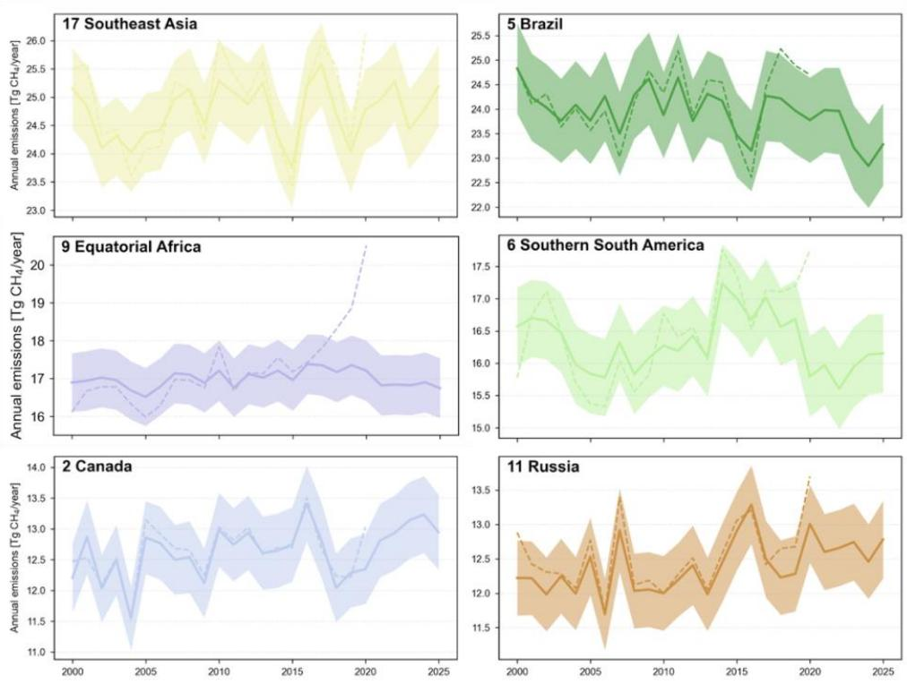  
Figure 5. Annual wetland CH4 emissions for the six top-emitting regions. Solid lines show model predictions of annual mean emissions, and shaded areas indicate 95% CI. Dashed lines show GMB emission estimates (mean). Panel titles indicate the region code and region name, which correspond to the region definitions shown in Figure 4.

Finally, we examine trends in predicted monthly wetland $\mathrm { C H } _ { 4 }$ emissions across five latitude bands (Figure 6a) and 12 calendar-month categories (Figure 6b) over 2000-2025. We summed predicted monthly emissions across all grid cells within each latitude bands to form regional monthly time series, then computed monthly emission anomalies by subtracting the 2000-2020 climatological mean. We then estimated growth rates using ordinary least squares linear regression of the anomaly time series. Growth rates presented in Figure 6 indicate the total emission changes over 26 years.

The global wetland $\mathrm { C H } _ { 4 }$ emission growth rate is $2 . 1 5 \pm 0 . 8 9$ Tg/year (26 years total, z-score: 4.73) (Figure 6a). Positive trends are concentrated in the NH, with the largest increase in the mid-latitudes $( 1 . 4 4 \pm 0 . 3 7$ Tg/year, z-score: 7.73) followed by the high-latitudes $( 0 . 8 1 \pm 0 . 2 4$ Tg/year, z-score: 6.70). In contrast, SH extratropics exhibit weak negative growth rates ( -0.10 ± 0.09 Tg/year, z-score: -2.21).

The growth rate for the tropics is close to zero with higher uncertainty (5.05 x10-3 ± 0.64 Tg/year, zscore: 0.02).

Evaluating growth rates over individual months (Figure 6b), we find that the global growth rate peaks in late boreal summer, with the largest increases in August and September (2.45 ± 2.24 and $3 . 1 0 \pm 1 . 4 4$ Tg/year, respectively). The strongest seasonal intensification occurs in NH mid-latitudes during June-September (2.27 - 3.10 Tg/year), consistent with the dominant contribution from boreal growing-season emissions. For both NH mid- and high-latitudes, growth rates are systematically higher during May-October (growing season) than during November-April. In the tropics, monthly growth reaches its highest in Oct-Dec and lowest in Jun-Aug (negative growth). SH extratropics show near-zero growth throughout the year (slightly negative).

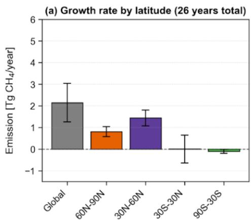

(b) Growth rate by month category (26 years total)  
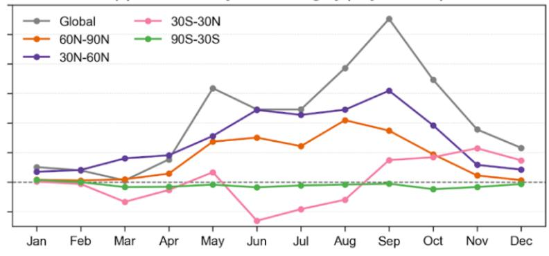  
Figure 6. Regional and seasonal growth rates (Tg/year) in predicted wetland CH4 emissions for 2000-2025. (a) Growth rates across five latitude bands over the full 26-year period. (b) Growth rates for each calendar month across the same period. Positive growth rates indicate an increase in CH4 emissions, while negative values indicate a decrease. Error bars indicate 95% CI.

## 4 Conclusions

This study presents a framework to extend global natural wetland CH4 emissions from 2000 through 2025 by applying a machine-learning emulator to disentangle the release of GMB estimates to estimate wetland emissions at low latency, with an operational design intended for routine updates. The extended wetland CH4 emission record shows that the magnitude of emission changes in 2021-2025 relative to 2000-2020 is substantially larger than the long-term trend over 2000-2025, even though the global mean emission change is relatively small.

A key emerging feature is accelerated emissions in the NH extratropics, with the strongest increases in mid-latitudes and a clear positive signal in high latitudes. Seasonal trend analyses indicate that these increases are concentrated in the warm season, consistent with an amplification of the seasonal cycle and a strengthening of late-summer growth, highlighting Northern mid- and high-latitude wetlands as regions where intensifying trends are most evident in recent years.

In contrast, the tropics and SH extratropics show weakly negative emission changes in post-2020. Nevertheless, the tropics still dominate interannual variability of global wetland emissions and can strongly influence the global CH4 budget through episodic hydroclimate extremes.

Overall, this work proposes an operational, low-latency emulator framework that provides a scalable pathway to track wetland CH4 emissions in response to climate anomalies by leveraging routinely updated Earth observation reanalysis data.

## Data Availability

ERA5 monthly averaged data are available at Copernicus Climate Change Service Climate Data Store at https://cds.climate.copernicus.eu/datasets/reanalysis-era5-single-levels-monthly-means?tab=overview (DOI:10.24381/cds.f17050d7) (Accessed on 22-Jan-2026) (Copernicus Climate Change Service, 2023). The global natural wetland methane emission dataset generated from this study are publicly available at https://doi.org/10.5281/zenodo.18870108 (Li et al., 2026).

## Competing Interests

At least one of the (co-)authors is a member of the editorial board of Earth System Science Data.

## Financial Support

This research is supported by the National University of Singapore (NUS) Start-Up Grant. A.M. was supported by an Early Career Award by the U.S. Department of Energy. F.J. and J.M. acknowledge funding from the Swiss National Science Foundation (No. 200020\_200511). Additional support was provided by the Gordon and Betty Moore Foundation (Grant GBMF11519 to Stanford University), the Global Methane Office at Stanford Doerr School of Sustainability and the John Wesley Powell Center for Analysis and Synthesis of the U.S. Geological Survey (“Scaling tropical wetland methane fluxes regionally and globally” working group). This paper is a contribution to the League of geophysical research eXcellences for tropical Asia (LeXtra).

## References

Aalto, T., Tsuruta, A., Mäkelä, J., Müller, J., Tenkanen, M., Burke, E., Chadburn, S., Gao, Y., Mannisenaho, V., Kleinen, T., Lee, H., Leppänen, A., Markkanen, T., Materia, S., Miller, P. A., Peano, D., Peltola, O., Poulter, B., Raivonen, M., Saunois, M., Wårlind, D., and Zaehle, S.: Air temperature and precipitation constraining the modelled wetland methane emissions in a boreal region in northern Europe, Biogeosciences, 22, 323–340, https://doi.org/10.5194/bg-22-323-2025, 2025.

Arora, V. K., Melton, J. R., and Plummer, D.: An assessment of natural methane fluxes simulated by the CLASS-CTEM model, Biogeosciences, 15, 4683–4709, https://doi.org/10.5194/bg-15-4683-2018, 2018.

Bansal, S., Post van der Burg, M., Fern, R. R., Jones, J. W., Lo, R., McKenna, O. P., Tangen, B. A., Zhang, Z., and Gleason, R. A.: Large increases in methane emissions expected from North America’s largest wetland complex, Sci. Adv., 9, eade1112, https://doi.org/10.1126/sciadv.ade1112, 2023.

Beerling, D. and Woodward, F. I.: Vegetation and the Terrestrial Carbon Cycle: The First 400 Million Years, Cambridge University Press, Cambridge, U.K. ; New York, NY, 416 pp., 2001.

Bernard, J., Salmon, E., Saunois, M., Peng, S., Serrano-Ortiz, P., Berchet, A., Gnanamoorthy, P., Jansen, J., and Ciais, P.: Satellite-based modeling of wetland methane emissions on a global scale (SatWetCH4 1.0), Geosci. Model Dev., 18, 863– 883, https://doi.org/10.5194/gmd-18-863-2025, 2025.

Chandra, N., Patra, P. K., Bisht, J. S. H., Ito, A., Umezawa, T., Saigusa, N., Morimoto, S., Aoki, S., Janssens-Maenhout, G., Fujita, R., Takigawa, M., Watanabe, S., Saitoh, N., and Canadell, J. G.: Emissions from the Oil and Gas Sectors, Coal Mining and Ruminant Farming Drive Methane Growth over the Past Three Decades, J. Meteorol. Soc. Jpn. Ser II, 99, 309– 337, https://doi.org/10.2151/jmsj.2021-015, 2021.

Ciais, P., Zhu, Y., Cai, Y., Lan, X., Michel, S. E., Zheng, B., Zhao, Y., Hauglustaine, D. A., Lin, X., Zhang, Y., Sun, S., Tian, X., Zhao, M., Wang, Y., Chang, J., Dou, X., Liu, Z., Andrew, R., Quinn, C. A., Poulter, B., Ouyang, Z., Yuan, W., Yuan, K., Zhu, Q., Li, F., Pan, N., Tian, H., Yu, X., Rocher-Ros, G., Johnson, M. S., Li, M., Li, M., Feng, D., Raymond, P., Yang, X., Canadell, J. G., Jackson, R. B., Yu, X., Li, Y., Saunois, M., Bousquet, P., and Peng, S.: Why methane surged in the atmosphere during the early 2020s, Science, 391, eadx8262, https://doi.org/10.1126/science.adx8262, 2026.

Copernicus Climate Change Service: ERA5 monthly averaged data on single levels from 1940 to present, Copernicus Climate Change Service (C3S) Climate Data Store (CDS) [data set]. DOI: 10.24381/cds.f17050d7 (Accessed on 22-Jan-2026), 2023.

Crippa, M., Guizzardi, D., Pagani, F., Banja, M., Muntean, M., Schaaf, E., Becker, W., Monforti-Ferrario, F., Quadrelli, R., and Risquez Martin, A.: GHG emissions of all world countries– 2021 Report, Publ. Off. Eur. Union Luxemb., 2021.

Cui, S., Liu, P., Guo, H., Nielsen, C. K., Pullens, J. W. M., Chen, Q., Pugliese, L., and Wu, S.: Wetland hydrological dynamics and methane emissions, Commun. Earth Environ., 5, 470, https://doi.org/10.1038/s43247-024-01635-w, 2024.

Espinoza, J.-C., Jimenez, J. C., Marengo, J. A., Schongart, J., Ronchail, J., Lavado-Casimiro, W., and Ribeiro, J. V. M.: The new record of drought and warmth in the Amazon in 2023 related to regional and global climatic features, Sci. Rep., 14, 8107, https://doi.org/10.1038/s41598-024-58782-5, 2024.

Feron, S., Malhotra, A., Bansal, S., Fluet-Chouinard, E., McNicol, G., Knox, S. H., Delwiche, K. B., Cordero, R. R., Ouyang, Z., Zhang, Z., Poulter, B., and Jackson, R. B.: Recent increases in annual, seasonal, and extreme methane fluxes driven by

changes in climate and vegetation in boreal and temperate wetland ecosystems, Glob. Change Biol., 30, e17131, https://doi.org/10.1111/gcb.17131, 2024.

Gebrechorkos, S. H., Leyland, J., Dadson, S. J., Cohen, S., Slater, L., Wortmann, M., Ashworth, P. J., Bennett, G. L., Boothroyd, R., Cloke, H., Delorme, P., Griffith, H., Hardy, R., Hawker, L., McLelland, S., Neal, J., Nicholas, A., Tatem, A. J., Vahidi, E., Liu, Y., Sheffield, J., Parsons, D. R., and Darby, S. E.: Global-scale evaluation of precipitation datasets for hydrological modelling, Hydrol. Earth Syst. Sci., 28, 3099–3118, https://doi.org/10.5194/hess-28-3099-2024, 2024.

Gedney, N., Huntingford, C., Comyn-Platt, E., and Wiltshire, A.: Significant feedbacks of wetland methane release on climate change and the causes of their uncertainty, Environ. Res. Lett., 14, 084027, https://doi.org/10.1088/1748- 9326/ab2726, 2019a.

Gedney, N., Huntingford, C., Comyn-Platt, E., and Wiltshire, A.: Significant feedbacks of wetland methane release on climate change and the causes of their uncertainty, Environ. Res. Lett., 14, 084027, https://doi.org/10.1088/1748- 9326/ab2726, 2019b.

610 He, K., Li, W., Zhang, Y., Zeng, A., de Graaf, I. E. M., Aguilos, M., Sun, G., McNulty, S. G., King, J. S., Flanagan, N. E., and Richardson, C. J.: Temperature and Water Levels Collectively Regulate Methane Emissions From Subtropical Freshwater Wetlands, Glob. Biogeochem. Cycles, 39, e2024GB008372, https://doi.org/10.1029/2024GB008372, 2025.

Helbig, M., Waddington, J. M., Alekseychik, P., Amiro, B. D., Aurela, M., Barr, A. G., Black, T. A., Blanken, P. D., Carey, S. K., Chen, J., Chi, J., Desai, A. R., Dunn, A., Euskirchen, E. S., Flanagan, L. B., Forbrich, I., Friborg, T., Grelle, A., 615 Harder, S., Heliasz, M., Humphreys, E. R., Ikawa, H., Isabelle, P.-E., Iwata, H., Jassal, R., Korkiakoski, M., Kurbatova, J., Kutzbach, L., Lindroth, A., Löfvenius, M. O., Lohila, A., Mammarella, I., Marsh, P., Maximov, T., Melton, J. R., Moore, P. A., Nadeau, D. F., Nicholls, E. M., Nilsson, M. B., Ohta, T., Peichl, M., Petrone, R. M., Petrov, R., Prokushkin, A., Quinton, W. L., Reed, D. E., Roulet, N. T., Runkle, B. R. K., Sonnentag, O., Strachan, I. B., Taillardat, P., Tuittila, E.-S., Tuovinen, J.-P., Turner, J., Ueyama, M., Varlagin, A., Wilmking, M., Wofsy, S. C., and Zyrianov, V.: Increasing contribution of 620 peatlands to boreal evapotranspiration in a warming climate, Nat. Clim. Change, 10, 555–560, https://doi.org/10.1038/s41558-020-0763-7, 2020.

Helfter, C., Gondwe, M., Murray-Hudson, M., Makati, A., Lunt, M. F., Palmer, P. I., and Skiba, U.: Phenology is the dominant control of methane emissions in a tropical non-forested wetland, Nat. Commun., 13, 133, https://doi.org/10.1038/s41467-021-27786-4, 2022.

625 Hersbach, H., Bell, B., Berrisford, P., Hirahara, S., Horányi, A., Muñoz-Sabater, J., Nicolas, J., Peubey, C., Radu, R., Schepers, D., Simmons, A., Soci, C., Abdalla, S., Abellan, X., Balsamo, G., Bechtold, P., Biavati, G., Bidlot, J., Bonavita, M., De Chiara, G., Dahlgren, P., Dee, D., Diamantakis, M., Dragani, R., Flemming, J., Forbes, R., Fuentes, M., Geer, A., Haimberger, L., Healy, S., Hogan, R. J., Hólm, E., Janisková, M., Keeley, S., Laloyaux, P., Lopez, P., Lupu, C., Radnoti, G., de Rosnay, P., Rozum, I., Vamborg, F., Villaume, S., and Thépaut, J.-N.: The ERA5 global reanalysis, Q. J. R. Meteorol.   
630 Soc., 146, 1999–2049, https://doi.org/10.1002/qj.3803, 2020.

Hersbach, H., Bell, B., Berrisford, P., Biavati, G., Horányi, A., Muñoz Sabater, J., Nicolas, J., Peubey, C., Radu, R., and Rozum, I.: ERA5 monthly averaged data on pressure levels from 1940 to present, Copernicus Climate Change Service (C3S) Climate Data Store (CDS)[data set], 2023.

Höglund-Isaksson, L., Gómez-Sanabria, A., Klimont, Z., Rafaj, P., and Schöpp, W.: Technical potentials and costs for 635 reducing global anthropogenic methane emissions in the 2050 timeframe –results from the GAINS model, Environ. Res. Commun., 2, 025004, https://doi.org/10.1088/2515-7620/ab7457, 2020.

Hopcroft, P. O., Valdes, P. J., and Beerling, D. J.: Simulating idealized Dansgaard-Oeschger events and their potential impacts on the global methane cycle, Quat. Sci. Rev., 30, 3258–3268, https://doi.org/10.1016/j.quascirev.2011.08.012, 2011.

Hopcroft, P. O., Ramstein, G., Pugh, T. A. M., Hunter, S. J., Murguia-Flores, F., Quiquet, A., Sun, Y., Tan, N., and Valdes, P. J.: Polar amplification of Pliocene climate by elevated trace gas radiative forcing, Proc. Natl. Acad. Sci., 117, 23401– 23407, https://doi.org/10.1073/pnas.2002320117, 2020.

Hyvärinen, S., Tenkanen, M. K., Tsuruta, A., Erkkilä, A., Rautiainen, K., Aaltonen, H., Sasakawa, M., and Aalto, T.: Spring melting season methane emissions in northern high latitude wetlands are governed by the length of the season and presence of permafrost, EGUsphere, 1–46, https://doi.org/10.5194/egusphere-2025-2794, 2025.

Ito, A. and Inatomi, M.: Use of a process-based model for assessing the methane budgets of global terrestrial ecosystems and evaluation of uncertainty, Biogeosciences, 9, 759–773, https://doi.org/10.5194/bg-9-759-2012, 2012.

Jackson, R. B., Saunois, M., Martinez, A., Canadell, J. G., Yu, X., Li, M., Poulter, B., Raymond, P. A., Regnier, P., Ciais, P., Davis, S. J., and Patra, P. K.: Human activities now fuel two-thirds of global methane emissions, Environ. Res. Lett., 19, 101002, https://doi.org/10.1088/1748-9326/ad6463, 2024.

650 Kleinen, T., Brovkin, V., and Schuldt, R. J.: A dynamic model of wetland extent and peat accumulation: results for the Holocene, Biogeosciences, 9, 235–248, https://doi.org/10.5194/bg-9-235-2012, 2012.

Kleinen, T., Mikolajewicz, U., and Brovkin, V.: Terrestrial methane emissions from the Last Glacial Maximum to the preindustrial period, Clim. Past, 16, 575–595, https://doi.org/10.5194/cp-16-575-2020, 2020.

Kleinen, T., Gromov, S., Steil, B., and Brovkin, V.: Atmospheric methane underestimated in future climate projections, 655 Environ. Res. Lett., 16, 094006, https://doi.org/10.1088/1748-9326/ac1814, 2021.

Kleinen, T., Gromov, S., Steil, B., and Brovkin, V.: Atmospheric methane since the last glacial maximum was driven by wetland sources, Clim. Past, 19, 1081–1099, https://doi.org/10.5194/cp-19-1081-2023, 2023.

Knox, S. H., Bansal, S., McNicol, G., Schafer, K., Sturtevant, C., Ueyama, M., Valach, A. C., Baldocchi, D., Delwiche, K., Desai, A. R., Euskirchen, E., Liu, J., Lohila, A., Malhotra, A., Melling, L., Riley, W., Runkle, B. R. K., Turner, J., Vargas,   
660 R., Zhu, Q., Alto, T., Fluet-Chouinard, E., Goeckede, M., Melton, J. R., Sonnentag, O., Vesala, T., Ward, E., Zhang, Z., Feron, S., Ouyang, Z., Alekseychik, P., Aurela, M., Bohrer, G., Campbell, D. I., Chen, J., Chu, H., Dalmagro, H. J., Goodrich, J. P., Gottschalk, P., Hirano, T., Iwata, H., Jurasinski, G., Kang, M., Koebsch, F., Mammarella, I., Nilsson, M. B., Ono, K., Peichl, M., Peltola, O., Ryu, Y., Sachs, T., Sakabe, A., Sparks, J. P., Tuittila, E.-S., Vourlitis, G. L., Wong, G. X., Windham-Myers, L., Poulter, B., and Jackson, R. B.: Identifying dominant environmental predictors of freshwater wetland   
665 methane fluxes across diurnal to seasonal time scales, Glob. Change Biol., 27, 3582–3604, https://doi.org/10.1111/gcb.15661, 2021.

Kursa, M. B. and Rudnicki, W. R.: Feature Selection with the Boruta Package, J. Stat. Softw., 36, 1–13, https://doi.org/10.18637/jss.v036.i11, 2010.

Li, M., Jackson, R. B., Saunois, M., Ciais, P., Poulter, B., Canadell, J. G., Patra, P. K., Tian, H., Zhang, Z., Fluet-Chouinard, 670 E., Ouyang, Z., Zhang, T., Beerling, D. J., Belikov, D. A., Bousquet, P., Custodio, D., Chandra, N., Dou, X., Gedney, N., Hopcroft, P. O., Hoyt, A. M., Ichii, K., Ito, A., Jain, A. K., Jensen, K., Joos, F., Kleinen, T., Kondo, M., Li, F., Li, T., Liu, X., Maksyutov, S., Malhotra, A., Martinez, A., McDonald, K., Melton, J. R., Miller, P., Müller, J., Niwa, Y., Pan, S., Peng, S., Peng, C., Qin, Z., Raymond, P., Riley, W., Segers, A., Thompson, R. L., Tsuruta, A., Yi, X., Yuan, K., Zhang, W., Zheng, B.,

Zhu, Q., Zhu, Q., and Zhuang, Q.: Global natural wetland methane emissions (2000–2025) (Version v1), Zenodo [data set], https://doi.org/10.5281/zenodo.18870109, 2026.

Li, M., Kort, E. A., Bloom, A. A., Wu, D., Plant, G., Gerlein-Safdi, C., and Pu, T.: Underestimated Dry Season Methane Emissions from Wetlands in the Pantanal, Environ. Sci. Technol., 58, 3278–3287, https://doi.org/10.1021/acs.est.3c09250, 2024.

Li, M., Li, F., Malhotra, A., Knox, S. H., Stern, R., and Jackson, R. B.: Key Environmental and Ecological Variables of Wetland CH4 and CO2 Fluxes Change With Warming, Earths Future, 13, e2024EF005751, https://doi.org/10.1029/2024EF005751, 2025.

Maksyutov, S., Oda, T., Saito, M., Janardanan, R., Belikov, D., Kaiser, J. W., Zhuravlev, R., Ganshin, A., Valsala, V. K., Andrews, A., Chmura, L., Dlugokencky, E., Haszpra, L., Langenfelds, R. L., Machida, T., Nakazawa, T., Ramonet, M., Sweeney, C., and Worthy, D.: Technical note: A high-resolution inverse modelling technique for estimating surface CO2 fluxes based on the NIES-TM–FLEXPART coupled transport model and its adjoint, Atmospheric Chem. Phys., 21, 1245– 1266, https://doi.org/10.5194/acp-21-1245-2021, 2021.

McNicol, G., Fluet-Chouinard, E., Ouyang, Z., Knox, S., Zhang, Z., Aalto, T., Bansal, S., Chang, K.-Y., Chen, M., Delwiche, K., Feron, S., Goeckede, M., Liu, J., Malhotra, A., Melton, J. R., Riley, W., Vargas, R., Yuan, K., Ying, Q., Zhu, Q., Alekseychik, P., Aurela, M., Billesbach, D. P., Campbell, D. I., Chen, J., Chu, H., Desai, A. R., Euskirchen, E., Goodrich, J., Griffis, T., Helbig, M., Hirano, T., Iwata, H., Jurasinski, G., King, J., Koebsch, F., Kolka, R., Krauss, K., Lohila, A., Mammarella, I., Nilson, M., Noormets, A., Oechel, W., Peichl, M., Sachs, T., Sakabe, A., Schulze, C., Sonnentag, O., Sullivan, R. C., Tuittila, E.-S., Ueyama, M., Vesala, T., Ward, E., Wille, C., Wong, G. X., Zona, D., Windham-Myers, L., Poulter, B., and Jackson, R. B.: Upscaling Wetland Methane Emissions From the FLUXNET-CH4 Eddy Covariance Network (UpCH4 v1.0): Model Development, Network Assessment, and Budget Comparison, AGU Adv., 4, e2023AV000956, https://doi.org/10.1029/2023AV000956, 2023.

Melton, J. R. and Arora, V. K.: Competition between plant functional types in the Canadian Terrestrial Ecosystem Model (CTEM) v. 2.0, Geosci. Model Dev., 9, 323–361, https://doi.org/10.5194/gmd-9-323-2016, 2016.

Niwa, Y., Ishijima, K., Ito, A., and Iida, Y.: Toward a long-term atmospheric CO2 inversion for elucidating natural carbon fluxes: technical notes of NISMON-CO2 v2021.1, Prog. Earth Planet. Sci., 9, 42, https://doi.org/10.1186/s40645-022-00502- 0 6, 2022.

Niwa, Y., Tohjima, Y., Terao, Y., Saeki, T., Ito, A., Umezawa, T., Yamada, K., Sasakawa, M., Machida, T., Nakaoka, S.-I., Nara, H., Tanimoto, H., Mukai, H., Yoshida, Y., Morimoto, S., Takatsuji, S., Tsuboi, K., Sawa, Y., Matsueda, H., Ishijima, K., Fujita, R., Goto, D., Lan, X., Schuldt, K., Heliasz, M., Biermann, T., Chmura, L., Necki, J., Xueref-Remy, I., and Sferlazzo, D.: Multi-observational estimation of regional and sectoral emission contributions to the persistent high growth rate of atmospheric CH4 for 2020–2022, Atmospheric Chem. Phys., 25, 6757–6785, https://doi.org/10.5194/acp-25-6757- 2025, 2025.

Parker, R. J., Boesch, H., McNorton, J., Comyn-Platt, E., Gloor, M., Wilson, C., Chipperfield, M. P., Hayman, G. D., and Bloom, A. A.: Evaluating year-to-year anomalies in tropical wetland methane emissions using satellite CH4 observations, Remote Sens. Environ., 211, 261–275, https://doi.org/10.1016/j.rse.2018.02.011, 2018.

Patra, P. K., Takigawa, M., Watanabe, S., Chandra, N., Ishijima, K., and Yamashita, Y.: Improved Chemical Tracer Simulation by MIROC4.0-based Atmospheric Chemistry-Transport Model (MIROC4-ACTM), SOLA, 14, 91–96, https://doi.org/10.2151/sola.2018-016, 2018.

Peng, S., Lin, X., Thompson, R. L., Xi, Y., Liu, G., Hauglustaine, D., Lan, X., Poulter, B., Ramonet, M., Saunois, M., Yin, Y., Zhang, Z., Zheng, B., and Ciais, P.: Wetland emission and atmospheric sink changes explain methane growth in 2020, Nature, 612, 477–482, https://doi.org/10.1038/s41586-022-05447-w, 2022.

Pu, T., Gerlein-Safdi, C., Xiong, Y., Li, M., Kort, E. A., and Bloom, A. A.: Berkeley-RWAWC: A New CYGNSS-Based Watermask Unveils Unique Observations of Seasonal Dynamics in the Tropics, Water Resour. Res., 60, e2024WR037060, https://doi.org/10.1029/2024WR037060, 2024.

Quinn, C. A., Colligan, T., Ward, E. J., East, J. D., Lim, Y., Lee, E., Koster, R. D., and Poulter, B.: Amazonia Wetland Methane Emission Decrease in 2023: Seasonal Forecasting of Global Wetlands Highlights Monitoring Targets in Critical Ecosystems, J. Adv. Model. Earth Syst., 17, e2025MS005510, https://doi.org/10.1029/2025MS005510, 2025.

Riley, W. J., Subin, Z. M., Lawrence, D. M., Swenson, S. C., Torn, M. S., Meng, L., Mahowald, N. M., and Hess, P.: Barriers to predicting changes in global terrestrial methane fluxes: analyses using CLM4Me, a methane biogeochemistry model integrated in CESM, Biogeosciences, 8, 1925–1953, https://doi.org/10.5194/bg-8-1925-2011, 2011.

725 Ringeval, B., Friedlingstein, P., Koven, C., Ciais, P., de Noblet-Ducoudré, N., Decharme, B., and Cadule, P.: Climate-CH4 feedback from wetlands and its interaction with the climate-CO2 feedback, Biogeosciences, 8, 2137–2157, https://doi.org/10.5194/bg-8-2137-2011, 2011.

Roberts, C. D., Senan, R., Molteni, F., Boussetta, S., Mayer, M., and Keeley, S. P. E.: Climate model configurations of the ECMWF Integrated Forecasting System (ECMWF-IFS cycle 43r1) for HighResMIP, Geosci. Model Dev., 11, 3681–3712, https://doi.org/10.5194/gmd-11-3681-2018, 2018.

Saunois, M., Stavert, A. R., Poulter, B., Bousquet, P., Canadell, J. G., Jackson, R. B., Raymond, P. A., Dlugokencky, E. J., Houweling, S., Patra, P. K., Ciais, P., Arora, V. K., Bastviken, D., Bergamaschi, P., Blake, D. R., Brailsford, G., Bruhwiler, L., Carlson, K. M., Carrol, M., Castaldi, S., Chandra, N., Crevoisier, C., Crill, P. M., Covey, K., Curry, C. L., Etiope, G., Frankenberg, C., Gedney, N., Hegglin, M. I., Höglund-Isaksson, L., Hugelius, G., Ishizawa, M., Ito, A., Janssens-Maenhout,   
735 G., Jensen, K. M., Joos, F., Kleinen, T., Krummel, P. B., Langenfelds, R. L., Laruelle, G. G., Liu, L., Machida, T., Maksyutov, S., McDonald, K. C., McNorton, J., Miller, P. A., Melton, J. R., Morino, I., Müller, J., Murguia-Flores, F., Naik, V., Niwa, Y., Noce, S., O’Doherty, S., Parker, R. J., Peng, C., Peng, S., Peters, G. P., Prigent, C., Prinn, R., Ramonet, M., Regnier, P., Riley, W. J., Rosentreter, J. A., Segers, A., Simpson, I. J., Shi, H., Smith, S. J., Steele, L. P., Thornton, B. F., Tian, H., Tohjima, Y., Tubiello, F. N., Tsuruta, A., Viovy, N., Voulgarakis, A., Weber, T. S., van Weele, M., van der Werf,   
740 G. R., Weiss, R. F., Worthy, D., Wunch, D., Yin, Y., Yoshida, Y., Zhang, W., Zhang, Z., Zhao, Y., Zheng, B., Zhu, Q., Zhu, Q., and Zhuang, Q.: The Global Methane Budget 2000–2017, Earth Syst. Sci. Data, 12, 1561–1623, https://doi.org/10.5194/essd-12-1561-2020, 2020. Saunois, M., Martinez, A., Poulter, B., Zhang, Z., Raymond, P. A., Regnier, P., Canadell, J. G., Jackson, R. B., Patra, P. K., Bousquet, P., Ciais, P., Dlugokencky, E. J., Lan, X., Allen, G. H., Bastviken, D., Beerling, D. J., Belikov, D. A., Blake, D. R.,   
745 Castaldi, S., Crippa, M., Deemer, B. R., Dennison, F., Etiope, G., Gedney, N., Höglund-Isaksson, L., Holgerson, M. A., Hopcroft, P. O., Hugelius, G., Ito, A., Jain, A. K., Janardanan, R., Johnson, M. S., Kleinen, T., Krummel, P. B., Lauerwald, R., Li, T., Liu, X., McDonald, K. C., Melton, J. R., Mühle, J., Müller, J., Murguia-Flores, F., Niwa, Y., Noce, S., Pan, S., Parker, R. J., Peng, C., Ramonet, M., Riley, W. J., Rocher-Ros, G., Rosentreter, J. A., Sasakawa, M., Segers, A., Smith, S. J., Stanley, E. H., Thanwerdas, J., Tian, H., Tsuruta, A., Tubiello, F. N., Weber, T. S., van der Werf, G. R., Worthy, D. E. J., Xi,   
750 Y., Yoshida, Y., Zhang, W., Zheng, B., Zhu, Q., Zhu, Q., and Zhuang, Q.: Global Methane Budget 2000–2020, Earth Syst. Sci. Data, 17, 1873–1958, https://doi.org/10.5194/essd-17-1873-2025, 2025.

Shu, S., Jain, A. K., and Kheshgi, H. S.: Investigating Wetland and Nonwetland Soil Methane Emissions and Sinks Across the Contiguous United States Using a Land Surface Model, Glob. Biogeochem. Cycles, 34, e2019GB006251, https://doi.org/10.1029/2019GB006251, 2020.

Spahni, R., Wania, R., Neef, L., van Weele, M., Pison, I., Bousquet, P., Frankenberg, C., Foster, P. N., Joos, F., Prentice, I. C., and van Velthoven, P.: Constraining global methane emissions and uptake by ecosystems, Biogeosciences, 8, 1643–1665, https://doi.org/10.5194/bg-8-1643-2011, 2011.

Stavert, A. R., Saunois, M., Canadell, J. G., Poulter, B., Jackson, R. B., Regnier, P., Lauerwald, R., Raymond, P. A., Allen, G. H., Patra, P. K., Bergamaschi, P., Bousquet, P., Chandra, N., Ciais, P., Gustafson, A., Ishizawa, M., Ito, A., Kleinen, T., Maksyutov, S., McNorton, J., Melton, J. R., Müller, J., Niwa, Y., Peng, S., Riley, W. J., Segers, A., Tian, H., Tsuruta, A., Yin, Y., Zhang, Z., Zheng, B., and Zhuang, Q.: Regional trends and drivers of the global methane budget, Glob. Change Biol., 28, 182–200, https://doi.org/10.1111/gcb.15901, 2022.

Stocker, B. D., Spahni, R., and Joos, F.: DYPTOP: a cost-efficient TOPMODEL implementation to simulate sub-grid spatiotemporal dynamics of global wetlands and peatlands, Geosci. Model Dev., 7, 3089–3110, https://doi.org/10.5194/gmd-7- 3089-2014, 2014.

Thanwerdas, J., Saunois, M., Berchet, A., Pison, I., Vaughn, B. H., Michel, S. E., and Bousquet, P.: Variational inverse modeling within the Community Inversion Framework v1.1 to assimilate δ13C(CH4) and CH4: a case study with model LMDz-SACS, Geosci. Model Dev., 15, 4831–4851, https://doi.org/10.5194/gmd-15-4831-2022, 2022.

Tian, T., Yang, S., Høyer, J. L., Nielsen-Englyst, P., and Singha, S.: Cooler Arctic surface temperatures simulated by climate models are closer to satellite-based data than the ERA5 reanalysis, Commun. Earth Environ., 5, 111, https://doi.org/10.1038/s43247-024-01276-z, 2024.

Toet, S., Ineson, P., Peacock, S., and Ashmore, M.: Elevated ozone reduces methane emissions from peatland mesocosms, Glob. Change Biol., 17, 288–296, https://doi.org/10.1111/j.1365-2486.2010.02267.x, 2011.

Tsuruta, A., Aalto, T., Backman, L., Hakkarainen, J., van der Laan-Luijkx, I. T., Krol, M. C., Spahni, R., Houweling, S., Laine, M., Dlugokencky, E., Gomez-Pelaez, A. J., van der Schoot, M., Langenfelds, R., Ellul, R., Arduini, J., Apadula, F., Gerbig, C., Feist, D. G., Kivi, R., Yoshida, Y., and Peters, W.: Global methane emission estimates for 2000–2012 from CarbonTracker Europe-CH4 v1.0, Geosci. Model Dev., 10, 1261–1289, https://doi.org/10.5194/gmd-10-1261-2017, 2017.

Tyystjärvi, V., Markkanen, T., Backman, L., Raivonen, M., Leppänen, A., Li, X., Ojanen, P., Minkkinen, K., Hautala, R., Peltoniemi, M., Anttila, J., Laiho, R., Lohila, A., Mäkipää, R., and Aalto, T.: Future methane fluxes of peatlands are controlled by management practices and fluctuations in hydrological conditions due to climatic variability, Biogeosciences, 21, 5745–5771, https://doi.org/10.5194/bg-21-5745-2024, 2024.

Wang, F., Maksyutov, S., Tsuruta, A., Janardanan, R., Ito, A., Sasakawa, M., Machida, T., Morino, I., Yoshida, Y., Kaiser, J. W., Janssens-Maenhout, G., Dlugokencky, E. J., Mammarella, I., Lavric, J. V., and Matsunaga, T.: Methane Emission Estimates by the Global High-Resolution Inverse Model Using National Inventories, Remote Sens., 11, 2489, https://doi.org/10.3390/rs11212489, 2019.

Xu, X., Sharma, P., Shu, S., Lin, T.-S., Ciais, P., Tubiello, F. N., Smith, P., Campbell, N., and Jain, A. K.: Global greenhouse gas emissions from animal-based foods are twice those of plant-based foods, Nat. Food, 2, 724–732, https://doi.org/10.1038/s43016-021-00358-x, 2021.

Yuan, K., Zhu, Q., Li, F., Riley, W. J., Torn, M., Chu, H., McNicol, G., Chen, M., Knox, S., Delwiche, K., Wu, H., Baldocchi, D., Ma, H., Desai, A. R., Chen, J., Sachs, T., Ueyama, M., Sonnentag, O., Helbig, M., Tuittila, E.-S., Jurasinski, G., Koebsch, F., Campbell, D., Schmid, H. P., Lohila, A., Goeckede, M., Nilsson, M. B., Friborg, T., Jansen, J., Zona, D., Euskirchen, E., Ward, E. J., Bohrer, G., Jin, Z., Liu, L., Iwata, H., Goodrich, J., and Jackson, R.: Causality guided machine learning model on wetland CH4 emissions across global wetlands, Agric. For. Meteorol., 324, 109115, https://doi.org/10.1016/j.agrformet.2022.109115, 2022.

Yuan, K., Li, F., McNicol, G., Chen, M., Hoyt, A., Knox, S., Riley, W. J., Jackson, R., and Zhu, Q.: Boreal–Arctic wetland methane emissions modulated by warming and vegetation activity, Nat. Clim. Change, 14, 282–288, https://doi.org/10.1038/s41558-024-01933-3, 2024.

Yvon-Durocher, G., Allen, A. P., Bastviken, D., Conrad, R., Gudasz, C., St-Pierre, A., Thanh-Duc, N., and del Giorgio, P. A.: Methane fluxes show consistent temperature dependence across microbial to ecosystem scales, Nature, 507, 488–491, 0 https://doi.org/10.1038/nature13164, 2014.

Zhang, Z., Zimmermann, N. E., Kaplan, J. O., and Poulter, B.: Modeling spatiotemporal dynamics of global wetlands: comprehensive evaluation of a new sub-grid TOPMODEL parameterization and uncertainties, Biogeosciences, 13, 1387– 1408, https://doi.org/10.5194/bg-13-1387-2016, 2016.

Zhang, Z., Poulter, B., Feldman, A. F., Ying, Q., Ciais, P., Peng, S., and Li, X.: Recent intensification of wetland methane feedback, Nat. Clim. Change, 13, 430–433, https://doi.org/10.1038/s41558-023-01629-0, 2023.

Zhang, Z., Poulter, B., Melton, J. R., Riley, W. J., Allen, G. H., Beerling, D. J., Bousquet, P., Canadell, J. G., Fluet-Chouinard, E., Ciais, P., Gedney, N., Hopcroft, P. O., Ito, A., Jackson, R. B., Jain, A. K., Jensen, K., Joos, F., Kleinen, T., Knox, S. H., Li, T., Li, X., Liu, X., McDonald, K., McNicol, G., Miller, P. A., Müller, J., Patra, P. K., Peng, C., Peng, S., Qin, Z., Riggs, R. M., Saunois, M., Sun, Q., Tian, H., Xu, X., Yao, Y., Xi, Y., Zhang, W., Zhu, Q., Zhu, Q., and Zhuang, Q.: Ensemble estimates of global wetland methane emissions over 2000–2020, Biogeosciences, 22, 305–321, https://doi.org/10.5194/bg-22-305-2025, 2025.

Zheng, B., Chevallier, F., Ciais, P., Yin, Y., and Wang, Y.: On the Role of the Flaming to Smoldering Transition in the Seasonal Cycle of African Fire Emissions, Geophys. Res. Lett., 45, 11,998-12,007, https://doi.org/10.1029/2018GL079092, 2018a.

815 Zheng, B., Chevallier, F., Ciais, P., Yin, Y., Deeter, M. N., Worden, H. M., Wang, Y., Zhang, Q., and He, K.: Rapid decline in carbon monoxide emissions and export from East Asia between years 2005 and 2016, Environ. Res. Lett., 13, 044007, https://doi.org/10.1088/1748-9326/aab2b3, 2018b.

Zheng, B., Chevallier, F., Yin, Y., Ciais, P., Fortems-Cheiney, A., Deeter, M. N., Parker, R. J., Wang, Y., Worden, H. M., and Zhao, Y.: Global atmospheric carbon monoxide budget 2000–2017 inferred from multi-species atmospheric inversions, Earth Syst. Sci. Data, 11, 1411–1436, https://doi.org/10.5194/essd-11-1411-2019, 2019.

Zhu, Q., Yuan, K., Li, F., Riley, W. J., Hoyt, A., Jackson, R., McNicol, G., Chen, M., Knox, S. H., Briner, O., Beerling, D., Gedney, N., Hopcroft, P. O., Ito, A., Jain, A. K., Jensen, K., Kleinen, T., Li, T., Liu, X., McDonald, K. C., Melton, J. R., Miller, P. A., Müller, J., Peng, C., Poulter, B., Qin, Z., Peng, S., Tian, H., Xu, X., Yao, Y., Xi, Y., Zhang, Z., Zhang, W., Zhu, Q., and Zhuang, Q.: Critical needs to close monitoring gaps in pan-tropical wetland CH4 emissions, Environ. Res. Lett., 19, 114046, https://doi.org/10.1088/1748-9326/ad8019, 2024.

Zona, D., Gioli, B., Commane, R., Lindaas, J., Wofsy, S. C., Miller, C. E., Dinardo, S. J., Dengel, S., Sweeney, C., Karion, A., Chang, R. Y.-W., Henderson, J. M., Murphy, P. C., Goodrich, J. P., Moreaux, V., Liljedahl, A., Watts, J. D., Kimball, J. S., Lipson, D. A., and Oechel, W. C.: Cold season emissions dominate the Arctic tundra methane budget, Proc. Natl. Acad. Sci., 113, 40–45, https://doi.org/10.1073/pnas.1516017113, 2016.