# Trends in the seasonal amplitude of atmospheric methane

https://doi.org/10.1038/s41586-025-08900-8

Received: 15 July 2024

Gang Liu1 , Lu Shen2 , Philippe Ciais3 , Xin Lin3 , Didier Hauglustaine3 , Xin Lan4,5, Alexander J. Turner6 , Yi Xi3 , Yu Zhu1 & Shushi Peng1,7 ✉

Accepted: 14 March 2025

Published online: 7 May 2025

Check for updates

Methane is an important greenhouse gas1 and its atmospheric concentration has almost tripled since pre-industrial times2–4 . Atmospheric methane mixing ratios vary seasonally, with the seasonal cycle amplitude (SCA) having decreased in northern high latitudes and increased in the subtropics and tropics since the 1980s5,6 . These opposing SCA trends can help understanding of long-term changes in the global methane budget, as methane emissions and sinks have opposing efects on the SCA5 . However, trends in the methane SCA have not yet been explored in detail5,6 . Here we use a suite of atmospheric transport model simulations and attribute the observed trends in the seasonal amplitude of methane to changes in emissions and the atmospheric sink from reaction with the hydroxyl radical (OH). We fnd that the decreasing amplitude in the northern high latitudes is mainly caused by an increase in natural emissions (such as wetlands) owing to a warmer climate, adding evidence to previous studies suggesting a positive climate feedback7–9 . In contrast, the enhanced methane amplitude in the subtropics and tropics is mainly attributed to strengthened OH oxidation. Our results provide independent evidence for an increase in tropospheric OH concentration10,11 of 10 ± 1% since 1984, which together with an increasing atmospheric methane concentration suggests a 21 ± 1% increase in the atmospheric methane sink.

Records of the atmospheric methane (CH4) mole fraction at surface sites are available for the past four decades12 and show a rapid growth in the 1980s followed by a slowdown in the 1990s. Growth reached a plateau in the early 2000s13 but resumed in 2007, with an acceleration after 201414,15. Whether emissions and/or sinks from the hydroxyl radical (OH) drive the variation in the growth rate of atmospheric CH is still under debate14–19. Here we revisit this research question by looking at coincident trends of the CH4 concentration and its seasonal amplitude. Unlike the trends of the seasonal amplitude of atmospheric carbon dioxide (CO ), which extensive studies have revealed to show an intensification of land summer carbon uptake20–23, the trends of the CH4 seasonal amplitude have not yet been interpreted in detail5,6 .

## Changes in seasonal CH4 amplitude

The seasonal cycle amplitude (SCA) of CH4 has been reported to decrease in northern high latitudes, while increasing in northern mid–low latitudes and in the Southern Hemisphere5,6 . We re-analysed changes in the SCA from 27 sites, all with at least 25 years of data, from the National Oceanic and Atmospheric Administration (NOAA) Global Greenhouse Gas Reference Network (GGGRN). The sites were selected by following strict quality-control procedures12 (Supplementary Table 1 and Methods). Observations from the longest-running northern high-latitude site, Barrow (BRW; 71.3° N), show a significant decreasing trend in the SCA during 1984–2020 (−0.35 [−0.49 to −0.21] ppb yr−1 or −0.82 [−1.16 to −0.48]% yr−1, P < 0.001; Fig. 1a,b). In contrast, the records from the tropical site, Mauna Loa (MLO; 19.5° N), show a significant increasing trend in the SCA (0.19 [0.06–0.32] ppb yr−1 or 0.73 [0.24– 1.22]% yr−1, P = 0.004; Fig. 1c,d). An increasing SCA is also clear in the records at the South Pole (SPO; 90.0° S; 0.18 [0.15–0.22] ppb yr−1 or 0.60 [0.49–0.70]% yr−1, P < 0.001; Fig. 1e,f). These changes in amplitude of opposite direction between BRW and MLO (SPO) are confirmed when using the same method as NOAA’s curve-fitting algorithms24 (Supplementary Fig. 1). We found a significant latitudinal gradient of the SCA trend, when using either all 18 sites north of MLO (−0.8 [−1.3 to −0.3] ppb per decade per 10° latitude, P = 0.002; Fig. 1h and Supplementary Fig. 2) or only 12 marine-boundary-layer sites (−0.8 [−1.4 to −0.2] ppb per decade per 10° latitude, P = 0.013; Fig. 1h). All the sites (except one) north of 60° N show decreasing trends of SCA whereas all the sites (except one) south of this limit have increasing trends (Fig. 1h). The SCA of $\mathrm { C H } _ { 4 }$ measured by NOAA’s routine aircraft25 shows a significant increasing trend in the tropics and a significant decreasing trend in the Arctic at both 3-km and 5-km altitude (Supplementary Figs. 3–5). The station-based and aircraft-based observations suggest that the opposite trends of SCA in the northern high latitudes and the tropics are dominated by different mechanisms.

g  
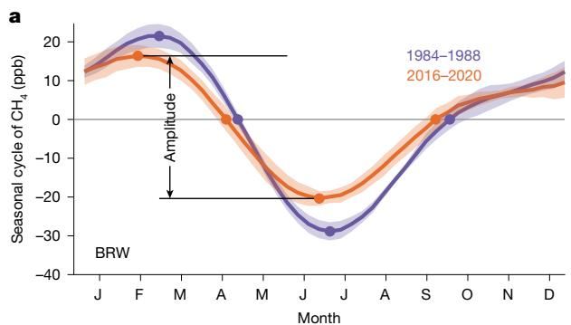

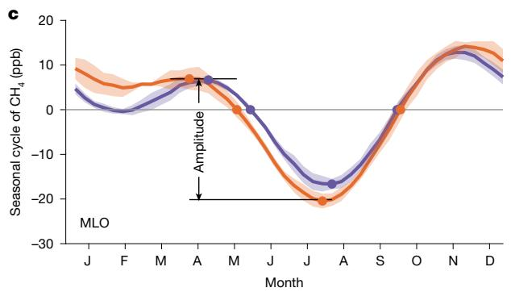

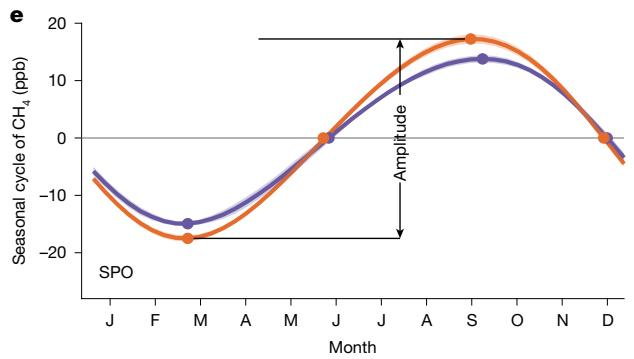  
Fig. 1 | Long-term changes in seasonal CH4 amplitude at Barrow, Mauna Loa and the South Pole. a,c,e, Seasonal cycle of $\mathrm { C H } _ { 4 }$ derived by singular spectrum analysis47 from the observations at BRW (a), MLO (c) and SPO (e) during the periods 1984–1988 and 2016–2020 and their peak-to-trough amplitude. The shaded area shows the standard deviation of the seasonal $\mathrm { C H } _ { 4 }$ cycle during each

## Attribution of the changes in CH4 SCA

Changes in the seasonal cycle of CH4 are controlled by emissions, the atmospheric OH sink and atmospheric transport (Supplementary Fig. 6a). For possible drivers of the observed changes in seasonal $\mathrm { C H } _ { 4 }$ amplitude, we hypothesized that, first, in northern high latitudes, wetlands have been exposed to a markedly changing climate over the past four decades, in particular the nearly $0 . 7 5 ^ { \circ } \mathrm { C }$ per decade warming since 1980 referred to as the Arctic amplification26, along with an increase in Arctic precipitation (about $4 . 5 \% ^ { \circ } \mathsf { C } ^ { - 1 }$ of the Arctic mean temperature increase27). These warmer and wetter wetlands may increase $\mathrm { C H } _ { 4 }$ emissions, leading to higher summer $\mathrm { C H } _ { 4 }$ concentrations7,8,15,28,29 and resulting in a lower seasonal $\mathrm { C H } _ { 4 }$ amplitude by counteracting the seasonal $\mathrm { C H } _ { 4 }$ minimum caused by sink removal (Supplementary Fig. 6a). Furthermore, increases in boreal wildfire emissions during the peak fire season in summer30,31 could also lead to a lower $\mathrm { C H } _ { 4 }$ SCA in the northern high latitudes (Supplementary Fig. 6). Second, in northern mid- and low-latitude regions (south of $6 0 ^ { \circ } \ N )$ , a decrease in the SCA of emissions south of $\mathbf { 6 0 ^ { \circ } }$ N (Supplementary Fig. 7) could explain the observed increasing $\mathrm { C H } _ { 4 } { \thinspace \mathsf { S C A } }$ . Moreover, an increase in the $\mathrm { C H } _ { 4 }$ sink, simply owing to increasing CH4 concentrations and/or to higher OH concentrations in summer, could also cause a higher seasonal CH4 amplitude (Supplementary Fig. 6a). Third, atmospheric transport can further attenuate or enhance site observations of the SCA. An increase in summer $\mathrm { C H } _ { 4 }$ transport to the northern subtropics from higher latitudes could lead to an increase in the SCA in the north and a coincident decrease farther south (Supplementary Fig. 6a).

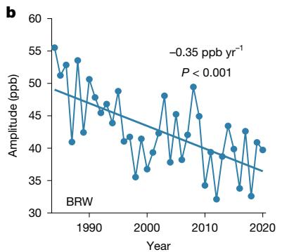

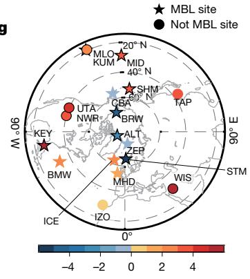

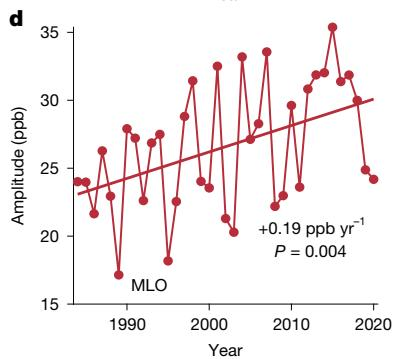

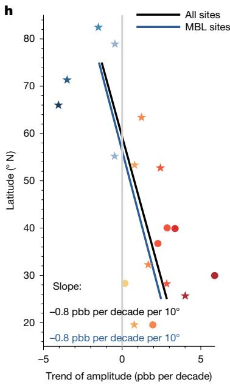

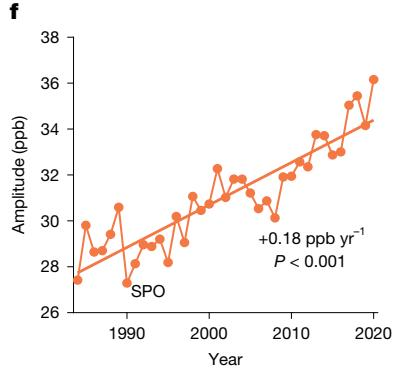  
5-year period. b,d,f, Long-term trends of seasonal CH4 amplitude at BRW (b), MLO (d) and SPO (f). g,h, The trends of seasonal $\mathrm { C H } _ { 4 }$ amplitude at 18 sites north of MLO in the Northern Hemisphere (g) and their latitudinal gradient (unit, ppb per decade per 10° latitude; h). MBL, marine boundary layer. Abbreviations of the 18 sites are detailed in Supplementary Table 1.

To test these mechanisms and quantitatively attribute the observed trends of seasonal $\mathrm { C H } _ { 4 }$ amplitude over the past four decades, we simulated atmospheric $\mathrm { C H _ { \ell } }$ 4 using the Goddard Earth Observing System with Chemistry (GEOS-Chem) 3D atmospheric transport model32 (Methods and Supplementary Figs. 7–10). Our simulation, with time-varying emissions, sinks and transport (T1), shows a good match to the observed atmospheric $\mathrm { C H } _ { 4 }$ concentrations and annual growth rates (Supplementary Figs. 11 and 12), including the 1999–2006 $\mathrm { C H } _ { 4 }$ plateau. Our T1 simulation also reproduces the observed trends and interannual variability of the SCA at BRW, MLO and SPO (−0.39 [−0.57 to −0.22] ppb $\mathsf { y } \mathsf { r } ^ { - 1 }$ at BRW; 0.14 [0.03–0.24] ppb $\mathsf { y r } ^ { - 1 }$ at MLO; 0.14 [0.11–0.16] ppb $\mathsf { y } \mathsf { r } ^ { - 1 }$ at $\mathsf { S P O ; }$ Extended Data Fig. 1). In addition to reproducing the contrasting trends in the SCA at BRW and MLO, our simulated SCA trends also match observations from the 18 sites $\begin{array} { r } { ( r = 0 . 7 7 ; \mathsf { F i g . } } \end{array}$ . 2a) and capture the observed latitudinal gradient of decreasing SCA trends with increasing latitude (Fig. 2b and Supplementary Fig. 13). This evaluation suggests that our simulation set-up can be used to further attribute the trends of the SCA.

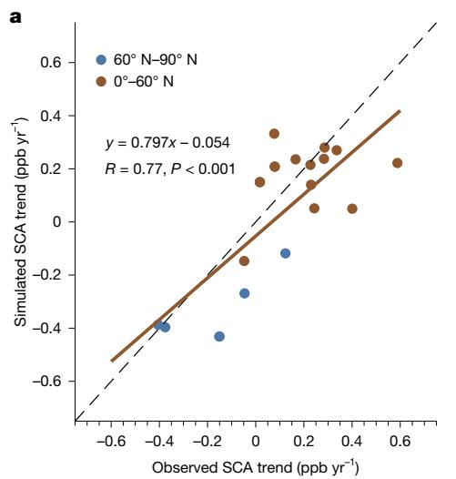

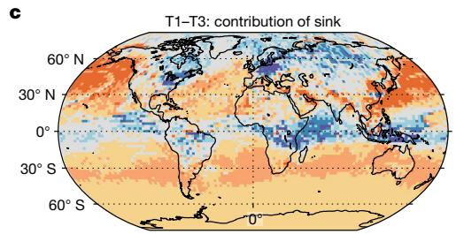

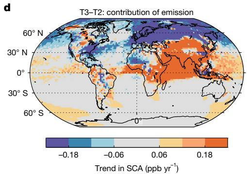  
Fig. 2 | Attribution of changes in seasonal CH4 amplitude. a,b, Observed and simulated trends of the seasona $\mathrm { C H } _ { 4 }$ amplitude at 18 NOAA sites (a) and the latitudinal gradients of amplitude trends in the Northern Hemisphere from three simulations (T1 with all input variables, T2 with emissions and sink fixed at their levels in 1984, and T3 with variable emissions but sink fixed at its value in 1984) with OH concentrations from INCA (b). The median latitudinal gradients of these amplitude trends (solid lines) are shown with 90% confidence intervals (shaded area) by considering the uncertainty of the amplitude trend

To separate the contributions of emission, sink and transport to the CH4 SCA trends, we performed two factorial experiments (T2, monthly emissions and monthly OH sink held constant at their 1984 values; T3, variable emissions and constant OH sink, again, held at the 1984 value; Supplementary ${ \mathrm { F i g . } }$ 6 and Methods). Sampling the simulations of the factorial experiments at the sites shows that it is the increase of $\mathrm { C H } _ { 4 }$ emissions that dominates the decreasing SCA trend in northern high latitudes. In contrast, it is the increase of the OH sink that explains the increased amplitude in the tropics and the Southern Hemisphere (Fig. 2b,e). In terms of the spatial pattern of the trends in SCA, we find that the increased OH sink has resulted in an increase of the SCA over 73% of the surface area (Fig. 2c and Supplementary Fig. 14). However, changes of emissions contributed to both increases and decreases in the SCA, but with regional differences, leading to a decrease in the SCA in northern high latitudes and an increase in Asia, the Bay of Bengal and the Arabian Sea (Fig. 2c and Supplementary Figs. 13 and 14). The contributions of emissions and sink to the tropospheric SCA trends show similar spatial patterns to those simulated at the surface (Supplementary Figs. 15 and 16).

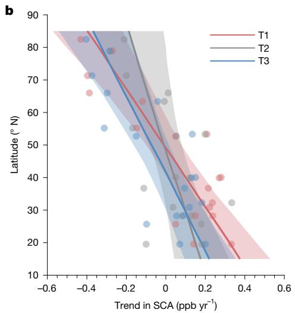

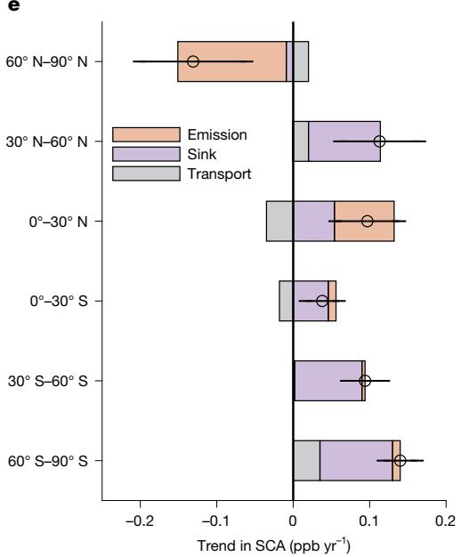  
at each site $_ { ( n = 1 , 0 0 0 ) }$ . c,d, The spatial pattern of contributions of sink (c) and emission (d) to the trend in surface-level $\mathbf { C H _ { 4 } S C A . e }$ , The contributions of emission, sink and atmospheric transport to the trend in tropospheric average $\mathrm { C H } _ { 4 } \mathrm { S C A i n } 1 9 8 4$ –2020 for six latitudinal bands. The dots represent the trends of tropospheric average CH SCA in 1984–2020 for 6 latitudinal bands in the T1 simulation and the error bars represent 95% confidence intervals of the estimated trends.

At northern high latitudes $( 6 0 ^ { \circ } \mathsf { N } { - } 9 0 ^ { \circ } \mathsf { N } )$ , the tropospheric SCA from our simulations show a decreasing trend of −0.13 [−0.20 to −0.06] ppb $\mathsf { y r } ^ { - 1 }$ (Fig. 2e), mainly as a result of increased emissions (−0.14 ppb $\mathsf { y r } ^ { - 1 } )$ . In the northern tropics $( 0 ^ { \circ _ { . } }$ –30°N, 0.10 [0.06–0.14] ppb yr−1), the tropospheric SCA increase is explained by both increasing emissions (0.08 ppb $\mathsf { y r } ^ { - 1 } )$ and by the increasing sink (0.05 ppb $\mathsf { y r } ^ { - 1 } )$ , with more OH in summer deepening the seasonal minimum of $\mathrm { C H } _ { 4 } .$ . Elsewhere, it is the increase of the sink driven by both higher OH and increasing atmospheric $\mathrm { C H } _ { 4 }$ that explains the increase of the SCA (0.05–0.10 ppb yr−1; 68–121%; Fig. 2e and Supplementary Figs. 15 and 16). Variations in atmospheric transport can explain only a small part of the SCA trends (Fig. 2e). These results are also supported by the simulations driven by an alternative OH concentration field from GEOS-Chem, in which the decrease of SCA in northern high latitudes (−0.05 [−0.12 to 0.02] ppb $\mathsf { y r } ^ { - 1 } )$ are dominated by the emissions (−0.12 ppb yr−1) and the increase of SCA in other regions (0.05–0.17 ppb $\mathsf { y r } ^ { - 1 } )$ could be explained by the enhanced OH sink (0.05–0.16 ppb yr−1; 58–100%; Supplementary Fig. 13). Therefore, on the basis of the factorial experiments, we conclude that, over the past four decades, the decreasing trend of the SCA in northern high latitudes is mainly explained by an increase of natural emissions, whereas the increasing SCA in northern mid–low latitudes and the Southern Hemisphere is mainly explained by an increase of the sink.

## Increase of natural emissions

In the northern high latitudes $( 6 0 ^ { \circ } \mathsf { N } { - } 9 0 ^ { \circ } \mathsf { N } )$ , our simulations show that the decrease of the SCA (Fig. 2e) is explained both by increased emissions from wetland (−0.07 ppb $\mathsf { y r } ^ { - 1 }$ ; Supplementary Fig. 9 and Extended Data Fig. 2) and biomass burning (−0.04 ppb $\mathsf { y r } ^ { - 1 } ;$ Supplementary Fig. 8), whereas anthropogenic emissions (−0.01 ppb $\mathsf { y r } ^ { - 1 }$ Supplementary Fig. 7) and the interaction between atmospheric transport and emissions $( \mathsf { I A T } _ { \mathsf { E } } ; - 0 . 0 2$ ppb $\mathsf { y r } ^ { - 1 } .$ ; Extended Data Fig. 2 and Methods) make only minor contributions to the trends in SCA. The widespread decreasing trends of the SCA found in the observations and the simulations in the northern high latitudes imply an increase in wetland and fire emissions there. In the northern high latitudes, recent studies highlight that fire emissions have increased by $1 0 1 \pm 2 8 \%$ (± standard deviation, hereinafter) since 1984 (historic global biomass burning emissions for CMIP6, $\mathsf { B B 4 C M I P } ^ { 3 3 } )$ ), and increased unprecedentedly in recent years30,31. The inferred increase in wetland emissions in our study is consistent with inversions from the Copernicus Atmosphere Monitoring Service $( \mathbf { C A M S } ) ^ { 3 4 }$ , which show an increase in optimized wetland emissions in the northern high latitudes since 1984 (0.08 ± 0.02 $\mathrm { \Delta I g C H _ { 4 } y r ^ { - 2 } }$ or $0 . 5 1 { \pm } 0 . 1 0 \% \mathrm { y r ^ { - 1 } }$ $P { < } 0 . 0 0 1$ ; Supplementary Fig. 9), close to estimates from process-based model Organising Carbon and Hydrology In Dynamic Ecosystems (ORCHIDEE7,28; 0.07 ± 0.01 TgCH4 $\mathsf { y r } ^ { - 2 }$ or 0.44 ± 0.09% yr−1 $; P { < } 0 . 0 0 1 )$ and from a causality-guided machine-learning model9 (0.09 TgCH $\cdot \mathbf { y } \mathbf { r } ^ { - 2 } ,$ ${ \cal P } { = } 0 . 0 1 7$ , since 2002). Both inversion-based and process-based models give an increase in the seasonal amplitude of May–September emissions (Supplementary Fig. 9), thus a decrease in the SCA. In April, May and June during the past four decades, the high-latitude wetlands were exposed to a warming of nearly ${ \bf \nabla } ^ { 2 } ^ { \circ } { \bf C }$ , accompanied by an 11% increase of precipitation (Supplementary Figs. 17 and 18). Meanwhile, with increased precipitation, soil moisture and soil temperature (Supplementary Fig. 18), a 25.6% expansion of wetland area, from April to June, in the northern high latitudes, has been modelled35,36. This increase of wetland area is confirmed by two independent satellite-based prod-$\mathbf { u c t s } ^ { 3 7 , 3 8 }$ (Supplementary Fig. 19). Together with the warming, this observed expansion of Arctic wetland area suggests that an increase in Arctic wetland emissions is expected. Interestingly, we found that surface air temperature over the high-latitude wetlands shows significantly negative correlations with the average seasonal $\mathrm { C H } _ { 4 }$ amplitude $( r = - 0 . 3 7 , P = 0 . 0 2 6 )$ over 5 ground-based sites (Extended Data Fig. 3), further indicating that the increase in wetland emissions, driven by a warmer and wetter climate, is the dominant factor for decreasing $\mathrm { C H } _ { 4 }$ amplitude trends north of ${ \bf 6 0 ^ { \circ } N . }$

Wetland emissions in the northern mid-latitudes $( 3 0 ^ { \circ } \mathsf { N } \cdot$ –60° N) have also increased and have also contributed to the decreasing trend in the SCA there, but are offset by the decreasing anthropogenic emission amplitude (Supplementary Fig. 7 and Extended Data Fig. 2). Meanwhile, the seasonal amplitude of $\mathrm { C H } _ { 4 }$ at MLO and SPO shows a negative and non-significant correlation with the seasonal amplitude of temperature and precipitation over tropical wetlands (Supplementary Fig. 20). The seasonal cycle of tropical wetland precipitation and soil moisture shows little change, as does the seasonal cycle of fire emissions (Supplementary Figs. 8, 21 and 22), suggesting that the changes in seasonal $\mathrm { C H } _ { 4 }$ amplitude at MLO and SPO may not be significantly explained by wetland or fire emissions in the tropics, but rather by an increasing $\mathrm { C H } _ { 4 }$ sink and/or by remote emissions or sinks associated with atmospheric transport (Fig. 2c,d and Supplementary Fig. 13c,d).

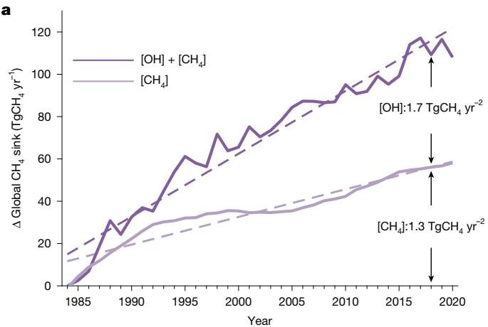

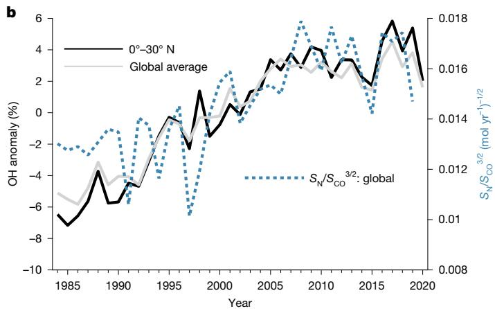  
Fig. 3 | The anomaly in tropospheric OH concentration and index of globa $\mathbf { N O } _ { x }$ and CO emissions. a, The increase of the global $\mathrm { C H } _ { 4 }$ sink since 1984, estimated by GEOS-Chem simulations, and the contributions of CH4 concentration and OH concentration. b, The anomaly in tropospheric OH concentration from INCA, a full atmospheric chemistry model. The grey and black lines show global and $0 ^ { \circ . }$ –30° N averages, respectively. A simple proxy index, $S _ { \mathrm { { N } } } / { S _ { \mathrm { { C O } } } } ^ { 3 / 2 }$ , for tropospheric OH concentration is also shown43, where $S _ { \mathrm { { N } } }$ and $S _ { \mathrm { { C O } } }$ are the sources of $\mathsf { N O } _ { x }$ and CO, respectively.

## Redistribution of anthropogenic emissions

Our simulations show that changes of emissions have also affected the SCA trend in the tropics (Fig. 2), especially in East Asia, South Asia and the Indian Ocean (Fig. 2d). In these regions, the anthropogenic $\mathrm { C H } _ { 4 }$ emissions show a substantial increasing trend owing to rapid demographic and industrial expansion over the past four decades (Extended Data Fig. 4). Quantitatively, in the northern tropics, 80% (0.08 [0.05–0.10] ppb $\mathsf { y r } ^ { - 1 } )$ ) of the increase in $\mathrm { C H } _ { 4 } { \thinspace \thinspace } S { \bf C A }$ can be attributed to emissions. Moreover, in this region, the decrease in the seasonal amplitude of $\mathrm { C H } _ { 4 }$ emissions contributed only 0.02 [0.01–0.03] ppb $\mathsf { y r } ^ { - 1 }$ (22%) to the increase in the SCA (Fig. 2 and Extended Data Fig. 2), leaving a large part (0.06 [0.03–0.08] ppb $\mathsf { y r } ^ { - 1 } )$ of the contribution from emissions unaccounted for. This residual contribution from emissions is related to the interactions between atmospheric transport and emissions $( \mathrm { I A T } _ { \mathrm { E } } )$ Methods). As anthropogenic $\mathrm { C H } _ { 4 }$ emissions decreased in Europe but increased in the tropics, the gravity centre of anthropogenic $\mathrm { C H } _ { 4 }$ emissions has shifted southwards from 27.1° N to $2 3 . 0 ^ { \circ }$ N since 1984 (Extended Data Fig. 4). This southwards shift of anthropogenic $\mathrm { C H } _ { 4 }$ emissions induces more emissions in the Intertropical Convergence Zone regions, and then more transport of these anthropogenic emissions in summer than in other seasons. In winter (November, December and January), the Intertropical Convergence Zone moves into the southern tropics, and the southwards shift of anthropogenic emissions remains in the northern tropics. Thus, this contributes to a higher SCA (higher winter concentration and lower summer concentration) in the northern tropics. It is noted that both the seasonal cycle and the spatial distribution (for example, abandoned and new oil, gas and coal sites) of anthropogenic emissions have large uncertainty6,15,32, and their contributions to the trend in SCA require further investigation.

## Increase in tropospheric OH concentration

The observations at the SPO site (90.0° S) reveal an increase in the SCA (0.18 [0.15–0.22] ppb yr−1, P < 0.001; Fig. 1). As emissions have a small role in the SCA at southern high latitudes (Extended Data Fig. 2 and 5), these observations suggest an increase in the sink5 . A further suggestion of a sink increase comes from the results of the constant sink (1984 value) simulation. In this simulation (T3), the increase in SCA is substantially underestimated at 12 out of the 13 subtropical and tropical sites compared with the results of the T1 simulation (Fig. 2b), implying that the $\mathrm { C H } _ { 4 }$ sink must have increased during the past four decades. Our T1 simulation shows that, since 1984, the global $\mathrm { C H } _ { 4 }$ sink forced by the OH concentration field from the Laboratoire de Météorologie Dynamique general circulation model (LMDZ) and Interaction with Chemistry and Aerosols (INCA) has increased by 3.0 [2.7–3.2] TgCH4 $\mathsf { y r } ^ { - 2 }$ (Fig. 3a), consistent with the sink forced by the GEOS-Chem OH concentration (2.7 [2.5—2.8] $\mathsf { T g C H } _ { 4 } \mathsf { y r } ^ { - 2 } ;$ Supplementary Fig. 23): an increase contributed by enhanced OH concentration (55–56%) and increasing $\mathrm { C H } _ { 4 }$ concentration (44–45%). Both atmospheric chemistry models (LMDZ-INCA and GEOS-Chem) used in this study simulate an approximately 10% increase in tropospheric OH from 1984 to 2020 (Fig. 3b and Supplementary Figs. 10 and 24), values close to those from Earth system models (about 11%; Extended Data Fig. 6 and Supplementary Fig. 25) in the Aerosol Chemistry Model Intercomparison Project39 (AerChemMIP). This increase in OH concentration is also confirmed by atmospheric methyl chloroform inversion, which, after some bias corrections, suggests a 4.0% increase of global OH concentration during $1 9 9 4 - 2 0 1 4 ^ { 1 0 }$ (Supplementary Fig. 10), supporting the increase in global OH concentration simulated by the full atmospheric chemistry models (LMDZ-INCA, 4.8%; GEOS-Chem, 6.1%; the University of Oslo chemistry-transport model, OsloCTM311, 5.5%; Supplementary Fig. 10). As the trend in tropospheric OH concentration is mainly driven by historical emissions of carbon monoxide (CO) and nitrogen oxides $( \mathsf { N O } _ { x } ) ^ { 4 0 - 4 2 }$ , here, we apply a simple emission proxy $S _ { \mathrm { { N } } } / { S _ { \mathrm { { C O } } } } ^ { 3 / 2 }$ for tropospheric OH concentration43 (where $S _ { \mathrm { { N } } }$ and $S _ { \mathrm { c o } }$ are the sources of $\mathsf { N O } _ { x }$ and $\mathbf { C O } ,$ respectively). We find a positive trend of global $S _ { \mathrm { { N } } } / S _ { \mathrm { { C O } } } { } ^ { 3 / 2 }$ and a significant correlation between $S _ { \mathrm { { N } } } / { S _ { \mathrm { { C O } } } } ^ { 3 / 2 }$ and the tropospheric OH concentration (r = 0.76, P < 0.001; Fig. 3b and Supplementary Fig. 26). The increase of tropospheric OH concentration since the 1980s could result from the fast-increasing anthropogenic NOx emissions from Asia and decreasing CO emissions44.

Furthermore, as well as contributing to the increase in the SCA of $\mathrm { C H } _ { 4 } ,$ the increase in OH concentration would also be expected to lead to an increase in the SCA of other gases oxidized primarily by OH. We selected the gas dichloromethane $\left( \mathrm { C H } _ { 2 } \mathbf { C l } _ { 2 } \right)$ to test this assumption, because its seasonal cycle is mainly controlled by OH oxidation45 and it has been observed in the atmosphere for more than 20 years. We find that the seasonal amplitude of CH $\mathbf { \boldsymbol { \mathbf { \mathit { \Sigma } } } } _ { \Sigma } \mathbf { \boldsymbol { C } } \mathbf { \boldsymbol { l } } _ { 2 }$ has increased at the tropical sites MLO and Cape Kumukahi (KUM) during the past two decades (Supplementary Fig. 27), similarly to the increased trend in $\mathrm { C H } _ { 4 } { \thinspace \thinspace } S { \bf C A }$ The positive correlations between the interannual variabilities of the $\mathrm { C H } _ { 4 }$ amplitude and the $\mathrm { C H } _ { 2 } \mathrm { C l } _ { 2 }$ amplitude at MLO $( r = 0 . 5 0 – 0 . 6 1$

P = 0.003—0.023) and KUM (r = 0.39–0.48, P = 0.046–0.112; Supplementary Fig. 27) further suggest that the increasing trends in SCA of these gases are both probably driven by changes in the OH sink (for example, the increase of OH concentration), and less by emissions, as their emission sources and their spatial distributions are different45. A detailed discussion for the changes in the SCA of other trace gases (for example, methyl chloroform and hydrofluorocarbons) is provided in Supplementary Information.

In summary, the observations of CH4 SCA show intriguing decreasing trends in northern high latitudes and increasing trends in mid–low latitudes that provide clues on long-term changes in the global $\mathrm { C H } _ { 4 }$ budget. The changes in the SCA observed at different latitudes have different explanations. We find that the decrease of the SCA in northern high latitudes is mainly driven by enhanced wetland emissions, owing to the warmer and wetter climate there. As the wetland emissions are crucial for reproducing the observed seasonal variations of methane46, a comprehensive evaluation of the wetland emissions (for example, spatial distribution, trends and seasonal variations) will be helpful for understanding the changes in the SCA of CH4. In Asia, the Bay of Bengal and the Arabian Sea, our results suggest that a major driver of the large increase in CH4 amplitude involves the interactions of the equatorwards redistribution of anthropogenic CH4 emissions with atmospheric transport. Lastly, from the northern mid-latitudes (with the exception of the areas mentioned above) to the Antarctic, the increase of the SCA is dominated by an enhanced $\mathrm { C H } _ { 4 }$ sink. This enhanced sink is mainly contributed by a positive trend of tropospheric OH concentration, most likely owing to the increase in anthropogenic $\mathsf { N O } _ { x }$ x emissions and decrease in CO emissions. With a continuing long-term warming trend and the reduction of air-pollutant emissions (for example, NOx) over the next few decades, both positive climate feedback from northern high-latitude wetlands and a lower OH concentration would lead to a higher growth rate of atmospheric CH . Thus, our study highlights the need for further anthropogenic $\mathrm { C H } _ { 4 }$ emissions reductions to stabilize and reduce the atmospheric $\mathrm { C H } _ { 4 }$ concentration to achieve the goal of the Paris Agreement.

## Online content

Any methods, additional references, Nature Portfolio reporting summaries, source data, extended data, supplementary information, acknowledgements, peer review information; details of author contributions and competing interests; and statements of data and code availability are available at https://doi.org/10.1038/s41586-025-08900-8.

1. IPCC Climate Change 2013: The Physical Science Basis (eds Stocker, T. F. et al.) (Cambridge Univ. Press, 2013).

Rubino, M. et al. Revised records of atmospheric trace gases CO2, CH4, N2O, and δ13C-CO2 over the last 2000 years from Law Dome, Antarctica. Earth Syst. Sci. Data 11, 473–492 (2019).

3. Mitchell, L., Brook, E., Lee, J. E., Buizert, C. & Sowers, T. Constraints on the late Holocene anthropogenic contribution to the atmospheric methane budget. Science 342, 964–966 (2013).

4. Dlugokencky, E. J., Nisbet, E. G., Fisher, R. & Lowry, D. Global atmospheric methane: budget, changes and dangers. Phil. Trans. R. Soc. A 369, 2058–2072 (2011).

5. Dlugokencky, E. J., Masarie, K. A., Tans, P. P., Conway, T. J. & Xiong, X. Is the amplitude of the methane seasonal cycle changing? Atmos. Environ. 31, 21–26 (1997).

6. Dowd, E. et al. Decreasing seasonal cycle amplitude of methane in the northern high latitudes being driven by lower-latitude changes in emissions and transport. Atmos. Chem. Phys. 23, 7363–7382 (2023).

Peng, S. et al. Wetland emission and atmospheric sink changes explain methane growth in 2020. Nature 612, 477–482 (2022).

8. Zhang, Z. et al. Recent intensification of wetland methane feedback. Nat. Clim. Change 13, 430–433 (2023).

Yuan, K. et al. Boreal–Arctic wetland methane emissions modulated by warming and vegetation activity. Nat. Clim. Change 14, 282–288 (2024).

10. Naus, S. et al. Constraints and biases in a tropospheric two-box model of OH. Atmos. Chem. Phys. 19, 407–424 (2019).

11. Skeie, R. B., Hodnebrog, Ø. & Myhre, G. Trends in atmospheric methane concentrations since 1990 were driven and modified by anthropogenic emissions. Commun. Earth Environ. 4, 317 (2023).

12. Lan, X., Thoning, K. W. & Dlugokencky, E. J. Trends in globally-averaged $\mathrm { C H } _ { 4 } , \mathsf { N } _ { 2 } \mathsf { O } ,$ and SF6 determined from NOAA Global Monitoring Laboratory measurements. Version 2024-06. NOAA Global Monitoring Laboratory https://doi.org/10.15138/P8XG-AA10 (2024).

13. Dlugokencky, E. J. et al. Atmospheric methane levels off: temporary pause or a new steady-state? Geophys. Res. Lett. 30, 1992 (2003).

14. Nisbet, E. G. et al. Very strong atmospheric methane growth in the 4 years 2014–2017: implications for the Paris Agreement. Glob. Biogeochem. Cycles 33, 318–342 (2019).

15. Saunois, M. et al. The global methane budget 2000–2017. Earth Syst. Sci. Data 12, 1561–1623 (2020).

16. Lan, X. et al. Improved constraints on global methane emissions and sinks using δ13C-CH4. Glob. Biogeochem. Cycles 35, e2021GB007000 (2021).

17. Schaefer, H. et al. A 21st-century shift from fossil-fuel to biogenic methane emissions indicated by 13CH4. Science 352, 80–84 (2016).

18. Turner, A. J., Frankenberg, C., Wennberg, P. O. & Jacob, D. J. Ambiguity in the causes for decadal trends in atmospheric methane and hydroxyl. Proc. Natl Acad. Sci. USA 114, 5367–5372 (2017).

19. Basu, S. et al. Estimating emissions of methane consistent with atmospheric measurements of methane and δ13C of methane. Atmos. Chem. Phys. 22, 15351–15377 (2022).

20. Keeling, C. D., Chin, J. F. S. & Whorf, T. P. Increased activity of northern vegetation inferred from atmospheric CO measurements. Nature 382, 146–149 (1996).

21. Graven, H. D. et al. Enhanced seasonal exchange of CO2 by northern ecosystems since 1960. Science 341, 1085–1089 (2013).

22. Zeng, N. et al. Agricultural Green Revolution as a driver of increasing atmospheric CO2 seasonal amplitude. Nature 515, 394–397 (2014).

23. Forkel, M. et al. Enhanced seasonal CO2 exchange caused by amplified plant productivity in northern ecosystems. Science 351, 696–699 (2016).

24. Thoning, K. W., Tans, P. P. & Komhyr, W. D. Atmospheric carbon dioxide at Mauna Loa Observatory: 2. Analysis of the NOAA GMCC data, 1974–1985. J. Geophys. Res. Atmos. 94, 8549–8565 (1989).

25. McKain, K. et al. NOAA Global Greenhouse Gas Reference Network Flask-Air PFP Sample Measurements of CO , CH , CO, N O, H , SF and isotopic ratios collected from aircraft vertical profiles [Data set]. Version: 2023-08-11. NOAA Global Monitoring Laboratory https://doi.org/10.15138/39HR-9N34 (2023).

26. Rantanen, M. et al. The Arctic has warmed nearly four times faster than the globe since 1979. Commun. Earth Environ. 3, 168 (2022).

27. Bintanja, R. et al. Strong future increases in Arctic precipitation variability linked to poleward moisture transport. Sci. Adv. 6, eaax6869 (2020).

28. Lin, X. et al. Recent methane surges reveal heightened emissions from tropical inundated areas. Nat. Commun. 15, 10894 (2024).

29. Koffi, E. N., Bergamaschi, P., Alkama, R. & Cescatti, A. An observation-constrained assessment of the climate sensitivity and future trajectories of wetland methane emissions. Sci. Adv. 6, eaay4444 (2020).

30. Descals, A. et al. Unprecedented fire activity above the Arctic Circle linked to rising temperatures. Science 378, 532–537 (2022).

31. Zheng, B. et al. Record-high CO emissions from boreal fires in 2021. Science 379, 912–917 (2023).

32. Shen, L. et al. National quantifications of methane emissions from fuel exploitation using high resolution inversions of satellite observations. Nat. Commun. 14, 4948 (2023).

33. van Marle, M. J. E. et al. Historic global biomass burning emissions for CMIP6 (BB4CMIP) based on merging satellite observations with proxies and fire models (1750–2015). Geosci. Model Dev. 10, 3329–3357 (2017).

34. Segers, A., Steinke, T. & Houweling, S. Description of the CH4 Inversion Production Chain, CAMS (Copernicus Atmospheric Monitoring Service) Report (2022); https://atmosphere. copernicus.eu/sites/default/files/2022-10/CAMS255\_2021SC1\_D55.5.2.1-2021CH4\_202206\_ production\_chain\_CH4\_v1.pdf.

35. Xi, Y., Peng, S., Ciais, P. & Chen, Y. Future impacts of climate change on inland Ramsar wetlands. Nat. Clim. Change 11, 45–51 (2021).

36. Xi, Y. et al. Gridded maps of wetlands dynamics over mid-low latitudes for 1980–2020 based on TOPMODEL. Sci. Data 9, 347 (2022).

37. Bernard, J. et al. Assessing the time variability of GIEMS-2 satellite-derived surface water extent over 30 years. Front. Remote Sens. https://doi.org/10.3389/frsen.2024.1399234 (2024).

38. Zhang, X. et al. Global annual wetland dataset at 30 m with a fine classification system from 2000 to 2022. Sci. Data 11, 310 (2024).

39. Collins, W. J. et al. AerChemMIP: quantifying the effects of chemistry and aerosols in CMIP6. Geosci. Model Dev. 10, 585–607 (2017).

40. Zhao, Y. et al. On the role of trend and variability in the hydroxyl radical (OH) in the global methane budget. Atmos. Chem. Phys. 20, 13011–13022 (2020).

41. Stevenson, D. S. et al. Trends in global tropospheric hydroxyl radical and methane lifetime since 1850 from AerChemMIP. Atmos. Chem. Phys. 20, 12905–12920 (2020).

42. IPCC Climate Change 2021: The Physical Science Basis (eds Masson-Delmotte, V. et al.) (Cambridge Univ. Press, 2021).

43. Wang, Y. & Jacob, D. J. Anthropogenic forcing on tropospheric ozone and OH since preindustrial times. J. Geophys. Res. Atmos. 103, 31123–31135 (1998).

44. McDuffie, E. E. et al. A global anthropogenic emission inventory of atmospheric pollutants from sector- and fuel-specific sources (1970–2017): an application of the Community Emissions Data System (CEDS). Earth Syst. Sci. Data 12, 3413–3442 (2020).

45. Claxton, T. et al. A synthesis inversion to constrain global emissions of two very short lived chlorocarbons: dichloromethane, and perchloroethylene. J. Geophys. Res. Atmos. 125, e2019JD031818 (2020).

46. East, J. D. et al. Interpreting the seasonality of atmospheric methane. Geophys. Res. Lett. 51, e2024GL108494 (2024).

47. Vautard, R., Yiou, P. & Ghil, M. Singular-spectrum analysis: a toolkit for short, noisy chaotic signals. Physica D 58, 95–126 (1992).

Publisher’s note Springer Nature remains neutral with regard to jurisdictional claims in published maps and institutional affiliations.

Springer Nature or its licensor (e.g. a society or other partner) holds exclusive rights to this article under a publishing agreement with the author(s) or other rightsholder(s); author self-archiving of the accepted manuscript version of this article is solely governed by the terms of such publishing agreement and applicable law.

© The Author(s), under exclusive licence to Springer Nature Limited 2025

## Methods

Analysis of seasonal $\mathbf { C H } _ { 4 }$ cycles from observations of atmospheric $\mathbf { C H } _ { 4 }$ concentration

NOAA ground-based observations. To explore the long-term changes of seasonal CH4 cycles, we used atmospheric CH4 mole fraction records from BRW, MLO and SPO, as these three sites all have long-term, 8-day, flask data available since 1984. The data are publicly available from the Global Monitoring Division of NOAA’s Earth System Research Laboratory12,48 (https://gml.noaa.gov/ccgg/trends\_ch4).

For the analysis of long-term trends in seasonal CH4 amplitude, we selected sites with data covering at least 25 years (Supplementary Table 1), with each year having at least 23 8-day flasks (without missing data, there are 46 8-day flasks in a year), to determine a reliable seasonal cycle of $\mathrm { C H } _ { 4 }$ from a set of 96 NOAA sites. As a result, our analysis includes data from 27 sites (locations are shown in Supplementary Fig. 2), 20 of which are marine-boundary-layer sites. We applied frequency decomposition by singular spectrum analysis47 (SSA) to extract the seasonal cycle of $\mathrm { \Delta C H _ { 4 } }$ . To fulfil the requirement of the SSA method, we used the MissForest method49 to gap-fill missing values. As a non-parametric method, MissForest has been validated to outperform other methods of imputation, especially in data settings where nonlinear relationships are suspected. Here, the time series of 8-day flask $\mathrm { C H } _ { 4 }$ mole fraction for each site are decomposed into four frequency components: a high-frequency component (0–30 days), a subseasonal component (30–180 days), a seasonal component (180–420 days) and a long-term trend component (>420 days). The seasonal components (frequency 180–420 days) extracted by SSA are kept for the analysis of changes in the seasonal cycle. We also used the CCGCRV (a digital filtering curving fitting program developed by Carbon Cycle Group, NOAA) method for deriving the seasonal cycle of $\mathrm { C H } _ { 4 }$ at BRW, MLO and SPO (Supplementary Fig. 1). CCGCRV approximates the seasonal cycle by fitting a polynomial equation combined with the harmonic function24.

The seasonal amplitude is defined as the peak-to-trough of the seasonal cycles of $\mathrm { C H } _ { 4 } ,$ as shown in Fig. 1. The long-term trend in seasonal CH4 amplitude for each site is estimated by least-squares linear regression with time. The latitudinal gradient of trends in seasonal CH4 amplitude is estimated by least-squares linear regression between the trends in seasonal $\mathrm { C H } _ { 4 }$ amplitude at the 18 sites (sites north of MLO) and their latitudes. A discussion about the temporal and spatial gaps in the observation data is provided in Supplementary Information and Supplementary Figs. 28 and 29.

NOAA aircraft data. We also explored the changes of CH4 SCA by using NOAA observational aircraft data. The CH4 dry-air mole fractions used in this study were measured in air samples collected by the NOAA GML Carbon Cycle Aircraft Vertical Profile Network during aircraft campaigns since $1 9 9 2 ^ { 2 5 }$ . Most aircraft network flights collect 12 flask samples using an automated programmable flask package at different fixed altitude levels throughout the boundary layer to a maximum height of 8,000 m. We selected the data records from two layers (2,500–3,500 m and 4,500–5,500 m) for all sites since 1992. Owing to a lack of sufficient observations in northern high latitudes between 1992 and 2000 (a total of 31 records for 2,500–3,500 m and 46 records for 4,500–5,500 m), we compared the changes in SCA between 2001 and 2020. The locations of the aircraft observations are shown in Supplementary Fig. 3.

For both periods, all data recorded in the northern high latitudes were first interannually detrended using observations from BRW. The mid–low-latitude data were detrended using the observations from MLO. The average $\mathrm { C H } _ { 4 }$ cycles were then calculated by using two-harmonic fits. These average cycles were used to show the shape of the $\mathrm { C H } _ { 4 }$ cycle for three latitude bands $( 6 0 ^ { \circ } \mathsf { N } { - } 9 0 ^ { \circ } \mathsf { N } , 3 0 ^ { \circ } \mathsf { N } { - } 6 0 ^ { \circ } \mathsf { N }$ and $0 ^ { \circ } - 3 0 ^ { \circ } \ N )$

Anthropogenic $\mathbf { C H } _ { 4 }$ emissions, wetland emissions, fire emissions and tropospheric OH concentrations

We used the anthropogenic CH emissions from a joint product of the Emissions Database for Global Atmospheric Research $( \mathbf { \bar { E } D G A R } ) \mathbf { v } 7 . 0 ^ { 5 0 }$ and the Community Emissions Data System (CEDS) $2 0 2 1 ^ { 5 1 }$ , wetland CH4 emissions from a process-based wetland emission model, ${ \mathrm { O R C H I D E E } } ^ { 3 5 , 5 2 }$ fire emissions from BB4CMIP and the Global Fire Emissions Database (GFED) v4 $. 1 s ^ { 3 3 , 5 3 }$ , and tropospheric OH concentrations from two full atmospheric chemistry models, $\mathsf { L M D Z - I N C A } ^ { 5 4 , 5 5 }$ and GEOS-Chem56, as inputs for the forward simulations by GEOS-Chem $\mathsf { v } 1 4 . 1 . 0 ^ { 3 2 }$ (https:// wiki.seas.harvard.edu/geos-chem/index.php/GEOS-Chem\_14.1.0).

Global gridded anthropogenic $\pmb { \mathrm { c } } \pmb { \mathrm { h } } _ { 4 }$ emissions. Both updated EDGAR $\mathbf { v } 7 . 0 ^ { 5 0 }$ and $\mathsf { C E D S } 2 0 2 1 ^ { 5 1 } \mathsf { C H } _ { 4 }$ emission inventories were used to derive monthly gridded anthropogenic $\mathrm { C H } _ { 4 }$ emissions. The updated EDGAR $\mathbf { v } 7 . 0$ data were first corrected by the national greenhouse gas inventories reported to the United Nations Framework Convention on Climate Change during 2019–2020 from the 42 Annex-I countries. For the year 2020, for countries other than China, we also collected activity data from the Food and Agriculture Organization and the International Energy Agency to correct emissions in 2020. For China, anthropogenic $\mathrm { C H } _ { 4 }$ emissions in 2020 were corrected by activity data collected from Chinese national statistic books (China Statistical Yearbook $2 0 2 1 ) ^ { 5 7 } .$ In addition, as CEDS includes only data up to the year 2019, we used the ratio of total emissions between 2020 and 2019 in the updated EDGAR v7.0 to infer the total emissions in 2020 for CEDS. Then, for both EDGAR and CEDS, we grouped the CH4 emissions from different sectors into four main sectors: agriculture, energy, waste and other. In both inventories, we noticed an abrupt change in the spatial pattern of $\mathrm { C H } _ { 4 }$ emissions from the energy sector before and after 2010 (Supplementary Fig. 7), which could be an artefact of interpolating the national total by two spatial patterns before and after 2010. Thus, we assume that, after 2010, the spatial distribution of $\mathrm { C H } _ { 4 }$ emissions from the energy sector remained the same as that in 2010. Finally, we combined the global annual total emissions from CEDS 2021, and the seasonal distribution and spatial pattern of emissions from each sector in EDGAR v7.0 to produce our joint anthropogenic emission product (Supplementary Fig. 7) for use as input to GEOS-Chem.

Wetland $\mathbf { c H _ { 4 } }$ emissions simulated by ORCHIDEE, LPJ and CAMS. We used a process-based wetland emission model ORCHIDEE-MICT35,52 to simulate global wetland $\mathrm { C H } _ { 4 }$ emissions. ORCHIDEE-MICT simulates $\mathrm { C H _ { 4 } }$ production and transportation to the atmosphere through diffusion, ebullition and plant transportation. We used hourly climate data from Modern-Era Retrospective analysis for Research and Applications version $2 ( \mathrm { M E R R A } { \cdot } 2 ) ^ { 5 8 }$ from 1984 to 2020, with a spatial resolution of $0 . 5 ^ { \circ } \times 0 . 6 2 5 ^ { \circ }$ , and monthly precipitation from Multi-Source Weighted-Ensemble Precipitation59,60 (MSWEP) v2.8. We resampled the climate datasets (air temperature, precipitation, humidity, downwards shortwave and longwave radiation, surface air pressure, and wind speed) to a $1 ^ { \circ } \times 1 ^ { \circ }$ resolution to drive ORCHIDE-MICT. The wetland-area dynamics were simulated by a TOPMODEL-based diagnostic model that has successfully predicted the spatial distribution and seasonality of natural wetlands extent35,36. Details of the wetland dynamics and parameter calibration can be found in refs. 35,36.

The global wetland $\mathrm { C H } _ { 4 }$ emission dataset from the Copernicus Atmosphere Monitoring Service (CAMS $\mathbf { v } 2 \mathbf { l r } \mathbf { 1 } ) ^ { 3 4 }$ , based on the atmospheric inversion framework PyVAR, is used to derive monthly wetland emissions, with a spatial resolution of $2 ^ { \circ } \times 3 ^ { \circ } $ , for 1984–2020. The CAMS inversion system is based on the TM5-4DVAR system but includes some updates and slightly different settings29,34. The inversion system provided the optimized monthly global fields of $\mathrm { C H } _ { 4 }$ surface emissions deviated from a priori fluxes that provide better agreement with observations. The prior wetland emissions used in the CAMS inversion are provided by the process-based Dynamic Global Vegetation Model LPJ-wsl61. The global wetland $\mathrm { C H } _ { 4 }$ emission dataset from the Lund– Potsdam–Jena Earth Observation SIMulator $( \mathbf { L P J - E O S I M } ) ^ { 6 2 }$ is also provided (Supplementary Fig. 9). An evaluation on uncertainties of the wetland emissions from currently publicly available datasets is provided in Supplementary Information and Supplementary Fig. 30.

Fire $\mathbf { c H _ { 4 } }$ emissions. Daily global fire $\mathrm { C H } _ { 4 }$ emissions before 1996 are derived from BB4CMIP33 (https://aims2.llnl.gov/search/input4mips/) and after 1996 from the Global Fire Emission Database 4.1 (GFED4 $. 1 \mathsf { s } ) ^ { 5 3 }$ (https://www.geo.vu.nl/\~gwerf/GFED/GFED4/), which includes small-fire burned area. It is noted that GFED4.1s fire emissions between 2017 and 2020 are from the beta version. The fire emissions for 1984–1996 from BB4CMIP and for 1997–2002 from GFED v4 do not provide daily fractions, so we assumed that fire emissions are equal for each day of the month.

Gridded OH concentration. The variable four-dimensional OH concentrations were simulated by two full chemistry transport models (LMDZ-INCA and GEOS-Chem). The meteorological fields used to drive the LMDZ-INCA model simulations were derived from the European Centre for Medium-Range Weather Forecasts (ECMWF) reanalysis v5 (ERA5) dataset. LMDZ-INCA is forced by anthropogenic emissions from the CEDS inventory, biomass burning emissions before 1996 from BB4CMIP and after 1996 from GFED4.1s, and biogenic surface fluxes of isoprene, terpenes, acetone and methanol from ORCHDIE $\mathsf { E } ^ { 6 3 }$ (see details in ref. 7). The GEOS-Chem (version 12.9; https://doi.org/10.5281/ zenodo.1343547) model uses a full mechanism for coupled gas-phase and aerosol chemistry in the troposphere and stratosphere. More specifically, it includes improved chemistry for organic nitrate, biogenic isoprene and halogen species, with 262 species and 850 reactions (see a detailed description in ref. 56).

We compared the global OH concentration anomalies from INCA and GEOS-Chem with OsloCTM3 CEDS2017 simulations11 and inversions from a two-box model10 (Supplementary Fig. 10). We also used OH fields simulated by three Earth system models (CESM2, MRI-ESM and NorESM) that participated in the Aerosol Chemistry Model Intercomparison Project39 (AerChemMIP; https://esgf-data.dkrz.de/search/ cmip6-dkrz/) to illustrate changes in the global OH anomaly over the past four decades (Supplementary Fig. 25).

## Simulated protocol

We used GEOS-Chem v14. $1 . 0 ^ { 3 2 }$ (https://wiki.seas.harvard.edu/geoschem/index.php/GEOS-Chem\_14.1.0), prescribed with time-varying anthropogenic and natural (wetlands and fire) emissions and variable four-dimensional OH fields from two full atmospheric chemistry models (LMDZ-INCA and GEOS-Chem: we show results with OH from LMDZ-INCA in the main figures and with OH from GEOS-Chem in the Supplementary figures), driven by MERRA-2 reanalysis meteorological fields58, with a $2 ^ { \circ } \times 2 . 5 ^ { \circ }$ spatial resolution, for the forwards simulations of atmospheric $\mathrm { C H } _ { 4 }$ concentrations.

We first conducted the T1 simulation in which all inputs (emissions, sinks and transport) were variable. To quantify the contributions of emissions, sink and atmospheric transport to the trends in $\mathrm { C H _ { 4 } }$ SCA, we then performed two additional factorial experiments by fixing both emissions and sink at their 1984 levels (T2 simulation) and by fixing the sink at its 1984 level but allowing emissions to vary (T3 simulation; Supplementary Fig. $\mathbf { 6 } ) .$ . Thus, the contribution of increasing emissions is estimated as the difference between the T3 and T2 simulations (Supplementary Fig. 6), and the contribution of the sink is given by the difference between the T1 and T3 simulations. The contribution of atmospheric transport is given by the T2 simulation, in which the SCA is affected by only footprint changes. It is worth noting that using the offline OH concentration in our simulations may introduce ‘nonlinear’ uncertainty, although the online and offline difference could be marginal (Supplementary Fig. 31 and Supplementary Information).

The previous study assumed fixed year-to-year OH concentrations6 , whereas we performed the three-dimensional atmospheric transport model GEOS-Chem simulations with varied year-to-year OH concentration. This leads to different attributions of changes in the SCA.

The analysis of the seasonal CH4 amplitude for each simulation is kept the same as the analysis of the observations described in ‘Analysis of seasonal $\mathrm { C H } _ { 4 }$ cycles from observations of atmospheric $\mathrm { C H } _ { 4 }$ concentration’. Considering that the uncertainty with latitude is related to the uncertainty of the trend in the SCA at each site, we estimated the uncertainty for the latitudinal gradient of the SCA by using 1,000 bootstrap samples of trends in $\mathrm { C H } _ { 4 } S { \mathrm { C A } }$ at each site and hence 1,000 samples of the latitudinal gradient of trends in the SCA. In Fig. 2b, we show the median latitudinal gradient and the 5% to 95% range for all three simulations.

Moreover, to quantify the contributions of increasing CH4 concentration and the increased OH concentration to the increase in the sink over the past four decades (Fig. 3a and Supplementary Fig. 23), we conducted another factorial simulation $( \mathsf { T } _ { \mathrm { C H 4 } } )$ in which the OH concentration was fixed and the $\mathrm { C H } _ { 4 }$ concentration involved in the oxidation reaction was kept the same as that in the T1 simulation. Thus, the contribution of $\mathrm { C H } _ { 4 }$ to the increased sink can be estimated from $\mathsf { T } _ { \mathrm { C H } 4 } ,$ and the contribution of OH to the increased sink calculated from the difference in sink between the T1 and $\mathrm { T } _ { \mathrm { C H 4 } }$ simulations.

## Quantifying contributions of emissions and sinks and their interactions with atmospheric transport

The changes of CH4 SCA could be affected by not only the changes in seasonal variations of local emissions and sinks but also the redistribution of emissions and sinks through atmospheric transport, defined as the interaction between emissions and sinks and atmospheric transport. Direct evidence of this interaction is shown for the SPO site in our simulations (Extended Data Fig. 1f). At SPO, 35.1% of the increase of SCA is contributed by emissions. However, as there are no emissions in the Antarctic, the positive contribution of emissions to the SCA at SPO can be only explained by the interaction between emissions and atmospheric transport (emissions from the tropics are transported to SPO5 ). Here, we quantified the contributions of emissions and sinks and their interactions with atmospheric transport for latitudinal bands (every 30° latitude) by the following method.

For each latitudinal band i, the total CH4 emissions E in the year y and month m is given by the emissions datasets:

$$
\begin{array} { r } { E ( i , m , y ) = E _ { \mathrm { A } } ( i , m , y ) + E _ { \mathrm { W } } ( i , m , y ) + E _ { \mathrm { B } } ( i , m , y ) } \end{array}\tag{1}
$$

whereas $\mathbf { E } _ { \mathrm { A } }$ represents the monthly anthropogenic emissions from the joint product of CEDS 2021 and EDGAR v7.0 (see ‘Anthropogenic CH4 emissions, wetland emissions, fire emissions and tropospheric OH concentrations’), ${ \bf { E } } _ { \mathrm { { w } } }$ is wetland emissions from the process-based wetland emission model ORCHIDEE, and $\mathbf { E } _ { \mathrm { B } }$ is biomass burning emissions from BB4CMIP and GFED4.1s. We could also obtain the monthly $\mathrm { C H } _ { 4 }$ tropospheric average concentration $\pmb { \mathbb { C } } _ { \mathrm { C H 4 } }$ and the tropospheric total sink of CH4(S) for each latitudinal band i from the GEOS-Chem simulation.

By using the SSA method for $\mathbf { C } _ { \mathrm { C H } _ { 4 ^ { \prime } } }$ E and S, the seasonal cycles of CH $\widehat { ( \mathbf { C } _ { \mathrm { C H } _ { 4 } } ) } _ { i }$ , emissions (Ê) and sinks (Ŝ) could be obtained. Hence, the seasonal cycle of transport T̂ (for each latitudinal band i, month m and year y, including both the contributions of wind and interactions with emission/sink) is calculated as:

$$
\hat { T } ( i , m , y ) = \widehat { C _ { \mathrm { C H } _ { 4 } } } ( i , m , y ) - \hat { E } ( i , m , y ) + \hat { S } ( i , m , y )\tag{2}
$$

Thereby the amplitude of the seasonal $\mathrm { C H } _ { 4 }$ cycle is defined as:

$$
\mathrm { S C A } ( i , y ) = \widehat { C _ { \mathrm { C H _ { 4 } } } } ( i , m _ { 1 } , y ) - \widehat { C _ { \mathrm { C H _ { 4 } } } } ( i , m _ { 2 } , y )\tag{3}
$$

$$
\widehat { C _ { \mathrm { C H } _ { 4 } } } ( i , m _ { 1 } , y ) = \operatorname* { m a x } ( \widehat { C _ { \mathrm { C H } _ { 4 } } } ( i , 1 { : } 1 2 , y ) )\tag{4}
$$

$$
\widehat { C _ { \mathrm { C H } _ { 4 } } } ( i , m _ { 2 } , y ) = \operatorname* { m i n } ( \widehat { C _ { \mathrm { C H } _ { 4 } } } ( i , 1 { : } 1 2 , y ) )\tag{5}
$$

The SCA is the total of the components contributed by emissions (SCAE), sink (SCAS) and atmospheric transport (SCAT):

$$
\mathrm { S C A } _ { \mathrm { E } } ( i , y ) = \hat { E } ( i , m _ { 1 } , y ) - \hat { E } ( i , m _ { 2 } , y )\tag{6}
$$

$$
\mathrm { S C A } _ { \mathsf { S } } ( i , y ) = \hat { S } ( i , m _ { 1 } , y ) - \hat { S } ( i , m _ { 2 } , y )\tag{7}
$$

$$
\mathrm { S C A _ { \tilde { \tau } } } ( i , y ) = \hat { T } ( i , m _ { 1 } , y ) - \hat { T } ( i , m _ { 2 } , y )\tag{8}
$$

Trends in annual SCA, SCAE, SCAS and SCAT were calculated as the slope of linear regressions obtained by the least-squares method. The contribution of emissions from each sector to SCA were estimated by using the same method (for example, equation (6)).

The interactions between atmospheric transport and emissions $( \mathbf { I A T } _ { \mathtt { E } } )$ or sinks (IATS) were then estimated by the SCAT (equation (8)) derived from the three simulations (T1, T2 and T3), as:

$$
\mathrm { I A T } _ { \mathrm { E } } ( i , y ) = \mathrm { S C A } _ { \mathrm { T 3 } } ( i , m _ { 1 } , y ) - \mathrm { S C A } _ { \mathrm { T 2 } } ( i , m _ { 2 } , y )\tag{9}
$$

$$
\mathrm { I A T } _ { \mathbb { S } } ( i , y ) = \mathsf { S C A } _ { \mathrm { T 1 } } ( i , m _ { 1 } , y ) - \mathsf { S C A } _ { \mathrm { T 3 } } ( i , m _ { 2 } , y )\tag{10}
$$

We show the contributions of emissions and sinks and their interactions with atmospheric transport in Extended Data Figs. 2 and 5.

## Data availability

All observation and model data that support the findings of this study are available as follows. The site-level atmospheric CH4 concentration data are obtained from https://gml.noaa.gov/ccgg/trends\_ch4/. The aircraft data of $\mathrm { C H } _ { 4 }$ concentration are obtained from https://gml.noaa.gov/aftp/ data/trace\_gases/ch4/pfp/aircraft/. The EDGAR v7.0 data are downloaded from https://edgar.jrc.ec.europa.eu/dataset\_ghg70. The CEDS 2021 data are downloaded from https://data.pnnl.gov/dataset/CEDS-4-21-21. The BB4CMIP data are downloaded from https://esgf-node. llnl.gov/projects/input4mips/. The GFED v4.1s data are obtained from https://www.geo.vu.nl/\~gwerf/GFED/GFED4/. The wetland emissions from ORCHIDEE are available from ref. 7. The CAMS wetland emissions data are downloaded from https://www.ecmwf.int/en/forecasts/ dataset/cams-greenhouse-gas-ghg-flux-inversions. The LPJ-EOSIM wetland emissions data are downloaded from https://doi.org/10.5067/ Community/LPJ-EOSIM/LPJ\_EOSIM\_L2\_MCH4E.001. The LMDZ-INCA OH concentration data are available from ref. 7. The OH fields simulated by Earth system models are downloaded from https://esgf-data.dkrz. de/search/cmip6-dkrz/. The MERRA-2 hourly climate forcing data are obtained from https://gmao.gsfc.nasa.gov/reanalysis/MERRA-2. The monthly temperature and precipitation from CRU TS v4.05 are downloaded from https://crudata.uea.ac.uk/cru/data/hrg/cru\_ts\_4.05. The MSWEP monthly precipitation data are downloaded from http://www. gloh2o.org/mswep. The monthly temperature, precipitation and soil temperature from ERA5 reanalysis data are downloaded from https:// www.ecmwf.int/en/forecasts/dataset/ecmwf-reanalysis-v5. The GLEAM v3.8a monthly root-zone soil moisture data are downloaded from https:// www.gleam.eu. The GEOS-Chem simulated surface and tropospheric CH4 concentrations and OH concentrations are publicly available at https://doi.org/10.6084/m9.figshare.28425077. Details are shown in Supplementary Table 2. Source data are provided with this paper.

## Code availability

The community-led GEOS-Chem model of atmospheric chemistry and transport is maintained centrally by Harvard University (https:// geoschem.github.io/) and is open access at https://github.com/ geoschem/geos-chem. Code and documentation for ORCHIDEE (MICT v8.4.4) is publicly available at http://forge.ipsl.jussieu.fr/orchidee.

48. Dlugokencky, E. J., Steele, L. P., Lang, P. M. & Masarie, K. A. The growth rate and distribution of atmospheric methane. J. Geophys. Res. Atmos. 99, 17021–17043 (1994).

49. Stekhoven, D. J. & Bühlmann, P. MissForest—non-parametric missing value imputation for mixed-type data. Bioinformatics 28, 112–118 (2012).

51. O’Rourke, P. et al. CEDS v\_2021\_02\_05 release emission data. Zenodo https://doi.org/ 10.5281/zenodo.4509372 (2021).

52. Guimberteau, M. et al. ORCHIDEE-MICT (v8.4.1), a land surface model for the high latitudes: model description and validation. Geosci. Model Dev. 11, 121–163 (2018).

53. van der Werf, G. R. et al. Global fire emissions estimates during 1997–2016. Earth Syst. Sci. Data 9, 697–720 (2017).

54. Hauglustaine, D. A. et al. Interactive chemistry in the Laboratoire de Météorologie Dynamique general circulation model: description and background tropospheric chemistry evaluation. J. Geophys. Res. Atmos. 109, D04314 (2004).

55. Hauglustaine, D. A., Balkanski, Y. & Schulz, M. A global model simulation of present and future nitrate aerosols and their direct radiative forcing of climate. Atmos. Chem. Phys. 14, 11031–11063 (2014).

56. Shen, L. et al. A machine-learning-guided adaptive algorithm to reduce the computational cost of integrating kinetics in global atmospheric chemistry models: application to GEOS-Chem versions 12.0.0 and 12.9.1. Geosci. Model Dev. 15, 1677–1687 (2022).

57. China Statistical Yearbook 2021 (China Statistics Press, 2021).

58. Global Modeling and Assimilation Office (GMAO). MERRA-2 tavg1\_2 d\_flx\_Nx: 2d,1-hourly, time-averaged, single-level, assimilation, surface flux diagnostics V5.12.4. GSFC DAAC https://doi.org/10.5067/7MCPBJ41Y0K6 (2021).

59. Beck, H. E. et al. MSWEP: 3-hourly 0.25° global gridded precipitation (1979–2015) by merging gauge, satellite, and reanalysis data. Hydrol. Earth Syst. Sci. 21, 589–615 (2017).

60. Beck, H. E. et al. MSWEP V2 global 3-hourly 0.1° precipitation: methodology and quantitative assessment. Bull. Am. Meteorol. Soc. 100, 473–500 (2019).

61. Zhang, Z., Zimmermann, N. E., Kaplan, J. O. & Poulter, B. Modeling spatiotemporal dynamics of global wetlands: comprehensive evaluation of a new sub-grid TOPMODEL parameterization and uncertainties. Biogeosciences 13, 1387–1408 (2016).

62. Colligan, T., Poulter, B. & Colin, Q. LPJ-EOSIM L2 global simulated monthly wetland methane flux V001, distributed by NASA EOSDIS Land Processes Distributed Active Archive Center. Earth Data https://doi.org/10.5067/Community/LPJ-EOSIM/LPJ\_EOSIM\_ L2\_MCH4E.001 (2024).

63. Messina, P. et al. Global biogenic volatile organic compound emissions in the ORCHIDEE and MEGAN models and sensitivity to key parameters. Atmos. Chem. Phys. 16, 14169–14202 (2016).

Acknowledgements The study was supported by the National Natural Science Foundation of China (42325102), and by the National Key Research and Development Program of China (2022YFE0209100). P.C. and X. Lin acknowledge support from European Space Agency (ESA) project RECCAP2-CS (grant no. 4000144908/24/1-LR). P.C. and Y.X. acknowledge support from the CALIPSO project funded by the generosity of Schmidt Science. We are grateful for the computational resources provided by the High-performance Computing Platform of Peking University supercomputing facility. We thank the scientists from NOAA that acquired and provided CH site and aircraft data.

Author contributions S.P. conceived of and designed the study. G.L. and S.P. performed the analysis and created all of the figures. S.P. and Y.X. performed the ORCHIDEE simulations. L.S., G.L. and Y.Z. performed the GEOS-Chem simulations. D.H. and X. Lin provided the LMDZ-INCA OH field. X. Lan provided the surface CH4 observations. G.L. and S.P. drafted the paper, with substantial contributions from P.C., L.S. and X. Lan. X. Lin, D.H., A.J.T. and Y.X. contributed to writing and commenting on the draft paper.

Competing interests The authors declare no competing interests.

## Additional information

Supplementary information The online version contains supplementary material available at https://doi.org/10.1038/s41586-025-08900-8.

Correspondence and requests for materials should be addressed to Shushi Peng.

Peer review information Nature thanks Hanqin Tian and the other, anonymous, reviewer(s) for their contribution to the peer review of this work.

Reprints and permissions information is available at http://www.nature.com/reprints.

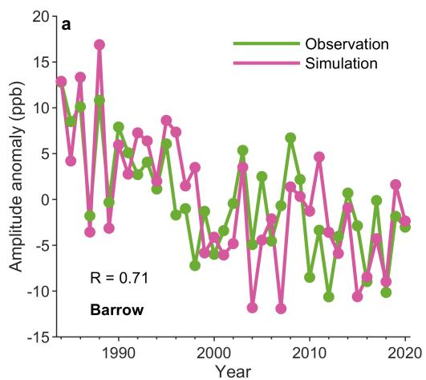

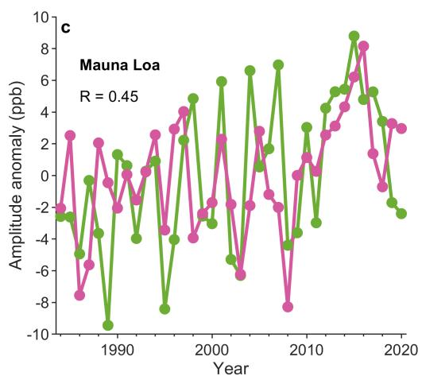

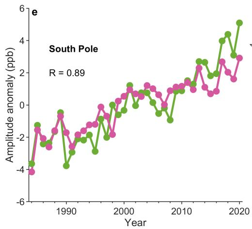  
Extended Data Fig. 1 | Attribution of changes in seasona $\mathbf { \delta C H _ { 4 } }$ amplitude between 1984 and 2020 at Barrow, Mauna Loa and South Pole. Observed and simulated seasona $\mathrm { C H } _ { 4 }$ amplitude at Barrow (a), Mauna Loa (c) and South Pole (e). The trends of seasonal CH4 amplitude at Barrow (b), Mauna Loa (d) and

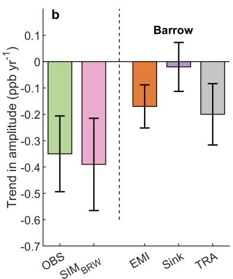

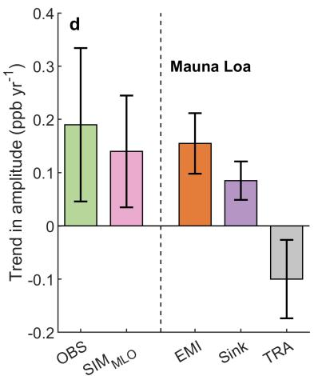

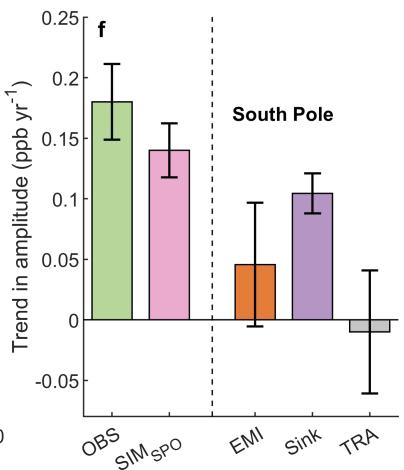  
South Pole $( \mathbf { f } ) ,$ and the contributions of emissions $( \mathsf { E M I } ) ,$ sink and atmospheric transport (TRA) to the trends of tropospheric seasonal $\mathrm { C H } _ { 4 }$ amplitude. The error bars represent 95% confidence intervals of the estimated trends and the contributions of different factors.

## Article

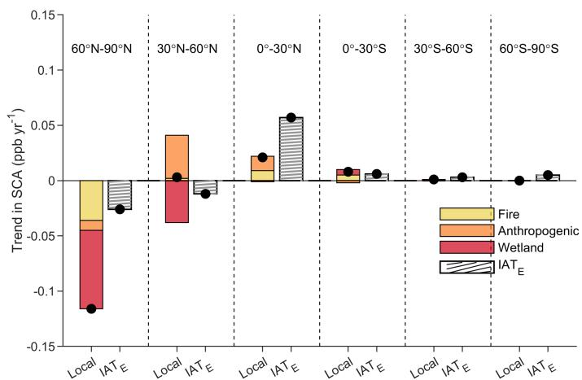  
Extended Data Fig. 2 | Attribution of the contribution of emission to seasonal amplitude between 1984 and 2020 for six latitudinal bands. The contributions of fire, anthropogenic, and wetland emissions, and the interaction between atmospheric transport and emissions $( \boldsymbol { \mathrm { I A T } _ { \mathrm { E } } } ; $ Supplementary Text 4) to the trends of tropospheric average $\mathrm { C H } _ { 4 } S { \mathrm { C A } }$ in six latitudinal bands.

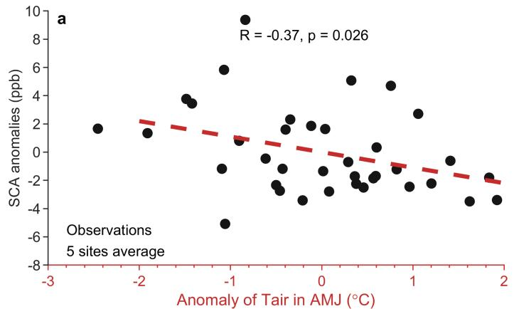

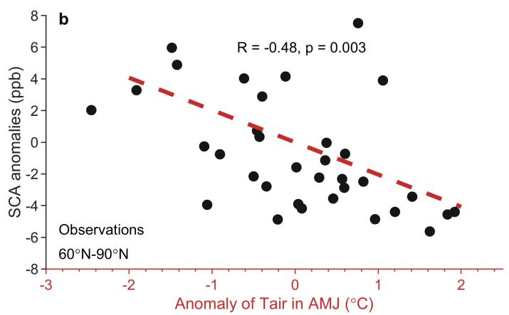

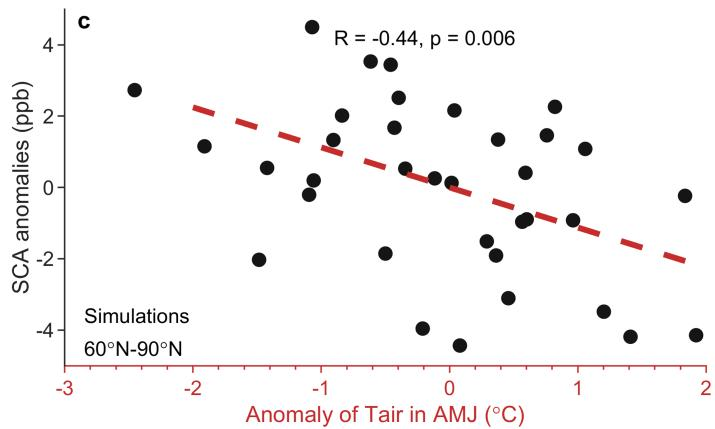  
Extended Data Fig. 3 | Relationships between wetland surface air temperature and seasonal $\mathbf { C H } _ { 4 }$ amplitude between 1984 and 2020. The relationship between surface air temperature of high northern wetlands in April, May and June (AMJ) from ERA5 and the observed average seasonal CH4 amplitude derived from 5 northern high latitude ground-based sites (a), the seasona $\mathrm { C H } _ { 4 }$ amplitude of zonal mean (60°N-90°N) atmospheric $\mathrm { C H } _ { 4 }$ from NOAA observations (b) and the simulated 60°N-90°N tropospheric CH4 SCA (c).

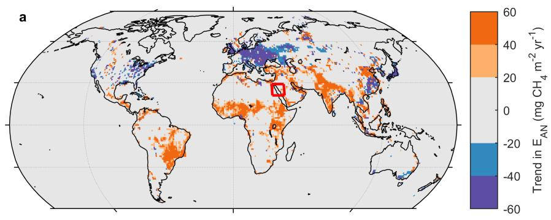

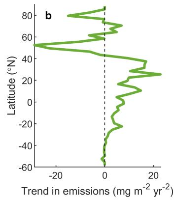

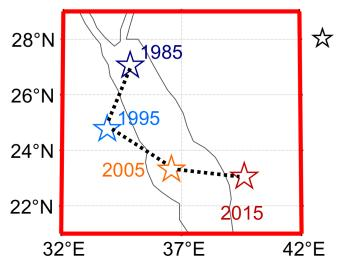  
Extended Data Fig. 4 | Spatial distribution of the trend in anthropogenic CH4 emissions between 1984 and 2020. The spatial distribution of the trend in anthropogenic CH4 emissions (a) and the average trend by latitude (b).  
The mean centre of anthropogenic CH4 emissions in 1985, 1995, 2005 and 2015 is also shown (c).

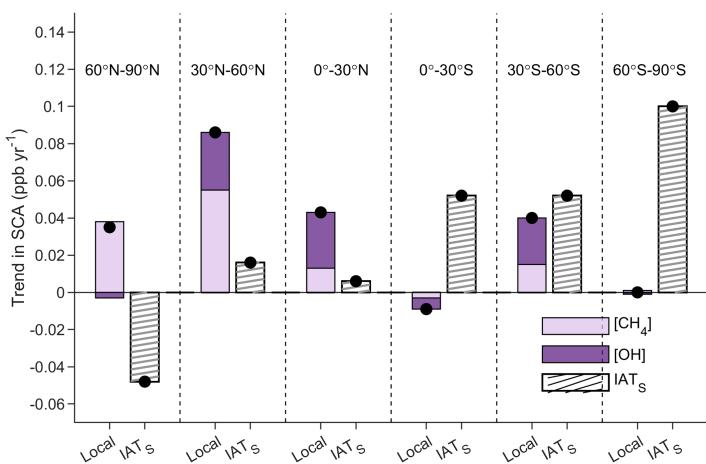  
Extended Data Fig. 5 | Attribution of the contribution of sink to seasonal amplitude between 1984 and 2020 for six latitudinal bands. The contributions of CH4 concentration $\mathrm { ( [ C H _ { 4 } ] ) }$ , OH concentration ([OH]), and the interaction between atmospheric transport and the sink (IATS; Supplementary Text 4) to the trends of tropospheric average CH4 SCA in six latitudinal bands.

## Article

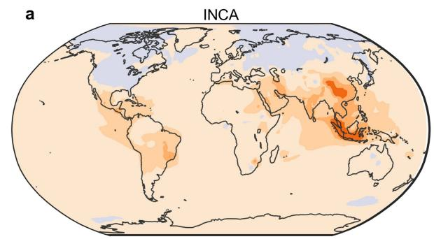

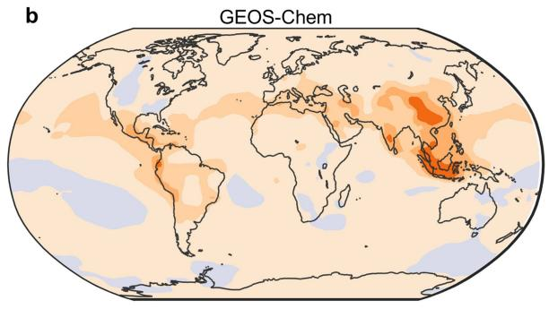

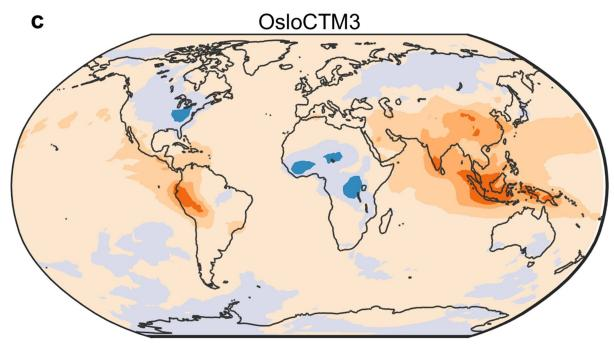

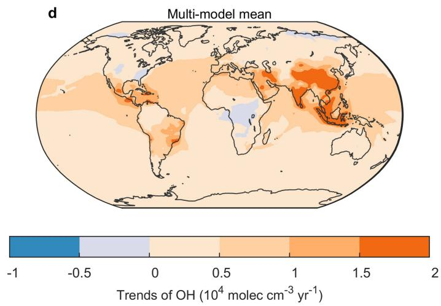  
Extended Data Fig. 6 | Spatial patterns of the trend in OH concentration. Spatial pattern of trends in OH concentration between 1984–2020 from INCA (a) and GEOS-Chem (b), 1990–2017 from OsloCTM3 (c) and 1984–2014 from the multi-model mean of ESMs (d).