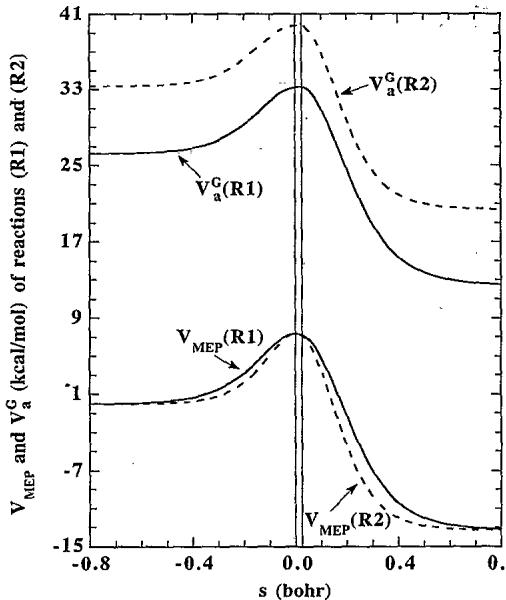
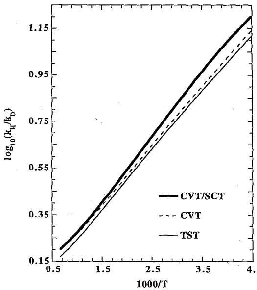
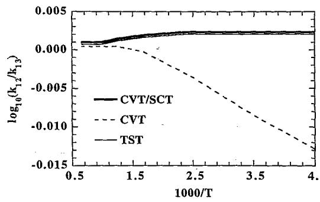
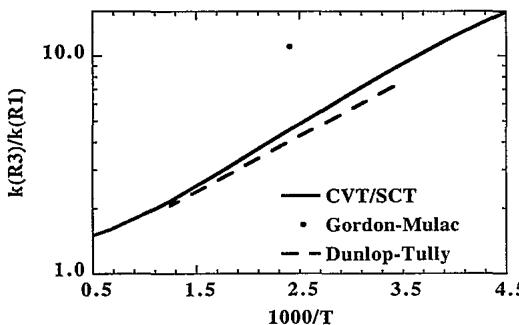

# Deuterium and carbon-13 kinetic isotope effects for the reaction of OH with $\mathsf { c H } _ { 4 }$

Vasilios S. Melissas and Donald G.Truhlar   
Department ofChemistry and Supercomputer Institute, University ofMinnesota,Minneapolis   
Minnesota 55455-0431

(Received 13 April 1993;accepted 19 May 1993)

Interpolated variational transition state theory calculations with centrifugal-dominant, small-curvature tunneling coefcients have been carried out for the case of the deuterium kinetic isotope effect (KIE） in the reaction $\mathrm { O H } + ^ { 1 2 } \mathrm { C D } _ { 4 } {  } \mathrm { H D O } + ^ { 1 2 } \mathrm { C D } _ { 3 }$ and for the $^ { 1 3 } { \bf C }$ KIE for the reaction $\mathrm { O H } + ^ { 1 3 } \mathrm { C H } _ { 4 } {  } \mathrm { H } _ { 2 } \mathrm { O } + ^ { 1 3 } \mathrm { C H } _ { 3 }$ . The interpolated variationally optimized generalized transition states predict notably different nontunneling KIEs than the conventional ones,and factorization analyses of the KIEs are presented to illustrate the origin of the differences.The zero-point energies at the variational transition states differ from those at the saddle point by up to $0 . 1 9 \mathrm { \ k c a l / m o l }$ for the $\mathrm { { O H + } } ^ { 1 2 } \mathrm { { C D } } _ { 4 }$ reaction and by up to 0.34 kcal/mol for the $\mathrm { \hat { O } H + ^ { 1 3 } C H _ { 4 } }$ reaction. The incorporation of muItidimensional tunneling effects partly cancels the effect of variational optimization of the transition state.

# 1. INTRODUCTION

Kinetic isotope effects （KIEs） provide unique insight into the dynamics of chemical reactions.1-8 The present paper is concerned with the theoretical interpretation of KIEs on the rate constants of OH radical reactions with $\mathrm { C H } _ { 4 }$ in the gas phase and with comparison of calculations to experiment9-i2 for these KIEs.The deuterium KIE for the reaction of OH with $\mathrm { C H } _ { 4 }$ is defined in this article as the ratio $k _ { \mathrm { H } } / k _ { \mathrm { D } }$ ,where $k _ { \mathbf { H } }$ is the rate constant for the unsubstituted methane and $k _ { \mathrm { { D } } }$ is the rate constant for the one in which all four protiums are substituted by deuterium. The $^ { 1 3 } { \bf C }$ KIE is denoted ${ { k } _ { 1 2 } } / { { k } _ { 1 3 } }$ ,where $k _ { 1 2 }$ is the rate constant for the normal methane and $k _ { 1 3 }$ is the rate constant for the one in which the $^ { 1 2 } \mathbf { C }$ atom is substituted by $^ { 1 3 } { \bf C } .$ (By definition,a KIE is “normal"if it is greater than unity when the rate constant for the lighter isotope is in the numerator, and it is an “inverse” isotope effect if it is less than unity.） The theoretical treatment used in the present study is the recently developed method of interpolated variational transition state theory13,14 (IVTST） with tunneling included by a recently developed multidimensional semiclassical approximation called the centrifugal-dominant smallcurvature semiclassical adiabatic ground-state approximation16orbevthesllretueling （SCT）approximation.

Conventional transition state theory (TST） is the most widely applied tool for the interpretation of KIEs.1-5 However,in many cases rate constant results obtained using variationally optimized generalized transition states and including multidimensional tunneling effects are considerably more accurate.17-28 In this article, we use VTST to calculate deuterium and $^ { 1 3 } \mathrm { C }$ KIEs for the gas-phase reaction of OH with $\mathrm { C H } _ { 4 }$

The most recent advance in the practical applicability of VTST is the development of IVTST,in which highquality calculations of the potential energy, its gradient, and its Hessian are performed at three to five selected points along the reaction path,and all information needed for VTST calculations is interpolated from this data without using a global potential energy function.13,14 Here, we use the highest-order version of the IVTST hierarchy,13 namely,a second-order global version of interpolated canonical variational transition state theory,to locate the transition state dividing surface.In particular,we base our results on accurate ab initio calculations (some from Ref 14 and some reported here） for the structures,energetics and vibrational frequencies of the reactants, products,and saddle point of the reactions studied,and we also use re sults at the same level for two extra points along the reao tion path-one on each side of the saddle point. Moreover; we include multidimensional tunneling effects in the trans mission coefficient based on the new $\bar { \mathbf { s } } \mathbf { C T } ^ { 1 5 , 1 6 }$ method.

The energy and force constants of the optimized variational transition state for the unsubstituted reaction may be significantly different from those for the isotopically substituted reaction,whereas in conventional TST,these properties are not influenced by isotopic substitution. Moreover, the effective potential used for the calculation of multidimensional tunneling effects includes all of the vibrational frequencies,even those associated with spectator modes.68,577

The reactions whose rate constants are calculated here are

$$
\mathrm { O H } + ^ { 1 2 } \mathrm { C D } _ { 4 } {  } \mathrm { H D O } + ^ { 1 2 } \mathrm { C D } _ { 3 }
$$

and

$$
\mathrm { O H } + ^ { 1 3 } \mathrm { C H } _ { 4 } {  } \mathrm { H } _ { 2 } \mathrm { O } + ^ { 1 3 } \mathrm { C H } _ { 3 } ,
$$

and results from the previous study14 of the reaction

$$
\mathbf { O H } + \mathbf { \Pi } ^ { 1 2 } \mathbf { C H } _ { 4 } {  } \mathbf { H } _ { 2 } \mathbf { O } + \mathbf { \Pi } ^ { 1 2 } \mathbf { C H } _ { 3 }
$$

are used to compute the KIEs.

The deuterium KIE for reaction (R1） has previously been studied experimentally by Gordon and Mulac,9 whereas the $^ { 1 3 } \mathrm { C }$ KIE for reaction (R2) has been examined in detail by Rust and Stevens,10 Davidson et al.,1l and Cantrell et al.12 Reaction (R2） is of special interest, since in order to understand the sources and sinks of atmospheric methane,32 the methane budget must be known; and one way to study the methane budget is through the use of stable isotopes of carbon as proposed by Stevens and Rust.33

For reaction (R3),the rate constants have been measured by using pulsed photolysis-laser induced fluorescence34 (PP-LIF) and other methods,5 and reasonable agreement (within a factor of 2） with experiment was obtained in previous14 IVTST calculations.

The level of electronic structure we use is secondorderMller-Plesset-Scalingallcorrelation-energy (MP-SAC2). Our MP-SAC2//MP2/adjusted correlationconsistent polarized-valence triple-zeta (adj-cc-pVTZ)36-38 electronic structure calculations14 predict a classical exoergicity39of 13.27 kcal/mol (compared to the experimental value14,40 of $1 3 . 2 7 \pm 0 . 2 9$ kcal/mol）and classical barrier heights39 of 7.37 and $2 0 . 6 4 \mathrm { \ k c a l / m o l }$ for the forward and reverse (R1),(R2),and (R3） reactions.

In Sec.II,we briefly review the scaling all correlationenergy (SAC）method for calculating the total absolute energies of the chemical systems under study and the conventional TST theory for computing the rate constants. Then we contrast TST to VTST theory.

# II. METHODS

# Il.A. Electronic structure calculations

The motivation of the $\pmb { \ S } \mathbf { A } \mathbf { C } ^ { 3 7 }$ method for large basis sets, such as those used for the calculations here, is to make the calculated exoergicity of the reaction under study agree perfectly with experiment so that the treatment of reactants and products is balanced,and a set of forward and reverse rate constants consistent with the equilibrium constant can be obtained. The calculated scaling factor $\mathcal { F } _ { 2 }$ for the dissociation energies of both the $\mathbf { O - H }$ and $\mathbf { C - H }$ bonds in our system,and for the adj-cc-pVTZ basis set, is equal to 0.967.l4 Further details of the SAC method are given elsewhere.37

The starting point for our large-scale calculations is the correlation-consistent polarized-valence triple-zeta (cc-$\pmb { \mathrm { p V T Z } } )$ basis set of Dunning.38 For C and O, this is a $( 1 0 s 5 p 2 d 1 f$ ）primitive Gaussian basis set contracted to $[ 4 s 3 p 2 d 1 f ]$ ，whereas for $\mathbf { H }$ it is a $( 5 s 2 p 1 d )$ primitive set contracted to $[ 3 s 2 p 1 d ]$ .Pure $^ { d }$ and $f$ functions are used in the $\pmb { d }$ and $f$ shells, i.e., the $\pmb { d }$ functions have five components and the $f$ functions have seven. Here,as before,14 we used an adjusted version of this basis set where the same scaling factor applies to the computed dissociation energies of both the $\mathbf { o - H }$ and $\mathtt { C - H }$ bonds.This adjusted basis, called adjusted $\mathsf { c c p v m } _ { \mathsf { L } }$ (adj-cc-pVTZ),is explained in detail elsewhere;14 it treats the electron correlation in both the forming and the breaking bonds of the above systems on an equal footing in order to obtain an accurate barrier height for both directions of each reaction.

A mass-scaled coordinate system31,4l was defined as

$$
x _ { i \gamma } { = } ( m _ { i } / \mu ) ^ { 1 / 2 } R _ { i \gamma } ,
$$

where $m _ { i }$ is the mass of atom $i , \mu$ is the reduced mass of the relative translational motion of reactants,which equals

TABLE I. The geometry of the nonstationary points on the $\mathrm { O H } + ^ { 1 2 } \mathrm { C D } _ { 4 }$ and $\mathbf { O H } + ^ { 1 3 } \mathbf { C H } _ { 4 }$ reaction paths.a   

<table><tr><td colspan="4">H(4) RC-H(4) H(3） RC-H(3) H（2 O-H(2) C-H(1) H(5) H(1) H(5)</td></tr><tr><td colspan="4">OH+12CD4 OH+13CH4</td></tr><tr><td>s(ao) --0.005</td><td>+0.005</td><td>-0.005</td><td>+0.005</td></tr><tr><td>Rc-H(1) 1.0804 1.1853</td><td>1.0801</td><td>1.0804</td><td>1.0801</td></tr><tr><td>Rc-H(2)</td><td>1.1955 1.0798</td><td>1.1834 1.0810</td><td>1.1974</td></tr><tr><td>Rc-H(3)</td><td>1.0808 1.0803</td><td></td><td>1.0796</td></tr><tr><td>Rc-H(4)</td><td>1.0803 1.3093</td><td>1.0804</td><td>1.0802</td></tr><tr><td>RO-H(2)</td><td>1.2978</td><td>1.3111</td><td>1.2959</td></tr><tr><td>Ro-H(5)</td><td>0.9697 0.9698</td><td>0.9697</td><td>0.9698</td></tr><tr><td>α</td><td>108.20 108.06</td><td>108.22</td><td>108.03</td></tr><tr><td>β</td><td>105.47 105.50</td><td>105.47</td><td>105.50</td></tr><tr><td>β</td><td>105.55 105.42</td><td>105.57</td><td>105.40</td></tr><tr><td>Y</td><td>169.56 169.61</td><td>169.55</td><td>169.62</td></tr><tr><td>8</td><td>96.99 97.13</td><td>97.00</td><td>97.12</td></tr><tr><td>b</td><td>120.20 120.26</td><td>120.20</td><td>120.27</td></tr><tr><td></td><td>120.29 120.18</td><td>120.31</td><td>120.16</td></tr></table>

aBond lengths in Angstroms and,bond and dihedral angles in degrees. ${ \mathfrak { b } } _ { \phi _ { 1 } }$ is the dihedral angle between the $\mathbf { H } ( 1 ) { - } \mathbf { C } { - } \mathbf { H } ( 2 )$ and $\mathbf { H } ( 3 ) { \mathrel { - } } \mathbf { C } { \mathrel { - } } \mathbf { H } ( 2 )$ planes. $\mathsf { c } _ { \phi _ { 2 } }$ is the dihedral angle between the $\mathbf { H } ( 1 ) { - } \mathbf { C } { - } \mathbf { H } ( 2 )$ and $\mathbf { H } ( 4 ) { \mathbf { - C - H } ( 2 ) }$ planes.

9.202 amu for reaction (R1),8.509 amu for reaction (R2), and 8.251 amu for reaction (R3),and $R _ { i \gamma }$ is a Cartesian coordinate for $\gamma { = } x ,$ y,or $z$ .The geometries of the nonstationary points along the minimum energy path31,42(MEP) on either side of the saddle point were determined by taking steps of length $\pm 0 . 0 0 5 a _ { 0 }$ in the direction of the massscaled eigenvector corresponding to the saddle-point imaginary frequency for each reaction. (A negative sign denotes a step towards reactants and a positive sign denotes a step towards products.)

The geometries of all stationary points, i.e.,minimum energy structures and the saddle point,were fully optimizedl4 at the MP2 level of theory with the adj-cc-pVTZ basis set. $C _ { 1 }$ point group symmetry was used for each species as the initial geometry of the optimization procedure and all the Z-matrix43 parameters were fully optimized. The resulting point group symmetries are $C _ { \infty }$ for OH, $\pmb { D } _ { 3 h }$ for $\mathrm { C H } _ { 3 }$ ， $T _ { d }$ for $\mathrm { C H } _ { 4 }$ ， $C _ { 2 v }$ for $\mathbf { H } _ { 2 } \mathbf { O } ,$ and $C _ { s }$ for the $\mathrm { C H } _ { 3 } – \mathrm { H } _ { - } \mathrm { O H }$ saddle point. The extra points along the reaction path on each side of the saddle point have a $C _ { 1 }$ symmetry. The absolute energy and geometry of the stationary points,which are the same for all three reactions $( \scriptstyle { \mathbf { R } } 1 ) -$ (R3),and of the nonstationary points for reaction （R3) are given in a previous paper by the present authors,14 whereas the geometry of the nonstationary points for reactions（R1） and（R2） are listed in Table I.As mentioned above, steps of $0 . 0 0 5 a _ { 0 }$ length were used for calculating the nonstationary points geometry for reactions (R1）and (R2),since that value gave stable results in Ref. 14 and, because of our choice of the scaling mass $\mu$ ，using it here gives similar values for breaking $\left( R _ { \mathrm { C - H ( 2 ) } } \right)$ and forming $\left( R _ { 0 - \mathbf { H } ( 2 ) _ { \cdot } } \right)$ bond lengths at the nonstationary points as were obtained14 for breaking $\left( R _ { \mathbf { C - H } ( 2 ) } \right)$ and forming $\scriptstyle ( R _ { 0 - \mathbf { H } ( 2 ) } )$ bond lengths of reaction (R3),respectively,on each side of the saddle point. The MP-SAC2//MP2/adj-cc-pVTZ energy of the backward point $( s = - 0 . 0 0 5 a _ { 0 } )$ ）for reactions (R1)-(R3)，was higher than the saddle point $( s { = } 0 )$ 1 MP-SAC2//MP2/adj-cc-pVTZ energy because the saddle point was not optimized at the SAC level, and therefore the original SAC procedure is not useful along the reaction path.Consequently,at the two nonstationary points for each reaction, the scaling was accomplished in the following way:

[See the supplementary material44 for absolute energies of the nonstationary points for reactions (R1） and (R2).]

All points for reactions(R1）and (R2） were characterized by vibrational analysis,and the vibrational frequencies for the equilibrium species,i.e.,reactants and products calculated at the MP2/adj-cc-pVTZ level are in Table II. Table II also lists experimental $^ { 4 0 , 4 5 - 4 8 }$ values. It should be noted that the calculated frequencies are harmonic values and the differences between experimental harmonic and fundamental frequencies may be as large as the differences between theory and experiment in the table. The transition state frequencies at the nonstationary points for reactions (R1）and (R2） calculated at the MP2/adj-cc-pVTZ level are given in Table III.Table IV lists the vibrational frequencies at the MP2/adj-cc-pVTZ level for reactions (R1) and (R2),respectively.For interpretative reasons, we also include in Table IV the vibrational frequencies at the saddle point $( s { = } 0 )$ ）and the interpolated ones at the generalized transition states for three temperatures,namely,300, 600,and $1 5 0 0 ~ \mathrm { \mathbb { K } } ,$ and at $s { = } 0 . 1$ and $0 . 8 a _ { 0 }$ . The vibrational frequencies of reaction (R3） are given elsewhere.14

TABLE II. Vibrational frequencies $( \mathsf { c m } ^ { - 1 } )$ of the equilibrium structures for the reactions $\mathrm { O H } + ^ { 1 2 } \mathrm { C D } _ { 4 } {  } \mathrm { H D O } + ^ { 1 2 } \mathrm { C D } _ { 3 }$ and ${ \bf O } { \bf H } + \mathrm { \mathrm { \Sigma } } ^ { 1 3 } { \bf C } { \bf H } _ { 4 } \mathrm { \to } { \bf H } _ { 2 } { \bf O }$ $+ ^ { 1 3 } \mathrm { C H } _ { 3 }$ ：   

<table><tr><td></td><td></td><td></td><td>Harmonic</td><td>Fundamental (Expt.)</td></tr><tr><td>OH</td><td>g</td><td>3759 (5.37)a</td><td>3735b</td><td>3570b</td></tr><tr><td>H0</td><td>a1</td><td>3795</td><td>3834</td><td>3651b</td></tr><tr><td></td><td>41</td><td>1663</td><td>1648</td><td>.1595b</td></tr><tr><td></td><td>b</td><td>3923 (13.41)a</td><td>3935℃</td><td>3756b</td></tr><tr><td>HDO</td><td>a1</td><td>2802</td><td>2824d</td><td>2724b</td></tr><tr><td></td><td>a1</td><td>1458</td><td>1440d</td><td>1403b</td></tr><tr><td></td><td>b</td><td>3861 (11.61)a</td><td>3890d</td><td>3707b</td></tr><tr><td>12CD3</td><td>啊~eé</td><td>2264</td><td>n/a</td><td>2136f</td></tr><tr><td></td><td></td><td>389</td><td>n/a</td><td>458f</td></tr><tr><td></td><td></td><td>2513</td><td>n/a</td><td>2381f</td></tr><tr><td></td><td></td><td>1067(14.03)a</td><td>n/a</td><td>1026f</td></tr><tr><td>13CH3</td><td></td><td>3201</td><td>n/a</td><td>3006f</td></tr><tr><td></td><td></td><td>498</td><td>n/a</td><td>604f</td></tr><tr><td></td><td></td><td>3358</td><td>n/a</td><td>3150f</td></tr><tr><td></td><td></td><td>1445 (19.02)a</td><td>n/a</td><td>1390f</td></tr><tr><td>12CD4</td><td>a</td><td>2188</td><td>2140g</td><td>21188</td></tr><tr><td></td><td>e</td><td>1132</td><td>11208</td><td>1092g</td></tr><tr><td></td><td>t</td><td>2381</td><td>2336g</td><td>22608</td></tr><tr><td></td><td>t</td><td>1027 (20.98)a</td><td>10348</td><td>998g</td></tr><tr><td>13CH4</td><td>a1</td><td>3093</td><td>3026g</td><td>29198</td></tr><tr><td></td><td>e</td><td>1600</td><td>15838</td><td>.1533g</td></tr><tr><td></td><td>t</td><td>3204</td><td>3146g</td><td>3010g</td></tr><tr><td></td><td>t</td><td>1350 (28.53)a</td><td>13598</td><td>1303g</td></tr></table>

aValues in parentheses are total harmonic zero-point energies in kcal/mol. bReference 40. Reference 45. dReference 46. n/a-not available. fReference 47. gReference 48.

Since unrestricted Hartree-Fock （UHF） wave functions are not spin eigenfunctions, we monitored the expectation value of $S ^ { 2 }$ in all $\mathtt { U H F } ^ { 3 6 }$ and MP2 wave functions (where $\pmb { S }$ denotes electron spin angular momentum in units of $\hbar .$ ).For doublets, $S ^ { \hat { 2 } }$ was always in the range 0.750-0.781,where 0.750 is the correct value. Therefore, spin contamination is not severe.We note for completeness that the largest deviation O.O31 from the correct value corresponds to $\scriptstyle { s = 0 . 0 0 5 a _ { 0 } }$ for reaction (R2).

TABLE III. Saddle point harmonic vibrational frequencies $\left( \mathbf { c m } ^ { - 1 } \right)$ atthe MP2/adj-co-pVTZ level for reactions (R1） and (R2),and the respective harmonic zero-point energies (kcal/mol).   

<table><tr><td>Reaction</td><td>OH+1CD4</td><td>OH+13CH4</td></tr><tr><td>a&#x27;</td><td>3748</td><td>3748</td></tr><tr><td rowspan="6"></td><td>2415</td><td>3243</td></tr><tr><td>2234</td><td>3128</td></tr><tr><td>1123</td><td>1520</td></tr><tr><td>1071</td><td>1408</td></tr><tr><td>979</td><td>1293</td></tr><tr><td>869</td><td>930</td></tr><tr><td></td><td>694 230</td><td>756</td></tr><tr><td></td><td></td><td>356</td></tr><tr><td rowspan="3">q&quot;</td><td>2418</td><td>3247</td></tr><tr><td>1077</td><td>1492</td></tr><tr><td>892</td><td>1201</td></tr><tr><td rowspan="2"></td><td>276</td><td>316</td></tr><tr><td>38</td><td>40</td></tr><tr><td>a&#x27;</td><td>1349i</td><td>1830i</td></tr><tr><td>ZPE</td><td>25.82</td><td>32.42</td></tr></table>

TABLE IV. Transition state and generalized transition states vibrational frequencies $\mathsf { ( c m ^ { - 1 } ) }$ along the $\mathrm { O H } + ^ { 1 2 } \mathrm { C D } _ { 4 }$ and $\mathrm { O H } + ^ { 1 3 } \mathrm { C H } _ { 4 }$ minimum energy paths.a   

<table><tr><td></td><td>-0.0050</td><td>0.0000</td><td>0.0050</td><td>T=300 Kb</td><td>T=600 Kb</td><td>T=1500 Kb</td><td>0.1000</td><td>0.8000</td></tr><tr><td>s(aq)</td><td colspan="8"></td></tr><tr><td></td><td>3750</td><td>3748</td><td>3746</td><td>OH+12CD4 3753</td><td>3759</td><td>3768</td><td>3861</td><td>3861</td></tr><tr><td>1 2</td><td>2416</td><td>2418</td><td>2421</td><td>2431</td><td>2433</td><td>2436</td><td>2519</td><td>2802</td></tr><tr><td>3</td><td>2411</td><td>2415</td><td>2420</td><td>2435</td><td>2439</td><td>2443</td><td>2503</td><td>2513</td></tr><tr><td>4</td><td>2232</td><td>2234</td><td>2237</td><td>2251</td><td>2256</td><td>2261</td><td>2408</td><td>2513</td></tr><tr><td>5</td><td>1119</td><td>1123</td><td>1128</td><td>1149</td><td>1155</td><td>1162</td><td>1386</td><td>2261</td></tr><tr><td>6</td><td>1077</td><td>1077</td><td>1076</td><td>1076</td><td>1076</td><td>1076</td><td>1121</td><td>1458</td></tr><tr><td>7</td><td>1072</td><td>1071</td><td>1071</td><td>1130</td><td>1131</td><td>1132</td><td>1132</td><td>1132</td></tr><tr><td>8</td><td>980</td><td>979</td><td>980</td><td>993</td><td>998</td><td>1004</td><td>1064</td><td>1067</td></tr><tr><td>9</td><td>897</td><td>892</td><td>887</td><td>872</td><td>868</td><td>864</td><td>770</td><td>390</td></tr><tr><td>10</td><td>875</td><td>869</td><td>863</td><td>843</td><td>838</td><td>833</td><td>703</td><td>3</td></tr><tr><td>11</td><td>709</td><td>694</td><td>678</td><td>630</td><td>619</td><td>606</td><td>360</td><td>0</td></tr><tr><td>12</td><td>267</td><td>276</td><td>285</td><td>306</td><td>309</td><td>311</td><td>221</td><td>0</td></tr><tr><td>13</td><td>220</td><td>230</td><td>240</td><td>266</td><td>271</td><td>276</td><td>245</td><td>0</td></tr><tr><td>14</td><td>22</td><td>38</td><td>56</td><td>47</td><td>35</td><td>23</td><td>0</td><td>0</td></tr><tr><td colspan="9"></td></tr><tr><td>1</td><td>3752</td><td>3748</td><td>3747</td><td>OH+13CH4 3867</td><td>3874</td><td>3885</td><td>3923</td><td>3923</td></tr><tr><td>2</td><td>3243</td><td>3247</td><td>3252</td><td>3272</td><td>3273</td><td>3275</td><td>3457</td><td>3795</td></tr><tr><td>3</td><td>3238</td><td>3243</td><td>3247</td><td>3266</td><td>3268</td><td>3270</td><td>3342</td><td>3358</td></tr><tr><td>4</td><td>3125</td><td>3128</td><td>3133</td><td>3165</td><td>3168</td><td>3172</td><td>3331</td><td>3358</td></tr><tr><td>5</td><td>1525</td><td>1520</td><td>1518</td><td>1529</td><td>1530</td><td>1533.</td><td>1888</td><td>3200</td></tr><tr><td>6</td><td>1495</td><td>1492</td><td>1489</td><td>1485</td><td>1485</td><td>1485</td><td>1555</td><td>1663</td></tr><tr><td>7</td><td>1404</td><td>1408</td><td>1412</td><td>1426</td><td>1426</td><td>1427</td><td>1444</td><td>1445</td></tr><tr><td>8</td><td>1302</td><td>1293</td><td>1284</td><td>1252</td><td>1250</td><td>1248</td><td>1403</td><td>1445</td></tr><tr><td>9</td><td>1207</td><td>1201</td><td>1195</td><td>1170</td><td>1168</td><td>1166</td><td>1028</td><td>498</td></tr><tr><td>10</td><td>930</td><td>930</td><td>930</td><td>929</td><td>929</td><td>929</td><td>924</td><td>882</td></tr><tr><td>11</td><td>781</td><td>756</td><td>732</td><td>648</td><td>643</td><td>635</td><td>336</td><td>0</td></tr><tr><td>12</td><td>345</td><td>356</td><td>367</td><td>407</td><td>409</td><td>413</td><td>564</td><td>5</td></tr><tr><td>13</td><td>299</td><td>316</td><td>332</td><td>377</td><td>379</td><td>382</td><td>249</td><td>0</td></tr><tr><td>14</td><td>26</td><td>40</td><td>58</td><td>94</td><td>92</td><td>88</td><td>0</td><td>0</td></tr><tr><td></td><td></td><td></td><td></td><td></td><td></td><td></td><td></td><td></td></tr></table>

All modes have a symmetry. bColumns headed by a temperature refer to the CVT location for that temperature. The $\pmb { s }$ values at these locations are given in Table V.

All ab initio calculations were carried out using the GAUSSIAN9049 program on the Cray X-MP/EA computer at the Minnesota Supercomputer Center.

$Q ^ { \neq }$ and $Q ^ { R }$ ,but are included in $\pmb { \sigma }$ (and, as discussed below, in hindered rotation partition functions). Then, the per site KIE is defined as

$$
\eta { = } \frac { k _ { U } / k _ { S } } { \sigma _ { U } / \sigma _ { S } } ,
$$

# Il.B. Dynamics calculations

According to TST, the rate expression is given by

$$
k ^ { \mathrm { T S T } } = \frac { \sigma } { \beta h } \frac { Q ^ { \ne } } { Q ^ { \& } } e ^ { - \beta V ^ { \ne } } ,
$$

where $k _ { U }$ denotes the rate coefficient for the unsubstituted reactants and $k _ { S }$ denotes the rate coefficient when one or more atoms are changed to one of their isotopes. The Wigner-corrected TST expression is

$$
k ^ { \mathrm { T S T / W } } = \kappa ^ { \mathrm { W } } k ^ { \mathrm { T S T } } ,
$$

In this equation, $\sigma$ is the symmetry factor50 accounting for the reaction-path degeneracy (the existence of equivalent paths), $\beta$ is $( \widetilde { k } T ) ^ { - 1 }$ ， $\overrightharpoon { k }$ is Boltzmann's constant, $_ { \pmb { T } }$ is temperature, $\pmb { h }$ is Planck's constant, $Q ^ { R }$ is the reactant partition function per unit volume with the zero of energy at classical equilibrium for reactants, $\scriptstyle { V ^ { \neq } }$ is the saddle point potential energy with the zero of energy at classical equilibrium for reactants,and $Q ^ { \neq }$ is the transition state parti-tion function with the zero of energy at $V ^ { \neq }$ and one degree of freedom (the reaction coordinate） fixed. All symmetry numbers are omitted from rotational partition functions in where $\kappa ^ { \mathrm { w } }$ is the lowest-order semiclassical tunneling transmission coefficient due to Wigner.51

Factorization of $\eta$ values determined by Eq.(5）is accomplished by

$$
\begin{array} { r } { \eta = \eta _ { \mathrm { t u n } } ^ { \mathrm { T S T } } , \eta ^ { \mathrm { T S T } } , } \end{array}
$$

where the tunneling contribution is

$$
\eta _ { \mathrm { t u n } } ^ { \mathrm { T S T } } { = } \kappa _ { U } ^ { \mathrm { W } } / \kappa _ { S } ^ { \mathrm { W } }
$$

and the conventional TST KIE is

$$
\eta ^ { \mathrm { T S T } } = \frac { Q _ { U } ^ { \ne } / Q _ { U } ^ { R } } { Q _ { S } ^ { \ne } / Q _ { S } ^ { R } } .
$$

Under the assumption that rotations and vibrations are separable, $\eta ^ { \mathrm { T S T } }$ may be further factored into translational, rotational,and vibrational contributions

$$
\eta ^ { \mathrm { T S T } } { = } \eta _ { \mathrm { t r a n s } } \eta _ { \mathrm { r o t } } ^ { \mathrm { T S T } } \eta _ { \mathrm { v i b } } ^ { \mathrm { T S T } } .
$$

If we now consider a generalized transition state which intersects the MEP at some value of $\pmb { s }$ other than the saddle point (which is the highest-energy point on the MEP from reactants to products)，we can define a generalized TST rate constant $k ^ { \mathrm { G T } } ( s )$ at temperature $\pmb { T }$ for this dividing surface as follows:

$$
k ^ { \mathrm { G T } } ( s ) = \frac { \sigma } { \beta h } \frac { Q ^ { \mathrm { G T } } ( s ) } { Q ^ { R } } { e } ^ { - \beta V _ { \mathrm { M E P } } ( s ) } .
$$

Here $\pmb { s }$ is the signed distance from the saddle point of the generalized transition state along the MEP through a massscaedot $V _ { \tt M E P } ( s )$ is the classical energy (also called the Born-Oppenheimer potential） along the MEP with its overall zero of energy at the reactant, and $Q ^ { \mathtt { G T } } ( s )$ is the partition function of the generalized transition state at $\pmb { s }$ with the local zero of energy at $V _ { \mathrm { M E P } } ( s )$ and again excluding symmetry numbers for rotation.In Eq.(1o),all bound vibrations are quantized, but the reaction coordinate motion is treated classically.

The canonical variational transition state theory （CVT） rate coefficient $k ^ { \mathrm { { C V T } } }$ can be obtained from Eq. (10) by variationally minimizing the generalized transition state theory rate constant $k ^ { \mathbf { G T } } ( s )$ with respect to the position $\pmb { s }$ of the generalized transition state along the reaction coordinate

and $^ { 1 3 } \mathrm { C H } _ { 4 }$ ，respectively. $\sigma _ { \scriptstyle \mathbf { G T } }$ and $\pmb { \sigma } _ { \mathrm { O H } }$ are equal to 1, whereas $\sigma _ { ^ { 1 2 } \mathrm { C D } _ { 4 } }$ and $\sigma _ { ^ { \mathrm { I 3 } } \mathrm { C H } _ { 4 } }$ are equal to 12.A symmetry factor $\pmb { \sigma }$ equal to 12.is obtained from Eqs.(13） and(14) for reactions (R1） and (R2),respectively.The symmetry number for reaction (R3） is already knownl4 to be equal to 12, so the $\sigma _ { U } / \sigma _ { S }$ ratio in Eq. (4） is unity in this article.

All partition functions in Eqs. (3）and (10） are approximated here as products of translational, rotational, vibrational,and electronic partition functions. The rotational partition function required is just the product,denoted $\pmb { I } _ { : }$ ，of the three principal moments of inertia,which can be calculated straightforwardly from the geometry.

The harmonic approximation is assumed in all cases for the calculation of the vibrational partition function, except for the internal rotational motion of the methyl group at the transition state and along the MEP where the hindered rotor14,15,52 model has been employed,and the vibrational information required is just the set of harmonic frequencies as a function of $\pmb { S } .$ .The hindered rotor partition function additionally requires $\sigma _ { \mathrm { i r } }$ the symmetry number for internal rotation,and $I _ { r }$ the moment of inertia for the internal rotation14,15,52 (also called the reduced moment of inertia),where $\sigma _ { \mathrm { i r } }$ is equal to 3 for all reactions considered here.

We assume that the electronic excitation energies and degeneracies of the generalized transition state are the same as the conventional transition state ones. In reactions (R1)-(R3),we assume no low-lying excited states of the $^ 2 A ^ { \prime }$ saddle point, but we correctly include the $^ 2 \Pi _ { 1 / 2 }$ excited state of OH in the reactant partition function. The excitation energy of this state of OH is 140 cm-1.40

For a deeper understanding of the per site KIE, we now apply a more detailed factorization scheme,6-8,53 e.g Eq.(6) is replaced by

$$
k ^ { \mathrm { C V T } } { = } \operatorname* { m i n } _ { s } k ^ { \mathrm { G T } } ( s ) ,
$$

and the semiclassical VTST rate constant to be considered in this study is given by26(b),31,41

$$
k ^ { \mathrm { C V T / S C T } } = \kappa ^ { \mathrm { S C T } } k ^ { \mathrm { C V T } } ,
$$

where $\kappa ^ { \mathrm { s c r } }$ is a transmission coefficient that incorporates quantum effects on the reaction coordinate. This is based on a small-curvature tunneling (SCT） correction15,16 to the CVT prediction for the ground state of the transition state.

As mentioned above,all symmetry numbers are excluded from rotational partition functions,which are treated by classical mechanics,and we include them in $\pmb { \sigma } .$ Then the symmetry factor for reaction (R1） is given by where $\sigma _ { \mathrm { G T } } , \ \sigma _ { ^ 2 \mathrm { C D } _ { 4 } } , \ \sigma _ { \mathrm { O H } }$ ，and $\sigma _ { ^ { 1 3 } \mathbf { C } \mathbf { H } _ { 4 } }$ are the symmetry numbers for the generalized transition states $^ { 1 2 } \mathrm { C D } _ { 4 }$ ,OH,

$$
\sigma { = } \frac { \sigma _ { ^ { 2 } \mathrm { C D } _ { 4 } } \sigma _ { \mathrm { O H } } } { \sigma _ { \mathrm { G T } } } \ .
$$

and for reaction (R2）is equal to

$$
\sigma { = } \frac { \sigma _ { ^ { 3 } C H _ { 4 } } \sigma _ { \mathrm { O H } } } { \sigma _ { \mathrm { G T } } } ,
$$

$$
\eta { = } \eta _ { \mathrm { t u n } } \eta _ { \mathrm { P F } } \eta _ { \mathrm { p o t } } , \quad .
$$

where

$$
\begin{array} { r l } & { \eta _ { \mathrm { t u n } } = \kappa _ { U } ^ { \mathrm { S C T } } / \kappa _ { S } ^ { \mathrm { S C T } } , } \\ & { \eta _ { \mathrm { P F } } = \frac { Q _ { U } ^ { \mathrm { C V T } } / Q _ { U } ^ { R } } { Q _ { S } ^ { \mathrm { C V T } } / Q _ { S } ^ { R } } , } \\ & { \eta _ { \mathrm { p o t } } = \exp [ - \beta ( V _ { U } ^ { \mathrm { C V T } } - V _ { S } ^ { \mathrm { C V T } } ) ] . } \end{array}
$$

and PF denotes “partition function.” Significant differences emerge from the VTST treatment when it is compared to the TST one.The TST treatment neglects the potential energy contributions which cancel because the same transition state--the saddle point-applies to both isotopes,whereas the VTST calculation includes this difference.Moreover, the TST saddle point force constants are independent of isotopic substitution,while the VTST optimized transition state force constants depend on the change in structure along the MEP.

Next, $\eta _ { \mathrm { P F } }$ is further factored into translational, rotational,and vibrational contributions,under the assumption that rotations and vibrations are separable,as follows:6,53

$$
\eta _ { \mathrm { P F } } { = } \eta _ { \mathrm { t r a n s } } \eta _ { \mathrm { r o t } } \eta _ { \mathrm { v i b } } .
$$

There is no contribution from $\eta _ { \mathrm { e l e c } }$ ， since it is an excellent approximation to assume that electronic partition functions cancel.

Specifically,7

$$
\eta _ { \mathrm { t r a n s } } { = } Q _ { \mathrm { t r a n s } , S } ^ { R } / Q _ { \mathrm { t r a n s } , U } ^ { R } ,
$$

where $Q _ { \mathrm { t r a n s } , \bar { \iota } } ^ { R }$ for $\scriptstyle { I = U , s }$ under study

$$
\eta _ { \mathrm { r o t } } { = } \frac { { Q } _ { \mathrm { r o t , } U } ^ { \mathrm { C V T } } / { Q } _ { \mathrm { r o t , } U } ^ { R } } { { Q } _ { \mathrm { r o t , } S } ^ { \mathrm { C V T } } / { Q } _ { \mathrm { r o t , } S } ^ { R } } ,
$$

where T and $Q _ { \mathrm { r o t } , I } ^ { R } \mathbf { f o r } I { = } U , S$ are the generaized transition state rotational partition function and the reactant rotational partition function, respectively,and

$$
\eta _ { \mathrm { v i b } } = \frac {  { Q _ { \mathrm { v i b , } U } } ^ { \mathrm { C V T } } /  { Q _ { \mathrm { v i b , } U } } ^ { R } } {  { Q _ { \mathrm { v i b , } S } } ^ { \mathrm { C V T } } /  { Q _ { \mathrm { v i b , } S } } ^ { R } } ,
$$

where Qvib and $Q _ { \mathrm { v i b } , I } ^ { \tt R }$ for $\pmb { I } { = } \pmb { U }$ ， $\pmb { S }$ are vibrational partition functions.

Detailed analyses of the vibrational contribution of Eq. (22）are accomplished according to the scheme

$$
\begin{array} { r } { \eta _ { \mathrm { v i b } } = \eta _ { \mathrm { v i b , l o w } } \eta _ { \mathrm { v i b , m i d } } \eta _ { \mathrm { v i b , h i g h } } , } \end{array}
$$

where the mode classification is based on the magnitude of the vibrational frequency for the isotopically unsubstituted $( U )$ [reaction (R3)] case.The low/mid border is taken as $1 0 0 \mathrm { c m } ^ { - 1 }$ and the mid/high border is taken as $2 0 0 0 ~ \mathsf { c m } ^ { - 1 }$ Similar factorizations are performed in the analysis of the results from the conventional TST calculations.

# III.RESULTS AND DISCUSSION

Both TST and VTST--through the second-order global version13,14 of IVTST-were applied to reactions (R1) and (R2).Second-order means that ab initio calculations are available not only at the reactants,saddle point,and products of the reactions under study,but also at two extra points $\pmb { s } = \pmb { s } _ { 1 }$ and ${ \pmb S } _ { 2 }$ on each side of the saddle point and along the reaction path. As explained elsewhere,13,14 IVTST is based on interpolating the quantities needed for a variational transition state theory calculation and a tunneling calculation as a function of the reaction coordinate. It is not necessary to interpolate the geometry along the reaction path.

  
FIG.1. Potential energy and vibrationally adiabatic ground-state potential energy of reactions (R1）and (R2） along the minimum energy path asa function of reaction coordinate.The thin vertical lines show the saddle point $( s { = } 0 )$ and the location $\scriptstyle ( s = 0 . 0 2 7 a _ { 0 } )$ of the canonical variational transition state at $1 5 0 0 ~ \bf { K }$ for reaction (R1).

Figure 1 shows the classical potential energy profiles $V _ { \mathrm { M E P } } ( s )$ and the vibrationally adiabatic ground-state p tential energy curves $V _ { a } ^ { G } ( s )$ all with overall zero of energ at the classical equilibrium energy of reactants and all as functions of the reaction coordinate $\pmb { S }$ for reactions $( \mathbf { R } 1 { \ddot { 2 } }$ and (R2).The vibrationally adiabatic ground-state poten tial energy curve is expressed (for nonlinear generalized transition states）as

$$
\mathcal { V } _ { a } ^ { G } ( s ) = V _ { \mathrm { M E P } } ( s ) + \frac { 1 } { 2 } h c \sum _ { m = 1 } ^ { 3 N - 7 } \overline { { \nu } } _ { m } ( s ) ,
$$

where $^ { c }$ is the speed of light and $\overline { { \nu } } _ { m }$ is a generalized normal-mode frequency in wave numbers. The maximum of the $V _ { a } ^ { G } ( s )$ curve and the location of this maximum are denoted as VAG and $s _ { * } ^ { A G }$ ,respectively.

As mentioned above, at the MP-SAC2//MP2/adj-ccpVTZ level,the classical forward barrier height is predicted to be 7.37 kcal/mol and the reverse barrier height is predicted to be 20.64 kcal/mol for all three reactions. Including the harmonic zero-point energy contribution— calculated at the MP2/adj-cc-pVTZ level--lowers the forward barriers to 6.84 and 5.89 kcal/mol,and the reverse barriers become equal to 20.82 and 20.63 kcal/mol for reactions(R1） and (R2),respectively.

TABLEV.Gitl adiabatic ground-state energy values for reactions $\mathrm { { \bf O H + } } ^ { 1 2 } \mathrm { { \bf C H _ { 4 } } }$ ， $0 \bar { \bf H } + \mathrm { \mathrm { \mathrm { \mathrm { \Omega } } } } ^ { 1 2 } { \bf C } \bar { \bf D } _ { 4 }$ ,and $\mathbf { O \bar { H } + ^ { 1 3 } C \bar { H } _ { 4 } }$   

<table><tr><td></td><td colspan="2">OH+12CH4</td><td colspan="3">OH+12CD4</td><td colspan="3">OH+1CH4</td></tr><tr><td>T(K)</td><td>VT</td><td>VMEP(CVT V</td><td>VT</td><td>VMEP(VT</td><td>VV）</td><td></td><td>VMEP(VT</td><td>VVT</td></tr><tr><td>250</td><td>0.0245</td><td>7.147</td><td>0.0189</td><td>7.282</td><td>33.271</td><td>0.0220</td><td>7.185</td><td>39.899</td></tr><tr><td>300</td><td>0.0248</td><td>7.142</td><td>39.997 0.0197</td><td>7.274</td><td>33.265</td><td>0.0222</td><td>7.181</td><td>39.898</td></tr><tr><td>400</td><td>0.0253</td><td>7.133</td><td>39.996 39.993 0.0211</td><td>7.260</td><td>33.253</td><td>0.0227</td><td>7.173</td><td>39.896</td></tr><tr><td>600</td><td>0.0260</td><td>7.120</td><td>39.989 0.0230</td><td>7.239</td><td>33.236</td><td>0.0233</td><td>7.162</td><td>39.893</td></tr><tr><td>1000</td><td>0.0269</td><td>7.101</td><td>39.981 0.0251</td><td>7.215</td><td>33.218</td><td>0.0241</td><td>7.147</td><td>39.887</td></tr><tr><td>1500</td><td>0.0280</td><td>7.078</td><td>39.970 0.0267</td><td>7.195</td><td>33.204</td><td>0.0250</td><td>7.131</td><td>39.879</td></tr><tr><td>2400</td><td>0.0300</td><td>7.035</td><td>39.947 0.0284</td><td>7.172</td><td>33.189</td><td>0.0264</td><td>7.102</td><td>39.863</td></tr></table>

TABLE VI.KIEs and factors for the $\mathrm { O H } + { } ^ { 1 2 } \mathrm { C D } _ { 4 }$ reaction at various temperatures.   

<table><tr><td>T (K)</td><td>Method</td><td>Ntun</td><td>Ttrans</td><td>mrot</td><td>Mvib</td><td>7pot</td><td>mno tun</td><td>m</td></tr><tr><td>250</td><td>TST/W</td><td>1.60</td><td>1.18</td><td>1.82</td><td>4.67</td><td>：</td><td>10.02</td><td>16.03</td></tr><tr><td rowspan="2">273</td><td>CVT/SCT</td><td>1.17</td><td>1.18</td><td>1.82</td><td>3.74</td><td>1.31</td><td>10.52</td><td>12.31</td></tr><tr><td>TST/W</td><td>1.57</td><td>1.18</td><td>1.82</td><td>3.87</td><td>：</td><td>8.32</td><td>13.05</td></tr><tr><td rowspan="2">293</td><td>CVT/SCT</td><td>1.16</td><td>1.18</td><td>1.82</td><td>3.17</td><td>1.28</td><td>8.70</td><td>10.13</td></tr><tr><td>TST/W</td><td>1.54</td><td>1.18</td><td>1.82</td><td>3.37</td><td>：</td><td>7.23</td><td>11.15</td></tr><tr><td rowspan="2">353</td><td>CVT/SCT</td><td>1.15</td><td>1.18</td><td>1.82</td><td>2.80</td><td>1.26</td><td>7.55</td><td>8.70</td></tr><tr><td>TST/W</td><td>1.47</td><td>1.18</td><td>1.82</td><td>2.42</td><td>：</td><td>5.19</td><td>7.62</td></tr><tr><td rowspan="2">416</td><td>CVT/SCT</td><td>1.11</td><td>1.18</td><td>1.82</td><td>2.09</td><td>1.20</td><td>5.39</td><td>6.00</td></tr><tr><td>TST/W</td><td>1.40</td><td>1.18</td><td>1.82</td><td>1.88</td><td>：</td><td>4.04</td><td>5.65</td></tr><tr><td rowspan="2">600</td><td>CVT/SCT</td><td>1.08</td><td>1.18</td><td>1.82</td><td>1.67</td><td>1.17</td><td>4.19</td><td>4.53</td></tr><tr><td>TST/W</td><td>1.25</td><td>1.18</td><td>1.82</td><td>1.20</td><td>：</td><td>2.59</td><td>3.25</td></tr><tr><td rowspan="2">1000</td><td>CVT/SCT</td><td>1.04</td><td>1.18</td><td>1.82</td><td>1.14</td><td>1.10</td><td>2.70</td><td>2.80</td></tr><tr><td>TST/W</td><td>1.11</td><td>1.18</td><td>1.82</td><td>0.81</td><td>：</td><td>1.75</td><td>1.95</td></tr><tr><td></td><td>CVT/SCT</td><td>1.01</td><td>1.18</td><td>1.82</td><td>0.81</td><td>1.06</td><td>1.85</td><td>1.87</td></tr></table>

The vibrationally ground-state barrier occurs at $s _ { * } ^ { \mathsf { A G } }$ $= 0 . 0 1 5$ and $0 . 0 2 0 a _ { 0 }$ (Fig.1) for reactions (R1) and (R2), respectively. The adiabatic barrier height $\Delta V _ { a } ^ { A G }$ is given by

$$
\Delta V _ { a } ^ { A G } = V _ { a } ^ { A G } - \frac { 1 } { 2 } h c \sum _ { m = 1 } ^ { 1 0 } \overline { { { \nu } } } _ { m } ( s = - \infty ) ,
$$

where $\overline { { \nu } } _ { m }$ isa reactant's vibrational frequency in wave numbers.The last term of Eq.(25） is equal to $6 . 9 4 \mathrm { \ k c a l / }$ mol for reaction (R1） and 6.oo kcal/mol for reaction (R2).

For interpretative reasons, Table Vlists the location of the generalized transition states $s _ { * } ^ { \mathbf { C V T } }$ for seven different temperatures,namely,250,300,400,600,1000,1500,and $2 4 0 0 \ \mathrm { \bf ~ K } ,$ their classical energy values $V _ { \mathrm { M E P } } ( s _ { * } ^ { \mathrm { C V T } } )$ ，and their vibrationally adiabatic ground-state energy values $V _ { a } ^ { G } ( s _ { * } ^ { C \nabla \mathtt { T } } )$ ,respectivelyfrreactis(R1)() of the above temperatures,reaction (R1）always has the largest $V _ { \mathbf { M E P } } ( s _ { * } ^ { \mathbf { C V T } } )$ value and reaction (R3) the smallest

TABLE VII. KIEs and factors for the $\mathbf { O H } + ^ { 1 3 } \mathbf { C H } _ { 4 }$ reaction at various temperatures.   

<table><tr><td>T(K)</td><td>Method</td><td>mtun</td><td>mtrans</td><td>mrot</td><td>mvib</td><td>1pot</td><td>mno tun</td><td>m</td></tr><tr><td>250</td><td>TST/W</td><td>1.000</td><td>1.047</td><td>0.971</td><td>0.988</td><td>：</td><td>1.005</td><td>1.005</td></tr><tr><td rowspan="2">273</td><td>CVT/SCT</td><td>1.031</td><td>1.047</td><td>0.971</td><td>0.889</td><td>1.079</td><td>0.976</td><td>1.005</td></tr><tr><td>TST/W</td><td>1.000</td><td>1.047</td><td>0.971</td><td>0.988</td><td>：</td><td>1.005</td><td>1.005</td></tr><tr><td></td><td>CVT/SCT</td><td>1.027</td><td>1.047</td><td>0.971</td><td>0.897</td><td>1.074</td><td>0.979</td><td>1.005</td></tr><tr><td rowspan="2">293</td><td>TST/W</td><td>1.000</td><td>1.047</td><td>0.971</td><td>0.988</td><td>：</td><td>1.005</td><td>1.005</td></tr><tr><td>CVT/SCT</td><td>1.024</td><td>1.047</td><td>0.971</td><td>0.903</td><td>1.069</td><td>0.981</td><td>1.005</td></tr><tr><td rowspan="2">353</td><td>TST/W</td><td>1.000</td><td>1.047</td><td>0.971</td><td>0.988</td><td>：</td><td>1.005</td><td>1.005</td></tr><tr><td>CVT/SCT</td><td>1.017</td><td>1.047</td><td>0.971</td><td>0.918</td><td>1.059</td><td>0.988</td><td>1.005</td></tr><tr><td>600</td><td>TST/W</td><td>1.000</td><td>1.047</td><td>0.971</td><td>0.987</td><td>：</td><td>1.004</td><td>1.004</td></tr><tr><td rowspan="2">1000</td><td>CVT/SCT</td><td>1.004</td><td>1.047</td><td>0.971</td><td>0.949</td><td>1.036</td><td>1.000</td><td>1.004</td></tr><tr><td>TST/W</td><td>1.000</td><td>1.047</td><td>0.971</td><td>0.986</td><td></td><td>1.002</td><td>1.002</td></tr><tr><td></td><td>CVT/SCT</td><td>1.001</td><td>1.047</td><td>0.971</td><td>0.962</td><td>1.024</td><td>1.001</td><td>1.002</td></tr></table>

  
FIG.2.Logarithm of the deuterium KIE for reactions(R1） and (R3）vs1000/T.

$V _ { a } ^ { G } ( s _ { * } ^ { \mathbf { C V T } } )$ temperatures in terms of translational, rotational, and $\mathbf { v } \mathbf { i } _ { \lnot \ni }$ brational motions, tunneling corrections,and the classicalz potential energy along the reaction path are given in Table VI. As mentioned above, there is a potential energy con- $\underset { \mathbb { O } } { \overset { \triangledown } { \boldsymbol { \cdot } } }$ tribution to the KIEs only in the CVT calculations. This= comes from the different classical energies of the general- $\ddot { \cdot } _ { \ast } ^ { \circ }$ ized transition states for the substituted and unsubstituted: reactions. Similar factorizations of the $^ { 1 3 } \mathrm { C }$ KIE are listed in Table VII.Figures 2 and 3 compare different levels of dynamical theory for the two kinetic isotope effects.

In order to test the sensitivity of the $k _ { \mathrm { H } } / k _ { \mathrm { D } }$ calculations to the theoretical assumptions,we repeated these calculations at the MP2/adj-cc-pVTZ level, i.e.,without the SAC correction.The only difference in these calculations is that $V _ { \mathrm { M E P } } ( s )$ is 0.59 kcal/mol higher at the saddle point and the two nearby points when the scaling is not included. Table VIII shows the resulting KIEs.The difference is less than $1 \%$ for $\begin{array} { r } { T { \geqslant } 4 0 0 \ \mathbb { K } } \end{array}$ ，increasing to $5 \%$ at 300 K and

  
FIG.3.Logarithm of the $^ { 1 3 } \mathbf { C }$ KIE for reactions (R2）and(R3）vs 1000/T.

TABLE VIII. Final calculated and experimental KIEs for reaction (R1) at various temperatures.   

<table><tr><td>Temperature （K）</td><td>MP-SAC2</td><td>MP2</td></tr><tr><td>223</td><td>15.9</td><td>18.7</td></tr><tr><td>250</td><td>12.3</td><td>13.7</td></tr><tr><td>293</td><td>8.70</td><td>9.18</td></tr><tr><td>300</td><td>8.27</td><td>8.68</td></tr><tr><td>400</td><td>4.82</td><td>4.85</td></tr><tr><td>416</td><td>4.53</td><td>4.54</td></tr><tr><td>600</td><td>2.80</td><td>2.80</td></tr><tr><td>1000</td><td>1.88</td><td>1.88</td></tr><tr><td>1500</td><td>1.59</td><td>1.59</td></tr><tr><td>2400</td><td>1.45</td><td>1.45</td></tr></table>

$18 \%$ at $\bf { 2 2 3 ~ K }$ .Thus the results are not overly sensitive to this scaling step.In the rest of the paper,we only consider our final results, which include the scaling.

# IllA. Tunneling contribution

Because of the difference in the imaginary frequency at the saddle point upon substitution of $\eta _ { \mathrm { t u n } } ^ { \mathrm { T S T / W } }$ $^ { \mathrm { i } 2 } \mathbf { C } \mathbf { H } _ { 4 }$ factorof 1.6 or with same reaction is smaler,， predicting an CVT/SCTfactor equal to 1.17 at $\bf { 2 5 0 ~ K }$

For reaction (R2), howeverthe factor equals 1.00 at any temperature, e.g., ntun $\eta _ { \mathrm { t u n } } ^ { \mathrm { T S T / W } }$ is equal to 1.0002 at $\mathtt { 2 5 0 \ K }$ ,since the value of the imaginary frequency is practically the same for the $^ { 1 3 } { \bf C H _ { 4 } O H }$ and ${ } ^ { 1 2 } \bar { \bf C } \bar { \bf H } _ { 4 } \mathrm { O H }$ saddle points [in particular it is $1 8 2 9 . 7 ~ \mathrm { c m } ^ { - 1 }$ for reaction (R2) and $1 8 \bar { 2 } 9 . 9 \mathrm { c m } ^ { - 1 }$ for reaction (R3)], whereas the $\eta _ { \mathrm { t u n } } ^ { \mathrm { C V T / S C T } }$ factor is equal to 1.03 at ${ 2 5 0 ~ \bf K } ,$ and gradually approaches the minimum value of 1.OO as the temperature rises above ${ \bf 1 0 0 0 ~ K }$ .Since one-dimensional tunneling methods,such as the Wigner method,often prove to be qualitatively incorrect,7 caution should be used in their application and interpretation.

# Ill.B. Translational contribution

The translational motion contribution is equal to the 3/2 power of the ratio of the reduced masses of the relative translational motion of reactants in the substituted and unsubstituted reactions,and both TST and CVT predict the same small normal contribution of 1.18 for reaction (R1) and of 1.05 for reaction (R2).

# Ill.C. Rotational contribution

The rotational motion contribution to the deuterium KIEs results from two square root ratios of products of principal moments of inertia, namely, one that depends on the $^ { 1 2 } \mathrm { C D } _ { 4 }$ and ${ } ^ { 1 2 } \mathbf { C } \mathbf { H } _ { 4 }$ structures and a second one that depends on the $^ { 1 2 } \mathrm { C D } _ { 4 } \mathrm { O H }$ and $^ { 1 2 } \mathrm { C H } _ { 4 } \mathrm { O H }$ generalized transition state structures.However, in conventional TST, the generalized transition state structure is replaced by the saddle point one. The OH radical does not contribute to the $\eta _ { \mathrm { r o t } } ^ { \mathrm { T S T } }$ ornot factors,since there is no isotopic substitution in the OH species. The calculations indicate that for the deuterium KIEs, both $\eta _ { \mathrm { r o t } } ^ { \mathrm { T S T } }$ and $\eta _ { \mathrm { r o t } } ^ { \mathrm { { C V T } } }$ are equal to 1.82 for a wide temperature range.

The rotational contribution to the $^ { 1 3 } { \bf C }$ KIEs comes from similar factors as for the deuterium one just discussed, except involving the $^ { 1 3 } { \bf C H } _ { 4 }$ and $^ { 1 3 } { \bf C H _ { 4 } O H }$ structures instead of the $^ { 1 2 } \mathrm { C D } _ { 4 }$ and ones. For the $^ { 1 3 } \mathbf { C }$ KIEs,both $\eta _ { \mathrm { r o t } } ^ { \mathrm { T S T } }$ and $\eta _ { \mathrm { r o t } } ^ { \mathrm { c v T } }$ giveanvescotonand are equal to O.97 in the temperature range from 250 to 1000 K.

# Ill.D. Vibrational contribution

Large differences between $\eta _ { \mathrm { v i b } } ^ { \mathrm { T S T } }$ and $\eta _ { \mathrm { v i b } } ^ { \mathrm { { C V T } } }$ are found at low temperatures for reaction (R2),which indicate a considerable variational effect on the vibrational contribution to the deuterium KIE.However, both theories predict a normal vibrational contribution according to Table VI in the temperature range from 250 to $6 0 0 ~ \mathbf { K } ,$ and as we move from atmospheric to medium temperatures,the conventional vibrational contribution becomes closer to the variational one.

To beter understand the $\eta _ { \mathrm { v i b } } ^ { \mathrm { T S T } }$ and $\eta _ { \mathrm { v i b } } ^ { \mathrm { C V T } }$ factors, we factor them according to Eq. (23), where $\eta _ { \mathrm { v i b , i o w } }$ contains contributions from modes with frequencies below 100 $\mathrm { c m } ^ { - 1 }$ (mode 14), $\eta _ { \mathrm { v i b , m i d } }$ contains contributions from modes with frequencies within the range $1 0 0 { - } 2 0 0 0 ~ \mathrm { c m } ^ { - 1 }$ (modes 5-13)，and $\eta _ { \mathrm { v i b , h i g h } }$ contains contributions from $2 0 0 0 ~ \mathrm { c m } ^ { - 1 }$

The $\eta _ { \mathrm { v i b , l o w } }$ and $\eta _ { \mathrm { v i b , m i d } }$ factors in Table IX lead t inverse contributions to the deuterium KIE with $\eta _ { \mathrm { v i b , m i \hat { d } } }$ being more significant than $\eta _ { \mathrm { v i b , l o w } }$ . The lowest-frequency mode of the transition states,which is the one responsible for the $\eta _ { \mathrm { v i b , l o w } }$ factor and which corresponds to the internal rotational motion of the methyl group at the transition state and along the MEP,has been treated according to the hindered rotor14,15,52 model. Table IX clearly shows the importance of the variational effect on the vibrational contribution to the deuterium $\bf { K I E s }$ .There is a significant dif-ference between $\eta _ { \mathrm { v i b , h i g h } } ^ { \mathrm { T S T } }$ and $\eta _ { \mathrm { v i b , h i g h } } ^ { C V T }$ (almost a factor of 2 at $2 5 0 ~ \bf { K }$ ，decreasing to $12 \%$ at 1000 K）and another one $1 4 \% - 3 6 \% )$ between $\eta _ { \mathrm { v i b , m i d } } ^ { \mathrm { T S T } }$ and $\eta _ { \mathrm { v i b , m i d } } ^ { \mathrm { C V T } }$ these differences illustrate that there are much larger variational effects resulting from particular groups of vibrational frequencies than the overall variational effect arising from all the vibrational contributions taken together. The partial cancellation of individual mode differences results in a small net difference between the $\eta ^ { \mathrm { T S T } }$ and $\eta ^ { \mathrm { c v _ { T } } }$ KIEs, as seen in the last column and previously& in another case.

Variational effects on the vibrational contributions to the $^ { 1 3 } { \bf C }$ KIEs do not result in large differences between $\eta _ { \mathrm { v i b } } ^ { \mathrm { T S T } }$ and $\eta _ { \mathrm { v i b } } ^ { \mathrm { C V T } }$ eveatowt ature range from 250 to $1 0 0 0 ~ \mathbf { K }$ ，both TST and CVT calculations predict an inverse vibrational contribution according to Table VII. As we move from the atmospheric temperature range to the medium temperature region, the conventional theory's vibrational contribution is getting closer to the variational one.

TABLE IX.Factorization of $\pmb { \eta } _ { \mathrm { v i b } }$ for the $\mathrm { O H } + ^ { 1 2 } \mathrm { C D } _ { 4 }$ and $\mathrm { { O H + ^ { 1 3 } C H _ { 4 } } }$ reactionsat various temperatures.   

<table><tr><td>T(K)</td><td>Method</td><td>Mvib,low</td><td>Mvib,mid</td><td>Mvib,high</td><td>Mvib</td></tr><tr><td colspan="2"></td><td>OH+1CD4</td><td></td><td></td><td></td></tr><tr><td rowspan="2">250</td><td>TST</td><td>0.87</td><td>0.49</td><td>11.00</td><td>4.67</td></tr><tr><td>CVT</td><td>0.88</td><td>0.67</td><td>6.40</td><td>3.74</td></tr><tr><td rowspan="2">273</td><td>TST</td><td>0.87</td><td>0.50</td><td>8.99</td><td>3.87</td></tr><tr><td>CVT</td><td>0.88</td><td>0.66</td><td>5.47</td><td>3.17</td></tr><tr><td rowspan="2">293</td><td>TST</td><td>0.87</td><td>0.50</td><td>7.74</td><td>3.37</td></tr><tr><td>CVT</td><td>0.88</td><td>0.66</td><td>4.87</td><td>2.80</td></tr><tr><td rowspan="2">353</td><td>TST</td><td>0.87</td><td>0.51</td><td>5.47</td><td>2.42</td></tr><tr><td>CVT</td><td>0.88</td><td>.0.64</td><td>3.72</td><td>2.09</td></tr><tr><td rowspan="2">416</td><td>TST</td><td>0.87</td><td>0.51</td><td>4.23</td><td>1.88</td></tr><tr><td>CVT</td><td>0.88</td><td>0.62</td><td>3.06</td><td>1.67</td></tr><tr><td rowspan="2">600</td><td>TST</td><td>0.87</td><td>0.51</td><td>2.73</td><td>1.20</td></tr><tr><td>CVT</td><td>0.88</td><td>0.59</td><td>2.18</td><td>1.14</td></tr><tr><td rowspan="2">1000</td><td>TST</td><td>0.87</td><td>0.50</td><td>1.87</td><td>0.81</td></tr><tr><td>CVT</td><td>0.88</td><td>0.57</td><td>1.64</td><td>0.81</td></tr><tr><td></td><td></td><td>OH+13CH4</td><td></td><td></td><td></td></tr><tr><td rowspan="3">250</td><td></td><td></td><td></td><td></td><td></td></tr><tr><td>TST</td><td>0.998</td><td>0.968</td><td>.1.023</td><td>0.988</td></tr><tr><td>CVT</td><td>1.001</td><td>0.970</td><td>0.916</td><td>0.889</td></tr><tr><td rowspan="2">273</td><td>TST</td><td>0.998</td><td>0.970</td><td>1.021</td><td>0.988</td></tr><tr><td>CVT</td><td>1.001</td><td>0.972</td><td>0.922</td><td>0.897</td></tr><tr><td rowspan="2">293</td><td>TST</td><td>0.998</td><td>0.972</td><td>1.019</td><td>0.988</td></tr><tr><td>CVT</td><td>1.001</td><td>0.974</td><td>0.926</td><td>0.903</td></tr><tr><td rowspan="2">353</td><td>TST</td><td>0.998</td><td>0.975</td><td>1.016</td><td>0.988</td></tr><tr><td>CVT</td><td>1.001</td><td>0.977</td><td>0.938</td><td>0.918</td></tr><tr><td>600</td><td>TST</td><td>0.998</td><td>0.979</td><td>1.010</td><td>0.987</td></tr><tr><td rowspan="2">1000</td><td>CVT</td><td>1.001</td><td>0.985</td><td>0.962</td><td>0.949</td></tr><tr><td>TST</td><td>0.998</td><td>0.980</td><td>1.008</td><td>.0.986</td></tr><tr><td></td><td>CVT</td><td>1.002</td><td>0.989</td><td>0.971</td><td>0.962</td></tr></table>

For interpretative purposes,we further factor both $\eta _ { \mathrm { v i b } } ^ { \mathrm { T S T } }$ and nvib for the $^ { 1 3 } \bar { \mathbf { C } }$ KIE according to Eq.(23), while following the same mode classification scheme as above.Both TST and CVT calculated factors are listed in Table IX,and they differ from each other most for the high vibrational frequencies.

The lowest-frequency mode of the transition statesthe one associated with the internal rotational motion of the methyl group at the saddle point and along the MEP, and which has been treated according to the hindered rotor model-provides a negligible contribution in both the variational and conventional calculations of the $^ { 1 3 } \mathrm { C }$ KIEs. The middle-frequency modes are responsible fora slight inverse contribution, about $3 \%$ at low $\pmb { T }$ ,but only $1 \% - 2 \%$ at high $\pmb { T }$ .The TST high-frequency mode's contribution is normal but only $1 \% - 2 \%$ ，whereas the CVT high-frequency mode's contribution is inverse and is as large as $8 \%$ at low $_ { T }$ ,although it decreases to $3 \%$ at $1 0 0 0 ~ \mathrm { \& }$ .Thus the only noticeable variational effect from a particular group of frequencies in this case is due to the high-frequency modes.

# {lI.E. KiEs on Arrhenius parameters

Table X shows the effect of deuterium substitution on the Arrhenius parameters for an atmospheric (250-300 K) and a medium （600-1000 K） temperature region. $\pmb { A _ { \mathrm { H } } } /$ $\scriptstyle A _ { \mathrm { D } }$ values significantly less than O.5-O.7 are often considered to bean indication of tunneling.5(b） Although the present reactions are dominated by tunneling [e.g., $\kappa ^ { s c \bar { \tau } } { = } 2 6 . 9$ ,8.7, and 1.6 at $T { = } 2 5 0$ 300,and $6 0 0 ~ \bf { K }$ respectively, for reaction $( \mathbb { R } 3 ) ^ { 1 4 } ] _ { \mathsf { J } } ,$ we find $A _ { \mathrm { H } } / A _ { \mathrm { D } } { \geqslant } 0 . 9$ at all levels of theory and $A _ { \mathrm { H } } / A _ { \mathrm { D } } > 1$ for our most accurate level of theory. This illustrates the danger of an Ockham's razor approach to tunneling, i.e., tunneling may be very important even when the “telltale signs”are missing.The final CVT/SCT calculations predict $A _ { \mathrm { H } } / A _ { \mathrm { D } }$ values that differ from the conventional TST ones by $6 \%$ and $E _ { a , \mathrm { D } ^ { - } } E _ { a , \mathrm { H } }$ values that differ from the conventional TST ones by 0.002- 0.07 kcal/mol. However, the differences between TST and CVT/SCT calculations are larger for individual reactions [e.g.,at 60O K,the CVT/SCT rate differs from the con- ventional TST one by $19 \%$ and $25 \%$ for reactions (R1) and (R3),respectivelyl; thus we see that a large part of the error cancels in the KIE.

TABLE X. Kinetic isotope effects on Arrhenius parameters for the $\mathrm { { \bf O H } } + \mathrm { { \bf ^ { 1 2 } C D } } _ { 4 }$ and $\mathrm { O H } + ^ { 1 3 } \mathrm { C } \bar { \mathrm { H } } _ { 4 }$ reactions in two temperature regions.   

<table><tr><td colspan="3"></td><td>OH+1CD4</td><td colspan="2">OH+13CH4</td></tr><tr><td>T(K)</td><td>Method</td><td>AH/AD</td><td>EaD-EaH (kcal/mol)</td><td>AH/AD</td><td>EaD-Ea,H (kcal/mol)</td></tr><tr><td>250--300</td><td>TST</td><td>1.08</td><td>1.11</td><td>1.006</td><td>-0.001</td></tr><tr><td rowspan="7">600-1000</td><td>TST/W</td><td>1.34</td><td>1.23</td><td>1.006</td><td>-0.001</td></tr><tr><td>CVT</td><td>1.09</td><td>1.13</td><td>1.013</td><td>-0.019</td></tr><tr><td>CVT/SCT</td><td>1.14</td><td>1.18</td><td>1.001</td><td>0.002</td></tr><tr><td>TST</td><td>0.97</td><td>1.17</td><td>0.999</td><td>0.006</td></tr><tr><td>TST/W</td><td>0.90</td><td>1.52</td><td>0.999</td><td>0.006</td></tr><tr><td>CVT</td><td>1.05</td><td>1.12</td><td>1.003</td><td>-0.004</td></tr><tr><td>CVT/SCT</td><td>1.03</td><td>1.19</td><td>1.000</td><td>0.005</td></tr></table>

The $^ { 1 3 } \mathrm { C }$ isotopic substitution effect on the Arrhenius parameters is always negligible for both temperature regions(Table X） since the KIE value is very close to unity. However, the CVT inverse isotope effect is reflected in the activation energy as a slightly negative contribution.

# lll.F. Comparison to available experimental data

There is only one published experimental value' for the deuterium KIE in reaction (R1).This experimental value is 11 at $4 1 6 \mathrm { ~ \bf ~ K ~ }$ ，which is a factor of 2.4 higher than the value calculated here (Table XI).For the $^ { 1 3 } \mathrm { \bar { C } }$ isotope effect in reaction (R2)，the calculated values are in excellent agreement with all experimentall² ones,which are available at three different atmospheric temperatures,as listed in Table XI.

(Addendum: After this paper was submitted for publication,we sent a preprint to Tully and he sent us new unpublished experimental results.Figure 4 shows a comparison of the present predictions for $k _ { \mathrm { H } } / k _ { \mathrm { D } }$ to an Arrhenius fit to the new experimental results.The agreement is much better than with the previous experiment. This comparison willbediscussedfurtherinapaper4nowin preparation by the experimentalists.）

# IV. CONCLUSIONS

In this article,we showed that variational transition state theory calculations with multidimensional tunneling probabilities may be carried out for kinetic isotope effects (KIEs） on the basis of very large scale electronic structure calculations for reactants, products, and three points along the reaction path for each isotopic version of the reaction. We also showed that deuterium KIEs for reaction (R1) and $^ { 1 3 } \mathrm { C }$ KIEs for reaction (R2） calculated by interpolated variational transition state theory with small-curvature tunneling coefficients are significantly different from KIEs calculated for the same reactions by conventional TST. Moreover,our calculations show that when generalized transition states are defined and their optimum location is determined variationally, the location is often strongly dependent on isotopic substitution. The calculated $k _ { 1 2 } / k _ { 1 3 }$ KIEs agree excellently with the available experimental values,12 whereas the $k _ { \mathrm { { H } } } / k _ { \mathrm { { D } } }$ KIEs are more than a factor of 2 lower than the sole available experimental value.9 More experimental tests of the $k _ { \mathrm { { H } } } / k _ { \mathrm { { D } } }$ KIEs will be most welcome. (Addendum: See last paragraph of Sec.III.F.)

TABLE XI. Final calculated and experimental KIEs for reactions (R1) and (R2）at various temperatures.   

<table><tr><td rowspan="2">Temperature (K)</td><td colspan="2">OH+12CD4</td><td colspan="2">OH+13CH4</td></tr><tr><td>Theorya</td><td>Expt.</td><td>Theorya</td><td>Expt.</td></tr><tr><td>223</td><td>15.9</td><td>n/ad</td><td>1.005</td><td>n/a</td></tr><tr><td>273</td><td>10.1</td><td>n/a</td><td>1.005</td><td>1.005</td></tr><tr><td>293</td><td>8.70</td><td>n/a</td><td>1.005</td><td>1.005</td></tr><tr><td>298</td><td>8.39</td><td>n/a</td><td>1.005</td><td>n/a</td></tr><tr><td>300</td><td>8.27</td><td>n/a</td><td>1.005</td><td>n/a</td></tr><tr><td>353</td><td>6.00</td><td>n/a</td><td>1.005</td><td>1.005</td></tr><tr><td>400</td><td>4.82</td><td>n/a</td><td>1.005</td><td>n/a</td></tr><tr><td>416</td><td>4.53</td><td>11</td><td>1.005</td><td>n/a</td></tr><tr><td>800</td><td>2.16</td><td>n/a</td><td>1.003</td><td>n/a</td></tr><tr><td>1500</td><td>1.59</td><td>n/a</td><td>1.002</td><td>n/a</td></tr><tr><td>2400</td><td>1.45</td><td>n/a</td><td>1.001</td><td>n/a</td></tr></table>

\*This study. bReference 9. Reference 12. ${ \mathsf { d } } _ { \mathtt { N } / { \mathsf { a } } }$ -not available.

Our detailed analysis of the contributions of the individual groups of vibrational frequencies show that significant ( $3 3 \%$ to factor of 11） contributions to the deuterium KIE arise from both mid- and high-frequency modes, whereas vibrational contributions to the $^ { 1 3 } \mathrm { \bar { C } }$ KIE are always within $11 \%$ of unity.For both KIEs,these major contributions are significantly affected (e.g., factors of 1.4, 1.7, and 1.12 at $2 5 0 ~ \bf { K } \mathrm { ~ . ~ }$ ）by variational optimization of the transition state location.

  
FIG.4.Deuterium KIE for reactions(R1）and (R3）vs $1 0 0 0 / T$ The present results are at the CVT/SCT level and the other results are from experiments.

# ACKNOWLEDGMENTS

The authors are grateful to Frank Tully for helpful discussions of the experimental literature and for permission to include his new results in Fig.4. We are grateful to Wei-Ping Hu for helpful discussions.Vasilios S.Melissas gratefully acknowledges the support of a Rohm & Haas Fellowship during part of the course of this work.The electronic structure calculations were supported by the University of Minnesota Supercomputer Institute. The major financial support for this work was provided by the Division of Chemical Sciences, Office of Basic Energy Sciences，U.S.Department of Energy，through Grant No. DE-FG02-86ER 13579.

1(a)E.A. Halevi, Tetrahedron 1,174(1957)； (b) Prog.Phys. Org. Chem.1,109(1963).   
${ \bf { \tau } } ^ { 2 } { \bf { J } } .$ Bigeleisen and M.Wolfsberg,Adv.Chem.Phys.1,15(1958).   
$^ 3 \mathbf { H }$ S.Johnston,Gas haseReactionRate Theory (Ronald,ewYork, 1966).   
4(a)V.J.Shiner,inIsotopeEfects in Chemical Reactions,edited by C. J. Collins and N.S.Bowman (Van Nostrand-Reinhold,New York, 1970),p.151; (b) D.-E.Sunko and S.Borcic,ibid. p.172; (c) V.J. Shiner,Jr.,ACSSymp.Ser.11163(1975).   
5(a) L.Melander and W.H. Saunders,Jr., Reaction Rates of Isotopic Molecules (Wiley,New York,198O)；(b)W.H.Saunders,Jr.,in Investigation of Rates and Mechanisms ofReactions,edited by C.F.Bernasconi (Wiley,New York,1986),Part 1,p. 565.   
${ } ^ { 6 } \mathbf { S } .$ C.Tucker,D.G. Truhlar,B.C. Garrett,and A.D. Isaacson,J. Chem.Phys.82,4102 (1985).   
7D.-h. Lu,D. Maurice,and D.G.Truhlar,J.Am.Chem.Soc.112,6206 (1990).   
$^ { 8 } \mathrm { \dot { D } }$ G.Truhlar,D.-h.Lu,S. C. Tucker, X. G.Zhao,A. Gonzalez-Lafont, T.N. Truong,D.Maurice, Y.-P.Liu,and G.C.Lynch,ACS Symp.Ser.502,16(1991).   
${ } ^ { 9 } { \bf S } .$ Gordon andW.A.Mulac,Int.J.Chem.Kinet.1,289 (1975).   
${ } ^ { 1 0 } \mathbf { F } .$ Rust and C.M.StevesInt.J.Chem.inet.1237(1980).   
${ } ^ { 1 1 } \mathbf { J }$ A.Davidso,CACel.C.eJc rone,and J.G. Calvert, J.Geophys.Res.92,2195 (1987).   
$^ { 1 2 } { \bf C }$ A.Cantrell,R.E.SeerA.H.MDaiel,J.G.Clvet,J.A Davidson,D.C.Lowe,S.C.Tyler,R.J.Cicerone,andJ.P.Greenberg,   
J.Geophys.Res.95,22455(1990).   
13A.GonzeLafot.ogdD.G.aJ.C.y 95,8875 (1991).   
14V.S. MelissadD.G.TrarJ.Chem.Phs. (tobepublished).   
15D.h Lu,T.N.Truong,V.S.Meliss, G.C.Lych,Y-P.Li,B.C. Garrett,R. Steckler,A. D. Isaacson, S.N. Rai, G.C. Hancock, J. G. Lauderdale, T.Joseph, and D. G. Truhlar, Comp. Phys. Commun. 71, 235 (1992).   
16Y.-P.Liu,G.C.Lych,T.N.Truog,D.-.Lu,D.G.TruharandB C. GarrettJ.Am. Chem. Soc.115,2408 (1993).   
17D.G.Truhlarand B. C.Garett,Acc Cem.Res.13,440(1980).   
${ } ^ { 1 8 } \mathbf { D }$ G.TruhlarW.LedJHesJe664 (1983);[Erratum 87,5523 (1983)].   
${ } ^ { 1 9 } \mathbf { D }$ G.Truhlar andBC.Garrtt,Annu.Revhys. Chem35,159 (1984).   
${ } ^ { 2 0 } \dot { \mathbf { D } }$ GTruhlarad.Crett,J.m.PsPCh.84 365 (1987).   
21S.C.Tuckerand D.G.Truhlar,in New Theoretical Conceptsfor Un derstanding OrganicReactions,editedbyJ.BertranandI.G.Csizmadia (Kluwer,Dordrecht, The Netherlands,1989),p.291.   
22(a) B.C.Garrettad D.G.Truhar,Int.J.Quanum Chem.29,1463 (1986);(b) B.C.Garrett,D.G.Truhlar,J.M.Bowman,A.F.Wagner,D.Robie,S.Arepall, N.Presser,ndR.J.Gordon,J.Am.Chem. Soc.108,3515(1986)；(c) B. C. Garrett and D.G. Truhlar, Int. J. Quantum Chem.31,8i(1987);(d) T.Joseph,D.G.Truhlar,and B. C. Garrett, J.Chem.Phys.88, 6982 (1988)； (e)G. C. Lynch,P. Halvick,D.G. Truhlar,B. C.Garrett,D.W. Schwenke,and D.J. Kouri, Z. Naturforsch. Teil A 44,427 (1989).   
23 B.C.GarrttD.GurandG.C.Shatz,J.AmCc10, 2876 (1986).   
24(a)D.C.CyCGrtdDGaJC 777 (1983);(b) G.C.Lynch,D.G. Truhlar,and B.C.Garrett,ibid. 90,3102(1989);[Erratum 91,3280 (1989)].   
25(a)B.C.GaD.GAgeTH.Dg Jr.,J.Chem.Phys.78,440(1983);(b)D.K.Bondi,J.N.L.Coo B.C.Garrett,and D.G. Truhlar,ibid.78,5981 (1983)； (c)B.C. Garrett and D.G. Truhlar,J.Phys.Chem.95,10374 (1991).   
26(a)B.C.GetadD.GJ.s7(980); (b)B.C. Garrett,D.G. Truhlar,R.S.Grev,and A.W. Magnuson, J. Phys.Chem.84,1730(1980);[Erratum87,4554 (1983)].   
27(a)D.G.TrhaA.Dacso,RojendB.C,J. Phys.Chem.86,2252(1982)；(b) D.K.Bondi,D.C.Clary,J.N.L. Connor,B.C.Garrett,and D.G.Truhlar,J.Chem.Phys.76,4986 (1982); (c） N.C.Blais,D.G. Truhlar,and B.C. Garrettibid.78, 2363(1983);(d) D.G.Truhlar,R.S.Grev,and B.C.Garret,J.Phys. Chem.87,3415（1983).   
$^ { 2 8 } \mathbf { B } .$ C.GarrettandD.G.Trular,J.Chem.Phys.8139(1984).   
29(a)M.M. Kreevoy，D.Ostovic,D.G.Truharnd B.C.Get,J. Phys.Chem.90,3766 (1986);(b) M.M.Kreevoy andD.G. Truhlar, inInvestigation of Rates and Mechanisms of Reactions, edited by C.F. Bernasconi (Wiley,New York,1986),Part 1,p.13;(c) Y.Kim,D.G. Truhlar,and M.M. Kreevoy, J.Am. Chem.Soc.113,7837 (1991).   
30 (a)R.T.Skodje,，D.G.TruhlarandB.C.Garett,J.Phys.Chem.85, 3019 (1981)； (b) J.Chem.Phys.77,5955 (1982).   
31D.G.Tru，A.o.C.Grt,inf ical Reaction Dynamics,edited by M. Baer (CRC, Boca Raton, FL, 1985),Vol. 4,p. 65.   
$\mathbf { \widehat { \mathbf { \mu } } } ^ { 3 2 } \mathbf { R } .$ J.Ciceroe adR..Oemand,Globaliogechem.Cycles2299 (1988).   
$^ { 3 3 } \mathbf { C } .$ M.Stevens and FRust,J.Geophys.Res87,4879 (1982).   
$^ { 3 4 } { \bf G }$ L.Vaghjianiand A.R.RavishankaraNature350,406 (1991).   
$\mathbf { \tau } ^ { 3 5 } \mathbf { R } .$ Atkinson,J.ys.Chem.RefDataonogaph1,18(989).   
36Mgler-Plesset second-order (MP2) perturbation theoryand standard notation for electronic structure calculations are explained in W.J. Hehre,L.Radom,P.v.R. Schleyer,and J.A. Pople,Ab Initio Molecular Orbital Theory (Wiley,New York,1986).In particular X/Y// $z / W$ denotes a calculation performed with electronic structure level $\pmb { X }$ and basis set $\pmb { Y }$ at a geometry optimized (for a reactant, product, or saddle point） or calculated by reaction path following (for nonstationary points）with electronic structure level $z$ and basis set $\pmb { W } .$ When $\pmb { Y }$ is the same as $\pmb { W }$ and $\pmb { X }$ is the same as $z ,$ one typically just writes $X / Y .$ The MP-SAC2 method is explained in Ref.37 and Sec.II. The cc-pVTZ and adj-cc-pVTZ basis sets are explained in Refs.38and 14,respectively,and in Sec.II.   
$^ { 3 7 } \mathbf { M } .$ S. GordonandD.G.Truhlar,J. Am.Chem.Soc.108,5412 (1986).   
${ } ^ { 3 8 } \mathbf { T } .$ H.Dunning,Jr.,J.Cem.Phys.901007(989).   
39Clasicalexoeitdcassrrerhghteetva   
culated from the Born-Oppenheimer potential without zero-point con  
tributions of vibrations transverse to the reaction path.   
40JANAFTermochemical Tblesrded.,editedby.W.ase,Jr.,C.   
A.Davies,J.R.Downey,Jr.,D.J.Frurip,R.A. McDonald,and A.N.   
Syverud (Natl.Stand.Ref.Data Ser.,Natl.Bur.Stand. Washington   
D.C., 1985), Vol. 14.   
41A.D IsaacsoadD.G.uhar,J.Chem.Phs.76380(1982).   
42(a) D.G.TruarandA.KupperannJ.Am.Chem.Soc.93,184   
(1971);(b)D.G. Truhlar and A. Kuppermann, Chem. Phys. Lett.9,   
269 (1971).   
43(a)M. S. Gordon and J. A. Pople, MBLD,Quantum Chemistry Pro   
gram Exchange Program No.135 [QCPE Newsletter 2228（(1969)]; (b)H.B. Schlegel, J. Comp.Chem.3,214 (1982).   
44See AIPdocument no.PAPSJCP-99354-1for1 page oftables. Order by PAPS number and journal reference from American Institute   
of Physics,Physics Auxiliary Publication Service, 5Oo Sunnyside Boulevard,Woodbury,NY 11797-2999.The price is \$1.50 for each microfiche (60 pages） or \$5.00 for photocopies of up to 30 pages,and \$0.15   
for each additional page over 3O pages.Air mail additional. Make   
checks payable to the American Institute of Physics.   
45A.R.HoyI.MildGStrey,ol.Ps.24,265 (197).   
46W.S.Beneict,GlardE.K.lyehe139 (1956).   
47T.J.SearJFreVikod.reJ.y   
90,2125 (1989).   
$^ { 4 8 } \mathbf { D }$ L. GrayandA.G.Robiete,ol.Phs37,91(1979).   
49M. J. Frisch,M. Head-Gordon,G.W.rucks,J.B.Foresman, H. B.   
Schlegel,K.Raghavachari,M.Robb,J.S.Binkley,C.Gonzalez,D.J.   
Defrees,D.J. Fox,R.A. Whiteside,R.Seeger,C.F.Melius,J. Baker,   
R.L.Martin,L.R. Kahn,J. J.P.Stewart, S. Topiol, J.A.Pople,   
GAUSSIAN90,Gaussian,Inc.,Pittsburgh,P,1990.   
50(a)V.GoldrasFadaoc.69(964);(b)ecasi   
Dynamics of Molecular Collsions,edited by W.H.Miller (Plenum New York,1976),Part B,p.269; (c）E. Pollak and P.Pechukas,J. Am.Chem.Soc.100,2984 (1978);(d) D.R.Coulson,ibid.100,2992 (1978); (e) Z.Sanina,J.Mol.Struct.(Theochem.) 185,217 (1989); (f) J IschtwanandM.A.Collins,J.Chem.Phys.94,7084(1991);(g)   
J. A. Karas,R. G. Gilbert, and M. A. Colins, Chem. Phys.Lett.193, 181 (1992).   
51E.Wigner,Z.Phys.Chem.B19203（1932).   
52D.G.TruhlarJ.Comp.Chem.12266 (1990).   
$\boldsymbol { \mathsf { s } } \boldsymbol { \mathsf { 3 } } _ { \mathbf { B } }$ C.Garrett,D.GuadA..gso,J.s76,   
2321 (1982).   
${ } ^ { 5 4 } \mathbf { J } ,$ R. DunlopandF.P.Tuly (unpublished).