# Atmospheric methane isotopic record favors fossil sources flat in 80s and 90s with recent 2 increase

Andrew L. Rice, Christopher L. Butenhoff, Doaa G. Teama, Florian H. Röger, M. Aslam K. Khalil & Reinhold A. Rasmussen

# Supplemental Information Appendix

# S.1 Air archive analyses and sample stability

Historic air samples were obtained from the Oregon Health & Science University–Portland State University (OHSU–PSU) air archive. The archive consists of samples collected between 1977 and 1998 using air liquefaction to compress ${ \sim } 1 0 0 0 \mathrm { L }$ of air (STP) to 30bar into 33L electropolished (SUMMA) stainless steel canisters. Samples were collected as part of one of the earliest $\mathrm { C H } _ { 4 }$ global long-term monitoring programs at six strategically located sites, one in each of the polar, middle, and tropical latitudes of both hemispheres (1-3) At present day, samples range in pressure from ${ \sim } 1 { - } 1 5$ bar stored in $3 3 \mathrm { L }$ and 0.8L SUMMA canisters.

Measurements of $\mathrm { C H } _ { 4 }$ concentration were made by gas chromatography-flame ionization detection (GC-FID) at both institutions using methods described previously (2, 4). At PSU, air samples were analyzed on a Hewlett Packard model 5890 GC-FID with a $3 . 2 \mathrm { m m } \left( \mathrm { O . D . } \right) \times 3 \mathrm { m }$ 80/100mesh HaySep Q column (5); precision of measurement for $\mathrm { C H } _ { 4 }$ concentration was 5ppb (1σ). Measurements at PSU were made relative to a high-pressure aluminum cylinder of 2011ppb $\mathrm { C H } _ { 4 }$ in synthetic air prepared by Scott Marrin Inc. (Riverside, California). The working reference gas was calibrated at PSU relative to National Institute of Standards and Technology (NIST) SRM $1 6 5 9 \mathrm { a }$ $9 . 8 6 3 { \scriptstyle \pm 0 . 0 3 0 \mathrm { p p m } } )$ and 1658a ( $1 . 0 7 9 { \scriptstyle \pm 0 . 0 0 8 \mathrm { p p m } } )$ . The OGI $\mathrm { C H } _ { 4 }$ calibration scale used prepared reference gases calibrated against NIST SRM 1659 (9.5ppm) (2).

Isotopic $\mathrm { C H } _ { 4 }$ measurements were made at PSU in the Stable Isotope Laboratory by continuousflow isotope ratio mass spectrometry (IRMS) on a Thermo Scientific model Delta V IRMS coupled to a custom-fabricated front end $\mathrm { C H } _ { 4 }$ preconcentration unit and a Thermo Trace Ultra GC using a Combustion III open split interface. Analytical methodology is detailed in Teama (5) and is based on Rice et al. (6). Isotopic measurements were made a minimum of three times per sample. Precision of measurement (1σ) of $\boldsymbol { \delta } ^ { 1 3 } \boldsymbol { \mathrm C }$ and δD was $0 . 0 7 \text{‰}$ , and $2 . 0 \text{‰}$ , respectively including errors in sample and reference gases. By convention, isotope ratios are expressed using the delta notation (as δ values), where $\delta { = } [ ( \mathrm { R } _ { \mathrm { s a m p l e } } / \mathrm { R } _ { \mathrm { s t a n d a r d } } ) { - } 1 ] { \times } 1 0 0 0$ $\mathrm { \hat { R } } { = } ^ { 1 3 } \mathrm { C } / ^ { 1 2 } \mathrm { C }$ or $\mathrm { D / H }$ ) and are reported relative to internationally recognized standards VPDB ${ } ^ { ( ^ { 1 3 } C / ^ { 1 2 } C }$ ) and VSMOW $\mathrm { ( D / H ) }$ as established by the International Atomic Energy Agency (IAEA) in Vienna, Austria (7). Isotope values are reported on VPDB and VSMOW isotope scales using the Dr. S. Tyler UC Irvine $\mathrm { C H } _ { 4 }$ isotope scale (8). Trends in $\mathrm { C H } _ { 4 }$ , $\boldsymbol { \delta } ^ { 1 3 } \boldsymbol { \mathrm { C } }$ and δD were analyzed using Lowess localized regression and uncertainties were bootstrapped to provide a measure of uncertainty in mean values and trends across datasets (5).

Sample integrity of archive samples was verified by comparison of original OGI-measured concentrations (data available 1977-1995) with modern $\mathrm { C H } _ { 4 }$ concentrations in canister samples measured at PSU. Fig. S1 shows the stability of air samples to be robust as demonstrated by the cross correlation of $\mathrm { C H } _ { 4 }$ concentrations determined at PSU and the original measurements at

OGI (Fig. S1a, slope ${ \mathrm { = } } 1 . 0$ , $\mathrm { r } ^ { 2 } { = } 0 . 9 9 6 )$ ). The mean difference between paired measurements was found to be 4.1ppb (OGI higher) with a standard deviation of $4 . 2 \mathrm { p p b }$ . All but four samples were found within $\pm 1 2 . 6 \mathrm { p p b } \left( 3 \sigma \right)$ of the mean difference (Fig. S1b). A quantile-quantile plot of the difference between PSU and OGI measured concentrations with a randomly sampled theoretical Gaussian distribution (mean 4.1ppb standard deviation 4.2ppb) follows the $\mathrm { { x } = \mathrm { { y } } }$ line with a few outliers at high and low values (Fig. S1c). The observed distribution compares closely with the combined PSU and OGI measurement uncertainty average of 5.1ppb $\scriptstyle ( \pm 1 \sigma )$ , including errors in sample and reference gas analyses. The mean PSU-OGI measurement difference (4.2ppb) of sample concentrations was found to be statistically significant at high levels of confidence (p value $\mathrm { \ K 0 . 0 1 }$ ) and is thought to result from a calibration difference between the laboratories. Although there are no longer primary reference gases with which to exchange between PSU and OGI to definitively address this issue, the absence of a statistically robust temporal trend in the PSU-OGI difference is strong evidence that sample integrity is not the driver of the offset between the two sets of measurements (Fig. S1d, $\mathrm { r } ^ { 2 } { = } 0 . 0 \bar { 4 }$ , slope $= - 0 . 1 1 { \pm } 0 . 1 3 \mathrm { p p b y e a r } ^ { - 1 } )$ .

# S.2 Composite observational datasets and inter-laboratory calibration

When merging datasets from different laboratories, trends in the resulting composite datasets can be sensitive to small differences in instrumental calibration. Further, results of analyses inferred from these trends using forward or inverse modeling approaches may be sensitive to calibration differences between laboratories (9).

$\mathrm { C H } _ { 4 }$ concentrations for inversion analyses in this work were based on the National Ocean and Atmospheric Administration Earth System Research Laboratory (NOAA-ESRL) data product GLOBALVIEW- $\mathrm { C H } _ { 4 }$ (10). Measurements from 221 locations (including 24 moving ship sites), collected by 12 laboratories, have been carefully smoothed, interpolated and extracted to provide continuous records of $\mathrm { C H } _ { 4 }$ concentrations for 1984–2009 at weekly time resolution. A detailed description of the date integration and extension process is given by Masarie and Tans (11). To retrieve monthly means we applied cubic spline fits to the weekly records and sampled the fits at daily frequency. We then calculated monthly means over the exact daily intervals. All $\mathrm { C H } _ { 4 }$ observations are reported on the NOAA04 $\mathrm { C H } _ { 4 }$ scale which is the World Meteorological Organization Global Atmosphere Watch program (WMO GAW) $\mathrm { C H } _ { 4 }$ standard scale (4). To integrate the GLOBALVIEW- $\mathrm { C H } _ { 4 }$ data product into the Goddard Earth Observation System 3D chemical atmospheric transport model (GEOS-Chem), we mapped the observational sites onto the $4 ^ { \circ } { \times } 5 ^ { \circ }$ horizontal grid, placing measurements from moving ships at the half-way point of their tracks. If a grid cell contained more than one observational site, the corresponding records were averaged. All records at altitude were discarded for consistency across platforms. This process resulted in a map of 112 locations used to constrain the inversion over the period.

In order to extend the observational times series for $\mathrm { C H } _ { 4 }$ concentration prior to 1984, we incorporated data from 1980–1984 from the OGI network, which are some of the earliest continuous timeseries of $\mathrm { C H } _ { 4 }$ concentration available (2). The dataset contains monthly mean $\mathrm { C H } _ { 4 }$ concentrations from seven locations spanning latitudes $7 0 \mathrm { { ^ \circ N } }$ to $9 0 ^ { \circ } \mathrm { S }$ , initiating at different times in the period. The merging of these data with the NOAA-ESRL observational network which began in 1983 is based on overlapping timeseries and was described previously (1). Because observational constraint of surface flux from these few sites was found to be weak,

92 these early data were used as part of a spin-up inversion to initialize $\mathrm { C H } _ { 4 }$ concentration fields.   
93 Source optimization did not begin until 1984.   
95 For isotopic analyses, to improve spatial and temporal data representation available for model   
96 inversion over the past three decades, merging isotopic data from different laboratories was   
97 necessary. There are only a handful of laboratories which have measured trends in isotopic $\mathrm { C H } _ { 4 }$   
98 in the atmosphere over the past few decades and sample exchanges to establish calibration   
99 differences are few (8, 12, 13). Interlaboratory comparisons are particularly challenging when   
100 periods of sample analysis do not overlap (9, 14).   
102 For this work, we limited our isotopic $\mathrm { C H } _ { 4 }$ datasets to laboratories with the $\boldsymbol { \delta } ^ { 1 3 } \boldsymbol { \mathrm C }$ and δD   
103 calibration on the UC Irvine Tyler $\mathrm { C H } _ { 4 }$ scale (8) and the University of Washington (UW) Quay   
104 $\mathrm { C H } _ { 4 }$ scale (13). The UCI Irvine Tyler $\mathrm { C H } _ { 4 }$ scale is one shared by the Portland State University   
105 stable isotope laboratory and by NOAA-INSTAAR (12, 14) and includes the exchange of   
106 calibrated whole air samples. The intercalibration between the UW stable isotope laboratory and   
107 the UC Irvine scale was established through the comparison of analyzed air samples from the   
108 OGI-PSU Air Archive from stations Mauna Loa, Hawaii (USA, $2 1 . 1 ^ { \circ } \mathrm { N } .$ , $1 5 7 . 2 ^ { \circ } \mathrm { W } )$ ) and Tutuila,   
109 American Samoa ${ } ^ { ( 1 4 . 1 ^ { \circ } \mathrm { S } _ { \mathrm { i } } }$ , $1 7 0 . 6 ^ { \circ } \mathrm { W } )$ during 1995–1996 with values from Quay et al. (13) from   
110 the same collection sites. A paired comparison of twenty $( \delta ^ { 1 3 } \mathrm { C } )$ monthly means during this   
111 period resulted in a mean difference of $0 . 0 2 4 { \pm } 0 . 0 8 8 \%$ (PSU higher, $\pm 1 \sigma$ ). Statistically   
112 significant at intermediate levels of confidence (p value ${ < } 0 . 2 8 { \mathrm { ) } }$ , this difference was adopted in   
113 this work to accommodate for UCI-UW inter-laboratory calibration scale offset. The difference   
114 between the UCI-UW calibration is smaller than, though within $\pm 1 \sigma$ overlap, of the $0 . 0 7 4 \text{‰}$   
115 determined by Levin et al. (9) using the NIWA calibration as a common transfer. Finally, the   
116 sensitivity of the modeled $\mathrm { C H } _ { 4 }$ sources to the adopted calibration offset was further tested in a   
117 model inversion sensitivity test (see S.4). All isotopic $\mathrm { C H } _ { 4 }$ data used in model inversions are   
118 listed in Table S3.

# S.3 Modeling $\mathbf { C H _ { 4 } }$ sources and sinks

121 GEOS-Chem simulation for atmospheric $\mathrm { C H } _ { 4 }$ was first described by Wang et al. (15) and further   
122 developed by Wecht et al. (16). In this work, GEOS-Chem uses the NASA Global Modeling and   
123 Assimilation Office (GMAO) data product GEOS-5. GEOS-5 meteorological fields have a $0 . 5 ^ { \circ } \times$   
124 $0 . 6 6 7 ^ { \circ }$ horizontal resolution and $7 2 \sigma$ -levels, which we degraded to $4 ^ { \circ } { \times } 5 ^ { \circ }$ horizontally and $4 7 \ \sigma \cdot$ -   
125 levels. The time step for emissions and chemistry was 60 minutes. Full details of $\mathrm { C H } _ { 4 }$ sources   
126 and sinks for GEOS-Chem are described in Röger (17) and references therein. We describe the $a$   
127 priori sources and sinks below and list their magnitudes in Tables S1 and S2.

# 128 S.3.1 Sources

129 We constructed spatially-gridded monthly-varying prior emissions fields from a number of   
130 sources. Anthropogenic sources of $\mathrm { C H } _ { 4 }$ were taken from the Emissions Database for Global   
131 Atmospheric Research (EDGAR v. 4.2), which provides annual emissions from 1970-2008 for   
132 16 sectors on a $0 . 1 ^ { \circ } \times 0 . 1 ^ { \circ }$ grid, which we regridded to $4 ^ { \circ } { \times } 5 ^ { \circ }$ (18). For natural and biomass   
133 burning emissions we relied on the GEOS-Chem base inventories. Emissions of isotopic tracers   
134 $^ { 1 3 } \mathrm { C H } _ { 4 }$ and $\mathrm { C H } _ { 3 } \mathrm { D }$ are obtained by multiplying the emissions by the characteristic isotope ratios of   
135 the underlying process (Table S1). In all, we represented emissions (and optimization) based on   
136 ten large-scale time-dependent spatial patterns, including source category and region.   
137 S.3.1.1 Fossil Fuels: Two patterns were created to represent emissions from fossil fuels. The   
138 first combines the EDGAR sectors ’Gas production and distribution’ and ’Oil production and   
139 refineries’, which we refer to as ’Gas and Oil’. The second pattern combines emissions from coal   
140 mining found in the sector ’Fugitive from solid’ with the other energy related sectors ’Energy   
141 manufacturing transformation’, ’Industrial process and product use’, ’Road transportation’,   
142 ’Non-road transportation’, and ’Fossil fuel fires’. We simply refer to this pattern as ’Coal’, since   
143 the other sectors account for combined emissions of less than $20 \%$ of the pattern. Major   
144 emissions from this pattern are located in China with smaller contributions from Europe and the   
145 United States. Spatial distributions of fossil fuel emissions are not expected to vary monthly,   
146 therefore the same maps are used for all 12 months of any given year.   
147 S.3.1.2 Rice: EDGAR provides annual rice emission maps in the sector ’Agricultural soils’ (18).   
148 Most of these emissions occur during the growing season. To account for the seasonal variations   
149 we used the average seasonal cycles of every grid cell from the data set described by Matthews   
150 and Fung (19) applied it to the annual EDGAR emission maps to obtain a monthly varying   
151 pattern ’Rice’. This results in more than half of the emissions occurring between July and   
152 October, and originating from the Indian and Chinese rice paddies in Southeast Asia.   
3 S.3.1.3 Wetlands: Unlike other sources in GEOS-Chem, methane release from wetlands is   
4 calculated at every emission time step. The applied scheme is based on Kaplan (20) and   
5 described by Pickett-Heaps et al. (21). Briefly, wetland emissions $E$ from every grid cell and at   
6 every emission time step are calculated according to

$$
E = \delta W F \beta A e ^ { \left( \frac { - E _ { o } } { T - T _ { o } } \left( \frac { C _ { S } } { \tau _ { S } } + \frac { \bar { C _ { L } } } { \tau _ { L } } \right) \right) } ,
$$

159 where $\delta$ is one if the GEOS-5 soil moisture indicates the presence of wetlands and zero if not. $W$   
160 represents the maximum potential wetland fraction of the grid box by excluding lakes, oceans   
161 and frozen areas. $F$ is a scaling factor to match estimates for tropical and boreal wetlands   
162 simultaneously. $A = 1 . 0 \mathrm { e x p } ( 3 )$ , $\beta { = } 3 \times 1 0 ^ { - 2 } \mathrm { m o l } \mathrm { C H } _ { 4 } / \mathrm { m o l } \mathrm { C }$ , $E _ { 0 } = 3 0 9 \mathrm { K }$ , $T _ { 0 } = 2 2 7 \mathrm { K }$ are   
163 parameters specifying the dependence on the soil temperature $T$ and the amount of available   
164 respired carbon. $C _ { S }$ and $C _ { L }$ are soil and litter carbon pools with residence times $\tau _ { s } = 3 2$ yr and   
165 $\tau _ { L } = 2 . 8$ yr, obtained from the Lund-Potsdam-Jena (LPJ) global vegetation model. The soil   
166 temperature is approximated by the GEOS-5 skin temperature. Since the monthly time step of   
167 our inversion required fixed patterns for every month, we sampled monthly averaged wetland   
168 emission maps for all 6 years of available meteorology fields from a GEOS-Chem run and   
169 reused them to fill the entire time period of investigation. In this pattern about $80 \%$ of the   
170 emissions are from the tropical rainforests and about $20 \%$ from boreal wetlands. We found   
171 significant differences between our pattern and a similar set of emission maps compiled by   
172 Matthews and Fung (19), which reflects the large uncertainties associated with distribution and   
173 emission factors for wetlands. In order to reduce the aggregation error caused by a potentially   
174 flawed distribution and to account for isotopic measurements that indicate northern high latitude   
175 wetlands are isotopically lighter than tropical wetlands we separated our pattern into three   
176 latitudinal bands (22), yielding the patterns ‘Wetlands 90N-30N’, ‘Wetlands 30N-0N’ and   
177 ‘Wetlands 0S-90S’.   
178 S.3.1.4 Other Biogenic: We combined the EDGAR sectors ’Enteric fermentation’ and ’Manure   
179 management’ into a pattern called ’Livestock’. Further the sectors ’Solid waste disposal’, which   
180 includes emissions from landfills, and ’Waste water’ are combined with natural emissions from   
181 termites to form a ’Waste and Termites’ pattern, which we refer to as ’Waste’ for short. The   
182 termites data set was described by Fung et al. (23). Both patterns are assumed to be aseasonal   
183 and only vary annually. Both patterns are very diffuse, i.e., the emissions are spread out over   
184 large regions. The strongest contributions come from densely populated areas.

S.3.1.5 Biomass Burning: For 1997 – 2008 GEOS-Chem provides monthly maps of methane emissions from biomass burning based on satellite observations of burned area from the Global Fire Emissions Database Version 3 (GFED3) described by Giglio et al. (24). For earlier years we combined the EDGAR sectors ’Large scale biomass burning’, ’Residential’, containing emissions from biofuels, and ’Agricultural waste burning’ with the average monthly seasonality obtained from the GFED3 data. Since the isotopic signature of biomass burning emissions depends on whether C3 or C4 vegetation is burned, we split the biomass burning pattern accordingly, using a vegetation map generated by Still et al. (25). We call the two resulting patterns ’Biomass Burning $\mathbf { \Gamma } ^ { \mathrm { C 3 } }$ and ’Biomass Burning C4’. To model the deuterium content of biomass burning, we followed the parameterization schedule of Yamada et al. (26), which follows the meridionally varying deuterium content of organic material.

Uncertainty arises from sources not entirely distinct in their spatial footprints (18) and isotopic composition (e.g., rice and wetlands, Table S1). The independence of inversion source fluxes was evaluated through source covariance. Results of this analysis indicate that correlations were weak for all paired sources $\left( | \mathbf { r } | { < } 0 . 1 5 \right)$ , implying that inversion sources are largely independent. Strongest covariance occurred between the two biomass burning source categories (C3 and C4, $\mathrm { r } = - 0 . 1 4 )$ and northern and southern hemispheric tropical wetland emissions $( \mathrm { r } { = } - 0 . 1 2 )$ , with all other correlations lower $\left( \left| \mathbf { r } \right| { < } 0 . 1 \right)$ .

# S.3.2 Sinks

S.3.2.1 Tropospheric Chemical Sink. GEOS-Chem provides 1 year of monthly varying threedimensional OH fields used for the $\mathrm { C H } _ { 4 }$ simulation. The fields have been generated in a full chemistry run of the model (15). The corresponding tropospheric lifetimes of methyl chloroform and $\mathrm { C H } _ { 4 }$ are 5 years and 8.5 years, respectively and agree well with recent estimates. The global mean OH concentration of $1 0 . 8 \times 1 0 ^ { 5 }$ molec $\mathrm { c m } ^ { - 3 }$ is in very close agreement with $1 0 . 9 \times \bar { 1 0 } ^ { 5 }$ molec $\mathrm { c m } ^ { - 3 }$ calculated by Prinn et al. (27). The $\mathrm { C H } _ { 4 }$ loss $\Delta \mathrm { C H _ { 4 } }$ due to reaction with OH is calculated in every grid cell at every chemistry time step as

$$
\Delta _ { O H } ^ { C H _ { 4 } } = - k _ { O H } [ C H _ { 4 } ] [ O H ] \Delta t
$$

where $\Delta t = 6 0$ min is the length of the chemistry time step and the reaction rate $k _ { O H } = 2 . 4 5 \times$ $1 0 ^ { - 1 2 } \exp ( - 1 7 7 5 / T )$ in units $\mathrm { { \dot { c } m } ^ { 3 } \ m o l e c ^ { - 1 } \ s ^ { - 1 } }$ (28) is calculated from the GEOS-5 temperature $T .$ . Equivalent equations are used for the methane isotopologues. Explicitly for $^ { 1 3 } \mathrm { C H } _ { 4 }$ and $\mathrm { C H } _ { 3 } \mathrm { D }$ , we calculated the loss as

$$
\Delta _ { O H } ^ { ^ { 1 3 } C H _ { 4 } } = - k _ { O H } ^ { ^ { 1 3 } C H _ { 4 } } [ ^ { 1 3 } C H _ { 4 } ] [ O H ] \Delta t , \thinspace s
$$

$$
\Delta _ { O H } ^ { C H _ { 3 } D } = - k _ { O H } ^ { C H _ { 3 } D } [ C H _ { 3 } D ] [ O H ] \Delta t ,
$$

respectively, with reaction rates $^ { 1 3 } k _ { O H } = k _ { O H } / K I E _ { O H } ( ^ { 1 3 } C )$ and $\mathrm { { } ^ { D } } k _ { O H } { = } k _ { O H } / { K I E _ { O H } } ( \mathrm { { D } ) }$ and KIEs given in Table S2. Inter-annual variability of OH in the literature is controversial (29) and we reuse the same OH fields for every year of our simulations. However, we conducted a sensitivity test where we imposed inter-annual variability by globally scaling the OH fields to match the annually varying mean OH concentrations derived by Prinn et al. (27) with years after 2003 fixed at mean OH concentrations (section S.6).

S.3.2.2 Stratospheric Sink. The stratospheric sink is calculated using loss frequency fields 227 derived from a full chemistry simulation of NASA’s Global Modeling Initiative (GMI)

Stratospheric Model (15, 30). Reactions of methane with OH, chlorine, and $\mathrm { O } ( ^ { 1 } \mathrm { D } )$ are accounted for. The stratospheric loss $\Delta C \mathrm { H _ { 4 - s t r a t } }$ is then determined by

$$
\Delta _ { S t r a t } ^ { C H _ { 4 } } = - [ C H _ { 4 } ] L F \Delta t
$$

where $L F$ is the loss frequency in units $s ^ { - 1 }$ . In the isotope equations $L F / K I E _ { S t r a t }$ takes the place of $L F$ .

S.3.2.3 Soil Sink. The soil absorption sink is treated as a negative source in GEOS-Chem. The spatial distribution gridded by Fung et al. (23) is used at every time step. We let the soil sink magnitude vary monthly by scaling the sink strength from this distribution $( 1 8 \mathrm { T g } \mathrm { y r } ^ { - 1 } )$ by the ratio of the monthly global surface $\mathrm { C H } _ { 4 }$ burden to January 1990, which we took to be the reference month of the distribution. The soil sink strength of $1 8 \mathrm { ~ T g ~ y r } ^ { - 1 }$ is low compared to more recent estimates of ${ \sim } 3 0 \mathrm { T g } \mathrm { y r } ^ { - 1 }$ (31) so we conducted a sensitivity test to determine the impact of a larger soil sink (section S.6). The loss of the isotope tracers is calculated by, e.g., for $^ { 1 3 } \mathrm { { C H } _ { 4 } }$

$$
\Delta _ { S o i l } ^ { ^ { 1 3 } C H _ { 4 } } = \frac { [ ^ { 1 3 } C H _ { 4 } ] } { [ C H _ { 4 } ] K I E _ { S o i l } ( ^ { 1 3 } C ) } \Delta _ { S o i l } ^ { C H _ { 4 } }
$$

and accordingly for the hydrogen isotopologue.

S.3.2.4 Marine Chlorine Sink. There is no consensus on the magnitude of the atomic chlorine sink in the marine boundary layer (MBL) and it has not been included in GEOS-Chem. We implemented a simple MBL chlorine sink for a sensitivity test (section S.6).

# S.4 Inversion setup

To infer monthly fluxes of our ten source categories from the atmospheric $\mathrm { C H } _ { 4 }$ and $\delta ^ { 1 3 } \mathrm { C - C H } _ { 4 }$ observation records discussed above, we performed a time-dependent inversion at monthly frequency using a variation of a Kalman filter called a fixed-lag Kalman smoother. A detailed mathematical description of the method is given in Bruhwiler et al. (32). The Kalman smoother is a sequential estimation technique whereby a flux is estimated multiple times using observational data sets from different time steps. The assumption employed in this method is that the emitted tracer becomes spatially well mixed after some lag between the time of emissions and the time of observation, so subsequent observations contain no useful information to distinguish different source regions. Through testing with our chemical transport model GEOS-Chem we found that flux estimates and their uncertainties converged quickly towards their final optimized values and little change occurred after 6 months which is consistent with other reports (32, 33). To be conservative we set the lag time to be 11 months. After this lag time fluxes are considered to be fully optimized and drop out of the active set of fluxes. Bruhwiler et al. showed that the Kalman smoother has a tendency to underestimate uncertainty relative to the full batch synthesis inversion because the Kalman smoother does not propagate the covariance of the fully optimized fluxes into those fluxes still being estimated. To correct this we followed their recommended scheme and propagated the covariance forward by including 1 month of correlations since additional months had little impact.

The model-data uncertainties needed to construct the covariance matrix of the observations, were calculated for every month and location based on the measurement error ?!"#\$%&"!"'( , the sampling frequency error ?!"#\$%&'( !"#\$%#&'(, and the mismatch error ?!"#!\$%&! as

$$
\sigma = \sqrt { \sigma _ { m e a s u r e m e n t } ^ { 2 } + \sigma _ { s a m p l i n g f r e q u e n c y } ^ { 2 } + \sigma _ { m i s m a t c h } ^ { 2 } }
$$

where we estimate ?!"#\$%&"!"'( , ?!"#\$%&'( !"#\$%#&'( , and ?!"#!\$%&! similar to Chen and Prinn 29 . In the absence of more accurate information, we assigned a generous measurement error of 5 ppb for all sites and months. The error of the monthly mean due to the limited sampling frequency is represented by the standard error,

?!"#\$%&'( !"#\$%#&'( = !!"#! , where $n _ { m o n }$ is the number of measurements that have been used to !!"# calculate the monthly mean and $\sigma _ { m o n }$ is their residual standard deviation about the mean. The annual values of both $n _ { y e a r }$ and $\sigma _ { y e a r }$ are included in the GLOBALVIEW-CH4 data set for every site. We used $\sigma _ { y e a r }$ as an estimate of $\sigma _ { m o n }$ and assume that $n _ { m o n } = n _ { y e a r } / 1 2$ . For all months in a year with less than 6 measurements at a site we assigned a large sampling frequency error of 40 ppb, hence interpolated and extrapolated values are de-emphasized in the inversion.

The mismatch error arises because observations from a single point in space have to be taken as representative for an entire grid cell due to the coarse resolution of the model. The locations of many methane observing sites have been chosen so they would sample well-mixed marine boundary layer air, which represents the atmospheric background methane mixing ratio and can be modeled more accurately. Over emitting continental sites, on the other hand, the mismatch error increases significantly due to local influences that are not resolved at the model resolution. Chen and Prinn (33) argued that the variability within a grid cell can be related to the variability among the surrounding grid cells and the mismatch error can be estimated by

$$
\begin{array} { r } { \sigma _ { m i s m a t c h } = \sqrt { \frac { 1 } { 9 } \sum _ { i = 1 } ^ { 9 } ( y _ { i } - \bar { y } ) ^ { 2 } } } \end{array}
$$

where the $y _ { i } \mathbf { s }$ are modeled methane concentrations in the 9 grid cells containing and surrounding the measurement site with mean $\bar { y }$ , obtained from a GEOS-Chem run over the time period of investigation. The calculated mismatch error varies monthly, consistent with seasonal changes in emissions and transport, and is generally largest near emitting grid cells, as anticipated. Uncertainties for all isotope measurements were also calculated according to eqn S8.

We added the $^ { 1 3 } \mathrm { C } \mathrm { - } \mathrm { C H } _ { 4 }$ isotopic observations as additional constraints to the inversion using the formulation of Mikaloff-Fletcher et al. (34). In this method new equations of the form

$$
\begin{array} { r } { \sum _ { i = 1 } ^ { n } H _ { i j } \delta _ { i } ^ { * s r c } x _ { i } = \delta _ { j } ^ { * o b s } y _ { j } ^ { o b s } } \end{array}
$$

are added to the system of linear equations, where matrix $H _ { i j }$ refers to the set of basis functions that give the response of each measurement site $j$ to emissions from source region $i , x$ is the estimated source strength, $y _ { j } ^ { o b s }$ is the observed $\mathrm { C H } _ { 4 }$ at site $j ,$ and $\delta _ { i } ^ { * s r c } , \delta _ { \mathrm { j } } ^ { * _ { 0 } \mathrm { b } s }$ are the isotopic signatures of source $i$ and at site $j$ respectively. Here the isotopic signatures are not defined relative to the Vienna PeeDee Belemnite (VPDB) standard $( ^ { 1 3 } \mathrm { \dot { C } / ^ { 1 2 } C ) _ { V P D B } }$ , rather they are defined relative to isotopic ratios predicted from a model reference run using the prior flux estimates. With this definition the relationship between the estimated flux and the deviation between the

313 observed and predicted isotopic signature is linear. Therefore we convert all isotopic signatures   
314 using

$$
\begin{array} { r } { \delta ^ { * } = ( \delta ^ { \nabla \mathrm { P D B } } + 1 0 0 0 ) \frac { \left( 1 3 \mathrm { C } _ { / _ { 1 2 \mathrm { C } } } \right) _ { \nabla \mathrm { P D B } } } { \left( ^ { 1 3 \mathrm { C } } / _ { 1 2 \mathrm { C } } \right) _ { \mathrm { r e f } } } \ – 1 0 0 0 , } \end{array}
$$

where $( ^ { 1 3 } \mathrm { C } / ^ { 1 2 } \mathrm { C } ) _ { \mathrm { r e f } }$ is the isotopic ratio from the model reference run calculated at the appropriate time and location. The uncertainty of the isotopic constraint in eqn S10 is based on the uncertainty of $\delta _ { j } ^ { * o b s } , \sigma _ { j } ^ { \delta * }$ , and the uncertainty of $y _ { j } ^ { o b s } , \sigma _ { j } ^ { y }$ :

$$
\sigma = \sqrt { \left( \delta _ { \mathrm { j } } ^ { \ast \mathrm { o b s } } \sigma _ { \mathrm { j } } ^ { \mathrm { y } } \right) ^ { 2 } + \left( \mathrm { y _ { j } ^ { \mathrm { o b s } } \sigma _ { \mathrm { j } } ^ { \delta ^ { \ast } } } \right) ^ { 2 } } ,
$$

where ${ \sigma } _ { \mathrm { j } } ^ { \delta ^ { * } }$ is found by propagating the error in the VPDB-defined $\delta _ { j } ^ { o b s }$ to $\delta _ { j } ^ { * o b s }$ using eqn S11.

In addition to the observation and prior flux constraints that we explicitly imposed on the source fluxes in the Kalman smoother equations, we further imposed interval constraints on the estimated fluxes. Interval constraints forced fluxes to be positive and ensured intra-annual variations of aseasonal source fluxes remained small $( \pm 1 0 \% )$ ; these constraints can otherwise be violated due to the ill-conditioning of the inverse problem. At each time step of the inversion the estimated fluxes in the active state vector x ' were checked to see if they violated interval constraints. If so, we imposed the interval constraint on them using the projection operator method of Simon and Chia (35) and the iterative approach of Tang and Zhuang (36). In this method the unconstrained state vector $\mathbf { x } ^ { \prime }$ is projected onto the constraint surface. This is equivalent to minimizing the cost function

$$
\begin{array} { r } { \mathrm { J } ( \mathrm { x } ) = \bigl ( \mathrm { x } { - } \mathrm { x } ^ { \prime } \bigr ) ^ { \mathrm { T } } \mathrm { Q } ^ { \prime - 1 } \bigl ( \mathrm { x } { - } \mathrm { x } ^ { \prime } \bigr ) , } \end{array}
$$

subject to the constraint

$$
\mathrm { D x } = \mathrm { d } ,
$$

$\mathrm { Q } ^ { \prime }$ is the posterior covariance matrix of the unconstrained solution, $D$ is a known matrix $d$ is a known vector. The solution to this problem is

$$
\begin{array} { r l } & { \mathbf { x } ^ { * } = \mathbf { x } ^ { * } + { \mathrm { Q } ^ { \mathrm { \prime } } } { \mathrm { D } ^ { \mathrm { T } } } { \left( { \mathrm { D Q } ^ { \mathrm { \prime } } } { \mathrm { D } ^ { \mathrm { T } } } \right) ^ { - 1 } } { \left( { \mathrm { d } - \mathrm { D x } ^ { \cdot } } \right) } , } \\ & { } \\ & { { \mathrm { Q } ^ { \mathrm { \prime \prime } } } = { \mathrm { Q } ^ { \cdot } } { \mathrm { Q } ^ { \mathrm { \prime } } } { \mathrm { D } ^ { \mathrm { T } } } { \left( { \mathrm { D Q } ^ { \cdot } } { \mathrm { D } ^ { \mathrm { T } } } \right) ^ { - 1 } } { \mathrm { D Q } ^ { \cdot } } . } \end{array}
$$

This is also the solution when inequality constraints of the form,

$$
D x \leq d ,
$$

355 are imposed, which is true in our case, if $D$ and $d$ are modified to include only the elements that affect fluxes that violate the interval constraints (37). After one iteration using eqns S15 and S16 we checked to see if any interval constraints are still violated. If so, we continued iterating until all constraints were satisfied.

# S.5 Comparison of model predictions with observations

The inversion greatly improved the fit of the model predictions with the $\mathrm { C H } _ { 4 }$ measurements at nearly all sites relative to predictions made using the prior flux estimates (Fig. S2). At most sites the inversion did a good job fitting both the long term trend and seasonal cycle of the measurements. The sites that were not well fit, e.g. South China Sea and Baltic Sea, generally had large model-data errors relative to other sites, therefore measurements from these sites were not weighted as heavily in the inversion. This is often the case when the site is close to a source region and is not well represented by the coarse model grid leading to errors according to eqn S8. The $\delta ^ { 1 3 } \mathrm { C - C H } _ { 4 }$ measurements were also matched remarkably well by the inversion with the exception of the seasonal cycle at Tae-ahn Peninsula, South Korea. This site is somewhat unusual as it does not have a summer dip of $\mathrm { C H } _ { 4 }$ as many other northern mid-latitude sites do. Dlugokencky et al. (38) attributed this to the strong influence of upwind rice agriculture emissions and natural wetlands. Indeed because of the coarse resolution of our model, Tae-ahn Peninsula lies within a grid cell that contains rice agriculture and so the model-predicted seasonal cycle of $\delta ^ { 1 3 } \mathrm { C - C H } _ { 4 }$ at this site is heavily influenced by the isotopically-depleted rice emissions that peak in summer. The model-data mismatch error is also large at this site, so its influence on the inversion is reduced relative to other sites.

To check for a potential bias in the inversion results we performed two diagnostic tests as recommended by Peylin et al. (39). First we calculated and plotted the histograms of the normalized measurement residuals for all inversions. These residuals are defined as the difference between the optimized model and measured $\mathrm { C H } _ { 4 }$ concentrations and $\delta ^ { 1 3 } \mathrm { C - C H } _ { 4 }$ divided by the corresponding uncertainties. We found the histograms to be roughly Gaussian and symmetrical about zero with standard deviations close to one, indicating that there was no systematic bias in the modeled isotopic and total $\mathrm { C H } _ { 4 }$ concentrations (Fig. S8). For our base inversion S1, the mean of the residual distribution was -0.12 with a standard deviation of 0.92. Secondly we calculated the global $\mathsf { X } ^ { 2 }$ statistic defined as twice the cost function at its minimum value:

$$
\begin{array} { r } { \chi ^ { 2 } = \sum _ { i } \bigg ( \frac { y _ { i } ^ { o b s } - y _ { i } ^ { o p t } } { \sigma _ { i } ^ { y } } \bigg ) ^ { 2 } + \sum _ { i } \bigg ( \frac { \delta _ { i } ^ { o b s } - \delta _ { i } ^ { o p t } } { \sigma _ { i } ^ { \delta } } \bigg ) ^ { 2 } + \sum _ { j } \bigg ( \frac { x _ { j } ^ { a p r } - x _ { j } ^ { o p t } } { \sigma _ { j } ^ { x } } \bigg ) ^ { 2 } , } \end{array}
$$

where $i$ refers to an observation site, $j$ to a source process, $y$ to mixing ratios, $\delta$ to isotopic signatures, and $x$ to flux estimates. $\chi ^ { 2 }$ is supposed to follow the chi-square probability distribution with the degrees of freedom given by the number of observations $N { = } N _ { C H _ { 4 } } +$ $N _ { \delta ^ { 1 3 } C H _ { 4 } }$ . Since $N$ here is fairly large (129) the chi-squared distribution can be approximated by a Gaussian with mean $N$ and standard deviation $\sqrt { 2 N }$ .Therefore the normalized chi-squared $\begin{array} { r } { ( \chi _ { n o r m } ^ { 2 } = \frac { \chi ^ { 2 } } { N } ) } \end{array}$ e close to one, and deviations outside the range $1 . 0 { \pm } 0 . 2 5 $ atistically significant at the $9 5 \%$ confidence level. We found for our base inversion that $\chi _ { n o r m } ^ { 2 }$ averaged across all time steps, indicating that our measurement and prior flux uncertainties were appropriate but perhaps slightly conservative so that the fit between the optimized model concentrations and measurements was not quite as good as it could have been.

# S.6 Model sensitivity tests

By calculating the covariance matrix of the estimates we can characterize random errors in the estimates caused by the assumed random uncertainties in the priors and observations. Since these errors are calculated as part of the inversion process Peylin et al. (39) referred to them as “internal errors”. Additionally, systematic or “external” errors are introduced by biases in the inversion settings and CTM. We investigate the size of these external errors by conducting sensitivity tests that repeat the inversion under perturbed conditions. The list of sensitivity tests we performed is given in Table S4. This ensemble of inversions includes perturbations to transport meteorology, OH fields, isotopic source signatures, uncertainties in flux estimates and measurements, the inclusion of minor sources and sinks, observational network geometry, and other changes to the base inversion. This of course is not a comprehensive list of all possible sources of external errors. In particular we did not test for errors produced by biases in the spatial patterns of emissions which would be computationally expensive. Nonetheless this set of 53 inversions is one of the most comprehensive attempts to date to quantify the external error of the methane inversion. Though most of the sensitivity scenarios in Table S4 are self-explanatory, a few require additional comment.

Scenario S5. In three different inversions we imposed a constant geological source of $\mathrm { C H } _ { 4 }$ with global emission rates of 10, 25, and $5 0 \mathrm { T g } \mathrm { y r } ^ { - 1 }$ respectively, reflective of the spread of estimates in the published literature (14, 40-43). These emissions were spread evenly across the spatial footprints of two main geological source release pathways, natural seepage from petroleum reserves and mud volcanoes. In most budgets these constitute the majority of the total geological source (31). Much of the data on the spatial distribution of petroleum reserves is propriety, so as a proxy for natural seeps we used the EDGAR gas and oil emission inventories (18) and integrated the annual maps over the years 1950 to 2007 to create a single static petroleum reserve mask. Our source footprint for mud volcanoes was based on the locations of 90 mud volcanoes taken from Milkov et al. (44). We set the isotopic source signature of natural seepage equal to our oil and gas category $\mathrm { \Delta \ S ^ { 1 3 } C = - 4 4 \% o ) }$ and the isotopic signature of mud volcanoes from Etiope (45) $( \delta ^ { 1 3 } { \bf C } = - 4 9 \% )$ ).

Scenario S6.1. We added a marine boundary layer chlorine sink by following the parameter choices proposed by Allan et al. (46). The treatment is analogous to the OH sink. The reaction rate is taken to be $k _ { C l } = 9 . 6 \times 1 0 ^ { - 1 2 } \exp ( - 1 3 6 0 / T )$ . The concentration field in grid cells over open ocean up to $9 0 0 \mathrm { m }$ altitude (approximate MBL height) is given by

$$
\begin{array} { r } { [ C l ] = [ C l ] _ { m e a n } + [ C l ] _ { m e a n } t a n h ( 3 \lambda ) s i n ( \frac { 2 \pi ( t - 9 0 ) } { 3 6 5 } ) } \end{array}
$$

where $\lambda$ is the grid cell latitude in radians, $t$ is the time in days starting January 1st and the mean atomic chlorine concentration is given by $[ C l ] _ { m e a n } = 1 8 \times 1 0 ^ { \hat { 3 } }$ atoms/cm3 . The temperature dependent carbon KIE is given by $K I E _ { C l } { = } 1 . 0 4 3 \times \exp ( 6 . 4 5 5 / T )$ . The resulting total sink strength of $\dot { \mathbf { \bar { \mathbf { \rho } } } } _ { \sim 1 9 \mathrm { T g } \mathrm { y r } } \mathbf { \bar { \mathbf { \rho } } } _ { \mathrm { } }$ is smaller than the $2 5 \mathrm { T g } \mathrm { y r } ^ { - 1 }$ reported by Allan et al. (46) This might be caused by differences in the definition of open ocean grid cells between the CTMs or by the larger prescribed total source of ${ \sim } 5 8 0 \mathrm { T g } \mathrm { y } \mathrm { \bar { r } } ^ { - 1 }$ of Allan et al. (46)

Scenario S8. The initial concentration fields were significantly perturbed to test the impact of initial conditions. Initial concentrations for the first time step (01/1979) were replaced with observed hemispheric means of total $\mathrm { C H } _ { 4 }$ $\mathrm { N H } { = } 1 6 2 0 \ p p \mathrm { b }$ , $\mathrm { S H { = } 1 5 1 5 \ p p b ) }$ .

Scenario S17. Inhomogenous data records may bias inferred fluxes as the sampling network geometry changes throughout the inversion period (47). Data records in the GLOBALVIEW product are continous as provided on account of interpolation and extrapolation, but in the inversion we deweight and effectively remove observations when the sampling frequency error is large (section S.4). We conducted a series of sensitivity tests to assess what impact the inhomogenous sampling network had on the inferred flux trends. Two different tests were performed. In the first test (scenarios S17.1-10), we randomly removed $20 \%$ of the sampling sites from the network for the entirety of the inversion. We repeated this ten times removing a different set of sites each time. In the second test (scenario S17.11) we created a nearly homogeneous network by restricting the inversion to use only those 37 sites that have near continuous coverage from 1985 to 2009. In both tests the base inversion network geometry was severely perturbed.

For all scenarios we found the inversion produced a solution that provided a good fit between the model predictions and observations. The range of $\chi _ { n o r m } ^ { 2 }$ from the ensemble of inversions averaged across all time steps which we use as an indicator of goodness of fit was 0.68 to 0.85. The best fits were achieved with scenario S3 where only $\mathrm { C H } _ { 4 }$ measurements were used $( \delta ^ { 1 3 } \mathrm { C H } _ { 4 }$ measurements were not included in $\chi _ { n o r m } ^ { 2 } )$ and scenario S15.2 where the uncertainties of the priors were doubled. This is expected since both scenarios relax constraints and provide more freedom to match the observations. The worst fit came from scenario S8 where the model tracer fields were initialized using constant hemispheric values which required large flux adjustments to bring the model predictions in line with the observations, and scenario S16 where all measurement uncertainties were assigned a constant $2 0 \mathrm { p p b }$ . This effectively increased the weight of about $60 \%$ of the sites relative to the base inversion and decreased the weight of the other sites. As this weakened the fit over all, it suggests that our initial estimates of the uncertainties were reasonable. The fit was also reduced using the interannually varying OH fields in scenario S2.

We first assess the sensitivity of the mean source budget (averaged across the 25-year inversion period) to the inversion set-up. Mean annual emission rates were calculated for each source across all months of the inversion period for all members of the ensemble. The minima, maxima, $1 0 ^ { \mathrm { { t h } } }$ and $9 0 ^ { \mathrm { t h } }$ percentiles are reported in Table S1, while the ensemble of flux anomalies is shown as the shaded region in Fig. 2. We exclude from the inversion ensemble scenarios S3, S4, S8, S13, and S16, since we consider these to be degraded inversions due either to loss of information (S3, S4, S13) or inferior information (S8, S16). We identify the scenarios that produced ensemble extrema for each source.

In general we find the individual source strengths to be robust to the inversion settings we perturbed in the sensitivity scenarios. As a measure of robustness we use the 10th and 90th percentiles of the ensemble means to define an error range. We find that both $1 0 ^ { \mathrm { t h } }$ and $9 0 ^ { \mathrm { t h } }$ percentiles from all sources were within $12 \%$ of the base inversion means and within $5 \%$ in half of the cases. Furthermore, all extrema of the ensemble means were within $33 \%$ of the base inversion mean with the exception of the C3 and C4 biomass burning source minima, and the maximum of the southern hemisphere wetland source. Most of the extreme outlier means are caused by a handful of scenarios (S5.1, S6.1, S7, S17.11).

When we added a $5 0 \mathrm { T g } \mathrm { y r } ^ { - 1 }$ geological source in scenario S5.1, the inversion balanced the budget by reducing emissions broadly in oil and gas $( - 1 3 \mathrm { T g } \mathrm { y r } ^ { - 1 } )$ , coal $( - 5 \mathrm { T g } \mathrm { y r } ^ { - 1 } )$ , waste (-10 Tg yr-1 ), biomass burning $( - 8 \mathrm { T g } \mathrm { y r } ^ { - 1 } )$ , livestock $( - 7 \mathrm { T g } \mathrm { y r } ^ { - 1 } )$ ) and wetlands $( - 5 \mathrm { T g } \mathrm { y r } ^ { - 1 } )$ . Since no one source category was greatly disturbed, this inversion suggests that the methane budget could support a geological source of this magnitude which some researchers suggest (41).

To accommodate the addition of a $1 9 \mathrm { T g } \mathrm { y r } ^ { - 1 }$ marine boundary layer Cl sink in scenario S6.1, the inversion reduced biomass burning emissions by about $2 0 \mathrm { T g } \mathrm { y r } ^ { - 1 }$ and increased emissions from the isotopically lighter biogenic sources by $4 0 \mathrm { { \dot { T } g } y r ^ { - 1 } }$ , mainly the southern hemisphere wetlands. This behavior is caused by the isotopic fractionation of the Cl sink that makes the atmospheric $\mathrm { C H } _ { 4 }$ composition more enriched in ${ } ^ { \mathrm { f 3 } } \mathrm { C }$ . To balance the isotopic budget, the inversion must reduce emissions of the enriched biomass burning source and increase biogenic emissions. The biogenic emissions must compensate not only for the larger sink term, but also offset the loss of emissions from the isotopically enriched sources. The inversion estimated the largest biomass burning emissions when we reduced the OH sink KIE to 1.0039 (scenario S7). Since this decreases the isotopic fractionation of the OH sink, the inversion required additional isotopically enriched biomass burning emissions $( + 1 4 \mathrm { T g } \mathrm { y r } ^ { - 1 } )$ to balance the isotopic budget and reduced emissions of the isotopically depleted biogenic source $( - 1 6 \mathrm { T g } \mathrm { y r } ^ { - 1 } )$ ).

Of the 20 ensemble extrema, eight were from scenario 17 where we changed the observational network by using a subset of the total available stations. Five of these eight extrema came from scenario S17.11 where we used a homogeneous network of 37 sites. Though the S17 scenarios are degraded inversions due to the loss of information from the excluded sites, we include these scenarios in the ensemble as they provide our best estimate of the bias that may result from the variable GLOBALVIEW station record lengths. Comparing the inversion results from the reduced homogeneous network of scenario S17.11 to the base inversion we find that emissions within the aggregated fossil fuel, biomass burning, and biogenic source categories remained largely unchanged, with only small differences of a few $\mathrm { T g } \mathbf { y } \mathbf { r } ^ { - 1 }$ . This was also the case in the ten other S17 inversions where we randomly removed $20 \%$ of the sites. However these inversions did cause emissions to shift between sources within each of these categories. Within the fossil fuel category, scenario S17.11 reduced emissions from oil and gas by $\overline { { 6 } } \mathrm { T g } \mathrm { y r } ^ { - 1 }$ relative to the base inversion while increasing emissions from coal by the same amount. Emissions in the biogenic source category were shifted to rice agriculture $( + 1 8 \mathrm { T g \ y r ^ { - 1 } } )$ and waste $( + 7 \mathrm { T g } \mathrm { y r } ^ { - 1 } )$ ) mainly at the expense of northern tropical wetlands $( - 2 2 \mathrm { T g } \mathrm { y r } ^ { - 1 } )$ ).

Other outlier means were caused by changing the uncertainties on the priors. When we doubled the uncertainties thereby reducing the information from the priors (scenario S15.2), the mean source strength of oil and gas increased by $12 \%$ while coal emissions decreased by $1 5 \%$ . This also shifted about $2 0 \mathrm { T g \ y r ^ { - 1 } }$ away from the northern tropical wetlands into the southern hemisphere wetland and waste categories. By reducing the constraint imposed by the priors, the inversion is better able to match the measurements as mentioned above. This demonstrates that the optimized fluxes are not completely independent of the prior source strengths.

Changes to isotopic source signatures had mainly small to modest effects. For example, when we enriched the isotopic source signatures from oil and gas emissions from $- 4 4 \text{‰}$ to $- 3 8 \text{‰}$ (scenario S10.6), the inversion decreased mean oil and gas source strength by about $1 0 \mathrm { T g } \mathrm { y r } ^ { - 1 }$ . Setting the C3 and C4 biomass burning isotopic signature equal at $- 2 5 \text{‰}$ (scenario S10.3) had little effect on C4 emissions but increased the mean source strength of C3 biomass burning by $5 \mathrm { T g } \mathrm { y r } ^ { - 1 }$ . When we increased the isotopic signature of a biogenic source in the S9 scenarios, the general pattern was that the strength of that source decreased while the strength of the more enriched sources increased. For example in S9.1 we increased the signature of north tropical wetlands, and the source strength increased by about $1 0 \mathrm { T g } \mathrm { y r } ^ { - 1 }$ , while the biomass burning source strength increased by about the same amount relative to the base inversion. For the livestock source the increase in enriched emissions was shared by both the biomass burning source and fossil fuel source since the livestock spatial footprint spans a wider range of latitudes than the north tropical wetland footprint. There was little impact on any source strength when we altered the source signature of the high northern latitude wetlands (S9.7 & S9.8) and southern hemisphere wetlands (S10.9 & S10.10).

We next discuss changes to the source trends. We calculated source trends over three time periods for each inversion in our ensemble (1/1984 – 12/2008, 1/1984 – 12/1999, 1/2000 – 12/2008). Boxplots of source trends for each period are provided in Fig. S4. As discussed in the main text, over our 25-year study period, inferred methane emissions from the major anthropogenic source categories, (fossil fuel industry, livestock agriculture, and waste management) have increased substantially, while emissions from biomass burning and wetlands have declined. Most of the trends in anthropogenic sources have increased (i.e. magnitudes have gotten larger) in the most recent decade of the study period (2000–2009). The only anthropogenic source that has declined is rice agriculture. We find that in nearly all our sensitivity tests this general story line remains the same, but there are quantitative differences in the size of the trends in the ensemble. The ranges that follow are based on the $1 0 ^ { \mathrm { t h } }$ and $9 0 ^ { \mathrm { t h } }$ percentiles of the ensemble trends calculated using regressions over the entire 25-year study period. If we first look at the aggregated source categories of fossil fuels, biomass burning, and wetlands, we find that the trends do not vary significantly across the ensemble (Fig. S4.). If we convert the trends to absolute changes in annual emission rates we find fossil fuel emission rates increase by 18 to $2 7 \mathrm { T g } \mathrm { y r } ^ { - 1 }$ , biomass burning emission rates decrease by 12 to $1 8 \mathrm { T g } \mathrm { y r } ^ { - 1 }$ , and wetland emission rates decreases by 17 to $3 \bar { 1 } \mathrm { T g } \mathrm { y r } ^ { - 1 }$ . Most inversions attribute the increase in fossil fuel emission rates to the oil and gas source (15 to $2 4 \mathrm { T g } \mathrm { y r } ^ { - 1 } .$ ) while increases in coal emission rates are much smaller (-1 to $\bar { 6 } \mathrm { T g } \mathrm { y r } ^ { - 1 } .$ ). Coal is the only source where the sign of the trend switches from the $1 0 ^ { \mathrm { t h } }$ to $9 0 ^ { \mathrm { { ^ { t h } } } }$ percentile inversion. In nearly all inversions we find that emission rates from the three individual wetland regions decrease over the 25-year period, and in all inversions emissions from both C3 and C4 biomass burning decrease. Rice agriculture emission rates decrease in all inversions by 8 to $1 6 \mathrm { T g } \mathrm { y r } ^ { - 1 }$ , while emissions from livestock and waste management increase by 4 to $1 4 \mathrm { T g } \mathrm { y r } ^ { - 1 }$ and 15 to $2 5 \mathrm { T g \ y r ^ { - 1 } }$ , respectively. In summary, the signs of the trends for all source categories except coal are robust to the ensemble of inversion setups we investigated, the trend magnitudes of aggregated source categories vary by less than a factor two, though the trend magnitudes of individual sources can vary by up to a factor of three.

Next we consider those scenarios that have the largest impacts on trends. We find that imposing a geological source (S5 scenarios) reduces the positive trend of emissions from the fossil fuel industry. For a $5 0 \mathrm { T g } \mathrm { y r } ^ { - 1 }$ geological source (scenario S5.1) the increase in the fossil fuel emission rate over the 25-year period is reduced from 21 to $1 2 \mathrm { T g } \mathrm { y r } ^ { - 1 }$ with most of the reduction happening in the oil and gas source. The inversion makes up for this reduction by reducing the magnitude of the negative trend in biomass burning and wetland emissions. The trend in the oil and gas source was reduced by about the same magnitude when we enriched the isotopic composition of oil and gas emissions (scenario S9.6) and removed all the trends in the priors (scenario S12.1). The full range of the oil and gas ensemble trends were 11 to $2 5 \mathrm { T g \ y r ^ { - 1 } }$ over the same period. Most of the outliers in the ensemble of biomass burning trends are even more negative than the base inversion and come from the S17 set of inversions where we used a reduced observational network. Scenario S17.11 (homogeneous subnetwork of 37 sites) in particular doubled the magnitude of the negative C3 biomass burning trend from -0.40 to -0.82 (Tg yr-1 )/yr which translates to a decrease of 8 to 21 Tg yr-1 over the 25-year period. This same scenario also caused significant changes to other source trends, nearly tripling the decrease in rice agriculture emissions (from $- 1 2 \bar { \mathrm { T g } } \mathrm { y r } ^ { - 1 }$ to $- 3 1 \mathrm { T g } \mathrm { y r } ^ { - 1 } .$ ) and erasing the steep decline in wetland emissions. In scenario S17.11, the inversion attributes more of the total methane increase since 2000 to biogenic sources $( + 1 0 \mathrm { T g } \mathrm { y r } ^ { - 1 }$ vs. $+ 0 . 1 \mathrm { T g } \mathrm { y r } ^ { - 1 } .$ ) and less to fossil fuels $( + 1 4$ Tg yr-1 vs. 21 Tg yr-1 ). The larger increase in biogenic source emissions is largely due to a smaller decrease in wetland emissions $( - 7 \mathrm { T g } \mathrm { y r } ^ { - 1 }$ vs. $- 3 0 \mathrm { T g } \mathrm { y r } ^ { - 1 } )$ but also due to a smaller increase in the anthropogenic biogenic sources $( + 1 7 \mathrm { T g } \mathrm { y r } ^ { - 1 }$ vs. $+ 3 0 \mathrm { T g \ y r ^ { - 1 } }$ ). The story line that emerges from using the homogeneous subnetwork is that total methane emissions have risen since 2000 due to increased emissions from the fossil fuel industry, livestock agriculture, and waste management, which have masked decreases in wetland, rice agriculture, and biomass burning emissions. But compared to the base inversion, the rise in fossil fuel emissions and the decline in wetland emissions are both of smaller magnitudes.

611 In S2 we used an interannually-varying OH field. This increased the interannual variability of   
612 wetland emissions in the tropics and caused the trend of the tropical wetland emissions to be   
613 even more negative than in the base inversion. It had little impact on wetland emissions in the   
614 high northern latitudes. This is reasonable since absolute interannual changes in OH   
615 concentrations are greatest in the tropics. In scenario S16 we set all observation uncertainties   
616 equal and constant at $2 0 \mathrm { p p b }$ . Because this both increased and decreased uncertainties at specific   
617 sites and months and changed their relative weighting in the inversion, it effectively changed the   
618 observational network geometry similar to the S17 scenarios. Because this inversion used   
619 inferior information on the measurement uncertainties, we did not include it in the ensemble but   
620 it provides an additional test of how changing the observational network can alter the estimated   
621 source trends. Even with this extreme perturbation, we still find an increase in fossil fuel   
622 emissions of about the same amount $( + \bar { 2 } 8 \mathrm { T g } \mathrm { y r } ^ { - 1 } )$ ) over the 25-year period. The major shift is in   
623 the biogenic sources, where the decrease in wetland emissions doubles with the balance taken up   
624 largely by livestock emissions. Under this scenario, the increase in total anthropogenic emissions   
625 is larger than in the base inversion by about $2 5 \%$ , while the decrease in wetland and biomass   
626 burning is larger by roughly the same amount. It is also interesting that S16 is the only scenario   
627 where the inversion does not predict a large biomass burning emissions peak during the 1997-   
628 1998 methane anomaly. This is likely due to the increased weight of the South China Sea data   
629 which are the closest observations to Indonesia where extensive fires occurred during this time.   
630 It appears that observations from this location do not support a large increase in emissions if their   
631 uncertainties are decreased. In scenario S8 we replaced the initial tracer fields with constant   
632 hemispheric values. As expected the estimated fluxes at the beginning of the inversion were most   
633 affected but came back into agreement with fluxes from the base inversion after about five years.   
634 This provides an estimate of the period when biases in the initial tracer field are important.   
635 Removing the interval constraints as in scenario S13 did increase the variability of the aseasonal   
636 sources as expected, but otherwise kept trends intact. Also, increasing the isotopic signature of   
637 the oil and gas source in scenario S9.6 eliminated the rise in oil and gas emissions from 1985 to   
638 1990 but had little impact thereafter. We also note that recycling one year of meteorology fields   
639 made little difference to the estimated fluxes.   
640   
641

# 642 References

643 1. Khalil MAK, Butenhoff C, Rasmussen RA (2007) Atmospheric Methane: Trends and   
644 Cycles of Sources and Sinks. Environ. Sci. Tech. 41:2131-2137.   
645 2. Rasmussen RA, Khalil MAK (1981) Atmospheric methane $\mathrm { ( C H _ { 4 } ) }$ : Trends and seasonal   
646 cycles. J. Geophys. Res. 86:9826-9832.   
647 3. Rasmussen RA, Khalil MAK (1981) Increase in the Concentration of Atmospheric   
648 Methane. Atmos. Environ. 15:883-886.   
649 4. Dlugokencky EJ, et al. (2005) Conversion of NOAA atmospheric dry air methane mole   
650 fractions to a gravimetrically-prepared standard scale. J. Geophys. Res. 110(D18306):   
651 doi:10.1029/2005JD006035.   
652 5. Teama DG (2013) A 30-year record of the isotopic composition of atmospheric methane.   
653 Ph.D. Dissertation (Portland State University, Portland, Oregon).   
654 6. Rice AL, Gotoh AA, Ajie HO, Tyler SC (2001) High-precision continuous-flow   
655 measurement of $\boldsymbol { \delta } ^ { 1 3 } \boldsymbol { \mathrm C }$ and δD of atmospheric $\mathrm { C H } _ { 4 }$ . Anal Chem 73(17):4104-4110.   
656 7. Coplen TB (1995) Reporting of stable carbon, hydrogen, and oxygen isotopic   
657 abundances, in Reference and inter-comparison materials for light elements. (IAEA,   
658 Vienna, Austria), pp 31-34.   
659 8. Tyler SC, Rice AL, Ajie HO (2007) Stable isotope ratios in atmospheric $\mathrm { C H } _ { 4 }$ :   
660 Implications for seasonal sources and sinks. $J .$ Geophys. Res. 112(D03303):   
661 doi:10.1029/2006JD007231.   
662 9. Levin I, et al. (2012) No inter-hemispheric $\delta ^ { 1 3 } \mathrm { C H } _ { 4 }$ trend observed. Nature 486(7404):E3-   
663 E4.   
664 10. GLOBALVIEW-CH4 (2009) GLOBALVIEW-CH4: Cooperative Atmospheric Data   
665 Integration Project - Methane. (NOAA ESRL, Boulder, Colorado).   
666 11. Masarie KA, Tans P (1995) Extension and integration of atmospheric carbon dioxide data   
667 into a globally consistent measurement record. $J .$ Geophys. Res. 100(D6):11593-11610.   
668 12. Miller JB, et al. (2002) Development of analytical methods and measurements of $^ { 1 3 } \mathrm { C } / ^ { 1 2 } \mathrm { C }$   
669 in atmospheric $\mathrm { C H } _ { 4 }$ from the NOAA Climate Monitoring and Diagnostics Laboratory   
670 Global Air Sampling Network. J. Geophys. Res. 107(D13): doi:10.1029/2001JD000630.   
671 13. Quay P, et al. (1999) The isotopic composition of atmospheric methane. Global   
672 Biogeochem. Cycles 13(2):445-461.   
673 14. Monteil G, et al. (2011) Interpreting methane variations in the past two decades using   
674 measurements of $\mathrm { C H } _ { 4 }$ mixing ratio and isotopic composition. Atmos. Chem. Phys.   
675 11(17):9141-9153.   
676 15. Wang JS, et al. (2004) A 3-D model analysis of the slowdown and interannual variability   
677 in the methane growth rate from 1988 to 1997. Global Biogeochem. Cycles 18(3).   
678 16. Wecht KJ, et al. (2012) Validation of TES methane with HIPPO aircraft observations:   
679 implications for inverse modeling of methane sources. Atmos. Chem. Phys. 12(4):1823-   
680 1832.   
681 17. Röger F (2013) Inverse modeling of global methane emissions. Diploma Thesis   
682 (Karlsruhe Institite of Technology, Karlsruhe, Germany).   
683 18. EDGAR (2011) Emission Database for Global Atmospheric Research (EDGAR) (version   
684 4.2). (European Commission Joint Research Centre/Netherlands Environmental   
685 Assessment Agency).   
686 19. Matthews E, Fung I (1987) Methane emission from natural wetlands: Global distribution,   
687 area, and environmental characteristics of sources. Global Biogeochem. Cycles 1(1):61-   
688 86.   
689 20. Kaplan JO (2002) Wetlands at the Last Glacial Maximum: Distribution and methane   
690 emissions. Geophys. Res. Lett. 29(6):31-34.   
691 21. Pickett-Heaps CA, et al. (2011) Magnitude and seasonality of wetland methane emissions   
692 from the Hudson Bay Lowlands (Canada). Atmos. Chem. Phys. 11(8):3773-3779.   
693 22. Whiticar MJ, Schaefer H (2007) Constraining past global tropsopheric methane budgets   
694 with carbon and hydrogen isotope ratios in ice. Phil. Trans. R. Soc. London, Ser. A   
695 365(1856):1793-1828.   
696 23. Fung I, et al. (1991) 3-Dimensional Model Synthesis of the Global Methane Cycle. J.   
697 Geophys. Res. 96(D7):13033-13065.   
698 24. Giglio L, et al. (2010) Assessing variability and long-term trends in burned area by   
699 merging multiple satellite fire products. Biogeosciences 7:1171-1186.   
700 25. Still C, Berry J, Collatz G, DeFries RS (2003) Global distribution of c3 and c4   
701 vegetation: carbon cycle implications. Global Biogeochem. Cycles 17(1).   
702 26. Yamada K, et al. (2006) Hydrogen and carbon isotopic measurements of methane from   
703 agricultural combustion: Implications for isotopic signatures of global biomass burning   
704 sources. J. Geophys. Res. 111(D16):D16306.   
705 27. Prinn RG, et al. (2005) Evidence for variability of atmospheric hydroxyl radicals over the   
706 past quarter century. Geophys. Res. Lett. 32(7):L07809.   
707 28. Sander SP, et al. (2006) Chemical kinetics and photochemical data for use in atmospheric   
708 studies: evaluation number 15. (Jet Propulsion Laboratory, National Aeronautics and   
709 Space Administration, Pasadena, CA).   
710 29. Montzka SA, et al. (2011) Small interannual variability of global atmospheric hydroxyl.   
711 Science 331(6013):67-69.   
712 30. Schneider HR, Jones D, McElroy MB, Shi GY (2000) Analysis of residual mean   
713 transport in the stratosphere: 1. Model description and comparison with satellite data. J.   
714 Geophys. Res. 105(D15):19991-20011.   
715 31. Kirschke S, et al. (2013) Three decades of global methane sources and sinks. Nat.   
716 Geosci. 6(10):813-823.   
717 32. Bruhwiler LMP, Michalak AM, Peters W, Baker DF, Tans P (2005) An improved   
718 Kalman smoother for atmospheric inversions. Atmos. Chem. Phys. 5(10):2691–2702.   
719 33. Chen YH, Prinn RG (2006) Estimation of atmospheric methane emissions between 1996   
720 and 2001 using a three‐dimensional global chemical transport model. J. Geophys. Res.   
721 111(D10).   
722 34. Mikaloff Fletcher SE, Tans PP, Bruhwiler LM, Miller JB, Heimann M (2004) $\mathrm { C H } _ { 4 }$   
723 sources estimated from atmospheric observations of $\mathrm { C H } _ { 4 }$ and its $^ { 1 3 } \mathrm { C } / ^ { 1 2 } \dot { \mathrm { C } }$ isotopic ratios:   
724 1. Inverse modeling of source processes. Global Biogeochem. Cycles 18(4).   
725 35. Simon D, Chia TL (2002) Kalman filtering with state equality constraints. Aerospace and   
726 Electronic Systems, IEEE Transactions on 38(1):128-136.   
727 36. Tang J, Zhuang Q (2011) Technical Note: Propagating correlations in atmospheric   
728 inversions using different Kalman update smoothers. Atmos. Chem. Phys. 11(3):921-929.   
729 37. Simon D (2010) Kalman filtering with state constraints: a survey of linear and nonlinear   
730 algorithms. IET Control Theory & Applications 4(8):1303-1318.   
731 38. Dlugokencky EJ, Harris JM, Chung YS, Tans PP, Fung I (1993) The relationship   
732 between the methane seasonal cycle and regional sources and sinks at Tae-ahn Peninsula,   
733 Korea. Atmos. Environ. 27(14):2115-2120.   
734 39. Peylin P, Baker D, Sarmiento J, Ciais P, Bousquet P (2002) Influence of transport   
735 uncertainty on annual mean and seasonal inversions of atmospheric $\mathrm { C O } _ { 2 }$ data. $J .$   
736 Geophys. Res. 107(D19):4385.   
737 40. Dimitrov LI (2003) Mud volcanoes—a significant source of atmospheric methane. Geo-  
738 Mar. Lett. 23(3-4):155-161.   
739 41. Etiope G, Lassey KR, Klusman RW, Boschi E (2008) Reappraisal of the fossil methane   
740 budget and related emission from geologic sources. Geophys. Res. Lett. 35(9).   
741 42. Spahni R, et al. (2011) Constraining global methane emissions and uptake by   
742 ecosystems. Biogeosciences 8(6):1643-1665.   
743 43. Kopf AJ (2002) Significance of mud volcanism. Rev. Geophys. 40(2).   
744 44. Milkov AV, Sassen R, Apanasovich TV, Dadashev FG (2003) Global gas flux from mud   
745 volcanoes: a significant source of fossil methane in the atmosphere and the ocean.   
746 Geophys. Res. Lett. 30(2).   
747 45. Etiope G (2015) Environmental Impact of Gas Seepage. Natural Gas Seepage,   
748 (Springer), pp 109-139.   
749 46. Allan W, Struthers H, Lowe DC (2007) Methane carbon isotope effects caused by atomic   
750 chlorine in the marine boundary layer: Global model resutls compared with Southern   
751 Hemisphere measurements. J. Geophys. Res. 112(D04306):10.1029/2006JD007369.   
752 47. Rödenbeck C, Houweling S, Gloor M, Heimann M (2003) $\mathrm { C O } _ { 2 }$ flux history 1982-2001   
753 inferred from atmospheric data using a global inversion of atmospheric transport. Atmos.   
754 Chem. Phys. 3:1919-1964.   
755 48. Whiticar MJ (1993) Can stable isotopes and global budgets be used to contrain   
756 atmospheric methane budgets? Atmospheric Methane, ed Khalil MAK (Springer-Verlag,   
757 Berlin, Heidelberg).   
758 49. Umezawa T, Aoki S, Kim Y, Morimoto S, Nakazawa T (2011) Carbon and hydrogen   
759 stable isotopic ratios of methane emitted from wetlands and wildfires in Alaska: Aircraft   
760 observations and bonfire experiments. J. Geophys. Res. 116(D15395):   
761 10.1029/2010JD015545.   
762 50. Cantrell CA, et al. (1990) Carbon kinetic isotope effect in the oxidation of methane by   
763 the hydroxyl radical. J. Geophys. Res. 95(D13):22455-22462.   
764 51. Rice AL, Tyler SC, McCarthy MC, Boering KA, Atlas E (2003) Carbon and hydrogen   
765 isotopic compositions of stratospheric methane: 1. High-precision observations from the   
766 NASA ER-2 aircraft. J. Geophys. Res. 108(D15).   
767 52. Tyler SC, Crill PM, Brailsford GW (1994) $^ { 1 3 } \mathrm { C } / ^ { 1 2 } \mathrm { C }$ Fractionation of methane during   
768 oxidation in a temperate forested soil. Geochim. Cosmochim. Acta 58(6):1625-1633.   
769 53. Gierczak T, Talukdar RK, Herndon SC, Vaghjiani GL, Ravishankara AR (1997) Rate   
770 coefficients for the reactions of hydroxyl radicals with methane and deuterated methanes.   
771 J. Phys.Chem. A 101(17):3125-3134.   
772 54. Snover AK, Quay PD (2000) Hydrogen and carbon kinetic isotope effects during soil   
773 uptake of atmospheric methane. Global Biogeochem. Cycles 14(1):25-39.   
774 55. White JWC, Vaughn BH, Michel SE (2015) Stable isotopic composition of atmospheric   
775 methane (13C) from the NOAA ESRL Carbon Cycle Cooperative Global Air Sampling

Network, 1998-2014. (University of Colorado, Institute of Arctic and Alpine Research (INSTAAR)).   
56. Brenninkmeijer CAM, Lowe DC, Manning MR, Sparks RJ, Vanvelthoven PFJ (1995) The $^ { 1 3 } \mathrm { C }$ , $^ { 1 4 } \mathrm { C }$ and $^ { 1 8 } \mathrm { O }$ Isotopic Composition of CO, $\mathrm { C H } _ { 4 }$ , and $\mathrm { C O } _ { 2 }$ in the Higher Southern Latitudes Lower Stratosphere. $J .$ Geophys. Res. 100(D12):26163-26172.   
57. Saueressig G, et al. (2001) Carbon 13 and D kinetic isotope effects in the reactions of $\mathrm { C H } _ { 4 }$ with $\mathrm { \Delta O ( ^ { 1 } D ) }$ and OH: New laboratory measurements and their implications for the isotopic composition of stratospheric methane. J. Geophys. Res. 106(19):23127-23138.   
58. Francey RJ, et al. (1999) A history of $\boldsymbol { \delta } ^ { 1 3 } \boldsymbol { \mathrm C }$ in atmospheric $\mathrm { C H } _ { 4 }$ from the Cape Grim air archive and antarctic firn air. $J .$ Geophys. Res. 104(D19):23631-23643.

Table S1. Modeled $\mathrm { C H } _ { 4 }$ budget and isotopic signatures averaged over the time period 1984–2009 with a priori and a posteriori source strengths by category. Results from base inversion (S1) are taken as the a posteriori values with errors on the optimized estimates from the calculated standard deviations (internal errors). Ensembl spread is the range of all sensitivity inversions excluding the inferior inversions (extrema sensitivity scenario in parenthesis) and the $1 0 ^ { \mathrm { { u } } }$ and $9 0 ^ { \mathrm { t h } }$ percentile ranges.   

<table><tr><td>Source Category</td><td>apriori (Tgyr1)</td><td>aposteriori (Tg yr)</td><td>81C-CH4² (%0)</td><td>8D-CH42 (%0)</td><td>Min</td><td>Ensemble Spread (Tgyr) Max</td><td>p10</td><td>p90</td></tr><tr><td>Fossil Fuels</td><td>98±36</td><td>98±8</td><td></td><td></td><td></td><td></td><td></td><td></td></tr><tr><td>Gas and Oil</td><td>58±29</td><td>64±7</td><td>-44.0</td><td>-175</td><td>51 (S5.1)</td><td>73 (S15.3)</td><td>61</td><td>67</td></tr><tr><td>Coal</td><td>40±20</td><td>34±5</td><td>-37.3</td><td>-175</td><td>29 (S15.2)</td><td>41 (S17.11)</td><td>32</td><td>36</td></tr><tr><td>Livestock</td><td>110±55</td><td>94±11</td><td>-62.0</td><td>-305</td><td>87 (S9.5)</td><td>103 (S6.1)</td><td>91</td><td>99</td></tr><tr><td>Waste and</td><td>70±35</td><td>60±9</td><td>-55.3</td><td>-312</td><td>51 (S5.1)</td><td>68 (S17.11)</td><td>56</td><td>64</td></tr><tr><td>Termites Rice</td><td>40±47</td><td>59±21</td><td>-63.0</td><td></td><td>53 (S17.9)</td><td></td><td></td><td></td></tr><tr><td>Biomass burning</td><td>37±34</td><td>46±20</td><td></td><td>-323</td><td></td><td>76 (S17.11)</td><td>55</td><td>61</td></tr><tr><td>C3 vegetation</td><td>27±32</td><td>31±19</td><td>-26.5</td><td>-1693</td><td>18 (S6.1)</td><td>41 (S7)</td><td>27</td><td>33</td></tr><tr><td>C4 vegetation</td><td>10±10</td><td>14±9</td><td>-7.4</td><td>-1693</td><td>8 (S6.1)</td><td>19 (S7)</td><td>13</td><td>16</td></tr><tr><td>Wetlands</td><td>164±105</td><td>165±51</td><td></td><td></td><td></td><td></td><td></td><td></td></tr><tr><td>90N-30N</td><td>28±40</td><td>29±8</td><td>-63.4</td><td>-322</td><td>27 (S17.11)</td><td>33 (S17.4)</td><td>27</td><td>30</td></tr><tr><td>30N-ON</td><td>58±58</td><td>103±42</td><td>-58.0</td><td>-322</td><td>81 (S17.11)</td><td>111 (S12.2)</td><td>98</td><td></td></tr><tr><td>90S-0S</td><td>78±79</td><td>34±34</td><td>-58.0</td><td>-322</td><td>30 (S17.9)</td><td>54 (S6.1)</td><td>32</td><td>107</td></tr><tr><td>Total</td><td>518±141</td><td>522±56</td><td>-53.1</td><td>-175</td><td></td><td></td><td></td><td>38</td></tr></table>

1 see supplemental information S.3.1 2 source isotopic values from Whiticar (48); Tyler et al. (8); Umezawa et al. (49) ; Yamada et al. (26) 3 varying over six large source regions as described by Yamada et al. (26)

Table S2. Modeled annual average $\mathrm { C H } _ { 4 }$ sink strengths and kinetic isotope effects. KIE totals are weighted average values at 278K.   

<table><tr><td>Sink Process</td><td>Sink Strength (Tgy1)</td><td>KIE (C/²C)</td><td>KIE (D/H)</td></tr><tr><td>OH</td><td>450</td><td>1.0054</td><td>1.09exp(49/T)5</td></tr><tr><td>Stratosphere</td><td>35</td><td>1.01542</td><td>1.153²</td></tr><tr><td>Soil Absorption</td><td>18</td><td>1.0220</td><td>1.088</td></tr><tr><td>MBL CI</td><td></td><td>1.04exp(6.46/T)4</td><td>1.28exp(51.3/T)4</td></tr><tr><td>Total</td><td>503</td><td>1.0067</td><td>1.275</td></tr></table>

1 Cantrell et al. (50) 2 Rice et al. (51) 3 Tyler et al. (52) 4 Allan et al. (46) 5 Gierczak et al. (53) 6 Snover and Quay (54)

Table S3. Isotopic data used in model inversions by location from PSU, UCI (8), UW (13) and INSTAAR (55)   

<table><tr><td>Location</td><td>Lat., Lon.</td><td>Period</td><td>Source</td></tr><tr><td>CapeMeares,Oregon,USA</td><td>46N，125W</td><td>1977-1998</td><td>PSU</td></tr><tr><td>Cape Grim, Australia</td><td>42S,145E</td><td>1988-2010</td><td>UW, INSTAAR</td></tr><tr><td>Cheeka Peak,Washington, USA</td><td>50N,125W</td><td>1988-1996</td><td>UW</td></tr><tr><td>Mauna Loa, Hawai, USA</td><td>18N,155W</td><td>1988-2010</td><td>UW,PSU, INSTAAR</td></tr><tr><td>Point Barrow,Alaska, USA</td><td>70N,155W</td><td>1988-2010</td><td>UW, INSTAAR</td></tr><tr><td>Tutuila,American Samoa</td><td>14S, 170W</td><td>1989-2010</td><td>UW,PSU,INSTAAR</td></tr><tr><td>Baring Head, New Zealand</td><td>42S,175E</td><td>1991-1996</td><td>UW, INSTAAR</td></tr><tr><td>Cape Kumukahi, Hawai, USA</td><td>19N,155W</td><td>1992-2010</td><td>PSU,INSTAAR</td></tr><tr><td>South Pole</td><td>90°S</td><td>1992-2010</td><td>PSU, INSTAAR</td></tr><tr><td>Niwot Ridge, Colorado, USA</td><td>42N,105W</td><td>1995-2010</td><td>UCI, INSTAAR</td></tr><tr><td>Montana de Oro, California, USA</td><td>34N,120W</td><td>1996-2006</td><td>UCI</td></tr><tr><td>Alert, Canada</td><td>82N,65W</td><td>2001-2010</td><td>INSTAAR</td></tr><tr><td>Ascension Island, United Kingdom</td><td>6N,15W</td><td>2001-2010</td><td>INSTAAR</td></tr><tr><td>Mace Head, Ireland</td><td>54N,10W</td><td>2001-2010</td><td>INSTAAR</td></tr><tr><td>Mt.Waliguan, Peoples Republic of China</td><td>38N,100E</td><td>2001-2010</td><td>INSTAAR</td></tr><tr><td>Tea-ahn Peninsula,Republic of Korea</td><td>38N,125E</td><td>2001-2010</td><td>INSTAAR</td></tr><tr><td>Terceira Island,Azores,Portugal</td><td>38N,105W</td><td>2001-2010</td><td>INSTAAR</td></tr></table>

<table><tr><td>Scenario</td><td>Focus</td><td>Description</td></tr><tr><td>S1</td><td></td><td>The base inversion.</td></tr><tr><td>S2</td><td>OH</td><td>Interannual variability is imposed on the OH fields taken from Prinn et al. (27).</td></tr><tr><td>S3t</td><td>Observations</td><td>Only CH4 observations are used in the inversion,no isotope data.</td></tr><tr><td>S4t</td><td>Meteorology</td><td>Only one year of meteorology is used throughout the inversion.</td></tr><tr><td>S5</td><td>Geological source</td><td>Three inversions imposing a geological source with the following strengths.</td></tr><tr><td></td><td></td><td>50Tg yr 25Tgyr1</td></tr><tr><td>2 3</td><td></td><td>10 Tg yr1</td></tr><tr><td>S6</td><td>Minor sinks</td><td></td></tr><tr><td>1</td><td>MBL chlorine</td><td>A marine boundary layer chlorine sink of 19 Tg yr&#x27; is added.</td></tr><tr><td>2</td><td>Soil</td><td>The global soil sink strength is scaled to 30 Tg yr&#x27;1</td></tr><tr><td>3</td><td>Stratosphere</td><td>The kinetic isotope effect of the stratospheric sink is changed to 1.012 (56)</td></tr><tr><td>S7</td><td>OH KIE</td><td>The KlE of the OH sink is changed to 1.0039 (57).</td></tr><tr><td>S8t</td><td>Initial conditions</td><td>Both hemispheres are initialized to observed hemispheric mean CH4 and δ1C-CH4</td></tr><tr><td></td><td></td><td>values.</td></tr><tr><td>S9</td><td>lsotopic signatures of sources</td><td>14 inversions using the alternative isotopic source signatures listed below.</td></tr><tr><td></td><td>Wetlands 0-30N</td><td>-62%</td></tr><tr><td></td><td>Wetlands 0-30N</td><td>-54%</td></tr><tr><td></td><td>Biomass C3, C4</td><td>-25%,-25%</td></tr><tr><td></td><td>Livestock</td><td>-58%</td></tr><tr><td></td><td>Livestock</td><td>-66%</td></tr><tr><td></td><td>Oil + Gas</td><td>-38%</td></tr><tr><td></td><td>Wetlands 30N-90N</td><td>-67.4%</td></tr><tr><td></td><td>Wetlands 30N-90N</td><td>-59.4%</td></tr><tr><td>8 9</td><td>Wetlands 0-90S</td><td>-62%</td></tr><tr><td>10</td><td>Wetlands 0-90S</td><td>-54%</td></tr><tr><td>11 12</td><td>Rice</td><td>-67%</td></tr><tr><td>13</td><td>Rice</td><td>-59%</td></tr><tr><td></td><td>Waste+Termites</td><td>-57.7%</td></tr><tr><td>14</td><td>Waste+Termites</td><td>-53%</td></tr><tr><td>S10 S11</td><td>Quay δ1C-CH4 data</td><td>A 0.024%。offset was removed from the Quay et al.(13) δ1²C-CH4 data. Two inversions that change the 813C-CH4 record.</td></tr><tr><td></td><td>81C-CH4 record Cape Grim</td><td>The Cape Grim δ1’C-CH4 series is extended using the archived air data from</td></tr><tr><td></td><td></td><td>Francey et al. (58).</td></tr><tr><td></td><td>1997 data gap</td><td>The δ1C-CH4 data gap during 1997 at Mauna Loa,Cape Grim,Pt. Barrow,and Samoa, is filled using interpolation.</td></tr><tr><td>S12</td><td>Priors</td><td>Two inversions that change the prior fluxes.</td></tr><tr><td></td><td>Detrended S1 posterior</td><td>The prior monthly fluxes are annually averaged to remove trends. The S1 posterior flux estimates are used as priors.</td></tr><tr><td>S13t</td><td>Interval constraint</td><td>The interval constraint described in Section S.4 is not applied.</td></tr><tr><td>S14</td><td>Weighting</td><td>Six inversions that change the relative weighting between the CH4 and δ13C-CH4</td></tr><tr><td></td><td></td><td>data.Weights below are relative to S1 (CH4，δ1C-CH4).</td></tr><tr><td></td><td></td><td>(2,2)</td></tr><tr><td></td><td></td><td>(0.5,0.5)</td></tr><tr><td></td><td></td><td>(2,1)</td></tr><tr><td></td><td></td><td>(0.5,1)</td></tr><tr><td></td><td></td><td>(1,2)</td></tr><tr><td></td><td></td><td>(1,0.5)</td></tr><tr><td>S15</td><td>Uncertainties of priors</td><td>Three inversions that change the uncertainties of the prior flux estimates.</td></tr><tr><td></td><td></td><td>All a priori uncertainties are halved.</td></tr><tr><td></td><td></td><td>All a priori uncertainties are doubled.</td></tr><tr><td>S16t</td><td>Uncertainties of</td><td>The a priori uncertainties of the aseasonal sources are doubled. The uncertainties of the CH4 observations are set to 20 pbv at allsites and time</td></tr><tr><td></td><td>measurements</td><td>steps.</td></tr><tr><td>S17</td><td>Observational network</td><td>Eleven inversions that use sub-networks of the GLOBALVIEW data set</td></tr><tr><td></td><td>geometry</td><td></td></tr><tr><td>1-10</td><td></td><td>Ten inversions where 20% of GLOBALVIEW stations are randomly removed.</td></tr><tr><td>11</td><td></td><td>A sub-network of 37 stations that have nearly continuous coverage from 1985</td></tr></table>

† Inferior	sensitivity	scenarios	that are	not	included	in	inversion	ensemble.

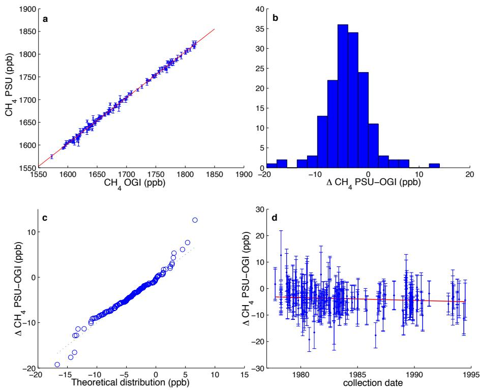  
Fig. S1. Stability of the OGI-PSU archive samples collected at Cape Meares, Oregon 1977– 1995. Plot of $\mathrm { C H } _ { 4 }$ values determined at PSU versus OGI (a) was determined to be linear (slope ${ \mathrm { : } } 0$ ) highly correlated $( \mathrm { r } ^ { 2 } { = } 0 . 9 9 6 )$ . A histogram (b) compares the difference between paired analyses and had a mean value of $4 . 1 { \pm } 4 . 2 $ ppb $\left( \pm 1 \sigma \right)$ higher at OGI, considered to originate from laboratory calibration. A quantile-quantile plot (c) comparing the difference between paired analyses to a randomly sampled Gaussian distribution follows the $\tt X { = } \tt y$ line with a few outlier values. The mean difference between PSU and OGI concentrations is absent of any significant temporal trend (d), supportive of in-canister sample storage stability.

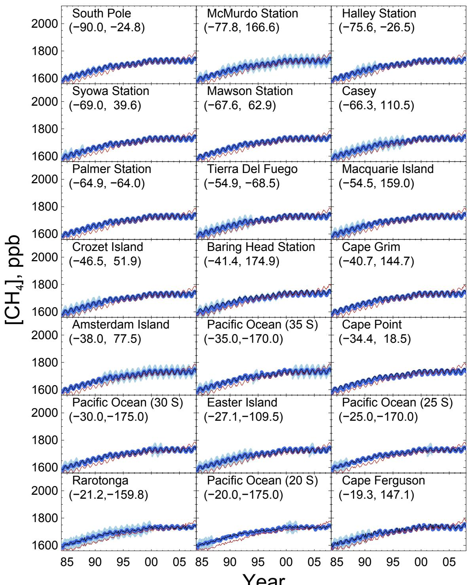

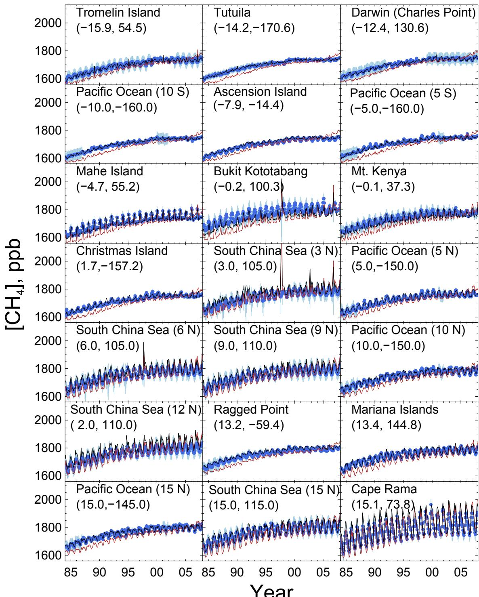

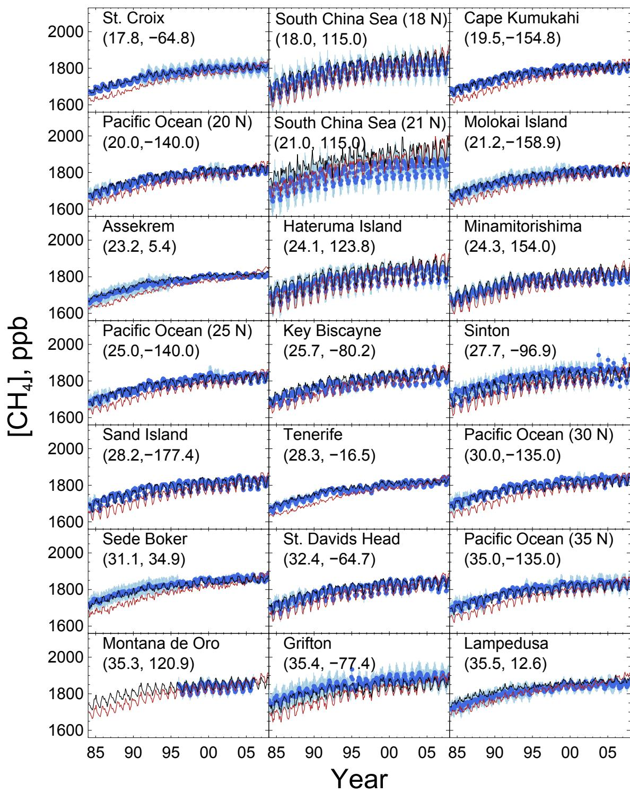

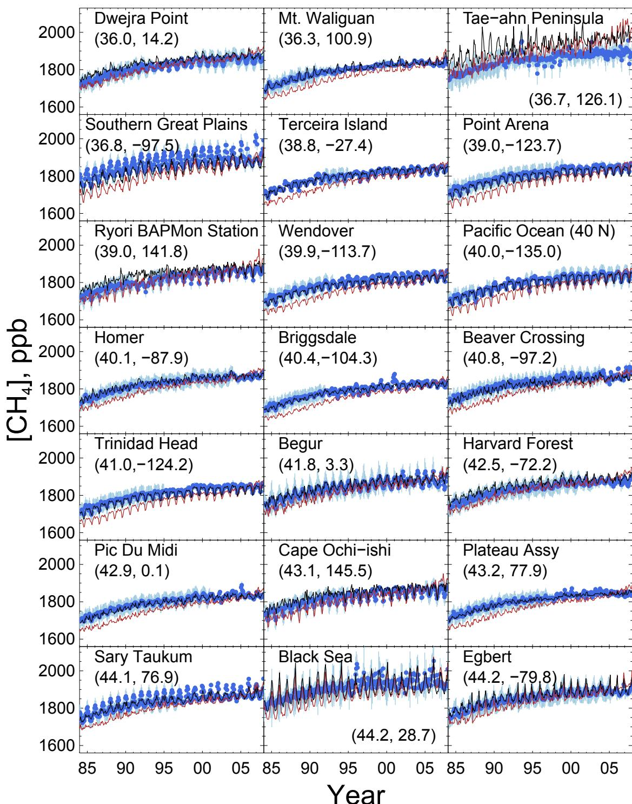

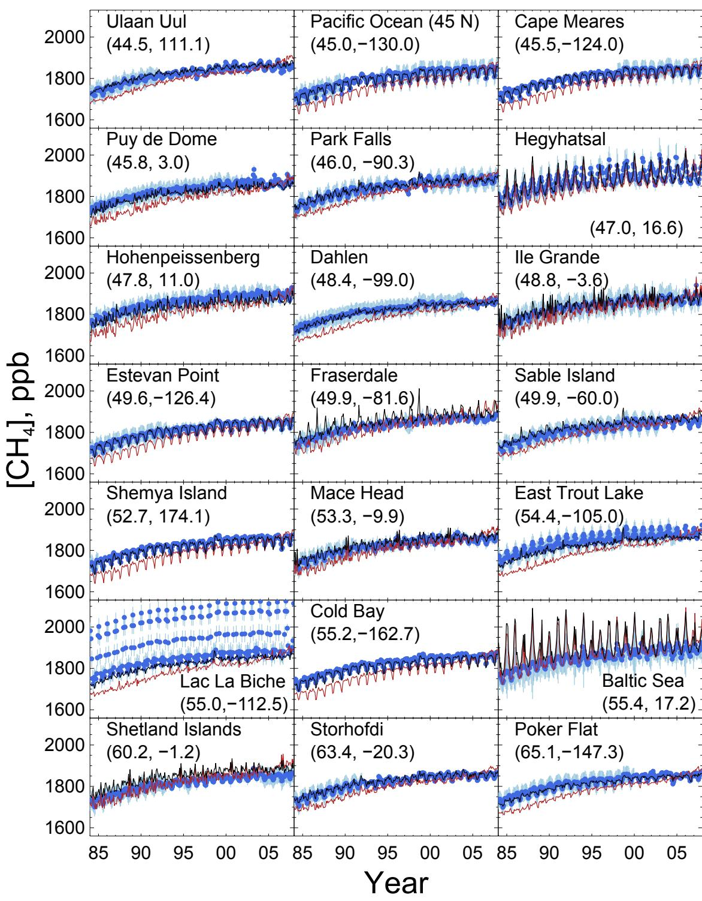

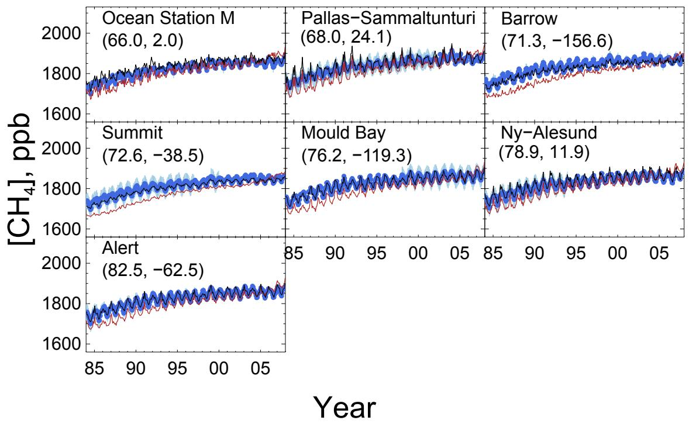

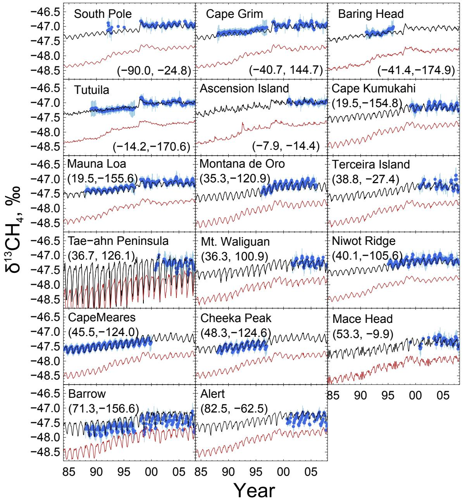  
Fig. S2. Comparison of smoothed observations (blue) of $\mathrm { C H } _ { 4 }$ concentration from GLOBALVIEW- $\mathrm { C H } _ { 4 }$ and $\boldsymbol { \delta } ^ { 1 3 } \boldsymbol { \mathrm C }$ of $\mathrm { C H } _ { 4 }$ from PSU, UCI, INSTAAR, and UW (Table S3) with modeled values at each observational site. Results are shown for emissions inventories source estimates (a priori in red) and for optimized base-case inversion (a posteriori in black) over the modeled period 1984–2009.

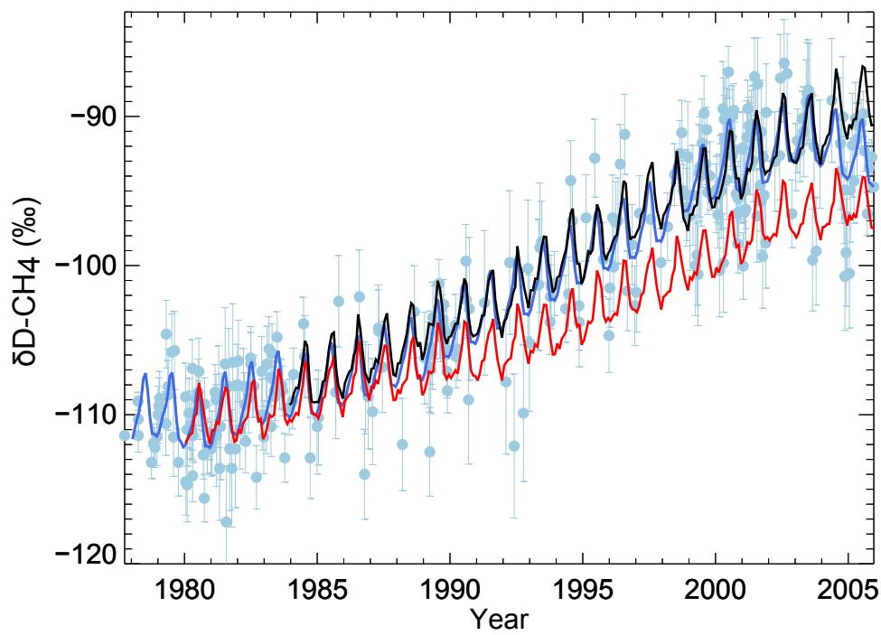  
Fig. S3. Comparison of composite northern hemisphere mid-latitude observations of δD of $\mathrm { C H } _ { 4 }$ (blue points) and smoothed observational data (blue line) with model output at Cape Meares, Oregon for a priori emissions (red) and optimized a posteriori emissions (black) over the period of observations (1977–2006).

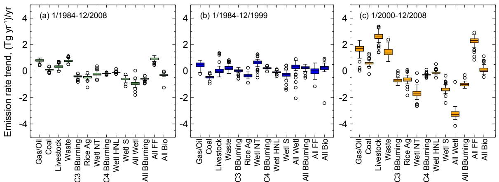  
Fig. S4. Box and whisker plots showing the range of trends in $\mathrm { C H } _ { 4 }$ source categories inferred from the ensemble of model inversion sensitivity studies (Table S4.) over modeled periods 1984–2009 (a), 1984–2000 (b) and 2000–2009 (c). The box shows the 25th and 75th percentiles of the trends, the middle line is drawn at the median, and the whiskers extend out to the largest and smallest trends within 1.5 times the interquartile range. Outliers are marked with a circle.

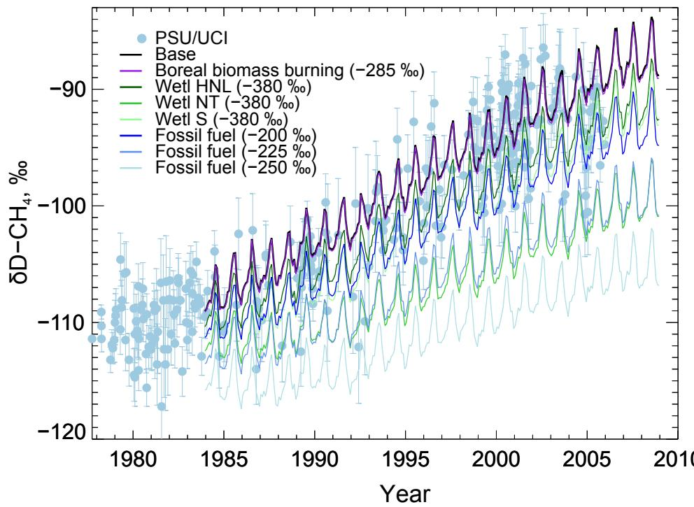  
Fig. S5. Sensitivity studies of the δD of atmospheric $\mathrm { C H } _ { 4 }$ to changes in source isotopic composition (δD); comparison between modeled output at Cape Meares, Oregon and observations (Fig. 1c.). The effects of decreasing source isotopic composition from: boreal biomass burning $( - 2 8 5 \text{‰}$ , purple); wetland high northern hemisphere latitude $( - 3 8 0 \text{‰}$ , green top); wetland northern hemisphere tropics $( - 3 8 0 \text{‰}$ , green bottom); wetland southern hemisphere tropics $( - 3 8 0 \text{‰}$ , green middle); fossil fuels $( - 20 \text{‰}$ , top); fossil fuels $( - 2 2 5 \text{‰}$ , middle); fossil fuels (–250, bottom).

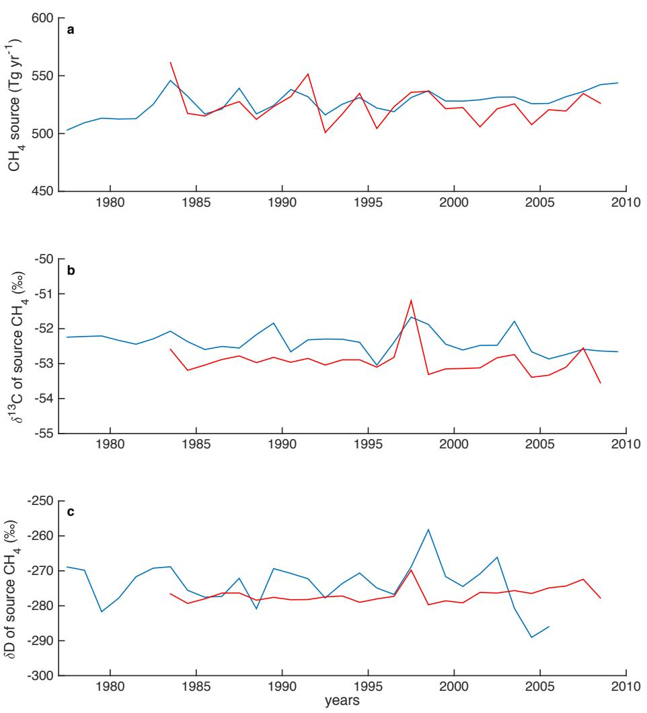  
Fig. S6. Calculated annual global $\mathrm { C H } _ { 4 }$ source strength (a) globally weighted source $\boldsymbol { \delta } ^ { 1 3 } \boldsymbol { \mathrm { C } }$ (b) and source δD (c) based on: observations from the composite northern hemisphere middle latitude dataset (blue) from Fig. 1 using a simple source-sink box model

where $\tau _ { \mathrm { C H } 4 } { = } 9 . 7$ yr for $\mathrm { C H } _ { 4 }$ and isotopologue tracers $^ { 1 3 } \mathrm { C H } _ { 4 }$ and $\mathrm { C H } _ { 3 } \mathrm { D }$ with kinetic isotope effects (α) $\alpha _ { 1 3 \mathrm { C } } { = } 1 . 0 0 5 6$ and $\mathrm { \Delta q _ { C H 3 D } } { = } 1 . 2 6 4$ ; optimized global emissions for the base case scenario from GEOS-Chem model inversion (red).

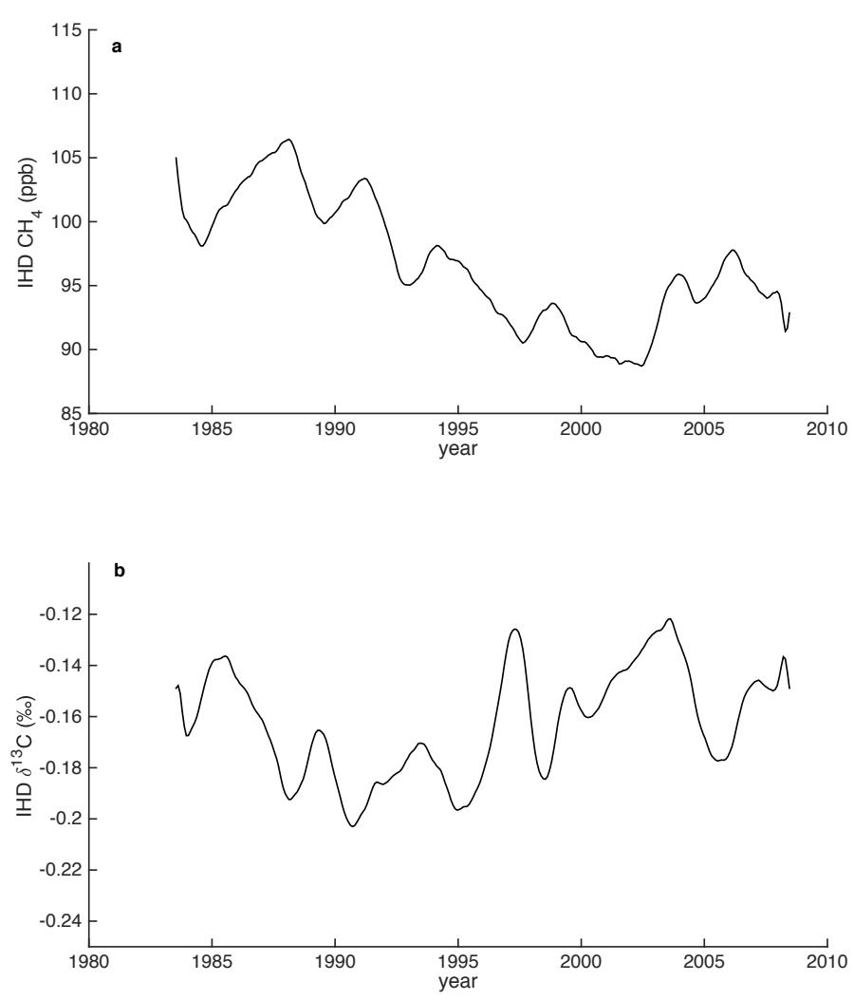  
Fig. S7. Interhemispheric difference (IHD) in $\mathrm { C H } _ { 4 }$ (a) and $\boldsymbol { \delta } ^ { 1 3 } \boldsymbol { \mathrm { C } }$ (b) from optimized model base case defined as in Kai et al. for comparison as the difference between Niwot Ridge, CO and Baring Head, NZ (data from Fig. S2). The secular trend in the IHD is $- 0 . 4 9 { \pm } 0 . 0 5$ ppb $\mathrm { C H } _ { 4 }$ yr-1 $( \mathrm { r } ^ { 2 } { = } 0 . 5 4 )$ and $0 . 0 0 0 9 8 { \scriptstyle \pm 0 . 0 0 0 3 \% }$ $( \delta ^ { 1 3 } \mathrm { C } )$ yr-1 $( \mathrm { r } ^ { 2 } { = } 0 . 1 1 )$ ) over the period 1984–2009.

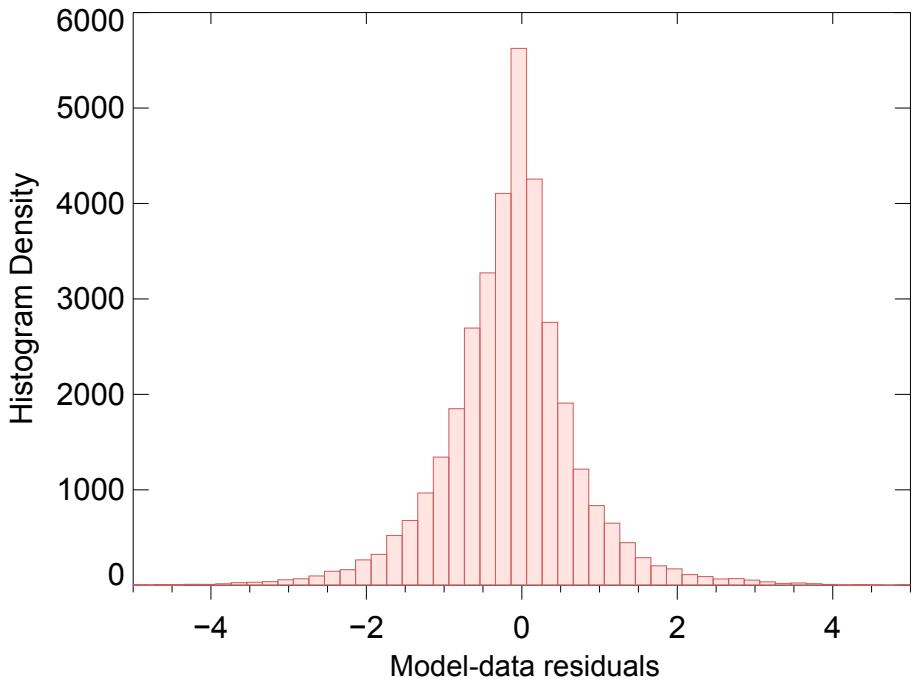  
Fig. S8. Histogram of residuals between the optimized model and measured $\mathrm { C H } _ { 4 }$ concentrations and $\delta ^ { 1 3 } \mathrm { C - C H } _ { 4 }$ divided by the corresponding uncertainties. Results from base case are shown; sensitivity studies produced similar results.