# Supporting Information for: Microbial driver of 2006 – 2023 CH4 growth indicated by trends in atmospheric $\delta \mathsf { D } \mathsf { - C } \mathsf { H } _ { 4 }$ and $\delta ^ { 1 3 } \mathsf { C } \mathsf { \mathbf { - C H _ { 4 } } }$

Ben Riddell-Young1,2; Sylvia Englund Michel3,4; Xin Lan1,2; Pieter Tans3; Thomas Röckmann5; Bibhasvata Dasgupta5; Youmi Oh1,2; Lori Bruhwiler1,2; Ryo Fujita6; Taku Umezawa7,8; Shinji Morimoto7; John Miller2

# This PDF file includes:

Supporting text Figures S1 to S13 Tables S1 to S6 SI References

# Supporting Information Text

1. Shale Gas Impact on Fossil Fuel Source Signatures

The United States dominates global shale gas production, though China, Argentina, and Canada have ramped up production in recent years (eia.gov). Following (1), we compiled conventional ONG and shale gas $\mathrm { C H } _ { 4 }$ isotopic measurements for each country and flux-weighted them using production rate data (eia.gov) to determine the mean ONG source signature and its temporal variability. We found that China’s ONG $\delta \mathrm { D - C H } _ { 4 }$ and $\delta ^ { 1 3 } \mathrm { C - C H } _ { 4 }$ became more enriched by $0 . 8 5 \text{‰}$ and $5 . 7 \text{‰}$ , respectively, from 2007 to 2022 due to increased shale gas production data (Fig. S4c). Canada’s ONG $\delta ^ { 1 3 } \mathrm { C - C H } _ { 4 }$ increased by $2 . 5 \text{‰}$ across the same time period. No estimate for changes in ONG $\delta \mathrm { D - C H } _ { 4 }$ due to shale gas could be made for Argentina due to a lack of isotopic data. For the United States, there is sufficient isotopic data to flux-weight US ONG $\delta ^ { 1 3 } \mathrm { C - C H } _ { 4 }$ and $\delta \mathrm { D - C H } _ { 4 }$ by basin-level conventional and shale gas ONG production data (1). Despite incorporating additional data, our results align with those of (1), with US ONG $\delta ^ { 1 3 } \mathrm { C - C H } _ { 4 }$ increasing by $2 \text{‰}$ between 2007 and 2022 (Fig. S4b). Our expanded analysis of US ONG $\delta \mathrm { D - C H } _ { 4 }$ reveals $\text{‰}$ fluctuations but with little net change over the same period (Fig. S4a). For countries with no shale gas production, we assume constant ONG and coal source signatures over time.

# 2. Fossil Fuel Source Signature Flux-weighting Method Sensitivity

Our uncertainties in global mean fossil fuel source signatures do not consider uncertainties in the spatiotemporal distribution of emissions used in the flux-weighting (methods section 2.1). To test this effect, we flux-weighted our fossil fuel source signature maps (Fig. S3a-d) using posterior CT-$\mathrm { C H } _ { 4 } ~ 1 { \times } 1 ^ { \circ }$ gridded emissions and compared the global mean with the EDGAR8 emission inventory flux-weighting scheme (methods section 2.1). Because CT- $\mathrm { C H } _ { 4 }$ does not partition between coal and ONG emissions in the posterior (2), the prior (EDGAR8) grid cell-level partitioning was used to calculate the fossil source signature of each grid cell before global flux-weighting. We found that flux weighting with CT- $\mathrm { . C H _ { 4 } }$ emissions reduces fossil fuel $\delta \mathrm { D - C H } _ { 4 }$ and $\delta ^ { 1 3 } \mathrm { C - C H } _ { 4 }$ by approximately $5 \text{‰}$ and $1 \text{‰}$ , respectively, while preserving trends in the global mean after 2002 (Fig. S5). This shift is mainly driven by a reduction in East Asian emissions in the CT- $\mathrm { C H } _ { 4 }$ posterior, where fossil source signatures are enriched in $^ { 1 3 } \mathrm { C }$ and D (2). We incorporated these alternate global mean source signatures into our isotope mass balance calculations (equations $9 -$ 11) and found that calculated total fossil emissions are ${ < } 1 0 \ \mathrm { T g \ y r ^ { - 1 } }$ higher and remain within the uncertainty bounds, and post-2006 emission trends remain unchanged (Fig. S11). This underscores the advantage of $\delta ^ { 1 3 } \mathrm { C - C H } _ { 4 }$ and $\delta \mathrm { D - C H } _ { 4 }$ records in constraining emission trends more effectively than total emissions. Flux-weighting uncertainties are considered in global mean microbial and biomass burning source signature calculations (Fig. S8; methods section 2.2 – 2.3).

Supporting Figures:

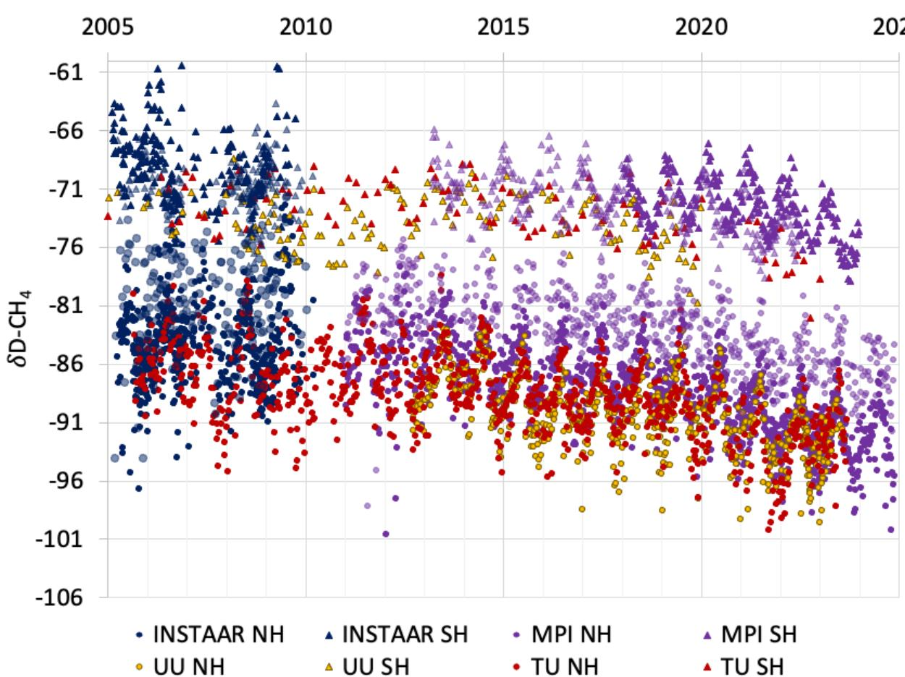  
Fig. S1. Atmospheric $\delta \mathrm { D - C H } _ { 4 }$ Measurements. Marine Boundary Layer measurements of $\delta \mathrm { D - C H } _ { 4 }$ from INSTAAR (dark blue), MPI-BGC (purple), Utrecht University IMAU (yellow), and TU/NIPR (red) and the BUDS project (light blue). All data are harmonized to the MPI scale (Table S1) (3). NH and SH measurements are displayed as circles and triangles, respectively. Data from tropical sampling sites $\mathit { \Omega } ^ { \prime } < 3 0 \ \mathrm { { ^ \circ N } }$ and $< 3 0 ~ ^ { \circ } \mathrm { S }$ ) are shown as faded points.

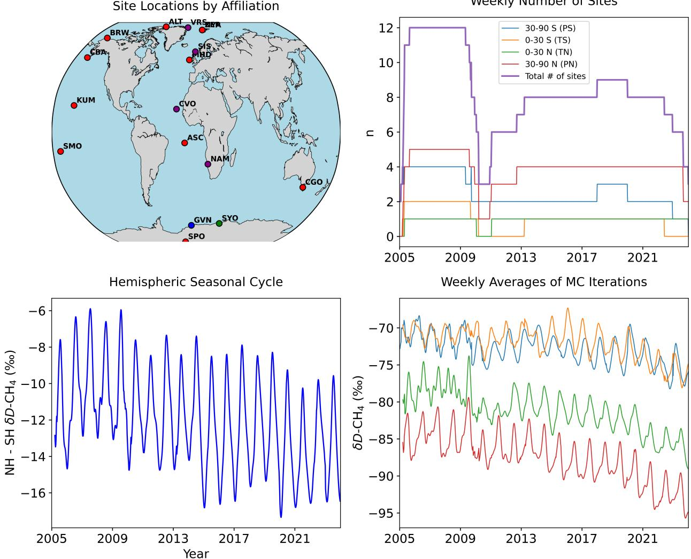  
Fig. S2. Semi-hemispheric $\delta \mathrm { D - C H } _ { 4 }$ and seasonal cycle. (Top Left) World map showing the locations of MBL sites used in the global mean $\delta \mathrm { D - C H } _ { 4 }$ calculations. Sites are color coded based on the lab that produced the data $( \mathrm { P u r p l e } = \mathrm { M P I } . $ , B $\mathrm { { u e } = \mathrm { { I M A U } } }$ , $\mathrm { G r e e n } = \mathrm { N I P R }$ , Orange $=$ INSTAAR). Note that several labs share site locations: IMAU and NIPR share NYA/ZEP, and INSTAAR and MPI share ALT, and MPI and IMAU share GVN. (Top Right) Number of measurements available in a given week from 2005 to 2023. Total number of measurements (purple), $3 0 - 9 0 ^ { \circ } \mathrm { N }$ (red), $0 - 3 0 ^ { \circ } \mathrm { N }$ (orange), $0 - 3 0 ^ { \circ } \mathrm { S }$ (green) and $3 0 - 9 0 ^ { \circ } \mathrm { S }$ (blue). (Bottom Right) Weekly semi-hemispheric average $\delta \mathrm { D - C H } _ { 4 }$ (same color scheme as A). (Bottom Left) Weekly interhemispheric difference $\mathrm { ( 0 - 9 0 ^ { \circ } N }$ minus $0 - 9 0 ^ { \circ } \mathrm { S }$ ).

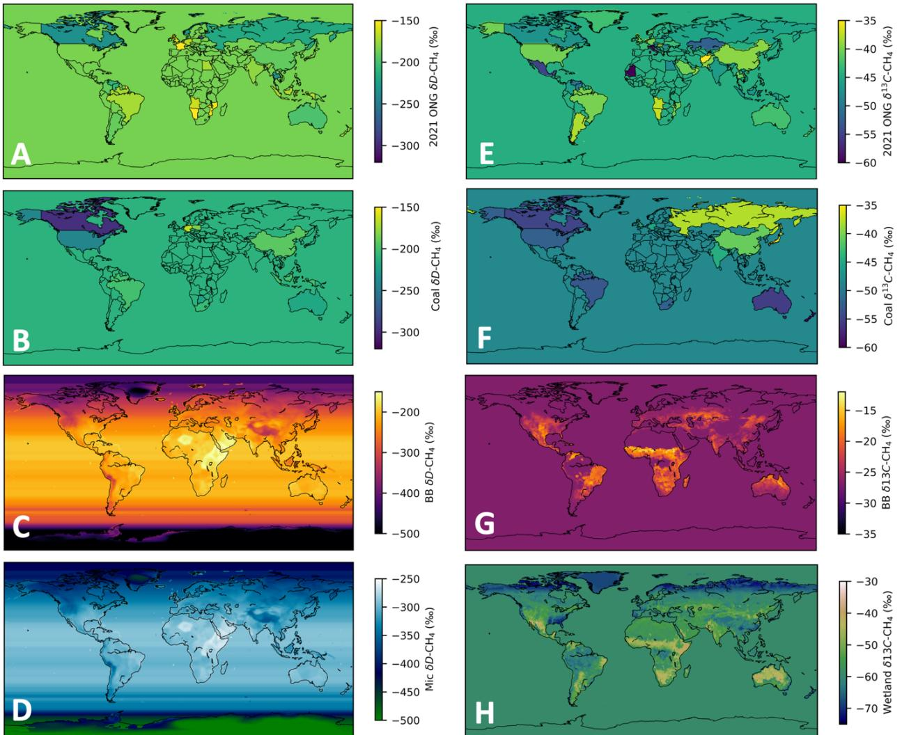  
Fig. S3. $1 ^ { \circ } \mathbf { x } 1 ^ { \circ }$ gridded Source Signature Maps. $\delta \mathrm { D - C H } _ { 4 }$ (A - D) and $\delta ^ { 1 3 } \mathrm { C - C H } _ { 4 }$ (E - H) source signature maps. (A & E) Country-specific oil and natural gas (ONG) $\mathrm { C H } _ { 4 }$ emission source signatures. The United States, China, and Canada source signatures vary temporally due to increased shale gas production and associated emissions (Fig. S4). (B & F) Country-specific coal $\mathrm { C H } _ { 4 }$ emission source signatures. (C & G) Pyrogenic (Biomass burning, BB) $\mathrm { C H } _ { 4 }$ emission source signatures. (D) Microbial emission $\delta \mathrm { D - C H } _ { 4 }$ . An alternative map was developed specifically for landfill emissions (not shown). (H) Wetland $\delta ^ { 1 3 } \mathrm { C - C H } _ { 4 }$ map (4). Note that although many grid cells have no $\mathrm { C H } _ { 4 }$ emissions (i.e., oceans), a theoretical value was provided to aid global 3D $\mathrm { C H } _ { 4 }$ modeling usage.

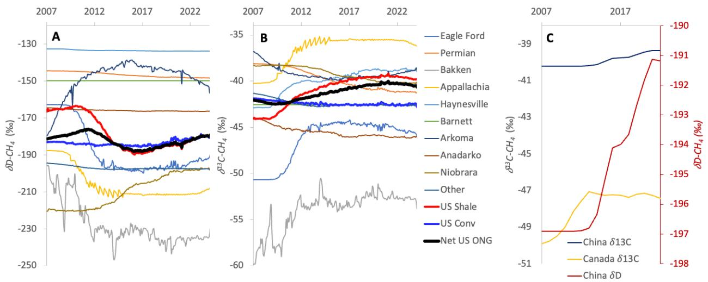  
Fig. S4. Shale gas influence on US, Canada and China ONG Source signatures. Trends in United States geologic basin-specific annual mean ONG $\delta \mathrm { D - C H } _ { 4 }$ (A) and $\delta ^ { 1 3 } \mathrm { C - C H } _ { 4 }$ (B) following Lan et al., 2021. Flux-weighted mean US source signatures for Shale (red), Conventional ONG (blue), and all ONG (black) are shown. (C) Annual mean Canada ONG $\delta ^ { 1 3 } \mathrm { C - C H } _ { 4 }$ (yellow), China ONG $\delta ^ { 1 3 } \mathrm { C - C H } _ { 4 }$ (blue) and China ONG $\delta \mathrm { D - C H } _ { 4 }$ (red). No estimates were made for Canadian ONG ?D-$\mathrm { C H } _ { 4 }$ due to lack of measurements. All trends are incorporated into global mean fossil fuel $\mathrm { C H } _ { 4 }$ emission source signature calculations.

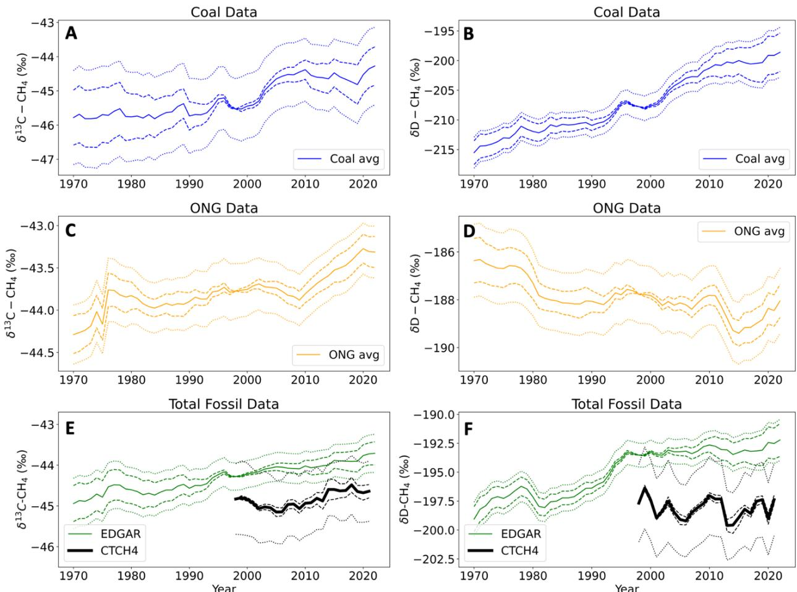  
Fig. S5. Global annual mean fossil fuel source signatures and uncertainty. Global annual mean coal (Blue; A, B), ONG (Yellow; C, D) and total fossil fuel (Green; E, F) source signatures for $\delta ^ { 1 3 } \mathrm { C - C H } _ { 4 }$ (A, C, & E) and $\delta \mathrm { D - C H } _ { 4 }$ (B, D, & F) calculated by weighting Fig. S3 source signature maps with the EDGAR V8 emission inventory. Total two-sigma uncertainty (dotted lines) and two-sigma uncertainty relative to 1998 (dashed lines). Global annual mean fossil fuel $\delta ^ { 1 3 } \mathrm { C - C H } 4$ and $\delta \mathrm { D - C H } _ { 4 }$ calculated by flux-weighting with CT- $\mathrm { . C H _ { 4 } }$ posterior emission fields are shown in black (E, F).

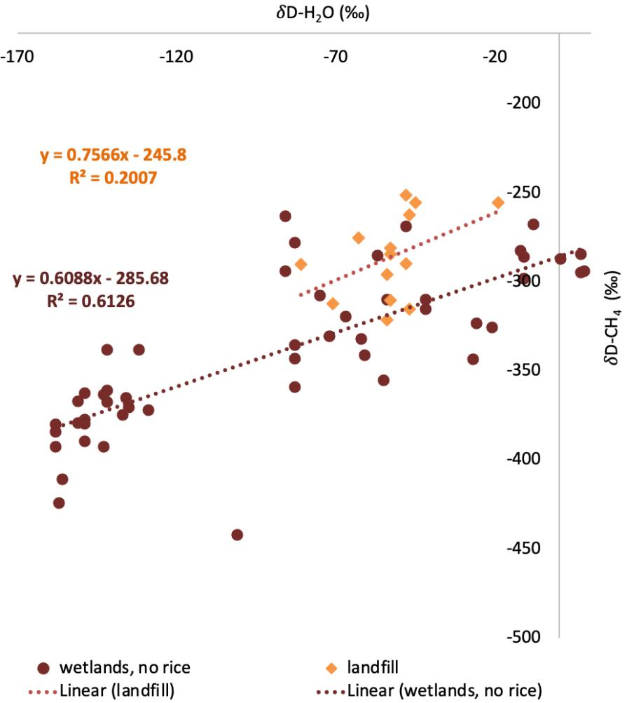  
Fig. S6. Microbial $\delta \mathrm { D - C H } _ { 4 }$ regression comparisons. Comparison of the relationship between ?D-$\mathrm { C H } _ { 4 }$ and $\delta \mathrm { D } { \cdot } \mathrm { H } _ { 2 } \mathrm { O }$ for landfill $\mathrm { C H } _ { 4 }$ emissions (orange) and wetland $\mathrm { C H } _ { 4 }$ emissions (maroon). Wetland data is from (5), and the landfill data is from our updated compilation (Table S2) (DOI for updated database will be published with manuscript). The local $\delta \mathrm { D } { \cdot } \mathrm { H } _ { 2 } \mathrm { O }$ was estimated using the global distribution of $\delta \mathrm { D } { \cdot } \mathrm { H } _ { 2 } \mathrm { O }$ from (6). Though uncertain, the similar slope and enriched intercept of the landfill regression is consistent with expectations (5).

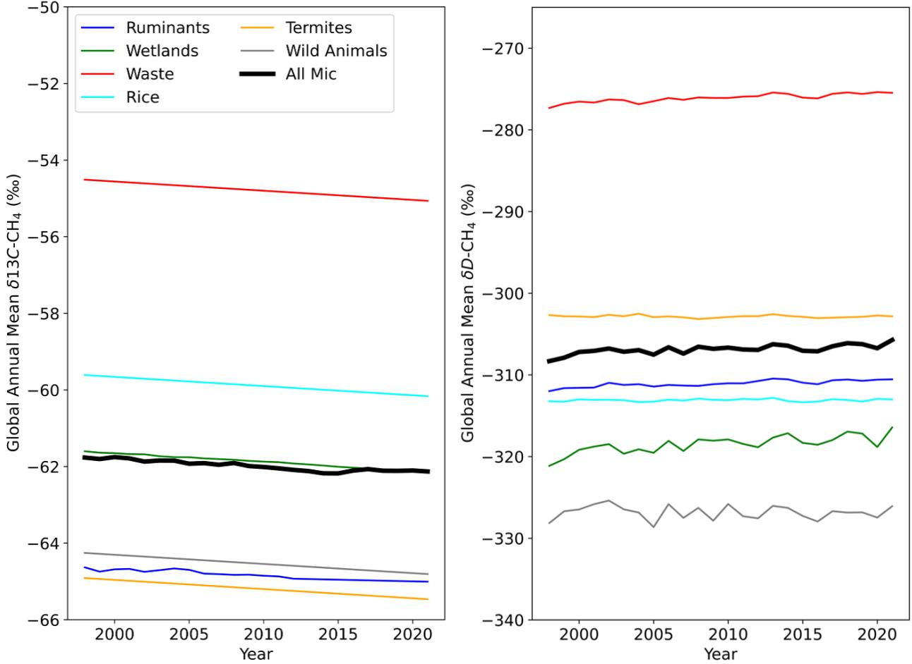  
Fig. S7. Global annual mean microbial $\delta \mathrm { D - C H } _ { 4 }$ and $\delta ^ { 1 3 } \mathrm { C - C H } _ { 4 }$ . Global annual flux-weighted mean microbial (black) and subcategory (color-coded) $\delta ^ { 1 3 } \mathrm { C - C H } _ { 4 }$ (left) and $\delta \mathrm { D - C H } _ { 4 }$ (right). The global mean ruminant source signature was extended to 2022 by extrapolating the linear decreasing trend identified in the study beginning in 2012 (7).

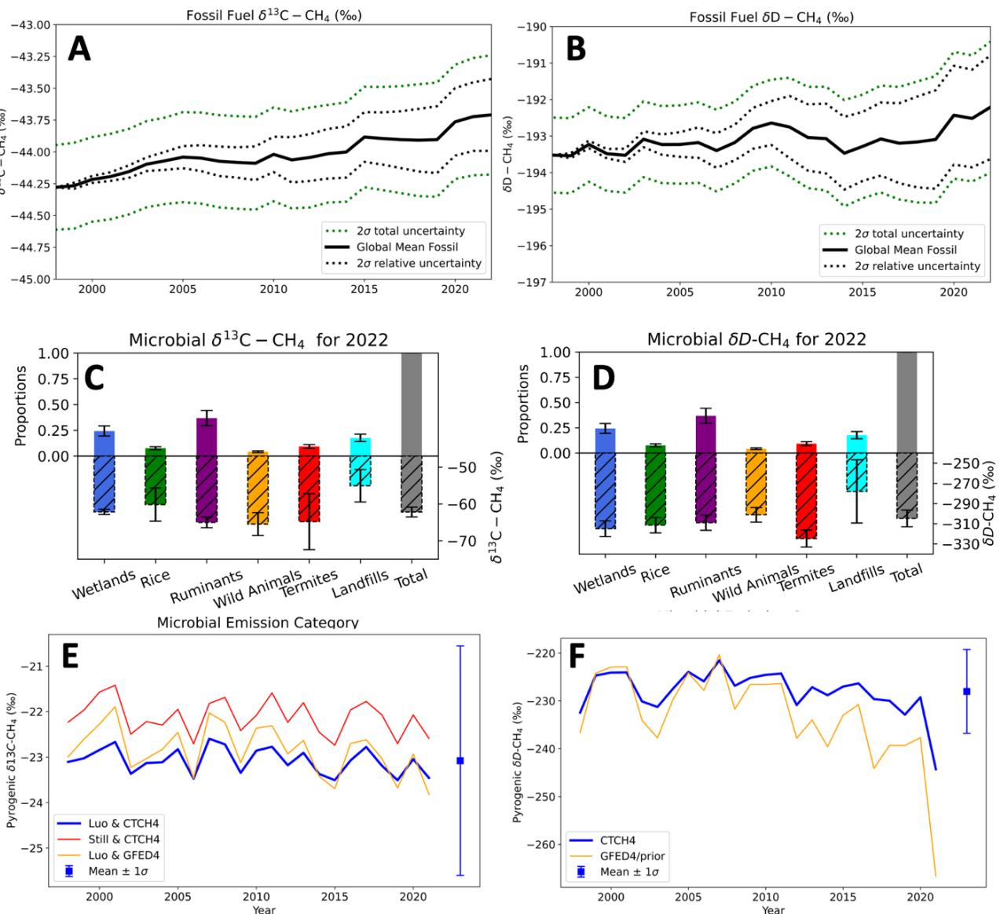  
Fig. S8. Global annual mean source signatures and uncertainty. (A) Global mean $\delta ^ { 1 3 } \mathrm { C - C H } _ { 4 }$ of fossil fuel $\mathrm { C H } _ { 4 }$ emissions (solid black line). Total two-sigma uncertainty (green dotted line) and two-sigma uncertainty relative to 1998 (black dotted line). (B) Same as (A) but for $\delta \mathrm { D - C H } _ { 4 }$ . (C) Global mean microbial emission subcategory $\delta ^ { 1 3 } \mathrm { C - C H } _ { 4 }$ (bottom dashed bar) and each subcategory’s contribution to total microbial emissions (top solid bar) and $1 \sigma$ uncertainties (see table S4 for values). Subcategories are color-coded and the net global average microbial $\delta ^ { 1 3 } \mathrm { C - C H } _ { 4 }$ and 1σ uncertainty is shown in gray. Results are shown for the year 2022. (D) Same as (C) but for $\delta \mathrm { D - C H } _ { 4 }$ . (E) Global annual mean pyrogenic $\delta ^ { 1 3 } \mathrm { C - C H } _ { 4 }$ for each year calculated by flux-weighting the source signature map using GFEDv4.1 emissions (8) and $\mathrm { C } 3 / \mathrm { C } 4$ data from (9) (yellow), CT-$\mathrm { C H } _ { 4 }$ posterior emissions and $\mathrm { C } 3 / \mathrm { C } 4$ data from (10) (red) and $\mathrm { C T - C H } _ { 4 }$ posterior emissions and $\mathrm { C } 3 / \mathrm { C } 4$ data from (9) (blue). Note the good agreement between the prior and posterior fluxweighting methods, but more negative values using the more recent $\mathrm { C } 3 / \mathrm { C } 4$ map (blue line) (9). The CT- $\mathrm { C H } _ { 4 }$ mean and standard deviation of all years and MC simulations is shown on the right of the subplot. (F) same as (E) but for $\delta \mathrm { D - C H } _ { 4 }$ , with results from flux-weighting with GFED4.1 (yellow) and CT- $\mathrm { C H } _ { 4 }$ (blue).

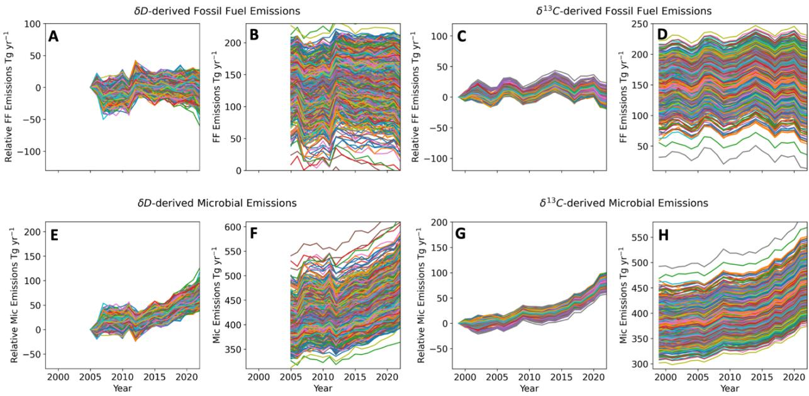  
Fig. S9. Spaghetti diagrams of mass balance fluxes. Monte Carlo spaghetti diagrams show the uncertainty range of trends in global annual emissions by plotting the emissions relative to 1998 or 2005 (A, C, E, G) and both uncertainty in the trends and mean values of global annual emissions by plotting total emissions (B, D, F, H). (A, B) ?D-derived Fossil Fuel emissions (C, D) $\delta ^ { 1 3 } \mathrm { C } \mathrm { - }$ derived Fossil Fuel emissions, (E, F) ?D-derived Microbial emissions, (G, H) $\delta ^ { 1 3 } \mathrm { C }$ -derived Microbial emissions.

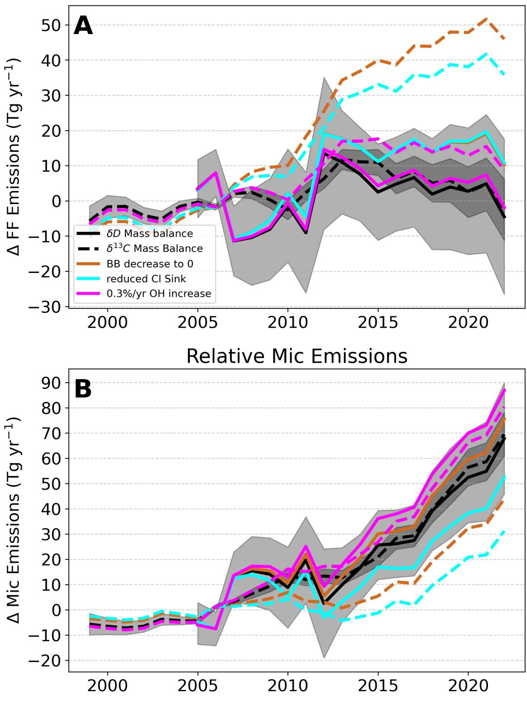  
Fig. S10. FF and microbial emission estimates from changing BB Emissions, Cl Sink, and OH sink. Relative Fossil Fuel (A) and microbial (B) emissions for the $\delta \mathrm { D - C H } _ { 4 }$ (solid lines) and $\delta ^ { 1 3 } \mathrm { C } \mathrm { - }$ $\mathrm { C H } _ { 4 }$ (dashed lines) mass balances. Baseline scenario two-sigma error windows are shaded. The mass balance results for a $100 \%$ reduction in pyrogenic emissions from 2005 to 2022 are shown in brown. The mass balance results for a reduction in the Cl sink from $3 . 5 \%$ to $1 . 0 \%$ of the total sink from 2005 to 2022 are shown in cyan. The mass balance results for an increase in the OH sink from recent estimates (11, 12) from 2005 to 2022 are shown in pink.

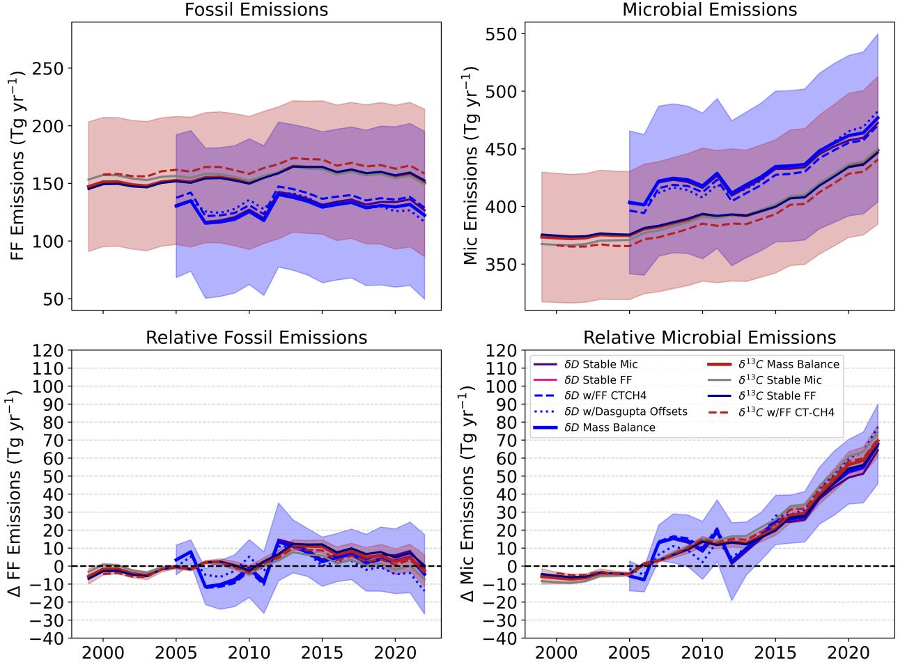  
Fig. S11. Source signature sensitivity tests. (A) Global fossil fuel emissions. (B) Global microbial emissions. (C) Change in fossil fuel emissions relative to the $2 0 0 5 - 2 0 0 7$ average. (D) Change in microbial emissions relative to the $2 0 0 5 - 2 0 0 7$ average. Best-guess results are shown for $\delta \mathrm { D - C H } _ { 4 }$ (blue) and $\delta ^ { 1 3 } \mathrm { C - C H } _ { 4 }$ (maroon) with two-sigma uncertainty shading. Additional scenarios with no uncertainty windows are as follows: Mass balance results calculated with stable microbial $\delta \mathrm { D - C H } _ { 4 }$ (purple), stable microbial $\delta ^ { 1 3 } \mathrm { C - C H } _ { 4 }$ (gray), stable fossil fuel $\delta \mathrm { D - C H } _ { 4 }$ (pink), stable fossil fuel $\delta ^ { 1 3 } \mathrm { C - C H } 4$ (dark blue). Dashed maroon and blue lines display mass balance results calculated using global mean fossil fuel source signatures flux-weighted with CT-CH4 posterior emissions as opposed to EDGAR inventories like in the baseline scenario. Dotted blue lines display mass balance results calculated using global mean $\delta \mathrm { D - C H } _ { 4 }$ that was determined using lab offsets from ref (13) (Table S1). Some lines are difficult to see because of overlap with the baseline modeling scenario, highlighting the minimal impact of certain sensitivity tests.

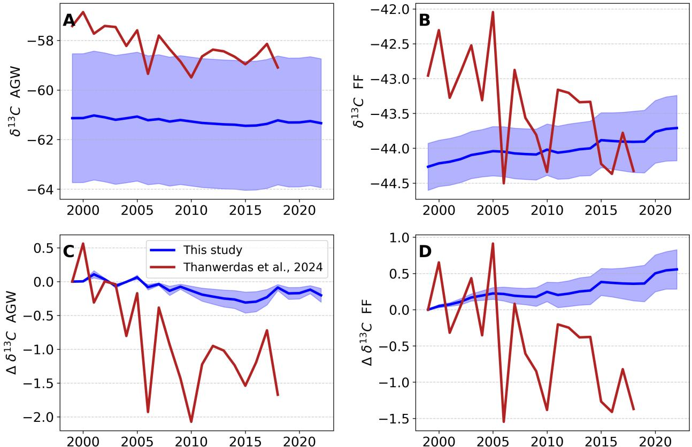  
Fig. S12. Source signature trend comparison to (14). Global mean (A & C) agriculture and waste (AGW) and (B & D) fossil fuel (FF) $\delta ^ { 1 3 } \mathrm { C - C H } _ { 4 }$ from (14) (red) and this study with two sigma uncertainty windows used in our mass balance approach (blue line and shading). (A & B) Absolute source signatures and (C & D) trends relative to 1999. Global mean AGW $\delta ^ { 1 3 } \mathrm { C - C H } _ { 4 }$ in our study was calculated using the weighting approach for global mean microbial $\delta ^ { 1 3 } \mathrm { C - C H } _ { 4 }$ , limited to the landfill, rice, and ruminant subcategories (Methods section 2.2).

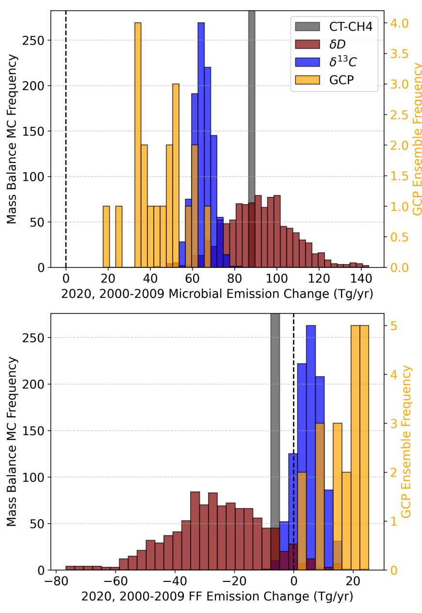  
Fig. S13. Comparison to other studies. Histogram showing the unsmoothed change in microbial (A) and fossil fuel (B) emissions from the 2000-2009 average (2005 to 2009 for the $\delta \mathrm { D - C H } _ { 4 }$ mass balance) to 2020 for the Monte Carlo mass balance for $\delta ^ { 1 3 } \mathrm { C - C H } _ { 4 }$ (blue bars) and $\delta \mathrm { D - C H } _ { 4 }$ (maroon bars), the $\mathrm { C T - C H _ { 4 } }$ posterior (gray bar) (2), and the Global Carbon Project (GCP) ensemble members (yellow bars) (15). The vertical black dashed lines indicate no change.

# Supporting Tables:

<table><tr><td>Lab</td><td># of MBL Sites</td><td> Time frame</td><td>N</td><td>Umezawa MPI Offset (%o)</td><td>Dasgupta MPI Offset (%o)</td></tr><tr><td>INSTAAR</td><td>10</td><td>2005-2009</td><td>1118</td><td> - 11.5 ± 1.5 *</td><td>- 10.9 ± 2.2 *</td></tr><tr><td>MPI BGC</td><td>6</td><td>2010-2024</td><td>2252</td><td>=</td><td>=</td></tr><tr><td>UU IMAU</td><td>5</td><td>1988-2024</td><td>1053</td><td>+ 4.2 ± 1.2</td><td>+ 2.4± 1.6</td></tr><tr><td>TU NIPR</td><td>2</td><td>1995-2023</td><td>962</td><td>- 8.9 ± 1.3</td><td>- 10.8 ± 1.6</td></tr></table>

Table S1. Summary of all MBL data used to calculate global mean. From left to right, laboratory name, # of MBL measurement sites available, years that data is available, number of measurements available, and the mean and standard deviation of lab offsets from (3) with the new comparison $( ^ { * } )$ , and the recent lab offset estimates from (13) between MPI and INSTAAR.

Table S2. Summary of all source signature measurements for each subcategory in the updated source signature database. “New N” refers to the number of new measurements compiled by this study. New N was calculated by subtracting the number of measurements in (1) from the new total (N).   

<table><tr><td rowspan="2">Category</td><td rowspan="2">Subcategory</td><td colspan="2">813C-CH4</td><td colspan="2">8D-CH4</td></tr><tr><td>N</td><td>New N</td><td>N</td><td>New N</td></tr><tr><td rowspan="7">Microbial</td><td>Wetlands</td><td>2135</td><td>1287</td><td>949</td><td>750</td></tr><tr><td>Landfills/Waste</td><td>395</td><td>338</td><td>147</td><td>119</td></tr><tr><td>Rice paddies</td><td>375</td><td>122</td><td>83</td><td>19</td></tr><tr><td>Ruminants/Wild</td><td>313</td><td></td><td></td><td></td></tr><tr><td>Animals</td><td></td><td>142</td><td>112</td><td>18</td></tr><tr><td>Termites</td><td>36</td><td>7</td><td>1</td><td>0</td></tr><tr><td>Total</td><td>3254</td><td>1896</td><td>1292</td><td>906</td></tr><tr><td rowspan="5">Fossil Pyrogenic</td><td>Coal</td><td>1989</td><td>587</td><td>745</td><td>234</td></tr><tr><td>Oil &amp; Natural Gas</td><td>7487</td><td>1407</td><td>2498</td><td>527</td></tr><tr><td>Shale Gas</td><td>1735</td><td>1089</td><td>512</td><td>115</td></tr><tr><td>Total</td><td>11211</td><td>3083</td><td>3755</td><td>876</td></tr><tr><td>Total</td><td>964</td><td>57</td><td>42</td><td>38</td></tr></table>

Table S3. Summary of KIEs (Kinetic Isotope Effects, with the conventions $^ { 1 2 } \mathrm { C } / ^ { 1 3 } \mathrm { C }$ and $\mathrm { H } / \mathrm { D }$ respectively) for $^ { 1 3 } \mathrm { C }$ and deuterium for specific atmospheric $\mathrm { C H } _ { 4 }$ sinks and the net sink. Superscripts denote the reference for each KIE: 1 (16); 2 (17); 3 (18); 4 (19); 5 (20). The total sink proportion for the chlorine (21), stratosphere (22), soil (23), and OH (24) sinks are shown.   

<table><tr><td>Sink</td><td>Proportion of Total Sink</td><td>13CKIE</td><td>DKIE</td></tr><tr><td>CH4 + OH</td><td>0.835</td><td>1.0054 1</td><td>1.294 2</td></tr><tr><td>CH4 + Cl</td><td>0.035</td><td>1.066 3</td><td>1.520 3</td></tr><tr><td>Stratospheric Loss</td><td>0.06</td><td>1.003 4</td><td>1.179 4</td></tr><tr><td>Soil Oxidation</td><td>0.07</td><td>1.020 5</td><td>1.083 5</td></tr><tr><td>Net Sink</td><td>1.00</td><td>1.0082</td><td>1.281</td></tr></table>

Table S4. Summary of microbial emission subcategory source signatures $\delta ^ { 1 3 } \mathrm { C - C H } _ { 4 }$ and $\delta \mathrm { D - C H } _ { 4 }$ used to calculate the global mean. Values are shown for the year 2022 as in Fig. S8. See methods section 2.2 for details on the mean and uncertainty calculations.   

<table><tr><td rowspan="2">Microbial Subcategory</td><td colspan="2">813C-CH4</td><td colspan="2">8D-CH4</td></tr><tr><td>Mean</td><td>1σ Unc.</td><td>Mean</td><td>1σ Unc.</td></tr><tr><td>Wetlands</td><td>- 62.1%o</td><td>± 0.7%0</td><td>- 313.2%0</td><td>± 7.4%0</td></tr><tr><td>Ruminants</td><td>- 65.0%0</td><td>± 1.5%0</td><td>- 309.4%0</td><td>± 7.2%0</td></tr><tr><td>Waste</td><td>- 55.1%0</td><td>± 4.4%0</td><td>- 279.4%0</td><td>± 27.4%0</td></tr><tr><td>Rice Paddies</td><td>- 60.2%0</td><td>± 4.5%0</td><td>- 311.8%0</td><td>± 7.3%0</td></tr><tr><td>Wild Animals</td><td>-65.5%0</td><td>± 3.1%0</td><td>- 301.4%0</td><td>± 6.8%0</td></tr><tr><td>Termites</td><td>- 64.8%0</td><td>± 7.6%0</td><td>- 323.1%0</td><td>±8.0%0</td></tr><tr><td>Net Microbial</td><td>- 62.1%0</td><td>± 1.3%0</td><td>- 304.8%0</td><td>±8.0%0</td></tr></table>

Table S5. Summary of methods used to calculate global mean $\delta ^ { 1 3 } \mathrm { C - C H } _ { 4 }$ source signatures. The 2023 version of $\mathrm { C T - C H _ { 4 } }$ posterior emissions was used for flux weighting when specified. See methods section 2 for details.   

<table><tr><td>Category</td><td>813C-CH4 Source signature calculations</td></tr><tr><td>Wetlands</td><td>Annual global mean from (4).</td></tr><tr><td>Landfills/Waste</td><td>Global mean of all measurements with imposed Suess Effect trend.</td></tr><tr><td>Rice paddies</td><td>Global mean of all measurements with imposed Suess Effect trend.</td></tr><tr><td>Ruminants</td><td>Global mean of all measurements with imposed Suess Effect trend.</td></tr><tr><td>Wild Animals</td><td>Annual global mean from (7) with extrapolated trend.</td></tr><tr><td>Termites</td><td>Global mean of all measurements with imposed Suess Effect trend.</td></tr><tr><td>Total Microbial</td><td>Subcategory global mean 8l3C-CH4 weighted with CT-CH4 posterior microbial subcategory proportions.</td></tr><tr><td>Coal</td><td>Country-specific 813C-CH4 map flux-weighted with EDGARv8 emissions.</td></tr><tr><td>ONG</td><td>Country-specific 813C-CH4 map (US, China &amp; Canada time-varying) flux-weighted with EDGARv8 emissions.</td></tr><tr><td>Geologic</td><td>Assumed the same as total fossil.</td></tr><tr><td>Total Fossil Fuel</td><td>Coal and ONG &amp;l3C-CH4 maps flux-weighted with EDGARv8 emission</td></tr><tr><td>Biomass Burning</td><td>Time-varying δ13C-CH4 map from (9) flux-weighted with CT-CH4 posterior biomass burning emissions.</td></tr></table>

Table S6. Same as table S5 but for $\delta \mathrm { D - C H } _ { 4 }$ source signatures.   

<table><tr><td>Category</td><td>&amp;D-CH4 Source signature calculations</td></tr><tr><td>Wetlands</td><td>Microbial &amp;D-CH4 map based on regression from (5), flux-weighted with CT-CH4 posterior wetland emissions.</td></tr><tr><td>Landfills/Waste</td><td>Landfill δD-CH4 map based on new landfill-specific regression (Fig. S6), flux-weighted with CT-CH4 posterior landfill emissions.</td></tr><tr><td>Rice paddies</td><td>Same methodology as for wetland &amp;D-CH4.</td></tr><tr><td>Ruminants</td><td>Same methodology as for wetland SD-CH4.</td></tr><tr><td>Wild Animals</td><td>Same methodology as for wetland δD-CH4.</td></tr><tr><td>Termites</td><td>Same methodology as for wetland SD-CH4.</td></tr><tr><td>Total Microbial</td><td>Subcategory global mean SD-CH4 weighted with CT-CH4 posterior subcategory proportions.</td></tr><tr><td>Coal</td><td>Country-specific &amp;D-CH4 map flux-weighted with EDGARv8 emissions.</td></tr><tr><td>ONG</td><td>Country-specific δD-CH4 map (US and China time-varying) flux-</td></tr><tr><td>Geologic</td><td>weighted with EDGARv8 emissions. Assumed the same as total fossil.</td></tr><tr><td>Total Fossil Fuel</td><td></td></tr><tr><td>Biomass Burning</td><td>Coal and ONG δD-CH4 maps flux-weighted with EDGARv8 emissions. Biomass Burning δD-CH4 map based on regression from (25), flux- weighted with CT-CH4 posterior biomass burning emissions.</td></tr></table>

# SI References

1. X. Lan et al., Improved Constraints on Global Methane Emissions and Sinks Using δ13C‐CH4. Global Biogeochemical Cycles 35, e2021GB007000 (2021).   
2. Y. Oh, Bruhwiler, L., Lan, X., Basu, S., Schuldt, K., Thoning, K., Michel, S. E., Clark, R., Miller, J. B., Andrews, A., Sherwood, O., Etiope, G., Crippa, M., Liu, L., Zhuang, Q., Randerson, J., van der Werf, G., Aalto, T., Amendola, S., … Xueref-Remy, , CarbonTracker CH4 2023. NOAA Global Monitoring Laboratory. https://doi.org/10.25925/40JT-QD67 (2023).   
3. T. Umezawa et al., Interlaboratory comparison of $\delta 1 3 \mathrm { C }$ and δD measurements of atmospheric CH 4 for combined use of data sets from different laboratories. Atmospheric Measurement Techniques 11, 1207-1231 (2018).   
4. Y. Oh et al., Improved global wetland carbon isotopic signatures support post-2006 microbial methane emission increase. Communications Earth & Environment 3, 159 (2022).   
5. P. M. Douglas, E. Stratigopoulos, S. Park, D. Phan, Geographic variability in freshwater methane hydrogen isotope ratios and its implications for global isotopic source signatures. Biogeosciences 18, 3505-3527 (2021).   
6. G. Bowen, Isoscapes. CHPC, University of Utah (2023).   
7. J. Chang et al., Revisiting enteric methane emissions from domestic ruminants and their δ13CCH4 source signature. Nature Communications 10, 3420 (2019).   
8. J. Randerson, G. Van Der Werf, L. Giglio, G. Collatz, P. Kasibhatla (2018) Global Fire Emissions Database, Version 4.1 (GFEDv4), ORNL DAAC, Oak Ridge, Tennessee, USA. (0.3334/ORNLDAAC/1293).   
9. X. Luo et al., Mapping the global distribution of C4 vegetation using observations and optimality theory. Nature Communications 15, 1219 (2024).   
10. C. J. Still, J. A. Berry, G. J. Collatz, R. S. DeFries, Global distribution of C3 and C4 vegetation: carbon cycle implications. Global biogeochemical cycles 17, 6-1-6-14 (2003).   
11. O. Morgenstern et al., Radiocarbon monoxide indicates increasing atmospheric oxidizing capacity. Nature Communications 16, 249 (2025).   
12. D. S. Stevenson et al., Trends in global tropospheric hydroxyl radical and methane lifetime since 1850 from AerChemMIP. Atmospheric Chemistry and Physics 20, 12905-   
12920 (2020).   
13. B. Dasgupta, Menoud, M., van der Veen, C., Levin, I., Veidt, C., Moossen, H., Englund Michel, S., Sperlich, P., Morimoto, S., Fujita, R., Umezawa, T., Platt, S. M., Zwaaftink, C. G., Myhre, C. L., Fisher, R., Lowry, D., Nisbet, E., France, J., Woolley Maisch, C., Brailsford, G., Moss, R., Goto, D., Pandey, S., Houweling, S., Warwick, N., and Röckmann, T., Harmonisation of methane isotope ratio measurements from different laboratories using atmospheric samples. EGUsphere [preprint] https://doi.org/10.5194/egusphere-2025-2439 (2025).   
14. J. Thanwerdas, M. Saunois, A. Berchet, I. Pison, P. Bousquet, Investigation of the renewed methane growth post-2007 with high-resolution 3-D variational inverse modeling and isotopic constraints. Atmospheric Chemistry and Physics 24, 2129-2167 (2024).   
15. M. Saunois et al., Global methane budget 2000–2020. Earth System Science Data Discussions 2024, 1-147 (2024).   
16. C. A. Cantrell et al., Carbon kinetic isotope effect in the oxidation of methane by the hydroxyl radical. Journal of Geophysical Research: Atmospheres 95, 22455-22462 (1990).   
17. G. Saueressig et al., Carbon 13 and D kinetic isotope effects in the reactions of CH4 with O (1 D) and OH: new laboratory measurements and their implications for the isotopic composition of stratospheric methane. Journal of Geophysical Research: Atmospheres   
106, 23127-23138 (2001).   
18. G. Saueressig, P. Bergamaschi, J. Crowley, H. Fischer, G. Harris, D/H kinetic isotope effect in the reaction $\mathrm { C H 4 + }$ Cl. Geophysical Research Letters 23, 3619-3622 (1996).   
19. M. Dyonisius et al., Old carbon reservoirs were not important in the deglacial methane budget. Science 367, 907-910 (2020).   
20. A. K. Snover, P. D. Quay, Hydrogen and carbon kinetic isotope effects during soil uptake of atmospheric methane. Global Biogeochemical Cycles 14, 25-39 (2000).   
21. R. Hossaini et al., A global model of tropospheric chlorine chemistry: Organic versus inorganic sources and impact on methane oxidation. Journal of Geophysical Research: Atmospheres 121, 14,271-214,297 (2016).   
22. P. Jöckel et al., The atmospheric chemistry general circulation model ECHAM5/MESSy1: consistent simulation of ozone from the surface to the mesosphere. Atmospheric Chemistry and Physics 6, 5067-5104 (2006).   
23. L. Liu et al., Uncertainty quantification of global net methane emissions from terrestrial ecosystems using a mechanistically based biogeochemistry model. Journal of Geophysical Research: Biogeosciences 125, e2019JG005428 (2020).   
24. S. A. Montzka et al., Small interannual variability of global atmospheric hydroxyl. Science 331, 67-69 (2011).   
25. T. Umezawa, S. Aoki, Y. Kim, S. Morimoto, T. Nakazawa, Carbon and hydrogen stable isotopic ratios of methane emitted from wetlands and wildfires in Alaska: Aircraft observations and bonfire experiments. Journal of Geophysical Research: Atmospheres   
116 (2011).