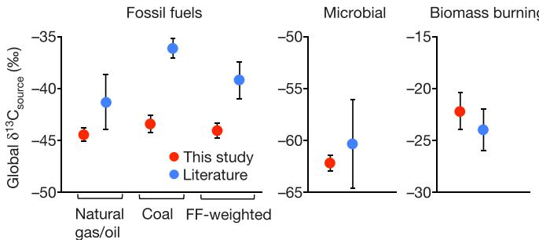
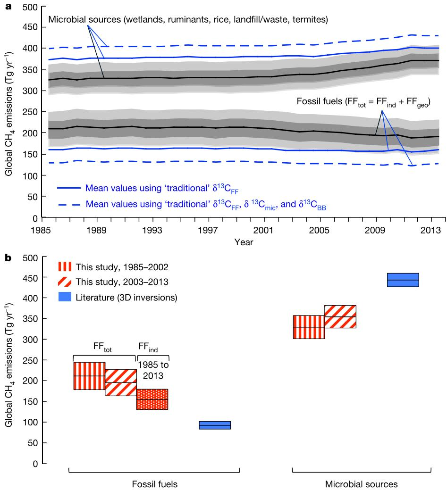
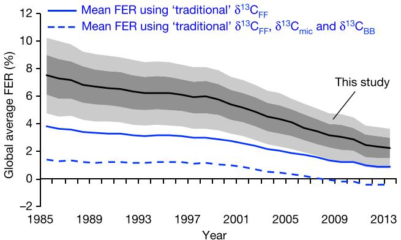

# Upward revision of global fossil fuel methane emissions based on isotope database

Stefan Schwietzke1,2 , Owen A. Sherwood3, Lori M. P. B ruhwiler2 , John B . Miller1,2 , Giuseppe Etiope4,5, Edward J. Dlugokencky2 , Sylvia Englund Michel3, Victoria A. Arling1,2 , Bruce H. Vaughn3, James W. C . White3 & Pieter P. Tans2

Methane has the second-largest global radiative forcing impact of anthropogenic greenhouse gases after carbon dioxide, but our understanding of the global atmospheric methane budget is incomplete. The global fossil fuel industry (production and usage of natural gas, oil and coal) is thought to contribute 15 to 22 per cent of methane emissions1–10 to the total atmospheric methane budget11. However, questions remain regarding methane emission trends as a result of fossil fuel industrial activity and the contribution to total methane emissions of sources from the fossil fuel industry and from natural geological seepage12,13, which are often co-located. Here we re-evaluate the global methane budget and the contribution of the fossil fuel industry to methane emissions based on longterm global methane and methane carbon isotope records. We compile the largest isotopic methane source signature database so far, including fossil fuel, microbial and biomass-burning methane emission sources. We find that total fossil fuel methane emissions (fossil fuel industry plus natural geological seepage) are not increasing over time, but are 60 to 110 per cent greater than current estimates $\mathbf { \widetilde { l } - 1 0 }$ owing to large revisions in isotope source signatures. We show that this is consistent with the observed global latitudinal methane gradient. After accounting for natural geological methane seepage12,13, we find that methane emissions from natural gas, oil and coal production and their usage are 20 to 60 per cent greater than inventories1,2 . Our findings imply a greater potential for the fossil fuel industry to mitigate anthropogenic climate forcing, but we also find that methane emissions from natural gas as a fraction of production have declined from approximately 8 per cent to approximately 2 per cent over the past three decades.

Our current understanding of the global methane $\mathrm { ( C H _ { 4 } ) }$ budget stems largely from three-dimensional (3D) inversion studies, which use the trends and gradients of atmospheric $\mathrm { C H _ { 4 } }$ to infer the spatio-temporal distribution of the total $\mathrm { C H _ { 4 } }$ source, but atmospheric $\mathrm { C H _ { 4 } }$ data alone do not include source type information. Source type information comes primarily from bottom-up-derived a priori spatial patterns. 3D inverse models return a posteriori fluxes constrained by the bottom-up source type information for each, especially for large regions that contain a mix of source types, like agriculture, wetlands and fossil fuels. Note that we refer below to $\mathrm { C H _ { 4 } }$ emissions from total fossil fuels $\mathrm { ( F F _ { t o t } ) }$ as the sum of $\mathrm { C H } _ { 4 }$ emissions from fossil fuel industry activities $( \mathrm { F F _ { i n d } } )$ and natural geological seepage $\left( \mathrm { F F _ { g e o } } \right)$ ). To alleviate this problem, some previous 3D inversion3,4 and box model studies9,10 have included measurements of atmospheric $\ S ^ { 1 3 } \mathrm { C - C H _ { 4 } }$ (henceforth $\ S ^ { 1 3 } \mathrm { C _ { a t m } } .$ , where $\delta ^ { 1 3 } \mathrm { C } = R _ { \mathrm { a t m } } / R _ { \mathrm { s t d } } - 1$ and $R \mathrm { { = } } ^ { 1 3 } \mathrm { C } / ^ { 1 2 } \mathrm { C } )$ as an additional constraint for better source allocation. Broadly defined source categories—that is, $\mathrm { F F _ { t o t } } ,$ microbial, and biomass burning—emit $\mathrm { C H _ { 4 } }$ with different source signatures10 $( \ S ^ { 1 3 } \mathrm { C - C H _ { 4 } ; }$ henceforth $\ S ^ { 1 3 } \mathrm { C _ { \mathrm { { s o u r c e } } } }$ , including $\delta ^ { 1 3 } \mathrm { C } _ { \mathrm { F F } } \delta ^ { 1 3 } \mathrm { C } _ { \mathrm { m i c } }$ and $\ S ^ { 1 3 } \mathrm { C _ { B B } ) }$ .

The sample sizes of $\ S ^ { 1 3 } \mathrm { C _ { \mathrm { { s o u r c e } } } }$ values used in published global $\mathrm { C H _ { 4 } }$ budgets are either small ( $N < 1 0 0$ , based on cited original measurements) or unknown, uncertainties are rarely applied, and global representativeness is lacking (especially in the tropics and the Southern Hemisphere), but some $\bar { \delta } ^ { 1 3 } \bar { \mathrm { C } } _ { \mathrm { s o u r c e } }$ values have nevertheless taken on canonical status with few references to primary sources (for example, refs 3, 4, 9 and 10; see full list of references in Supplementary Information section 8). We have compiled the most comprehensive $\ S ^ { 1 3 } \mathrm { C _ { \mathrm { { s o u r c e } } } }$ database to date (see ref. 14 and Supplementary Information sections 3–5 for complete list of data, metadata and references) including 9, $4 6 8 ~ \delta ^ { 1 3 } \mathrm { C _ { F F } } , \mathbf { \bar { \delta } } ^ { 1 3 } \mathrm { C _ { m i c } }$ and $\ S ^ { 1 3 } \mathrm { C _ { B B } }$ original measurements from the peer-reviewed literature and other publicly available sources to define globally weighted average $\ S ^ { 1 3 } \mathrm { C } _ { \mathrm { F F } }$ (time-dependent), $\ S ^ { 1 3 } \mathrm { C _ { m i c } } ,$ and $\ S ^ { 1 3 } \mathrm { C _ { B B } }$ with well defined uncertainties. These data allowed us to revisit the source attribution of global $\mathrm { C H _ { 4 } }$ emissions since the 1980s by applying an atmospheric box-model to global atmospheric $\mathrm { C H _ { 4 } }$ and $\bar { \delta } ^ { \bar { 1 } 3 } \dot { \mathrm { C } } _ { \mathrm { a t m } }$ measurements (and avoiding the use of a priori $\mathrm { F F _ { t o t } }$ and microbial source strengths), thus maximizing the $\mathrm { C H _ { 4 } }$ and $\ S ^ { 1 3 } \mathrm { C _ { a t m } }$ constraints.

Our box-model applies Monte Carlo techniques to estimate global $\mathrm { F F _ { t o t } }$ and microbial $\mathrm { C H _ { 4 } }$ emissions and uncertainties as a function of $\delta ^ { 1 3 } \mathrm { C } _ { \mathrm { { s o u r c e } } } ,$ of isotope fractionation during oxidation $\mathrm { ( O H + C H _ { 4 } ) }$ , of the uncertainties of both of these values, and of other factors (see Supplementary Table 1). We also estimated $\mathrm { F F _ { i n d } }$ emissions by subtracting $\mathrm { F F _ { g e o } }$ emissions from $\mathrm { F F _ { t o t } }$ emissions. This allowed us to calculate global long-term trends in the Fugitive Emission Rate (FER), which is the fraction of natural gas production lost to the atmosphere through its lifecycle (production, processing, transport and use), and is a critical parameter for evaluating the climatic impact of natural gas as a fuel9,15.

The $\ S ^ { 1 3 } \mathrm { C _ { \mathrm { { s o u r c e } } } }$ weighting procedures are described in detail in Supplementary Information sections 3, 4 and 5, and briefly summarized here. The $\ S ^ { 1 3 } \dot { \mathrm { C } } _ { \mathrm { F F } }$ samples $( N { = } 7 , 4 8 2$ ) are representative of natural gas or coal gas from 44 countries, accounting for $8 2 \%$ and $8 0 \%$ of global natural gas and coal production, respectively16. Country-specific $\bar { \ S } ^ { 1 3 } \mathrm { C } _ { \mathrm { F F } }$ distributions for natural gas and coal were weighted by their respective annual production of natural gas, oil (co-produced with natural gas), and coal (Supplementary Information section 5). The time averaged, globally weighted $\ S ^ { 1 3 } \mathrm { C _ { F F } }$ of $- 4 4 . 0 \pm 0 . 7 \%$ (one standard deviation, 1 s.d.) is much lighter (about $5 \text{‰}$ lighter) than typical values in previous inverse studies (Fig. 1), although Whiticar et al.17 reported an empirically derived $\ S ^ { 1 3 } { \bf C } _ { \mathrm { n a t u r a l \ g a s / o i l } }$ value of $- 4 4 \text{‰}$ based on unpublished proprietary industry sources. Our relatively light $\ S ^ { 1 3 } { \mathrm { \overline { { C } } } } _ { \mathrm { n a t u r a l { g a s / o i l } } }$ value is due to contributions from economically important reservoirs of microbially produced $\mathrm { C H } _ { 4 } ,$ and from thermogenic gas originating from low-maturity source rocks, or is associated with oil, typically18 in the range $- 4 5 \text{‰}$ to $- 5 5 \text{‰}$ . Thermogenic $\mathrm { C H _ { 4 } }$ formation and microbial methanogenesis also occur in coal beds (both deep and shallow deposits19).

Our $\ S ^ { 1 3 } \mathrm { C _ { \mathrm { { s o u r c e } } } }$ database14 contains $1 , 0 2 1 ~ \delta ^ { 1 3 } \mathrm { C } _ { \mathrm { m i c } }$ samples from wetlands, termites, ruminants, rice agriculture and waste/landfill, weighted by their relative contribution to global microbial $\mathrm { C H _ { 4 } }$ emissions based on 12 literature estimates (Supplementary Information section 3). Our $\ S ^ { 1 3 } \mathrm { C _ { \mathrm { { s o u r c e } } } }$ database14 includes 82 direct (plume measurement) and 965 indirect (plant material) $\ S ^ { 1 3 } \mathrm { C } _ { \mathrm { B B } }$ samples from $C _ { 3 }$ and $C _ { 4 }$ plants, weighted by maps of global vegetation and biomass-burning fluxes (Supplementary Information section 4). Our $\ S ^ { 1 3 } \mathrm { C _ { m i c } }$ and $\delta ^ { 1 3 } \mathrm { C } _ { \mathrm { B B } } ^ { \mathrm { ^ { - } } }$ are within the uncertainty of literature estimates, but have smaller error bars (given the large sample size), and approximately $2 \text{‰}$ differences in mean values (Fig. 1).

  
Figure 1 | Comparison of $\delta ^ { 1 3 } \mathbf { C } _ { \mathrm { F F } } , \delta ^ { 1 3 } \mathbf { C } _ { \mathrm { m i c } }$ and $\delta ^ { 1 3 } \mathbf { C } _ { \mathbf { B B } }$ source signatures from this study (red) and those used in 15 previous top-down studies (blue; see Supplementary Information section 8 for references). Error bars indicate 1 s.d., representing empirical uncertainty in our database (red; $N _ { \mathrm { t o t a l } } { = } 9 { , } 4 6 8$ ; see Supplementary Table 1) and variability among mean literature values (blue). $\ S ^ { 1 3 } \mathrm { C } _ { \mathrm { F F } }$ are temporal averages; see Supplementary Fig. 11 for annual $\ S ^ { 1 3 } \mathrm { C } _ { \mathrm { F F } }$ (owing to country-specific $\mathrm { F F _ { i n d } }$ production trends).

Time series of the global microbial and $\mathrm { F F _ { t o t } C H _ { 4 } }$ emission distributions are shown in Fig. 2a using 10,000 Monte Carlo box-model repetitions. Estimates of $\mathrm { F F _ { t o t } }$ $\mathrm { C H _ { 4 } }$ are based only on global average atmospheric $\mathrm { C H _ { 4 } }$ levels, $\mathrm { C H _ { 4 } }$ lifetimes, isotope source signatures, isotope fractionation, and soil sink and biomass-burning estimates; that is, they exclude other bottom-up estimates or a priori information. Note that this study focuses on long-term trends, and Fig. 2a presents moving averages. The original model results (Supplementary Fig. 18) include the inter-annual variability of ${ < } 1 0 \%$ on average, which is partly an artefact of multiple components that our model does not control including $\mathrm { C H _ { 4 } }$ sink inter-annual variability and the $\ S ^ { 1 3 } \mathrm { C _ { B B } }$ inter-annual variability depending on the dominant biomass type $C _ { 3 }$ versus $\mathrm { C _ { 4 } }$ ) in a given year.

Our updated $\ S ^ { 1 3 } \mathrm { C _ { \mathrm { { s o u r c e } } } }$ database causes a substantial upward shift in total fossil fuel $\mathrm { C H _ { 4 } }$ relative to ‘traditional’ $\ S ^ { 1 3 } \mathrm { C _ { \mathrm { { s o u r c e } } } }$ used in the literature. The approximately $5 \text{‰}$ lighter $\ S ^ { 1 3 } \mathrm { C } _ { \mathrm { F F } }$ alone leads to a $\mathrm { F F _ { t o t } }$ value about $5 0 \mathrm { T g } \mathrm { C H } _ { 4 } \mathrm { y r } ^ { - 1 }$ greater, and the combination of the approximately $2 \text{‰}$ lighter $\dot { 8 } ^ { 1 3 } \mathrm { C } _ { \mathrm { m i c } }$ and approximately $2 \text{‰}$ heavier $\ S ^ { \bar { 1 } 3 } \mathrm { C _ { B B } }$ shifts $\mathrm { F F _ { t o t } }$ up by an additional $2 5 \mathrm { T g } \mathrm { C H } _ { 4 } \mathrm { y r } ^ { - 1 }$ or so (Fig. 2a). Total annual $\mathrm { C H _ { 4 } }$ emissions increased by about $2 5 \ \mathrm { T g }$ since 2006 (ref. 20, Supplementary Fig. 2), and the microbial source increased by about $4 5 \mathrm { T g }$ , partially offset by a $\mathrm { F F _ { t o t } }$ decrease of about $2 0 \mathrm { T g }$ to balance the atmospheric $\mathrm { C H _ { 4 } }$ budget. This growth attribution to microbial sources is mostly driven by changing $\bar { \delta } ^ { 1 3 } \mathrm { C } _ { \mathrm { a t m } }$ (increase stopped around 2000 followed by a $0 . 2 \text{‰}$ decrease since $2 0 0 4 ;$ see also ref. 21), and a $1 . 7 \text{‰}$ $\delta ^ { 1 3 } \mathrm { C } _ { \mathrm { F F } }$ increase since 2003 resulting from a redistribution of global $\mathrm { F F _ { i n d } }$ production from countries with different $\ S ^ { 1 3 } \mathrm { C } _ { \mathrm { F F } }$ values. For example, China’s rising hard coal production during 1999–2012 increased global coal $\ S ^ { 1 3 } \mathrm { C } _ { \mathrm { F F } }$ by approximately $3 . 5 \text{‰}$ given China’s national average coal $\ S ^ { 1 3 } \mathrm { C } _ { \mathrm { F F } }$ of $- 3 6 . 0 \text{‰}$ , and global natural gas $\ S ^ { 1 3 } \mathrm { C } _ { \mathrm { F F } }$ increased by approximately $0 . 7 \text{‰}$ during 2002–2012 because of rising natural gas production in multiple countries with relatively heavy natural gas $\hat { \delta } ^ { 1 3 } \mathrm { C } _ { \mathrm { F F } }$ (details in Supplementary Information section 3).

  
Figure 2 | Fossil fuel and microbial source $\mathbf { C H _ { 4 } }$ budget terms. a, Long-term trend in global microbial and total $\mathrm { F F _ { t o t } C H _ { 4 } }$ emissions from 1985 to 2013. Moving averages are shown; see Supplementary Fig. 18 for original mass balance results including inter-annual variability due to multiple components not accounted for in this model (see text). Mean values are shown in solid black. Dark and light grey bands mark the 25th/75th percentile and the 10th/90th percentiles, respectively. Blue lines assume the mean $\delta ^ { 1 3 } \mathrm { C } _ { \mathrm { s o u r c e } }$ values from the literature (as in Fig. 1, blue values). See Supplementary Information section 7 for sensitivity analyses. b, The box plot compares means and 1 s.d. uncertainties between this study (red) and the recent literature $ { ? } ^ { 3 - 8 }  { 3 \mathrm { D } }$ inversions (blue). The box-model temporal split marks approximately when the $\ S ^ { 1 3 } \mathrm { C _ { a t m } }$ increase stopped and $\ S ^ { 1 3 } \mathrm { C } _ { \mathrm { F F } }$ decreased; literature periods vary. The literature budget terms were scaled to match this study’s mean total $\mathrm { C H _ { 4 } }$ budget (see Supplementary Information section 8 for individual literature study means). Industrial FF $( \mathrm { F F _ { i n d } } )$ represents total FF $\left( \mathrm { F F } _ { \mathrm { t o t } } \right)$ minus natural geological seepage $( \mathrm { F F _ { g e o } } )$ . Literature $\mathrm { F F } _ { \mathrm { t o t } } { = } \mathrm { F F } _ { \mathrm { i n d } }$ because these studies exclude $\mathrm { F F _ { g e o } }$ .

The $\mathrm { F F _ { t o t } C H _ { 4 } }$ decrease is surprising because it marks a period of a dramatic $( 5 6 \% )$ increase in global coal production, mainly from China16. However, not accounting for other factors in our model could produce a downward bias of up to $2 0 \ \mathrm { T g }$ in the $\mathrm { F F _ { t o t } }$ $\mathrm { C H _ { 4 } }$ trend (Supplementary Fig. 17 for a sensitivity analysis of the model parameters on the budget terms and their trends). For instance, the $0 . 2 \text{‰}$ $\ S ^ { 1 3 } \mathrm { C _ { a t m } }$ decrease requires decreasing emissions of either $\mathrm { F F _ { t o t } }$ or biomass burning since 2004, and we used a prescribed, temporally constant range of biomass-burning emissions. Constant or decreasing $\mathrm { F F _ { t o t } }$ emissions disagree with emission inventories, suggesting increasing $\mathrm { F F _ { i n d } }$ emissions during this period1,21. This may be explained by efficiency improvements such as capturing otherwise vented or flared natural gas, replacement of old equipment, and improved combustion techniques22, which inventories may not account for completely.

Box-model and literature 3D inverse estimates3–8 are compared in Fig. 2b. Mean $\mathrm { F F _ { t o t } C H _ { 4 } }$ emissions in this study are approximately double previous estimates. The relatively small size of the 3D inverse $\mathrm { F F _ { t o t } C H _ { 4 } }$ estimates is partly due to the strong influence of a priori information on source attribution in regions where observations are sparse and multiple sources are co-located. As a result, the inverse FF a posteriori means are on average within $1 7 \%$ of the a priori means3–8. Also, these studies are not independent owing to their choice of broadly similar a priori information (these studies use different releases of the EDGAR database2 for anthropogenic emissions): the a priori mean of five3–6,8 out of the six studies (Fig. 2b) is only $9 2 \pm 3 \mathrm { T g }$ $\mathrm { \bar { C } H _ { 4 } } \mathrm { y r } ^ { - 1 }$ (1 s.d.). Note that when $\ S ^ { 1 3 } \mathrm { C _ { a t m } }$ is used in 3D inversions3,4 (as opposed to box-model studies), the spatio-temporal $\mathrm { C H _ { 4 } }$ constraint greatly outweighs the information in the relatively sparse $\ S ^ { 1 3 } \mathrm { C _ { a t m } }$ data. For instance, the relative difference in a posteriori $\mathrm { F F _ { t o t } }$ fluxes between including and excluding $\ S ^ { 1 3 } \mathrm { C _ { a t m } }$ data in 3D inversions3,4 is $< 7 \%$ . Uncertainties in this study (the $\mathrm { F F _ { t o t } } 1$ s.d. is $3 2 \mathrm { T g } \mathrm { C H } _ { 4 } \mathrm { y r } ^ { - 1 }$ ) are considerably larger than in the inverse studies ( $9 \mathrm { T g } \mathrm { C H } _ { 4 } \mathrm { y r } ^ { - 1 }$ on average). However, inversion-based a posteriori uncertainties are often derived from relatively narrow a priori source uncertainties, whereas we derive uncertainties directly from sensitivities in the global mass balances of $\ S ^ { 1 3 } \mathrm { C _ { a t m } }$ and $\mathrm { C H _ { 4 } }$ . The only prescribed source in our model is biomass burning, although our prescribed biomass-burning estimates are partly constrained by fire detection using satellites (wild fires can be detected23, not accounting for fuel biomass burning). These results suggest the route of first obtaining observation-based global total $\mathrm { C H _ { 4 } }$ source strengths (this study) as inputs to an inversion, which can then use additional spatial information to estimate source allocation at higher resolution.

Until now, most top-down studies have excluded $\mathrm { F F _ { g e o } }$ as an important source of global $\mathrm { C H _ { 4 } }$ over the past three decades11, despite bottom-up studies12,13 as well as top-down analyses using ice-core24–26 and radiocarbon ${ } ^ { ( ^ { 1 4 } \mathrm { C ) } }$ data12 suggesting a $\mathrm { F F _ { g e o } }$ range of $2 0 { - } 7 6 \mathrm { T g }$ $\mathrm { C H } _ { 4 } \ \mathrm { y r } ^ { - 1 }$ $( 4 \% - 1 4 \%$ of the modern global budget; Supplementary Information sections 2 and 6). Constraining these emissions using ice-core $\mathrm { C H _ { 4 } }$ and $\delta ^ { 1 3 } \mathrm { C }$ (henceforth $8 ^ { 1 3 } \mathrm { C _ { i c e } } )$ measurements, and our extensive database of isotope signatures yields $\mathrm { F F _ { g e o } }$ emissions of $5 1 \pm 2 0 \mathrm { T g } \mathrm { C H } _ { 4 } \mathrm { y r } ^ { - 1 }$ (1 s.d.; Supplementary Information section 6). Subtracting $\mathrm { F F _ { g e o } }$ from $\mathrm { F F _ { t o t } }$ yields mean $\mathrm { F F _ { i n d } }$ emissions of $1 5 6 \pm 2 4 \mathrm { T g }$ $\mathrm { C H _ { 4 } } \mathrm { y r } ^ { - 1 }$ (the 1 s.d. uncertainty accounts for the correlation coefficient of 1 between $\mathrm { F F _ { t o t } }$ and $\mathrm { F F _ { g e o } }$ as described in Supplementary Information section 1), that is, still $6 \hat { 5 } \%$ greater than previous 3D inverse model estimates.

By mass balance, the microbial source ( $2 3 \%$ smaller than the literature $^ { 3 - 8 }$ ) must account for the difference between global $\mathrm { C H _ { 4 } }$ emissions, $\mathrm { F F _ { t o t } } ,$ and biomass burning. Thus, our results suggest an important shift in the current understanding of the global $\mathrm { C H _ { 4 } }$ budget towards a higher $\mathrm { F F _ { t o t } }$ component compensated by lower microbial emissions, but the recent temporal increases in microbial emissions have been substantially larger. The $\ S ^ { 1 3 } \mathrm { C }$ mass balance approach cannot distinguish between natural and anthropogenic microbial sources. However, the magnitude of the anthropogenic microbial sources (agriculture, including livestock and rice production, and waste, including landfill) has historically been related to population growth, and Schaefer et al.21 recently found it plausible that agriculture and waste account for some of the temporal $\mathrm { C H _ { 4 } }$ emissions increase based on $\ S ^ { 1 3 } \mathrm { C }$ All estimated pre-industrial and present-day global $\mathrm { C H _ { 4 } }$ budget terms are summarized in Table 1.

Table 1 | $\mathfrak { d } ^ { 1 3 } \mathfrak { C }$ -based source attribution means for different periods.   

<table><tr><td rowspan=1 colspan=1></td><td rowspan=1 colspan=1>0-1700 AD*</td><td rowspan=1 colspan=1>1985-2002 AD    2003-2013 AD</td></tr><tr><td rowspan=1 colspan=1>Total fossil fuelst</td><td rowspan=1 colspan=1>51±20</td><td rowspan=2 colspan=1>211±33       195±32161±24       145±23</td></tr><tr><td rowspan=1 colspan=1>Fossil fuel industries</td><td rowspan=1 colspan=1>0</td></tr><tr><td rowspan=1 colspan=1>Geological sources</td><td rowspan=1 colspan=1></td><td rowspan=1 colspan=1>51±20</td></tr><tr><td rowspan=1 colspan=1>Microbial</td><td rowspan=1 colspan=1>154±19</td><td rowspan=1 colspan=1>330±28       355±27</td></tr><tr><td rowspan=1 colspan=1>Biomass burning</td><td rowspan=1 colspan=1>25±5</td><td rowspan=1 colspan=1>43±9</td></tr></table>

Values are given as mean $\pm$ one standard deviation in units of teragrams of methane per year. The biomass burning ranges are those prescribed in the $\delta ^ { 1 3 } \mathsf { C }$ mass balance. $^ { \ast } \mathsf { S e e }$ text and Supplementary Information section 6. $\dag \mathsf { T M } 5$ simulations of the latitudinal gradient and comparison with observations indicate a present-day $F F _ { \mathrm { t o t } }$ range of 150–200 Tg $\mathsf { C H } _ { 4 } \mathsf { y r } ^ { - 1 }$ (see text and Supplementary section 7).

We further evaluated our $\delta ^ { 1 3 } \mathrm { C }$ -based source attribution by simulating global atmospheric $\mathrm { C H } _ { 4 }$ mole fractions using emission maps scaled by the $\delta ^ { 1 3 } \mathrm { C }$ -based source attribution, and transported by the 3D global atmospheric chemistry and transport model $\mathrm { T M } 5 ^ { 2 7 }$ . The simulated and observed global north–south gradients of $\mathrm { C H _ { 4 } }$ at remote background sites of NOAA’s Global Greenhouse Gas Reference Network20 add a spatial source attribution constraint because the broad spatial distribution of some $\mathrm { C H _ { 4 } }$ source categories is relatively well known globally. On the basis of nine simulated scenarios, we find that $\mathrm { F F _ { t o t } }$ in the range $1 5 0 { - } 2 0 0 \mathrm { T g } \mathrm { C H } _ { 4 } \mathrm { y r } ^ { - 1 }$ is consistent with the observed global north–south gradient (Supplementary Information section 7).

Inferred natural-gas industry efficiency improvements are illustrated using the FER time series in Fig. 3, which is calculated as $\mathrm { F F _ { i n d } }$ emissions $\mathrm { F F _ { t o t } }$ minus $\mathrm { F F _ { g e o . } }$ ) minus oil and coal emissions (bottom-up estimates including uncertainties28) divided by global dry gas production of natural gas16 and accounting for the $\mathrm { C H _ { 4 } }$ content of natural gas (Supplementary Information section 1). Mean FER decreases from $7 . 6 \%$ in 1985 to $2 . 2 \%$ in 2013. Assuming ‘traditional’ $\ S ^ { 1 3 } \mathrm { C _ { \mathrm { { s o u r c e } } } }$ values for all sources (blue dashed lines) would yield negative mean FER in some years, which is impossible, thereby emphasizing the importance of the updated $\ S ^ { 1 3 } \mathrm { C _ { \mathrm { { s o u r c e } } } }$ . Note that the oil and coal emissions used to estimate FER assume temporally constant oil and coal emission factors while production increased, that is, no efficiency improvements in the oil and coal industries. Thus, the FER decline rate would be smaller in the case of noticeable oil and coal efficiency improvements. However, the impact of potential oil $\mathrm { C H _ { 4 } }$ emission reductions would be minor because oil contributes only on average $1 0 \%$ to $\mathrm { F F _ { i n d } C H _ { 4 } }$ emissions (Supplementary Fig. 10). Global coal $\mathrm { C H _ { 4 } }$ mitigation from reported projects, which may not be included in the bottom-up estimates amounts to only around $7 \%$ of global coal $\mathrm { C H _ { 4 } }$ emissions1,29.

  
Figure 3 | Global FER long-term trend with mean values shown in solid black. Moving averages are shown; see Supplementary Fig. 18 for original mass balance results including inter-annual variability due to multiple components not accounted for in this model (see text). Dark and light grey bands mark the $2 5 \mathrm { t h } / 7 5 \mathrm { t h }$ percentile and the $1 0 \mathrm { { t h } / 9 0 \mathrm { { t h } } }$ percentile uncertainties, respectively. The dashed black line represents the linear trend of the means. Blue lines assume the mean $\ S ^ { 1 3 } \hat { \mathbf { C } } _ { \mathrm { s o u r c e } }$ values from the literature (as in Fig. 1, blue values).

Our finding that $\mathrm { F F _ { t o t } C H _ { 4 } }$ emissions are $6 0 \% - 1 1 0 \%$ higher than previous studies based on the most comprehensive global $\mathrm { \bar { \delta } ^ { 1 3 } C _ { s o u r c e } }$ database compiled so far represents a major adjustment in the global $\mathrm { C H _ { 4 } }$ budget, and this is consistent with the observed latitudinal $\mathrm { C H _ { 4 } }$ gradient. It agrees with a previous radiocarbon analysis30 $( 1 6 7 \pm 1 3 \mathrm { T g }$ $\mathrm { \bar { C } H _ { 4 } \ y r ^ { - 1 } \ F \bar { F } _ { \mathrm { t o t } } } )$ , which had so far been considered a “plausible re-estimate rather than a definitive revision”30 of $\mathrm { F F _ { t o t } }$ owing to the model complexity involved. Our revised $\mathrm { F F _ { t o t } }$ emissions are compensated by lower microbial $\mathrm { C H _ { 4 } }$ emissions, and this is consistent with the palaeo- $\mathrm { C H _ { 4 } }$ budget (Supplementary Information section 6).

Accounting for previously neglected $\mathrm { F F _ { g e o } } ,$ our correction of $2 0 \% { - } 6 0 \%$ higher $\mathrm { C H _ { 4 } }$ emissions from natural gas, oil and coal production and use implies a greater potential for industry efficiency improvements to mitigate anthropogenic climate forcing. Yet, this study does not confirm an upward trend of $\mathrm { F F _ { i n d } }$ emissions in global $\mathrm { C H _ { 4 } }$ inventories1,2 despite the large increase in natural gas, oil and coal production and use over the past three decades. Instead, this study finds that natural-gas $\mathrm { C H _ { 4 } }$ emissions per unit of production have declined from about $8 \%$ in the mid-1980 s to about $2 \%$ in the late 2000 s and early 2010 s. Natural-gas industry improvements associated with management practices, technology, and replacement of older equipment have been credited with reducing $\mathrm { C H _ { 4 } }$ leakage in the past1 . The global observations used in our study confirm this trend, but the industry improvements have been offset by increased natural-gas production. Ongoing and future field studies at the level of natural-gas basins, facilities and components may help us to understand the contribution of individual leak types in order to reduce total natural-gas $\mathrm { C H _ { 4 } }$ emissions.

# received 25 April; accepted 22 August 2016.

1. US Environmental Protection Agency. Summary Report: Global Anthropogenic Non- $C O _ { 2 }$ Greenhouse Gas Emissions: 1990–2030 https://www3.epa.gov/ climatechange/Downloads/EPAactivities/Summary_Global_NonCO2_ Projections_Dec2012.pdf (Office of Atmospheric Programs, Climate Change Division, US EPA, 2012).   
2. European Commission—Joint Research Centre (JRC)/Netherlands Environmental Assessment Agency (PBL). Emission Database for Global Atmospheric Research (EDGAR), release version 4.2, http://edgar.jrc.ec.europa. eu (2014).   
3. Bousquet, P. et al. Contribution of anthropogenic and natural sources to atmospheric methane variability. Nature 443, 439–443 (2006).   
4. Mikaloff Fletcher, S. E., Tans, P. P., Bruhwiler, L. M., Miller, J. B. & Heimann, M. $\mathsf { C H } _ { 4 }$ sources estimated from atmospheric observations of $\mathsf { C H } _ { 4 }$ and its ${ } ^ { 1 3 } \mathrm { C } / { } ^ { 1 2 } \mathrm { C }$ isotopic ratios: 1. Inverse modeling of source processes. Glob. Biogeochem. Cycles 18, GB4004 (2004).   
5. Fraser, A. et al. Estimating regional methane surface fluxes: the relative importance of surface and GOSAT mole fraction measurements. Atmos. Chem. Phys. 13, 5697–5713 (2013).   
6. Wang, J. S. et al. A 3-D model analysis of the slowdown and interannual variability in the methane growth rate from 1988 to 1997. Glob. Biogeochem. Cycles 18, GB3011 (2004).   
7. Chen, Y.-H. & Prinn, R. G. Estimation of atmospheric methane emissions between 1996 and 2001 using a three-dimensional global chemical transport model. J. Geophys. Res. Atmos. 111, D10307 (2006).   
8. Bergamaschi, P. et al. Inverse modeling of global and regional $\mathsf { C H } _ { 4 }$ emissions using SCIAMACHY satellite retrievals. J. Geophys. Res. 114, D22301 (2009).   
9. Schwietzke, S., Griffin, W. M., Matthews, H. S. & Bruhwiler, L. M. P. Natural gas fugitive emissions rates constrained by global atmospheric methane and ethane. Environ. Sci. Technol. 48, 7714–7722 (2014).   
10. Quay, P. et al. The isotopic composition of atmospheric methane. Glob. Biogeochem. Cycles 13, 445–461 (1999).   
11. Kirschke, S. et al. Three decades of global methane sources and sinks. Nat. Geosci. 6, 813–823 (2013).   
12. Etiope, G., Lassey, K. R., Klusman, R. W. & Boschi, E. Reappraisal of the fossil methane budget and related emission from geologic sources. Geophys. Res. Lett. 35, L09307 (2008).   
13. Ciais, P. et al. in Working Group I Contribution To The IPCC Fifth Assessment Report. Climate Change 2013—The Physical Science Basis (eds Stocker, T. F. et al.) Ch. 6, 465–570 (Cambridge Univ. Press, 2013).   
14. Sherwood, O., Schwietzke, S., Arling, V. & Etiope, G. Global Inventory of Fossil and Non-fossil Methane $\delta ^ { 1 3 } C$ Source Signature Measurements for Improved Atmospheric Modeling http://www.esrl.noaa.gov/gmd/ccgg/d13C-src-inv/ (NOAA/ESRL/GMD, 2016).   
15. Alvarez, R. A., Pacala, S. W., Winebrake, J. J., Chameides, W. L. & Hamburg, S. P. Greater focus needed on methane leakage from natural gas infrastructure. Proc. Natl Acad. Sci. USA 109, 6435–6440 (2012).   
16. US Energy Information Administration International Energy Statistics database http://www.eia.gov/cfapps/ipdbproject/IEDIndex3.cfm ? tid=3&pid $=$ 3&aid=1 (2016).   
17. Whiticar, M. J. in Organic Geochemistry (eds Durand, B. & Behar, F.) Vol. 16, 531–548 (Pergamon, 1990).   
18. Milkov, A. V. Worldwide distribution and significance of secondary microbial methane formed during petroleum biodegradation in conventional reservoirs. Org. Geochem. 42, 184–207 (2011).   
19. Meslé, M., Dromart, G. & Oger, P. Microbial methanogenesis in subsurface oil and coal. Res. Microbiol. 164, 959–972 (2013).   
20. NOAA Earth System Research Laboratory Global Monitoring Division Global Greenhouse Gas Reference Network http://www.esrl.noaa.gov/gmd/ccgg/iadv (2016).   
21. Schaefer, H. et al. A 21st century shift from fossil-fuel to biogenic methane emissions indicated by $^ { 1 3 } \mathsf { C H } _ { 4 }$ . Science 352, 80–84 (2016).   
22. US Environmental Protection Agency. Inventory of U.S. Greenhouse Gas Emissions and Sinks: 1990–2014 https://www.epa.gov/ghgemissions/ us-greenhouse-gas-inventory-report-1990-2014 (2016).   
23. Randerson, J. T., Chen, Y., van der Werf, G. R., Rogers, B. M. & Morton, D. C. Global burned area and biomass burning emissions from small fires. J. Geophys. Res. 117, G04012 (2012).   
24. Sapart, C. J. et al. Natural and anthropogenic variations in methane sources during the past two millennia. Nature 490, 85–88 (2012).   
25. Mischler, J. A. et al. Carbon and hydrogen isotopic composition of methane over the last 1000 years. Glob. Biogeochem. Cycles 23, GB4024 (2009).   
26. Sowers, T. Atmospheric methane isotope records covering the Holocene period. Quat. Sci. Rev. 29, 213–221 (2010).   
27. Krol, M. et al. The two-way nested global chemistry-transport zoom model TM5: algorithm and applications. Atmos. Chem. Phys. 5, 417–432 (2005).   
28. Schwietzke, S., Griffin, W. M., Matthews, H. S. & Bruhwiler, L. M. P. Global bottom-up fossil fuel fugitive methane and ethane emissions inventory for atmospheric modeling. ACS Sustain. Chem. Eng. 2, 1992–2001 (2014).   
29. International Energy Agency Coal Mine Methane in China: A Budding Asset with the Potential to Bloom https://www.iea.org/publications/freepublications/ publication/china_cmm_report.pdf (2009).   
30. Lassey, K. R., Lowe, D. C. & Smith, A. M. The atmospheric cycling of radiomethane and the ‘fossil fraction’ of the methane source. Atmos. Chem. Phys. 7, 2141–2149 (2007).

Supplementary Information is available in the online version of the paper.

Acknowledgements We thank J. Randerson, K. Johnson, A. Cole, C. Itle, T. Wirth, T. Capehart, S. Montzka, and R. Klusman for comments and discussions. We acknowledge M. Schoell and A. Ionescu for contributing $\delta ^ { 1 3 } \mathsf { C } _ { \mathsf { s o u r c e } }$ data. This research was supported by a National Research Council RAP fellowship and a CIRES IRP grant.

Author Contributions S.S. was responsible for study design, box-model development, analysis of TM5 results, manuscript preparation, and helped provide data. P.P.T. and J.B.M. helped with study design and improved the manuscript. O.A.S., G.E., E.J.D., S.E.M., V.A.A., B.H.V. and J.W.C.W. provided data and improved the manuscript. L.M.P.B. was responsible for TM5 modelling, helped with model analysis, and improved the manuscript.

Author Information The reconstructed atmospheric global average $\delta ^ { 1 3 } \mathsf { C } _ { \mathsf { a t m } }$ data for 1984–1998 are from ref. 21 and global $\ S ^ { 1 3 } \mathsf { C } _ { \mathsf { i c e } } ^ { - }$ data are from ref. 24. Reprints and permissions information is available at www.nature.com/reprints. The authors declare no competing financial interests. Readers are welcome to comment on the online version of the paper. Correspondence and requests for materials should be addressed to S.S. (stefan.schwietzke@noaa.gov).

Reviewer Information Nature thanks G. Allen, M. Heimann and the other anonymous reviewer(s) for their contribution to the peer review of this work.

# CORRIGENDUM doi:10.1038/nature21422 Corrigendum: Upward revision of global fossil fuel methane emissions based on isotope database

Stefan Schwietzke, Owen A. Sherwood, Lori M. P. Bruhwiler, John B. Miller, Giuseppe Etiope, Edward J. Dlugokencky, Sylvia Englund Michel, Victoria A. Arling, Bruce H. Vaughn, James W. C. White & Pieter P. Tans

Nature 538, 88–91 (2016); doi:10.1038/nature19797

In this Letter, Supplementary Figs 10 and 12 were not updated. The analyses, calculations, and text are correct. The Supplementary Information to this Corrigendum contains the corrected Supplementary Figs 10 and 12.

In Supplementary Fig. 10a the blue line was about $3 0 \mathrm { T g }$ of $\mathrm { C H _ { 4 } }$ per year too low, and represents results from a previous model version. Supplementary Fig. 10b shows the percentage contributions from Supplementary Fig. 10a, so both panels contain the same error. The total of all lines in Supplementary Fig. 10a should sum to about $1 5 0 \mathrm { T g }$ of $\mathrm { C H _ { 4 } }$ per year, consistent with Fig. 2b. In Supplementary Fig. 12, the graph contains data from the literature (coloured points) as well as a distribution based on these data (grey and black lines) and the $y$ -axis of the upper panel was accidentally shifted (the coloured points should have the same values as those in the cited literature). These small errors affect only Supplementary Figs 10 and 12 and do not propagate into other results. The correct data were used for the remainder of the model and the Letter.

We thank V. Petrenko and F. George for bringing this to our attention. The errors have not been corrected online.