# List of Acronyms

Ag/Waste/LF Agriculture, waste, landfills (microbial $\mathrm { C H } _ { 4 }$ source subcategory)   
$\mathrm { C H } _ { 4 }$ Methane   
BB Biomass burning $\mathrm { C H } _ { 4 }$ source category; including wildfires and biofuels) Fugitive emission rate (fraction of natural gas production lost to the atmosphere   
FER through its lifecycle, i.e., production, processing, transport, and use)   
FF Fossil fuels (natural gas, oil, coal)   
$\mathrm { F F _ { G e o } }$ Natural geological $\mathrm { C H } _ { 4 }$ seepage (FF $\mathrm { C H } _ { 4 }$ source subcategory)   
FFInd subcategory) $\mathrm { C H } _ { 4 }$ emissions from the natural gas, oil, and coal industries (FF $\mathrm { C H } _ { 4 }$ source   
FFTot $\mathrm { F F _ { G e o } + F F _ { I n d } }$   
IAV Inter-annual variability   
MC Monte Carlo (statistical method for repeated random sampling)   
NG Natural gas   
δ13CAtm Atmospheric $\ S ^ { 1 3 } \mathrm { C - C H } _ { 4 }$   
δ13CBB $\ S ^ { 1 3 } \mathrm { C - C H _ { 4 } }$ source signature of BB   
δ13CFF $\ S ^ { 1 3 } \mathrm { C - C H _ { 4 } }$ source signature of FF   
δ13CMic $\ S ^ { 1 3 } \mathrm { C - C H _ { 4 } }$ source signature of microbial sources   
δ13CSource $\ S ^ { 1 3 } \mathrm { C - C H _ { 4 } }$ source signature (generic)

# 1. Box-model

Time series (1984-2013) distributions of global $\mathrm { C H } _ { 4 }$ from $\mathrm { F F } _ { \mathrm { T o t } }$ , $\mathrm { F F _ { G e o } }$ , and global average FER were estimated using an atmospheric mass balance approach (1-box-model, i.e., conservation of mass). Total annual $\mathrm { C H } _ { 4 }$ emissions $\mathcal { Q } _ { A t m , t }$ in year $t$ based on atmospheric observations and estimates of $\mathrm { C H } _ { 4 }$ sinks are calculated using Eq. 2, which is the digitized solution to differential Eq. 1, solved for $\mathcal { Q } _ { A t m , t }$ (centered on the time derivative).

$$
\begin{array} { l } { \displaystyle { \frac { d X _ { C H 4 } } { d t } = Q _ { A t m , t } - \frac { X _ { C H 4 , t } } { \tau } } } \\ { \displaystyle Q _ { A t m , t } = \frac { X _ { C H 4 , t } - X _ { C H 4 , t - 1 } } { \Delta t } + \frac { X _ { C H 4 , t } + X _ { C H 4 , t - 1 } } { 2 \tau } } \end{array}
$$

where $X _ { C H 4 , t }$ is the annual mean, globally averaged $\mathrm { C H } _ { 4 }$ mole fraction (see data in SI section 2) multiplied by $2 . 7 6 7 \mathrm { T g } \mathrm { C H } _ { 4 } / \mathrm { p p b } ( \mathrm { r e f } ^ { 3 1 , 3 2 } )$ , $\varDelta t$ is one year, and $\tau$ is the global average atmospheric $\mathrm { C H } _ { 4 }$ lifetime (tropospheric OH and stratospheric sink; see Eq. 8 for soil sink treatment). For $\tau .$ , a range of 8.6-9.4 years $( 1 0 ^ { \mathrm { t h } } / 9 0 ^ { \mathrm { t h } }$ percentiles) was chosen based on five studies32–36 as described below. Inter-annual variability (IAV) in the OH abundance may affect global total $\mathrm { C H } _ { 4 }$ emissions and source attribution in a specific year $( \pm 2 \%$ , i.e. $\mathrm { \sim } \pm 1 1 \mathrm { T g } \mathrm { C H } _ { 4 } / \mathrm { y r } , \mathrm { r e f } ^ { 3 7 } )$ , and while there may be long-term changes in the global OH abundance over the last 30 years, there is no observational evidence for it38. This study’s primary interest is the partitioning of sources into broad categories and their long-term trends, and we did not account for IAV of OH. The $^ { 1 3 } \mathrm { C } : ^ { 1 2 } \mathrm { C }$ ratio of $\mathrm { C H } _ { 4 }$ , expressed as the dimensionless $\delta ^ { I 3 } C ,$ is defined39 as $\delta ^ { I 3 } C = R _ { S a m p I e } / R _ { S t a n d a r d } - 1 _ { }$ ， where $R$ is defined as the isotopic ratio $^ { 1 3 } \mathrm { C } / ^ { 1 2 } \mathrm { C }$ . The change in the atmospheric $^ { 1 3 } \mathrm { C - C H } _ { 4 }$ mole fraction $d ( X _ { C H 4 } R _ { A t m } ) / d t$ is estimated using Eq. 3 and Eq. 4:

Eq. 3,

$$
\begin{array} { l } { \displaystyle \frac { d ( X _ { C H 4 } R _ { A t m } ) } { d t } = R _ { A t m , t } \frac { d X _ { C H 4 } } { d t } + X _ { C H 4 , t } \frac { d R _ { A t m } } { d t } } \\ { \displaystyle \frac { d ( X _ { C H 4 } R _ { A t m } ) } { d t } = Q _ { A t m , t } R _ { Q , t } - ( 1 + \varepsilon ) \frac { X _ { C H 4 , t } R _ { A t m , t } } { \tau } } \end{array}
$$

Eq. 4,

where $\varepsilon$ is the isotopic fractionation factor40 associated with photochemical methane destruction (see SI Table 1 for $\varepsilon$ parameter values). Substituting Eq. 3 and Eq. 4, dividing by $R _ { S t a n d a r d }$ , and substituting $\delta ^ { I 3 } C = R _ { S a m p I e } / R _ { S t a n d a r d } - 1$ yields

$$
_ { H 4 } \frac { d \delta ^ { 1 3 } C _ { A t m } } { d t } = Q _ { A t m , t } \Big ( 1 + \delta ^ { 1 3 } C _ { Q , t } \Big ) - \left( ( 1 + \varepsilon ) \frac { X _ { C H 4 , t } } { \tau } + \frac { d X _ { C H 4 , t } } { d t } \right) \Big ( 1 + \delta ^ { 1 3 } C _ { A t m , t } \Big )
$$

where $\delta ^ { l 3 } C _ { Q , t }$ is the flux weighted mean isotopic ratio of all $\mathrm { C H } _ { 4 }$ sources. The global average $\delta ^ { I 3 } C _ { A t m , t }$ data are described in SI section 2. Substituting Eq. 1 in Eq. 5 yields

$$
X _ { C H 4 } \frac { d \delta ^ { 1 3 } C _ { A t m } } { d t } = Q _ { A t m , t } \big ( 1 + \delta ^ { 1 3 } C _ { Q , t } \big ) - \bigg ( ( 1 + \varepsilon ) \frac { X _ { C H 4 , t } } { \tau } + Q _ { A t m , t } - \frac { X _ { C H 4 , t } } { \tau } \bigg ) \left( 1 + \delta ^ { 1 3 } C _ { A t , t } \right) .
$$

Eq. 6.

Solving for $\delta ^ { l 3 } C _ { Q , t }$ yields

$$
\delta ^ { 1 3 } C _ { Q , t } = \delta ^ { 1 3 } C _ { A t m , t } + \frac { \varepsilon \left( 1 + \delta ^ { 1 3 } C _ { A t m , t } \right) } { Q _ { A t m , t } } \frac { X _ { C H 4 , t } } { \tau } + \frac { d \delta ^ { 1 3 } C _ { A t m } } { d t } \frac { X _ { C H 4 , t } } { Q _ { A t m , t } }
$$

The global mass balance for three $\mathrm { C H } _ { 4 }$ source categories and the soil sink were formulated for each year based on refs40,41:

$$
\begin{array} { r l } & { Q _ { A t m , t } = \ Q _ { M i c , t } + Q _ { F F , t o t , t } + Q _ { B B } + Q _ { S o i l } } \\ & { \delta ^ { 1 3 } C _ { Q , t } Q _ { A t m , t } = \ \delta ^ { 1 3 } C _ { M i c } \ Q _ { M i c , t } + \delta ^ { 1 3 } C _ { F F , t } Q _ { F F , t o t , t } + \delta ^ { 1 3 } C _ { B B } \ Q _ { B B } + \delta ^ { 1 3 } C _ { Q , t } Q _ { S o i l } } \end{array}
$$

Eq. 8,

Eq. 9.

The parameters $\delta ^ { I 3 } C _ { \mathrm { M i c } } , \delta ^ { I 3 } C _ { \mathrm { F F , t } }$ , and $\delta ^ { I 3 } C _ { \mathrm { B B } }$ refer to microbial (Ag/Waste/LF and other biogenic sources), $\mathrm { F F } _ { \mathrm { T o t } }$ , and BB specific source signatures, respectively. The parameters $\boldsymbol { Q } _ { M i c , t } ,$ $\boldsymbol { Q } _ { F F , T o t , t }$ , and $Q _ { B B }$ refer to the respective total annual $\mathrm { C H } _ { 4 }$ emissions, and $Q _ { s o i l }$ is the global soil sink (negative). See SI Table 1 for model input distributions of $Q _ { B B } , Q _ { S o i l } , \delta ^ { l 3 } C _ { M i c } , \delta ^ { l 3 } C _ { F F , t }$ and $\delta ^ { I 3 } C _ { B B }$ . The input parameters $Q _ { B B }$ (including both wild fires and biofuels), $\mathcal { Q } _ { s o i l }$ , $\delta ^ { l 3 } C _ { M i c }$ , and $\delta ^ { I 3 } C _ { B B }$ are treated constant over time (i) due to data unavailability, and (ii) because there is no evidence of a trend of these parameters. Unaccounted IAV of these parameters may affect model results for individual years, but this study focuses on long-term trends, and does not draw conclusions about emissions from individual years. The different $\mathrm { C H } _ { 4 }$ sources are aggregated to only three categories to avoid an under-constrained system of two linear equations (Eq. 8 and Eq. 9). The equation system is solved for $Q _ { M i c , t }$ and $\boldsymbol { Q } _ { F F , T o t , t }$ (Eq. 10 and Eq. 11):

$$
\begin{array} { r l } & { Q _ { F F , T o t , t } = \frac { \delta ^ { 1 3 } C _ { Q , t } \left( Q _ { A t m , t } - Q _ { S o i l } \right) - \delta ^ { 1 3 } C _ { M i c } \left( Q _ { A t m , t } - Q _ { B B } - Q _ { S o i l } \right) - \delta ^ { 1 3 } C _ { B B } \left( Q _ { A t m , t } - Q _ { B B } - Q _ { S o i l } \right) } { \delta ^ { 1 3 } C _ { F F , t } - \delta ^ { 1 3 } C _ { M i c } } } \\ & { Q _ { M i c , t } = Q _ { A t m , t } - Q _ { F F , T o t , t } - Q _ { B B } - Q _ { S o i l } } \end{array}
$$

where all $\mathcal { Q }$ are $\Gamma \mathrm { g } \mathrm { C H } _ { 4 } / \mathrm { y r }$ . We also applied this box-model to pre-industrial ice-core $\mathrm { C H } _ { 4 }$ and $\ S ^ { 1 3 } \mathrm { C _ { \mathrm { I c e } } }$ data in combination with our $\delta ^ { 1 3 } \mathrm { C } _ { \mathrm { { s o u r c e } } }$ database to estimate the portion of $\boldsymbol { Q } _ { F F , T o t , t }$ due to geological seepage, $\boldsymbol { Q } _ { F F , G e o }$ , to compare with the literature (SI section 6). $\mathrm { C H } _ { 4 }$ emissions from NG, $Q _ { F F , N G , t }$ , are calculated by subtracting $\boldsymbol { Q } _ { F F , G e o }$ and bottom-up estimates28 (including uncertainties) of coal (including “other industrial” emissions) and oil emissions (SI Table 1) from $\boldsymbol { Q } _ { F F , T o t , t }$ :

$$
Q _ { F F , N G , t } = Q _ { F F , T o t , t } - Q _ { F F , C o a l , t } - Q _ { F F , O i l , t } - Q _ { F F , G e o }
$$

Parameters $Q _ { F F , T o t , t }$ and $\boldsymbol { Q } _ { F F , G e o }$ were modeled with a correlation coefficient of 1 for box-model MC simulations because both are constrained by the same type of observations and model parameters with similar (and sometimes the same) values and uncertainty ranges. The correlation coefficient of 1 slightly underestimates the uncertainty in $Q _ { F F , N G , t }$ because the $Q _ { B B }$ term has a slightly smaller contribution to the modern $\mathrm { C H } _ { 4 }$ budget ( $8 \%$ ; SI Table 1) than the paleo budget ( $1 1 \%$ ; SI section 6). All other parameters in the box-model were assumed uncorrelated. Finally, we estimate FER as a function of time:

$$
F E R _ { t } = \frac { Q _ { F F , N G , t } } { P _ { d r y , t } \ W F _ { d o w n , C H 4 , t } }
$$

Eq. 13,

where $P _ { d r y , t }$ is the global dry gas production of $\mathrm { N G } ^ { 1 6 }$ (see the $\mathrm { F F _ { I n d } }$ bottom-up inventory28 for details), and $W F _ { d o w n , C H 4 , t }$ is the downstream dry NG $\mathrm { C H } _ { 4 }$ mass fraction (ref28; see also SI Table 1). All model parameter input distributions are summarized in SI Table 1. Discrete distributions were used depending on availability of literature data. Global mean $\mathrm { C H } _ { 4 }$ lifetimes (tropospheric and stratospheric sinks) and standard deviations from five studies32–36 assuming underlying normal distributions were used in a MC simulation to generate a discrete distribution for the boxmodel (SI section 2). Discrete isotopic signature distributions were established based on our global $\delta ^ { 1 3 } \mathrm { C } _ { \mathrm { { s o u r c e } } }$ inventory compiled from the literature (SI section 3–5). For all other parameters, $1 0 ^ { \mathrm { t h } } / 9 0 ^ { \mathrm { t h } }$ percentiles were estimated based on minimum and maximum literature values, and underlying normal distributions were assumed except for $Q _ { O i l , t }$ (gamma distribution used to account for skewed literature values).

Forward simulations of $\mathrm { C H } _ { 4 }$ levels using the global atmospheric chemistry and transport model $\mathrm { T M } 5 ^ { 2 7 }$ cover 1980-2012. While $\mathrm { C H } _ { 4 }$ observations start in 1984, the first four years allow for model initialization (spatial and vertical mixing from initialized conditions). We simulated $\mathrm { C H } _ { 4 }$ levels arising from 11 individual source/sink categories (NG, oil, coal/industry, wetlands, soils, oceans, termites, wild animals, AG/Waste/LF, and BB), and the $\mathrm { C H } _ { 4 }$ fluxes of existing grid maps were scaled to match the total $\mathrm { C H } _ { 4 }$ emissions consistent with multiple scenarios from the box model (see SI section 8 for simulation details).

SI	Table	1:	Parameters	and	input	distributions	used	in	the	MC	simulation	for	1984-2013.	Oil	and	coal emission	estimates	are	illustrated	for	selected	years	throughout	the	analysis	time	frame	(see references	for	all	years).	Note	that	τ,	δ, $\tt { a } _ { B B } ,$ and $\pmb { \Omega } _ { \sf S o i l }$ are	the	key	parameters	for	quantifying	total	FF emissions $\Omega _ { \mathtt { F F } , \mathtt { T o t } , \mathtt { t } }$ (Eq. 1 through Eq.	11),	which	is	then	used	to	estimate	FER	based	on	the	remaining parameters	(Eq. 12 and	Eq. 13).   

<table><tr><td>Parameter</td><td>Distribut- ion type a</td><td>Mean</td><td>10h Percentile</td><td>90h Percentile</td><td>Refs.</td></tr><tr><td>Global mean CH4 lifetime (Years)b</td><td></td><td></td><td></td><td></td><td></td></tr><tr><td>T</td><td>Discrete</td><td>9.0</td><td>8.6</td><td>9.4</td><td>SI section 2</td></tr><tr><td>Isotopic signatures (%o) c</td><td></td><td></td><td></td><td></td><td></td></tr><tr><td>Microbial (N=101)dCic</td><td>Discrete</td><td>-62.2</td><td>-63.2</td><td>-61.2</td><td>SI section 3</td></tr><tr><td>Biomass bum. (N=965)4 δCBB</td><td>Discrete</td><td>-22.2</td><td>-24.7</td><td>-20.0</td><td>SI section 4</td></tr><tr><td>Fossil fuels (N=7482) C</td><td>Discrete</td><td>-44.0</td><td>-44.9</td><td>-43.2</td><td> SI section 5</td></tr><tr><td>Isotopic fractionation m factor (%o) f</td><td>Normal</td><td>-6.3</td><td>-7.1</td><td>-5.5</td><td>40</td></tr><tr><td>Soil sink and sources</td><td></td><td></td><td></td><td></td><td></td></tr><tr><td>Soil sink Qsoil</td><td>Normal</td><td>-32</td><td>-34</td><td>-30</td><td>11</td></tr><tr><td>Biomass burning g QBB</td><td>Normal</td><td>43</td><td>31</td><td>55</td><td>11</td></tr><tr><td>Geological seepage h QFF.Geo</td><td>Discrete</td><td>50</td><td>22</td><td>78</td><td>SI section 6</td></tr><tr><td>Oil, bottom-up,2011 2000 QFF.0il.t</td><td>Gamma</td><td>20</td><td>6</td><td>38</td><td></td></tr><tr><td rowspan="3">1990 Coal&#x27;, bottom-up,2011</td><td></td><td>19</td><td>5</td><td>37</td><td>28</td></tr><tr><td></td><td>16</td><td>4</td><td>32</td><td></td></tr><tr><td></td><td>66</td><td>59</td><td>72</td><td></td></tr><tr><td>2000 QFF.Col,t</td><td>Normal</td><td>45</td><td>38</td><td>51</td><td>28</td></tr><tr><td>1990</td><td></td><td>51</td><td>45</td><td>58</td><td></td></tr><tr><td>NG composition (wt-%)</td><td></td><td></td><td></td><td></td><td></td></tr><tr><td>Downstream NG CH4 WF down.CH4, content</td><td>Normal</td><td>86</td><td>85</td><td>87</td><td>28</td></tr></table>

Notes: a Discrete distributions based on MC simulations using multiple literature estimates. Other distribution types according to literature availability. b Includes OH and stratospheric sinks. c All data in the $\delta ^ { l 3 } C _ { M i c }$ , $\delta ^ { l 3 } C _ { B B }$ and $\delta ^ { l 3 } C _ { F F }$ isotopic source signature databases are referenced to the common Pee Dee Belemnite (PDB)/Vienna Pee Dee Belemnite (VPDB) scale $( \mathrm { r e f } ^ { 4 2 } )$ . d MC simulation results. e Temporal average distribution based on MC simulation. f Includes OH, soil, and stratospheric sinks. g Includes biofuels (biomass fuel combustion) and wild fires. h $\boldsymbol { Q } _ { F F , G e o }$ and $\boldsymbol { Q } _ { F F , T o t , t }$ were modeled with correlation coefficient of 1 in Eq. 11. i Includes ${ \sim } 1 9$ Tg $\mathrm { C H _ { 4 } / y r }$ “Other industry” emissions (EDGAR $\mathrm { v } 4 . 2 ^ { 2 } )$ ).

# 2. Atmospheric measurements

Methane measurements from air samples collected within NOAA’s Global Greenhouse Gas Reference Network were used for $1 9 8 4 - 2 0 1 3 ^ { 2 0 }$ . A map of the 84 surface air sampling sites is presented in SI Figure 1.

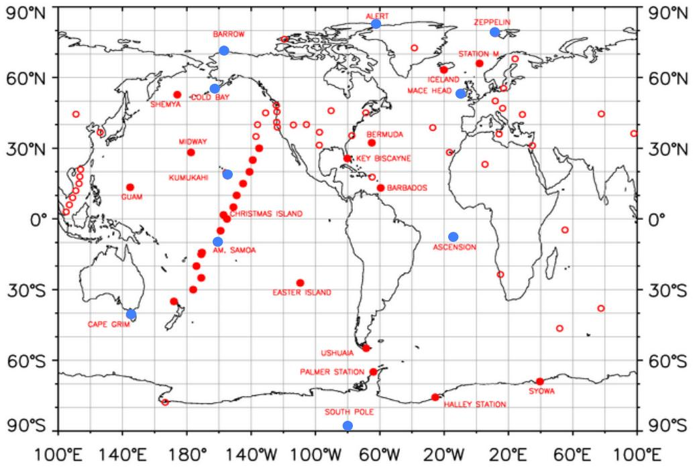  
SI	Figure	1:	NOAA Global	Monitoring	Division’s	Global	Greenhouse	Gas	Reference	Network20 providing $\mathsf { C H } _ { 4 }$ measurements	at	each	site.	Filled	circles	represent	well-mixed	marine	boundary	layer	air	sites used	to	calculate	global	mean $\mathsf { C H } _ { 4 }$ .	Sites	used	to	calculate	global	mean $\pmb { \delta } ^ { 1 3 } \pmb { \mathbb { C } } _ { \mathsf { A t m } }$ are	marked	blue.

The box-model uses global average annual $\mathrm { C H } _ { 4 }$ levels based on measurements from a subset of the network sites shown as filled circles (global mean $\delta ^ { 1 3 } \mathrm { C _ { A t m } }$ was calculated from sites marked blue). These sites are typically at remote marine sea level locations, which are representative of well-mixed marine boundary layer air. Globally averaged annual mean $\mathrm { C H } _ { 4 }$ mole fractions are plotted in SI Figure 2 (left axis). The uncertainty in globally averaged annual mean $\mathrm { C H } _ { 4 }$ varies by year, but is $\mathrm { < 1 \ p p b ( 1 \ S D ) ^ { 4 3 } }$ . This uncertainty accounts for potential biases from removing and adding sites in a MC simulation (see ref44 for methods and uncertainties in calculating global means). Considering the wide uncertainty range of the $\mathrm { C H } _ { 4 }$ lifetime, this small uncertainty was considered negligible. The resulting total annual emissions, $Q _ { A t m , t } \left( \mathrm { E q } . 2 \right)$ , are shown on the right axis of SI Figure 2 for $\mathrm { C H } _ { 4 }$ lifetimes $\tau$ (OH and stratospheric sinks; see SI Table 1 for soil sink) ranging from 8.6–9.4 years $\mathrm { ~ \ p ~ } _ { \mathrm { ~ \it ~ \ / ~ l ~ } } ^ { \mathrm { t h } } \mathrm { - } 9 0 ^ { \mathrm { t h } }$ percentiles) based on the joint distribution from four recent publications32–35 (each individual $\tau$ distribution was assumed equally likely, and the stratospheric sink from Prinn et al. 34 was used when not specified33,35). Note that this distribution is nearly identical to the 9.0 years $( + 0 . 4 , - 0 . 6 )$ in an earlier study by Montzka et al. $( 2 0 0 0 ) ^ { 3 6 }$ .

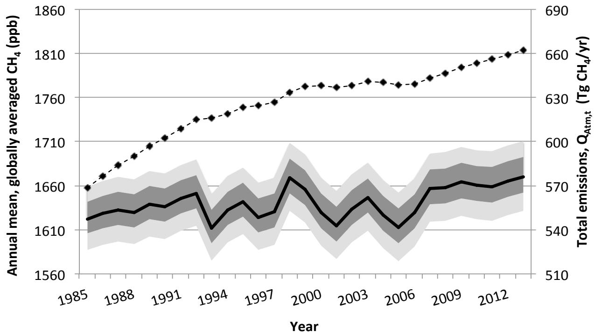  
SI	Figure	2:	Annual	mean,	globally	averaged $\mathsf { C H } _ { 4 }$ dry	mole	fractions	(dashed,	left	axis)	from	NOAA20 ; $\pm 1 . 1$ ppb	(1 SD) uncertainty, averaged	across	years45,46.	Right	axis	shows	total $\mathsf { C H } _ { 4 }$ emissions	(dark	and light	gray	bands	mark	the $2 5 ^ { \mathrm { t h } } / 7 5 ^ { \mathrm { t h } }$ percentile	and	the $1 0 ^ { \mathrm { t h } } / 9 0 ^ { \mathrm { t h } }$ percentile	uncertainties,	respectively) for	the	range of $\mathsf { C H } _ { 4 }$ lifetimes	used	in	the	box-model.

Global average $\delta ^ { 1 3 } \mathrm { C _ { A t m } }$ from INSTAAR/NOAA45,47 are shown in SI Figure 3 for 1999–2013. We use global average $1 9 8 4 - 1 9 9 8 \ \delta ^ { 1 3 } \mathrm { C } _ { \mathrm { A t m } }$ data from Schaefer et al. 21, which increase by ${ \sim } 0 . 4 \text{‰}$ during this period. The box-model accounts for a $\delta ^ { 1 3 } \mathrm { C _ { A t m } }$ uncertainty of $\pm 0 . 1 \text{‰}$ , which includes uncertainties in measurement reproducibility $( \pm 0 . 0 7 \% o ^ { 4 7 , 4 8 } )$ and in estimating global annual averages (marine boundary layer background site selection). As shown in SI Figure 17, the $\pm 0 . 1 \mathcal { \% } \delta ^ { 1 3 } \mathbf { C } _ { \mathrm { A t m } }$ uncertainty translates into only ${ \sim } 3 \ \mathrm { T g } \ C \mathrm { H } _ { 4 } / \mathrm { y r } \ \mathrm { F F } _ { \mathrm { T o t } }$ uncertainty and ${ \sim } 0 . 1$ percentage point FER uncertainty. All data from Schaefer et $a l$ .21 were adjusted to the INSTAAR $\delta ^ { 1 3 } \mathrm { C _ { A t m } }$ scale $( \sim 0 . 1 \text{‰}$ offset). Considering other internationally recognized labs, the largest possible $\delta ^ { 1 3 } \mathrm { C _ { A t m } }$ scale offset is $0 . 3 \text{‰}$ or less48, although uncertainty relative to Vienna Pee Dee Belemnite (VPDB) is only $\pm 0 . 1 \text{‰}$ (ref49 ). Summing the fractional uncertainties of $\delta ^ { 1 3 } \mathrm { C _ { A t m } }$ and the scale offset $( 0 . 3 \text{‰}$ in quadrature results in ${ \sim } 9$ Tg $\mathrm { C H } _ { 4 }$ /yr $\mathrm { F F } _ { \mathrm { T o t } }$ uncertainty and ${ \sim } 0 . 3$ percentage points FER uncertainty.

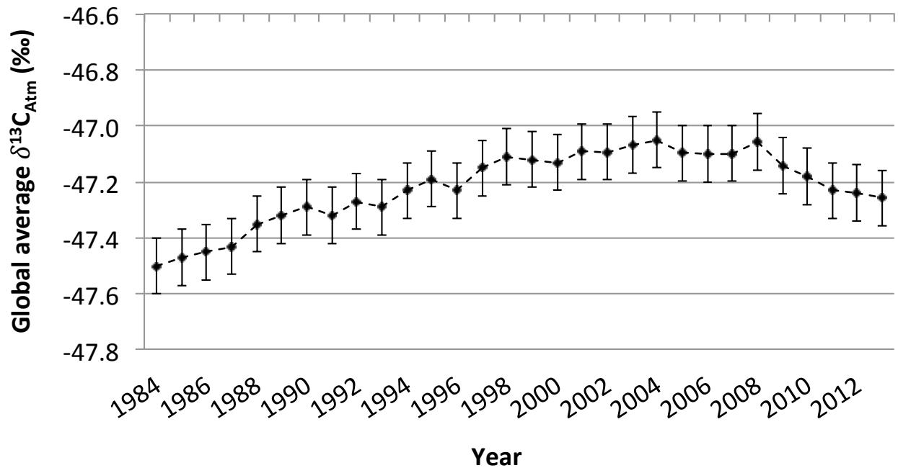  
SI	Figure	3:	Annual	mean,	globally	averaged $\pmb { \delta } ^ { 1 3 } \pmb { \ C } _ { \mathsf { { A t m } } }$ from	INSTAAR/NOAA45,47 (1999-2013)	and Schaefer	et	al. 21 (Table	S4	and	Figure	1b;	1984-1998).	All	data	are	shown	on	the	same	INSTAAR $\pmb { \delta } ^ { 1 3 } \pmb { \ C } _ { \mathsf { A t m } }$ scale	and	used	as	such	in	the	mass	balance	(see	text	details	above).

# 3. Microbial isotopic source signature

A $\delta ^ { 1 3 } \mathrm { C } _ { \mathrm { { s o u r c e } } }$ database including $1 . 0 2 1 \delta ^ { 1 3 } \mathrm { C _ { M i c } }$ measurements was compiled from the literature for the following microbial source categories: wetlands, termites, ruminants, rice agriculture, and waste/landfills. The full database including measurement locations, means and uncertainties, sample sizes, metadata (e.g., season), and literature references is available in ref14. Measurement methods include flux chamber (e.g., wetlands) and downwind plumes (e.g., landfills). Each database entry describes an original set of measurements for a specific geographic area or date, or both. A $\delta ^ { 1 3 } \mathrm { C } _ { \mathrm { M i c } }$ distribution was established for each microbial source sub-category by MC simulation sampling from each $\delta ^ { 1 3 } \mathrm { C } _ { \mathrm { M i c } }$ literature entry within each sub-category (including mean and SD; see SI Figure 4).

# Ruminant $\delta ^ { l 3 } C _ { M i c }$ data and weighting based on diet

Ruminant $\delta ^ { 1 3 } \mathrm { C } _ { \mathrm { M i c } }$ measurements were distinguished by diet because $\mathrm { C H } _ { 4 }$ from a $\mathrm { C } _ { 4 }$ plant based diet is heavier than from a $\mathrm { C } _ { 3 }$ plant based diet based on our database14. It includes ruminant

$\delta ^ { 1 3 } \mathrm { C } _ { \mathrm { M i c } }$ measurements with controlled diets, and the data indicate a bimodal distribution: diets consisting of $260 \%$ $\mathrm { C } _ { 4 }$ plants yield $\delta ^ { 1 3 } \mathrm { C } _ { \mathrm { M i c } }$ of $- 5 4 . 6 \pm 3 . 1 \% o$ (1 SD) compared to a $\mathrm { C } _ { 3 }$ plant based diet $( - 6 9 . 4 \pm 3 . 1 \% o )$ . Weighting $\mathrm { C } _ { 3 }$ vs. $\mathrm { C } _ { 4 }$ based diet signatures requires global ruminant feed data including grains and grasses. Cattle contribute $96 \%$ of U.S. ruminant $\mathrm { C H } _ { 4 }$ emissions (the remainder being mainly pigs, horses, sheep, and goats)22 even though cattle represent only $57 \%$ of U.S. ruminant livestock (1980–2013 average; the global figure is $3 3 \% ^ { 5 0 }$ ). Since cattle are by far the dominant ruminant source, and because of lack of diet data for other ruminants, this model does not account for potential differences in the $\mathrm { C } _ { 3 } / \mathrm { C } _ { 4 }$ diet ratio between cattle and other ruminants.

The economically important $\mathrm { C } _ { 4 }$ grains used as cattle feed (including byproducts) include maize, sugarcane, sorghum, and millets, whereas most other grains are from $\mathrm { C } _ { 3 }$ plants. We estimated the fraction of U.S. cattle with a $\mathrm { C } _ { 4 }$ -based diet (defined as $2 6 0 \%$ $\mathrm { C } _ { 4 }$ plants, see above) as follows. The majority of U.S. cattle feed $\mathrm { C } _ { 4 }$ grains include maize $( 9 4 \% )$ and sorghum $( 4 \% ) ^ { 5 1 }$ . Based on literature52–54 and expert feedback55, our model assumes $0 \%$ $\mathrm { C } _ { 4 }$ diet (uniform distribution) in cow-calf operations, $100 \%$ in feedlots, and $0 { - } 2 5 \%$ (uniform distribution) in dairy operations (all including $\mathrm { C } _ { 4 }$ grains and silage). Weighting the $\mathrm { C } _ { 4 }$ distributions of these operations by their relative emission strength22 results in a U.S. $\mathrm { C } _ { 4 }$ emission fraction of $1 9 . 6 \pm 5 . 9 \%$ (1 SD). Extrapolating the U.S. $\mathrm { C } _ { 4 }$ emission fraction globally, where there is little available data, requires accounting for the relatively high use of $\mathrm { C } _ { 4 }$ feed grain in the U.S. During 1980–2013, the U.S. held only $7 \%$ of the global cattle population50, but it consumed $32 \%$ of global maize and sorghum feed51. We therefore used the U.S. $\mathrm { C } _ { 4 }$ emission fraction as a global upper bound. As a global lower bound, the model assumes that the $\mathrm { C } _ { 4 }$ diet fraction in the rest of the world (ROW) is zero, i.e., only a negligible fraction of ROW cattle receives $\mathrm { C } _ { 4 }$ -based plant feed. Accounting for U.S. and global cattle populations50 results in a global weighted average $\mathrm { C } _ { 4 }$ emission fraction range of $1 . 5 \mathrm { - } 1 9 . 6 \%$ (uniform). Note that we assume a $\mathrm { C } _ { 4 }$ diet fraction for grazing cattle similar to our distribution for grain-fed cattle. This assumption is consistent with global plant coverage data indicating that ${ \sim } 2 0 \%$ of both total land and cropland coverage are $\mathrm { C } _ { 4 }$ based56. Thus, unless a disproportionately large fraction of cattle grazes on land with predominantly $\mathrm { C } _ { 4 }$ based vegetation, our global weighted average $\mathrm { C } _ { 4 }$ emission fraction distribution can be used to encompass both grain and grass based diets. Weighting the above $\mathrm { C } _ { 3 }$ and $\mathrm { C } _ { 4 }$ diet $\delta ^ { 1 3 } \mathrm { C } _ { \mathrm { M i c } }$ distributions by the

respective emission fraction distributions in a MC simulation yields a global weighted average ruminant $\delta ^ { 1 3 } \mathrm { C } _ { \mathrm { M i c } }$ of $- 6 6 . 8 \pm 2 . 8 \% o$ , 1 SD). The vast majority of ruminant $\delta ^ { 1 3 } \mathrm { C } _ { \mathrm { M i c } }$ samples is from $\mathrm { C } _ { 3 }$ diets (159 out of 171), which is representative of the $\mathrm { C } _ { 3 }$ ruminant emissions fraction (80.4– $9 8 . 5 \%$ , i.e., $100 \%$ minus $\mathrm { C } _ { 4 }$ fraction described above).

Wetland, termites, rice and landfill/waste $\delta ^ { l 3 } C _ { M i c }$ data and total microbial weighting

The wetland $\delta ^ { 1 3 } \mathrm { C } _ { \mathrm { M i c } }$ contains 512 samples from 9 countries on 4 continents across seasons. The rice $\delta ^ { 1 3 } \mathrm { C } _ { \mathrm { M i c } }$ contains 252 samples from 6 countries on 4 continents throughout the rice cultivation cycle. The landfill/waste $\delta ^ { 1 3 } \mathrm { C } _ { \mathrm { M i c } }$ contains 57 landfill and manure samples from 4 countries in North America and Europe. The termite $\delta ^ { 1 3 } \mathrm { C } _ { \mathrm { M i c } }$ contains 29 samples collected from natural termite nests and in lab experiments. The differences in sample sizes between these categories are roughly representative of their respective emissions strengths (see SI Figure 5). The individual $\delta ^ { 1 3 } \mathrm { C } _ { \mathrm { M i c } }$ for wetlands $( - 6 1 . 5 \pm 0 . 6 \% o )$ , termites $- 6 5 . 0 \pm 1 . 7 \% o )$ , rice $- 6 2 . 1 \pm 1 . 3 \% o )$ and landfill/waste $( - 5 5 . 6 \pm 0 . 7 \% o )$ show significantly narrower distributions than for ruminants.

A weighted average microbial $\delta ^ { 1 3 } \mathrm { C } _ { \mathrm { M i c } }$ distribution (representing the categories ruminants, wetland, termites, rice and landfill/waste) was estimated as illustrated in SI Figure 4. Discrete distributions of each source category from the database were weighted by their respective relative emissions (RE; percentage of global total microbial $\mathrm { C H } _ { 4 }$ ). A set of $1 2 \mathrm { R E }$ literature estimates was used from two bottom-up study reviews57,58 and four top-down inversion studies 3,4,6,7 to account for RE uncertainty. The resulting 12 weighted average $\delta ^ { 1 3 } \mathrm { C } _ { \mathrm { M i c } }$ distributions were sampled in the MC simulation assuming equal weight of each distribution, which yielded a single weighted average $\delta ^ { 1 3 } \mathrm { C } _ { \mathrm { M i c } }$ distribution.

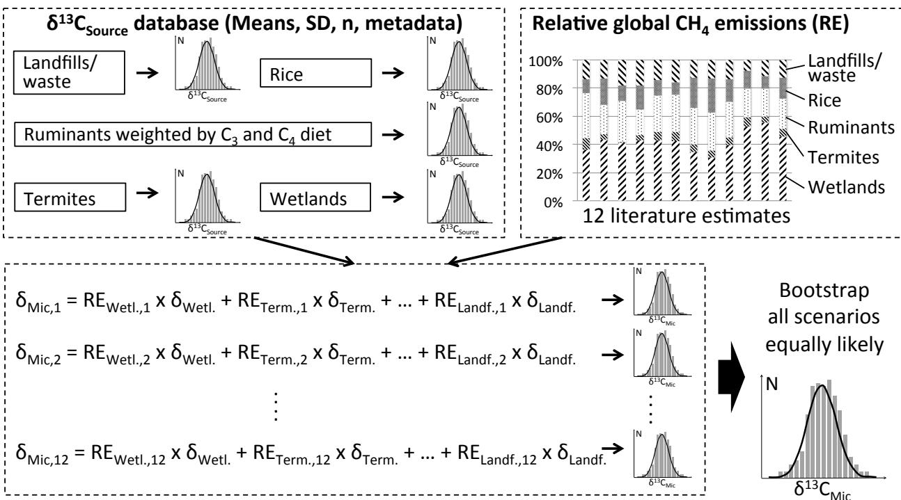  
SI	Figure	4:	Methods	overview	for	estimating	the	weighted	average $\delta ^ { 1 3 } \mathsf { C } _ { \mathsf { M i c } }$ . Given	the	large uncertainty	of	the	share	of $\pmb { \complement _ { 3 } }$ vs. $\pmb { \complement _ { 4 } }$ ruminant	diet, $\pmb { C _ { 3 } }$ and $\pmb { \complement _ { 4 } }$ ruminant	diet $\delta ^ { 1 3 } \mathsf { C } _ { \mathsf { M i c } }$ distributions	were weighted	according	to	the	global $\mathsf { \pmb { C } } _ { 3 } / \mathsf { \pmb { C } } _ { 4 }$ diet	ratio	(see	text).

Ranges of global microbial $\mathrm { C H } _ { 4 }$ RE are shown in SI Figure 5 including average RE in red (mean of all 12 data points). The $1 2 \mathrm { R E }$ estimates include (i) the lower and upper bound total microbial $\mathrm { C H } _ { 4 }$ emission scenarios from two bottom-up studies57,58, and (ii) the prior and posterior $\mathrm { C H } _ { 4 }$ emission scenarios from four top-down studies3,4,6,7. The four top-down studies are based on different prior datasets as shown by the varying RE values, and there is no consistent bias between prior and posterior RE between studies. Wetlands and ruminants combined account on average for about $66 \%$ of total microbial source $\mathrm { C H } _ { 4 }$ emissions followed by rice agriculture and landfills/waste ( $14 \%$ each), and termites $( 5 \% )$ .

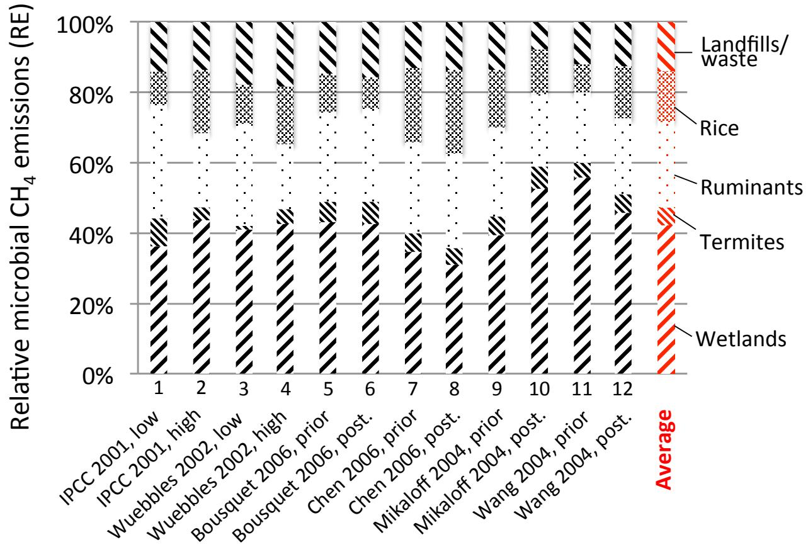  
SI	Figure	5:	Contribution	of	sources	to	global	total	microbial $\mathsf { C H } _ { 4 }$ (relative	emissions,	RE)	based	on ranges	from	six	studies 3,4,6,7,57,58 a s	well	as	the	average	contribution	from	all	studies (red). The	indices 1–12	refer	to	the	weighted	average $\delta ^ { 1 3 } \mathsf { C } _ { \mathsf { M i c } }$ scenarios	in SI	Figure	6.

The $\delta ^ { 1 3 } \mathrm { C } _ { \mathrm { M i c } }$ and 1 SD of individual source categories based on 1,021 individual measurements from 82 independent studies (i.e., unique location and/or date) and the resulting weighted averages are shown in SI Figure 6. The influence of RE uncertainty (SI Figure 5) on the weighted average microbial $\delta ^ { 1 3 } \mathrm { C } _ { \mathrm { M i c } }$ distribution is small. The weighted average $\delta ^ { 1 3 } \mathrm { C } _ { \mathrm { M i c } }$ difference between the highest (scenario 4) and lowest (scenario 1) is only $0 . 7 \text{‰}$ . The resulting weighted average $\delta ^ { 1 3 } \mathrm { C } _ { \mathrm { M i c } }$ is $- 6 2 . 2 \pm 0 . 8 \% o$ (1 SD).

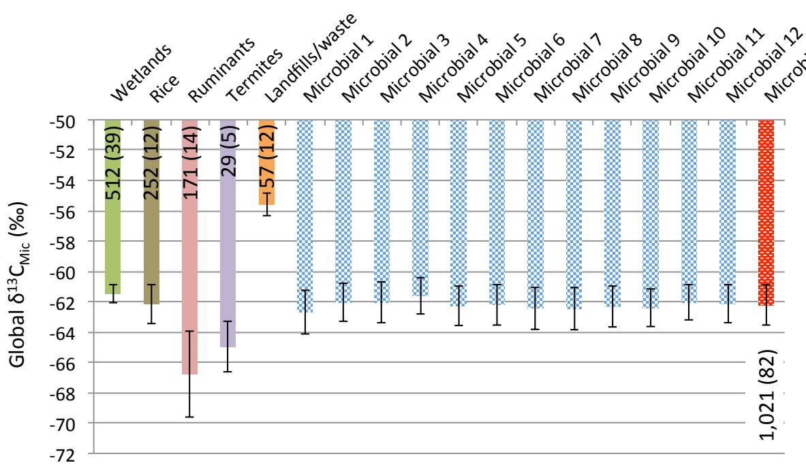

SI	Figure	6: $\delta ^ { 1 3 } \mathsf { C } _ { \mathsf { M i c } }$ and	1 SD	uncertainties	of	individual	source	categories	(solid)	and	weighted	averages (hatched)	based	on	the	12	scenarios	in SI	Figure	5.	The	microbial	mean	and	1 SD	were estimated	by MC	simulation	sampling	of the	distributions	of	all	weighted	averages. The	sample	sizes	of	each	source category	and	the	total	are	shown	on	the	respective	bars (values	in	parentheses	indicate	number	of independent	studies,	i.e.,	unique	location	and/or	date).

# 4. Biomass burning isotopic source signature

There are relatively few $\delta ^ { 1 3 } \mathrm { C } _ { \mathrm { B B } }$ direct plume measurement data available globally. Our literature survey resulted in 82 individual samples from 22 studies. Only 22 samples from 8 studies (in Zambia and Brazil) are associated with tropical latitudes where the vast majority of global BB occurs according to satellite retrievals59. Only 6 samples from 2 studies are associated with $\mathrm { C } _ { 4 }$ plants ( $C _ { 3 }$ for the remainder). A list of all sample details and references is available in the supplementary data file. Given the significantly different $\mathrm { C } _ { 3 }$ and $\mathrm { C } _ { 4 }$ biomass plant material $\delta ^ { 1 3 } \mathrm { C } _ { \mathrm { B B } }$ , we also compared the direct measurements with 965 indirect measurements, i.e., $\delta ^ { 1 3 } \mathrm { C } _ { \mathrm { B B } }$ in $\mathrm { C } _ { 3 }$ and $\mathrm { C } _ { 4 }$ plant material (grasses) from Cerling et al. $1 9 9 7 ^ { 6 0 }$ , to improve global data representativeness. The general procedure for estimating a weighted $\delta ^ { 1 3 } \mathrm { C } _ { \mathrm { B B } }$ follows the schematic in SI Figure 7. Global $\mathrm { C } _ { 3 }$ and $\mathrm { C } _ { 4 } \mathrm { B B }$ vegetation maps from Still et al. $2 0 0 3 ^ { 5 6 }$ and GFED $\mathbf { v } 1 ^ { 2 3 }$ were used in combination with global monthly (1997–2003 due to data availability) BB $\mathrm { C H } _ { 4 }$ flux maps from GFED v1 and $\mathbf { v } 3 ^ { 2 3 }$ to estimate monthly $\mathrm { C } _ { 3 }$ and $\mathrm { C } _ { 4 }$ fractions of global

total BB $\mathrm { C H } _ { 4 }$ emissions (SI Figure 7, panel a). The four sets (two vegetation and flux maps each) of 84 monthly discrete $\mathrm { C } _ { 3 }$ and $\mathrm { C } _ { 4 }$ fractions were used in a MC simulation, assuming equal probability of all discrete values, to generate a distribution of $\mathrm { C } _ { 3 }$ and $\mathrm { C } _ { 4 }$ fractions (SI Figure 7, panel b). Distributions of the above direct and indirect measurements of $\mathrm { C } _ { 3 }$ and $\mathrm { C } _ { 4 }$ plant $\delta ^ { 1 3 } \mathrm { C } _ { \mathrm { B B } }$ (SI Figure 7, panel c) were weighted with the $\mathrm { C } _ { 3 }$ and $\mathrm { C } _ { 4 }$ fraction distributions in a MC simulation to yield a distribution of the global weighted average $\delta ^ { 1 3 } \mathrm { C } _ { \mathrm { B B } }$ .

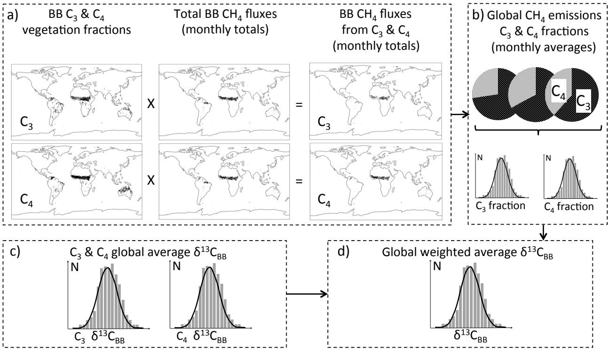  
SI	Figure	7:	Weighting	procedure	for	estimating	a	global	weighted $\delta ^ { 1 3 } \mathsf C _ { \mathsf B \mathsf B }$ based	on	global $\pmb { C _ { 3 } }$ and $\pmb { \complement _ { 4 } }$ BB vegetation	maps23,56, global	BB $\mathsf { C H } _ { 4 }$ flux	maps23,	and	literature $\pmb { C _ { 3 } }$ and $\pmb { \complement _ { 4 } }$ specific $\delta ^ { 1 3 } \mathsf C _ { \mathsf B \mathsf B }$ .

The resulting $\delta ^ { 1 3 } \mathrm { C } _ { \mathrm { B B } }$ are shown in SI Figure 8. Panel a) summarizes the $\mathrm { C } _ { 4 }$ plant fractions (temporal distributions from monthly data) for each combination of plant maps and BB $\mathrm { C H } _ { 4 }$ flux maps as well as their average from the MC simulation. The remaining $\mathrm { C } _ { 3 }$ plant fraction is not shown. Panel b) shows the individual $\mathrm { C } _ { 3 }$ and $\mathrm { C } _ { 4 } \delta ^ { 1 3 } \mathrm { C } _ { \mathrm { B B } }$ based on plant material $\delta ^ { 1 3 } \mathrm { C } _ { \mathrm { B B } }$ content (green) and direct plume measurements (red), respectively, as well as their weighted averages. The weighted averages based on indirect and direct measurements are $- 2 2 . 2 \pm 1 . 9 \% o$ and $- 2 4 . 7 \pm$ $2 . 2 \text{‰}$ , respectively. While the difference of $2 . 5 \text{‰}$ between the means is significant, we used the distribution based on the indirect measurements from Cerling et al. 1997 60 in the top-down model due to the larger sample size as described above.

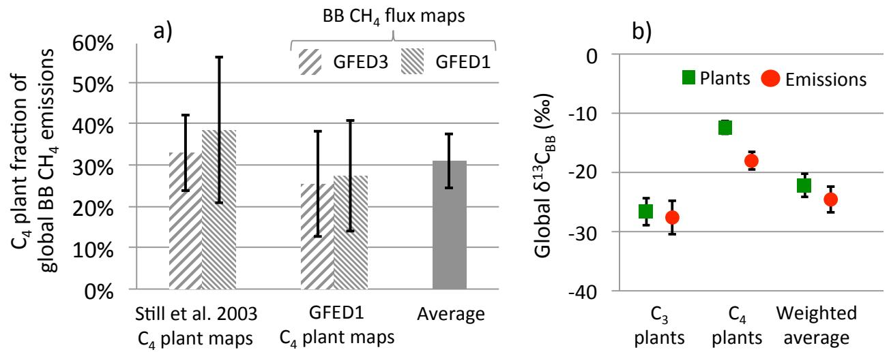  
SI	Figure	8:	Global $\delta ^ { 1 3 } \mathsf { C } _ { \mathsf { B B } }$ .	Panel	a)	shows	four	estimates	of	the $\pmb { \complement _ { 4 } }$ plant	fraction	of	global	BB $\mathsf { C H } _ { 4 }$ emissions	based	on	two	spatial $\pmb { \complement _ { 4 } }$ distribution	maps23,56 and	two	BB $\mathsf { C H } _ { 4 }$ flux	maps23. Solid	gray	is	the mean	and	1 SD	from	a	MC	simulation	assuming	all	four	estimates	are	equally	likely.	Panel	b)	shows $\pmb { \complement _ { 3 } }$ and $\mathsf { C } _ { 4 } \delta ^ { 1 3 } \mathsf { C } _ { 8 8 }$ based	on	plant	material $\delta ^ { 1 3 } \mathsf C _ { \mathsf B \mathsf B }$ content	(green, $N _ { \tt C 3 , C 4 } = 9 6 5 ]$ ) in Cerling	et	al. $\pmb { 1 9 9 7 } ^ { 6 0 }$ ,	and from	a	literature	review	of	direct	plume	measurements	(red, $N _ { C 3 } = 7 6$ , $\mathsf { N } _ { \mathsf { C } 4 } = \mathsf { G } ]$ ). We	attribute	the $\pmb { \complement _ { 4 } }$ $\delta ^ { 1 3 } \mathsf C _ { \mathsf B \mathsf B }$ difference	between	plant	material	data	and	direct	measurements	to	the	small	sample	size	of the	latter,	and	we	use	the	weighted	average	based	on	plant	material	data	in	our	box-model.	The weighted	averages account	for	the $\pmb { \complement _ { 4 } }$ plant	fraction	and	uncertainty	in	panel	a).

# 5. Fossil fuel isotopic signature

A $\delta ^ { 1 3 } \mathrm { C } _ { \mathrm { s o u r c e } }$ database14 of $7 { , } 4 8 2 \delta ^ { 1 3 } \mathrm { C } _ { \mathrm { F F } }$ measurements from NG/oil well-heads and coal mines globally was compiled from the peer-reviewed literature, government reports and government databases, and used to estimate a global weighted average $\delta ^ { 1 3 } \mathrm { C } _ { \mathrm { F F } }$ . Data are representative of produced natural gas or coal gas from 45 countries which together account for $82 \%$ of global natural gas production and $80 \%$ of global coal production16. Limitations to the database include a lack of natural gas $\delta ^ { 1 3 } \mathrm { C } _ { \mathrm { F F } }$ data from Qatar, Algeria, Malaysia, Turkmenistan, United Arab Emirates and Venezuela, which together account for $1 2 . 2 \%$ of global natural gas production (2000-2014) and a lack of coal gas $\delta ^ { 1 3 } \mathrm { C } _ { \mathrm { F F } }$ data from India, Indonesia, Kazakhstan, Ukraine and Columbia, which account for $1 4 . 5 \%$ of global coal production (2000-2014). Other sample biases include over- and under-representation. For example, the two largest gas producers, USA ( $1 9 . 9 \%$ of global natural gas production) and Russia ( $1 9 . 4 \%$ of production) comprise $3 6 . 6 \%$ and $10 \%$ , respectively, of the sample count. These biases are mitigated by weighting each country’s average $\delta ^ { 1 3 } \mathrm { C } _ { \mathrm { F F } }$ value by its fraction of annual global production, separately for natural gas and coal (see below). Since data cannot be obtained exhaustively for all producing formations within each country, we assume that the data are broadly representative of the major producing formations and regions. The weighting procedure follows the schematic shown in SI Figure 9, and was implemented in a MC simulation to yield global annual weighted $\delta ^ { 1 3 } \mathrm { C } _ { \mathrm { F F } }$ distributions.

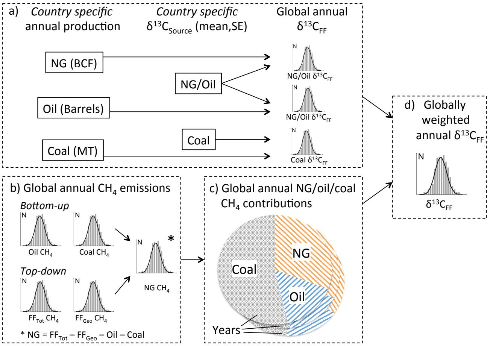

# SI	Figure	9:	Weighting	procedure	for	estimating	globally-weighted	annual $\delta ^ { 1 3 } \mathsf C _ { \mathsf F \mathsf F }$ based	on	countryspecific	NG/oil and	coal $\delta ^ { 1 3 } \mathsf C _ { \mathsf F \mathsf F }$ from	our	database14.

Country-specific NG/oil (both are often co-produced) and coal $\delta ^ { 1 3 } \mathrm { C } _ { \mathrm { F F } }$ data were weighted by annual production of NG, oil, and coal. Note that country-level weighting was the smallest feasible geographic scale (as opposed to, e.g., basin-level) due to available $\delta ^ { 1 3 } \mathrm { C } _ { \mathrm { F F } }$ and production data. Given the large sample size and our goal of estimating a global average and its uncertainty (rather than its variability per se), country-specific means and the associated standard errors of the mean (SE) were estimated. The resulting global annual NG/oil, and coal $\delta ^ { 1 3 } \mathrm { C } _ { \mathrm { F F } }$ distributions (SI Figure 9, panel a) were weighted by their respective $\mathrm { C H } _ { 4 }$ contributions (panel c), which

yields global annual weighted $\delta ^ { 1 3 } \mathrm { C } _ { \mathrm { F F } }$ (panel d). Oil and coal $\mathrm { C H } _ { 4 }$ contributions were determined based on published bottom-up estimates including uncertainties28. NG $\mathrm { C H } _ { 4 }$ emission distributions were estimated as $\mathrm { F F } _ { \mathrm { T o t } }$ (this study) minus $\mathrm { F F _ { G e o } }$ (this study), oil, and coal (both bottom-up). The weighting in SI Figure 9 was solved iteratively because $\mathrm { F F } _ { \mathrm { T o t } }$ from our top-down model (b) is dependent on the $\delta ^ { 1 3 } \mathrm { C } _ { \mathrm { F F } }$ in (d). Yet, only two iterations were needed given the relatively small differences between the lightest (NG $\delta ^ { 1 3 } \mathrm { C } _ { \mathrm { F F } } = - 4 4 . 5 \% o )$ and heaviest sources (coal $\delta ^ { 1 3 } \mathrm { C } _ { \mathrm { F F } } = -$ $43 . 4 \text{‰}$ ).

The results of steps b) and c) from SI Figure 9 are shown in SI Figure 10, which assumes published28 bottom-up oil and coal emissions and uncertainties. The large NG emission uncertainties of $51 \%$ – propagated from the $\delta ^ { 1 3 } \mathrm { C }$ mass balance – are consistent in magnitude with uncertainties (ranging $4 \mathrm { - } 5 3 \%$ with a mean of $2 5 \%$ ) from multiple regional and basin-level studies61. The IAV in NG $\mathrm { C H } _ { 4 }$ emissions (panel a) is partly due to model propagation from IAV in global total $\mathrm { C H } _ { 4 }$ emissions (see SI section 8), and is unlikely to reflect annual changes in NG industry activities. Note also that bottom-up oil and coal emissions assume constant emission factors (EF; largely engineering estimates) over time. Potential emission reductions, particularly for coal, would result in a shallower temporal decline in NG emissions (see main article discussion). Bottom-up uncertainties resulting from ranges in literature EF are described in more detail elsewhere28. Panel b) translates the absolute $\mathrm { C H } _ { 4 }$ emissions from panel a) into relative contributions to total $\mathrm { F F _ { I n d } C H _ { 4 } }$ emissions, which were used to estimate global weighted average $\delta ^ { 1 3 } \mathrm { C } _ { \mathrm { F F } }$ .

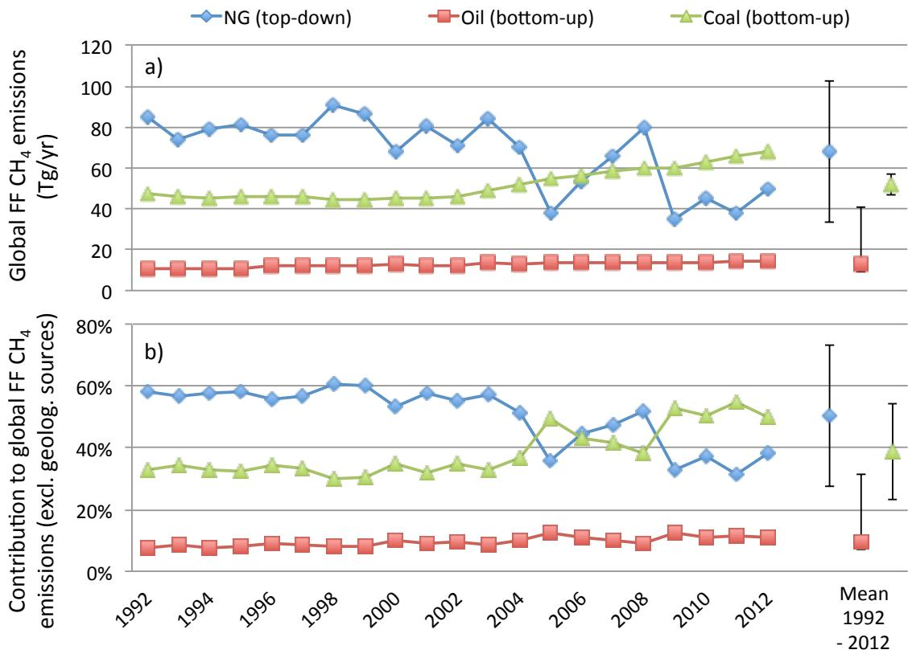  
SI	Figure	10:	Global	FF $\mathsf { C H } _ { 4 }$ emissions	by	source (panel	a)	and	annual	mean	contributions	of NG,	oil, and	coal production	to	global $\mathsf { C H } _ { 4 }$ emissions	(panel	b)	for	estimating weighted	average $\delta ^ { 1 3 } \mathsf C _ { \mathsf F \mathsf F }$ (see SI Figure	9 b)	and	c))	for	the	period	during	which	all	country-specific	production	data	for	weighting	were available.	The	last	column	shows	averages over	1992-2012	including	1 SD	uncertainties	(individual year	1 SDs	were	omitted	for	legibility,	and	only	negligible	variability	and	trends	were	observed). Annual	values	of	NG,	oil,	and	coal	in	panel	b)	add	up	to $100 \%$ .

The resulting global weighted average $\delta ^ { 1 3 } \mathrm { C } _ { \mathrm { F F } }$ are shown in SI Figure 11. The NG/Oil $\delta ^ { 1 3 } \mathrm { C } _ { \mathrm { F F } }$ weighted by oil production is heavier than weighted by NG production, partly due to proportionally large oil production (as a proxy for emissions) in Saudi Arabia and the U.S. with relatively heavy national average NG $\delta ^ { 1 3 } \mathrm { C } _ { \mathrm { F F } }$ (mean $- 3 9 . 1 \text{‰}$ and $- 4 3 . 1 \text{‰}$ , respectively). In contrast, Saudi Arabia’s share of global NG production is relatively small, which contributes to a ${ \sim } 0 . 7 \text{‰}$ lighter global average NG $\delta ^ { 1 3 } \mathrm { C } _ { \mathrm { F F } }$ compared to oil in the 1990s. Note that $\delta ^ { 1 3 } \mathrm { C } _ { \mathrm { F F } }$ in this analysis excludes shale gas methane because the share of these sources to global total NG production increased from only $3 \%$ to $9 \%$ between 2007 and $2 0 1 3 ^ { 1 6 }$ . Coal $\delta ^ { 1 3 } \mathrm { C } _ { \mathrm { F F } }$ are lighter than oil in most countries because of the influence of microbial methanogenesis in some coal formations 14,19,62. The ${ \sim } 3 . 5 \mathrm { ‰}$ upward trend in the global coal $\delta ^ { 1 3 } \mathrm { C } _ { \mathrm { F F } }$ is entirely due to China’s nearly tripling hard coal production during 1999–2012 $51 \%$ of global hard coal production in

2012)16 and a corresponding Chinese national average coal $\delta ^ { 1 3 } \mathrm { C } _ { \mathrm { F F } }$ of $- 3 6 . 0 \text{‰}$ . The ${ \sim } 0 . 7 \text{‰}$ upward trend in the global NG $\delta ^ { 1 3 } \mathrm { C } _ { \mathrm { F F } }$ during 2002–2012 is mostly due to relative increases in NG production in the U.S. (mean NG $\delta ^ { 1 3 } \mathrm { C } _ { \mathrm { F F } }$ of $- 4 3 . 1 \text{‰}$ ), Iran $( - 40 . 0 \text{‰}$ , Saudi Arabia $( - 4 0 . 2 \text{‰}$ , Norway $( - 4 3 . 9 \text{‰}$ , and China $( - 4 1 . 0 \text{‰}$ as well as relatively decreasing NG production in Canada $( - 5 4 . 7 \text{‰}$ ). Russia’s increase in NG production $( - 4 6 . 4 \text{‰}$ during this period flattens the global NG $\delta ^ { 1 3 } \mathrm { C } _ { \mathrm { F F } }$ trend. Accounting for the relative contributions of NG, oil, and coal to $\mathrm { F F } _ { \mathrm { T o t } }$ emissions (SI Figure 10, panel b), the global weighted average $\delta ^ { 1 3 } \mathrm { C } _ { \mathrm { F F } }$ reflects the upward trend in the NG and coal $\delta ^ { 1 3 } \mathrm { C } _ { \mathrm { F F } }$ . The relatively small 1 SDs are the result of the large number of individual $\delta ^ { 1 3 } \mathrm { C } _ { \mathrm { F F } }$ measurements $( \mathrm { N } = 7 { , } 4 8 2 )$ in the database.

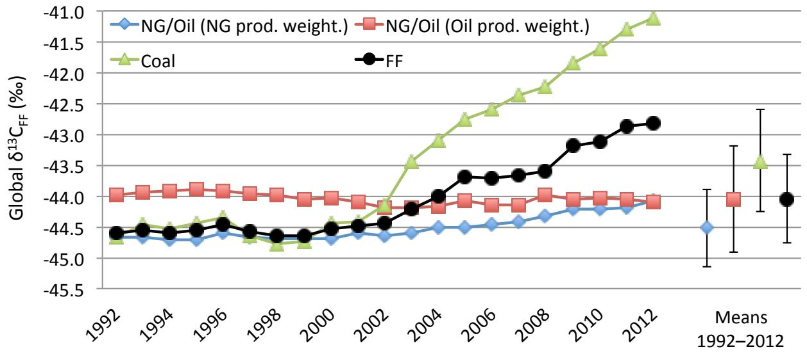  
SI	Figure	11:	Annual	global	average NG,	oil,	coal $\delta ^ { 1 3 } \mathsf C _ { \mathsf F \mathsf F }$ (all	weighted	by	country-level	production) based	on	the	methods	described	in	SI	Figure	9 for	the	period	during	which	all	country-specific production	data	for	weighting	was	available.	The	last	column	shows $\delta ^ { 1 3 } \mathsf C _ { \mathsf F \mathsf F }$ values	averaged	over	1992- 2012	including	1 SD	(individual	year	1 SD were	omitted	for	legibility,	and	only	negligible	variability	and trends	were	observed).

# 6. Paleo $\underline { { \mathbf { C H } _ { 4 } } }$ budget and fossil $\underline { { \mathbf { C H } _ { 4 } } }$ emissions from geological seepage

Geological $\mathrm { C H } _ { 4 }$ sources refer to natural emissions of gas through the Earth’s crust in sedimentary, petroleum-prone basins (incl. gas-oil seeps, mud volcanoes, diffuse micro-seepage) and geothermal-volcanic systems12,63,64. Bottom-up estimates12,13,65 of global $\mathrm { F F _ { G e o } }$ are 45–76 Tg $\mathrm { C H _ { 4 } / y r }$ based on the acquisition of thousands of flux measurements for various seepage types in

12 countries in different petroliferous basins64; these were scaled up globally following the concepts of “point sources”, “area sources”, “activity” and “emission factors” as recommended by EMEP-EEA66. In the absence of $\mathrm { F F _ { I n d } }$ in the pre-industrial era, $\mathrm { F F _ { G e o } }$ is considered the only source with a $\delta ^ { 1 3 } \mathrm { C } _ { \mathrm { F F } }$ signature. Ice core records of $\mathrm { C H } _ { 4 }$ levels and $\delta ^ { 1 3 } \mathrm { C }$ over the past two millennia24–26,67 help constrain global $\mathrm { F F _ { G e o } }$ top-down, but this requires observations about preindustrial BB emissions, which are not available. Previous studies24,67 reversed this approach by estimating BB emissions (on average $2 0 { - } 3 0 \mathrm { T g } \mathrm { C H } _ { 4 } / \mathrm { y r }$ during AD 0–1600) based on outdated bottom-up $\mathrm { F F _ { G e o } }$ estimates. This range is lower than current day – partly satellite-based – BB estimates of $2 5 { - } 6 0 \mathrm { T g } \mathrm { C H } _ { 4 } / \mathrm { y r }$ including biofuels and wildfires11, perhaps due to a smaller human influence in the pre-industrial era. While $\mathrm { F F _ { G e o } }$ cannot be estimated without assumptions about pre-industrial BB estimates, we verified whether our global $\delta ^ { 1 3 } \mathrm { C } _ { \mathrm { s o u r c e } }$ inventory is consistent with previous $\mathrm { F F _ { G e o } }$ estimates and the above model-derived pre-industrial BB emissions. Note that we assume that the temporal average $\delta ^ { 1 3 } \mathrm { C } _ { \mathrm { F F } }$ based on NG/oil well and coal mine data is representative of $\mathrm { F F } _ { \mathrm { G e o } } \mathrm { C H } _ { 4 }$ emissions. Since there is no significant isotopic fractionation during gas migration in petroleum systems from reservoir to the surface68,69 (although molecular fractionation does occur68,69), potential differences in $\delta ^ { 1 3 } \mathrm { C } _ { \mathrm { F F } }$ between $\mathrm { C H } _ { 4 }$ emissions from $\mathrm { F F _ { I n d } }$ and $\mathrm { F F _ { G e o } }$ may only result from a potential sampling bias in our (however large) $\delta ^ { 1 3 } \mathrm { C } _ { \mathrm { F F } }$ database, i.e., reservoir depths (largely determining reservoir pressure and thus the level of thermogenic methane formation and $\delta ^ { 1 3 } \mathrm { C } _ { \mathrm { F F } } \big )$ ) of the samples vs. the seepage source. Yet, even a large hypothetical difference of $5 \text{‰}$ between $\delta ^ { 1 3 } \mathrm { C } _ { \mathrm { F F } }$ from $\mathrm { F F _ { I n d } }$ and $\mathrm { F F _ { G e o } }$ would change $\mathrm { F F _ { G e o } C H _ { 4 } }$ emissions by only ${ \sim } 2 0 \%$ (well within uncertainties) in our model described below.

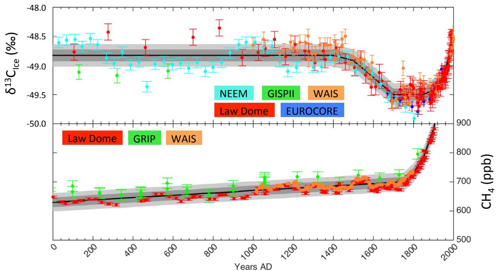  
SI	Figure	12:	Ice	core	records	of $\mathsf { C H } _ { 4 } ^ { 2 4 - 2 6 , 6 7 }$ mixing	ratios	and ${ \pmb \delta } ^ { 1 3 } { \pmb C }$ over	the	past	two	millennia shown	as colored	dots (reproduced	from	Sapart	et	al. $\pmb { 2 0 1 2 } ^ { 2 4 }$ ),	which	informed	the	distributions (light	and	dark gray	represent $1 0 ^ { \mathrm { t h } } / 9 0 ^ { \mathrm { t h } }$ and $2 5 ^ { \mathrm { t h } } / 7 5 ^ { \mathrm { t h } }$ percentiles,	respectively)	used	in	the	box-model.

We estimated $\mathrm { F F _ { G e o } }$ emissions analogously to Equations 1-11, but $X _ { C H 4 , t }$ and $\delta ^ { I 3 } C _ { A t m , t }$ were replaced with XCH4,Ice,t and $\delta ^ { 1 3 } C _ { I c e , t }$ using literature24–26,67 data shown in SI Figure 12. This method is similar to previous analyses24,67, but it varies in two ways. First, we used updated $\delta ^ { 1 3 } \mathrm { C } _ { \mathrm { { s o u r c e } } }$ from our global inventory described above (e.g., lighter $\delta ^ { 1 3 } \mathrm { C } _ { \mathrm { F F } } )$ , which influence the derived emission attribution between geological, BB, and microbial sources. Second, we simplify the analysis by focusing only on multi-centennial-scale trends in the measurements because centennial-scale variations are unlikely caused by changes in geological $\mathrm { C H } _ { 4 }$ , which is in agreement with previous studies24,67. Original data from different sources in SI Figure 12 (colored circles with error bars) are plotted as a reference, which show a $\delta ^ { 1 3 } \mathrm { C } _ { \mathrm { I c e } }$ decrease during ${ \sim } 1 4 0 0 { \  } 1 8 0 0$ followed by an increase until 2000 as well as a steady increase in $\mathrm { C H } _ { 4 }$ during ${ \sim } 0 { - } 1 7 5 0$ followed by a more rapid increase thereafter. These major trends are accounted for in the box-model as shown by the shaded areas. Pre-industrial BB emissions of $2 0 { - } 3 0 \mathrm { T g } \mathrm { C H } _ { 4 } / \mathrm { y r }$ during AD 0–1600 were prescribed consistent with the literature 24,67 (including a gradual decline by $1 0 \mathrm { T g } \mathrm { C H } _ { 4 } / \mathrm { y r }$ in 1800 followed by a gradual increase of $1 5 \mathrm { T g } \mathrm { C H } _ { 4 } / \mathrm { y } \mathrm { \Omega }$ r in 2000). We assumed the same OH and soil sink ranges as in current decades (SI Table 1) consistent with previous studies24,67. This results in

$\mathrm { F F _ { G e o } }$ emissions of 22–78 Tg $\mathrm { C H _ { 4 } / y r }$ ( $1 0 ^ { \mathrm { t h } } / 9 0 ^ { \mathrm { t h } }$ percentiles) with a mean of $5 1 \mathrm { T g } \mathrm { C H } _ { 4 } / \mathrm { y r }$ (averaged over AD 0–1700) as shown in SI Figure 13.

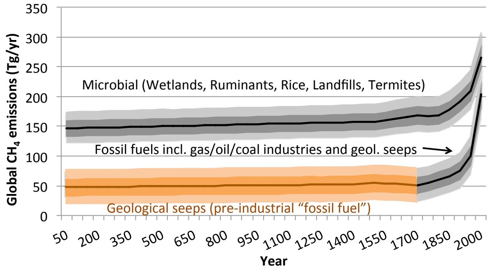  
SI	Figure	13:	Box-model	results	using	literature	ice	core	records	of $\mathsf { C H } _ { 4 }$ and ${ \pmb \delta } ^ { 1 3 } { \pmb C }$ (SI	Figure	12),	and prescribed	BB	emissions	(see	text).	The	light	and	dark	bands	represent	the $1 0 ^ { \mathrm { t h } } / 9 0 ^ { \mathrm { t h } }$ and $2 5 ^ { \mathrm { t h } } / 7 5 ^ { \mathrm { t h } }$ percentiles,	respectively.	Orange	marks	the $\mathtt { F F _ { G e o } }$ portion	of $\mathsf { F F } _ { \mathsf { T o t } }$ .

Our $\mathrm { F F _ { G e o } }$ range is consistent with the bottom-up range of $4 5 { \mathrm { - } } 7 6 \mathrm { T g } \mathrm { C H } _ { 4 } / \mathrm { y r } ^ { 1 3 , 6 5 }$ , and the topdown radiocarbon-based range of $4 2 { - } 6 4 \mathrm { T g } \mathrm { C H } _ { 4 } / \mathrm { y r } ^ { 1 2 }$ . Our mean value is similar to the $4 4 \mathrm { T g }$ $\mathrm { C H _ { 4 } / y r }$ prescribed geological emissions in Sapart et al.24 because of an offsetting effect of differences in isotopic signatures (our $\delta ^ { l 3 } C _ { m i c }$ and $\delta ^ { I 3 } C _ { F F }$ are $2 \text{‰}$ and $6 \text{‰}$ lighter, respectively) and isotopic fractionation factor (our ε range of $- 5 . 5 \text{‰}$ to $- 7 . 1 \text{‰}$ compared to $- 5 . 4 \text{‰}$ ). Ferretti et al.67 use an $\varepsilon$ of $- 7 . 4 \text{‰}$ , i.e., our ε range roughly spans the values used in Sapart et al.24 and Ferretti et al.67, and the seepage estimate in the latter is only $1 2 \mathrm { T g } \mathrm { C H } _ { 4 } / \mathrm { y } \mathrm { t }$ because of relatively heavy $\delta ^ { l 3 } C _ { m i c }$ and $\delta ^ { I 3 } C _ { F F }$ values of $- 6 0 . 0 \text{‰}$ and $- 4 0 . 0 \text{‰}$ , respectively. We conclude that our distribution of geological $\mathrm { C H } _ { 4 }$ emissions is consistent with literature estimates over a range of parameter choices.

The previous inverse-based $\mathrm { C H } _ { 4 }$ microbial source mean estimate of $4 4 0 \mathrm { T g } \mathrm { C H } _ { 4 } / \mathrm { y t }$ (b) compared to the $1 6 0 \mathrm { T g } \mathrm { C H } _ { 4 } / \mathrm { y r }$ in the paleo-record (SI Figure 13) may be explained by increased Ag/Waste/LF emissions due to population growth. However, this $2 8 0 \mathrm { T g } \mathrm { C H } _ { 4 } / \mathrm { y r }$ modern–paleo difference is significantly larger than the $9 0 { \mathrm { - } } 1 4 0 \mathrm { T g } \mathrm { C H } _ { 4 } / \mathrm { y r }$ from modern total Ag/Waste/LF (our most likely scenarios S2 and S5; SI Figure 14). This study’s downward revision of the microbial source (and the resulting modern–paleo difference of only $1 8 0 \mathrm { T g } \mathrm { C H } _ { 4 } / \mathrm { y r } )$ provides a more consistent explanation assuming that natural microbial sources (mainly wetlands) have not doubled (b and SI Figure 5) between paleo and modern times.

# 7. Global TM5 simulations

The broad spatial distribution of some $\mathrm { C H } _ { 4 }$ source categories is relatively well known. For example, $\sim 9 2 \%$ of $\mathrm { F F _ { \mathrm { T o t } } C H _ { 4 } }$ is emitted in the Northern Hemisphere2 with smaller values for agriculture (including livestock and rice production), waste, landfills (Ag/Waste/LF) at $8 2 \% ^ { 2 }$ and natural wetlands at $5 4 \%$ . By simulating global atmospheric $\mathrm { C H } _ { 4 }$ mole fractions using emissions maps scaled by select $\mathrm { C H } _ { 4 }$ source attribution scenarios using the global atmospheric chemistry and transport model $\mathrm { T M } 5 ^ { 2 7 }$ and comparing the resulting $\mathrm { C H } _ { 4 }$ levels across latitudes with observations20 we included a spatial constraint in our analysis in addition to the mass balance.

# Data sources for generating $C H _ { 4 }$ source attribution scenarios and grid maps

SI Table 2 provides a summary of the data sources used in generating $\mathrm { C H } _ { 4 }$ source attribution scenarios including simulated total $\mathrm { C H } _ { 4 }$ emissions, spatial flux distribution, and seasonal cycles for each source category. The total emissions column describes the data sources that informed the magnitude of the grid map scaling as described in more detail below. Fluxes were input to TM5 at $1 ^ { \circ } \mathrm { ~ x ~ } 1 ^ { \circ }$ resolution, and existing grid maps with higher resolution were adjusted accordingly.

SI	Table	2:	Data	sources	for spatial	emission distributions	(grid	maps)	and	scaling	of	grid	maps	used	to generate	emission	attribution	scenarios	for	TM5	simulations.   

<table><tr><td rowspan=1 colspan=1></td><td rowspan=1 colspan=1>Total emissions</td><td rowspan=1 colspan=1>Spatial distribution</td><td rowspan=1 colspan=1>Seasonal cycle</td></tr><tr><td rowspan=1 colspan=1>Fossil Fuels (FFTot)</td><td rowspan=1 colspan=1>Box model (BM)</td><td rowspan=1 colspan=1>EDGAR4.2²</td><td rowspan=1 colspan=1>n/a</td></tr><tr><td rowspan=1 colspan=1>Natural (wetlands,termites,wild animals, soil sink,</td><td rowspan=1 colspan=1>Bergamaschi (2007)7² (scenarios1,4, 6); other scenarios see text</td><td rowspan=1 colspan=1>Fung (1987)7 andKaplan (2002)71；a</td><td rowspan=1 colspan=1>Bergamaschi(2007)72, b</td></tr><tr><td rowspan=1 colspan=1>Biomass burning</td><td rowspan=1 colspan=1>Schultz (2008)73 (1980-1996),Giglio (2006) and Van DerWerf (2006)74 (1997-2012)</td><td rowspan=1 colspan=2>Schultz (2008)7³ (1980-1996),GFED (2013)75 (1997-2012)</td></tr><tr><td rowspan=1 colspan=1>Agriculture/waste/landfill(incl. agric. waste burning)</td><td rowspan=1 colspan=1>BM global budget minus sum ofall other sources; global trendattributed fully to Ag/Waste/LG</td><td rowspan=1 colspan=1>EDGAR4.2²</td><td rowspan=1 colspan=1>Mathews (1991)76; </td></tr></table>

Notes: a Natural source grid maps in scenarios S1, S4, and S6 (see SI Figure 14) are unmodified, but the wetlands fractions were scaled up between $0 \%$ and $2 5 ^ { \circ } \mathrm { S }$ in scenarios S2/S5/S8 $( 5 1 ~ \mathrm { T g }$ $\mathrm { C H _ { 4 } / y r }$ each) and in scenarios S3/S9 (102 Tg $\mathrm { C H } _ { 4 } /$ yr each). b Seasonal cycle included for wetlands. c Seasonal cycle included for rice cultivation.

# Description of simulated $C H _ { 4 }$ source attribution scenarios

The simulated emission scenarios are summarized in SI Figure 14. Total $\mathrm { C H } _ { 4 }$ emissions from all sources (excluding soil sink) equal the total $\mathrm { C H } _ { 4 }$ emissions from the box model to allow direct comparison of TM5 results and the box model. The scenarios assume the mean box model $\mathrm { C H } _ { 4 }$ lifetime of 9.0 years, and the TM5 OH field was scaled (uniformly across space) such that global chemical destruction is approximately equivalent to the box model $\mathrm { C H } _ { 4 }$ lifetime. We simulated three FF scenarios that encompass approximately the $1 0 ^ { \mathrm { t h } } / 9 0 ^ { \mathrm { t h } }$ percentile range in the box model (150, 200, and $2 5 0 \mathrm { T g } \mathrm { C H } _ { 4 } / \mathrm { y r } )$ ). This range includes $\mathrm { F F _ { I n d } }$ and $\mathrm { F F _ { G e o } }$ , and measurements65 suggest that both sources are generally co-located. The same BB grid maps and absolute $\mathrm { C H } _ { 4 }$ emissions were used in each scenario. Scenarios S1, S4, S6, and S7 include $1 7 5 \mathrm { T g } \mathrm { C H } _ { 4 } / \mathrm { y r }$ natural emissions from Bergamaschi et al. $( 2 0 0 7 ) ^ { 7 2 }$ (consistent with the mean of several other top-down studies3,6,7). The simulated natural emissions also include a residual IAV component after accounting for IAV from BB and global total $\mathrm { C H } _ { 4 }$ emissions based on the assumption that anthropogenic source IAV is very small compared to natural source IAV. We attributed the remainder of the global $\mathrm { C H } _ { 4 }$ budget including its $2 5 \mathrm { T g }$ growth over time to the Ag/Waste/LF source. The box model $\mathrm { C H } _ { 4 }$ growth allocation is more complex as described above $( \sim 4 5 \mathrm { T g }$ increase from either natural or Ag/Waste/LF, and a FF decrease of ${ \sim } 2 0 \mathrm { T g }$ , all after 2004).

However, these details were disregarded for simplicity and because such small budget terms are likely to have only a minor affect on the simulated $_ { \mathrm { N - S } }$ gradient, which is the focus of the TM5 modeling. Scenarios S2, S3, S5, S8, and S9 explore the hypothesis of underestimated tropical wetland emissions by up-scaling this source between the equator and $2 5 ^ { \circ } \mathrm { S }$ by 51 or $1 0 2 \mathrm { T g }$ $\mathrm { C H _ { 4 } / y r }$ , and down-scaling the Ag/Waste/LF grid maps uniformly by 50 or $1 0 0 \mathrm { T g } \mathrm { C H } _ { 4 } / \mathrm { y r }$ . We introduced the 1 and 2 $\mathrm { T g } \mathrm { C H } _ { 4 } / \mathrm { y r }$ differences between up-scaling natural emissions and downscaling Ag/Waste/LF emissions to partly account for the larger OH sink in the tropics and rapid vertical distribution of emissions relative to mid-latitudes (see description below).

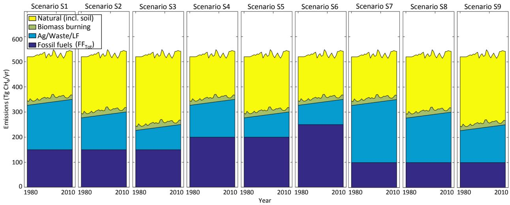  
SI	Figure	14:	Total $\mathsf { C H } _ { 4 }$ emissions	of	individual	source	categories	in	each	scenario	simulated	using	the TM5	model.	The	data	sources	underlying	each	scenario	are described	in SI	Table	2.	Note	that	the	total $\mathsf { C H } _ { 4 }$ emissions	from	all	sources	(excluding	soil	sink)	equal	the	total $\mathsf { C H } _ { 4 }$ emissions	from	the	box	model based	on	annual	mean,	globally	averaged $\mathsf { C H } _ { 4 }$ levels	and	mean $\mathsf { C H } _ { 4 }$ lifetime	(SI	Figure	2).

Simulated and observed latitudinal $C H _ { 4 }$ gradients

The simulated and observed $_ { \mathrm { N - S } }$ gradients are illustrated in SI Figure 15a-c for 2010 (see other years in SI Figure 16), and all scenarios are consistent with the $\delta ^ { 1 3 } \mathrm { C }$ mass balance (including $\mathrm { F F } _ { \mathrm { T o t } }$ ranging from $1 5 0 { - } 2 5 0 \ \mathrm { T g / y r } )$ . Scenario S6 $\mathrm { ( 2 5 0 \ T g C H _ { 4 } / y r F F _ { \mathrm { T o t } } ) }$ results in the largest gradient overestimation relative to observations $\sim 4 0 \mathrm { p p b }$ ; SI Figure 15b) indicating inconsistency between the $\delta ^ { 1 3 } \mathrm { C }$ mass balance $9 0 ^ { \mathrm { t h } }$ percentile and the observed N–S gradient. Scenario S3 explores low $\mathrm { F F } _ { \mathrm { T o t } }$ emissions $\mathrm { 1 5 0 T g C H _ { 4 } / y r }$ , i.e. $\delta ^ { 1 3 } \mathrm { C }$ mass balance $1 0 ^ { \mathrm { t h } }$ percentile) combined with substituting $1 0 0 \mathrm { T g } \mathrm { C H } _ { 4 } / \mathrm { y r }$ from Ag/Waste/LF for tropical natural emissions, which leads to the largest $_ { \mathrm { N - S } }$ gradient underestimation $( \sim 3 5 \ \mathrm { p p b } )$ . The $_ { \mathrm { N - S } }$ gradient

discrepancy is reduced more effectively by a combination of substituting Ag/Waste/LF with tropical natural emissions and reducing the $\mathrm { F F } _ { \mathrm { T o t } }$ component ( $S 6 { \partial } S 5 $ ) than by reducing $\mathrm { F F } _ { \mathrm { T o t } }$ alone $\mathbf { \Delta } ^ { \mathrm { S 6 } \Rightarrow \mathrm { S 1 } }$ ). Previous 3D inversions also found that overestimated a priori high latitude sources needed to be compensated by increases at lower latitudes4,77, particularly tropical wetlands4 . Overall, scenarios S2 and S5 (150 and $2 0 0 \mathrm { T g } \mathrm { C H } _ { 4 } / \mathrm { y r } \mathrm { F F } _ { \mathrm { T o t } }$ , respectively) are (i) the spatially most consistent with observations, and (ii) consistent with the $\delta ^ { 1 3 } \mathrm { C }$ mass balance.

Scenarios S7–S9 include only $1 0 0 \mathrm { T g } \mathrm { C H } _ { 4 } / \mathrm { y r } \mathrm { F F } _ { \mathrm { T o t } }$ , which is representative of the literature3–8 , yet inconsistent with the $\delta ^ { 1 3 } \mathrm { C }$ mass balance. We find that S7–S9 are also inconsistent with the observed N–S gradient (especially in comparison with S2 and S5, considering that all scenarios are subject to the same model uncertainties including simulated transport and spatially modeled OH field). Scenarios S7–S9 do not match observations as well as S2 and S5 in the Southern and/or Northern Hemispheres. Note that we used the recently updated version of the TM5 global chemical transport model, which has improved vertical mixing relative to the parent model78.

The atmospheric $\mathrm { C H } _ { 4 }$ levels of some scenarios are lower than observations in both hemispheres (SI Figure 15b) due to a model artifact, which has only a minor effect on the N–S gradient interpretation (see detailed description below). Also, the consistent overestimation of $\mathrm { C H } _ { 4 }$ levels between $6 { - } 1 7 ^ { \circ } \mathrm { N }$ (0.1–0.3 sine(latitude) in SI Figure 15b) may be reduced by improving the emission grid spatial/source allocation within the tropics, but this is beyond the scope of this analysis. For instance, Saunois et al. $\left( 2 0 1 6 \right) ^ { 7 9 }$ highlight that wetland extent dominates the uncertainty of modeled $\mathrm { C H } _ { 4 }$ emissions from wetlands (the largest single source in the tropics).

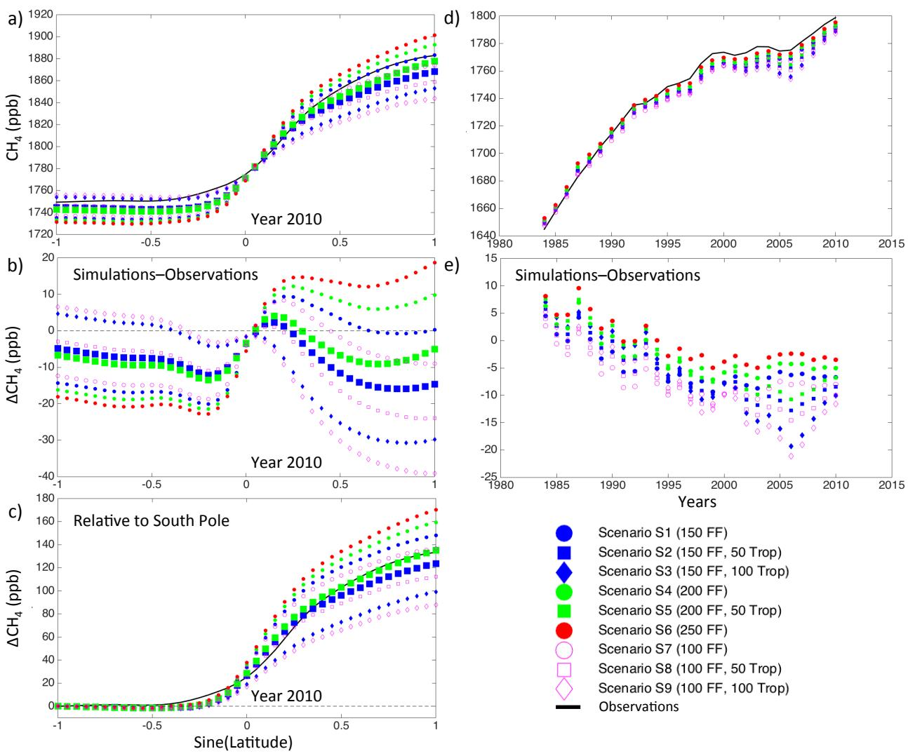  
SI	Figure	15:	TM5	forward	simulation results	for	nine emission scenarios	and	NOAA	measurements 20. (a)	Annual	mean $\mathsf { C H } _ { 4 }$ dry	air	mole	fractions	across	41	latitudinal	bands	in	2010 (see	SI	Figure	16 for additional	years). (b)	Simulations	minus	observations. (c)	Simulations	and	measurements	relative	to South	Pole	(sine(latitude) ${ \bf \mu } = - { \bf 1 } { \bf \Lambda }$ ).	(d)	Annual	mean,	globally	averaged $\mathsf { C H } _ { 4 }$ dry	air	mole	fractions;	see	SI section	2	for	Marine	Boundary	Layer	sites	and	references45,46 for	estimating	global	averages	from spatial	distributions.

Global total $C H _ { 4 }$ level differences between observations and simulations (model artifact)

The simulated and observed annual mean, globally averaged $\mathrm { C H } _ { 4 }$ levels for all years are shown in SI Figure 15 (panels d, e). The simulated $\mathrm { C H } _ { 4 }$ of all scenarios generally follows the observed trend as expected because simulated annual total $\mathrm { C H } _ { 4 }$ emissions were scaled according to observed global means using the box-model (SI section 1). Note that scenario-dependent amounts of $\mathrm { C H } _ { 4 }$ (spatially varying emissions among scenarios) are consumed in the 3D model

because (i) the OH sink is larger in the tropics than in lower latitudes (more water vapor, higher temperatures, and more solar radiation), and (ii) emissions are distributed through a deeper atmospheric column. However, the empirical tuning of the total OH sink in TM5 was applied only once for all scenarios. In contrast, the box-model considers a global average $\mathrm { C H } _ { 4 }$ sink. Thus, some simulation–observation mismatches are expected because relatively high tropical emissions in some scenarios, e.g. S3 vs. S1, lead to greater total $\mathrm { C H } _ { 4 }$ destruction, thus lower global average $\mathrm { C H } _ { 4 }$ levels. The particular simulation–observation mismatches in SI Figure 15 (panels d, e) are explained as follows. (i) The constant simulated emissions during 1980-1983 (for model initialization; SI Figure 14) are likely too high in absence of observations, which results in overestimated $\mathrm { C H } _ { 4 }$ levels. (ii) This surplus $\mathrm { C H } _ { 4 }$ decreases over time as “true” emissions increase to the simulated values, and the surplus has decayed by the early-1990s (approximately one $\mathrm { C H } _ { 4 }$ lifetime after 1983). (iii) Simulations and observations are roughly in balance starting in 1994 for scenarios without added tropical emissions (S1/4/6/7). (iv) In 2000/2001 and 2004/2005 total global emissions drop by ${ \sim } 2 0 \mathrm { T g / y r }$ , but scenarios S2/3/5/8/9 include a fixed shift of emissions (50 or $1 0 0 \mathrm { T g / y r }$ ) from Northern mid-latitudes to the tropics (where $\mathrm { C H } _ { 4 }$ destruction is greater). This increases global total $\mathrm { C H } _ { 4 }$ destruction relative to S1/4/6/7 and observations, which leads to lower global $\mathrm { C H } _ { 4 }$ levels relative to S1/4/6/7 and observations until the pre-2001 simulations–observations difference is achieved again. Note, however, that while this model artifact influences simulated global average $\mathrm { C H } _ { 4 }$ levels, it has little bearing on the simulated N–S gradients given the relatively fast inter-hemispheric atmospheric mixing of ${ \sim } 1$ year.

# Simulated and observed latitudinal $C H _ { 4 }$ gradients (additional years)

SI Figure 16 shows the N–S gradient (simulations minus observations for 5-year intervals between 1985 and 2010 for comparison with SI Figure 15b. The general patterns and differences among the scenarios are qualitatively similar, and do not alter the conclusions drawn based only on 2010 in the main article. Note that 1985 represents $\mathrm { C H } _ { 4 }$ levels only 5 years after the initialization and start of the simulation, thus relatively large differences compared to later years are expected.

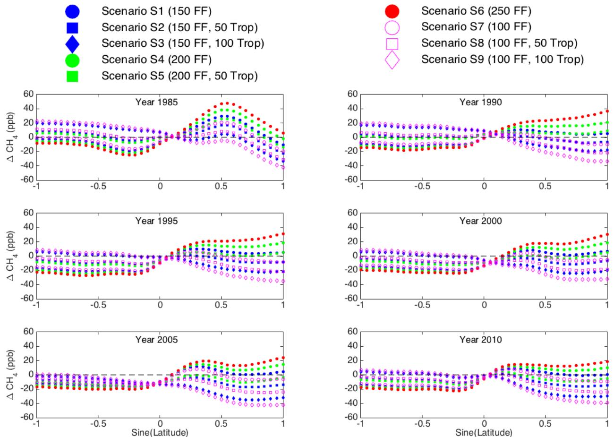  
SI	Figure	16:	Differences	between	annual	mean	simulated $\mathsf { C H } _ { 4 }$ mixing	ratios	across	41	latitudinal	bands between	1985	and	2010 and NOAA’s	measurements.

# 8. Sensitivity analysis and additional information

The sensitivity analysis identifies the uncertain parameters with the largest influence on total FF $\mathrm { C H } _ { 4 }$ emissions $\boldsymbol { Q } _ { F F , T o t , t }$ and FER, which is summarized in SI Figure 17 for 2013 (other years are qualitatively the same, but not displayed). The “tornado” diagram shows the changes in $\boldsymbol { Q } _ { F F , T o t , t }$ (panel a) and FER (panel b) after varying one input parameter at a time within their respective $1 0 ^ { \mathrm { t h } } / 9 0 ^ { \mathrm { t h } }$ percentiles from SI Table 1. For instance, varying these input parameters one at a time changes global $\mathrm { F F } _ { \mathrm { T o t } }$ up to $^ { \pm 2 5 } \mathrm { T g / y r }$ and FER up to $\pm 1 . 0$ percentage point. It shows that $\boldsymbol { Q } _ { F F , T o t , t }$ and FER are most sensitive to BB $\mathrm { C H } _ { 4 }$ emissions $Q _ { B B }$ and the isotopic fractionation factor $\varepsilon$ , whose model input distributions are relatively wide. Keeping all other parameters at their mean values, $\boldsymbol { Q } _ { F F , T o t , t }$ and FER could range from $1 6 6 { - } 2 1 5 \mathrm { T g C H _ { 4 } / y r }$ and $1 . 2 { - } 3 . 3 \%$ for $Q _ { B B }$ of 31– $5 5 \mathrm { T g } \mathrm { C H } _ { 4 } / \mathrm { y r }$ , respectively. The isotopic signature of the microbial source $\delta ^ { l 3 } C _ { M i c }$ is the third most sensitive parameter despite its relatively narrow distribution range of approximately $\pm 1 \text{‰}$ , illustrating the importance of empirical $\delta ^ { l 3 } C _ { m i c }$ data. Panels c) and d) illustrate the sensitivities of potential trends of individual parameters during 1985–2013 on the trends of $\boldsymbol { Q } _ { F F , T o t , t }$ and FER. The $Q _ { B B }$ trends investigate a hypothetical gradual trend of $20 \%$ of model mean $\mathcal { Q } _ { B B } \left( 8 \mathrm { T g C H } _ { 4 } \right.$ ， which is also the 1 SD inter-annual variability74 of $Q _ { B B } )$ ). Note that observed global fire emissions74 do not indicate a trend, but this may not fully account for $\mathrm { C H } _ { 4 }$ emissions from fuel biomass burning. The $Q _ { B B }$ trends are illustrated for scenarios in which the entire $Q _ { B B }$ trend is allocated to either $\mathrm { C } _ { 4 }$ or $\mathrm { C } _ { 3 }$ plants. If the $Q _ { B B }$ had increased from $3 9 \mathrm { T g } \mathrm { C H } _ { 4 } / \mathrm { y r }$ in 1985 to $4 7 \mathrm { T g }$ $\mathrm { C H _ { 4 } / y r }$ in 2013, the mass balance would require global total FF $\mathrm { C H } _ { 4 }$ emission reductions of $1 5 -$ $2 2 \mathrm { T g } \mathrm { C H } _ { 4 } / \mathrm { y } 1$ r during this period. The $\delta ^ { l 3 } C _ { m i c }$ trend sensitivities assume the $3 0 \mathrm { T g } \mathrm { C H } _ { 4 }$ trend from Figure 2a allocated to either wetlands or Ag/Waste/LF.

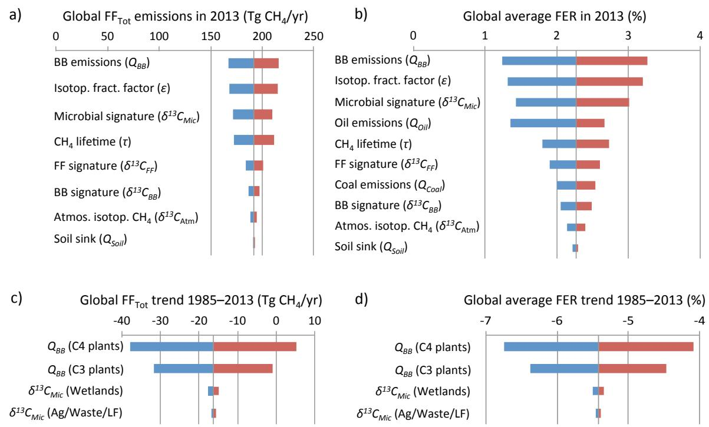  
SI	Figure	17:	Tornado	diagram	illustrating	the	sensitivity	of	total	FF $\mathsf { C H } _ { 4 }$ emissions	(a)	and	global average	FER	(b)	to	individual	parameters	in	2013, and	the	sensitivities	of	the	trend	of	FF $\mathsf { C H } _ { 4 }$ emissions (c)	and	global	average	FER	(d)	to	individual	parameters	during	1985–2013.	The	ordinates	in	a)	and	b) are	centered	at	model	mean	values	and	the	red	and	blue	bars	show	the	values	of	the	dependent variables	after	changing	one	parameter	at	a	time	to	its $\pmb { 1 0 } ^ { \mathtt { t h } }$ and ${ 9 0 } ^ { \mathsf { t h } }$ percentile	value	(see	SI	Table	1), respectively. The	variable $\pmb { \delta } ^ { 1 3 } \pmb { C } _ { A t m }$ pertains	to	the $0 . 1 \text{‰}$ uncertainty	in	the	global	average	atmospheric isotopic	value	(SI	section	2). The	trend	sensitivities	are	centered	around	the	mean	trends shown	in Figures	2a	and	3	(main	article),	which	account	for	the $\delta ^ { 1 3 } C _ { F F }$ trend	in	SI	Figure	11.	There	is	no	total	FF $\mathsf { C H } _ { 4 }$ emissions	trend	when	assuming	temporally	constant $\delta ^ { 1 3 } C _ { F F }$ (see	blue	lines	in	Figure	2a).	There	is	a $- 6 . 4 \%$ FER	trend	when	assuming	temporally	constant $\delta ^ { 1 3 } C _ { F F }$ (not	shown;	see	blue	lines	in Figure	3).	The BB	emission	trend	sensitivities	assume	a	gradual $20 \%$ BB	emission	trend	(see	text)	allocated	to	either $\pmb { \complement _ { 4 } }$ or $\pmb { C _ { 3 } }$ plants.	The $\delta ^ { 1 3 } C _ { M i c }$ trend	sensitivities	assume	the ${ \bf 3 0 T g C H _ { 4 } }$ trend	from	Figure	2a allocated	to either	wetlands	or	Ag/Waste/LF.

The original box-model results including IAV are shown in SI Figure 18. The IAV is partly an artifact of multiple components that our model does not control including $\mathrm { C H } _ { 4 }$ sink IAV and the $\delta ^ { 1 3 } \mathrm { C } _ { \mathrm { B B } }$ IAV depending on the dominating BB type $\mathrm { ( C _ { 3 } \ v s . C _ { 4 } ) }$ in a given year. For example, a temporal sink increase in areas of predominantly microbial sources (e.g. Tropics) could increase the global average $\delta ^ { 1 3 } \mathrm { C _ { A t m } }$ to suggest – via mass balance – an increase in isotopically heavier sources such as FF. Considering the average global mean OH sink variability of ${ \sim } 2 \%$ or ${ \sim } 1 0 \mathrm { T g }$ $\mathrm { C H } _ { 4 } / \mathrm { y r } ( \mathrm { r e f } ^ { 3 7 } )$ , $\mathrm { C H } _ { 4 }$ sink IAV can explain a significant fraction of the source allocation IAV and FER IAV as a model artifact in SI Figure 18.

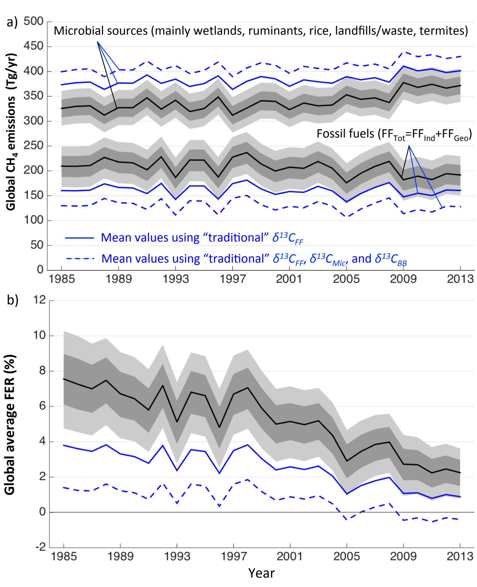  
SI	Figure	18:	Unfitted	long-term	trends	in	global	microbial	and	total $\mathsf { F F } _ { \mathsf { T o t } }$ $\mathsf { C H } _ { 4 }$ emissions	(a)	and	global average	FER	(b)	as	shown	in	Figures	2a	and	3	(main	article),	but	including	IAV.	The	magnitude	of	IAV	is partly	an	artifact	of	multiple	components	not	accounted	for	in	this	model	(see	text).

To achieve more accurate FER estimates, and to further reduce FER uncertainty, future work may further investigate these parameters. Parameters $Q _ { F F , T o t , t }$ and FER are less sensitive to $\delta ^ { I 3 } C _ { F F }$ relative to $\delta ^ { l 3 } C _ { m i c }$ , partly due to a narrower input distribution range.

The review of $\delta ^ { l 3 } C _ { s o u r c e }$ used in the top-down literature and summarized in FF is based on the following list of references (not included in the main text due to reference count limits): Stevens et al. (1988)80, Craig et al. (1988)81, Whiticar et al. (1990)17, Whiticar et al. (1993)82, Levin et al. (1994)83, Gupta et al. (1996)84, Tyler et al. (1999)85, Quay et al. (1999)10, Houweling et al. (2000)86, Mikaloff et al. (2004)4 , Bousquet et al. (2006)3 , Lassey et al. (2007)87, Neef et al. (2010)88, Dlugokencky et al. (2011)89, and Monteil et al. (2011)90. SI Figure 19 shows the literature mean budget term values as a close-up from Figure 2b (main article).

Bousquet et	al.	(2006) Fraser	et	al.	(2013) Wang	et	al.	(2004)

Bergamaschi et	al.	(2009) Chen	et	al.	(2006) Mikaloff et	al.	(2004)

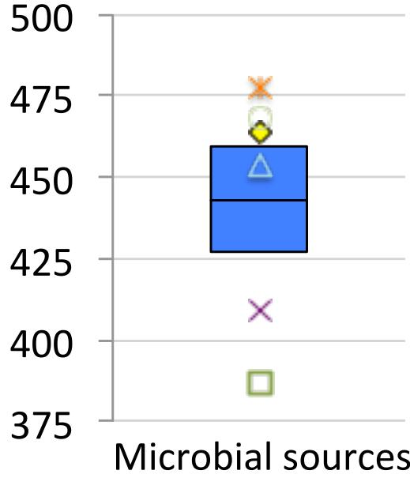

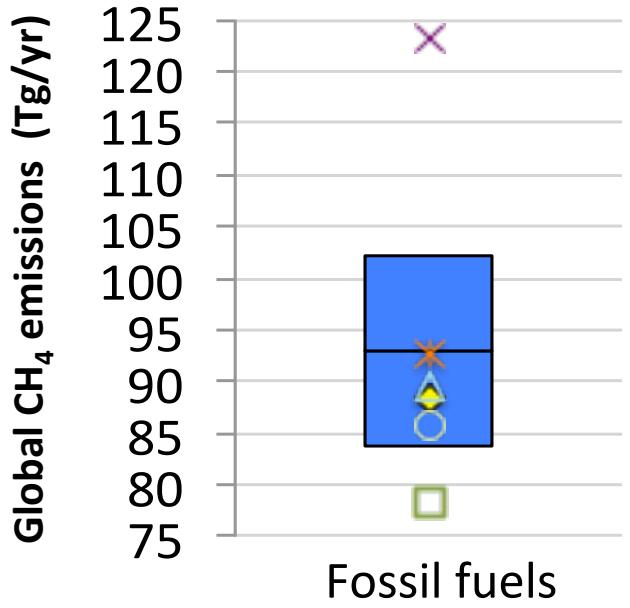  
SI	Figure	19:	Close-up	of	literature	columns	in	FFb	(main	article). Note	that	the	literature3–8 budget terms	were	scaled	to	match	the	mean	total $\mathsf { C H } _ { 4 }$ budget	in	this	study. Literature	1	SD	uncertainties	are 9	Tg	CH4/yr	on	average.

# References

31. Fung, I., Prather, M., John, J., Lerner, J. & Matthews, E. Three-dimensional model synthesis of the global methane cycle. J. Geophys. Res. 96, 13033–13065 (1991).   
32. Prather, M. J., Holmes, C. D. & Hsu, J. Reactive greenhouse gas scenarios: Systematic exploration of uncertainties and the role of atmospheric chemistry. Geophys. Res. Lett. 39, (2012).   
33. Voulgarakis, A. et al. Analysis of present day and future OH and methane lifetime in the ACCMIP simulations. Atmos. Chem. Phys. 13, 2563–2587 (2013).   
34. Prinn, R. G., Huang, J., Weiss, R. F. & Cunnold, D. M. Evidence for variability of atmospheric hydroxyl radicals over the past quarter century. Geophys. Res. Lett. 32, 2–5 (2005).   
35. Naik, V. et al. Preindustrial to present-day changes in tropospheric hydroxyl radical and methane lifetime from the Atmospheric Chemistry and Climate Model Intercomparison Project (ACCMIP). Atmos. Chem. Phys. 13, 5277–5298 (2013).   
36. Montzka, S. A. et al. New Observational Constraints for Atmospheric Hydroxyl on Global and Hemispheric Scales. Science (80-. ). 288, 500–503 (2000).   
37. Montzka, S. A. et al. Small interannual variability of global atmospheric hydroxyl. Science 331, 67–69 (2011).   
38. Hartmann, D. L. et al. in Climate Change 2013: The Physical Science Basis. Contribution of Working Group I to the Fifth Assessment Report of the Intergovernmental Panel on Climate Change (eds. Stocker, T. F. et al.) AR5, (Cambridge University Press, 2014).   
39. Lassey, K. R., Lowe, D. C. & Manning, M. R. The Trend in Atmospheric Methane Delta C-13 Implications for Isotopic Constraints on the Global Methane Budget. Global Biogeochem. Cycles 14, 41–49 (2000).   
40. Miller, J. B. in Stable isotopes and biosphere-atmosphere interactions (eds. Flanagan, L. B., Ehleringer, J. R. & Pataki, D. E.) 288–310 (Elsevier, 2005).   
41. Tans, P. P., Berry, J. A. & Keeling, R. F. Oceanic $1 3 \mathrm { ~ C ~ } / \mathrm { ~ 1 2 ~ C ~ }$ observations: A new window on ocean CO 2 uptake. Global Biogeochem. Cycles 7, 353–368 (1993).   
42. Gröning, M. in Handbook of Stable Isotope Analytical Techniques (ed. de Groot, P. A.) 874–906 (2004).   
43. NOAA Global Monitoring Division. Current trends in CH4. (2016). Available at: http://www.esrl.noaa.gov/gmd/ccgg/trends_ch4/.   
44. NOAA Global Monitoring Division. NOAA Greenhouse Gas Marine Boundary Layer Reference. (2016). Available at: http://www.esrl.noaa.gov/gmd/ccgg/mbl/mbl.html.   
45. Masarie, K. A. & Tans, P. P. Extension and integration of atmospheric carbon dioxide data into a globally consistent measurement record. Journal of Geophysical Research 100, 11593 (1995).   
46. Dlugokencky, E. J., Steele, L. P., Lang, P. M. & Masarie, K. A. Atmospheric methane at Mauna Loa and Barrow observatories: Presentation and analysis of in situ measurements. Journal of Geophysical Research 100, 23103 (1995).   
47. Miller, J. B. et al. Development of analytical methods and measurements of 13C/12C in atmospheric CH4 from the NOAA Climate Monitoring and Diagnostics Laboratory Global Air Sampling Network. J. Geophys. Res. Atmos. 107, ACH 11–1–ACH 11–15 (2002).   
48. Levin, I. et al. No inter-hemispheric δ13CH4 trend observed. Nature 486, E3–E4 (2012).   
49. Englund Michel, S. Personal communication. (2016).   
50. Food and Agriculture Organization of the United States. Live Animal Stocks Statistics. http://faostat3.fao.org/browse/Q/QA/E. (2015).   
51. USDA Economic Research Service. Feed Grains: Yearbook Tables. http://www.ers.usda.gov/data-products/feed-grains-database/feed-grains-yearbooktables.aspx#26941. (2015).   
52. Vasconcelos, J. T. & Galyean, M. L. Nutritional recommendations of feedlot consulting nutritionists: The 2007 Texas Tech University survey. J. Anim. Sci. 85, 2772–2781 (2007).   
53. U.S. Department of Agriculture (USDA) / Animal and Plant Health Inspection Service (APHIS). Beef Cow/Calf Health and Productivity Audit. PART II: Beef Cow/Calf Reproductive & Nutritional Management Practices. (1994).   
54. U.S. Department of Agriculture (USDA) / Animal and Plant Health Inspection Service (APHIS). Beef Cow/Calf Health and Productivity Audit. Forage Analyses from Cow/Calf Herds in 18 States. (1996).   
55. Johnson, K. & Cole, N. A. Personal communication. (2015).   
56. Still, C. J., Berry, J. A., Collatz, G. J. & DeFries, R. S. Global distribution of C3 and C4 vegetation: Carbon cycle implications. Global Biogeochem. Cycles 17, 1006 (2003).   
57. IPCC. Climate Change 2001: The Physical Science Basis. Contribution of Working Group I to the Third Assessment Report of the Intergovernmental Panel on Climate Change. Chapter 6. (2001).   
58. Wuebbles, D. J. & Hayhoe, K. Atmospheric methane and global change. Earth-Science Rev. 57, 177–210 (2002).   
59. Giglio, L., Van Der Werf, G. R., Randerson, J. T., Collatz, G. J. & Kasibhatla, P. Global

estimation of burned area using MODIS active fire observations. Atmos. Chem. Phys. 6, 957–974 (2006).

60. Cerling, T. E. et al. Global vegetation change through the Miocene/Pliocene boundary. Nature 389, 153–158 (1997).

61. Brandt, A. R. et al. Methane Leaks from North American Natural Gas Systems. Sci. 343 , 733–735 (2014).

62. Golding, S. D., Boreham, C. J. & Esterle, J. S. Stable isotope geochemistry of coal bed and shale gas and related production waters: A review. Int. J. Coal Geol. 120, 24–40 (2013).

63. Etiope, G. & Klusman, R. W. Geologic emissions of methane to the atmosphere. Chemosphere 49, 777–789 (2002).

64. Etiope, G. Natural gas seepage: The Earth’s hydrocarbon degassing. (Springer International Publishing, 2015).

65. Etiope, G. & Ciccioli, P. Earth’s degassing: a missing ethane and propane source. Science (80-. ). 323, 478 (2009).

66. Ntziachristos, L. et al. EMEP/EEA air pollutant emission inventory guidebook 2013. EEA publication (2014). doi:10.2800/92722

67. Ferretti, D. F. et al. Unexpected changes to the global methane budget over the past 2000 years. Science 309, 1714–1717 (2005).

68. Etiope, G., Feyzullayev, A. & Baciu, C. L. Terrestrial methane seeps and mud volcanoes: A global perspective of gas origin. Mar. Pet. Geol. 26, 333–344 (2009).

69. Schoell, M. & Etiope, G. Formation and migration of natural gases: Gas composition and isotopes as monitors between source, reservoir and seep. American Geophysical Union Fall Meeting, Session H108: Tracers in Energy-related Multi-phase and Reactive Flows: Observations and Modeling, San Francisco (2015).

70. Fung, I., Matthews, E. & Lerner, J. Atmospheric Methane Response to Biogenic Sources - Results from a 3-D Atmospheric Tracer Model. Abstr. Pap. Am. Chem. Soc. 193, 6– GEOC (1987).

71. Kaplan, J. O. Wetlands at the Last Glacial Maximum: Distribution and methane emissions. Geophys. Res. Lett. 29, 3–6 (2002).

72. Bergamaschi, P. et al. Satellite chartography of atmospheric methane from SCIAMACHY on board ENVISAT: 2. Evaluation based on inverse model simulations. J. Geophys. Res. 112, 1–26 (2007).

73. Schultz, M. G. et al. Global wildland fire emissions from 1960 to 2000. Global

Biogeochem. Cycles 22, 1–17 (2008).

74. Van Der Werf, G. R. et al. Interannual variability of global biomass burning emissions from 1997 to 2004. Atmos. Chem. Phys. Discuss. 6, 3175–3226 (2006).

75. GFED. Global Fire Emissions Database. (2013).

76. Matthews, E., Fung, I. & Lerner, J. Methane emission from rice cultivation: Geographic and seasonal distribution of cultivated areas and emissions. Global Biogeochem. Cycles 5, 3 (1991).

77. Houweling, S., Kaminski, T., Dentener, F., Lelieveld, J. & Heimann, M. Inverse modeling of methane sources and sinks using the adjoint of a global transport model. J. Geophys. Res. 104, 26137–26160 (1999).

78. NOAA ESRL Global Monitoring Division. CarbonTracker Documentation – Convective flux fix. (2015). Available at: http://www.esrl.noaa.gov/gmd/ccgg/carbontracker/CT2013B_doc.php#tth_sEc7.2.

79. Saunois, M. et al. The Global Methane Budget: 2000–2012. Earth Syst. Sci. Data Discuss. 1–79 (2016). doi:10.5194/essd-2016-25

80. Stevens, C. M. & Engelkemeir, A. Stable carbon isotopic composition of methane from some natural and anthropogenic sources. J. Geophys. Res. 93, 725 (1988).

81. Craig, H., Chou, C. C., Welhan, J. A., Stevens, C. M. & Engelkemeir, A. The isotopic composition of methane in polar ice cores. Science (80-. ). 242, 1535–1539 (1988).

82. Whiticar, M. in Atmospheric Methane: Sources, Sinks, and Role in Global Change SE - 8 (ed. Khalil, M. A. K.) 13, 138–167 (Springer Berlin Heidelberg, 1993).

83. Levin, I. in Carbon Cycling in the Glacial Ocean: Constraints on the Ocean’s Role in Global Change SE - 1 (eds. Zahn, R., Pedersen, T., Kaminski, M. & Labeyrie, L.) 17, 3– 13 (Springer Berlin Heidelberg, 1994).

84. Gupta, M., Tyler, S. & Cicerone, R. Modeling atmospheric δ13CH4 and the causes of recent changes in atmospheric CH4 amounts. J. Geophys. Res. 101, 22923–22 (1996).

85. Tyler, S. C. et al. Stable carbon isotopic composition of atmospheric methane: A comparison of surface level and free tropospheric air. J. Geophys. Res. 104, 13895 (1999).

86. Houweling, S., Dentener, F. & Lelieveld, J. Simulation of preindustrial atmospheric methane to constrain the global source strength of natural wetlands. J. Geophys. Res. 105, 17243 (2000).

87. Lassey, K. R., Etheridge, D. M., Lowe, D. C., Smith, a. M. & Ferretti, D. F. Centennial evolution of the atmospheric methane budget: what do the carbon isotopes tell us? Atmos. Chem. Phys. Discuss. 6, 4995–5038 (2007).

88. Neef, L., Van Weele, M. & Van Velthoven, P. Optimal estimation of the present-day global methane budget. Global Biogeochem. Cycles 24, 1–10 (2010).   
89. Dlugokencky, E. J., Nisbet, E. G., Fisher, R. & Lowry, D. Global atmospheric methane: budget, changes and dangers. Philos. Trans. R. Soc. - Ser. A Math. Phys. Eng. Sci. 369, 2058–2072 (2011).   
90. Monteil, G. et al. Interpreting methane variations in the past two decades using measurements of CH4 mixing ratio and isotopic composition. Atmos. Chem. Phys. 11, 9141–9153 (2011).