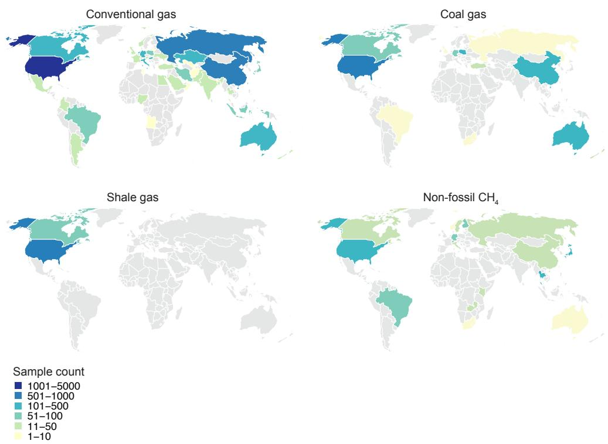
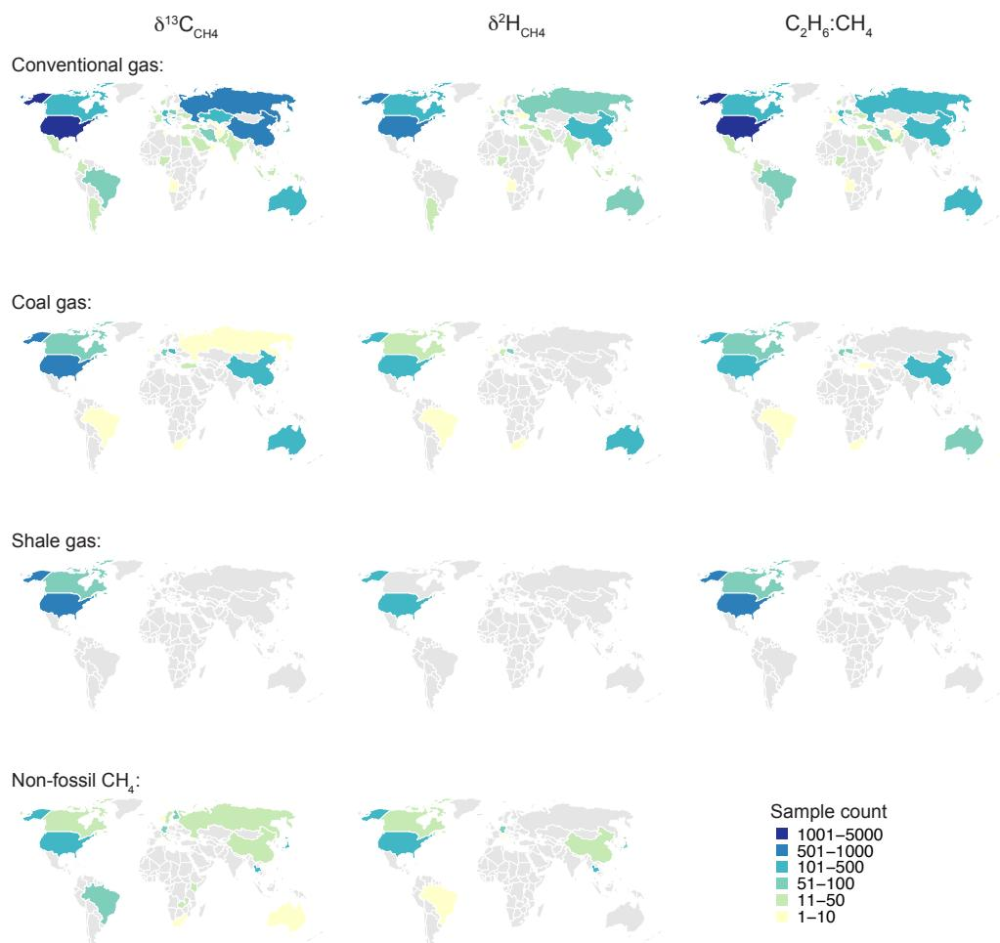
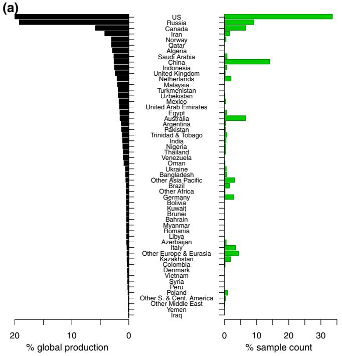
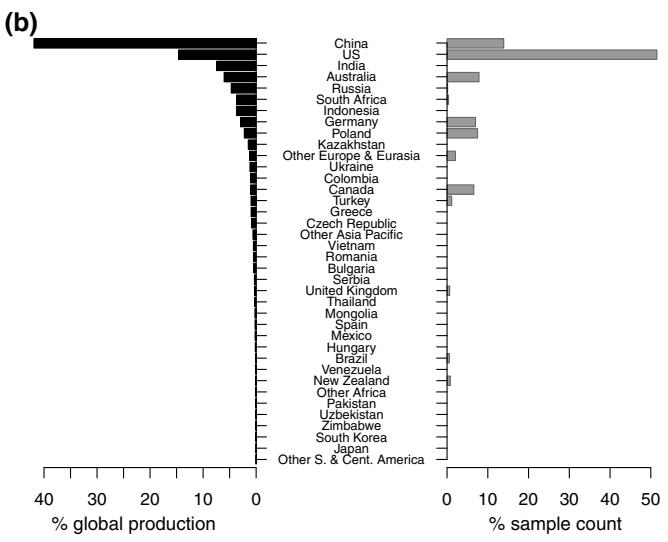
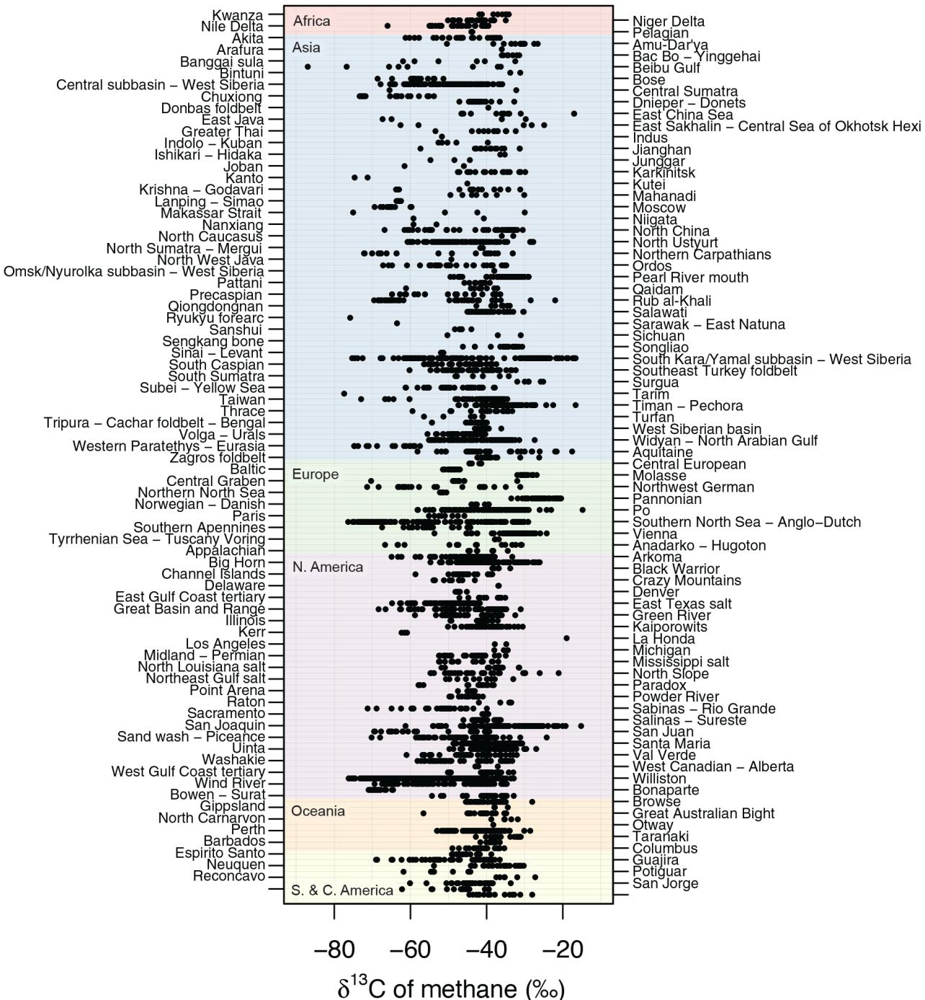
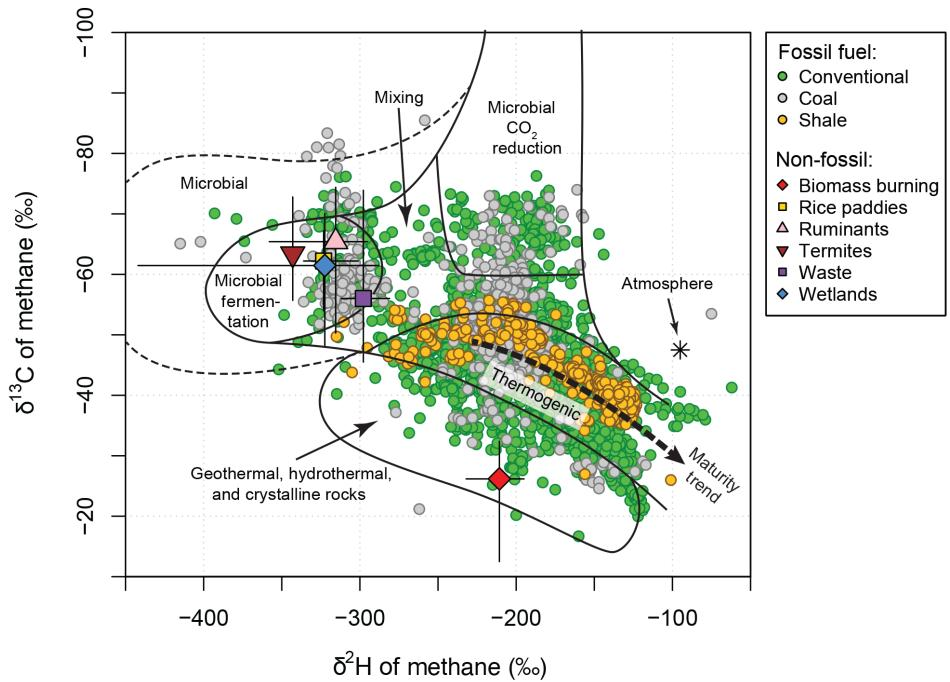
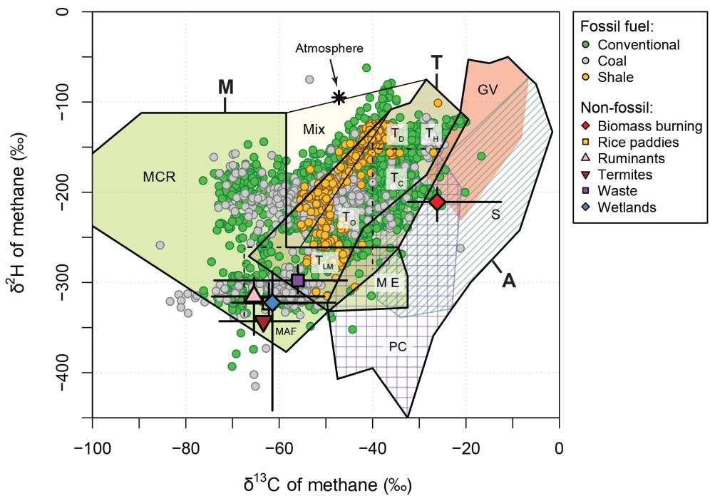
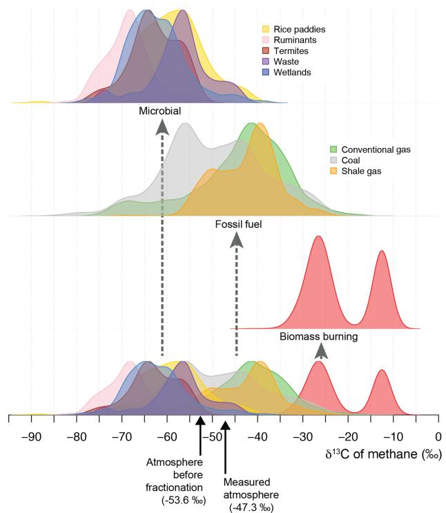
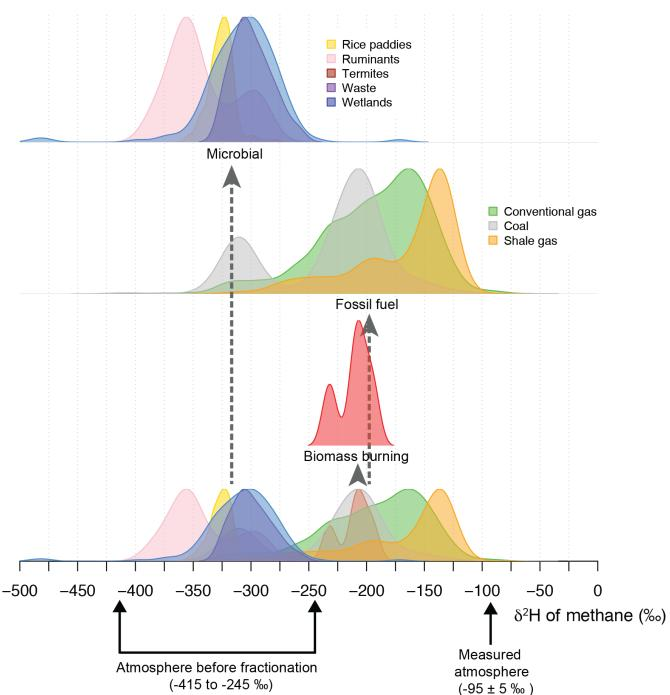

# Global Inventory of Gas Geochemistry Data from Fossil Fuel, Microbial and Burning Sources, version 2017

Owen A. Sherwood1,2, Stefan Schwietzke3,4, Victoria A. Arling4, and Giuseppe Etiope5,6

1Institute of Arctic and Alpine Research, University of Colorado, Boulder, Colorado, 80303, USA 2Department of Earth Sciences, Dalhousie University, Halifax, Nova Scotia, B3H 4R2, Canada 3Cooperative Institute for Research in Environmental Sciences, University of Colorado, Boulder, Colorado, 80303, USA

4NOAA Earth System Research Laboratory, Global Monitoring Division, Boulder, Colorado, 80305, USA 5Istituto Nazionale di Geofisica e Vulcanologia, Rome, 00143, Italy

6Faculty of Environmental Science and Engineering, Babes-Bolyai University, Cluj-Napoca, 400294, Romania

Correspondence to: Owen A. Sherwood (owen.sherwood@dal.ca)

Received: 9 March 2017 – Discussion started: 30 March 2017 Revised: 25 July 2017 – Accepted: 26 July 2017 – Published: 31 August 2017

Abstract. The concentration of atmospheric methane $\mathrm { ( C H _ { 4 } ) }$ has more than doubled over the industrial era. To help constrain global and regional $\mathrm { C H } _ { 4 }$ budgets, inverse (top-down) models incorporate data on the concentration and stable carbon $( \delta ^ { 1 3 } \mathbf { C } )$ and hydrogen $( \delta ^ { 2 } \mathrm { H } )$ isotopic ratios of atmospheric $\mathrm { C H } _ { 4 }$ . These models depend on accurate $\delta ^ { 1 3 } \mathrm { C }$ and $\delta ^ { 2 } \mathrm { H }$ end-member source signatures for each of the main emissions categories. Compared with meticulous measurement and calibration of isotopic $\mathrm { C H } _ { 4 }$ in the atmosphere, there has been relatively less effort to characterize globally representative isotopic source signatures, particularly for fossil fuel sources. Most global $\mathrm { C H } _ { 4 }$ budget models have so far relied on outdated source signature values derived from globally nonrepresentative data. To correct this deficiency, we present a comprehensive, globally representative end-member database of the $\delta ^ { 1 3 } \mathbf { C }$ and $\delta ^ { 2 } \mathrm { H }$ of $\mathrm { C H } _ { 4 }$ from fossil fuel (conventional natural gas, shale gas, and coal), modern microbial (wetlands, rice paddies, ruminants, termites, and landfills and/or waste) and biomass burning sources. Gas molecular compositional data for fossil fuel categories are also included with the database. The database comprises 10 706 samples (8734 fossil fuel, 1972 non-fossil) from 190 published references. Mean (unweighted) $\overset { \cdot } { \delta } ^ { 1 3 } \mathrm { C }$ signatures for fossil fuel $\mathrm { C H } _ { 4 }$ are significantly lighter than values commonly used in $\mathrm { C H } _ { 4 }$ budget models, thus highlighting potential underestimation of fossil fuel $\mathrm { C H } _ { 4 }$ emissions in previous $\mathrm { C H } _ { 4 }$ budget models. This living database will be updated every 2–3 years to provide the atmospheric modeling community with the most complete $\mathrm { C H } _ { 4 }$ source signature data possible. Database digital object identifier (DOI): https://doi.org/10.15138/G3201T.

## 1 Introduction

Methane $\mathrm { ( C H _ { 4 } ) }$ is a potent greenhouse gas that accounts for approximately $2 0 \% ~ ( 0 . 4 8 \mathrm { { W m } } ^ { - 2 } )$ of anthropogenic greenhouse gas radiative forcing in the lower atmosphere (Ciais et al., 2013). Atmospheric $\mathrm { C H } _ { 4 }$ levels have more than doubled over the industrial era, increasing from about 700 ppb in the year $1 7 5 0 \mathrm { t o } > 1 8 0 0 \mathrm { p p b }$ today (Saunois et al., 2016). Atmospheric $\mathrm { C H } _ { 4 }$ stabilized from 2000 to 2006 and increased again after 2007 (Nisbet et al., 2014; Dlugokencky et al., 2011). Specific contributions of natural and anthropogenic sources of $\mathrm { C H } _ { 4 }$ to this renewed increase, and to the global $\mathrm { C H } _ { 4 }$ budget in general, remain unclear (Kirschke et al., 2013; Saunois et al., 2016). Wetlands and agriculture have been suggested as dominant sources of renewed increases in $\mathrm { C H } _ { 4 }$ emissions (Dlugokencky et al., 2009, 2011; Bousquet et al.,

2011; Bloom et al., 2010; Nisbet et al., 2014; Patra et al., 2016; Schaefer et al., 2016). The recent surge in unconventional oil and gas development in North America and growing awareness of $\mathrm { C H } _ { 4 }$ emissions from oil and gas infrastructure (Howarth et al., 2011; Karion et al., 2013; Brandt et al., 2014; Bruhwiler et al., 2017) informs alternative explanations for the increase in atmospheric $\mathrm { C H } _ { 4 }$ (Hausmann et al., 2016; Helmig et al., 2016; Rice et al., 2016). Finally, increasing emissions of coal-related $\mathrm { C H } _ { 4 } .$ , particularly from China (Bergamaschi et al., 2013; Nisbet et al., 2014), and changes in oxidative sinks (Rigby et al., 2017) have been hypothesized as other possible reasons for the recent increase in atmospheric $\mathrm { C H } _ { 4 }$

Current global $\mathrm { C H } _ { 4 }$ emissions estimates rely, in part, on inverse (top-down) models that incorporate data on the concentration and stable carbon $( \delta ^ { 1 3 } \mathbf { C } )$ and hydrogen $( \delta ^ { 2 } \mathrm { H } )$ isotopic ratios of atmospheric $\mathrm { C H } _ { 4 }$ (e.g., Quay et al., 1991; Lowe et al., 1994; Bousquet et al., 2006; Whiticar and Schaefer, 2007; Neef et al., 2010; Monteil et al., 2011; Schwietzke et al., 2014a; Nisbet et al., 2016; Rice et al., 2016; Schwietzke et al., 2016; Schaefer et al., 2016; Rigby et al., 2017; Turner et al., 2017). Mixing ratios of ethane $\mathrm { ( C _ { 2 } H _ { 6 } ) }$ to $\mathrm { C H } _ { 4 }$ have also been used as an additional constraint on fossil fuel $\mathrm { C H } _ { 4 }$ emissions (Simpson et al., 2012; Schwietzke et al., 2014a; Hausmann et al., 2016; Helmig et al., 2016). These models are highly sensitive to the choice of $\delta ^ { 1 3 } \mathrm { C } _ { \mathrm { C H } _ { 4 } }$ , $\delta ^ { 2 } \mathrm { H } _ { \mathrm { C H } _ { 4 } }$ , and $\mathrm { C } _ { 2 } \mathrm { H } _ { 6 } : \mathrm { C H } _ { 4 }$ end-member signatures for each of the various emissions sources, broadly defined as microbial (wetlands, rice paddies, ruminants, termites, and landfills and/or waste), fossil fuel (coal, oil, natural gas, and geological seepage), and biomass burning. For example, $45 \text{‰}$ downward adjustment in the global weighted average fossil fuel $\delta ^ { 1 3 } \mathrm { C } _ { \mathrm { C H } _ { 4 } }$ source signature increases modeled estimates of anthropogenic fossil fuel emissions of $\mathrm { C H } _ { 4 }$ from approximately 100 to $1 5 0 \mathrm { T g } \mathrm { y r } ^ { - 1 }$ (Schwietzke et al., 2016).

Despite the critical importance of accurate source signature data, there has been no recent comprehensive effort to define globally representative $\mathrm { C H } _ { 4 }$ source signatures for the atmospheric modeling community (Table 1). Early studies from the 1980s and early 1990s provided tables of average values for each of the various $\mathrm { C H } _ { 4 }$ source categories, typically with little or no metadata on sample size or geographic origin (Deines, 1980; Quay et al., 1988; Stevens and Engelkemeir, 1988; Whiticar, 1989, 1993). Subsequent studies referred back to the original data tables with little accounting of sample size, error and/or range, or geographic and geological representation (e.g., Fung et al., 1991; Levin, 1994; Ferreti et al., 2005; Quay et al., 1999; Mikaloff-Fletcher et al., 2004; Bosuquet et al., 2006). Other top-down studies have often assumed a set of canonical end-member values used in previous modeling studies, without reference to the primary data (Gupta et al., 1996; Tyler et al., 1999; Houweling et al., 2000; Lassey et al., 2007; Neef et al., 2010; Monteil et al., 2011). Moreover, model sensitivity to source signature

values is rarely tested (e.g., Schwietzke et al., 2014a, 2016;   
Rice et al., 2016).

There is in fact much literature on the molecular and isotopic composition of natural and anthropogenic sources of CH4, going back decades. The literature has grown significantly since the early studies of the 1980s from which most canonical source signature values were originally derived. This paper describes a global database of $\delta ^ { 1 \breve { 3 } } \mathrm { C } _ { \mathrm { C H } _ { 4 } } , \delta ^ { 2 } \mathrm { H } _ { \mathrm { C H } _ { 4 } } .$ and $\mathrm { C } _ { 2 } \mathrm { H } _ { 6 } : \mathrm { C H } _ { 4 }$ source signatures for fossil fuel, microbial and biomass burning sources of $\mathrm { C H } _ { 4 }$ compiled from public domain sources. Data distributions are discussed within the context of existing and evolving natural gas genetic origin frameworks (Schoell, 1983; Whitcar et al., 1986; Whiticar, 1989, 1999; Etiope, 2015; Milkov et al., 2017). The database is intended primarily for use by atmospheric scientists working on top-down modeling of $\mathrm { C H } _ { 4 }$ emissions on regional to global scales. This “living” database will be updated every 2–3 years so that the modeling community has access to the most up-to-date and comprehensive collection of $\mathrm { C H } _ { 4 }$ source signature data available. The database may also prove useful for petroleum geoscientists interested in genetic characterization of natural gas across different basins and formations. Hydrogeochemists may use the database for analyzing the origin and fate of hydrocarbon gases in groundwater in specific oil- and gas-producing basins.

## 2 Database methods and description

## 2.1 Database version

The 2017 version of the source signature database is accessed from the NOAA Earth Systems Research Laboratory with this link: https://www.esrl.noaa.gov/gmd/ccgg/arc/?id=123. This version supersedes an earlier version (Sherwood et al., 2016) published as a complement to Schwietzke et al. (2016). Whereas the previous version reported values of $\delta ^ { 1 3 } \mathrm { C } _ { \mathrm { C H } _ { 4 } }$ only, the 2017 version expands the range of geochemical parameters, as described in Sect. 2.4 below. Other minor changes to the database are noted in the database “Readme” file.

## 2.2 Types of gas

The database is separated into fossil fuel and non-fossil fuel sources of $\mathrm { C H } _ { 4 } .$ Fossil fuel sources comprise conventional natural gas, coal gas, and shale gas. Shale gas is included as a separate category because of growing interest in $\mathrm { C H } _ { 4 }$ emissions associated with this form of unconventional gas production. Both conventional and shale gas include natural gas coproduced with oil. Coal gas includes both coal mine gases and coal bed methane. All three fossil fuel gas types are representative of reservoir gases measured from producing or previously producing oil or gas wells or coal mines. Data from exploratory wells were excluded, as these are not broadly representative of atmospheric emissions. The database does not currently distinguish between oil and nonoil-associated gas or between different ranks of coal (i.e., lignite, bituminous, and anthracite). However, the database includes the locations of each sample, which may be used to make this distinction based on activity data (e.g., production based on coal rank at a given coal mine). Pipeline (processed) distribution gases are not included in the database, primarily due to lack of data availability. Users of this database should be aware that, due to preferential stripping of alkane components, processed gases may have different molecular compositions than the reservoir gases represented herein. Also, the molecular composition of distribution gases in any region may change over time (Schwietzke et al., 2014b). In comparison with the intentional changes of the molecular composition of natural gas, isotopic signatures are thought to be relatively unaffected by gas processing except for mixing of two or more isotopic end members (Schoell et al., 1993). Geological seepage gases, $\mathrm { i . e . }$ , the natural source component of the fossil fuel category (Etiope et al., 2008; Etiope, 2009, 2015), are not included in this database. A global database of onshore seeps is discussed in Etiope (2015) and available from CGG (2015). The composition of seepage gases and their influence on the global $\mathrm { C H } _ { 4 }$ budget is the subject of ongoing research.

Table 1. Representative list of atmospheric modeling studies in which isotopic ratios were used to constrain emissions from fossil fuel sources of $\mathrm { C H } _ { 4 } .$ , showing values of $\delta ^ { 1 3 ^ { \bullet } } \mathrm { C } _ { \mathrm { C H } _ { 4 } }$ and $\delta ^ { 2 } \mathrm { H } _ { \mathrm { C H } _ { 4 } } ^ { - }$ used and the source of those values.
<table><tr><td>Study</td><td>Source*</td><td> $\delta ^ { 1 3 } \mathrm { C } _ { \mathrm { C H } _ { 4 } } ( \% o )$ </td><td> $\delta ^ { 2 } \mathrm { H } _ { \mathrm { C H } _ { 4 } } \ ( \% _ { 0 } )$ </td><td>Data reference</td></tr><tr><td>Craig et al. (1988)</td><td>NG</td><td>-44</td><td>na</td><td>Schoell (1980), Rice and Claypool (1981)</td></tr><tr><td></td><td>Coal</td><td>-37</td><td>na</td><td>Deines (1980)</td></tr><tr><td>Stevens and Engelkemeir (1988)</td><td>NG (thermo.)</td><td>−44(-80 to -25)</td><td>na</td><td>Schoell (1980), Rice and Claypool (1981)</td></tr><tr><td></td><td>NG (oil-assoc.)</td><td>-40(-30 to -50)</td><td>na</td><td>Deines (1980)</td></tr><tr><td></td><td>Coal</td><td>-37(-14 to -60)</td><td>na</td><td></td></tr><tr><td>Quay et al. (1988)</td><td>NG (thermo.)</td><td>-42(-76 to -21)</td><td>na</td><td>Deines (1980), Schoell (1980)</td></tr><tr><td></td><td>NG (oil-assoc.)</td><td>-41(-60 to -30)</td><td>na</td><td></td></tr><tr><td></td><td>Coal</td><td>-37(-70 to -15)</td><td>na</td><td></td></tr><tr><td>Whiticar (1989,1993)</td><td>NG</td><td>-44</td><td>-180</td><td>Unspecified</td></tr><tr><td></td><td>Coal</td><td>-37</td><td>-110</td><td></td></tr><tr><td>Fung et al. (1991)</td><td>NG</td><td>-70 to -41</td><td>na</td><td>Quay et al. (1991)</td></tr><tr><td></td><td>Coal</td><td>-70 to -15</td><td>na</td><td></td></tr><tr><td>Quay et al. (1991)</td><td>NG (thermo.)</td><td>−41(-41 to -76)</td><td>na</td><td>Deines (1980), Schoell (1980)</td></tr><tr><td></td><td>NG (oil-assoc.)</td><td>-44(-60 to -30)</td><td>na</td><td></td></tr><tr><td></td><td>Coal</td><td>-35 (-70 to -15)</td><td>na</td><td></td></tr><tr><td>Levin (1994)</td><td>NG</td><td>-40.5 ±6.2</td><td>-185±29</td><td>Original measurements</td></tr><tr><td>Stevens (1993)</td><td>NG</td><td>-43±4</td><td>na</td><td>Schoell (1980), Rice and Claypool (1981)</td></tr><tr><td></td><td>Coal</td><td>-37±4</td><td>na</td><td>Deines (1980)</td></tr><tr><td>Levin (1994)</td><td>NG</td><td>-40±2</td><td>na</td><td>Stevens and Engelkemier (1988), Quay et al.(1991)</td></tr><tr><td></td><td>Coal</td><td>-35±3</td><td>na</td><td></td></tr><tr><td>Gupta et al. (1996)</td><td>NG</td><td>-38</td><td>na</td><td>Unspecified</td></tr><tr><td></td><td>Coal</td><td>-37</td><td>na</td><td></td></tr><tr><td>Francey et al. (1999)</td><td>NG</td><td>140</td><td>na</td><td>Unspecified</td></tr><tr><td></td><td>Coal</td><td>-35</td><td>na</td><td></td></tr><tr><td>Quay et al. (1999)</td><td>NG</td><td>-43±7</td><td>-185±20</td><td>Stevens and Engelkemeir (1988), Quay et al. (1991), Levin (1994), Stevens (1993), Gupta et al. (1996)</td></tr><tr><td></td><td>Coal</td><td>-36±7</td><td>-140±20</td><td></td></tr><tr><td>Tyler et al. (1999)</td><td>NG</td><td>-38</td><td>na</td><td>Fung et al. (1991)</td></tr><tr><td></td><td>Coal</td><td>-37</td><td>na</td><td></td></tr><tr><td>Houweling et al. (2000)</td><td>NG (thermo.)</td><td>140</td><td>na</td><td>Levin (1994), Quay et al. (1999)</td></tr><tr><td>Lassey et al. (2000)</td><td>FF</td><td>140</td><td>na</td><td>Unspecified</td></tr><tr><td>Mikaloff-Fletcher et al. (2004)</td><td>NG</td><td>-44</td><td>na</td><td>Whiticar (1993)</td></tr><tr><td></td><td>Coal</td><td>-37</td><td>na</td><td></td></tr><tr><td>Ferretti et al. (2005)</td><td>FF</td><td>140</td><td>na</td><td>Unspecified</td></tr><tr><td>Bousquet et al. (2006)</td><td>NG</td><td>-44</td><td>na</td><td>Mikaloff-Fletcher et al. (2004)</td></tr><tr><td></td><td>Coal</td><td>-37</td><td>na</td><td></td></tr><tr><td>Lassey et al. (2007)</td><td>NG</td><td>-35±5</td><td>na</td><td>Unspecified</td></tr><tr><td></td><td>Coal</td><td>-40±5</td><td>na</td><td></td></tr><tr><td>Tyler et al. (2007)</td><td>NG</td><td>-38</td><td>-175</td><td>Gupta et al. (1996)</td></tr><tr><td></td><td>Coal</td><td>-37</td><td>-175</td><td></td></tr><tr><td>Whiticar and Schaefer (2007)</td><td>NG</td><td>144</td><td>-180</td><td>Unspecified</td></tr><tr><td></td><td>Coal</td><td>-37</td><td>-140</td><td></td></tr><tr><td></td><td>Geol</td><td>-41.8</td><td>-200</td><td></td></tr><tr><td>Neef et al. (2010)</td><td>NG</td><td>-35</td><td></td><td>Lassey et al. (2007)</td></tr><tr><td></td><td>Coal</td><td>140</td><td>na</td><td></td></tr><tr><td>Dlugokencky et al. (2011)</td><td>NG</td><td></td><td>na</td><td>Unspecified</td></tr><tr><td></td><td></td><td>-34 to -50 (±3) -35±3</td><td>-175±10</td><td></td></tr><tr><td>Monteil et al. (2011)</td><td>Coal NG</td><td>140</td><td>−175±10</td><td>Unspecified</td></tr><tr><td></td><td></td><td></td><td>na</td><td></td></tr><tr><td>Rigby et al. (2012)</td><td>Coal</td><td>-35</td><td>na</td><td>Whitcar and Schaefer (2007)</td></tr><tr><td>Kirschke et al. (2013)</td><td>FF</td><td>-40±14</td><td>-175±20</td><td>Monteil et al. (2011),Neef et al.(2010)</td></tr><tr><td>Ghosh et al. (2015)</td><td>FF</td><td>-25 to -55</td><td>na</td><td>Unspecified</td></tr><tr><td></td><td>NG</td><td>140</td><td>na</td><td></td></tr><tr><td>Rice et al. (2016)</td><td>Coal</td><td>-35</td><td>na</td><td>Whiticar (1993), Tyler et al. (2007)</td></tr><tr><td></td><td>NG Coal</td><td>-44 -37.3</td><td>-175 -175</td><td></td></tr><tr><td>Schaefer et al. (2016)</td><td>FF</td><td></td><td></td><td>Dlugokencky et al. (2011), Bréas et al. (2001),</td></tr><tr><td></td><td></td><td>-37</td><td>na</td><td>Whiticar and Schaefer (2007)</td></tr></table>

∗ NG: natural gas; FF: fossil fuels; Geol: geological seepage.

Non-fossil fuel sources of $\mathrm { C H } _ { 4 }$ in the database consist of modern microbial sources and biomass burning. Modern microbial data are from rice paddies, ruminants (C3- and C4- plant eating cattle, sheep, goats, and their manure), termites, waste and/or landfills, and wetlands (bogs and/or peat, deltas, estuaries, floodplains, lagoons, lakes, marshes, ponds, rivers, swamps and tundra). Biomass burning data are from brush, forests and/or woodlands, grasses, and pastures.

## 2.3 Data gathering

Data were obtained from the peer-reviewed literature, conference proceedings, graduate theses, and government reports and databases. Government databases include the US Geological Survey (USGS) Energy Geochemistry Database (https://energy.usgs.gov/ GeochemistryGeophysics/GeochemistryLaboratories/ GeochemistryLaboratories-GeochemistryDatabase.aspx),

the Geological Survey of the Netherlands (NLOG) database (available by request through http://nlog. nl/en/gas-properties), and the Geoscience Australia (ORGCHEM) database (available by request through http://www.ga.gov.au/search/index.html#/). Google Scholar, Web of Science, the American Association of Petroleum Geologists (AAPG; http://www.datapages.com/), and the Society of Petroleum Engineers (SPE; http://www.spe.org) were used to search for data. The use of English language search tools presented an unavoidable bias in data gathering. Searches focused on publications with gas isotopic data. Since gas compositional analysis is a prerequisite for subsequent isotopic analysis in most laboratories, gas compositional data are included with $\delta ^ { 1 3 } \mathrm { C } _ { \mathrm { C H } _ { 4 } }$ and $\delta ^ { 2 } \mathrm { H }$ data if reported in the original source. Note that the literature contains far more publications with gas compositional data alone. All of the data can be traced back to original sources using the references provided. To maintain data transparency, industry proprietary data were excluded.

The database is separated into fossil fuel and non-fossil fuel (modern microbial and biomass burning sources) data tables for two practical reasons. First, the petroleum geochemistry literature tends to report analyses for discrete samples, for example, production gas analyses from individual wellheads or analyses from discrete stratigraphic horizons in a wellbore. By contrast, the literature on non-fossil fuel sources of $\mathrm { C H } _ { 4 }$ more commonly reports statistical summaries (e.g., multiple measurements at a given location and time) as opposed to discrete sample data; because of this, the non-fossil data comprise $n = 1 9 7 3$ measurements represented in 107 rows of data. Second, fossil fuel data usually include gas composition of ${ \mathrm { C } } _ { 2 } +$ alkanes and non-alkane gases and isotopic compositions of ${ \mathrm { C } } _ { 2 } +$ alkanes. The non-fossil fuel literature rarely reports data on these additional parameters, even though microbial processes in fact produce ${ \mathrm { C } } _ { 2 } +$ albeit in negligible quantities (< 0.1 %) compared to CH4 (Oremland, 1981; Ladygina et al., 2006; Xie et al., 2013). Rather than trying to fit these two fundamentally different types of data into a common table format, they are presented separately.

## 2.4 Analytical parameters

Table 2 lists analytical parameters included in the database. For fossil fuel gases, parameters include molar percent composition of non-alkane gases $( \mathrm { N } _ { 2 } , \mathrm { O } _ { 2 } , \mathrm { C O } _ { 2 } , \mathrm { A r } , \mathrm { H } _ { 2 } , \mathrm { H } _ { 2 } \mathrm { S }$ He) and $\mathrm { C } _ { 1 }$ to $\mathrm { C } _ { 6 }$ alkanes $( \mathrm { C H } _ { 4 } , \mathrm { C } _ { 2 } \mathrm { H } _ { 6 } , \mathrm { C } _ { 3 } \mathrm { H } _ { 8 } , \mathrm { i } \mathrm { s o } { - } \mathrm { C } _ { 4 } \mathrm { H } _ { 1 0 } , \mathrm { n } { - }$ $\mathrm { C } _ { 4 } \mathrm { H } _ { 1 0 } , \mathrm { i } \mathrm { s o } { - } \mathrm { C } _ { 5 } \mathrm { H } _ { 1 2 } , \mathrm { n } { - } \mathrm { C } _ { 5 } \mathrm { H } _ { 1 2 } , \mathrm { C } _ { 6 } \mathrm { H } _ { 1 4 } )$ as well as $\delta ^ { 1 3 } \mathrm { C }$ and $\delta ^ { 2 } \mathrm { H }$ isotopic ratios of $\mathrm { C } _ { 1 }$ to $\mathrm { C } _ { 5 }$ alkanes. Though less commonly used in 3-D inverse modeling studies of the global CH4 budget, alkane compositions are important for source attribution in regional air quality and emissions studies (Karion et al., 2013; Pétron et al., 2014; Peischl et al., 2015; Kort et al., 2016). The $\delta ^ { 1 3 } \mathrm { C }$ and $\delta ^ { 2 } \mathrm { H }$ isotopic signatures of ${ \mathrm { C } } _ { 2 } + { \mathrm { a l k a } } -$ nes may also prove useful as source tracers with future advances in analytical instrumentation. For non-fossil fuel samples, $\delta ^ { 1 3 } \mathrm { C }$ and $\delta ^ { 2 } \mathrm { H }$ of $\mathrm { C H } _ { 4 }$ are the only parameters provided in the database.

## 2.5 Stable isotope notation and standardization

Stable isotopic data are reported in conventional delta notation: $\delta X = ( R _ { \mathrm { s a m p l e } } / R _ { \mathrm { s t a n d a r d } } - 1 ) \times 1 0 0 0$ , in which $\delta X =$ $\delta ^ { 1 3 } \mathbf { C }$ or $\delta ^ { 2 } \mathrm { H }$ and $R { \stackrel { ! } { = } } ^ { 1 3 } \mathbf { C } / ^ { 1 2 } \mathbf { C } ~ \mathrm { o r } ~ ^ { 2 } \mathbf { H } / ^ { 1 } \mathbf { H }$ , respectively. $\delta ^ { 1 3 } \mathrm { C }$ data are reported on the Pee Dee Belemnite/Vienna Pee Dee Belemnite (PDB/VPDB) scale and $\delta ^ { 2 } \mathrm { H }$ data are reported on the Vienna Standard Mean Ocean Water (VSMOW) scale. The Vienna version of the PDB scale, signifying that the original PDB reference material used to define the scale ran out and was replaced with the NBS-19 reference material, is nominally identical to the previous PDB scale (Gröning, 2004). For references in which the scales were not stated explicitly, we assume the use of the PDB/VPDB and VSMOW scales, based on the fact that the use of PDB to define the $\delta ^ { 1 3 } \mathrm { C }$ scale and VSMOW to define the $\delta ^ { 2 } ]$ H scale goes back to the 1950s and early 1960s (Craig, 1953, 1961) and that the oldest reference in the database (Dubrova and Nesmelova, 1968) postdates formal recognition of these scales.

Table 2. List of geochemical parameters by gas type included in the database.
<table><tr><td>Type of data Fossil fuel</td><td>Parameters</td><td></td><td>Units</td></tr><tr><td rowspan="2"></td><td>Composition:1</td><td>Non-alkane  $\mathrm { g a s e s : } \ \mathrm { N } _ { 2 } , \mathrm { O } _ { 2 } , \mathrm { C O } _ { 2 } , \mathrm { A r , H } _ { 2 } , \mathrm { H } _ { 2 } \mathrm { S } , \mathrm { H e }$   $\mathrm { A l k a n e s : C H _ { 4 } , C _ { 2 } H _ { 6 } , C _ { 3 } H _ { 8 } , i s o - C _ { 4 } H _ { 1 0 } , n - C _ { 4 } H _ { 1 0 } , i s o - C _ { 5 } H _ { 1 2 } , }$   $\mathrm { n - C } _ { 5 } \mathrm { H } _ { 1 2 } , \mathrm { C } _ { 6 } \mathrm { H } _ { 1 4 }$ </td><td>Mol. %</td></tr><tr><td>Isotopes:</td><td> $\delta ^ { 1 3 } \mathrm { C } _ { \mathrm { C H } _ { 4 } } , \delta ^ { 1 3 } \mathrm { C } _ { \mathrm { C 2 H } _ { 6 } } , \delta ^ { 1 3 } \mathrm { C } _ { \mathrm { C 3 H } _ { 8 } } , \delta ^ { 1 3 } \mathrm { C } _ { \mathrm { i C } _ { 4 } \mathrm { H } _ { 1 0 } } , \delta ^ { 1 3 } \mathrm { C } _ { \mathrm { n C } _ { 4 } \mathrm { H } _ { 1 0 } } ,$   $\delta ^ { 1 3 } \mathbf { C } _ { \mathrm { i C _ { 5 } H _ { 1 2 } } } , \delta ^ { 1 3 } \mathbf { C } _ { \mathrm { n C _ { 5 } H _ { 1 2 } } } , \delta ^ { 1 3 } \mathbf { C } _ { \mathbf { C } _ { 6 } \mathrm { H _ { 1 4 } } }$   $\delta ^ { 2 } \mathrm { H } _ { \mathrm { C H } _ { 4 } } , \delta ^ { 2 } \mathrm { H } _ { \mathrm { C } _ { 2 } \mathrm { H } _ { 6 } } , \delta ^ { 2 } \mathrm { H } _ { \mathrm { C } _ { 3 } \mathrm { H } _ { 8 } } , \delta ^ { 2 } \mathrm { H } _ { \mathrm { i } \mathrm { C } _ { 4 } \mathrm { H } _ { 1 0 } } , \delta ^ { 2 } \mathrm { H } _ { \mathrm { n } \mathrm { C } _ { 4 } \mathrm { H } _ { 1 0 } } ,$   $\delta ^ { 2 } \mathrm { H } _ { \mathrm { i C } _ { 5 } \mathrm { H } _ { 1 2 } } , \delta ^ { 2 } \mathrm { H } _ { \mathrm { n C } _ { 5 } \mathrm { H } _ { 1 2 } } , \delta ^ { 2 } \mathrm { H } _ { \mathrm { C } _ { 6 } \mathrm { H } _ { 1 4 } }$ </td><td> $\text{‰}$ </td></tr><tr><td>Non-fossil fuel</td><td>Isotopes:</td><td> $\delta ^ { 1 3 } \mathrm { C } _ { \mathrm { C H _ { 4 } } } \ \mathrm { a n d } \ \delta ^ { 2 } \mathrm { H } _ { \mathrm { C H _ { 4 } } }$ </td><td> $\text{‰}$ </td></tr></table>

It should be noted that stable isotope laboratories calibrate their data against working and/or secondary standards that have been tied to the PDB/VPDB and VSMOW scales (e.g., Dai et al., 2012). The NG-1, NG-2, and NG-3 suite of natural gas isotopic standards served this purpose beginning around the year 1984 but have since been exhausted (Hut, 1987). The current lack of International Atomic Energy Agency (IAEA) or National Institute of Standards and Technology (NIST) isotopic standards for natural gas or methane remains an ongoing problem. Unfortunately, this level of analytical detail often goes unreported in the database references.

## 2.6 Data screening

Data screening for the fossil fuel data consisted of the following steps. (1) Location of metadata (country, state or region, basin, formation) were checked for logical compatibility. (2) To aid searching for basinspecific data, wherever possible fossil fuel data were assigned to a corresponding sedimentary basin in the Robertson Tellus Sedimentary Basins of the World (available at http://www.datapages.com/gis-map-publishingprogram/gis-open-files/global-framework/robertson-tellussedimentary-basins-of-the-world-map). (3) Data duplicates were merged. This step was particularly important for the USGS Energy Geochemistry Database as it includes data from several other sources including the Gas Research Institute report on US natural gas analyses (Jenden and Kaplan, 1989), peer-reviewed papers, and other USGS data reports. For merged duplicates, references to both sources are provided. (4) Obvious outliers, such as individual gas concentrations greater than 100 %, $\mathrm { O } _ { 2 }$ concentrations greater than 21 %, total gas compositions summing to greater than 100 % (plus 10 % to allow for analytical and rounding errors), and positive values of $\delta ^ { 1 3 } \mathbf { C }$ and $\delta ^ { 2 } \mathrm { H }$ were omitted. For the non-fossil fuel data, no data-screening steps were taken; data are provided as originally reported in the respective sources.

## 2.7 Data quality

This database was not subject to a data quality assessment. The data were generated from countless laboratories in different countries over a span of 5 decades. Source publications also span a wide range of academic rigor, from conference proceedings to peer-reviewed journals. Milkov (2010) analyzed natural gas data from the West Siberia Basin and found that Soviet-era papers from the 1970s reported $\delta ^ { 1 3 } \mathrm { C } _ { \mathrm { C H } _ { 4 } }$ values that were too negative by ∼ 7 ‰ compared to data generated in the late 1990s by US, German, and Russian labs, while Soviet-era papers from the 1980s reported values that were too positive by ∼ 4.5 ‰. We make no attempts to correct for these systematic errors; rather we caution users of this database to evaluate and use the data appropriately. By sheer number of samples (n = 10 706) and data sources, systematic errors inherent in any single dataset average out over the whole database, while random errors have a negligible impact on measures of central tendency.

## 3 Results and discussion

## 3.1 Data summary

Fossil fuel sources comprise 8734 data records from 149 published sources. Table 3 provides a summary of the number of countries, basins, fields, formations, and published source by gas type (conventional gas, coal gas, shale gas) and specified analytical parameter $\mathsf { \bar { ( \delta ^ { 1 3 } C _ { C H _ { 4 } } , \delta ^ { 2 } H _ { C H _ { 4 } } , } }$ $\mathrm { C } _ { 2 } \mathrm { H } _ { 6 } \colon \mathrm { C H } _ { 4 } )$ . Non-fossil fuel sources comprise 1972 data records from 41 published sources. Table 4 provides a summary of the number of countries, regions, and published sources by $\mathrm { C H } _ { 4 }$ source (rice paddies, ruminants, termites, waste, wetlands, biomass burning) and parameter $( \delta ^ { 1 3 } \mathrm { C } _ { \mathrm { C H 4 } }$ ， $\delta ^ { 2 } \mathrm { H } _ { \mathrm { C H } _ { 4 } } )$ . Finally, Table 5 provides unweighted statistical summaries by $\mathrm { C H } _ { 4 }$ source and parameter.

Table 3. Fossil fuel data: number of countries, basins, fields, formations, and references by gas type and specified chemical parameter.
<table><tr><td rowspan="2"></td><td colspan="3">Conventional gas</td><td colspan="3">Coal</td><td colspan="3">Shale gas</td></tr><tr><td> $\delta ^ { 1 3 } \mathrm { C } _ { \mathrm { C H } _ { 4 } }$ </td><td> $\delta ^ { 2 } \mathrm { H } _ { \mathrm { C H } _ { 4 } }$ </td><td> $\mathrm { C } _ { 2 } \mathrm { H } _ { 6 } { : } \mathrm { C H } _ { 4 }$ </td><td> $\delta ^ { 1 3 } \mathrm { C } _ { \mathrm { C H } _ { 4 } }$ </td><td> $\delta ^ { 2 } \mathrm { H } _ { \mathrm { C H } _ { 4 } }$ </td><td> $\mathrm { C } _ { 2 } \mathrm { H } _ { 6 } { : } \mathrm { C H } _ { 4 }$ </td><td> $\delta ^ { 1 3 } \mathrm { C } _ { \mathrm { C H } _ { 4 } }$ </td><td> $\delta ^ { 2 } \mathrm { H } _ { \mathrm { C H } _ { 4 } }$ </td><td> $\mathrm { C } _ { 2 } \mathrm { H } _ { 6 } { : } \mathrm { C H } _ { 4 }$ </td></tr><tr><td>Countries</td><td>43</td><td>27</td><td>36</td><td>13</td><td>9</td><td>10</td><td>2</td><td>1</td><td>2</td></tr><tr><td>Basins*</td><td>151</td><td>70</td><td>118</td><td>46</td><td>18</td><td>40</td><td>17</td><td>10</td><td>13</td></tr><tr><td>Fields*</td><td>1238</td><td>424</td><td>969</td><td>114</td><td>16</td><td>95</td><td>56</td><td>10</td><td>53</td></tr><tr><td>Formations*</td><td>723</td><td>308</td><td>587</td><td>140</td><td>44</td><td>112</td><td>41</td><td>11</td><td>36</td></tr><tr><td>References</td><td>112</td><td>56</td><td>83</td><td>41</td><td>22</td><td>32</td><td>19</td><td>12</td><td>15</td></tr></table>

∗ Does not account for unknown and/or unspecified basins, fields, or formations.

Table 4. Non-fossil data: number of countries, regions, and references by source and specified chemical parameter.
<table><tr><td rowspan="2"></td><td colspan="2">Rice paddies</td><td colspan="2">Ruminants</td><td colspan="2">Termites</td><td colspan="2">Waste</td><td colspan="2">Wetlands</td><td colspan="2">Biomass burning</td></tr><tr><td> $\delta ^ { 1 3 } \mathrm { C } _ { \mathrm { C H } _ { 4 } }$ </td><td> $\delta ^ { 2 } \mathrm { H } _ { \mathrm { C H } _ { 4 } }$ </td><td> $\delta ^ { 1 3 } \mathrm { C } _ { \mathrm { C H } _ { 4 } }$ </td><td> $\delta ^ { 2 } \mathrm { H } _ { \mathrm { C H } _ { 4 } }$ </td><td> $\delta ^ { 1 3 } \mathrm { C } _ { \mathrm { C H } _ { 4 } }$ </td><td> $\delta ^ { 2 } \mathrm { H } _ { \mathrm { C H } _ { 4 } }$ </td><td> $\delta ^ { 1 3 } \mathrm { C } _ { \mathrm { C H } _ { 4 } }$ </td><td> $\delta ^ { 2 } \mathrm { H } _ { \mathrm { C H } _ { 4 } }$ </td><td> $\delta ^ { 1 3 } \mathrm { C } _ { \mathrm { C H } _ { 4 } }$ </td><td> $\delta ^ { 2 } \mathrm { H } _ { \mathrm { C H } _ { 4 } }$ </td><td> $\delta ^ { 1 3 } \mathrm { C } _ { \mathrm { C H } _ { 4 } }$ </td><td> $\delta ^ { 2 } \mathrm { H } _ { \mathrm { C H } _ { 4 } }$ </td></tr><tr><td>Countries*</td><td>7</td><td>4</td><td>5</td><td>3</td><td>5</td><td>1</td><td>5</td><td>2</td><td>10</td><td>4</td><td>6</td><td>1</td></tr><tr><td>Regions</td><td>6</td><td>4</td><td>3</td><td>2</td><td>2</td><td>1</td><td>4</td><td>2</td><td>17</td><td>8</td><td>6</td><td>1</td></tr><tr><td>References</td><td>11</td><td>4</td><td>7</td><td>3</td><td>4</td><td>1</td><td>7</td><td>2</td><td>22</td><td>7</td><td>8</td><td>1</td></tr></table>

∗ Does not account for unknown and/or unspecified countries or regions.

## 3.2 Data representativeness

Figure 1 shows global maps of the number of samples in each country by gas type. These maps are further broken down by parameter $( \delta ^ { 1 3 } { \bf C } _ { \mathrm { C H } _ { 4 } } , \delta ^ { 2 } \mathrm { H } _ { \mathrm { C H } _ { 4 } } , { \bf C } _ { 2 } \mathrm { H } _ { 6 } : { \bf C H } _ { 4 } )$ in Fig. 2. Representativeness of the fossil fuel data is assessed by comparison of sample counts from each country to that country’s coal and natural gas production volumes from the BP Statistical Review of World Energy, 2016 (http://www.bp.com/en/global/corporate/energy-economics/ statistical-review-of-world-energy.html) (Fig. 3). This was done at the level of individual countries owing to difficulty in obtaining production statistics at the sub-country level for all the countries in the database. We note that reservoir gases vary compositionally and isotopically within individual countries, basins, fields, and formations (Fig. 4). Within an individual formation, for example, natural gas can range from microbial gas in shallow and/or thermally immature areas, to oil-associated gas in deeper or thermally mature areas, to unassociated dry gas in thermally over-mature areas. Similarly, the type (i.e., rank) of coal gas data presented for any specific country may not be representative of the dominant coal type produced in that country.

Despite isotopic and compositional variability within countries, country-level analysis is the finest practical spatial resolution that can be assessed for the global dataset. Shale gas was excluded from this analysis of representativeness since shale gas production is limited mostly to Canada and the US. For the parameter $\delta ^ { 1 3 } \mathrm { C } _ { \mathrm { C H } _ { 4 } }$ , the database is representative of 84 % of global natural gas production and 80 % of global coal production for the time period 2000– 2015. For conventional gas, the countries with the highest numbers of samples with $\delta ^ { 1 3 } \mathrm { C } _ { \mathrm { C H } _ { 4 } }$ are the US $( n = 2 0 4 2 )$ , China (834), Russia (556), Canada (402), and Australia (400) (Fig. 3). Countries with no conventional gas data include Algeria, Malaysia, Turkmenistan, the United Arab Emirates, and Venezuela, which together account for 12.2 % of global natural gas production. For coal gas, the countries with the largest sample sizes include the US (722), China (196), Australia (110), and Poland (105) (Fig. 3). Countries with no coal gas data representation include India, Indonesia, Kazakhstan, Ukraine, and Colombia, which together account for 14.5 % of global coal production. For the parameter $\delta ^ { 2 } \mathrm { H } _ { \mathrm { C H } _ { 4 } }$ , the database is representative of 73 % of global natural gas production and 74 % of global coal production. For ${ \mathrm { C } } _ { 2 } { \mathrm { H } } _ { 6 } { : \mathrm { C H } } _ { 4 }$ ratio data, the database is representative of 76 % of global natural gas production and 31 % of global coal production. Sample biases can be mitigated by weighting values by each country’s fraction of global gas or coal production (Schwietzke et al., 2016) or by other methods suited to the specific data use.

Representativeness is generally poorer for the non-fossil data, owing in part to the smaller total sample sizes and the lack of data for several key areas. For example, there are few microbial or biomass burning data from Southeast Asia and Africa, two areas of significant wetland, termite, and biomass burning CH4 emissions. Arctic wetlands are also underrepresented in the database. These areas constitute important data gaps that should be targeted for more intensive data mining and/or future field studies.

Table 5. Database summary statistics (unweighted) by gas type and parameter.
<table><tr><td>Parameter</td><td>Statistic</td><td colspan="4">Fossil fuel</td><td colspan="6">Modern microbial</td><td>Biomass</td></tr><tr><td></td><td></td><td>Conventional oil &amp; gas</td><td>Coal</td><td>Shale gas</td><td>All sources</td><td>Rice paddies</td><td>Ruminantsa</td><td>Termites</td><td>Waste</td><td>Wetlands</td><td>All sources</td><td>burningb</td></tr><tr><td> $\delta ^ { 1 3 } \mathrm { C } _ { \mathrm { C H } _ { 4 } } ( \% o )$ </td><td>N</td><td>6079</td><td>1402</td><td>647</td><td>8128</td><td>253</td><td>171</td><td>29</td><td>56</td><td>556</td><td>1065</td><td>907</td></tr><tr><td></td><td>Mean</td><td>-44.0</td><td>-49.5</td><td>-42.5</td><td>-44.8</td><td>-62.2</td><td>-65.4</td><td>-63.4</td><td>-56.0</td><td>-61.5</td><td>-61.7</td><td>-26.2</td></tr><tr><td></td><td>Median</td><td>-42.2</td><td>-49.8</td><td>-41.1</td><td>-42.9</td><td>-63.2</td><td>-67.1</td><td>-63.3</td><td>-55.4</td><td>-62.5</td><td>-63.0</td><td>-26.8</td></tr><tr><td></td><td>Min</td><td>-87.0</td><td>-85.5</td><td>-69.7</td><td>-87</td><td>-67.2</td><td>-74.4</td><td>-72.8</td><td>-73.9</td><td>-70.1</td><td>-74.4</td><td>-32.4</td></tr><tr><td></td><td>Max SD</td><td>-14.8</td><td>-16.8</td><td>-24.4</td><td>-14.8</td><td>-54</td><td>-50.3</td><td>-55.7</td><td>-45.5</td><td>148</td><td>-45.5</td><td>-12.5</td></tr><tr><td></td><td>SE</td><td>10.7</td><td>11.2</td><td>6.7</td><td>10.7</td><td>3.9</td><td>6.7</td><td>6.4</td><td>7.6</td><td>5.4</td><td>6.2</td><td>4.8</td></tr><tr><td></td><td></td><td>0.1</td><td>0.3</td><td>0.3</td><td>0.1</td><td>0.2</td><td>0.5</td><td>1.2</td><td>1.0</td><td>0.2</td><td>0.2</td><td>0.2</td></tr><tr><td> $\delta ^ { 2 } \mathrm { H } _ { \mathrm { C H } _ { 4 } } \ : ( \% _ { 0 } )$ </td><td>N</td><td>1969</td><td>511</td><td>398</td><td>2878</td><td>139</td><td>79</td><td>1</td><td>23</td><td>173</td><td>415</td><td>4</td></tr><tr><td></td><td>Mean</td><td>-194</td><td>-232</td><td>-167</td><td>-197</td><td>-323</td><td>-316</td><td>-343</td><td>-298</td><td>-322</td><td>-317</td><td>-211</td></tr><tr><td></td><td>Median</td><td>-186</td><td>-215</td><td>-146</td><td>-192</td><td>-328</td><td>-305</td><td>-343</td><td>-298</td><td>-310</td><td>-308</td><td>-208</td></tr><tr><td></td><td>Min</td><td>-393</td><td>-415</td><td>-315</td><td>-415</td><td>-336</td><td>-358</td><td>-343</td><td>-312</td><td>-442</td><td>-442</td><td>-232</td></tr><tr><td></td><td>Max</td><td>-62</td><td>-75</td><td>-101</td><td>-62</td><td>-301</td><td>-295</td><td>-343</td><td>-281</td><td>-288</td><td>-281</td><td>-195</td></tr><tr><td></td><td>SD SE</td><td>47</td><td>52</td><td>44</td><td>51</td><td>16</td><td>29</td><td>n/a</td><td>11</td><td>42</td><td>33</td><td>15</td></tr><tr><td></td><td></td><td>1</td><td>2</td><td>2</td><td>1</td><td>1</td><td>3</td><td>n/a</td><td>2</td><td>3</td><td>2</td><td>8</td></tr><tr><td> ${ \mathrm { C } } _ { 2 } { \mathrm { H } } _ { 6 } { : \mathrm { C H } } _ { 4 }$ </td><td>N</td><td>4772</td><td>926</td><td>607</td><td>6305</td><td></td><td></td><td></td><td></td><td></td><td></td><td></td></tr><tr><td></td><td>Mean</td><td>0.0740</td><td>0.0316</td><td>0.0480</td><td>0.0652</td><td></td><td></td><td></td><td></td><td></td><td></td><td></td></tr><tr><td></td><td>Median</td><td>0.0446</td><td>0.0040</td><td>0.0159</td><td>0.0356</td><td></td><td></td><td></td><td></td><td></td><td></td><td></td></tr><tr><td></td><td>Min</td><td>0</td><td>0</td><td>0</td><td>0</td><td></td><td></td><td>n/a</td><td></td><td></td><td></td><td></td></tr><tr><td></td><td>Max</td><td>2.666</td><td>1.3277</td><td>0.3941</td><td>2.666</td><td></td><td></td><td></td><td></td><td></td><td></td><td></td></tr><tr><td></td><td>SD</td><td>0.1208</td><td>0.0858</td><td>0.0597</td><td>0.1128</td><td></td><td></td><td></td><td></td><td></td><td></td><td></td></tr><tr><td></td><td>SE</td><td>0.0017</td><td>0.0028</td><td>0.0024</td><td>0.0014</td><td></td><td></td><td></td><td></td><td></td><td></td><td></td></tr></table>

a Raw values, not weighted by proportion of C3- versus C4-eating ruminants. b Raw values, not weighted by proportion of C3 versus C4 vegetation.

  
Figure 1. Global maps of country-specific sample counts for conventional gas, coal gas, shale gas, and non-fossil gas.

  
Figure 2. Global maps of country-specific sample counts for conventional gas, coal gas, shale gas, and non-fossil gas by geochemical parameter.

## 3.3 Genetic characterization

Figure 5 shows a natural gas genetic characterization plot of $\delta ^ { 1 3 } \mathrm { C } _ { \mathrm { C H } _ { 4 } }$ versus $\delta ^ { 2 } \mathrm { H } _ { \mathrm { C H } _ { 4 } }$ , first presented in Whiticar et al. (1986) and modified in Whiticar (1989, 1999). The characterization framework in Fig. 5 and in other plots of $\delta ^ { 1 3 } \mathrm { C } _ { \mathrm { C H } _ { 4 } }$ versus alkane molecular compositions (Bernard, 1978; Schoell, 1983; Faber and Stahl, 1984) were originally developed by researchers at the German Federal Institute for Geosciences and Natural Resources in the 1970s and early 1980s. These plots were derived largely from proprietary industry data. Because the data could not be publicized, the characterization plots were published without showing the underlying data used in their development. These characterization schemes are still widely used to this day, despite that fact that the literature data on gas isotope ratios and compositions has expanded by orders of magnitude since the 1980s. Figure 5 shows the distribution of conventional gas, coal gas, and shale gas in relation the major genetic fields: thermogenic, microbial CO2 reduction, and microbial fermentation. It also shows the field for gases from geothermal, hydrothermal, and crystalline rocks. Overall, the low percentage of samples falling outside any of the principal genetic fields in Fig. 5 indicates that this original classification scheme captures essentially the full range of isotopic variability in natural gases; however, the breakdown of sample counts by genetic origin changes with revision to the classic characterization scheme. For example, while the canonical thermogenic field assumes a $\delta ^ { 1 3 } \mathbf { C }$ value of −50 or −55 ‰ as the limit between thermogenic and microbial $\mathrm { C H } _ { 4 }$ (Stahl, 1974; Schoell, 1983; Whiticar et al., 1986), recent work extends the thermogenic field to isotopically lighter values; see below.

Figure 6 shows a more recent version of the $\delta ^ { 1 3 } \mathrm { C } _ { \mathrm { C H } _ { 4 } }$ versus $\delta ^ { 2 } \mathrm { H } _ { \mathrm { C H } _ { 4 } }$ plot, updated in Etiope (2015) based on a previous, unpublished version of a fossil fuel reservoir dataset. This diagram distinguishes more types of thermogenic gas, following Etiope and Sherwood Lollar (2013) and Hunt (1996) and reports an updated genetic field for abiotic gas, i.e., gas formed by chemical reactions of inorganically derived gases such as carbon dioxide (CO2) and hydrogen (H2) and not from degradation of organic matter (Etiope and Schoell, 2014). The thermogenic field in Fig. 6 extends to $\delta ^ { 1 3 } \mathrm { C } = - 6 7$ ‰ due to the existence of low-maturity thermogenic gas (Rowe and Muehlenbachs, 1999; Milkov and Dzou, 2007) and secondary alterations (biodegradation; Milkov, 2010, 2011) that would otherwise be mistaken for primary microbial gas.

  
Figure 3. Tornado plots of $\delta ^ { 1 3 } \mathrm { C } _ { \mathrm { C H } _ { 4 } }$ sample counts versus production statistics for (a) conventional natural gas and (b) coal. Shale gas is not included because it is primarily from the US and Canada. “Other Asia Pacific” represents Afghanistan, Japan, New Zealand, and Taiwan; “Other Africa” represents Angola and Tunisia; “Other Europe & Eurasia” represents Austria, France, Hungary, Lithuania, and Turkey; “Other South and Central America” represents Barbados; “Other Middle East” represents Israel.

Of the 8734 fossil fuel samples in the database, a subset of n = 2861 have both $\delta ^ { 1 3 } \dot { \mathrm { C } }$ and $\delta ^ { 2 } \mathrm { H }$ data and are thus represented on the plot. For conventional gas $( n = 1 9 5 1$ $\delta ^ { 1 \dot { 3 } } \mathrm { C } - \delta ^ { 2 } \mathrm { H }$ data pairs), a majority (78 %) of the samples plot within the thermogenic field. A smaller percentage of samples plot within the microbial field (17 %) or the abiotic field (5 %). For coal gas (n = 511), data are more evenly distributed between thermogenic (56 %) and microbial (39 %) fields, with a smaller percentage falling within the abiotic (2 %) field. Because of overlapping genetic fields, percentages sum to > 100 %. Additionally, it is important to outline that conventional or coal gases falling within the abiotic field actually have a dominant thermogenic origin: these $\delta ^ { 1 3 } \mathrm { C } \mathrm { - }$ enriched gases are, in fact, mainly from over-mature (latestage catagenesis) source rocks from northwestern Germany (Rotliegend) and China (Songliao and Tarim basins). Further refinement of the genetic characterization plot should therefore account for these late-stage thermogenic gases. Shale gas data (n = 396) fall almost entirely within the thermogenic field (91 %), with the majority of the data clustered toward the dry gas $( \mathrm { T } _ { D }$ in Fig. 6) end of the thermogenic maturity spectrum. Non-fossil source data (rice paddies, ruminants, waste, wetlands, termites) plot entirely within the microbial fermentation field. Biomass burning has a characteristically enriched isotopic signature, falling within the abiotic field despite a fundamentally different generation pathway compared to abiotic natural gas. A revision of the genetic diagram is in fact in progress (Milkov et al., 2017), and statistics of our database will be readjusted, taking into account this new reassessment of microbial versus thermogenic isotopic genetic characterization.

## 3.4 Importance of isotopically light natural gas and coal gas

A long-standing view in the petroleum geochemical literature held that “more than 20 % of the world’s discovered gas reserves are of biogenic origin” (Rice and Claypool, 1981). This biogenic gas was loosely defined by cutoffs of $\delta ^ { 1 3 } \mathrm { C } _ { \mathrm { C H 4 } } < - 5 5 ^ { \circ }$ ‰ and $< 2 \% \mathrm { ~ C _ { 2 } + }$ alkanes $( \mathrm { C } _ { 2 } \mathrm { H } _ { 6 }$ through pentane $( \mathrm { C } _ { 5 } \mathrm { H } _ { 1 2 } ) )$ . For conventional natural gas in the current database, 14 % of the samples have $\delta ^ { 1 3 } \mathrm { C } _ { \mathrm { C H _ { 4 } } } < - 5 5 \% o$ and 23 % have a $\mathrm { C } _ { 2 } \mathrm { H } _ { 6 } : \mathrm { C H } _ { 4 }$ ratio $< 0 . 0 2$ . These percentages envelope the original Rice and Claypool (1981) estimate. However, it is now known that natural gas within the $\delta ^ { 1 3 } \mathrm { C } _ { \mathrm { C H } _ { 4 } }$ and % ${ \mathrm { C } } _ { 2 } +$ cutoffs encompass primary microbial gas (i.e., biogenic gas in Rice and Claypool, 1981; formed from microbial $\mathrm { C O } _ { 2 }$ reduction and methyl fermentation in shallow sediments), secondary microbial gas (formed from biodegradation of thermogenic hydrocarbons; Zengler et al., 1999; Head et al., 2003; Jones et al., 2008), and low-maturity thermogenic gas (Rowe and Muehlenbachs, 1999; Milkov and Dzou, 2007). Analysis of the $\delta ^ { 1 3 } \mathrm { C }$ and molecular ratios of

  
Figure 4. Strip chart of conventional gas $\delta ^ { 1 3 } \mathrm { C } _ { \mathrm { C H } _ { 4 } }$ by continent and sedimentary basin, demonstrating high levels of variability within individual basins.

C + alkanes and $\mathrm { C O } _ { 2 }$ is often the only means of distinguishing between these three types of gas (Milkov, 2011).

At the global level, primary and secondary microbial gases are thought to account for ∼ 3–4 % and $\sim 5 \mathrm { - } 1 1 \%$ , respectively, of conventional recoverable natural gas reserves (Milkov, 2011). Secondary microbial gas accounts for a larger share of global conventional gas production: giant Cenomanian gas pools of secondary microbial $\mathrm { C H } _ { 4 }$ (mean

  
Figure 5. Genetic characterization plot of $\delta ^ { 1 3 } \mathrm { C } _ { \mathrm { C H } _ { 4 } }$ versus $\delta ^ { 2 } \mathrm { H } _ { \mathrm { C H } _ { 4 } }$ showing data distributions with respect to genetic domains, as traced from Whiticar (1999). The atmospheric value represents global average atmospheric $\mathrm { C H } _ { 4 }$ in the year 2015.

Figure 6. Genetic characterization plot of $\delta ^ { 2 } \mathrm { H } _ { \mathrm { C H } _ { 4 } }$ versus $\delta ^ { 1 3 } \mathrm { C } _ { \mathrm { C H } _ { 4 } }$ , redrawn from Etiope (2015), based on thermogenic fields by Hunt (1996) and Milkov (2011) and abiotic gas from Etiope and Sherwood Lollar (2013) and Etiope and Schoell (2014). The reversed vertical and horizontal axes as compared to Fig. 5 follow conventions established previously to emphasize abiotic fields. M: microbial; T: thermogenic; A: abiotic; MCR: microbial $\mathrm { C O } _ { 2 }$ reduction; MAF: microbial acetate fermentation; ME: microbial in evaporitic environment; $\mathrm { T _ { O } } \mathrm { : }$ thermogenic with oil; $\operatorname { T } _ { \mathbf { C } } \colon$ thermogenic with condensate; $\mathrm { T } _ { \mathrm { D } } \colon$ dry thermogenic; ${ \mathrm { T } } _ { \mathrm { H } } { \mathrm { : } }$ thermogenic with high-temperature $\mathrm { C O } _ { 2 } { \mathrm { - C H } } _ { 4 }$ equilibration; $\operatorname { T } _ { \mathrm { L M } } \colon$ thermogenic low maturity; GV: geothermal–volcanic systems; S: serpentinized ultramafic rocks; PC: Precambrian crystalline shields.

$\delta ^ { 1 3 } \mathrm { C } _ { \mathrm { C H } _ { 4 } } = - 5 1 . 8 \% o )$ found at depths < 1500 m in the West Siberia Basin alone account for ∼ 17 % of the global conventional gas production (Milkov, 2010).

Microbial methanogenesis is even more significant for coals (Rice, 1993), with an approximately even distribution between thermogenic and microbial genetic origins (Figs. 5, 6). The two largest coal mines in the world (North Antelope Rochelle and Black Thunder mines) are located in the Powder River Basin, Wyoming, US. Coal gas from these formations is microbial (fermentation) in origin (mean $\delta ^ { 1 3 } \mathrm { C } _ { \mathrm { C H } _ { 4 } } =$ $- 5 9 . 1 \% o , n = 2 6 7 ;$ ; mean $\delta ^ { 2 } \mathrm { H } _ { \mathrm { C H } _ { 4 } } = - 3 0 9 . 6 \% o , n = 1 1 8 )$ However, as discussed above, we note that some gas, traditionally considered microbial because of its low $\delta ^ { 1 \breve { 3 } } \mathrm { C }$ values, may actually have a thermogenic origin. Coals can also generate secondary microbial gas (Scott et al., 1994).

## 3.5 Data distributions

Figures 7 and 8 show normalized probability distributions of $\delta ^ { 1 \bar { 3 } } \mathrm { C } _ { \mathrm { C H } _ { 4 } }$ and $\delta ^ { 2 } \mathrm { H } _ { \mathrm { C H } _ { 4 } }$ for fossil fuel and modern microbial processes (with their respective subcategories) and biomass burning sources of $\mathrm { C H } _ { 4 }$ . The distributions show wide overlap between different $\mathrm { C H } _ { 4 }$ source categories, thus highlighting the critical need for robust weighting schemes that result in globally or regionally representative measures of central tendency (discussed below).

Data distributions for modern microbial processes have relatively normal distributions with tight overlap between the different subcategories. The distributions for biomass burning show characteristic bimodality, caused by differences between isotopically lighter C3 and isotopically heavier C4 vegetation. Fossil fuel $\delta ^ { 1 3 } \mathrm { C }$ and $\delta ^ { 2 } \mathrm { H }$ exhibit left-skewed (conventional and shale gas) or bimodal (coal) distributions arising from the presence of microbial and low-maturity thermogenic gas as described above. This also leads to relatively wider data ranges than the non-fossil categories.

Figure 7 also indicates the $\delta ^ { 1 3 } \mathrm { C }$ of atmospheric CH4 $( \sim - 5 3 . 6 \text{‰}$ before fractionation by photodegradation, calculated as measured atmospheric $\delta ^ { \bar { 1 } 3 } \mathrm { C } _ { \mathrm { C H } _ { 4 } }$ (mean −47.3 ‰ in the year 2016; White et al., 2017) plus an average fractionation factor $\varepsilon = - 6 . 3 \pm 0 . 8 \%$ (Schwietzke et al., 2016). The $\delta ^ { 1 3 } \mathrm { C }$ of the atmosphere before fractionation represents the “hinge point” upon which $\mathrm { C H } _ { 4 }$ emissions fluxes are estimated by isotopic mass balance $( \mathrm { e . g }$ ., Whiticar and Schaefer, 2007). Modern microbial processes have $\delta ^ { 1 3 } \mathrm { C } _ { \mathrm { C H } _ { 4 } }$ signatures falling to the left of the hinge point; thus, lower $\delta ^ { 1 3 } \mathrm { C } _ { \mathrm { C H _ { 4 } } }$ requires lower emissions to isotopically balance fossil fuel and biomass burning sources; higher $\delta ^ { 1 \bar { 3 } } \mathrm { C } _ { \mathrm { C H } _ { 4 } }$ requires higher emissions. Conversely, fossil fuel and biomass burning source categories have $\delta ^ { \bar { 1 3 } } \mathrm { C } _ { \mathrm { C H } _ { 4 } }$ signatures falling to the right of the hinge point, thus lower $\delta ^ { \bar { 1 3 } } \mathrm { C } _ { \mathrm { C H } _ { 4 } }$ requires higher emissions; higher $\mathrm { { \dot { \delta } ^ { 1 3 } C _ { C H _ { 4 } } } }$ requires lower emissions. Biomass burning falls furthest from the hinge point (mean $\delta ^ { 1 3 } \mathbf { C } _ { \mathrm { C H _ { 4 } } } = - 2 6 . 2 \pm 4 . 8 \%$ , unweighted by proportion of C3 and C4 vegetation). Therefore, it has the most leverage on the isotopic mass balance.

  
Figure 7. Normalized probability density distributions for the $\delta ^ { 1 3 } \mathrm { C } _ { \mathrm { C H } _ { 4 } }$ of microbial, fossil, and biomass burning sources of methane. The flux-weighted average of all sources produces a mean atmospheric $\delta ^ { 1 3 } \mathrm { C } _ { \mathrm { C H } _ { 4 } }$ of $\sim - 5 3 . 6 \% o ,$ as inferred from measured atmospheric $\delta ^ { 1 3 } \mathrm { C } _ { \mathrm { C H } _ { 4 } }$ and isotopic fractionation associated with photochemical methane destruction (see text).

In Fig. 8 the pre-fractionation hinge point is more poorly constrained, owing to greater uncertainty in measured atmospheric $\delta ^ { 2 } \mathrm { H } _ { \mathrm { C H } _ { 4 } } ~ ( - 9 5 \pm 5 \% o )$ and, more importantly, uncertainty in the estimated fractionation factor $\varepsilon = - 2 3 5 \pm 8 0 \% o$ (Gierczak et al., 1997). Modern microbial $\delta ^ { 2 } \mathrm { H } _ { \mathrm { C H } _ { 4 } }$ signatures are within the range of the estimated pre-fractionation atmosphere. Biomass burning and fossil fuel signatures fall to the right of the hinge point. Hence, lower $\delta ^ { 2 } \mathrm { H } _ { \mathrm { C H } _ { 4 } }$ requires higher emissions and higher $\delta ^ { 2 } \mathrm { H } _ { \mathrm { C H } _ { 4 } }$ requires lower emissions for both these categories.

Unweighted mean $\delta ^ { 1 3 } \mathrm { C } _ { \mathrm { C H } _ { 4 } }$ and $\delta ^ { 2 } \mathrm { H } _ { \mathrm { C H } _ { 4 } }$ for modern microbial processes and biomass burning (Table 5) are generally within about $2 \text{‰}$ of typical values used in published $\mathrm { C H } _ { 4 }$ budget models (Schwietzke et al., 2016). By contrast, fossil fuel $\delta ^ { 1 3 } \mathrm { C } _ { \mathrm { C H } _ { 4 } }$ and $\delta ^ { 2 } \mathrm { H } _ { \mathrm { C H } _ { 4 } }$ summary statistics (Table 5) show wider disparity with source signature values used in published $\mathrm { C H } _ { 4 }$ budget models (Table 1). Remarkably, unweighted mean $\delta ^ { 1 3 } \mathrm { C } _ { \mathrm { C H } _ { 4 } } ^ { = }$ for conventional natural gas $( - 4 4 . 0 \pm 1 0 . 7 \% o )$ is identical to the value (−44 ‰) originally indicated by Craig et al. (1988), Stevens and Engelkemier (1988; thermogenic gas), Quay et al. (1991; oilassociated gas), and Whiticar (1989, 1993). However, this value is $4- 6 \text{‰}$ lighter than the range of −38 to −40 ‰ typically used in more recently published models (Gupta et al., 1996; Lassey et al., 2000, 2007; Tyler et al., 2007; Neef et al., 2010; Monteil et al., 2011; Rigby et al., 2012; Ghosh et al., 2015; Schaefer et al., 2016). For coal gas, unweighted mean $\delta ^ { 1 3 } \mathrm { C } _ { \mathrm { C H _ { 4 } } } ~ ( - 4 9 . 5 \% o )$ is even more significantly depleted compared to typical values of $- 3 5 \mathrm { t o } - 3 7 \%$ assumed in virtually all previous studies. These canonical values were likely derived from bituminous and anthracite coal, which is isotopically heavier than lignite and subbituminous coal (Rice, 1993; Zazzeri et al., 2016), yet lignite and subbituminous coal account for more than half of world coal production (World Energy Council, 2013). Similarly, mean $\delta ^ { 2 } \mathrm { H } _ { \mathrm { C H } _ { 4 } }$ for natural gas (−194 ‰) and coal (−232 ‰) is 10–15 ‰ and 60–120 ‰, respectively, lighter than literature values. Shale gas also exhibits lower mean $\delta ^ { 1 3 } \mathrm { C } _ { \mathrm { C H } _ { 4 } }$ (−42.5 ‰) and $\delta ^ { 2 } \mathrm { H } _ { \mathrm { C H } _ { 4 } } ~ ( - 1 6 7 \% o )$ than indicated in the CH4 budget literature. For all fossil fuel data (uncategorized), unweighted mean $\delta ^ { 1 3 } \mathbf { C } _ { \mathrm { C H } _ { 4 } } = - 4 4 . 8 \pm 1 1$ ‰ (1 SD) and $\delta ^ { 2 } \mathrm { H } _ { \mathrm { C H _ { 4 } } } = - 1 9 7 \pm 5 0 \%$ .

  
Figure 8. Normalized probability density distributions for the $\delta ^ { 2 } \mathrm { H } _ { \mathrm { C H } _ { 4 } }$ of microbial, fossil, and biomass burning sources of methane. The flux-weighted average of all sources produces a mean atmospheric $\delta ^ { 1 3 } \mathrm { C } _ { \mathrm { C H } _ { 4 } }$ of between −245 and $- 4 1 5 \text{‰}$ as inferred from measured atmospheric $\delta ^ { 2 } \mathrm { H } _ { \mathrm { C H } _ { 4 } }$ and isotopic fractionation associated with photochemical methane destruction (see text).

These results highlight the possibility that widespread use of too-heavy $\delta ^ { 1 3 } \mathrm { C } _ { \mathrm { C H } _ { 4 } }$ and $\delta ^ { 2 } \mathrm { H } _ { \mathrm { C H } _ { 4 } }$ fossil fuel source signatures could have led to systematic underestimation of fossil fuel emissions in the CH4 budget literature. Indeed, Schwietzke et al. (2016) reanalyzed the global $\mathrm { C H } _ { 4 }$ budget using weighted source signature data calculated from an earlier version of this database (Sherwood et al., 2016) and showed that total fossil fuel emissions (excluding geological seepage) are about 50 % higher than previously estimated.

Database users are encouraged to adopt appropriate weighting criteria for estimating spatially averaged source signatures. For instance, at the global level, Schwietzke et al. (2016) developed a method to weight fossil fuel $\delta ^ { 1 3 } \mathrm { C } _ { \mathrm { C H } _ { 4 } }$ data at the country level and non-fossil fuel $\delta ^ { 1 3 } \mathrm { C } _ { \mathrm { C H } _ { 4 } }$ data at the emissions subcategory level. Weighting fossil fuel $\delta ^ { 1 3 } \mathrm { C } _ { \mathrm { C H } _ { 4 } }$ data at the basin level may be practical for some countries with a sufficient sample size. Basin-level gas production statistics may be used in the weighting procedure as a proxy for basin-level $\mathrm { C H } _ { 4 }$ emissions. However, note that basin-level $\mathrm { C H } _ { 4 }$ emissions may be correlated with basinlevel $\delta ^ { 1 3 } \mathrm { C } _ { \mathrm { C H } _ { 4 } } .$ . A basin with mature dry gas and no associated oil production (and thus relatively heavy $\delta ^ { 1 3 } \mathrm { C _ { C H _ { 4 } } } )$ typically employs less gas processing infrastructure (gas separators, combustors, storage tanks) than a basin with associated gas production (and thus relatively light $\delta ^ { 1 3 } \mathrm { C } _ { \mathrm { C H } _ { 4 } } )$ . The former is therefore likely to emit less CH4 per unit of gas production than the latter. This is substantiated by $\mathrm { C H } _ { 4 }$ emissions estimates from multiple US oil and gas basins. For example, the dry gas basins Marcellus Shale and Fayetteville are estimated to emit on average 0.3 and 1.9 %, respectively, per unit of gas produced (Peischl et al., 2015), whereas the wet gas Denver and Uinta basins emit on average 4.1 and 8.9 %, respectively, per unit of gas produced (Karion et al., 2013; Pétron et al., 2014). Thus, using gas production statistics to weight individual basins without knowledge of the respective $\mathrm { C H } _ { 4 }$ emissions may introduce biases.

## 4 Data availability

Data may be accessed from the following doi: https://doi.org/10.15138/G3201T (Sherwood et al. 2017).

## 5 Conclusions

The database described here is the most comprehensive $\mathrm { C H } _ { 4 }$ source signature database ever compiled. For the fossil fuel category (conventional gas, shale gas, and coal gas), the data comprise 8,734 unique records representing 84 and 73 % (respectively for $\delta ^ { 1 3 } \mathrm { C } _ { \mathrm { C H } _ { 4 } }$ and $\delta ^ { 2 } \mathrm { H } _ { \mathrm { C H } _ { 4 } } )$ of global conventional natural gas production and 80 and 74 % (respectively for $\delta ^ { 1 3 } \mathrm { C } _ { \mathrm { C H _ { 4 } } }$ and $\partial ^ { 2 } \mathrm { H } _ { \mathrm { C H } _ { 4 } } )$ of global coal production at the country level. For the non-fossil category (rice paddies, ruminants, termites, landfills and/or waste, wetlands, and biomass burning), the data comprise 1972 records from 19 countries on five continents. While this constitutes the most comprehensive global data compilation to date, additional data may help further reduce uncertainty in the global $\mathrm { C H } _ { 4 }$ budget, especially for regionally distinct $\mathrm { C H } _ { 4 }$ source attribution. In particular, additional wetland (especially Arctic) and ruminant $\delta ^ { 1 3 } \mathrm { C } _ { \mathrm { C H } _ { 4 } }$ data are needed given their large contribution to the global $\mathrm { C H } _ { 4 }$ budget. Database users are encouraged to adopt appropriate weighting criteria to account for variability in emissions specific to each source category.

Unweighted mean $\delta ^ { 1 3 } \mathrm { C } _ { \mathrm { C H } _ { 4 } }$ and $\delta ^ { 2 } \mathrm { H } _ { \mathrm { C H } _ { 4 } }$ signatures for the non-fossil subcategories are generally within range of a few per mil of typical values used in the $\mathrm { C H } _ { 4 }$ budget modeling literature. Unweighted mean $\delta ^ { 1 3 } \mathrm { C } _ { \mathrm { C H } _ { 4 } }$ and $\delta ^ { 2 } \mathrm { H } _ { \mathrm { C H } _ { 4 } }$ signatures for the fossil category, by contrast, are significantly lighter than the canonical values, particularly for coal gas. The origin of this bias is unknown but may be caused in part by a tendency among $\mathrm { C H } _ { 4 }$ budget modelers to reference other modeling studies instead of the primary literature on isotopic characterization of natural gas. In addition, an evolving understanding of natural gas genetic origins blurs the traditional cutoffs between microbial or biogenic and thermogenic natural gas: fossil fuel $\mathrm { C H } _ { 4 }$ is not exclusively thermogenic and the $\delta ^ { 1 3 } \mathrm { C } _ { \mathrm { C H } _ { 4 } }$ of thermogenic $\mathrm { C H } _ { 4 }$ can be $< - 5 5 \% c$ .

Finally, the database includes a relatively new category of fossil fuel $\mathrm { C H } _ { 4 } .$ , shale gas; these data will become more useful as this resource assumes an increasing share of global natural gas production. The availability of gas molecular concentrations will provide additional end-member constraints on fossil fuel emissions on global and regional scales. This living database will be updated every 2–3 years to provide a comprehensive and up-to-date resource for the $\mathrm { C H } _ { 4 }$ modeling community.

Competing interests. The authors declare that they have no conflict of interest.

Acknowledgements. This work was supported by a grant from the Cooperative Institute for Research in Environmental Sciences (CIRES) and funding from the National Oceanographic and Atmospheric Administration (NOAA). We thank Martin Schoell (Gas Consult International) for compiling an initial version of the fossil fuel database, John Miller and Pieter Tans (NOAA) for initial discussions, and the two anonymous reviewers for their constructive criticisms.

Edited by: Attila Demény

Reviewed by: two anonymous referees

## References

Bergamaschi, P., Houweling, S., Segers, A., Krol, M., Frankenberg, C., Scheepmaker, R. A., Dlugokencky, E., Wofsy, S. C., Kort, E. A., Sweeney, C., Schuck, T., Brenninkmeijer, C., Chen, H., Beck, V., and Gerbig, C.: Atmospheric $\mathrm { C H } _ { 4 }$ in the first decade of the 21st century: Inverse modeling analysis using SCIAMACHY satellite retrievals and NOAA surface measurements, J. Geophys. Res.-Atmos., 118, 7350–7369, https://doi.org/10.1002/jgrd.50480, 2013.

Bernard, B. B.: Light hydrocarbons in recent marine sediments: PhD thesis, Texas A&M University, College Station, Texas, USA, 144 pp. 1978.

Bloom, A. A., Palmer, P. I., Fraser, A., Reay, D. S., and Frankenberg, C.: Large-scale controls of methanogenesis inferred from methane and gravity spaceborne data, Science, 327, 322–325, https://doi.org/10.1126/science.1175176, 2010.

Bousquet, P., Ciais, P., Miller, J. B., Dlugokencky, E. J., Hauglustaine, D. A., Prigent, C., Van der Werf, G. R., Peylin, P., Brunke, E. G., Carouge, C., Langenfelds, R. L., Lathiere, J., Papa, F., Ramonet, M., Schmidt, M., Steele, L. P., Tyler, S. C., and White, J.: Contribution of anthropogenic and natural sources to atmospheric methane variability, Nature, 443, 439–443, 2006.

Bousquet, P., Ringeval, B., Pison, I., Dlugokencky, E. J., Brunke, E.- G., Carouge, C., Chevallier, F., Fortems-Cheiney, A., Frankenberg, C., Hauglustaine, D. A., Krummel, P. B., Langenfelds, R. L., Ramonet, M., Schmidt, M., Steele, L. P., Szopa, S., Yver, C., Viovy, N., and Ciais, P.: Source attribution of the changes in atmospheric methane for 2006–2008, Atmos. Chem. Phys., 11, 3689–3700, https://doi.org/10.5194/acp-11-3689-2011, 2011.

Brandt, A. R., Heath, G. A., Kort, E. A., O’Sullivan, F., Pétron, G., Jordaan, S. M., Tans, P., Wilcox, J., Gopstein, A. M., Arent, D., Wofsy, S., Brown, N. J., Bradley, R., Stucky, G. D., Eardley, D., and Harriss, R.: Methane Leaks from North American Natural Gas Systems, Science, 343, 733–735, https://doi.org/10.1126/science.1247045, 2014.

Bréas, O., Guillou, C., Reniero, F., and Wada, E.: The Global Methane Cycle: Isotopes and Mixing Ratios, Sources and Sinks, Isot. Environ. Healt. S., 37, 257–379, https://doi.org/10.1080/10256010108033302, 2001.

Bruhwiler, L. M., Basu, S., Bergamaschi, P., Bousquet, P., Dlugokencky, E., Houweling, S., Ishizawa, M., Kim, H.S., Locatelli, R., Maksyutov, S., Montzka, S., Pandey, S., Patra, P. K., Pétron, G., Saunois, M., Sweeney, C., Schwietzke, S., Tans, P., and Weatherhead, E. C.: U.S. CH4 emissions from oil and gas production: Have recent large increases been detected? J. Geophys. Res.-Atmos., 122, 4070–4083, https://doi.org/10.1002/2016JD026157, 2017.

CGG: Organic Geochemistry Data from FRogi and the Fluid Features Database, available at: http://robertson.cgg.com/products/ frogi (last access: 28 August 2017), 2015.

Ciais, P., Sabine, C., Bala, G., Bopp, L., Brovkin, V., Canadell, J., Chhabra, A., DeFries, R., Galloway, J., M., H., Jones, C., Le Quéré, C., Myneni, R. B., Piao, S., and Thornton, P.: Carbon and Other Biogeochemical Cycles, in: Climate Change 2013: The Physical Science Basis. Contribution of Working Group I to the Fifth Assessment Report of IPCC, edited by: Stocker, T. F., Qin, D., Plattner, G.-K., Tignor, M., Allen, S. K., Boschung, J., Nauels, A., Xia, Y., Bex, V., and Midgley, P. M., Cambridge University Press, Cambridge, UK, 2013.

Craig, H.: The geochemistry of the stable carbon isotopes, Geochim. Cosmochim. Ac., 3, 53–92, 1953.

Craig, H.: Standard for reporting concentrations of deuterium and oxygen-18 in natural waters, Science, 133, 1833–1834, https://doi.org/10.1126/science.133.3467.1833, 1961.

Craig, H., Chou, C. C., Welhan, J. A., Stevens, C. M., and Engelkemeir, A.: The isotopic composition of methane in polar ice cores, Science, 242, 1535–1539, 1988.

Dai, J., Xia, X., Zhisheng, L., Coleman, D. D., Dias, R. F., Gao, L., Li, J., Deev, A., Li, J., Dessort, D., Duclerc, D., Li, L., Liu, L., Schloemer, S., Zhang, W., Ni, Y., Hu, G., Wang, X., and Tang, Y.: Inter-laboratory calibration of natural gas round robins for $\delta ^ { 2 } \mathrm { H }$ and $\delta ^ { 1 3 } \dot { \mathrm { C } }$ using offline and on-line techniques, Chem. Geol., 310–311, 49–55, https://doi.org/10.1016/j.chemgeo.2012.03.008, 2012.

Deines, P.: The isotopic composition of reduced organic carbon, in: Handbook of Environmental Isotope Geochemistry, Volume 1, edited by: Fritz, P. and Fontes, J. Ch., Elsevier, New York, USA, 329–406, 1980.

Dlugokencky, E. J., Bruhwiler, L., White, J. W. C., Emmons, L. K., Novelli, P. C., Montzka, S. A., Masarie, K. A., Lang, P. M., Crotwell, A. M., Miller, J. B., and Gatti, L. V.: Observational constraints on recent increases in the atmospheric CH burden, Geophys. Res. Lett., 36, L18803, https://doi.org/10.1029/2009GL039780, 2009.

Dlugokencky, E. J., Nisbet, E. G., Fisher, R., and Lowry, D.: Global atmospheric methane: budget, changes and dangers, Philos. T. R. Soc. A, 369, 2058–2072, 2011.

Dubrova, N. V. and Nesmelova, Z. N.: Carbon isotope composition of natural methane, Geochem. Int., 5, 872–876, 1968.

Etiope, G.: Natural emissions of methane from geological seepage in Europe, Atmos. Environ., 43, 1430–1443, https://doi.org/10.1016/j.atmosenv.2008.03.014, 2009.

Etiope, G.: Natural Gas Seepage, The Earth’s Hydrocarbon Degassing, Springer, 199 pp., https://doi.org/10.1007/978-3-319- 14601-0, 2015.

Etiope, G. and Schoell, M.: Abiotic gas: atypical but not rare, Elements, 10, 291–296, 2014.

Etiope, G. and Sherwood Lollar, B.: Abiotic methane on Earth, Rev. Geophys., 51, 276–299, https://doi.org/10.1002/rog.20011, 2013.

Etiope, G., Lassey, K. R., Klusman, R. W., and Boschi, E.: Reappraisal of the fossil methane budget and related emission from geologic sources, Geophys. Res. Lett., 35, L09307, https://doi.org/10.1029/2008GL033623, 2008.

Faber, E. and Stahl, W.: Geochemical surface exploration for hydrocarbons in North Sea, AAPG Bull., 68, 363–386, 1984.

Ferretti, D. F., Miller, J. B., White, J. W. C., Etheridge, D. M., Lassey, K. R., Lowe, D. C., MacFarling, C. M., Dreier, M. F., Trundinger, C. M., van Ommen, T. D., and Langenfelds, R. L.: Unexpected changes to the global methane budget over the past 2000 years, Science, 309, 1714–1717, 2005.

Francey, R. J., Manning, M. R., Allison, C. E., Coram, S. A., Etheridge, D. M., Langenfelds, R. L., Lowe, D. C., and Steele, L. P.: A history of $\delta ^ { 1 3 } \bar { \mathrm { C } }$ in atmospheric $\mathrm { C H } _ { 4 }$ from the Cape Grim air archive and Antarctic firn air, J. Geophys. Res., D19, 22631– 22643, 1999.

Fung, I., John, J., Lerner, J., Matthews, E., Prathier, M., Steele, L. P., and Fraser, P. J.: Three-dimensional model synthesis of the global methane cycle, J. Geophys. Res., D96, 13033–13065, 1991.

Ghosh, A., Patra, P. K., Ishijima, K., Umezawa, T., Ito, A., Etheridge, D. M., Sugawara, S., Kawamura, K., Miller, J. B., Dlugokencky, E. J., Krummel, P. B., Fraser, P. J., Steele, L. P., Langenfelds, R. L., Trudinger, C. M., White, J. W. C., Vaughn, B., Saeki, T., Aoki, S., and Nakazawa, T.: Variations in global methane sources and sinks during 1910–2010, At-

mos. Chem. Phys., 15, 2595–2612, https://doi.org/10.5194/acp-15-2595-2015, 2015.

Gierczak, T., Talukdar, R. K., Herndon, S. C., Ghanshyam, L. V., and Ravishankara, A. R.: Rate coefficients for the reactions of hydroxyl radicals with methane and deuterated methanes, J. Phys. Chem. A, 101, 3125–3134, 1997.

Gröning, M: International Stable Isotope Reference Materials, in: Handbook of Stable Isotope Analytical Techniques, Volume 1, edited by: De Groot, P. A., Elsevier, New York, 874–906, https://doi.org/10.1016/B978-044451114-0/50042-9, 2004.

Gupta, M., Tyler, S., and Cicerone, R: Modeling atmopsheric $\bar { \delta } ^ { 1 3 } \mathrm { C H } _ { 4 }$ and the causes of recent changes in atmospheric CH4 amounts, J. Geophys. Res. D, 101, 22923–22932, 1996.

Hausmann, P., Sussmann, R., and Smale, D.: Contribution of oil and natural gas production to renewed increase in atmospheric methane (2007–2014): top–down estimate from ethane and methane column observations, Atmos. Chem. Phys., 16, 3227–3244, https://doi.org/10.5194/acp-16-3227-2016, 2016.

Head, I. M., Jones, D. M., and Larter, S. R.: Biological activity in the deep subsurface and the origin of heavy oil, Nature, 426, 344– 352, https://doi.org/10.1038/nature02134, 2003.

Helmig, D., Rossabi, S., Hueber, J., Tans, P., Montzka, S. A., Masarie, K., Thoning, K., Plass-Duelmer, C., Claude, A., Carpenter, L. J., Lewis, A. C., Punjabi, S., Reimann, S., Vollmer, M. K., Steinbrecher, R., Hannigan, J. W., Emmons, L. K., Mahieu, E., Franco, B., Smale, D., and Pozzer, A.: Reversal of global atmospheric ethane and propane trends largely due to US oil and natural gas production, Nat. Geosci., 9, 409–495, https://doi.org/10.1038/ngeo2721, 2016.

Houweling, S., Dentener, F., and Lelieveld, J.: Simulation of preindustrial atmospheric methane to constrain the global source strength of natural wetlands, J. Geophys. Res.-Atmos., 105, 17243–17255, https://doi.org/10.1029/2000JD900193, 2000.

Howarth, R., Santoro, R., and Ingraffea, A.: Methane and the greenhouse-gas footprint of natural gas from shale formations, Climatic Change, 106, 679–690, https://doi.org/10.1007/s10584- 011-0061-5, 2011.

Hunt, J. M.: Petroleum Geochemistry and Geology, W. H. Freeman and Co., New York, USA, 743 pp., 1996.

Hut, G.: Consultants’ group meeting on stable isotope reference samples for geochemical and hydrological investigations: IAEA, 16–18 September 1985: Report to the Director General, I.A.E.A., Vienna, Austria, 43 pp., 1987.

Jenden, P. D. and Kaplan, I. R.: Analysis of Gases in the Earth’s Crust, Gas Research Institute, Chicago, USA, 80 pp., 1989.

Jones, D. M., Head, I. M., Gray, N. D., Adams, J. J., Rowan, A. K., Aitken, C. M., Bennett, B., Huang, H., Brown, A., Bowler, B. F. J., Oldenburg, T., Erdmann, M., and Larter, S. R.: Crude-oil biodegradation via methanogenesis in subsurface petroleum reservoirs, Nature, 451, 176–181, https://doi.org/10.1038/nature06484, 2008.

Karion, A., Sweeney, C., Pétron, G., Frost, G., Michael Hardesty, R., Kofler, J., Miller, B. R., Newberger, T., Wolter, S., Banta, R., Brewer, A., Dlugokencky, E., Lang, P., Montzka, S. A., Schnell, R., Tans, P., Trainer, M., Zamora, R., and Conley, S.: Methane emissions estimate from airborne measurements over a western United States natural gas field, Geophys. Res. Lett., 40, 4393– 4397, https://doi.org/10.1002/grl.50811, 2013.

Kirschke, S., Bousquet, P., Ciais, P., Saunois, M., Canadell, J. G., Dlugokencky, E. J., Bergamaschi, P., Bergmann, D., Blake, D. R., Bruhwiler, L., Cameron-Smith, P., Castaldi, S., Chevallier, F., Feng, L., Fraser, A., Heimann, M., Hodson, E. L., Houweling, S., Josse, B., Fraser, P. J., Krummel, P. B., Lamarque, J. F., Langenfelds, R. L., Le Quere, C., Naik, V., O’Doherty, S., Palmer, P. I., Pison, I., Plummer, D., Poulter, B., Prinn, R. G., Rigby, M., Ringeval, B., Santini, M., Schmidt, M., Shindell, D. T., Simpson, I. J., Spahni, R., Steele, L. P., Strode, S. A., Sudo, K., Szopa, S., van der Werf, G. R., Voulgarakis, A., van Weele, M., Weiss, R. F., Williams, J. E., and Zeng, G.: Three decades of global methane sources and sinks, Nat. Geosci., 6, 813–823, https://doi.org/10.1038/ngeo1955, 2013.

Kort, E. A., Smith, M. L., Murray, L. T., Gvakharia, A., Brandt, A. R., Peischl, J., Ryerson, T. B., Sweeney, C., and Travis, K.: Fugitive emissions from the Bakken shale illustrate role of shale production in global ethane shift, Geophys. Res. Lett., 43, 4617– 4623, https://doi.org/10.1002/2016GL068703, 2016.

Ladygina, N., Dedyukhina, E. G., and Vainshtein, M. B.: A review on microbial synthesis of hydrocarbons, Process Biochem., 41, 1001–1014, 2006.

Lassey, K. R., Lowe, D. C., and Manning, M. R.: The trend in atmospheric methane $\delta ^ { 1 3 } \mathrm { C }$ and implications for isotopic constraints on the global methane budget, Glob. Biogeochem. Cy., 14, 41– 49, 2000.

Lassey, K. R., Etheridge, D. M., Lowe, D. C., Smith, A. M., and Ferretti, D. F.: Centennial evolution of the atmospheric methane budget: what do the carbon isotopes tell us?, Atmos. Chem. Phys., 7, 2119–2139, https://doi.org/10.5194/acp-7-2119-2007, 2007.

Levin, I.: The recent state of carbon cycling through the atmosphere, in: Carbon Cycling in the Glacial Ocean: Constraints on the Ocean’s Role in Global Climate Change, edited by: Zahn, R., Pedersen, T. F., Kaminski, M. A., and Labeyrie, L., Springer, Berlin, Germany, 3–13, 1994.

Lowe, D. C., Brenninkmeijer, C. A. M., Brailsford, G. W., Lassey, K. R., Gomez, A. J., and Nisbet, E. G.: Concentration and $^ { 1 3 } \mathrm { \dot { C } }$ records of atmospheric methane in New Zealand and Antarctica: Evidence for changes in methane sources, J. Geophys. Res.- Atmos., 99, 16913–16925, https://doi.org/10.1029/94jd00908, 1994.

Mikaloff-Fletcher, S. E. M., Tans, P. P., Bruhwiler, L. M., Miller, J. B., and Heimann, M.: $\mathrm { C H } _ { 4 }$ sources estimated from atmospheric observations of $\mathrm { C H } _ { 4 }$ and its $^ { 1 3 } \mathrm { C } / ^ { 1 2 } \mathrm { C }$ isotopic ratios: 1. Inverse modeling of source processes, Global Biogeochem. Cy., 18, GB4004, https://doi.org/10.1029/2004GB002223, 2004.

Milkov, A.: Methanogenic biodegradation of petroleum in the West Siberian Basin (Russia): Significance for formation of giant Cenomanian gas pools, AAPG Bull., 94, 1485–1541, 2010.

Milkov, A.: Worldwide distribution and significance of secondary microbial methane formed during petroleum biodegradation in conventional reservoirs, Org. Geochem., 42, 184–207, https://doi.org/10.1016/j.orggeochem.2010.12.003, 2011.

Milkov, A. and Dzou, L.: Geochemical evidence of secondary microbial methane from very slight biodegradation of undersaturated oils in a deep hot reservoir, Geology, 35, 455–458, 2007.

Milkov, A. V., Etiope, G., Sherwood, O. A., and Schwietzke, S.: Revised genetic diagrams for natural gases based on a global dataset of 15 000+ reservoir gas samples, 28th Intern. Meet-

ing on Organic Geochemistry, 17–22 September 2017, Florence, Italy, Book of Abstracts, 2017.

Monteil, G., Houweling, S., Dlugockenky, E. J., Maenhout, G., Vaughn, B. H., White, J. W. C., and Rockmann, T.: Interpreting methane variations in the past two decades using measurements of $\mathrm { C H } _ { 4 }$ mixing ratio and isotopic composition, Atmos. Chem. Phys., 11, 9141–9153, https://doi.org/10.5194/acp-11-9141-2011, 2011.

Neef, L., van Weele, M., and van Velthoven, P.: Optimal estimation of the present-day global methane budget, Global Biogeochem. Cy., 24, GB4024, https://doi.org/10.1029/2009GB003661, 2010.

Nisbet, E. G., Dlugokencky, E. J., and Bousquet, P.: Methane on the Rise-Again, Science, 343, 493–495, https://doi.org/10.1126/science.1247828, 2014.

Nisbet, E. G., Dlugokencky, E. J., Manning, M. R., Lowry, D., Fisher, R. E., France, J. L., Michel, S. E., Miller, J. B., White, J. W. C., Vaughn, B. Bousquet, P., Pyle, J. A., Warwick, N. J., Cain, M., Browlow, R., Zazzeri, G., Lanoisellé, M., Manning, A. C., Gloor, E., Worthy, D. E. J., Brunke, E. G., Labuschagne, C., Wolff, E. W., and Ganesan, A. L.: Rising atmospheric methane: 2007–2014 growth and isotopic shift. Global Biogeochem. Cy, 30, 1356–1370, https://doi.org/10.1002/2016GB005406, 2016.

Oremland, R. S.: Microbial formation of ethane in anoxic estuarine sediments, Appl. Environ. Microb., 42, 122–129, 1981.

Patra, P. K., Saeki, T., Dlugokencky, E. J., Ishijima, K., Umezawa,T., Ito, A., Aoki, S., Morimoto, S., Kort, E. A., Crotwell, A., Ravikumar, K., and Nakazawa, T.: Regional methane emission estimation based on observed atmospheric concentrations (2002–2012), J. Meteorol. Soc. Jpn., 94, 85–107, https://doi.org/10.2151/jmsj.2016-006, 2016.

Peischl, J., Ryerson, T. B., Aikin, K. C., de Gouw, J. A., Gilman, J. B., Holloway, J. S., Lerner, B. M., Nadkarni, R., Neuman, J. A., Nowak, J. B., Trainer, M., Warneke, C., and Parrish, D. D.: Quantifying atmospheric methane emissions from the Haynesville, Fayetteville, and northeastern Marcellus shale gas production regions, J. Geophys. Res.-Atmos., 120, 2119–2139, https://doi.org/10.1002/2014jd022697, 2015.

Pétron, G., Karion, A., Sweeney, C., Miller, B. R., Montzka, S. A., Frost, G. J., Trainer, M., Tans, P., Andrews, A., Kofler, J., Helmig, D., Guenther, D., Dlugokencky, E., Lang, P., Newberger, T., Wolter, S., Hall, B., Novelli, P., Brewer, A., Conley, S., Hardesty, M., Banta, R., White, A., Noone, D., Wolfe, D., and Schnell, R.: A new look at methane and nonmethane hydrocarbon emissions from oil and natural gas operations in the Colorado Denver-Julesburg Basin, J. Geophys. Res.-Atmos., 119, 6836–6852, https://doi.org/10.1002/2013jd021272, 2014.

Quay, P. D., King, S. L., Lansdown, J. M., and Wilbur, D. O.: Isotopic composition of methane released from wetlands: Implications for the increase in atmospheric methane. Global Biogeochem. Cy., 2, 385–397, 1988.

Quay, P. D., King, S. L., Stutsman, J., Wilbur, D. O., Steele, L. P., Fung, I., Gammon, R. H., Brown, T. A., Farwell, G. W., Grootes, P. M., and Schmidt, F. H.: Carbon isotopic composition of atmospheric $\mathrm { C H } _ { 4 } \colon$ fossil and biomass burning source strengths, Global Biogeochem. Cy., 5, 25–47, 1991.

Quay, P., Stutsman, J., Wilbur, D., Snover, A., Dlugokencky, E., and Brown, T.: The isotopic composition of atmospheric methane, Global Biogeochem. Cy., 13, 445–461, 1999.

Rice, A. L., Butenhoof, C. L., Teama, D. G., Röger, F. H., Khalil, M. A. K., and Rasmussen, R. A.: Atmospheric methane isotopic record favors fossil sources flat in 1980s and 1990s with recent increase, P. Natl. Acad. Sci. USA, 113, 10791–10796, https://doi.org/10.1073/pnas.1522923113, 2016.

Rice, D. D.: Composition and origins of coalbed gas, AAPG Studies in Geology, 38, 159–184, 1993.

Rice, D. D. and Claypool, G. E.: Generation, accumulation and resource potential of biogenic gas, AAPG Bull., 65, 5–25, 1981.

Rigby, M., Manning, A. J., and Prinn, R. G.: The value of highfrequency, high-precision methane isotopologue measurements for source and sink estimation, J. Geopys. Res., 117, D12312, https://doi.org/10.1029/2011JD017384, 2012.

Rigby, M., Montzka, S. A., Prinn, R. G., White, J. W. C., Young, D., O’Doherty, S., Lunt, M. F., Ganesan, A. L., Manning, A. J., Simmonds, P. G. Salameh, P. K., Harth, C. M., Mühle, J., Weiss, R. F., Fraser, P. J., Steele, L. P., Krummel, P. B., Mc-Culloch, A., and Park, S.: Role of atmospheric oxidation in recent methane growth, P. Natl. Acad. Sci. USA, 114, 5373–5377, https://doi.org/10.1073/pnas.1616426114, 2017.

Rowe, D. and Muehlenbachs, A.: Low-temperature thermal generation of hydrocarbon gases in shallow shales, Nature, 398, 61–63, 1999.

Saunois, M., Bousquet, P., Poulter, B., Peregon, A., Ciais, P., Canadell, J. G., Dlugokencky, E. J., Etiope, G., Bastviken, D., Houweling, S., Janssens-Maenhout, G., Tubiello, F. N., Castaldi, S., Jackson, R. B., Alexe, M., Arora, V. K., Beerling, D. J., Bergamaschi, P., Blake, D. R., Brailsford, G., Brovkin, V., Bruhwiler, L., Crevoisier, C., Crill, P., Covey, K., Curry, C., Frankenberg, C., Gedney, N., Höglund-Isaksson, L., Ishizawa, M., Ito, A., Joos, F., Kim, H.-S., Kleinen, T., Krummel, P., Lamarque, J.-F., Langenfelds, R., Locatelli, R., Machida, T., Maksyutov, S., McDonald, K. C., Marshall, J., Melton, J. R., Morino, I., Naik, V., O’Doherty, S., Parmentier, F.-J. W., Patra, P. K., Peng, C., Peng, S., Peters, G. P., Pison, I., Prigent, C., Prinn, R., Ramonet, M., Riley, W. J., Saito, M., Santini, M., Schroeder, R., Simpson, I. J., Spahni, R., Steele, P., Takizawa, A., Thornton, B. F., Tian, H., Tohjima, Y., Viovy, N., Voulgarakis, A., van Weele, M., van der Werf, G. R., Weiss, R., Wiedinmyer, C., Wilton, D. J., Wiltshire, A., Worthy, D., Wunch, D., Xu, X., Yoshida, Y., Zhang, B., Zhang, Z., and Zhu, Q.: The global methane budget 2000–2012, Earth Syst. Sci. Data, 8, 697–751, https://doi.org/10.5194/essd-8-697-2016, 2016.

Schaefer, H., Fletcher, S. E. M., Veidt, C., Lassey, K. R., Brailsford, G. W., Bromley, T. M., Dlugokencky, E. J., Michel, S. E., Miller, J. B., Levin, I., Lowe, D. C., Martin, R. J., Vaughn, B. H., and White, J. W. C.: A 21st century shift from fossil-fuel to biogenic methane emissions indicated by $^ { 1 3 } \mathrm { C H } _ { 4 } .$ Science, 352, 80–84, https://doi.org/10.1126/science.aad2705, 2016.

Schoell, M.: The hydrogen and carbon isotopic composition of methane from natural gases of various origins, Geochim. Cosmochim. Ac., 44, 649–661, 1980.

Schoell, M.: Genetic characterization of natural gases, AAPG Bull., 67, 2225–2238, 1983.

Schoell, M., Jenden, P. D., Beeunas, M. A., and Coleman, D. D.: Isotope Analysis of Gases in Gas Field and Gas Storage Operations: Society of Petroleum Engineers #26171, SPE Gas Technology Symposium, 28–30 June 1993, Calgary, Canada, 337–344, 1993.

Schwietzke, S., Griffin, W. M., Matthews, H. S., and Bruhwiler, L. M. P.: Natural gas fugitive emissions rates constrained by global atmospheric methane and ethane, Environ. Sci. Technol., 48, 7714–7722, https://doi.org/10.1021/es501204c, 2014a.

Schwietzke, S., Griffin, W. M., Matthews, H. S., and Bruhwiler, L. M. P.: Global bottom-up fossil fuel fugitive methane and ethane emissions inventory for atmospheric modeling, ACS Sustainable Chem. Eng., 2, 1992–2001, https://doi.org/10.1021/sc500163h, 2014b.

Schwietzke, S., Sherwood, O. A., Bruhwiler, L. M. P., Miller, J. B., Etiope, G., Dlugokencky, E. J., Michel, S. E., Arling, V. A., Vaughn, B. H., White, J. W. C., and Tans, P. P.: Upward revision of global fossil fuel methane emissions based on isotope database, Nature, 538, 88–91, https://doi.org/10.1038/nature19797, 2016.

Scott, A. R., Kaiser, W. R., and Ayers, W. B.: Thermogenic and secondary biogenic gases, San Juan Basin, Colorado and New Mexico – Implications for coalbed gas producibility, AAPG Bull., 78, 1186–1209, 1994.

Sherwood, O. A., Schwietzke, S. S., Arling, V. A., and Etiope, G.: Global Inventory of Fossil and Non-fossil Methane $\delta ^ { 1 3 } \mathrm { C }$ Source Signature Measurements for Improved Atmospheric Modeling, Online database, available at: https://www.esrl.noaa.gov/gmd/ ccgg/d13C-src-inv/ (last access: 28 August 2017), 2016.

Sherwood, O. A., Schwietzke, S., Arling, V. A., and Etiope, G.: Global Inventory of Gas Geochemistry Data from Fossil Fuel, Microbial and Biomass Burning Sources, Version 2017, https://doi.org/10.15138/G3201T, 2017.

Simpson, I. J., Sulbaek Andersen, M. P., Meinardi, S., Bruhwiler, L., Blake, N. J., Helmig, D., Rowland, F. S., and Blake, D. R.: Long-term decline of global atmospheric ethane concentrations and implications for methane, Nature, 488, 490–494, https://doi.org/10.1038/nature11342, 2012.

Stahl, W: Carbon isotope fractionations in natural gases, Nature, 251, 134–136, 1974.

Stevens, C. M.: Isotopic Abundances in the Atmosphere and Sources, in: Atmospheric Methane: Sources, Sinks, and Role in Global Change, NATO ASI Series, Series I: Global Environmental Change, vol 13, edited by: Khalil, M. A. K., Springer, Berlin, Heidelberg, Germany, 1993.

Stevens, C. M. and Engelkemeir, A.: Stable carbon isotopic composition of methane from some natural and anthropogenic sources, J. Geophys. Res. D, 93, 725–733, 1988.

Turner, A. J., Frankenberg, C., Wennberg, P. O., and Jacob, D.J.: Ambiguity in the causes for decadal trends in atmospheric methane and hydroxyl, P. Natl. Acad. Sci. USA, 114, 5367–5372, https://doi.org/10.1073/pnas.1616020114, 2017.

Tyler, S. C., Ajie, H. O., Gupta, M. L., and Cicerone, R. J.: Stable carbon isotope composition of atmospheric methane: A comparison of surface level and free tropospheric air, J. Geophys. Res. D, 104, 13895–13910, 1999.

Tyler, S. C., Rice, A. L., and Ajie, H. O.: Stable isotope ratios in atmospheric CH : Implications for seasonal sources and sinks, J. Geophys. Res., 112, D03303, https://doi.org/10.1029/2006JD007231, 2007.

White, J. W. C., Vaughn, B. H., and Michel, S. E.: Stable Isotopic Composition of Atmospheric Methane ${ } ^ { ( ^ { 1 3 } \mathrm { C ) } }$ from the NOAA ESRL Carbon Cycle Cooperative Global Air Sampling Network, 1998–2015, University of Colorado, Institute of Arctic and

Alpine Research (INSTAAR), Version: 2017-01-20, available at: ftp://aftp.cmdl.noaa.gov/data/trace\_gases/ch4c13/flask/, last access: 28 August 2017.

Whiticar, M. J.: A geochemical perspective of natural gas and atmospheric methane, Org. Geochem., 16, 531–547, 1989.

Whiticar, M. J.: Stable Isotopes and Global Budgets, in: Atmospheric Methane: Sources, Sinks and Role in Global Change, edited by: Knall, M. A., Springer, Germany, Berlin, 138–167, 1993.

Whiticar, M. J.: Carbon and hydrogen isotope systematics of bacterial formation and oxidation of methane, Chem. Geol., 161, 291– 314, 1999.

Whiticar, M. J. and Schaefer, H.: Constraining past global tropospheric methane budgets with carbon and hydrogen isotopic ratios, Philos. T. R. Soc. A, 365, 1793–1828, https://doi.org/10.1098/rsta.2007.2048, 2007.

Whiticar, M. J., Faber, E., and Schoell, M.: Biogenic methane formation in marine and freshwater environments: $\mathrm { C O } _ { 2 }$ reduction versus acetate fermentation – Isotopic evidence, Geochim. Cosmochim. Ac., 50, 693–709, 1986.

World Energy Council: World Energy Resources 2013 Survey, World Energy Council, London, UK, 468 pp., 2013.

Xie, S., Lazar, C. S., Lin, Y. S., Teske, A., and Hinrichs, K. U.: Ethane-and propane-producing potential and molecular characterization of an ethanogenic enrichment in an anoxic estuarine sediment, Org. Geochem., 59, 37–48, 2013.

Zazzeri, G., Lowry, D., Fisher, R. E., France, J. L., Lanoisellé, M., Kelly, B. F. J., Necki, J. M., Iverach, C. P., Ginty, E., Zimnoch, M., Jasek, A., and Nisbet, E. G.: Carbon isotopic signature of coal-derived methane emissions to the atmosphere: from coalification to alteration, Atmos. Chem. Phys., 16, 13669–13680, https://doi.org/10.5194/acp-16-13669-2016, 2016.

Zengler, K., Richnow, H. H., Rosselló-Mora, R. Michaelis, W., and Widdel, F.: Methane formation from long-chain alkanes by anaerobic microorganisms, Nature, 401, 266–269, https://doi.org/10.1038/45777, 1999.

Zumberge, J., Ferworn, K., and Brown, S.: Isotopic reversal (“rollover”) in shale gases produced from the Mississippian Barnett and Fayetteville formations, Mar. Petrol. Geol., 31, 43–52, https://doi.org/10.1016/j.marpetgeo.2011.06.009, 2012.