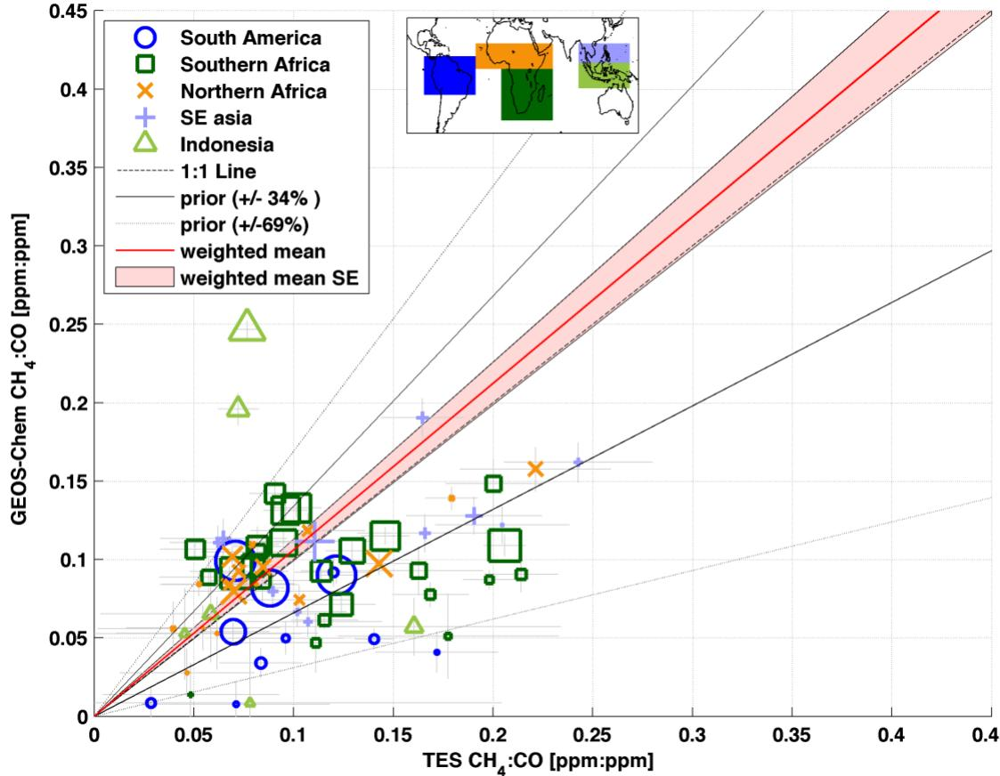
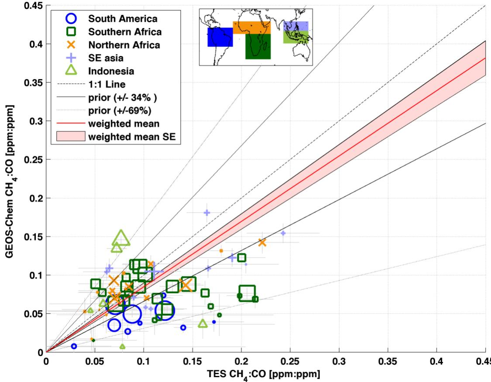
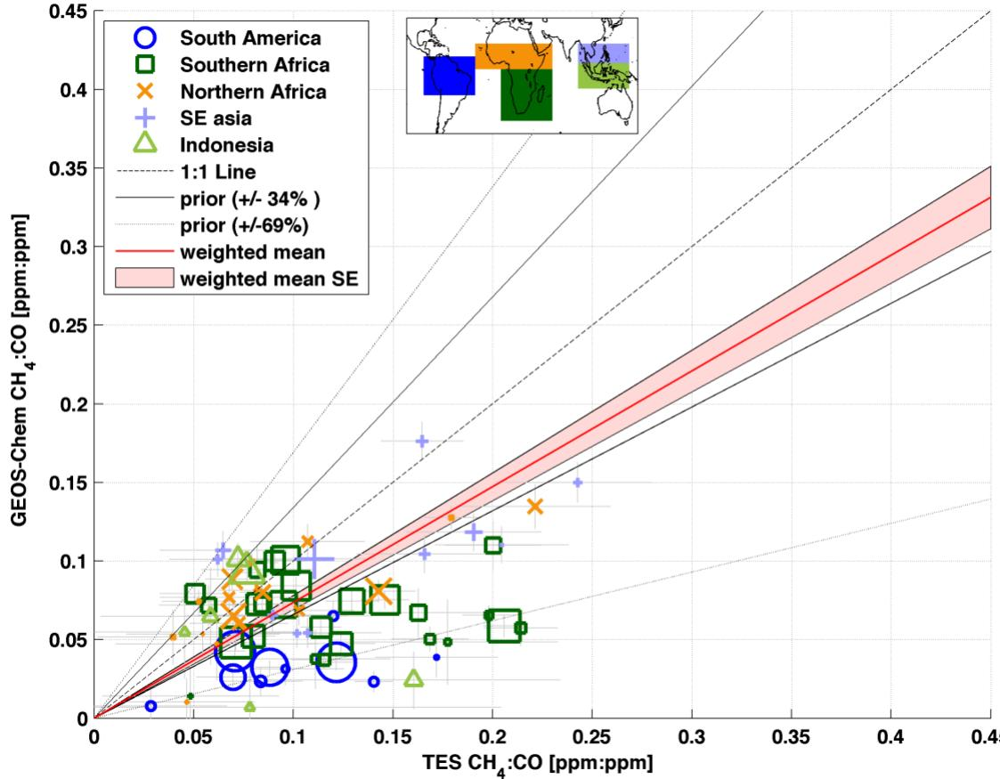
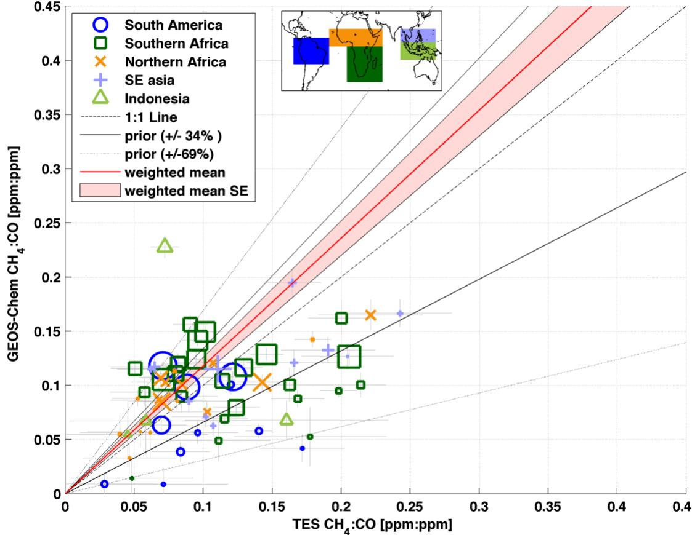
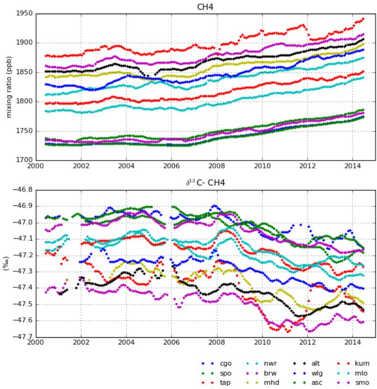
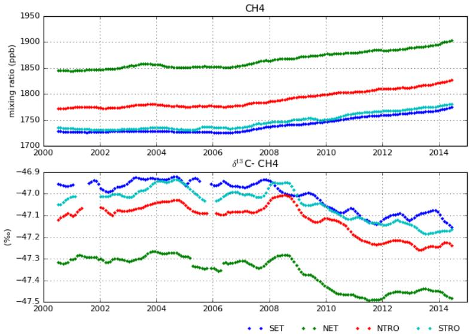

  
2006-2010 fire region $\mathsf { c h } _ { \mathsf { 4 } }$ :CO (CO cutoff $\mathbf { \beta = 8 0 }$ ppb) $+34 \%$ fires   
Supplementary Figure 1: Comparison Of $\mathrm { C H } _ { 4 } / \mathrm { C O }$ ratios from the GEOS-Chem model and Aura TES data. This figure is the same format as in Figure 6 but the $\mathrm { C H } _ { 4 } / \mathrm { C O }$ ratios in the model have been changed by $34 \%$

  
2006-2010 fire region $\mathsf { c h } _ { \mathsf { 4 } }$ :CO (CO cutoff $\mathbf { \beta = 8 0 }$ ppb) $-34 \%$ fires

Supplementary Figure 2: Comparison Of $\mathrm { C H } _ { 4 } / \mathrm { C O }$ ratios from the GEOS-Chem model and Aura TES data. This figure is the same format as in Figure 6 but the $\mathrm { C H } _ { 4 } / \mathrm { C O }$ ratios in the model have been changed by $- 3 4 \%$ .

  
2006-2010 fire region $\mathsf { c h } _ { \mathsf { 4 } }$ :CO (CO cutoff $\mathbf { \beta = 8 0 }$ ppb) $69 \%$ fires   
Supplementary Figure 3: Comparison Of $\mathrm { C H } _ { 4 } / \mathrm { C O }$ ratios from the GEOS-Chem model and Aura TES data. This figure is the same format as in Figure 6 but the $\mathrm { C H _ { 4 } / C O }$ ratios in the model have been changed by $- 6 9 \%$ .

  
2006-2010 fire region $\mathsf { c h } _ { \mathsf { 4 } }$ :CO (CO cutoff $\mathbf { \beta = 8 0 }$ ppb) $+69 \%$ fires

Supplementary Figure 4: Comparison Of $\mathrm { C H } _ { 4 } / \mathrm { C O }$ ratios from the GEOS-Chem model and Aura TES data. This figure is the same format as in Figure 6 but the $\mathrm { C H } _ { 4 } / \mathrm { C O }$ ratios in the model have been changed by $+ 6 9 \%$ .

  
Supplementary Figure 5: $\mathrm { C H } _ { 4 }$ and $\delta ^ { 1 3 } \mathrm { C - C H } _ { 4 }$ measurements smoothed using a 12-month running mean. (Panel a) $\mathrm { C H } _ { 4 }$ measurements for all stations used in this analysis. The different colors correspond to the data from the different stations used in this analysis. (Panel b) Similar to panel a but for the corresponding $\delta ^ { 1 3 } \mathrm { C - C H } _ { 4 }$ measurements. The different stations are Ascension island (asc), Tae-ahn (tap), Cape Grim (cgo), Niwot Ridge (nwr), Cape Kumukahi (kum), Barrow (brw), Mauna Loa (mlo), Mace Head (mhd), Tutuila (smo), Alert (alt), the South Pole (spo), and Mt. Waliguan (wlg).

Supplementary Figure 6: Zonal means of the measurements shown in Figure 11. (Panel a) Zonal means of $\mathrm { C H } _ { 4 }$ . (Panel b) Zonal means of $\delta ^ { 1 3 } \mathrm { C - C H } _ { 4 }$ . NET (Northern Extra Tropics: $3 0 \mathrm { N }$ to $9 0 \mathrm { N }$ ), NTRO (Northern Tropics: 0 to $3 0 \mathrm { N }$ ), STRO (Southern Tropics: $3 0 \mathrm { S }$ to 0), SET (Southern Extra Tropics: 90 S to 30 S)

Supplementary Table 1: Assessment of the optimal starting year for the flux inversion time window. The goodness of fit is measured by the RMSD between $\mathrm { C H } _ { 4 }$ mole fractions measurements and optimized box model simulations for starting years varying between 2005 and 2008. The corresponding strength of the optimized methane emission perturbation is also given.

<table><tr><td rowspan=1 colspan=1>Years of perturbation</td><td rowspan=1 colspan=1>RMSD (ppb)</td><td rowspan=1 colspan=1>Strength of emissionperturbation(TgCH4/yr)</td></tr><tr><td rowspan=1 colspan=1>2005</td><td rowspan=1 colspan=1>5.0</td><td rowspan=1 colspan=1>18.32</td></tr><tr><td rowspan=1 colspan=1>2007</td><td rowspan=1 colspan=1>1.7</td><td rowspan=1 colspan=1>24.7</td></tr><tr><td rowspan=1 colspan=1>2006</td><td rowspan=1 colspan=1>2.8</td><td rowspan=1 colspan=1>21.2</td></tr><tr><td rowspan=1 colspan=1>2008</td><td rowspan=1 colspan=1>4.0</td><td rowspan=1 colspan=1>28.4</td></tr></table>