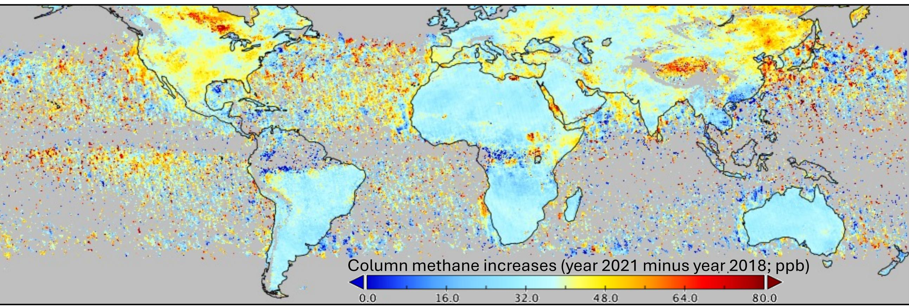
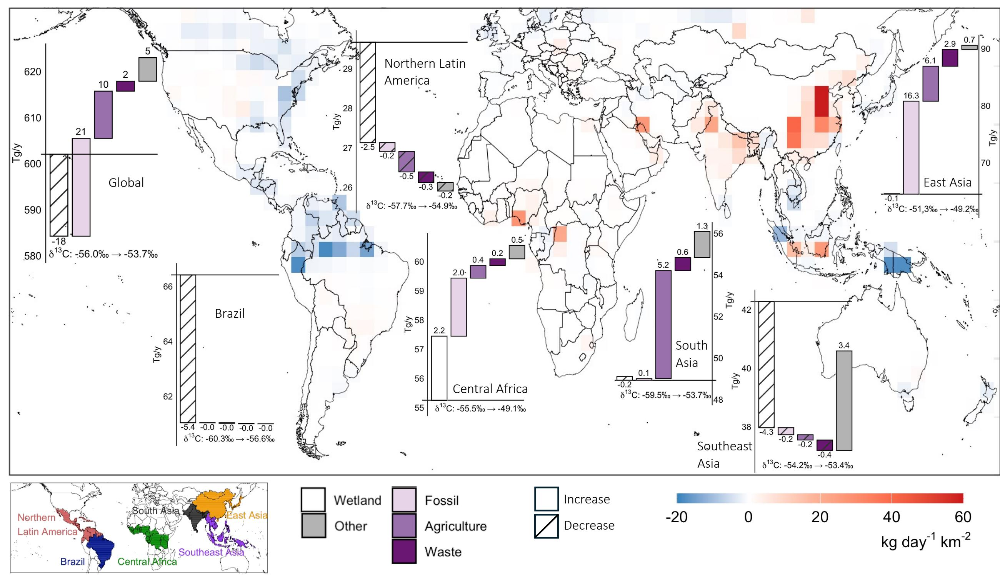
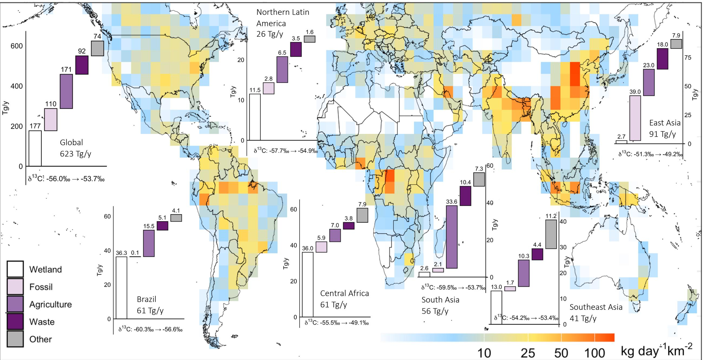
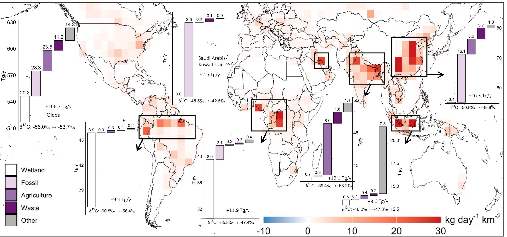

# Article in Press

# Incorporating methane isotopologues alters tropical and subtropical methane emission estimates

# Xueying Yu,JosepG.Canadel,Daven K.Henze,Prabir K.Patra,Marielle Sunois, Xiaoyu Cen, Xin Lan, Ben Riddell-Young,Thomas Rockmann & Robert B.Jackson

We are providing an unedited version of this manuscript to give early access to its findings. Before final publication,the manuscript will undergo further editing. Please note there may be errors present which affect the content,and all legal disclaimers apply.

If this paper is publishing under a Transparent Peer Review model then Peer Review reports will publish with the final article.

# Incorporating Methane Isotopologues Alters Tropical and Subtropical Methane Emission Estimates

Xueying $\mathrm { Y u } ^ { 1 , 2 ^ { * } }$ ; Josep G. Canadell’; Daven K. Henze4; Prabir K. Patra5.6; Marielle Saunois7; Xiaoyu $\mathrm { C e n } ^ { 1 , 8 }$ ; Xin Lan9,10; Ben Riddell-Young9,10; Thomas Rockmann1; Robert B. Jackson1,12

lDepartment of Earth System Science, Stanford University, Stanford, California 94305, USA   
²Atmospheric Sciences Research Center,the State University ofNew York at Albany,Albany, New York 1222, USA   
3CSIRO Environment, Canberra, Australia   
4Department of Mechanical Engineering, University of Colorado,Boulder, Colorado 80309, USA   
5Research Institute for Humanity and Nature (RIHN), Kyoto, 603-8047, Japan   
Research Institute for Global Change,JAMSTEC, Kanagawa, 236-0001, Japan   
7Laboratoire des Sciences du Climat et de IEnvironnement,LSCE-IPSL (CEA-CNRS-UVSQ), Université Paris-Saclay   
91191 Gif-sur-Yvette, France   
8Pioneer Center Land-CRAFT, Department of Agroecology, Aarhus University, 8000 Aarhus C, Denmark   
9Cooperative Institute for Research in Environmental Sciences, University of Colorado Boulder, CO, USA   
10NOAA Global Monitoring Laboratory, Boulder, Colorado 80305, USA   
lInstitute for Marine and Atmospheric Research Utrecht, Utrecht University,Utrecht 3584CC, Netherlands   
12Woods Institute for the Environment and Precourt Institute for Energy,Stanford, California 94305, USA

\*Correspondence to: xyu2@albany.edu

# Abstract

Annual increases in atmospheric methane have reached record highs over the past five years, yet the underlying processes and regional sources remain uncertain. Here we quantify the average 2019-2021 global methane budget averaging using Bayesian 4D-Var inversions that assimilate satelite methane retrievals and in-situ $\delta ^ { 1 3 } \mathrm { C - C H } 4$ and SD-CH4 measurements. The methane-isotopic inversion yields total emissions of 623[ $5 8 5 { - } 6 4 3 ] \mathrm { T g / y }$ , slightly higher than the methane-only inversion. Incorporating isotopic constraints leads to a redistribution of emissions in tropical and subtropical regions. Compared with the methane-only inversion, the methane-isotopic inversion indicates that emission estimates increase by 26 [-3-27] Tg/y in East Asia (primarily China),7[-1-8] Tg/y in South Asia (primarily India), and 5 [-3-10] Tg/y in central Africa, while decreasing by 5 [-6-7] $\mathrm { T g / y }$ in Amazon Basin and 12 [-14-20] Tg/y elsewhere. This points to a stronger anthropogenic contribution to the post-20l9 methane budget, including higher fossil emissions in China and slightly less wetland emissions in the Amazon Basin.The methane-isotopic inversion also alters inferred emission seasonality,showing less seasonality in China compared with the methane-only inversion, weaker coal-mine phase-out signals,and a delayed summer peak in Southeast Asia, pointing to sources missing from current inventories.

# Introduction

Methane (CH4), as a major component of natural gas, is often referred to as a "bridge fuel" in the transition from fossil-based to renewable energy systems. However, as a potent greenhouse gas, methane is responsible for ${ \sim } 3 0 \%$ of the global temperature increase since the Industrial era1. Reducing methane emissions can efectively influence climate on a decadal time-scale due to its strong global warming potential (83 times that of carbon dioxide over 20 years)and its relatively short lifetime (12 years)1. Despite the urgency to mitigate climate risks associated with methane, current estimates of the contemporary global methane budget retain persistent uncertainties in characterizing methane sources and sinks accurately. For example, the uncertainty range in the global emission estimates (669 [512- 849] $\mathrm { T g / y ) }$ from the 2010-2019 Global Methane Budget $( \mathrm { G M B } ) ^ { 2 }$ bottom-up statistics/models is 337 $\mathrm { T g / y , }$ equivalent to ${ \sim } 5 0 \%$ of the ensemble mean, and most of the GMB model estimates lack the ability to represent variations in methane isotopologues (e.g., $\delta ^ { 1 3 } \mathrm { C - C H } _ { 4 } ) \dot { { \cdot } }$

The urgency of addressing these knowledge gaps is underscored by the recent acceleration in atmospheric methane concentration growth. The growth rate of atmospheric methane doubled in 2020- 2022 (15-18 ppb/year; Figure 1 and Supplementary Fig. S1) compared to the 2010s (averaged 8 ppb/y), but returned to $8 { \mathrm { - } } 9 \ \mathrm { p p b / y }$ annual increase rate after $2 0 2 3 ^ { 4 }$ . Previous studies hold contrasting views on the causes of this 2020-2022 surge. Proposed contributing factors include a decline in the methane sink driven by reductions in OH concentrations (associated with NOx- and/or VOC-driven chemistry, possibly related to emission changes during the COVID lockdowns), climate-emission feedbacks such as biogenic emissions that are enhanced by monsoon rainfall, and tropical wetland emissions that are intensified by global warming5-10. However, it is unclear whether the methane budgets building on the above perspectives are consistent with evidence from methane isotopologues. We thus are unable to predict whether this accelerated methane growth rate will continue or recur—in part due to insufficient understanding of the relative contributions from natural and anthropogenic sources, and their geographic emission distributions3,5-8.

Isotopic measurements are powerful tools for identifying and distinguishing the underlying mechanisms of methane production and emissons. Specifically, methane isotopologues provide key constraints for differentiating biological (microbial), thermogenic,and pyrogenic sources. Despite some overlaps, each of these source categories has relatively distinct isotopic signatures reflecting their formation processes (Supplementary Table S1). Biogenic methane, produced mainly through microbial fermentation and $\mathrm { C O } _ { 2 }$ reduction under anaerobic conditions, has lower values in $\delta ^ { 1 3 } \mathrm { C }$ and SD due to strong kinetic isotope effects during methanogenesis preferring the lighter isotopologues in the substrate molecules. Thermogenic methane, formed by the thermal cracking of organic matter at high temperatures and pressures, and pyrogenic methane, generated during high-temperature biomass combustion, are more enriched (heavier) in $^ { 1 3 } \mathrm { C }$ and D. Therelated processes involve much smaller isotopic fractionation than microbial methanogenesis, and the heavier isotopologues are thus not preferentially excluded during formation. As a result, emissions from wastewater or livestock have lower $\delta ^ { 1 3 } \mathrm { C - C H } 4$ than emissions from biomass burning or fossil fuel production³, while the spatial pattern of SD $\mathrm { C H } _ { 4 }$ source signature has a close relationship with hydrology processes11,12. Simultaneously, $^ { 1 3 } \mathrm { C H } _ { 4 }$ and ${ } ^ { 1 2 } \mathrm { C H } _ { 3 } \mathrm { D }$ last longer on average in the atmosphere compared to $^ { 1 2 } \mathrm { C H } _ { 4 }$ , due to smaller reaction rate constants (oxidation by OH, Cl, and $\mathrm { O ^ { 1 } D }$ ).

The methane increases during 2006-2016 are accompanied by a $0 . 2 \mathrm { - } 0 . 3 \mathrm { ‰ }$ decrease in $\delta ^ { 1 3 } \mathrm { C - C H } 4 ^ { 4 } ,$ 13. Studies14-17 consistently identify tropic/subtropic regions and economic-emerging countries as the main areas of emisson growth, including China, US, India, central Africa, and the Middle East. However, these studies attribute the emission increases differently across sectors, such as tropical wetlands, waste, agriculture, and fossil fuels. This $0 . 2 \mathrm { - } 0 . 3 \mathrm { ‰ }$ decrease in $\delta ^ { 1 3 } \mathrm { C - C H } 4$ has been used as evidence of a growing contribution from microbial sources, such as agriculture, wastewater, and wetlands, over the past two decades3,18. However, other $\ S ^ { 1 3 } \mathrm { C }$ CH4 based studies19-21 suggest that fossil fuel still contributes to approximately half of emission increases through 2016, possibly driven by coal mining emissions rising sharply since 2007,and attribute the observed decrease in $\delta ^ { 1 3 } \mathrm { C - C H } _ { 4 }$ to decreases in biomass burning emissions22. In addition, model studies of $\delta ^ { 1 3 } \mathrm { C - C H } 4$ rule out significant decreases in OH concentrations as the main reason for the post-2O16 methane increases, in contrast to climate-chemistry model23 and box model analyses24,25 that identify OH variability as one ofthe major contributors. Recent studies21,26 also highlight the substantial sensitivityof total budget estimates touncertainties in isotopic fractionation efects, such as the role of methane loss to Cl oxidation. More recently, during 2016-2021, $\delta ^ { 1 3 } \mathrm { C - C H } 4$ continued to decrease by an additional $0 . 1 { - } 0 . 2 \text{ } \textmu _ { 0 } \textmd { l } ^ { 3 }$ ,offering valuable insights into the sharp rise in methane concentrations observed after 2019.

Here, we reconcile the above disparate findings through joint inversions of satelite methane and in-situ isotopic observations. Measurements of methane isotopologues provide valuable information on emission sector attributions, but are sparse and have large spatial or temporal observational gaps. Satellite methane column data ofer near-global coverage and frequent revisit times. Combining satelite and isotopic measurements thus offers a unique approach to improve total emissions estimates spatially and temporally27,28. Recent advances in inversion techniques have made the joint analysis of satellite data and isotopic data more feasible. For example, researchers have coupled analytical inversions with box models or chemical transport models, albeit at coarse regional scales, to investigate long-term methane emission trends,and applied variational inversions to beter account for the spatial gradients in ${ \delta ^ { 1 3 } \mathrm { C - C H } 4 ^ { 1 9 - 2 1 , 2 9 , 3 0 } }$ . We combine $0 1 / 2 0 1 8 – 0 6 / 2 0 2 2$ satellite methane total column observations from the TROPOspheric Monitoring Instrument (TROPOMI; version 02.04.00) with in-situ $\delta ^ { 1 3 } \mathrm { C - C H } 4$ and δD-$\mathrm { C H } _ { 4 }$ observations from National Oceanic and Atmospheric Administration (NOAA)/ Institute of Arctic and Alpine Research (INSTAAR), to quantify the global methane budgets. This study addresses a key question: What information can isotopologues ( $\mathrm { 8 ^ { 1 3 } C - C H 4 }$ and SD-CH4) bring to improve the estimates of methane emission magnitude and distributions post-2019?

# Results and discussion

# Do more tracers improve emission estimates?

We integrate space-borne observations of methane with ground-based measurements of methane isotopologues ( $\mathrm { 8 ^ { 1 3 } C - C H 4 }$ and SD-CH4) within a suite of inverse analyses. We apply the GEOS-Chem adjoint model in a 4D-Var inverse system, to simultaneously optimize methane total emissions and its isotopic ( $\mathrm { 8 ^ { 1 3 } C - C H 4 }$ and SD-CH4) source signatures from total emissions on a grid level $( 4 ^ { \circ } { \times } 5 ^ { \circ } )$ . To further constrain fossil fuel emissions, we also incorporate ethane $\mathrm { ( C _ { 2 } H _ { 6 } ) }$ observations and optimize ethane-to-methane emission ratios,leveraging the fact that ethane is co-emitted with methane primarily from fossil sources. The inversions are based on a set of partial differential equations to solve the joint probability distributions of methane total emisions and sinks, isotopic source signatures,and ethane-to-methane emission ratios (see Supplementary Table S1, Supplementary Fig. S2, and Methods). In addition to a fullinversion that incorporates al tracers, we perform a series of sensitivity inversions to evaluate the contribution of each observational constraint. These include (see Table 1): A1 (methane only), B1 (methane $+ \delta ^ { 1 3 } \mathrm { C - C H } 4$ ), C1 (methane $^ +$ SD-CH4), D1 (methane $^ +$ ethane), E1 (methane $+ \delta ^ { 1 3 } \mathrm { C } .$

$\mathrm { C H } _ { 4 } + \delta \mathrm { D } { \cdot } \mathrm { C H } _ { 4 } )$ , and F1 (methane $+ \delta ^ { 1 3 } \mathrm { C - C H } _ { 4 } + \delta \mathrm { D - C H } _ { 4 } +$ ethane), all using fixed OH fields derived from full-chemistry model simulations. We extend these configurations by optimizing OH: cases A2-F2 simultaneously optimizing multi-year averaged OH, and cases E3-F3 optimizing annually OH concentrations,on a grid basis.The optimized OH fields closely match prior estimates from fullchemistry simulations, which have been shown to agree well with aircraft measurements of atmospheric background OH and $\mathrm { C O } ^ { 5 }$ . The inversion results are generally comparable across these three treatments of OH cases,and the primary diferences in these solutions are driven by the choice of assimilated tracers.

Assimilating $\delta ^ { 1 3 } \mathrm { C }$ -CH4 and SD-CH4 can improve inversion results. The inverse system developed here can simultaneously improve simulations of multiple tracers, including methane, $\delta ^ { 1 3 } \mathrm { C - C H } 4$ , δD-CH4, and ethane (Supplementary Fig. S3-S8). We further evaluate the inversion results by comparing with methane observations from a global collction of in-situ methane measurements (ObsPack), independent from the assimilated data. All inversions yield ${ < } 1 5$ ppb model biases, much lower than the $- 8 9 \mathrm { p p b }$ prior bias. Including one additional tracer (B1-B2, $\delta ^ { 1 3 } \mathrm { C - C H } 4$ ; C1-C2, δD-CH4; D1-D2, ethane; see Table 1) results in similar performance as the methane-only inversion $( \mathsf { A l - A } 2 )$ , yielding to 8-15 ppb model biases. When including both $\delta ^ { 1 3 } \mathrm { C - C H } _ { 4 }$ and SD-CH4 (E1-E3), the inversion yields the best performance $( 0 { - } 2 \mathsf { p p b }$ bias, see Supplementary Fig. S3). However, inversions F1-F3, which further include ethane, show reduced performance (up to -12 ppb mean bias) compared to E1-E3.

Ethane and methane are co-emitted from oil and gas production, and ethane is commonly used as a secondary tracer to constrain methane emissons from this sector. However, as highlighted by a previous study3l, uncertainties in the ethane:methane emission ratio and its spatial and interannual variability limit the effectiveness of using ethane to infer methane emissions. Moreover, the coarse model resolution $( { \sim } 4 0 0 \mathrm { k m } )$ in this study is not well suited for capturing localized emission processes, such as plumes from individual oil and gas facilities.This spatial mismatch may reduce the added value of assimilating ethane in a global framework.

Thus, considering the evaluation against the independent dataset, ObsPack, we refer to the ensemble mean of inversions E1-E3 (assimilate methane, $\delta ^ { 1 3 } \mathrm { C - C H } 4$ ,and $\delta \mathrm { D - C H } _ { 4 }$ , with fixed OH or optimized OH; hereafter referred to as the methane-isotopic joint inversion) as the base case, with uncertainties derived from the fullrange of all inversions (Table 1). These base inversions E1-E3 reduce root-mean-square-error by $70 \% - 7 1 \%$ for methane (TROPOMI), $5 7 \% { - } 5 8 \%$ for $\delta ^ { 1 3 } \mathrm { C - C H } _ { 4 }$ ,and $2 8 \%$ for $\delta \mathrm { D - C H } _ { 4 }$ ， relative to the assimilated observations.E1-E3 also reduce the model simulation mean bias by $8 8 \%-$ $91 \%$ compared to the assimilated methane data and more than $9 8 \%$ compared to independent evaluation data (ObsPack). Considering that the abundance of $\delta ^ { 1 3 } \mathrm { C - C H } _ { 4 }$ and $\delta \mathrm { D - C H } _ { 4 }$ is low and the effect of isotopic fractionation is modest but cumulative, isotopic ratios equilibrate more slowly than total methane. Coupled with the sparse coverage of isotopic measurements, interannual variability in sectoral emissions is likely less well constrained than multi-year averages. Thus, we focus on the average methane budget across 2019-2021. Given the sparsity of SD-CH4 measurements, we construct a multi-year average (post-2O04) diurnal climatology by averaging the available measurements, and analyze the multi-year averaged isotopic signatures. We analyze the $\delta ^ { 1 3 } \mathrm { C - C H } 4$ source signature for 2019, given the more complete observational data available that year.

The selected methane-isotopic joint inversions (E1-E3, assimilate methane, $\delta ^ { 1 3 } \mathrm { C - C H } 4$ , and δD-CH4) improve the global methane budget estimates in three ways, they:

1） Address part of the biases in the global total emission and sink estimates. Isotopologues $\mathrm { ( ^ { 1 3 } C H _ { 4 } }$ ， CH3D) differ from $^ { 1 2 } \mathrm { C H } _ { 4 }$ as a result of their characteristic emission source signatures and kinetic isotope effects. The joint inversions leverage these constraints to solve the joint probability distributions of sources and sinks. This results in a small increase in global emission $( 3 \% , + 2 1 \ \mathrm { T g / y } ;$ discussed later) and in global sink $( 1 . 4 \% , 7 . 8 \mathrm { T g / y ) }$ estimates, leading to a net increase in the inferred global source-sink discrepancy. The methane-only inversions reproduce TROPOMI column methane well but exhibit a $^ { - 9 }$ to $- 1 0 \mathrm { p p b }$ bias compared with ObsPack, likely due to retrieval biases or representativeness differences. By incorporating isotopic in-situ measurements, the inversions gain an additional, independent dimension of information that helps reconcile the inconsistencies between satelite and surface observations. After assimilating isotopic data, the posterior simulations show a much smaller bias (within 2 ppb) relative to ObsPack.

2) Improve estimates of emission spatial distributions and temporal variation. As discussed earlier, isotopic measurements are sparse in space and time, but this limit is partially offset by the near global coverage of satellite observations. The 4D-Var inversion integrates these diverse data while accounting for realistic atmospheric transport, enabling a more consistent reconstruction of source distributions,thus improving both the spatial and temporal variability of inferred methane emission estimates. As we show in later sections, these improvements play a central role in resolving emission redistributions across the tropical and subtropical regions, where observational gaps and prior inventory biases are pronounced. 1

3） Improve source attribution to sectors. The inversions optimize emission-weighted isotopic signatures of total emissions, which can blend real sectoral shifts with prior source signature biases and model transport errors. To disentangle these effects, we further refine the inverse solution into sector level through a new approach. This refined approach identifies the optimal solution by iteratively adjusting inventory-based sector fractions to maximize consistency with the optimized source signatures, while preserving grid-level total emissions from the 4D-Var solution (see Methods). This approach isolates what sectoral emission fractions would need to change to be consistent with the isotopic signals and the optimized total emissions. The refined emission corrctions have lower spatial correlations across sectors, indicating improved separation among fossil, livestock, waste, and other anthropogenic emissions (Supplementary Fig. S9).

The optimized 2019-2021 global methane budget that is consistent with satellite and isotopic observations

The optimized global methane budget for 2019-2021 from the methane-isotopic joint inversions includes total emissions of 623 [585-643] Tg/y and sinks of 572 [533-590] Tg/y (accounting for both atmospheric oxidation and soil uptake). The inferred emissions exceed prior bottom-up inventory estimates $( 5 1 7 \mathrm { T g / y ) }$ by 106 [68-126] Tg/y, and exceed the methane-only inversion estimates (602 $\mathrm { T g / y ) }$ by $2 1 \mathrm { T g / y }$ . They also exceed non-isotopic inversions from a previous study of 2020-2021 (587- $5 9 2 \mathrm { T g } / \mathrm { y } ) ^ { 3 2 }$ , but lies between the bottom-up inventories (669 [512-849] Tg/y) and top-down (575 [553- $5 8 6 ] \mathrm { T g / y ) }$ model ensembles from the Global Carbon Project's (GCP) 2010-2019 emission estimates.

Attributing emissions to individual sectors reveals contributions of 110 [87-112] Tg/y from fossil fuels, 137 [131-140] $\mathrm { T g / y }$ fromlivestock, 92 [88-94] Tg/y from wastewater and landfills,34 [27-34] Tg/y from rice cultivation, and 30 [28-31] Tg/y from other anthropogenic sources (such as industrial combustion). Natural emissions account for an additional 177[171-206] Tg/y from wetlands (including freshwater) and 43 [37-46] $\mathrm { T g / y }$ from other natural sources, as summarized in Supplementary Fig. S10.

Compared with the methane-only inversion, the methane-isotopic joint estimates show the largest upward emission revision in the sector of fossil fuel $( + 2 1 \mathrm { T g / y ) }$ , followed by rice cultivation $( + 6 \operatorname { T g } / \operatorname { y } )$ ， natural sources other than wetlands $( + 5 \operatorname { T g } / \operatorname { y } )$ , livestock $( + 4 \mathrm { T g / y ) }$ , waste $( + 2 \operatorname { T g } / \operatorname { y } )$ , and other anthropogenic sources $( + 2 \operatorname { T g } / \operatorname { y } )$ . In contrast, wetland emissions are revised downward by $- 1 9 \mathrm { T g / y }$ For comparison, studies of pre-industrial $\delta ^ { 1 4 } \mathrm { C - C H } 4$ suggest that global anthropogenic fossil emissions are greatly underestimated in inventories, resulting at ${ > } 1 5 0 \mathrm { T g / y }$ fossil emissions and $2 \mathrm { T g } / \mathrm { y }$ seep emissions during $2 0 0 3 { - } 2 0 1 2 ^ { 3 3 }$ . Our 2019-2021 estimate of anthropogenic fossl sources (110 [87-112] $\mathrm { T g / y }$ is lower than this 2003-2012 estimate. However, both our results and this pre-industrial $\delta ^ { 1 4 } \mathrm { C - C H } 4$ study33 point to an underestimated role of anthropogenic fossil compared to the prior inventory $( 8 0 { - } 8 3 \mathrm { T g / y ) }$ ·

Consistent with sectoral emission attribution, the optimized global-averaged emission-weighted source signatures of $\delta ^ { 1 3 } \mathrm { C - C H } _ { 4 }$ and $\delta \mathrm { D - C H } _ { 4 }$ are heavier than their prior estimates. The global-mean emission-weighted source signature of $\delta ^ { 1 3 } \mathrm { C - C H } 4$ is $- 5 3 . 7 4 \text{‰}$ in 2019,heavier than the prior estimate of $- 5 5 . 9 6 \text{‰}$ ， though still lighter than $- 5 2 . 5 \text{‰}$ , the 2012-2014 top-down estimates from a previous study20. Similarly, the global-mean emission-weighted source signature of SD-CH4 during 2019-2021 is $- 2 6 1 . 2 7 \text{‰}$ ,also heavier than the prior estimates of $- 2 8 8 . 6 0 \text{‰}$ . The methane-isotopic joint inversions require a heavier global source signature to match atmospheric ${ 8 ^ { 1 3 } \mathrm { C - } } \mathrm { C H } _ { 4 }$ and SD-CH4 measurements, resulting in a higher contribution of fosil emissions to the total methane budget than prior inventories and methane-only inversions suggest. The optimized $\delta ^ { 1 3 } \mathrm { C - C H } _ { 4 }$ source signatures (Supplementary Fig. S11) exhibit globally heavier values relative to the prior, yet reveal lighter regional features, particularly in northern China and Russa, suggesting enhanced biogenic emissions or revised source mixing in those regions. In contrast, the optimized $\delta \mathrm { D - C H } _ { 4 }$ signatures (Supplementary Fig. S12) highlight several previously underrepresented regions with anomalously heavy source signatures: the US Upper Midwest (near the Great Lakes), eastern China (near Shanghai and Beijing), the maritime region spanning Malaysia, Indonesia, and Papua New Guinea, and northern India. These spatial anomalies indicate potential unidentified or underestimated isotopically enriched methane sources, warranting further investigation into regional fossil fuel production, biomass combustion, or geologic emissons not captured in current inventories.

Since 2007, the global-mean atmospheric $\delta ^ { 1 3 } \mathrm { C - C H } _ { 4 }$ has shown a decreasing trend (heavier). This trend has ben widely interpreted as evidence that microbial sources have played a dominant role in the post-2007 methane increase, in contrast to the pre-20o6 period,or potential changes in isotopic fractionation by sinks34. A recent work35 also attributes the early-2020 methane surge to enhanced microbial emissions and a reduction in OH. Our optimized source signatures (and the inferred larger role of fossil sources) are not in conflict with this long-term atmospheric trend. Rather than reflecting changes relative to the previous decade, our results quantify deviations from prior inventory-based estimates for the same period (i.e., 2019-2021). This does not preclude a long-term increase in light-isotope emissions; instead, it points to a gap that the emission sector fractions in current inventories cannot reproduce the observed isotopic composition in atmospheric measurements.

Constraints from $\delta ^ { I 3 } C$ CH4 and SD-CH4 redistribute methane emissions in tropical and subtropical areas: reduced wetland emissions in Amazon and enhanced fossl emissions in China

Even though assimilating $\delta ^ { 1 3 } \mathrm { C - C H } _ { 4 }$ and $\delta \mathrm { D - C H } _ { 4 }$ only slightly increases the global methane emission estimate by $3 \%$ compared to the methane-only inversion, the integrated approach suggests important emission spatial redistributions, particularly in tropical and subtropical regions. These regions have been dentified as major contributors to the recent acceleration in methane concentration increases2.

Compared with the methane-only inversion, incorporating isotopic constraints leads to reduced wetland emissions in the Amazon Basin and northern Latin America and enhanced anthropogenic emissions in Asia and Central Africa.

The regions where emissions have the largest upward revisions after we assimilate $\delta ^ { 1 3 } \mathrm { C - C H } _ { 4 }$ and δD-CH4 are East Asia (primarily China, regions defined in Supplementary Fig. S13; $+ 2 6 \mathrm { T g / y }$ , see Figure 2 and Table 2), followed by South Asia (primarily India; $+ 7 \mathrm { T g / y }$ , and Central Africa (notably Nigeria and the Democratic Republic of the Congo; $+ 5 \mathrm { T g / y }$ , compared with the methane-only inversion. The inversions suggest more enriched (heavier) isotopic source signatures for the total emissions than prior estimates in these regions: the increases in $\delta ^ { 1 3 } \mathrm { C - C H } 4$ and $\delta \mathrm { D - C H } _ { 4 }$ source signatures for total emissions are $+ 2 \text{‰}$ and $+45 \text{‰}$ in East Asia, $+ 6 \text{‰}$ and $+ 3 4 \text{‰}$ in South Asia, and $+ 6 \text{‰}$ and $+ 3 9 \text{‰}$ in Central Africa, respectively. However, these emission enhancements are attributed to diferent source sectors. In East Asia, fossil fuel contributes an estimated $62 \%$ $( + 1 6 \mathrm { T g / y ) }$ of the increases in emission magnitude, particularly in the North China Plain, up to $+ 9 0 \mathrm { k g } / \mathrm { d a y } / \mathrm { k m } ^ { 2 }$ , and the Southwestern China (Yunnan-Guizhou-Sichuan). However, some northern China regions exhibit lighter $\delta ^ { 1 3 } \mathrm { C - C H } 4$ source signatures, reflecting potential increases in both biogenic and fossl fuel emissions, with revised source sectoral mixing. In South Asia, agriculture is the major contributor, explaining $74 \%$ $( + 5 \operatorname { T g } / \operatorname { y } )$ of the emission revisions, mainly in the northern India. While in Central Africa, the emission revisions are $42 \%$ from wetlands, $3 8 \%$ from fossil, and $21 \%$ from other sources.

Conversely, emissions over Brazil ( $( - 5 \mathrm { T g } / \mathrm { y } ,$ Figure 2 and Table 2), northern Latin America $\left( - 4 \mathrm { T g / y } \right)$ ， Southeast Asia $( - 2 \operatorname { T g } / \operatorname { y } )$ , and the rest of the word $\left( - 8 \mathrm { T g / y } \right)$ , decrease when isotopic constraints are added. Wetlands account for most of the downward emission revisions, explaining nearly all of the -5 $\mathrm { T g / y }$ emission revisions in Brazil and $6 8 \% ( - 2 . 5 \mathrm { T g / y ) }$ in northern Latin America. The $- 5 \mathrm { T g / y }$ emission revision in Brazil is equivalent as $3 \%$ of the total wetland emissions over the Amazon Basin. In Southeast Asia, the emission revisions are a combined effect of natural emissions, $- 4 . 3 \mathrm { T g / y }$ downward revision from wetlands, offset by $3 . 4 \mathrm { T g / y }$ upward revision from other natural sources. The spatial patterns of these emission revisions are also mixed, showing upward revisions over southern Sumatra and Indonesia-Kalimantan, and downward revisions in northern Sumatra and Papua New Guinea. This suggests potential changes in wetland and freshwater distributions or substantial spatial biases in current wetland inventories.

In tropical and subtropical regions, satelite-based methane observations (e.g., from TROPOMl and Greenhouse Gases Observing Satelite (GOSAT)) are often limited by persistent cloud cover and high humidity, leading to data gaps (Figure 1). As a result, satelite-informed inversions tend to scale up emissons across large areas to reconcile with the background methane from limited observations, making the inferred emisions highly sensitive to the magnitude of OH, which itself carries substantial spatial and temporal uncertainty. Assimilating isotopic measurements ( $\mathrm { 8 ^ { 1 3 } C }$ -CH4 and SD-CH4) adds a valuable layer of constraint by distinguishing between biogenic, thermogenic,and pyrogenic sources. This additional information helps to refine source atribution and thus improves the spatial accuracy of emission estimates. In future studies, enhanced satelite coverage in the tropics and improved OH estimates should further reduce remaining uncertaintis.

Combining allthe emission corrections as discussed above after implementing isotopic constraints, we present the optimized methane budgets for tropical and subtropical regions in Figure 3 and Table 2, and summarize these budgets as follows.

1） In East Asia, the optimized emissions total $9 1 \mathrm { T g / y }$ , with the largest contribution from fossil sources $( 3 9 \mathrm { T g } / \mathrm { y } )$ . It is the region where the inversions led to the greatest estimated emission increase, with prior inventories underestimating emissions by $2 6 \mathrm { T g / y }$ and $1 6 \mathrm { T g / y }$ of this underestimation is from fossil (Figure 4).   
2）In South Asia,the optimized total emission is ${ 5 6 } \mathrm { T g / y }$ , more than half of which is from agriculture $( 3 3 \mathrm { T g } / \mathrm { y } )$ . Agriculture emissions are also underestimated in the prior, by an estimated $8 \mathrm { T g / y }$ ,mainly in the northern India, Nepal, and Bangladesh (Figure 4). This is the region where agricultural emissions are most intensively underestimated globally.   
3) In Southeast Asia, the optimized emissions total $4 1 \mathrm { T g / y }$ comprising wetlands ( $( { 1 3 } \mathrm { T g / y } )$ , agriculture $( { 1 0 } \mathrm { T g } / \mathrm { y } )$ , and other sources $( 1 7 \mathrm { T g / y ) }$   
4) Central Africa has an optimized total emission of $6 1 \mathrm { T g / y }$ Wetland emissions in Congo rainforest are underestimated by around $9 \mathrm { T g / y }$ in the prior. Nigeria is another hotspot where emissions have been underestimated. While an earlier study36 atributes the rising methane levels in Nigeria primarily to rice cultivation, our results point instead to fossil sources as the dominant cause.   
5) For Brazil and Northern Latin America, the optimized emissions are $6 1 \mathrm { T g / y }$ and $2 6 \mathrm { T g / y }$ respectively, dominated by wetland and agricultural sources. Although assimilating isotopic data reduces posterior emissions relative to the methane-only inversions, prior inventories still underestimate emissions by $9 \mathrm { T g / y }$ in Brazil, mostly occurring from November to May, corresponding to the rainy season. This suggests that improving seasonal wetland extent estimates may be able to reduce the bottom-up emission biases.   
6) The inversions also identify a hotspot of underestimated fossil emissions in the Iraq-Kuwait-Iran region, accounting to $+ 2 \mathrm { T g / y }$ in total, compared with prior inventories (Figure 4). This aligns with earlier studies5,17 reporting increased fossil fuel activities in this region over the past dcade.

Methane isotopologues (813C-CH4 and SD-CH4) indicate altered seasonal cycle ofglobal and regional methane emissions

The seasonal cycle plays an important role in quantifying global and regional methane budgets. Emissions from wetlands, rice cultivation, manure, and wastewater respond to seasonal changes in temperature, precipitation, and inundation. Biomass burning adds further seasonal fluctuations. Atmospheric OH, the primary oxidant of methane, is photochemically produced and exhibits a pronounced seasonal pattern due to the availability of UV radiation. Recent studies37,38 have relied on the seasonal phase and amplitude of methane concentrations to infer interannual variabilities of methane emissions, sinks, and transport processes. Inaccurately representing seasonal emission cycles can bias annual methane estimates and distort our understanding of how methane responds to environmental and meteorological changes.

Asimilating isotopic measurements in addition to methane suggests greater emissions from November to May that are not captured by the methane-only inversions, particularly in northern China. As shown in Figure 5a, global atmospheric methane concentrations rise sharply from June to October and more gradually from November to May. When assimilating only methane mole fraction data, the inversion attributes a $5 5 \mathrm { T g }$ underestimate in prior global emissions for June-October and a $2 9 \mathrm { T g }$ underestimate for November-May. However, further assimilating $\delta ^ { 1 3 } \mathrm { C - C H } _ { 4 }$ and SD-CH4 data (Figure 5b) results in a more balanced distribution of the emission underestimates: $4 9 \mathrm { T g }$ from June to October and $5 8 \mathrm { T g }$ from November to May. Compared to methane-only inversions, this shift (as shown in Supplementary Fig. S14) is characterized by $- 3 \mathrm { T g }$ reduced emissions in the Amazon Basin during the dry season (June-October, $89 \%$ reduced emissions are from wetlands), and enhanced emissions during November to May in East Asia ( $1 8 \mathrm { T g }$ ； $5 5 \%$ from fossil fuel), South Asia $( + 8 \mathrm { T g } ; 5 7 \%$ from livestock),and central Africa $( + 6 \mathrm { T g }$ ； $6 6 \%$ from wetlands). The largest emission enhancement is over northern China. In comparison, a previous study39 identified decreasing coal-mining emissons with increased rice cultivation emissions in China from satellite observations,and atributed this shift to coal-mine phase-outs under recent energy policies. However,rice cultivation exhibits a pronounced seasonal cycle, whereas coal mining is relatively seasonally flat. Our methane-isotope joint inversion indicates that incorporating isotopic constraints yields a much flater seasonal emisson profile over China than the methane-only inversions, with a heavier-than-prior source signatures for both $\delta ^ { 1 3 } \mathrm { C - C H } 4$ and $\delta \mathrm { D } { - } \mathrm { C H } _ { 4 }$ , reflecting an underestimate of coal mining (or other fossil) emissions. This suggests a weaker coal-mine phase-outs signal in the methane-isotopic joint assimilation than would be inferred from the non-isotopic inversion. Nevertheless, consistent with previous study39, our inversions also identify an underestimated emission peak from October to December in southeast China and Bangladesh. This emission underestimate in China is attributed to rice. However, at the model resolution, rice and wetland emissions in Bangladesh cannot be reliably separated,and the resulting signal reflects combined biogenic emissions. Unlike the July-October rainfall-fed biogenic emissions identified in northern India by previous work', the emission peak in southeast China and Bangladesh occurs during dry season and is influenced by agricultural management practices40. This finding highlights the need for more detailed representations of anthropogenic carbon activities in Asian fast-developing countries to improve the accuracy of emission estimates. 人

Assimilating isotopic measurements in addition to methane also reveals a notable temporal shift in the seasonal emission peak. When only assimilating methane, global emissions peak in August at 1917 $\mathrm { G g / d } .$ ， $32 \%$ higher than the prior estimates $( 1 4 5 6 \mathrm { G g / d ) }$ . The methane-isotopic joint inversion indicates a lower August emission $\left( 1 7 3 8 [ 1 6 9 8 - 2 1 5 3 ] \mathrm { G g } / \mathrm { d } \right)$ and a delayed seasonal peak in September, with emissions rising to 1938 [1793-2093] $\mathrm { G g / d }$ (for comparison, $1 4 8 8 \mathrm { G g / d }$ in prior and $1 8 8 7 \mathrm { G g / d }$ in methane-only inversion). Previous studies coupling an ensemble of wetland inventories with atmospheric observations also pointed to an autumn emission peak, but occurs in boreal regions41. In our solution, the delayed peak reflects longer-lasting emissions from tropical wetlands (e.g., Central Africa), earlier rice harvesting cycles in South and Southeast Asia, and underestimated September emissions in Malaysia and Indonesia. Compared to prior inventories, the emission underestimate in Southeast Asia is $1 4 6 \mathrm { G g / d }$ in September, accounting for roughly one-third of the global emission underestimation. Based on the prior emission fraction, these Southeast Asia emission underestimates arise mainly from natural emisions other than wetlands.As discussed previously, Southeast Asia shows a mixed pattern of spatial emission revisions, with decreases in wetland emission estimates offsetting by increases in other natural emissions. This pattern potentially indicates biases in the wetland/freshwater distributions in current inventories. However, the sparse observational coverage of methane, $\delta ^ { 1 3 } \mathrm { C - C H } 4$ ， and SD-CH4 over island and oceanic regions limits our ability to resolve sector-specific contributions, highlighting the need for additional data in the future.

The optimized $\delta ^ { 1 3 } \mathrm { C - C H } 4$ emission-weighted source signatures are more correlated to seasonal temperature and hydrology variations than their prior estimates (Supplementary Fig. S15). The $\delta ^ { 1 3 } \mathrm { C } .$ $\mathrm { C H } _ { 4 }$ emission-weighted source signatures correlated to soil temperature $( 0 { - } 7 \thinspace \mathrm { c m } )$ with a Pearson correlation coefficient $\mathrm { R } = 0 . 8 8$ ,compared to $\mathrm { R } = 0 . 7 2$ in the prior, and correlated to runoff with ${ \sf R } =$ 0.83, compared to $\mathrm { R } = 0 . 6 9$ in the prior. Biogenic methane emissions are strongly influenced by temperature and moisture, with higher emissions typically observed during warmer and wetter periods due to enhanced microbial activity. This sensitivity is particularly evident in ecosystems such as wetlands, wastewater treatment systems, and agricultural environments, including livestock operations and rice paddies. In contrast, pyrogenic sources, such as wildfires, are not directly temperature-sensitive in terms of methane production; rather, their occurrence and intensity are influenced by fire occurrence, which is influenced by heatwaves and droughts. Thermogenic sources, such as fossil fuel extraction, are primarily governed by anthropogenic activities and are less sensitive to short-term environmental variability. Thus, the stronger correlations observed between $\delta ^ { 1 3 } \mathrm { C - C H } _ { 4 }$ source signature andtemperature/runoff may reflect three potential scenarios:

1） Prior inventories may underestimate the sensitivity of biogenic emissons to environmental drivers. Current process-based models represent this sensitivity using process-specific parameters, such as temperature-dependence factor $\mathbf { Q } _ { 1 0 }$ , but estimates of these parameters remain uncertain42. This is consistent with previous studies, which also demonstrated stronger sensitivities of biogenic methane emissions to rainfall and temperature changes than current process-based models2,8,10, 42.   
2) The results may indicate omissions or misclassifications of microbially derived methane. For example, in geological formations-such as coal seams or organic-rich shales-microbial methanogenesis can generate biogenic methane43. However, these sources are typically classified as fossil in inventories and are often assumed to have negligible seasonal variability.   
3) Atmospheric oxidation of methane by OH and Cl, both of which are temperature-dependent processes, can alter the isotopic composition of atmospheric methane. Uncertainties in the parameters of kinetic isotope effects (KIEs) may lead to seasonal biases in the inferred source signatures. In particular, although Cl plays a relatively minor role in the total methane sink, it has a disproportionate influence on ${ 8 ^ { 1 3 } \mathrm { C - } } \mathrm { C H } _ { 4 }$ ,especially through seasonal oxidation in the marine boundary layer, where Cl forms from sea salt aerosols21,26. Improved estimates of Cl abundance and its KIE are essential for refining our understanding for the seasonal cycle of $\delta ^ { 1 3 } \mathrm { C - C H } 4$ and $\delta \mathrm { D - C H } _ { 4 }$ However, the major emission adjustments we identify occur over continental regions, where OH is the dominant oxidant. The sensitivity of our model to KIE of OH has limited seasonal dependencies, as explained in the Methods (also see Supplementary Fig. S16-S17). We thus consider this scenario less likely than the other two.

In summary, assimilating isotopic measurements in addition to methane reveals linked features in the seasonal cycle that are consistent with the spatial emission redistribution in tropical and subtropical regions. First, the methane-isotopic joint inversion shows enhanced emissons from November to May compared to the methane-only inversion, particularly over northern China. This aligns with the decreased wetland emisson estimates in the Amazon Basin and the increased anthropogenic emission estimates across East Asia, South Asia, and Central Africa. Second, the methane-isotopic joint inversion identifies a shift in the timing of the seasonal emisson peak, mainly due to emissions in Southeast Asia. This is consistent with the mixed spatial changes of source contributions in this region, including reduced wetland emissions ofset by increases in other sources. Third, the $\delta ^ { 1 3 } \mathrm { C - C H } _ { 4 }$ source signatures of total emissions exhibit stronger temperature and hydrological dependencies than the inventory-based prior estimates, demonstrating the potential of isotopic seasonal cycle to diagnose methane sources and sinks in future studies. Taken together, these findings demonstrate that isotopic constraints not only refine the emission sector attribution, but also clarify emission seasonal pattern and regional drivers.

# Methods

Satellite and in-situ observations for methane, methane isotopologues, and ethane

We use satelite remote sensing methane total column measurements from TROPOMI version 02.04.00, which is based on S5P-RemoTec full-physics algorithm, with additionally albedo bias correction44 and improved surface reflectance spectral dependencies45. Launched in October 2017, TROPOMI embarked on its misson aboard the Copernicus Sentinel-5 Precursor satelite,orbiting Earth in a low-Earth polar trajectory. TROPOMI conducts near-global observations daily at 13:30 local time. It captures methane column measurements ( $5 . 5 / 7 \times 7 \mathrm { k m } ^ { 2 }$ nadir resolution, with a $2 6 0 0 \mathrm { k m }$ swath width) utilizing a blend of near-infrared (NIR, $0 . 8 \mu \mathrm { m } ,$ and shortwave infrared (SWIR, $2 . 3 ~ { \mu \mathrm { m } } ,$ ） spectral data. We exclude observations of latitudes above $6 0 ^ { \circ }$ or Quality Assurance (QA) value less than O.5, for high-quality data that are not biased by high solar angles, high viewing zenith angles, or atmospheric/meteorological conditions. In total, 514 milion measurements meet the quality standards across 01/2018-05/202. We average these measurements to match model resolution $( 4 ^ { \circ } { \times } 5 ^ { \circ } )$ , and a total of 930,340 data points remain viable for assimilation (Supplementary Fig. S18). <

The $\delta ^ { 1 3 } \mathrm { C }$ CH4 dataset combines measurements from the NOAA collction21,46 with additional data from the platform of World Data Centre for Greenhous Gases $\mathrm { ( W D C G G ^ { 4 7 } }$ ). The NOAA collection includes data from multiple laboratories, with the largest contribution from the partnership between the NOAA Global Monitoring Laboratory and the Institute of Arctic and Alpine Research (INSTAAR) of University of Colorado at Boulder. To reduce biases arising from the use of different primary reference materials across laboratories, we apply inter-institutional corrections to the WDCGG data48. All measurements are on the INSTAAR realization of the Vienna Pee Dee Belemnite (VPDB) scale. We filter the data using quality flags to remove records with known sampling problems, poor-quality flask pairs,and outliers. A total of 2589 measurements remain viable for the assimilation across 01/2018- 12/2021, with denser coverage during 01/2018-06/2020 (Supplementary Fig. S18). The remaining data are aggregated into monthly means for use in the inversion.

The SD-CH4 dataset combines measurements from INSTAAR49, Institute for Marine and Atmospheric Research Utrecht $( \mathrm { I M A U } ^ { 5 0 , 5 1 } )$ , and the data collection platform WDCGG47. We apply inter-institutional primary reference material bias correction48 and filter the data using quality flag to exclude records with known sampling problems. The offset between the INSTAAR and MPI scales is $1 1 . 5 \text{‰}$ . Given the sparsity of SD-CH4 measurements, we construct a multi-year average (2004-2017) diurnal climatology by averaging the available measurements (Supplementary Fig. S18). A total of 9869 measurements remains viable for assimilation.

Measurements of ethane are from NOAA ground-level observation networks49 and ACT-America52. We filter the data by quality flag following the similar process as methane isotopologues. We select ethane measurements at locations where fossil fuel contributes to $23 0 \%$ total methane emissions. In total, 2589 data points remain viable for assimilation.

We use independent measurements of methane from ObsPack $\mathrm { v } 5 . 1 ^ { 5 3 }$ to evaluate the optimized methane budget. This product compiles 429 atmospheric methane datasets, including measurements from 54 laboratories across 22 nations. Thus,it is a comprehensive and valid evaluation database for our global analysis.

We use the 4D-Var inverse framework in GEOS-Chem adjoint model $\mathrm { v } 3 5 ^ { 5 }$ 27,54,55, with $4 ^ { \circ } { \times } 5 ^ { \circ }$ spatial grids and 47 vertical layers. The forward model integrates GEOS-FP meteorological data provided by NASA's Global Modeling and Assimilation Ofice56, operating on 5-minute intervals for transport and 10-minute intervals for emissons. For comparisons between simulations and observations, we sample model outputs as aligned with observation times (or satellite overpass time) and locations.

We combine state-of-the-art bottom-up inventories for the prior estimates of methane emissions. Global anthropogenic emissions are from the Emissions Database for Global Atmospheric Research (EDGAR) $\mathrm { v } 6 ^ { 5 7 }$ , superseded by the Updated Global Fuel Exploitation Inventory (GFEI $\mathbf { V } 2 ^ { 5 8 }$ )for fossil fuel emissions. We also supersede it by regional inventories, including Scarpeli inventories for Canada59 and Mexico6,and Gridded EPA inventory for $\mathrm { U S } ^ { 6 1 }$ . Global natural emission estimates include the ensemble mean of WetCHARTs6² for wetlands, Etiope63 for geological seeps, and $\mathrm { F U N G } ^ { 6 4 }$ for termite. Biomass burning emissions are from the Quick Fire Emissions Dataset $( \mathrm { Q F E D } ^ { 6 5 } )$ ). For the year 2020, we scale down emissions on source sectoral level to reflect the effect of COVID lockdowns, based on scaling factors in an earlier study66. The prior estimate of global methane emission is $5 1 6 { - } 5 1 7 \mathrm { T g / y }$ during 2019-2021, including $8 0 { - } 8 3 \ \mathrm { T g / y }$ fossil fuel, $1 2 1 \mathrm { T g / y }$ livestock, $8 0 { - } 8 1 \ \mathrm { T g / y }$ landfill/waste, $2 7 \mathrm { T g / y }$ rice, $2 6 { - } 2 7 \mathrm { T g / y }$ other anthropogenic emissions, 147-148 Tg/y wetlands, and $3 3 \mathrm { T g / y }$ other natural emissions (include biomass burning).

We synthesize state-of-the-art estimates of methane isotopic source signatures, as shown in Supplementary Fig. S19-S20 and Supplementary Table S1. Prior estimates of $\delta ^ { 1 3 } \mathrm { C - C H } 4$ source signatures incorporate anthropogenic and termite estimates from Lan et al.3, resolved from the pixel to the country level, which is an updated version of the NOAA source signature database67, wetland estimates from Oh et al.68 at $0 . 5 ^ { \circ } { \times } 0 . 5 ^ { \circ }$ grids,and geological seep estimates from Etiope et al.6 at $1 ^ { \circ } \times 1 ^ { \circ }$ grids. Prior estimates of SD-CH4 source signatures include wetland estimates from Stell et al.1l at $0 . 0 8 3 3 ^ { \circ } { \times } 0 . 0 8 3 3 ^ { \circ }$ grids,and sector-specific global averages for other sectors from Sherwood et al.67. Supplementary Table S1 and Supplementary Fig. S20 provide a summary of the global mean $\delta ^ { 1 3 } \mathrm { C - C H } 4$ and SD- $\mathrm { C H } _ { 4 }$ source signatures across these categories.

We compute the ethane:methane emission ratio based on emission estimates of ethane in TZOMPASOSA and methane fossl fuel emissions as discussed previously. We set a cap of this ratio at 5,based on estimates from Lan et al.3 The prior estimate of ethane emissions from fossil is $6 . 7 \mathrm { T g / y }$ and the global-averaged ethane:methane emission ratio is 0.08. Other ethane emissions include biofuel $( 2 . 8 \mathrm { T g / y } ^ { 6 9 } )$ , biomass burning $( 3 . 5 \mathrm { T g } / \mathrm { y } ^ { 7 0 } )$ ,ship $( 0 . 2 \mathrm { T g / y ^ { 7 1 } } )$ , and aircraft $( 0 . 3 \mathrm { G g } / \mathrm { y } ^ { 7 2 } )$

The primary methane sink is oxidation by hydroxyl radicals (OH) in the troposphere. We use model 3D monthly archived OH from GEOS-Chem v5 benchmark simulations to represent this process73. The prior estimate of methane oxidized by tropospheric OH is $4 7 0 { \mathrm { - } } 4 8 0 \ \mathrm { T g / y } .$ Additional methane sinks include tropospheric removal by chlorine $( \mathrm { C l } , 9 { - } 1 0 \mathrm { T g } / \mathrm { y } )$ , based on model 3D monthly Cl from Sherwen et al.74, stratospheric removal $( 3 8 { - } 3 9 \mathrm { T g / y } )$ , derived from NASA Global Modeling Initiative (GMI) monthly loss frequencies75, and soil uptake $( 3 4 \mathrm { T g } / \mathrm { y }$ , following Fung et al.64).

Methane isotopologues ( $^ { 1 3 } \mathrm { C H } 4$ and $\mathrm { C H } _ { 3 } \mathrm { D } { } _ { j }$ are removed via the same processes as $^ { 1 2 } \mathrm { C H } _ { 4 }$ , but slower due to kinetic isotope effects (KIEs). Supplementary Table S1 summarizes the KIE values used in our model, drawn from prior laboratory and modeling studies76-84. For OH oxidation of $^ { 1 3 } \mathrm { C H } _ { 4 }$ , reported KIE values76-84 range from 1.0039 to 1.0061. To assess model sensitivity to KIE parameters, we conduct simulations using three representative values (1.0039,1.0046, and 1.0061). As shown in Supplementary

Fig. S16,the best agreement with observational data is achieved using a KIE of 1.0039, which we adopt in our simulations.To further evaluate the validity of this choice, we compare the prior and optimized simulations to observed $\delta ^ { 1 3 } \mathrm { C - C H } 4$ seasonality in the Southern Hemisphere. The optimized simulation closely reproduces the seasonal cycle (Supplementary Fig. S17), lending additional support to the adopted KIE and the robustness of our inversion results.

Ethane sinks include oxidation by OH, NO3, Cl,and Br in the troposphere.We simulate the ethane loss based on kinetic data from the International Union of Pure and Applied Chemistry $( { \mathrm { I U P A C } } ^ { 8 5 } )$ , and 3D monthly fields from GEOS-Chem v14.0.1. Stratospheric ethane lossis computed in the model using GMI loss frequencies75.

We derive the model initial conditions (01/01/2018) for methane, $\delta ^ { 1 3 } \mathrm { C - C H } _ { 4 }$ ,and $\delta \mathrm { D - C H } _ { 4 }$ , in three steps. First, we estimate latitude-averaged initial values for $\delta ^ { 1 3 } \mathrm { C - C H } 4$ and SD-CH4 using NOAA observations21, aggregated into $4 ^ { \circ }$ -latitude bins, and apply methane concentration fields optimized from a global inversion5. Second, we conduct a 50-years global model spin-up to generate a dynamically consistent initial state that captures the spatial distribution of methane and its isotopologues. Third, we refine these initial conditions through a 6-month 4D-Var inversion (01-06/2018),assimilating TROPOMI satelite methane retrievals and in situ isotopic measurements. Initial conditions for ethane are derived from a 2-year ful-chemistry GEOS-Chem vl4.0.1 simulation, consistent with the benchmark setup8.To further minimize potential biases associated with initialization, we conduct the full inversion over the period 01/2018-06/2022 and focus our analysis on the period 01/2019-12/2021.

# Methane 4D-Var inversion framework

The inversion framework is an updated version of the 4D-Var Bayesian methane optimization in the GEOS-Chemadjoint model27,54,87,throughiterativelyminimizing the followingcostfunction $J ( x )$

where $\pmb { x }$ is the state vector to be optimized, including grid-level monthly methane total emissions, gridlevel monthly $\delta ^ { 1 3 } \mathrm { C - C H } _ { 4 }$ source signatures, grid-level monthly SD- $\mathrm { C H } _ { 4 }$ source signatures, and grid-level monthly ethane:methane emission ratios, also optimizing grid-level annual or multiple-year averaged OH concentration in the optimized OH cases; $x _ { a }$ is the prior estimates of the state vector; $\mathbf { S _ { a } }$ is the prior error covariance, as described later; $_ y$ is a vector of observations, as discussed in previous, $F$ is the chemical transport model operator to project emission estimates into concentration simulations; $\bf { S _ { 0 } }$ is the observing system error covariance, as described later; $\gamma$ is a regularization parameters to balance contributions to the cost function between the term measuring departures from the prior estimates and the term measuring the observation-simulation mismatches.

Our inversions include three treatments of OH: 1) use the prior estimates of OH as a fixed constraint, 2) optimize multi-year-average grid-level OH concentrations, and 3) optimize annual grid-level OH concentrations. The optimized OH concentrations from our inversions are close to their prior estimates, which are from ful-chemistry simulation in GEOS-Chem v5 model and have been shown to agree well with aircraft measurements of atmospheric background OH and $\mathrm { C O } ^ { 5 }$ . In the main text, we refer to the ensemble mean of the inverse solutions with these three OH treatments, unless otherwise specified.

The prior error covariance $\mathbf { S _ { a } }$ combines uncertainty estimates for methane emissions at sectoral level in quadrature. This includes the one standard deviation of WetCHARTs model ensemble, the grid-level uncertainty estimates from GFEI $\mathrm { v } 2 ^ { 5 8 }$ , and uncertainties computed based on a scale-dependent

approach61 for regional anthropogenic emissions, including Scarpeli estimates for Canada59 and Mexico, and Gridded EPA inventory for $\mathrm { U S } ^ { 6 1 }$ . We assume uncertainties of other emission sectors are $50 \%$ . The resulting uncertainty estimates of methane total emissions are on average $71 \%$ at a grid level. Previous studies5, 73,88 indicate that the spatial covariance of methane emissions has a $2 0 0 { - } 5 0 0 \mathrm { k m }$ correlation length. Our model resolution $( 4 ^ { \circ } { \times } 5 ^ { \circ } )$ is at the top-edge of this length. We thus employ a diagonal prior error covariance matrix. Furthermore, we assume $100 \%$ uncertainties in the estimates of isotope signatures of $\delta ^ { 1 3 } \mathrm { C - C H } 4$ and SD-CH4, and ethane:methane emission ratios. To evaluate the influence of prior error covariance on the inversion solutions, we perform a sensitivity test reducing the uncertainty estimates of isotopic source signatures to $50 \%$ . This sensitivity test limit large deviations in isotopic source signatures unless they are strongly supported by the data. The results show that the spatial distribution and total emissions remain robust.For the year 2019, the optimized total emissions, global-averaged $\delta ^ { 1 3 } \mathrm { C - C H } 4$ source signature, and global-averaged δD-CH4 source signature, vary within $0 . 9 \mathrm { T g } / \mathrm { y } , 0 . 0 2 \%$ ,and $0 . 0 2 \text{‰}$ , respectively. We also assume $50 \%$ uncertainties in the grid-level OH concentration estimates, following earlier studies5.

Elements in the observing system error covariance $\bf { S _ { 0 } }$ of TROPOMI methane observations include three components, combined in quadrature: instrument precision from the measurement database, model transport error estimated through simulations with varying meteorological fields and model platforms, as detailed in our previous study²7,and representation error as one standard deviation of daily measurements at the model spatial resolution. On average, the observing system error of TROPOMI methane is $5 3 . 0 4 \mathrm { p p } ^ { 2 }$ . We compute observing system error covariance of $\delta ^ { 1 3 } \mathrm { C - C H } 4$ ， $\delta \mathrm { D - C H } _ { 4 }$ ,and ethane in a similar process, including model transport error that is estimated in the same approach as methane, and measurement accuracy from the measurement database. For data lacking accuracy estimates, we use the diference between paired measurements or instrument precision. On average, the observing system errors are $0 . 2 \text{‰}$ and $4 3 \ \mathrm { p p t }$ ,for $\delta ^ { 1 3 } \mathrm { C - C H } _ { 4 }$ , SD-CH4, and ethane, respectively. We assume the observing system error covariance is diagonal.

The regularization parameters Y are defined in two steps. First, we apply regularization parameters separately to each tracer (methane, $\delta ^ { 1 3 } \mathrm { C - C H } _ { 4 }$ , SD-CH4, and ethane) for an equivalent contribution from each tracer to the cost function. Second, we perform sensitivity inversions (y varying from $1 0 ^ { - 6 }$ to $1 0 ^ { 3 }$ ， L-curve see Supplementary Fig. S21), further scaling the regularization parameters to balance the optimized solutions between prior estimates and observation constraints. The final regularization parameters are 0.01, 330,12,and 0.05, for methane, $\delta ^ { 1 3 } \mathrm { C - C H } 4$ , SD-CH4, and ethane, respectively.

The inversion is solved in a quasi-Newtonian routine, following algorithms in previous studies5,27,54,55, with updated inventories and updated model settings as described above.

Assimilation framework of 813C-CH4, SD-CH4, and ethane Here we introduce the new model capability to assimilate $\delta ^ { 1 3 } \mathrm { C - C H } 4$ , SD-CH4,and ethane,in this 4D-Var framework, as follows.

Step1: Compute adjoint forcing of isotopic signature. Taking $\delta ^ { 1 3 } \mathrm { C - C H } 4$ for example, its adjoint forcing in terms of isotopic signature is given as:

$$
{ \frac { \partial J ( x ) } { \partial y _ { \delta 1 3 C H 4 } } } = 2 \gamma { \bf S _ { 0 } ^ { - 1 } } ( y _ { \delta 1 3 C H 4 } - F ( x ) )
$$

where $y _ { \delta 1 3 C H 4 }$ is the observed atmospheric $\delta ^ { 1 3 } \mathrm { C - C H } 4$ and $J ( x )$ is the cost function in Eq. 1.

Step 2: Compute the adjoint forcing in terms of emissions. Atmospheric $\delta ^ { 1 3 } \mathrm { C - C H } _ { 4 }$ is defined as Eq. 3.

$$
\delta ^ { 1 3 } C H _ { 4 } = \frac { R _ { [ 1 3 C H 4 ] : [ 1 2 C H 4 ] s a m p l e } } { R _ { [ 1 3 C H 4 ] : [ 1 2 C H 4 ] r e f } } - 1
$$

where $R$ are molar ratios of $^ { 1 3 } \mathrm { C H } _ { 4 }$ to $^ { 1 2 } \mathrm { C H } _ { 4 }$ . The $R _ { [ 1 3 C H 4 ] : [ 1 2 C H 4 ] r e f }$ is equal to 0.01123720,basedonthe standard reference from the International Atomic Energy Agency (IAEA). We transfer the ratios of $^ { 1 3 } \mathrm { C H } _ { 4 }$ to $^ { 1 2 } \mathrm { C H } _ { 4 }$ into the ratios of $^ { 1 3 } \mathrm { C H } _ { 4 }$ to $\mathrm { C H } _ { 4 }$ (in the unit of mol:mol) as in Eq. 4,and compute its adjoint forcing through Eq. 5, for observation $i$

$$
R _ { [ 1 3 C H 4 ] : [ C H 4 ] , i } = 1 / ( \frac { 1 } { R _ { [ 1 3 C H 4 ] : [ 1 2 C H 4 ] , i } } + 1 )
$$

$$
\frac { \partial J ( x ) } { \partial R _ { [ 1 3 C H 4 ] : [ C H 4 ] , i } } = \frac { \partial J ( x ) } { \partial y _ { \delta 1 3 C H 4 , i } } \frac { \partial y _ { \delta 1 3 C H 4 , i } } { \partial R _ { [ 1 3 C H 4 ] : [ C H 4 ] , i } }
$$

We further compute the adjoint forcing of methane mass $( m _ { 1 3 C H 4 , i }$ and $m _ { C H 4 , i }$ , in the unit of $\mathrm { k g }$ in Eq. 6 and Eq. 7, where $M _ { C H 4 }$ and $M _ { 1 3 C H 4 }$ are the mole mass.

$$
\begin{array} { l } { { \displaystyle { \frac { \partial J ( { \pmb x } ) } { \partial m _ { _ { 1 3 C H 4 , i } } } = ( \frac { M _ { C H 4 } } { M _ { 1 3 C H 4 } } ) ( \frac { 1 } { m _ { C H 4 , i } } ) \frac { \partial J ( { \pmb x } ) } { \partial R _ { [ 1 3 C H 4 ] : [ C H 4 ] , i } } } } } \\ { { \displaystyle { \frac { \partial J ( { \pmb x } ) } { \partial m _ { _ { C H 4 , i } } } = ( - 1 ) ( \frac { M _ { C H 4 } } { M _ { 1 3 C H 4 } } ) ( \frac { m _ { _ { 1 3 C H 4 , i } } } { m _ { _ { C H 4 , i } } ^ { 2 } } ) \frac { \partial J ( { \pmb x } ) } { \partial R _ { [ 1 3 C H 4 ] : [ C H 4 ] , i } } } } } \end{array}
$$

The forward model of methane assumes a linear relationship between emissions and atmospheric mass changes. Thus, the sensitivity of the cost function to emissions $E _ { j }$ at model grid cell $j$ ,are in Eq. 8 and 9.

$$
\begin{array} { l } { \displaystyle \frac { \partial J ( \pmb { x } ) } { \partial E _ { 1 3 C H 4 , j } } = \frac { \partial J ( \pmb { x } ) } { \partial m _ { 1 3 C H 4 , i } } \frac { \partial m _ { 1 3 C H 4 , i } } { \partial E _ { 1 3 C H 4 , j } } } \\ { \displaystyle \frac { \partial J ( \pmb { x } ) } { \partial E _ { C H 4 , j } } = \frac { \partial J ( \pmb { x } ) } { \partial m _ { C H 4 , i } } \frac { \partial m _ { C H 4 , i } } { \partial E _ { C H 4 , j } } } \end{array}
$$

Step 3: Compute the sensitivity of the cost function to methane total emissions and isotopic source signatures, for model grid cell $j$ ,based on Eq. 10 and Eq. 11.

$$
\frac { \partial J ( x ) } { \partial s _ { 1 3 C H 4 , j } } = \left( \frac { M _ { 1 3 C H 4 } } { M _ { C H 4 } } \right) R _ { [ 1 3 C H 4 ] : [ 1 2 C H 4 ] r e f } \ : E _ { C H 4 , j } \frac { 1 } { \left( 1 + a _ { j } \right) ^ { 2 } } \frac { \partial J ( x ) } { \partial E _ { 1 3 C H 4 , j } }
$$

$$
\biggl ( \frac { \partial J ( x ) } { \partial E _ { C H 4 , j } } \biggr ) ^ { * } = \frac { \partial J ( x ) } { \partial E _ { C H 4 , j } } + \biggl ( \frac { M _ { 1 3 C H 4 } } { M _ { C H 4 } } \biggr ) \biggl ( \frac { a _ { j } } { 1 + a _ { j } } \biggr ) \frac { \partial J ( x ) } { \partial E _ { 1 3 C H 4 , j } }
$$

where $\pmb { s }$ is a vector of isotopic source signatures and $\pmb { a }$ is formulated as $R _ { [ 1 3 C H 4 ] : [ 1 2 C H 4 ] r e f } ( 1 + s _ { 1 3 C H 4 } )$ The superscript asterisk in Eq. 11 indicates that these partial differential equations represent the sensitivity of the cost function to total methane emissions jointly parameterized with the source signatures of methane total emissions, in contrast to Eq. 9, where the derivative is taken jointly with respect to isotopic mass.

Step 4: The processes to assimilate $\delta \mathrm { D - C H } _ { 4 }$ follow a similar process as above, but apply $R _ { [ C H 3 D ] : [ 1 2 C H 4 ] r e f } = 1 5 5 . 7 6 \times 1 0 ^ { - 6 }$ , for the reference material Vienna Standard Mean Ocean Water.

Step 5: The processes to assimilate ethane include two steps.First, compute the sensitivity of the cost function to ethane emissions (unit: kg) based on ethane observations (unit: ppt), follwing a comparable process as assmilating methane, detailed in our earlier studies5,27,55. Second, compute the sensitivity of cost function to methane total emissions and ethane:methane emission ratio, following a comparable process as the step 3 discussed above.

# Refine optimized total emissions into sector level

We refine the optimized total emissions into a sectoral level (i.e., fossil fuel, livestock, wastewater/landfill rice, wetlands, other anthropogenic, and other natural sources), on a grid basis, building on the optimized emissions and the optimized isotopic source signatures. The sum of these sectoral emission estimates remains the same as the optimized total emissions from the 4D-Var inversions. Specifically, we minimize the cost function $\mathrm { S } ( \mathrm { s f } _ { \mathrm { s e c } } )$ in Eq. 12 separately for each model grid cell $j$ , under the condition that the total methane emission remains the same as the 4D-Var solution, as in Eq.13.

$$
{ \dot { \mathrm { S } } } { \big ( } { \mathrm { s f } } _ { \mathrm { s e c , j } } { \big ) } = { \big ( } { \mathrm { s f } } _ { \mathrm { s e c , j } } - 1 { \big ) } ^ { 2 } + { \bigg ( } { \frac { { \mathrm { s i g } } _ { \mathrm { s e c - } \delta 1 3 \mathrm { C , j } } } { { \mathrm { s i g } } _ { \mathrm { o p t - } \delta 1 3 \mathrm { C , j } } } } - 1 { \bigg ) } ^ { 2 } + { \bigg ( } { \frac { { \mathrm { s i g } } _ { \mathrm { s e c - } \delta \mathrm { D , j } } } { { \mathrm { s i g } } _ { \mathrm { o p t - } \delta \mathrm { D , j } } } } - 1 { \bigg ) } ^ { 2 }
$$

Condition: $\Sigma _ { \mathrm { s e c } } { \mathrm { s f } _ { \mathrm { s e c , j } } \mathrm { E } _ { \mathrm { s e c - C H 4 , j } } } = \mathrm { E } _ { \mathrm { o p t - C H 4 , j } }$

where ${ \mathrm { s f } } _ { s { \mathrm { e c } } }$ is scaling factors of the refined sectoral emissions; $\mathrm { s i g } _ { s \mathrm { e c } - \delta 1 3 \mathrm { C } }$ and $\mathsf { s i g } _ { \mathsf { s s e c } - \delta \mathrm { D } }$ are isotopic source signatures based on ${ \ s f } _ { s \mathrm { e c } }$ , while sigopt-813c and $\mathsf { s i g } _ { 0 \mathrm { p t } - \delta \mathrm { D } }$ are optimized source signatures from the 4D-Var inversions, for $\delta ^ { 1 3 } \mathrm { C - C H } _ { 4 }$ and $\delta \mathrm { D } { - } \mathrm { C H } _ { 4 }$ , respectively; $\mathrm { E } _ { \mathrm { s e c - C H 4 } }$ is prior estimates of sectoral methane emissions, and $\mathrm { E _ { o p t - C H 4 } }$ is the 4D-Var optimized methane total emission estimates. As methane emissions have a heavy tailed distribution (i.e., emission hotspots contribute to a large fraction of the total emission), we solve this refined optimization on a log scale iteratively,through Gaussian-Newton approach. We apply this refine operator to the base-case inversions E1-E3, which assimilate methane, $\delta ^ { 1 3 } \mathrm { C - C H } 4$ , and 8D-CH4.

# Data availability

The GEOS-Chem adjoint model is accessible via   
https://adjoint.colorado.edu:8080/yanko.davila/gcadj_std,and the specific version used for methane data assimilation has been archived at htps://doi.org/10.13020/g5xc-nj8154. Satellite retrievals of methane from TROPOMI are publicly available at https://sentinels.copernicus.eu/data-products/-   
/asset_publisher/fp37fc19FN8F/content/tropomi-level-2-methane. Observational datasets from NOAA methane isotopologues are publicly available at htps://gml.noaa.gov/data, and from ObsPack are publicly available athttps://gml.noaa.gov/ccgg/obspack.

# References

1. IPCC,2021: Climate Change 2021: The Physical Science Basis. Contribution of Working Groul I to the Sixth Assessment Report of the Intergovernmental Panel on Climate Change [Masson-Delmotte, V., P. Zhai, A. Pirani, S.L. Connors, C. Péan, S.Berger, N. Caud, Y. Chen,L. Goldfarb, M.I. Gomis, M. Huang, K. Leitzel, E. Lonnoy, J.B.R. Matthews, T.K. Maycock, T. Waterfield, O. Yelekci, R. Yu, and B. Zhou (eds.)]. Cambridge University Press, Cambridge, United Kingdom and New York, NY, USA,2391 pp. doi:10.1017/9781009157896.   
2. Saunois, M., Martinez, A., Poulter, B., Zhang, Z., Raymond, P., Regnier, P., Canadell, J. G., Jackson, R. B., Patra, P.K., Bousquet, P., Ciais, P., Dlugokencky, E. J., Lan, X., Allen, G. H., Bastviken,D., Beerling,D. J.，Belikov, D.A., Blake, D. R., Castaldi, S., Crippa, M., Deemer, B R., Dennison, F., Etiope, G., Gedney, N., Hoglund-Isaksson, L., Holgerson, M.A., Hopcroft, P. O., Hugelius, G., Ito,A., Jain, A. K., Janardanan, R., Johnson, M. S., Kleinen, T., Krummel, P., Lauerwald, R., Li, T., Liu, X., McDonald, K. C., Melton, J. R., Muhle, J., Muler, J., Murguia-Flores,F., Niwa, Y., Noce, S., Pan, S., Parker,R. J., Peng, C., Ramonet, M., Riley, W. J., Rocher Ros, G., Rosentreter, J.A., Sasakawa, M., Segers,A., Smith, S.J. Stanley,E. H., Thanwerdas, J., Tian, H., Tsuruta,A., Tubiello,F. N., Weber T. S., van der Werf G., Worthy, D. E., Xi, Y., Yoshida, Y., Zhang, W., Zheng,B., Zhu, Q., Zhu, Q., Zhuang, Q., Global methane budget 2000- 2020. Earth System Science Data,2025,17, 1873-1958.   
3. Lan, X., Basu, S., Schwietzke, S., Bruhwiler, L.M., Dlugokencky, E.J., Michel, S.E., Sherwood, O.A., Tans, P.P., Thoning, K., Etiope, G., Zhuang, Q., Improved constraints on global methane emissions and sinks using $\delta ^ { 1 3 } \mathrm { C }$ -CH4. Global Biogeochemical Cycles, 2021. 35: e2021GB007000.   
4. Lan, X., Thoning, K. W., Dlugokencky, E. J., Trends in globally-averaged CH4, ${ \bf N } _ { 2 } { \bf O }$ ,and $\mathrm { S F } _ { 6 }$ determined from NOAA Global Monitoring Laboratory measurements. Version 2025-07. Available at: https://doi.org/10.15138/P8XG-AA10.   
5. Yu, X., Millet, D. B., Henze, D. K., Turner, A. J., Delgado, A. L., Bloom, A. A., Sheng, J., A high-resolution satellite-based map of global methane emissions reveals missing wetland, fossil fuel, and monsoon sources. Atmospheric Chemistry and Physics, 2023. 23(5): p. 3325-3346.   
6. Feng,L., Palmer, P.I., Parker, R.J., Lunt, M.F. and Bosch, H., Methane emissions are predominantly responsible for record-breaking atmospheric methane growth rates in 2020 and 2021. Atmospheric Chemistry and Physics, 2023. 23(8), pp.4863-4880.   
7. Stevenson, D. S., Derwent, R. G., Wild, O., Collins, W. J., COVID-19 lockdown emission reductions have the potential to explain over half of the coincident increase in global atmospheric methane. Atmospheric Chemistry and Physics, 2022. 22(21): p. 14243-14252.   
8. Peng, S., Lin, X., Thompson, R. L., Xi, Y., Liu, G., Hauglustaine, D., Lan, X., Poulter, B., Ramonet, M., Saunois, M., Wetland emission and atmospheric sink changes explain methane growth in 2020. Nature, 2022. 612(7940): p. 477-482.   
9. Hachmeister, J., Schneising, O., Buchwitz, M., Burrows, J.P., Notholt, J., Buschmann, M., Zona variability of methane trends derived from satellite data. Atmospheric Chemistry and Physics, 2024. 24(1), pp.577-595.   
10. Zhang, Z., Poulter, B., Feldman, A.F., Ying, Q., Ciais, P., Peng, S., Li, X., Recent intensification of wetland methane feedback. Nature Climate Change, 2023.13(5), pp.430-433.   
11. Stell, A.C., Douglas, P.M., Rigby, M., Ganesan, A.L. The impact of spatially varying wetland source signatures on the atmospheric variability of SD-CH4. Philosophical Transactions of the Roval Societv A. 2021. 379(2210). n.20200442.   
12. Douglas, P.M., Stratigopoulos, E., Park, J., Phan, D., Geographic variability in freshwater methane hydrogen isotope ratios and its implications for global isotopic source signatures, Biogeosciences, 2021. 18, 3505-3527.   
13. Michel, S.E,Lan, X., Miller, J.,Tans,P., Clark, J. R., Schaefer,H., Sperlich,P.,Brailsford, G., Morimoto,S., Moossen, H.,Li,J., Rapid shift in methane carbon isotopessuggests microbial emissions drove record high atmospheric methane growth in 2020-2022. Proceedings of the National Academy of Sciences 2024,121 (44), e2411212121.   
14. Yin, Y., Chevalier,F., Ciais, P., Bousquet, P., Saunois, M., Zheng, B., Worden, J., Bloom, A. A., Parker, R. J., Jacob, D. J., Dlugokencky, E. J., Frankenberg, C., Accelerating methane growth rate from 2010 to 2017: leading contributions from the tropics and East Asia. Atmospheric Chemistry and Physics, 2021, 21 (16),12631-12647.   
15. Jackson, R. B., Saunois,M, Bousquet,P., Canadell, J. G., Poulter,B., Stavert,A. ., Bergamaschi, P., Niwa, Y., Segers, A., Tsuruta, A., Increasing anthropogenic methane emissions arise equally from agricultural and fossil fuel sources. Environmental Research Letters 2020, 15 (7), 071002.   
16. Zhang,Y., Jacob,D.J.,Lu,X., Maasakkers,J. D.,Scarpeli,T.R., Sheng, J. X.,Shen,L Qu, Z, Sulprizio, M. P., Chang, J., Bloom, A. A., Ma, S., Worden, J., Parker, R. J., Boesch, H., Attribution of the accelerating increase in atmospheric methane during 2010-2018 by inverse analysis of GOSAT observations. Atmospheric Chemistry and Physics, 2021, 21 (5), 3643-3666.   
17. Janardanan, R., Maksyutov, S., Wang, F., Nayagam, L., Sahu, S. K., Mangaraj, P., Saunois, M., Lan, X., Matsunaga, T., Country-level methane emissions and their sectoral trends during 2009 2020 estimated by high-resolution inversion of GOSAT and surface observations. Environmental Research Letters 2024,19 (3), 034007.   
18. Chandra, N., Patra, P.K., Fujita, R., Hoglund-Isaksson,., Umezawa, T., Goto, D., Morimoto,S., Vaughn, B.H., Rockmann, T., Methane emissions decreased in fossil fuel exploitation and sustainably increased in microbial source sectors during 1990-2020. Communications Earth & Environment, 2024. 5(1), p.147.   
19. McNorton,J.,Wilson, C., Gloor,M.,Parker,R.J.,Boesch, H.,Feng, W., Hossaini, R., Chipperfield, M.P., Attribution of recent increases in atmospheric methane through 3-D inverse modelling. Atmospheric Chemistry and Physics, 2018. 18(24), pp.18149-18168.   
20. Thanwerdas, J., Saunois,M., Berchet, A., Pison, I.,Bousquet, P., Investigation of the renewed methane growth post-2007 with high-resolution 3-D variational inverse modeling and isotopic constraints. Atmospheric Chemistry and Physics, 2024. 24(4), pp.2129-2167.   
21. Basu, S., Lan, X., Dlugokencky, E., Michel, S., Schwietzke, S., Miller, J.B., Bruhwiler, L., Oh, Y., Tans, P.P., Apadula, F., Gati, L.V., Estimating emissions of methane consistent with atmospheric measurements of methane and S13C of methane. Atmospheric Chemistry and Physics,2022. 22(23), pp.15351-15377.   
22. Worden, J. R., Bloom,A. A., Pandey,S., Jiang, Z., Worden,H. M., Walker,T. W., Houweling,S., Rockmann, T., Reduced biomass burning emissions reconcile conflicting estimates of the post-2006 atmospheric methane budget. Nature Communications 2017, 8 (1), 2227.   
23. He, J.,Naik, V., Horowitz,L. W., Interpreting changes in global methane budget in achemistry climate model constrained with methane and isotopic observations. AGU Advances 2026, 7 (1), e2025AV001822.   
24. Turner, A. J.,Frankenberg, C., Wennberg, P. O., Jacob, D. J.,Ambiguity in the causes for decadal trends in atmospheric methane and hydroxyl. Proceedings of the National Academy of Sciences, 2017. 114(21): p. 5367-5372.   
25. Rigby,M., Montzka, S.A., Prinn, R. G., White, J. W. C., Young, D., O'Doherty, S., Lunt, M. F., Ganesan, A. L., Manning, A. J., Simmonds, P. G., Role of atmospheric oxidation in recent methane growth. Proceedings of the National Academy of Sciences, 2017. 114(21): p. 5373- 5377.   
26. van Herpen, M. M., Li, Q., Saiz-Lopez, A., Liisberg, J. B., Rockmann, T., Cuevas, C. A., Fernandez, R. P., Mak, J.E., Mahowald, N. M., Hess, P., Meidan,D., Photocatalytic chlorine atom production on mineral dust-sea spray aerosols over the North Atlantic. Proceedings of the National Academy of Sciences, 2023. 120, e2303974120.   
27. Yu, X., D.B. Millt, Henze, D.K., How well can inverse analyses of high-resolution satellite data resolve heterogeneous methane fluxes? Observing system simulation experiments with the GEOS-Chem adjoint model (v35). Geoscientific Model Development, 2021. 14(12): p. 7775- 7793.   
28. Jacob,D.J., Varon, D. J., Cusworth, D. H., Dennison, P.E., Frankenberg, C., Gautam,R, Guanter,L., Kelley, J., McKeever, J., Ott, L. E., Quantifying methane emissions from the global scale down to point sources using satellite observations of atmospheric methane. Atmospheric Chemistry and Physics,2022. 22(14): p. 9617-9646.   
29. Rice, A.L., Butenhoff, C.L., Teama, D.G., Röger, F.H., Khalil, M.A.K., Rasmussen, R.A., Atmospheric methane isotopic record favors fossil sources flat in 1980s and 1990s with recent increase. Proceedings of the National Academy of Sciences, 2016. 113(39), pp.10791-10796.   
30. Schwietzke, S., Sherwood, O.A., Bruhwiler, L.M., Miller, J.B., Etiope, G., Dlugokencky, E.J., Michel, S.E., Arling, V.A., Vaughn, B.H., White, J.W., Tans, P.P., Upward revision of global fossil fuel methane emissions based on isotope database. Nature, 2016. 538(7623), pp.88-91.   
31. Lan, X., Tans, P., Sweeney, C., Andrews, A., Dlugokencky, E., Schwietzke, S., Kofler, J., McKain, K., Thoning, K., Crotwel, M., Montzka, S., Long-term measurements showlitle evidence for large increases in total US methane emissions over the past decade. Geophysical Research Letters, 2019. 46(9), pp.4991-4999.   
32. Pendergrass, D. C., Jacob, D. J.,Balasus, N., Estrada, L., Varon, D. J., East, J. D., He, M., Mooring, T.A., Penn, E., Nesser, H., Worden, J. R., Trends and seasonality of 2019-2023 global methane emissions inferred from a localized ensemble transform Kalman filter (CHEEREIO v1.3.1) applied to TROPOMI satelite observations. Atmospheric Chemistry and Physics, 2025, 25 (21), 14353-14369.   
33. Hmiel, B., Petrenko, V.V.,Dyonisius,M.N., Buizert, C., Smith, A.M., Place, P.F., Harth, C., Beaudette,R., Hua, Q., Yang,B., Vimont, I., Preindustrial $^ { 1 4 } \mathrm { C H } _ { 4 }$ indicates greater anthropogenic fossil CH4 emissions. Nature, 2020. 578(7795), pp.409-412.   
34. Turner, A.J., C. Frankenberg, Kort, E. A., Interpreting contemporary trends in atmospheric methane. Proceedings of the National Academy of Sciences, 2019. 116(8): p. 2805-2813.   
35. Ciais, P., Zhu, Y., Cai, Y.,Lan, X., Michel, S.E.,Zheng, B., Zhao, Y., Hauglustaine,D.A.,Lin, X., Zhang, Y., Sun, S., Tian, X., Zhao,M., Wang, Y., Chang, J., Dou, X., Liu, Z.,Andrew, R., Quinn, C. A., Poulter, B., Ouyang, Z., Yuan, W., Yuan, K., Zhu, Q., Li,F.,Pan, N.,Tian, H., Yu, X., Rocher-Ros, G., Johnson, M. S.,Li, M., Li, M., Feng, D., Raymond,P., Yang, X., Canadell, J. G., Jackson, R. B., Yu, X., Li,Y., Saunois, M., Bousquet P., Peng, S., Why methane surged in the atmosphere during the early 2020s. Science 2026, 391 (6785),eadx8262.   
36. Chen,Z., Balasus,N,Lin,H.,Nesser,H,Jacob,D.J,Africanricecultivationlinkedtising methane. Nature Climate Change 2024,14 (2), 148-151.   
37. Dowd,E., Wilson, C., Chipperfield,M. P., Gloor,E., Manning,A.,Doherty,R.,Decreasing seasonal cycle amplitude of methane in the northern high latitudes being driven by lowerlatitude changes in emissions and transport. Atmospheric Chemistry and Physics, 2023,23 (13), 7363-7382.   
38. L1u, G., Shen, L., Cia1s, P., Lin, X., Hauglustaine, D., Lan, X., 1urner, A. J., X1, Y., Zhu, Y., Peng, S., Trends in the seasonal amplitude of atmospheric methane. Nature 2025, 641 (8063),   
660-665.   
39. Zhang, Y.,Fang, S., Chen,J.,Lin, Y., Chen, Y.,Liang,R., Jiang,K., Parker,R. J.,Boesch,H., Steinbacher, M., Sheng, J. X., Lu, X., Song, S., Peng, S., Observed changes in China's methane emissions linked to policy drivers. Proceedings of the National Academy of Sciences 2022, 119 (41), e2202742119.   
40. Qian, H., Zhu, X., Huang, S., Linquist,B., Kuzyakov, Y., Wassmann, R., Minamikawa, K., Martinez-Eixarch, M., Yan, X., Zhou,F., Sander, B.O., Greenhouse gas emissons and mitigation in rice agriculture, Nature Reviews Earth & Environment, 2023. 4(10), pp.716-732.   
41. East, J. D., Jacob, D. J., Balasus, N., Bloom, A. A., Bruhwiler, L., Chen, Z., Kaplan, J. O., Mickley,L. J., Mooring, T. A., Penn, E.; Poulter, B., Sulprizio, M. P., Worden, J.R., Yantosca, R. M., Zhang, Z., Interpreting the seasonality of atmospheric methane. Geophysical Research Letters 2024, 51 (10), e2024GL108494.   
42. Ma, S.,Worden,JRBloom,A.A.,Zhang,Y.,Poulter,B.,Cusworth,D.,Yin,Y.,PandeyS., Maasakkers, J.D., Lu, X., Shen, L., Satellite constraints on the latitudinal distribution and temperature sensitivity of wetland methane emissions. AGU Advances, 2021. 2(3), p.e2021AV000408.   
43. Colosimo,F., Thomas,R., Lloyd, J.R., Taylor, K.G., Boothman, C., Smith, A.D., Lord, R., Kalin R.M., Biogenic methane in shale gas and coal bed methane: A review of current knowledge and gaps. International Journal of Coal Geology, 2016. 165, pp.106-120.   
44. Lorente,A., Borsdorff,T., Butz,A., Hasekamp, O., aan de Brugh, J., Schneider,A., Wu,L., Hase, F., Kivi, R., Wunch, D., Methane retrieved from TROPOMI: improvement of the data product and validation of the first 2 years of measurements. Atmospheric Measurement Techniques, 2021. 14(1): p. 665-684.   
45. Lorente, A., Borsdorff,T., Martinez-Velarte, M.C., Landgraf, J., Accounting for surface reflectance spectral features in TROPOMI methane retrievals. Atmospheric Measurement Techniques Discussions, 2022, pp.1-15.   
46. Lan Xi, Dlugokencky, E., Michel, S.E., Basu, S., Schuldt, K., Mund,J.,Aoki, S., di Sarra,A., Vermeulen, A., Andrews, A., Jordan, A., Baier, B., Labuschagne, C., Myhre, C. L., Sweeney, C., Kubistin,D.,Smale,D., Worthy,D,Cuevas,E,Apadula,F,Brasford,G.,Le,H,oon H.,Schaefer,H.,Jui,H,Necki,J.Arduini,J.,iler,J.,ocrief,J.,Hataka,J.,Uhe,K, McKain, K., Haszpra,L., Gatti, L., Ries, L., Steinbacher, M., Schmidt, M., Ramonet, M., Arshinov, M., Sasakawa, M., Paramonova, N., Bergamaschi, P.,Langenfelds, R., Kim, S., Morimoto, S., Takatsuji, S., Nichol, S., Umezawa, T.,Di Iorio,T., Kawasaki., T., Database of methane (CH4) abundance and its stable carbon isotope $\mathrm { ( d ^ { 1 3 } C H _ { 4 } ) }$ composition from atmospheric measurements, 2022, htps://doi.0rg/10.15138/64w0-0g71.   
47. The World Data Centre for Greenhouse Gases (WDCGG) data achive. htps://gaw.kishou.go.jp.   
48. Umezawa, T., Brenninkmeijer, C.A., Rockmann,T., Van Der Veen, C., Tyler, S.C.,Fujita,R., Morimoto, S., Aoki, S., Sowers, T., Schmitt, J., Bock, M., Interlaboratory comparison of S13C and SD measurements of atmospheric CH4 for combined use of data sets from different laboratories. Atmospheric Measurement Techniques, 2018. 11(2), pp.1207-1231.   
49. Lan,X., Dlugokencky,E., Michel, S.E., Basu,S., Schuldt, K.,Mund,J.,Aoki,S.,Sarra,A.G., Vermeulen, A., Andrews, A.,.. Kawasaki, T.,Database of methane (CH4) abundance and its stable carbon isotope $\mathrm { ( d ^ { 1 3 } C H _ { 4 } ) }$ composition from atmospheric measurements. https://doi.0rg/10.15138/64w0-0g71, 2022.   
50. Menoud, M., van Der Veen, C., Scheeren, B., Chen, H., Szenasi, B., Morales,R.P., Pison, I., Bousquet, P., Brunner, D., Rockmann, T., Characterisation of methane sources in Lutjewad, The Netherlands, using quasi-continuous isotopic composition measurements. Tellus B: Chemical and Physical Meteorology, 2020.72(1), pp.1-20.   
51. Rockmann, T., Eyer, S., Van Der Veen, C., Popa, M.E., Tuzson, B., Monteil, G., Houweling, S., Harris,E.,Brunner, D., Fischer, H., Zazzeri, G., In situ observations of the isotopic composition of methane at the Cabauw tal tower site. Atmospheric Chemistry and Physics, 2016.16(16), pp.10469-10487.   
52. Davis, K. J., Obland, M. D., Lin, B., Lauvaux, T., O'Dell, C., Meadows, B., Browel, E. V., Crawford, J. H., Digangi, J. P., Sweeney, C., McGil,M. J., Dobler, J., Barick, J. D., Nehrir, A. R.: ACT-America: L3 Merged In Situ Atmospheric Trace Gases and Flask Data, Eastern USA, ORNL Distributed Active Archive Center, 2018. https://doi.org/10.3334/ORNLDAAC/1593.   
53. Schuldt, K. N., Mund, J.,Aalto,T.,Arlyn Andrews,Apadula,F., Jgor Arduini,Arnold, S., Baier, B., Bani,L., Bartyzel, J.,Bergamaschi, P. Biermann,T.,Biraud,S.C.,Pierre-Eric Blanc, Boenisch, H., Brailsford, G., Brand, W. A., Brunner, D., Bui, T. P. V.,.. Miroslaw Zimnoch, Multi-laboratory compilation of atmospheric carbon dioxide data for the period 1983-2022; obspack_ch4_1_GLOBALVIEWplus_v6.0_2023-12-01[Dataset]. NOAA Global Monitoring Laboratory, 2023. htps://doi.0rg/10.25925/20231001.   
54. Yu, X., D.B. Millet, Henze, D. K., Code Updates of GEOS-Chem Adjoint v35 for TROPOMI Methane 4D-Var Inversion. Data Repository for the University of Minnesota. 2021. https://doi.org/10.13020/g5xc-nj81.   
55. Yu, X., Milet,D.B., Wels, K. C., Henze,D. K.,Cao, H., Griffis,T. J., Kort, E.A., Pant,G., Deventer, M. J., Kolka, R. K., Aircraft-based inversions quantify the importance of wetlands and livestock for Upper Midwest methane emissions. Atmospheric Chemistry and Physics, 2021. 21(2): p. 951-971.   
56. Global Modeling and Assimilation Office (GMAO). GEOS Near-Real Time Data Products. https://gmao.gsfc.nasa.gov/GMAO_products/NRT_products.php.   
57. Emission Database for Global Atmospheric Research (EDGAR). https://dgar.jrc.ec.europa.eu.   
58. Scarpeli, T.R., Jacob,D.J., Grossman, S., Lu, X., Qu, Z., Sulprizio, M.P., Zhang, Y., Reuland,F., Gordon, D., Worden, J.R., Updated Global Fuel Exploitation Inventory (GFEI) for methane emissons from the oil, gas, and coal sectors: evaluation with inversions of atmospheric methane observations, Atmospheric Chemistry and Physics, 2022. 22(5), pp.3235-3249.   
59. Scarpell, T.R., Jacob, D.J., Moran, M., Reuland, F. and Gordon, D., A gridded inventory of Canada's anthropogenic methane emissions, Environmental Research Letrs, 2022. 17(1), p.014007.   
60. Scarpelli, T.R., Jacob, D.J., Vilasana, C.A.O., Hernandez, I.F.R., Moreno, PR.C.,Alfaro, E.A.C., Garcia, M.A.G., Zavala-Araiza, D., A gridded inventory of anthropogenic methane emissions from Mexico based on Mexico's national inventory of greenhouse gases and compounds. Environmental Research Letters, 2020. 15(10), p.105015.   
61. Maasakkers, J. D., Jacob, D.J., Sulprizio, M. P., Turner, A. J., Weitz, M., Wirth, T., Hight, C., DeFigueiredo, M., Desai, M., Schmeltz, R., Gridded national inventory of U.S. methane emissions. Environmental Science & Technology, 2016. 50(23): p. 13123-13133.   
62. Bloom, A. A., Bowman, K. W.,Lee, M., Turner, A. J., Schroeder, R., Worden, J.R., Weidner, R., McDonald, K. C., Jacob, D. J., A global wetland methane emissions and uncertainty dataset for atmospheric chemical transport models (WetCHARTs version 1.0). Geoscientific Model Development, 2017, 10 (6), 2141-2156.   
63. Etiope, G., Ciotoli, G., Schwietzke, S., Schoel, M., Gridded maps of geological methane emissions and their isotopic signature.Earth System Science Data, 2019. 11(1), pp.1-22.   
64. Fung, I., John, J.,Lerner, J., Matthews,E., Prather, M., Steele,L.P., Fraser, P.J., Threedimensional model synthesis of the global methane cycle. Journal of Geophysical Research: Atmospheres, 1991. 96(D7): p. 13033-13065.   
65. Darmenov, A.S., Silva, A.d., The Quick Fire Emissions Dataset (QFED): Documentation of versions 2.1, 2.2 and 2.4. 2015: NASA Technical Report Series on Global Modeling and Data Assimilation NASA TM-2015-104606. https://ntrs.nasa.gov/citations/20180005253.   
66. Doumbia, T., Granier, C., Elguindi, N., Bouarar, I., Darras, S., Brasseur, G., Gaubert, B., Liu, Y. Shi, X., Stavrakou, T., Changes in global air pollutant emissions during the COVID-19 pandemic: a dataset for atmospheric modeling. Earth System. Science Data, 2021. 13(8): p. 4191-4206.   
67. Sherwood, O.A., Schwietzke, S., Arling, V.A. and Etiope, G., Global inventory of gas geochemistry data from fossil fuel, microbial and burning sources, version 2017. Earth System Science Data,2017. 9(2), pp.639-656.   
68. Oh, Y., Zhuang, Q., Welp, L.R., Liu, L.,Lan, X., Basu, S., Dlugokencky, E.J., Bruhwiler, L., Millr, J.B., Michel, S.E., Schwietzke, S., Improved global wetland carbon isotopic signatures support post-20o6 microbial methane emission increase. Communications Earth & Environment 2022. 3(1), p.159.   
69. Tzompa-Sosa, Z.A., Mahieu,E., Franco, B., Keler, C.A., Turner, A.J., Helmig, D.,Fried, A, Richter, D., Weibring,P., Walega, J., Yacovitch,T.I.,Revisiting global fosil fuel and biofuel emissions of ethane. Journal of Geophysical Research: Atmospheres, 2017. 122(4), pp.2493- 2512.   
70. Global FireEmissions Database (GFED). htps://www.globalfiredata.org.   
71. Hoesly, R.M., Smith, S.J., Feng, L., Klimont, Z., Janssens-Maenhout, G., Pitkanen, T., Seibert, J.J., Vu,L.,Andres,R.J.,Bolt, R.M., ond,T.C., Hstorical (1750-2014) anthropogenic emissions of reactive gases and aerosols from the Community Emissions Data System (CEDS). Geoscientific Model Development, 2018. 11(1), pp.369-408.   
72. Simone, N.W., Stettler, M.E., Barrett, S.R., Rapid estimation of global civil aviation emissions with uncertainty quantification. Transportation Research Part D: Transport and Environment, 2013. 25, pp.33-41. ?   
73. Wecht,K.J., Jacob,D.J.,Frankenberg, C., Jiang, Z., Blake,D.R., Mapping ofNorth American methane emissions with high spatial resolution by inversion of SCIAMACHY satelite data. Journal of Geophysical Research: Atmospheres, 2014. 119(12), pp.7741-7756.   
74. Sherwen, T., Schmidt, J. A., Evans,M. J., Carpenter, L. J., GroBmann, K., Eastham, S. D., Jacob D. J., Dix, B., Koenig, T. K., Sinreich, R., Global impacts of tropospheric halogens (Cl, Br, I) or oxidants and composition in GEOS-Chem. Atmospheric Chemistry and Physics,20i6.16(18): f 12239-12271.   
75. Murray, L.T., J.A. Logan, Jacob, D.J., Interannual variability in tropical tropospheric ozone and OH: theroleof lightning. Journal ofGeophysical Research: Atmospheres,2013.118(19): p. 11,468-11,480.   
76. Saueressig, G., Crowley, JN., Bergamaschi, P., Bruihl, C., Brenninkmeijer, C.A., Fischer, H, Carbon 13 and D kinetic isotope effects in the reactions of CH4 with O (1D) and OH: new laboratory measurements and their implications for the isotopic composition of stratospheric methane. Journal of Geophysical Research: Atmospheres, 2001. 106(D19), pp.23127-23138.   
77. Saueressig, G., Bergamaschi, P., Crowley, JN., Fischer, H., and Harrs, G.W., Carbon kinetic isotope effect in the reaction of CH4 with Cl atoms. Geophysical Research Letters, 1995. 22(10) pp.1225-1228.   
78. Saueressig, G.,Bergamaschi,P.,Crowley, JN.,Fischer,H.,Harris,G.W.,D/Hkineticisotope effect in the reaction $\mathrm { C H } 4 { + } \mathrm { C l }$ . Geophysical Research Letters,1996.23(24), pp.3619-3622.   
79. Snover, A.K., Quay, P.D., Hydrogen and carbon kinetic isotope effects during soil uptake of atmospheric methane. Global Biogeochemical Cycles, 2000. 14(1), pp.25-39.   
80. Snover, A.K., Quay, P.D., Hao, W.M., The D/H content of methane emitted from biomass burning. Global biogeochemical cycles, 2000. 14(1), pp.11-24.   
81. Tyler, S.C., Crill, P.M., Brailsford, G.W., 13C12C Fractionation of methane during oxidation in a temperate forested soil. Geochimica et Cosmochimica Acta, 1994. 58(6), pp.1625-1633.   
82. Reeburgh, W.S., Hirsch, A.I., Sansone,F.J., Popp,B.N., Rust, T.M., Carbon kinetic isotope effect accompanying microbial oxidation of methane in boreal forest soils. Geochimica et Cosmochimica Acta, 1997. 61(22), pp.4761-4767.   
83. King, S.L., Quay, P.D., Lansdown, J.M., The 13C/12C kinetic isotope effect for soil oxidation of methane at ambient atmospheric concentrations. Journal of Geophysical Research: Atmospheres, 1989. 94(D15), pp.18273-18277.   
84. Gierczak, T., Talukdar, R.K., Herndon, S.C., Vaghjiani, G.L., Ravishankara, A.R., Rate coefficients for the reactions of hydroxyl radicals with methane and deuterated methanes. The Journal of Physical Chemistry A, 1997. 101(17), pp.3125-3134.   
85. IUPAC Task Group on Atmospheric Chemical Kinetic Data EvaluationI. htps://iupacaeris.ipsl.fr.   
86. GEOS-Chem 14.0.0. https://wiki.seas.harvard.edu/geos-chem/index.php/GEOS-Chem_14.0.0.   
87. Henze, D.K., A. Hakami, Seinfeld, J.H., Development of the adjoint of GEOS-Chem. Atmospheric Chemistry and Physics, 2007. 7(9): p. 2413-2433.   
88. Monteil, G., Houweling, S., Butz, A., Guerlet, S., Schepers, D., Hasekamp, O., Frankenberg, C., Scheepmaker, R., Aben, I., Rockmann, T.. Comparison of CH4 inversions based on 15 months of GOSAT and SCIAMACHY observations. Journal of Geophysical Research: Atmospheres, 2013. 118(20), pp.11-807. 一

# Acknowledgements

We thank Sylvia Englund Michel and Justin Reid Clark for their helpful suggestions. We also thank the US National Oceanic and Atmospheric Administration (NOAA) for providing methane isotope measurements and the Netherlands Institute for Space Research (SRON) teams for providing TROPOMI methane observations.

# Funding

Our research was supported by the Gordon and Bety Moore Foundation through Grants GBMF5439 ‘Advancing Understanding of the Global Methane Cycle’ and GBMF11519 ‘Advancing the understanding of methane emissions from tropical wetlands' to Stanford University,and Stanford's Global Methane Offce for the Global Carbon Project. XY and RBJ acknowledge additional funding through the framework of UNEP's International Methane Emissions Observatory (IMEO) (#DTIE21- EN3143) to Stanford University. XY acknowledges funding from an IBM CEAIS Seed Grant to the State University of New York at Albany (award no. 102522). DKH acknowledges support from United States Environmental Protection Agency (EPA, 84062601) and US Department of Energy (DOE, DE-FE0032305). Q

# Author contributions

Conceptualization: XY, RBJ   
Methodology: XY, DKH, RBJ   
Investigation: XY, RBJ, JGC, DKH, PKP, MS,XC, XL, BRY, TR   
Visualization: XY   
Supervision: XY, RBJ   
Writing—original draft: XY   
Writing—review & editing: XY, RBJ, JGC, DKH, PKP, MS, XC, XL, BRY, TR

# Competing interest declaration

The authors declare no competing interests.

Table 1. Inversion setups and performance   

<table><tr><td>InversionAssimilated Tracers</td><td></td><td>OH Treatments</td><td>Simulation Bias (ppb) ObsPack</td><td>Simulation Bias (ppb) TROPOMI</td></tr><tr><td>Prior</td><td></td><td></td><td>-89</td><td>-71</td></tr><tr><td>A1</td><td>CH4</td><td>Fixed OH</td><td>-9</td><td>0</td></tr><tr><td>A2</td><td>CH4</td><td>Optimized multi-year OH</td><td>-10</td><td>0</td></tr><tr><td>B1</td><td>CH4 + 81³C-CH4</td><td>Fixed OH</td><td>-11</td><td>-2</td></tr><tr><td>B2</td><td>CH4 + 81³C-CH4</td><td>Optimized multi-year OH</td><td>-8</td><td>0</td></tr><tr><td>C1</td><td>CH4 + 8D-CH4</td><td>Fixed OH</td><td>-15</td><td>1</td></tr><tr><td>C2</td><td>CH4 + 8D-CH4</td><td>Optimized multi-year OH</td><td>-14</td><td>1</td></tr><tr><td>D1</td><td>CH4 + CH6</td><td>Fixed OH</td><td>-10</td><td>0</td></tr><tr><td>D2</td><td>CH4 + C2H6</td><td>Optimized multi-year OH</td><td>-10</td><td>1</td></tr><tr><td>E1</td><td>CH4 + 81³C-CH4 + 8D-CH4</td><td>Fixed OH</td><td>0</td><td>7</td></tr><tr><td>E2</td><td>CH4 + 81³C-CH4 + SD-CH4</td><td>Optimized multi-year OH</td><td>-2</td><td>6</td></tr><tr><td>E3</td><td>CH4 + 81³C-CH4 + SD-CH4</td><td>Optimized annual OH</td><td>-2</td><td>6</td></tr><tr><td>F1</td><td>CH4 + δ1³C-CH4 + δD-CH4 + C2H6</td><td>Fixed OH</td><td>-12</td><td>-2</td></tr><tr><td>F2</td><td>CH4 + 81³C-CH4 + 8D-CH4 + CH6</td><td>Optimized multi-year OH</td><td>-8</td><td>2</td></tr><tr><td>F3</td><td>CH4 + 81³C-CH4 + 8D-CH4 + CH6</td><td>Optimized annual OH</td><td>-11</td><td>-1</td></tr></table>

Table 2. The 2019-2021 global and tropical methane budgets   

<table><tr><td></td><td colspan="3">Total emissions (Tg/y)</td><td colspan="3">Anthropogenic Emissions (Tg/y）</td><td colspan="3">Nature Emissions (Tg/y)</td><td colspan="4">Source Signaturel (%o)</td></tr><tr><td></td><td>Pri or</td><td>Opti mize 4</td><td>Isotopic- informe d Optimiz ed2,5,6</td><td>Prior 2</td><td>Opti mize d24</td><td>Isotopic- informe d Optimiz ed2,5,6</td><td>Prior 2</td><td>Opti mize d24</td><td>Isotopic- informe d Optimiz ed2,5,6</td><td>813C- CH4 prior</td><td>613C- CH4 optimi zed35</td><td>8D-CH4 prior</td><td>SD- CH4 optimi zed2.5</td></tr><tr><td>Global</td><td>51 7</td><td>602</td><td>623 [585- 643]</td><td>336</td><td>368</td><td>403 [362- 407]</td><td>181</td><td>234</td><td>220 [213- 246]</td><td>-55.96</td><td>-53.74</td><td>-288.60</td><td>-261.27</td></tr><tr><td>East Asia</td><td>64</td><td>65</td><td>91 [62-92]</td><td>60</td><td>60</td><td>87 [59-88]</td><td>3</td><td>4</td><td>4 [4-4]</td><td>-51.33</td><td>-49.24</td><td>-272.46</td><td>-227.21</td></tr><tr><td>South Asia</td><td>43</td><td>49</td><td>56</td><td>41</td><td>46</td><td>53</td><td>3</td><td>4</td><td>3</td><td>-59.45</td><td>-53.72</td><td>-295.52</td><td>-261.08</td></tr><tr><td>Southeast Asia</td><td>31</td><td>42</td><td>[48-57] 41</td><td>15</td><td>19</td><td>[45-53] 18</td><td>16</td><td>24</td><td>[3-4] 23</td><td>-54.22</td><td>-53.39</td><td>-295.79</td><td>-222.84</td></tr><tr><td>Central</td><td>47</td><td>55</td><td>[38-44] 61</td><td>17</td><td>18</td><td>[18-19] 21</td><td>30</td><td>37</td><td>[20-26] 40</td><td>-55.45</td><td>-49.11</td><td>-276.50</td><td>-237.11</td></tr><tr><td>Africa Brazil</td><td>51</td><td>66</td><td>[52-65] 61</td><td>19</td><td>21</td><td>[17-21] 21</td><td>32</td><td>45</td><td>[34-45] 40</td><td>-60.32</td><td>-56.59</td><td>-300.87</td><td>-263.70</td></tr><tr><td>Northern</td><td>23</td><td>30</td><td>[59-72] 26</td><td>12</td><td>14</td><td>[20-23] 13</td><td>11</td><td>15</td><td>[38-49] 13</td><td>-57.70</td><td>-54.93</td><td>-295.10</td><td>-277.94</td></tr><tr><td>Latin America</td><td></td><td></td><td>[25-30]</td><td></td><td></td><td>[13-15]</td><td></td><td></td><td>[12-16]</td><td></td><td></td><td></td><td></td></tr></table>

1Source signature of methane total emissons.Isotopic source signatures by sectors are provided in Supplementary Table S1. 2Average of 2019-2021 3Year 2019 4Optimized emissions from methane-only inversions,ensemble mean of fixed OHand optimized OH cases (A1-A2) 5OptimizedemisssorsouesgnaturesfrommetasotopicjtiversiossemblemeanoffixedOdoptiedOHass (-E3) 6Uncertainty estimates are the range of the inversion ensemble (see Table 1)

# Figure Legends

Figure 1. Methane total column increases.

Increases of atmospheric total column methane, from 2018 to 2021,based on TROPOMI satellite measurements, oversampled to $0 . 1 ^ { \circ } { \times } 0 . 1 ^ { \circ }$

# Figure 2. Methane emission corrections after implementing isotopic constraints.

Emission corrections after implementing isotopic constraints, compared with the methane-only inversions. The color shading (blue to red) shows the average emission corrections for 2019-2021, calculated as the solution from the methane-isotopic joint inversion minus the methane-only solution. The bar charts present emission corrections by sectors in regional budgets (wetlands: white; fosil: light purple; agriculture: medium purple; wastewater: heavy purple; other sources: gray). Downward emission corrections are shown with striped bars, and upward corrections with solid bars. Regional boundaries are outlined and labeled in the lower-left panel. Sectoral emission budgets are shown in Supplementary Fig. 10. O

# Figure 3. The optimized methane emissions after implementing isotopic constraints.

Optimized methane emission distributions from the methane-isotopic joint inversion. The bar charts present regional methane emission budgets by sectors, for Brazil, Northern Latin America, Central Africa, South Asia, East Asia,and Southeast Asia. Regional boundaries are outlined and labeled in the lower-left panel of Figure 2. 人

# Figure 4. Emission corrections to the prior inventories.

Emission corrections to the prior bottom-up inventories. The color shading (blue to red) shows the average emission corrections for 2019-2021,calculated as the solution from the methane-isotopic joint inversion minus the bottom-up prior estimates.The bar charts illustrate emission corrections by sectors for the underestimated hotspots, region boundaries indicated by the squares. Monthly emission corrections are shown in Supplementary Fig. S22-S24.

# Figure 5. Time series of methane column concentration, global emissions,and emission underestimates.

a) Time series of global-averaged methane column concentrations from TROPOMI satellite measurements (green: year 2019, black: year 2020, orange: year 2021). b) global emission underestimates,compared to bottom-up inventories,averaging from 2019 to 2021 (solid line: methaneisotopic joint inversion, dotted line with black points: methane-only inversion). c) 2019-2021 global methane emissions (solid line and segments with colors: methane-isotopic joint optimized emissions; dashed line: prior emission estimates from bottom-up inventories). Labeled in the bottom are underestimated sectoral sources and their dominant regions.

# Editor's Summary:

Combining methane isotope measurements with satelite data shows recent methane growth is driven by stronger human emissions, with emissions redistributed toward tropical and subtropical regions, especially China and India.

Peer Review Information: Nature Communications thanks the anonymous reviewer(s)fortheir contribution to the peer review of this work. A peer review file is available.

1860-   
1850   
1840 b) Global methane emission underestimates in inventories 5 ··methane methane+isotopes c) Global methane emissions on sectoral level C Fossil Livestock Wastewater Rice Other anthropogenic Wetlands Other natural   
2000 :methane+isotopes-- prior   
1500   
1000   
500   
0 Jan Feb Mar Apr May Jun Jul Aug Sep Oct_Nov Dec Livsteck idindia Rice: China, Malaysia-Indonesia Bangladesh