Supplementary information

# Methane Isotopologues Alter Tropical and Subtropical Methane Emission Estimates

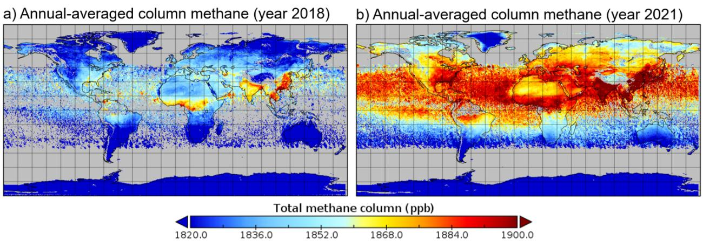

Supplementary Figure S1. Annual-averaged a) 2018 and b) 2021 methane total column concentrations from TROPOMI satellite measurements, oversampled to $0 . 1 ^ { \circ } { \times } 0 . 1 ^ { \circ }$ .

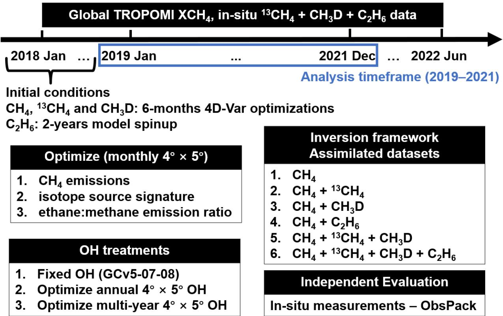

Supplementary Figure S2. Inversion framework. Details see the Methods.

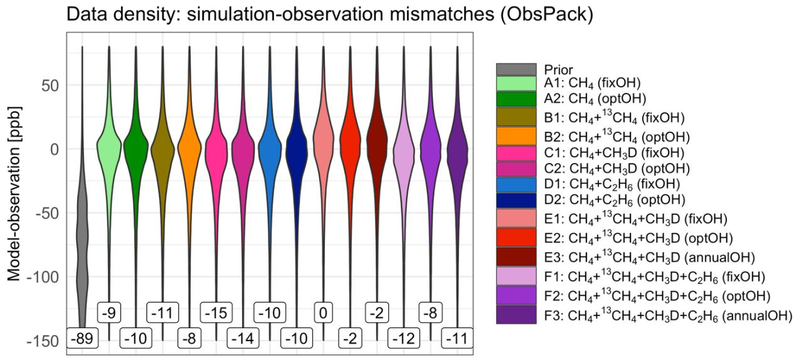

Supplementary Figure S3. Model biases (model minus observation) for methane, evaluated against measurements from ObsPack.

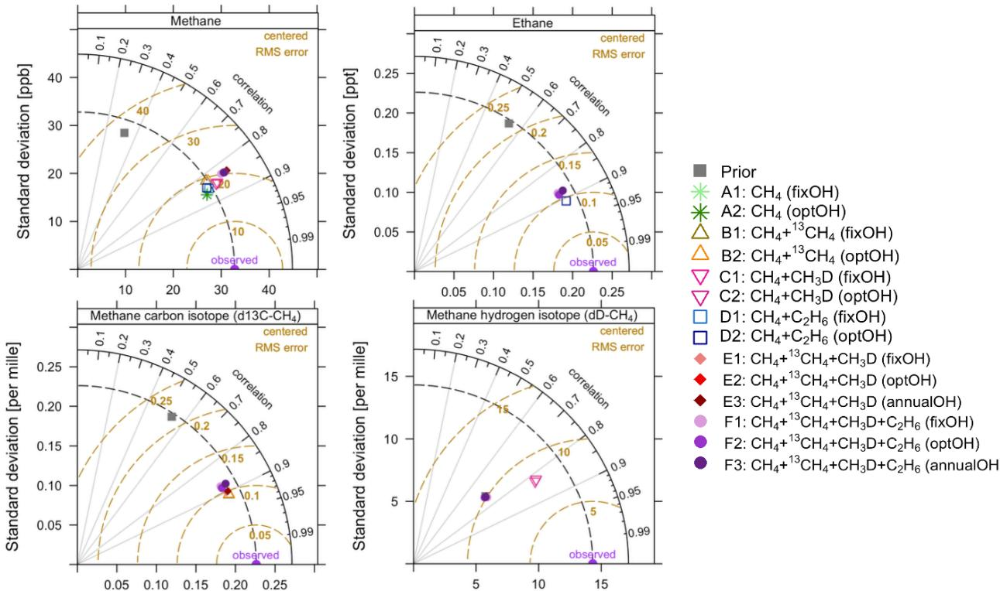  
Supplementary Figure S4. Taylor Diagrams of the assimilated datasets, including methane measurements from the TROPOspheric Monitoring Instrument (TROPOMI), as well as ethane and isotopic measurements from the in-situ data collections of National Oceanic and Atmospheric Administration (NOAA).

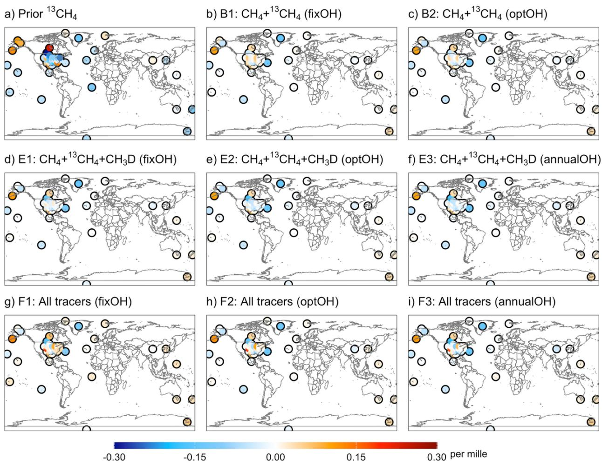  
Supplementary Figure S5. Isotopic model biases $\mathrm { ( 8 ^ { 1 3 } C - C H _ { 4 } }$ , model minus observation) for a) prior simulations and b-i) the inversion ensemble.

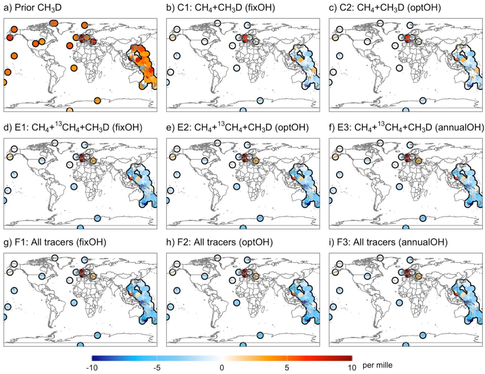  
Supplementary Figure S6. Same as Supplementary Figure S5, but in terms of $\delta \mathrm { D - C H } _ { 4 }$ , for a) prior simulations and b-i) the inversion ensemble.

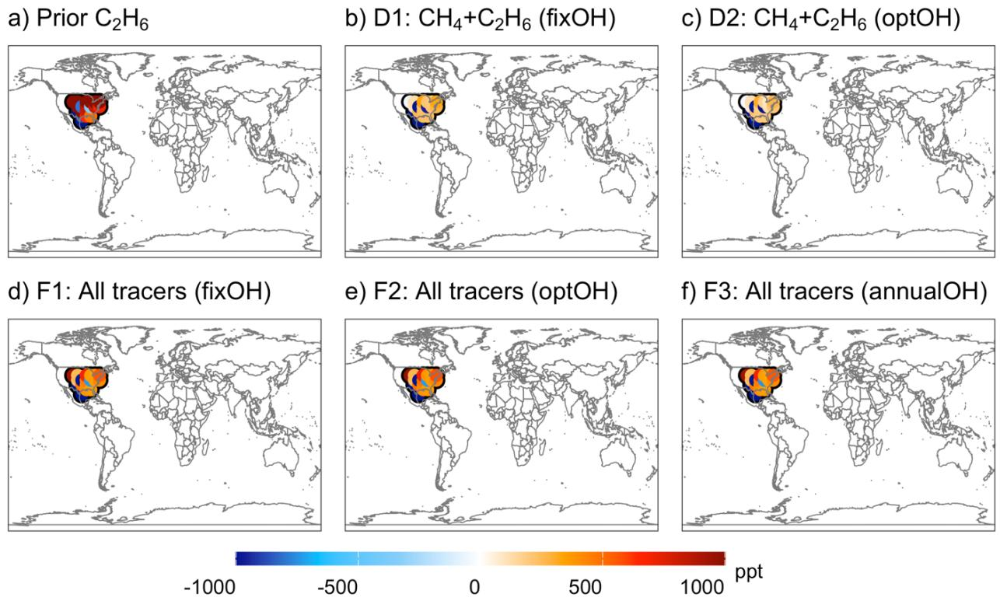  
Supplementary Figure S7. Same as Supplementary Figure S5, but in terms of ethane, for a) prior simulations and b-f) the inversion ensemble.

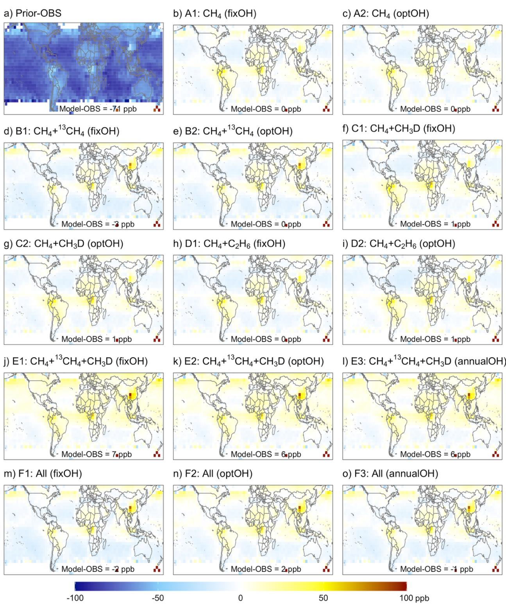  
Supplementary Figure S8. Same as Supplementary Figure S5, but in terms of methane, for a) prior simulations and b-o) the inversion ensemble.

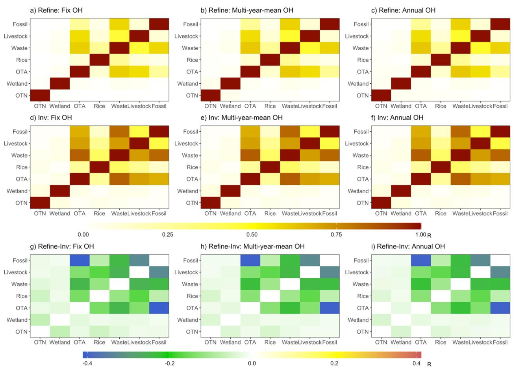  
Supplementary Figure S9. Pearson correlation coefficients of emission corrections (optimized minus prior) across emission sectors for the base cases E1–E3 (methane-isotopic joint inversions): a–c) the refined solutions; d–f) the inverse solutions, sectoral attributions based on prior fractions from inventories; and $\mathbf { g } \mathrm { - i }$ their differences (refined minus inverse solutions).

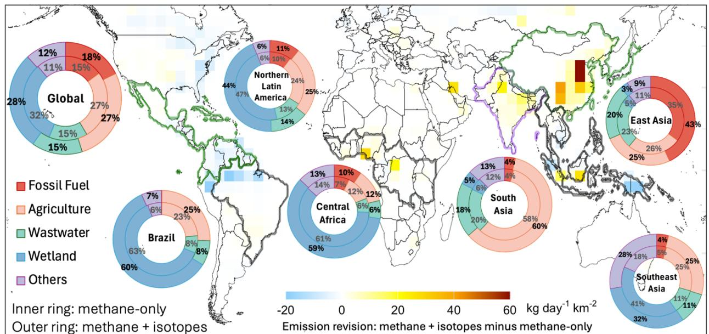

Supplementary Figure S10. Emission corrections after implementing isotopic constraints, compared with the methane-only inversion. The color shading (blue to red) shows the average emission corrections for 2019–2021, calculated as the solutions from the methane-isotopic joint inversions minus the methane-only solutions. The doughnut panels are sectoral fractions in regional methane emission budgets: inner rings are from the methane-only inversions, outer rings are from the methane-isotopic joint inversions. Regional boundaries are outlined in the map, also labeled in the lower-left panel of Figure 2.

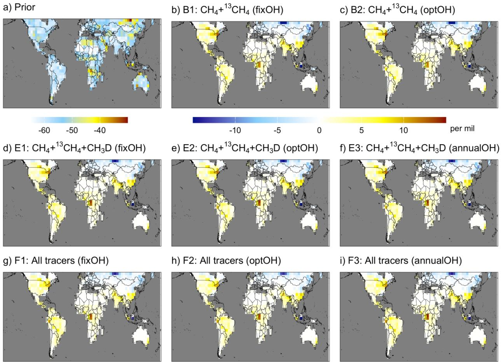  
Supplementary Figure S11. a) Prior estimates of ${ \delta ^ { 1 3 } { \mathrm { C - } } { \mathrm { C H } } _ { 4 } }$ source signatures and b-i) inversion corrections to the prior, for the year 2019.

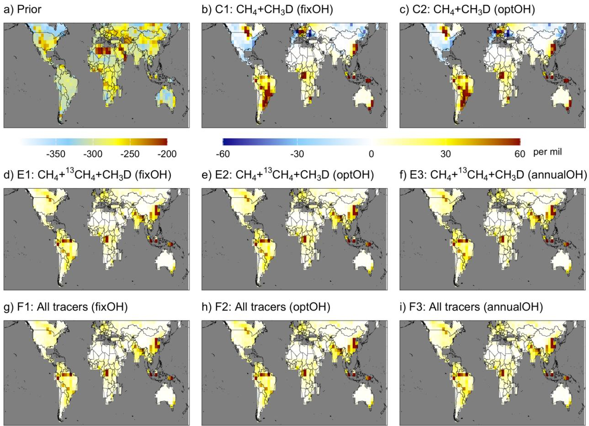

Supplementary Figure S12. a) Prior estimates of δD- $\mathrm { C H } _ { 4 }$ source signatures and b-i) inversion corrections to the prior, averaging across 2019–2021.

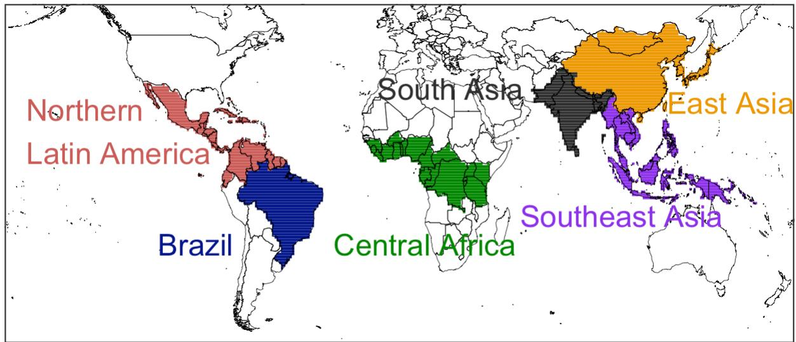  
Supplementary Figure S13. Regional classifications of tropical and subtropical areas, defined by the REgional Carbon Cycle Assessment and Processes-2 (RECCAP21 ).

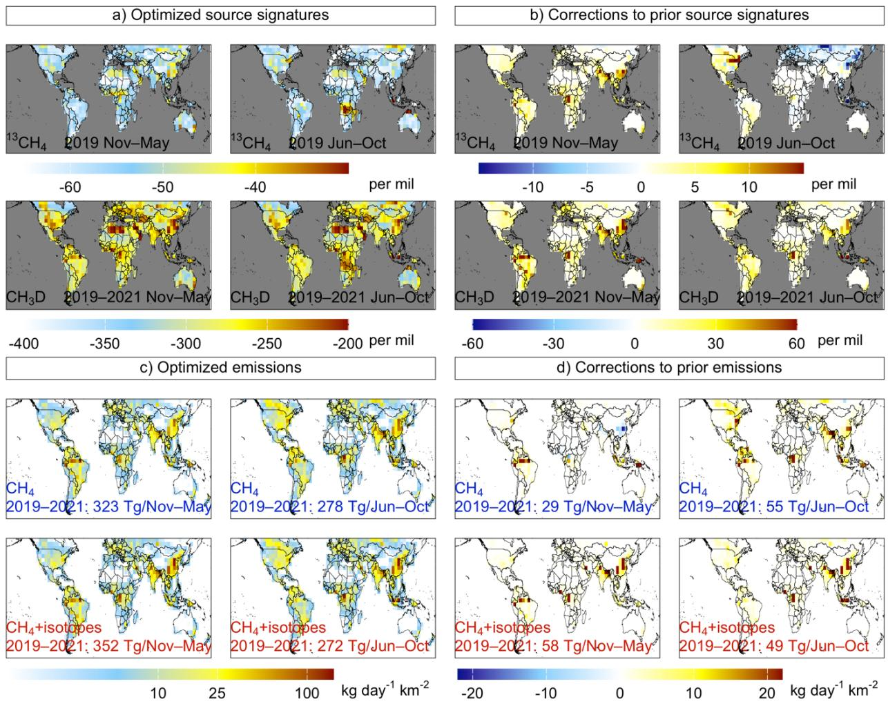  
Supplementary Figure S14. a) The optimized total source signatures and b) corrections to their prior estimates, for $\delta ^ { 1 3 } \mathrm { C - C H } _ { 4 }$ (top row, year 2019) and $\delta \mathrm { D - C H } _ { 4 }$ (bottom row, average of 2019– 2021). c) The optimized emissions and d) corrections to their prior estimates, average of 2019– 2021, optimized by TROPOMI methane (top row), and TROPOMI methane plus in-situ $\delta ^ { 1 3 } \mathrm { C } .$ - $\mathrm { C H } _ { 4 }$ and δD- $\mathrm { C H } _ { 4 }$ measurements (bottom row).

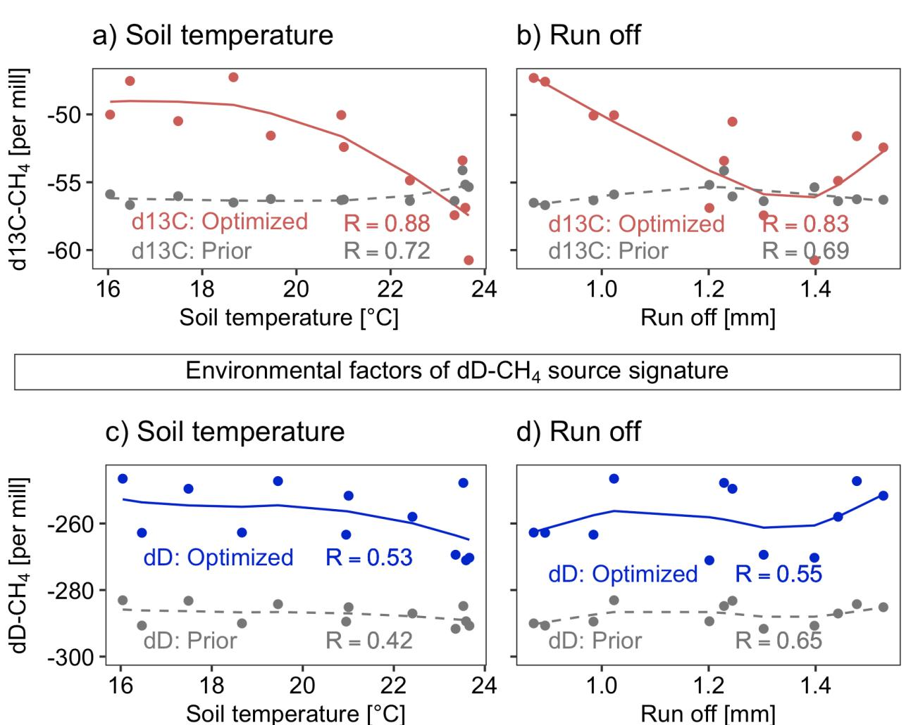  
Supplementary Figure S15. Environmental controls on isotopic source signatures of methane. Panels a–b show the influence of soil temperature $( 0 { - } 7 \mathrm { c m } )$ and runoff on ${ \delta ^ { 1 3 } { \mathrm { C - } } { \mathrm { C H } } _ { 4 } }$ source signatures, while panels $\mathtt { c } { \mathrm { - } } \mathtt { d }$ show the same for δD-CH4. Optimized source signatures (red/blue points and solid lines) show stronger environmental sensitivity compared to prior estimates (gray points and dashed lines) for $\delta ^ { 1 3 } \mathrm { C - C H } _ { 4 }$ . The labeled R are Pearson correlation coefficients between the optimized/prior source signatures and soil temperature/run off.

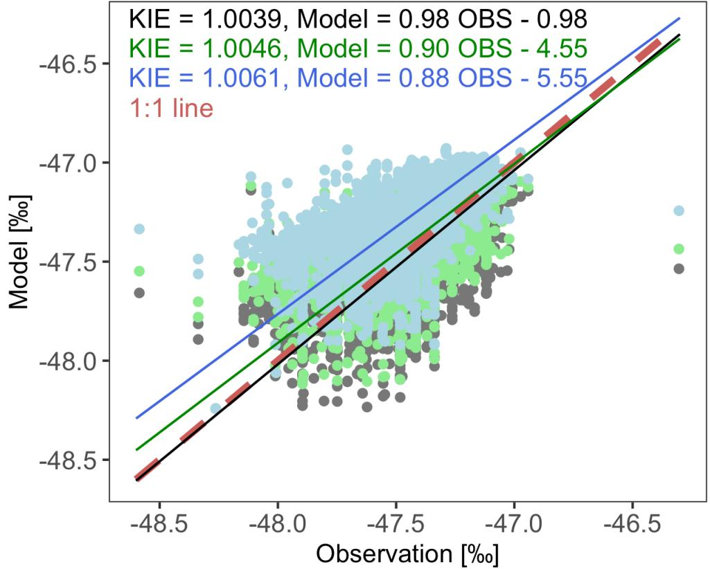  
Supplementary Figure S16. Scatters between observed and simulated $\delta ^ { 1 3 } \mathrm { C - C H } _ { 4 }$ , under different parameters of Kinetic Isotope Effect (KIE).

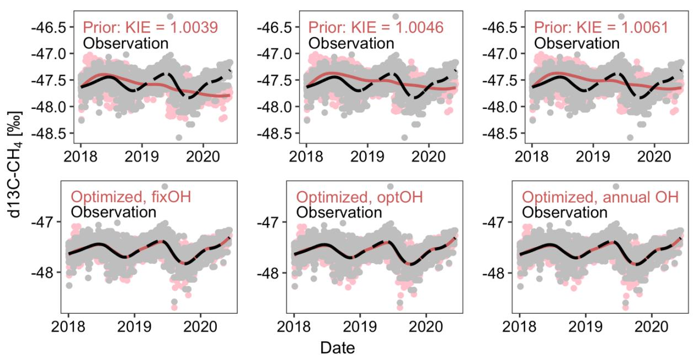  
d13C-CH4 seasonal cycle in the southern hemisphere   
Supplementary Figure S17. Seasonal cycle of $\delta ^ { 1 3 } \mathrm { C - C H } _ { 4 }$ in the Southern hemisphere, from the prior and optimized simulations (E1–E3, methane-isotopic joint inversions).

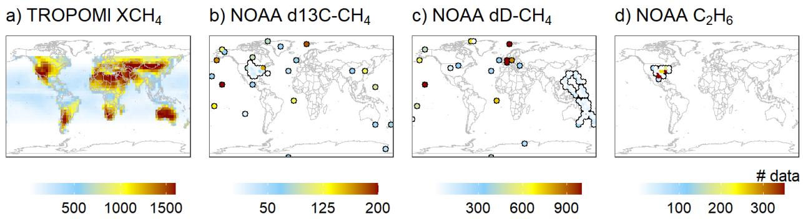

Supplementary Figure S18. Data density for the assimilated observations, including a) TROPOMI XCH4, b) NOAA ${ \delta ^ { 1 3 } \mathrm { C - } \mathrm { C H } _ { 4 } }$ , c) NOAA δD-CH4, and d) NOAA ethane.

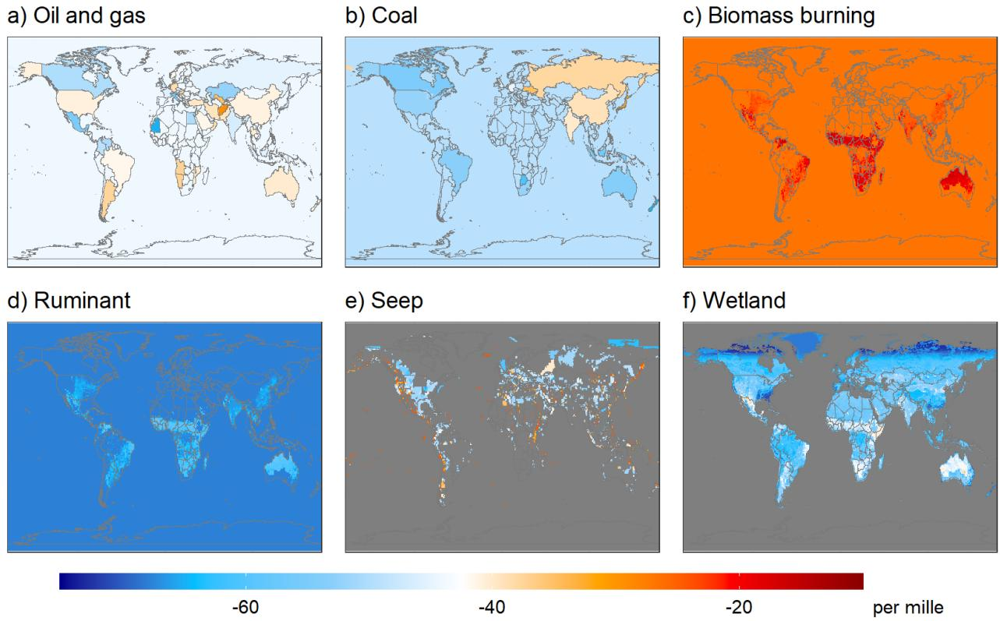  
Supplementary Figure S19. Prior estimates of ${ \delta ^ { 1 3 } \mathrm { C - } \mathrm { C H } _ { 4 } }$ source signatures, for emissions from a) oil and gas, b) coal, c) biomass burning, d) ruminant, e) geological seep, and f) wetlands.

Source signatures

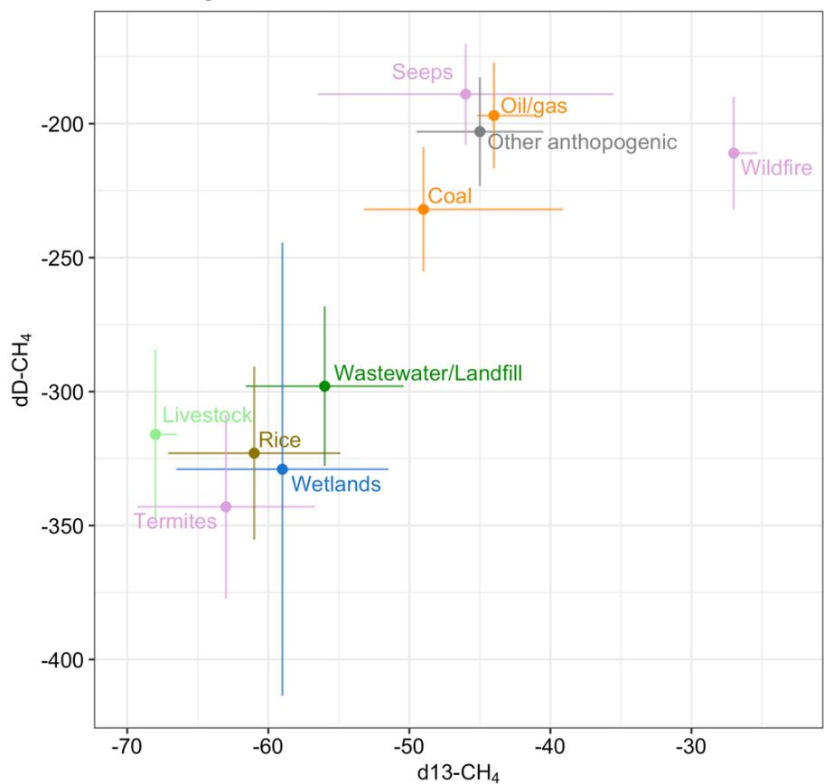  
Supplementary Figure S20. Global-average emission-weighted source signatures of $\delta ^ { 1 3 } \mathrm { C - C H } 4$ and $\delta \mathrm { D - C H } _ { 4 }$ , on sectoral level. Uncertainties are quantified using the $5 \% - 9 5 \%$ percentile range for oil and gas, coal, biomass burning, and livestock $\delta ^ { 1 3 } \mathrm { C - C H } _ { 4 }$ source signatures; one standard deviation for wetland $\mathrm { ( 8 ^ { 1 3 } C - C H _ { 4 } }$ and $\delta \mathrm { D - C H } _ { 4 } ,$ ) and seep $\mathrm { ( 8 ^ { 1 3 } C - C H _ { 4 } ) }$ source signatures; and an assumed $10 \%$ for all other categories.

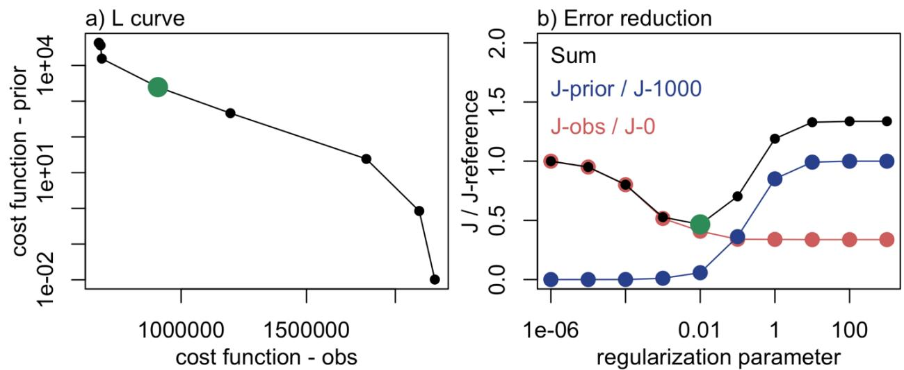  
Supplementary Figure S21. a) L curve and b) error reduction plots to determine regularization parameters. The green dots indicate the selected case.

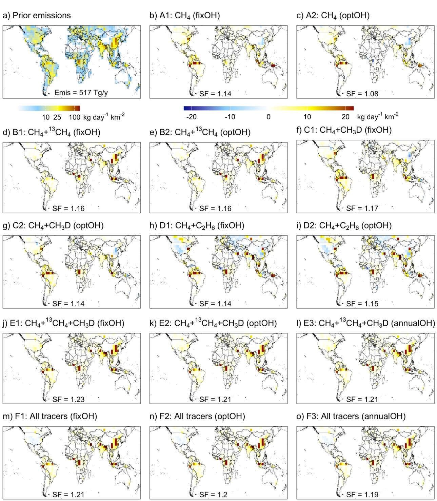

Supplementary Figure S22. a) Prior methane emission estimates, and b–o) emission corrections identified by the inversions, for the year 2019.

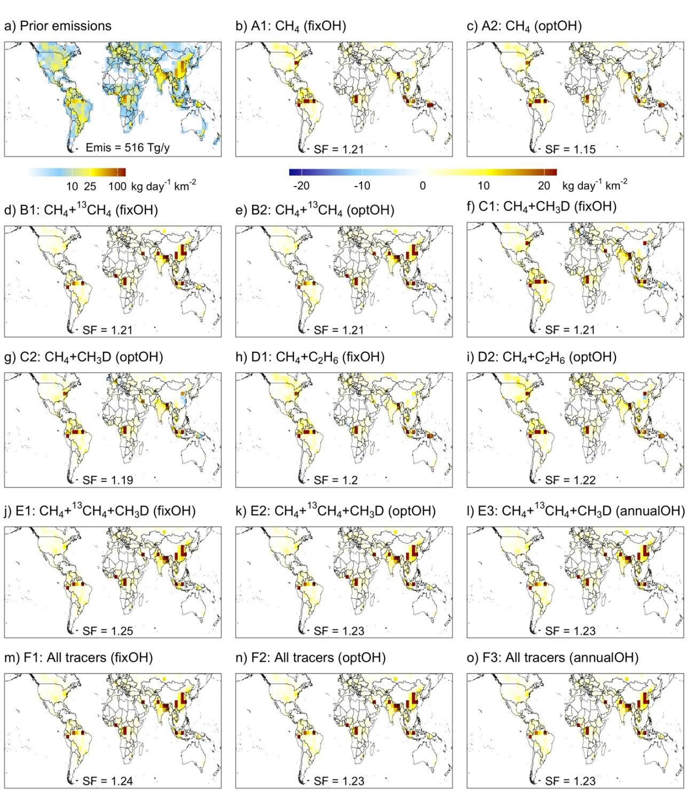  
Supplementary Figure S23. Same as Supplementary Figure S22, but for the year 2020, including a) prior estimates and b–o) emission corrections identified by the inversion ensemble.

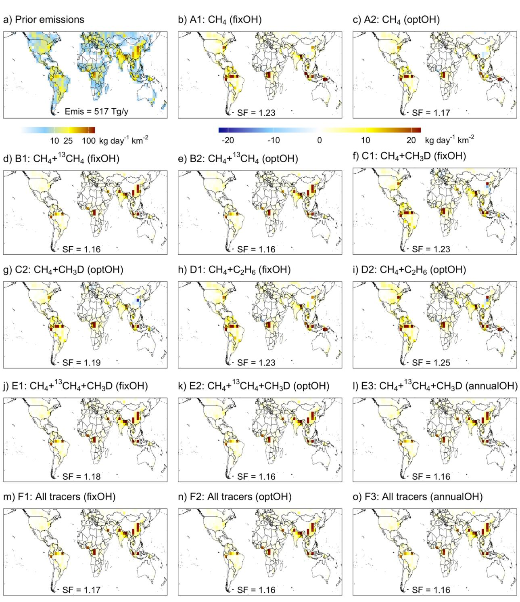  
Supplementary Figure S24. Same as Supplementary Figure S22, but for the year 2021, including a) prior estimates and b–o) emission corrections identified by the inversion ensemble.

Supplementary Table S1. Global-averaged Methane Isotope Source Signatures and Kinetic Isotope Effect Parameters   

<table><tr><td colspan="2"></td><td>813C-CH4 (%0)</td><td>Spatial resolution for 813C-CH4 source signature</td><td>8D-CH4 (%0)</td><td>Spatial resolution for 8D-CH4 source signature</td></tr><tr><td rowspan="9">Emissions</td><td>Oil and gas</td><td>-44</td><td>1×1°</td><td>-197</td><td>Global</td></tr><tr><td>Coal</td><td>-49</td><td>1×1°</td><td>-232</td><td>Global</td></tr><tr><td>Livestock</td><td>-68</td><td>10x1°</td><td>-316</td><td>Global</td></tr><tr><td>Landfills/Waste</td><td>-56</td><td>Global</td><td>-298</td><td>Global</td></tr><tr><td>Rice</td><td>-61</td><td>Global</td><td>-323</td><td>Global</td></tr><tr><td>Other anthropogenic</td><td>-45</td><td>Global</td><td>-203</td><td>Global</td></tr><tr><td>Biomass Burning</td><td>-27</td><td>1x1°</td><td>-211</td><td>Global</td></tr><tr><td>Wetlands</td><td>-59</td><td>0.5°x0.5°</td><td>-329</td><td>0.0833°x0.0833°</td></tr><tr><td>Seeps Termites</td><td>-46 -63</td><td>1°×1° Global</td><td>-189 -343</td><td>Global Global</td></tr><tr><td rowspan="3">Troposphere loss1</td><td>Reaction with OH</td><td>1.0039</td><td></td><td>1.09exp(49/T)</td><td></td></tr><tr><td>Reaction with Cl Soil absorption</td><td>1.043exp(6.455/T) 1.02</td><td></td><td>1.278exp(51.308/T) 1.088</td><td></td></tr><tr><td>Stratosphere loss</td><td>1.013</td><td></td><td>1.3</td><td></td></tr></table>

lKIE parameters are temperature dependent. T is atmospheric temperature.

# Supplementary References

1. Ciais, P., Bastos, A., Chevallier, F., Lauerwald, R., Poulter, B., Canadell, P., Hugelius, G., Jackson, R.B., Jain, A., Jones, M., Kondo, M., 2020. Definitions and methods to estimate regional land carbon fluxes for the second phase of the REgional Carbon Cycle Assessment and Processes Project (RECCAP-2). Geoscientific Model Development, 2022. 15, 1289–1316.