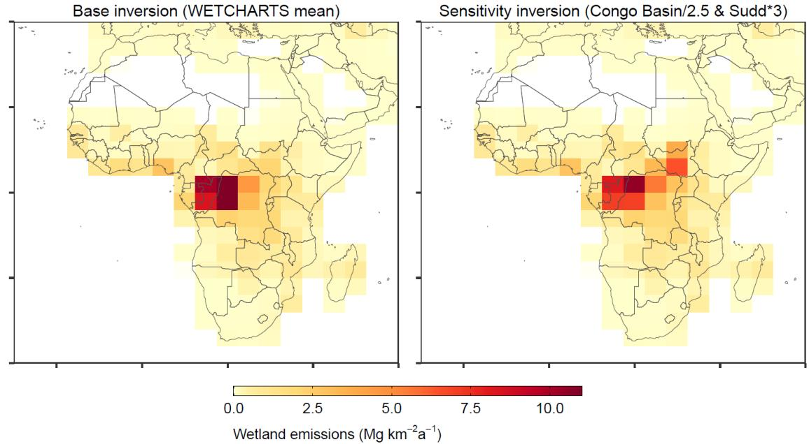
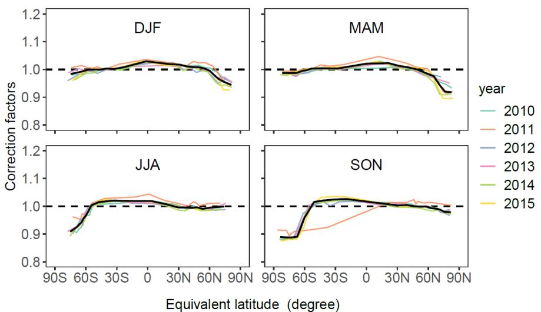
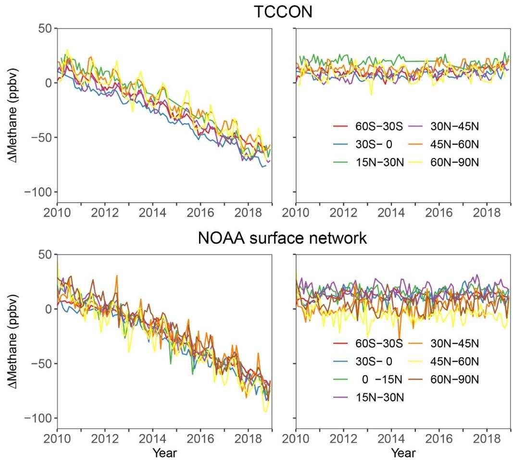
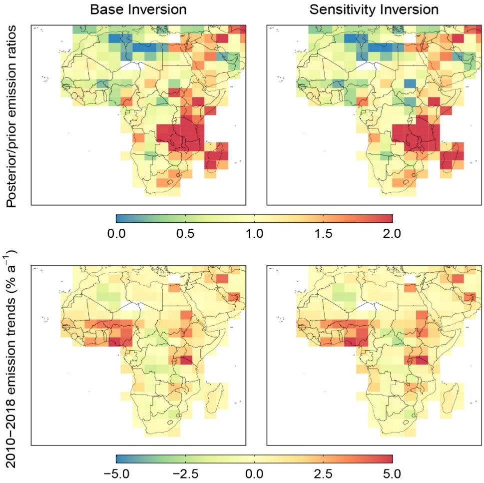
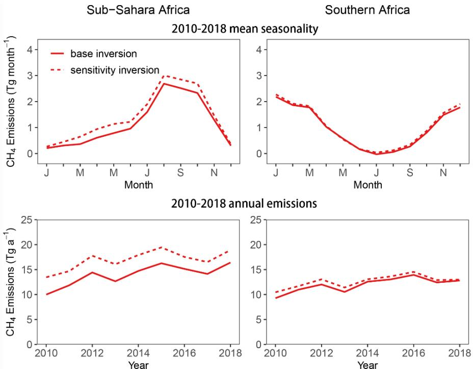
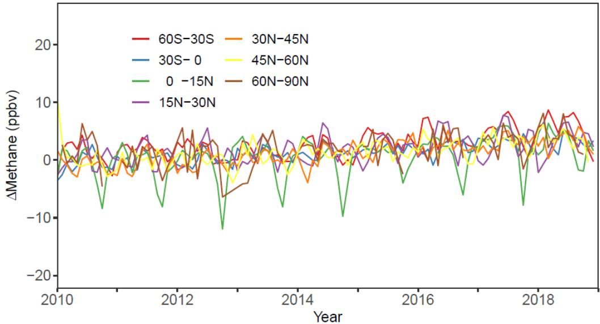
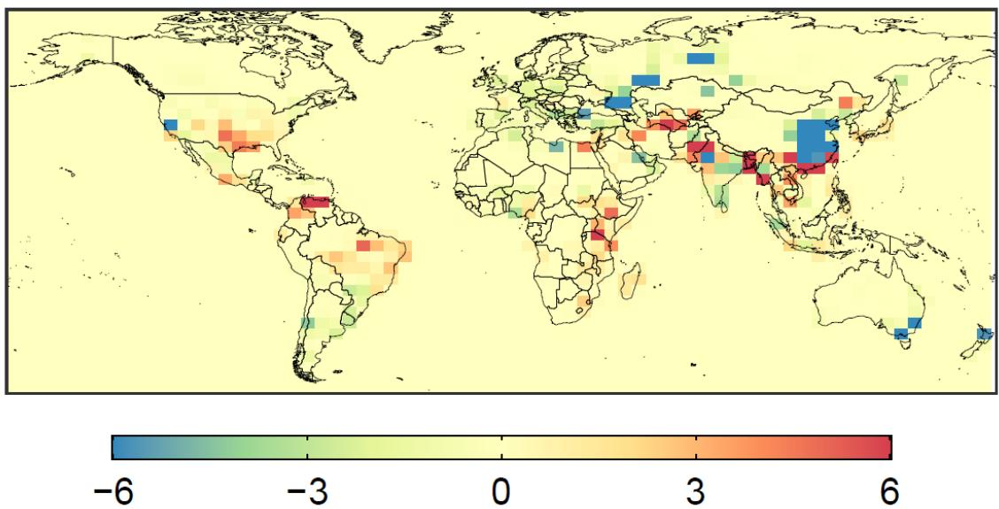
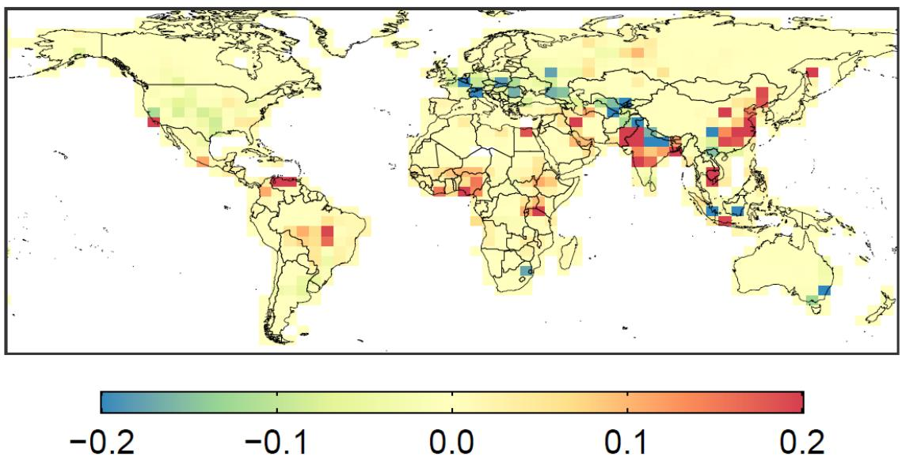

# Attribution of the accelerating increase in atmospheric methane during 2010–2018 by inverse analysis of GOSAT observations

Yuzhong Zhang et al.

Correspondence to: Yuzhong Zhang (zhangyuzhong@westlake.edu.cn)

The copyright of individual parts of the supplement might differ from the CC BY 4.0 License.

  
Figure S1. Spatial distribution of wetland emissions in Africa averaged over 2010-2018. (Left) Same as Figure 1 except that only Africa is shown here. We use WetCHARTS ensemble mean as prior estimates for wetland emissions in the base inversion. (Right) Spatial distribution of wetland emissions is perturbed in a sensitivity inversion, in which emissions over the Sudd region are increased by a factor of 3 and emissions over the Congo Basin are reduced by a factor of 2.5.

  
Figure S2. The same as Figure 2, except that the GEOS-Chem stratospheric bias correction factors for individual years are computed using ACE-FTS observations. The outlier values in SON of 2011 are associated a considerably smaller number of ACE-FTS observations relative to other seasons.

  
Figure S3. Difference of methane mixing ratios between model simulations and ground-based observations, averaged over latitude bands. Top panels show comparison with TCCON measurements, and bottom panels NOAA surface measurements. Results are shown for GEOS-Chem simulations using prior (left) and posterior (right) state vector estimates.

  
Figure S4. Posterior estimates for anthropogenic emissions (top) and their trends (bottom) in Africa. Left column shows results from the base inversion, right column shows results from a sensitivity inversion in which the spatial distribution of prior wetland emissions is perturbed over Africa (Figure S1).

  
Figure S5. Posterior estimates for the seasonality (top) and inter-annual trends (bottom) of wetland emissions in Sub-Sahara Africa (left) and southern Africa (right). See Figure 1 for definition of these regions. Solid lines show results from the base inversion, dashed lines show results from a sensitivity inversion in which the spatial distribution of prior wetland emissions is perturbed over Africa (Figure S1).

  
Figure S6. The same as the right bottom panel of Figure 3, except that the y axis is in a smaller scale for legibility of details in the posterior model errors.

# Posterior - Prior emissions (Mg km-² a-1)

  
Figure S7. Corrections to prior estimates of 2010–2018 mean non-wetland methane emissions, expressed as the difference between the posterior and the prior estimates of emission flux density.

Posterior anthropogenic emission trends (Mg km-2 a-1 a-1)

  
Figure S8. 2010–2018 absolute linear trends in non-wetland emissions inferred from the inversion.