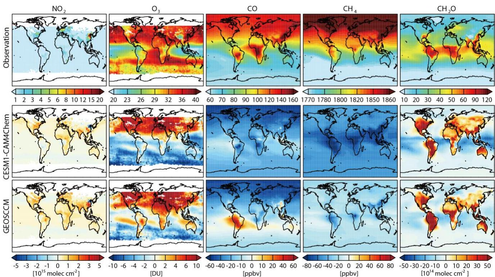
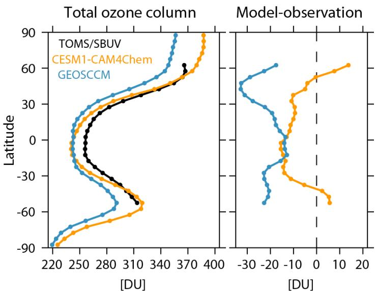
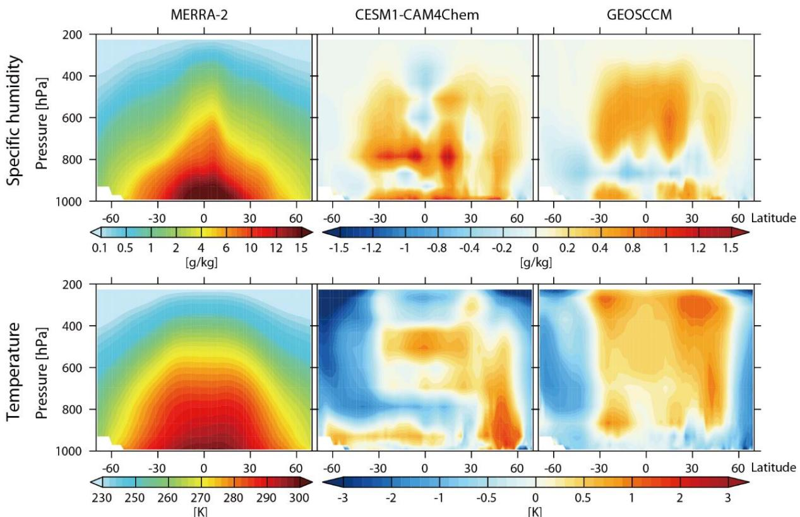
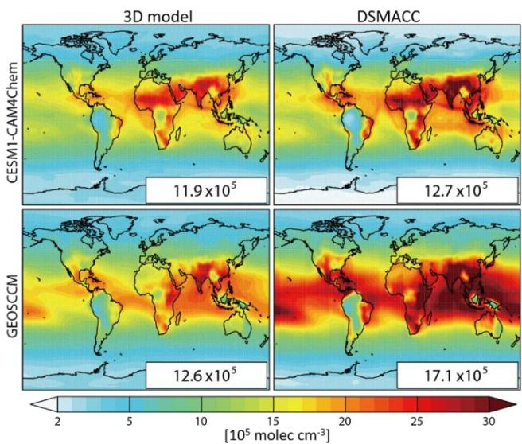
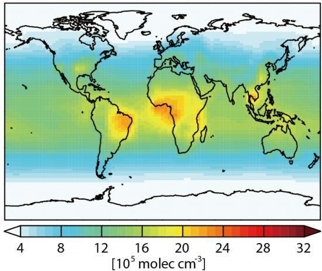
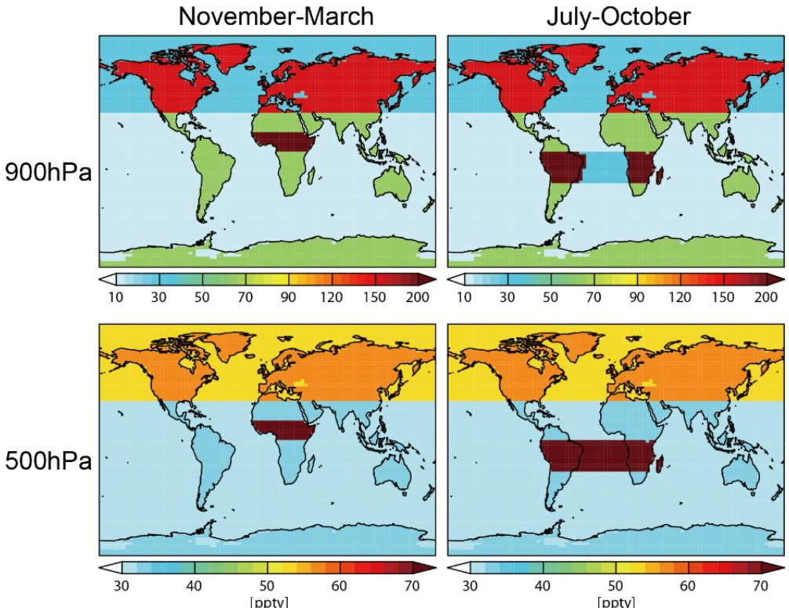
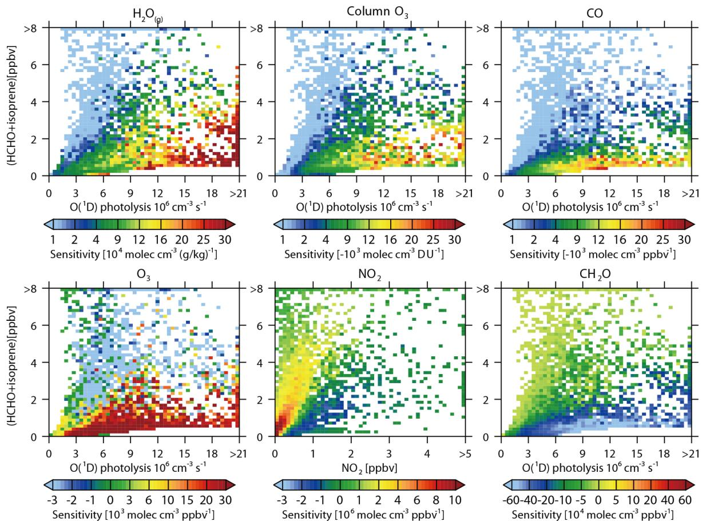
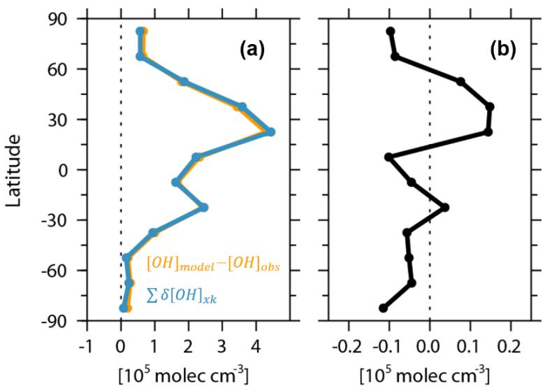

# Reconciling the bottom-up and top-down estimates of the methane chemical sink using multiple observations

Yuanhong Zhao et al.

Correspondence to: Yuanhong Zhao (zhaoyuanhong $@$ ouc.edu.cn)

The copyright of individual parts of the supplement might differ from the article licence.

  
Figure S1. Spatial distribution of the tropospheric mean OH precursors from observations (top) and the difference in the OH precursors between CESM1-CAM4chem (middle) and GEOSCCM (bottom) simulations and the observations (model－observation).

  
Figure S2. Left: The latitude means of total ozone column from TOMS/SBUV observations (black), and CESM1-CAM4chem (yellow) and GEOSCCM (blue) simulations. Right: the difference in observed total ozone column between CESM1-CAM4chem (yellow) and GEOSCCM (blue) simulations and the observations (Model－observation).

  
Figure S3. Latitude-height cross sections of specific humidity (top) and air temperature (bottom) from MERRA-2 reanalysis data (left) and the differences of CESM1-CAM4chem (middle) and GEOSCCM (right)

simulations with the reanalysis data (model－MERRA-2).

  
Figure S4. Spatial distributions of air mass-weighted tropospheric mean [OH] $\left( [ \mathrm { O H } ] _ { \mathrm { t r o p - M } } \right)$ in 2010 from 3D model simulations (left) and chemical box model (DSMACC) simulations driven by the corresponding 3D model outputs (right). The global mean values are shown inset in molec $\mathrm { c m } ^ { - 3 }$ .

  
Figure S5. Spatial distribution of tropospheric mean [OH] estimated by Spiavkovsky et al. (2000).

  
Figure S6. Spatial distribution of $\mathrm { N O _ { y } }$ given by Spiavkovsky et al. (2000) averaged over November to March (left) and July to October (right) at $9 0 0 \mathrm { { h P a } }$ (top) and $5 0 0 \mathrm { h P a }$ (bottom).

  
Figure S7. Sensitivity of [OH] to individual factors (filled colors) as a function of HCHO $^ +$ isoprene mixing ratio (y-axis) and $\mathrm { O } ( ^ { 1 } \mathrm { D } )$ photolysis rate or $\Nu { 0 } _ { 2 }$ mixing ratio estimated by the DSMACC simulations using MOZART-4 chemical mechanism.

  
Figure S8. (a) Zonal averaged difference between modeled and observation-based $[ \mathrm { O H } ] _ { \mathrm { t r o p - M } }$ estimated by the All_obs simulation $( [ O H ] _ { m o d e l } - [ O H ] _ { o b s }$ ; yellow); The total contribution of the 8 individual factors to the difference in global $[ \mathrm { O H } ] _ { \mathrm { t r o p - M } }$ estimated from the simulation xk_obs simulations $( \sum \delta [ O H ] _ { x k }$ ; blue). (b) The difference between the two estimates $( \sum \delta [ O H ] _ { x k } - ( [ O H ] _ { m o d e l } - [ O H ] _ { o b s } ) )$ .