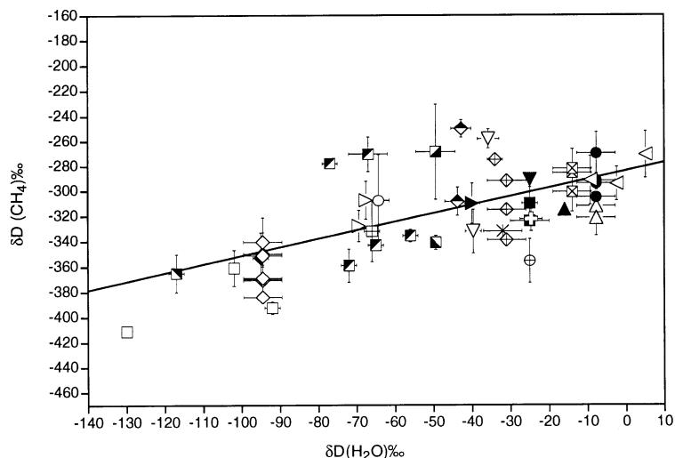
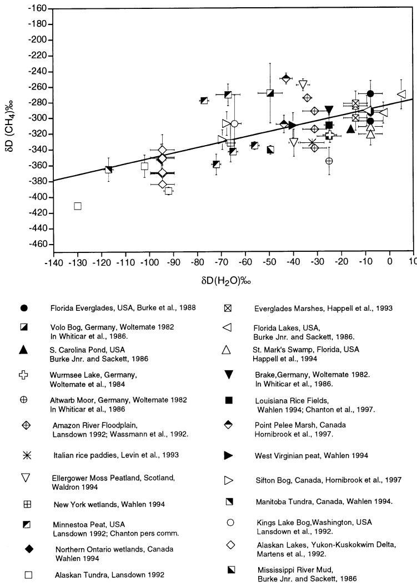
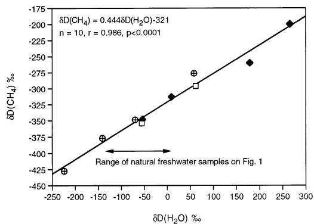
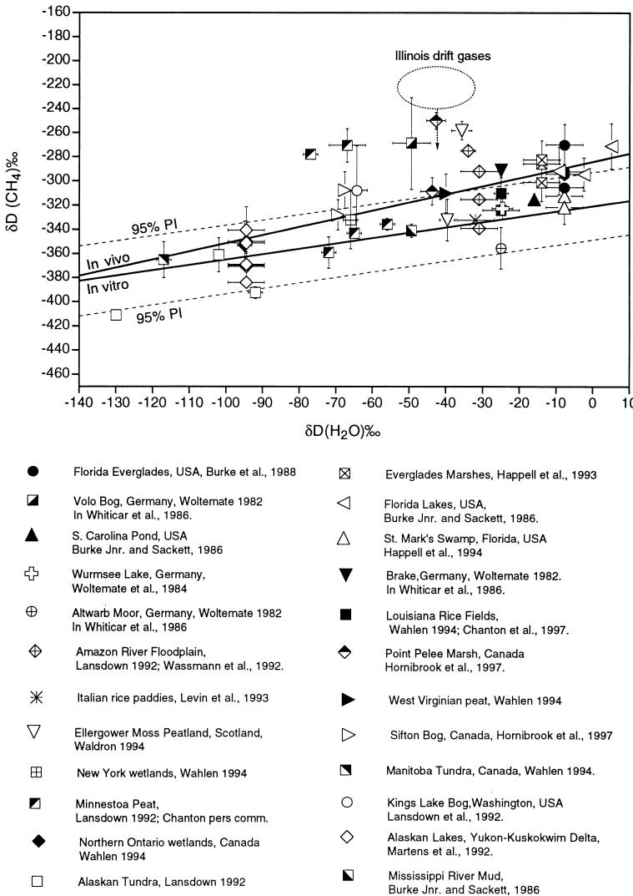

# PII S0016-7037(99)00192-1

# The global influence of the hydrogen isotope composition of water on that of bacteriogenic methane from shallow freshwater environments

SUSAN WALDRON,\*,1 J. M. LANSDOWN, 2,† E. M. SCOTT, 3 A. E. FALLICK, 1 and A. J. HALL4

1 Scottish Universities Research and Reactor Centre, East Kilbride G75 0QF, Scotland

2 School of Oceanography, University of Washington, Seattle, Washington, USA

3 Department of Statistics, University of Glasgow, Glasgow G12 8QW, Scotland

4 Department of Geology and Applied Geology, University of Glasgow, Glasgow G12 8QQ, Scotland

(Received October 22, 1998; accepted in revised form May 14, 1999)

Abstract—We propose that the hydrogen isotope composition of recently produced microbial methane, $\mathrm { \delta { D } ( C H _ { 4 } ) }$ , in sulfate-poor, shallow freshwater environments, is directly related to the hydrogen isotopic composition of the system water $\delta \mathrm { D } ( \mathrm { H } _ { 2 } \mathrm { O } )$ . As $\delta \mathrm { D } ( \mathrm { H } _ { 2 } \mathrm { O } )$ varies globally, systematic differences in $\mathrm { \delta D ( C H _ { 4 } ) }$ as a function of $\delta \mathrm { D } ( \mathrm { H } _ { 2 } \mathrm { O } )$ should be observed.

From available mean paired measurements from 46 sites, the relationship for $\mathrm { \delta D ( C H _ { 4 } ) }$ and $\delta \mathrm { D } ( \mathrm { H } _ { 2 } \mathrm { O } )$ in the natural environment can be defined as $\delta \mathrm { D } ( \mathrm { C H } _ { 4 } ) = 0 . 6 7 5 \delta \mathrm { D } ( \mathrm { H } _ { 2 } \mathrm { O } ) - 2 8 4 \% \ : ( p < 0 . 0 0 \dot { 0 } 1 )$ This relationship is statistically distinct from that generated by considering three separate laboratory-based anaerobic inoculations that contain similar methanogenic communities to the natural freshwater samples and therefore, are likely to produce methane by similar metabolic pathways: $\delta \mathrm { D } ( \mathrm { C H } _ { 4 } ) ~ = ~ 0 . 4 4 4 \delta \mathrm { D } ( \mathrm { H } _ { 2 } \mathrm { O } ) ~ - 3 2 1 \% ~ ( p ~ <$ 0.0001). We suggest that the relationship arising from the laboratory incubations defines the $\mathrm { \delta D ( C H _ { 4 } ) }$ of methane produced at source in shallow freshwater environments. We can approximate that 50% of the variation in natural $\mathrm { \delta { D } ( C H _ { 4 } ) }$ samples can be explained by D(H2O), with isotopic fractionation postproduction, or mixing with gas already fractionated likely responsible for most of the noise in the natural system and difference of the natural sample relationship to the laboratory relationship. Methanogenic pathway may also influence $\mathrm { \delta D ( C H _ { 4 } ) }$ , but the foundations for this hypothesis need to be reconsidered, and field and laboratory data exist that do not support it. The relationships presented here describe D of methane from only shallow (subsurface) freshwater environments; paired $\mathrm { \bar { \delta D ( C H _ { 4 } ) } } { - } \delta \mathrm { D ( H } _ { 2 } \mathrm { O ) }$ values from other environments $( \mathrm { e . g . }$ marine, glacial drift) suggest that a different relationship is needed to describe the influence of $\delta \mathrm { D } ( \mathrm { H } _ { 2 } \mathrm { O } )$ on $ { \delta \mathrm { D } } (  { \mathrm { C H _ { 4 } } } )$ Copyright © 1999 Elsevier Science Ltd

## 1. INTRODUCTION

Biogenic methane can be produced from a variety of substrates (e.g., Grbic-Galic and Young, 1985; Krzycki et al., 1987), the most common being from the breakdown acetate or by the reduction of carbon dioxide. All hydrogen incorporated into methane produced by $\mathrm { C O } _ { 2 }$ reduction originates from the formation water (Pine and Barker 1956; Daniels et al., 1980). Until recently evidence suggested that not all hydrogen in methane produced from acetate is derived from the water (Schoell, 1980; Woltemate et al., 1984; Whiticar et al., 1986). Rather, it was considered that three hydrogens were transferred intact from the acetate methyl group to the methane molecule, with organic-sourced hydrogen thus accounting for 75% of the hydrogen in the methane. On this basis it was suggested that $\mathrm { C H } _ { 4 }$ produced from acetate would be deuterium depleted relative to that produced by $\mathrm { C O } _ { 2 }$ reduction $\mathrm { ( e . g . }$ , Whiticar et al., 1986). This difference in $\mathrm { \delta D ( C H _ { 4 } ) }$ was purported to be large enough to differentiate methane produced from acetate $ { \delta \mathrm { D } } (  { \mathrm { C H _ { 4 } } } ) = \sim - 2 5 0 \%  { \mathrm { \ t o \ } } - 4 0 0 \% )$ from that produced by $\mathrm { C O } _ { 2 }$ reduction $( \delta \mathrm { D } ( \mathrm { C H _ { 4 } } ) = \sim - 1 5 0 \% ~ \mathrm { t o } ~ - 2 5 0 \% )$ (Woltemate et al., 1984; Whiticar et al., 1986; Schoell, 1988).

In this paper we present laboratory and field evidence that suggests that $\mathrm { \delta { D } ( C H _ { 4 } ) }$ produced from acetate is more dependent on $\delta \mathrm { D } ( \mathrm { H } _ { 2 } \mathrm { O } )$ than previously considered, and propose that D of methane from shallow freshwater environments is more directly linked to $\delta \mathrm { D } ( \mathrm { H } _ { 2 } \mathrm { O } )$ of the porewater than methanogenic pathway. A statistically significant correlation between D of $\mathrm { C H } _ { 4 }$ and D of local precipitation (albeit for a much smaller group of samples than we consider here) has been previously noted (Wahlen, 1994), but with the interpretation that the contribution of each methane production pathway must remain fairly constant in such diverse ecosystems to produce this correlation. As acetoclastic methanogenesis and $\mathrm { C O } _ { 2 }$ reduction occur contemporaneously in a natural system (Zinder, 1988) and the relative proportion of each pathway can vary (Conrad, 1999) depending on substrate availability and other environmental factors such as temperature (Waldron et al., 1998a), constancy of methane production pathways would be unlikely.

## 1.1. Why Reconsider our Current Understanding of Bacteriogenic $\mathbf { \delta } \mathbf { \delta } \delta \mathbf { D } ( \mathbf { C } \mathbf { H } _ { 4 } ) \Rrightarrow$

First, labeling experiments with deuterium (using sediment from a freshwater estuary as an inoculum) have shown that, during the final stages of acetoclastic methanogenesis, enzymemediated hydrogen isotope exchange can occur between the methyl– hydrogen and water– hydrogen (de Graaf et al., 1996). Thus, as with $\mathrm { C O } _ { 2 }$ reduction, methane produced from acetate may also have four water-derived hydrogens and, on the basis of $\mathrm { { \delta D ( C H _ { 4 } ) } } .$ , may not be isotopically distinguishable.

Second, combined measurements of $\mathrm { \delta D ( C H _ { 4 } ) }$ and volatile fatty acid (VFA) concentrations from anaerobic batch culture systems seem to confirm this exchange, as $\mathrm { \delta D ( C H _ { 4 } ) }$ remained constant despite changes in the dominant methanogenic pathway as the systems evolved (Waldron et al., 1998b). $\delta ^ { 1 3 } \mathrm { C } ( \mathrm { C H } _ { 4 } ) , \ \delta ^ { 1 3 } \mathrm { C } ( \mathrm { C O } _ { 2 } ) .$ , and $\mathrm { \delta D ( C H _ { 4 } ) }$ were measured from headspace gas in two anaerobic butyrate-degrading enrichment systems over a period of 3 months (Waldron et al., 1998b). The supernatant liquid was sampled for assay of VFA concentration. The initial D(H2O) of system 2 was 118‰ more enriched than system 1. $\delta ^ { 1 3 } \mathrm { C } ( \mathrm { C H } _ { 4 } )$ showed a similar time profile in each system (increasing from $- 6 3 \mathrm { ~ t o ~ } - 4 7 \% )$ as did $\delta ^ { 1 3 } \mathrm { C } ( \mathrm { C O } _ { 2 } )$ (increasing from 28.6 to 2.1‰). In contrast $\mathrm { \delta D ( C H _ { 4 } ) }$ remained constant in each vessel, with a mean $\mathrm { o f } - 3 5 4 \pm 3 \% \mathrm { ( n = 6 ) }$ in system 1 and $- 2 9 6 \pm 2 \% 0 = 5 )$ in system 2. The average difference in $\mathrm { { \delta D ( C H _ { 4 } ) } }$ between systems $( 5 6 \pm 4 \% 0 , \mathrm { n } = 6 )$ is interpreted as a reflection of the difference in $\delta \mathrm { D } ( \mathrm { H } _ { 2 } \mathrm { O } )$ . Acetate, butyrate, and propionate concentration assays revealed multiple substrate production and uptake, supporting the interpretation that changes in $\delta ^ { 1 3 } \mathrm { C } ( \mathrm { C H } _ { 4 } )$ reflect a change in methanogenic pathway (e.g., Kryzcki et al., 1987) from a system initially dominated by $\mathrm { C O } _ { 2 }$ reduction, to one where acetate was a significant substrate. Active propionate degradation indicated that hydrogen concentrations were sufficiently low in the incubations that high hydrogen concentration (Burke, 1993) did not buffer $\mathrm { \delta D ( C H _ { 4 } ) }$ Constancy of $\mathrm { \delta D ( C H _ { 4 } ) }$ could not have occurred unless independent of methanogenic pathway and D of methane produced from acetate was identical to that produced from $\mathrm { C O } _ { 2 } .$ Using the $\mathrm { \delta D ( C H _ { 4 } ) }$ range currently accepted for acetoclastic methanogenesis and $\mathrm { C O } _ { 2 }$ reduction (Woltemate et al., 1984; Whiticar et al., 1986; Schoell, 1988), such methane would have to lie in the “transition” zone (Whiticar et al., 1986) between acetoclastic methanogenesis and CO2 reduction, that is where $\mathrm { \delta D ( C H _ { 4 } ) }$ is approximately $- 2 5 0 \text{‰}$ . However, this is more D-enriched than $\mathrm { \delta D ( C H _ { 4 } ) }$ in either of these incubations, where methane produced from $\mathrm { C O } _ { 2 }$ reduction must have approximated $- 3 5 4 \text{‰}$ and 2296‰ for system 1 and 2, respectively. Transition zone methane is also more D-enriched than that sampled from most shallow freshwater environments (Fig. 1). Clearly the limits defining $\mathrm { \delta D ( C H _ { 4 } ) }$ from $\mathrm { C O } _ { 2 }$ reduction need to be reconsidered.

Third, radio-isotope tracer experiments in peat columns showed methane was produced by $\mathrm { C O } _ { 2 }$ reduction, and acetoclastic methanogenesis was unimportant (Lansdown, et al., 1992), yet paired $\delta \mathrm { D } ( \mathrm { C H } _ { 4 } ) { - } \delta \mathrm { D } ( \mathrm { H } _ { 2 } \mathrm { O } )$ measurements from Kings Lake Bog when plotted on the boundaries for $\mathrm { C O } _ { 2 }$ reduction and acetoclastic methanogenesis (Whiticar et al., 1986), suggested a significant input to methane production from acetate (Lansdown et al., 1992).

In addition we are guilty of not considering the contribution of anaerobic fermentative processes to the source of hydrogen in the acetate methyl group. We should be wary of assuming an organic source for acetate methyl– hydrogen, as these hydrogens may have been replaced or exchanged with water hydrogen in the processes leading to acetate production. Water– hydrogen can exchange with organic– hydrogen on organic polymers such as cellulose (Epstein et al., 1976). During early fermentation of organic polymers by enzymatic hydrolysis (Conrad, 1999) water– hydrogen can be incorporated into the product monomers that are subsequently fermented to acetate, and in the later fermentative stages water– hydrogen can be further incorporated into the methane substrate. For example, during acetate production from the degradation of fatty acids by -oxidation (Stryer, 1981), one atom of water– hydrogen is incorporated into each acetate methyl group. If this exchange is not overprinted by enzymatic exchange during methanogenesis (de Graaf et al., 1996), 50% of the hydrogen in methane produced from such acetate can be from the surrounding water (Waldron, 1994).

At present there is insufficient information about proton transfer in fermentative processes before methanogenesis to discern whether all hydrogen on acetate is aqueous in origin, and the dependence of one bacterial species on another for the production of substrates and removal of by-products is such that the tracer experiments required to confirm hydrogen flow in the earlier fermentative processes would be technically challenging, if at all possible. However, consideration of the processes comprising anaerobic fermentation demonstrate that there are many stages where “inherited” organic– hydrogen can be replaced with water– hydrogen and as such methane produced from such acetate may be isotopically indistinguishable from that produced by ${ \mathrm { C O } } _ { 2 } .$ . The assumptions on which the hypothesis that $\mathrm { \delta D ( C H _ { 4 } ) }$ can differentiate methanogenic pathway is based should be reconsidered. Rather, we hypothesize that $\mathrm { \delta D ( C H _ { 4 } ) }$ from shallow freshwater sediments is often independent of methanogenic pathway (generic environments where this is not the case will be discussed later), but can be linked to $\delta \mathrm { D } ( \mathrm { H } _ { 2 } \mathrm { O } )$ . To test this link we have reviewed paired $\delta \mathrm { D } ( \mathrm { C H } _ { 4 } ) { - } \delta \mathrm { D } ( \mathrm { H } _ { 2 } \mathrm { O } )$ measurements from 46 shallow freshwater sites to seek a statistically significant relationship between $\mathrm { { \delta D ( C H _ { 4 } ) } }$ and $\delta \mathrm { D } ( \mathrm { H } _ { 2 } \mathrm { O } )$ . Laboratory incubations using appropriate inocula are likely to contain similar methanogenic communities to those in the environments considered above, thus the $\mathrm { \delta D ( C H _ { 4 } ) }$ $\delta \mathrm { D } ( \mathrm { H } _ { 2 } \mathrm { O } )$ relationship generated in vitro is compared to the in vivo relationship.

## 2. DISCUSSION

## 2.1. In Vivo Relationship Between D(CH4)– $\delta \mathbf { D } ( \mathbf { H } _ { 2 } \mathbf { O } )$ From Shallow Freshwater Environments

Figure 1 shows the mean of $\mathrm { \delta D ( C H _ { 4 } ) }$ measured from 46 different shallow freshwater localities plotted against the corresponding mean $\delta \mathrm { D } ( \mathrm { H } _ { 2 } \mathrm { O } )$ of each site (Appendix 1). These samples span different freshwater environments (peat bogs, lakes, rivers, swamps, rice fields, and tundra) and there are temporal and spatial sampling differences. Where possible, only data sets that suggest the sample was collected at source have been used to eliminate isotopic fractionation associated with postproduction processes such as diffusion and methane oxidation. For example, samples collected between 0 and 0.15 m from Point Pelee Marsh have been subject to bacterial oxidation (Hornibrook et al., 1997) and thus, have been excluded; x and y error bars associated with each site represent the standard deviation of mean $\delta \mathrm { D } ( \mathrm { H } _ { 2 } \mathrm { O } )$ and $\mathrm { \delta D ( C H _ { 4 } ) }$

Where paired $\delta \mathrm { D } ( \mathrm { C H } _ { 4 } ) { - } \delta \mathrm { D } ( \mathrm { H } _ { 2 } \mathrm { O } )$ measurements were not published $\delta \mathrm { D } ( \mathrm { H } _ { 2 } \mathrm { O } )$ was sourced from measured precipitation values for the area, for example, the weighted mean of the precipitation samples collected in south Florida over a 3-yr period (Swart et al., 1989) was used as an appropriate value for $\delta \mathrm { D } ( \mathrm { H } _ { 2 } \mathrm { O } )$ for St. Marks Swamp, Florida (Happell et al., 1994). Other unknown $\delta \mathrm { D } ( \mathrm { H } _ { 2 } \mathrm { O } )$ signatures (e.g., the Alaskan Lakes;

  
Fig. 1. Paired $\delta \mathrm { D } ( \mathrm { C H } _ { 4 } ) { - } \delta \mathrm { D } ( \mathrm { H } _ { 2 } \mathrm { O } )$ measurements from shallow freshwater sites. The in vivo relationship between D(CH4)– D(H2O), Eqn. 1, is represented by the solid line. Errors on the y axis represent the standard deviation (SD) of mean $\delta \mathrm { D } ( \mathrm { C H } _ { 4 } ) ,$ , and those on the x axis represent the SD of the associated $\delta \mathrm { D } ( \mathrm { H } _ { 2 } \mathrm { \dot { O } } )$ . D(H O) was estimated where not published (Appendix 1), and a SD $\pm 5 \text{‰}$ allowed for an inaccurate estimation. Where the SD of $\mathrm { \delta D ( C H _ { 4 } ) }$ or $\delta \mathrm { D } ( \mathrm { H } _ { 2 } \mathrm { O } )$ is not shown, it is because the range is smaller than the size of the symbol or unknown.

Martens et al., 1992) were estimated from the weighted mean value of sites close to the area sampled, that participated in the global network, Isotopes in Precipitation (IAEA, 1992) or from the meteoric water line (Craig, 1961). We are aware that D(groundwater) can differ by up to 30‰ from measured D(precipitation) (e.g., Hornibrook et al., 1997; E. R. C. Hornibrook, pers. comm.), but such fractionation is difficult to quantify and the logical approach we have adopted provides the best estimate for $\delta \mathrm { D } ( \mathrm { H } _ { 2 } \mathrm { O } )$ where measured values are unavailable.

Any given environment displays a range of $\mathrm { \delta D ( C H _ { 4 } ) }$ , but despite temporal, geographic, and substrate sampling differences, there exists a relationship between $\delta \mathrm { D } ( \mathrm { C H } _ { 4 } ) { - } \delta \mathrm { D } ( \mathrm { H } _ { 2 } \mathrm { O } )$ with deuterium-depleted water correlated with deuterium-depleted methane (Fig. 1), although for any given $\delta \mathrm { D } ( \mathrm { H } _ { 2 } \mathrm { O } )$ there is a range of possible $\mathrm { \delta D ( C H _ { 4 } ) }$ measurements. For example, for $\mathrm { \delta \Phi ( H _ { 2 } O ) ~ o f ~ } - 2 5 \% \mathrm { { 0 } } ,$ , there is approximately an 80‰ range in $\mathrm { \delta D ( C H _ { 4 } ) }$ . Fitting a weighted linear regression using the standard error of mean $\mathrm { \delta D ( C H _ { 4 } ) }$ for each site plotted gives the following relationship:

$$
\delta \mathrm { D } ( \mathrm { C H _ { 4 } } ) = 0 . 6 7 5 ( \pm 0 . 1 ) \delta \mathrm { D } ( \mathrm { H } _ { 2 } \mathrm { O } ) - 2 8 4 ( \pm 6 ) ^ { \% } \mathrm { o } 0
$$

$$
\mathrm { n } = 5 1 , p < 0 . 0 0 0 1 )\tag{1}
$$

In circumstances where only one observation was available we have assumed a standard deviation of 0.2‰ on $\delta \mathrm { D } ( \mathrm { C H } _ { 4 } ) ,$ representative of the best precision with which $\mathrm { \delta D ( C H _ { 4 } ) }$ can be typically measured. Both the intercept and slope of the above equation are highly significant from zero $( p < 0 . 0 0 0 1 )$ , which implies the relationship between $\mathrm { \delta D ( C H _ { 4 } ) }$ – D(H2O) is also highly significant. We can approximate that 50% of the variation in the field $\mathrm { \delta D ( C H _ { 4 } ) }$ samples can be explained by $\delta \mathrm { D } ( \mathrm { H } _ { 2 } \mathrm { O } )$ .

## 2.2. Defining a Closed System Relationship Between D $( \mathbf { C H } _ { 4 } ) { - } \delta \mathbf { D } ( \mathbf { H } _ { 2 } \mathbf { O } )$ From Incubations Likely to Contain Similar Methanogenic Communities to the Natural Samples

Figure 2 shows paired $\mathrm { \delta D ( C H _ { 4 } ) }$ and $\delta \mathrm { D } ( \mathrm { H } _ { 2 } \mathrm { O } )$ measurements from three laboratory anaerobic systems (Schoell, 1980; Sugimoto and Wada, 1995) discussed further in Appendix 2;

  
□ 37℃ incubation,Scotish landfill inoculum and partial substrate,additonal butyrate substrate (Waldronet al., 1998b)  
+ 40C incubation,American sewage sludge as inoculum and substrate (Schoell,1980)  
30C,Japanese paddy field compost as inoculum and substrate (Sugimoto and Wada,1995)  
Fig. 2. Paired $\mathrm { \delta D ( C H _ { 4 } ) }$ $\cdot \delta \mathrm { D } ( \mathrm { H } _ { 2 } \mathrm { O } )$ measurements from laboratory experiments using a mesophilic methanogenic community.

Waldron et al., 1998b. All inocula were taken from shallow freshwater environments, where methane sampled from similar field sites is likely to have been produced recently and the bacterial communities will be comparable to the natural sites used in Figure 1. $\delta \mathrm { D } ( \mathrm { C H } _ { 4 } ) { - } \delta \mathrm { D } ( \mathrm { H } _ { 2 } \mathrm { O } )$ measurements by Fuchs et al. (1979) are not included as only a single methanogen was cultured making this experiment quite distinct from the others where a bacterial consortium was active. Likewise the relationship defined for $\delta \mathrm { D } ( \mathrm { C H } _ { 4 } ) { - } \delta \mathrm { D } ( \mathrm { H } _ { 2 } \mathrm { O } )$ from an inoculum taken from Lake Kivu (Schoell et al., 1988), has not been included in Figure 2, as the Lake Kivu experiment enriched for a thermophilic association (incubated at 60°C as opposed to $4 0 ^ { \circ } \mathrm { C }$ or less in the incubations shown in Fig. 2). Thermophilic methanogens are physiologically distinct from mesophilic species found in lower temperature environments (e.g., Bochem et al., 1982), and therefore, it is not surprising that the relationship between $\delta \mathrm { D } ( \mathrm { C H } _ { 4 } ) { - } \delta \mathrm { D } ( \mathrm { H } _ { 2 } \mathrm { O } )$ may be different.

Despite differences in inoculum and substrate, a large and artificial range in $\delta \mathrm { D } ( \mathrm { H } _ { 2 } \mathrm { O } )$ , and temporal and geographic sampling differences, a highly significant relationship exists between $\mathrm { \delta D ( C H _ { 4 } ) }$ and $\delta \mathrm { D } ( \mathrm { H } _ { 2 } \mathrm { O } )$ for these methanogenic communities, buttressing our hypothesis that $\delta \mathrm { D } ( \mathrm { H } _ { 2 } \mathrm { O } )$ is vital in defining the hydrogen isotopic signature of methane produced at source in the natural data set:

$$
\begin{array} { r } { \delta \mathrm { D } ( \mathrm { C H } _ { 4 } ) = 0 . 4 4 4 ( \pm 0 . 0 3 ) \delta \mathrm { D } ( \mathrm { H } _ { 2 } \mathrm { O } ) - 3 2 1 ( \pm 4 ) \% \phantom { x x x x x x x x x x x x x x x x x x x x x x x x x x x x x x x x x x x x x x x x x x x x x x x x x x x } } \\ { \mathrm { n } = 1 0 , \mathrm { r } = 0 . 9 8 6 , p < 0 . 0 0 0 1 } \end{array}\tag{2}
$$

For the case in which there were a constant hydrogen isotope fractionation between methane and water, defined by

$$
\alpha = \frac { \left[ \left( \mathrm { D / H } \right) _ { C H _ { 4 } } \right] } { \left[ \left( \mathrm { D / H } \right) _ { H _ { 2 } O } \right] } ,\tag{3}
$$

$$
\mathrm { t h e n } \ \alpha = { \frac { [ 1 + 1 0 ^ { - 3 } \delta { \cal D } ( C H _ { 4 } ) ] } { [ 1 + 1 0 ^ { - 3 } \delta { \cal D } ( H _ { 2 } O ) ] \ , } }\tag{4}
$$

$$
\mathrm { \ a n d \ s o \ 8 D ( C H _ { 4 } ) = 1 0 ^ { 3 } ( \alpha - 1 ) + \alpha \delta D ( H _ { 2 } O ) . }\tag{5}
$$

That is $\mathrm { \delta D ( C H _ { 4 } ) }$ and $\delta \mathrm { D } ( \mathrm { H } _ { 2 } \mathrm { O } )$ would be linearly related with the intercept $[ 1 0 ^ { 3 } ( \alpha - 1 ) ]$ and the gradient  of the predicted line interdependent.

For the observed relationships between $\mathrm { \delta D ( C H _ { 4 } ) }$ and $\delta \mathrm { D } ( \mathrm { H } _ { 2 } \mathrm { O } )$ the best fit line gradients are, respectively, 0.675 (in vivo) and 0.444 (in vitro) from Eqns. 1 and 2. Using the predicted interdependence of gradient and intercept for the case of a constant hydrogen isotope fractionation would then give intercepts of 2325 and 2556, respectively. The observed values (Figs. 1 and 2) are 2284 and 2321‰, respectively, demonstrating that the observed linear relationships are not caused by a constant water–methane hydrogen isotope fractionation factor. Rather, we suggest that $\mathrm { \delta D ( C H _ { 4 } ) }$ is influenced by both the inherited hydrogen isotope composition and subsequent bacterial processes that can introduce water– hydrogen, such as enzyme-mediated hydrogen isotope exchange (de Graaf et al., 1996).

## 2.3. Comparison of In Vivo With In Vitro

The in vivo relationship for $\mathrm { { \delta D ( C H _ { 4 } ) } }$ – $\mathrm { D } ( \mathrm { H } _ { 2 } \mathrm { O } )$ has a steeper slope and diverges from the in vitro line as $\delta \mathrm { D } ( \mathrm { H } _ { 2 } \mathrm { O } )$ becomes more deuterium enriched (Fig. 3). However, at 95% level confidence, comparison of the in vivo to the in vitro relationship for $\delta \mathrm { D } ( \mathrm { C H } _ { 4 } ) { - } \delta \mathrm { D } ( \mathrm { H } _ { 2 } \mathrm { O } )$ , shows the intercepts are distinct, but the slopes are almost undifferentiable, although to conclude this would require more paired field measurements.

The greater statistical significance of the in vitro relationship than the in vivo relationship can be explained simply. For identical methane production pathways, methane sampled from an anaerobic system, closed to gas loss, is likely to be more representative of the source isotopic signature than methane sampled from an open, and by definition, less well-constrained environment. The duration of preservation of the original isotopic signature depends on the fate of the $\mathrm { C H } _ { 4 }$ after production. Methane from shallow freshwater environments may be subject to postproduction fractionation during movement, for example, diffusion (Whiticar et al., 1986; Pernaton et al., 1996) from source to the atmosphere or aerobic bacterial oxidation (Coleman et al., 1981). The methane may mix with a trapped residue of a previously fractionated sample, either in-situ or during sampling. For example, $\mathrm { \delta D ( C H _ { 4 } ) }$ of samples from Kings Lake Bog span the range $- 3 9 9 \mathrm { t o } - 2 7 6 \%$ (Lansdown et al., 1992). Samples were collected by disturbing the peat with a 1-m long rod, where gas released will be from the depth of the channel and surrounding area disturbed by the rod, including methane from the oxidising acrotelm as well as the catotelm. Entrapping an isotopically fractionated component present would have been unavoidable when sampling by this method. Of the six most D-depleted samples, five were collected in January (Lansdown et al., 1992) when surface temperatures would be low and methylotrophy should be considered negligible, the other samples were collected between May and September.

Preservation of the isotopic signature in the closed systems allows us to use the in vitro relationship in a predictive sense. Figure 3 shows the natural data set given in Figure 1, with the in vitro relationship defining $\delta \mathrm { D } ( \mathrm { C H } _ { 4 } ) { - } \delta \mathrm { D } ( \mathrm { H } _ { 2 } \mathrm { O } )$ and the corresponding 95% prediction intervals (Weisberg, 1980) superimposed. Thirty-five of the 51 paired $\delta \mathrm { D } ( \mathrm { C H } _ { 4 } ) { - } \delta \mathrm { D } ( \mathrm { H } _ { 2 } \mathrm { O } )$ measurements plotted on this diagram fall within the in vitro predicted range of $\mathrm { \delta D ( C H _ { 4 } ) }$ . Although Eqn. 2 may predict $\mathrm { { \delta D ( C H _ { 4 } ) } }$ for a given $\delta \mathrm { D } ( \mathrm { H } _ { 2 } \mathrm { O } )$ of methane produced at source in shallow freshwater sediments, this may be different from $\mathrm { \delta D ( C H _ { 4 } ) }$ of the same methane sampled later. With one exception, the outlying sites are more D-enriched than predicted by the in vitro $\delta \mathrm { D } ( \mathrm { C H } _ { 4 } ) { - } \delta \mathrm { D } ( \mathrm { H } _ { 2 } \mathrm { O } )$ relationship. Such enrichment in isotopic signature is generally representative of postproduction fractionation.

  
Fig. 3. As Fig. 1, but the in vitro relationship is also depicted (Eqn. 2), and the dashed lines represent the range (calculated using the $9 5 \%$ prediction intervals) within which 95% of D(CH4) samples, predicted using Eqn. 2 for a given D(H2O) should fall.

More than 50% of sites used in Figure 1 lie within the range $+ 5 ~ \mathrm { t o } \mathrm { \ t } 4 0 \%$ in D(H2O) (approximately one-third of the full range we consider). More than 50% of the sites that lie outwith the prediction limits also lie within $+ 5 ~ \mathrm { t o } \mathrm { \ t } 4 0 \%$ . The concentration of data in this area may reflect ease of sampling arising from greater methanogenic productivity as a result of higher temperature in the more temperate and tropical zones. If more data existed for the D-depleted water environments we may find that, as a population, $\mathrm { \delta { D } ( C H _ { 4 } ) }$ of samples from these areas would also be more D-enriched than predicted. As such, the relationship describing $\delta \mathrm { D } ( \mathrm { C H } _ { 4 } ) { - } \delta \mathrm { D } ( \mathrm { H } _ { 2 } \mathrm { O } )$ for natural samples would change, shifting the slope toward that of the in vitro relationship, but offset such that $\mathrm { \delta D ( C H _ { 4 } ) }$ is more D-enriched than would be predicted along the full range of $\delta \mathrm { D } ( \mathrm { H } _ { 2 } \mathrm { O } )$

considered. As the database expands, or greater insight is gained into the processes that control the isotopic composition of the gas sampled, the $\delta \mathrm { D } ( \mathrm { C H } _ { 4 } ) { - } \delta \mathrm { D } ( \mathrm { H } _ { 2 } \mathrm { O } )$ relationship for natural samples may shift. This can be illustrated by considering in greater depth the peatlands samples, a group that are more D-enriched than predicted and deviate most from the closed system in vitro relationship.

We have already discussed Kings Lake Bog. Samples from Ellergower Moss and Point Pelee have been subdivided into shallow and deep methane reservoirs (Waldron et al., 1999). Samples from deeper in the peat are D-enriched and lie outwith the in vitro prediction limits. Dependency of $\mathrm { \delta D ( C H _ { 4 } ) }$ profiles on methanogenic pathway, although debated (Hornibrook et al., 1998; Waldron et al., 1998a) is not thought to be responsible for the shift in $\mathrm { \delta D ( C H _ { 4 } ) }$ (Waldron et al., 1999). Both peatlands exhibit a highly significant correlation with D(CH4) $( p \ <$ 0.001) and increasing methane concentration with depth in the peat (Waldron et al., 1998a; 1999). The deep peat samples from Sifton Bog (Hornibrook et al., 1997) also lie outwith the 95% prediction limits, but are less D-enriched than the deep Ellergower Moss or Point Pelee Marsh samples. Correspondingly, the correlation between increasing methane concentration and $\mathrm { { \delta D ( C H _ { 4 } ) } }$ for Sifton Bog is statistically less significant than that exhibited by Ellergower Moss and Point Pelee Marsh. The significance of a correlation between D(CH4) and methane concentration is enigmatic, but indicates that a postproduction factor strongly influences $\mathrm { \delta D ( C H _ { 4 } ) }$ , and as such we can reconsider the natural relationship for $\delta \mathrm { D } ( \mathrm { C H } _ { 4 } ) { - } \delta \mathrm { D } ( \mathrm { H } _ { 2 } \mathrm { O } )$ in the absence of the deep peat samples. The revised relationship is still within error of Eqn. 1, but has a slope closer to that predicted by the in vitro relationship.

$$
\delta \mathrm { D } ( \mathrm { C H } _ { 4 } ) = 0 . 6 6 2 ( \pm 0 . 1 ) \delta \mathrm { D } ( \mathrm { H } _ { 2 } \mathrm { O } ) - 2 8 5 ( \pm 6 ) \%
$$

$$
\mathrm { n } = 4 9 , p < 0 . 0 0 0 1\tag{6}
$$

## 2.4. Relationship Between $\delta \mathbf { D } ( \mathbf { C } \mathbf { H } _ { 4 } ) { - } \delta \mathbf { D } ( \mathbf { H } _ { 2 } \mathbf { O } )$ From Other Environments

Where shallow freshwater environments have episodically high dissolved sulfate concentrations (e.g., Nedwell and Watson, 1995), enzyme-mediated hydrogen exchange on the methyl group may not occur (de Graaf et al., 1996). D(CH4) of gas sampled from shallow freshwater (or marine) environments during sulfate-rich periods may not obey the relationship predicted in Eqn. 2, and may contribute to samples plotting outwith the boundaries is predicted by the in vitro relationship. Therefore, D of methane produced from acetate in the marine environment may have an input from D(organic), and may be isotopically distinct from that produced from $\mathrm { C O } _ { 2 }$ reduction. This lack of exchange may be one explanation why $\mathrm { \delta D ( C H _ { 4 } ) }$ of marine samples are isotopically distinct from those of freshwater samples. Using field data, Nakai et al. (1974) and Schoell (1980) suggested that the following relationship exists for $\mathrm { C O } _ { 2 }$ reduction:

$$
\delta \mathrm { D } ( \mathrm { C H _ { 4 } } ) = \delta \mathrm { D } ( \mathrm { H } _ { 2 } \mathrm { O } ) - 1 6 0 ( \pm 1 0 ) \%\tag{7}
$$

The dependency of $\mathrm { \delta D ( C H _ { 4 } ) }$ produced from acetate on $\delta \mathrm { D } ( \mathrm { H } _ { 2 } \mathrm { O } )$ (other than water– hydrogen added when the acetate molecule is cleaved; Pine and Barker, 1956) had not been demonstrated at the time Eqn. 7 was derived, but the input of four water-derived hydrogens during $\mathrm { C O } _ { 2 }$ reduction had been observed (Pine and Barker, 1956). Given the direct relationship between $\delta \mathrm { D } ( \mathrm { H } _ { 2 } \mathrm { O } )$ and $\delta \mathrm { D } ( \mathrm { C H } _ { 4 } ) ( \mathrm { i . e . , m = 1 [ E q n . \ 7 ] } )$ , it was assumed that $\mathrm { C O } _ { 2 }$ reduction was the dominant methanogenic pathway. This relationship has since been used to document $\delta \mathrm { D } ( \mathrm { C H } _ { 4 } ) { - } \delta \mathrm { D } ( \mathrm { H } _ { 2 } \mathrm { O } )$ for $\mathrm { C O } _ { 2 }$ reduction (e.g., Whiticar et al., 1986; Whiticar, 1996), although there is not direct evidence that this is what it represents. Rather 31 of the 36 cogenetic $\delta \mathrm { D } ( \mathrm { C H } _ { 4 } ) { - } \delta \mathrm { D } ( \mathrm { H } _ { 2 } \mathrm { O } )$ pairs used in Eqn. 7 are from a marine environment. The outlying data are from terrestrial environments, where the gases are likely to have formed in freshwater (Fig. 3; Schoell, 1988). Therefore, Eqn. 7 may be interpreted more accurately as representing $\delta \mathrm { D } ( \mathrm { C H } _ { 4 } ) { - } \delta \mathrm { D } ( \mathrm { H } _ { 2 } \mathrm { O } )$ for methane produced in marine environments, and not as describing $\mathrm { C O } _ { 2 }$ reduction in freshwater environments.

Care must be taken in applying the relationships generated here as predictive tools. For example, the Illinois drift gases (Coleman et al., 1988) represent a case where $\mathrm { \delta D ( C H _ { 4 } ) }$ is heavier than that predicted by the model using measured $\delta \mathrm { D } ( \mathrm { H } _ { 2 } \mathrm { O } ) ( \mathrm { F i g } . 3 )$ . Methane collected from the Illinois wells has formed from peats and paleosols buried within the glacial deposits, and in some cases from organic material in Palaeozoic sediments. Many wells in the Palaeozoic rocks produce gas, although there is locally no significant overlying material from which the gas could have migrated. $\delta \mathrm { D } ( \mathrm { C H } _ { 4 } ) { - } \delta \mathrm { D } ( \mathrm { H } _ { 2 } \mathrm { O } )$ for these samples is isotopically indistinguishable from methane sampled from wells close to overlying peat (Fig. 4 in Coleman et al., 1988). Gas migration has occurred, with gases transported in the groundwater (presenting an opportunity for kinetic fractionation; Schoell, 1988), before being sampled in wells averaging $6 0 \pm 2 6 $ m deep $( \mathrm { n } = 3 2$ for paired $\delta \mathrm { D } ( \mathrm { C H } _ { 4 } ) -$ $\delta \mathrm { D } ( \mathrm { H } _ { 2 } \mathrm { O } )$ measurements only). $^ { \mathrm { { \bar { 1 4 } } _ { C } } }$ ages of $2 2 , 7 9 3 \pm 8 6 3 6$ BP $( \mathtt { n } = 3 1$ , paired $\mathrm { \delta { D } ( C H _ { 4 } ) . }$ $\delta \mathrm { D } ( \mathrm { H } _ { 2 } \mathrm { O } )$ samples only) do not reveal whether these are recent gases formed from old organic matter or whether this date represents the age of the gas. Coleman et al. (1988) showed that seven of eight wells produced gas that was $2 . 8 \pm 1 . 2 \%$ more depleted in $\delta ^ { 1 3 } \mathrm { C } ( \mathrm { C H } _ { 4 } )$ than when the well was allowed to flow for an extended period of time before sampling (this was calculated using Tables IV and V, Appendix 2 of Coleman et al., 1988). $\mathrm { \delta D ( C H _ { 4 } ) }$ might also be expected to decrease, shifting the Illinois gases closer to the 95% prediction limits of the in vitro model presented here.

Studying a data set that is an obvious outlier reveals the potential for this predictive relationship to identify environments and samples where the gas produced has been subject to postproductive fractionation and the relationship between $\mathrm { { \delta D ( C H _ { 4 } ) } }$ $\delta \mathrm { D } ( \mathrm { H } _ { 2 } \mathrm { O } )$ will be more complicated. Samples that are known to have migrated and were sampled from depths greater than a few meters below the sediment surface may be beyond the limits of the predictive relationship for $\mathrm { \delta { \delta { \cal { B } ( C H _ { 4 } ) - \delta { \cal D } ( H _ { 2 } O ) } } } ,$ suggested here by Eqn. 2, or defining the natural data set (Eqn. 1).

## 3. CONCLUSIONS

We conjecture that, in sulfate-poor shallow freshwater environments, the use of D of methane to distinguish methanogenic pathway needs to be reconsidered. As with $\mathrm { C O } _ { 2 }$ reduction, hydrogen in methane produced from acetate may be a water-derived and enzyme-mediated exchange (de Graaf et al., 1996) has been identified as one mechanism (although others may exist) by which this can happen. Thus, $\mathrm { { \delta D ( C H _ { 4 } ) } }$ can be independent of the methanogenic pathway, but strongly influenced by $\delta \mathrm { D } ( \mathrm { H } _ { 2 } \mathrm { O } )$ . Three different laboratory experiments (Schoell, 1980; Sugimoto and Wada, 1995; Waldron et al., 1998b) closely obey Eqn. $2 \ [ \mathrm { \delta D ( C H _ { 4 } ) ~ = ~ \delta 0 . 4 4 4 8 D ( H _ { 2 } O ) }$ $- 3 2 1 \text{‰}$ , which we suggest defines $\mathrm { \delta D ( C H _ { 4 } ) }$ produced at source in a shallow freshwater environment. More D-enriched and D-depleted methane may be sampled relative to that produced at source, and paired $\delta \mathrm { D } ( \mathrm { C H } _ { 4 } ) { - } \delta \mathrm { D } ( \mathrm { H } _ { 2 } \mathrm { O } )$ measurements from shallow (subsurface) freshwater field sites produce a different relationship than above, suggesting that $\mathrm { \delta D ( C H _ { 4 } ) }$ is altered by postproduction fractionating processes, such as bacterial oxidation, gas migration, or sampling, to generate $\delta \mathrm { D } ( \mathrm { C H } _ { 4 } ) { - } \delta \mathrm { D } ( \mathrm { H } _ { 2 } \mathrm { O } )$ pairs that do not fall within the 95% prediction limits of the model. There is, however, still a significant global relationship between $\delta \mathrm { D } ( \mathrm { C H } _ { 4 } ) .$ – D(H2O) for samples in the natural environment, and this relationship will be refined as more paired data become available: $\mathrm  \delta \delta \delta \mathrm { \delta \delta \delta \mathrm { \delta \delta \delta \delta \mathrm { \delta \delta \delta \delta \mathrm { \delta \delta \delta \delta \mathrm { \delta \delta \delta \delta \mathrm { \delta \delta \delta \delta \mathrm { \delta \delta \delta \delta \mathrm { \delta \delta \delta \delta \delta \mathrm { \delta \delta \delta \delta \mathrm { \delta \delta \delta \delta \delta \mathrm { \delta \delta \delta \delta \delta \mathrm { \delta \delta \delta \delta \delta \mathrm { \delta \delta \delta \delta \delta \mathrm { \delta \delta \delta \delta \delta \delta \mathrm { \delta \delta \delta \delta \delta \delta \mathrm } } } } } } } } } } } } } } }$ $- 2 8 6 \text{‰}$ Eqn. 1.

It seems plausible that $\delta \mathrm { D } ( \mathrm { C H } _ { 4 } ) { - } \delta \mathrm { D } ( \mathrm { H } _ { 2 } \mathrm { O } )$ is environment dependent (e.g., marine versus shallow freshwater), and this should be considered when interpreting paired $\delta \mathrm { D } ( \mathrm { C H } _ { 4 } ) -$ $\delta \mathrm { D } ( \mathrm { H } _ { 2 } \mathrm { O } )$ measurements. However, if the $\delta \mathrm { D } ( \mathrm { C H } _ { 4 } ) { - } \delta \mathrm { D } ( \mathrm { H } _ { 2 } \mathrm { O } )$ relationship chosen is suited to the environment, then outliers may be identified as having been subject to postproduction fractionation, and as such may indicate gas samples that have migrated.

Acknowledgments—S.W. is funded through the Life Sciences Community Stable Isotope Facility of NERC Scientific Services. SURRC is funded by a Consortium of Scottish Universities and by NERC. We thank Jeff Chanton, Martin Schoell, Fin Stuart, and two anonymous reviewers for their constructive comments on this manuscript. All those S.W. contacted for further information about their data sets are thanked.

## REFERENCES

Bochem H. P., Schoberth S. M., Sprey B., and Wengler P. (1982) Thermophilic biomethanation of acetic acid: Morphology and ultrastructure of a granular consortium. Can. J. Microb. 28, 500 –510.

Burke R. A. Jr. (1993) Possible influence of hydrogen concentration on microbial methane stable hydrogen isotopic composition. Chemosphere 26, 55– 67.

Burke R. A. Jr. and Sackett W. M. (1986) Stable hydrogen and carbon isotopic compositions of biogenic methane from several shallow aquatic environments. In Organic Marine Geochemistry (ed. M. L. Sohn); ACS Symposium Series No. 305, Chap. 17, pp. 297–313. Amer. Chem. Soc.

Burke R. A. Jr., Barber T. R., and Sackett W. M. (1988) Methane flux and stable hydrogen and carbon isotope composition of sedimentary methane from the Florida Everglades. Global Biogeochem. Cycles 2, 4, 329–340.

Chanton J. P., Whiting G. J., Blair N. E., Lindau C. W., and Bollich P. K. (1997) Methane emission from rice: Stable isotopes, diurnal variations, and $\mathrm { C O } _ { 2 }$ exchange. Global Biogeochemical Cycles 11, 1, 15–27.

Coleman D. D., Risatti J. B., and Schoell M. (1981) Fractionation of carbon and hydrogen isotopes by methane oxidising bacteria. Geochim. Cosmochim. Acta 45, 1033–1037.

Coleman D. D., Lui C-L., and Riley K. M. (1988) Microbial methane in the shallow Palaeozoic sediments and glacial deposits of Illinois, U.S.A. Chem. Geol. 71, 23–40.

Conrad R. (1999) Contribution of hydrogen to methane production and control of hydrogen concentrations in methanogenic soils and sediments. FEMS Microb. Ecol. 28, 193–202.

Craig H. (1961) Isotopic variations in meteoric waters. Science 133, 1702–1703.

Daniels L., Fulton G., Spencer R. W., and Orme-Johnson W. H. (1980) Origin of hydrogen in methane produced by Methanobacterium thermoautotrophicum. J. Bacteriol. 141, 694 – 698.

De Graaf W., Wellsbury P., Parkes R. J., and Cappenberg T. E. 1996. Comparison of acetate turnover in methanogenic and sulphate-reducing sediments by radiolabelling and stable isotope labelling and by use of specific inhibitors: Evidence for isotopic exchange. App. Env. Microb. 62, 3, 772–777.

Epstein, S., Yapp C. J., and J. H. Hall J. H. 1976. The determination of D/H ratios of non-exchangeable hydrogen in cellulose extracted from aquatic and land plants. Earth. Plan. Sci. Lett. 30, 241–251.

Fuchs G. D., Thauer R., Ziegler H., and Stichler W. (1979) Carbon isotope fractionation by Methanobacterium thermoautotrophicum. Arch. Microbiol. 120, 135–139.

Grbic-Galic D. and Young L. Y. (1985) Methane fermentation of ferulate and benzoate: Anaerobic degradation pathways. App. Env. Microbiol. 50, 2, 292–297.

Happell J. D., Chanton J. P., Whiting G. J., and Showers W. S. (1993) Stable isotopes as tracers of methane dynamics in Everglades marshes with and without active populations of methane oxidising bacteria. J. Geophys. Res. 98, 14771–14782.

Happell J. D., Chanton J. P., and Showers W. S. (1994) The influence of methane oxidation on the stable isotopic composition of methane

emitted from the Florida swamp forests. Geochim. Cosmochim. Acta 58, 4377–4388.

Hornibrook E. R. C., Longstaffe F. J., and Fyfe W. S. (1997) Spatial distribution of microbial methane production pathways in temperate zone wetland soils: Stable carbon and hydrogen isotope evidence. Geochim. Cosmochim. Acta 61, 745–753.

Hornibrook E. R. C., Longstaffe F. J., and Fyfe W. S. (1998) Reply to comment by S. Waldron, A. Fallick and A. Hall on “Spatial distribution of microbial methane production pathways in temperate zone wetland soils: Stable carbon and hydrogen isotope evidence.” Geochim. Cosmochim. Acta 62, 373–375.

IAEA (1992) Statistical treatment of data on environmental isotopes in precipitation. Technical Report Series 331.

Krzycki J. A., Kenealy W. R., DeNiro M. J., and Zeikus J. G. (1987) Stable carbon isotope fractionation by Methanosarcina barkeri during methanogenesis from acetate, methanol or carbon dioxide-hydrogen. App. Env. Microb. 53, 10, 2597–2599.

Lansdown J. M., Quay P. D., and King S. L. (1992) CH4 production via CO reduction: A source of 13C depleted $\mathrm { C H } _ { 4 } .$ Geochim. Cosmochim. Acta 56, 3493–3503.

Lansdown J. M. (1992) The carbon and hydrogen stable isotope composition of methane released from natural wetlands and ruminants. Ph.D. dissertation, Univ. Washington.

Levin I., Bergamaschi P., Dorr H., and Trapp D. (1993) Stable isotopic signature of methane from major sources in Germany. Chemosphere 26, 161–177.

Martens C. S., Kelley C. A., and Chanton J. P. (1992) Carbon and hydrogen isotopic characterisation of methane from wetlands and lakes of the Yukon–Kuskokwim Delta, Western Alaska. J. Geophys. Res. 97, D15, 16,689–16,701.

Nakai N., Yoshida Y., and Ando N. (1974) Isotopic studies on oil and natural gas fields in Japan. Chikyyu Kagaku 7/8, 87–98.

Nedwell D. B. and Watson A. (1995) Methane production, oxidation and emission in a UK ombrotrophic peat bog: Influence of $\mathrm { S O } _ { 4 } ^ { 2 - }$ from acid rain. Soil. Biol. Biochem. 27, 7, 893–903.

Pernaton E., Prinzhopper A., and Schneider F. (1996) Reconsideration of methane isotope signature as a criterion for the genesis of natural gas. Influence of migration on isotopic signatures. Revue de L’Institut Franc(ais du Pe´trole 51, 5, 635– 651.

Pine M. J. and Barker H. A. (1956) Studies on methane fermentation XII. The pathway of hydrogen in acetate fermentation. J. Bacteriol. 71, 644–648.

Schoell M. (1980) The hydrogen and carbon isotopic composition of methane from natural gases of various origins. Geochim. Cosmochim. Acta 44, 649–661.

Schoell M. (1988) Multiple origins of methane in the Earth. Chem. Geol. 71, 1–10.

Schoell M., Tietze K., and Schoberth S. M. (1988) Origins of methane in Lake Kivu (east-central Africa). Chem. Geol. 71, 257–265.

Sugimoto A. and Wada E. (1995). Hydrogen isotope composition of bacterial methane: CO2 reduction and acetate fermentation. Geochim. Cosmochim. Acta 59, 1329–1337.

Swart P. K., Sternberg L.DS.L., Steinen R., and Harrison S. A. (1989). Controls on the oxygen and hydrogen isotopic composition of the waters of Florida Bay. Chem. Geol. 79, 113–123.

Wahlen M. (1994) Carbon dioxide, carbon monoxide and methane in the atmosphere: Abundance and isotopic composition. In Stable Isotopes in Ecology and Environmental Science (ed. K. Lajtha and R. H. Michener), Chap. 5, pp. 93–113. Blackwell.

Waldron S. (1994) Stable isotopic studies of bacteriogenic methane emissions. Ph.D. dissertation, Univ. Glasgow.

Waldron S., Fallick A. E., and Hall A. J. (1998a) Comment on “Spatial distribution of microbial methane production pathways in temperate zone wetland soils: Stable carbon and hydrogen evidence” by E. R. C. Hornibrook, F. J. Longstaffe and W. S. Fyfe. Geochim. Cosmochim. Acta 62, 369–372.

Waldron S., Watson-Craik I. A., Hall A. J., and Fallick A. E. (1998b) The carbon and hydrogen stable isotope composition of bacteriogenic methane: A laboratory study using a landfill inoculum. Geomicrobiology 15, 157–169.

Waldron S., Hall A. J., and Fallick A. E. (1999) Enigmatic stable isotope dynamics of deep peat methane. Global Biogeochem. Cycles 13, 93–100.

Wassman R., Thein U. G., Whiticar M. J., Rennenberg H., Seiler W., and Junk W. J. (1992) Methane emissions from the Amazon floodplain: Characterisation of production and transport. Global Biogeochem. Cycles 6, 3–13.

Weisberg S. (1980). Applied Linear Regressions. pp 13–14. John Wiley.

Whiticar M. J. (1996) Isotope tracking of microbial methane formation and oxidation. Mitt. Internat. Verein. Limnol. 25, 39 –54.

Whiticar M. J., Faber E., and Schoell M. (1986) Biogenic methane formation in marine and freshwater environments: CO2 reduction vs.

acetate fermentation—Isotope evidence. Geochim. Cosmochim. Acta 50, 693–709.

Woltemate I. (1982) Isotopische Untersuchungen zur bakteriellen Gasbildung in einem Su¨ßwassersee. Diplomarbeit, Clausthal Univ., 90 pp.

Woltemate I., Whiticar M. J., and Schoell M. (1984) Carbon and hydrogen isotopic composition of bacterial methane in a shallow freshwater lake. Limnol. Oceanogr. 29, 5, 985–992.

Zinder S. H. (1988) Physiological ecology of methanogens. In Methanogenesis (ed. J. G. Ferry). pp. 128–206. Chapman and Hall, New York.4

APPENDIX 1.  
Data used to construct the global relationship between $\mathrm { \delta D ( C H _ { 4 } ) }$ and $\delta ( \mathrm { H } _ { 2 } \mathrm { O } )$
<table><tr><td>Site</td><td>mean  $\mathrm { \delta D ( C H _ { 4 } ) }$ </td><td>SD of  $\mathrm { \delta D ( C H _ { 4 } ) }$ </td><td>n</td><td>mean 8D(HO)</td><td>8D(H2O)</td><td>n</td><td>Source of data</td></tr><tr><td>Lake Dias,Florida,USA</td><td>-271.00</td><td>18.73</td><td>3</td><td>5.00</td><td>0.20</td><td>1</td><td>Burke and Sackett,1986</td></tr><tr><td>Mirror Lake,Florida,USA</td><td>-294.25</td><td>13.52</td><td>4</td><td>-2.50</td><td>0.71</td><td>4</td><td></td></tr><tr><td>Crescent Lake,Florida,USA</td><td>-291.57</td><td>19.42</td><td>7</td><td>-9.33</td><td>2.08</td><td>3</td><td></td></tr><tr><td>Florida Everglades 1, USA</td><td>-292.00</td><td>6.00</td><td>19</td><td>*-7.80</td><td>5.00</td><td>1</td><td>Burke et al.,1988</td></tr><tr><td>Florida Everglades 8,USA</td><td>-305.00</td><td>4.00</td><td>5</td><td>*-7.80</td><td>5.00</td><td></td><td></td></tr><tr><td>Florida Everglades3,USA</td><td>-270.00</td><td>17.00</td><td>8</td><td>*-7.80</td><td>5.00</td><td>1</td><td></td></tr><tr><td>Florida Everglades 12A,USA</td><td>-294.00</td><td>5.00</td><td>5</td><td>*-7.80</td><td>5.00</td><td></td><td></td></tr><tr><td>St Mark&#x27;s Swamp SM1, USA</td><td>-312.14</td><td>10.54</td><td>7</td><td>*-7.80</td><td>5.00</td><td></td><td>Happell et al., 1994</td></tr><tr><td>St Mark&#x27;s Swamp SM2, USA</td><td>-321.50</td><td>13.84</td><td>6</td><td>*-7.80</td><td>5.00</td><td></td><td></td></tr><tr><td>Everglades Marches,USA</td><td>-285.70</td><td>3.70</td><td>3</td><td>*-14.00</td><td>5.00</td><td></td><td>Happell et al.,1993</td></tr><tr><td>Everglandes Marchs,USA</td><td>-301.00</td><td>15.60</td><td>8</td><td>*-14.00</td><td>5.00</td><td></td><td></td></tr><tr><td>Everglades Marches,USA</td><td>-282.40</td><td>15.80</td><td>3</td><td>*-14.00</td><td>5.00</td><td></td><td></td></tr><tr><td>S. Carolina Pond, USA</td><td>-315.00</td><td>4.00</td><td>3</td><td>-16.00</td><td>0.20</td><td></td><td>Burke and Sackett, 1986</td></tr><tr><td>Wurmsee 1-12, Germany</td><td>-322.48</td><td>9.48</td><td>15</td><td>-24.63</td><td>2.87</td><td>4</td><td>Woltemate et al., 1984</td></tr><tr><td>Brake,Germany</td><td>-291.00</td><td>0.20</td><td>1</td><td>-25.00</td><td>0.20</td><td>1</td><td></td></tr><tr><td>Altwarb Moor,Germany</td><td>-355.33</td><td>17.24</td><td>3</td><td>-25.00</td><td>0.20</td><td>3</td><td>Woltemate, 1982</td></tr><tr><td>Louisiana rice fields,USA</td><td>-310.00</td><td>13.00</td><td>1</td><td>-25.00</td><td>2.00</td><td>1</td><td>Woltemate,1982 WAHLEN,1994</td></tr><tr><td>Louisiana rice fields,USA</td><td>-324.00</td><td>1.00</td><td>1</td><td>*-25.00</td><td>5.00</td><td>1</td><td></td></tr><tr><td>Amazon River Floodplain</td><td>-339.00</td><td>0.20</td><td></td><td>*-31.00</td><td>5.00</td><td></td><td>Chanton et al.,1997 Wassman et al., 1992</td></tr><tr><td>Amazon River Floodplain</td><td>-275.00</td><td>2.00</td><td></td><td>-34.00</td><td>2.00</td><td>1</td><td>Lansdown,1992</td></tr><tr><td>Amazon River Floodplain</td><td>-292.00</td><td>2.00</td><td>1</td><td>*-31.00</td><td>5.00</td><td>3</td><td></td></tr><tr><td>Amazon River Floodplain</td><td>-315.00</td><td>2.00</td><td></td><td>*-31.00</td><td>5.00</td><td>3</td><td></td></tr><tr><td>Italian Rice Paddies</td><td>-332.00</td><td>0.20</td><td></td><td>-32.00</td><td>5.00</td><td>1</td><td>Levin et al., 1993</td></tr><tr><td>Point Pelee shallow, Canada</td><td>-308.38</td><td>11.35</td><td>8</td><td>-43.75</td><td>3.24</td><td>8</td><td>Hornibrook et al.,1997</td></tr><tr><td>Point Pelee deep, Canada</td><td>-250.00</td><td>7.04</td><td>5</td><td>-32.80</td><td>2.95</td><td>5</td><td></td></tr><tr><td>W. virginia peat bog, USA</td><td>-310.00</td><td>16.00</td><td>1</td><td>-40.00</td><td>2.00</td><td>1</td><td>Wahlen, 1994</td></tr><tr><td>Ellergower Moss, deep, UK</td><td>-258.20</td><td>7.74</td><td>11</td><td>-35.77</td><td>2.82</td><td>11</td><td>Waldron,1994</td></tr><tr><td>Ellergower Moss shallow,UK</td><td>-332.00</td><td>17.28</td><td>10</td><td>-39.63</td><td>2.10</td><td>10</td><td></td></tr><tr><td>Mississipps mud, USA</td><td>-341.00</td><td>5.57</td><td>3</td><td>-49.40</td><td>0.20</td><td>1</td><td></td></tr><tr><td>Volo Bog, Germany</td><td>-268.67</td><td>37.95</td><td>6</td><td>-49.43</td><td>5.14</td><td>3</td><td>Burke and Sackett, 1986</td></tr><tr><td>Kings Lake Bog, USA</td><td>-307.60</td><td>36.69</td><td>10</td><td>-64.33</td><td>2.89</td><td>3</td><td>Woltemate,1982</td></tr><tr><td>New York Wetlands, USA</td><td>-332.00</td><td>24.00</td><td></td><td>-66.00</td><td>2.00</td><td>1</td><td>Lansdown, 1992</td></tr><tr><td>Minnesota Peat, USA</td><td>-270.55</td><td>13.79</td><td>1 2</td><td>*-67.00</td><td>5.00</td><td>1</td><td>Wahlen,1994</td></tr><tr><td>Sifton Bog shallow, Canada</td><td>-327.73</td><td>12.48</td><td>11</td><td>-69.45</td><td>2.70</td><td>11</td><td>Chanton, pers. comm.</td></tr><tr><td>Sifton Bog deep, Canada</td><td>-307.40</td><td>15.08</td><td>5</td><td>-67.60</td><td>2.51</td><td>5</td><td>Hornibrook et al.,1997</td></tr><tr><td>Minnesota Peat S4,USA</td><td>-359.00</td><td>13.08</td><td>3</td><td>-72.00</td><td>2.00</td><td></td><td>Lansdown, 1992</td></tr><tr><td>Minnesota Peat S2, USA</td><td>-278.00</td><td>0.10</td><td>1</td><td>-77.00</td><td>2.00</td><td></td><td></td></tr><tr><td>Minnesota Peat Bena, USA</td><td>-343.00</td><td>0.10</td><td></td><td>-65.00</td><td>2.00</td><td></td><td></td></tr><tr><td>Minnesota Peat 3850,USA</td><td>-335.50</td><td>4.95</td><td>1</td><td>-56.00</td><td>2.00</td><td></td><td></td></tr><tr><td>RadarLake,Alaska</td><td>-369.55</td><td>11.17</td><td>2</td><td>*-94.50</td><td></td><td></td><td>Martens et al.,1992</td></tr><tr><td>Tundra Ridge,Alaska</td><td>-370.76</td><td>11.01</td><td>4</td><td>*-94.50</td><td>5.00</td><td></td><td></td></tr><tr><td>Pingo Pond,Alaska</td><td>-349.92</td><td>17.18</td><td>5</td><td>*-94.50</td><td>5.00</td><td></td><td></td></tr><tr><td>Lake ABLE,Alaska</td><td>-340.53</td><td>19.34</td><td>6</td><td>*-94.50</td><td>5.00 5.00</td><td></td><td></td></tr><tr><td>Lake Brew,Alaska</td><td>-369.00</td><td>0.20</td><td>12</td><td>*-94.50</td><td></td><td></td><td></td></tr><tr><td>Lake Peter,Alaska</td><td>-351.10</td><td></td><td>1</td><td></td><td>5.00</td><td></td><td></td></tr><tr><td>Lake Kathy,Alaska</td><td>-384.00</td><td>0.20</td><td>1</td><td>*-94.50 *-94.50</td><td>5.00</td><td></td><td></td></tr><tr><td>N. Ontario wetlands,Canada</td><td></td><td>0.20</td><td>1</td><td></td><td>5.00</td><td></td><td>Wahlen,1994</td></tr><tr><td>Manitoba Tundra</td><td>-353.00 -365.00</td><td>20.00</td><td>1</td><td>-95.00</td><td>2.00 2.00</td><td></td><td>Wahlen,1994</td></tr><tr><td>Alasken Tundra 45</td><td>-411.00</td><td>15.00 1.00</td><td>1 3</td><td>-117.00 -130.00</td><td>0.20</td><td>3</td></table>

D(H2O) samples estimated have been asterisked and a standard deviation of $\pm 5 \text{‰}$ assumed. Where only one measurement was available and a standard deviation could not be calculated, a value appropriate to the greatest precision with which the measurement can be made has been used.

## APPENDIX 2.

Sugimoto and Wada (1995) duplicated four incubations of paddy soil in syringes, using water of distinct isotopic composition within the range 2224 to 58‰. They interpreted D(CH4) from their bacterial incubations as shifting due to a change in methanogenic pathway and concluded that no significant difference in $\mathrm { \delta { D } ( C H _ { 4 } ) }$ is observed when $\delta \mathrm { D } ( \mathrm { H } _ { 2 } \mathrm { O } )$ is close to 0‰ (SMOW). The shift in $\mathrm { \delta { D } ( C H _ { 4 } ) }$ in the syringe incubated with $\delta \mathrm { D } ( \mathrm { H } , \mathrm { O } ) ~ = ~ - 2 2 4 \%$ is significant; this trend is not shown by incubations using $\delta \mathrm { D ( H _ { 2 } O ) } = - 1 4 1 \% \cdot - 7 0 \%$ , and $5 8 \text{‰}$ Excluding the $\mathrm { \delta \delta B D ( H _ { 2 } O ) = - 2 2 4 \% }$ incubation, the relationship between $\delta \mathrm { D } ( \mathrm { C H } _ { 4 } ) { - } \delta \mathrm { D } ( \mathrm { H } _ { 2 } \mathrm { O } )$ of the remaining three incubations for weeks 0 to 2 is indistinguishable of that for weeks 3.5 to 5, and the following regression lines can be calculated:

$$
\mathrm { W e e k s ~ } 0 - 2 \colon \delta \mathrm { D } ( \mathrm { C H } _ { 4 } ) = ( 0 . 5 0 5 \pm 0 . 0 2 3 ) \delta \mathrm { D } ( \mathrm { H } _ { 2 } \mathrm { O } ) - ( 3 0 2 \pm 2 )\tag{8}
$$

$$
\mathrm { W e e k s ~ 3 . 5 - 5 \colon \delta D ( C H _ { 4 } ) } = ( 0 . 5 2 0 \pm 0 . 0 7 8 ) \delta D ( H _ { 2 } O ) - ( 3 0 8 \pm 8 )\tag{9}
$$

On the basis of the similarity of Eqn. 8 to Eqn. 9, it is acceptable to use the mean of each paired incubation in this comparison of laboratory incubations. Although there is a shift in $\mathrm { \delta { D } ( C H _ { 4 } ) }$ of the incubation using $\mathrm { \delta \delta B D ( H _ { 2 } O ) = - 2 2 4 \% }$ (Sugimoto and Wada, 1995) we have included this incubation in the regression for the following reasons: (1) From Figure 1 it is apparent that a range of $\mathrm { \delta { D } ( C H _ { 4 } ) }$ may be observed for a given D(H2O) and (2) The relationship generated when this incubation is excluded is within error in the slope of Eqn. 2, and only 0.014 different in the intercept, but is less significant.

But we note that extrapolation of the results of the $\delta \mathrm { D } ( \mathrm { C H } _ { 4 } ) -$ $\delta \mathrm { D } ( \mathrm { H } _ { 2 } \mathrm { O } )$ investigations for mixed bacterial communities (Schoell, 1980; Sugimoto and Wada, 1995; Waldron et al., 1998b) implies that for deuterium-free water $( \delta \mathrm { D } ( \mathrm { H } _ { 2 } \mathrm { O } ) = - 1 0 0 0 \% ) , \delta \mathrm { D } ( \mathrm { C H } _ { 4 } )$ would be approximately 2321‰. If deuterium is not present in the system, to produce methane with $\delta \mathrm { D } ( \mathrm { C H } _ { 4 } ) = \sim - 3 2 1 ^ { \circ }$ ‰ is clearly impossible. We speculate that the relationship between $\delta \mathrm { D } ( \mathrm { C H } _ { 4 } ) { - } \delta \mathrm { D } ( \mathrm { H } _ { 2 } \mathrm { O } )$ cannot be linear over the entire range, and theoretically must tend to 0 ppm D for both $\mathrm { \delta D ( C H _ { 4 } ) }$ and D(H ). The $\mathrm { \delta \delta B D ( H _ { 2 } O ) = \delta - 2 2 4 \% }$ incubation (Sugimoto and Wada, 1995) may reflect this nonlinearity of the extrapolation.