# Biogenic methane formation in marine and freshwater environments: $\mathbf { C O } _ { 2 }$ reduction vs. acetate fermentation-Isotope evidence

M.J.WHITICAR,E.FABER and M. SCHOELL\*

Bundesanstalt fur Geowissenschaften und Rohstoffe.Stilleweg 2,D-3ooo Hannover 51.West Germany

(Received February 6,1984;accepted in revised form January 22.1986)

Abstract-Two primary methanogenic pathways can be distinguished using the carbon and hydrogen stable isotope composition of the methane as a function of the coexisting carbon dioxide and formation water precursors.Although both pathways may occur in both marine and freshwater sediments.CO2 reduction is dominant in the sulphate-free zone of the former,while acetate fermentation is the major pathway in freshwater sediments.Methane in marine sediments can be defined isotopically by $\delta ^ { 1 3 } \mathrm { C } \ { - } 1 1 0 \ \mathrm { t o } \ { - } 6 0 \%$ and $\delta \mathrm { D } - 2 5 0 ~ \mathrm { t o } - 1 7 0 \%$ .In contrast,methane from freshwater sediments ranges from $\delta ^ { 1 3 } \mathrm { C }  { \mathrm { ~ - } } 6 5 \mathrm { t o } - 5 0 \%$ and $\delta \mathrm { D } - 4 0 0 ~ \mathrm { t o } - 2 5 0 \%$ .Carbon isotope fractionations $( \alpha _ { \mathrm { C } } { \bf C O _ { 2 } } { \bf - C H _ { 4 } } )$ are generally between 1.O5 and 1.09 for marine sediments,while lower in freshwater sediments (1.04 to 1.O6).The relationship of the methane to the formation water indicates the source of the hydrogen for $\mathbf { C O } _ { 2 }$ reduction to be the water directly with anassociated hydrogen fractionation of $- 1 8 0 \pm 2 0 \%$

The $\mathrm { C H } _ { 4 } { \cdot } \mathrm { H } _ { 2 } \mathrm { O }$ hydrogen fractionation is larger for acetate fermentation due to the transfer of the methyl group during methanogenesiswhich is depleted in deuterium and accounts for 3/4 of the hydrogen in the methane.A model is presented showing that the fourth hydrogen via acetate fermentation may ultimately come from the formation water but is isotopically fractionated.Combination of the carbon and hydrogen isotope fractionations $\displaystyle ( \alpha _ { \mathbb { C } } , \alpha _ { \mathbb { D } } )$ from $\mathrm { { C H } _ { 4 } }$ with $\mathbf { C O } _ { 2 }$ andHO respectively、can clearlydelineate the $\mathrm { C O } _ { 2 }$ reduction and acetate fermentation environments.Defining the character of the methanogenic types with carbon and hydrogen isotopes not only provides information about the environment offormation,it is aiso most useful in distinguishing biogenic from thermogenic methane gases.

## INTRODUCTION

WITH THE RECOGNITION that over 2O% of the world's natural gas accumulations are ofa biogenic origin (RiCE and CLAYPOOL, I981),there is continued emphasis on understanding bacterial methane generation processes, particularly as an aid to hydrocarbon exploration.

Biogenic methane occurrences are a ubiquitous feature of recent anoxic sediments,and are well documented both in freshwater environments,such as lakes and swamps,and in marine environments,e.g.estuariesand shelf regions.Although earlydiagenetic formation of higher weight hydrocarbons including ethane and propane is possible,accumulations of biogenic natural gas are predominantly methane.In general, the total contribution of the higher homologs remains less than 1% of the methane.Unsaturated hydrocarbons also generated biogenically are not stable over geologic time and similarly constitute at most only a minor proportion of the total hydrocarbons in place. Thermal alteration of organic matter,which is responsible for much of the natural gas in oil-associated or certain gas reservoirs,can in the majority of cases be distinguished by the molecular and isotope composition of the gas from methane of bacterial origin. Transition and mixed gases certainly complicate the picture, and even the different origins of the organic matter,or subsequent alteration mechanisms ofbiogenic methane can produce a wide range of isotopic compositions. The purpose of this paper is,therefore,to discuss the different occurrences of biogenic methane in nature, to examine the possible formation pathways and to demonstrate how these variations can be distinguished isotopically.Finally.these biogenic gases will be compared with thermogenic hydrocarbon gases in an overall natural gas isotope framework.

## Occurrence of biogenic methane in sediments

Although methane is common in anoxic aqueous environments,significantly different distributions are observed between freshwater and marine sediments. Methane,among the most abundant gases generated in freshwater lakes and swamps,often increases rapidly in concentration reaching saturation levels within several centimeters sediment depth (e.g. REEBURGH and HEGGIE、1977 Or BARBER,1974:CAPPENBERG,1974; BOSSARD,1981).Interstitial waters saturated with respect to methane can lead to bubble formation which iscommonly observed in lakes and swamps as ebullition (e.g.ROSSOLIMO,1935:STRAYER and TIEDJE, 1978).

Insome freshwater environments,the bacterial production of methane is limited as found in Ace Lake (REEBURGH and HEGGIE、1974）or Lake Mendota (WINFREY and ZEIKUs,1977) and methane concentrations do not increase to saturation possibly due to substrate depletion or inhibition of methanogenesis. The methane concentration sometimes tends to stabilize or even decrease at greater depth.This phenomenon is either a consequence of methane consumption, ormayrepresent non-steady state diagenesis in these sediments.

Biogenic methane in marine and brackish environments,such as salt marshes,estuaries,shelf and deepsea sediments.have distribution constraints different to those in the freshwater milieu.With few exceptions, significant methane accumulations are measured at the sediment intervals where dissolved sulphate has been depleted to concentrations of less than 1.O mM (Nis-SENBAUM et al.，1972;MARTENSand BERNER,1977; WHITICAR,1978:REEBURGH,1980: LEIN et al.,1981: and others). In marine sediments having higher accumulation rates and thus higher organic carbon contents (MULLER and SUEss, l979),microbial dissimilation of organic matter rapidly utilizes the free oxygen, nitrate and manganese and iron oxides (FRoELICH et al.,1979),leaving dissolved sulphate the next available electron acceptor to be reduced.In such organic rich sediments,the dissolved sulphate concentration can also decrease quickly with depth and is frequently exhausted at sediment depths shallower than 2 meters, below which corresponds to the onset of methane accumulation.

Analogous to the freshwater sediments,methanogenesis in marine sediments can steadily increase the methane concentration to saturation and give rise in shallow water sediments to bubble formation and the creation of acoustically turbid sediment horizons with free gas (SCHUBEL,1974;WHITICAR,1982). Methane ebullition from shallow marine sediments has been reported (WHELAN,1974;MARTENS,1976;KING and WIEBE,1978) but is generally prevented in deep-water environments by the higher hydrostatic pressure, (e.g. Santa Barbara Basin,BARNES and GOLDBERG,1976). Gas hydrate formation in colder and/or deeper-water sediments can restrict methane ebullition (CLAYPOOL and KAPLAN,1974),and lead to vast accumulations of natural gases,e.g. in Siberia and northern Canada (MAKOGON et al., 1972).

Methanogenesis is limited in some marine sediments such that methane does not reach saturation levels. The explanation is similar to the possibilities given above for freshwater sediments.

## Anaerobic methane oxidation

Bacterial oxidation of methane can result in the consumption of large amounts of the hydrocarbon and is associated with an isotope effect which can lead to large carbon and hydrogen isotope fractionations. In freshwater environments,the majority of methane consumption occurs in the oxic zones of sediment or water columns (RUDD et al.,1974; BOsSARD, 1981). Based on geochemical evidence, methane consumption in marine sediments is primarily at the base of the zone of sulphate reduction and that methane from greater sediment depth is lost upon entering this zone (REEBURGH,1976;MARTENS,1982;WHITICAR,1982; DEVOL, 1983).Although studies by DAVIs and YAR-BROUGH(1966),PANGANIBAN et al. (1979) and KO-SIURand WARFORD(1979) have shown anaerobic oxidation to be possible using sulphate as oxidant, this anaerobic methane oxidation remains a poorly understood phenomenon in both freshwater and marine anoxic sediments.The subject of isotope fractionation related to methane oxidation is dealt with in a separate paper (WHITICAR and FABER,1985). Care was exercised in the compilation of the data base used for this paper to avoid samples which have sustained methane oxidation effects.

## Biogenicmethane formation pathways

Biogenic methane isan ultimate dissimilation product of microbially mediated reactions of organic molecules which accumulate in anoxic sediments. Two primary metabolic pathways by the biological group Methanogens (see BALCH et al.,1979)are generally recognized for methanogenesis namely:fermentation of acetate and reduction of carbon dioxide (Fig. 1). Recent studies by HIPPE et al. (1979),KING et al (1983)，WINFREY and WARD (1983)，OREMLAND (1985),ZeikUs et al.(1985) have indicated that other substrates such as methylated amines,methanol and carbon monoxide can also be important for methanogenesis,in addition to ethanol, benzoate,and formate reported earlier(e.g.STADTMAN and BARKER,1949: NOTTINGHAM and HUNGATE,1969; SMITH and MAH, 1978).For simplicity in this paper,acetate fermentation refers collectively to methanogenesis involving the transfer of a methyl group from any substrate.

Acetate fermentation,was described as early as 1887 by HOPPE-SEYLER and later by BARKER (1936),BU-SWELL and SOLO (1948), and STADTMAN and BARKER (1949),using $^ { 1 4 } \mathrm { C }$ labelling experiments represented by the general equation:

$$
^ { 1 4 } \mathrm { C H } _ { 3 } \mathrm { C O O H } \longrightarrow ^ { 1 4 } \mathrm { C H } _ { 4 } + \mathrm { C O } _ { 2 } .\tag{1}
$$

Here the methane is derived from the methyl group of acetate (PINE and BARKER,1956; SMITH and MAH, 1980).Alternatively,acetate may be oxidized to $\mathrm { C O } _ { 2 }$ and ${ \bf H } _ { 2 } { \bf O } _ { 3 }$ ,and subsequently the $\mathbf { C O } _ { 2 }$ metabolically reduced to $\mathrm { C H } _ { 4 }$ with hydrogen as electron source. Acetate fermentation is regarded by many investigators as the major source of methane (about 7O%） in freshwater environments,such as sediments (KoYAMA，1964: TAKAI,1970; BELYAEV et al.,1975;WINFREY et al., 1977；CAPPENBERG and JONGEJAN，1978)； sewage sludges (JERIS and McCARTY,1965; SMITHand MAH, 1966;MOUNTFORT and AsHER,1978) and in numer-Ous culture studies (CAPPENBERG and PRINS,1974; WEIMER and ZEIKUS,1978; ZINDER and MAH,1979; SMITH and MAH,1978,1980).As mentioned before there is evidence,however, that other substrates may be important,and that $\mathbf { C O } _ { 2 }$ reduction can be the primarymethane source in certain low sulphate freshwater environments such as hot-spring algal mats (SANDBECK and WARD, 1981) and in bovine rumen (OPPERMANN et al., 1961).

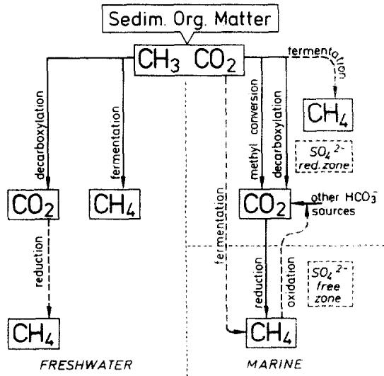  
FIG.1.Flow diagram comparing methanogenesis pathway by acetate fermentation and $\bar { \mathbf { C O } } _ { 2 }$ reduction in freshwaterand marine sediments.

Schematically depicted in Fig.1, the methyl position of acetate in anoxic freshwater sediments is fermented to methane.The carbon dioxide released by this acetate dissimilation may also be reduced to methane,though perhaps on a diminished scale.This $\mathbf { C O } _ { 2 }$ reduction could continue to operate even after acetate is exhausted and the acetate fermentation pathway ceases.

The mode of methane generation is somewhat different in the saline environments such as salt marshes and marine sediments (Fig.1). Based on culture studies, the reduction of $\mathbf { C O } _ { 2 }$ by hydrogen is considered here to be the dominant pathway for bacterial methane formation (BELYAEV et al., 1977; OREMLAND and TAY-LOR, 1978):

$$
\mathrm { C O } _ { 2 } + 8 ( \mathrm { H } ) \longrightarrow \mathrm { C H } _ { 4 } + 2 \mathrm { H } _ { 2 } \mathrm { O } .\tag{2}
$$

Stimulation of methanogenesis by hydrogen addition has been demonstrated by MYLROIE and HUNGATE (1955), OREMLAND and TAYLOR (1978),WINFREY and ZEIKUS (1977) and ABRAM and NEDWELL (1978a,b). This hydrogen addition was shown by WINFREY et al. (1977） to increase methane production via $\mathbf { C O _ { 2 } }$ reduction but had no effect on the fermentation rate.

As noted earlier,significant methane accumulations in marine sediments are usually not observed in the presence of oxygen or nitrate, nor where sulphate contents are higher than 1.O mM.This spatial partitioning of sulphate and methane lead to the earlier postulation of a noncommensurate behaviour between sulphate reducing and methanogenic bacteria. In contrast to the early resuIts of BARBER(1974),CAPPENBERG(1974) and WINFREY and ZEIKUs(1977) showing methanogenesis inhibition by sulphate,mutual coexistence has been demonstrated by LAWRENCE et al.(1964), LAW-RENCE and McCARTY (1965),POLCIN et al. (1981) and LovLEY et al. (1982).Methanogenesis in some freshwater environments is reported by CAPPENBERG (1975）to be inhibited by the relatively low sulphide activities.HoWever,INGVORSEN and BROCK(1982) have shown that methane and suiphide can coexist, and MAH et al.(1977) reported that sulphide in certain instances can actually stimulate methanogenesis.

In marine sediments the often higher sulphide concentration does not appear to inhibit methanogenesis (NIKAIDO,1977: OREMLAND and TAYLOR,1975). Although methanogens and sulphate reducing bacteria could coexist within the sulphate reducing zone, there is strong evidence that methanogenesis by fermentation is severely limited by substrate competition (e.g. for acetate,WINFREY and ZEIKUS, $^ { 1 9 7 7 } ;$ SCHONHEIT et al.,1982) and that successful competition for hydrogen by the sulphate reducing bacteria over the methanogens restricts the methanogenesis by $\mathbf { C O _ { 2 } }$ reduction pathway (WINFREY and ZEIKUS,1977: ABRAM and NEDWELL, 1978a.b: LOvLEY et al., 1982).

Another important metabolic difference between marine and freshwater sediments is that in the presence of higher amounts of sulphate, the methyl position of acetate is oxidized to $\mathbf { C O } _ { 2 }$ rather than being fermented to methane.This acetate conversion to $\mathbf { C O } _ { 2 }$ ,observed by WINFREY and ZEIKUS(1977).MOUNTFORT and ASHER (1978),MOUNTFORT et al.(1980),KING and WEIBE(1978).WINFREY and WARD(1983),and NED-WELL(1982） is reportedly mediated by sulphate reducing bacteria capable of oxidizing acetate.

This conversion of methyl to $\mathrm { C O } _ { 2 }$ further enlarges the bicarbonate pool available to $\mathrm { C O } _ { 2 }$ reducing bacteria,which become active following the exhaustion of sulphate.

Although both methane production pathways can operate in freshwater and marine sediments,the relative proportions of each pathway are variable and controlled by the availability of substrates and hydrogen to the methanogens,which in turn can be limited by competition from sulphate reducing bacteria.

These pathways of biogenic methane formation can be further substantiated by the use of carbon and hydrogen isotopes.As discussed next, the combination of isotopic measurements from freshwater and marine sediments on methane with the coexisting $\mathbf { C O } _ { 2 }$ and ${ \bf H } _ { 2 } { \bf O }$ produce distinctive fractionations which can delineate the various environments and pathways.

## HYDROGEN AND CARBON ISOTOPE VARIATIONS

## The data base

To test the general applicability of our hypotheses, a data base was created using the available hydrogen and carbon isotopic data on methane,carbon dioxide and the formation water from freshwater and marine situations. The data,a compilation of “in house"and published data from other workers,are grouped in Table l into various freshwater and marine (saline) environments,and experimental laboratory studies.

The isotope data selected were only those in sediments clearly in the primary methanogenesis region and judged to be free from major alteration effects such as oxidation.Although this compilation is not exhaustive,the purpose is to obtain representative values for the different natural environments.

Foran analytical description of the isotope methods employed,refer to FABER and STAHL(1983) and to the source publications in Table 1. The carbon and hydrogen isotopic resultsarereported relative to PDB and SMOW for $\delta ^ { 1 3 } C$ and δDrespectively in the usual notation:

Table 1a: Biogenic methane data base
<table><tr><td rowspan=1 colspan=25>SAMPLE    LOCATION       TEMP                      Dc           9    REFERENCENAME                         c  0100  0100      0100  100</td></tr><tr><td rowspan=1 colspan=11>VOLO BOG                     15.0VOLO BOG                    15.0VOLO BOG                     15.0</td><td></td><td></td><td></td><td></td><td></td><td></td><td></td><td></td><td></td><td></td><td></td><td></td><td></td><td></td></tr><tr><td rowspan=1 colspan=11>VOLO BOGVOLO BOG</td><td></td><td></td><td></td><td></td><td></td><td></td><td></td><td></td><td></td><td></td><td></td><td></td><td></td><td></td></tr><tr><td rowspan=1 colspan=11>VOLO BOG                     15.0</td><td></td><td></td><td></td><td></td><td></td><td></td><td></td><td></td><td></td><td></td><td></td><td></td><td></td><td></td></tr><tr><td rowspan=1 colspan=11>ALTWARMB.MOOR</td><td></td><td></td><td></td><td></td><td></td><td></td><td></td><td></td><td></td><td></td><td></td><td></td><td></td><td></td></tr><tr><td rowspan=1 colspan=11>ALTWARMB.MOOR               17.0</td><td rowspan=2 colspan=5>-60.3</td><td rowspan=2 colspan=5>-340-352</td><td></td><td></td><td></td><td></td></tr><tr><td rowspan=1 colspan=11>ALTWARMB.MOOR               17.0</td><td rowspan=1 colspan=3>-62.2.</td><td></td><td></td><td></td><td></td></tr><tr><td rowspan=1 colspan=11>BRAKE                        12.0</td><td rowspan=1 colspan=3>-68.0</td><td rowspan=2 colspan=3>1.043</td><td rowspan=1 colspan=2>-291</td><td rowspan=1 colspan=1>291</td><td></td><td></td><td></td><td></td><td></td></tr><tr><td></td><td></td><td></td><td></td><td></td><td></td><td></td><td></td><td></td><td></td><td></td><td></td><td></td><td></td><td rowspan=1 colspan=2></td><td rowspan=1 colspan=2></td><td rowspan=1 colspan=3></td><td></td><td></td></tr><tr><td rowspan=1 colspan=11>SIBERIAMARSH</td><td rowspan=1 colspan=3>-60.6-20.6</td><td rowspan=1 colspan=3>1.043</td><td rowspan=1 colspan=3></td><td rowspan=1 colspan=2></td><td></td><td></td><td></td></tr><tr><td rowspan=1 colspan=11>SIBERIA MARSH 3SIBERIA MARSH</td><td rowspan=1 colspan=2>-53.7-16</td><td rowspan=1 colspan=2>.2</td><td rowspan=1 colspan=2>1.040</td><td rowspan=1 colspan=3></td><td></td><td></td><td></td><td></td><td></td></tr><tr><td rowspan=2 colspan=11>SIBERIAMARSH 5</td><td></td><td></td><td></td><td></td><td></td><td></td><td></td><td></td><td></td><td></td><td></td><td></td><td></td><td></td></tr><tr><td rowspan=1 colspan=6>-56.2-17.2 1.041-58.9-11.3 1.051</td><td rowspan=1 colspan=3></td><td></td><td></td><td></td><td></td><td></td></tr><tr><td rowspan=1 colspan=11>SIBERIA MARSH 6</td><td rowspan=1 colspan=6>-49.9-15.4 1.036</td><td rowspan=1 colspan=3></td><td></td><td></td><td></td><td></td><td></td></tr><tr><td rowspan=1 colspan=10>SIBERIA MARSH 7SOVIET BIOGENIC GASES max.SOVIET BIOGENIC GASES min.</td><td rowspan=1 colspan=1></td><td rowspan=1 colspan=6>-61.7-18.0 1.047-90.0-60.0</td><td rowspan=1 colspan=3>-400-250</td><td></td><td></td><td></td><td></td><td></td></tr><tr><td rowspan=1 colspan=2>KOSHELEW</td><td rowspan=2 colspan=9>KA SOIL GAS，USSR</td><td rowspan=2 colspan=6>-72.0-23.0 1.053</td><td rowspan=1 colspan=2></td><td rowspan=1 colspan=2></td><td rowspan=1 colspan=2></td><td></td><td></td></tr><tr><td rowspan=1 colspan=2>FRESHWA</td><td rowspan=1 colspan=8>er Lake SEdImeNt5</td><td rowspan=1 colspan=3></td><td></td><td></td><td></td><td></td><td></td></tr><tr><td rowspan=1 colspan=2>QUASSAPA</td><td rowspan=1 colspan=9>UG                  7.8</td><td rowspan=1 colspan=6>-68.0-25.2 1.046</td><td rowspan=1 colspan=3></td><td></td><td></td><td></td><td></td><td></td></tr><tr><td rowspan=1 colspan=2>LINSLEY</td><td rowspan=1 colspan=9>POND(17/5）         7.1</td><td rowspan=1 colspan=6>-77.4-20.6 1.062</td><td rowspan=1 colspan=3></td><td></td><td></td><td></td><td></td><td></td></tr><tr><td rowspan=1 colspan=2>LINSLEY</td><td rowspan=1 colspan=9>7.0</td><td rowspan=1 colspan=6>-77.8-7.1  1.077</td><td rowspan=1 colspan=3></td><td></td><td></td><td></td><td></td><td></td></tr><tr><td></td><td></td><td rowspan=1 colspan=9>7.4</td><td></td><td></td><td></td><td></td><td></td><td></td><td></td><td></td><td></td><td></td><td></td><td></td><td></td><td></td></tr><tr><td rowspan=1 colspan=2>LINSLEY</td><td rowspan=1 colspan=8>POND(B/10)</td><td rowspan=1 colspan=1>7.4</td><td rowspan=1 colspan=1>-77.5</td><td rowspan=1 colspan=5>-7.2  1.076</td><td rowspan=1 colspan=3></td><td></td><td></td><td></td><td></td><td></td></tr><tr><td rowspan=1 colspan=10>WONONSCOPOMUC(22/7）</td><td rowspan=1 colspan=1>5.3</td><td rowspan=1 colspan=1>-59.7</td><td rowspan=1 colspan=5>-6.1  1.057</td><td></td><td></td><td></td><td></td><td></td><td></td><td></td><td></td></tr><tr><td rowspan=1 colspan=10>WONONSCOPOMUC(18/9）</td><td rowspan=1 colspan=1>s.7</td><td rowspan=1 colspan=1>-60.8</td><td rowspan=1 colspan=5>-14.7 1.049</td><td></td><td></td><td></td><td></td><td></td><td></td><td></td><td></td></tr><tr><td rowspan=1 colspan=10>QUEECHY(27/9）</td><td rowspan=1 colspan=1>7.0</td><td rowspan=1 colspan=1>-57.2</td><td></td><td></td><td></td><td></td><td></td><td></td><td></td><td></td><td></td><td></td><td></td><td></td><td></td></tr><tr><td rowspan=1 colspan=10>WG1.1.Wuormso..</td><td rowspan=1 colspan=1>19.0</td><td rowspan=1 colspan=1>-60.2</td><td rowspan=1 colspan=2>-3.0</td><td rowspan=1 colspan=3>1.061</td><td rowspan=1 colspan=7>-291</td><td></td></tr><tr><td rowspan=1 colspan=10>WG1.2.  N. Gormany</td><td rowspan=1 colspan=1>19.0</td><td rowspan=1 colspan=1>-60.2</td><td rowspan=1 colspan=2>-3.2</td><td rowspan=1 colspan=3>1.061</td><td rowspan=1 colspan=7>-295</td><td></td></tr><tr><td rowspan=2 colspan=10>WG1.4WG2.1</td><td rowspan=1 colspan=1>19.0</td><td rowspan=1 colspan=1>-57.8</td><td rowspan=1 colspan=2>-7.9</td><td rowspan=1 colspan=3>1.053</td><td rowspan=1 colspan=7>-294</td><td></td></tr><tr><td rowspan=1 colspan=1>18.8</td><td rowspan=1 colspan=1>-58.0</td><td rowspan=1 colspan=2>-8.8</td><td rowspan=1 colspan=3>1.052</td><td></td><td></td><td></td><td></td><td></td><td></td><td></td><td></td></tr><tr><td rowspan=1 colspan=10>WG2.2WG2.3</td><td rowspan=1 colspan=1>18.8</td><td rowspan=1 colspan=1>-57.8</td><td rowspan=1 colspan=2>-9.3</td><td rowspan=1 colspan=3>1.051</td><td rowspan=1 colspan=7>-308</td><td></td></tr><tr><td rowspan=2 colspan=10>WG2.4WG4.1</td><td rowspan=1 colspan=1>18.8</td><td rowspan=1 colspan=1>-59.3</td><td rowspan=1 colspan=2>-7.1</td><td rowspan=1 colspan=3>1.056</td><td rowspan=1 colspan=3>-312</td><td rowspan=1 colspan=4></td><td></td></tr><tr><td rowspan=1 colspan=1>19.0</td><td rowspan=1 colspan=1>-56.0</td><td rowspan=1 colspan=2>-11.4</td><td rowspan=1 colspan=3>1.047</td><td rowspan=1 colspan=3>-320</td><td rowspan=1 colspan=4></td><td></td></tr><tr><td rowspan=2 colspan=10>WG4.2WG4.3</td><td rowspan=1 colspan=1>19.0</td><td rowspan=1 colspan=1>-56.2</td><td rowspan=1 colspan=2>-15.2</td><td rowspan=1 colspan=3>1.044</td><td></td><td></td><td></td><td></td><td></td><td></td><td></td><td></td></tr><tr><td rowspan=1 colspan=1>19.0</td><td rowspan=1 colspan=1>-57.3</td><td rowspan=1 colspan=2>-17.1</td><td rowspan=1 colspan=3>1.043</td><td rowspan=1 colspan=3>-321</td><td rowspan=1 colspan=4></td><td></td></tr><tr><td rowspan=1 colspan=10>WG4.4</td><td rowspan=1 colspan=1>19.0</td><td rowspan=1 colspan=1>-56.9</td><td rowspan=1 colspan=2>-9.1</td><td rowspan=1 colspan=3>1.051</td><td rowspan=1 colspan=3>-319-324</td><td rowspan=1 colspan=4></td><td></td></tr><tr><td rowspan=1 colspan=10>WG6.2WG7.1</td><td rowspan=1 colspan=1>18.0</td><td rowspan=1 colspan=1>-53.8</td><td rowspan=1 colspan=2>-5.1</td><td rowspan=1 colspan=3>1.052</td><td rowspan=1 colspan=3>-321</td><td rowspan=1 colspan=4></td><td></td></tr><tr><td rowspan=1 colspan=3>WG7.2</td><td rowspan=1 colspan=7></td><td rowspan=1 colspan=1>18.0</td><td></td><td></td><td></td><td></td><td></td><td></td><td></td><td></td><td></td><td></td><td></td><td></td><td></td><td></td></tr><tr><td rowspan=2 colspan=2>WG7.3WG7.4</td><td rowspan=2 colspan=8></td><td rowspan=1 colspan=1>18.0</td><td rowspan=1 colspan=1>-54.0</td><td rowspan=1 colspan=2>-3.6</td><td rowspan=1 colspan=3>1.053</td><td rowspan=1 colspan=3>-323</td><td rowspan=2 colspan=4></td><td></td></tr><tr><td></td><td></td><td rowspan=1 colspan=2>-3.7</td><td rowspan=1 colspan=3>1.054</td><td rowspan=1 colspan=3>-325</td><td></td></tr><tr><td rowspan=1 colspan=1>WG5.1</td><td rowspan=4 colspan=9></td><td rowspan=1 colspan=1>17.5</td><td rowspan=1 colspan=1>-57.5</td><td rowspan=1 colspan=2>-13.8</td><td rowspan=1 colspan=3>1.046</td><td rowspan=1 colspan=3>-329</td><td></td><td></td><td></td><td></td><td></td></tr><tr><td rowspan=3 colspan=2>WG5.3</td><td></td><td></td><td></td><td></td><td></td><td></td><td></td><td></td><td></td><td></td><td></td><td></td><td></td><td></td><td></td></tr><tr><td></td><td></td><td></td><td></td><td></td><td></td><td></td><td></td><td></td><td></td><td rowspan=2 colspan=4>-21.8 1.459-21.71.446</td><td></td></tr><tr><td rowspan=1 colspan=1>17.5</td><td rowspan=1 colspan=1>-57.4</td><td rowspan=1 colspan=2>-17.9</td><td rowspan=1 colspan=3>1.042</td><td rowspan=1 colspan=3>-323</td><td></td></tr><tr><td rowspan=1 colspan=4>WG8.1</td><td rowspan=1 colspan=6></td><td rowspan=1 colspan=1>18.5</td><td rowspan=1 colspan=1>-53.4</td><td rowspan=1 colspan=2>-7.6</td><td rowspan=1 colspan=3>1.048</td><td rowspan=1 colspan=3>-332</td><td rowspan=1 colspan=4></td><td></td></tr><tr><td rowspan=1 colspan=10>WGB.2</td><td rowspan=1 colspan=1>18.5</td><td rowspan=1 colspan=1>-53.9</td><td rowspan=1 colspan=2>-7.9</td><td rowspan=1 colspan=3>1.049</td><td rowspan=1 colspan=3>-334</td><td rowspan=1 colspan=4></td><td></td></tr><tr><td rowspan=1 colspan=10>WG8.3</td><td rowspan=1 colspan=1>18.5</td><td rowspan=1 colspan=1>-52.1</td><td rowspan=1 colspan=2>-8.5</td><td rowspan=1 colspan=3>1.046</td><td rowspan=1 colspan=3>-338</td><td rowspan=1 colspan=4></td><td></td></tr><tr><td rowspan=1 colspan=10>WG8.4</td><td rowspan=1 colspan=1>18.5</td><td rowspan=1 colspan=1>-52.4</td><td rowspan=1 colspan=2>-9.8</td><td rowspan=1 colspan=3>1.045</td><td rowspan=1 colspan=3>-331</td><td rowspan=1 colspan=4></td><td></td></tr><tr><td rowspan=1 colspan=10>WG9.1</td><td rowspan=1 colspan=1>18.5</td><td rowspan=1 colspan=1>-60.4</td><td rowspan=1 colspan=2>-14.0</td><td rowspan=1 colspan=3>1.049</td><td rowspan=1 colspan=3>-328</td><td rowspan=1 colspan=4>-24.6 1.452</td><td></td></tr><tr><td></td><td></td><td></td><td></td><td></td><td></td><td></td><td></td><td></td><td></td><td></td><td></td><td></td><td></td><td rowspan=1 colspan=3>1.051</td><td rowspan=1 colspan=3>-331</td><td rowspan=1 colspan=4>-27.31.</td><td></td></tr><tr><td rowspan=1 colspan=10>WG9.3</td><td rowspan=1 colspan=1>18.5</td><td rowspan=1 colspan=1>-57.8</td><td rowspan=1 colspan=2>-13.5</td><td rowspan=1 colspan=3>1.047</td><td rowspan=1 colspan=3>-333</td><td rowspan=1 colspan=4></td><td></td></tr><tr><td rowspan=1 colspan=4>WG9.4</td><td rowspan=1 colspan=6></td><td rowspan=1 colspan=1>18.5</td><td rowspan=1 colspan=1>-58.0</td><td rowspan=1 colspan=2>-15.4</td><td rowspan=1 colspan=3>1.045</td><td rowspan=1 colspan=3>-332</td><td rowspan=1 colspan=4></td><td></td></tr><tr><td rowspan=1 colspan=2>WG10.1</td><td rowspan=2 colspan=8></td><td rowspan=1 colspan=1>17.5</td><td rowspan=1 colspan=1>-59.4</td><td rowspan=1 colspan=2>-15.1</td><td rowspan=1 colspan=3>1.047</td><td></td><td></td><td></td><td></td><td></td><td></td><td></td><td></td></tr><tr><td rowspan=1 colspan=1>WG10.2</td><td></td><td rowspan=1 colspan=5></td><td rowspan=1 colspan=1>17.5</td><td rowspan=1 colspan=1>-57.7</td><td rowspan=1 colspan=2>-14.6</td><td rowspan=1 colspan=3>1.046</td><td rowspan=1 colspan=3>-311</td><td rowspan=1 colspan=4></td><td></td></tr><tr><td rowspan=1 colspan=2>WG10.3</td><td rowspan=1 colspan=8></td><td></td><td></td><td></td><td></td><td></td><td></td><td></td><td></td><td></td><td></td><td></td><td></td><td></td><td></td><td></td></tr><tr><td rowspan=1 colspan=2>WGWG14.2</td><td rowspan=1 colspan=8>14.1</td><td rowspan=1 colspan=1>16.0</td><td rowspan=1 colspan=1>-58.3</td><td rowspan=1 colspan=2>-21.1</td><td rowspan=1 colspan=3>1.040</td><td rowspan=1 colspan=3>-329</td><td rowspan=1 colspan=4></td><td rowspan=1 colspan=1></td></tr><tr><td></td><td rowspan=1 colspan=9></td><td rowspan=1 colspan=1></td><td rowspan=1 colspan=1>16.0</td><td rowspan=1 colspan=1>-58.6</td><td rowspan=1 colspan=2>19.8</td><td rowspan=1 colspan=3>1.052</td><td rowspan=1 colspan=3>-331</td><td rowspan=1 colspan=4></td><td rowspan=1 colspan=1>WG14.3</td></tr><tr><td rowspan=1 colspan=1>WG14.4</td><td></td><td rowspan=1 colspan=8></td><td rowspan=1 colspan=1>16.0</td><td rowspan=1 colspan=1>-55.2</td><td rowspan=1 colspan=2>-14.4</td><td rowspan=1 colspan=3>1.043</td><td rowspan=1 colspan=3>-334</td><td rowspan=1 colspan=4></td><td></td></tr><tr><td rowspan=2 colspan=2>WG16.1</td><td rowspan=1 colspan=5></td><td rowspan=1 colspan=3></td><td rowspan=1 colspan=1>17.5</td><td rowspan=1 colspan=1>-58.2</td><td rowspan=1 colspan=2>-11.5</td><td rowspan=1 colspan=3>1.050</td><td rowspan=1 colspan=3>~323</td><td rowspan=1 colspan=4></td><td></td></tr><tr><td rowspan=1 colspan=1>WG16.2</td><td rowspan=4 colspan=10>WG16.3</td><td rowspan=1 colspan=1></td><td rowspan=1 colspan=1>17.5</td><td rowspan=1 colspan=3>-58.6</td><td rowspan=1 colspan=4>-12.5</td><td rowspan=1 colspan=3>1.049</td><td rowspan=1 colspan=1>-326</td><td></td></tr><tr><td></td><td rowspan=3 colspan=2></td><td></td><td></td><td></td><td></td><td></td><td></td><td></td><td></td><td></td><td></td><td></td><td></td><td></td><td></td></tr><tr><td></td><td></td><td></td><td></td><td></td><td></td><td></td><td></td><td></td><td></td><td rowspan=2 colspan=4></td><td></td></tr><tr><td></td><td rowspan=1 colspan=1>17.5</td><td rowspan=1 colspan=1>-58.2</td><td rowspan=1 colspan=2>-10.9</td><td rowspan=1 colspan=3>1.050</td><td rowspan=1 colspan=3>-335</td><td></td></tr><tr><td rowspan=1 colspan=8>WG16.4WG18.1</td><td rowspan=2 colspan=3></td><td rowspan=1 colspan=1>17.s18.0</td><td rowspan=1 colspan=2>-58.9-58.3</td><td rowspan=1 colspan=3>-13.0-10.3</td><td rowspan=1 colspan=4>1.0491.051</td><td rowspan=1 colspan=2>-334-327</td><td rowspan=1 colspan=1>-20.0 1.457</td><td></td></tr><tr><td></td><td></td><td rowspan=2 colspan=8></td><td rowspan=1 colspan=1>18.0</td><td rowspan=1 colspan=1>-58.7</td><td rowspan=1 colspan=2>-11.5</td><td rowspan=1 colspan=3>1.050</td><td rowspan=1 colspan=3>-329</td><td rowspan=1 colspan=4>WG18.3</td><td></td><td></td><td></td></tr><tr><td></td><td></td><td rowspan=1 colspan=1>18.0</td><td rowspan=1 colspan=1>-58.0</td><td rowspan=1 colspan=2>-12.0</td><td rowspan=1 colspan=3>1.049</td><td></td><td></td><td></td><td></td><td></td><td></td><td></td><td></td></tr><tr><td rowspan=2 colspan=2>WG18.4WG19.4</td><td rowspan=2 colspan=8></td><td rowspan=2 colspan=1>18.019.0</td><td rowspan=2 colspan=1>-59.9-64.0</td><td rowspan=2 colspan=2>-13.0-15.3</td><td rowspan=2 colspan=3>1.0501.052</td><td></td><td></td><td></td><td></td><td></td><td></td><td></td><td></td></tr><tr><td rowspan=1 colspan=3>-331-324-323</td><td rowspan=1 colspan=4>-28.1 1.438</td><td></td></tr><tr><td rowspan=1 colspan=1>WG20.1WG20.2</td><td rowspan=1 colspan=8></td><td></td><td rowspan=1 colspan=1>17.517.5</td><td rowspan=1 colspan=1>-58.9-59.5</td><td rowspan=1 colspan=2>-15.6-16.1</td><td rowspan=1 colspan=3>1.0461.046</td><td rowspan=1 colspan=3>-313-316</td><td></td><td></td><td></td><td></td><td></td></tr><tr><td rowspan=1 colspan=1>WG20.3</td><td></td><td></td><td></td><td></td><td></td><td></td><td></td><td></td><td></td><td></td><td></td><td></td><td></td><td></td><td></td><td></td><td></td><td></td><td></td><td></td><td></td><td></td><td></td><td></td></tr><tr><td rowspan=2 colspan=3>WG20.4</td><td></td><td></td><td></td><td></td><td></td><td></td><td></td><td></td><td></td><td></td><td></td><td></td><td></td><td></td><td></td><td></td><td></td><td></td><td></td><td></td><td></td><td></td></tr><tr><td rowspan=1 colspan=8></td><td></td><td rowspan=1 colspan=1>17.517.5</td><td rowspan=1 colspan=1>-58.9-59.0</td><td rowspan=1 colspan=2>-13.8-10.8</td><td rowspan=1 colspan=3>1.0481.051</td><td rowspan=1 colspan=3>-318-319</td><td></td><td></td><td></td><td></td><td></td></tr><tr><td rowspan=1 colspan=3>WG21.1</td><td rowspan=7 colspan=9>WG21.2WG21.3WG21.4WG23.1WG23.2</td><td rowspan=1 colspan=1>17.5</td><td rowspan=1 colspan=3>-58.3</td><td rowspan=1 colspan=4>-10.8</td><td rowspan=1 colspan=3>1.051</td><td rowspan=1 colspan=1>~326</td><td></td></tr><tr><td rowspan=1 colspan=4>WG21.2</td><td rowspan=1 colspan=1>17.517.5</td><td rowspan=1 colspan=1>-58.6</td><td rowspan=1 colspan=2>-11.2</td><td rowspan=1 colspan=3>1.050</td><td rowspan=1 colspan=3>-327</td><td></td><td></td><td></td><td></td><td></td></tr><tr><td rowspan=4 colspan=4></td><td></td><td></td><td></td><td></td><td></td><td></td><td></td><td></td><td></td><td></td><td></td><td></td><td></td></tr><tr><td rowspan=1 colspan=1>-58.9</td><td rowspan=1 colspan=2>-10.8</td><td></td><td></td><td></td><td></td><td></td><td></td><td></td><td></td><td></td><td></td><td></td></tr><tr><td rowspan=1 colspan=2>-11.6</td><td rowspan=1 colspan=3>1.051</td><td rowspan=2 colspan=3>-326-322</td><td></td><td></td><td></td><td></td><td></td></tr><tr><td rowspan=1 colspan=1>15.5</td><td rowspan=1 colspan=1>-59.2</td><td rowspan=1 colspan=2>-14.1</td><td rowspan=1 colspan=3>1.048</td><td rowspan=1 colspan=3>-313</td><td></td><td></td><td></td><td></td><td></td></tr><tr><td></td><td></td><td></td><td rowspan=1 colspan=1>15.5</td><td rowspan=1 colspan=1>-56.7</td><td rowspan=1 colspan=2>-12.</td><td rowspan=1 colspan=3>1.047</td><td rowspan=1 colspan=3>-314</td><td></td><td></td><td></td><td></td><td></td></tr></table>

Table 1b: Biogenic methane data base
<table><tr><td>SAMPLE NAME</td><td>LOCATION</td><td>c</td><td>TEMP 13c, 0</td><td>13co2</td><td></td><td></td><td>~c</td><td>DC1 0100</td><td>6DH2 aD</td><td>REFERENCE</td><td></td><td></td></tr><tr><td>GLACIAL DRIFT GAS</td><td></td><td></td><td></td><td></td><td></td><td>°100</td><td></td><td></td><td></td><td>000</td><td rowspan="4"></td><td rowspan="4"></td></tr><tr><td>ILLINOIS.USA ILLINOIS，</td><td></td><td></td><td></td><td></td><td></td><td></td><td></td><td></td><td></td><td></td></tr><tr><td></td><td>USA</td><td>10.0</td><td></td><td>10.0 -82.7 -91.0</td><td></td><td></td><td></td><td></td><td>-245 -47.0 1.262</td><td>SCHOELL，1980</td></tr><tr><td rowspan="11"></td><td>ILLINOIS、USA ILLINOIS.USA</td><td>10.0 10.0</td><td></td><td>-72.8</td><td></td><td></td><td></td><td>-226 -239</td><td>-40.0 1.261 -50.0 1.240</td><td></td></tr><tr><td>ILLINOIS,USA</td><td></td><td>10.0</td><td>-73.0 -76.0</td><td></td><td></td><td></td><td>-234 -239</td><td></td><td></td></tr><tr><td>ILLINOIS,USA GLACIAL DRIFT GAS MARINE MARSH</td><td></td><td>10.0</td><td>-75.7 -75.0 -7.9</td><td></td><td></td><td></td><td>-277</td><td>-85.0 1.266</td><td>COLEMAN,1976</td></tr><tr><td>PHIL/10 MARGOT</td><td></td><td></td><td></td><td></td><td>1.073</td><td></td><td></td><td></td><td></td></tr><tr><td>PHIL/31 MARGOT LALA GERM/BRAKE MARSH GAS SHALLOW MARINE SAANICH INLET</td><td>20.0 12.0</td><td>20.0 -76.2 -76.2 -68.8</td><td></td><td></td><td></td><td>-207 -216</td><td>-244 -60.0 1.243</td><td></td><td>SCHOELL，1980</td></tr><tr><td rowspan="10"></td><td></td><td></td><td></td><td></td><td>1.077</td><td></td><td></td><td>-219 -25.4 1.248</td></tr><tr><td>15550-3 Baltic Soa 15550-4 15550-5 15550-6 15550-7 15551-8</td><td>9.0</td><td>-55.6 -84.6</td><td>16.7</td><td></td><td></td><td>-27.0 1.293 -28.5 -27.7</td><td>NISSeNbaUm ●t al., 1972</td></tr><tr><td>WHITICAR and WERNER，1981</td><td>-84.5</td><td></td><td></td><td></td><td>-247 -247 -246</td><td>-27.1</td><td>1.291 1.291 1.285</td></tr><tr><td></td><td>-82.5 -80.8</td><td></td><td></td><td></td><td>-243 -234</td><td></td><td></td></tr><tr><td></td><td>-79.6 -77.9 -81.4</td><td></td><td></td><td></td><td>-250 -237 -229</td><td></td><td></td></tr><tr><td>15551-9 15551-10 15551-11 Gulf of Moxico</td><td>-82.0 -84.3</td><td></td><td></td><td>1.073</td><td></td><td></td><td>WHELAN et al., 1978</td></tr><tr><td>BH2 14 BH2 35</td><td>-80.1 -82.3</td><td>-12.8</td><td>.9</td><td></td><td></td><td></td><td>DOOSE，1980</td></tr><tr><td>BH2 50 BH2 65 GAS-024 GAS-024</td><td></td><td>-53.2 -5.0 -65.6</td><td>-17.0</td><td>1.074 1.075 1.079</td><td></td><td></td><td></td></tr><tr><td>GAS-025 GAS-025 GAS-025 GAS-029 GAS-029 SOG ST</td><td></td><td>-90.4 -23.0 -85.4 -85.7</td><td>-17.0 -13.7</td><td>1.077 1.081</td><td></td><td></td><td></td></tr><tr><td>Deep Soa Drill Projoct</td><td></td><td></td><td>-81.9 -10.9 -81.8 -7.1 -76.8 -26.3</td><td></td><td>1.055</td><td></td><td></td></tr><tr><td>Ridg.</td><td></td><td></td><td>-92.8 -20.2 -89.4 -16.9</td><td></td><td>1.080</td><td></td><td></td></tr><tr><td></td><td></td><td></td><td></td><td></td><td>1.081 1.062 1.080</td><td></td><td></td></tr><tr><td></td><td></td><td></td><td></td><td></td><td>1.075</td><td></td><td></td></tr><tr><td>DEEP MARINE</td><td></td><td></td><td></td><td></td><td>1.057</td><td></td><td></td></tr><tr><td></td><td></td><td>-72.8 -77.1</td><td>-88.4 -32.1</td><td></td><td>1.060</td><td></td><td></td></tr><tr><td>11-102-5 11-104-7</td><td></td><td></td><td></td><td></td><td></td><td></td><td></td></tr><tr><td>11-102-11 11-102-19 11-104-3 11-104-9 11-106-B-2 11-106-B-S 14-144-A-6 15-147-9 15-147-12</td><td></td><td>-70.7</td><td></td><td></td><td></td><td></td><td></td></tr><tr><td></td><td>Blake-Bahama</td><td>-70.1</td><td>-76.3 -23.2</td><td></td><td></td><td></td><td></td></tr><tr><td></td><td></td><td>-86.1 -73.7</td><td>1.0 17.9 -14.6</td><td></td><td></td><td></td><td></td></tr><tr><td></td><td></td><td></td><td>-14.4 -23.2</td><td></td><td></td><td></td><td></td></tr><tr><td></td><td></td><td></td><td></td><td></td><td></td><td></td><td></td></tr><tr><td></td><td></td><td></td><td></td><td></td><td>1.060</td><td></td><td></td></tr><tr><td></td><td></td><td></td><td></td><td></td><td>1.069</td><td></td><td></td></tr><tr><td>Rise</td><td>L.continental Demorara Rise Cariaco Trench</td><td></td><td>-7.4</td><td></td><td>1.072</td><td></td><td></td></tr><tr><td></td><td></td><td></td><td></td><td>-20.2</td><td>1.054</td><td></td><td></td></tr><tr><td></td><td></td><td>-70.8 -65.0</td><td></td><td>3.7</td><td>1.073 1.073 1.081 1.077 1.069 1.065</td><td>-179</td><td>11.2</td></tr><tr><td>15-147-18 15-147-C-7</td><td></td><td>-61.7</td><td>6.5 -65.0 10.5</td><td></td><td>1.067</td><td>-173</td><td></td></tr><tr><td>15-147-B-6-2 15-147-B-7-4</td><td></td><td>-64.7</td><td>6.9</td><td></td><td>1.063</td><td>-175</td><td></td></tr><tr><td>15-147-10 15-147-B-9-4</td><td></td><td>-67.6 -65.2</td><td>-3.1 -4.2 -2.3 -1.6 .1</td><td></td><td>1.070 1.063</td><td>B.1 -179</td><td>1.232</td></tr><tr><td>15-147-B-11-3 15-147-14-3</td><td></td><td>-64.6</td><td>.7</td><td></td><td>1.070</td><td>9.9 -179 -181</td><td>1.219 1.224</td></tr><tr><td>15-147-C-2-2</td><td></td><td>-60.8 -65.8</td><td>.2</td><td></td><td></td><td>9.9 8.2</td><td>1.228</td></tr><tr><td>15-147-C-4-4</td><td></td><td>-59.6</td><td></td><td></td><td></td><td></td><td></td></tr><tr><td>15-147-C-7-3</td><td></td><td>-65.1</td><td></td><td></td><td></td><td>4.0 6.6</td><td>1.226</td></tr><tr><td>15-154-A-7</td><td></td><td>-64.4</td><td></td><td></td><td>1.069</td><td>-183</td><td></td></tr><tr><td>Aleutian Trench</td><td></td><td>-9.0</td><td></td><td>.3</td><td></td><td></td><td>1.232</td></tr><tr><td>15-154-5 18-180</td><td></td><td>-64.6 -2.0</td><td></td><td></td><td>1.068</td><td></td><td></td></tr><tr><td>15-154-9 18-124 18-174 18-174 18-174 18-174 18-174 18-174 18-180</td><td>Columbian Abyssal Rise Astoria Fan</td><td>-69.1 -71.9 -88.0 -77.0 -78.0 -73.0</td><td>-81.3 -23.8 -22.4 -24.8 -23.0 -10.0</td><td>.8</td><td>1.063 1.050 1.051 1.071 1.073 1.075</td><td>-176 6.3</td><td>1.221</td></tr></table>

Table ic:Biogenic methane data base
<table><tr><td rowspan=1 colspan=14>SAMPLE    LOCATION      TEMP                 “C Dc1         aD   REFERENCENAME                         c  j0  0100              0100</td></tr><tr><td rowspan=1 colspan=11>64--481A-12-5                28.Q-52.564-481A-14-6               31.5-57.564-481A-20-2                39.8-60.2-3.3  1.061</td><td></td><td></td><td></td></tr><tr><td rowspan=1 colspan=11>64-481A-26-6                49.8-61.664-481A-30-7                56.0-60.4</td><td rowspan=1 colspan=2>-172-1.3-1742.1</td><td></td></tr><tr><td rowspan=1 colspan=7>76-533-A-1-6Blake Outer</td><td rowspan=1 colspan=4>-81.3-11.9 1.076</td><td rowspan=1 colspan=2></td><td></td></tr><tr><td rowspan=1 colspan=7>76-533-20-1   Ridge</td><td rowspan=1 colspan=4>81.3</td><td rowspan=1 colspan=3>-8.7  1.077</td></tr><tr><td rowspan=1 colspan=7>76-533-22-1</td><td rowspan=1 colspan=1>-79.8</td><td></td><td></td><td></td><td></td><td></td><td></td></tr><tr><td rowspan=2 colspan=8>76-533-28-3                       -75.9</td><td></td><td></td><td></td><td></td><td></td><td></td></tr><tr><td rowspan=1 colspan=5></td><td></td></tr><tr><td rowspan=1 colspan=8>76-533-34-1                       -73.5</td><td rowspan=1 colspan=5>-3.5  .076</td><td></td></tr><tr><td rowspan=1 colspan=8>76-533-40-2                       -71.3</td><td rowspan=1 colspan=5>-2.0  3.075</td><td></td></tr><tr><td rowspan=3 colspan=8>76-533-A-5-6                      -71.3</td><td></td><td></td><td></td><td></td><td></td><td></td></tr><tr><td></td><td></td><td></td><td></td><td></td><td rowspan=3 colspan=1></td></tr><tr><td rowspan=1 colspan=5>-4.5  1.072</td></tr><tr><td rowspan=1 colspan=6>76-533-A-11-4</td><td rowspan=1 colspan=1></td><td rowspan=1 colspan=1>-68.2</td><td></td><td></td><td></td><td></td><td></td></tr><tr><td rowspan=1 colspan=6>76-533-A-15-2</td><td rowspan=1 colspan=1></td><td rowspan=1 colspan=6>-68.1-2.9  1.070</td><td rowspan=1 colspan=1></td></tr><tr><td rowspan=1 colspan=6>76-533-A-18-4</td><td rowspan=1 colspan=1></td><td rowspan=1 colspan=6>-67.1-6.3  1.065</td><td rowspan=2 colspan=1></td></tr><tr><td rowspan=1 colspan=6>76-533-A-20-676-533-A-24-5</td><td rowspan=1 colspan=1></td><td rowspan=1 colspan=6>-68.1-4.8  1.068-67.5-4.3 1068</td></tr><tr><td rowspan=2 colspan=6>76-533-A-29-1</td><td rowspan=2 colspan=5>-67.6-2.9  1.069-79.6</td><td rowspan=2 colspan=2>-205</td><td></td></tr><tr><td rowspan=1 colspan=1></td></tr><tr><td rowspan=1 colspan=3>95-603D-1-395-603D-1-4</td><td rowspan=1 colspan=4></td><td rowspan=1 colspan=4>-79.7</td><td rowspan=1 colspan=2></td><td rowspan=1 colspan=1>-261</td></tr><tr><td rowspan=3 colspan=6>95-603D-1-495-603D-1-7</td><td rowspan=1 colspan=1></td><td rowspan=1 colspan=4>-75.2</td><td rowspan=1 colspan=2></td><td></td></tr><tr><td rowspan=2 colspan=4>-80.1</td><td rowspan=2 colspan=1></td><td></td><td></td><td></td></tr><tr><td rowspan=1 colspan=2>-175-186</td><td></td></tr><tr><td rowspan=4 colspan=6>95-613-5W-195-613-6X-395-613-6X-595-613-9X-5</td><td></td><td></td><td></td><td></td><td></td><td></td><td></td><td></td></tr><tr><td rowspan=2 colspan=2>-81.6</td><td rowspan=2 colspan=1></td><td rowspan=2 colspan=1></td><td rowspan=2 colspan=1></td><td></td><td></td><td></td></tr><tr><td rowspan=1 colspan=2>-177-20s</td><td rowspan=2 colspan=1>2.03.5</td></tr><tr><td rowspan=1 colspan=1></td><td rowspan=1 colspan=1></td><td rowspan=1 colspan=1></td><td rowspan=1 colspan=1></td><td rowspan=1 colspan=1></td><td></td><td></td></tr><tr><td rowspan=1 colspan=6>95-613-12X-395-613-16X-5</td><td rowspan=1 colspan=1></td><td rowspan=1 colspan=1>-81.7-84.8</td><td rowspan=1 colspan=1></td><td rowspan=1 colspan=1></td><td rowspan=1 colspan=1></td><td rowspan=1 colspan=2>-184</td><td rowspan=1 colspan=1>2.2</td></tr><tr><td rowspan=2 colspan=6>95-613--17X-195-613-17X-2</td><td rowspan=1 colspan=1></td><td rowspan=1 colspan=1>-83.3</td><td rowspan=1 colspan=1></td><td rowspan=1 colspan=1></td><td rowspan=1 colspan=1></td><td rowspan=2 colspan=2>-192-182</td><td rowspan=2 colspan=1>1.2</td></tr><tr><td rowspan=1 colspan=2></td><td rowspan=1 colspan=1></td><td rowspan=1 colspan=1>-83.5</td><td rowspan=1 colspan=1></td><td rowspan=1 colspan=1></td><td rowspan=1 colspan=1></td></tr><tr><td rowspan=1 colspan=3>GULF OF CALIFORNIABLACK SEA 113b</td><td rowspan=1 colspan=4></td><td rowspan=1 colspan=1></td><td rowspan=1 colspan=1>-76.0-63.7</td><td rowspan=1 colspan=2>-17.0-16.5</td><td rowspan=1 colspan=1>1.1.</td><td rowspan=1 colspan=1>0640s0</td><td rowspan=1 colspan=1></td></tr><tr><td rowspan=1 colspan=4>BLACK SEA 114a</td><td rowspan=1 colspan=2></td><td rowspan=1 colspan=1></td><td rowspan=1 colspan=1>-60.0</td><td rowspan=1 colspan=1>-12.3</td><td rowspan=1 colspan=1>1.</td><td rowspan=1 colspan=1>051</td><td rowspan=1 colspan=2></td><td></td></tr><tr><td></td><td></td><td></td><td></td><td></td><td></td><td></td><td></td><td></td><td></td><td></td><td rowspan=4 colspan=2></td><td></td></tr><tr><td></td><td></td><td></td><td></td><td></td><td></td><td></td><td></td><td></td><td></td><td></td><td rowspan=3 colspan=1></td></tr><tr><td rowspan=1 colspan=3>BLACK SEA 109</td><td rowspan=2 colspan=4>10</td><td rowspan=1 colspan=1></td><td rowspan=1 colspan=1>-62.4</td><td rowspan=1 colspan=1>9.0</td><td rowspan=1 colspan=1>1.</td><td rowspan=1 colspan=2>076</td></tr><tr><td rowspan=1 colspan=2>BALTIC SEA</td><td></td><td rowspan=1 colspan=1>.0</td><td rowspan=1 colspan=1>-64.0</td><td rowspan=1 colspan=1>-23.0</td><td rowspan=1 colspan=1>1.</td><td rowspan=1 colspan=1>044</td></tr><tr><td rowspan=1 colspan=6>1138-4-1Antarctic</td><td></td><td></td><td></td><td></td><td></td><td></td><td></td><td></td></tr><tr><td rowspan=2 colspan=6>1138-4-2  Peninsula</td><td rowspan=2 colspan=1></td><td rowspan=2 colspan=3>-95.8</td><td rowspan=2 colspan=1></td><td rowspan=2 colspan=2>-200</td><td></td></tr><tr><td rowspan=1 colspan=1>245</td></tr><tr><td></td><td></td><td></td><td></td><td></td><td></td><td></td><td rowspan=1 colspan=3>-89.2</td><td rowspan=1 colspan=1></td><td rowspan=1 colspan=2>-198</td><td rowspan=1 colspan=1>21</td></tr><tr><td rowspan=2 colspan=7>1138-4-41138-5-11145-4-3                     -1.3</td><td rowspan=1 colspan=1></td><td rowspan=1 colspan=4>-93.2-83.9</td><td rowspan=1 colspan=1></td><td rowspan=1 colspan=1>-205-191</td></tr><tr><td rowspan=1 colspan=3>-97.3-15.8 1.</td><td rowspan=1 colspan=1>090</td><td rowspan=1 colspan=2>-196</td><td rowspan=1 colspan=1>-6.3</td></tr><tr><td rowspan=1 colspan=7>1145-4-5                    -1.31145-4-4                    -1.3</td><td rowspan=1 colspan=3>-76.6-23.01.-101.</td><td rowspan=1 colspan=1>058</td><td rowspan=1 colspan=2>--168</td><td rowspan=1 colspan=1>6.4-6.4</td></tr><tr><td rowspan=1 colspan=3>1164-1-1</td><td rowspan=1 colspan=4>-1.3</td><td rowspan=2 colspan=2>-88.1-88.3</td><td rowspan=2 colspan=1></td><td rowspan=2 colspan=1></td><td rowspan=2 colspan=2>-200--199-</td><td rowspan=2 colspan=1>5.05.1</td></tr><tr><td></td><td></td><td></td><td></td><td></td><td rowspan=1 colspan=2>-1.3</td></tr><tr><td rowspan=1 colspan=5>1166-1-8</td><td rowspan=1 colspan=2>-1.3</td><td rowspan=1 colspan=2>-63.3-4.5</td><td rowspan=1 colspan=1></td><td rowspan=1 colspan=1>.063</td><td rowspan=1 colspan=2></td><td rowspan=5 colspan=1>-5.05.0-4.8</td></tr><tr><td rowspan=1 colspan=5>1166-1-7</td><td rowspan=1 colspan=2>~1.3</td><td rowspan=1 colspan=2>-87.6</td><td rowspan=1 colspan=1></td><td rowspan=1 colspan=1></td><td rowspan=1 colspan=2>-211-</td></tr><tr><td rowspan=1 colspan=5>1166-1-6</td><td rowspan=1 colspan=2>-1.3</td><td rowspan=1 colspan=3>-89.7-18.1 1.</td><td rowspan=1 colspan=1>079</td><td rowspan=1 colspan=2></td></tr><tr><td rowspan=2 colspan=7>1166-1-5                    -1.31166-1-4                    -1.31166-1-3                     .</td><td rowspan=2 colspan=3>-88.6-88.7-18.7 1.0-97.8</td><td rowspan=2 colspan=1>77</td><td></td><td></td></tr><tr><td rowspan=1 colspan=2>-116</td></tr><tr><td rowspan=1 colspan=10>1166-1-2                     -1.3-90.7-6.8  1.1166-1-1                    -1.3-85.4</td><td rowspan=1 colspan=1>092</td><td rowspan=1 colspan=2>-200-194</td><td></td></tr><tr><td rowspan=1 colspan=7>ORCA BASIN                  5.7ORCA BASIN                  5.7</td><td rowspan=1 colspan=3>~96.Q-27.8-94.0-24.8</td><td></td><td></td><td></td><td></td></tr><tr><td rowspan=2 colspan=5>ORCA BASINORCA BASINORCA BASINORCA BASIN</td><td rowspan=1 colspan=2>5.75.7</td><td rowspan=1 colspan=3>-98.0-24.6-90.0-23.9</td><td></td><td></td><td></td><td></td></tr><tr><td rowspan=1 colspan=3></td><td rowspan=1 colspan=3></td><td rowspan=1 colspan=1>5.7</td><td rowspan=1 colspan=3>-85.0-31.3</td><td rowspan=1 colspan=1>1.059</td><td rowspan=1 colspan=2>059.</td><td></td></tr><tr><td></td><td></td><td rowspan=2 colspan=3></td><td rowspan=2 colspan=5>26.0-42.2</td><td></td><td></td><td></td><td></td></tr><tr><td></td><td></td><td rowspan=1 colspan=3>-31s-303-291</td><td></td></tr></table>

Table 1d:Biogenic methane data base
<table><tr><td rowspan=1 colspan=17>SAMPLE    LOCATION       TEMP  $5 ^ { 1 3 } 0 _ { 1 } 5 ^ { 1 3 } 0 0 _ { 2 }$   ${ ^ \circ } _ { \mathsf { C } }$   $^ { \mathfrak { s o } } { } _ { \mathsf { c } _ { 1 } }$    $\sin _ { 2 } 0 a _ { 0 }$    REFERENCENAME                          $\circ _ { \mathsf { C } }$    $\circ \mathrm { \Pi } _ { / \circ \circ }$    $\textsf { \textsf { o } } _ { / \infty }$         $\rho _ { / 0 0 }$    $\Delta 1 0 0$ </td></tr><tr><td rowspan=1 colspan=10>BIOGENIC GAS FIELDS</td><td rowspan=1 colspan=1></td><td></td><td></td><td></td><td></td><td></td><td></td></tr><tr><td rowspan=2 colspan=10>NIIGATAMOBARA                       26.5</td><td rowspan=1 colspan=5></td><td rowspan=1 colspan=1>-66.5</td><td rowspan=1 colspan=1>-15.8</td></tr><tr><td rowspan=1 colspan=1>-65.7</td><td rowspan=1 colspan=3>-9.6  1.060</td><td></td><td></td><td></td></tr><tr><td rowspan=1 colspan=10>SUWA                         17.5YAMAGATA                    17.0</td><td rowspan=1 colspan=1>-70.5</td><td rowspan=1 colspan=3>-6.0  1.070</td><td rowspan=1 colspan=1>-226</td><td></td><td></td></tr><tr><td></td><td></td><td></td><td></td><td></td><td></td><td></td><td></td><td></td><td></td><td rowspan=1 colspan=1>-70.1</td><td rowspan=1 colspan=3>-5.0  1.070</td><td rowspan=1 colspan=1></td><td></td><td></td></tr><tr><td rowspan=1 colspan=10>SUWA GAS FIELD  s-2       17.5</td><td rowspan=1 colspan=1>-74.1</td><td rowspan=1 colspan=2>-8.4</td><td rowspan=1 colspan=1>1.071</td><td rowspan=1 colspan=1></td><td></td><td></td></tr><tr><td rowspan=1 colspan=10>YAMAGATA GAS F. Y-1       19.6</td><td rowspan=1 colspan=1>-74.7</td><td rowspan=1 colspan=1>-8.5</td><td></td><td rowspan=1 colspan=1>1.072</td><td rowspan=1 colspan=1></td><td></td><td></td></tr><tr><td rowspan=1 colspan=10>YAMAGATA GAS F. Y-2       17.2</td><td rowspan=1 colspan=1>-69.5</td><td rowspan=1 colspan=1>-11.9</td><td></td><td rowspan=1 colspan=1>1.062</td><td rowspan=1 colspan=1></td><td rowspan=1 colspan=1></td><td></td></tr><tr><td rowspan=1 colspan=10>YAMAGATA GAS F、 Y-3       16.2</td><td rowspan=1 colspan=1>-74.7</td><td rowspan=1 colspan=1>-3.6</td><td rowspan=1 colspan=2>1.077</td><td rowspan=1 colspan=1></td><td rowspan=2 colspan=1></td><td></td></tr><tr><td rowspan=1 colspan=10>YAMAGATA GAS F. Y-4       13.7</td><td rowspan=1 colspan=1>-65.5</td><td rowspan=1 colspan=1>2.0</td><td rowspan=1 colspan=2>1.072</td><td rowspan=1 colspan=1></td><td></td></tr><tr><td rowspan=1 colspan=9>NIIGATA GAS F.  N-1</td><td rowspan=1 colspan=1>20.8</td><td rowspan=1 colspan=1>-68.2</td><td rowspan=1 colspan=1>-5.8</td><td rowspan=1 colspan=2>1.067</td><td rowspan=1 colspan=1></td><td rowspan=1 colspan=1></td><td></td></tr><tr><td rowspan=1 colspan=9>NIIGATA GAS F.  N-2</td><td rowspan=1 colspan=1>25.4</td><td rowspan=1 colspan=1>-68.4</td><td rowspan=1 colspan=1>-5.8</td><td rowspan=1 colspan=2>1.067</td><td rowspan=1 colspan=1></td><td rowspan=1 colspan=1></td><td></td></tr><tr><td rowspan=1 colspan=9>NIIGATA GAS F.  N-3</td><td rowspan=1 colspan=1>30.7</td><td rowspan=1 colspan=1>-67.6</td><td rowspan=1 colspan=1>-4.5</td><td rowspan=1 colspan=2>1.068</td><td rowspan=1 colspan=1></td><td rowspan=1 colspan=1></td><td></td></tr><tr><td rowspan=1 colspan=9>NIIGATA GAS F.  N-4</td><td rowspan=1 colspan=1>45.3</td><td rowspan=1 colspan=1>-69.5</td><td rowspan=1 colspan=1>-12.2</td><td rowspan=1 colspan=2>1.062</td><td rowspan=1 colspan=1></td><td rowspan=1 colspan=1></td><td></td></tr><tr><td rowspan=1 colspan=9>TOKYO GAS FIELD M</td><td rowspan=1 colspan=1>25.8</td><td rowspan=1 colspan=1>-74.8</td><td rowspan=1 colspan=1>-10.1</td><td rowspan=1 colspan=2>1.070</td><td rowspan=1 colspan=1></td><td rowspan=1 colspan=1></td><td></td></tr><tr><td rowspan=1 colspan=10>TOKYO GAS FIELD KR-1       27.0</td><td rowspan=1 colspan=1>-69.5</td><td rowspan=1 colspan=1>-6.5</td><td rowspan=1 colspan=2>1.068</td><td rowspan=1 colspan=1></td><td rowspan=2 colspan=1></td><td></td></tr><tr><td rowspan=1 colspan=10>TOKYO GAS FIELDO         30.6</td><td rowspan=1 colspan=1>-67.7</td><td rowspan=1 colspan=1>-4.7</td><td rowspan=1 colspan=2>1.068</td><td rowspan=1 colspan=1></td><td></td></tr><tr><td rowspan=1 colspan=10>ITALY/COLLECCHIO ？         26.0</td><td rowspan=1 colspan=1>-76.3</td><td rowspan=1 colspan=1>：</td><td rowspan=1 colspan=2>•</td><td rowspan=1 colspan=1>-187</td><td rowspan=1 colspan=1>-24.01.200</td><td></td></tr><tr><td rowspan=1 colspan=10>ITALY/TRESIGALLO 12        50.0</td><td rowspan=1 colspan=1>-71.4</td><td rowspan=1 colspan=1></td><td rowspan=1 colspan=2></td><td></td><td></td><td></td></tr><tr><td rowspan=1 colspan=10>JAPAN/OANA YAMAGATA          ·</td><td rowspan=1 colspan=1>-71.6</td><td rowspan=1 colspan=1>-6.g</td><td rowspan=1 colspan=2>1.070</td><td rowspan=1 colspan=1></td><td></td><td></td></tr><tr><td rowspan=1 colspan=10>EARL BANE</td><td rowspan=1 colspan=1>-75.6</td><td rowspan=1 colspan=1>-11.3</td><td rowspan=1 colspan=2>1.070</td><td rowspan=1 colspan=1></td><td rowspan=1 colspan=1></td><td></td></tr><tr><td rowspan=2 colspan=10>KEITH CLAPPERERNEST CUNDIFF</td><td rowspan=1 colspan=1>-71.7</td><td rowspan=1 colspan=1>-10.2</td><td rowspan=1 colspan=2>1.066</td><td rowspan=1 colspan=1></td><td rowspan=1 colspan=1></td><td></td></tr><tr><td rowspan=1 colspan=1>-75.0</td><td rowspan=1 colspan=1>-7.9</td><td rowspan=1 colspan=2>1.073</td><td rowspan=1 colspan=1></td><td rowspan=1 colspan=1></td><td></td></tr><tr><td rowspan=1 colspan=10>NAFFZIGER</td><td></td><td></td><td></td><td></td><td></td><td></td><td></td></tr><tr><td rowspan=2 colspan=10>MILO HISER</td><td rowspan=2 colspan=1>-74.8</td><td rowspan=2 colspan=1>-5.9</td><td rowspan=2 colspan=2>1.074</td><td rowspan=2 colspan=1></td><td></td><td></td></tr><tr><td rowspan=1 colspan=1></td><td></td></tr><tr><td rowspan=1 colspan=10>INZENHAM 1 Natural Gas,</td><td rowspan=1 colspan=1>-70.0</td><td rowspan=1 colspan=1></td><td rowspan=1 colspan=2></td><td rowspan=1 colspan=1>-198</td><td></td><td></td></tr><tr><td rowspan=2 colspan=10>INZENHAM 2   s.Germany</td><td rowspan=2 colspan=1>-67.6</td><td rowspan=2 colspan=1></td><td rowspan=2 colspan=2></td><td rowspan=2 colspan=1>-192</td><td></td><td></td></tr><tr><td rowspan=1 colspan=1></td><td></td></tr><tr><td rowspan=1 colspan=10>INZENHAM</td><td rowspan=1 colspan=1>-68.1</td><td rowspan=1 colspan=1></td><td rowspan=1 colspan=2></td><td rowspan=1 colspan=1>-192</td><td rowspan=1 colspan=1>-2.01.235</td><td></td></tr><tr><td rowspan=1 colspan=10>INZENHAM</td><td rowspan=1 colspan=1>-68.9</td><td rowspan=1 colspan=1></td><td rowspan=1 colspan=2></td><td rowspan=1 colspan=1>-194</td><td rowspan=1 colspan=1>-18.0 1.218</td><td></td></tr><tr><td rowspan=1 colspan=10>INZENHAM</td><td rowspan=1 colspan=1>-69.5</td><td rowspan=1 colspan=1></td><td rowspan=1 colspan=2></td><td rowspan=1 colspan=1>-205</td><td rowspan=1 colspan=1>-39.01</td><td rowspan=1 colspan=1>.209</td></tr><tr><td rowspan=1 colspan=10>INZENHAM6</td><td></td><td></td><td></td><td></td><td></td><td></td><td></td></tr><tr><td rowspan=2 colspan=10>INZENHAM</td><td rowspan=2 colspan=1>-71.8</td><td rowspan=2 colspan=1></td><td rowspan=2 colspan=2></td><td rowspan=2 colspan=1>-213</td><td rowspan=2 colspan=1>-56.0</td><td></td></tr><tr><td rowspan=1 colspan=1>1.199</td></tr><tr><td rowspan=1 colspan=6>INZENHAM 8</td><td rowspan=1 colspan=4></td><td></td><td rowspan=1 colspan=1></td><td rowspan=1 colspan=2></td><td rowspan=1 colspan=1>-202</td><td rowspan=1 colspan=1>-62.0</td><td rowspan=1 colspan=1>1.175</td></tr><tr><td rowspan=2 colspan=3>GAS FIELD 1GAS FIELD 2</td><td rowspan=1 colspan=3>1N</td><td rowspan=1 colspan=2>NW.G</td><td rowspan=1 colspan=2>ermany</td><td rowspan=1 colspan=1></td><td rowspan=1 colspan=1>-59.6</td><td rowspan=1 colspan=2></td><td rowspan=1 colspan=1></td><td rowspan=1 colspan=1>-300</td><td rowspan=1 colspan=1>-8.8</td></tr><tr><td></td><td></td><td></td><td></td><td rowspan=1 colspan=2></td><td rowspan=1 colspan=1></td><td rowspan=2 colspan=4>GAS FIELD 3</td><td rowspan=1 colspan=1>-304</td><td rowspan=1 colspan=1>2.1</td><td rowspan=1 colspan=1>1.441</td></tr><tr><td></td><td></td><td></td><td></td><td></td><td></td><td></td><td rowspan=1 colspan=2></td><td rowspan=1 colspan=1></td><td rowspan=1 colspan=1>-61.0</td><td rowspan=1 colspan=1></td><td rowspan=1 colspan=2></td><td rowspan=1 colspan=1>-304</td><td rowspan=1 colspan=1>2.9</td><td rowspan=2 colspan=1>1.442</td></tr><tr><td rowspan=2 colspan=9>LABORATORY CULTURESEWAGE SLUDGE</td><td rowspan=1 colspan=1></td><td rowspan=1 colspan=1></td><td rowspan=1 colspan=3></td><td rowspan=1 colspan=1></td><td rowspan=1 colspan=1></td></tr><tr><td rowspan=1 colspan=1>60.0</td><td rowspan=1 colspan=1></td><td rowspan=1 colspan=3></td><td rowspan=1 colspan=1>-348</td><td rowspan=1 colspan=1>-54.01</td><td rowspan=1 colspan=1>.451</td></tr><tr><td rowspan=2 colspan=9>SEWAGE SLUDGESEWAGE SLUDGE</td><td rowspan=1 colspan=1>60.0</td><td rowspan=1 colspan=1></td><td rowspan=1 colspan=3>+</td><td rowspan=1 colspan=1>-313</td><td rowspan=1 colspan=1>9.01</td><td rowspan=1 colspan=1>.469</td></tr><tr><td rowspan=5 colspan=4></td><td rowspan=1 colspan=1>60.0</td><td rowspan=1 colspan=1></td><td rowspan=1 colspan=1></td><td rowspan=1 colspan=2></td><td rowspan=1 colspan=1>-260</td><td rowspan=1 colspan=1>179.0</td><td rowspan=1 colspan=1>1.593</td></tr><tr><td rowspan=5 colspan=9>SEWAGE SLUDGESEWAGE SLUDGE（L.A.)SEWAGE SLUDGE</td><td rowspan=2 colspan=1></td><td></td><td></td><td></td><td></td><td></td><td></td><td></td></tr><tr><td rowspan=3 colspan=1></td><td rowspan=3 colspan=1>60.035</td><td rowspan=3 colspan=1>-47.1</td><td rowspan=3 colspan=1>4.1</td><td></td><td></td><td></td><td></td><td></td></tr><tr><td rowspan=2 colspan=2>1.054</td><td rowspan=2 colspan=1></td><td></td><td></td></tr><tr><td rowspan=1 colspan=1>-200 266.0</td><td rowspan=1 colspan=1>1.583</td></tr><tr><td rowspan=1 colspan=1>60.0</td><td rowspan=1 colspan=1>-49.1</td><td rowspan=1 colspan=1>-5.5</td><td rowspan=1 colspan=2>1.046</td><td rowspan=1 colspan=1></td><td rowspan=1 colspan=1></td><td rowspan=1 colspan=1></td></tr><tr><td rowspan=1 colspan=9>METHANOL FERMENTATION</td><td rowspan=1 colspan=1>30.0</td><td rowspan=1 colspan=1></td><td rowspan=1 colspan=1></td><td rowspan=1 colspan=2>1.083</td><td rowspan=1 colspan=1></td><td rowspan=1 colspan=1></td><td rowspan=1 colspan=1></td></tr><tr><td rowspan=2 colspan=9>METHANOL FERMENTATIONLAND FILL A</td><td></td><td></td><td></td><td></td><td></td><td></td><td rowspan=1 colspan=1></td><td rowspan=1 colspan=1></td></tr><tr><td rowspan=1 colspan=1>20.0</td><td rowspan=1 colspan=1>-52.1</td><td rowspan=1 colspan=1>16.6</td><td rowspan=1 colspan=2>1.072</td><td rowspan=1 colspan=1></td><td rowspan=1 colspan=1></td><td rowspan=1 colspan=1></td></tr><tr><td rowspan=1 colspan=9>LAND FILL B</td><td rowspan=1 colspan=1>20.0</td><td rowspan=1 colspan=1>-48.5</td><td rowspan=1 colspan=1>-16.1</td><td rowspan=1 colspan=2>1.034</td><td rowspan=1 colspan=1></td><td rowspan=1 colspan=1></td><td rowspan=1 colspan=1></td></tr><tr><td rowspan=1 colspan=9>METHANOSARCINA （barK.ri）</td><td rowspan=1 colspan=1>40.0</td><td rowspan=1 colspan=1>-82.6</td><td rowspan=1 colspan=1>-42.3</td><td rowspan=1 colspan=2>1.045</td><td rowspan=1 colspan=1></td><td rowspan=1 colspan=1></td><td rowspan=1 colspan=1></td></tr><tr><td rowspan=1 colspan=9>METHANOBACTERIUM （M.O.H)</td><td rowspan=1 colspan=1>40.0</td><td rowspan=1 colspan=1>-95.6</td><td rowspan=1 colspan=1>-42.0</td><td rowspan=1 colspan=2>1.061</td><td rowspan=1 colspan=1></td><td rowspan=1 colspan=1></td><td rowspan=1 colspan=1></td></tr><tr><td rowspan=1 colspan=9>M.THERMOAUTOTROPHICUM</td><td rowspan=1 colspan=1>65.0</td><td rowspan=1 colspan=1>-64.9</td><td rowspan=1 colspan=1>-41.4</td><td rowspan=1 colspan=2>1.025</td><td rowspan=1 colspan=1></td><td rowspan=1 colspan=1></td><td rowspan=1 colspan=1></td></tr><tr><td rowspan=2 colspan=10>M.THERMOAUTOTR.（5.5hr）（13 hr）  20.0</td><td rowspan=1 colspan=1>65.0</td><td rowspan=1 colspan=1>-64.5</td><td rowspan=1 colspan=2>-39.8</td><td rowspan=1 colspan=1>1.025</td><td rowspan=1 colspan=1></td><td rowspan=1 colspan=1></td></tr><tr><td rowspan=1 colspan=1>-65.1</td><td rowspan=1 colspan=1>-37.0</td><td rowspan=1 colspan=2>1.045</td><td rowspan=1 colspan=1></td><td rowspan=1 colspan=1></td><td rowspan=1 colspan=1></td></tr><tr><td rowspan=3 colspan=9>（24 hr）H      （48hr）</td><td rowspan=1 colspan=1>20.0</td><td rowspan=1 colspan=1>-65.0</td><td rowspan=1 colspan=1>-27.9</td><td rowspan=1 colspan=2>1.061</td><td></td><td></td><td></td></tr><tr><td rowspan=2 colspan=1>25.0</td><td rowspan=2 colspan=1>-55.3</td><td rowspan=2 colspan=1>3.9</td><td rowspan=2 colspan=2>1.026</td><td rowspan=2 colspan=1></td><td rowspan=2 colspan=1></td><td></td></tr><tr><td rowspan=1 colspan=1></td></tr><tr><td rowspan=1 colspan=9>（48hr）</td><td rowspan=1 colspan=1>25.0</td><td rowspan=1 colspan=1>-50.5</td><td rowspan=1 colspan=1>9.8</td><td rowspan=1 colspan=2>1.030</td><td rowspan=1 colspan=1></td><td rowspan=1 colspan=1></td><td></td></tr><tr><td rowspan=3 colspan=10>“      （168 hr） 60.0</td><td rowspan=3 colspan=1>-43.0</td><td rowspan=3 colspan=1></td><td rowspan=3 colspan=2>1.040</td><td rowspan=3 colspan=1></td><td rowspan=3 colspan=1></td><td></td></tr><tr><td rowspan=2 colspan=1></td></tr><tr><td rowspan=1 colspan=1></td></tr><tr><td rowspan=1 colspan=10>KAMA DAM （m&amp;X）</td><td rowspan=1 colspan=1>-58.0</td><td rowspan=1 colspan=1>-1.2</td><td rowspan=1 colspan=2>1.060</td><td rowspan=1 colspan=1></td><td rowspan=1 colspan=1></td><td rowspan=1 colspan=1></td></tr><tr><td rowspan=1 colspan=10>KAMA DAM (min)</td><td></td><td></td><td rowspan=1 colspan=2>1.069</td><td rowspan=1 colspan=1></td><td rowspan=1 colspan=1></td><td rowspan=1 colspan=1></td></tr><tr><td rowspan=1 colspan=10>CULTURE STUDY               37.0</td><td rowspan=1 colspan=1>-44.1</td><td rowspan=1 colspan=1>-9.2</td><td rowspan=1 colspan=2>1.037</td><td rowspan=1 colspan=1></td><td rowspan=1 colspan=1></td><td rowspan=1 colspan=1></td></tr><tr><td rowspan=1 colspan=10>CULTURE STUDY</td><td rowspan=1 colspan=1>-43:4</td><td></td><td></td><td></td><td></td><td></td><td rowspan=1 colspan=1></td></tr><tr><td rowspan=1 colspan=10>CULTURE STUDY               46.0</td><td rowspan=1 colspan=1>-60.1</td><td rowspan=1 colspan=1>-28.7</td><td rowspan=1 colspan=2>1.033</td><td rowspan=1 colspan=1></td><td></td><td></td></tr><tr><td rowspan=1 colspan=10>CULTURE STUDY              46.0METHANOCOCCUSjannaschii  83.0</td><td rowspan=1 colspan=1>-61.9</td><td rowspan=1 colspan=1>-28.6</td><td rowspan=1 colspan=2>1.035</td><td rowspan=1 colspan=1></td><td></td><td></td></tr><tr><td rowspan=1 colspan=9>RUMEN GAS1</td><td rowspan=1 colspan=1>35.0</td><td rowspan=1 colspan=1>-58.5</td><td rowspan=1 colspan=1>-15.0</td><td rowspan=1 colspan=2>1.032</td><td rowspan=1 colspan=1></td><td></td><td></td></tr><tr><td rowspan=1 colspan=9>RUMEN GAS 3</td><td rowspan=1 colspan=1>35.0</td><td rowspan=1 colspan=1>-59.4</td><td rowspan=1 colspan=1>-19.4</td><td rowspan=1 colspan=2>1.033</td><td rowspan=1 colspan=1></td><td rowspan=1 colspan=1></td><td></td></tr><tr><td rowspan=1 colspan=9>METHANOL FERMENTER 1</td><td rowspan=1 colspan=1>30.0</td><td rowspan=1 colspan=1>-103.</td><td rowspan=1 colspan=1>-34.2</td><td rowspan=1 colspan=2>1.077</td><td rowspan=1 colspan=1></td><td></td><td></td></tr><tr><td rowspan=1 colspan=9>METHANOL FERMENTER 2</td><td rowspan=1 colspan=1>30.0</td><td rowspan=1 colspan=1>-111.</td><td rowspan=1 colspan=1>-40.8</td><td rowspan=1 colspan=2>1.079</td><td rowspan=1 colspan=1></td><td></td><td></td></tr><tr><td rowspan=1 colspan=9>M.THERMOAUTOTROPHICUM</td><td rowspan=1 colspan=1>65.0</td><td rowspan=1 colspan=1>-37.6</td><td rowspan=1 colspan=1>-3.5</td><td rowspan=1 colspan=2>1.035</td><td></td><td></td><td></td></tr><tr><td rowspan=1 colspan=10>M.THERMOAUTOTROPHICUM    65.0</td><td rowspan=1 colspan=1>-40.</td><td rowspan=1 colspan=1>0.6</td><td rowspan=1 colspan=2>1.041</td><td></td><td></td><td></td></tr><tr><td rowspan=1 colspan=10>CULTURE STUDY               37.0</td><td rowspan=1 colspan=1></td><td rowspan=1 colspan=1>·</td><td rowspan=1 colspan=2>1.033</td><td></td><td></td><td></td></tr></table>

$$
\delta = \left[ \frac { R _ { \mathrm { { s u m p l e } } } } { R _ { \mathrm { { s u n d u r d } } } } - 1 \right] \times 1 0 ^ { 3 }\tag{3}
$$

where R is $^ { 1 3 } \mathrm { C } / ^ { 1 2 } \mathrm { C }$ andD/H respectively.

Carbon isotopes

Bacterial isotope fractionation was recognized as early as 1959 when ROSENFELD and SILVERMAN showed a large carbon isotopic fractionation of 1.094 $( 2 3 ^ { \circ } \mathbf { C } )$ between methanol and methane in a mixed culture study,with methane depleted in $\delta ^ { 1 3 } \mathsf C$ relative to PDB up to 88%o.These large depletions of $\delta ^ { 1 3 } C$ in methane resulting from methanogenesis are shown as a histogram in Fig.2.The methane $\delta ^ { 1 3 } \mathrm { C }$ is different for the marine and freshwater environments: the methane from the former has a mean of -68%o and the latter -59%o.A rough boundary could be drawn $a t - 6 0 \text{‰}$

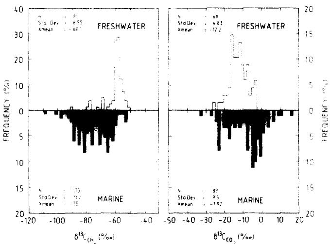  
FIG.2.Histograms of coexisting $\delta ^ { 1 3 } C$ and $\mathbf { C O } _ { 2 }$ and biogenic $\mathrm { { C H _ { \bullet } } }$ from freshwater (open) and marine (shaded) sedimentary environments.

The $\delta ^ { 1 3 } \mathsf { C }$ of carbon dioxide in the interstitial water from the methanogenic zone could be separated in Fig. 2 only much more generally into environment types. Freshwater $\mathbf { C O } _ { 2 }$ was,on average,more negative with a $\delta ^ { 1 3 } C$ mean of -12%o which reflects the isotope effect of the terrestrial carbon cycle. The marine $\mathrm { C O } _ { 2 }$ was more broadly distributed about a mean of $- 6 \text{‰}$

The $^ { 1 3 } { \cal C } / ^ { 1 2 } { \cal C }$ ratios of dissolved $\mathbf { C O } _ { 2 }$ in interstitial waters are controlled by a combination of equilibrium and kinetic isotope effects related to atmospheric exchange,precipitation-dissolution,organic matter decomposition,and other diagenetic reactions. This in turn can affect the carbon isotope ratio of biogenic methane.For example,NissENBAUM et al.(1972) and CLAYPOOL and KAPLAN (1974) used the kinetic carbon isotope fractionation by methanogens to generate a wide range of vaiues for both $\mathrm { C O } _ { 2 }$ and $\mathrm { C H } _ { 4 }$ depending on the initial $\delta ^ { 1 3 } \mathrm { C O } _ { 2 }$ and the extent of the $\mathbf { C O } _ { 2 }$ reduction to $\mathrm { C H } _ { 4 }$ .In spite of this possible range of isotopic $\mathbf { C O } _ { 2 }$ and CH4 values,the magnitude of their isotope separation is distinctive for the formation pathway.

The carbon isotopic data of coexisting methane and carbon dioxide pairs, given in Fig.2,are cross-plotted in Fig. 4. The data segregate into marine and freshwater sedimentary environments. Lines of equal carbon isotopic fractionation $( \alpha _ { \mathbf { C } } )$ between methane and carbon dioxide have been drawn as reference from values of $\alpha _ { \mathrm { C } } = 1 . 0 4$ through 1.09 with the following equation:

$$
\alpha _ { C } = { \frac { ( \delta ^ { 1 3 } { \cal C } _ { { \bf C O } _ { 2 } } + 1 0 ^ { 3 } ) } { ( \delta ^ { 1 3 } { \cal C } _ { { \bf C H } _ { 4 } } + 1 0 ^ { 3 } ) } } .\tag{4}
$$

These lines do not necessarily represent equilibrium, rather, they indicate the magnitude of the isotopic separation between these coexisting species. The marine data varied within $\pmb { \alpha } _ { \pmb { C } }$ of 1.05 and 1.09 as expected from the rather wide range of marine carbon isotopic ratios measured.In contrast the freshwater data clustered between $\alpha _ { \mathbf { C } }$ of 1.04 and 1.06.The division of marine and non-marine data could be most clearly seen around $\alpha _ { \mathrm { C } } = 1 . 0 5 5$ which corresponds to the rough boundary values of -60%o and -8%o observed for methane and carbon dioxide in Fig.2.

The carbon isotope exchange equilibria $( \alpha _ { \mathsf { c T } } )$ between methane and carbon dioxide has been calculated for various temperatures by CRAlG (1953), BOTTINGA (1969),and RicHET et al.(1977) among others. The equations of RiCHET et al.(1977) have been linearly approximated and are plotted in Fig. 5 using the following equation:

$$
1 0 ^ { 2 } \ln \alpha _ { \mathrm { c T } } = 2 . 9 2 ( 1 0 ^ { 3 } / t ) - 2 . 9 6\tag{5}
$$

where l is the formation temperature in ${ \displaystyle { \circ } _ { \bf K } }$

The $\alpha _ { \mathbb { C } }$ of the $\mathrm { C O } _ { 2 } { \cdot } \mathrm { C H } _ { 4 }$ pairs from the data base are

<table><tr><td>ENVIRONMENT CODE special</td></tr><tr><td>freshwater ? glaciat drift</td></tr><tr><td>swamp + Orca Basin □</td></tr><tr><td>0 Lake Kivu 。 lake</td></tr><tr><td>accumulations marine</td></tr><tr><td>marsh + gas reservoirs .</td></tr><tr><td>△ shallow water experimental</td></tr><tr><td>deep water ★ culture studies</td></tr><tr><td>sewage sludge</td></tr></table>

FIG.3.Legend for environment symbols used in following figures.

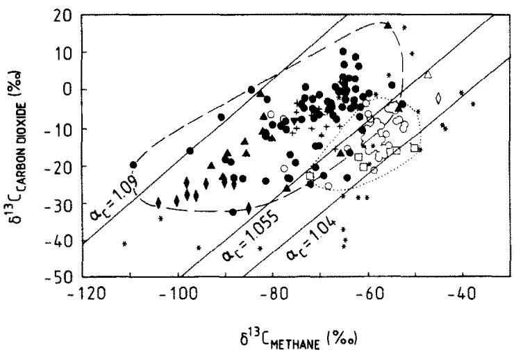  
FIG. 4. Cross plot of $\delta ^ { 1 3 } \mathbf C$ data from methane and carbon dioxide divided into various sedimentary environments (see Legend). The dashed line is the marine sediment region; the dotted outlines the freshwater sediments.Lines of equal fractionation (Eqn.4) are drawn for $\alpha _ { \mathrm { C } } = 1 . 0 4 , 1 . 0 5 5$ ,and1.09.

also plotted in Fig.5as a function of their respective measured sediment temperatures.

With few exceptions,the carbon isotope data of the $\mathrm { C O } _ { 2 } – \mathrm { C H } _ { 2 }$ pairs express fractionations lower than if thermodynamic equilibrium had been obtained at the sediment temperatures indicated.The $\mathrm { C O } _ { 2 } { \cdot } \mathrm { C H } _ { 4 }$ fractionation of the marine sediments closely approach the thermodynamic equilibrium line as was noted by GAMES and HAYEs(1976). The carbon fractionations in the freshwater environments are further removed from thermodynamic equilibrium and their contrast with the marine sediments does not merely reflect a temperature effect. The carbon isotope exchange rate at shallow sediment temperatures is too slowto permit isotope re-equilibration of the methane that has formed with the carbon dioxide reservoir (CHUNG and SACK-ETT,1978;GIGGENBACH,1982), so that carbon isotope fractionations during methanogenesis are generally described by kinetic isotope effects rather than by isotope exchange equilibria.The magnitude of the carbon isotope effect associated with methane formation in cultures as opposed to those we found in natural environments have been reported in onlya few instances. HEYER et al.(1976),GAMES andHAYES(1976),GAMES et al.(1978),FUCHS et al.(1979),and HAYEs and Ris-ATTl (pers.commun.） measured carbon isotope fractionations around 1.032 to 1.035 with extreme values of 1.025 to 1.061 (Table 1).For comparison,ROSEN-FELD and SILVERMAN(1959),and HEYER et al.(1976) reported carbon fractionations between methanol and methane of 1.077 to 1.083 at $3 0 ^ { \circ } C$ and 1.094 at ${ \bf 2 3 ^ { \circ } C }$ (Table 1).

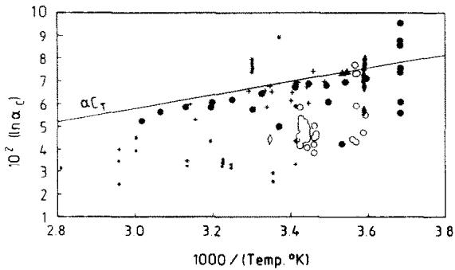  
FIG.5.Temperature dependence of the $\mathrm { C O } _ { 2 } { \bf - C H } _ { 4 }$ carbon isotope fractionation factor (αc). The thermodynamic equilibrium fractionation line $\{ \alpha \pmb { \mathrm { c } } _ { \tau }$ Eqn.5)is also indicated.

$\mathrm { C O } _ { 2 } { \cdot } \mathrm { C H } _ { 4 }$ fractionations estimated by culture studies shown in Fig.5are generally lower than those found in either freshwater or marine sediments. In some cases, this may reflect the higher experimental temperatures, orthat the difference in rates and types of methanogenesis in laboratories and in natural environments affect isotope discrimination.This points out the difficulties in simulating natural conditions.

As mentioned, one must remain aware of secondary processes which can influence the determination of carbon isotope fractionation factors,such as admixture of methane from other pathways,or from thermogenic hydrocarbons,depletion effects due to limited substrates(closed system kinetics) or microbial oxidation, which can also shift the methane to more positive and the carbon dioxide to more negative values resulting in an overall decrease in the $\mathrm { C O } _ { 2 } { \cdot } \mathrm { C H } _ { 4 }$ fraction.

The Gulf of California DSDP sites 479 and 481 (SCHOELL.1982）providean example of admixture of thermogenic hydrocarbons.Methane of biogenic origin onlywas encountered at site 479.Here the decrease in the carbon isotope fractionation for $\mathrm { C O } _ { 2 } { \mathrm { - } } \mathrm { C H } _ { 4 }$ during methanogenesis was a function of the increasing sediment temperature (Table 1,Fig.5).In contrast, thermogenic hydrocarbons, generated in the proximity of an intrusive dolerite sill at site 48l mix with biogenic methane and significantly lower the apparent $\mathrm { C O } _ { 2 } { \cdot } \mathrm { C H } _ { 4 }$ fractionation (Fig.5).

Extremely large carbon isotope fractionations are observed (αc up to i.10) between $\mathrm { C O } _ { 2 ^ { \circ } } \mathrm { C H } _ { 4 }$ in the Antarctic sediments (WHITICAR and SUEss,1986,in preparation).The cold sediment temperature $( - 1 . 3 ^ { \circ } C )$ is possibly the cause of the higher carbon-12 selectivity in the methane(Table l） and thus the greater isotope fractionation.

The methane in the anoxic hypersaline Orca Basin sediments are also strongly depleted in carbon-13（up $1 0 \mathrm { ~ - ~ } 1 0 5 \%$ ,SACKETT etal.,1979)and the $\mathrm { C O } _ { 2 } { \cdot } \mathrm { C H } _ { 4 }$ carbon isotope fractionation $( \alpha _ { \mathrm { C } } = 1 . 0 8 )$ is consistent with methanogenesis by $\mathbf { C O } _ { 2 }$ reduction.Unusual, however,is the occurrence of these high methane concentrations in the presence of dissolved sulphate.There is no significant methane consumption in the sulphate zone.Either there is enhanced methanogenesis within the sulphate zone or the methane has vertically migrated. It is not known if the high salinity may have an inhibitory effect on methanogenesis.Experiments byPATEL and RoTH(1977)with NaCl concentrations up to 15%o,showed a species-dependent tolerance or requirement for NaCl. One of the strains investigated, Methanobacterium MOHappearedunaffectedbythe various salt treatment levels.BELYAEV el al.(1983) alsoreport inhibition of methanogenesis at salinities over 3%o for culture studies,but suggested the existence ofmethanogens which could operate at the elevated salinities they found in the Bondyuzhskoe oil field.

Lake Kivu,a meromictic water body,is a special environment where the $\delta ^ { 1 3 } \mathsf { C }$ methane is very positive $( c a . \ - 4 5 \% o$ ，Table 1).Normally this carbon isotope ratio would signify a thermogenic gas source. Studies by TieTzE et al.(198O) have shown the methane to be of biogenic origin.The $\mathbf { C O _ { 2 } }$ is from anabiogenic $\mathbf { C O } _ { 2 }$ source $6- 2 \text{‰}$ DEUSER et al.,1973)and the resulting $\mathrm { C O } _ { 2 } – \mathrm { C H } _ { 4 }$ isotope fractionation of 1.045 is in the range with acetate fermentation in freshwater sediments. This interpretation of methanogenesis by acetate fermentation is also supported by the hydrogen isotope data.

The incorporation of the heavy $\mathrm { C O } _ { 2 }$ signal into the methane could be via $\mathbf { C O } _ { 2 }$ reduction with an unexplained lower fractionation factor,or alternatively、viu a metabolic interaction suggested by ZEikUs et al. (1985）whereby the heavy $\mathrm { C O } _ { 2 }$ is consumed by acetogens which in turn provide the $^ { 1 3 } \mathrm { C }$ -enriched acetate for the methanogens.

## Hydrogen isotopes

The distinction between freshwater and marinesourced bacterial methane observed with the carbon isotopes is even more pronounced with the hydrogen isotopes.Marine bacterial methane is narrowly distributed aboutamean value fordeuteriumof-192%o relativetoSMOW $( 5 1 \mathrm { d } . \mathrm { d e v } . \pm 1 8 . 4 \% 0 )$ as given in Fig. 6.In contrast. bacterial methane formed in freshwater sediments is strongly depleted in deuterium with an averageδD value of $- 3 1 8 \text{‰}$ (std.dev.± 26.5%o).Deuterium depletions of up to -40o%o have been reported (ALEKsEYEv,1980). The means of the hydrogen isotopes from the two populations are separated by 129%o and.as seen in Fig.6.there is little overlap.This large isotope separation permitsacleardifferentiation of the two methanogenic environments.Analagous to the carbon isotopes,the relationship of the hydrogen isotopes between methane and coexisting formationwater are pathway dependent.

PINE and BARKER（1956） showed that during reduction of $\mathrm { C O } _ { 2 }$ to $\mathrm { C H } _ { 4 }$ in a mixed culture study, the hydrogen of the deuterated water $( \mathbf { D } _ { 2 } \mathbf { O } )$ medium was utilized to produce $\mathbf { C D _ { 4 } }$ .Furthermore,DANIELS et al. (1980) conducted similar studies with M.thermoautotrophicum,a methanogen which utilizes $\mathbf { C O } _ { 2 }$ asa sole carbon source,usinga strongly deuterated water $\scriptstyle ( \mathbf { D } _ { 2 } \mathbf { O } )$ medium and an initial atmosphere of protium $( \mathbb { H } _ { 2 } ) .$ They indicated that essentially all the hydrogen incorporated into the methane by the $\mathbf { C O } _ { 2 }$ reduction pathwaywas deuterium and originated from the formationwater.

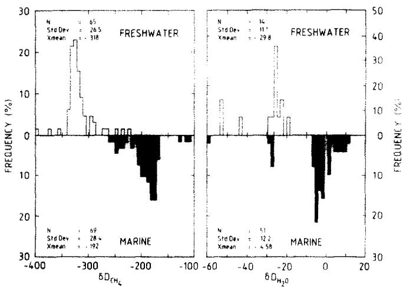  
FIG.6.Histogram of D/H values from methane and formation water,divided into freshwater and marine sedimentary environments.

The hydrogen which is incorporated into the methane is different from that which acts as electron donor, for example by interspecies transfer,in the reduction of the carbon dioxide.FucHs et al.(1979) stated that the hydrogen incorporated into the cells of M.thermoautotrophicum had a constant isotope fractionation with respect to the medium water (δD= 1.16 at $6 5 \mathrm { ^ \circ C } )$ independent of the gassing rate with hydrogen. Unfortunately in this study neither the hydrogen isotopes of the hydrogen gas nor of the methane formed were measured.

NAKAI et al.(1974) and ScHOELL(1980) reported for D/H isotopes a linear function between natural biogenic methane accumulations and their respective formation waters:

$$
\delta \mathrm { D } _ { \mathrm { C H } _ { 4 } } = \delta \mathrm { D } _ { \mathrm { H } _ { 2 } \mathrm { O } } - 1 6 0 ( \pm - 1 0 \% ) .\tag{6}
$$

Based on this direct linear relationship between the methane and the formation water, the latter is interpreted to be the exclusive source of hydrogen in the methane.This is as would be expected for methanogenesis by the $\mathbf { C O } _ { 2 }$ reduction pathway as presented schematically in Fig.7.The hydrogen fractionation involved with the attachment of the 4 hydrogen atoms to the carbon during this form of methanogenesis is around 160%.

In contrast to methanogenesis by $\mathbf { C O } _ { 2 }$ reduction, PINE and BARKER (1956)，and PINE and VISHNIAC (1957)reported that the acetate fermentation pathway involves an intact transfer of the methyl group to the methane,and thus only one externally derived hydrogen atom is required (DANIELs et al.,198O).This distinction in the source of hydrogen is demonstrated by substituting the mean of $\scriptstyle \mathbf { \delta D _ { C H _ { 4 } } }$ of-318% formethane formed in freshwater environments (Fig.6)into Eqn.

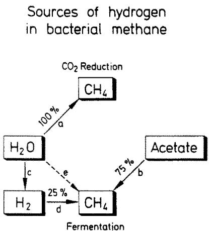  
FIG.7.Schematic diagram of hydrogen transfer for $\mathbf { C O } _ { 2 }$ reduction and acetate fermentation methanogenic pathways. Formation water supplies the hydrogen for methanogenesis by $\mathbf { C O _ { 2 } }$ reduction (a),whereas by acetate fermentation,/ comes directly from acetate (b)and final hydrogen either directly from the formation water (e)or more likely over a hydrogen fractionation step $( \mathfrak { c } + \mathrm { d } )$

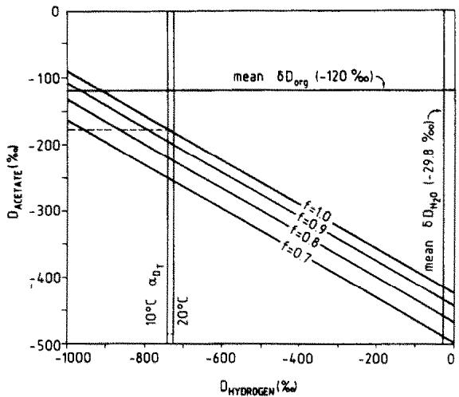  
FIG.8.Relationship of $\delta \mathrm { D } _ { \mathrm { { s o e a s t e } } }$ to the $\delta \mathrm { D } _ { \mathrm { i n y d r o g e n } }$ (the remaining hydrogen added to methane）using Eqn.9 for the mean $\scriptstyle \delta \mathbf { D } _ { \mathbf { C R } _ { 4 } }$ $( - 3 1 8 \% o )$ and $\delta \mathrm { D } _ { \mathsf { H z O } }$ $\{ - 2 9 . 8 ,$ shown).Addition of varying proportions of methane from $\mathbf { C O } _ { 2 }$ reduction (f $= 0 . 9 , 0 . 8 , 0 . 7 )$ to acetate fermentation only $\lbrace f = 1 . 0 \rbrace$ are also drawn.For reference,the $\delta \mathrm { D } _ { \circ \mathfrak { r } }$ for freshwater sediments is shown along with $\alpha _ { \mathrm { D T } }$ ,the equilibrium hydrogen isotope fractionation of $\mathrm { \bf \ddot { H } } _ { 2 }$ from the formation water at $\mathsf { i o } ^ { \circ } \mathsf { C }$ and ${ 2 0 ^ { \circ } } \mathbb { C }$

6for $\mathbf { C O _ { 2 } }$ reduction.This yieldsa calculated value of δD formation water $( - 1 5 8 \% o )$ which is much more depleted than was actually determined(-29.8%o).

The hydrogen isotope ratio of methane formed by acetate fermentation can be described relative to the formation water by:

$$
 { \delta }  { \mathbf { D } } _ { \mathrm { C H } _ { 4 } } = 0 . 2 5  { \delta }  { \mathbf { D } } _ {  { \mathbf { H } } _ { 2 }  { \mathbf { O } } } + b\tag{7}
$$

where3/4 of the hydrogenisderived from themethyl group and the formation water is taken to be the ultimate source of the remaining 25% of the hydrogen (Fig. 7).

The value of b is dependent on:

a） the hydrogen isotope ratio of the hydrogens in the transferred methyl group of the acetate (or other precursor),

b） the hydrogen fractionation associated with this transfer,

c） fractionation associated with the addition of the final hydrogen.

The magnitude of (b) in Eqn.7 calculated using,for example,the freshwater mean $\delta \mathrm { D } _ { \mathrm { C H } _ { 4 } }$ and $\delta \dot { \mathbf { D } } _ { \mathbf { H } \times \mathbf { O } }$ is -311%o.The difficulty in determining the correct value for(b),which isvariable,is further compounded by contributions of methane through $\mathbf { C O } _ { 2 }$ reduction which add uncertainty in establishing the true acetate fermentation end member.

Although the hydrogen isotope ratio of the transferred methyl group is unknown,the following can define the range expected.Figure 8 illustrates the dependence of the $\delta \mathrm { D } _ { \approx \infty \ell \times \ell \ell }$ (methyl group） on the δD of the final hydrogen incorporated as is calculated using the mass balance:

$$
4 ( \delta \mathrm { D } _ { \mathrm { C H 4 } } ) = 3 ( \delta \mathrm { D } _ { \mathrm { a c e t a t e } } ) + ( \delta \mathrm { D } _ { \mathrm { h y d r o g e n } } )\tag{8}
$$

where $\delta \mathrm { D } _ { \mathsf { n y d r o g e n } }$ is the fourth hydrogen incorporated into the methane.For example,inserting the mean $\delta \mathrm { D } _ { \mathrm { C H } _ { 4 } } \mathrm { o f } - 3 1 8 \%$ for the freshwater methane and assuming that the methane was formed by acetate fermentation only,the line $f = 1 . 0$ in Fig.8 is generated. Hydrogen coming directly from the water (mean $\pm - 2 9 . 8 \% o )$ without fractionation as indicated by pathway (e) in Fig.7 would necessitate a $\delta \mathrm { D } _ { \mathsf { a c e t a t e } }$ of -414%o,which isa considerable fractionation with respect to the mean D/H ratio of freshwater organic matter $( \delta \mathrm { D } _ { \tt o r g } = - 1 2 0 \%$ ,Fig.8) cited by EsTEP and HOERING （198O） and STILLER and NISSENBAUM (1980).If the hydrogen utilized is,however, first dissociated from the formation water indicated by pathway (c) in Fig.7,then the former would have a value of -740%o at $1 0 ^ { \circ } \mathsf C$ (RICHET et al.,1977) with respect to the mean water value (Fig.8).The associated $\delta \mathrm { D } _ { \approx \mathrm { c a t e } }$ would be -177%o in this case (dashed line Fig.8),or a $57 \text{‰}$ separation relative to the mean $\delta \mathrm { D } _ { \circ \mathbf { r } \mathbf { g } }$ .The temperature dependence of the ${ \bf H } _ { 2 } { \bf O } { \bf - H } _ { 2 }$ fractionation would not significantly influence the $\delta \ D _ { \mathsf { s o s t a n e } }$ as shown in Fig. 8.

Methanogenesis in freshwater sediments is stated by numerous investigators (JERIs and McCARTY,1965: BELYAEV et al.,1975; CAPPENBERG and JONGEJAN, 1978;MOUNTFORT and ASHER,1978;and others) to represent a 7O:30 mixture of acetate fermentation and $\mathrm { C O } _ { 2 }$ reduction pathways rather than only the former. Should this be the case, then Eqn.8 can be modified to include the contribution of $\mathbf { \bar { \mathbf { \rho } } } _ { \mathbf { C O } _ { 2 } }$ reduction to acetate fermentation on the $\delta \mathrm { D } _ { \mathrm { C H } _ { 4 } }$ measured:

$$
\begin{array} { r } { \delta \mathrm { D } _ { C \mathrm { H } _ { 4 } } = f [ . 7 5 ( \delta \mathrm { D } _ { \mathrm { a c e t a t e } } ) + . 2 5 ( \delta \mathrm { D } _ { \mathrm { h y d r o g e n } } ) ] \qquad } \\ { + ( 1 - f ) ( \delta \mathrm { D } _ { \mathrm { H } _ { 2 } \mathrm { O } } - 1 6 0 ) } \end{array}\tag{9}
$$

where $f$ is the proportion of methanogenesis varying from acetate fermentation $( f = 1 )$ to $\mathbf { C O } _ { 2 }$ reduction $( f = 0 )$ . As the contribution of $\mathbf { C O _ { 2 } }$ reduction to the methane formed increases,then the calculated $\delta \mathrm { D } _ { \mathbf { s c a t e } }$ value becomes more depleted in deuterium,assuming the $\delta \mathrm { D } _ { \mathsf { h y d r o g e n } }$ is held constant. Thus at a 7O% fermentation $( f = 0 . 7 , \mathbf { F i g } . 8 )$ anda $\delta D _ { \mathrm { h y d r o g e n } }$ via pathway (c) (Fig.7)of-740%oavalue of $\delta \mathbf { D _ { z o c t a t e } }$ would be-250%o.

Hydrogen isotope data pairs of bacterial methane and the coexisting formation water are less commonly reported in the literature.Those available(Tablel)are plotted in Fig. 9.Methane from marine sediments cluster close to the region of methanogenesis by $\mathbf { C O } _ { 2 }$ reduction as defined by the line (Eqn.6) drawn in Fig. 9.This methane generally has a $\mathbf { H } _ { 2 } \mathbf { O } \mathbf { - C H } _ { 4 }$ fractionation $( \delta _ { \bf D } )$ between 1.2 and 1.3.Variations from-the line may be due to a minor addition of methane through acetate fermentation (Fig.1).Alternatively,the relationship of $\delta \mathrm { D } _ { \mathbf { C H } _ { 4 } }$ to $\delta \mathbf { D _ { H z O } }$ could be revised as the function:

$$
\delta \mathrm { D } _ { \mathrm { C H } _ { 4 } } = \delta \mathrm { D } _ { \mathrm { H } _ { 2 } \mathrm { O } } - 1 8 0 \pm 1 0 \%\tag{10}
$$

Reservoired bacterial methane from marine sediment sources in Japan, Italy and S.Germany also plot in the region of methanogenesis by $\mathbf { C O } _ { 2 }$ reduction.

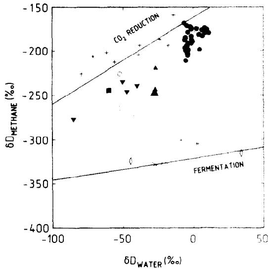  
FIG.9.Cross plot of methane and formation water δD coexisting pairs delineating the regions of freshwater and marine sediments.The lines describing methanogenesis by $\mathbf { C O } _ { 2 }$ reduction (Eqn.6) and acetate fermentation (Eqn.7) are shown.

In contrast,the bacterial methane from freshwater sediments in Fig.9 plot removed from the region describing $\mathbf { C O } _ { 2 }$ reduction. The coexisting hydrogen pairs of Wurmsee,Altwarmbuchen Moor,and Lake Kivu have $\mathrm { H } _ { 2 } \mathrm { O } { \cdot } \mathrm { C H } _ { 4 }$ fractionations $( \alpha _ { \mathsf { D } } )$ greater than 1.40. The line in Fig.9 describing acetate fermentation fitting this data and that found experimentally with sewage sludges (SCHOELL,1980) is:

$$
\delta \mathrm { D } _ { \mathrm { C H } _ { 4 } } = 0 . 2 5 \delta \mathrm { D } _ { \mathsf { H } _ { 2 } \mathrm { O } } - 3 2 1 \%\tag{11}
$$

As discussed above,the range in values and thus position of the line can be related to differences in $ { \delta \mathrm { D _ { a c e t a t e } } } ,  { \delta \mathrm { D _ { h y d r o g e n } } }$ (the final hydrogen incorporated). or in a mixed situation,the proportion of the respective methanogenic pathways.Interestingly,some of the freshwater environments (Brake,Glacial Drift,Volo Bog in Table 1） indicate major contributions by $\mathbf { C O } _ { 2 }$ reduction. Thus this methanogenic pathway may also be significant in freshwater environments (Fig. 1) though probably in the later stages due to the lower rates of methanogenesis by $\mathbf { C O } _ { 2 }$ reduction.

The isotope separations for both carbon $\displaystyle ( C \mathrm { O } _ { 2 } { \cdot } \mathrm { C H } _ { 4 } )$ and hydrogen $\left( \mathbf { H } _ { 2 } \mathbf { O } \mathbf { - C } \mathbf { H } _ { 4 } \right)$ have been shown to be individually distinctive of the methanogenic pathway and thus indirectly of the environment of formation.Although the current number of samples for which both fractionation factors $( \alpha _ { \mathbf { C } } , \alpha _ { \mathbf { D } } )$ areavailableis limited, by combining them in Fig.10 the two types of methane formation $\mathbf { C O } _ { 2 }$ reductionand acetate fermentationare readily distinguished.The former hasa larger carbon fractionation $( \alpha _ { \mathrm { C } } = 1 . 0 7 )$ anda lower hydrogen fractionation $\left( \alpha _ { \mathsf { D } } \mathsf { c a } . 1 . 2 \right)$ ,whereastheacetate fermentation is the opposite (αc ca.i.045 and $\alpha _ { \mathrm { { D } } }$ ca.1.45).This clear division of biogenic methane types illustrates the importance of measuring not only the carbon isotopes of methane,but also the hydrogen isotopes,as well as the isotopes of the coexisting $\mathbf { C O } _ { 2 }$ and ${ \bf H } _ { 2 } \mathrm { O }$

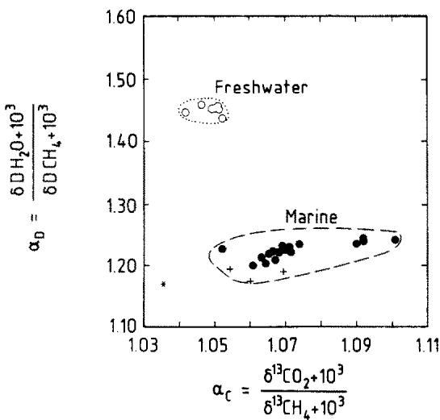  
FIG.10.Combination of carbon and hydrogen isotope fractionations $\scriptstyle { \{ \alpha _ { C } \} }$ and ${ \pmb { \alpha _ { \mathrm { D } } } } )$ formethane,carbon dioxide and formation water.Theregions of $\mathbf { C O } _ { 2 }$ reduction and acetate fermentation are clearly diferentiated using the coexisting $\mathrm { C O } _ { 2 } { \mathrm { - C H } } _ { 4 }$ and ${ \bf H } _ { 2 } 0 { \bf - C } { \bf H } _ { 4 }$ pairs.

## Genetic characterization of biogenic methane accumulations

The source of a bacterial methane reservoir, $i , e ,$ whether it was generated in freshwater or marine sediments,can be determined with the aid of carbon and hydrogen isotopes.The measurement of only methane carbon isotopes on reservoired natural gases is often insufficient to delineate the source. This difficulty is demonstrated using the l29 bacterial gas reservoirs listed by RICE and CLAYPOOL (1981).A histogram of their data in Fig. l1 suggests no separation between environment types. Referring to the superimposed curves from the freshwater and marine $\delta ^ { 1 3 } \mathsf { C } _ { \mathbf { C } \mathbf { H } } .$ frequency distributions from Fig.2a,a rough value of $- 6 0 \text{‰}$ for unaltered biogenic methane could perhaps be used as a reference boundary.A more reliable interpretation,however,requires information on the hydrogen isotopes and the $\delta ^ { 1 3 } \mathsf { C }$ of the coexisting $\mathbf { C O } _ { 2 }$

The distinction between biogenic and thermogenic natural gas is also of importance in hydrocarbon exploration.Again the singular use of either carbon or hydrogen isotopes can lead to ambiguous interpretations.These uncertainties can frequently be resolved by the inclusion of additional isotopic or sometimes molecular composition data.Figure 12 is a revised $\delta ^ { 1 3 } \mathrm { C }$ vs.δD diagram after ScHOELL(1980) which incorporates the now expanded field for bacterial methane, particularly identifying the freshwater environments.

This diagram distinguishes the various methane sources.For example,a natural gas with a methane $\delta ^ { 1 3 } \mathsf { C }$ value of-52%o could previously have been identified as a gas froma mixed source.With the knowledge that the methane δD is-350%o,it can be properly classified as a freshwater biogenic gas.

Mixing or alteration effects can still contribute difficulties to the genetic characterization of natural gases. Further effort is required to increase our understanding of the isotopic behaviour of natural gases under these influences.It must be emphasized that any interpretation should incorporate not only the geochemical information available,but also the geologic and geophysical situation aswell.

## CONCLUSIONS

Biogenic methane from freshwater and marine environments can be distinguished with stable carbon and hydrogen isotopes.The primary methanogenic pathways,acetate-type fermentation and $\mathbf { C O } _ { 2 }$ reduction,can be characterized by combining the isotope data of methane with the data from the coexisting dissolved $\mathbf { C O } _ { 2 }$ and formation water.

In marine sediments the methane formed by $\mathbf { C O } _ { 2 }$ reduction is often more depleted in $^ { 1 3 } \mathsf { C }$ and has a greater carbon isotope separation $\scriptstyle \{ \mathbf { C O _ { 2 } } \mathbf { - C H _ { 4 } } \}$ than for methanogenesis by acetate fermentation in freshwater sediments.

Methane formed by the transfer of a methyl group is more depleted in deuterium than that formed by reduction of $\mathbf { C O } _ { 2 }$ .Hydrogen for the latter is incorporated directly from the formation water with a constant fractionation. In contrast, during acetate fermentation only1/4 of the hydrogen isderived from the formation water,probablyviaan intermediate $H _ { 2 } O \cdot \mathbf { H } _ { 2 }$ dissociation step.

Biogenic methane formed by $\mathbf { C O _ { 2 } }$ reduction and acetate-type fermentation pathways can be present in both freshwater and marine environments, however, the predominance of the latterin freshwater sediments is due to the availability of methyl from precursors such as acetate.In marine sediments,methanogenesis is limited in sediments with dissolved sulphate,due to competition for hydrogen and acetate-type precursors.

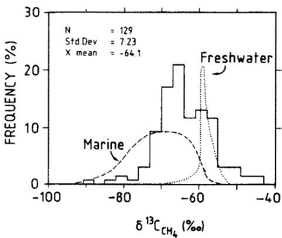  
FiG.11.Histogram of methane $\delta ^ { 1 3 } \mathsf C$ in natural gas reservoirs, (solid)after RiCE and CLAYPOOL(1981).Freshwater (dotted) andmarine(dashed) histograms from Fig.3 are superimposed as arough environmental indicator.

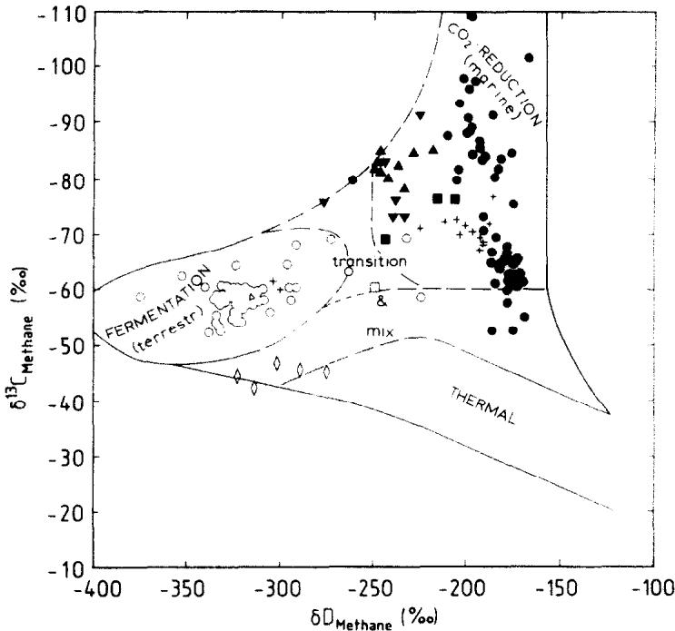  
FIG.12.Natural gas genetic classification diagram using δC and δD of methane. The biogenic methane strongly depleted in deuterium through acetate-type fermentation can be distinguished from methanogenesis by $\mathbf { C } \bar { \mathbf { O } _ { 2 } }$ reduction and from thermogenic methane.

The generalized systematics inherent to a large data base should be further refined by detailed examination of specific natural settings,complemented by laboratory studies.

Acknowledgements-The authors would like to thank W. Stahl,J.K.Whelan,and J.Hayes for critically reading the manuscript.The improvements provided by the reviewers.in particular N.Blair, J. Murray and G.Claypool, are greatly appreciated. J.R.Kenklies drafted the figures and E.Gundermann typed the manuscript. A special note of appreciation goes out to all the investigators whose sampling and analytical efforts enabled the data base to be compiled.

This work was supported by the BMFT Grant No.O3E 6237A at BGR,Hannover FRG.

## Editorial handling:J.I.Hedges

## REFERENCES

ABRAM J.W.and NEDWELL D.B.（1978a) Inhibition of methanogenesis by sulfate-reducing bacteria competing for transferred hydrogen. Arch.Microbiol.117,89-92.

ABRAM J.W. and NEDWELL D. B.(1978b) Hydrogen as a substrate for methanogenesis and sulfate reduction in anerobic salt marsh sediment. Arch. Microbiol.117, 93-97.

ALEKsEYEv F.A.(1980) New isotopic radiogeochemical data on petroleum production.Int. Geol. Rev. 22, No.8,899- 904.

ALEKSEYEV F.A.and LEBEDEW W.C.（1975) The carbon isotope composition of carbon dioxide and methane in the bottom sediments of the Black Sea.In Dispersed Gases and Biochemical Conditions of Sediments and Rocks,Nedza, Moskow.

BALCH W.E.,FOX G.E., MAGRUM L.J.,WOESE C.R.and WOLFE R. S. (1979) Methanogens: reevaluation of a unique biological group. Microbiol.Rev.43,260-296.

BARBER L.(1974) Methane production in sediments of Lake Wingra.Ph.D.thesis,Univ.Wisconsin,Madison,545p.

BARKER H.A.(1936) On the biochemistry of the methane fermentation. Arch.Mikrobiol.7,420-438.

BARNES R.O.and GOLDBERG E.D.(1976) Methane production and consumption in anoxic marine sediments. Geology 4,297-300.

BELYAEV S.S.,FINKELSTEIN Z.I. and IVANOV M.V.(1975) Intensity of bacterial methane formation in ooze deposits of certain lakes. Microbiol. 44,272-275.

BELYAEV S. S., LAURINAVICHUS K. S.and GAYTAN V.I. (1977）Modern microbiological formation of methane in the quarternary and pliocene rocks of the Caspanian Sea. Geochem. Intern. 4,172-176.

BELYAEV S. S.. WOLKIN R., KENEALY W.R.. DENIRO M.J..EPSTEIN S.and ZEIKUs J.G.(1983) Methanogenic bacteria from the Bondyuzhskoe Oil Fieid:General characterization and analysis of stable-carbon isotopic fractionation. Appl. Environ. Microbiol.45,691-697.

BOSSARD P.（l98l） Der Sauerstoff-und Methanhaushalt im Lungernsee.Ph.D. thesis,E.T.H. Zurich,71 p.

BOTTINGA Y.(1969) Calculated fractionation factors for carbon and hydrogen isotope exchange in the system calcitecarbon dioxide-graphite-methane-hydrogen-water vapour. Geochim. Cosmochim. Acta 33,49-64.

BUSWELl.A.M.and SoLO F.W.(1948) The mechanism of the methane fermentation.J.Amer. Chem. Soc.70,1179- 1180.

CAPPENBERG TH.E.（1974) Interrelations between sulfatereducing and methane-producing bacteria in bottom depositsofa freshwater lake,I.Field observations.J.Microbiol. Serol.40,285-295.

CAPPENBERG TH.E.(1975） A study of mixed continuous cultures of sulfate-reducing and methane-producing bacteria.Microbiol. Ecol.2,60-72.

CAPPENBERG TH.E.and PRINs R.A.(1974) Interrelations between sulfate-reducing and methane-producing bacteria in bottom deposits of a fresh-water lake III. Experiments with 14C-labeled substrates.J.Microbiol. Serol. 40,457- 469.

CAPPENBERG TH.E.and JONGEJAN E.(1978) Microenvironments for sulfate reduction and methane production in freshwater sediments.In Environmental Biogeochemistry and Geomicrobiology(ed.W.E.KRUMBEIN), pp.129-138. Ann Arbor Science,Ann Arbor.

CHUNG H. M.and SACKETT W. M.(1978) Carbon isotope effects during the pyrolytic formation of methane from coal. Short Papers of 4th Int.Conf.Geoch.Cosmoch.Isotope Geol.(ed.R.E.ZARTMANN),USGS Open File Report 78, 701.

CLAYPOOL G.E.and KAPLAN I.R.(1974) The origin and distribution of methane in marine sediments.In Natural Gases in Marine Sediments (ed.I.R. KAPLAN), pp.99- 139.Plenum Press,New York.

CLAYPOOL G.E.and THRELKELD C.N.(1983) Anoxic diagenesis and methane generation in sediments of the Blake OuterRidge,DSDP Site 533,Leg76.In Initial Reports Deep Sea Drilling Project,Vol.76 (eds.R.A.SHERIDAN and F.M.GRADSTEIN),pp.391-402.U.S. Govt.Printing Office,Washington.

CLAYPOOL G.E., PRESLEY B. J. and KAPLAN I. R. (1973) Gas analysis in sediment samples from legs 10,11,13,14, 15.18,i9.In Initial Reports Deep Sea Drilling Project, Vol.19 (eds.J.S.CREAGER andD.W. SCHOLL),pp.879- 884.U.S.Govt.Printing Office,Washington.

COLEMAN D.D.(1976) The origin of drift-gas deposits as determined by radiocarbon dating of methane.Proc.9th Intl.Radiocarbon Conf.L.A.,20-26.

CRAIG H.(19s3) The geochemistry of the stable carbon isotopes.Geochim.Cosmochim.Acta 3,53-92.

DANIELS L., FULTON G.,SPENCER R.W.and ORME-JOHNSON W.H.(1980) Origin of hydrogen in methane produced by methanobacterium thermoautotrophicum.J.Bacteriology 141,694-698.

DAVIS J.B.and YARBROUGH H. E.(1966) Anerobic oxidation of hydrocarbons by desulfovibrio desulfuricans. Chem. Geol. 1,137-144.

DEUSER W.G.,HARVEY G.R.,DEGENS E.T.and RUBIN M.(1973)Methane in Lake Kivu:new data on its origin. Science 181,51-54.

DEVOL A.H.(1983)Methane oxidation rates in the anaerobic sediments of Saanich Inlet.Limnol.Oceanog.28,738-742.

DOOSE P.R.(1980) The bacterial production of methane in marine sediments.Ph.D. thesis, U.C.L.A.240 p.

EsTEP M.F.and HoERING T.C.(1980) Biochemistry of the stable hydrogen isotopes.Geochim. Cosmochim. Acta 44, 1197-1206.

FABER E.and STAHL W.(1983) Analytic procedure and results of an isotope geochemical surface survey in an area of the British North Sea.In Petroleum Geochemistry and Exploration of Europe (ed.J.BROoks),pp.51-63.Blackwell Sci. Pub.,London.

FRIEDMANN I.and HARDCASTLE K.(1973) Interstitial water studies,leg.I5-Isotopic composition of water.In Initial ReportsDeep Sea DrillingProject,Vol.20(eds.B.C.HEE-ZEN and I.D.MACGREGOR),pp.901-903.U.S.Govt. Printing Office,Washington.

FROELICH P.N.,KLINKHAMMER G.P.,BENDER M.K, LUEDTKE N.A.et al.(1979) Early oxidationof organic matter in pelagic sediments of the eastern equatorial Atlantic:suboxic diagenesis.Geochim. Cosmochim.Acta 43, 1075-1090.

FUCHS G.D., THAUER R., ZIEGLER H.and STICHLER W. (1979)Carbon isotope fractionation by Methanobacterium thermoautotrophicum.Arch.Microbiol.120,135-139.

GAMESL.M.and HAYEs J.M.(1976) On the mechanisms of CO2 and CH4 production in natural anerobic environments.In Proceedings of the2nd Intl.Symp.on Environmental Biogeochemistry (ed.J.O. NRiAGU),pp. 51-73. Science Press,Ann Arbor,Mich.

GAMES L.M., HAYEs J.M.and GUNSALASR.D.(1978) Methane producing bacteria: natural fractionations of the stable carbon isotopes. Geochim. Cosmochim. Acta 42, 1295-1297.

GIGGENBACH W.F.(1982) Carbon-13 exchange between CO2 and CH4 under geothermal conditions. Geochim. Cosmochim.Acta 46,159-165.

GOLDHABER M.B.(1974) Equilibrium and dynamic aspects of the marine geochemistry of sulfur. Ph.D. thesis, Univ. California, L.A.

HEYER I.,HUBNER H.and MAAB I.(1976) Isotopenfraktionerungdes Kohienstoffs bei der mikrobiellen Methanbildung.Isotopenpraxis 12,202-205.

HIPPE H.,CASPARI D.,FIEBIG K.and GOTTSCHALK G.(1979) Utilization of trimethylamine and other n-methyl compounds for growth and methane formation by Methanosarcina barkeri.Proc.Natl.Acad.Sci.76,494-498.

HOPPE-SEYLER F.(1887) Die Methangaehrung der Essigsaeure.Hoppe-Seyler's Z.Physiol.Chem.11,561-568.

INGVORSEN K.and BROCK T.D.(1982) Electron flow via sulfate reduction and methanogenesis in the anerobic hypolimnion of Lake Mendota.Limnol. Oceanog.27,559- 564.

JERIS J. S.and McCARTY P.L.(1965) The biochemistry of methane fermentation using l4C tracers.J.Water.Pollut. Contr.Fed.37,178-192.

KING G.M.andWIEBE W.J.(1978) Methane release from soils of a Georgia salt marsh.Geochim.Cosmochim.Acta 42,343-348.

KING G.M.,KLUG M.J.and LoVLEY D.R.(1983) Metabolism of acetate,methanol and methylated amines in intertidal sediments of Lowes Cove,Maine.Appl. Environ. Microbiol.45,1848-1853.

KOSIUR D.R.and WARFORD A.L.(1979) Methane production and oxidation in Santa Barbara Basin Sediments.Estuar. Coast. Mar. Sci.8,379-385.

KOYAMA T.(1964) Gaseous metabolism in lake sediments and paddy soils.In Advances in Organic Geochemistry (eds. U.COLUMBO andG.D.HoBSON),pp.363-375.MacMillan Co., New York.

LAWRENCE A.W.and MCCARTY P.L.(1965) Therole of sulphide in preventing heavy metal toxicity in anerobic treatment.Water Poll.Contr.Fed.J.37,392-409.

LAWRENCE A.W.,MCCARTY P.L.and GUERING F.J.A. (1964) In Proc.19th Indiana Waste Conf.,Eng.Bull.117, pp.343-357,Purdue Univ.Ext. Ser.

LEBEDEW W. C.,OWSJANNIKOW W. M., MOGILEWSKIJ G.A.and BoGDANOw W.M.(1969) Fraktionierung der Kohlenstofisotope durch mikrobiologische Prozesse in der biochemischen Zone. Angew. Geol. 12,621-624.

LEIN Y. YU., NAMSARAEV B.B.,TROTSYUK V. YA.and IVA-NOv M.V.(1981） Bacterial methanogenesis in Holocene sediments of the Baltic Sea. Geomicrobiology J.2,299- 315.

LOVLEY D.R.,DwYER D.F.and KLUG M.J.(1982) Kinetic analysis of competition between sulfate reducers and methanogens for hydrogen in sediments.Appl.Environ.Microbiol.43,1373-1379.

LYON G.(1973) Interstitial water studies,leg.15-Chemical and isotopic composition of gases from Cariaco Trench sediments.In Initial Reports Deep SeaDrilling Project,Vol. 20 (eds.B.C. HEEZEN and I.D. MACGREGOR), pp. 773- 774.U.S. Govt.Printing Office,Washington.

MAHR.A.,WARD D.M.,BARESIL.and GLOSs T.L.(1977) Biogenesis of methane.Ann.Review Microbiology 31,309- 341.

MAKONGON Y.F., TSAREV V.I.and CHERSKIY N.V.(1972) Formation of large natural gas fields in zones of permanently low temperatures.Akad.Narsk SSSR Doklady 205,215- 218.

MARTENs C. S.(1976) Control of methane sediment-water transport by macroinfaunal irrigation in Cape Lookout Bight,North Carolina. Science 192,998-1000.

MARTENs C.S.（1982） Methane production,consumption and transport in the interstitial waters of coastal marine sediments.In Dynamic Environment ofthe Ocean Floor (eds.K.A.FANNING andF.T.MANHEIM),Pp.187-202. Lexington Books, Toronto.

MARTENsC.S.and BERNER R.A.（1977) Interstitial water chemistry of anoxic Long Island Sound sediments 1.Dissolved gases.Limnol.Oceanogr.22,10-25:

MOUNTFORTD.O.and AsHER R.A.(1978)Changes in proportions of acetate and carbon dioxide used as methane precursors during the anerobic digestion of bovine waste. Appl.Environ.Microbiol.35,648-654.

MOUNTFORTD.O.,ASHER R.A.,MAYSE.L.and TIEDJE J.U.(198o) Carbon and electron flow in mud and sandflat intertidal sedimentsat Delaware Inlet.Neison.N.Z.,Appl. Environ.Microbiol.39,686-694.

MYLROIER.L.and HUNGATE R.E.(19S5) Experimentson the methane bacteria in sludge.Can.J.Microbiol.1,55- 64.

MOLLER P.J.and SUEss E.(1979)Productivity,sedimentation rateand sedimentary organic matter in oceans I.Organic carbonpreservation.Deep-Sea Res.26,1347-1362.

NAKAI N.and NoBUYUKI N.(196O) Carbon isotope fractionation of natural gas in Japan.J.Earth Sci.(Nagoya Univ.)8,174-180.

NAKAI M., YosHIDA Y.and ANDo N.(1974) Isotopic studies on oil and natural gas fields in Japan. Chikyakaya (Geochem.) 7/8,No.1,87-98.

NEDWELL D.B.(1982)The cycling of sulphur in marine and freshwater sediments. In Sediment Microbiology (eds. D.B.NEDWELL and C.M.BROWN),pp.73-145.Academic Press,London.

NIKAIDo N.(1977) On the relation between methane production and sulfate reduction in bottom muds containing seawater sulphate.Geochem.J.11, 199-206.

NISSENBAUM A.,PRESLEY B. J.and KAPLAN I.R.（1972） Earlydiagenesis ina reducing fjord,Saanich Inlet,B.C.1 Chemical and isotopic changes in major components of interstitial water.Geochim. Cosmochim.Acta 36,1007- 1027.

NOTTINGHAM P.M.and HUNGATE R.E.（1969) Methanogenic fermentation of benzoate.J. Bacteriol. 98,1170-1172.

OANA S.and DEEvEY E.S.(196O)Carbon-13 in lake waters and its possible bearing on paleolimnology.Amer.J.Sci. 258A,253-272.

OPPERMANN R.A.,NELSON W.O.and BROWNR.E.(1961) In vivo studies of methanogenesis in the bovine rumen: dissimilation of acetate.J.Gen.Microb.25,103-111.

OREMLAND R.S.(1985) The biochemistry of methanogenic bacteria (submitted).

OREMLAND R. S.and TAYLOR B.F.(1975) Microbial production of methane in a tropical seagrass community.Ann. Mtg.Amer.Soc.Microbiol.,Abstr.N8,185.

OREMLAND R.S.and TAYLOR B.F.(1978)Sulfate reduction and methanogenesis in marine sediment.Geochim. Cosmochim.Acta2,209-214.

OvSYANNIKOV V. M. and LEBEDEV V. S.(1967) Isotopic composition of carbon in gases of biochemical origin. Geo chem.Intl.43,453-458.

PANGANIBAN A.T.,PATT T.E.,HART W.and HANSON R.S.(1979) Oxidation of methane in the absence of oxygen in lake water samples.Appl.Environ.Microbiol.37,303- 309.

PATELG.B.andRoTHL.A.(1977)Effect of sodium chloride on growth and methane production of methanogens. Can J.Microbiol.23,893-897.

PINE M.J.and BARKER H.A.(19S6) Studies on methane fermentation XII.The pathway of hydrogen in the acetate fermentation.J.Bacteriol.71, 644-648.

PINEM.J.and VisHNIAc W.(1957) The methane fermentation of acetate and methanol. J. Bacteriol.73,736-742.

POLCIN S., MARSH L. and OREMLAND R. S.(1981) Methanogenesis and sulfate-reduction:A mechanism for simultaneity.E.O.S., Trans Amer.Geophys.Union62,No.45, 925.

REEBURGH W.S.(1976) Methane consumption in Cariaco Trench waters and sediments.Earth Planet. Sci. Lett.28, 337-344.

REEBURGHW.S.(1980)Anerobic methane oxidation:Rate depth distributions in Skan Bay sediments.Earth Planel Sci.Lett.47,345-352.

REEBURGH W.S.and HEGGIE D.T.(1974) Depth distributions of gases in shallow water sediments. In Natural Gases inMarine Sediments(ed.I.R.KAPLAN),pp.27-45.Plenum Press,New York.

REEBURGH W.S.and HEGGIED.T.（1977) Microbiol methane consumption reactions and their effects on methane distributions in freshwater and marine environments.Limnol.Oceanogr. 22,1-9.

RICE D.D.and CLAYPOOL G.E.(1981) Generation, accumulation and resource potential of biogenic gas. Bull.AAPG 65,5-25.

RICHET P.,BOTTINGA Y.and JAVOYM.(1977)A review of hydrogen,carbon,nitrogen,oxygen,suiphur and chlorine stable isotope fractionation among gaseous molecules.Ann. Rev.Earth Planet.Sci.5,65-110.

ROSENFELD W.D.and SILVERMANN S.R.(1959) Carbon isotope fractionation in bacterial production of methane. Science 130, 1658--1659.

RossOLIMO L.L.(1935) Die Boden-Gasausscheidung und das Sauerstoffregime der Seen.Int.Ver.Theor. Angew. Limnol.Verh.7,539-561.

RUDD J.W.M.,HAMILTONR.D.and CAMPBELLN.E.R. (1974)Measurements of the microbial oxidation of methane inlakewater.Limnol.Oceanog.19,519-524.

SACKETT W.M.,BROOKSJ.M..BERNARD B.B.、SCHWAB C.R.S.and CHUNG H.(1979) A carbon inventory for Orca Basin brines and sediments.Earth Planet.SciLett. 44,73-81.

SANDBECKK.A.andWARDD.M.(1981)Fate of immediate methane precursors in low-sulfate、hot-spring algal-bacterial mats.Appl.Environ.Microbiol.41,775-782.

SCHOELL M.(1980) The hydrogen and carbon isotopic composition of methane from natural gases of various origins. Geochim.Cosmochim. Acta 44,649-661.

SCHOELL M.(1982) Stable isotopic analysis of interstitial gases in Quaternary sediments from the Gulf of California. In Initial ReportsDeep Sea Drilling Project,Vol.64 (eds. J.R.CURRAY andD.G.MOORE).pp.815-817.U.S.Govt. Printing Office,Washington.

SCHOELL M.(1983) Wasserstoff- und Kohlenstoff-sotopenvariationen in organischen Substanzen,Erdolen und Erdgasen.Habilitationschrift,Univ.Bochum,248p.

SCHUBEL J.R.(1974) Gas bubblesand the acoustically impenetrable orturbid characterin some estuarine sediments. InNatural Gasesin Marine Sediments (ed.I.R.KAPLAN), pp.275-297.Plenum Press,N.Y.

SCHOENHEIT P., KRISTJANSSON J.K.and THAUER R.K. (1982)Kinetic mechanism for the ability of sulfate reducers to out-compete methanogens for acetate.Arch.Microbiol. 132,285-288.

SMITH P.H.and MAH R.A.(1966) Kineticsof acetate metabolism during sludge digestion.Appl.Microbiol.14,368- 371.

SMITH M.R.and MAHR.A.(1978)Growth and.methanogenesis by Methanosarcina strain 227 on acetate and methanol.Appl.Environ.Microbiol.36,870-879.

SMITHM.R.andMAHR.A.(1980)Acetate asasole carbon and energy source for growth of Methanosarcina strain 227. Appl.Environ.Microbiol.39,993-999.

STADTMANN T.C.and BARKER H.A.（1949) Studies on the methane fermentation,Vi.Tracer experiments on the mechanism of methane formation.Arch.Biochem. Biophys. 21,256-264.

STILLER M.and NIssENBAUM A.(198O) Variationsof stable hydrogen isotopes in plankton from a freshwater lake.Geochim.Cosmochim.Acta 44,1099-1101.

STRAYER R.F.and TiEDJE J.M.(1978) In situ methane production ina small, hypereutrophic hard water lake:Loss ofmethane from sediments by vertical diffusionand ebullition.Limnol.Oceanogr.23,1201-1206.

TAKAl Y.(1970) The mechanism of methane fermentation in flooded paddy soil. Soil Sci.Plant Nutr.16,238-244.

TIETZE K., GEYH M.,MULLER H., SCHRODER L., STAHL W. and WEHNER H.(198O) The genesis of the methane in Lake Kivu (Central Africa). Geol. Rundschau 69,452-472.

VOYTOV G.I.,LEBEDER V.S.,BLOKHINA G.G.and CHER-EVICHNAYA L.F.(1975) Chemical and isotopic composition of subsoil and marsh gases of the Kola Tundras.Doklady Akad.Nauk.SSSR 224,186-188.

WASSERBURG G.J., MAZOR J.E.and ZARTMANN R.E.(1963) Isotopic and chemical composition of some terrestrial natural gases.In Earth Science and Meteorites (eds.J.GEISS and E.D.GoLDBERG), pp.219-240.North Holland Publ., Amsterdam.

WEIMER P.J.and ZEIKUs J.G.(1978) Acetate metabolism in Methanosarcina barkeri.Arch.Microbiol.119,175-182.

WHELAN T.(1974) Methane carbon dioxide and dissolved sulfate from interstitial water of coastal marsh sediments. Estuar. Coast. Mar. Sci.2,407-415.

WHELAN T.,BERNARD B.B.and BROOKS J.M.(1978) Carbon isotope variations in total carbon dioxide and methane from interstitial waters of nearshore sediments.In Stable Isotopes in Earth Science (ed.B.W.RoBINsON),pp.39-47.Dept. Sci. Indiana. Res.Bull.220. Indiana.

WHITICAR M.J.(1978)Relationships of interstitial gases and fluids during early diagenesis in some marine sediments. Ph.D.dissertation, Univ. Kiel,153p.

WHITICAR M. J.(1982) The presence of methane bubbles in the acoustically turbid sediments of Eckernforder Bay,Baltic Sea.In Dynamic Environment of the Ocean Floor (eds. K.A.FANNING and F.T. MANHEIM),pp. 219-235,Lexington Books,Mass.

WHITICAR M.J.and WERNER F.(1981) Pockmarks: Submarine vents of natural gas or freshwater seeps. Geo-Marine Letters 1,193-199.

WHITICAR M.J.and FABER E.(1985) Methane oxidation in

marine and limnic sediments and water columns. 12th Intl. Mtg.Org.Geochem.,Juelich 16-20,1985 abstract,p.20. In Advances in Organic Geochemistry (eds.D.LEYTHAUSER and J.RULLKOTTER) (in press).

WHITICAR M.J.and FABER E.(1986) Carbon and hydrogen isotopes on gas samples from Leg 95 Sites 603 D and 613. InInitial Reporis Deep Sea Drilling Project.Vol.95.U.S. Govt.Printing Office,Washington (in press).

WINFREY M.R.and ZEIKUs J.G.(1977) Effects of sulphate on carbon and electron flow during microbial methanogenesis in freshwater sediments.Appl.Environ.Microbiol. 33,275-281.

WINFREY M.R.and WARD D.M.(1983) Substrates for sulfate reduction and methane production in intertidal sediments. Appl.Environ.Microbiol.45,193-199.

WINFREY M.R., NELSON D.R., KLEVICKIS S.C.and ZEIKUS J.G.（1977） Association of hydrogen metabolism with methanogenesis in Lake Mendota sediments.Appl. Environ. Microbiol. 33,312-318.

WINFREY M.R., MARTY D.G., BIANCHI A.J.M.and WARD D.M.(1981） Vertical distribution of sulfate reduction, methane production and bacteria in marine sediments. Geomicrobiol. J. 2, 341-362.

WOLTEMATE I.,WHITICAR M. J.and SCHOELI M.(1984) Carbon and hydrogen isotopic composition of bacterial methane in a shallow freshwater lake.Limnol. Oceanogr. 29,985-992.

WOLTEMATE I.(1982) Isotopische Untersuchungen zur bakteriellen Gasbildung in einem SüBwassersee.Diplomarbeit. Clausthal Univ., 90 pp.

ZEIKUS J.G..KERBY R.and KRZYCKI J.A.(1985) Singlecarbon chemistry of acetogenic and methanogenic bacteria. Science 227,1167-1173.

ZINDER S.H.and MAH R.A.(1979) Isolation and characterization of a thermophilic strain of Methanosarcina unable to use H2O-CO2 for methanogenesis. Appl.Environ. Microbiol. 38,996-1008.