# Carbon and hydrogen isotope systematics of bacterial formation and oxidation of methane

Michael J. Whiticar )

School of Earth and Ocean Sciences, UniÕersity of Victoria, P.O. Box 3050, Victoria, BC, Canada V8W 2Y2

Received 30 March 1998; accepted 23 November 1998

## Abstract

The diagenetic cycling of carbon within recent unconsolidated sediments and soils generally can be followed more effectively by discerning changes in the dissolved constituents of the interstitial fluids, rather than by monitoring changes in the bulk or solid organic components. The major dissolved carbon species in diagenetic settings are represented by the two carbon redox end-members $\mathrm { C H } _ { 4 }$ and $\mathrm { C O } _ { 2 } .$ . Bacterial uptake by methanogens of either $\mathrm { C O } _ { 2 }$ or ‘‘preformed’’ reduced carbon substrates such as acetate, methanol or methylated amines can be tracked with the aid of carbon ${ } ^ { ( ^ { 1 3 } \mathrm { C } \ / ^ { 1 2 } \mathrm { C } ) }$ and hydrogen $\mathrm { ( D / H } \equiv ^ { 2 } \mathrm { H / ^ { 1 } H } )$ isotopes. The bacterial reduction of $\mathrm { C O } _ { 2 }$ to $\mathrm { C H } _ { 4 }$ is associated with a kinetic isotope effect KIE for Ž . carbon which discriminates against ${ } ^ { 1 3 } \mathrm { C } .$ This leads to carbon isotope separation between $\mathrm { C O } _ { 2 }$ and $\mathrm { C H } _ { 4 } \left( \varepsilon _ { \mathrm { C } } \right)$ exceeding 95 and gives rise to $\delta ^ { 1 3 } \mathrm { C } _ { \mathrm { C H } _ { 4 } }$ values as negative as y110‰ vs. PDB. The carbon KIE associated with fermentation of methylated substrates is lower $\left( \varepsilon _ { \mathrm { { C } } } \right.$ is ca. 40 to 60, with $\delta ^ { 1 3 } \mathrm { C } _ { \mathrm { C H } _ { 4 } }$ values of y50‰ to y60‰ . Hydrogen isotope effects . during methanogenesis of methylated substrates can lead to deuterium depletions as large as $ { \delta \mathrm { D } _ { \mathrm { C H _ { 4 } } } } = - 5 3 1 \%  { \mathrm { \Omega } ^ { } }$ vs. SMOW, whereas, bacterial DrH discrimination for the $\mathrm { C O } _ { 2 }$ -reduction pathway is significantly less $( \delta \mathrm { D _ { C H _ { 4 } } \ : \ : \ : c a . \ : \ : - 1 7 0 \% }$ to y250‰ . These field observations have been confirmed by culture experiments with labeled isotopes, although hydrogen . isotope exchange and other factors may influence the hydrogen distributions. Bacterial consumption of $\mathrm { C H } _ { 4 } ,$ both aerobic and anaerobic, is also associated with KIEs for C and H isotopes that enrich the residual $\mathrm { C H } _ { 4 }$ in the heavier isotopes. Carbon fractionation factors related to $\mathrm { C H } _ { 4 }$ oxidation are generally less than $\varepsilon _ { \mathrm { C } } = 1 0 .$ , although values $> 2 0$ are known. The KIE for hydrogen $( \varepsilon _ { \mathrm { H } } )$ during aerobic and anaerobic $\mathrm { C H } _ { 4 }$ oxidation is between 95 and 285. The differences in C and H isotope ratios of $\mathrm { C H } _ { 4 } ,$ in combination with the isotope ratios of the coexisting $\mathrm { H } _ { 2 } \mathrm { O }$ and $\mathrm { C O } _ { 2 }$ pairs, differentiate the various bacterial $\mathrm { C H } _ { 4 }$ generation and consumption pathways, and elucidate the cycling of labile sedimentary carbon. q 1999 Elsevier Science B.V. All rights reserved.

Keywords: Methane; Carbon dioxide; Carbon isotopes; Hydrogen isotopes; Methanogenesis; Methanotrophy; Bacteria; Soils; Sediments

## 1. Introduction

The interplay between bacterial processes of methanogenesis and methanotrophy continues to attract the interest of microbiologists and geochemists, despite the fact that $\mathrm { C H } _ { 4 }$ , even at saturated concentrations in shallow organic-rich sediments, represents only about 1‰ of the total organic carbon present Že.g., 10 m water depth, ca. 4% $\mathrm { C _ { o r g } }$ , porosity ca. 0.9 . Apart from the more fundamental interests, .

such as bacterial physiology or organic matter remineralization, some of this curiosity reflects the economic fact that roughly 20% of the worldwide natural gas reservoirs are from bacterial sources ŽRice, 1992; Rice and Claypool, 1981; Whiticar, 1994 . The bacterial. $\mathrm { C H } _ { 4 }$ cycle also receives current attention owing to its impact on the atmospheric $\mathrm { C H } _ { 4 }$ budget Khalil and Shearer, 1993 . This follows Ž . the identification that $\mathrm { C H } _ { 4 }$ in the atmosphere is: 1Ž . a significant radiatively active or ‘‘greenhouse’’ gas, Ž . 2 represents an important sink for tropospheric hydroxyl radicals, 3 increasing in tropospheric Ž . concentration at a rate of ca. 18 to 9 ppb $\mathrm { y r } ^ { - 1 }$ e.g., Ž Dlugokencky et al., 1995 , and that 4 bacterial. Ž . $\mathrm { C H } _ { 4 }$ is the primary source ca. 80%–90% of this Ž . atmospheric $\mathrm { C H } _ { 4 }$ e.g., Cicerone and Oremland, Ž 1988; Whiticar, 1993 ..

Furthermore, the processes of methanogenesis and aerobic $\mathrm { C H } _ { 4 }$ oxidation are also attractive to study by microbiologists because they frequently involve only single or two-carbon reactions. Thus, these bacterial pathways are more easily followed and reproduced in the laboratory. For the geochemist, methanogenesis and methanotrophy are interesting because they are sensitive indicators of the state of diagenesis in a particular environmental setting.

The interest expressed in this paper reflects the intricate diagenetic relationships in the carbon cycle that permit the most oxidized form of carbon to reside and be maintained adjacent to its most reduced form Fig. 1 . The physical depth separation Ž . Ž . of $\mathrm { C H } _ { 4 }$ formation and consumption is often a transitional feature rather than distinctly zoned. The activity maxima of the respective $\mathrm { C H } _ { 4 }$ formation and consumption processes can be separated spatially from each other by several decimeters in depth, as in marine sediments, or at a sub-millimeter scale, as in certain stromatolitic hydrothermal or hot spring environments e.g., Kuhl and Barker Jørgensen, Ž 1992 ..

An elegant method to track the complimentary processes of methanogenesis and methanotrophy is provided by the stable isotopes of C and H. The partitioning of the light and heavy isotopes of hydrogen and carbon e.g., Fig. 1 and the resultant isotope Ž . signatures can be diagnostic for the identification of methane type and pathway. This paper reviews the stable isotope systematics primarily associated with the incorporation and release of C and H during methanogenesis and methylotrophy, i.e., the bacterial formation and consumption of $\mathrm { C H } _ { 4 }$

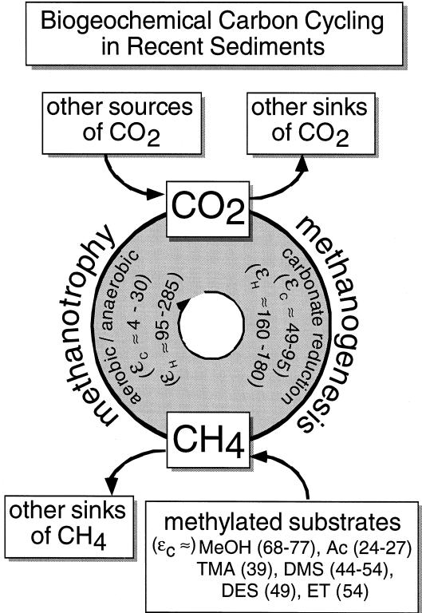  
Fig. 1. Carbon cycle for bacterial methane formation and consumption. Numbers indicate the carbon and hydrogen isotope fractionation factors $( \varepsilon _ { \mathrm { C } } , \varepsilon _ { \mathrm { H } } )$ Ž for the various mechanisms see Eq. 7 . MeOH Ž .. smethanol, Ac sacetate, TMA strimethylamine and DMSsdimethylsulphide, DESsdiethylsulphide, ET sethanethiol.

## 2. Methanogenic pathways

The microbiology, ecology and biochemistry of the various bacterial $\mathrm { C H } _ { 4 }$ formation pathways have been reviewed extensively in several monographs $\left( \mathrm { e . g . } \right.$ , Oremland and Capone, 1988; Zehnder, 1988; Garcia, 1990; Konig, 1992; Marty, 1992 . ¨ . Methanogens, fermentative archaebacteria, are obligate anaerobes that metabolize only in anoxic conditions at redox levels Eh-y200 mV. The fact that they cannot tolerate significant $p \mathbf { O } _ { 2 }$ , nitrate or nitrite levels are due primarily to the instability of their $\mathrm { F } _ { 4 2 0 }$ –hydrogenase enzyme complex Schonheit et al., Ž ¨ 1981 . Methanogens form methane by pathways . that are commonly classified with respect to the type of carbon precursor utilized by them. The primary methanogenic pathways are referred to as: 1Ž . hydrogenotrophic – 52 species described, 2Ž . acetotrophic – 19 species described and 3Ž . methylotrophic – 10 species described e.g., Conrad Ž et al., 1985 . Hydrogeno-methylotrophic and . alcoholotrophic methanogens have also been discussed Neue and Roger, 1993 . It is important to Ž . remember that the anaerobic remineralization of organic matter, ultimately to methane, relies on consortia of bacteria and microbes that successively break down larger molecules. Conrad 1989 recognized Ž . that four bacterial assemblages operate in this complementary fashion: 1 hydrolytic and fermenting Ž . bacteria, 2 H -reducing bacteria, 3 homoaceto- Ž . q Ž . genic bacteria and finally 4 methanogenic bacteria. Ž .

An approach, alternative to biochemistry, to classify methanogenic pathways uses microbial ecological relationships, namely methanogenic substrates. Methanogens utilize relatively few and simple compounds to obtain energy and cell carbon: 1Ž . competitive and 2 non-competitive. The former are Ž . those substrates which can be utilized more effectively by other bacterial assemblages, such as sulphate reducing bacteria SRB , and thus are either Ž . made unavailable out-competed or severely re- Ž . stricted to the methanogens. Non-competitive substrates are those which are more suitable to methanogens and less attractive to other bacteria, e.g., SRBs. Other factors, including redox potential, the availability of nutrients, substrates and terminal electron acceptors, or consumption reactions can determine the occurrence of bacterial methane in a particular environment. These competitive and noncompetitive methanogenic pathways are outlined below.

## 2.1. CompetitiÕe substrates

Competitive substrates include $\mathrm { C O } _ { 2 }$ reduced Ž by hydrogen , acetate and formate, i.e., . hydrogenotrophic, acetotrophic and methylotrophic pathways.

The first one, termed the ‘‘carbonate reduction’’ pathway, can be represented by the general reaction:

$$
\mathrm { C O } _ { 2 } + 8 \mathrm { H } ^ { + } + 8 \mathrm { e } ^ { - }  \mathrm { C H } _ { 4 } + 2 \mathrm { H } _ { 2 } \mathrm { O } ,\tag{1Ž .}
$$

and the net reaction for the acetate fermentation pathway is:

$$
\mathrm { ^ { * } C H } _ { 3 } \mathrm { C O O H }  \mathrm { ^ { * } C H } _ { 4 } + \mathrm { C O } _ { 2 } ,\tag{2Ž .}
$$

where the U indicates the intact transfer of the methyl position to $\mathrm { C H } _ { 4 }$

Methanogenesis by competitive substrates is severely restricted in water columns or sediment pore fluids with abundant dissolved sulphate; typically those systems with dissolved sulphate greater than $2 0 0 ~ \mu \mathrm { M } .$ . In these sulphate-rich environments, SRB successfully outcompete methanogens for carbon substrates, or in the case of carbonate reduction, for the available hydrogen.

In sulphate-rich zones, such as marine sediments where methanogenesis is severely curtailed, methane is generally present at only trace concentration levels Ž . - 0.5 mM . Most of the available labile carbon compounds in these zones are metabolized by nonmethanogens and released, in part, to the dissolved bicarbonate pool Fig. 2 . In addition, anaerobicŽ . $\mathrm { C H } _ { 4 }$ consumption in the sulphate zone also assists in maintaining the low $\mathrm { C H } _ { 4 }$ levels observed. Methanotrophy is discussed in detail later.

Once the available dissolved sulphate is exhausted, usually at greater sediment depth, and the SRB become inactive, methanogenesis commences using competitive substrates. Carbonate reduction is the dominant methanogenic pathway under these conditions because of the relatively depleted levels of other methanogenic substrates, such as acetate, by the SRB and because of the accumulation of a sizable dissolved bicarbonate pool in this sulphatefree zone Fig. 2 . A generalizedŽ . $\mathrm { C H } _ { 4 }$ distribution for marine sediments with elevated organic carbon content, i.e., shallow waters with high depositional rates, is presented in Fig. 3.

In freshwater low sulphate environments, Ž . methanogenesis proceeds uninhibited once anaerobic conditions are established Fig. 3 . Competition by Ž . the SRB is essentially absent so that the short-chained volatile fatty acid VFA pool is available and pro- Ž . vides, in addition to acetate or methylated amines, important substrates for methanogenesis Fig. 2, e.g., Ž Marty, 1992 . Methanogenesis by carbonate reduc- . tion in freshwater environments is initially less significant, but increases in importance as the other substrate pools become exhausted, and the methanogens excepting the obligate methylotrophs Ž . switch over to or start reducing the bicarbonate carbon source with hydrogen. Previous investigators stated that acetate fermentation is responsible for roughly 70% of the methanogenesis in freshwater environments, e.g., Koyama 1964 , Takai 1970 , Ž . Ž . Belyaev et al. 1975 , Winfrey et al. 1977 and Ž . Ž . Cappenberg and Jongejan 1978 . The utilization ofŽ . other methylated substrates andror carbonate reduction are suggested as constituting the remainder. Similar results have been cited for sewage sludges and from culture studies Bryant, 1979; Zehnder et Ž al., 1982 ..

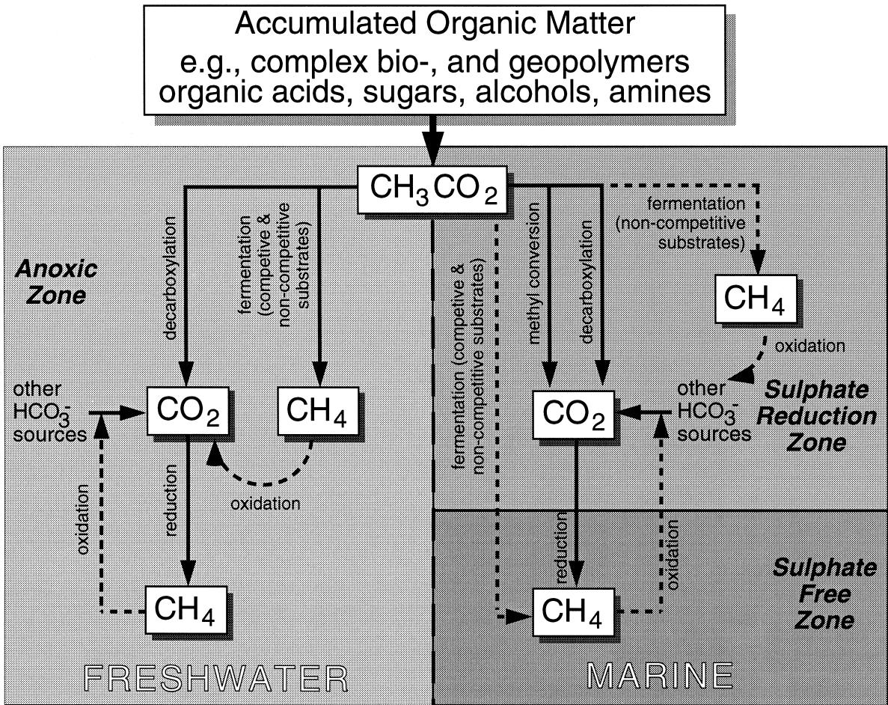  
Fig. 2. Schematic diagram showing methanogenic pathways in marine and terrestrial environments.

## 2.2. Non-competitiÕe substrates

Non-competitive substrates for methanogenesis include both the acetotrophic and methylotrophic pathways that utilize the carbon substrates methanol, methylated amines, such as mono-, di- and tri-methylamines MA, DMA and TMA, respectively , and Ž . certain organic sulphur compounds, e.g., dimethylsulphide DMS; Daniels et al., 1984; Kiene et al., Ž 1986 . A typical fermentation reaction for these sub- . strates by methylotrophic methanogens can generally be represented by:

$$
\mathrm { C H } _ { 3 } - \mathrm { A } + \mathrm { H } _ { 2 } \mathrm { O }  \mathrm { C H } _ { 4 } + \mathrm { C O } _ { 2 } + \mathrm { A } - \mathrm { H } ,\tag{3Ž .}
$$

FRESHWATER (low sulphate environment) Methane concentration (% saturation)  
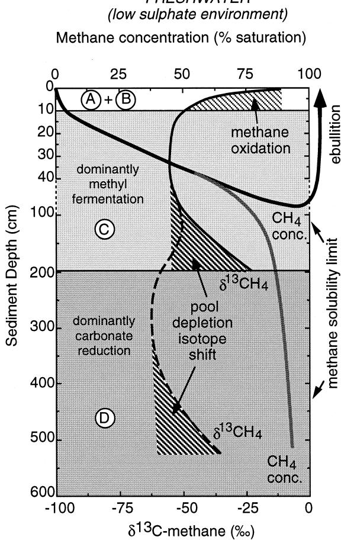

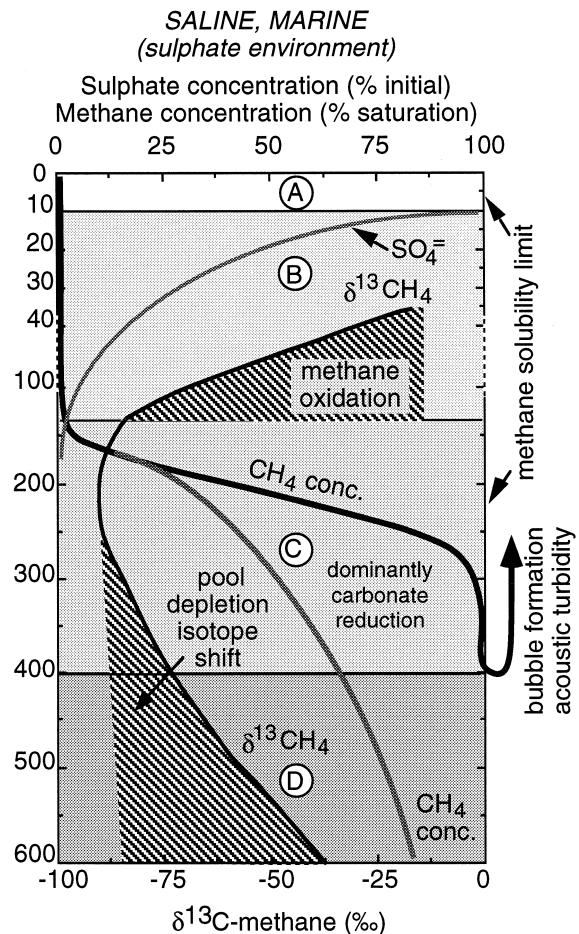  
Fig. 3. Sediment depth profiles of methane concentration and carbon isotope composition in marine and freshwater environments. $\mathbf { A } = \mathbf { o x i c }$ zone, Bssulphate reduction zone, Csmain methanogenic zone, Dszone of substrate depletion and $/ \mathrm { o r }$ shift to alternative substrate for methanogenesis, e.g., carbonate reduction.

The relative importance of some of these methylated substrates as the source for bacterial $\mathrm { C H } _ { 4 }$ is currently uncertain. However, $\mathrm { C H } _ { 4 }$ formation utilizing non-competitive substrates is known for environments such as rice paddies, salt marshes and other wetlands, i.e., those environments which are known to be major emission sources of $\mathrm { C H } _ { 4 }$ to the atmosphere Cicerone and Oremland, 1988; Andreae and Ž Schimel, 1989; Whiticar, 1990 . Enhanced methano- . genesis has also been obtained in culture experiments by additions of various ethylated and sulphide compounds Oremland et al., 1988b including Ž . diethylsulphide DES , methanethiol MeSH , Ž . Ž . ethanethiol EtSH and ethanol EtOH . Their impact Ž . Ž .

as substrates for methanogens is also currently unknown, but they are thought to be less important.

## 3. C and H isotope variations of methane in natural environments

The isotope data are reported in the standard -notation $( \mathrm { e . g . } , \delta ^ { 1 3 } \mathrm { C } .$ , D expressed here in permil . Ž . ‰ :

$$
\delta _ { x } = \left[ \frac { \left( \ R _ { \mathrm { a } } \right) _ { \mathrm { s a m p l e } } } { \left( \ R _ { \mathrm { a } } \right) _ { \mathrm { s t a n d a r d } } } - 1 \right] 1 0 ^ { 3 } \ : \left( \% _ { 0 } \right) ,\tag{4  Ž .}
$$

where $R _ { \mathrm { a } }$ is the $^ { 1 3 } \mathrm { C / ^ { 1 2 } C \ o r \ D / H \ ( \equiv ^ { 2 } H / ^ { 1 } H ) }$ ratios relative to the PDB and SMOW standards, respectively.

The study of C and H isotope systematics based on in vivo observations of methanogenesis have, in the past, generally emphasized the competitive substrates. Whiticar et al. 1986 used the combination Ž . of C and H isotope data of $\mathrm { C H } _ { 4 }$ , together with those of the coexisting bicarbonate and water species, to define compositional fields for the different methanogenic pathways. Using field measurements of $\mathrm { C H } _ { 4 }$ from various recent and ancient sedimentary environments, including marine, marsh, swamp and lacustrine settings, it was also possible with stable C and H isotopes to differentiate between the different bacterial and thermogenic $\mathrm { C H } _ { 4 }$ types. The combination of $\delta ^ { 1 3 } \mathrm { C } _ { \mathrm { C H _ { \it d } } }$ and $\delta \mathrm { D } _ { \mathrm { C H } }$ 4 values defining the various natural sources of $\mathrm { C H } _ { 4 }$ in the geosphere is demonstrated in the CD-diagram Fig. 4 . The atmo- Ž . spheric methane CD pair does not fall within any of the fields in Fig. 4 due to the isotopic offset caused by the C and H isotope effects associated with the photochemically mediated OH-abstraction reaction Ž . e.g., Whiticar, 1993 .

## 3.1. Thermogenic, non-bacterial, methane

Thermogenic $\mathrm { C H } _ { 4 }$ is generally, but not exclusively, enriched in $^ { 1 3 } \dot { \mathrm { C } }$ compared with bacterial $\mathrm { C H } _ { 4 } .$ The former has a $\delta ^ { 1 3 } \mathrm { C _ { \mathrm { C H _ { 4 } } } }$ range extending from roughly y50‰ to y20‰ Fig. 4 . The dissimilarity Ž . in isotope distributions of bacterial and thermogenic $\mathrm { C H } _ { 4 }$ accumulations is related to several factors including precursor compounds, the difference in type and magnitude of kinetic isotope effects KIE in- Ž . volved, and to the generally higher temperatures for the thermogenic generation of hydrocarbons. Within the range of $\delta ^ { 1 3 } \bar { \mathrm { C } } _ { \mathrm { C H } }$ values known for typical thermogenic gases, it is possible to further classify them according to the source rock type kerogen type and Ž . maturity level from which they were derived. A detailed discussion of isotope variations for thermogenic gases exceeds the framework of this paper see Ž Schoell, 1988; Whiticar, 1994 . However, in sum- . mary the $\delta ^ { 1 3 } \mathrm { C } _ { \mathrm { C H } }$ of thermogenic gases becomes progressively enriched in $^ { 1 3 } \mathrm { C }$ with increasing maturity, eventually approaching the ${ } ^ { 1 3 } \mathrm { C } / { } ^ { 1 2 } \mathrm { C }$ of the original organic matter or kerogen and rarely even Ž heavier . In general, the carbon isotope separation . between thermogenic $\mathrm { C H } _ { 4 }$ and organic matter $( \delta ^ { 1 3 } \mathbf { C _ { \mathrm { { C H } _ { 4 } } } } - \delta ^ { 1 3 } \mathbf { C _ { \mathrm { { C _ { o r g } } } } } )$ can vary from ca. 30‰ to 0‰. Furthermore, hydrogen-rich organic matter, i.e., kerogen types I and II, can often generate $\mathrm { C H } _ { 4 }$ at lower levels of thermal stress and with more negative $\delta ^ { 1 3 } \mathrm { C } _ { \mathrm { C H } _ { 4 } }$ values than, for example, coaly type Ž III kerogen sources. The hydrogen isotope ratios of . thermogenic CH range from 4 $\delta \mathrm { D } _ { \mathrm { C H _ { 4 } } }$ values of approximately y275‰ to y100‰ Fig. 4 . Due to the Ž . considerable overlap in $\delta \mathrm { D } _ { \mathrm { C H } }$ between certain bacterial and thermogenic methane types, the hydrogen isotope ratios of $\mathrm { C H } _ { 4 }$ are less useful as an isolated parameter to classify natural gases. However, if they are used in combination with additional molecular or isotope compositional gas data, e.g., $\mathrm { C } _ { 2 } \mathrm { - C } _ { 4 }$ , the $\delta \mathrm { D } _ { \mathrm { C H } } .$ information can be particularly valuable. In addition to thermogenic methane, the C- and H-isotope signatures and ranges of other non-bacterial methanes, such as geothermal and hydrothermal, are presented in Fig. 4 for comparison.

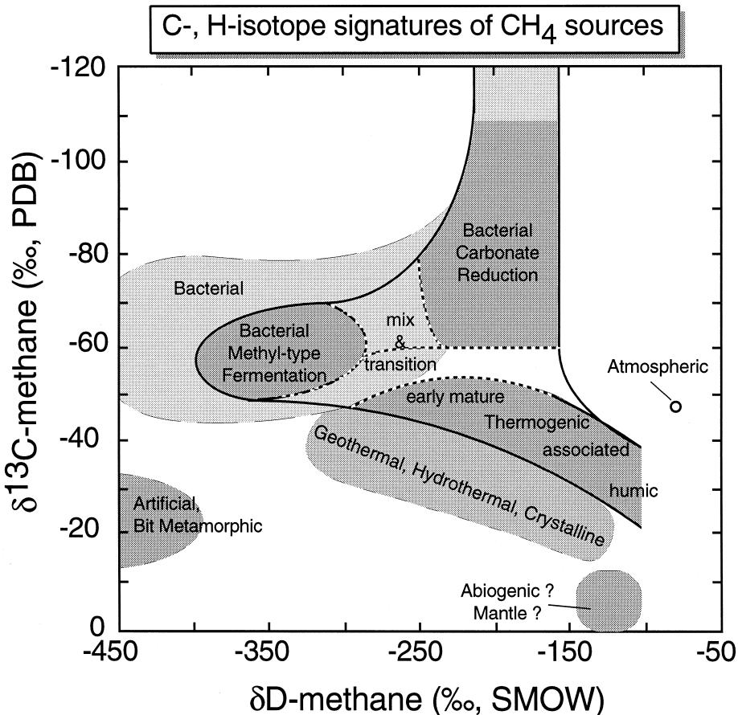  
Fig. 4. CD-diagram for classification of bacterial and thermogenic natural gas by the combination of $\delta ^ { 1 3 } \mathrm { C } _ { \mathrm { C H } _ { \perp } }$ and H 4 $\delta \mathrm { D } _ { \mathrm { C H _ { \angle } } }$ information.

## 3.2. Bacterial methane

The term ‘bacterial’ is preferred over ‘biogenic’ because the carbon in both bacterial or thermogenic natural gases, including most methane, is ultimately derived from or has been part of the biological loop of the exogenic carbon cycle.

Bacterial $\mathrm { C H } _ { 4 }$ has a wide range of C and H Ž . isotope ratios Fig. 4 , varying in $\delta ^ { 1 3 } \mathrm { C } _ { \mathrm { C H } }$ from y110‰ to y50‰, and in $\delta \mathrm { D } _ { \mathrm { C H } _ { 4 } }$ from y400‰ to y150‰. The bacterial fields in the CD-diagram shown in Fig. 4 are delineated by compiled CH4 data from natural environments Whiticar et al., Ž 1986 . Within this large range of values two primary .

bacterial $\mathrm { C H } _ { 4 }$ fields were initially identified, namely, methane that is formed in 1 freshwater and 2 Ž . Ž . saline sedimentary environments. These fields are now labeled in Fig. 4 as bacterial methyl-type fermentation and bacterial carbonate reduction, respectively. Bacterial $\mathrm { C H } _ { 4 }$ accumulated in marinersaline environments is generally more depleted in $^ { 1 3 } \mathrm { C }$ and enriched in deuterium than observed in freshwater environments Fig. 4 .Ž .

This initial distinction was based only on the classification of the depositional environments and did not explicitly consider the methanogenic pathway s involved. However, methanogenic path- Ž . ways can also be inferred from the C and H isotope data. This relies on the combination of environmental information with the understanding of microbiological processes presented in Section 2, i.e., that carbonate reduction is the dominant methanogenic pathway in marine environments and methyl-type substrates acetate are more important Ž . in freshwater environments.

The separation of the two bacterial $\mathrm { C H } _ { 4 }$ fields in the CD-diagram can be made at approximate boundaries of $\delta ^ { 1 \bar { 3 } } \mathrm { C } _ { \mathrm { C H } _ { 4 } }$ of y60‰ and $\delta \mathrm { D } _ { \mathrm { C H } _ { 4 } }$ of y250‰ Ž . Fig. 4 . Although it is common to measure only the carbon isotopes of $\mathrm { C H } _ { 4 }$ , the hydrogen isotope ratios of $\mathrm { C H } _ { 4 }$ are particularly helpful in defining the bacterial $\mathrm { C H } _ { 4 }$ types. In certain instances, the $\mathrm { C H } _ { 4 }$ isotope data have a ‘‘transitional’’ isotope composition that lies between the two fields. The explanation for this overlap is related to the combined effects of: 1Ž . kinetic isotope fractionation by methanogens, 2Ž . mixtures of various pathways andror $\mathrm { C H } _ { 4 }$ types Ž . Ž . e.g., migrationrdiffusion and 3 variations in $\mathrm { C } \mathrm { - }$ and H-isotope composition of precursor organic matter. These three explanations are expanded in Section 4.

## 4. Factors controlling isotope signatures in bacterial methane

## 4.1. Kinetic isotope effects for carbon

The distribution of carbon isotopes during uptake and metabolism of carbon compounds by methanogens is controlled primarily by 1. isotope signature of source material and 2. KIEs. In the general case for each particular compound, the molecules with the lower isotopic mass $\mathrm { ( e . g . , \ ^ { 1 2 } C H _ { 3 } C O O H }$ as opposed to $^ { 1 3 } \mathrm { C H } _ { 3 } \mathrm { C O O H } )$ diffuse and react more rapidly and thus are utilized more frequently than the isotopically heavier species. This discrimination accounts for the strong depletion in $^ { 1 3 } \mathrm { C }$ of bacterial $\mathrm { C H } _ { 4 }$ relative to the precursor substrates. The apparent magnitude of this isotope fractionation varies for different pathways Table 1 . For example, the fer- Ž . mentation of acetate involves an enrichment in $^ { 1 2 } \mathrm { C }$ on the order of $\delta ^ { 1 3 } \mathbf { C } _ { \mathrm { a c e t a t e } }$ . A significantly greater $2 5 \text{‰}$ to 35‰ for $\delta ^ { 1 3 } \mathrm { C } _ { \mathrm { C H } }$ $^ { 1 2 } \mathrm { C }$ 4 enrichment relative to Ž over 55‰ for $\bar { \delta } ^ { 1 3 } \mathrm { C } _ { \mathrm { C H } _ { \perp } }$ relative to $\delta ^ { 1 3 } \mathrm { C } _ { \mathrm { c a r b o n \ d i o x i d e } } )$ is observed for methanogenesis by carbonate reduction.

Table 1  
Magnitude of carbon isotope effects associated with methanogenesis
<table><tr><td colspan="2">(A)Methanogenesis: natural observations</td></tr><tr><td>Environment</td><td>Fractionation factor  $\left( \varepsilon _ { \mathrm { { C } } } \right)$  of carbon dioxide-methane</td></tr><tr><td>Freshwater (methylated compounds)</td><td>39 to 58</td></tr><tr><td>Marine (carbonate reduction)</td><td>49 to 95</td></tr></table>

Ž . B Methanogenesis: culture experiments
<table><tr><td rowspan="2">Substrate</td><td colspan="2">Fractionation factors  $\left( \varepsilon _ { \mathrm { C } } \right)$ </td></tr><tr><td>Substrate-methane</td><td>Carbon dioxide-methane</td></tr><tr><td>Methanol</td><td>68 to 77</td><td>40 to 54</td></tr><tr><td>Acetate</td><td>24 to 27</td><td>10</td></tr><tr><td>TMA</td><td>39</td><td>49</td></tr><tr><td> ${ \mathrm { C O } } _ { 2 } { \mathrm { - H } } _ { 2 }$ </td><td>55 to 58</td><td>55 to 58</td></tr><tr><td>DMS</td><td>44 to 54</td><td></td></tr><tr><td>DES</td><td>49</td><td></td></tr><tr><td>EtSH</td><td>54</td><td></td></tr></table>

In a closed system, the continued preferential removal of the isotopically lighter molecules from the carbon pool during methanogenesis results in a progressive shift in the residual substrate towards heavier, 13C-enriched values. Hence, there is a corresponding progressive $^ { 1 3 } \mathrm { C }$ enrichment in $\mathrm { C H } _ { 4 }$ that is subsequently formed. This carbon isotope mass balance is commonly described by the distillation functions of Rayleigh 1896 , that can be approximated Ž . by the general forms Eqs. 5 and 6 to describe Ž Ž . Ž .. the isotope ratio of the remaining reactant and accumulated product, respectively:

$$
R _ { \mathrm { r } , t } ^ { } = R _ { \mathrm { r } , i } f ^ { ( \alpha - 1 ) }\tag{Ž . 5}
$$

and

$$
R _ { \mathrm { p } , t } = R _ { \mathrm { r } , i } { \frac { \left( 1 - f ^ { \alpha } \right) } { \left( 1 - f \right) } }\tag{Ž . 6}
$$

where $R _ { \mathrm { r } , x }$ is the isotope ratio of the precursor substrate, e.g., acetate or $\mathrm { C O } _ { 2 } .$ , and accumulating initially Ž .i and at time t, and $R _ { \mathrm { p } , x } .$ is the isotope ratio of the accumulating product, e.g., methane, $f$ is the fraction of initial substrate remaining at time t and  is the kinetic isotope fractionation factor.

The isotope separation in -notation between two compounds, e.g., $\begin{array} { r } { \hat { \delta } ^ { 1 3 } \mathbf { C } _ { \mathrm { c o } , } } \end{array}$ and $\delta ^ { 1 3 } \mathrm { C } _ { \mathrm { C H } _ { 4 } } ,$ can be expressed as the isotope separation factor $( \varepsilon _ { \mathrm { { C } } } )$

$$
\begin{array} { r l } & { \varepsilon _ { \mathrm { C } } \approx 1 0 ^ { 3 } \ln \alpha _ { \mathrm { C } } \approx 1 0 ^ { 3 } \big ( \alpha _ { \mathrm { C } } - 1 \big ) } \\ & { ~ \approx \delta ^ { 1 3 } \mathbf { C } _ { \mathrm { C O } _ { 2 } } - \delta ^ { 1 3 } \mathbf { C } _ { \mathrm { C H } _ { 4 } } . } \end{array}\tag{7Ž .}
$$

Note that the approximations in Eq. 7 are valid Ž . for relatively small isotope separations, typically less than 25‰ between species. For larger separations, common with hydrogen isotopes, these assumptions can lead to significant errors. In these cases, the fractionation factor $\alpha _ { \mathrm { { C } } }$ is better defined as the ratio of the reaction rate constants for the two isotopes, Ž . e.g., referring to Eq. 1 , $\alpha _ { \mathrm { { C } } } = { } ^ { 1 3 } k / { } ^ { 1 2 } k$ , where:

$$
^ { 1 2 } { \bf C O } _ { 2 } \stackrel { ^ { 1 2 } k } {  } ^ { 1 2 } { \bf C H } _ { 4 } \quad \mathrm { a n d } \quad ^ { 1 3 } { \bf C O } _ { 2 } \stackrel { ^ { 1 3 } k } {  } ^ { 1 3 } { \bf C H } _ { 4 } .\tag{8Ž .}
$$

For equilibrium isotope situations, the relationship between  and  is defined as:

$$
\alpha _ { \mathrm { A - B } } = \frac { \left( \delta _ { \mathrm { A } } + 1 0 ^ { 3 } \right) } { \left( \delta _ { \mathrm { B } } + 1 0 ^ { 3 } \right) } .\tag{9Ž .}
$$

Normally, isotope equilibrium cannot be assumed for these kinetic reactions. However, this notation has sometimes been used to express the magnitude of the isotope partitioning. These Rayleigh distillation functions expressions Eqs. 5 and 6 Ž Ž . Ž .. can be converted to -notation and simplified by the substitution with  Ž Ž .. Eq. 7 and taking $F = 1 - f ,$ the remaining reactant, where:

$$
\delta ^ { 1 3 } \mathrm { C } _ { \mathrm { s u b s t r a t e } , t } = \delta ^ { 1 3 } \mathrm { C } _ { \mathrm { s u b s t r a t e } , i } + \varepsilon \ln ( 1 - F ) ,\tag{Ž .  10}
$$

and for the instantaneous product formed:

$$
\delta ^ { 1 3 } \mathrm { C } _ { \mathrm { m e t h a n e } , t } = \delta ^ { 1 3 } \mathrm { C } _ { \mathrm { s u b s t r a t e } , i } + \varepsilon \big ( 1 + \ln ( 1 - F ) \big ) .\tag{Ž . 11}
$$

The actual location s , e.g., at the membrane Ž . andror enzymatic level, where the isotope fractionation occurs during methanogenesis is still uncertain. However, the consequence of this fractionation is that within a specific environment a considerable range in carbon isotope values can be observed which is dependent on the degree to which the substrate has been depleted Fig. 5 . In cases of Ž . extensive substrate exhaustion, the carbon isotope values of bacterial $\mathrm { C H } _ { 4 }$ can approach those of the original organic matter. In some instances where mass balance is not maintained, such as loss of the methane initially formed, the methane can in fact be more enriched in $^ { 1 3 } \mathrm { C }$ than the starting precursor material. Although such variations in the $\delta ^ { 1 3 } \mathrm { C } _ { \mathrm { C H } _ { 4 } }$ values exist, they are most commonly observed in methanogenic culture experiments.

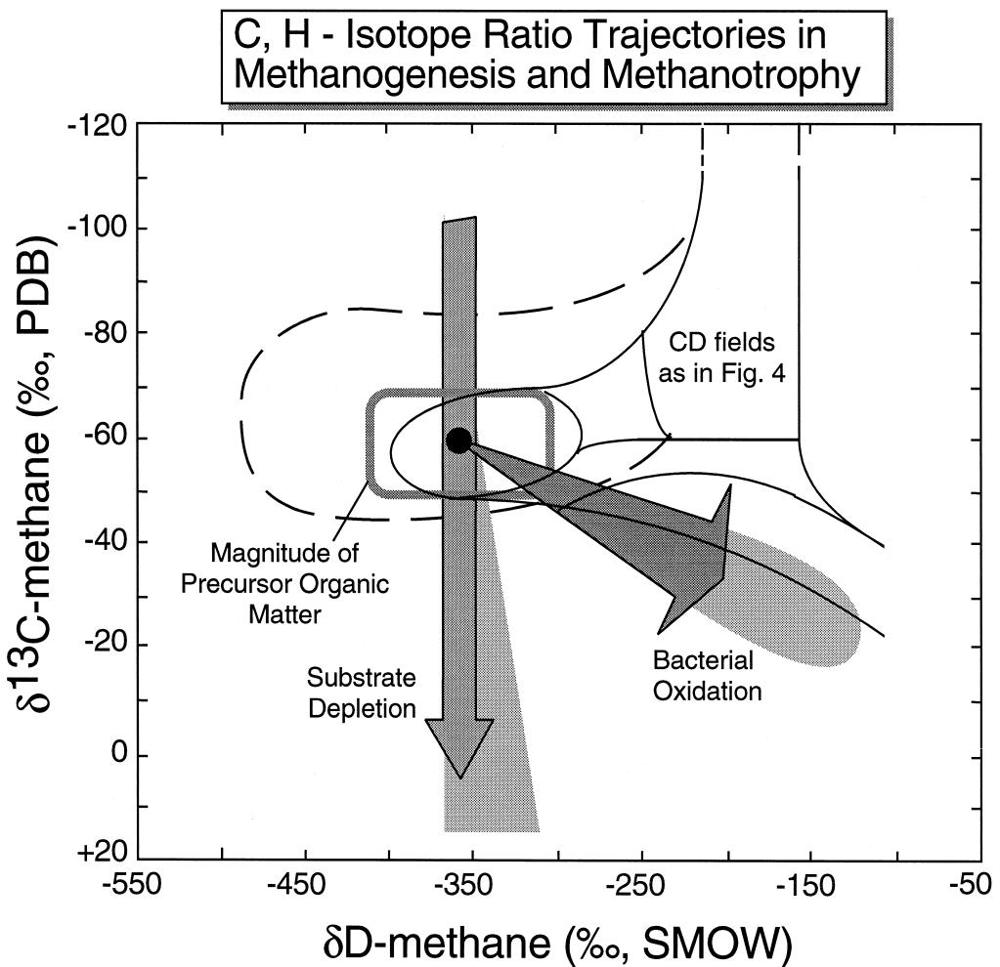  
Fig. 5. Theoretical shifts in $\delta ^ { 1 3 } \mathrm { C } _ { \mathrm { C H } _ { 4 } }$ and $\delta \mathrm { D } _ { \mathrm { C H } _ { 4 } }$ as a result of isotope variations in original organic matter and through secondary effects Ž . substrate depletion and methane oxidation .

## 4.2. Temperature effects on carbon isotope Õalues

The effect of temperature on the fractionation of carbon isotopes associated with methanogenesis is poorly understood. Conrad and Schutz 1988 ¨ Ž . demonstrated a 2.5- to 3.5-fold increase in $\mathrm { C H } _ { 4 }$ generation due to a $1 0 ^ { \circ } \mathrm { C }$ temperature rise, but it is not known if this would affect the KIE. Later, they reported that the temperature could influence the rates and pathways of methanogenesis Schutz and Ž ¨ Conrad, 1996; Schutz et al., 1997 . Whiticar et al. ¨ . Ž . 1986 showed that there is a general trend to lower fractionations with increasing temperature. Empirically, one could expect a decrease in the isotope effect at higher temperatures. A rough, albeit incomplete, test is provided by comparing the $\alpha _ { \mathrm { { C } } }$ between $\mathrm { C O } _ { 2 }$ and $\mathrm { C H } _ { 4 }$ from carbonate reducing methanogenesis at various temperatures Table 2 . This relation-Ž . ship, shown in Fig. 6, indicates, as expected from thermodynamic considerations, that the KIE decreases significantly with increasing temperature. Over a 1108C temperature rise, the isotopic partition of $\delta ^ { 1 3 } \mathrm { C } _ { \mathrm { C O } _ { 2 } } { - } \delta ^ { 1 3 } \mathrm { C } _ { \mathrm { C H } _ { 4 } }$ decreases from 100‰ to 40‰, equivalent to an $\varepsilon _ { \mathrm { { C } } }$ change of ca. 86 to 39 for $\mathrm { C O } _ { 2 } { \mathrm { - C H } } _ { 4 }$ pair Eq. 7 . Botz et al. 1996 also Ž Ž .. Ž . documented a temperature dependence of isotope fractionation during biological methanogenesis. Their culture experiments of methanogenesis by carbonate reduction with Methanococcales at $3 5 { - } 8 5 ^ { \circ } \mathrm { C }$ gave $\varepsilon _ { \mathrm { { C } } }$ values of 76 to 47, respectively.

In addition to temperature, it has been suggested that the carbon isotope fractionation is dependent on other factors such as substrate concentration and rates of methanogenesis. Zyakun 1992 reported for Ž . culture experiments that the magnitude of carbon isotope fractionation during methanogenesis by carbonate reduction was dependent on the $\mathrm { C O } _ { 2 }$ gassing rate. Above a critical $\mathrm { C O } _ { 2 }$ threshold the $\mathrm { C O } _ { 2 } { \mathrm { - C H } } _ { 4 }$ isotope separation was constant, but decreased dramatically as the amount of $\mathrm { C O } _ { 2 }$ available dropped. Fuchs et al. 1979 demonstrated a similar result. InŽ . addition, Zyakun 1992 stated that the magnitude of Ž . the carbon isotope fractionation is also dependent on the rate of methanogenesis by a variety of methanogens and substrates $\left( \mathbf { C O } _ { 2 } \right.$ and methylated . . It is clear from these experiments that the isotope separation between the precursor and methane decreases with the degree of substrate utilization. However, the magnitude of separation is unlikely to be caused by a change in the isotope effect, i.e., a change in the enzymatic kinetic reaction rates for $^ { 1 3 } \mathrm { C }$ vs. $^ { 1 7 } \mathrm { C } \left( \mathrm { E q . \ ( 8 ) } \right)$ . It is more likely that the decrease in precursor-methane isotope separation is due to a ‘reservoir effect’ caused by substrate depletion andror diminished rates of substrate transport across the membrane walls of the methanogens. Thus, the maximum expression of the carbon isotope effect corresponds to the situations with high substrate levels. Increased levels of methanogenesis at higher temperatures is well documented. For example, Martens et al. 1986 and Jedrysek 1995 showed Ž . Ž . that diurnal variations in temperature could influence the carbon isotopes, but again this is probably a methanogenic rate effect and not enzymatic. Iversen

Effect of temperature on the magnitude of carbon isotope effects associated with methanogenesis by carbonate reduction
<table><tr><td>Location/bacterium</td><td>Temperature (C)</td><td> $\varepsilon _ { \mathrm { C } } ~ \mathrm { C O } _ { 2 } – \mathrm { C H } _ { 4 }$ </td><td>References</td></tr><tr><td>Bransfield Strait (Antarctic)</td><td>-1.3</td><td>86 to 95</td><td>Whiticar and Suess (1990)</td></tr><tr><td>Methanosarcina barkeri</td><td>20</td><td>77</td><td>Whiticar,Muller, Blaut (unpublished data)</td></tr><tr><td></td><td>37</td><td>58</td><td></td></tr><tr><td>Thermoautotrophicum</td><td>65</td><td>34 to 40</td><td>Fuchs et al. (1979)</td></tr><tr><td>Hyperthermophil</td><td>110</td><td>40</td><td>Whiticar, Stetter,Huber (unpublished data)</td></tr></table>

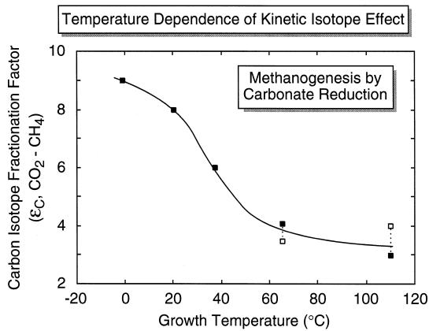  
Fig. 6. Temperature dependence of carbon isotope partitioning $\left( \varepsilon _ { \mathrm { { C } } } \right.$ between $\delta ^ { 1 \dot { 3 } } \mathrm { C } _ { \mathrm { C O } _ { 2 } }$ and $\overline { { \delta ^ { 1 3 } } } \mathrm { C _ { \mathrm { { C H _ { 4 } } } } ) }$ by methanogens via the carbonate reduction pathway.

Ž . 1996 found that the temperature may have some effect on the rate of methane oxidation but the results were inconclusive. There is no evidence indicating that temperature affects the carbon or hydrogen isotopes related to methane oxidation, although some effect, albeit small, could be anticipated.

Temperature was suggested by Hornibrook et al. Ž . 1997 to influence the methanogenic pathway and the carbon and hydrogen isotope signatures. Waldron et al. 1998 challenged this and in reply Hornibrook Ž . et al. 1998 subsequently clarified that temperature Ž . indirectly exerted some influence on substrate availability due to enhanced microbial remineralization rates.

## 4.3. Hydrogen isotope effects

Our understanding of the hydrogen isotope effects associated with methanogenesis is limited. Empirical evidence suggests that substantial enrichments in $\mathrm { ^ { 1 } H }$ do occur as hydrogen is transferred to the methane molecule from either organic precursors or formation water. This hydrogen isotope partitioning is present regardless of the methanogenic pathway, but the magnitude may be dependent on it, Whiticar et al., Ž 1986; Burke et al., 1988a . As expected by the larger . mass difference between $\mathrm { ^ 1 H }$ and $^ 2 \mathrm { H }$ than $^ { 1 2 } \mathrm { C } \mathrm { \Delta v s }$ $^ { 1 3 } { \mathrm { C } } ,$ , the hydrogen isotope partitioning is larger than carbon isotopes. As discussed below, it remains unresolved to what extent kinetic vs. equilibrium mechanisms dominate the hydrogen isotope distributions in methane. In addition, there are suggestions that factors such as hydrogen concentration Burke, 1992, Ž 1993 or hydrogen isotope exchange de Graaf et al., . Ž 1996 complicate the situation. .

## 4.4. Mixtures

Bacterial $\mathrm { C H } _ { 4 }$ with ‘‘mixed’’ or ‘‘transitional’’ isotope signatures can often be present in a gas sample. This could be the result of contributions of $\mathrm { C H } _ { 4 }$ from different methanogenic pathways Fig. 5 Ž . which may be operating in the same location, either concurrently or successively. For example, the form of methanogenesis can shift from one substrate to another, such as the succession to carbonate reduction after the acetate pool is exhausted. This is observed in some freshwater systems e.g., Horni-Ž brook et al., 1997 . Work in shallow marine sedi- . ments by Sansone and Martens 1981 , Martens et al.Ž . Ž . Ž . Ž . 1986 , Burke et al. 1988b and Kelley et al. 1992 demonstrated that shifts to different methanogenic substrates or isotope signatures might also be controlled by seasonal conditions.

These gas mixtures could also be the result of physical mixing of different $\mathrm { C H } _ { 4 }$ pools in response to vertical or lateral migration or diffusion of gas. This mixing is not necessarily restricted to bacterial gas, but can also involve admixtures of thermogenic gas.

## 4.5. Isotope Õariations in precursor organic matter

It is more difficult to assess the third point, namely, variations in isotope composition of the precursor organic matter. C and H isotope values of bulk organic matter that are available for specific environments exhibit the approximate isotope ranges shown in Fig. 5. With the exception of dissolved $\Sigma { \bf C O } _ { 2 }$ see below , isotope measurements are sparse Ž . for specific methanogenic substrates in natural environments. The magnitude to which the C and H isotope compositions of the various methanogenic substrates deviate from those of the bulk organic matter is not well known, nor is the magnitude of any intramolecular isotope fractionation present in such substrates well understood Yankwich and Ž Promislov, 1953; Meinschein et al., 1974; Rossmann et al., 1991 . However, it has been assumed up to . now that the natural C and H isotope signatures of a substrate in a specific setting are similar to those of the bulk organic matter, provided that severe substrate depletion has not occurred and that large interor intramolecular variations are not present. Analytical techniques now are available to measure C and H isotope ratios in methane and the precursors in the picomole range e.g., Whiticar et al., 1998a,b , that Ž . should help resolve this issue.

Methylated substrates available for fermentation by methanogens often are present only in minor amounts. This is due to an effective combination of formation and utilization that leads to a relatively short residence time. Although this may control the rate of methanogenesis via methyl-type fermentation, the amount of methane produced can exceed saturation Fig. 3 . The low concentration of methanogenic Ž . substrates, such as organic acids, makes it difficult to isotopically model their removal e.g., Sansone and Ž Martens, 1981; Blair and Carter, 1992 . In contrast, . organic-rich marine sediments can have substantial bicarbonate concentrations $\mathrm { \Lambda } ( > 1 0 0 \mathrm { \mod { \Omega } m M } )$ These amounts permit more readily the modeling of carbon isotope systematics for methanogenesis by carbonate reduction. Claypool 1974 provided one of the first Ž . models using gas and interstitial data from sediment cores of the Deep Sea Drilling Program DSDP, later Ž Ocean Drilling Program, ODP . An illustration of . results similar to those found in numerous DSDP, ODP and other sediment cores is illustrated by the 7.5-m piston core taken at station 1327 in the Bransfield Strait, Antarctic Whiticar and Suess, 1990 . In Ž . this case, $\mathrm { C H } _ { 4 }$ concentrations first exceed 100 ppb Ž . weight of gasrweight of wet sediment beneath the sulphate reduction zone Fig. 7a . The continual Ž . removal of dissolved bicarbonate by methanogens is marked by the reduction in the increase of dissolved $\boldsymbol { \Sigma } \boldsymbol { \mathbf { C } } \boldsymbol { \mathbf { O } } _ { 2 }$ concentration with depth from the sulphate reduction zone to the zone of methanogenesis. This change was accompanied by a sharp decrease in molar C:N ratio carbonate alkalinity:ammonia due Ž . to the preferential uptake of carbon over nitrogen. The more rapid uptake and utilization of $^ { 1 2 } \mathrm { C }$ bicarbonate by methanogens in core 1327 leads to a gradual shift in $\delta ^ { 1 3 } \bar { \mathbf { C } } _ { \mathrm { c o } }$ towards heavier values in the older sediments Fig. 7b . This depletion is in Ž . turn expressed in the $\delta ^ { \tilde { 1 3 } } \mathrm { C }$ of the $\mathrm { C H } _ { 4 }$ , which also becomes heavier with sediment depth in the methanogenic zone as predicted by the Rayleigh function Eq. 15 . The carbon isotope separation Ž Ž .. between $\mathrm { C O } _ { 2 }$ and $\mathrm { C H } _ { 4 }$ in the $\mathrm { C H } _ { 4 }$ zone of core 1327 is consistently around 80‰. The fact that the $\mathrm { C O } _ { 2 }$ concentration does not substantially decrease in this zone, indicates that $\mathrm { C O } _ { 2 }$ is continually added by organic remineralization to the pool in the methanogenic zone, although overall there is $\mathrm { ~ a ~ } ^ { 1 2 } \mathrm { C }$ depletion by the methanogens. This strict relationship between $\delta ^ { 1 3 } \mathrm { C } _ { \mathrm { C O } , \ l }$ and $\delta ^ { 1 3 } \mathrm { C } _ { \mathrm { C H } _ { \perp } }$ provides important information about methanogenic pathways, as is developed in greater detail below.

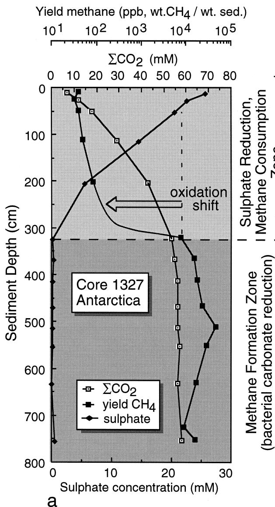

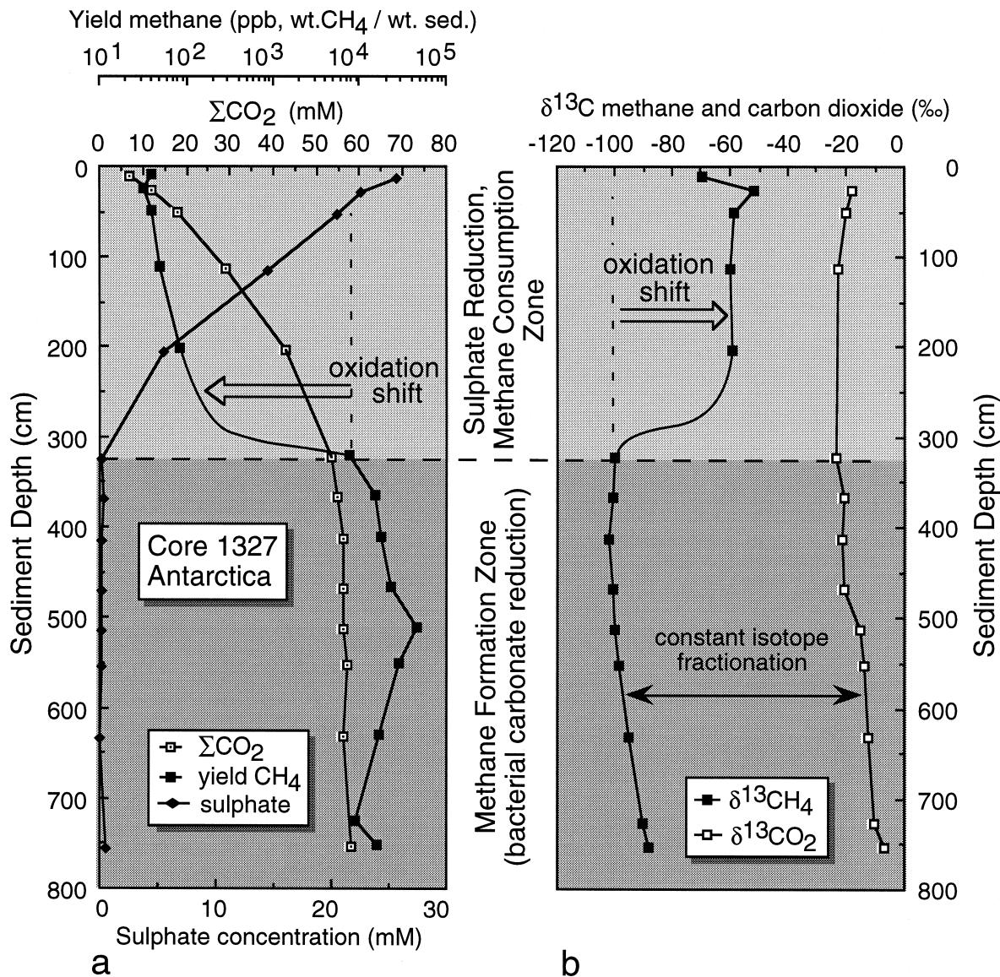

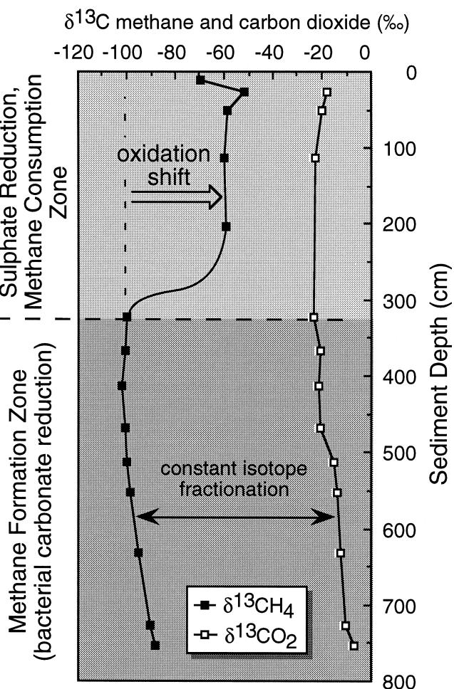  
Fig. 7. a Concentration depth profiles of methane, bicarbonate and sulphate and b carbon isotopes of methane and bicarbonate in the Ž . Ž . marine sediments from core 1327, Bransfield Strait, Antarctic.

The variations in inter- and intramolecular isotope distributions and effects for hydrogen in organic matter are much less well constrained than for carbon. Typically only determinations of bulk $ { \delta _ { \mathrm { D } _ { c } } }$ are available for natural environments without the respective $\mathrm { D } / \mathrm { H }$ values for specific substrates or hydrogen isotope distributions within the precursor molecules. Some culture experiments have used additions of water and substrates with known hydrogen isotope values to assess the methanogenic processes and magnitudes of the related isotope effects.

## 5. Isotope systematics of methanogenesis with the coexisting $\mathbf { C O } _ { 2 }$ and water

## 5.1. Carbon isotopes

Although the CD-diagram Fig. 4 can be used to Ž . differentiate the major $\mathrm { C H } _ { 4 }$ sources, the various secondary effects discussed above can obscure the signature of source s under certain conditions. The Ž . ambiguity in determining the methanogenic pathway can sometimes be resolved by considering the isotope information of $\mathrm { C O } _ { 2 } \ ( \delta ^ { 1 \bar { 3 } } \mathrm { C } _ { \mathrm { C O } , } )$ and formation water $( \delta \mathrm { D } _ { \mathrm { H , O } } )$ which coexist with the $\mathrm { C H } _ { 4 } , \mathrm { e . g . }$ ., in the corresponding pore fluid or water mass.

In the case of carbon, the isotope separation factor between $\delta ^ { 1 3 } \mathrm { C } _ { \mathrm { c o } , \ l }$ and $\delta ^ { 1 3 } \mathrm { C } _ { \mathrm { C H } _ { 4 } } \ \mathrm { \Delta } \hat { ( } \varepsilon _ { \mathrm { C } } )$ is defined by Eq. 7 . In natural marine or saline environments Ž . $\varepsilon _ { \mathrm { { C } } }$ associated with methanogenesis predominantly by carbonate reduction ranges from 49 to over 100, with values most commonly around 65 to 75 Fig. 8, after Ž Whiticar et al., 1986 . In comparison, the corre- . sponding fractionation factors for methanogenesis in freshwater environments, i.e., those dominated by fermentation of methylated substrates, are distinctively lower with $\varepsilon _ { \mathrm { { C } } }$ values typically ranging between 40 and 55 Fig. 8 . A key point is that thisŽ . carbon isotope fractionation factor tends to remain more or less constant for each specific setting or diagenetic environment. Thus, although the $\delta ^ { 1 3 } \bar { \mathrm { C } } _ { \mathrm { C H _ { 4 } } }$ can shift dramatically in response to the changing isotope ratio of the depleting substrate, the isotope separation between $\mathrm { C H } _ { 4 }$ and $\mathrm { C O } _ { 2 }$ remains consistent for, and indicative of, the particular methanogenic pathway. This is illustrated in Fig. 8 by the production arrow. Similarly, the environments where methanogenesis operates with mixed substrates can also be recognized using the $\mathrm { C H } _ { 4 } – \mathrm { C O } _ { 2 }$ pairs despite large variations in the actual $\delta ^ { 1 3 } \mathrm { C } _ { \mathrm { C H } }$ values.

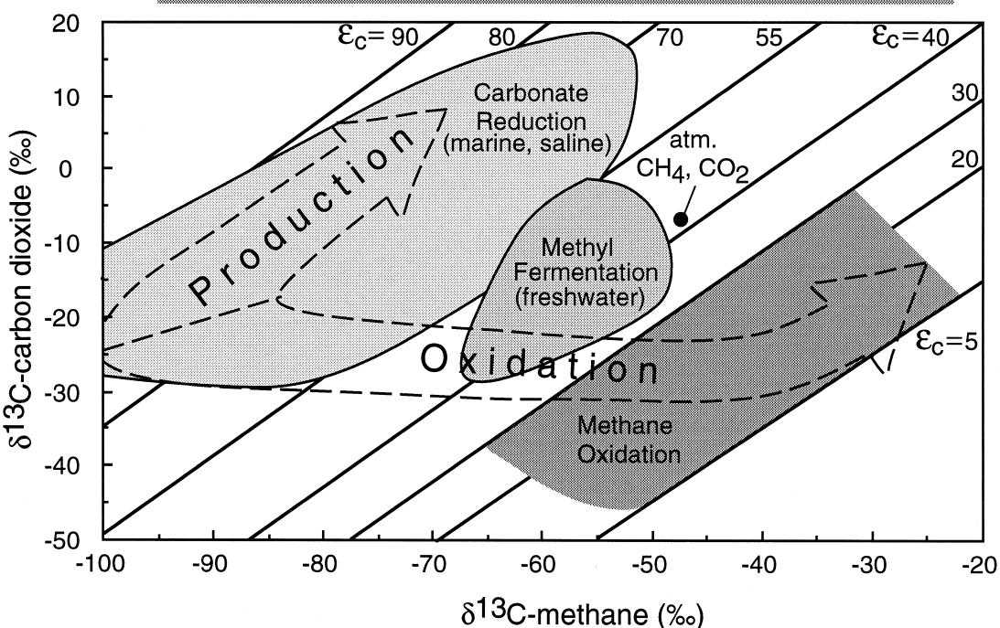  
Fig. 8. Combination plot of $\delta ^ { 1 3 } \mathrm { C } _ { \mathrm { C H _ { \it d } } }$ and $\delta ^ { 1 3 } \mathrm { C } _ { \mathrm { c o } . }$ with isotope fractionation lines $( \varepsilon _ { \mathrm { C } } )$ Ž . according to Eq. 7 . Methanogenesis by carbonate reduction saline, marine region has a largerŽ . $\mathrm { C O } _ { 2 } \mathrm { - C H } _ { 4 }$ isotope separation than by methyl-type fermentation freshwater region or methane  Ž . consumption. The figure also shows the observed $\mathrm { C O } _ { 2 } { \mathrm { - C H } } _ { 4 }$ carbon isotope partitioning trajectories resulting from both bacterial methane formation and oxidation processes.

The carbon isotope fractionation factors between $\mathrm { C O } _ { 2 }$ and $\mathrm { C H } _ { 4 }$ , associated with methanogenesis in marine and freshwater environments, are summarized in Table 1. For comparison, Table 1 also provides the carbon fractionation factors between $\mathrm { C H } _ { 4 }$ and various substrates after Oremland et al.,Ž 1988a,b; Whiticar, 1994 , as determined by culture . experiments. Similar to that reported by Rosenfeld and Silvermann 1959 and Krzycki et al. 1987 , Ž . Ž . methanol exhibits the largest carbon isotope fractionation between a methylated substrate and the methane formed, i.e., $\varepsilon _ { \mathrm { { C _ { \mathrm { { m e t h a n o l - m e t h a n e } } } } } } = 6 8 ~ \mathrm { { t o } } ~ 7 7$ Table 1 . Pre- Ž . dictably, the largest $\widetilde { \mathrm { C O } _ { 2 } } \mathrm { - C H } _ { \angle }$ separation was observed for $\mathrm { C O } _ { 2 } .$ -reduction, $\varepsilon _ { \mathrm { C } } = 5 8$ Table 1 . This is Ž . comparable to the carbon isotope fractionation value of $\varepsilon _ { \mathrm { { C } } }$ ca. $^ { 5 7 }$ reported by Zyakun 1992 for carbon- Ž . ate reduction culture with $\mathrm { C O } _ { 2 }$ concentration as above and independent of the critical threshold. Similarly, Waldron et al. 1998 found Ž . $\varepsilon _ { \mathrm { { C } } }$ to be ca. 55 for carbonate reduction in their batch cultures. In the same paper, the authors reported $\varepsilon _ { \mathrm { { C } } }$ to be ca. 24 for acetate fermentation.

## 5.2. Hydrogen isotopes

The relationship between the hydrogen isotope ratios of bacterial $\mathrm { C H } _ { 4 }$ and the coexisting formation water can also be employed to track methanogenic pathways. This consideration, introduced by Nakai et al. 1974 and developed by Schoell 1980 , Wolte- Ž . Ž . mate et al. 1984 and Whiticar et al. 1986 , is due Ž . Ž . to methanogens deriving a specific proportion of their hydrogen for $\mathrm { C H } _ { 4 }$ formation ultimately from the water in which they live. For carbonate reduction, the coexisting formation water is essentially the initial hydrogen source 100% . This has been con- Ž . firmed experimentally by Pine and Barker 1956 , Ž . Fuchs et al. 1979 and Daniels et al. 1980 . The Ž . Ž . fermentation of methylated substrates is thought to involve an intact transfer of the three methyl hydrogens 75% to theŽ . $\mathrm { C H } _ { 4 }$ molecule Fig. 9 . This intact  Ž . hydrogen transfer has been demonstrated in culture studies with deuterated substrates Pine and Barker, Ž 1956; Pine and Vishniac, 1957; Daniels et al., 1980; Whiticar et al., 1998a,b ..

The empirical relationship expected between $\delta \mathrm { D } _ { \mathrm { C H _ { \perp } } }$ and the coexisting $\delta \mathrm { D } _ { \mathrm { H , O } }$ as depicted in Fig. 9 should be:

$$
\delta \mathrm { D } _ { \mathrm { C H } _ { 4 } } = m \big ( \delta \mathrm { D } _ { \mathrm { H } _ { 2 } \mathrm { O } } \big ) - \beta ,\tag{12 Ž .}
$$

where $m = 1$ holds for carbonate reduction, and $m =$ 0.25 is expected for the fermentation of methylated substrates. The values for $\cdot \beta ^ { \cdot }$ in Eq. 12 are depen- Ž . dent on the isotope effects involved in the abstraction and transfer of the hydrogen. For the methylated compounds, they are also additionally dependent on the hydrogen isotope ratio of the methyl hydrogens. The combined hydrogen isotope effects during carbonate reduction in various environments appear to be remarkably consistent around 160‰ to 180‰ for $\mathrm { C H } _ { 4 }$ relative to the formation water, as shown in Fig. 10.

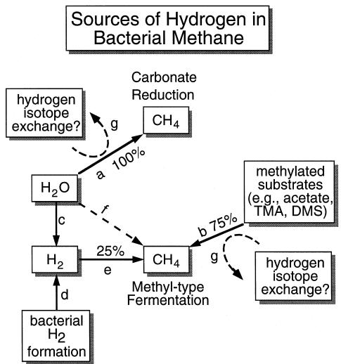  
Fig. 9. Sources of hydrogen incorporated into methane through the carbonate reduction and methyl-type fermentation methanogenic pathways. The letters refer to pathways: a is the direct utilization Ž . of water–hydrogen during carbonate reduction, with an associated isotope effect $( \varepsilon _ { \mathrm { { H } } } )$ Ž . of 160; b is the direct transfer of methyl–hydrogen from the organic matter $( \delta \mathrm { D } _ { \mathrm { o r g } } \ \mathrm { c a . } \ - 8 0 \% ) ;$ Ž .  c is the dissociation of water to hydrogen gas either inorganically or via biological processes; d is the direct synthesis of hydrogen gas by Ž . bacterial activity, e.g., acetoclasts; e is the incorporation ofŽ . hydrogen gas as the final hydrogen into the methane molecule the Ž magnitude of the isotope effect is poorly constrained ; f is a . Ž . potential direct utilization of water by methanogens during fermentation.

There is probably not a universal value for $\beta$ with respect to methylated substrates. Rather, the magnitude of the isotope offset is site specific. However, most studies suggest that $\beta$ associated with methanogenesis by methyl-type fermentation is significantly larger than for carbonate reduction. Based on the current SEOS School of Earth and Ocean Ž Sciences, Victoria and BGR Bundesanstalt fur Ge-. Ž ¨ owissenschaften und Rohstoffe, Hannover data . bases, values of $\beta$ known for methylated substrates are greater than 300 and extend up to 377.

In methanogenic environments with more than one active pathway, the situation is more complicated. To accommodate the mixture of two pathways, e.g., combination of carbonate reduction and fermentation of methylated substrates, in the isotope mass balance, Eq. 7 can be modified to: Ž .

$$
\begin{array} { r l } & { \delta \mathrm { D } _ { \mathrm { C H } _ { 4 } } = f \big ( \delta \mathrm { D } _ { \mathrm { H } _ { 2 } 0 } - 1 6 0 \big ) } \\ & { ~ + \big ( 1 - f \big ) \big [ \big ( 0 . 7 5 \delta \mathrm { D } _ { \mathrm { m e t h y l } } \big ) } \\ & { ~ + \big ( 0 . 2 5 \delta \mathrm { D } _ { \mathrm { h y d r o g e n } } \big ) \big ] , } \end{array}\tag{13 Ž .}
$$

where $f$ is the relative proportion of methanogenesis by carbonate reduction $( f = 0$ .  to 1 to fermentation by methylated substrates, $\delta \mathrm { D } _ { \mathrm { m e t h y l } }$ is the hydrogen isotope ratios of the intact-transferred methyl group and $\delta \mathrm { D } _ { \mathrm { h y d r o g e n } }$ is that of the final hydrogen incorporated. $\delta \dot { \mathrm { D } } _ { \mathrm { C H _ { 4 } } }$ and $ { \delta \mathrm { D } _ { \mathrm { H } , 0 } }$ are readily measured, but our present deficiencies in precise information on the distribution of hydrogen isotopes in methylated substances make solution of Eq. 13 difficult. However, Ž . ranges on the parameters can be estimated.

In recent years, the hydrogen isotope systematics associated with methanogenesis have been revisited. Sugimoto and Wada 1993, 1995 investigated the Ž . relationships between $\delta \mathrm { D } _ { \mathrm { C H } } .$ 4 and $ { \delta \mathrm { D } _ { \mathrm { H } , 0 } }$ for rice paddy soil during methanogenesis in culture experiments. Although they only indirectly calculated the relative importance of the two methanogenic pathways, the authors reported values for m and $\beta$ according to Eq. 12 of 0.437 and 302 L4 in Fig. Ž . Ž 10 , respectively, for methyl-type fermentation. In- . terestingly, they also calculated $m$ and $\beta$ values of 0.683 and 317 for the carbonate reduction pathway Ž . L6 in Fig. 10 . These latter culture values contrast strongly with those known empirically for natural environments. The explanation offered by Sugimoto and Wada 1995 for the difference in the carbonateŽ . reduction values between freshwater and marine environments was that the former has higher hydrogen concentration and longer hydrogen residence time. A similar effect was proposed by Burke 1993 . Horni-Ž . brook et al. 1997 reported that their natural wetlandŽ . studies fit the model of Whiticar et al. 1986 . They Ž . countered that in comparison with natural settings, the high $\mathrm { H } _ { 2 }$ concentrations in the culture experiments of Sugimoto and Wada 1995 may have Ž . affected the magnitude of the hydrogen isotope partitioning and led to the observed discrepancies. Burke et al. 1988a and Grossman et al. 1989 found Ž . Ž . $\delta \mathrm { D } _ { \mathrm { H } , 0 } { - } \delta \mathrm { D } _ { \mathrm { C H } , }$ relationships indicating mixed reactions Fig. 10, points 7 and 8, respectively whereas Ž .

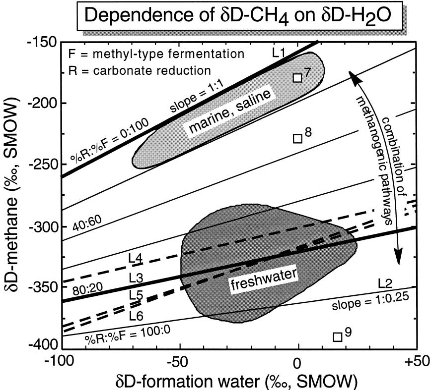  
Fig. 10. Dependence of hydrogen isotope ratio in methane $( \delta \mathrm { D } _ { \mathrm { C H _ { 4 } } } )$ as a function of the hydrogen isotope ratio of the coexisting formation water $( \mathrm { e . g . }$ , porewater, water column after Eqs. 12 and 13 . Methanogenesis by carbonate reduction follows a slope . Ž . Ž . $" m "$ of 1 with an isotope offset $" \beta "$ of ca. 160‰ L1, Ž $F { : } R = 0 { : } 1 0 0 )$ . The methyl-type fermentation pathway has a slope m of ca. 0.25 and an offset $\beta$ of 300‰ to 370‰ L2, Ž $F ; R = 1 0 0 { : } 0 )$ . L3 shows the typical $( \delta \mathrm { D } _ { \mathrm { H } _ { 2 } \mathrm { O } } - \delta \mathrm { D } _ { \mathrm { C H } _ { 4 } }$ Ž .  relationship observed by Whiticar et al. 1986 for freshwater $\left( F ; R = 8 0 { : } 2 0 \right)$ Ž . Ž . Ž . . The relationships of Sugimoto and Wada 1995 for methyl-type fermentation L4 and carbonate reduction L6 and of Waldron et al. 1998 for a mixture of the two pathways L5 are shown as dashed lines. Additional data of Balabane et al. 1987 , Burke et Ž . Ž . Ž . al. 1988a , and Grossman et al. 1989 are shown as points 7–9. Ž . Ž .

the culture study of Balabane et al. 1987 gave Ž . $\delta \mathrm { D } _ { \mathrm { H } , 0 } { - } \delta \mathrm { D } _ { \mathrm { C H } _ { \angle } }$ values similar to methyl-type fermentation Fig. 10, point 9 . Ž .

Sugimoto and Wada 1995 suggested that hydro- Ž . gen isotope exchange could explain the difference in m and $\beta$ values Eq. 12 for methyl fermentation Ž Ž .. between their results 0.437 and 302 and those inŽ . Ž . Ž . Whiticar et al., 1986 0.25, 321 . Support for hydrogen isotope exchange during acetate fermentation comes from the work of de Graaf et al. 1996 . Ž . Certainly some of the methanes strongly depleted in deuterium, i.e., those lighter than $\delta \mathrm { D } _ { \mathrm { C H } _ { 4 } }$ ca. y400‰, are difficult to explain by direct methyl hydrogen incorporation. For example, if one assumes $\delta \mathrm { D } _ { \mathrm { o r g } }$ value of y120‰ for the three methyl hydrogens donated, and a $\delta \mathrm { D } _ { \mathrm { C H } }$ of y400‰, this would 4

give by Eq. 13 a non-sensical Ž . $\delta \mathrm { D } _ { \mathrm { H } }$ value of $- 1 2 4 0 \text{‰}$ for the final hydrogen Fig. 11 . This Ž . indicates that either the hydrogen in the precursor methyl group is more depleted in deuterium than bulk organic matter or some isotopic exchange has occurred.

Waldron et al. 1988 suggested that the hydrogen Ž . isotope signature in bacterial methane is set by the enzymatic incorporation of hydrogen from water and not by the precursor hydrogen on the methyl group. They proposed that this enzymatic control is operative for both acetoclastic and carbonate reduction methanogenic pathways. They calculated the magnitude of this isotope fraction $( \alpha _ { \mathrm { H } _ { 2 } \mathrm { O } - \mathrm { C H } _ { 4 } } )$ to be 1.47. Waldron et al. 1988 found values for Ž . m and $\beta$ Ž Eq. Ž .. 12 of 0.623 and 319 for cultures of landfill material with both methanogenic pathways operative at unknown relative proportions L5 in Fig. 10 . Ž .

The processes controlling the distribution of hydrogen in methane during methanogenesis remain unclear. Certainly, numerous questions require detailed attention, including that of possible hydrogen isotope exchange, effects of hydrogen partial pressures, rates of methanogenesis, and the translation of results from culture experiments to natural environments.

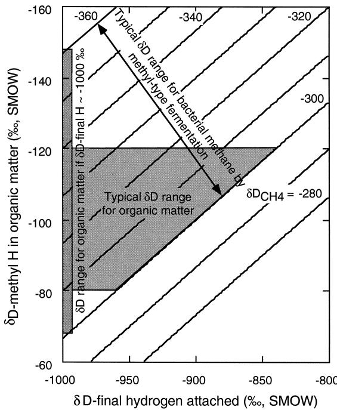  
Fig. 11. Comparison of hydrogen isotope ratio in organic matter $( \delta \mathrm { D _ { o r g } } )$ as a function of the hydrogen isotope ratio of the final hydrogen attached during methyl-type fermentation after Eqs. Ž Ž . Ž .. 12 and 13 . The lines are the mass balance for the various values of the resultant $\delta \mathrm { D } _ { \mathrm { C H _ { 4 } } }$ 4

## 6. Isotope effects associated with bacterial methane oxidation

Bacterial consumption is a major sink of $\mathrm { C H } _ { 4 }$ in the geosphere and in water columns. Without this hydrocarbon metabolism, the flux of CH into the atmosphere could be orders of magnitude greater, and its impact on the global atmospheric thermal and chemical budgets would be even more significant Ž . Whiticar, 1993 . Bacterial $\mathrm { C H } _ { 4 }$ consumption can be by either aerobic or anaerobic oxidation. The former is a common process in freshwater settings normally at the anoxicroxic interface, for example within soils or within the uppermost centimeters of sediments in swamps or lakes e.g., Rudd and Hamilton, Ž 1975; Bossard, 1981; Conrad, 1989; Steudler et al., 1989 . Anaerobic. $\mathrm { C H } _ { 4 }$ consumption was controversial for a long period amongst microbial ecologists, but the arguments presented for anaerobic oxidation from a geochemical perspective are convincing ŽIversen and Blackburn, 1981; Iversen and Jørgensen, 1985 . This methanotrophic process is particu- . larly active in marine and brackish sediments, normally at the base of the sulphate reduction zone. The strongest geochemical indications for anaerobic $\mathrm { C H } _ { 4 }$ oxidation are: 1 the dramatic decrease inŽ . $\mathrm { C H } _ { 4 }$ concentrations across the $\mathrm { C H } _ { 4 }$ production–sulphate reduction boundary Fig. 3 , 2 the preferential loss Ž . Ž . of $\mathrm { C H } _ { 4 }$ compared with higher molecular weight hydrocarbons in the same location, and 3 the sys- Ž . tematic shift in C and H isotope ratios of $\mathrm { C H } _ { 4 }$ consistent with the loss of $\mathrm { C H } _ { 4 }$ in the consumption zone e.g., Whiticar and Faber, 1986; Alperin et al., Ž 1988 ..

Over the past 20 years studies of $\mathrm { C H } _ { 4 }$ distributions in marine sediments identified the diagenetic zonation between sulphate reduction and $\mathrm { C H } _ { 4 }$ formation e.g., Claypool and Kaplan, 1974; Martens Ž and Berner, 1977; Whiticar, 1982 . In the simplest of . terms, the concave downward shape of the depth profile of dissolved sulphate concentration Figs. 3 Ž and 7a is the result of the balance between down- . ward diffusing sulphate, microbial uptake by SRB and vertical pore fluid advection. Analogously, the concave upward shape of the $\mathrm { C H } _ { 4 }$ concentration profile could not be maintained by diffusion and advection mechanisms alone see Reeburgh,Ž $1 9 7 6 ;$ Martens and Berner, 1977 . Bacterial anaerobic oxi-. dation at the base of the sulphate zone is responsible for active $\mathrm { C H } _ { 4 }$ removal. However, complete consumption of $\mathrm { C H } _ { 4 }$ does not occur and trace levels of $\mathrm { C H } _ { 4 }$ are found in both sulphate-bearing and oxic environments. Whiticar and Faber 1986 and otherŽ . investigators, including Martens and Berner 1977 ,Ž . Oremland et al. 1987 and Adams and van Eck Ž . Ž . 1988 , demonstrated that $\mathrm { C H } _ { 4 }$ can persist in the presence of trace amounts of sulphate, approximately 0.2 mM in the sulphate zone of marine, brackish and freshwater sediments. Possible explanations for this are: 1 restricted in situ methanogenesis, 2 in these Ž . Ž . environments there is a $\mathrm { C H } _ { 4 }$ concentration threshold below which $\mathrm { C H } _ { 4 }$ is not attractive to methanotrophs, or 3 that specific nutrients or co-metabolites are not Ž . present. Methane buildup in the sulphate zone may be related to consumption rates being lower than the influx of $\mathrm { C H } _ { 4 }$ . Vertical gas ebullition could rapidly introduce $\mathrm { C H } _ { 4 }$ into the sulphate zone, or in certain circumstances the buildup could be due to inhibition of $\mathrm { C H } _ { 4 }$ oxidation.

Bacterial consumption of $\mathrm { C H } _ { 4 }$ appears to proceed at a significantly greater rate than for higher molecular weight hydrocarbon gases such as ethane, propane or butanes. Thus, as $\mathrm { C H } _ { 4 }$ is continually removed, a molecular fractionation occurs which relatively enriches the residual hydrocarbon gas in the higher homologues. The proportion of $\mathrm { C H } _ { 4 }$ in a hydrocarbon gas mixture can be expressed on a volume percentage basis by the ‘‘Bernard parameter’’, $\mathrm { C } _ { 1 } / ( \mathrm { C } _ { 2 } + \mathrm { C } _ { 3 } )$ Ž  see Bernard et al., 1978; Whiticar, 1990 . In. $\mathrm { C H } _ { 4 }$ formation zones which are devoid of thermogenic hydrocarbons, $\mathrm { C } _ { 1 } / ( \mathrm { C } _ { 2 } + \mathrm { C } _ { 3 } )$ is typically $1 0 ^ { 3 }$ to $1 0 ^ { 5 } .$ . In the $\mathrm { C H } _ { 4 }$ consumption zone the $\mathrm { C } _ { 1 } / ( \mathrm { C } _ { 2 } + \mathrm { C } _ { 3 } )$ ratio can decrease to values of less than 10. Molecular ratios less than 50 are also typical for thermogenic hydrocarbon gases, as shown in Fig. 12 so that $\mathrm { C H } _ { 4 }$ oxidation can lead to difficulties in the interpretation of natural gas sources.

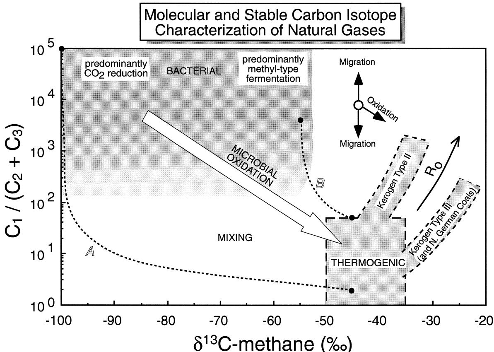  
Fig. 12. Natural gas interpretative ‘‘Bernard’’ diagram after Bernard et al., 1978 combining the molecular and isotope compositional Ž . Ž . information. Lines $\mathbb { A }$ and $\check { j } ;$ are calculated mixing lines for possible gas bacterial and thermogenic mixtures with end-member isotope $( \delta ^ { 1 3 } \mathrm { C _ { \mathrm { { C H _ { 4 } } } } } )$ and molecular $\{ \mathbf { C } _ { 1 } / ( \mathbf { C } _ { 2 } + \mathbf { C } _ { 3 } ) \}$ compositions $\mathrm { o f \ - 1 0 0 \% , 1 0 ^ { 5 } ; \ - 4 5 \% , 2 \ ( \mathbb { A } ) }$ and $- 5 5 \% _ { 0 } , 5 0 0 0 ; - 4 5 \% , 5 0 \left( \check { j } ; \right)$ , respectively. The relative compositional effects of migration or oxidation are also indicated.

Analogous to methanogenesis, the bacterial uptake of $\mathrm { C H } _ { 4 }$ is associated with a KIE that enriches the residual $\mathrm { C H } _ { 4 }$ in the heavier isotope. This fractionation is most pronounced for the $\mathrm { C H } _ { 4 }$ carbon isotopes, and in some cases, has been observed for the hydrogen isotopes in $\mathrm { C H } _ { 4 }$ . The magnitude of the carbon KIE during $\mathrm { C H } _ { 4 }$ consumption is much lower than that associated with substrate uptake by methanogens. Culture experiments and models have been used to substantiate this compare Tables 1 and Ž 3 ..

Several investigators have demonstrated with aerobic culture studies that $^ { 1 2 } \mathrm { C - C H } _ { 4 }$ is preferentially removed during its oxidative consumption. The magnitude of the carbon isotope fractionation $( \varepsilon _ { \mathrm { C } } )$ in culture experiments varies between 5 and 30 TableŽ 3 . The only determinations of the hydrogen isotope . fractionation factor for $\mathrm { C H } _ { 4 }$ oxidation $( \varepsilon _ { \mathrm { { H } } } )$ in an aerobic culture study lay between 95 and 285 Cole- Ž man et al., 1981 ..

Three models were developed by Whiticar and Faber 1986 to calculate the carbon isotope fraction- Ž . ation of $\mathrm { C H } _ { 4 }$ during its anaerobic consumption. These models are termed: 1 residual methane, 2Ž . Ž . $\mathrm { C } _ { 2 + }$ enrichment and 3 methane–carbon dioxide parti- Ž . tion models. A fourth, a concentration gradient model, was published by Alperin et al. 1988 . The Ž . latter were also able to model the hydrogen KIEs for $\mathrm { C H } _ { 4 }$ oxidation at the same location.

The first model residual methane uses the rela- Ž .   
tionship of $\delta ^ { 1 3 } \mathrm { C } _ { \mathrm { C H } }$ to the $\mathrm { C H } _ { 4 }$ concentration in 4   
interstitial fluids, as $\mathrm { C H } _ { 4 }$ is removed by bacterial   
oxidation the residual gas is continually enriched in

Magnitude of C and H isotope effects associated with methane consumption
<table><tr><td colspan="3">(A)Methanotrophy:natural observations</td></tr><tr><td>Model names</td><td> $\varepsilon _ { \mathrm { C - m e t h a n e } }$ </td><td>εD-methane</td></tr><tr><td>Whiticar and Faber,1986</td><td></td><td></td></tr><tr><td>Residual methane</td><td>4</td><td></td></tr><tr><td> $\mathrm { C } _ { 2 + }$  enrichment</td><td>18 to 14</td><td></td></tr><tr><td> $\mathrm { C H } _ { 4 } { \mathrm { - C O } } _ { 2 }$ </td><td>5 to 20</td><td></td></tr><tr><td>Alperin et al.,1988</td><td></td><td></td></tr><tr><td>Concentration</td><td>9</td><td>148</td></tr><tr><td>King et al.,1989</td><td>16 to 27</td><td></td></tr><tr><td>Tyler et al., 1994</td><td>22</td><td></td></tr><tr><td>Steudler and Whiticar,1998</td><td>up to 5</td><td></td></tr></table>

Ž . B Methanotrophy: laboratory experiments
<table><tr><td>Aerobic cultures</td><td> $\varepsilon _ { \mathrm { { C } } }$  methane</td><td> $\varepsilon _ { \mathrm { D } } .$  -methane</td></tr><tr><td>Silverman and Oyama, 1968</td><td>11</td><td></td></tr><tr><td>Lebedew et al.,1969</td><td>16</td><td></td></tr><tr><td>Zyakun et al.,1979</td><td>30</td><td></td></tr><tr><td>Barker and Fritz,1981</td><td>5 to 31</td><td></td></tr><tr><td>Coleman et al., 1981</td><td>13 to 25</td><td>95 to 285</td></tr><tr><td>Zyakun et al.,1984</td><td>7 to 27</td><td></td></tr></table>

the heavier carbon isotope fraction Fig. 13 . The Ž . fractionated $\mathrm { C H } _ { 4 }$ uptake is described by a closedsystem Rayleigh function similar to Eq. 5 : Ž .

$$
\delta ^ { 1 3 } \mathbf { C } _ { \mathrm { C H } _ { 4 , \mathrm { t } } } = \delta ^ { 1 3 } \mathbf { C } _ { \mathrm { C H } _ { 4 , \mathrm { i } } } + \varepsilon \ln ( 1 - F ) ,\tag{Ž .  14}
$$

where $\delta ^ { 1 3 } \mathrm { C } _ { \mathrm { C H } _ { 4 . } }$ is the carbon isotope ratio for the , i initial methane pool prior to oxidation e.g., in the Ž main $\mathrm { C H } _ { 4 }$ .  formation zone , $\delta ^ { 1 3 } \mathrm { C } _ { \mathrm { C H } _ { 4 , \mathrm { t } } }$ is that at time t. To account for variations of the initial $\mathrm { C H } _ { 4 }$ concentrations between different environments, the initial $\mathrm { C H } _ { 4 }$ concentration pool is normalized to 100%. The shift in $\delta ^ { 1 3 } \mathrm { C } _ { \mathrm { C H } }$ to more positive values as a function of $\mathrm { C H } _ { 4 }$ consumption is shown in Fig. 14. The best fit to the data was obtained with a carbon fractionation factor $( \varepsilon _ { \mathrm { { C } } } )$ of about 4. Larger values of $\varepsilon _ { \mathrm { { C } } }$ around 20, chosen to model the data, do not describe the system satisfactorily.

The second model $( \mathbf { C } _ { 2 + }$ enrichment uses the  . simultaneous change in both the molecular $( \mathbf { B } =$ $\mathrm { C } _ { 1 } / ( \mathrm { C } _ { 2 } + \mathrm { C } _ { 3 } )$ and isotope composition $( \delta C =$ $\delta ^ { 1 3 } \mathrm { C _ { C H _ { 4 } } } )$ of the bacterial gas during $\mathrm { C H } _ { 4 }$ consumption to calculate the isotope fractionation $( \varepsilon _ { \mathrm { { C } } } )$ according to

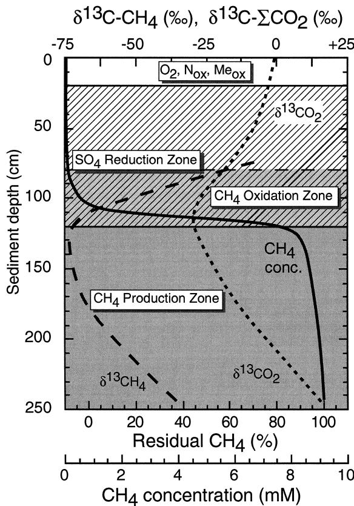  
Fig. 13. Residual methane model showing the shift in $\delta ^ { 1 3 } \mathrm { C } _ { \mathrm { C H _ { \it d } } }$ to more positive values with decreasing methane concentration due to methane oxidation at the base of the sulphate-reducing zone Žlabeled $\mathrm { C H } _ { 4 }$ .  Oxidation Zone . The residual methane is the percentage of methane remaining compared with the methane concentration in the main zone of methanogenesis 100% .Ž .

$$
\varepsilon _ { \mathrm { C } } = { \frac { \ln \mathrm { B } _ { t } - \ln \mathrm { B } _ { i } } { ( \ln \mathrm { B } _ { t } - \ln \mathrm { B } _ { i } ) / 1 0 ^ { 3 } + \left( { \delta \mathrm { C } _ { t } - \delta \mathrm { C } _ { i } } \right) } } + 1 0 ^ { 3 }\tag{Ž . 15}
$$

where the subscripts i and t are for the initial and temporal conditions, respectively see Whiticar and Ž Faber 1986 for derivation of Eq. 10 . The compo- Ž . Ž .. sitional shifts for a variety of marine, marsh and brackish sediments are shown in Fig. 15 a modified Ž version of Fig. 12 . The carbon isotope fractionation . factors vary from $\varepsilon _ { \mathrm { { C } } } = 7$ to 14, as indicated in the figure. Other data from the Antarctic Whiticar and Ž Suess, 1990 gave lower . $\varepsilon _ { \mathrm { { C } } }$ values between 1.8 and 5. The explanation for the lower bacterial selectivity for these samples is not clear, but it may be related to the cold sediment temperatures $( - 1 . 4 ^ { \circ } \mathrm { C } )$

As described in Section 5, the carbon isotope separation between $\mathrm { C H } _ { 4 }$ and CO Eq. 7 is fairly Ž Ž .. constant and indicative of the formation pathway Ž . methane–carbon dioxide partition model . In contrast, $\mathrm { C H } _ { 4 }$ oxidation causes a clear, strong decrease in the carbon isotope separation $( \delta ^ { 1 3 } \mathbf { C _ { \mathrm { { C O } _ { \mathrm { { 2 } } } } } } ^ { - } \delta ^ { 1 3 } \mathbf { C _ { \mathrm { { C H } _ { \mathrm { { 4 } } } } } } )$ as indicated in Fig. 8. Initially, the greater amounts of $\mathrm { C O } _ { 2 }$ than $\mathrm { C H } _ { 4 }$ typically present obscure the oxidation trend. However, towards the latter stages of consumption, the carbon isotope separation is observed to have $\varepsilon _ { \mathrm { { C } } }$ values between 5 and 25. From the $\delta ^ { 1 3 } \mathrm { C } _ { \mathrm { C O } _ { 2 } } , \ \delta ^ { 1 3 } \mathrm { C } _  \mathrm { C H } _  \it$ coexisting pairs it is not only possible to distinguish between the methanogenic pathways but also to evaluate $\mathrm { C H } _ { 4 }$ consumption Ž . Fig. 8 .

Alperin et al. 1988 determined the isotope shiftsŽ . in $\mathrm { C H } _ { 4 }$ from anaerobic Skan Bay sediments as a function of the $\mathrm { C H } _ { 4 }$ concentration gradient con- Ž centration gradient model . By subtracting the possi- . ble effects of isotope fractionation associated with diffusion, they were able to apply diagenetic equations to estimate the magnitude of both the C and H isotope effects for anaerobic $\mathrm { C H } _ { 4 }$ oxidation. The carbon isotope fractionation factor $\varepsilon _ { \mathrm { { C } } }$ was found to be 8. The hydrogen isotope fractionation factor $( \varepsilon _ { \mathrm { D } } )$ for the same samples was 146, which is consistent with the values reported for aerobic cultures by Coleman et al. 1981 .Ž .

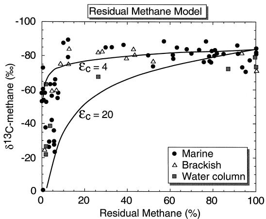  
Fig. 14. Relationship of $\delta ^ { 1 3 } \mathrm { C } _ { \mathrm { C H } _ { 4 } }$ to the percent % residualŽ . methane from bacterial methane consumption Eq. 14 . Due to Ž Ž .. the low isotope fractionation factor $\left( \varepsilon _ { \mathrm { C } } = 4 \right)$ a significant shift in the methane carbon isotope ratio is first seen when most ca. 80%Ž . of the methane has been oxidized.

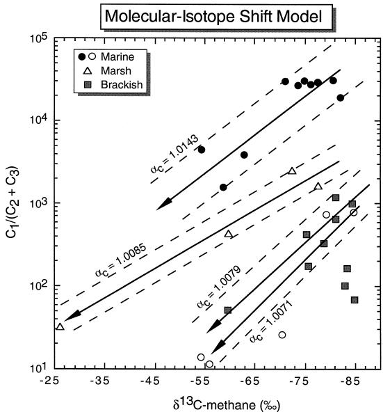  
Fig. 15. Modified ‘Bernard’ diagram after Bernard et al., 1978Ž . showing the combined shifts in molecular $\{ { \bf C } _ { 1 } / ( { \bf C } _ { 2 } + { \bf C } _ { 3 } ) \}$ and methane carbon isotope $( \delta ^ { 1 3 } \mathbf { C _ { \mathrm { { C H _ { 4 } } } } } )$ ratios resulting from fractionated bacterial consumption of methane in marine and brackish sediments. Carbon fractionation factors $\left( \varepsilon _ { \mathrm { C } } \right)$ Ž . based on Eq. 15 lie between 7 and 14.

The possibility of aerobic methane consumption in soils was recognized by Keller et al. 1983 andŽ . Seiler et al. 1984 , but only more recently it has Ž . been accepted as an important sink of atmospheric methane e.g., Steudler et al., 1989; Ojima et al., Ž 1993 . Steudler et al. 1989 , Mosier et al. 1991 . Ž . Ž . and others have indicated that there is a close relationship between methanotrophs and ammoniaoxidizing bacteria in soils. The carbon KIEs associated with the soil uptake of methane have been reported by King et al. 1989 , Tyler et al. 1994Ž . Ž . and Steudler and Whiticar 1998 Table 3 . TheŽ . Ž . former two, using chambers and incubations, respectively, found $\pmb { \varepsilon } _ { \mathrm { C - C O } _ { 2 } , \mathrm { C H } _ { 4 } }$ values around 16 to 27. The latter, using in situ gas microsampling of soil gases at Harvard Forest found carbon isotope effects for the consumption to be significantly lower than 5‰.

The range of C and H isotope effects from experimental and field observations are summarized in Table 3. Overall, it can be commented that carbon isotope fractionation during $\mathrm { C H } _ { 4 }$ oxidation in anaerobic sediments is less than in aerobic culture studies. In addition, methanotrophs appear to be less selective between the lighter and heavier carbon isotopes than the methanogens.

## 7. Conclusions

In combination, the C and H isotope signatures of $\mathrm { C H } _ { 4 }$ are frequently adequate to reliably characterize bacterial or thermogenic natural gas types. Situations, such as mixing of different natural gases or where extreme substrate depletion and consumption occur, could produce ambiguous methane isotope signals. In these cases, the C- and H-isotopes of methane, in concert with the coexisting isotope information on $\mathrm { C O } _ { 2 }$ and $\mathrm { H } _ { 2 } \mathrm { O }$ , are excellent tracers of the processes of bacterial $\mathrm { C H } _ { 4 }$ formation and consumption. The magnitudes of the KIEs are consistent and sufficiently large to generate significant isotope fractionations that are diagnostic for the various processes. A clear understanding of these effects is necessary to relate the isotope signal of a natural gas to its source.

In view of the increasing atmospheric $\mathrm { C H } _ { 4 }$ concentration ca. 0.5%–1% annually in the lower tro- Ž posphere and, as a radiatively active atmospheric . trace gas having direct effect on global climate change, it is important to attach precise isotope signatures to the various $\mathrm { C H } _ { 4 }$ sources. Stable isotopes are an elegant method to differentiate the various fluxes and numerically constrain the magnitudes of both $\mathrm { C H } _ { 4 }$ emissions to and removal from the lower troposphere. In this way our comprehension of geochemical and microbiological processes involved in natural gas habitats and compositions within the geosphere are the key to understanding atmospheric $\mathrm { C H } _ { 4 }$ change.

## Acknowledgements

Collaboration with microbiologists, including R. Oremland, USGS; V. Muller and M. Blaut, Univ. ¨ Gottingen; N. Iversen, Univ. Aalborg; K. Stetter, ¨ Univ. Regensburg and R. Conrad, Max Planck Inst., Marburg have led to much of the understanding expressed in this paper. This work has been funded, in part, through BMFT grants in Germany and by NSERC grant 105389 in Canada.

## References

Adams, D.D., van Eck, G.T.M., 1988. Biogeochemical cycling of organic carbon in the sediments of the Grote Rug reservoir. Arch. Hydrobiol. Beih. Ergeb. Limnol. 31, 319–330.

Alperin, M.J., Reeburgh, W.S., Whiticar, M.J., 1988. Carbon and hydrogen isotope fractionation resulting from anaerobic methane oxidation. Global Biogeochem. Cycles 2, 279–288.

Andreae, M.O., Schimel, D.S. Eds. , 1989. Exchange of Trace Ž . Gases Between Terrestrial Ecosystems and the Atmosphere. Dahlem Workshop Reports. Wiley, Chichester, UK.

Balabane, M., Galimov, E., Hermann, M., Letolle, R., 1987. ´ Hydrogen and carbon isotope fractionation during experimental production of bacterial methane. Org. Geochem. 11, 115– 119.

Barker, J.F., Fritz, P., 1981. Carbon isotope fractionation during microbial methane oxidation. Nature 293, 289–291.

Belyaev, S.S., Finkelstein, Z.I., Ivanov, M.V., 1975. Intensity of bacterial methane formation in ooze deposits of certain lakes. Microbiology 44, 272–275.

Bernard, B.B., Brooks, J.M., Sackett, W.M., 1978. Light hydrocarbons in recent Texas continental shelf and slope sediments. J. Geophys. Res. 83, 4053–4061.

Blair, N.E., Carter, W.D.J., 1992. The carbon isotope geochemistry of acetate from a methanogenic marine sediment. Geochim. Cosmochim. Acta 56, 1247–1258.

Bossard, P., 1981. Der Sauerstoff- und Methanhaushalt im Lungernsee. PhD Thesis. ETH Zurich, Switzerland.¨

Botz, R., Pokojski, H.D., Schmitt, M., Thomm, M., 1996. Carbon isotope fractionation during bacterial methanogenesis by CO2 reduction. Org. Geochem. 25, 255–262.

Bryant, M.P., 1979. Microbial methane production: theoretical aspects. J. Anim. Sci. 48, 193–201.

Burke Jr., R.A., 1992. Factors responsible for variations in stable isotope ratios of microbial methane from shallow aquatic sediments. In: Vially, R. Ed. , Bacterial Gas. Editons Tech-Ž . nip, Paris, pp. 47–62.

Burke, R.A. Jr., 1993. Possible influence of hydrogen concentration on microbial methane stable hydrogen isotopic composition. Chemosphere 26, 55–67.

Burke, R.A., Barber, T.R., Sackett, W.M., 1988a. Methane flux and stable hydrogen and carbon isotope composition of sedimentary methane form the Florida Everglades. Global Biogeochem. Cycles 2, 329–340.

Burke, R.A., Martens, C.S., Sackett, W.M., 1988b. Seasonal variations of DrH and ${ } ^ { 1 3 } \mathrm { C } / { } ^ { 1 2 } \mathrm { C }$ ratios of microbial methane in surface sediments. Nature 332, 829–831.

Cappenberg, Th.E., Jongejan, E., 1978. Microenvironments for sulfate reduction and methane production in freshwater sediments. In: Krumbein, W.E. Ed. , Environmental Biogeochem- Ž . istry and Geomicrobiology. Ann Arbor Sci. Publ., Ann Arbor, MI, pp. 129–138.

Cicerone, R.J., Oremland, R.S., 1988. Biogeochemical aspects of atmospheric methane. Global Biogeochem. Cycles 2, 299–327.

Claypool, G.E., 1974. Anoxic diagenesis and bacterial methane production in deep sea sediments. PhD Thesis. UCLA, USA.

Claypool, G.E., Kaplan, I.R., 1974. The origin and distribution of

methane in marine sediments. In: Kaplan, I.R. Ed. , Natural Ž . Gases in Marine Sediments. Plenum, New York, pp. 99–139.

Coleman, D.D., Risatti, J.B., Schoell, M., 1981. Fractionation of carbon and hydrogen isotopes by methane-oxidizing bacteria. Geochim. Cosmochim. Acta 45, 1033–1037.

Conrad, R., 1989. Control of methane production in terrestrial ecosystems. In: Andreae, M.O., Schimel, D.S. Eds. , Ex- Ž . change of Trace Gases Between Terrestrial Ecosystems and the Atmosphere. Dahlem Workshop Reports. Wiley, Chichester, UK, pp. 39–58.

Conrad, R., Schutz, H., 1988. Methods of studying methanogenic ¨ bacteria and methanogenic activities in aquatic environments. In: Austin, B. Ed. , Methods in Aquatic Bacteriology. Wiley, Ž . Chichester, UK, pp. 301–343.

Conrad, R., Bonjour, R., Aragno, M., 1985. Aerobic and anaerobic microbial consumption of hydrogen in geothermal spring water. FEMS Microbiol. Lett. 29, 201–206.

Daniels, L., Fulton, G., Spencer, R.W., Orme-Johnson, W.H., 1980. Origin of hydrogen in methane produced by Methanobacterium thermoautotrophicum. J. Bacteriol. 141, 694–698.

Daniels, L., Sparling, R., Sprott, G.D., 1984. The bioenergetics of methanogens. Biochim. Biophys. Acta 768, 113–163.

de Graaf, W., Wellsbury, P., Parkes, R.J., Cappenberg, T.E., 1996. Comparison of acetate turnover in methanogenic and sulphate-reducing sediments by radiolabelling and stable isotope labelling and by use of specific inhibitors: evidence for isotopic exchange. Appl. Environ. Microbiol. 62, 772–777.

Dlugokencky, E.J., Steele, L.P., Lang, P.M., Masarie, K.A., 1995. Atmospheric methane at Mauna Loa and Barrow observatories: presentation and analysis of in situ measurements. J. Geophys. Res. 100, 23103–23123.

Fuchs, G.D., Thauer, R., Ziegler, H., Stichler, W., 1979. Carbon isotope fractionation by Methanobacterium thermoautotrophicum. Arch. Microbiol. 120, 135–139.

Garcia, J.L., 1990. Taxonomy and ecology of methanogens. FEMS Microbiol. Rev. 87, 297–308.

Grossman, P.J., Cohen, A.D., Stone, P., Smith, W.G., Brooks, H.K., Goodrick, R., Spackman, W., 1989. The environmental significance of Holocene sediments from the Everglades and saline tidal plain. In: Gleason, P.J. Ed. , Environments ofŽ . South Florida: Past and Present II. Miami Geological Society, Miami, pp. 297–351.

Hornibrook, E.R.C., Longstaffe, F.J., Fyfe, W.S., 1997. Spatial distribution of microbial methane production pathways in temperate zone wetland soils: stable carbon and hydrogen isotope evidence. Geochim. Cosmochim. Acta 61, 745–753.

Hornibrook, E.R.C., Longstaffe, F.J., Fyfe, W.S., 1998. Reply to comment by S. Waldron, A.E. Fallick and A.J. Hall on ‘‘Spatial distribution of microbial methane production pathways in temperate zone wetland soils: stable carbon and hydrogen isotope evidence’’. Geochim. Cosmochim. Acta 62, 373–375.

Iversen, N., 1996. Methane oxidation in coastal marine environments. In: Murrell, J.C., Kelly, D.P. Eds. , Microbiology of Ž . Atmospheric Trace Gases. NATO ASI Series 139, 51–68.

Iversen, N., Blackburn, T.H., 1981. Seasonal rates of methane

oxidation in anoxic marine sediments. Appl. Environ. Microbiol. 41, 1295–1300.

Iversen, N., Jørgensen, B.B., 1985. Anaerobic methane oxidation rates at the sulfate–methane transition in marine sediments from Kattegat and Skagerrak Denmark . Limnol. Oceanogr. Ž . 30, 944–955.

Jedrysek, M.O., 1995. Carbon isotope evidence for diurnal variations in methanogenesis in freshwater lake sediments. Geochim. Cosmochim. Acta 59, 557–561.

Keller, M., Goreau, T.J., Wofsy, S.C., Kaplan, W.A., McElroy, M.B., 1983. Production of nitrous oxide and consumption of methane by forest soils. Geophys. Res. Lett. 10, 1156–1159.

Kelley, C.A., Dise, N.B., Martens, C.S., 1992. Temporal variations in the stable carbon isotopic composition of methane emitted from Minnesota peatlands. Global Biogeochem. Cycles 6, 263–269.

Khalil, M.A.K., Shearer, M.J. Eds. , 1993. Atmospheric Methane: Ž . Sources, Sinks and Role in Global Change. Chemosphere 26 Ž . 1–4 814 pp.

Kiene, R.P., Oremland, R.S., Catena, A., Miller, L.G., Capone, D., 1986. Metabolism of reduced methylated sulfur compounds in anaerobic sediments and by a pure culture of an estuarine methanogen. Appl. Environ. Microbiol. 52, 1037– 1045.

King, S.L., Quay, P.D., Lansdown, J.M., 1989. The ${ } ^ { 1 3 } \mathrm { C } / { } ^ { 1 2 } \mathrm { C }$ kinetic isotope effect for soil oxidation of methane at ambient atmospheric concentrations. J. Geophys. Res. 94, 18273– 18277.

Konig, H., 1992. Microbiology of methanogens. In: Vially, R. ¨ Ž . Ed. , Bacterial Gas. Editons Technip, Paris, pp. 3–12.

Koyama, T., 1964. Gaseous metabolism in lake sediments and paddy soils. In: Columbo, U., Hobson, G.D. Eds. , Advances Ž . in Organic Geochemistry. Macmillan, New York, pp. 363–375.

Krzycki, J.A., Kenealy, W.R., DeNiro, M.J., Zeikus, J.G., 1987. Stable carbon isotope fractionation by Methanosarcina barkeri during methanogenesis from acetate, methanol or carbon dioxide–hydrogen. Appl. Environ. Microbiol. 53, 2597–2599.

Kuhl, M., Barker Jørgensen, B., 1992. Microsensor measurements of sulfate reduction and sulfide oxidation in compact microbial communities of aerobic biofilms. Appl. Environ. Microbiol. 58, 1164–1175.

Lebedew, W.C., Owsjannikow, W.M., Mogilewskij, G.A., Bogdanow, W.M., 1969. Fraktionierung der Kohlenstoffisotope durch mikrobiologische Prozesse in der biochemischen Zone. Angew. Geol. 12, 621–624.

Martens, C.S., Berner, R.A., 1977. Interstitial water chemistry of anoxic Long Island Sound sediments: I. Dissolved gases. Limnol. Oceanogr. 22, 10–25.

Martens, C.S., Blair, N.E., Green, C.D., Des Marais, D.J., 1986. Seasonal variations in the stable carbon isotope signature of biogenic methane in a coastal sediment. Science 233, 1300– 1303.

Marty, D.G., 1992. Ecology and metabolism of methanogens. In: Vially, R. Ed. , Bacterial Gas. Editons Technip, Paris, pp. Ž . 13–24.

Meinschein, W.G., Rinaldi, G.G., Hayes, J.M., Schoeller, D.A.,

1974. Intramolecular isotopic order in biologically produced acetic acid. Biomed. Mass Spectrom. 1, 172.

Mosier, A.R., Schimel, D., Valentine, D., Bronson, K., Parton, W.J., 1991. Methane and nitrous oxide fluxes in native, fertilized and cultivated grasslands. Nature 350, 330–332.

Nakai, M., Yoshida, Y., Ando, N., 1974. Isotopic studies on oil and natural gas fields in Japan. Chikyakaya Geochemistry Ž . 7r8, 87–98.

Neue, H.-U., Roger, P.A., 1993. Rice agriculture: factor controlling emissions. Chemosphere 26, 254–298.

Ojima, D.S., Valentine, D.W., Mosier, A.R., Parton, W.J., Schimel, D.S., 1993. Effect of land use change on methane oxidation in temperate forest and grassland soils. Chemosphere 26, 675–685.

Oremland, R.S., Capone, D.G., 1988. Use of ‘‘specific’’ inhibitors in biochemistry and microbial ecology. Adv. Microbiol. Ecol. 10, 285–383.

Oremland, R.S., Miller, L.G., Whiticar, M.J., 1987. Sources and flux of natural gases from Mono Lake, California. Geochim. Cosmochim. Acta 51, 2915–2929.

Oremland, R.S., Whiticar, M.J., Strohmaier, F.E., Kiene, R.P., 1988a. Bacterial ethane formation from reduced, ethylated sulfur compounds in anoxic sediments. Geochim. Cosmochim. Acta 52, 1895–1904.

Oremland, R.S., Kiene, R.P., Mathrani, I., Whiticar, M.J., Boone, D.R., 1988b. Description of an estuarine methylotrophic methanogen which grows on dimethylsulfide. Appl. Environ. Microbiol. 55, 994–1002.

Pine, M.J., Barker, H.A., 1956. Studies on methane fermentation: XII. The pathway of hydrogen in the acetate fermentation. J. Bacteriol. 71, 644–648.

Pine, M.J., Vishniac, W., 1957. The methane fermentation of acetate and methanol. J. Bacteriol. 73, 736–742.

Rayleigh, J.W.S., 1896. Theoretical considerations respecting the separation of gases by diffusion and similar processes. Philos. Mag. 42, 493–499.

Reeburgh, W.S., 1976. Methane consumption in Cariaco Trench waters and sediments. Earth Planet. Sci. Lett. 28, 337–344.

Rice, D.D., 1992. Controls, habitat, and resource potential of ancient bacterial gas. In: Vially, R. Ed. , Bacterial Gas. Ž . Editons Technip, Paris, pp. 91–120.

Rice, D.D., Claypool, G.E., 1981. Generation accumulation and resource potential of biogenic gas. Am. Assoc. Petrol. Geol. Bull. 65, 5–25.

Rosenfeld, W.D., Silvermann, S.R., 1959. Carbon isotope fractionation in bacterial production of methane. Science 130, 1658–1659.

Rossmann, A., Butzenlechner, M., Schmidt, H.L., 1991. Evidence for a non-statistical carbon isotope distribution in natural glucose. Plant Physiol. 96, 609–614.

Rudd, J.W.M., Hamilton, R.D., 1975. Factors controlling rates of methane oxidation and the distribution of the methane oxidizers in a small stratified lake. Arch. Hydrobiol. 75, 522–538.

Sansone, J., Martens, C.S., 1981. Methane production from acetate and associated methane fluxes from anoxic coastal sediments. Science 211, 707–709.

Schoell, M., 1980. The hydrogen and carbon isotopic composition of methane from natural gases of various origins. Geochim. Cosmochim. Acta 44, 649–661.

Schoell, M. Ed. , 1988. Origins of Methane in the Earth. Chem. Ž . Geol. 71, 265 pp.

Schonheit, P., Keweloh, H., Thauer, R.K., 1981. Factor¨ $\mathrm { F } _ { 4 2 0 }$ degradation in Methanobacterium thermoautotrophicum during exposure to oxygen. FEMS Microbiol. Lett. 12, 347–349.

Schutz, H., Conrad, R., 1996. Influence of temperature on path- ¨ ways to methane production in the permanently cold profundal sediment of Lake Constance. FEMS Microbiol. Ecol. 20, 1–14.

Schutz, H., Matsuyama, H., Conrad, R., 1997. Temperature de- ¨ pendence of methane production from different precursors in a profundal sediment Lake Constance . FEMS Microbiol. Ecol. Ž . 22, 207–213.

Seiler, W., Conrad, R., Scharffe, D., 1984. Field studies of methane emission from termite nests into the atmosphere and measurements of methane uptake by tropical soils. J. Atmos. Chem. 1, 171–186.

Silverman, M.P., Oyama, V.I., 1968. Automatic apparatus for sampling and preparing gases for mass spectral studies of carbon isotope fractionation during methane metabolism. Anal. Chem. 40, 1833–1877.

Steudler, P.A., Whiticar, M.J., 1998. Methane concentration and stable carbon isotope shifts due to bacterial consumption in forest soils. Geochim. Cosmochim. Acta, submitted for publication.

Steudler, P.A., Bowden, R.D., Melillo, J.M., Aber, J.D., 1989. Influence of nitrogen fertilization on methane uptake in temperate forest soils. Nature 341, 314–316.

Sugimoto, A., Wada, E., 1993. Carbon isotopic composition of bacterial methane in a soil incubation experiment: contributions of acetate and $\mathrm { C O } _ { 2 } / \mathrm { H } _ { 2 }$ . Geochim. Cosmochim. Acta 57, 4015–4027.

Sugimoto, A., Wada, E., 1995. Hydrogen isotopic composition of bacterial methane: $\mathrm { C O } _ { 2 } / \mathrm { H } _ { 2 }$ reduction and acetate fermentation. Geochim. Cosmochim. Acta 59, 1329–1337.

Takai, Y., 1970. The mechanism of methane fermentation in flooded paddy soil. Soil Sci. Plant Nutr. 16, 238–244.

Tyler, S.C., Crill, P.M., Brailsford, G.W., 1994. ${ } ^ { 1 3 } \mathrm { C } / { } ^ { 1 2 } \mathrm { C }$ fractionation of methane during oxidation in a temperate forested soil. Geochim. Cosmochim. Acta 58, 1625–1633.

Waldron, S., Watson-Craik, I.A., Hall, A.J., Fallick, A.E., 1988. The carbon and hydrogen stable isotope composition of bacteriogenic methane: a laboratory study using a landfill inoculum. Geomicrobiology 15, 157–169.

Waldron, S., Fallick, A.E., Hall, A.J., 1998. Comment on ‘‘Spatial distribution of microbial methane production pathways in temperate zone wetland soils: stable carbon and hydrogen isotope evidence’’ by E.R.C Hornibrook, F.J. Longstaffe and W.S. Fyfe. Geochim. Cosmochim. Acta 62, 369–372.

Whiticar, M.J., 1982. The presence of methane bubbles in the acoustically turbid sediments of Eckernforder Bay, Baltic Sea. ¨

In: Fanning, K.A., Manheim, F.T. Eds. , Dynamic Environ- Ž . ment of the Ocean Floor. Lexington Books, MA, pp. 219–235.

Whiticar, M.J., 1990. A geochemical perspective of natural gas and atmospheric methane. Org. Geochem. 16, 531–547.

Whiticar, M.J., 1993. Stable isotopes and global budgets. In: Khalil, M.A.K. Ed. , Atmospheric Methane: Sources, Sinks Ž . and Role in Global Change. NATO ASI Series I. Global Environ. Change 13, 138–167.

Whiticar, M.J., 1994. Correlation of natural gases with their sources. In: Magoon, L., Dow, W. Eds. , The Petroleum Ž . System — From Source to Trap. AAPG Memoir 60, pp. 261–284.

Whiticar, M.J., Faber, E., 1986. Methane oxidation in sediment and water column environments — isotope evidence. Org. Geochem. 10, 759–768.

Whiticar, M.J., Suess, E., 1990. Hydrothermal hydrocarbon gases in the sediments of the King George Basin, Bransfield Strait, Antarctica. Appl. Geochem. 5, 135–147.

Whiticar, M.J., Faber, E., Schoell, M., 1986. Biogenic methane formation in marine and freshwater environments: CO reduction vs. acetate fermentation — isotope evidence. Geochim. Cosmochim. Acta 50, 693–709.

Whiticar, M.J., Muller, V., Blaut, M., 1998. Isotope tracking of ¨ methanol disproportionation during methanogenesis. Appl. Environ. Microbiol., submitted for publication.

Whiticar, M.J., Eby, P., Cederberg, T., 1998. Stable carbon isotope measurements on picomole levels of atmospheric methane. Anal Chem., submitted for publication.

Winfrey, M.R., Nelson, D.R., Klevickis, S.C., Zeikus, J.G., 1977. Association of hydrogen metabolism with methanogenesis in Lake Mendota sediments. Appl. Environ. Microbiol. 33, 312– 318.

Woltemate, I., Whiticar, M.J., Schoell, M., 1984. Carbon and hydrogen isotopic composition of bacterial methane in a shallow freshwater lake. Limnol. Oceanogr. 29, 985–992.

Yankwich, P.E., Promislov, A.L., 1953. Carbon isotope constitution of some acetic acids. J. Am. Chem. Soc. 75, 4881.

Zyakun, A.M., 1992. Isotopes and their possible use as biomarkers of microbial products. In: Vially, R. Ed. , Bacterial Gas. Ž . Editons Technip, Paris, pp. 27–46.

Zyakun, A.M., Bondar, V.A., Namsarayev, B.B., 1979. Fraktsionirovaniye stabil’nooykh izotopov ugleroda metana pri yego ¨¨ mikrobiologicheskom okisleni Fractionation of stable carbon Ž isotopes in methane during microbiological oxidation .. Geochem. Int. 16, 164–169.

Zyakun, A.M., Bondar, V.A., Namsarayev, B.B., Nesterov, A.I., 1984. Use of carbon-isotope analysis in determining the rates of microbiological oxidation of methane in natural ecosystems. Geochem. Int. 22, 67–72.

Zehnder, A.J.B. Ed. , 1988. Biology of Anaerobic Microorgan- Ž . isms. Wiley, New York.

Zehnder, A.J.B., Ingvorsen, K., Marty, T., 1982. Microbiology of Methane Bacteria, Anaerobic Digestion 1981. Elsevier, Amsterdam, pp. 45–68.