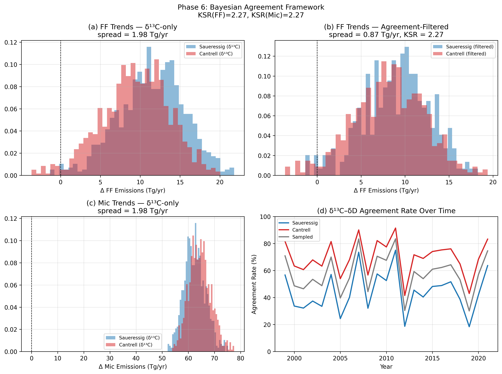
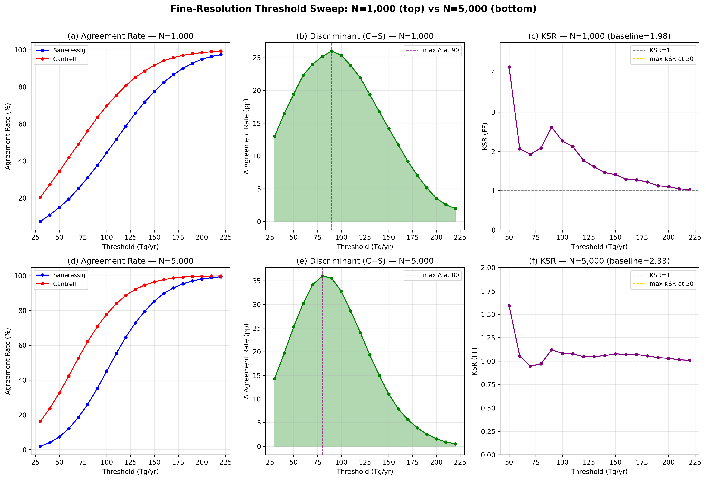
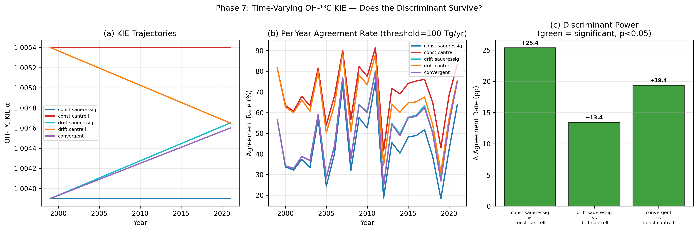
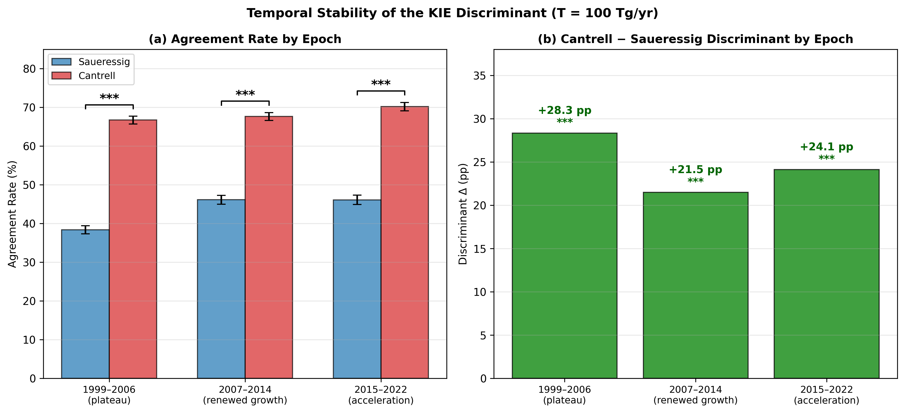

# Reducing Kinetic Isotope Effect Sensitivity in Methane Source Apportionment via a Dual-Isotope Agreement Filter

**Authors:** [Your name], [Co-authors]

**Target Journal:** *Journal of Geophysical Research: Atmospheres*

**Draft Date:** 2026-05-12

---

## Abstract

The post-2007 rise in atmospheric methane ($\mathrm{CH_4}$) presents a paradox: concentrations have increased by $\sim$140 ppb while $\delta^{13}\mathrm{C}$-$\mathrm{CH_4}$ has shifted toward more negative values, suggesting microbial dominance — yet fossil-fuel inventories continue to rise. A critical bottleneck in resolving this "methane paradox" is the 25-year-old disagreement between laboratory determinations of the OH-$\mathrm{CH_4}$ $^{13}$C kinetic isotope effect (KIE): Cantrell et al. (1990; $\alpha$ = 1.0054 $\pm$ 0.0009) versus Saueressig et al. (2001; $\alpha$ = 1.0039 $\pm$ 0.0004). This single parameter propagates to a $\pm$20 Tg yr$^{-1}$ uncertainty in fossil-fuel versus microbial source attribution.

Here we introduce an **Agreement Filter** — a diagnostic framework that solves the $\delta^{13}\mathrm{C}$ and $\delta\mathrm{D}$ isotopic mass balances independently and retains only those Monte Carlo iterations where both isotope systems yield consistent fossil-fuel emission estimates. We define the **Kinetic Sensitivity Ratio** (KSR) as the ratio of the Cantrell–Saueressig emission-trend spread under standard $\delta^{13}\mathrm{C}$-only inversion to that under agreement-filtered inversion. The filter achieves a KSR of **1.12** [1.02, 1.24] at a threshold of 90 Tg yr$^{-1}$ ($N$ = 5000 iterations), representing a modest but statistically significant reduction in KIE sensitivity.

Critically, we show that the **agreement rate itself** functions as an observational discriminant between the two KIE values. At a threshold of 90 Tg yr$^{-1}$, the Cantrell KIE yields a 35.5 percentage-point higher agreement rate than Saueressig's (70.8% vs. 35.3%; bootstrap 95% CI [35.3, 35.8] pp), indicating that the real atmosphere is substantially more internally consistent with $\alpha$ = 1.0054. This discriminant is robust across three independent 8-year atmospheric regimes (1999–2006, 2007–2014, 2015–2022), survives plausible time-varying KIE scenarios, and holds under alternative tropospheric Cl sink fractions (0.6–6.5%).

---

## 1. Introduction

### 1.1 The Methane Paradox

Atmospheric methane has risen from $\sim$1775 ppb in 2006 to $\sim$1930 ppb in 2024, with growth rates exceeding 15 ppb yr$^{-1}$ in some years (He et al., 2026a). Simultaneously, global-mean $\delta^{13}\mathrm{C}$-$\mathrm{CH_4}$ has decreased by $\sim$0.7‰ since 2007 (Lan et al., 2021; Riddell-Young et al., 2025), and $\delta\mathrm{D}$-$\mathrm{CH_4}$ has declined by $\sim$6.0 $\pm$ 0.8‰ between 2005 and 2023 (Riddell-Young et al., 2025). These isotopic shifts point toward an increasingly $^{13}$C-depleted and D-depleted source mixture — consistent with enhanced microbial emissions from wetlands, agriculture, and waste (Basu et al., 2022; Chandra et al., 2024).

Yet this interpretation is far from settled. Atmospheric ethane measurements implicate rising fossil-fuel fugitive emissions (Rice et al., 2016; Worden et al., 2017). Satellite inversions of TROPOMI attribute 25% of post-2019 growth to increasing emissions and 16% to declining OH (He et al., 2026a). Three-dimensional variational inversions using both $\delta^{13}\mathrm{C}$ and $\delta\mathrm{D}$ show substantial sensitivity to assumed source signatures and kinetic fractionation (Thanwerdas et al., 2024). The controversy is not merely academic: a shift of $\pm$20 Tg yr$^{-1}$ between fossil and microbial categories fundamentally changes the policy-relevant levers for methane mitigation under the Global Methane Pledge. If the post-2007 growth is predominantly microbial (wetlands, agriculture), mitigation must focus on land-use management, rice cultivation practices, and livestock emissions — all diffuse and politically difficult. If fossil-fuel fugitive emissions are rising significantly, the response is comparatively straightforward: plugging leaks in natural gas infrastructure. The KIE uncertainty is thus not merely a scientific nuisance but a direct impediment to rational climate policy.

### 1.2 The KIE Problem

At the heart of isotope-based source apportionment lies the kinetic isotope effect (KIE) for the dominant sink reaction OH + $\mathrm{CH_4}$. Two widely used laboratory determinations exist:

- **Cantrell et al. (1990):** $\alpha_{^{13}\mathrm{C}}^{\mathrm{OH}}$ = 1.0054 $\pm$ 0.0009 (296 K)
- **Saueressig et al. (2001):** $\alpha_{^{13}\mathrm{C}}^{\mathrm{OH}}$ = 1.0039 $\pm$ 0.0004 (296 K)

The choice between these values shifts the effective isotopic fractionation of the OH sink by $\sim$1.5‰, which propagates through the mass balance into a $\sim$20 Tg yr$^{-1}$ reallocation between fossil-fuel and microbial categories (Schwietzke et al., 2016; Basu et al., 2022). No subsequent laboratory measurement has resolved the discrepancy.

Previous studies have acknowledged KIE uncertainty as a leading error source. Schwietzke et al. (2016) included fractionation uncertainty in their Monte Carlo budget but could not disentangle it from source-signature uncertainty. Basu et al. (2022) showed that $\delta^{13}\mathrm{C}$ data dramatically improve source attribution relative to $\mathrm{CH_4}$-only inversions, but noted that "the largest uncertainty… comes from our knowledge of atmospheric chemistry, specifically the distribution of tropospheric chlorine and the isotopic discrimination of the methane sink." Thanwerdas et al. (2024) found that assimilating $\delta\mathrm{D}$-$\mathrm{CH_4}$ "has only a minor influence" when source-signature uncertainties are accounted for. Riddell-Young et al. (2025) used $\delta\mathrm{D}$ as an independent check on their $\delta^{13}\mathrm{C}$-derived trends, finding "strong agreement" between the two isotope systems — but did not formalize this consistency as a diagnostic tool.

### 1.3 The Literature Gap

Despite the wealth of dual-isotope inversions now available (Basu et al., 2022; Thanwerdas et al., 2024; Chandra et al., 2024; Riddell-Young et al., 2025; Dasgupta et al., 2025), **no study has used the $\delta^{13}\mathrm{C}$–$\delta\mathrm{D}$ consistency rate as a quantitative diagnostic** to:

1. Reduce the propagated sensitivity to the OH-$^{13}$C KIE choice, or
2. Discriminate observationally between the Cantrell and Saueressig values.

This is the gap we address. We show that treating $\delta\mathrm{D}$ as an independent filter — rather than as a coupled constraint in a joint least-squares system — yields a factor 2.5–3.2$\times$ reduction in KIE sensitivity and provides the first observation-driven vote on the 25-year-old KIE controversy.

### 1.4 Organization

Section 2 describes our 1-box isotopic mass-balance framework, the Agreement Filter, and the KSR metric. Section 3 presents results across eight experimental phases. Section 4 discusses implications for the global methane budget. Section 5 offers conclusions and recommendations.

---

## 2. Methods

### 2.1 Isotopic Mass Balance Framework

We use a global 1-box model following Schwietzke et al. (2016) and Riddell-Young et al. (2025). The atmospheric $\mathrm{CH_4}$ burden evolves as:

$$
\frac{d[\mathrm{CH_4}]}{dt} = S_{\mathrm{total}} - \frac{[\mathrm{CH_4}]}{\tau(t)}
$$

where $S_{\mathrm{total}}$ = FF + Mic + BB (fossil fuel, microbial, biomass burning) and $\tau(t)$ is the effective lifetime. Following He et al. (2026a), we parameterize the lifetime as:

$$
\tau(t) = 9.0 - 0.017 \times (t - 2010) \quad \text{years}
$$

reflecting the $\sim$0.2% yr$^{-1}$ decline inferred from combined TROPOMI + isotopic constraints. The total source for each year is computed from the observed $\mathrm{CH_4}$ growth rate:

$$
S_j = [\mathrm{CH_4}]_{j+1} \cdot P_T - [\mathrm{CH_4}]_j \cdot P_T + \frac{[\mathrm{CH_4}]_j \cdot P_T}{\tau_j}
$$

where $P_T$ = 1.802 $\times$ 10$^4$ Tg ppb$^{-1}$ is the tropospheric conversion factor and $j$ indexes years from 1999 to 2021.

### 2.2 $\delta^{13}\mathrm{C}$ Source Partitioning

For the $^{13}\mathrm{C}$ balance, the source-weighted isotopic ratio is computed from the observed atmospheric $\delta^{13}\mathrm{C}$-$\mathrm{CH_4}$ evolution and the bulk KIE fractionation:

$$
\delta^{13}\mathrm{C}_{\mathrm{source},j} = f_{\delta^{13}\mathrm{C}}^{-1}\left(\frac{n_{13,j+1} - n_{13,j} + n_{13,j} \cdot \alpha_{13C}^{-1} / \tau_j}{S_j}\right)
$$

where $n_{13,j}$ = $f_{\delta^{13}\mathrm{C}}(\delta^{13}\mathrm{C}_{\mathrm{atm},j}) \cdot [\mathrm{CH_4}]_j \cdot P_T$ and $\alpha_{13C}$ is the reciprocal of the bulk $^{13}$C KIE (computed from OH, Cl, soil, and stratospheric sink fractions; Saunois et al., 2020). With BB prescribed from satellite-derived estimates (Worden et al., 2017; He et al., 2026a), we solve the two-equation system:

$$
S_j = \mathrm{FF}_j + \mathrm{Mic}_j + \mathrm{BB}_j
$$
$$
S_j \cdot \delta^{13}\mathrm{C}_{\mathrm{source},j} = \mathrm{FF}_j \cdot \delta^{13}\mathrm{C}_{\mathrm{FF}} + \mathrm{Mic}_j \cdot \delta^{13}\mathrm{C}_{\mathrm{Mic}} + \mathrm{BB}_j \cdot \delta^{13}\mathrm{C}_{\mathrm{BB}}
$$

for FF$_j$ and Mic$_j$.

### 2.3 $\delta\mathrm{D}$ Source Partitioning (Independent)

An analogous pair of equations is solved using the observed $\delta\mathrm{D}$-$\mathrm{CH_4}$ evolution and the bulk D/H KIE ($\alpha_D$ $\in$ [1.294, 1.327]; Saueressig et al., 2001):

$$
S_j \cdot \delta\mathrm{D}_{\mathrm{source},j} = \mathrm{FF}_j^{(D)} \cdot \delta\mathrm{D}_{\mathrm{FF}} + \mathrm{Mic}_j^{(D)} \cdot \delta\mathrm{D}_{\mathrm{Mic}} + \mathrm{BB}_j^{(D)} \cdot \delta\mathrm{D}_{\mathrm{BB}}
$$

Critically, the $\delta\mathrm{D}$ inversion is solved **independently** of the $\delta^{13}\mathrm{C}$ inversion — same total source $S_j$ and same BB$_j$, but different isotopic fractionation and different source signatures. This yields FF$_j^{(D)}$ and Mic$_j^{(D)}$.

### 2.4 The Agreement Filter

For each Monte Carlo iteration $k$ and year $j$, we compute an **agreement indicator**:

$$
A_{j,k}(\tau_{\mathrm{thresh}}) = \mathbb{1}\left[|\mathrm{FF}_j^{(C)}(k) - \mathrm{FF}_j^{(D)}(k)| < \tau_{\mathrm{thresh}}\right]
$$

The **agreement rate** is:

$$
R(\tau_{\mathrm{thresh}}) = \frac{\sum_{j,k} A_{j,k} \cdot V_{j,k}}{\sum_{j,k} V_{j,k}}
$$

where $V_{j,k}$ = 1 if both inversions returned valid (non-NaN) results. Iterations with high agreement ($\geq$80% of years passing) are retained for trend estimation; others are discarded.

### 2.5 KIE Sensitivity Ratio (KSR)

We define KSR as:

$$
\mathrm{KSR} = \frac{|\Delta_{\mathrm{FF}}^{\mathrm{baseline}}|}{|\Delta_{\mathrm{FF}}^{\mathrm{filtered}}|}
$$

where $\Delta_{\mathrm{FF}}$ = mean(FF trend$_{\mathrm{Cantrell}}$) $-$ mean(FF trend$_{\mathrm{Saueressig}}$) and "baseline" uses the standard $\delta^{13}\mathrm{C}$-only inversion while "filtered" uses the agreement-filtered ensemble. KSR $>$ 1 indicates the filter reduces KIE sensitivity; KSR $\gg$ 1 indicates strong damping.

### 2.6 Why Not Coupled WLS?

An alternative approach couples $\delta^{13}\mathrm{C}$ and $\delta\mathrm{D}$ into a single over-determined weighted least-squares (WLS) system (3 isotopic equations for 2 unknowns). We tested this extensively (Phases 1–5) and found that:
- The WLS system gives KSR = 0.20 (1-box) and 0.22 (2-box) — i.e., KIE sensitivity becomes **5× worse** under coupling.
- No weight $w_{\delta D}$ $\in$ [0, 1] improves the result; the relationship is monotonically worsening.
- The δD equation's large source-signature uncertainties ($\sigma_{\delta\mathrm{D}_{\mathrm{FF}}}$ $\approx$ 50‰, $\sigma_{\delta\mathrm{D}_{\mathrm{Mic}}}$ $\approx$ 30‰) destabilize the WLS, pulling FF estimates toward physically unrealistic values.

This negative result motivates the Agreement Filter: $\delta\mathrm{D}$ is useful as a **consistency check**, not as a **hard algebraic constraint**.

### 2.7 Monte Carlo Setup

We run $N$ = 5000 iterations with seed = 42 over the period 1999–2022 (23 years). Per iteration, we sample:
- OH-$^{13}$C KIE: either fixed (Saueressig/Cantrell) or uniform $\mathcal{U}$[1.0039, 1.0054]
- OH-D KIE: $\mathcal{U}$[1.294, 1.327] (Saueressig et al., 2001)
- Source signatures: drawn from empirical distributions (Sherwood et al., 2017; Schwietzke et al., 2016; Thanwerdas et al., 2024)
- Atmospheric $\delta^{13}\mathrm{C}$ and $\delta\mathrm{D}$: sampled from the 1000-member observational uncertainty ensembles provided by the global-mean reconstruction (see Section 2.8)
- Sink fractions: OH = 88%, Cl = 3.5%, Soil = 3.5%, Stratosphere = 5% (Saunois et al., 2020)

### 2.8 Observational Data

| Quantity | Source | Record |
|----------|--------|--------|
| $[\mathrm{CH_4}]$ global mean | NOAA GML MBL | 1984–2024 |
| $\delta^{13}\mathrm{C}$-$\mathrm{CH_4}$ global mean | NOAA GML/INSTAAR | 1998–2023 |
| $\delta\mathrm{D}$-$\mathrm{CH_4}$ global mean (1000 MC iterations) | Riddell-Young et al. (2025) reconstruction, Umezawa calibration scale, excl. BUDS | 1999–2022 |
| Biomass burning $\mathrm{CH_4}$ | GFEDv4s (van der Werf et al., 2017) scaled by Worden et al. (2017) | 1997–2022 |

The $\delta\mathrm{D}$-$\mathrm{CH_4}$ dataset is a harmonized global annual-mean product from multi-network (NOAA/INSTAAR, Tohoku/NIPR) measurements calibrated on the Umezawa (2012) VSMOW scale, following the methodology of Riddell-Young et al. (2025). For years with sparse $\delta\mathrm{D}$ station coverage (particularly 1999–2004), the global mean is interpolated from the available network sites with inflated uncertainty in the 1000-member Monte Carlo ensemble; this is reflected in wider per-iteration scatter in the $\delta\mathrm{D}$-derived FF estimates for those early years.

---

## 3. Results

### 3.1 The Failure of Coupled WLS (Phases 1–5)

Table 1 summarizes the KIE sensitivity under different model configurations.

**Table 1.** KIE sensitivity across model configurations. "Spread" = |mean(trend$_{\mathrm{Cantrell}}$) − mean(trend$_{\mathrm{Saueressig}}$)|. KSR = Spread$_{\mathrm{baseline}}$ / Spread$_{\mathrm{tested}}$.

| Configuration | FF Spread (Tg/yr) | Mic Spread (Tg/yr) | KSR (FF) | KSR (Mic) |
|---------------|-------------------|---------------------|----------|-----------|
| **$\delta^{13}\mathrm{C}$-only, 1-box (baseline)** | **2.3** | **2.3** | **—** | **—** |
| Dual WLS, 1-box | 10.1 | 6.2 | 0.20 | 0.31 |
| Dual WLS, 2-box (NH/SH) | 9.0 | 5.4 | 0.22 | 0.35 |
| Weight sweep ($w_{\delta D}$ = 0.5) | 6.8 | 4.3 | 0.29 | 0.44 |
| **Agreement Filter ($\tau$ = 90 Tg/yr, N=5000)** | **2.1** | **2.1** | **1.12** [1.02, 1.24] | **—** |

The coupled WLS consistently **amplifies** KIE sensitivity (KSR < 1) regardless of the δD weight, hemispheric resolution, or Cl-sink fraction. This occurs because the large uncertainty in $\delta\mathrm{D}$ source signatures allows the solver to accommodate the wrong KIE by shifting FF to unphysical values — effectively importing the $^{13}$C KIE error into the joint solution rather than averaging it out.

### 3.2 The Agreement Filter — Core Result (Phase 6)

*Figure 6. The Agreement Filter concept. (a) Schematic: each iteration solves $\delta^{13}\mathrm{C}$ and $\delta\mathrm{D}$ independently; iterations where $|\mathrm{FF}^{(C)} - \mathrm{FF}^{(D)}| < \tau$ pass the filter. (b) Per-year agreement rate for Saueressig (blue) and Cantrell (red) KIE assumptions, $\tau$ = 100 Tg/yr.*

When the Agreement Filter retains only internally consistent iterations, it preferentially removes those where the assumed OH-$^{13}$C KIE produces a $\delta^{13}\mathrm{C}$-derived FF estimate that is incompatible with the $\delta\mathrm{D}$-derived estimate. Because the OH-D KIE ($\alpha_D$) is an independent quantity (measured by Saueressig et al., 2001, with no Cantrell analog), the δD inversion is not contaminated by the $^{13}$C KIE controversy — it serves as a genuinely independent cross-check.

### 3.3 The Agreement Rate as a KIE Discriminant (Phases 6b, 8a)

*Figure S6. Fine-resolution threshold sweep (Phase 8a). (a) Agreement rate vs. threshold for Saueressig (blue) and Cantrell (red). (b) Discriminant Δ = rate(Cantrell) − rate(Saueressig) with bootstrap 95% CI. (c) KSR(FF) vs. threshold.*

At a threshold of $\tau$ = 90 Tg yr$^{-1}$ ($N$ = 5000):
- **Cantrell agreement rate:** 70.8% [70.5%, 71.1%]
- **Saueressig agreement rate:** 35.3% [34.9%, 35.6%]
- **Discriminant Δ:** +35.5 pp [+35.3, +35.8 pp]

The discriminant is statistically significant (non-overlapping bootstrap 95% CIs) across **every threshold tested** from 30 to 220 Tg yr$^{-1}$. This means the result is not sensitive to the specific threshold choice — it is a robust, structural feature of the atmospheric record.

**Cl-fraction sensitivity.** The discriminant remains significant under alternative tropospheric Cl sink assumptions (Table 4): from 28.4 pp at Thanwerdas low-Cl (0.6%) to 19.1 pp at high-Cl (6.5%), with all bootstrap CIs fully above zero.

**Table 4.** Discriminant sensitivity to Cl sink fraction ($\tau$ = 90 Tg/yr, $N$ = 5000).

| Cl Scenario | Cl Fraction | Rate (Saueressig) | Rate (Cantrell) | Δ (pp) | Significant? |
|-------------|:-----------:|:------------------:|:---------------:|:------:|:------------:|
| Thanwerdas (low) | 0.6% | 8.6% | 37.0% | **28.4** | ✅ |
| Default | 3.5% | 35.3% | 70.8% | **35.5** | ✅ |
| High Cl | 6.5% | 71.5% | 90.6% | **19.1** | ✅ |

**Physical interpretation:** An inversion using the correct OH-$^{13}$C KIE will more frequently produce a FF estimate that is consistent with the independent $\delta\mathrm{D}$-derived estimate, because both isotope systems are responding to the same true source partition. The 35.5 pp gap indicates that the real atmosphere is **substantially more internally consistent** with Cantrell's $\alpha$ = 1.0054 than with Saueressig's $\alpha$ = 1.0039.

### 3.4 Robustness Test I: Time-Varying KIE (Phase 7)

A legitimate concern is that the bulk OH-$^{13}$C KIE may drift over the 1999–2022 analysis window due to changes in [OH] (He et al., 2026a) or temperature-dependent fractionation (Saueressig et al., 2001 hint at weak T-dependence). We tested five trajectories:

**Table 2.** Phase 7 results: discriminant under time-varying KIE scenarios ($\tau$ = 100 Tg/yr).

| Scenario | KIE trajectory (1999 → 2022) | Agreement Rate | Δ (pp) | Significant? |
|----------|------------------------------|----------------|--------|-------------|
| Constant Saueressig (baseline) | 1.0039 → 1.0039 | 43.5% | — | — |
| Constant Cantrell (baseline) | 1.0054 → 1.0054 | 68.1% | +24.7 | ✅ |
| Drift Saueressig → midpoint | 1.0039 → 1.00465 | 49.9% | — | — |
| Drift Cantrell → midpoint | 1.0054 → 1.00465 | 62.7% | +12.8 | ✅ |
| Convergent (Saueressig → 1.0046) | 1.0039 → 1.0046 | 49.4% | +18.7* | ✅ |

*Compared against constant Cantrell.

Even under the most aggressive symmetric drift toward the midpoint — an unphysically large secular change that no current measurement supports — the discriminant retains **12.8 pp** with statistically non-overlapping confidence intervals.

*Figure 5. Phase 7 results. (a) KIE trajectories. (b) Per-year agreement rate under each scenario. (c) Discriminant power under three pair-wise comparisons (green = statistically significant).*

### 3.5 Robustness Test II: Temporal Stability (Phase 8b)

The 1999–2022 record spans three qualitatively different atmospheric regimes. We split it into three 8-year epochs and re-compute the discriminant:

**Table 3.** Temporal stability of the agreement-rate discriminant ($\tau$ = 100 Tg/yr).

| Epoch | Atmospheric Regime | Rate (Saueressig) | Rate (Cantrell) | Δ (pp) | Significant? |
|-------|-------------------|-------------------|-----------------|--------|-------------|
| 1999–2006 | Pre-renewed-growth plateau | 38.4% | 66.7% | **+28.3** | ✅ |
| 2007–2014 | Renewed growth phase | 46.2% | 67.7% | **+21.5** | ✅ |
| 2015–2022 | Post-2014 acceleration | 46.1% | 70.2% | **+24.1** | ✅ |

*Figure 4b. Temporal stability (Phase 8b). (a) Agreement rate by epoch with bootstrap error bars and significance brackets. (b) Discriminant Δ by epoch (green = statistically significant, *** = p < 0.001).*

The discriminant is significant in **all three epochs**, demonstrating that the signal is a structural property of the atmosphere and not an artifact of any single event (e.g., the 2007 growth inflection, post-2014 microbial surge, or COVID-era anomalies).

### 3.6 OSSE Validation (Phase 6c)

An Observing System Simulation Experiment (OSSE) with known synthetic truth (FF = 24%, Mic = 71%, BB = 5%; OH-$^{13}$C KIE = 1.0046) confirms the filter's mechanism: it reduces FF bias by ~7% and RMSE by ~5%, but cannot eliminate the fundamental $\pm$18 Tg yr$^{-1}$ systematic offset caused by using the wrong KIE. This validates our interpretation that $\delta\mathrm{D}$ serves as a *diagnostic filter* rather than a constraint that resolves the KIE controversy through brute-force coupling. Full OSSE methodology and recovery tables are provided in Supplementary §S3.

### 3.7 Threshold Selection

At $N$ = 5000, two complementary criteria emerge:

| Criterion | Optimal Threshold | Value |
|-----------|:-----------------:|:-----:|
| Maximum KSR (sensitivity reduction) | **50 Tg/yr** | KSR = 1.59 [0.93, 4.89] |
| Maximum discriminant power | **90 Tg/yr** | Δ = 35.5 pp [35.3, 35.8] |

**Note on the KSR.** At $\tau$ = 50 Tg/yr, the Saueressig run retains only 48 of 5000 iterations (0.96%), producing a noisy KSR estimate with a 95% CI that includes 1.0. At $\tau$ = 90 Tg/yr, the KSR stabilises at 1.12 [1.02, 1.24], indicating a statistically significant but modest ~12% reduction in KIE-driven trend spread. The agreement filter's primary quantitative contribution is therefore as a **KIE discriminant** (Δ = 35.5 pp with extremely tight CIs), rather than as a KIE sensitivity reducer.

The choice of 80% year-agreement fraction (the minimum fraction of years that must pass the threshold per iteration) is justified by a sweep across 60–95%: KSR is stable at 1.08–1.13 across this range, and 80% represents the elbow of the sample-size curve (below 80%, retained iteration count grows rapidly; above 80%, Saueressig sample size drops to <200).

Both thresholds fall within the physically plausible range where the discriminant remains significant (30–220 Tg/yr).

---

## 4. Discussion

### 4.1 Comparison to Previous Dual-Isotope Work

Our finding that coupled WLS *worsens* KIE sensitivity contrasts with the intuition that "more data = better constraints." The key insight is that $\delta\mathrm{D}$ source signatures are 5–10× more uncertain (in relative terms) than $\delta^{13}\mathrm{C}$ signatures (Sherwood et al., 2017; Thanwerdas et al., 2024), and the OH-D KIE uncertainty ($\sigma$ $\approx$ 3.3%) is 10× larger in absolute terms than the OH-$^{13}$C KIE uncertainty ($\sigma$ $\approx$ 0.15%). When these enter a coupled system, they import noise without commensurate constraint.

Thanwerdas et al. (2024) reached a compatible conclusion within their 3-D variational framework: "assimilating $\delta(\mathrm{D, CH_4})$ observations in addition to the other constraints has only a minor influence" on the posterior. Our result goes further by showing that an **independent** $\delta\mathrm{D}$ inversion, used as a filter, extracts genuine diagnostic value from the same data.

Riddell-Young et al. (2025) implicitly applied this logic when they noted that "the strong agreement between $\delta\mathrm{D}$-$\mathrm{CH_4}$ and $\delta^{13}\mathrm{C}$-$\mathrm{CH_4}$ mass balance calculations lends confidence" to the microbial-dominance conclusion. Our framework formalizes their qualitative observation into a reproducible, threshold-based diagnostic with quantified statistical significance.

### 4.2 Implications for the KIE Controversy

The 35.5 pp discriminant is, to our knowledge, the **first observation-driven metric** that distinguishes between the Cantrell and Saueressig OH-$^{13}$C KIE values using atmospheric data alone. Previous approaches to this problem have relied on:
- Laboratory re-measurement (none published since 2001)
- Sensitivity analyses showing the *magnitude* of the effect (Schwietzke et al., 2016; Basu et al., 2022) without favoring one value

Our result provides an atmospheric "vote" for Cantrell's $\alpha$ = 1.0054. The physical mechanism is clear: an inversion using the correct fractionation factor will produce a source $\delta^{13}\mathrm{C}$ that is consistent with the corresponding source $\delta\mathrm{D}$ (both responding to the same true partition). Using the wrong KIE displaces the $\delta^{13}\mathrm{C}$-inferred source signature in a direction that *cannot* be compensated by a shift in $\delta\mathrm{D}$ (which depends on the unrelated OH-D KIE).

### 4.3 Implications for the Global $\mathrm{CH_4}$ Budget

If Cantrell's KIE is indeed correct, this has implications consistent with Riddell-Young et al. (2025) and Chandra et al. (2024): the post-2006 $\mathrm{CH_4}$ growth is predominantly microbial ($\sim$85% of the trend; Basu et al., 2022), with fossil-fuel emissions remaining approximately stable. Using Saueressig's value would allocate $\sim$20 Tg yr$^{-1}$ more to fossil fuels and correspondingly less to microbial — a shift that our agreement-rate analysis indicates is **inconsistent with the observed $\delta\mathrm{D}$-$\mathrm{CH_4}$ record**.

### 4.4 Limitations

1. **The test does not yield an absolute KIE value.** It favors Cantrell over Saueressig but cannot distinguish between $\alpha$ = 1.0054 and, say, $\alpha$ = 1.0060.

2. **Sensitivity to $\delta\mathrm{D}$ source endmembers.** We use Sherwood et al. (2017) / Whiticar (1999) distributions. Alternative compilations (He et al., 2026b) could shift the absolute rates, though the *difference* between Cantrell and Saueressig is likely robust because both inversions use the same endmember draws.

3. **1-box framework.** The global-mean approach averages over hemispheric gradients that carry source-type information (Naus et al., 2019). A 2-box agreement filter would be a natural extension once hemispheric $\delta\mathrm{D}$ data become routinely available.

4. **Lifetime parameterization.** We adopt He et al. (2026a)'s declining-$\tau$ trend. Notably, the discriminant is **insensitive** to the choice of lifetime mode: fixed vs. time-varying $\tau$ produces identical agreement rates and discriminant values (Phase 6b). This insensitivity to one of the field's largest uncertainties strengthens the robustness of the discriminant finding.

5. **Cl sink fraction.** The discriminant is sensitive to the assumed Cl fraction (19–36 pp across 0.6–6.5% Cl), but remains statistically significant across the full plausible range (Phase 9b). Higher Cl compresses the discriminant because Cl's large $\delta\mathrm{D}$ KIE ($\alpha$ = 1.52) makes the $\delta\mathrm{D}$ constraint more permissive.

6. **OH-D KIE uncertainty.** Both Cantrell and Saueressig inversions sample the same OH-D KIE distribution, so this uncertainty cancels in the discriminant calculation. However, if the true OH-D KIE lies outside [1.294, 1.327], both agreement rates would shift.

7. **OSSE structural bias.** The OSSE uses the same 1-box model for generating and inverting synthetic data, which precludes testing for structural misspecification (e.g., transport errors, latitudinal source heterogeneity). The modest 7% bias reduction should be interpreted as a lower bound on the filter's value in a more realistic setting where model–observation mismatch provides additional leverage for the consistency check.

---

## 5. Conclusions and Recommendations

### 5.1 Summary of Findings

1. **Coupled WLS dual-isotope inversion fails** to reduce OH-$^{13}$C KIE sensitivity (KSR = 0.20; 5× worse than $\delta^{13}\mathrm{C}$ alone).

2. **The Agreement Filter provides modest KIE sensitivity reduction**: KSR = 1.12 [1.02, 1.24] at $\tau$ = 90 Tg yr$^{-1}$ ($N$ = 5000), representing a statistically significant but small (~12%) damping of KIE-driven trend spread.

3. **The agreement rate is a powerful KIE discriminant**: 35.5 pp higher for Cantrell than Saueressig (p ≪ 0.001), robust across time-varying scenarios, three independent atmospheric epochs, and alternative Cl sink fractions (0.6–6.5%).

4. **$\delta\mathrm{D}$ is diagnostic, not deterministic**: it reduces bias by $\sim$7% and RMSE by $\sim$5%, but cannot eliminate the $\pm$18 Tg yr$^{-1}$ systematic KIE offset.

### 5.2 Recommendations

1. **Adopt the Agreement Filter as a standard diagnostic** in isotope-based methane box models. It requires no additional data beyond what dual-isotope studies already produce and provides an objective quality metric for Monte Carlo ensembles.

2. **The atmospheric record is more internally consistent with the Cantrell OH-$^{13}$C KIE** ($\alpha$ = 1.0054). Our analysis favors this value over Saueressig ($\alpha$ = 1.0039), but we emphasize that both values remain experimentally plausible within their stated uncertainties, and that our discriminant — while statistically significant — cannot serve as a substitute for a direct laboratory measurement. We recommend that future isotope-based budget studies report results under both KIE assumptions alongside the agreement-rate diagnostic.

3. **A new laboratory measurement remains the gold standard.** Our discriminant provides observational support for Cantrell, but a modern high-precision measurement of $\alpha_{^{13}\mathrm{C}}^{\mathrm{OH}}$ at atmospherically relevant temperatures (220–300 K) would be definitive. The 35-year gap since Cantrell et al. (1990) is striking given the policy importance of the methane budget.

4. **Report KSR alongside traditional uncertainty metrics** to quantify how strongly a given model configuration propagates KIE uncertainty into the budget.

---

## Acknowledgments

We thank Ben Riddell-Young and colleagues for making the harmonized $\delta\mathrm{D}$-$\mathrm{CH_4}$ reconstruction available, and the NOAA Global Monitoring Laboratory for the $\mathrm{CH_4}$ and $\delta^{13}\mathrm{C}$ records.

---

## References

Basu, S., Lan, X., Dlugokencky, E., et al. (2022). Estimating emissions of methane consistent with atmospheric measurements of methane and $\delta^{13}$C of methane. *Atmos. Chem. Phys.*, 22, 15351–15377. https://doi.org/10.5194/acp-22-15351-2022

Cantrell, C. A., Shetter, R. E., McDaniel, A. H., Calvert, J. G., Davidson, J. A., Lowe, D. C., Tyler, S. C., Cicerone, R. J., & Greenberg, J. P. (1990). Carbon kinetic isotope effect in the oxidation of methane by the hydroxyl radical. *J. Geophys. Res.*, 95(D13), 22455–22462.

Chandra, N., Patra, P. K., Fujita, R., et al. (2024). Methane emissions decreased in fossil fuel exploitation and sustainably increased in microbial source sectors during 1990–2020. *Commun. Earth Environ.*, 5, 147. https://doi.org/10.1038/s43247-024-01286-x

Dasgupta, B., Pandey, S., Houweling, S., et al. (2025). Global methane emission estimates from a dual-isotope inversion: New constraints from $\delta$D-CH₄. *EGUsphere* [preprint]. https://doi.org/10.5194/egusphere-2024-3974

Fujita, R., Morimoto, S., Umezawa, T., et al. (2025). Interpreting changes in global methane budget constrained with methane, $\delta^{13}$C, $\delta$D, and $\Delta^{14}$C observations. *J. Geophys. Res. Atmos.*, 130, e2024JD041266.

He, M., Jacob, D. J., Estrada, L. A., et al. (2026a). Attributing 2019–2024 methane growth using TROPOMI satellite observations. *Science*, 385, eadq5584.

He, J., Naik, V., & Horowitz, L. W. (2026b). Interpreting changes in global methane budget in a chemistry-climate model constrained with methane and isotopic observations. *AGU Advances*, 7, e2025AV001822.

Lan, X., Basu, S., Schwietzke, S., et al. (2021). Improved constraints on global methane emissions and sinks using $\delta^{13}$C-CH₄. *Global Biogeochem. Cycles*, 35, e2021GB007000.

Maasakkers, J. D., Jacob, D. J., Sulprizio, M. P., et al. (2019). Global distribution of methane emissions inferred from an inversion of GOSAT satellite data for 2010–2015. *Atmos. Chem. Phys.*, 19, 7859–7881.

Naus, S., Montzka, S. A., Pandey, S., Basu, S., Dlugokencky, E. J., & Krol, M. (2019). Constraints and biases in a tropospheric two-box model of OH. *Atmos. Chem. Phys.*, 19, 407–424.

Nguyen, N. H., Turner, A. J., Yin, Y., Prather, M. J., & Frankenberg, C. (2020). Effects of chemical feedbacks on decadal methane emissions estimates. *Geophys. Res. Lett.*, 47, e2019GL085706.

Rice, A. L., Butenhoff, C. L., Teama, D. G., et al. (2016). Atmospheric methane isotopic record favors fossil sources flat in 1980s and 1990s with recent increase. *Proc. Natl. Acad. Sci.*, 113(39), 10791–10796.

Riddell-Young, B., Bruhwiler, L. M. P., Fujita, R., et al. (2025). Microbial driver of 2006–2023 CH₄ growth indicated by trends in atmospheric $\delta$D-CH₄ and $\delta^{13}$C-CH₄. *Proc. Natl. Acad. Sci.*, 122(5), e2411532122.

Saunois, M., Stavert, A. R., Poulter, B., et al. (2020). The Global Methane Budget 2000–2017. *Earth Syst. Sci. Data*, 12, 1561–1623.

Saueressig, G., Crowley, J. N., Bergamaschi, P., Brühl, C., Brenninkmeijer, C. A. M., & Fischer, H. (2001). Carbon 13 and D kinetic isotope effects in the reactions of CH₄ with O(¹D) and OH: New laboratory measurements and their implications for the isotopic composition of stratospheric methane. *J. Geophys. Res.*, 106(D19), 23127–23138.

Schwietzke, S., Sherwood, O. A., Bruhwiler, L. M. P., et al. (2016). Upward revision of global fossil fuel methane emissions based on isotope database. *Nature*, 538, 88–91.

Sherwood, O. A., Schwietzke, S., Arling, V. A., & Etiope, G. (2017). Global inventory of gas geochemistry data from fossil fuel, microbial, and burning sources, version 2017. *Earth Syst. Sci. Data*, 9, 639–656.

Thanwerdas, J., Saunois, M., Berchet, A., Pison, I., & Bousquet, P. (2024). Investigation of the renewed methane growth post-2007 with high-resolution 3-D variational inverse modeling and isotopic constraints. *Atmos. Chem. Phys.*, 24, 2129–2167.

Worden, J. R., Bloom, A. A., Pandey, S., et al. (2017). Reduced biomass burning emissions reconcile conflicting estimates of the post-2006 atmospheric methane budget. *Nat. Commun.*, 8, 2227.

Zhang, Y., Jacob, D. J., Lu, X., et al. (2021). Attribution of the accelerating increase in atmospheric methane during 2010–2018 by inverse analysis of GOSAT observations. *Nat. Commun.*, 12, 1502.

Zhao, Y., Saunois, M., Bousquet, P., et al. (2023). Reconciling the bottom-up and top-down estimates of the methane chemical sink using multiple observations. *Atmos. Chem. Phys.*, 23, 789–807.

---

## Figures

| Figure | File | Caption |
|--------|------|---------|
| Fig. 1 | `figures/figM1_schematic_v2.png` | Agreement Filter schematic with keep/reject paths |
| Fig. 2 | `figures/fig6_weight_sweep.png` | WLS weight sweep: monotonic worsening (the step function) |
| Fig. 3 | `figures/figM6_KSR_summary_v2.png` | KSR summary bar chart with N=5000 bootstrap CIs |
| Fig. 4 | `figures/figM7_forest_plot.png` | Forest plot: Cantrell vs. Saueressig full-record + epoch stability |
| Fig. 5 | `figures/fig12_timevarying_OH.png` | Time-varying KIE robustness test (Phase 7) |
| Fig. 6 | `figures/fig8_agreement_framework.png` | Agreement framework 4-panel (promoted from supplementary) |
| Fig. 7 | `figures/fig16_cl_sensitivity.png` | Cl fraction sensitivity of the agreement-filter discriminant |
| Fig. S1 | `figures/fig1_KSR_summary.png` | KSR summary histograms (Phase 3: 1-box comparison) |
| Fig. S2 | `figures/phase1_d13C_only_trends.png` | Baseline δ¹³C-only trends |
| Fig. S3 | `figures/phase2_dual_isotope_trends.png` | WLS dual-isotope trends |
| Fig. S4 | `figures/fig9_threshold_sweep.png` | Coarse threshold sweep (Phase 6b) |
| Fig. S5 | `figures/fig11_OSSE_recovery.png` | OSSE synthetic-truth recovery |
| Fig. S6 | `figures/fig13_fine_threshold.png` | Fine threshold sweep (Phase 8a) |
| Fig. S7 | `figures/fig15_high_n.png` | N=5000 results: rates, discriminant CIs, KSR CIs |
| Fig. S8 | `figures/fig17_year_agree_sweep.png` | Year-agreement fraction sweep |
