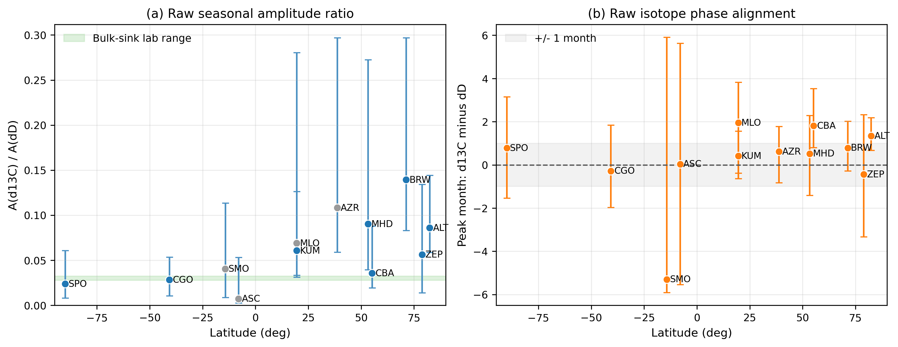
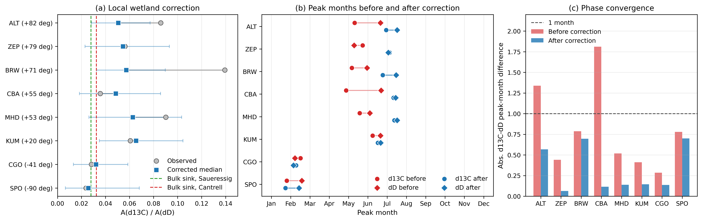

# Seasonal Methane Isotope Phasors Constrain the Methane OH 13C Kinetic Isotope Effect

## Draft Status

First manuscript draft for the KIE sites experiment. This file is written as a
main-text manuscript draft. Remaining submission-stage tasks are limited to
final figure generation, journal-specific bibliography formatting, and assigning
a permanent archive DOI for the analysis code and derived tables.

## Abstract

The carbon and hydrogen isotopic composition of atmospheric methane is widely
used to separate source and sink contributions to methane variability, but
isotope-budget interpretations remain sensitive to the kinetic isotope effect
for methane oxidation by hydroxyl radicals. Laboratory estimates of the
OH 13C kinetic isotope effect differ between Cantrell et al. (1990) and
Saueressig et al. (2001), motivating an independent atmospheric constraint.
Because the OH-D kinetic isotope effect is large and comparatively consistent
across laboratory studies, it can be used with the seasonal
`A(delta13C) / A(deltaD)` ratio as a hydrogen-referenced constraint on
`alpha13C_OH`. We test this idea using co-located seasonal cycles of
atmospheric `delta13C-CH4` and `deltaD-CH4`. We use NOAA/GML and INSTAAR
surface-flask `CH4` and `delta13C-CH4` data together with the harmonized
multi-laboratory `deltaD-CH4` compilation analyzed by Riddell-Young et al.
(2025). Annual isotope harmonics are represented as complex phasors, allowing
wetland source seasonality to be subtracted as a vector rather than as a scalar
amplitude. Wetland source phasors are constructed from monthly gridded natural
wetland methane emissions from Li et al. (2026) and wetland isotope source
signatures constrained by Ganesan et al. (2018), Douglas et al. (2021), and
Riddell-Young et al. (2025). Raw amplitude ratios,
`A(delta13C) / A(deltaD)`, exceed pure-sink expectations at Northern Hemisphere
sites, demonstrating strong source-seasonality contamination. After wetland
phasor correction, the cleanest Southern Hemisphere constraint from Cape Grim
and South Pole gives `alpha13C_OH = 1.0046` with a 95% interval of
`0.9969-1.0158`, consistent with both laboratory determinations. Northern
Hemisphere sites remain biased high after wetland-only correction, indicating
residual source structure not captured by the present wetland phasors. Seasonal
methane isotope phasors therefore provide an atmospheric OH KIE constraint,
but their extension to northern sites requires explicit treatment of seasonal
source phasors, transport, and non-wetland emissions.

## 1. Introduction

Atmospheric methane (`CH4`) has risen rapidly since 2007, with particularly
large growth during and after 2020, but the relative contributions of microbial
sources, fossil fuel sources, biomass burning, and changes in atmospheric
oxidation remain debated (Saunois et al., 2020, 2025; Nisbet et al., 2016,
2019, 2020; Lan et al., 2021; Basu et al., 2022; Riddell-Young et al., 2025).
Measurements of `delta13C-CH4` and `deltaD-CH4` provide independent information
because microbial, fossil, pyrogenic, and sink processes occupy different
regions of isotope space (Whiticar et al., 1986; Whiticar, 1999; Sherwood et
al., 2017; Douglas et al., 2021; Riddell-Young et al., 2025). These isotope
constraints are only as robust as the source signatures, sink fractionation
factors, and atmospheric transport assumptions used to interpret them.

The hydroxyl radical (OH) is the dominant atmospheric methane sink, and its
kinetic isotope effects influence both the global isotope budget and seasonal
cycles. The laboratory 13C kinetic isotope effect for `CH4 + OH` differs
between the flow-tube measurements of Cantrell et al. (1990) and the smog-
chamber measurements of Saueressig et al. (2001). The two values,
`alpha13C_OH = 1.0054` and `1.0039`, respectively, are close in absolute
terms but consequential for isotope-enabled source attribution (Basu et al.,
2022; Riddell-Young et al., 2025). Atmospheric observations offer a possible
independent test because OH has a strong annual cycle, peaking in local summer,
and methane destruction by OH enriches the residual atmospheric methane in
both 13C and D.

Hydrogen isotope fractionation provides a useful anchor for this test. The
OH-D kinetic isotope effect is large (`alphaD_OH = 1.294`) and, relative to
its fractionation strength, is better constrained across laboratory studies
than the disputed OH-13C KIE (Saueressig et al., 2001; Joelsson et al., 2016;
Whitehill et al., 2017). We therefore use the observed seasonal ratio between
co-located carbon and hydrogen isotope amplitudes to ask which carbon KIE is
most consistent with the hydrogen-referenced sink phasor.

In a sink-dominated seasonal cycle, the amplitude ratio

```text
R = A(delta13C-CH4) / A(deltaD-CH4)
```

would be controlled by the relative isotope fractionation of the methane sink.
Using this hydrogen KIE, the expected OH-only ratio is approximately `0.013`
for the Saueressig 13C KIE and `0.018` for the Cantrell 13C KIE. The
corresponding bulk-sink reference range after including the Cl, soil, and
stratospheric sink terms in Table 2 is approximately `0.028-0.032`, and this
bulk-sink range is the reference used in the site-ratio figures and alpha
inversion. The seasonal ratio is attractive because it depends on the shared
timing of the sink, uses the better constrained hydrogen KIE as a reference,
and is less directly sensitive to the long-term source-budget assumptions
required by annual mass-balance analyses.

However, the atmosphere is not sink dominated at all sites. Wetlands and other
microbial sources emit isotopically depleted methane with strong seasonal
cycles (Ganesan et al., 2018; Douglas et al., 2021; Li et al., 2026). A seasonal
source pulse therefore adds a source phasor to the observed isotope cycle. The
effect is asymmetric between carbon and hydrogen isotopes: the wetland
`delta13C-CH4` source signature lies only about `15 permil` below the
atmospheric value used here, whereas wetland `deltaD-CH4` is more than
`200 permil` below atmospheric `deltaD-CH4`. A given fractional source pulse
can therefore inflate `delta13C` seasonal amplitudes differently from
`deltaD` amplitudes, making the raw amplitude ratio an unreliable KIE
diagnostic at source-influenced sites.

Here we develop and apply a phasor method for interpreting co-located seasonal
cycles of `CH4`, `delta13C-CH4`, and `deltaD-CH4` at globally distributed
monitoring sites. We fit annual harmonics to paired monthly isotope data,
construct wetland source phasors from gridded wetland emissions and isotope
source signatures, subtract those source phasors as vectors, and infer the
OH 13C KIE from the corrected sink phasors. We focus the main result on
Southern Hemisphere background sites, where local wetland source seasonality
is small, and use Northern Hemisphere sites mainly as diagnostics of residual
source-seasonality structure.

## 2. Data

### 2.1 Atmospheric methane and isotope observations

Atmospheric methane dry-air mole fractions were taken from the NOAA Global
Monitoring Laboratory Global Greenhouse Gas Reference Network surface-flask
data product, version 2025-08-15 (Lan et al., 2025; DOI
`10.15138/VNCZ-M766`). Atmospheric `delta13C-CH4` measurements were taken from
the NOAA/INSTAAR stable carbon isotope data product, version 2023-09-21
(Michel et al., 2023; DOI `10.15138/9p89-1x02`). Atmospheric `deltaD-CH4`
measurements were taken from the multi-laboratory compilation analyzed by
Riddell-Young et al. (2025), available through the NOAA GML archive
(DOI `10.15138/setb-jy31`) and harmonized using laboratory-offset information
from Umezawa et al. (2018), Riddell-Young et al. (2025), and Dasgupta et al.
(2025).

We identified 12 sites with co-located `delta13C-CH4` and `deltaD-CH4` data:
Alert, Ny-Alesund/Zeppelin, Barrow, Cold Bay, Mace Head, Azores, Mauna Loa,
Cape Kumukahi, Ascension Island, Tutuila/American Samoa, Cape Grim, and South
Pole. The limiting overlap for same-site paired isotope analysis is mainly the
2005-2010 interval. The number of paired monthly means ranges from 14 at Cold
Bay to 52 at Alert. Eight sites are retained as the primary clean set for KIE
analysis: Alert, Zeppelin, Barrow, Cold Bay, Mace Head, Cape Kumukahi, Cape
Grim, and South Pole. The remaining sites are treated as diagnostic or excluded
sites because of data coverage, marine-boundary-layer representativeness, or
phase behavior.

We define "clean" operationally rather than absolutely. A site is included in
the clean set only if it satisfies all three pre-inversion screening criteria:
it is treated as a marine-boundary-layer/background site, the raw annual
`delta13C-CH4` and `deltaD-CH4` peak months agree within 2 months, and the
fitted `delta13C-CH4` annual amplitude is at least `0.04 permil`. The phase
criterion removes sites where the two isotopes are unlikely to share the same
dominant seasonal driver, and the amplitude criterion avoids unstable ratios
from very small carbon isotope cycles. This definition does not imply that a
site is source-free; it identifies sites for which the phasor correction and
phase-convergence diagnostics are meaningful.

Table 1 summarizes the observational data products used in the draft. All
manuscript citations point to original data products or peer-reviewed
compilations, not to local processed files.

**Table 1. Atmospheric data products used in the seasonal isotope analysis.**

| Variable | Primary source | Version or DOI | Role in this study |
|---|---|---|---|
| `CH4` mole fraction | NOAA GML Global Greenhouse Gas Reference Network surface flask data | Lan et al. (2025), DOI `10.15138/VNCZ-M766` | Reference methane seasonal cycle and isotope/source decomposition |
| `delta13C-CH4` | NOAA/INSTAAR surface flask isotope data | Michel et al. (2023), DOI `10.15138/9p89-1x02` | Carbon isotope seasonal harmonic |
| `deltaD-CH4` | Riddell-Young et al. atmospheric `deltaD-CH4` compilation | Riddell-Young et al. (2025); NOAA DOI `10.15138/setb-jy31` | Hydrogen isotope seasonal harmonic |
| Laboratory harmonization | Interlaboratory methane isotope comparison | Dasgupta et al. (2025), DOI `10.5194/amt-18-6591-2025` | Interpretation of multi-laboratory `deltaD-CH4` scale offsets |

### 2.2 Wetland methane emission seasonality

Wetland methane source phasors were constructed from the monthly gridded
natural vegetated wetland methane emission data set of Li et al. (2026), which
provides global monthly emissions for 2000-2025 at 1 degree x 1 degree
resolution (Li et al., 2026; Zenodo DOI `10.5281/zenodo.18870108`). We used
the `wetch4` field and computed 2005-2010 climatological annual harmonics for
four broad source bands: 60-90 N, 30-60 N, 30 S-30 N, and 90-30 S. These bands
are source-seasonality predictors, not atmospheric transport footprints.

The 2005-2010 annual totals derived from these bands are approximately
`10.9 Tg yr-1` for 60-90 N, `29.7 Tg yr-1` for 30-60 N, `114.0 Tg yr-1` for
30 S-30 N, and `2.9 Tg yr-1` for 90-30 S. The tropical band contributes the
largest annual wetland flux but has a smaller fractional annual amplitude
than high-latitude wetlands. High-latitude wetland seasonality is much more
strongly peaked, making it important for Northern Hemisphere seasonal isotope
phasors even though its annual flux is smaller.

### 2.3 Wetland isotope source signatures

The base analysis uses a uniform wetland `delta13C-CH4` source signature of
`-62 permil` with a structural uncertainty of `5 permil`. This value is used
as a global wetland/microbial prior, supported by the spatially resolved
wetland source-signature map of Ganesan et al. (2018) and the global microbial
source-signature estimate in Riddell-Young et al. (2025). Because Ganesan et
al. (2018) shows a meaningful regional gradient, with more depleted high-
latitude wetlands and less depleted tropical wetlands, a banded `delta13C`
wetland sensitivity is retained for the Supplementary Information.

Wetland `deltaD-CH4` source signatures are represented with site- or band-
specific values based on the geographic dependence of freshwater methane
hydrogen isotope ratios in Douglas et al. (2021), earlier environmental-water
relationships from Waldron et al. (1999) and Chanton et al. (2006), and OIPC
v3.1 precipitation `delta2H` estimates based on Bowen and Revenaugh (2003) and
Bowen et al. (2005). Recommended wetland `deltaD-CH4` values range from
strongly depleted Arctic values to less depleted tropical values; these
spatial differences dominate the uncertainty in source corrections at some
northern sites.

### 2.4 Sink fractions and kinetic isotope effects

We use OH, Cl, soil, and stratospheric methane sink fractions and kinetic
isotope-effect values consistent with the phasor-inversion analysis. The OH
`alphaD` value is `1.294`, and OH `alpha13C` is treated as the target parameter
with laboratory reference values of `1.0039` and `1.0054` from Saueressig et
al. (2001) and Cantrell et al. (1990), respectively. The non-OH sink values
are close to those compiled in Riddell-Young et al. (2025) SI Table S3; where
minor differences exist, the analysis values are retained and the SI documents
the effect of replacing them with the Riddell-Young compact parameter set.

**Table 2. Sink parameters used in the base analysis.**

| Parameter | Value used | Primary citation or provenance |
|---|---:|---|
| OH sink fraction | `0.84 +/- 0.04` | Global methane budget context; Riddell-Young et al. (2025) comparison |
| Cl sink fraction | `0.035 +/- 0.01` | Hossaini et al. (2016); Riddell-Young et al. (2025) |
| Soil sink fraction | `0.06 +/- 0.02` | Saunois et al. (2025); Dutaur and Verchot (2007); Riddell-Young et al. (2025) |
| Stratospheric sink fraction | `0.065` | Closure after OH, Cl, and soil; consistent with Riddell-Young et al. (2025) and Saunois et al. (2025) lifetime partitioning |
| OH `alphaD` | `1.294 +/- 0.01` | Saueressig et al. (2001) |
| Cl `alpha13C`, `alphaD` | `1.066`, `1.508` | Saueressig et al. (1995, 1996) |
| Soil `alpha13C`, `alphaD` | `1.022`, `1.066` | King et al. (1989); Snover and Quay (2000) |
| Stratospheric `alpha13C`, `alphaD` | `1.013`, `1.16` | Stratospheric isotope literature; compare with Dyonisius et al. (2020) |

## 3. Methods

### 3.1 Seasonal harmonic fitting

For each site and each variable, paired monthly means were fit with an annual
harmonic and a linear trend:

```text
y(t) = c0 + c1 (t - tref) + B sin(2 pi t) + C cos(2 pi t).
```

The annual seasonal cycle is represented by the complex phasor

```text
Z = B + i C,
```

with amplitude `A = |Z|` and phase determined by the angle of `Z`. Bootstrap
resampling was used to estimate uncertainty in harmonic amplitudes and phases.
This representation preserves both amplitude and timing; it is therefore
better suited to source-sink separation than scalar seasonal amplitudes alone.

### 3.2 Raw amplitude ratios

The observed isotope amplitude ratio is

```text
R_obs = A(delta13C-CH4) / A(deltaD-CH4).
```

For a sink-only annual cycle, `R_obs` would approximate the ratio of bulk sink
fractionation for 13C and D. Values much larger than the bulk-sink laboratory
reference range indicate that seasonal source phasors contribute to the
observed isotope cycle.

### 3.3 Wetland source phasor construction

For each source band, the wetland emission harmonic is converted into a
fractional source phasor:

```text
Z_frac = Z_wetland_flux / Q_total,
```

where `Q_total = 580 +/- 50 Tg yr-1` is the total annual methane source used
for scaling (Saunois et al., 2025). The isotope source phasor is then

```text
Z_source = (delta_source - delta_atm) Z_frac.
```

The base source-region assignments are high-latitude wetlands for Alert,
Zeppelin, and Barrow; mid-latitude wetlands for Cold Bay and Mace Head;
tropical wetlands for Cape Kumukahi; and local Southern Hemisphere
extratropical wetlands for Cape Grim and South Pole. These assignments are
intended as first-order source-seasonality predictors rather than atmospheric
transport model footprints.

### 3.4 Vector source correction

The corrected sink phasor is calculated separately for each isotope:

```text
Z_sink = Z_obs - Z_source.
```

The corrected ratio is then

```text
R_corr = |Z_sink(delta13C)| / |Z_sink(deltaD)|.
```

This vector subtraction is the central methodological step. If a source pulse
and a sink pulse peak in different months, subtracting scalar amplitudes can
over- or under-correct the seasonal isotope cycle. The phasor approach
preserves phase information and allows a diagnostic check: after source
correction, the `delta13C` and `deltaD` sink phasors should peak at similar
times if both are controlled by the same OH seasonal sink.

### 3.5 Inference of `alpha13C_OH`

For each corrected ratio, `alpha13C_OH` is inferred by solving the bulk sink
fractionation equation:

```text
epsilon13C_bulk = R_corr epsilonD_bulk,
alpha13C_OH = 1 + (epsilon13C_bulk - epsilon13C_nonOH) / (fOH 1000).
```

Monte Carlo sampling propagates uncertainty in observed harmonics, wetland
source phasors, wetland isotope source signatures, sink fractions, and non-OH
KIEs. For multi-site constraints, site-level corrected-ratio samples are
combined using inverse-variance weights before conversion to `alpha13C_OH`.
Nominal phasor-corrected ratios are retained as diagnostics and for
reproducibility, but they are not used as the central values of the main KIE
constraint.
Southern Hemisphere and all-site constraints are reported separately because
northern sites retain residual source structure after wetland-only correction.

### 3.6 Sensitivity experiments

We use three sensitivity classes to guard against overinterpretation.
First, block bootstrap and harmonic-model comparisons evaluate whether the
limited 2005-2010 overlap interval produces stable seasonal ratios. Second,
Southern Hemisphere source-region tests use mass-conserving response mixtures
of local Southern Hemisphere, tropical, and delayed high-latitude Northern
Hemisphere wetland phasors, with the three weights summing to one. The SI also
reports additive transport stress tests as upper-bound structural diagnostics,
not as mass-conserving source mixtures. Third, biomass burning source phasors
are treated in the SI because
they can affect northern source structure but are not necessary for the main
Southern Hemisphere result.

For the diagnostic uncertainty-attribution panel, we use a one-at-a-time
variance decomposition rather than a replacement for the full Monte Carlo.
Starting from the Southern Hemisphere alpha constraint, each grouped
uncertainty source is perturbed independently with the scales used in the
analysis code: observations/harmonic fitting (`sigma_alpha = 0.0040`),
wetland phasors (`0.0030`), wetland isotope signatures (`0.0025`), biomass
burning correction (`0.0015`), sink fractions (`0.0020`), `alphaD_OH`
(`0.0018`), and non-OH KIEs (`0.0012`). The plotted fractions are each
group's variance divided by the sum of the one-at-a-time variances. They are
therefore a prioritization diagnostic, not a posterior variance budget.

## 4. Results

### 4.1 Raw isotope amplitude ratios are too large at northern sites

The raw isotope amplitude ratio varies strongly with latitude. In the clean
site set, `R_obs` ranges from `0.0237` at South Pole to `0.1393` at Barrow.
The bulk-sink reference range implied by the two laboratory `alpha13C_OH`
values and the Table 2 sink parameter set is approximately `0.028-0.032`. All
Northern Hemisphere sites exceed this range, in some cases by factors of
several. The largest northern value occurs at Barrow, where high-latitude
wetland source seasonality is expected to be strong.

This pattern indicates that raw seasonal isotope amplitude ratios cannot be
interpreted directly as OH KIE constraints outside the least source-influenced
sites. The result is consistent with the isotope-gap geometry of microbial
sources: the carbon isotope source pulse can be large relative to the carbon
sink signal, while the hydrogen isotope sink signal remains relatively large
because the source-atmosphere `deltaD` gap is much larger.



**Figure 1. Raw seasonal isotope amplitude ratios and phase alignment.**
Annual harmonics were fit to paired monthly `delta13C-CH4` and `deltaD-CH4`
records from the NOAA/INSTAAR `delta13C-CH4` archive, the Riddell-Young et al.
`deltaD-CH4` archive, and co-located NOAA GML `CH4` mole fractions. (a) Raw
seasonal amplitude ratio `A(delta13C)/A(deltaD)` versus latitude. The green
band is the bulk-sink laboratory reference range implied by Saueressig et al.
(2001) and Cantrell et al. (1990), using `alphaD_OH = 1.294` and the non-OH
sink parameters in Table 2. Blue points are sites kept for the clean-site
phasor analysis; grey points are diagnostic/excluded sites.
(b) Difference between the fitted `delta13C-CH4` and `deltaD-CH4` peak months.
The grey band marks agreement within one month.

### 4.2 Wetland phasor correction reduces northern ratios but does not remove all residual source structure

Wetland phasor correction substantially changes northern sites. At Barrow,
`R_obs` decreases from `0.1393` to a corrected median of `0.0572`. At Alert,
`R_obs` decreases from `0.0859` to `0.0506`, and at Mace Head it decreases
from `0.0902` to `0.0626`.
These corrections move the ratios toward the pure-sink range but do not bring
them into it. Cape Kumukahi remains high after correction (`R_corr = 0.0653`),
suggesting that unresolved source phasors or transport structure remain
important outside the Southern Hemisphere background sites.

The correction behaves differently at Southern Hemisphere sites. Cape Grim and
South Pole have small local wetland phasors, and their ratios change only
modestly: Cape Grim shifts from `0.0282` to a corrected median of `0.0321`,
whereas South Pole shifts from `0.0237` to `0.0256`. These small corrections
support the use of these sites as the cleanest current atmospheric KIE
constraint, while also showing that even Southern Hemisphere ratios are not
entirely source-free.

The phase diagnostic supports the vector method. After source correction, the
corrected `delta13C` and `deltaD` sink phasors agree within less than one month
at all eight clean sites. Northern corrected sink phases cluster near boreal
summer, while Southern Hemisphere corrected sink phases occur in austral
summer. This phase convergence is expected if the corrected phasors isolate a
common OH-driven seasonal sink.

**Table 3. Observed and wetland-corrected isotope amplitude ratios.**
Corrected values are Monte Carlo medians of the phasor-corrected ratio, not
the nominal deterministic phasor values.

| Site | Source band | `R_obs` | `R_corr` | Interpretation |
|---|---|---:|---:|---|
| Alert | 60-90 N | `0.0859` | `0.0506` | Large northern correction; residual high |
| Zeppelin | 60-90 N | `0.0561` | `0.0545` | Little correction; residual high |
| Barrow | 60-90 N | `0.1393` | `0.0572` | Largest wetland correction |
| Cold Bay | 30-60 N | `0.0355` | `0.0484` | Correction increases ratio because phase matters |
| Mace Head | 30-60 N | `0.0902` | `0.0626` | Correction reduces but remains high |
| Cape Kumukahi | Tropics | `0.0607` | `0.0653` | Tropical/source residual remains high |
| Cape Grim | 90-30 S | `0.0282` | `0.0321` | Small correction |
| South Pole | 90-30 S | `0.0237` | `0.0256` | Small correction with large uncertainty |



**Figure 2. Local wetland correction and phase convergence.** Wetland source
phasors were derived from Li et al. (2026) monthly natural vegetated wetland
emissions and applied as complex annual-harmonic corrections using the wetland
isotope source signatures described in Section 2.3. (a) Observed and
local-wetland-corrected seasonal isotope amplitude ratios for the eight clean
sites. Grey circles are raw `R_obs = A(delta13C)/A(deltaD)`, blue squares are
Monte Carlo medians of corrected `R_corr`, light-blue horizontal bars show
95% Monte Carlo intervals, and grey line segments show the site-level
displacement caused by local wetland phasor subtraction. Dashed vertical lines show the
bulk-sink ratios implied by the Saueressig et al. (2001) and Cantrell et al.
(1990) OH `13C` KIE values under the sink parameter set used here. (b) Fitted
peak months for `delta13C-CH4` and `deltaD-CH4` before and after correction.
Red symbols show the observed isotope phasors; blue symbols show the corrected
sink phasors. (c) Absolute `delta13C`-`deltaD` peak-month difference before
and after correction. The corrected phasors converge to less than one month at
all eight clean sites, supporting the interpretation that the correction
isolates a shared OH-driven seasonal sink.

### 4.3 Southern Hemisphere sites give the cleanest atmospheric KIE constraint

The primary atmospheric constraint uses Cape Grim and South Pole after wetland
phasor correction. The Southern Hemisphere phasor-corrected result is

```text
alpha13C_OH = 1.0046 [0.9969, 1.0158] 95% interval.
```

This estimate lies between the laboratory values of Saueressig et al. (2001)
and Cantrell et al. (1990) and is consistent with both within uncertainty.
The central value is slightly closer to Saueressig, but the current Southern
Hemisphere seasonal record is not precise enough to exclude Cantrell.

The all-site phasor-corrected estimate is higher:

```text
alpha13C_OH = 1.0104 [1.0018, 1.0207] 95% interval.
```

Because the all-site estimate is dominated by residual high northern corrected
ratios, we interpret it as a diagnostic of remaining source-seasonality
structure rather than as the preferred KIE constraint. The contrast between
the Southern Hemisphere and all-site estimates is itself informative: wetland
correction moves northern sites in the expected direction, but wetland-only
phasors are not sufficient to turn northern seasonal cycles into clean OH KIE
constraints.

### 4.4 Southern Hemisphere source-region sensitivity supports the main framing

We tested whether replacing the local Southern Hemisphere source assignment
with mass-conserving source-region mixtures changes the interpretation. In
these tests, the delayed high-latitude Northern Hemisphere wetland response
weight is limited to `0.04`, `0.06`, `0.08`, or `0.10`; the tropical response
weight spans `0.00-0.50`; and the remaining weight is assigned to the local
Southern Hemisphere wetland phasor. The three weights therefore sum to one,
avoiding an artificial increase in total wetland source seasonality.

Across this deterministic mass-conserving grid, the mean inferred Southern
Hemisphere `alpha13C_OH` spans about `0.9989-1.0062`. The range overlaps the
preferred Southern Hemisphere Monte Carlo constraint and remains close to the
laboratory comparison range, supporting the conclusion that plausible tropical
and weak delayed high-latitude Northern Hemisphere source-region mixing does
not overturn the main KIE interpretation. The SI separates the combined grid
into two one-dimensional slices: tropical-only replacement gives a shallow
U-shaped response, whereas delayed high-latitude Northern Hemisphere
replacement alone raises the deterministic alpha only from about `1.0052` to
`1.0061` over the tested `0.00-0.10` response-weight range (Fig. S9). Additive
delayed Northern Hemisphere tests are still
useful as structural transport stress tests because interhemispheric transport
can attenuate and delay annual signals (Geller et al., 1997; Levin and
Hesshaimer, 1996; Patra et al., 2011; Holzer and Waugh, 2015), but we keep
those tests in the SI rather than treating them as mass-conserving corrections.

The deterministic values in Fig. S9 should not be read as a second central
estimate of the OH KIE. The zero-imported-response case in that figure is the
simple mean of nominal CGO and SPO phasor-corrected ratios, which gives an
alpha value of about `1.0052` and therefore appears closer to Cantrell et al.
(1990). In contrast, the preferred main-text estimate combines the CGO and SPO
corrected-ratio Monte Carlo samples, including observation, source-phasor,
source-signature, and sink-parameter uncertainties, before converting to
`alpha13C_OH`; this gives `1.0046 [0.9969, 1.0158]` (Fig. 3a). The difference
therefore reflects the statistical level of the calculation, not a conflict
between the source-region sensitivity test and the atmospheric KIE constraint.

### 4.5 Uncertainty is dominated by observations and wetland source phasors

A one-at-a-time uncertainty attribution indicates that observation-related
harmonic uncertainty is the largest contribution to the alpha uncertainty
budget, accounting for about `39%` of the diagnostic variance. Wetland phasor
uncertainty contributes about `21%`, wetland isotope-source uncertainty about
`14%`, sink fractions about `9%`, `alphaD_OH` about `8%`, biomass burning about
`5%`, and non-OH KIEs about `3%`. These values are diagnostic rather than a
replacement for the full Monte Carlo propagation, but they identify the most
important paths for improving the constraint: longer paired isotope records,
better source-region phasors, and better wetland isotope source signatures.

Biomass burning is therefore treated as a Supplementary Information topic. It
can change northern corrected ratios, but it is not the dominant uncertainty
for the main Southern Hemisphere result and should not be the main-text focus
unless a later figure shows that it changes the headline Southern Hemisphere
constraint.


**Figure 3. Atmospheric `alpha13C_OH` constraint, Southern Hemisphere
source-region sensitivity, and uncertainty attribution.** (a) Preferred
Southern Hemisphere phasor-corrected atmospheric constraint and the
corresponding all-clean-site estimate, obtained by combining corrected-ratio
Monte Carlo samples before alpha inversion. Horizontal bars are 95% intervals.
Dashed lines mark the Saueressig et al. (2001) and Cantrell et al. (1990)
laboratory values. (b) Mean inferred Southern
Hemisphere `alpha13C_OH` under mass-conserving source-region mixtures of local
Southern Hemisphere, tropical, and delayed high-latitude Northern Hemisphere
wetland phasors. The remaining weight after choosing the tropical and
Northern Hemisphere weights is assigned to the local Southern Hemisphere
phasor. (c) One-at-a-time grouped
uncertainty attribution for the alpha constraint; fractions are diagnostic and
do not replace the full Monte Carlo interval. Each bar is the variance from
perturbing one uncertainty group alone, divided by the summed one-at-a-time
variance across all groups.

## 5. Discussion

### 5.1 What the atmospheric seasonal constraint does and does not show

The seasonal phasor analysis provides an atmospheric constraint on the methane
OH 13C kinetic isotope effect that is independent of the annual global isotope
mass balance. The preferred Southern Hemisphere estimate is consistent with
both leading laboratory determinations. Its central value falls between the
Saueressig et al. (2001) and Cantrell et al. (1990) values and is marginally
closer to Saueressig, but the present uncertainty does not distinguish the two
laboratory results. This agreement is encouraging because the method uses a
distinct observable: the relative annual-cycle amplitudes and phases of
co-located `delta13C-CH4` and `deltaD-CH4`.

The method does not yet provide a globally universal site-by-site KIE estimate.
Northern Hemisphere sites remain high after wetland-only correction, implying
that other seasonal source terms, transport structure, or source-signature
errors remain in the corrected phasors. This is not a failure of the seasonal
approach; it is a useful diagnostic. Northern sites are telling us that source
seasonality is still unresolved at the level needed for KIE inference.

### 5.2 Why phasors matter

The phasor formulation is central because source and sink seasonal cycles do
not necessarily peak in the same month. High-latitude wetlands can peak later
than OH, tropical wetlands have different seasonal structure, and transported
signals can be delayed and attenuated. Scalar amplitude subtraction discards
this timing information. In contrast, the complex phasor approach uses both
amplitude and phase, and it gives an internal consistency check: the corrected
sink phasors for carbon and hydrogen isotopes should align in phase if the
remaining signal is dominated by a common sink.

### 5.3 Implications for isotope-enabled methane budgets

Many isotope-enabled methane budget studies rely on prescribed source
signatures and sink fractionation factors. The present analysis highlights a
related but distinct issue: seasonal isotope constraints depend on the phasor
geometry of sources and sinks. A source that is modest in annual flux can have
a large seasonal phasor, and its effect on `A(delta13C)/A(deltaD)` depends on
both isotope source gaps and phase timing. This is particularly important for
high-latitude wetlands, where annual flux is smaller than the tropics but
fractional seasonality is large.

The Southern Hemisphere result also suggests a practical way forward. Sites
with small local source phasors can anchor the sink constraint, while Northern
Hemisphere sites can be used to test and improve source phasor models. This
division of roles avoids overinterpreting northern residuals as a large OH KIE
while still extracting useful information from their seasonal structure.

### 5.4 Limitations

The main limitation is the short paired isotope overlap. Most same-site
`delta13C-CH4` and `deltaD-CH4` pairing is concentrated in 2005-2010, and some
sites have sparse monthly coverage. Block bootstrap and yearly harmonic tests
indicate that full-period harmonic uncertainties can be optimistic at sparse
or low-amplitude sites. The Southern Hemisphere constraint should therefore be
treated as a useful atmospheric constraint rather than a definitive exclusion
of either laboratory value.

Second, wetland source signatures remain uncertain. `deltaD-CH4` is strongly
controlled by environmental water, pathway, and local hydrology, and
`delta13C-CH4` has regional structure associated with wetland type and
vegetation. The SI should therefore include the Ganesan et al. (2018) spatial
`delta13C` wetland sensitivity and the Douglas et al. (2021) wetland
`deltaD-CH4` alternatives.

Third, the present wetland phasors are not atmospheric footprints. They are
latitude-band emission phasors, not transport-model source-receptor functions.
The mass-conserving Southern Hemisphere sensitivity tests show that plausible
tropical and weak delayed high-latitude Northern Hemisphere response mixtures
do not overturn the main interpretation. A future analysis using chemical
transport model footprints or transit-time distributions would still be needed
to replace these diagnostic response weights with physically constrained
source-receptor functions.

Finally, biomass burning and other non-wetland seasonal sources are only
treated in the SI. This choice is deliberate: the main result does not require
biomass burning to explain the Southern Hemisphere constraint, but northern
residuals likely require additional seasonal source terms beyond wetlands.

## 6. Conclusions

1. Co-located seasonal cycles of atmospheric `delta13C-CH4` and `deltaD-CH4`
   can constrain the methane OH 13C kinetic isotope effect when source phasors
   are small or explicitly corrected.

2. Raw isotope amplitude ratios at Northern Hemisphere sites are far above
   pure-sink expectations, showing that seasonal source contamination must be
   handled before interpreting the ratios as KIE constraints.

3. Wetland source phasor correction substantially reduces northern ratios but
   does not fully remove residual source structure, so northern sites are best
   interpreted as source-seasonality diagnostics in the present analysis.

4. Southern Hemisphere sites provide the cleanest current atmospheric
   constraint: `alpha13C_OH = 1.0046 [0.9969, 1.0158]`, consistent with both
   the Saueressig et al. (2001) and Cantrell et al. (1990) laboratory values.

5. Extending this approach will require longer paired isotope records, better
   wetland isotope source signatures, explicit treatment of non-wetland
   seasonal sources, and transport-informed source-region phasors.

## Data Availability

NOAA GML surface-flask `CH4` dry-air mole fractions are available from the
NOAA Global Monitoring Laboratory archive (Lan et al., 2025, DOI
`10.15138/VNCZ-M766`). NOAA/INSTAAR surface-flask `delta13C-CH4`
measurements are available from Michel et al. (2023, version 2023-09-21,
DOI `10.15138/9p89-1x02`). Atmospheric `deltaD-CH4` observations were obtained
from the NOAA GML archive record for Riddell-Young et al. (2025), DOI
`10.15138/setb-jy31`, and were harmonized following the laboratory-offset
framework described by Riddell-Young et al. (2025) and Dasgupta et al. (2025).
The NOAA archive requests appropriate citation of the data record and contact
with the relevant data providers when these isotope measurements are central
to a publication.

Monthly gridded natural vegetated wetland methane emissions are available from
Li et al. (2026), with data archived on Zenodo under DOI
`10.5281/zenodo.18870108`. Wetland methane isotope source-signature
constraints use published values and relationships from Ganesan et al. (2018),
Douglas et al. (2021), Waldron et al. (1999), Chanton et al. (2006), and
Riddell-Young et al. (2025). OIPC v3.1 precipitation isotope estimates were
accessed from the University of Utah OIPC service and should be cited through
Bowen and Revenaugh (2003) and Bowen et al. (2005), with GNIP/IAEA-WMO as the
underlying observational basis where applicable.

The analysis code and derived tables/figures should be deposited in a permanent
repository before submission, and the final repository DOI or archive link
should be added to this paragraph.

## Supplementary Information Contents

The accompanying SI draft includes:

1. Full data-screening and paired-month tables for all 12 sites.
2. Harmonic fit diagnostics and block-bootstrap sensitivity.
3. Full wetland source phasor construction, including latitude-band emissions.
4. Ganesan et al. (2018) spatial `delta13C_wetland` sensitivity.
5. Douglas/OIPC wetland `deltaD-CH4` sensitivity.
6. Riddell-Young SI Table S3 sink/KIE comparison and rerun/sensitivity logic.
7. Southern Hemisphere mass-conserving source-region sensitivity and additive
   transport stress tests.
8. Biomass burning phasor correction and interpretation.
9. OSSE tests showing how source phasors bias scalar amplitude-ratio KIE
   retrievals.

## Draft Figure List

**Figure 1. Raw seasonal isotope amplitude ratios and phase alignment.**
File: `figures/manuscript/fig1_raw_ratio_phase.png`.

**Figure 2. Local wetland correction and phase convergence.** Observed-to-
corrected ratio shifts using corrected-ratio Monte Carlo medians and 95%
intervals, fitted peak months, and `delta13C`-`deltaD` phase differences
before and after correction.
File: `figures/manuscript/fig2_phase_convergence.png`.

**Figure 3. Atmospheric OH 13C KIE constraint, mass-conserving source-region
sensitivity, and uncertainty attribution.** The atmospheric constraints combine
corrected-ratio Monte Carlo samples before conversion to `alpha13C_OH`. File:
`figures/manuscript/fig3_alpha_sensitivity_uncertainty.png`.

## References


Basu, S., et al. (2022). Estimating methane emissions from the global methane
budget with atmospheric `delta13C-CH4`. Atmospheric Chemistry and Physics, 22,
15351-15369. DOI `10.5194/acp-22-15351-2022`.

Bowen, G. J., and Revenaugh, J. (2003). Interpolating the isotopic composition
of modern meteoric precipitation. Water Resources Research, 39, 1299.
DOI `10.1029/2003WR002086`.

Bowen, G. J., Wassenaar, L. I., and Hobson, K. A. (2005). Global
application of stable hydrogen and oxygen isotopes to wildlife forensics.
Oecologia, 143, 337-348. DOI `10.1007/s00442-004-1813-y`.

Cantrell, C. A., et al. (1990). Carbon kinetic isotope effect in the oxidation
of methane by the hydroxyl radical. Journal of Geophysical Research:
Atmospheres, 95, 22455-22462. DOI `10.1029/JD095iD13p22455`.

Chanton, J. P., Fields, D., and Hines, M. E. (2006). Controls on the
hydrogen isotopic composition of biogenic methane from high-latitude terrestrial
wetlands. Journal of Geophysical Research: Biogeosciences, 111, G04004.
DOI `10.1029/2005JG000134`.

Dasgupta, B., et al. (2025). Harmonisation of methane isotope ratio
measurements from different laboratories using atmospheric samples. Atmospheric
Measurement Techniques, 18, 6591-6615. DOI `10.5194/amt-18-6591-2025`.

Douglas, P. M. J., Stratigopoulos, E., Park, S., and Phan, D. (2021).
Geographic variability in freshwater methane hydrogen isotope ratios and its
implications for global isotopic source signatures. Biogeosciences, 18,
3505-3527. DOI `10.5194/bg-18-3505-2021`.

Dutaur, L., and Verchot, L. V. (2007). A global inventory of the soil `CH4`
sink. Global Biogeochemical Cycles, 21, GB4013. DOI
`10.1029/2006GB002734`.

Dyonisius, M. N., et al. (2020). Old carbon reservoirs were not important in
the deglacial methane budget. Science, 367, 907-910. DOI
`10.1126/science.aax0504`.

Ganesan, A. L., et al. (2018). Spatially resolved isotopic source signatures of
wetland methane emissions. Geophysical Research Letters, 45, 3737-3745.
DOI `10.1002/2018GL077536`.

Geller, L. S., Elkins, J. W., Lobert, J. M., Clarke, A. D., Hurst, D. F.,
Butler, J. H., and Myers, R. C. (1997). Tropospheric SF6: observed latitudinal
distribution and trends, derived emissions and interhemispheric exchange time.
Geophysical Research Letters, 24, 675-678. DOI `10.1029/97GL00523`.

Holzer, M., and Waugh, D. W. (2015). Interhemispheric transit-time
distributions and path-dependent lifetimes constrained by measurements of SF6,
CFCs, and CFC replacements. Geophysical Research Letters, 42. DOI
`10.1002/2015GL064172`.

Hossaini, R., et al. (2016). A global model of tropospheric chlorine chemistry:
organic versus inorganic sources and impact on methane oxidation. Journal of
Geophysical Research: Atmospheres, 121, 14271-14297. DOI
`10.1002/2016JD025756`.

Joelsson, L. M. T., Schmidt, J. A., Nilsson, E. J. K., Blunier, T.,
Griffith, D. W. T., Ono, S., and Johnson, M. S. (2016). Kinetic isotope
effects of `12CH3D + OH` and `13CH3D + OH` from 278 to 313 K. Atmospheric
Chemistry and Physics, 16, 4439-4449. DOI `10.5194/acp-16-4439-2016`.

King, S. L., Quay, P. D., and Lansdown, J. M. (1989). The `13C/12C` kinetic
isotope effect for soil oxidation of methane at ambient atmospheric
concentrations. Journal of Geophysical Research: Atmospheres, 94, 18273-18278.
DOI `10.1029/JD094iD15p18273`.

Lan, X., et al. (2025). Atmospheric Methane Dry Air Mole Fractions from the
NOAA GML Global Greenhouse Gas Reference Network, Carbon Cycle Cooperative
Global Air Sampling Network: 1983-present. Version 2025-08-15. NOAA Global
Monitoring Laboratory. DOI `10.15138/VNCZ-M766`.

Levin, I., and Hesshaimer, V. (1996). Refining of atmospheric transport model
entries by the globally observed passive tracer distributions of `85Kr` and
sulfur hexafluoride (`SF6`). Journal of Geophysical Research: Atmospheres, 101,
16745-16755. DOI `10.1029/96JD01058`.

Li, H., et al. (2026). Machine-learning-based estimates of global natural
vegetated wetland methane emissions for 2000-2025. Earth System Science Data,
18, 3507-3534. DOI `10.5194/essd-18-3507-2026`. Data DOI
`10.5281/zenodo.18870108`.

Michel, S. E., et al. (2023). Stable Isotopic Composition of Atmospheric
Methane (13C) from the NOAA GML Carbon Cycle Cooperative Global Air Sampling
Network, 1998-2022. Version 2023-09-21. DOI `10.15138/9p89-1x02`.

Montzka, S. A., Krol, M., Dlugokencky, E., Hall, B., Jockel, P., and
Lelieveld, J. (2011). Small interannual variability of global atmospheric
hydroxyl. Science, 331, 67-69. DOI `10.1126/science.1197640`.

Patra, P. K., et al. (2011). TransCom model simulations of `CH4` and related
species: linking transport, surface flux and chemical loss with `CH4`
variability in the troposphere and lower stratosphere. Atmospheric Chemistry
and Physics, 11, 12813-12837. DOI `10.5194/acp-11-12813-2011`.

Riddell-Young, B., et al. (2025). Microbial driver of 2006-2023 CH4 growth
indicated by trends in atmospheric `deltaD-CH4` and `delta13C-CH4`.
Proceedings of the National Academy of Sciences. DOI
`10.1073/pnas.2516543122`. NOAA data archive DOI `10.15138/setb-jy31`.

Saueressig, G., Bergamaschi, P., Crowley, J. N., Fischer, H., and Harris, G.
(1996). D/H kinetic isotope effect in the reaction `CH4 + Cl`. Geophysical
Research Letters, 23, 3619-3622. DOI `10.1029/96GL03292`.

Saueressig, G., et al. (2001). Carbon 13 and D kinetic isotope effects in the
reactions of CH4 with O(1D) and OH: new laboratory measurements and their
implications for the isotopic composition of stratospheric methane. Journal of
Geophysical Research: Atmospheres, 106, 23127-23138. DOI
`10.1029/2000JD000120`.

Saunois, M., et al. (2020). The Global Methane Budget 2000-2017. Earth System
Science Data, 12, 1561-1623. DOI `10.5194/essd-12-1561-2020`.

Saunois, M., et al. (2025). Global Methane Budget 2000-2020. Earth System
Science Data, 17, 1873-1958. DOI `10.5194/essd-17-1873-2025`.

Sherwood, O. A., et al. (2017). Global inventory of gas geochemistry data from
fossil fuel, microbial and burning sources, version 2017. Earth System Science
Data, 9, 639-656. DOI `10.5194/essd-9-639-2017`; data DOI
`10.15138/G3201T`.

Snover, A. K., and Quay, P. D. (2000). Hydrogen and carbon kinetic isotope
effects during soil uptake of atmospheric methane. Global Biogeochemical
Cycles, 14, 25-39. DOI `10.1029/1999GB900089`.

Umezawa, T., et al. (2018). Interlaboratory comparison of `delta13C` and
`deltaD` measurements of atmospheric `CH4` for combined use of data sets from
different laboratories. Atmospheric Measurement Techniques, 11, 1207-1231.
DOI `10.5194/amt-11-1207-2018`.

Waldron, S., Lansdown, J. M., Scott, E. M., Fallick, A. E., and Hall, A. J.
(1999). The global influence of the hydrogen isotope composition of water on
that of bacteriogenic methane from shallow freshwater environments. Geochimica
et Cosmochimica Acta, 63, 2237-2245. DOI
`10.1016/S0016-7037(99)00192-1`.

Whiticar, M. J. (1999). Carbon and hydrogen isotope systematics of bacterial
formation and oxidation of methane. Chemical Geology, 161, 291-314. DOI
`10.1016/S0009-2541(99)00092-3`.

Whiticar, M. J., Faber, E., and Schoell, M. (1986). Biogenic methane formation
in marine and freshwater environments: `CO2` reduction vs. acetate
fermentation--isotope evidence. Geochimica et Cosmochimica Acta, 50, 693-709.
DOI `10.1016/0016-7037(86)90346-7`.

Whitehill, A. R., Joelsson, L. M. T., Schmidt, J. A., Wang, D. T.,
Johnson, M. S., and Ono, S. (2017). Clumped isotope effects during OH and Cl
oxidation of methane. Geochimica et Cosmochimica Acta, 196, 307-325. DOI
`10.1016/j.gca.2016.09.012`.
