# Supplementary Information Draft

## Title

Supplementary Information for "Seasonal Methane Isotope Phasors Constrain the
Methane OH 13C Kinetic Isotope Effect"


## S1. Atmospheric Data Pairing And Site Screening

We began from 12 sites with co-located atmospheric `delta13C-CH4` and
`deltaD-CH4` observations. `CH4` mole fractions were taken from the NOAA GML
surface-flask product of Lan et al. (2025), `delta13C-CH4` from the
NOAA/INSTAAR product of Michel et al. (2023), and `deltaD-CH4` from the
multi-laboratory data set analyzed by Riddell-Young et al. (2025). The
`deltaD-CH4` observations were harmonized following the laboratory-offset
framework described by Riddell-Young et al. (2025), Umezawa et al. (2018), and
Dasgupta et al. (2025).

**Table S1. Candidate site coverage.**

| Site | Latitude | Paired monthly means | Overlap years | Use in main analysis |
|---|---:|---:|---:|---|
| ALT | `82.45` | `52` | `4.7` | Clean site |
| ZEP | `78.91` | `16` | `1.4` | Clean site |
| BRW | `71.32` | `41` | `5.0` | Clean site |
| CBA | `55.21` | `14` | `1.4` | Clean site |
| MHD | `53.33` | `31` | `4.4` | Clean site |
| AZR | `38.77` | `28` | `4.7` | Excluded |
| MLO | `19.54` | `46` | `4.6` | Excluded |
| KUM | `19.56` | `36` | `4.7` | Clean site |
| ASC | `-7.97` | `46` | `4.9` | Excluded |
| SMO | `-14.25` | `36` | `4.4` | Excluded |
| CGO | `-40.68` | `29` | `4.1` | Clean site, SH constraint |
| SPO | `-89.98` | `33` | `4.6` | Clean site, SH constraint |

The clean set used for the primary phasor analysis is ALT, ZEP, BRW, CBA, MHD,
KUM, CGO, and SPO. The Southern Hemisphere KIE constraint is based on CGO and
SPO because the wetland source correction is smallest there and because their
corrected seasonal phases are consistent with an summer sink maximum.

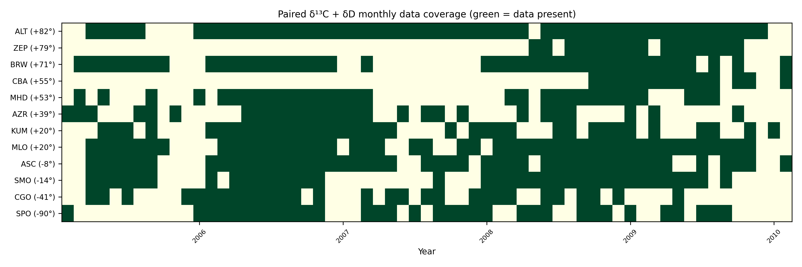

**Figure S1. Paired monthly data coverage by site.** Green cells mark months
with co-located `delta13C-CH4` and `deltaD-CH4` observations after monthly
pairing. Site ordering follows latitude from north to south. The figure
documents the coverage limitations behind the harmonic fits and the emphasis
on CGO and SPO for the Southern Hemisphere constraint. Data sources are Lan et
al. (2025), Michel et al. (2023), and the Riddell-Young et al. (2025)
`deltaD-CH4` archive.

## S2. Harmonic Fits And Robustness To Seasonal Model Choice

The base analysis fits an annual harmonic plus a linear trend to paired monthly
means:

```text
y(t) = c0 + c1 (t - tref) + B sin(2 pi t) + C cos(2 pi t).
```

The harmonic coefficients are stored as `Z = B + iC`. The manuscript uses the
annual harmonic because it is the minimal model that preserves seasonal
amplitude and phase over the short 2005-2010 paired-isotope interval. Figure S3
 shows the primary annual-harmonic
estimate together with three diagnostics that test seasonal-shape choice,
calendar-month coverage, and leverage by individual years.

All four calculations use the same paired monthly isotope data and explicitly
account for a linear trend. The primary model jointly fits the trend and one
annual sine-cosine pair. The seasonal-shape diagnostic adds a semiannual pair
and reports only the annual component. The monthly-effects diagnostic jointly
fits the linear trend and 12 calendar-month effects, then defines amplitude as
half the range of the fitted month effects. This diagnostic is reported only
when all 12 calendar months are observed; it is therefore unavailable for ZEP
and CBA. Finally, the year-leverage diagnostic omits one calendar year at a
time and refits the same trend-plus-annual model. A median and minimum-to-maximum
range are shown only when at least two valid omission fits are available; ZEP
does not meet this requirement.

The corrected primary annual-harmonic ratios reproduce the ratios used by the
main analysis to numerical precision. Annual-only and annual-plus-semiannual
estimates are close at all sites, indicating that adding a twice-per-year term
does not materially alter the annual component. The monthly-effects and
leave-one-year-out diagnostics identify greater sensitivity at some sparse or
low-amplitude sites, particularly MHD, whereas the Southern Hemisphere sites
CGO and SPO remain comparatively stable across the estimable diagnostics.


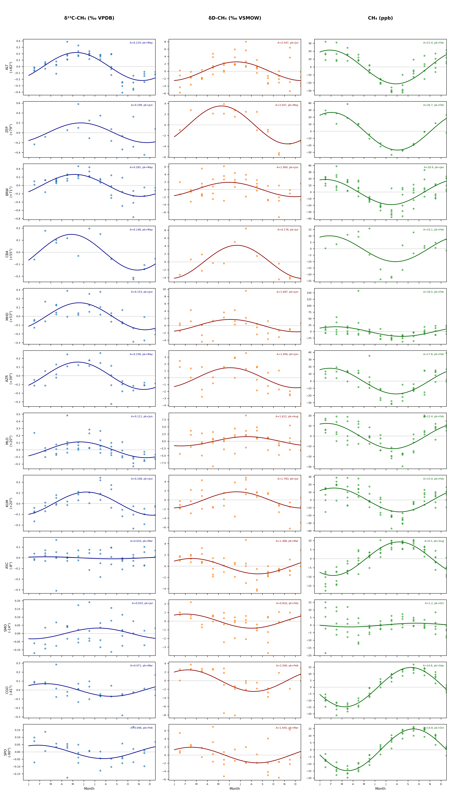

**Figure S2. Folded seasonal cycles used for annual harmonic fitting.**
Monthly anomalies of `delta13C-CH4`, `deltaD-CH4`, and `CH4` are folded by
calendar month and shown with annual harmonic fits. The figure is a diagnostic
view of the paired observations used to estimate seasonal amplitudes and
phases.

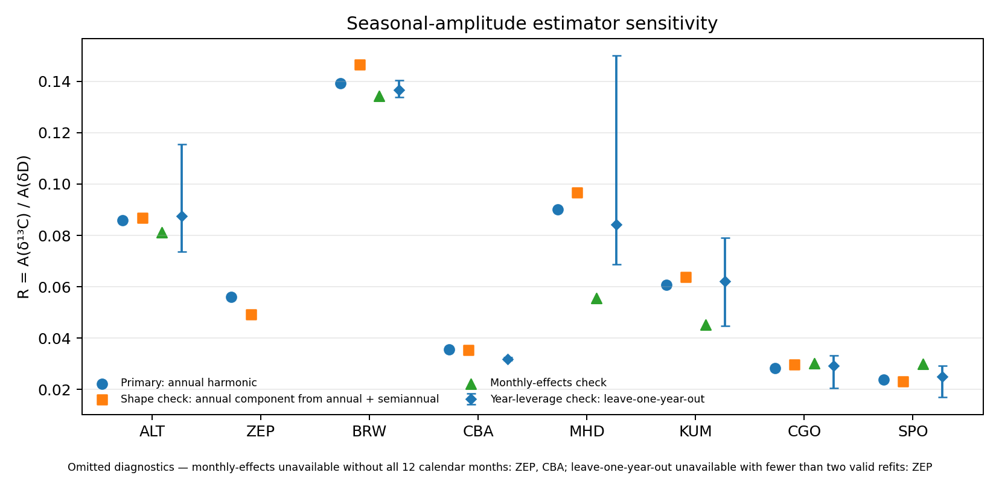

**Figure S3. Seasonal-amplitude estimator sensitivity.** The primary
trend-plus-annual harmonic estimate is shown with three diagnostics for the
clean-site set: the annual component from a trend-plus-annual-plus-semiannual
fit, a joint trend-plus-monthly-effects estimate, and leave-one-year-out refits
of the primary model. Points show `R = A(delta13C)/A(deltaD)`. Diamonds and
vertical bars give the median and minimum-to-maximum range across valid
leave-one-year-out refits. Monthly-effects results are omitted for ZEP and CBA
because not all 12 calendar months are observed; the leave-one-year-out result
is omitted for ZEP because fewer than two valid refits remain. The diagnostics
are robustness checks and are not combined with the primary estimate used for
the KIE constraint.

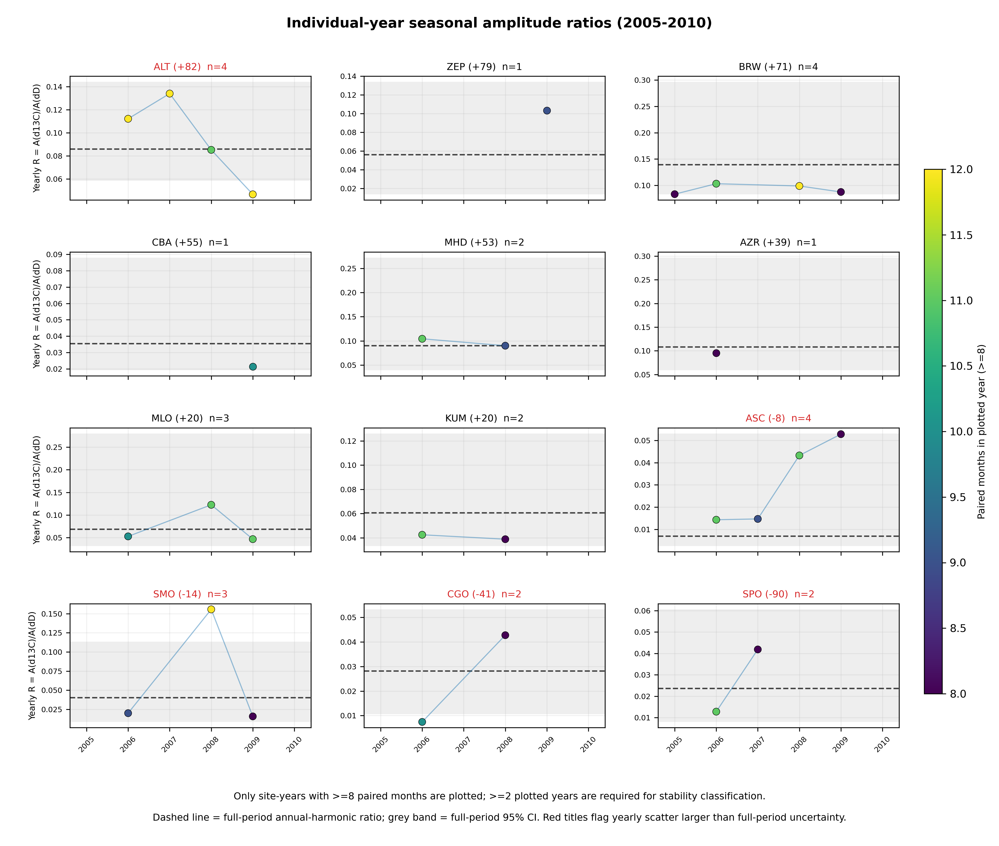

**Figure S4. Individual-year stability of amplitude ratios.** Site-by-site
yearly amplitude ratios are shown where enough paired months are available. A
"usable" site-year is defined as a calendar year with at least 8 paired monthly
means; years below this threshold are not plotted. At least two usable years
are required to classify a site-level yearly-stability diagnostic. Point color
shows the number of paired months in each plotted year, the dashed line is the
full-period annual-harmonic ratio, and the grey band is the full-period 95%
interval. The comparison highlights the sampling penalty of the short
2005-2010 overlap interval.

## S3. Wetland Emission Source Phasors

Wetland methane source phasors were constructed from Li et al. (2026) monthly
natural vegetated wetland methane emissions for 2000-2025. The main analysis
uses the 2005-2010 climatological annual harmonic in four source bands:
60-90 N, 30-60 N, 30 S-30 N, and 90-30 S.

**Table S2. Wetland emission-band climatology used for source phasors.**

| Band | Latitude range | Annual emissions | Peak season | Main manuscript role |
|---|---|---:|---|---|
| NH high | 60-90 N | `10.9 Tg yr-1` | Boreal summer | ALT, ZEP, BRW source phasor |
| NH mid | 30-60 N | `29.7 Tg yr-1` | Boreal summer | CBA, MHD source phasor |
| Tropics | 30 S-30 N | `114.0 Tg yr-1` | Weak annual cycle | KUM source phasor; SH sensitivity |
| SH extra | 90-30 S | `2.9 Tg yr-1` | Austral summer | CGO/SPO base source phasor |

These bands are emission phasors, not transport footprints. This distinction
is important for Southern Hemisphere interpretation: assigning CGO and SPO to
global wetland emissions would overcorrect their small observed isotope cycles.

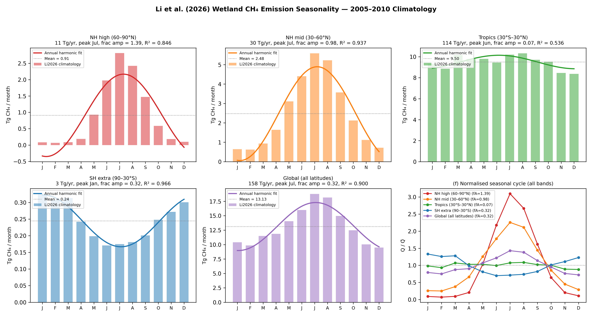

**Figure S5. Wetland emission seasonality by latitude band.** Monthly natural
vegetated wetland methane emissions from Li et al. (2026) are summarized by
the four latitude bands used for the phasor correction. The annual harmonic
fit to each band supplies the wetland source phasor amplitude and phase used
in the main analysis.

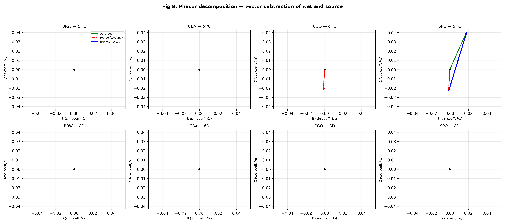

**Figure S6. Example wetland source phasor subtraction.** Polar phasor clocks
show observed, wetland-source, and corrected sink phasors for representative
sites. The northern examples illustrate why scalar amplitude subtraction is
not appropriate; the Southern Hemisphere examples show that local wetland
phasors are small relative to the observed isotope cycles.

## S4. Wetland Isotope Source Signatures

The base analysis uses `delta13C_wetland = -62 permil` with a `5 permil`
uncertainty. This is a global wetland/microbial prior supported by Ganesan et
al. (2018) and Riddell-Young et al. (2025). It should not be interpreted as a
site-specific wetland value.

`deltaD_wetland` is more spatially variable and is treated with site- or band-
specific values. The source-signature database uses Douglas et al. (2021)
relationships between freshwater methane `deltaD-CH4` and environmental water,
with OIPC v3.1 precipitation `delta2H` estimates as a predictor/cross-check.
For background sites where local precipitation is not a direct wetland source,
Douglas et al. zonal wetland values are preferred.


**Figure S7. Wetland `deltaD-CH4` source-signature alternatives.** The
`deltaD-CH4` source-signature database compares site or band values derived
from Douglas et al. (2021) relationships with OIPC v3.1 precipitation-isotope
estimates. These values are used as wetland source-signature inputs and
uncertainty bounds in the phasor correction.

## S5. Ganesan Spatial `delta13C_wetland` Sensitivity

The compact sensitivity replaces the uniform `delta13C_wetland = -62 permil`
base case with a banded Ganesan et al. (2018) source signature:

| Source influence | Base value | Banded sensitivity value |
|---|---:|---:|
| High-latitude/boreal wetland influence | `-62 permil` | about `-67.8 permil` |
| Tropical wetland influence | `-62 permil` | about `-56.7 permil` |
| Ambiguous/global influence | `-62 permil` | `-62 permil` |

The expected effect is largest at Northern Hemisphere sites where wetland
source phasors are largest. The main text keeps the uniform base case, and
the SI records how the inferred Southern Hemisphere `alpha13C_OH` responds
when regional wetland `delta13C` signatures are used.

The resulting corrected-ratio shifts are shown in Figure S8b. Replacing the
uniform value with the high-latitude/boreal value increases corrected ratios at
ALT, ZEP, BRW, CBA, and MHD by about `0.014-0.022`. Replacing the tropical
value at KUM decreases its corrected ratio by about `0.015`. CGO and SPO are
unchanged in this compact test because the ambiguous/local Southern Hemisphere
case retains the base `-62 permil` value. Thus the Ganesan-style spatial
`delta13C_wetland` sensitivity mainly amplifies the conclusion that northern
sites retain unresolved source structure; it does not alter the possibility of
using the method as a Southern Hemisphere KIE constraint.


**Figure S8. Banded wetland `delta13C-CH4` source-signature sensitivity.**
The base analysis uses a uniform `delta13C_wetland = -62 permil`. (a) The
sensitivity replaces that value with approximate high-latitude/boreal and
tropical wetland signatures based on the spatially resolved wetland
source-signature framework of Ganesan et al. (2018), while retaining the global
value where the source influence is ambiguous. (b) Change in each deterministic
site-level corrected ratio relative to the uniform-signature case,
`Delta R = R_banded - R_uniform`. Grey circles mark the uniform-case zero
baseline and blue squares mark the banded-signature result; the small vertical
offset is only for visibility. CGO and SPO retain the base Southern Hemisphere
signature, so both markers are present but their physical change is exactly
zero. Because this panel shows a change rather than an absolute corrected
ratio, the bulk-sink laboratory reference interval used in the absolute-ratio
figures is not applicable and is not plotted.

## S6. Sink Fraction And KIE Parameter Alignment

Riddell-Young et al. (2025) SI Table S3 provides a compact modern sink/KIE
parameter set. The analysis uses closely related values but does not copy that
table verbatim because it retains literature-specific sensitivity choices.
The sink fractions are a
normalized bookkeeping partition (`0.84 + 0.035 + 0.065 + 0.06 = 1`) within
published global ranges: tropospheric chlorine is a few percent of total
methane oxidation (Hossaini et al., 2016), while soil uptake remains both small
and substantially uncertain at the global scale (Dutaur and Verchot, 2007).
The non-OH isotope effects likewise retain values tied to the underlying
process studies. In particular, `alphaD_Cl = 1.508` is the direct 296 K
measurement of Saueressig et al. (1996), and the soil values lie within the
ecosystem-dependent measurements of King et al. (1989) and Snover and Quay
(2000). The stratospheric entries are effective apparent fractionation factors
used for the bulk sink, not elementary reaction KIEs; their approximate values
are motivated by stratospheric methane isotope observations and coupled
chemistry-transport interpretation (Rice et al., 2003; McCarthy et al., 2003).
The main manuscript reports the values actually used, while this section makes
their relationship to Riddell-Young et al. Table S3 explicit.

**Table S3. Base analysis sink/KIE values compared with Riddell-Young et al.
(2025) SI Table S3.**

| Sink term | Base analysis | Riddell-Young SI Table S3 | Interpretation |
|---|---:|---:|---|
| OH fraction | `0.84` | `0.835` | Rounded partition; dominant sink in both sets |
| Cl fraction | `0.035` | `0.035` | Same value; consistent with a minor global sink (Hossaini et al., 2016) |
| Stratospheric fraction | `0.065` | `0.06` | Adjusted with soil and OH so the four fractions close exactly to one |
| Soil fraction | `0.06` | `0.07` | Within the broad global soil-sink uncertainty (Dutaur and Verchot, 2007) |
| OH `alpha13C` | `1.0039` and `1.0054` | `1.0054` | Alternative laboratory hypotheses being tested, not an alignment parameter |
| OH `alphaD` | `1.294` | `1.294` | Aligned |
| Cl `alpha13C` | `1.066` | `1.066` | Aligned |
| Cl `alphaD` | `1.508` | `1.520` | Direct 296 K laboratory value from Saueressig et al. (1996) |
| Soil `alpha13C` | `1.022` | `1.020` | Process-study choice consistent with measured soil oxidation fractionation |
| Soil `alphaD` | `1.066` | `1.083` | Forest-soil endpoint from Snover and Quay (2000); low bulk leverage because the soil fraction is small |
| Stratospheric `alpha13C` | `1.013` | `1.003` | Effective apparent fractionation approximation informed by Rice et al. (2003) and McCarthy et al. (2003) |
| Stratospheric `alphaD` | `1.16` | `1.179` | Effective apparent fractionation approximation from the same stratospheric constraint |
| Net sink `alpha13C` | `1.0078-1.0090` | `1.0082` | Base-analysis range brackets Riddell-Young |
| Net sink `alphaD` | `1.2791` | `1.281` | Aligned |


## S7. Southern Hemisphere Source-Region Sensitivity

The main analysis assigns CGO and SPO to local Southern Hemisphere
extratropical wetland phasors. This is conservative because the local wetland
phasor is small and avoids imposing unconstrained delayed Northern Hemisphere
source influence.

The `nominal CGO and SPO phasor-corrected ratios` in this section are two
deterministic point estimates: all fitted harmonics, wetland phasors, isotope
signatures, sink fractions, and non-OH KIEs are held at their nominal values,
and the two site-level alpha estimates are then averaged. This calculation
gives about `1.0052` at zero imported response and is useful for reproducing
the sensitivity grid. The `Monte Carlo constraint shown in the main text` is a
different estimator. It samples the full input uncertainties, combines the
CGO and SPO corrected-ratio draws using inverse-variance site weights, and only
then applies the nonlinear ratio-to-`alpha13C_OH` conversion. Its median and
95% interval are `1.0046 [0.9969, 1.0158]`. Consequently, the deterministic
value need not equal the Monte Carlo median; the former is a controlled
source-region diagnostic, whereas the latter is the reported atmospheric
constraint.

We use one Southern Hemisphere source-region diagnostic: a mass-conserving
source-region response mixture. It mixes local
Southern Hemisphere, tropical, and delayed high-latitude Northern Hemisphere
wetland phasors with weights that sum to one:

```text
Z_source = w_SH Z_SH + w_Tropics Z_Tropics + w_NH Z_NH_high,delayed
w_SH + w_Tropics + w_NH = 1.
```

These are normalized effective annual-harmonic response weights, not literal
emission mass fractions or site footprints. The `2.8`-month Northern Hemisphere
phase delay is fixed before the grid is evaluated. It follows a first-order
interhemispheric transport filter, `H(omega) = 1 / (1 + i omega tau)`, for which
the annual-harmonic lag is
`12 atan(omega tau) / (2 pi)` months. Published interhemispheric exchange and
transit-time constraints place `tau` near `1.3-1.5` years (Geller et al., 1997;
Patra et al., 2011; Holzer and Waugh, 2015), corresponding to a lag of about
`2.77-2.80` months and strong attenuation of the imported annual harmonic. We
therefore use `2.8` months as a literature-constrained idealization rather than
a fitted site-specific travel time; the limited Northern Hemisphere weights
also acknowledge that real transport has a broad transit-time distribution.

The delayed high-latitude Northern Hemisphere weight is limited to `0.04`,
`0.06`, `0.08`, and `0.10`. The tropical weight spans `0.00-0.50`, and the
remaining weight is assigned to local Southern Hemisphere wetlands. Across the
24 mass-conserving scenarios, the mean inferred `alpha13C_OH` spans about
`0.9989-1.0062`; the corresponding mean corrected ratio spans about
`0.0126-0.0348`.

Two one-dimensional mass-conserving slices separate the tropical and delayed
high-latitude Northern Hemisphere effects. With tropical influence only, the
deterministic mean inferred `alpha13C_OH` changes from about `1.0052` at zero
tropical weight to a minimum of about `1.0028` near tropical weights
`0.20-0.30`, then increases to about `1.0071` at tropical weight `0.50`. With
delayed high-latitude Northern Hemisphere influence only, the deterministic
mean inferred `alpha13C_OH` increases from about `1.0052` to `1.0061` across
weights `0.00-0.10`.

The combined grid is not expected to be monotonic everywhere. The corrected
ratio is calculated from vector magnitudes after subtracting isotope-specific
source phasors, not from a scalar mixture of ratios. At fixed tropical weight,
increasing the delayed high-latitude Northern Hemisphere weight simultaneously
reduces the local Southern Hemisphere weight; this can rotate the corrected
`delta13C` and `deltaD` sink phasors differently and produce local minima or
maxima in `A(delta13C)_sink / A(deltaD)_sink`.

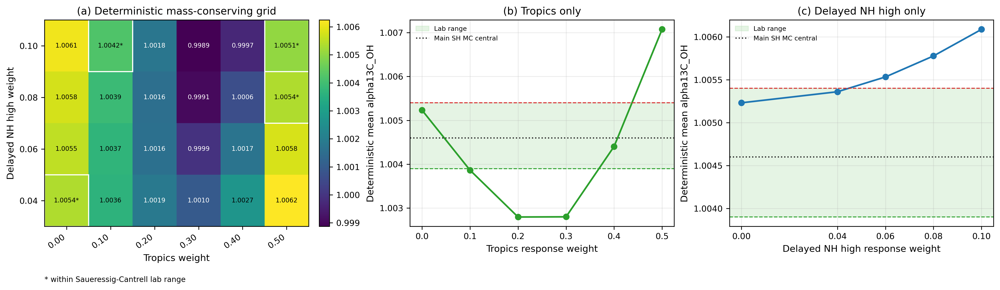

**Figure S9. Southern Hemisphere source-region sensitivity.** CGO/SPO
wetland source phasors are tested with deterministic mass-conserving
source-region mixtures. (a) Combined grid of mean inferred `alpha13C_OH`
values, with delayed high-latitude Northern Hemisphere and tropical response
weights varied and the remaining weight assigned to local Southern Hemisphere
wetlands. Asterisks mark cells that fall within the Saueressig-Cantrell
laboratory range. (b) Tropical response only, with the remaining weight
assigned to local Southern Hemisphere wetlands. (c) Delayed high-latitude
Northern Hemisphere response only, with the remaining weight assigned to local
Southern Hemisphere wetlands. The dotted black line in panels (b) and (c)
marks the preferred main-text Southern Hemisphere Monte Carlo central estimate.

## S8. Biomass Burning Sensitivity

Biomass burning has an isotopically enriched `delta13C-CH4` signature and a
seasonal cycle that can alter northern isotope phasors. It is therefore
important for diagnosing residual Northern Hemisphere structure. Unlike the
comparatively repeatable wetland annual cycle used in the main correction,
open-fire emissions are episodic, spatially localized, and strongly dependent
on the particular drought, biome, ignition, and fire year. GFED4s, for example,
finds global fire carbon emissions ranging from `1.8` to `3.0 Pg C yr-1` over
1997-2016 (van der Werf et al., 2017), illustrating the large interannual
variability behind any climatological seasonal phasor. In addition, the global
methane budget places biomass burning together with biofuel at only about
`30 [26-40] Tg CH4 yr-1` for 2008-2017, with biofuel contributing roughly
`30-50%` of that combined category (Saunois et al., 2020). Open fires are thus
a relatively small global methane source, and their event-dependent regional
timing does not support one stable global phase correction.

For those reasons, biomass burning is not included as a required component of
the main Southern Hemisphere inversion: adding a fixed annual fire phasor
would imply more temporal regularity than the source possesses, while the CGO
and SPO result does not require it. We instead retain biomass burning as a
supplementary northern-residual sensitivity. A future extension should couple
event-resolved regional fire emissions and isotope signatures to transport,
rather than assume a universal seasonal cycle.

The following diagnostics show:

1. Biomass burning source phasor seasonality by source band.
2. Wetland-only versus wetland-plus-biomass-burning corrected ratios.
3. Whether the Southern Hemisphere alpha estimate changes materially.
4. Why biomass burning remains a secondary main-text issue but an important
   northern residual diagnostic.

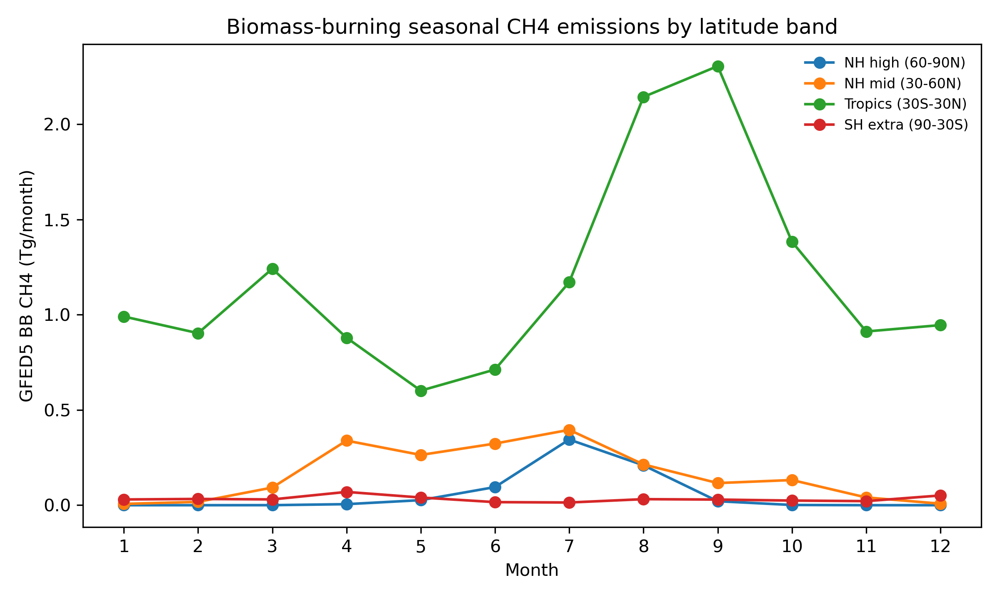

**Figure S10. Biomass-burning seasonality by source band.** Biomass-burning
seasonality is summarized by source band to diagnose how enriched combustion
signatures could affect isotope phasors, especially at Northern Hemisphere
sites.

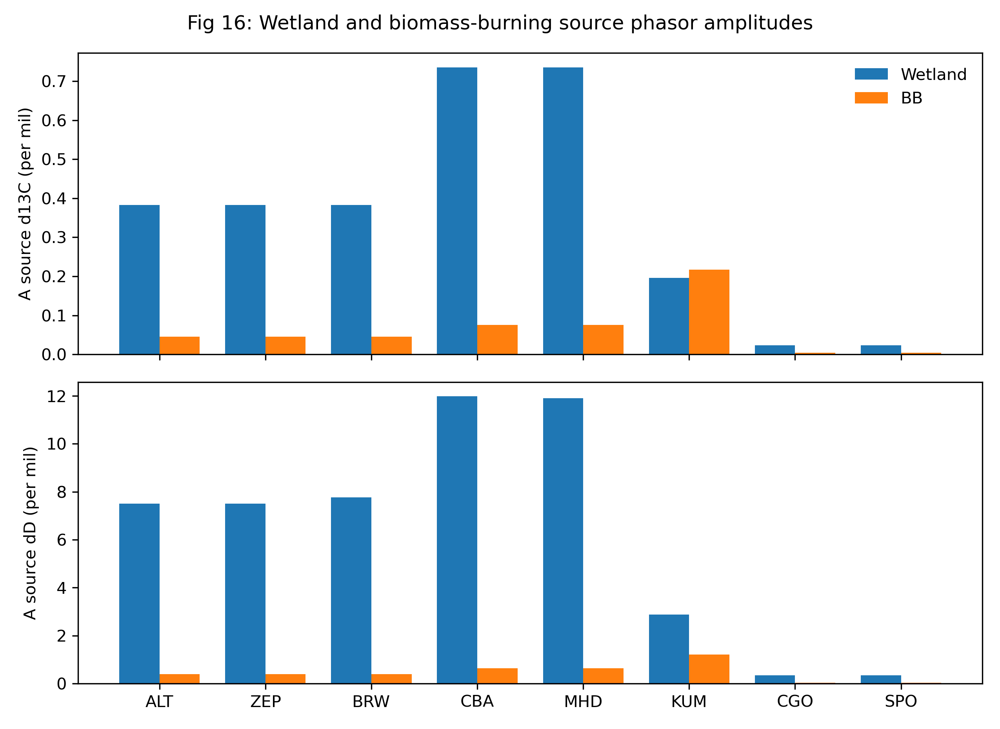

**Figure S11. Biomass-burning source phasors.** Biomass-burning source
phasors are compared with wetland source phasors in the same annual-harmonic
framework. This provides the geometric basis for treating biomass burning as a
supplementary correction rather than a main-text driver of the SH constraint.

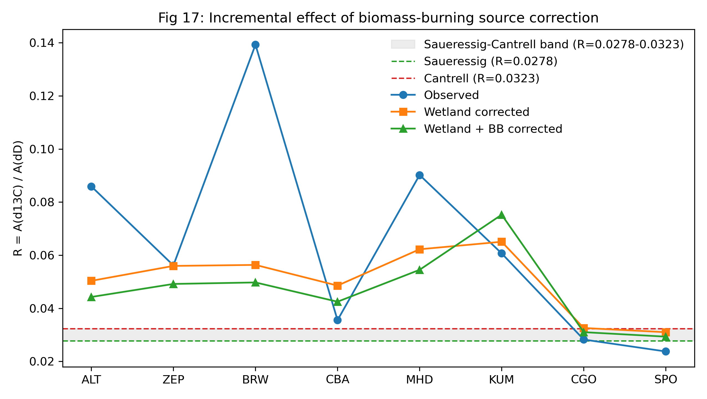

**Figure S12. Wetland-only versus wetland-plus-biomass-burning correction.**
Corrected amplitude ratios are compared before and after the biomass-burning
phasor adjustment. The figure diagnoses northern residual structure while
showing why biomass burning is not emphasized in the main Southern Hemisphere
constraint. The green band is the same bulk-sink laboratory reference range
used in the main ratio figures, not the OH-only ratio range.

## S9. OSSE And Scalar-Amplitude Bias

Synthetic monthly OSSE tests show that a scalar amplitude-ratio method can be
unbiased in a pure-OH seasonal cycle but biased when a seasonal source phasor
is added. In the wetland-contaminated OSSE with true
`alpha13C_OH = 1.0039`, the raw amplitude ratio retrieves an apparent
`alpha13C_OH` of about `1.0086`, illustrating how source phasors can mimic a
larger OH 13C KIE. This motivates the phasor formulation used in the main
analysis.


**Figure S13. OSSE recovery of `alpha13C_OH`.** Synthetic seasonal cycles are
used to compare scalar amplitude-ratio retrievals against known input alpha
values. Blue points are the prescribed input values, and orange squares are
the values retrieved from the scalar ratio `A(delta13C) / A(deltaD)`. The
source-contaminated case recovers a spuriously high apparent `alpha13C_OH`,
motivating the vector phasor correction used in the manuscript. This figure is
a method diagnostic, not an additional atmospheric KIE constraint.

## S10. Uncertainty Attribution

We attribute the Southern Hemisphere `alpha13C_OH` uncertainty by decomposing
the actual Phase-6 Monte Carlo: each uncertainty group is toggled on while the
others are frozen at their central values, the full phasor correction and alpha
inversion are re-run (120,000 draws), and the variance of the resulting alpha
samples is that group's isolated contribution. Because the groups are close to
independent, the isolated variances sum to the all-groups-on total to within
about half a percent, so the fractions below are a genuine variance budget.

| Source group | Fraction of Var(`alpha13C_OH`) |
|---|---:|
| `delta13C` amplitude | `0.418` |
| `deltaD` amplitude | `0.397` |
| Sink -> alpha (`fOH`, `alphaD_OH`, non-OH KIEs) | `0.074` |
| `delta13C` phase | `0.059` |
| Wetland `delta13C` signature | `0.045` |
| Wetland flux phasor | `0.005` |
| `deltaD` phase | `0.002` |
| Wetland `deltaD` signature | `0.000` |

Rolled up to input families, the observed seasonal harmonics account for about
`88%` of the variance (almost entirely the fitted `delta13C` and `deltaD`
amplitudes), the sink-to-alpha conversion about `7%`, and the entire wetland
source correction only about `5%`. The wetland `deltaD` source signature is
negligible despite its large source-atmosphere isotopic gap, because the local
Southern Hemisphere wetland flux phasor is very small, so that signature's
uncertainty does not propagate to alpha. The single most valuable future
improvement is therefore reducing the amplitude-fit uncertainty of the
co-located isotope seasonal cycles through longer or denser paired records;
wetland-model refinements matter mainly at Northern Hemisphere sites.

This variance budget supersedes an earlier prioritization diagnostic that
assumed per-group perturbation scales; that diagnostic overstated the wetland
contribution and understated the observational contribution.

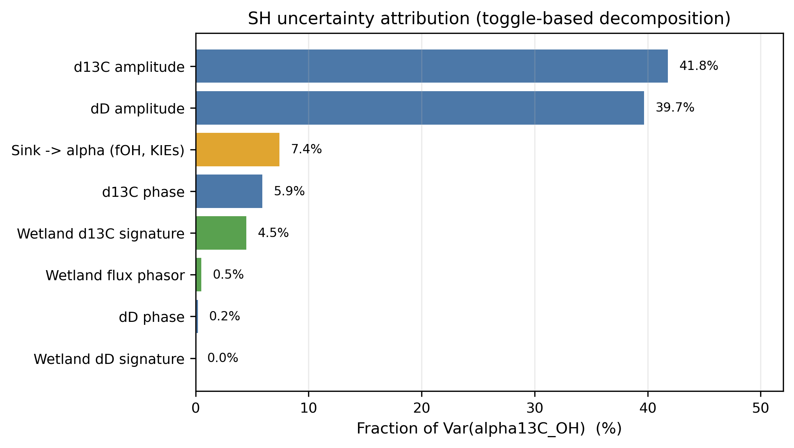

**Figure S14. Uncertainty attribution.** Isolated variance contribution of each
input group to the Southern Hemisphere `alpha13C_OH` constraint, from the
toggle-based decomposition of the Phase-6 Monte Carlo, as a percentage of
Var(`alpha13C_OH`). Bars are colored by input family (observation, sink,
wetland). The observed `delta13C` and `deltaD` seasonal amplitudes dominate;
the wetland source correction is a minor term for the Southern Hemisphere
sites.

## S11. Supplementary Figure List

**Figure S1.** Paired monthly data coverage by site.

**Figure S2.** Folded seasonal cycles used for annual harmonic fitting.

**Figure S3.** Seasonal-amplitude estimator sensitivity.

**Figure S4.** Individual-year stability of amplitude ratios.

**Figure S5.** Wetland emission seasonality by latitude band.

**Figure S6.** Example wetland source phasor subtraction.

**Figure S7.** Wetland `deltaD-CH4` source-signature alternatives.

**Figure S8.** Banded wetland `delta13C-CH4` source-signature sensitivity.

**Figure S9.** Southern Hemisphere mass-conserving source-region sensitivity.

**Figure S10.** Biomass-burning seasonality by source band.

**Figure S11.** Biomass-burning source phasors.

**Figure S12.** Wetland-only versus wetland-plus-biomass-burning correction.

**Figure S13.** OSSE recovery of `alpha13C_OH`.

**Figure S14.** Grouped uncertainty attribution.
