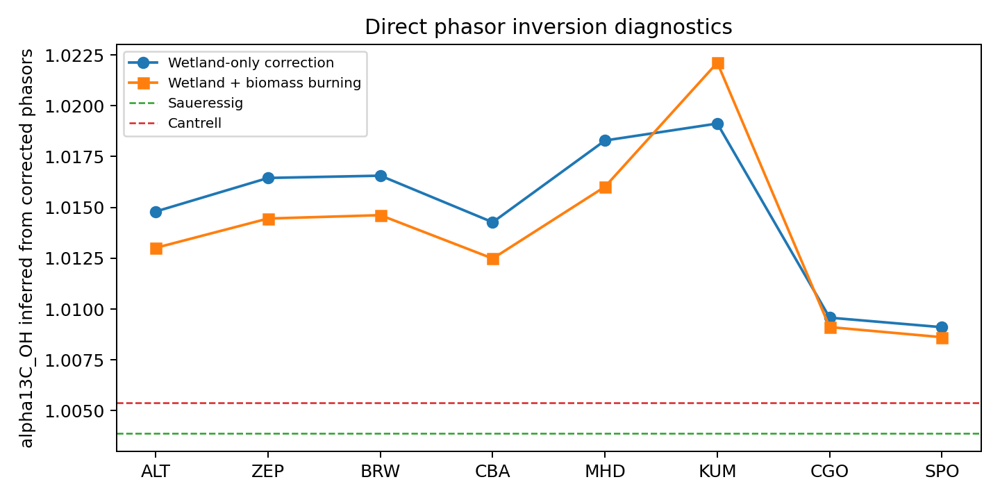

# Supplementary Information Draft

## Title

Supplementary Information for "Seasonal Methane Isotope Phasors Constrain the
Methane OH 13C Kinetic Isotope Effect"

## SI Scope

This supplementary draft documents data screening, sensitivity experiments, and
diagnostic analyses that support the main manuscript without overloading the
main text. The main manuscript retains the Southern Hemisphere
phasor-corrected KIE constraint as the central result. Northern Hemisphere
residuals, biomass burning, Ganesan spatial wetland source signatures, and
transport-lag sensitivities are treated here as robustness and diagnostic
material.

## S1. Atmospheric Data Pairing And Site Screening

We began from 12 sites with co-located atmospheric `delta13C-CH4` and
`deltaD-CH4` observations. `CH4` mole fractions were taken from the NOAA GML
surface-flask product of Lan et al. (2025), `delta13C-CH4` from the
NOAA/INSTAAR product of Michel et al. (2023), and `deltaD-CH4` from the
multi-laboratory data set analyzed by Riddell-Young et al. (2025). The
`deltaD-CH4` observations were harmonized following the laboratory-offset
framework described by Riddell-Young et al. (2025), Umezawa et al. (2018), and
Dasgupta et al. (2025).

**Table S1. Candidate site coverage.**

| Site | Latitude | Paired monthly means | Overlap years | Use in main analysis |
|---|---:|---:|---:|---|
| ALT | `82.45` | `52` | `4.7` | Clean site |
| ZEP | `78.91` | `16` | `1.4` | Clean site |
| BRW | `71.32` | `41` | `5.0` | Clean site |
| CBA | `55.21` | `14` | `1.4` | Clean site |
| MHD | `53.33` | `31` | `4.4` | Clean site |
| AZR | `38.77` | `28` | `4.7` | Excluded/diagnostic |
| MLO | `19.54` | `46` | `4.6` | Excluded/diagnostic |
| KUM | `19.56` | `36` | `4.7` | Clean site |
| ASC | `-7.97` | `46` | `4.9` | Excluded/diagnostic |
| SMO | `-14.25` | `36` | `4.4` | Excluded/diagnostic |
| CGO | `-40.68` | `29` | `4.1` | Clean site, SH constraint |
| SPO | `-89.98` | `33` | `4.6` | Clean site, SH constraint |

The clean set used for the primary phasor analysis is ALT, ZEP, BRW, CBA, MHD,
KUM, CGO, and SPO. The Southern Hemisphere KIE constraint is based on CGO and
SPO because the wetland source correction is smallest there and because their
corrected seasonal phases are consistent with an austral-summer sink maximum.


**Figure S1. Paired monthly data coverage by site.** Green cells mark months
with co-located `delta13C-CH4` and `deltaD-CH4` observations after monthly
pairing. Site ordering follows latitude from north to south. The figure
documents the coverage limitations behind the harmonic fits and the emphasis
on CGO and SPO for the Southern Hemisphere constraint. Data sources are Lan et
al. (2025), Michel et al. (2023), and the Riddell-Young et al. (2025)
`deltaD-CH4` archive.

## S2. Harmonic Fits And Robustness To Seasonal Model Choice

The base analysis fits an annual harmonic plus a linear trend to paired monthly
means:

```text
y(t) = c0 + c1 (t - tref) + B sin(2 pi t) + C cos(2 pi t).
```

The harmonic coefficients are stored as `Z = B + iC`. The base manuscript uses
the annual harmonic because it is the minimal model that preserves seasonal
amplitude and phase and is stable for the short 2005-2010 paired isotope
interval. Figure S3 compares four ways of estimating the same seasonal
amplitude ratio: the base annual harmonic, the annual component of an
annual-plus-semiannual fit, a monthly fixed-effect half peak-to-trough
amplitude, and leave-one-year-out annual fits. These tests show that some sites
are stable under model choice, whereas sparse or low-amplitude sites can have
larger year-to-year scatter than the nominal full-period bootstrap interval.

The four estimates in Figure S3 use the same paired monthly isotope data but
process the seasonal cycle differently. The annual harmonic first removes a
linear trend and then fits one annual sine-cosine pair; this is the main
analysis because it gives both amplitude and phase with few parameters. The
annual-plus-semiannual fit adds a second harmonic to absorb twice-per-year
structure, and Figure S3 plots only the annual component from that fit. The
monthly fixed-effect estimate first averages the detrended observations by
calendar month and then uses half of the peak-to-trough range as the amplitude,
so it is less model-based but more sensitive to sparse monthly coverage.
Finally, the leave-one-year-out estimate repeats the annual-harmonic fit after
removing one calendar year at a time; its vertical range shows how much the
ratio changes when any single year is omitted.

The main implication is conservative: the Southern Hemisphere constraint is
useful but should not be overinterpreted as excluding either laboratory
`alpha13C_OH` value. Northern Hemisphere multi-site estimates should be
reported as diagnostic because they remain sensitive to residual source
structure and model choice.


**Figure S2. Folded seasonal cycles used for annual harmonic fitting.**
Monthly anomalies of `delta13C-CH4`, `deltaD-CH4`, and `CH4` are folded by
calendar month and shown with annual harmonic fits. The figure is a diagnostic
view of the paired observations used to estimate seasonal amplitudes and
phases.


**Figure S3. Harmonic-model sensitivity.** Annual-only, annual-plus-semiannual,
monthly fixed-effect, and leave-one-year-out estimates are compared for the
clean-site set. Points show the ratio `R = A(delta13C)/A(deltaD)`. For the
leave-one-year-out diagnostic, diamonds show the median ratio and vertical bars
span the minimum-to-maximum range obtained by excluding one calendar year at a
time. This diagnostic supports the choice of a minimal annual phasor model for
the main analysis while identifying sites where sparse coverage or low
amplitude increases sensitivity to model choice.


**Figure S4. Individual-year stability of amplitude ratios.** Site-by-site
yearly amplitude ratios are shown where enough paired months are available. A
"usable" site-year is defined as a calendar year with at least 8 paired monthly
means; years below this threshold are not plotted. At least two usable years
are required to classify a site-level yearly-stability diagnostic. Point color
shows the number of paired months in each plotted year, the dashed line is the
full-period annual-harmonic ratio, and the grey band is the full-period 95%
interval. The comparison highlights the sampling penalty of the short
2005-2010 overlap interval.

## S3. Wetland Emission Source Phasors

Wetland methane source phasors were constructed from Li et al. (2026) monthly
natural vegetated wetland methane emissions for 2000-2025. The main analysis
uses the 2005-2010 climatological annual harmonic in four source bands:
60-90 N, 30-60 N, 30 S-30 N, and 90-30 S.

**Table S2. Wetland emission-band climatology used for source phasors.**

| Band | Latitude range | Annual emissions | Peak season | Main manuscript role |
|---|---|---:|---|---|
| NH high | 60-90 N | `10.9 Tg yr-1` | Boreal summer | ALT, ZEP, BRW source phasor |
| NH mid | 30-60 N | `29.7 Tg yr-1` | Boreal summer | CBA, MHD source phasor |
| Tropics | 30 S-30 N | `114.0 Tg yr-1` | Weak annual cycle | KUM source phasor; SH sensitivity |
| SH extra | 90-30 S | `2.9 Tg yr-1` | Austral summer | CGO/SPO base source phasor |

These bands are emission phasors, not transport footprints. This distinction
is important for Southern Hemisphere interpretation: assigning CGO and SPO to
global wetland emissions would overcorrect their small observed isotope cycles.


**Figure S5. Wetland emission seasonality by latitude band.** Monthly natural
vegetated wetland methane emissions from Li et al. (2026) are summarized by
the four latitude bands used for the phasor correction. The annual harmonic
fit to each band supplies the wetland source phasor amplitude and phase used
in the main analysis.


**Figure S6. Example wetland source phasor subtraction.** Polar phasor clocks
show observed, wetland-source, and corrected sink phasors for representative
sites. The northern examples illustrate why scalar amplitude subtraction is
not appropriate; the Southern Hemisphere examples show that local wetland
phasors are small relative to the observed isotope cycles.

## S4. Wetland Isotope Source Signatures

The base analysis uses `delta13C_wetland = -62 permil` with a `5 permil`
uncertainty. This is a global wetland/microbial prior supported by Ganesan et
al. (2018) and Riddell-Young et al. (2025). It should not be interpreted as a
site-specific wetland value.

`deltaD_wetland` is more spatially variable and is treated with site- or band-
specific values. The source-signature database uses Douglas et al. (2021)
relationships between freshwater methane `deltaD-CH4` and environmental water,
with OIPC v3.1 precipitation `delta2H` estimates as a predictor/cross-check.
For background sites where local precipitation is not a direct wetland source,
Douglas et al. zonal wetland values are preferred.


**Figure S7. Wetland `deltaD-CH4` source-signature alternatives.** The
`deltaD-CH4` source-signature database compares site or band values derived
from Douglas et al. (2021) relationships with OIPC v3.1 precipitation-isotope
estimates. These values are used as wetland source-signature inputs and
uncertainty bounds in the phasor correction.

## S5. Ganesan Spatial `delta13C_wetland` Sensitivity

The compact sensitivity replaces the uniform `delta13C_wetland = -62 permil`
base case with a banded Ganesan et al. (2018) source signature:

| Source influence | Base value | Banded sensitivity value |
|---|---:|---:|
| High-latitude/boreal wetland influence | `-62 permil` | about `-67.8 permil` |
| Tropical wetland influence | `-62 permil` | about `-56.7 permil` |
| Ambiguous/global influence | `-62 permil` | `-62 permil` |

The expected effect is largest at Northern Hemisphere sites where wetland
source phasors are largest. The main text keeps the uniform base case, and
the SI records how the inferred Southern Hemisphere `alpha13C_OH` responds
when regional wetland `delta13C` signatures are used.

The resulting corrected-ratio shifts are shown in Figure S8b. Replacing the
uniform value with the high-latitude/boreal value increases corrected ratios at
ALT, ZEP, BRW, CBA, and MHD by about `0.014-0.022`. Replacing the tropical
value at KUM decreases its corrected ratio by about `0.015`. CGO and SPO are
unchanged in this compact test because the ambiguous/local Southern Hemisphere
case retains the base `-62 permil` value. Thus the Ganesan-style spatial
`delta13C_wetland` sensitivity mainly amplifies the conclusion that northern
sites retain unresolved source structure; it does not alter the preferred
Southern Hemisphere KIE constraint.


**Figure S8. Banded wetland `delta13C-CH4` source-signature sensitivity.**
The base analysis uses a uniform `delta13C_wetland = -62 permil`. (a) The
sensitivity replaces that value with approximate high-latitude/boreal and
tropical wetland signatures based on the spatially resolved wetland
source-signature framework of Ganesan et al. (2018), while retaining the global
value where the source influence is ambiguous. (b) Resulting site-level
corrected ratios for the uniform and banded source-signature cases. Line
segments show the direction and magnitude of the correction change.

## S6. Sink Fraction And KIE Parameter Alignment

Riddell-Young et al. (2025) SI Table S3 provides a compact modern sink/KIE
parameter set. The analysis uses closely related values. The main
manuscript reports the values actually used in the analysis, while this SI
section compares them against Riddell-Young et al. Table S3.

**Table S3. Base analysis sink/KIE values compared with Riddell-Young et al.
(2025) SI Table S3.**

| Sink term | Base analysis | Riddell-Young SI Table S3 | Interpretation |
|---|---:|---:|---|
| OH fraction | `0.84` | `0.835` | Aligned within rounding |
| Cl fraction | `0.035` | `0.035` | Aligned |
| Stratospheric fraction | `0.065` | `0.06` | Close; base analysis uses closure |
| Soil fraction | `0.06` | `0.07` | Close; include as sensitivity if rerun |
| OH `alpha13C` | `1.0039` and `1.0054` | `1.0054` | Main uncertainty of interest |
| OH `alphaD` | `1.294` | `1.294` | Aligned |
| Cl `alpha13C` | `1.066` | `1.066` | Aligned |
| Cl `alphaD` | `1.508` | `1.520` | Close |
| Soil `alpha13C` | `1.022` | `1.020` | Close |
| Soil `alphaD` | `1.066` | `1.083` | Difference is minor in bulk because soil fraction is small |
| Stratospheric `alpha13C` | `1.013` | `1.003` | Difference is minor in bulk but should be stated |
| Stratospheric `alphaD` | `1.16` | `1.179` | Close |
| Net sink `alpha13C` | `1.0078-1.0090` | `1.0082` | Base-analysis range brackets Riddell-Young |
| Net sink `alphaD` | `1.2791` | `1.281` | Aligned |

If the manuscript changes base sink/KIE values to match Riddell-Young Table S3
exactly, the relevant analyses must be rerun before submission.

## S7. Southern Hemisphere Source-Region Sensitivity

The main analysis assigns CGO and SPO to local Southern Hemisphere
extratropical wetland phasors. This is conservative because the local wetland
phasor is small and avoids imposing unconstrained delayed Northern Hemisphere
source influence.

The sensitivity values in this section are deterministic source-region
comparisons based on nominal phasor subtraction. The main-text atmospheric
constraint instead combines the CGO and SPO corrected-ratio Monte Carlo samples
before converting to `alpha13C_OH`, giving `1.0046 [0.9969, 1.0158]`. The
nominal phasor values are therefore interpreted as diagnostic/reproducibility
quantities rather than as the reported central KIE estimate.
This distinction explains why the zero-imported-response point in Figure S9
is about `1.0052`, close to the Cantrell et al. (1990) value: it is the simple
deterministic mean of the nominal CGO and SPO phasor-corrected ratios. It is
not the preferred Southern Hemisphere Monte Carlo constraint shown in the main
text.

We therefore run two distinct Southern Hemisphere source-region diagnostics.
The first is a mass-conserving source-region response mixture. It mixes local
Southern Hemisphere, tropical, and delayed high-latitude Northern Hemisphere
wetland phasors with weights that sum to one:

```text
Z_source = w_SH Z_SH + w_Tropics Z_Tropics + w_NH Z_NH_high,delayed
w_SH + w_Tropics + w_NH = 1.
```

The delayed high-latitude Northern Hemisphere weight is limited to `0.04`,
`0.06`, `0.08`, and `0.10`. The tropical weight spans `0.00-0.50`, and the
remaining weight is assigned to local Southern Hemisphere wetlands. Across the
24 mass-conserving scenarios, the mean inferred `alpha13C_OH` spans about
`0.9989-1.0062`; the corresponding mean corrected ratio spans about
`0.0126-0.0348`.

Two one-dimensional mass-conserving slices separate the tropical and delayed
high-latitude Northern Hemisphere effects. With tropical influence only, the
deterministic mean inferred `alpha13C_OH` changes from about `1.0052` at zero
tropical weight to a minimum of about `1.0028` near tropical weights
`0.20-0.30`, then increases to about `1.0071` at tropical weight `0.50`. With
delayed high-latitude Northern Hemisphere influence only, the deterministic
mean inferred `alpha13C_OH` increases from about `1.0052` to `1.0061` across
weights `0.00-0.10`.

The combined grid is not expected to be monotonic everywhere. The corrected
ratio is calculated from vector magnitudes after subtracting isotope-specific
source phasors, not from a scalar mixture of ratios. At fixed tropical weight,
increasing the delayed high-latitude Northern Hemisphere weight simultaneously
reduces the local Southern Hemisphere weight; this can rotate the corrected
`delta13C` and `deltaD` sink phasors differently and produce local minima or
maxima in `A(delta13C)_sink / A(deltaD)_sink`.

The second diagnostic is the older additive transport stress test. These
scenarios are not mass-conserving source mixtures; their scaling factors are
effective transported annual-harmonic response coefficients. They are retained
only as upper-bound structural tests:

| Scenario group | Mean inferred `alpha13C_OH` | Interpretation |
|---|---:|---|
| SH-only baseline | about `1.0052` in deterministic sensitivity | Matches the main source assignment, but is not the MC central estimate |
| Tropics low to high | about `1.0029-1.0060` | Tropical influence is modest |
| NH low to high delayed | about `1.0071-1.0140` | Delayed NH influence can be large but is an additive stress test |
| Full low to high | about `1.0055-1.0158` | Combined additive envelope; not a mass-conserving correction |

The main text uses the mass-conserving grid for the primary sensitivity
statement. The additive delayed Northern Hemisphere scenarios are retained as
non-plotted stress-test diagnostics to show how large the inferred shift could
be if a delayed Northern Hemisphere annual harmonic were imposed without
enforcing source-region weights that sum to one.


**Figure S9. Southern Hemisphere source-region sensitivity.** CGO/SPO
wetland source phasors are tested with deterministic mass-conserving
source-region mixtures. (a) Combined grid of mean inferred `alpha13C_OH`
values, with delayed high-latitude Northern Hemisphere and tropical response
weights varied and the remaining weight assigned to local Southern Hemisphere
wetlands. Asterisks mark cells that fall within the Saueressig-Cantrell
laboratory range. (b) Tropical response only, with the remaining weight
assigned to local Southern Hemisphere wetlands. (c) Delayed high-latitude
Northern Hemisphere response only, with the remaining weight assigned to local
Southern Hemisphere wetlands. The dotted black line in panels (b) and (c)
marks the preferred main-text Southern Hemisphere Monte Carlo central estimate.

## S8. Biomass Burning Sensitivity

Biomass burning has an isotopically enriched `delta13C-CH4` signature and a
seasonal cycle that can alter northern isotope phasors. It is therefore
important for diagnosing residual Northern Hemisphere structure. However, the
main Southern Hemisphere KIE constraint does not require biomass burning to
explain the result, and the uncertainty attribution assigns biomass burning a
smaller diagnostic contribution than observations, wetland phasors, wetland
isotope signatures, sink fractions, and `alphaD_OH`.

The following diagnostics show:

1. Biomass burning source phasor seasonality by source band.
2. Wetland-only versus wetland-plus-biomass-burning corrected ratios.
3. Whether the Southern Hemisphere alpha estimate changes materially.
4. Why biomass burning remains a secondary main-text issue but an important
   northern residual diagnostic.


**Figure S10. Biomass-burning seasonality by source band.** Biomass-burning
seasonality is summarized by source band to diagnose how enriched combustion
signatures could affect isotope phasors, especially at Northern Hemisphere
sites.


**Figure S11. Biomass-burning source phasors.** Biomass-burning source
phasors are compared with wetland source phasors in the same annual-harmonic
framework. This provides the geometric basis for treating biomass burning as a
supplementary correction rather than a main-text driver of the SH constraint.


**Figure S12. Wetland-only versus wetland-plus-biomass-burning correction.**
Corrected amplitude ratios are compared before and after the biomass-burning
phasor adjustment. The figure diagnoses northern residual structure while
showing why biomass burning is not emphasized in the main Southern Hemisphere
constraint. The green band is the same bulk-sink laboratory reference range
used in the main ratio figures, not the OH-only ratio range.

## S9. OSSE And Scalar-Amplitude Bias

Synthetic monthly OSSE tests show that a scalar amplitude-ratio method can be
unbiased in a pure-OH seasonal cycle but biased when a seasonal source phasor
is added. In the wetland-contaminated OSSE with true
`alpha13C_OH = 1.0039`, the raw amplitude ratio retrieves an apparent
`alpha13C_OH` of about `1.0086`, illustrating how source phasors can mimic a
larger OH 13C KIE. This motivates the phasor formulation used in the main
analysis.


**Figure S13. OSSE recovery of `alpha13C_OH`.** Synthetic seasonal cycles are
used to compare scalar amplitude-ratio retrievals against known input alpha
values. Blue points are the prescribed input values, and orange squares are
the values retrieved from the scalar ratio `A(delta13C) / A(deltaD)`. The
source-contaminated case recovers a spuriously high apparent `alpha13C_OH`,
motivating the vector phasor correction used in the manuscript. This figure is
a method diagnostic, not an additional atmospheric KIE constraint.



**Figure S14. Phasor inversion diagnostics.** Direct phasor-inversion
diagnostics show how site-level corrected isotope phasors translate into
apparent alpha values and where sparse or source-contaminated sites become
unstable.

## S10. Uncertainty Attribution

One-at-a-time diagnostic uncertainty attribution ranks uncertainty sources as:

| Source group | Fraction of diagnostic variance |
|---|---:|
| Observation/harmonic uncertainty | `0.39` |
| Wetland phasor uncertainty | `0.21` |
| Wetland isotope source signatures | `0.14` |
| Sink fractions | `0.09` |
| `alphaD_OH` | `0.08` |
| Biomass burning correction | `0.05` |
| Non-OH KIEs | `0.03` |

These fractions are diagnostic and should not replace the full Monte Carlo
intervals reported in the main text. They identify the most valuable future
improvements: longer paired isotope records, better wetland phasors, and
better wetland isotope source signatures.


**Figure S15. Grouped uncertainty attribution.** One-at-a-time grouped
uncertainty perturbations rank the dominant contributors to alpha uncertainty.
Observation and harmonic-fit uncertainty is largest, followed by wetland
phasor and wetland isotope-source uncertainty.

## S11. Supplementary Figure List

**Figure S1.** Paired monthly data coverage by site.

**Figure S2.** Folded seasonal cycles used for annual harmonic fitting.

**Figure S3.** Harmonic-model sensitivity.

**Figure S4.** Individual-year stability of amplitude ratios.

**Figure S5.** Wetland emission seasonality by latitude band.

**Figure S6.** Example wetland source phasor subtraction.

**Figure S7.** Wetland `deltaD-CH4` source-signature alternatives.

**Figure S8.** Banded wetland `delta13C-CH4` source-signature sensitivity.

**Figure S9.** Southern Hemisphere mass-conserving source-region sensitivity.

**Figure S10.** Biomass-burning seasonality by source band.

**Figure S11.** Biomass-burning source phasors.

**Figure S12.** Wetland-only versus wetland-plus-biomass-burning correction.

**Figure S13.** OSSE recovery of `alpha13C_OH`.

**Figure S14.** Phasor inversion diagnostics.

**Figure S15.** Grouped uncertainty attribution.
