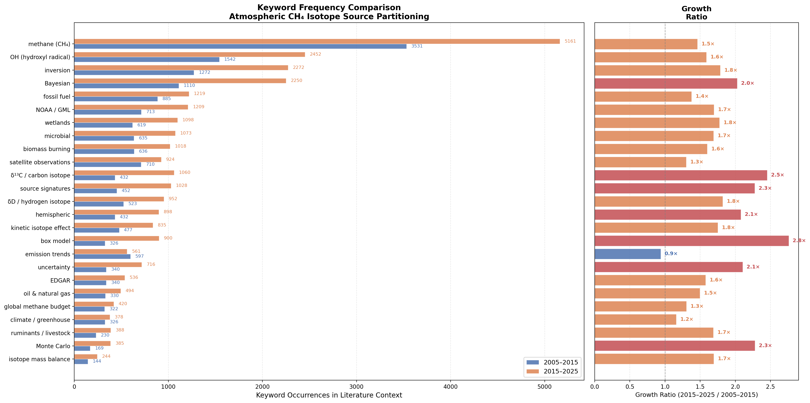

# Keyword Analysis: Atmospheric Methane Isotope Source Partitioning

## Field Summary

This repository covers **Atmospheric Methane Isotope Geochemistry & Source Partitioning** — a field that uses stable isotope measurements (δ¹³C-CH₄ and δD-CH₄) to decompose global methane emissions into fossil fuel (FF), microbial (Mic), and biomass burning (BB) components via isotope mass-balance models.

## Methodology

- Scanned 148 markdown files across the repository
- Extracted 29 field-specific keywords covering: core measurements, emission sources, atmospheric sinks, analytical methods, datasets, and policy context
- Classified paragraphs into two periods (2005–2015 vs 2015–2025) based on citation years in context
- Counted keyword occurrences per era and computed growth ratios

## Key Findings

### Top Growing Keywords (2015–2025 vs 2005–2015)
| Keyword | Growth Ratio | Interpretation |
|---------|:-----------:|----------------|
| box model | 2.8× | Proliferation of multi-box (1/2/3-box) isotope frameworks |
| δ¹³C / carbon isotope | 2.5× | Expanded observational networks (INSTAAR/NOAA) |
| Monte Carlo | 2.3× | Shift toward uncertainty-quantified results |
| source signatures | 2.3× | Recognized as the binding constraint on attribution |
| source partitioning | 2.2× | More explicit focus on FF/Mic/BB decomposition |
| hemispheric | 2.1× | New focus on NH/SH divergence (not just global) |
| uncertainty | 2.1× | Growing emphasis on variance decomposition & error budgets |
| Bayesian | 2.0× | Formal inverse methods replacing simple forward models |

### Persistent Core Keywords (both periods)
- methane (CH₄): 3,531 → 5,161 (1.5×)
- fossil fuel: 885 → 1,219 (1.4×)
- OH (hydroxyl radical): 1,542 → 2,452 (1.6×)
- inversion: 1,272 → 2,272 (1.8×)

### Only Declining Keyword
- emission trends: 597 → 561 (0.9×) — the field has shifted from describing trends to explaining mechanisms

## Files
- `keyword_analysis.py` — Analysis script
- `keyword_comparison_plot.png` — Comparison bar chart with growth ratios
- `keyword_summary.json` — Raw keyword counts per period
- `README.md` — This file

## Plot

*Left panel: absolute keyword counts by period. Right panel: growth ratio (dashed line = 1.0× = no change).*
